# gson c329d0

https://github.com/google/gson/commit/c329d0

## Delta Energy per test method

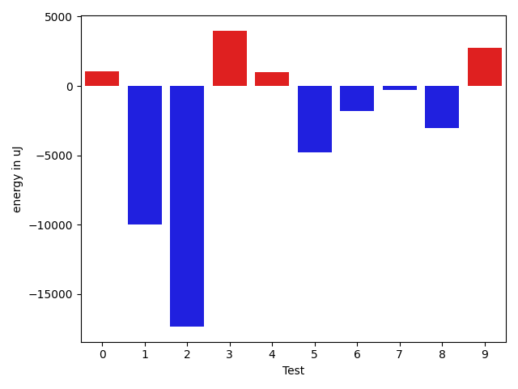

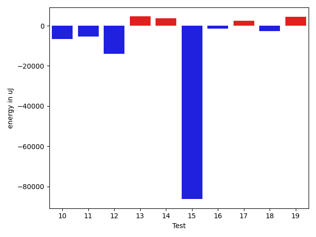

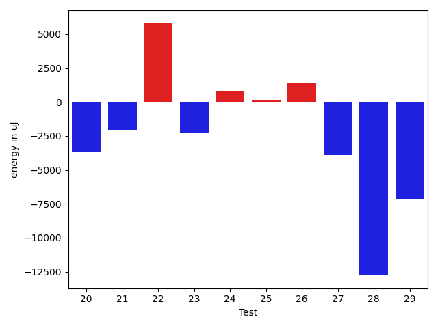

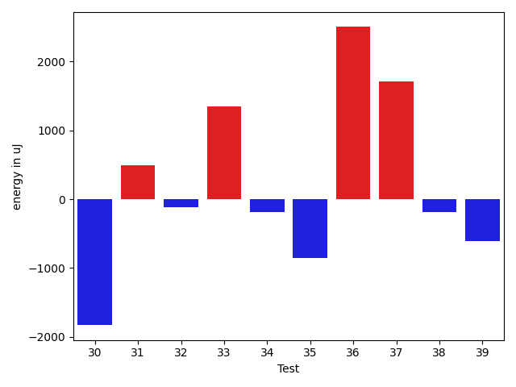

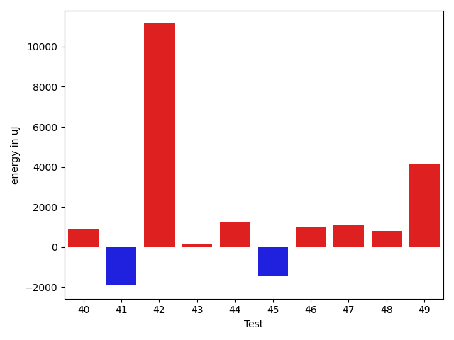

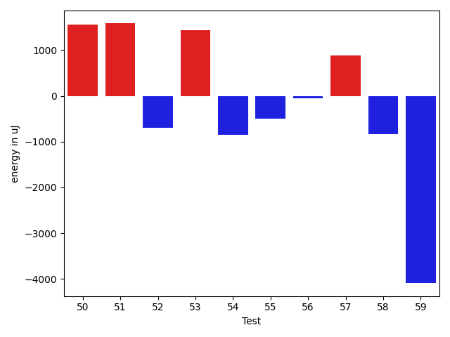

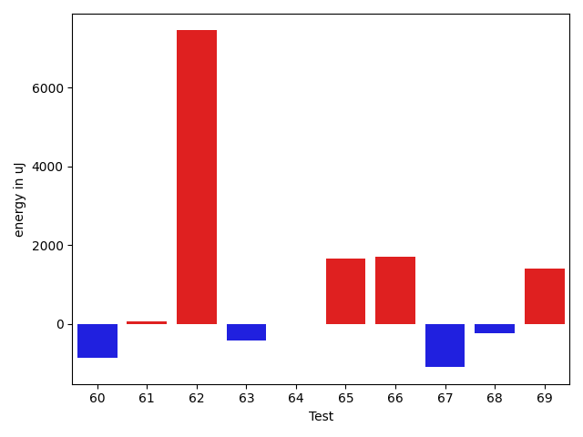

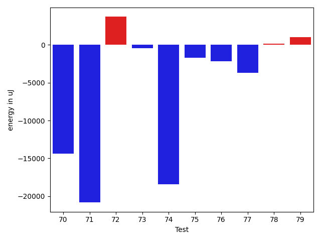

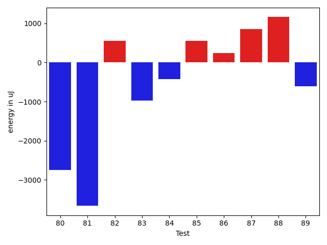

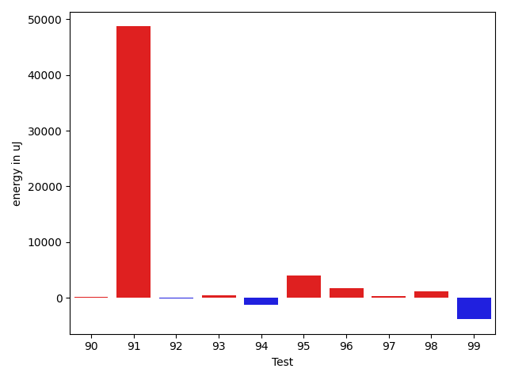

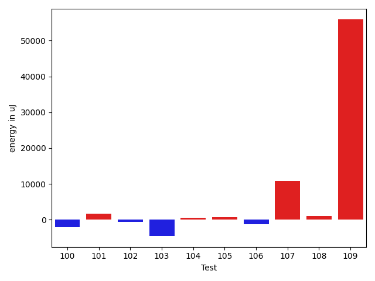

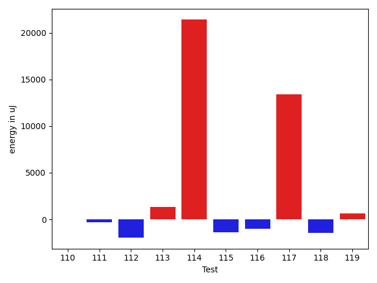

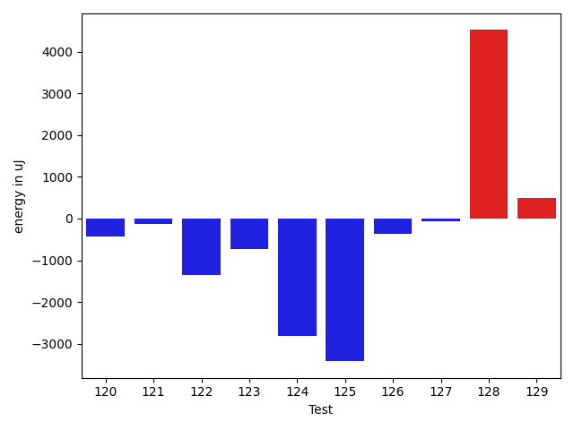

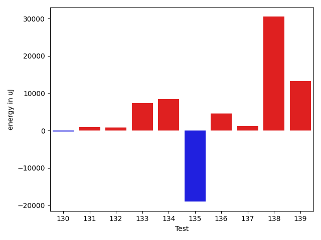

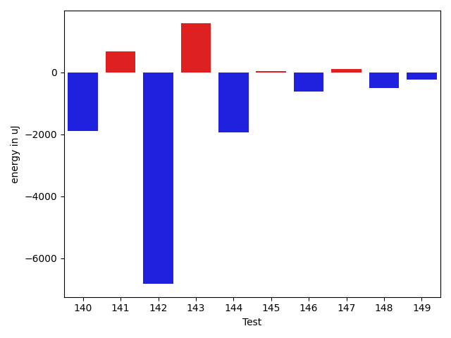

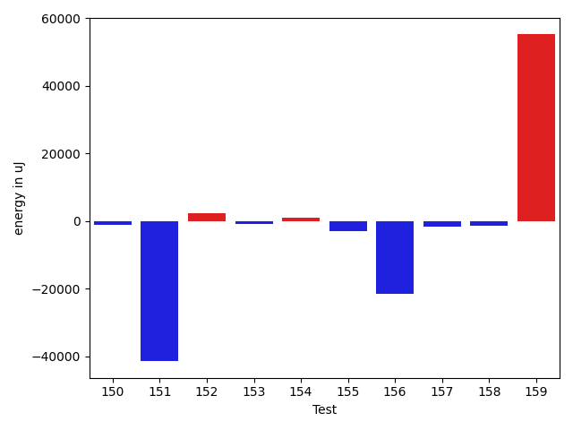

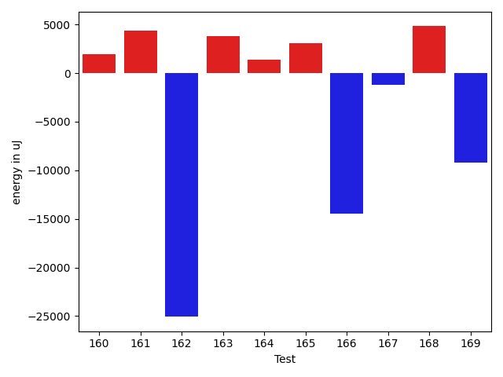

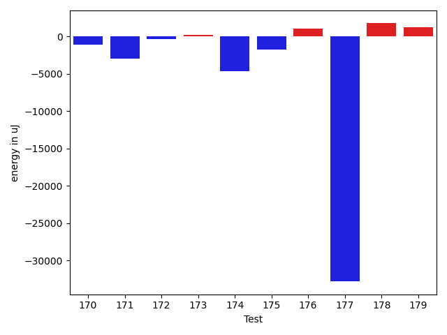

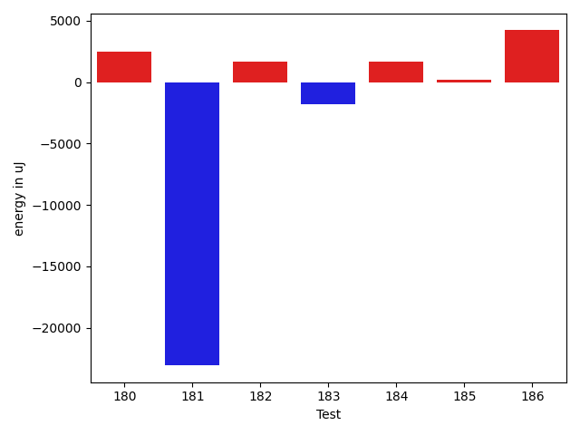

| ID | EnergyV1 | EnergyV2 | DeltaEnergy | σV1 | σV2 |
| --- | --- | --- | --- | --- | --- |
| 0 | 35644 | 36194 | 550 | 2881.527200982146 | 3662.9985511603018 |
| 1 | 38879 | 37292 | -1587 | 34991.67684065875 | 3932.9474759890822 |
| 2 | 40894 | 41626 | 732 | 105175.41136179723 | 46719.888367406485 |
| 3 | 35461 | 35827 | 366 | 4328.623184845127 | 23674.87959764448 |
| 4 | 34912 | 36255 | 1343 | 10018.614964551782 | 8920.73385139922 |
| 5 | 37720 | 36133 | -1587 | 24270.45001583875 | 17582.275168037893 |
| 6 | 35400 | 36438 | 1038 | 18867.970349133586 | 3974.1519890462014 |
| 7 | 34851 | 35217 | 366 | 6844.375808919235 | 4360.941231143525 |
| 8 | 70374 | 40649 | -29725 | 56425.04200309137 | 62880.86661934614 |
| 9 | 37597 | 37292 | -305 | 3788.0165763880173 | 12813.566297960228 |
| 10 | 38391 | 36255 | -2136 | 26449.078657110156 | 7507.893856270531 |
| 11 | 38819 | 35949 | -2870 | 41601.34623560156 | 51298.51720736378 |
| 12 | 38268 | 36865 | -1403 | 82737.28863491482 | 48098.614841870425 |
| 13 | 36010 | 37109 | 1099 | 3812.974892345425 | 26025.157280652253 |
| 14 | 35889 | 37780 | 1891 | 13746.912614971969 | 24712.943605915018 |
| 15 | 37903 | 38635 | 732 | 414802.9403769804 | 5633.918467409662 |
| 16 | 39795 | 40161 | 366 | 69240.79122328767 | 56035.700767487666 |
| 17 | 37414 | 39124 | 1710 | 9970.932819795498 | 13003.684816449357 |
| 18 | 37293 | 36072 | -1221 | 70644.9091823069 | 72235.17644063721 |
| 19 | 36560 | 37903 | 1343 | 4366.336166703287 | 12981.53989414363 |
| 20 | 38025 | 36744 | -1281 | 12607.87310516043 | 9920.57817192658 |
| 21 | 36499 | 36621 | 122 | 11707.340925288814 | 10149.715860286147 |
| 22 | 63232 | 66772 | 3540 | 90708.588165533 | 94911.57255674234 |
| 23 | 37415 | 36255 | -1160 | 13910.140868463406 | 12354.312306158557 |
| 24 | 38697 | 37537 | -1160 | 21448.00870636998 | 21854.82684639173 |
| 25 | 37354 | 36315 | -1039 | 4013.8836628845634 | 3857.757583785572 |
| 26 | 36133 | 36315 | 182 | 12207.768392432086 | 13876.940578251635 |
| 27 | 37415 | 37170 | -245 | 113419.58574442731 | 89289.24831221423 |
| 28 | 36804 | 37598 | 794 | 87051.14743752875 | 58249.45912171738 |
| 29 | 35400 | 34424 | -976 | 53397.34506020208 | 26054.705128999944 |
| 30 | 36804 | 34973 | -1831 | 18708.015147408845 | 14772.75117265034 |
| 31 | 34607 | 35095 | 488 | 7321.3633733450115 | 3785.4904434092628 |
| 32 | 34119 | 33997 | -122 | 3811.524640874107 | 26323.96929884784 |
| 33 | 33936 | 35279 | 1343 | 3602.6057874590992 | 3336.252701759865 |
| 34 | 34668 | 34485 | -183 | 6418.226095780879 | 20442.06200746254 |
| 35 | 37110 | 36255 | -855 | 18262.122282967746 | 28399.0077187152 |
| 36 | 35339 | 37842 | 2503 | 101452.2897270798 | 138621.9522620916 |
| 37 | 34302 | 36011 | 1709 | 4348.460958236387 | 4164.337387731453 |
| 38 | 34546 | 34363 | -183 | 3602.7661977676494 | 3493.709764458008 |
| 39 | 36072 | 35462 | -610 | 13500.988168853057 | 12645.87380882381 |
| 40 | 34423 | 35278 | 855 | 3348.0245990826797 | 3444.6479782722176 |
| 41 | 36133 | 33386 | -2747 | 3565.909971701226 | 3096.4922893386774 |
| 42 | 34119 | 34973 | 854 | 3111.866422659982 | 65794.15478456719 |
| 43 | 35034 | 35279 | 245 | 7040.878259611274 | 6581.292074635602 |
| 44 | 33020 | 34607 | 1587 | 3425.224324547137 | 3369.518095986973 |
| 45 | 34607 | 33753 | -854 | 9958.067881476605 | 3143.4690979891143 |
| 46 | 33630 | 34607 | 977 | 3718.0584845993408 | 3455.1457346784678 |
| 47 | 34729 | 35828 | 1099 | 3219.61439783529 | 4127.509695026933 |
| 48 | 34363 | 34546 | 183 | 2888.5598727646197 | 3038.000751433832 |
| 49 | 34241 | 34668 | 427 | 3041.7794699487426 | 25450.601576167963 |
| 50 | 32043 | 34301 | 2258 | 2918.168262964618 | 3577.7270372171306 |
| 51 | 34119 | 36193 | 2074 | 2838.4254948017956 | 3683.973129873004 |
| 52 | 36498 | 36621 | 123 | 15863.001968370323 | 17508.64497912097 |
| 53 | 34546 | 34851 | 305 | 3201.733011087232 | 3888.219800550286 |
| 54 | 34790 | 33692 | -1098 | 2963.790290976892 | 3323.859788889082 |
| 55 | 34485 | 34424 | -61 | 5603.110647197723 | 3404.944539305148 |
| 56 | 34974 | 34057 | -917 | 2804.9752727274167 | 3167.8456965954033 |
| 57 | 34057 | 34363 | 306 | 3693.8243473629873 | 3087.7882425253456 |
| 58 | 35766 | 35705 | -61 | 6816.4155368279935 | 3379.3175102320492 |
| 59 | 34790 | 33935 | -855 | 26605.191985332276 | 4369.272906029941 |
| 60 | 35889 | 35034 | -855 | 2910.131171415174 | 3584.480436804831 |
| 61 | 35462 | 35523 | 61 | 7763.150161718567 | 7920.586787702249 |
| 62 | 76294 | 83740 | 7446 | 108868.41043133553 | 102183.98760764548 |
| 63 | 37293 | 36865 | -428 | 3061.1637416237804 | 3157.8750208803385 |
| 64 | 35767 | 35767 | 0 | 4091.5234121561894 | 5009.195761667828 |
| 65 | 37048 | 38696 | 1648 | 13826.648670241551 | 16899.831201688507 |
| 66 | 37537 | 39246 | 1709 | 65028.25890395626 | 70827.45219077065 |
| 67 | 36255 | 35156 | -1099 | 3946.9733660569527 | 4138.967493650416 |
| 68 | 36865 | 36621 | -244 | 3520.2681477550495 | 4800.413862143892 |
| 69 | 35461 | 36865 | 1404 | 2490.389671035439 | 3589.8197600606945 |
| 70 | 64636 | 60913 | -3723 | 54368.32379514795 | 40897.2377972143 |
| 71 | 39002 | 37171 | -1831 | 82738.45885888886 | 51040.21471905917 |
| 72 | 35767 | 35278 | -489 | 7161.314627860657 | 30489.440751890463 |
| 73 | 35767 | 37048 | 1281 | 4511.310971355456 | 3645.2277337320406 |
| 74 | 36987 | 35461 | -1526 | 86113.8793299328 | 61388.36302759471 |
| 75 | 35645 | 34790 | -855 | 12759.947489957905 | 11146.952633042336 |
| 76 | 35705 | 34851 | -854 | 3659.252861422196 | 3355.7562715720305 |
| 77 | 36926 | 37414 | 488 | 26786.43221196191 | 16146.499964033743 |
| 78 | 36682 | 35400 | -1282 | 3990.96505872953 | 3785.56490870313 |
| 79 | 34546 | 35889 | 1343 | 3499.8749974977163 | 3700.6473724775956 |
| 80 | 37109 | 34363 | -2746 | 4093.515260445477 | 3367.512543168186 |
| 81 | 37232 | 33569 | -3663 | 3405.6922188882427 | 4992.141413261447 |
| 82 | 38086 | 38635 | 549 | 16439.460625041505 | 23887.505045237882 |
| 83 | 36133 | 35156 | -977 | 3954.0668480551626 | 3798.5416859956813 |
| 84 | 36926 | 36499 | -427 | 3036.0996488988476 | 3625.7104411285504 |
| 85 | 36865 | 37414 | 549 | 25066.869409746847 | 33374.64086053777 |
| 86 | 37903 | 38146 | 243 | 36695.542713417635 | 58054.866998811915 |
| 87 | 36621 | 37475 | 854 | 6201.568157247616 | 4741.715646693935 |
| 88 | 34973 | 36133 | 1160 | 3423.462578251931 | 5333.224432561652 |
| 89 | 35705 | 35096 | -609 | 3195.173203345165 | 3401.796417210957 |
| 90 | 35156 | 35034 | -122 | 4113.783395658691 | 3614.7025385680854 |
| 91 | 38513 | 38147 | -366 | 268150.1625566251 | 413006.55926788354 |
| 92 | 35828 | 35705 | -123 | 10200.485470118914 | 10520.217151563269 |
| 93 | 34668 | 34546 | -122 | 5690.2262370482595 | 5811.154488122895 |
| 94 | 34668 | 34607 | -61 | 7763.105566102462 | 3819.3066613279293 |
| 95 | 92591 | 86609 | -5982 | 64749.32184230082 | 78556.20806065484 |
| 96 | 69702 | 70617 | 915 | 26916.789622070843 | 24605.472228393774 |
| 97 | 35888 | 35889 | 1 | 11747.216250115622 | 12815.324081980025 |
| 98 | 34668 | 35827 | 1159 | 65986.93579331151 | 72912.63494388491 |
| 99 | 63720 | 67261 | 3541 | 41768.89928710793 | 29533.10368207194 |
| 100 | 36804 | 36682 | -122 | 21286.614444428313 | 14516.656863006256 |
| 101 | 68054 | 70984 | 2930 | 37304.762187773544 | 37811.37541433266 |
| 102 | 35522 | 34973 | -549 | 10417.662680439258 | 10389.155306224038 |
| 103 | 35462 | 34424 | -1038 | 22610.87895125596 | 3390.066925006983 |
| 104 | 35950 | 36011 | 61 | 10119.349186517758 | 11097.650737381442 |
| 105 | 33814 | 34424 | 610 | 3201.0745666366392 | 3986.9638217092584 |
| 106 | 35827 | 34363 | -1464 | 2465.5917597249513 | 3149.8118080774057 |
| 107 | 72265 | 72510 | 245 | 23843.071719540694 | 36156.42465286916 |
| 108 | 34179 | 35644 | 1465 | 4470.471750122022 | 3575.948577500549 |
| 109 | 75562 | 83557 | 7995 | 213733.84084531962 | 323534.92545432004 |
| 110 | 35522 | 35645 | 123 | 3863.2828238938428 | 3929.3894650272364 |
| 111 | 35035 | 35401 | 366 | 4343.507270961171 | 3793.228305493884 |
| 112 | 36438 | 35034 | -1404 | 4102.90841284989 | 3945.6734501484802 |
| 113 | 34302 | 36865 | 2563 | 4740.558048570088 | 3406.9896145128528 |
| 114 | 36560 | 36255 | -305 | 44989.233181393196 | 76529.93718028191 |
| 115 | 35462 | 34241 | -1221 | 4333.009756148144 | 3820.0116972390842 |
| 116 | 34363 | 34729 | 366 | 8336.47810441883 | 6475.311215061407 |
| 117 | 121399 | 114806 | -6593 | 157549.70675694544 | 261423.7849882124 |
| 118 | 37048 | 34668 | -2380 | 3568.554175529088 | 4304.017509899918 |
| 119 | 36499 | 37476 | 977 | 3887.5685060058927 | 6484.914535006839 |
| 120 | 35949 | 35523 | -426 | 8687.344101147615 | 4178.8273270571235 |
| 121 | 37720 | 37598 | -122 | 68508.98546040995 | 61210.7585450072 |
| 122 | 37842 | 36498 | -1344 | 25812.633399935654 | 33906.17885941456 |
| 123 | 36316 | 35583 | -733 | 3932.9252468636314 | 4622.414388366515 |
| 124 | 39306 | 36499 | -2807 | 468766.02151770616 | 373699.2706961048 |
| 125 | 38940 | 35522 | -3418 | 21902.62592527382 | 4516.901567815413 |
| 126 | 37048 | 36682 | -366 | 14392.809237746696 | 24882.949038155202 |
| 127 | 34668 | 34606 | -62 | 4112.138507410984 | 4636.8674743537695 |
| 128 | 78613 | 83130 | 4517 | 31216.85452628194 | 23628.020339114264 |
| 129 | 36133 | 36621 | 488 | 4633.560490788839 | 8008.292694861776 |
| 130 | 36682 | 36316 | -366 | 4415.216583202236 | 3425.0274410750644 |
| 131 | 36194 | 36926 | 732 | 13639.601224074508 | 14531.819388584914 |
| 132 | 34790 | 35767 | 977 | 3741.6218496950905 | 3750.688323900973 |
| 133 | 37658 | 38391 | 733 | 53340.91937778182 | 69536.5513241362 |
| 134 | 218017 | 214782 | -3235 | 72112.6158038287 | 93278.6670014259 |
| 135 | 345702 | 321655 | -24047 | 116992.95996585474 | 122319.28455482097 |
| 136 | 38269 | 39673 | 1404 | 63253.60646391885 | 65286.71489349837 |
| 137 | 35340 | 38147 | 2807 | 3973.9663000829546 | 3059.213890881984 |
| 138 | 40039 | 60730 | 20691 | 48311.3778713034 | 68346.15483621959 |
| 139 | 37476 | 38330 | 854 | 10127.164611711529 | 36511.33617360809 |
| 140 | 38697 | 38330 | -367 | 69536.73899377859 | 66385.32526230029 |
| 141 | 35095 | 35339 | 244 | 3965.983646747102 | 4597.8143859338215 |
| 142 | 37415 | 35522 | -1893 | 51061.14408208152 | 34811.28298325128 |
| 143 | 34424 | 36255 | 1831 | 3670.0861965494432 | 7572.940430405428 |
| 144 | 40161 | 39978 | -183 | 55327.4196664411 | 48663.32689623676 |
| 145 | 34302 | 34302 | 0 | 3611.996740781805 | 3398.9740116631656 |
| 146 | 36927 | 37109 | 182 | 9800.628216295125 | 9289.549241236538 |
| 147 | 35340 | 35523 | 183 | 6412.22365926205 | 3744.2783579780335 |
| 148 | 37292 | 38391 | 1099 | 13346.614309587616 | 10983.989836917184 |
| 149 | 35644 | 35766 | 122 | 4250.377041093296 | 3600.83322768408 |
| 150 | 38208 | 35766 | -2442 | 6257.123926174068 | 6363.196314733952 |
| 151 | 39184 | 36499 | -2685 | 317397.1222399056 | 240117.49772157863 |
| 152 | 37048 | 36560 | -488 | 42082.19969748118 | 55300.454986097306 |
| 153 | 35583 | 36865 | 1282 | 45464.84717576117 | 46875.71402461471 |
| 154 | 35095 | 36255 | 1160 | 3696.200429402743 | 3897.7597071175474 |
| 155 | 38024 | 36865 | -1159 | 14043.68818397054 | 10639.100768995444 |
| 156 | 38086 | 37720 | -366 | 67756.65892837252 | 36254.15750374998 |
| 157 | 37109 | 35644 | -1465 | 5593.322660224201 | 4355.72241480342 |
| 158 | 37171 | 36499 | -672 | 4409.0779037589955 | 3909.967121553885 |
| 159 | 39551 | 39246 | -305 | 381130.73669080494 | 542947.8188709074 |
| 160 | 38208 | 37841 | -367 | 13278.040553176073 | 16612.21202152994 |
| 161 | 38940 | 38575 | -365 | 44379.97478386382 | 47821.29537229647 |
| 162 | 72876 | 67993 | -4883 | 88130.85406371213 | 66068.43679639236 |
| 163 | 36804 | 35461 | -1343 | 17761.252421571135 | 25579.8833087378 |
| 164 | 36194 | 38513 | 2319 | 4038.665391602617 | 3621.9681149218036 |
| 165 | 38940 | 39001 | 61 | 35210.74199129977 | 42667.634297684555 |
| 166 | 37781 | 37476 | -305 | 82658.52511553383 | 51923.215335993234 |
| 167 | 36377 | 35522 | -855 | 3747.8383937019116 | 3641.1699939107775 |
| 168 | 38391 | 40345 | 1954 | 17740.075786743997 | 18739.840864505997 |
| 169 | 37598 | 37841 | 243 | 76250.42039249184 | 52759.03939475342 |
| 170 | 36499 | 34912 | -1587 | 6509.287298032589 | 3718.3542843163523 |
| 171 | 37964 | 38147 | 183 | 31748.470323345708 | 24481.593866492894 |
| 172 | 35034 | 35156 | 122 | 3414.6543615770047 | 3375.6278841407216 |
| 173 | 37537 | 36866 | -671 | 9593.867839232864 | 15064.3575242268 |
| 174 | 79529 | 77026 | -2503 | 62859.51509926759 | 67437.63173825307 |
| 175 | 38513 | 38330 | -183 | 56453.19050262528 | 48279.66797095083 |
| 176 | 37719 | 38696 | 977 | 4132.767234886509 | 4390.8750816007305 |
| 177 | 37903 | 37536 | -367 | 519370.1395455777 | 425481.6459842317 |
| 178 | 37048 | 38269 | 1221 | 3736.3376541896882 | 2996.310033642769 |
| 179 | 34973 | 37231 | 2258 | 4452.474530671792 | 4365.61461130541 |
| 180 | 37170 | 36987 | -183 | 10059.310698615105 | 11508.76926521685 |
| 181 | 38635 | 37170 | -1465 | 84273.47290868827 | 11926.956196421726 |
| 182 | 36377 | 37659 | 1282 | 12115.063533912109 | 12451.4923369965 |
| 183 | 38758 | 38208 | -550 | 28214.462447726146 | 29686.17755705063 |
| 184 | 35644 | 36683 | 1039 | 4067.2926768316374 | 4555.30607688239 |
| 185 | 36988 | 37659 | 671 | 2984.720194591111 | 4425.832702566954 |
| 186 | 37049 | 39551 | 2502 | 22480.71972300872 | 24727.984588824555 |

## Delta Duration per test method

| ID | DurationV1 | DurationsV2 | DeltaDuration |
| --- | --- | --- | --- |
| 0 | 358769.9 | 460319.8333333333 | 101549.93333333329 |
| 1 | 967735.0 | 417401.73333333334 | -550333.2666666666 |
| 2 | 2307845.574712644 | 1775986.0425531915 | -531859.5321594523 |
| 3 | 915669.0161290322 | 1049543.0185185184 | 133874.00238948618 |
| 4 | 1044976.8421052631 | 981938.3333333334 | -63038.50877192977 |
| 5 | 1352584.7142857143 | 1267541.2911392406 | -85043.42314647371 |
| 6 | 1050326.5576923077 | 843613.4339622641 | -206713.12373004365 |
| 7 | 787128.3095238095 | 736097.9318181818 | -51030.3777056277 |
| 8 | 2116938.871794872 | 1998306.92 | -118631.95179487206 |
| 9 | 641880.3333333334 | 683679.2 | 41798.86666666658 |
| 10 | 817282.1 | 571705.6363636364 | -245576.46363636362 |
| 11 | 1360019.16 | 1274259.9310344828 | -85759.22896551713 |
| 12 | 1411934.2105263157 | 1043576.75 | -368357.4605263157 |
| 13 | 597980.2258064516 | 698587.3947368421 | 100607.1689303905 |
| 14 | 912778.1372549019 | 991262.9777777778 | 78484.8405228759 |
| 15 | 3053774.9791666665 | 845813.2978723404 | -2207961.681294326 |
| 16 | 2041448.0 | 2105941.6868686867 | 64493.686868686695 |
| 17 | 933937.6875 | 913105.3666666667 | -20832.320833333302 |
| 18 | 1755161.1666666667 | 1756835.2419354839 | 1674.0752688171342 |
| 19 | 719147.303030303 | 877501.0952380953 | 158353.79220779228 |
| 20 | 998712.2857142857 | 1026524.1224489796 | 27811.836734693963 |
| 21 | 1013295.0476190476 | 1006214.6708860759 | -7080.376732971636 |
| 22 | 2641883.1224489794 | 2747320.737373737 | 105437.61492475774 |
| 23 | 988826.5454545454 | 1111931.9795918367 | 123105.43413729127 |
| 24 | 1441803.8064516129 | 1484615.8412698412 | 42812.034818228334 |
| 25 | 610595.6153846154 | 595839.75 | -14755.865384615376 |
| 26 | 1142051.6666666667 | 1131626.394736842 | -10425.271929824725 |
| 27 | 1692008.875 | 1751967.8709677418 | 59958.99596774182 |
| 28 | 1708634.3170731708 | 1364751.8409090908 | -343882.47616407997 |
| 29 | 1662511.487804878 | 1374153.8333333333 | -288357.6544715448 |
| 30 | 1395459.6744186047 | 1365898.7976190476 | -29560.876799557125 |
| 31 | 662798.7142857143 | 728713.4857142858 | 65914.77142857143 |
| 32 | 596891.3448275862 | 764670.7142857143 | 167779.36945812812 |
| 33 | 501773.94736842107 | 434524.65 | -67249.29736842104 |
| 34 | 978995.6883116884 | 1098368.84375 | 119373.15543831163 |
| 35 | 1566086.0531914893 | 1649556.894736842 | 83470.84154535271 |
| 36 | 1571771.4146341463 | 2843198.88 | 1271427.4653658536 |
| 37 | 772298.7142857143 | 649759.1944444445 | -122539.51984126982 |
| 38 | 844459.0 | 819972.0384615385 | -24486.961538461503 |
| 39 | 1190352.5428571429 | 1119249.1527777778 | -71103.39007936511 |
| 40 | 742762.6046511628 | 733061.7045454546 | -9700.900105708162 |
| 41 | 498982.0689655172 | 453956.7272727273 | -45025.34169278992 |
| 42 | 675253.0256410256 | 1022359.3170731707 | 347106.29143214505 |
| 43 | 835354.1555555556 | 790244.7872340425 | -45109.36832151306 |
| 44 | 611309.7857142857 | 562079.0571428571 | -49230.72857142857 |
| 45 | 816308.8510638297 | 685030.8163265307 | -131278.03473729908 |
| 46 | 604658.6129032258 | 630709.5483870967 | 26050.93548387091 |
| 47 | 681642.7380952381 | 677614.8409090909 | -4027.8971861471655 |
| 48 | 901141.7777777778 | 859662.2280701754 | -41479.54970760236 |
| 49 | 853462.8181818182 | 1015550.3181818182 | 162087.5 |
| 50 | 530863.9629629629 | 521112.61904761905 | -9751.343915343867 |
| 51 | 577080.75 | 584512.4705882353 | 7431.720588235301 |
| 52 | 1274159.2461538462 | 1292868.0571428572 | 18708.81098901108 |
| 53 | 556647.0285714286 | 556371.9565217391 | -275.0720496894792 |
| 54 | 693867.1777777778 | 861210.0294117647 | 167342.85163398692 |
| 55 | 710852.0 | 576389.2647058824 | -134462.7352941176 |
| 56 | 541271.75 | 568582.1363636364 | 27310.386363636353 |
| 57 | 761694.5384615385 | 572345.1034482758 | -189349.43501326267 |
| 58 | 688360.5384615385 | 666542.59375 | -21817.944711538497 |
| 59 | 803798.3333333334 | 596632.6129032258 | -207165.72043010755 |
| 60 | 532498.0 | 491737.6060606061 | -40760.39393939392 |
| 61 | 745243.5294117647 | 835867.125 | 90623.5955882353 |
| 62 | 3899987.0808080807 | 3538787.8585858587 | -361199.222222222 |
| 63 | 503664.5862068966 | 572202.7 | 68538.11379310337 |
| 64 | 640422.9666666667 | 640815.71875 | 392.7520833333256 |
| 65 | 1019381.1052631579 | 977691.918367347 | -41689.18689581088 |
| 66 | 1559496.7346938776 | 1549982.857142857 | -9513.877551020589 |
| 67 | 725453.0 | 669904.7058823529 | -55548.29411764711 |
| 68 | 770871.0222222222 | 769237.1794871795 | -1633.8427350426791 |
| 69 | 597413.52 | 552437.6388888889 | -44975.88111111114 |
| 70 | 2590756.8383838385 | 2166804.0303030303 | -423952.80808080826 |
| 71 | 2039895.391304348 | 1309676.5681818181 | -730218.8231225298 |
| 72 | 832263.4102564103 | 868240.7837837838 | 35977.37352737354 |
| 73 | 460691.4285714286 | 401957.23076923075 | -58734.19780219783 |
| 74 | 1813510.8245614036 | 1326770.9122807018 | -486739.9122807018 |
| 75 | 1288718.1898734176 | 1152935.5263157894 | -135782.66355762817 |
| 76 | 660232.0 | 554628.2857142857 | -105603.71428571432 |
| 77 | 1450374.793478261 | 1348205.6875 | -102169.10597826098 |
| 78 | 493399.8 | 438285.90476190473 | -55113.895238095254 |
| 79 | 468199.26086956525 | 411154.1304347826 | -57045.13043478265 |
| 80 | 477159.75 | 507022.05555555556 | 29862.305555555562 |
| 81 | 427318.28571428574 | 500916.8 | 73598.51428571425 |
| 82 | 943211.119047619 | 1186888.9166666667 | 243677.7976190477 |
| 83 | 748811.5416666666 | 748588.8888888889 | -222.6527777777519 |
| 84 | 617803.2903225806 | 616622.4736842106 | -1180.8166383700445 |
| 85 | 1366552.0 | 1462559.4494382022 | 96007.4494382022 |
| 86 | 1110775.3548387096 | 1625927.9032258065 | 515152.54838709696 |
| 87 | 796765.4772727273 | 719711.195652174 | -77054.28162055335 |
| 88 | 563699.925925926 | 865450.5238095238 | 301750.59788359783 |
| 89 | 720253.975 | 754101.5833333334 | 33847.608333333395 |
| 90 | 569143.0 | 577048.724137931 | 7905.724137931014 |
| 91 | 2557464.518072289 | 4190873.5432098764 | 1633409.0251375875 |
| 92 | 1289043.8817204302 | 1271830.7078651686 | -17213.173855261644 |
| 93 | 1027621.3048780488 | 1029711.5662650602 | 2090.2613870113855 |
| 94 | 856038.4745762711 | 830458.1458333334 | -25580.328742937767 |
| 95 | 3204328.484848485 | 3265193.202020202 | 60864.71717171697 |
| 96 | 2292804.525252525 | 2313435.3469387754 | 20630.821686250158 |
| 97 | 1332326.9787234042 | 1330617.6804123712 | -1709.2983110330533 |
| 98 | 1698455.411111111 | 1769678.2386363635 | 71222.82752525248 |
| 99 | 2214469.393939394 | 1998949.2727272727 | -215520.12121212133 |
| 100 | 1378200.8823529412 | 1295989.9310344828 | -82210.95131845842 |
| 101 | 2412735.8282828284 | 2458781.8383838385 | 46046.01010101009 |
| 102 | 1233864.9782608696 | 1236214.2391304348 | 2349.260869565187 |
| 103 | 1110094.380952381 | 942383.4189189189 | -167710.96203346213 |
| 104 | 1225910.3977272727 | 1213426.6629213484 | -12483.734805924352 |
| 105 | 849010.0638297872 | 951041.306122449 | 102031.2422926618 |
| 106 | 474705.85714285716 | 508401.7619047619 | 33695.904761904734 |
| 107 | 2310478.8181818184 | 2573263.868686869 | 262785.05050505046 |
| 108 | 605183.3461538461 | 601133.6451612903 | -4049.700992555823 |
| 109 | 3551874.02020202 | 5091979.797979798 | 1540105.777777778 |
| 110 | 573366.1395348837 | 637223.8947368421 | 63857.75520195847 |
| 111 | 741279.9818181818 | 784068.0 | 42788.01818181819 |
| 112 | 776691.4782608695 | 590009.5909090909 | -186681.88735177857 |
| 113 | 567398.3225806452 | 567554.4375 | 156.1149193547899 |
| 114 | 1059410.0909090908 | 1781911.677419355 | 722501.5865102641 |
| 115 | 602669.9375 | 619731.6585365854 | 17061.721036585397 |
| 116 | 1036199.8909090909 | 920227.8032786886 | -115972.0876304023 |
| 117 | 4526657.6161616165 | 5128767.515151516 | 602109.8989898991 |
| 118 | 854578.0172413794 | 807547.1509433963 | -47030.8662979831 |
| 119 | 828213.0 | 770343.9318181818 | -57869.068181818235 |
| 120 | 979366.1791044776 | 896504.1186440678 | -82862.06046040985 |
| 121 | 1442842.306122449 | 1456492.9827586208 | 13650.67663617176 |
| 122 | 1039523.3684210526 | 1386445.551724138 | 346922.1833030854 |
| 123 | 717634.5681818182 | 699569.75 | -18064.818181818235 |
| 124 | 4272246.72972973 | 3459792.02739726 | -812454.7023324696 |
| 125 | 792933.4193548387 | 606370.2 | -186563.21935483871 |
| 126 | 1010416.3833333333 | 1230019.4615384615 | 219603.0782051282 |
| 127 | 909414.5818181818 | 991187.0677966102 | 81772.48597842839 |
| 128 | 2774184.626262626 | 2795364.383838384 | 21179.7575757578 |
| 129 | 953992.2941176471 | 1028606.8064516129 | 74614.51233396574 |
| 130 | 686102.6666666666 | 699516.6304347826 | 13413.963768115966 |
| 131 | 1129837.8985507246 | 1194612.4285714286 | 64774.53002070403 |
| 132 | 644961.3636363636 | 631683.947368421 | -13277.416267942637 |
| 133 | 1874456.3636363635 | 2051755.1195652173 | 177298.75592885376 |
| 134 | 6813110.94949495 | 7106892.02020202 | 293781.07070707064 |
| 135 | 10739398.121212121 | 10155448.747474747 | -583949.3737373743 |
| 136 | 2117740.102040816 | 2161591.5555555555 | 43851.453514739405 |
| 137 | 527265.0952380953 | 492456.04545454547 | -34809.049783549795 |
| 138 | 1527906.8863636365 | 2551099.217391304 | 1023192.3310276677 |
| 139 | 619726.4074074074 | 1218110.6666666667 | 598384.2592592593 |
| 140 | 1405809.7083333333 | 1444008.0476190476 | 38198.33928571432 |
| 141 | 631830.3888888889 | 655019.7 | 23189.311111111077 |
| 142 | 1068007.1904761905 | 969410.15 | -98597.04047619051 |
| 143 | 692504.4186046511 | 731108.9333333333 | 38604.51472868223 |
| 144 | 1239011.2413793104 | 1128702.15 | -110309.09137931047 |
| 145 | 602965.1481481482 | 750930.8518518518 | 147965.7037037036 |
| 146 | 1193856.917808219 | 1124601.5384615385 | -69255.3793466806 |
| 147 | 878158.6 | 837301.0869565217 | -40857.51304347825 |
| 148 | 1064072.111111111 | 1062024.85 | -2047.2611111109145 |
| 149 | 636084.1282051282 | 618320.1875 | -17763.940705128247 |
| 150 | 745014.75 | 751913.1041666666 | 6898.354166666628 |
| 151 | 3316599.512820513 | 1758679.1136363635 | -1557920.3991841495 |
| 152 | 1196090.261904762 | 1085818.475 | -110271.7869047618 |
| 153 | 1005977.641025641 | 893064.3571428572 | -112913.28388278384 |
| 154 | 702768.3513513514 | 633884.9411764706 | -68883.41017488076 |
| 155 | 867332.28125 | 778559.1944444445 | -88773.0868055555 |
| 156 | 1750389.0740740742 | 901029.195652174 | -849359.8784219002 |
| 157 | 1005000.6964285715 | 922086.5 | -82914.19642857148 |
| 158 | 869904.3214285715 | 873214.8518518518 | 3310.5304232803173 |
| 159 | 3130577.971830986 | 4845703.581081081 | 1715125.6092500952 |
| 160 | 1210523.5897435897 | 1331524.013888889 | 121000.42414529924 |
| 161 | 1516123.6166666667 | 1634323.7758620689 | 118200.15919540217 |
| 162 | 3112107.8181818184 | 2403995.588235294 | -708112.2299465244 |
| 163 | 591226.8571428572 | 712455.8947368421 | 121229.03759398498 |
| 164 | 403073.5882352941 | 341697.5 | -61376.0882352941 |
| 165 | 1543769.90625 | 1531158.2307692308 | -12611.675480769249 |
| 166 | 1802077.1492537314 | 1274217.1186440678 | -527860.0306096636 |
| 167 | 520191.22857142857 | 534873.3846153846 | 14682.156043956056 |
| 168 | 1468224.319148936 | 1595719.9569892474 | 127495.63784031128 |
| 169 | 1602681.2545454546 | 1353105.8392857143 | -249575.41525974032 |
| 170 | 889667.5769230769 | 922422.8235294118 | 32755.246606334927 |
| 171 | 1149895.8372093022 | 1138069.5853658537 | -11826.251843448495 |
| 172 | 686331.5862068966 | 719029.7894736842 | 32698.203266787576 |
| 173 | 734909.6333333333 | 725623.9210526316 | -9285.71228070173 |
| 174 | 2929332.616161616 | 2749206.4545454546 | -180126.16161616147 |
| 175 | 1401058.7857142857 | 1465166.0 | 64107.21428571432 |
| 176 | 623193.1923076923 | 951694.3 | 328501.1076923078 |
| 177 | 4420985.980769231 | 3805918.9393939395 | -615067.0413752915 |
| 178 | 472388.95454545453 | 477820.9583333333 | 5432.003787878784 |
| 179 | 614866.9090909091 | 526297.7096774194 | -88569.19941348967 |
| 180 | 718581.6206896552 | 828975.3409090909 | 110393.72021943575 |
| 181 | 1501464.2894736843 | 815199.0 | -686265.2894736843 |
| 182 | 864112.0370370371 | 818428.7894736842 | -45683.247563352925 |
| 183 | 1184029.9607843137 | 1136089.1698113207 | -47940.79097299301 |
| 184 | 370959.0909090909 | 384144.14285714284 | 13185.051948051958 |
| 185 | 355499.5 | 514103.0 | 158603.5 |
| 186 | 1239311.6530612244 | 1350236.4761904762 | 110924.82312925183 |

## Misc.

| ID | Test Class | Test Method |
| --- | --- | --- |
| 0 | com.google.gson.InnerClassExclusionStrategyTest | testExcludeInnerClassField |
| 1 | com.google.gson.InnerClassExclusionStrategyTest | testIncludeStaticNestedClassField |
| 2 | com.google.gson.functional.CustomDeserializerTest | testDefaultConstructorNotCalledOnObject |
| 3 | com.google.gson.functional.CustomDeserializerTest | testCustomDeserializerReturnsNullForArrayElementsForArrayField |
| 4 | com.google.gson.functional.CustomDeserializerTest | testCustomDeserializerReturnsNull |
| 5 | com.google.gson.functional.CustomDeserializerTest | testJsonTypeFieldBasedDeserialization |
| 6 | com.google.gson.functional.CustomDeserializerTest | testCustomDeserializerReturnsNullForPrimitiveFields |
| 7 | com.google.gson.functional.CustomDeserializerTest | testDefaultConstructorNotCalledOnField |
| 8 | com.google.gson.ExposeAnnotationSerializationExclusionStrategyTest | testSkipExplicitlySkippedFields |
| 9 | com.google.gson.ExposeAnnotationSerializationExclusionStrategyTest | testSkipNonAnnotatedFields |
| 10 | com.google.gson.ExposeAnnotationSerializationExclusionStrategyTest | testNeverSkipExplicitlyExposedAnnotatedFields |
| 11 | com.google.gson.ExposeAnnotationSerializationExclusionStrategyTest | testNeverSkipExposedAnnotatedFields |
| 12 | com.google.gson.functional.InterfaceTest | testSerializingObjectImplementingInterface |
| 13 | com.google.gson.functional.InterfaceTest | testSerializingInterfaceObjectField |
| 14 | com.google.gson.FunctionWithInternalDependenciesTest | testUserDefinedExclusionPolicies |
| 15 | com.google.gson.FunctionWithInternalDependenciesTest | testAnonymousLocalClassesSerialization |
| 16 | com.google.gson.functional.CircularReferenceTest | testCircularSerialization |
| 17 | com.google.gson.functional.CircularReferenceTest | testSelfReferenceSerialization |
| 18 | com.google.gson.functional.CircularReferenceTest | testDirectedAcyclicGraphDeserialization |
| 19 | com.google.gson.functional.CircularReferenceTest | testSelfReferenceArrayFieldSerialization |
| 20 | com.google.gson.functional.CircularReferenceTest | testDirectedAcyclicGraphSerialization |
| 21 | com.google.gson.functional.PrettyPrintingTest | testEmptyMapField |
| 22 | com.google.gson.functional.PrettyPrintingTest | testPrettyPrintList |
| 23 | com.google.gson.functional.PrettyPrintingTest | testPrettyPrintArrayOfObjects |
| 24 | com.google.gson.functional.MapTest | testMapSerializationWithNullValues |
| 25 | com.google.gson.functional.MapTest | testMapSerializationWithNullValuesSerialized |
| 26 | com.google.gson.functional.ReadersWritersTest | testReadWriteTwoObjects |
| 27 | com.google.gson.functional.ReadersWritersTest | testWriterForSerialization |
| 28 | com.google.gson.functional.ReadersWritersTest | testReaderForDeserialization |
| 29 | com.google.gson.functional.ObjectTest | testEmptyCollectionInAnObjectDeserialization |
| 30 | com.google.gson.functional.ObjectTest | testArrayOfArraysDeserialization |
| 31 | com.google.gson.functional.ObjectTest | testClassWithTransientFieldsDeserialization |
| 32 | com.google.gson.functional.ObjectTest | testClassWithTransientFieldsDeserializationTransientFieldsPassedInJsonAreIgnored |
| 33 | com.google.gson.functional.ObjectTest | testPrimitiveArrayFieldSerialization |
| 34 | com.google.gson.functional.ObjectTest | testArrayOfObjectsDeserialization |
| 35 | com.google.gson.functional.ObjectTest | testArrayOfArraysSerialization |
| 36 | com.google.gson.functional.ObjectTest | testJsonInSingleQuotesDeserialization |
| 37 | com.google.gson.functional.ObjectTest | testJsonInMixedQuotesDeserialization |
| 38 | com.google.gson.functional.ObjectTest | testInnerClassDeserialization |
| 39 | com.google.gson.functional.ObjectTest | testArrayOfObjectsAsFields |
| 40 | com.google.gson.functional.ObjectTest | testInnerClassSerialization |
| 41 | com.google.gson.functional.ObjectTest | testClassWithObjectFieldSerialization |
| 42 | com.google.gson.functional.ObjectTest | testBagOfPrimitivesDeserialization |
| 43 | com.google.gson.functional.ObjectTest | testNestedSerialization |
| 44 | com.google.gson.functional.ObjectTest | testPrivateNoArgConstructorDeserialization |
| 45 | com.google.gson.functional.ObjectTest | testPrimitiveArrayInAnObjectDeserialization |
| 46 | com.google.gson.functional.ObjectTest | testEmptyCollectionInAnObjectSerialization |
| 47 | com.google.gson.functional.ObjectTest | testBagOfPrimitiveWrappersSerialization |
| 48 | com.google.gson.functional.ObjectTest | testNestedDeserialization |
| 49 | com.google.gson.functional.ObjectTest | testArrayOfObjectsSerialization |
| 50 | com.google.gson.functional.ObjectTest | testStringFieldWithEmptyValueDeserialization |
| 51 | com.google.gson.functional.ObjectTest | testNullFieldsSerialization |
| 52 | com.google.gson.functional.ObjectTest | testStringFieldWithNumberValueDeserialization |
| 53 | com.google.gson.functional.ObjectTest | testStringFieldWithEmptyValueSerialization |
| 54 | com.google.gson.functional.ObjectTest | testNullFieldsDeserialization |
| 55 | com.google.gson.functional.ObjectTest | testNullPrimitiveFieldsDeserialization |
| 56 | com.google.gson.functional.ObjectTest | testNullArraysDeserialization |
| 57 | com.google.gson.functional.ObjectTest | testObjectFieldNamesWithoutQuotesDeserialization |
| 58 | com.google.gson.functional.ObjectTest | testBagOfPrimitivesSerialization |
| 59 | com.google.gson.functional.ObjectTest | testBagOfPrimitiveWrappersDeserialization |
| 60 | com.google.gson.functional.ObjectTest | testNullObjectFieldsDeserialization |
| 61 | com.google.gson.functional.ObjectTest | testClassWithTransientFieldsSerialization |
| 62 | com.google.gson.functional.ExposeFieldsTest | testNullExposeFieldSerialization |
| 63 | com.google.gson.functional.ExposeFieldsTest | testNoExposedFieldSerialization |
| 64 | com.google.gson.functional.ExposeFieldsTest | testExposedInterfaceFieldDeserialization |
| 65 | com.google.gson.functional.ExposeFieldsTest | testArrayWithOneNullExposeFieldObjectSerialization |
| 66 | com.google.gson.functional.ExposeFieldsTest | testExposeAnnotationDeserialization |
| 67 | com.google.gson.functional.ExposeFieldsTest | testExposedInterfaceFieldSerialization |
| 68 | com.google.gson.functional.ExposeFieldsTest | testNoExposedFieldDeserialization |
| 69 | com.google.gson.functional.ExposeFieldsTest | testExposeAnnotationSerialization |
| 70 | com.google.gson.functional.InheritanceTest | testSubInterfacesOfCollectionSerialization |
| 71 | com.google.gson.functional.InheritanceTest | testBaseSerializedAsBaseWhenSpecifiedWithExplicitTypeForToJsonMethod |
| 72 | com.google.gson.functional.InheritanceTest | testClassWithBaseArrayFieldSerialization |
| 73 | com.google.gson.functional.InheritanceTest | testBaseSerializedAsSub |
| 74 | com.google.gson.functional.InheritanceTest | testSubClassDeserialization |
| 75 | com.google.gson.functional.InheritanceTest | testSubInterfacesOfCollectionDeserialization |
| 76 | com.google.gson.functional.InheritanceTest | testClassWithBaseFieldSerialization |
| 77 | com.google.gson.functional.InheritanceTest | testSubClassSerialization |
| 78 | com.google.gson.functional.InheritanceTest | testBaseSerializedAsSubWhenSpecifiedWithExplicitTypeForToJsonMethod |
| 79 | com.google.gson.functional.InheritanceTest | testBaseSerializedAsBaseWhenSpecifiedWithExplicitType |
| 80 | com.google.gson.functional.InheritanceTest | testBaseSerializedAsSubForToJsonMethod |
| 81 | com.google.gson.functional.InheritanceTest | testBaseSerializedAsSubWhenSpecifiedWithExplicitType |
| 82 | com.google.gson.functional.NullObjectAndFieldTest | testExplicitDeserializationOfNulls |
| 83 | com.google.gson.functional.NullObjectAndFieldTest | testNullWrappedPrimitiveMemberSerialization |
| 84 | com.google.gson.functional.NullObjectAndFieldTest | testExplicitNullSetsFieldToNullDuringDeserialization |
| 85 | com.google.gson.functional.NullObjectAndFieldTest | testExplicitSerializationOfNullArrayMembers |
| 86 | com.google.gson.functional.NullObjectAndFieldTest | testExplicitSerializationOfNulls |
| 87 | com.google.gson.functional.NullObjectAndFieldTest | testNullWrappedPrimitiveMemberDeserialization |
| 88 | com.google.gson.functional.NullObjectAndFieldTest | testExplicitSerializationOfNullStringMembers |
| 89 | com.google.gson.functional.NullObjectAndFieldTest | testPrintPrintingObjectWithNulls |
| 90 | com.google.gson.functional.NullObjectAndFieldTest | testExplicitSerializationOfNullCollectionMembers |
| 91 | com.google.gson.JsonParserTest | testReadWriteTwoObjects |
| 92 | com.google.gson.functional.ParameterizedTypesTest | testVariableTypeArrayDeserialization |
| 93 | com.google.gson.functional.ParameterizedTypesTest | testParameterizedTypeWithReaderDeserialization |
| 94 | com.google.gson.functional.ParameterizedTypesTest | testDeepParameterizedTypeDeserialization |
| 95 | com.google.gson.functional.ParameterizedTypesTest | testParameterizedTypesSerialization |
| 96 | com.google.gson.functional.ParameterizedTypesTest | testVariableTypeFieldsAndGenericArraysSerialization |
| 97 | com.google.gson.functional.ParameterizedTypesTest | testParameterizedTypeGenericArraysDeserialization |
| 98 | com.google.gson.functional.ParameterizedTypesTest | testParameterizedTypeDeserialization |
| 99 | com.google.gson.functional.ParameterizedTypesTest | testVariableTypeFieldsAndGenericArraysDeserialization |
| 100 | com.google.gson.functional.ParameterizedTypesTest | testTypesWithMultipleParametersDeserialization |
| 101 | com.google.gson.functional.ParameterizedTypesTest | testTypesWithMultipleParametersSerialization |
| 102 | com.google.gson.functional.ParameterizedTypesTest | testParameterizedTypeWithVariableTypeDeserialization |
| 103 | com.google.gson.functional.ParameterizedTypesTest | testParameterizedTypeGenericArraysSerialization |
| 104 | com.google.gson.functional.ParameterizedTypesTest | testVariableTypeDeserialization |
| 105 | com.google.gson.functional.ParameterizedTypesTest | testParameterizedTypesWithWriterSerialization |
| 106 | com.google.gson.functional.ParameterizedTypesTest | testDeepParameterizedTypeSerialization |
| 107 | com.google.gson.functional.NamingPolicyTest | testGsonWithNonDefaultFieldNamingPolicySerialization |
| 108 | com.google.gson.functional.NamingPolicyTest | testGsonWithLowerCaseDashPolicyDeserialiation |
| 109 | com.google.gson.functional.NamingPolicyTest | testGsonDuplicateNameUsingSerializedNameFieldNamingPolicySerialization |
| 110 | com.google.gson.functional.NamingPolicyTest | testGsonWithSerializedNameFieldNamingPolicyDeserialization |
| 111 | com.google.gson.functional.NamingPolicyTest | testGsonWithSerializedNameFieldNamingPolicySerialization |
| 112 | com.google.gson.functional.NamingPolicyTest | testGsonWithLowerCaseUnderscorePolicySerialization |
| 113 | com.google.gson.functional.NamingPolicyTest | testGsonWithLowerCaseDashPolicySerialization |
| 114 | com.google.gson.functional.NamingPolicyTest | testGsonWithNonDefaultFieldNamingPolicyDeserialiation |
| 115 | com.google.gson.functional.NamingPolicyTest | testGsonWithLowerCaseUnderscorePolicyDeserialiation |
| 116 | com.google.gson.functional.VersioningTest | testVersionedGsonMixingSinceAndUntilDeserialization |
| 117 | com.google.gson.functional.VersioningTest | testVersionedUntilSerialization |
| 118 | com.google.gson.functional.VersioningTest | testVersionedClassesDeserialization |
| 119 | com.google.gson.functional.VersioningTest | testVersionedClassesSerialization |
| 120 | com.google.gson.functional.VersioningTest | testVersionedGsonMixingSinceAndUntilSerialization |
| 121 | com.google.gson.functional.VersioningTest | testVersionedUntilDeserialization |
| 122 | com.google.gson.functional.VersioningTest | testVersionedGsonWithUnversionedClassesSerialization |
| 123 | com.google.gson.functional.VersioningTest | testVersionedGsonWithUnversionedClassesDeserialization |
| 124 | com.google.gson.functional.FieldExclusionTest | testDefaultInnerClassExclusion |
| 125 | com.google.gson.functional.FieldExclusionTest | testDefaultNestedStaticClassIncluded |
| 126 | com.google.gson.functional.CustomTypeAdaptersTest | testCustomNestedSerializers |
| 127 | com.google.gson.functional.CustomTypeAdaptersTest | testCustomNestedDeserializers |
| 128 | com.google.gson.functional.CustomTypeAdaptersTest | testCustomTypeAdapterDoesNotAppliesToSubClasses |
| 129 | com.google.gson.functional.CustomTypeAdaptersTest | testCustomSerializerForLong |
| 130 | com.google.gson.functional.CustomTypeAdaptersTest | testEnsureCustomSerializerNotInvokedForNullValues |
| 131 | com.google.gson.functional.CustomTypeAdaptersTest | testCustomDeserializerForLong |
| 132 | com.google.gson.functional.CustomTypeAdaptersTest | testEnsureCustomDeserializerNotInvokedForNullValues |
| 133 | com.google.gson.functional.ConcurrencyTest | testSingleThreadSerialization |
| 134 | com.google.gson.functional.ConcurrencyTest | testMultiThreadSerialization |
| 135 | com.google.gson.functional.ConcurrencyTest | testMultiThreadDeserialization |
| 136 | com.google.gson.functional.ConcurrencyTest | testSingleThreadDeserialization |
| 137 | com.google.gson.ExposeAnnotationDeserializationExclusionStrategyTest | testNeverSkipExplicitlyExposedAnnotatedFields |
| 138 | com.google.gson.ExposeAnnotationDeserializationExclusionStrategyTest | testSkipExplicitlySkippedFields |
| 139 | com.google.gson.ExposeAnnotationDeserializationExclusionStrategyTest | testSkipNonAnnotatedFields |
| 140 | com.google.gson.ExposeAnnotationDeserializationExclusionStrategyTest | testNeverSkipExposedAnnotatedFields |
| 141 | com.google.gson.functional.JsonParserTest | testBadFieldTypeForCustomDeserializerCustomTree |
| 142 | com.google.gson.functional.JsonParserTest | testChangingCustomTreeAndDeserializing |
| 143 | com.google.gson.functional.JsonParserTest | testBadFieldTypeForDeserializingCustomTree |
| 144 | com.google.gson.functional.JsonParserTest | testDeserializingCustomTree |
| 145 | com.google.gson.functional.DefaultTypeAdaptersTest | testBigIntegerFieldDeserialization |
| 146 | com.google.gson.functional.DefaultTypeAdaptersTest | testUrlNullSerialization |
| 147 | com.google.gson.functional.DefaultTypeAdaptersTest | testBigIntegerFieldSerialization |
| 148 | com.google.gson.functional.DefaultTypeAdaptersTest | testBigDecimalFieldSerialization |
| 149 | com.google.gson.functional.DefaultTypeAdaptersTest | testBigDecimalFieldDeserialization |
| 150 | com.google.gson.functional.DefaultTypeAdaptersTest | testUrlNullDeserialization |
| 151 | com.google.gson.functional.SecurityTest | testNonExecutableJsonSerialization |
| 152 | com.google.gson.functional.SecurityTest | testNonExecutableJsonDeserialization |
| 153 | com.google.gson.functional.SecurityTest | testJsonWithNonExectuableTokenWithRegularGsonDeserialization |
| 154 | com.google.gson.functional.SecurityTest | testJsonWithNonExectuableTokenWithConfiguredGsonDeserialization |
| 155 | com.google.gson.functional.UncategorizedTest | testStaticFieldsAreNotSerialized |
| 156 | com.google.gson.functional.UncategorizedTest | testObjectEqualButNotSameSerialization |
| 157 | com.google.gson.functional.InstanceCreatorTest | testInstanceCreatorReturnsSubTypeForField |
| 158 | com.google.gson.functional.InstanceCreatorTest | testInstanceCreatorReturnsSubTypeForTopLevelObject |
| 159 | com.google.gson.functional.InstanceCreatorTest | testInstanceCreatorReturnsBaseType |
| 160 | com.google.gson.functional.EscapingTest | testGsonAcceptsEscapedAndNonEscapedJsonDeserialization |
| 161 | com.google.gson.functional.EscapingTest | testEscapingObjectFields |
| 162 | com.google.gson.VersionExclusionStrategyTest | testClassAndFieldAreAtSameVersion |
| 163 | com.google.gson.VersionExclusionStrategyTest | testClassAndFieldAreBehindInVersion |
| 164 | com.google.gson.VersionExclusionStrategyTest | testClassAndFieldAreAheadInVersion |
| 165 | com.google.gson.functional.JsonTreeTest | testJsonTreeToString |
| 166 | com.google.gson.functional.JsonTreeTest | testToJsonTreeObjectType |
| 167 | com.google.gson.functional.JsonTreeTest | testToJsonTree |
| 168 | com.google.gson.functional.CollectionTest | testWildcardCollectionField |
| 169 | com.google.gson.functional.CollectionTest | testSetSerialization |
| 170 | com.google.gson.functional.CollectionTest | testSetDeserialization |
| 171 | com.google.gson.functional.CollectionTest | testCollectionOfBagOfPrimitivesSerialization |
| 172 | com.google.gson.functional.CollectionTest | testRawCollectionSerialization |
| 173 | com.google.gson.functional.ExclusionStrategyFunctionalTest | testExclusionStrategyDeserialization |
| 174 | com.google.gson.functional.ExclusionStrategyFunctionalTest | testExclusionStrategySerialization |
| 175 | com.google.gson.functional.PrintFormattingTest | testCompactFormattingLeavesNoWhiteSpace |
| 176 | com.google.gson.NullExclusionStrategyTest | testNeverSkipsField |
| 177 | com.google.gson.functional.CustomSerializerTest | testSubClassSerializerInvokedForBaseClassFieldsHoldingSubClassInstances |
| 178 | com.google.gson.functional.CustomSerializerTest | testBaseClassSerializerInvokedForBaseClassFieldsHoldingSubClassInstances |
| 179 | com.google.gson.functional.CustomSerializerTest | testBaseClassSerializerInvokedForBaseClassFields |
| 180 | com.google.gson.functional.CustomSerializerTest | testSubClassSerializerInvokedForBaseClassFieldsHoldingArrayOfSubClassInstances |
| 181 | com.google.gson.functional.EnumTest | testClassWithEnumFieldDeserialization |
| 182 | com.google.gson.functional.EnumTest | testClassWithEnumFieldSerialization |
| 183 | com.google.gson.FieldAttributesTest | testDeclaredTypeAndClass |
| 184 | com.google.gson.FieldAttributesTest | testIsSynthetic |
| 185 | com.google.gson.FieldAttributesTest | testModifiers |
| 186 | com.google.gson.functional.ArrayTest | testObjectArrayWithNonPrimitivesSerialization |

| Test | IterationV1 | IterationV2 | DeltaIteration |
| --- | --- | --- | --- |
| 0 | 10 | 18 | 8 |
| 1 | 16 | 15 | -1 |
| 2 | 87 | 94 | 7 |
| 3 | 62 | 54 | -8 |
| 4 | 57 | 60 | 3 |
| 5 | 77 | 79 | 2 |
| 6 | 52 | 53 | 1 |
| 7 | 42 | 44 | 2 |
| 8 | 39 | 50 | 11 |
| 9 | 27 | 30 | 3 |
| 10 | 20 | 22 | 2 |
| 11 | 25 | 29 | 4 |
| 12 | 38 | 48 | 10 |
| 13 | 31 | 38 | 7 |
| 14 | 51 | 45 | -6 |
| 15 | 48 | 47 | -1 |
| 16 | 97 | 99 | 2 |
| 17 | 32 | 30 | -2 |
| 18 | 60 | 62 | 2 |
| 19 | 33 | 42 | 9 |
| 20 | 42 | 49 | 7 |
| 21 | 63 | 79 | 16 |
| 22 | 98 | 99 | 1 |
| 23 | 55 | 49 | -6 |
| 24 | 62 | 63 | 1 |
| 25 | 26 | 28 | 2 |
| 26 | 72 | 76 | 4 |
| 27 | 40 | 31 | -9 |
| 28 | 41 | 44 | 3 |
| 29 | 82 | 90 | 8 |
| 30 | 86 | 84 | -2 |
| 31 | 42 | 35 | -7 |
| 32 | 29 | 28 | -1 |
| 33 | 19 | 20 | 1 |
| 34 | 77 | 64 | -13 |
| 35 | 94 | 95 | 1 |
| 36 | 41 | 25 | -16 |
| 37 | 35 | 36 | 1 |
| 38 | 57 | 52 | -5 |
| 39 | 70 | 72 | 2 |
| 40 | 43 | 44 | 1 |
| 41 | 29 | 22 | -7 |
| 42 | 39 | 41 | 2 |
| 43 | 45 | 47 | 2 |
| 44 | 28 | 35 | 7 |
| 45 | 47 | 49 | 2 |
| 46 | 31 | 31 | 0 |
| 47 | 42 | 44 | 2 |
| 48 | 54 | 57 | 3 |
| 49 | 55 | 44 | -11 |
| 50 | 27 | 21 | -6 |
| 51 | 28 | 34 | 6 |
| 52 | 65 | 70 | 5 |
| 53 | 35 | 23 | -12 |
| 54 | 45 | 34 | -11 |
| 55 | 34 | 34 | 0 |
| 56 | 28 | 22 | -6 |
| 57 | 26 | 29 | 3 |
| 58 | 26 | 32 | 6 |
| 59 | 36 | 31 | -5 |
| 60 | 27 | 33 | 6 |
| 61 | 34 | 32 | -2 |
| 62 | 99 | 99 | 0 |
| 63 | 29 | 20 | -9 |
| 64 | 30 | 32 | 2 |
| 65 | 57 | 49 | -8 |
| 66 | 49 | 49 | 0 |
| 67 | 23 | 34 | 11 |
| 68 | 45 | 39 | -6 |
| 69 | 25 | 36 | 11 |
| 70 | 99 | 99 | 0 |
| 71 | 46 | 44 | -2 |
| 72 | 39 | 37 | -2 |
| 73 | 21 | 13 | -8 |
| 74 | 57 | 57 | 0 |
| 75 | 79 | 76 | -3 |
| 76 | 28 | 21 | -7 |
| 77 | 92 | 96 | 4 |
| 78 | 20 | 21 | 1 |
| 79 | 23 | 23 | 0 |
| 80 | 20 | 18 | -2 |
| 81 | 14 | 10 | -4 |
| 82 | 42 | 36 | -6 |
| 83 | 48 | 45 | -3 |
| 84 | 31 | 38 | 7 |
| 85 | 89 | 89 | 0 |
| 86 | 31 | 31 | 0 |
| 87 | 44 | 46 | 2 |
| 88 | 27 | 21 | -6 |
| 89 | 40 | 48 | 8 |
| 90 | 29 | 29 | 0 |
| 91 | 83 | 81 | -2 |
| 92 | 93 | 89 | -4 |
| 93 | 82 | 83 | 1 |
| 94 | 59 | 48 | -11 |
| 95 | 99 | 99 | 0 |
| 96 | 99 | 98 | -1 |
| 97 | 94 | 97 | 3 |
| 98 | 90 | 88 | -2 |
| 99 | 99 | 99 | 0 |
| 100 | 85 | 87 | 2 |
| 101 | 99 | 99 | 0 |
| 102 | 92 | 92 | 0 |
| 103 | 63 | 74 | 11 |
| 104 | 88 | 89 | 1 |
| 105 | 47 | 49 | 2 |
| 106 | 21 | 21 | 0 |
| 107 | 99 | 99 | 0 |
| 108 | 26 | 31 | 5 |
| 109 | 99 | 99 | 0 |
| 110 | 43 | 38 | -5 |
| 111 | 55 | 50 | -5 |
| 112 | 23 | 22 | -1 |
| 113 | 31 | 32 | 1 |
| 114 | 33 | 31 | -2 |
| 115 | 32 | 41 | 9 |
| 116 | 55 | 61 | 6 |
| 117 | 99 | 99 | 0 |
| 118 | 58 | 53 | -5 |
| 119 | 54 | 44 | -10 |
| 120 | 67 | 59 | -8 |
| 121 | 49 | 58 | 9 |
| 122 | 38 | 29 | -9 |
| 123 | 44 | 36 | -8 |
| 124 | 74 | 73 | -1 |
| 125 | 31 | 30 | -1 |
| 126 | 60 | 52 | -8 |
| 127 | 55 | 59 | 4 |
| 128 | 99 | 99 | 0 |
| 129 | 68 | 62 | -6 |
| 130 | 33 | 46 | 13 |
| 131 | 69 | 77 | 8 |
| 132 | 44 | 38 | -6 |
| 133 | 88 | 92 | 4 |
| 134 | 99 | 99 | 0 |
| 135 | 99 | 99 | 0 |
| 136 | 98 | 99 | 1 |
| 137 | 21 | 22 | 1 |
| 138 | 44 | 46 | 2 |
| 139 | 27 | 30 | 3 |
| 140 | 24 | 21 | -3 |
| 141 | 36 | 40 | 4 |
| 142 | 42 | 40 | -2 |
| 143 | 43 | 45 | 2 |
| 144 | 29 | 40 | 11 |
| 145 | 27 | 27 | 0 |
| 146 | 73 | 78 | 5 |
| 147 | 50 | 46 | -4 |
| 148 | 45 | 40 | -5 |
| 149 | 39 | 32 | -7 |
| 150 | 40 | 48 | 8 |
| 151 | 39 | 44 | 5 |
| 152 | 42 | 40 | -2 |
| 153 | 39 | 42 | 3 |
| 154 | 37 | 34 | -3 |
| 155 | 32 | 36 | 4 |
| 156 | 27 | 46 | 19 |
| 157 | 56 | 66 | 10 |
| 158 | 56 | 54 | -2 |
| 159 | 71 | 74 | 3 |
| 160 | 78 | 72 | -6 |
| 161 | 60 | 58 | -2 |
| 162 | 77 | 85 | 8 |
| 163 | 21 | 19 | -2 |
| 164 | 17 | 14 | -3 |
| 165 | 64 | 65 | 1 |
| 166 | 67 | 59 | -8 |
| 167 | 35 | 26 | -9 |
| 168 | 94 | 93 | -1 |
| 169 | 55 | 56 | 1 |
| 170 | 52 | 68 | 16 |
| 171 | 43 | 41 | -2 |
| 172 | 29 | 38 | 9 |
| 173 | 30 | 38 | 8 |
| 174 | 99 | 99 | 0 |
| 175 | 56 | 58 | 2 |
| 176 | 26 | 30 | 4 |
| 177 | 52 | 66 | 14 |
| 178 | 22 | 24 | 2 |
| 179 | 22 | 31 | 9 |
| 180 | 29 | 44 | 15 |
| 181 | 38 | 47 | 9 |
| 182 | 27 | 38 | 11 |
| 183 | 51 | 53 | 2 |
| 184 | 11 | 14 | 3 |
| 185 | 10 | 9 | -1 |
| 186 | 49 | 63 | 14 |

| Time Label | Time (s) |
| --- | --- |
| Selection | 25.237126350402832 |
| Injection | 12.945444822311401 |
| Total | 1067.2556915283203 |

