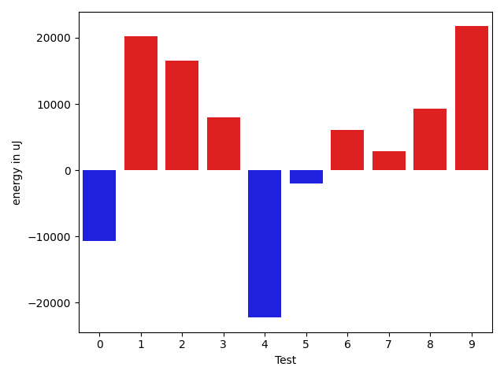
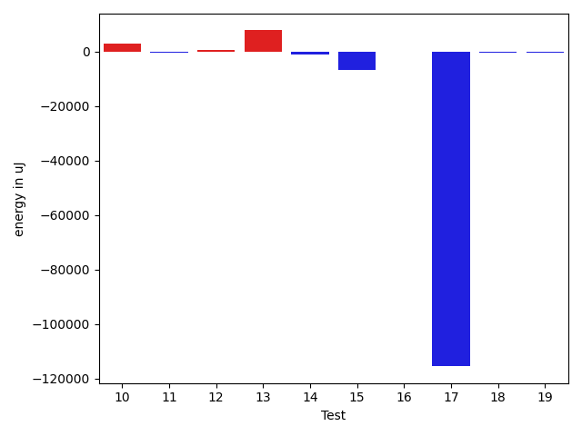
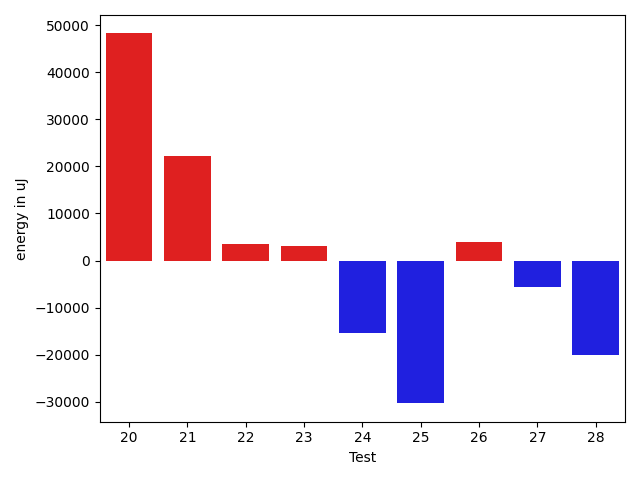

# gson 33e816

https://github.com/google/gson/commit/33e816

## Delta Energy per test method

| ID | EnergyV1 | EnergyV2 | DeltaEnergy | σV1 | σV2 |
| --- | --- | --- | --- | --- | --- |
| 0 | 40100 | 38269 | -1831 | 85423.78756640926 | 70554.6341988108 |
| 1 | 38575 | 39307 | 732 | 50102.27927817736 | 89364.71408014376 |
| 2 | 37842 | 37536 | -306 | 41046.45651742814 | 66345.33304899369 |
| 3 | 36865 | 38757 | 1892 | 15852.664675081194 | 21738.75557161608 |
| 4 | 163635 | 158874 | -4761 | 130387.6671609168 | 118451.82983884883 |
| 5 | 37170 | 37231 | 61 | 43323.960519182285 | 35228.28477334367 |
| 6 | 39368 | 47913 | 8545 | 30715.774166155443 | 52175.71473716922 |
| 7 | 43823 | 46386 | 2563 | 108985.07115322932 | 112682.24636840327 |
| 8 | 36499 | 36255 | -244 | 52526.39872447965 | 63503.104079983095 |
| 9 | 37354 | 38757 | 1403 | 111857.13275533616 | 127006.92914048003 |
| 10 | 35462 | 38575 | 3113 | 3408.8090049491216 | 38768.660312964654 |
| 11 | 35949 | 35583 | -366 | 49917.518185157736 | 4036.0864697967727 |
| 12 | 34912 | 35705 | 793 | 9367.418414559454 | 12936.32764907849 |
| 13 | 160156 | 167968 | 7812 | 535474.835650456 | 480296.9531483378 |
| 14 | 36804 | 35767 | -1037 | 14130.684538064663 | 19518.001237185435 |
| 15 | 121338 | 114685 | -6653 | 195325.34529849506 | 32738.272946754078 |
| 16 | 36987 | 36865 | -122 | 3810.4822459153847 | 11251.712496468639 |
| 17 | 192870 | 77453 | -115417 | 121635.57588386137 | 125553.3870517008 |
| 18 | 35584 | 35340 | -244 | 35651.81269382015 | 28598.516287250153 |
| 19 | 34912 | 34607 | -305 | 55092.272676432876 | 44093.551963902704 |
| 20 | 41504 | 44250 | 2746 | 57980.039180894506 | 112050.3877427613 |
| 21 | 38818 | 39673 | 855 | 82103.7715467846 | 104945.52011357671 |
| 22 | 36377 | 36499 | 122 | 47992.52928010737 | 67242.74653429404 |
| 23 | 36560 | 38758 | 2198 | 20809.705052944228 | 22124.95197066158 |
| 24 | 37964 | 38757 | 793 | 87539.51939527401 | 35774.5300816365 |
| 25 | 72937 | 70557 | -2380 | 118909.93465951363 | 94903.72086765198 |
| 26 | 36926 | 37170 | 244 | 3701.1415343912972 | 15059.638515830984 |
| 27 | 65246 | 42297 | -22949 | 27489.72998993921 | 24729.818276380087 |
| 28 | 171203 | 163879 | -7324 | 137170.78703378356 | 125093.57574626945 |

## Delta Duration per test method

| ID | DurationV1 | DurationsV2 | DeltaDuration |
| --- | --- | --- | --- |
| 0 | 1997713.8148148148 | 1607656.857142857 | -390056.9576719578 |
| 1 | 1472204.761904762 | 1952261.6603773586 | 480056.89847259666 |
| 2 | 1201016.3157894737 | 1650654.4516129033 | 449638.13582342956 |
| 3 | 1064807.4347826086 | 1367113.4444444445 | 302306.00966183585 |
| 4 | 6445961.712765957 | 5694427.806122449 | -751533.906643508 |
| 5 | 1097449.9090909092 | 1077657.5909090908 | -19792.31818181835 |
| 6 | 1948356.808080808 | 2078017.494949495 | 129660.68686868693 |
| 7 | 3858737.1414141413 | 3857340.1717171716 | -1396.9696969697252 |
| 8 | 1508244.5192307692 | 1699417.6440677966 | 191173.1248370274 |
| 9 | 2661957.793650794 | 3214450.033898305 | 552492.2402475113 |
| 10 | 636203.5666666667 | 1061276.5142857144 | 425072.9476190477 |
| 11 | 1293557.05 | 1025398.8275862068 | -268158.2224137932 |
| 12 | 1345486.6804123712 | 1377172.9887640448 | 31686.30835167365 |
| 13 | 10738412.632653061 | 9241603.979591837 | -1496808.6530612241 |
| 14 | 1230037.1794871795 | 1253159.024691358 | 23121.845204178477 |
| 15 | 4789796.535353536 | 3893363.282828283 | -896433.2525252528 |
| 16 | 1150878.2891566264 | 1243247.9113924052 | 92369.62223577872 |
| 17 | 4801087.25 | 4548667.376470588 | -252419.87352941185 |
| 18 | 1613175.252631579 | 1622311.0543478262 | 9135.801716247108 |
| 19 | 1601602.1710526317 | 1377790.9545454546 | -223811.2165071771 |
| 20 | 1888458.9069767443 | 3242677.296296296 | 1354218.3893195519 |
| 21 | 2049040.7291666667 | 2621278.777777778 | 572238.0486111112 |
| 22 | 1141806.9268292682 | 1225856.1951219512 | 84049.26829268294 |
| 23 | 1084915.4615384615 | 1298406.0357142857 | 213490.57417582418 |
| 24 | 1843370.5666666667 | 1428431.677419355 | -414938.88924731174 |
| 25 | 3678430.242857143 | 2856124.027027027 | -822306.2158301156 |
| 26 | 530562.1904761905 | 676660.8 | 146098.60952380951 |
| 27 | 1932163.0153846154 | 1651228.9393939395 | -280934.07599067595 |
| 28 | 7349041.141414141 | 6500922.070707071 | -848119.0707070706 |

## Misc.

| ID | Test Class | Test Method |
| --- | --- | --- |
| 0 | com.google.gson.ExposeAnnotationSerializationExclusionStrategyTest | testSkipExplicitlySkippedFields |
| 1 | com.google.gson.ExposeAnnotationSerializationExclusionStrategyTest | testNeverSkipExplicitlyExposedAnnotatedFields |
| 2 | com.google.gson.ExposeAnnotationSerializationExclusionStrategyTest | testNeverSkipExposedAnnotatedFields |
| 3 | com.google.gson.ExposeAnnotationSerializationExclusionStrategyTest | testSkipNonAnnotatedFields |
| 4 | com.google.gson.functional.ExposeFieldsTest | testNullExposeFieldSerialization |
| 5 | com.google.gson.functional.ExposeFieldsTest | testExposeAnnotationSerialization |
| 6 | com.google.gson.functional.ExposeFieldsTest | testArrayWithOneNullExposeFieldObjectSerialization |
| 7 | com.google.gson.functional.ExposeFieldsTest | testExposeAnnotationDeserialization |
| 8 | com.google.gson.functional.ExposeFieldsTest | testExposedInterfaceFieldSerialization |
| 9 | com.google.gson.functional.ExposeFieldsTest | testNoExposedFieldDeserialization |
| 10 | com.google.gson.functional.ExposeFieldsTest | testNoExposedFieldSerialization |
| 11 | com.google.gson.functional.ExposeFieldsTest | testExposedInterfaceFieldDeserialization |
| 12 | com.google.gson.functional.VersioningTest | testVersionedGsonMixingSinceAndUntilDeserialization |
| 13 | com.google.gson.functional.VersioningTest | testVersionedUntilSerialization |
| 14 | com.google.gson.functional.VersioningTest | testVersionedClassesDeserialization |
| 15 | com.google.gson.functional.VersioningTest | testVersionedGsonWithUnversionedClassesSerialization |
| 16 | com.google.gson.functional.VersioningTest | testVersionedClassesSerialization |
| 17 | com.google.gson.functional.VersioningTest | testVersionedUntilDeserialization |
| 18 | com.google.gson.functional.VersioningTest | testVersionedGsonMixingSinceAndUntilSerialization |
| 19 | com.google.gson.functional.VersioningTest | testVersionedGsonWithUnversionedClassesDeserialization |
| 20 | com.google.gson.ExposeAnnotationDeserializationExclusionStrategyTest | testNeverSkipExplicitlyExposedAnnotatedFields |
| 21 | com.google.gson.ExposeAnnotationDeserializationExclusionStrategyTest | testSkipExplicitlySkippedFields |
| 22 | com.google.gson.ExposeAnnotationDeserializationExclusionStrategyTest | testNeverSkipExposedAnnotatedFields |
| 23 | com.google.gson.ExposeAnnotationDeserializationExclusionStrategyTest | testSkipNonAnnotatedFields |
| 24 | com.google.gson.VersionExclusionStrategyTest | testClassAndFieldAreBehindInVersion |
| 25 | com.google.gson.VersionExclusionStrategyTest | testClassAndFieldAreAtSameVersion |
| 26 | com.google.gson.VersionExclusionStrategyTest | testClassAndFieldAreAheadInVersion |
| 27 | com.google.gson.functional.ExclusionStrategyFunctionalTest | testExclusionStrategyDeserialization |
| 28 | com.google.gson.functional.ExclusionStrategyFunctionalTest | testExclusionStrategySerialization |

| Test | IterationV1 | IterationV2 | DeltaIteration |
| --- | --- | --- | --- |
| 0 | 54 | 42 | -12 |
| 1 | 42 | 53 | 11 |
| 2 | 38 | 31 | -7 |
| 3 | 23 | 18 | -5 |
| 4 | 94 | 98 | 4 |
| 5 | 44 | 44 | 0 |
| 6 | 99 | 99 | 0 |
| 7 | 99 | 99 | 0 |
| 8 | 52 | 59 | 7 |
| 9 | 63 | 59 | -4 |
| 10 | 30 | 35 | 5 |
| 11 | 60 | 58 | -2 |
| 12 | 97 | 89 | -8 |
| 13 | 98 | 98 | 0 |
| 14 | 78 | 81 | 3 |
| 15 | 99 | 99 | 0 |
| 16 | 83 | 79 | -4 |
| 17 | 80 | 85 | 5 |
| 18 | 95 | 92 | -3 |
| 19 | 76 | 66 | -10 |
| 20 | 43 | 54 | 11 |
| 21 | 48 | 45 | -3 |
| 22 | 41 | 41 | 0 |
| 23 | 26 | 28 | 2 |
| 24 | 30 | 31 | 1 |
| 25 | 70 | 74 | 4 |
| 26 | 21 | 20 | -1 |
| 27 | 65 | 66 | 1 |
| 28 | 99 | 99 | 0 |

| Time Label | Time (s) |
| --- | --- |
| Selection | 24.68054962158203 |
| Injection | 9.239258289337158 |
| Total | 980.3257079124451 |

