# gson 641390

https://github.com/google/gson/commit/641390

## Delta Energy per test method

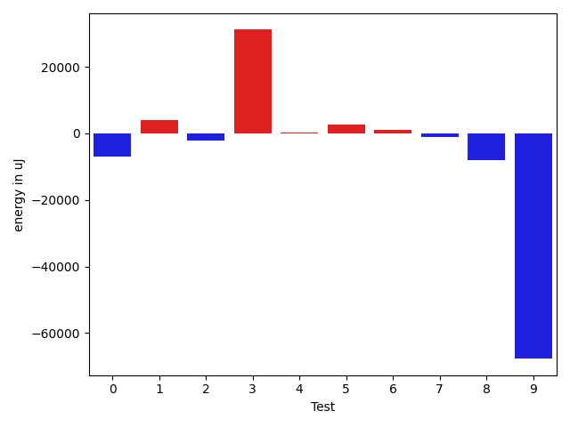

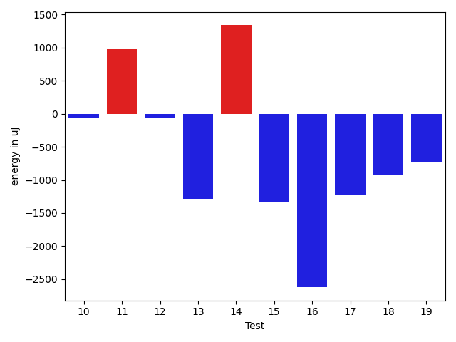

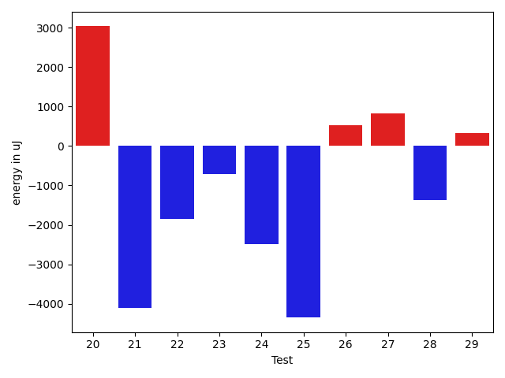

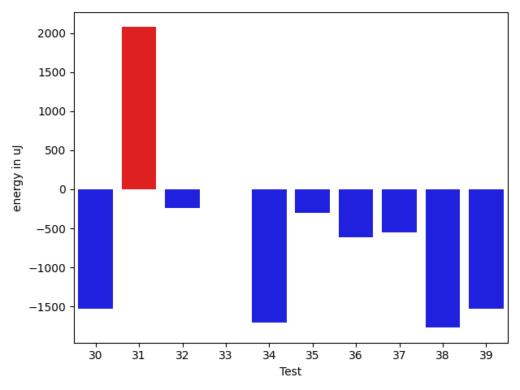

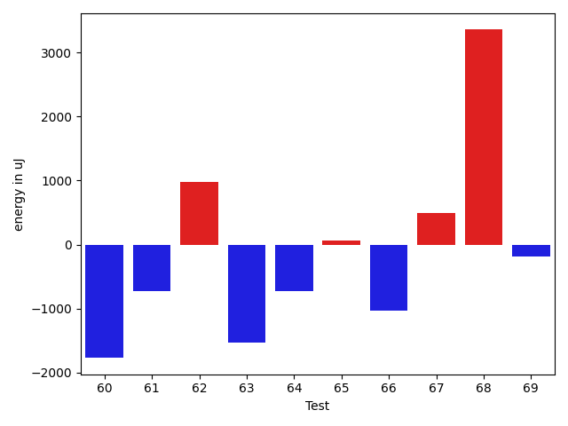

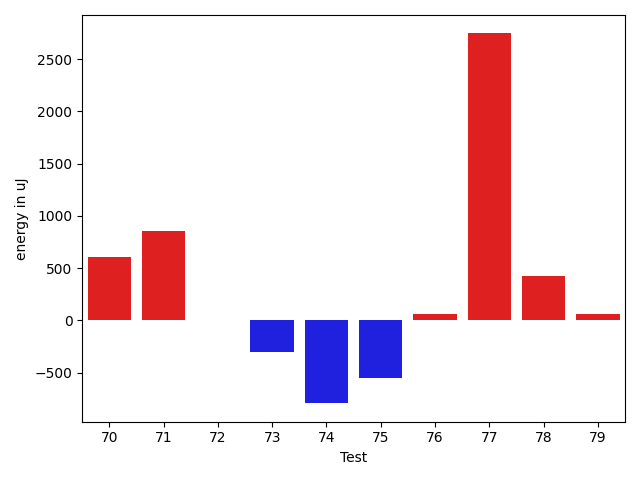

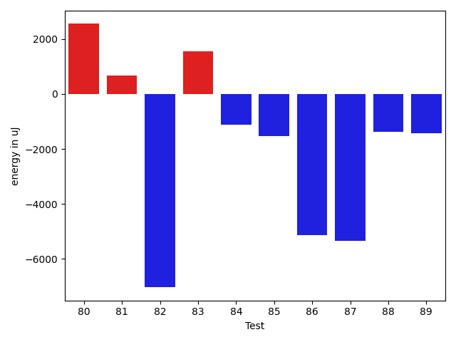

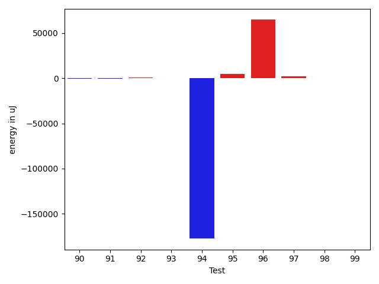

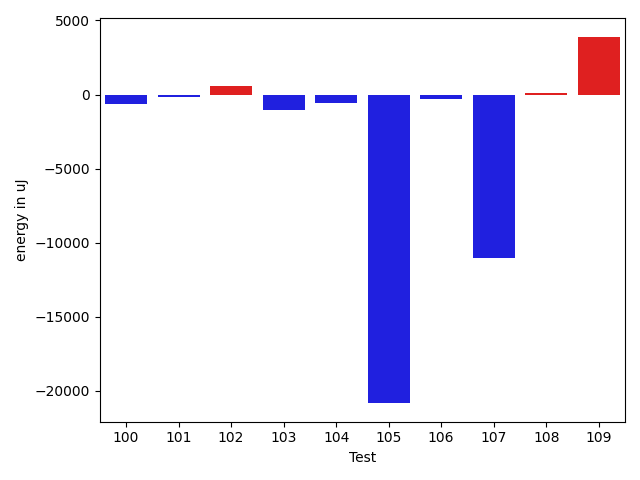

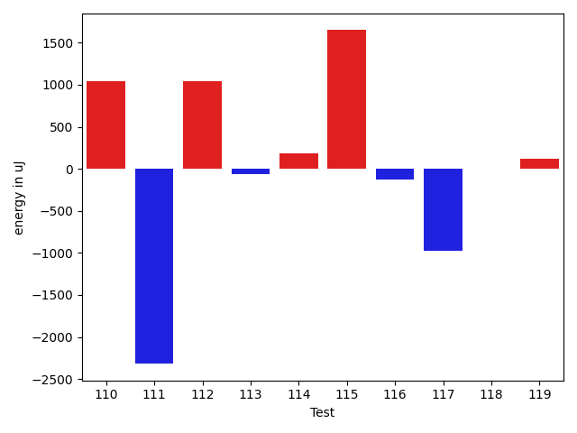

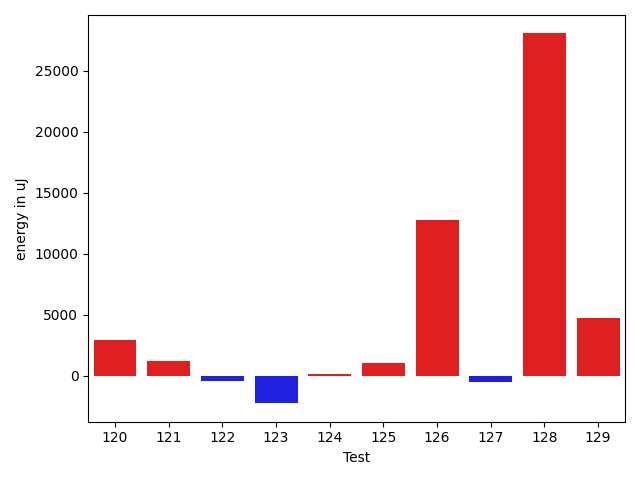

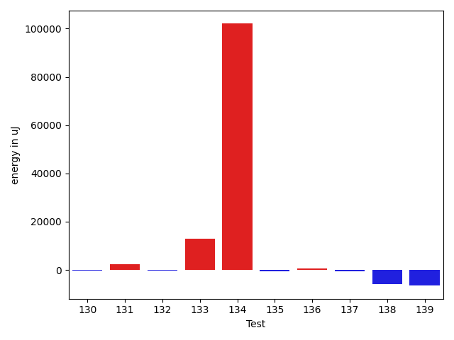

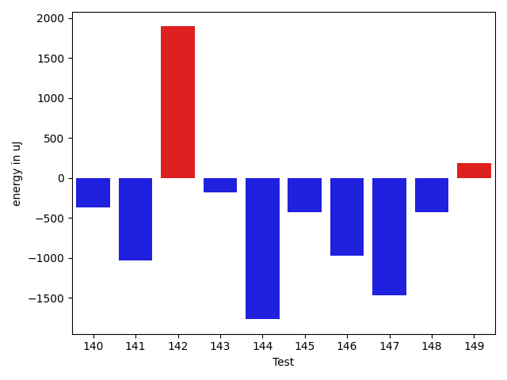

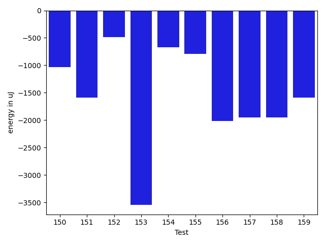

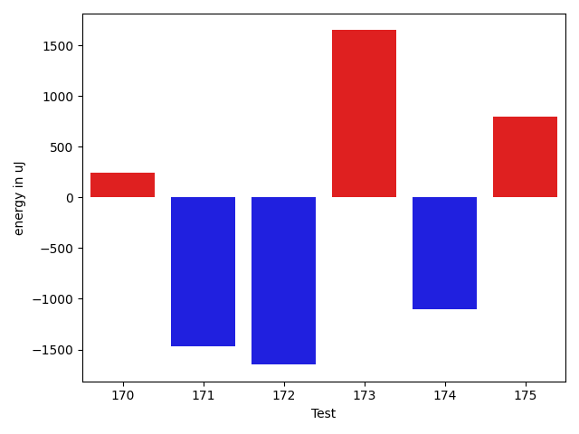

| ID | EnergyV1 | EnergyV2 | DeltaEnergy | σV1 | σV2 |
| --- | --- | --- | --- | --- | --- |
| 0 | 36926 | 38147 | 1221 | 38372.20874844677 | 13732.221321028954 |
| 1 | 34851 | 38330 | 3479 | 4582.605974202113 | 10633.217600519609 |
| 2 | 38391 | 35339 | -3052 | 25830.491346631403 | 24653.1896897073 |
| 3 | 41870 | 44616 | 2746 | 29589.55997480711 | 108258.35362197227 |
| 4 | 35400 | 37537 | 2137 | 3890.6960821666576 | 3882.453271036976 |
| 5 | 38025 | 36377 | -1648 | 12257.518649529302 | 27351.06529756761 |
| 6 | 36927 | 37231 | 304 | 10802.049724715442 | 11906.235049352506 |
| 7 | 36316 | 35767 | -549 | 7670.4175230296305 | 3805.4752333688352 |
| 8 | 38208 | 37903 | -305 | 29236.298817709463 | 17076.233192696745 |
| 9 | 37354 | 37171 | -183 | 566415.431727693 | 477896.5912764912 |
| 10 | 40161 | 40100 | -61 | 72063.15127225398 | 50556.70748993474 |
| 11 | 36926 | 37903 | 977 | 12309.080858760333 | 8804.514069093513 |
| 12 | 36621 | 36560 | -61 | 67569.97621088562 | 45885.4145360803 |
| 13 | 36377 | 35095 | -1282 | 9768.412511498329 | 6458.173530774781 |
| 14 | 36316 | 37658 | 1342 | 24447.755300398017 | 3891.5072699690827 |
| 15 | 35584 | 34240 | -1344 | 3526.216956409324 | 3175.388210901236 |
| 16 | 36499 | 33874 | -2625 | 25893.688580078713 | 13724.511844868319 |
| 17 | 35828 | 34607 | -1221 | 3393.8622540366896 | 3601.2674834702298 |
| 18 | 36011 | 35095 | -916 | 15635.664053060404 | 11639.964278186637 |
| 19 | 34546 | 33814 | -732 | 3343.1852637590887 | 3578.71878967641 |
| 20 | 37353 | 35949 | -1404 | 16207.947928469379 | 24757.462334477164 |
| 21 | 36682 | 36133 | -549 | 12391.57043662397 | 3327.113105392035 |
| 22 | 35157 | 33935 | -1222 | 7166.621957615378 | 3241.6444361408307 |
| 23 | 34729 | 34424 | -305 | 3536.6915381351573 | 3676.4995227654936 |
| 24 | 36010 | 35034 | -976 | 14012.919862493483 | 14034.366321372303 |
| 25 | 34485 | 36011 | 1526 | 28702.214244060797 | 3472.727663763266 |
| 26 | 34973 | 34240 | -733 | 3408.112626747068 | 3719.273202300645 |
| 27 | 34423 | 34180 | -243 | 3368.8278684285115 | 4139.59868823054 |
| 28 | 34301 | 33814 | -487 | 4346.168282351755 | 3065.8809647458297 |
| 29 | 33203 | 33691 | 488 | 4038.837206631916 | 4103.131387316624 |
| 30 | 34912 | 33387 | -1525 | 3448.3105340523202 | 4214.153702951373 |
| 31 | 33265 | 35339 | 2074 | 3857.489431248174 | 2827.984924717433 |
| 32 | 35156 | 34912 | -244 | 5448.222118033277 | 9413.90566309968 |
| 33 | 35949 | 35949 | 0 | 19572.153928075917 | 3609.2179821214922 |
| 34 | 36315 | 34607 | -1708 | 47600.73727991865 | 3184.1504616940783 |
| 35 | 34912 | 34607 | -305 | 6492.509605092796 | 3693.8950941248995 |
| 36 | 35522 | 34912 | -610 | 3758.6866352786337 | 2493.583264754536 |
| 37 | 34179 | 33631 | -548 | 3331.89161802557 | 24409.783070843136 |
| 38 | 36316 | 34545 | -1771 | 13490.1014832723 | 6311.841686154238 |
| 39 | 36499 | 34973 | -1526 | 120358.88799347356 | 3269.1052729939456 |
| 40 | 34424 | 35034 | 610 | 3703.2213203507026 | 3797.2434104174063 |
| 41 | 34485 | 34912 | 427 | 4418.784086394462 | 3084.464046281967 |
| 42 | 35218 | 34607 | -611 | 3171.797554950794 | 3537.4637051534223 |
| 43 | 35767 | 34302 | -1465 | 11932.858605268619 | 6422.6766840407845 |
| 44 | 32593 | 32897 | 304 | 2885.541086174307 | 3436.3870692923983 |
| 45 | 33508 | 34789 | 1281 | 3215.2177461760566 | 30269.03342846733 |
| 46 | 36011 | 34973 | -1038 | 3531.452239402889 | 2939.5810763306035 |
| 47 | 35523 | 34302 | -1221 | 4162.332304274004 | 3230.465940795024 |
| 48 | 37964 | 36804 | -1160 | 9542.204629518885 | 12037.071675487912 |
| 49 | 37597 | 36682 | -915 | 11036.68464056934 | 12834.39077969309 |
| 50 | 73486 | 68481 | -5005 | 77341.22103990788 | 68318.76743057158 |
| 51 | 37171 | 37048 | -123 | 14805.71345707369 | 10941.167777093802 |
| 52 | 36865 | 38452 | 1587 | 62234.016802388716 | 81190.09916652483 |
| 53 | 37048 | 37353 | 305 | 54390.00495553988 | 71604.92669818662 |
| 54 | 125915 | 113586 | -12329 | 108892.36535756676 | 100912.32622216483 |
| 55 | 35766 | 36194 | 428 | 4716.43190404378 | 4727.4789747387795 |
| 56 | 35767 | 35888 | 121 | 3908.518189156036 | 3370.2092124693313 |
| 57 | 37415 | 36866 | -549 | 13251.742643189 | 9309.34327512777 |
| 58 | 38391 | 37537 | -854 | 60830.63168693728 | 60221.80060886147 |
| 59 | 37659 | 35950 | -1709 | 27714.621945023093 | 3335.3922793361176 |
| 60 | 37109 | 35339 | -1770 | 4931.714744486713 | 3788.2136875191836 |
| 61 | 36316 | 35583 | -733 | 3928.693314201166 | 4536.961766519712 |
| 62 | 35888 | 36865 | 977 | 3054.089069441432 | 3826.8570101556297 |
| 63 | 37537 | 36010 | -1527 | 7470.461208636213 | 5142.88607825973 |
| 64 | 38758 | 38025 | -733 | 20895.691968598978 | 34838.50485765566 |
| 65 | 37170 | 37231 | 61 | 28773.663203801 | 49135.38569013578 |
| 66 | 38391 | 37353 | -1038 | 38174.396094682 | 27301.993467668646 |
| 67 | 66895 | 67383 | 488 | 54726.93273081407 | 49568.21640938219 |
| 68 | 37354 | 40710 | 3356 | 86148.86980251105 | 73385.13607700086 |
| 69 | 36377 | 36194 | -183 | 29776.473873930794 | 3981.228570963498 |
| 70 | 36499 | 37109 | 610 | 66215.08298308322 | 42235.09149836188 |
| 71 | 35156 | 36011 | 855 | 4730.843630586802 | 3624.480067871348 |
| 72 | 35644 | 35644 | 0 | 13717.92021111778 | 14030.035960031622 |
| 73 | 37659 | 37354 | -305 | 19163.910058337373 | 18283.71546423687 |
| 74 | 36316 | 35523 | -793 | 2763.129899198326 | 2537.9408952247727 |
| 75 | 36437 | 35888 | -549 | 3699.1171253320986 | 3407.2236475428203 |
| 76 | 35950 | 36011 | 61 | 4633.7129991822085 | 3699.349068961142 |
| 77 | 34363 | 37109 | 2746 | 11630.132590266308 | 7538.317596071125 |
| 78 | 35095 | 35523 | 428 | 3716.7453117239843 | 3415.034256376094 |
| 79 | 34607 | 34668 | 61 | 3979.804499372192 | 3801.527567856232 |
| 80 | 35278 | 36865 | 1587 | 8988.97891631818 | 11741.008164062338 |
| 81 | 34607 | 34790 | 183 | 3787.6031346687837 | 7349.090875616329 |
| 82 | 83130 | 83496 | 366 | 78953.15253869205 | 78101.95068061836 |
| 83 | 36071 | 36499 | 428 | 12158.559348983215 | 21739.220461225606 |
| 84 | 70740 | 71472 | 732 | 27278.904680494292 | 26921.15922354753 |
| 85 | 36316 | 36133 | -183 | 13757.962707457023 | 12603.65553449289 |
| 86 | 35522 | 36072 | 550 | 85187.39787428014 | 68904.05290105681 |
| 87 | 67383 | 68421 | 1038 | 33790.000435043876 | 29471.111077996622 |
| 88 | 35644 | 36072 | 428 | 15586.071770622024 | 13483.677960080751 |
| 89 | 70984 | 67932 | -3052 | 36212.88697339474 | 41468.47182962374 |
| 90 | 35584 | 35218 | -366 | 9880.369723049302 | 9531.83082199483 |
| 91 | 35034 | 35095 | 61 | 3769.4821878329744 | 3900.7941444766225 |
| 92 | 33447 | 34973 | 1526 | 3950.52857025855 | 5195.76110139177 |
| 93 | 33875 | 34606 | 731 | 4392.464598097728 | 3623.3851390102054 |
| 94 | 40344 | 38574 | -1770 | 609992.6878813677 | 224160.02763932102 |
| 95 | 74219 | 73303 | -916 | 25795.63380843787 | 30782.533466279074 |
| 96 | 77454 | 83069 | 5615 | 152676.91133702677 | 307442.7476920607 |
| 97 | 36132 | 35034 | -1098 | 3355.907081653391 | 20990.594311252145 |
| 98 | 37598 | 35156 | -2442 | 81728.05330770735 | 70483.35460151546 |
| 99 | 36133 | 36682 | 549 | 3922.953310269728 | 4544.997046789518 |
| 100 | 36560 | 36133 | -427 | 3957.828642263765 | 3306.960352417449 |
| 101 | 35339 | 36133 | 794 | 4379.106804836263 | 3860.6289735519226 |
| 102 | 35645 | 36072 | 427 | 3686.7126972367537 | 4005.3380079536955 |
| 103 | 36072 | 35217 | -855 | 3462.3460775818967 | 3388.541569014303 |
| 104 | 34790 | 36377 | 1587 | 5869.52798553834 | 5125.050552928042 |
| 105 | 152771 | 156738 | 3967 | 296027.6882995058 | 199705.11788220468 |
| 106 | 35462 | 35950 | 488 | 6934.7171764006835 | 3995.2324121646393 |
| 107 | 37781 | 37170 | -611 | 81657.47210623541 | 64732.92557955563 |
| 108 | 36743 | 35400 | -1343 | 4396.603113862616 | 6180.472522578641 |
| 109 | 35522 | 35522 | 0 | 3409.543180666062 | 25223.89123377325 |
| 110 | 35339 | 36377 | 1038 | 4078.6370882193655 | 29099.09595069328 |
| 111 | 37781 | 35462 | -2319 | 40537.98089091157 | 25111.406552511635 |
| 112 | 37719 | 38758 | 1039 | 356238.0122567908 | 483976.9243915442 |
| 113 | 36255 | 36194 | -61 | 4437.4603290167715 | 4177.612949059359 |
| 114 | 38269 | 38452 | 183 | 34352.28946837656 | 30861.83069638325 |
| 115 | 35827 | 37476 | 1649 | 17999.909944879757 | 9885.43670119501 |
| 116 | 36194 | 36071 | -123 | 3828.7166607205204 | 4348.662987702341 |
| 117 | 35278 | 34301 | -977 | 4439.404829176022 | 4540.984748131028 |
| 118 | 34912 | 34912 | 0 | 3880.5684539807858 | 21740.825472576358 |
| 119 | 36499 | 36621 | 122 | 23945.626633024385 | 34212.13381794949 |
| 120 | 35156 | 36072 | 916 | 4798.975855451261 | 21496.108657035795 |
| 121 | 38513 | 37842 | -671 | 11502.511084710048 | 12720.776760720431 |
| 122 | 36621 | 35339 | -1282 | 4223.733929728031 | 4346.163286511379 |
| 123 | 39001 | 39367 | 366 | 61382.669948262046 | 62025.267592978664 |
| 124 | 36499 | 37476 | 977 | 3886.834427318022 | 4082.7390499516378 |
| 125 | 35339 | 35889 | 550 | 4342.43285285993 | 3258.9930019017697 |
| 126 | 38208 | 38452 | 244 | 41709.16858562743 | 79958.5619463535 |
| 127 | 217651 | 212280 | -5371 | 78032.43730801024 | 87724.56390304824 |
| 128 | 333862 | 339476 | 5614 | 94500.90189946476 | 127275.8197974363 |
| 129 | 64697 | 38208 | -26489 | 62868.25953692306 | 84144.62347390213 |
| 130 | 39002 | 35828 | -3174 | 4858.627524064795 | 4138.951308788669 |
| 131 | 36377 | 36988 | 611 | 57645.38466613814 | 53997.17083545169 |
| 132 | 35645 | 35889 | 244 | 6734.0979034524635 | 3355.050960864827 |
| 133 | 38879 | 38757 | -122 | 70841.47225963818 | 92825.52353040804 |
| 134 | 38635 | 39489 | 854 | 368640.59413318 | 595500.1901854249 |
| 135 | 36804 | 36682 | -122 | 3974.5271643927495 | 3859.2282753812324 |
| 136 | 36377 | 36438 | 61 | 9147.28916861414 | 10340.965817480339 |
| 137 | 37659 | 37903 | 244 | 14824.121543094388 | 14889.48659561819 |
| 138 | 40955 | 39429 | -1526 | 46395.721244473716 | 39568.978445137436 |
| 139 | 78674 | 75562 | -3112 | 29500.78712666402 | 24187.05797355226 |
| 140 | 35645 | 35279 | -366 | 3867.203855963666 | 3138.220030102432 |
| 141 | 36560 | 35523 | -1037 | 7584.44895000623 | 4242.333721619159 |
| 142 | 36072 | 37964 | 1892 | 4570.1710173581105 | 3211.3617295725603 |
| 143 | 36743 | 36560 | -183 | 8368.655962737184 | 21258.38809673615 |
| 144 | 37658 | 35889 | -1769 | 24206.721856909106 | 11244.640138429217 |
| 145 | 35888 | 35462 | -426 | 8029.591219170641 | 18588.70062240063 |
| 146 | 39489 | 38513 | -976 | 479001.68883203133 | 440921.7453967776 |
| 147 | 38025 | 36560 | -1465 | 3787.7898874416146 | 3842.6559876858014 |
| 148 | 36926 | 36499 | -427 | 4414.141859597736 | 2922.393363154294 |
| 149 | 36072 | 36255 | 183 | 10678.396710150695 | 6807.396664739841 |
| 150 | 38940 | 37903 | -1037 | 37998.65791222556 | 33474.953300462 |
| 151 | 38818 | 37231 | -1587 | 75962.27575190883 | 54739.9307898925 |
| 152 | 37414 | 36926 | -488 | 4722.642058212754 | 4265.672776740751 |
| 153 | 39917 | 36377 | -3540 | 51459.28344546699 | 55268.05893754503 |
| 154 | 38696 | 38024 | -672 | 293779.6530327216 | 318992.5842320519 |
| 155 | 37598 | 36804 | -794 | 4184.560160596849 | 42050.744816008504 |
| 156 | 37658 | 35645 | -2013 | 5819.545373942453 | 3885.6523639064035 |
| 157 | 38513 | 36560 | -1953 | 7018.680632237354 | 8074.88061926241 |
| 158 | 37414 | 35462 | -1952 | 6498.712850941367 | 7880.177920929433 |
| 159 | 37048 | 35461 | -1587 | 4323.855450388198 | 4128.368767004562 |
| 160 | 37170 | 35644 | -1526 | 5782.5591925571325 | 4190.657755848037 |
| 161 | 36316 | 36255 | -61 | 4040.857299772911 | 2871.036673844785 |
| 162 | 38147 | 37780 | -367 | 31222.752473756766 | 13550.10655975871 |
| 163 | 39123 | 39123 | 0 | 24193.604674983326 | 18414.982396819018 |
| 164 | 83618 | 78980 | -4638 | 132706.67817943165 | 101841.89163018831 |
| 165 | 37048 | 39306 | 2258 | 4544.880479879409 | 5069.237261484526 |
| 166 | 34912 | 38024 | 3112 | 3058.3304368927325 | 3370.420932955722 |
| 167 | 38086 | 37963 | -123 | 33871.73487446482 | 25768.666665108667 |
| 168 | 36072 | 36316 | 244 | 4239.273563181587 | 2776.838399495653 |
| 169 | 38452 | 38025 | -427 | 105707.57289103606 | 88851.10566545016 |
| 170 | 38147 | 38391 | 244 | 77223.79585261947 | 43151.10105704355 |
| 171 | 36560 | 35095 | -1465 | 3433.2040840876957 | 3642.7623924113655 |
| 172 | 37110 | 35461 | -1649 | 3368.027216731573 | 3401.0987015227884 |
| 173 | 37903 | 39551 | 1648 | 20750.60286715993 | 19611.295845114768 |
| 174 | 41626 | 40527 | -1099 | 19113.34440996718 | 20766.43260828792 |
| 175 | 38635 | 39428 | 793 | 69935.88649228822 | 50015.9066250722 |

## Delta Duration per test method

| ID | DurationV1 | DurationsV2 | DeltaDuration |
| --- | --- | --- | --- |
| 0 | 875138.875 | 684880.0 | -190258.875 |
| 1 | 407054.3076923077 | 546282.75 | 139228.4423076923 |
| 2 | 837773.38 | 942242.7441860465 | 104469.36418604653 |
| 3 | 1903176.8775510204 | 2761268.6979166665 | 858091.8203656462 |
| 4 | 1074656.8923076922 | 929441.25 | -145215.6423076922 |
| 5 | 1035628.5178571428 | 1174762.3220338982 | 139133.80417675537 |
| 6 | 1160052.3529411764 | 1230961.6753246754 | 70909.322383499 |
| 7 | 855990.42 | 833565.724137931 | -22424.695862069027 |
| 8 | 1227845.0 | 911983.3333333334 | -315861.6666666666 |
| 9 | 5195855.607843137 | 3226667.28 | -1969188.3278431376 |
| 10 | 2010560.8541666667 | 1917061.193877551 | -93499.66028911574 |
| 11 | 1001340.35 | 921624.1206896552 | -79716.22931034479 |
| 12 | 1636069.0625 | 1344275.2153846154 | -291793.84711538465 |
| 13 | 810801.1290322581 | 749217.76 | -61583.36903225805 |
| 14 | 847671.282051282 | 795717.7 | -51953.58205128205 |
| 15 | 480653.03846153844 | 492537.7916666667 | 11884.753205128247 |
| 16 | 1471697.6222222222 | 1233152.6 | -238545.02222222206 |
| 17 | 889899.5 | 728973.85 | -160925.65000000002 |
| 18 | 1341468.6363636365 | 1135278.765625 | -206189.87073863647 |
| 19 | 550017.1621621621 | 569891.7407407408 | 19874.578578578657 |
| 20 | 1613177.6979166667 | 1607310.8645833333 | -5866.833333333489 |
| 21 | 880252.0294117647 | 594134.0 | -286118.0294117647 |
| 22 | 957987.0566037736 | 870232.7049180327 | -87754.35168574087 |
| 23 | 492172.2173913043 | 491447.77419354836 | -724.443197755958 |
| 24 | 1363931.6941176471 | 1283215.7444444445 | -80715.94967320259 |
| 25 | 1092714.677419355 | 533634.5 | -559080.1774193549 |
| 26 | 547269.8947368421 | 515453.42424242425 | -31816.47049441788 |
| 27 | 695610.2307692308 | 706937.84 | 11327.609230769216 |
| 28 | 512194.4285714286 | 505272.9393939394 | -6921.489177489188 |
| 29 | 757568.4081632653 | 708908.4807692308 | -48659.927394034574 |
| 30 | 456737.0 | 446578.6296296296 | -10158.370370370394 |
| 31 | 560003.9166666666 | 548965.1764705882 | -11038.740196078434 |
| 32 | 992878.9855072463 | 1009128.71875 | 16249.73324275366 |
| 33 | 766040.0454545454 | 646093.4222222222 | -119946.62323232321 |
| 34 | 962513.0204081633 | 683677.9772727273 | -278835.043135436 |
| 35 | 875735.75 | 912593.22 | 36857.46999999997 |
| 36 | 663154.3333333334 | 537068.0416666666 | -126086.29166666674 |
| 37 | 778866.0612244898 | 872161.5454545454 | 93295.48423005559 |
| 38 | 1201600.2028985508 | 1028404.2878787878 | -173195.91501976294 |
| 39 | 1947822.0952380951 | 667047.9565217391 | -1280774.138716356 |
| 40 | 739988.3 | 684846.4130434783 | -55141.886956521776 |
| 41 | 707570.4680851063 | 605879.8571428572 | -101690.61094224919 |
| 42 | 680820.1785714285 | 683468.0277777778 | 2647.8492063492304 |
| 43 | 808657.7333333333 | 618611.2580645161 | -190046.47526881716 |
| 44 | 476848.12 | 446616.6 | -30231.52000000002 |
| 45 | 509003.5 | 621027.9166666666 | 112024.41666666663 |
| 46 | 660133.5714285715 | 669068.3055555555 | 8934.734126984025 |
| 47 | 588481.3939393939 | 546694.0294117647 | -41787.36452762922 |
| 48 | 1076885.186440678 | 1049510.5833333333 | -27374.603107344825 |
| 49 | 986860.3650793651 | 1013462.6481481482 | 26602.283068783116 |
| 50 | 2720462.0404040404 | 2495546.1414141413 | -224915.89898989908 |
| 51 | 1172494.1756756757 | 1197997.527027027 | 25503.351351351244 |
| 52 | 974133.5714285715 | 1598535.7741935484 | 624402.2027649769 |
| 53 | 1180653.756097561 | 1415114.9767441861 | 234461.22064662515 |
| 54 | 5046641.2727272725 | 4697829.939393939 | -348811.333333333 |
| 55 | 807775.1739130435 | 494150.7083333333 | -313624.46557971014 |
| 56 | 685272.2580645161 | 605785.5882352941 | -79486.66982922202 |
| 57 | 993076.75 | 932238.5 | -60838.25 |
| 58 | 1688281.8636363635 | 1631970.3658536586 | -56311.497782704886 |
| 59 | 889029.3333333334 | 713860.9803921569 | -175168.3529411765 |
| 60 | 608148.4444444445 | 527973.1923076923 | -80175.25213675224 |
| 61 | 709189.2162162162 | 655660.8095238095 | -53528.406692406745 |
| 62 | 597231.2857142857 | 708153.6578947369 | 110922.37218045117 |
| 63 | 906325.6551724138 | 918958.8484848485 | 12633.193312434712 |
| 64 | 1497358.064516129 | 1655863.6210526316 | 158505.55653650267 |
| 65 | 1026362.171875 | 1410837.62 | 384475.4481250001 |
| 66 | 1225814.888888889 | 1044455.2448979592 | -181359.64399092982 |
| 67 | 2564157.8282828284 | 2637624.5656565656 | 73466.73737373715 |
| 68 | 1909880.7954545454 | 1844789.5625 | -65091.23295454541 |
| 69 | 691894.7037037037 | 517509.5294117647 | -174385.174291939 |
| 70 | 1670832.3275862068 | 1294025.984375 | -376806.34321120684 |
| 71 | 545366.4736842106 | 494953.45454545453 | -50413.01913875603 |
| 72 | 1241579.675 | 1249165.4320987654 | 7585.757098765345 |
| 73 | 1458682.2840909092 | 1441941.2210526315 | -16741.063038277673 |
| 74 | 433429.0 | 461410.72222222225 | 27981.722222222248 |
| 75 | 504474.6842105263 | 521058.375 | 16583.69078947371 |
| 76 | 576542.4347826086 | 519004.8461538461 | -57537.58862876252 |
| 77 | 884978.8947368421 | 851089.2954545454 | -33889.599282296724 |
| 78 | 602014.1333333333 | 590482.0416666666 | -11532.091666666674 |
| 79 | 842919.3272727273 | 836273.0178571428 | -6646.30941558443 |
| 80 | 1317433.8085106383 | 1302862.6170212766 | -14571.191489361692 |
| 81 | 1090042.6025641025 | 1097755.8493150685 | 7713.246750965947 |
| 82 | 3323682.7474747472 | 3166765.1515151514 | -156917.59595959587 |
| 83 | 1278442.191011236 | 1387913.085106383 | 109470.89409514703 |
| 84 | 2530999.5656565656 | 2363739.242424242 | -167260.3232323234 |
| 85 | 1382456.2659574468 | 1359853.775510204 | -22602.490447242744 |
| 86 | 1911483.1818181819 | 1712191.0454545454 | -199292.13636363647 |
| 87 | 2190018.1717171716 | 2043432.9090909092 | -146585.26262626238 |
| 88 | 1326739.8351648352 | 1335425.6847826086 | 8685.849617773434 |
| 89 | 2681827.3333333335 | 2617430.404040404 | -64396.92929292936 |
| 90 | 1255151.9583333333 | 1276294.7241379311 | 21142.765804597875 |
| 91 | 986535.7432432432 | 1052905.3815789474 | 66369.63833570422 |
| 92 | 857513.3235294118 | 862586.5081967213 | 5073.184667309513 |
| 93 | 510753.51851851854 | 517495.84 | 6742.3214814814855 |
| 94 | 7040284.722222222 | 2027073.32 | -5013211.402222222 |
| 95 | 2286279.202020202 | 2501609.5757575757 | 215330.37373737385 |
| 96 | 3393138.707070707 | 5275347.909090909 | 1882209.2020202023 |
| 97 | 759893.0408163265 | 923294.4423076923 | 163401.40149136574 |
| 98 | 1545612.923076923 | 1647597.1794871795 | 101984.2564102565 |
| 99 | 558064.5384615385 | 554705.2692307692 | -3359.2692307692487 |
| 100 | 582844.75 | 666012.46875 | 83167.71875 |
| 101 | 514267.28571428574 | 567533.7857142857 | 53266.49999999994 |
| 102 | 579950.9032258064 | 633314.7941176471 | 53363.89089184068 |
| 103 | 623226.4230769231 | 627656.8648648649 | 4430.441787941731 |
| 104 | 1039743.3384615384 | 908799.7142857143 | -130943.62417582411 |
| 105 | 6639038.474747474 | 5984313.393939394 | -654725.0808080807 |
| 106 | 962861.8333333334 | 905393.9365079365 | -57467.89682539692 |
| 107 | 1756679.0535714286 | 1415217.1320754718 | -341461.92149595683 |
| 108 | 804854.2545454545 | 777963.5283018867 | -26890.72624356777 |
| 109 | 866055.1454545455 | 936239.0 | 70183.8545454545 |
| 110 | 799329.5806451613 | 814298.3555555556 | 14968.774910394219 |
| 111 | 1287937.7368421052 | 1018470.3888888889 | -269467.3479532163 |
| 112 | 2643860.240506329 | 4805426.939024391 | 2161566.6985180615 |
| 113 | 641040.2307692308 | 675266.5625 | 34226.33173076925 |
| 114 | 1522023.648148148 | 1430396.3793103448 | -91627.26883780328 |
| 115 | 709622.448275862 | 853486.6888888889 | 143864.2406130269 |
| 116 | 609139.027027027 | 618761.7857142857 | 9622.758687258698 |
| 117 | 549327.2222222222 | 567728.0689655172 | 18400.84674329497 |
| 118 | 828386.9591836735 | 874124.9523809524 | 45737.993197278935 |
| 119 | 1311150.6263736263 | 1496509.9555555556 | 185359.32918192935 |
| 120 | 742376.5957446808 | 895505.5178571428 | 153128.922112462 |
| 121 | 924421.3142857143 | 1035806.7551020408 | 111385.44081632653 |
| 122 | 678020.088888889 | 737130.2368421053 | 59110.147953216336 |
| 123 | 1777596.5909090908 | 1542586.3684210526 | -235010.22248803824 |
| 124 | 576151.1923076923 | 582051.325 | 5900.1326923076995 |
| 125 | 534438.375 | 583980.3103448276 | 49541.935344827594 |
| 126 | 1677828.7956989247 | 2118601.7741935486 | 440772.9784946239 |
| 127 | 6919732.434343434 | 7076391.181818182 | 156658.7474747477 |
| 128 | 9700363.676767677 | 10549354.262626262 | 848990.5858585853 |
| 129 | 2104508.8484848486 | 2435005.7040816327 | 330496.85559678404 |
| 130 | 694891.28 | 649249.65625 | -45641.62375000003 |
| 131 | 1252880.0 | 1387060.3863636365 | 134180.38636363647 |
| 132 | 774532.7441860465 | 738021.375 | -36511.36918604653 |
| 133 | 1614422.6875 | 2164441.28125 | 550018.59375 |
| 134 | 3269560.4805194805 | 6225268.432835821 | 2955707.9523163405 |
| 135 | 932284.2909090909 | 924661.8947368421 | -7622.396172248758 |
| 136 | 988094.0769230769 | 986730.1111111111 | -1363.9658119657543 |
| 137 | 1319672.7721518988 | 1233470.425 | -86202.34715189878 |
| 138 | 1592646.7142857143 | 1448798.8070175438 | -143847.9072681705 |
| 139 | 2802205.3333333335 | 2587546.8383838385 | -214658.49494949495 |
| 140 | 628487.8333333334 | 642674.1935483871 | 14186.360215053777 |
| 141 | 991295.5820895522 | 884024.8260869565 | -107270.75600259565 |
| 142 | 698366.4146341464 | 671895.3571428572 | -26471.05749128922 |
| 143 | 1085465.1139240507 | 1086865.8529411764 | 1400.7390171256848 |
| 144 | 1174068.1304347827 | 961340.15625 | -212727.9741847827 |
| 145 | 987386.7692307692 | 1021414.8985507246 | 34028.12931995536 |
| 146 | 4532974.310344827 | 3781778.703703704 | -751195.6066411235 |
| 147 | 614899.9090909091 | 540994.1304347826 | -73905.77865612647 |
| 148 | 549011.7407407408 | 473770.0909090909 | -75241.6498316499 |
| 149 | 893265.9696969697 | 793346.5777777778 | -99919.39191919193 |
| 150 | 1475487.3934426229 | 1423703.875 | -51783.51844262285 |
| 151 | 1688374.2931034483 | 1381271.8833333333 | -307102.40977011505 |
| 152 | 535357.45 | 560456.2631578947 | 25098.813157894765 |
| 153 | 1144941.5263157894 | 1134794.6222222222 | -10146.904093567282 |
| 154 | 2952264.3243243243 | 3937412.0256410255 | 985147.7013167012 |
| 155 | 716247.5555555555 | 930531.1904761905 | 214283.63492063503 |
| 156 | 695884.71875 | 619391.5116279069 | -76493.20712209307 |
| 157 | 1111483.3125 | 1156794.8918918918 | 45311.579391891835 |
| 158 | 968855.0175438597 | 926623.6226415094 | -42231.394902350265 |
| 159 | 648146.5306122449 | 644712.0322580645 | -3434.4983541803667 |
| 160 | 760632.1212121212 | 677931.5208333334 | -82700.60037878784 |
| 161 | 672263.5 | 651504.9166666666 | -20758.583333333372 |
| 162 | 1286893.6734693877 | 1118187.0208333333 | -168706.65263605444 |
| 163 | 1017468.85 | 1150229.2777777778 | 132760.42777777778 |
| 164 | 4066557.474747475 | 3562296.484848485 | -504260.9898989899 |
| 165 | 368925.3333333333 | 369253.63636363635 | 328.3030303030391 |
| 166 | 487157.85714285716 | 374305.85714285716 | -112852.0 |
| 167 | 1295510.0 | 1092122.75 | -203387.25 |
| 168 | 437771.63157894736 | 370160.27777777775 | -67611.35380116961 |
| 169 | 1845112.4776119404 | 1852341.8644067796 | 7229.386794839287 |
| 170 | 1759408.7173913044 | 1031500.925925926 | -727907.7914653785 |
| 171 | 650027.8275862068 | 574328.303030303 | -75699.52455590386 |
| 172 | 619661.8636363636 | 648969.475 | 29307.61136363633 |
| 173 | 1410111.421875 | 1435447.126984127 | 25335.7051091271 |
| 174 | 925686.5384615385 | 1001620.3333333334 | 75933.79487179487 |
| 175 | 1460021.4666666666 | 1285250.564102564 | -174770.90256410255 |

## Misc.

| ID | Test Class | Test Method |
| --- | --- | --- |
| 0 | com.google.gson.InnerClassExclusionStrategyTest | testExcludeInnerClassField |
| 1 | com.google.gson.InnerClassExclusionStrategyTest | testIncludeStaticNestedClassField |
| 2 | com.google.gson.functional.CustomDeserializerTest | testDefaultConstructorNotCalledOnField |
| 3 | com.google.gson.functional.CustomDeserializerTest | testDefaultConstructorNotCalledOnObject |
| 4 | com.google.gson.functional.CustomDeserializerTest | testCustomDeserializerReturnsNullForArrayElementsForArrayField |
| 5 | com.google.gson.functional.CustomDeserializerTest | testCustomDeserializerReturnsNull |
| 6 | com.google.gson.functional.CustomDeserializerTest | testJsonTypeFieldBasedDeserialization |
| 7 | com.google.gson.functional.CustomDeserializerTest | testCustomDeserializerReturnsNullForPrimitiveFields |
| 8 | com.google.gson.FunctionWithInternalDependenciesTest | testUserDefinedExclusionPolicies |
| 9 | com.google.gson.FunctionWithInternalDependenciesTest | testAnonymousLocalClassesSerialization |
| 10 | com.google.gson.functional.CircularReferenceTest | testCircularSerialization |
| 11 | com.google.gson.functional.CircularReferenceTest | testDirectedAcyclicGraphSerialization |
| 12 | com.google.gson.functional.CircularReferenceTest | testDirectedAcyclicGraphDeserialization |
| 13 | com.google.gson.functional.CircularReferenceTest | testSelfReferenceSerialization |
| 14 | com.google.gson.functional.CircularReferenceTest | testSelfReferenceArrayFieldSerialization |
| 15 | com.google.gson.functional.ObjectTest | testNullObjectFieldsDeserialization |
| 16 | com.google.gson.functional.ObjectTest | testEmptyCollectionInAnObjectDeserialization |
| 17 | com.google.gson.functional.ObjectTest | testNestedSerialization |
| 18 | com.google.gson.functional.ObjectTest | testStringFieldWithNumberValueDeserialization |
| 19 | com.google.gson.functional.ObjectTest | testNullArraysDeserialization |
| 20 | com.google.gson.functional.ObjectTest | testArrayOfArraysSerialization |
| 21 | com.google.gson.functional.ObjectTest | testBagOfPrimitivesSerialization |
| 22 | com.google.gson.functional.ObjectTest | testNestedDeserialization |
| 23 | com.google.gson.functional.ObjectTest | testStringFieldWithEmptyValueDeserialization |
| 24 | com.google.gson.functional.ObjectTest | testArrayOfArraysDeserialization |
| 25 | com.google.gson.functional.ObjectTest | testNullFieldsSerialization |
| 26 | com.google.gson.functional.ObjectTest | testPrivateNoArgConstructorDeserialization |
| 27 | com.google.gson.functional.ObjectTest | testPrimitiveArrayInAnObjectDeserialization |
| 28 | com.google.gson.functional.ObjectTest | testStringFieldWithEmptyValueSerialization |
| 29 | com.google.gson.functional.ObjectTest | testInnerClassSerialization |
| 30 | com.google.gson.functional.ObjectTest | testEmptyCollectionInAnObjectSerialization |
| 31 | com.google.gson.functional.ObjectTest | testObjectFieldNamesWithoutQuotesDeserialization |
| 32 | com.google.gson.functional.ObjectTest | testArrayOfObjectsDeserialization |
| 33 | com.google.gson.functional.ObjectTest | testJsonInMixedQuotesDeserialization |
| 34 | com.google.gson.functional.ObjectTest | testNullFieldsDeserialization |
| 35 | com.google.gson.functional.ObjectTest | testArrayOfObjectsSerialization |
| 36 | com.google.gson.functional.ObjectTest | testNullPrimitiveFieldsDeserialization |
| 37 | com.google.gson.functional.ObjectTest | testInnerClassDeserialization |
| 38 | com.google.gson.functional.ObjectTest | testArrayOfObjectsAsFields |
| 39 | com.google.gson.functional.ObjectTest | testJsonInSingleQuotesDeserialization |
| 40 | com.google.gson.functional.ObjectTest | testBagOfPrimitivesDeserialization |
| 41 | com.google.gson.functional.ObjectTest | testClassWithTransientFieldsDeserialization |
| 42 | com.google.gson.functional.ObjectTest | testBagOfPrimitiveWrappersSerialization |
| 43 | com.google.gson.functional.ObjectTest | testClassWithTransientFieldsSerialization |
| 44 | com.google.gson.functional.ObjectTest | testPrimitiveArrayFieldSerialization |
| 45 | com.google.gson.functional.ObjectTest | testClassWithObjectFieldSerialization |
| 46 | com.google.gson.functional.ObjectTest | testBagOfPrimitiveWrappersDeserialization |
| 47 | com.google.gson.functional.ObjectTest | testClassWithTransientFieldsDeserializationTransientFieldsPassedInJsonAreIgnored |
| 48 | com.google.gson.functional.PrettyPrintingTest | testEmptyMapField |
| 49 | com.google.gson.functional.PrettyPrintingTest | testPrettyPrintArrayOfObjects |
| 50 | com.google.gson.functional.PrettyPrintingTest | testPrettyPrintList |
| 51 | com.google.gson.functional.ReadersWritersTest | testReadWriteTwoObjects |
| 52 | com.google.gson.functional.ReadersWritersTest | testWriterForSerialization |
| 53 | com.google.gson.functional.ReadersWritersTest | testReaderForDeserialization |
| 54 | com.google.gson.functional.ExposeFieldsTest | testNullExposeFieldSerialization |
| 55 | com.google.gson.functional.ExposeFieldsTest | testNoExposedFieldSerialization |
| 56 | com.google.gson.functional.ExposeFieldsTest | testExposedInterfaceFieldDeserialization |
| 57 | com.google.gson.functional.ExposeFieldsTest | testArrayWithOneNullExposeFieldObjectSerialization |
| 58 | com.google.gson.functional.ExposeFieldsTest | testExposeAnnotationDeserialization |
| 59 | com.google.gson.functional.ExposeFieldsTest | testNoExposedFieldDeserialization |
| 60 | com.google.gson.functional.ExposeFieldsTest | testExposeAnnotationSerialization |
| 61 | com.google.gson.functional.ExposeFieldsTest | testExposedInterfaceFieldSerialization |
| 62 | com.google.gson.functional.CollectionTest | testRawCollectionSerialization |
| 63 | com.google.gson.functional.CollectionTest | testSetDeserialization |
| 64 | com.google.gson.functional.CollectionTest | testWildcardCollectionField |
| 65 | com.google.gson.functional.CollectionTest | testSetSerialization |
| 66 | com.google.gson.functional.CollectionTest | testCollectionOfBagOfPrimitivesSerialization |
| 67 | com.google.gson.functional.InheritanceTest | testSubInterfacesOfCollectionSerialization |
| 68 | com.google.gson.functional.InheritanceTest | testBaseSerializedAsBaseWhenSpecifiedWithExplicitTypeForToJsonMethod |
| 69 | com.google.gson.functional.InheritanceTest | testBaseSerializedAsSub |
| 70 | com.google.gson.functional.InheritanceTest | testSubClassDeserialization |
| 71 | com.google.gson.functional.InheritanceTest | testBaseSerializedAsSubWhenSpecifiedWithExplicitTypeForToJsonMethod |
| 72 | com.google.gson.functional.InheritanceTest | testSubInterfacesOfCollectionDeserialization |
| 73 | com.google.gson.functional.InheritanceTest | testSubClassSerialization |
| 74 | com.google.gson.functional.InheritanceTest | testBaseSerializedAsBaseWhenSpecifiedWithExplicitType |
| 75 | com.google.gson.functional.InheritanceTest | testBaseSerializedAsSubWhenSpecifiedWithExplicitType |
| 76 | com.google.gson.functional.InheritanceTest | testBaseSerializedAsSubForToJsonMethod |
| 77 | com.google.gson.functional.InheritanceTest | testClassWithBaseArrayFieldSerialization |
| 78 | com.google.gson.functional.InheritanceTest | testClassWithBaseFieldSerialization |
| 79 | com.google.gson.functional.ParameterizedTypesTest | testParameterizedTypesWithWriterSerialization |
| 80 | com.google.gson.functional.ParameterizedTypesTest | testVariableTypeArrayDeserialization |
| 81 | com.google.gson.functional.ParameterizedTypesTest | testParameterizedTypeWithReaderDeserialization |
| 82 | com.google.gson.functional.ParameterizedTypesTest | testParameterizedTypesSerialization |
| 83 | com.google.gson.functional.ParameterizedTypesTest | testVariableTypeDeserialization |
| 84 | com.google.gson.functional.ParameterizedTypesTest | testVariableTypeFieldsAndGenericArraysSerialization |
| 85 | com.google.gson.functional.ParameterizedTypesTest | testParameterizedTypeGenericArraysDeserialization |
| 86 | com.google.gson.functional.ParameterizedTypesTest | testParameterizedTypeDeserialization |
| 87 | com.google.gson.functional.ParameterizedTypesTest | testVariableTypeFieldsAndGenericArraysDeserialization |
| 88 | com.google.gson.functional.ParameterizedTypesTest | testTypesWithMultipleParametersDeserialization |
| 89 | com.google.gson.functional.ParameterizedTypesTest | testTypesWithMultipleParametersSerialization |
| 90 | com.google.gson.functional.ParameterizedTypesTest | testParameterizedTypeWithVariableTypeDeserialization |
| 91 | com.google.gson.functional.ParameterizedTypesTest | testParameterizedTypeGenericArraysSerialization |
| 92 | com.google.gson.functional.ParameterizedTypesTest | testDeepParameterizedTypeDeserialization |
| 93 | com.google.gson.functional.ParameterizedTypesTest | testDeepParameterizedTypeSerialization |
| 94 | com.google.gson.JsonParserTest | testReadWriteTwoObjects |
| 95 | com.google.gson.functional.NamingPolicyTest | testGsonWithNonDefaultFieldNamingPolicySerialization |
| 96 | com.google.gson.functional.NamingPolicyTest | testGsonDuplicateNameUsingSerializedNameFieldNamingPolicySerialization |
| 97 | com.google.gson.functional.NamingPolicyTest | testGsonWithSerializedNameFieldNamingPolicySerialization |
| 98 | com.google.gson.functional.NamingPolicyTest | testGsonWithNonDefaultFieldNamingPolicyDeserialiation |
| 99 | com.google.gson.functional.NamingPolicyTest | testGsonWithLowerCaseDashPolicySerialization |
| 100 | com.google.gson.functional.NamingPolicyTest | testGsonWithLowerCaseUnderscorePolicyDeserialiation |
| 101 | com.google.gson.functional.NamingPolicyTest | testGsonWithLowerCaseUnderscorePolicySerialization |
| 102 | com.google.gson.functional.NamingPolicyTest | testGsonWithLowerCaseDashPolicyDeserialiation |
| 103 | com.google.gson.functional.NamingPolicyTest | testGsonWithSerializedNameFieldNamingPolicyDeserialization |
| 104 | com.google.gson.functional.VersioningTest | testVersionedGsonMixingSinceAndUntilDeserialization |
| 105 | com.google.gson.functional.VersioningTest | testVersionedUntilSerialization |
| 106 | com.google.gson.functional.VersioningTest | testVersionedGsonMixingSinceAndUntilSerialization |
| 107 | com.google.gson.functional.VersioningTest | testVersionedUntilDeserialization |
| 108 | com.google.gson.functional.VersioningTest | testVersionedClassesSerialization |
| 109 | com.google.gson.functional.VersioningTest | testVersionedClassesDeserialization |
| 110 | com.google.gson.functional.VersioningTest | testVersionedGsonWithUnversionedClassesDeserialization |
| 111 | com.google.gson.functional.VersioningTest | testVersionedGsonWithUnversionedClassesSerialization |
| 112 | com.google.gson.functional.FieldExclusionTest | testDefaultInnerClassExclusion |
| 113 | com.google.gson.functional.FieldExclusionTest | testDefaultNestedStaticClassIncluded |
| 114 | com.google.gson.functional.ArrayTest | testObjectArrayWithNonPrimitivesSerialization |
| 115 | com.google.gson.functional.EnumTest | testClassWithEnumFieldSerialization |
| 116 | com.google.gson.functional.EnumTest | testClassWithEnumFieldDeserialization |
| 117 | com.google.gson.functional.NullObjectAndFieldTest | testExplicitSerializationOfNullCollectionMembers |
| 118 | com.google.gson.functional.NullObjectAndFieldTest | testNullWrappedPrimitiveMemberSerialization |
| 119 | com.google.gson.functional.NullObjectAndFieldTest | testExplicitSerializationOfNullArrayMembers |
| 120 | com.google.gson.functional.NullObjectAndFieldTest | testNullWrappedPrimitiveMemberDeserialization |
| 121 | com.google.gson.functional.NullObjectAndFieldTest | testExplicitDeserializationOfNulls |
| 122 | com.google.gson.functional.NullObjectAndFieldTest | testPrintPrintingObjectWithNulls |
| 123 | com.google.gson.functional.NullObjectAndFieldTest | testExplicitSerializationOfNulls |
| 124 | com.google.gson.functional.NullObjectAndFieldTest | testExplicitNullSetsFieldToNullDuringDeserialization |
| 125 | com.google.gson.functional.NullObjectAndFieldTest | testExplicitSerializationOfNullStringMembers |
| 126 | com.google.gson.functional.ConcurrencyTest | testSingleThreadSerialization |
| 127 | com.google.gson.functional.ConcurrencyTest | testMultiThreadSerialization |
| 128 | com.google.gson.functional.ConcurrencyTest | testMultiThreadDeserialization |
| 129 | com.google.gson.functional.ConcurrencyTest | testSingleThreadDeserialization |
| 130 | com.google.gson.functional.JsonParserTest | testBadFieldTypeForCustomDeserializerCustomTree |
| 131 | com.google.gson.functional.JsonParserTest | testChangingCustomTreeAndDeserializing |
| 132 | com.google.gson.functional.JsonParserTest | testBadFieldTypeForDeserializingCustomTree |
| 133 | com.google.gson.functional.JsonParserTest | testDeserializingCustomTree |
| 134 | com.google.gson.functional.InstanceCreatorTest | testInstanceCreatorReturnsBaseType |
| 135 | com.google.gson.functional.InstanceCreatorTest | testInstanceCreatorReturnsSubTypeForTopLevelObject |
| 136 | com.google.gson.functional.InstanceCreatorTest | testInstanceCreatorReturnsSubTypeForField |
| 137 | com.google.gson.functional.EscapingTest | testGsonAcceptsEscapedAndNonEscapedJsonDeserialization |
| 138 | com.google.gson.functional.EscapingTest | testEscapingObjectFields |
| 139 | com.google.gson.functional.CustomTypeAdaptersTest | testCustomTypeAdapterDoesNotAppliesToSubClasses |
| 140 | com.google.gson.functional.CustomTypeAdaptersTest | testEnsureCustomDeserializerNotInvokedForNullValues |
| 141 | com.google.gson.functional.CustomTypeAdaptersTest | testCustomNestedDeserializers |
| 142 | com.google.gson.functional.CustomTypeAdaptersTest | testEnsureCustomSerializerNotInvokedForNullValues |
| 143 | com.google.gson.functional.CustomTypeAdaptersTest | testCustomDeserializerForLong |
| 144 | com.google.gson.functional.CustomTypeAdaptersTest | testCustomNestedSerializers |
| 145 | com.google.gson.functional.CustomTypeAdaptersTest | testCustomSerializerForLong |
| 146 | com.google.gson.functional.CustomSerializerTest | testSubClassSerializerInvokedForBaseClassFieldsHoldingSubClassInstances |
| 147 | com.google.gson.functional.CustomSerializerTest | testBaseClassSerializerInvokedForBaseClassFields |
| 148 | com.google.gson.functional.CustomSerializerTest | testBaseClassSerializerInvokedForBaseClassFieldsHoldingSubClassInstances |
| 149 | com.google.gson.functional.CustomSerializerTest | testSubClassSerializerInvokedForBaseClassFieldsHoldingArrayOfSubClassInstances |
| 150 | com.google.gson.functional.JsonTreeTest | testJsonTreeToString |
| 151 | com.google.gson.functional.JsonTreeTest | testToJsonTreeObjectType |
| 152 | com.google.gson.functional.JsonTreeTest | testToJsonTree |
| 153 | com.google.gson.functional.SecurityTest | testNonExecutableJsonDeserialization |
| 154 | com.google.gson.functional.SecurityTest | testNonExecutableJsonSerialization |
| 155 | com.google.gson.functional.SecurityTest | testJsonWithNonExectuableTokenWithRegularGsonDeserialization |
| 156 | com.google.gson.functional.SecurityTest | testJsonWithNonExectuableTokenWithConfiguredGsonDeserialization |
| 157 | com.google.gson.functional.DefaultTypeAdaptersTest | testUrlNullSerialization |
| 158 | com.google.gson.functional.DefaultTypeAdaptersTest | testBigIntegerFieldSerialization |
| 159 | com.google.gson.functional.DefaultTypeAdaptersTest | testBigIntegerFieldDeserialization |
| 160 | com.google.gson.functional.DefaultTypeAdaptersTest | testUrlNullDeserialization |
| 161 | com.google.gson.functional.DefaultTypeAdaptersTest | testBigDecimalFieldDeserialization |
| 162 | com.google.gson.functional.DefaultTypeAdaptersTest | testBigDecimalFieldSerialization |
| 163 | com.google.gson.functional.ExclusionStrategyFunctionalTest | testExclusionStrategyDeserialization |
| 164 | com.google.gson.functional.ExclusionStrategyFunctionalTest | testExclusionStrategySerialization |
| 165 | com.google.gson.FieldAttributesTest | testIsSynthetic |
| 166 | com.google.gson.FieldAttributesTest | testModifiers |
| 167 | com.google.gson.FieldAttributesTest | testDeclaredTypeAndClass |
| 168 | com.google.gson.FieldAttributesTest | testName |
| 169 | com.google.gson.functional.PrintFormattingTest | testCompactFormattingLeavesNoWhiteSpace |
| 170 | com.google.gson.functional.InterfaceTest | testSerializingObjectImplementingInterface |
| 171 | com.google.gson.functional.InterfaceTest | testSerializingInterfaceObjectField |
| 172 | com.google.gson.functional.MapTest | testMapSerializationWithNullValuesSerialized |
| 173 | com.google.gson.functional.MapTest | testMapSerializationWithNullValues |
| 174 | com.google.gson.functional.UncategorizedTest | testStaticFieldsAreNotSerialized |
| 175 | com.google.gson.functional.UncategorizedTest | testObjectEqualButNotSameSerialization |

| Test | IterationV1 | IterationV2 | DeltaIteration |
| --- | --- | --- | --- |
| 0 | 16 | 12 | -4 |
| 1 | 13 | 20 | 7 |
| 2 | 50 | 43 | -7 |
| 3 | 98 | 96 | -2 |
| 4 | 65 | 56 | -9 |
| 5 | 56 | 59 | 3 |
| 6 | 85 | 77 | -8 |
| 7 | 50 | 58 | 8 |
| 8 | 50 | 45 | -5 |
| 9 | 51 | 50 | -1 |
| 10 | 96 | 98 | 2 |
| 11 | 40 | 58 | 18 |
| 12 | 64 | 65 | 1 |
| 13 | 31 | 25 | -6 |
| 14 | 39 | 30 | -9 |
| 15 | 26 | 24 | -2 |
| 16 | 90 | 85 | -5 |
| 17 | 40 | 40 | 0 |
| 18 | 66 | 64 | -2 |
| 19 | 37 | 27 | -10 |
| 20 | 96 | 96 | 0 |
| 21 | 34 | 28 | -6 |
| 22 | 53 | 61 | 8 |
| 23 | 23 | 31 | 8 |
| 24 | 85 | 90 | 5 |
| 25 | 31 | 30 | -1 |
| 26 | 38 | 33 | -5 |
| 27 | 26 | 50 | 24 |
| 28 | 28 | 33 | 5 |
| 29 | 49 | 52 | 3 |
| 30 | 22 | 27 | 5 |
| 31 | 36 | 34 | -2 |
| 32 | 69 | 64 | -5 |
| 33 | 44 | 45 | 1 |
| 34 | 49 | 44 | -5 |
| 35 | 48 | 50 | 2 |
| 36 | 24 | 24 | 0 |
| 37 | 49 | 55 | 6 |
| 38 | 69 | 66 | -3 |
| 39 | 42 | 46 | 4 |
| 40 | 40 | 46 | 6 |
| 41 | 47 | 28 | -19 |
| 42 | 28 | 36 | 8 |
| 43 | 30 | 31 | 1 |
| 44 | 25 | 20 | -5 |
| 45 | 26 | 36 | 10 |
| 46 | 35 | 36 | 1 |
| 47 | 33 | 34 | 1 |
| 48 | 59 | 72 | 13 |
| 49 | 63 | 54 | -9 |
| 50 | 99 | 99 | 0 |
| 51 | 74 | 74 | 0 |
| 52 | 35 | 31 | -4 |
| 53 | 41 | 43 | 2 |
| 54 | 99 | 99 | 0 |
| 55 | 23 | 24 | 1 |
| 56 | 31 | 34 | 3 |
| 57 | 56 | 60 | 4 |
| 58 | 44 | 41 | -3 |
| 59 | 36 | 51 | 15 |
| 60 | 27 | 26 | -1 |
| 61 | 37 | 42 | 5 |
| 62 | 35 | 38 | 3 |
| 63 | 58 | 66 | 8 |
| 64 | 93 | 95 | 2 |
| 65 | 64 | 50 | -14 |
| 66 | 36 | 49 | 13 |
| 67 | 99 | 99 | 0 |
| 68 | 44 | 48 | 4 |
| 69 | 27 | 17 | -10 |
| 70 | 58 | 64 | 6 |
| 71 | 19 | 22 | 3 |
| 72 | 80 | 81 | 1 |
| 73 | 88 | 95 | 7 |
| 74 | 16 | 18 | 2 |
| 75 | 19 | 16 | -3 |
| 76 | 23 | 26 | 3 |
| 77 | 38 | 44 | 6 |
| 78 | 30 | 24 | -6 |
| 79 | 55 | 56 | 1 |
| 80 | 94 | 94 | 0 |
| 81 | 78 | 73 | -5 |
| 82 | 99 | 99 | 0 |
| 83 | 89 | 94 | 5 |
| 84 | 99 | 99 | 0 |
| 85 | 94 | 98 | 4 |
| 86 | 88 | 88 | 0 |
| 87 | 99 | 99 | 0 |
| 88 | 91 | 92 | 1 |
| 89 | 99 | 99 | 0 |
| 90 | 96 | 87 | -9 |
| 91 | 74 | 76 | 2 |
| 92 | 68 | 61 | -7 |
| 93 | 27 | 25 | -2 |
| 94 | 72 | 75 | 3 |
| 95 | 99 | 99 | 0 |
| 96 | 99 | 99 | 0 |
| 97 | 49 | 52 | 3 |
| 98 | 26 | 39 | 13 |
| 99 | 26 | 26 | 0 |
| 100 | 32 | 32 | 0 |
| 101 | 21 | 28 | 7 |
| 102 | 31 | 34 | 3 |
| 103 | 26 | 37 | 11 |
| 104 | 65 | 63 | -2 |
| 105 | 99 | 99 | 0 |
| 106 | 60 | 63 | 3 |
| 107 | 56 | 53 | -3 |
| 108 | 55 | 53 | -2 |
| 109 | 55 | 55 | 0 |
| 110 | 31 | 45 | 14 |
| 111 | 38 | 36 | -2 |
| 112 | 79 | 82 | 3 |
| 113 | 26 | 32 | 6 |
| 114 | 54 | 58 | 4 |
| 115 | 29 | 45 | 16 |
| 116 | 37 | 28 | -9 |
| 117 | 27 | 29 | 2 |
| 118 | 49 | 42 | -7 |
| 119 | 91 | 90 | -1 |
| 120 | 47 | 56 | 9 |
| 121 | 35 | 49 | 14 |
| 122 | 45 | 38 | -7 |
| 123 | 22 | 38 | 16 |
| 124 | 26 | 40 | 14 |
| 125 | 24 | 29 | 5 |
| 126 | 93 | 93 | 0 |
| 127 | 99 | 99 | 0 |
| 128 | 99 | 99 | 0 |
| 129 | 99 | 98 | -1 |
| 130 | 25 | 32 | 7 |
| 131 | 39 | 44 | 5 |
| 132 | 43 | 40 | -3 |
| 133 | 32 | 32 | 0 |
| 134 | 77 | 67 | -10 |
| 135 | 55 | 57 | 2 |
| 136 | 52 | 63 | 11 |
| 137 | 79 | 80 | 1 |
| 138 | 63 | 57 | -6 |
| 139 | 99 | 99 | 0 |
| 140 | 36 | 31 | -5 |
| 141 | 67 | 69 | 2 |
| 142 | 41 | 28 | -13 |
| 143 | 79 | 68 | -11 |
| 144 | 69 | 64 | -5 |
| 145 | 65 | 69 | 4 |
| 146 | 58 | 54 | -4 |
| 147 | 22 | 23 | 1 |
| 148 | 27 | 22 | -5 |
| 149 | 33 | 45 | 12 |
| 150 | 61 | 56 | -5 |
| 151 | 58 | 60 | 2 |
| 152 | 20 | 19 | -1 |
| 153 | 38 | 45 | 7 |
| 154 | 37 | 39 | 2 |
| 155 | 36 | 42 | 6 |
| 156 | 32 | 43 | 11 |
| 157 | 80 | 74 | -6 |
| 158 | 57 | 53 | -4 |
| 159 | 49 | 31 | -18 |
| 160 | 33 | 48 | 15 |
| 161 | 34 | 36 | 2 |
| 162 | 49 | 48 | -1 |
| 163 | 40 | 36 | -4 |
| 164 | 99 | 99 | 0 |
| 165 | 12 | 11 | -1 |
| 166 | 14 | 7 | -7 |
| 167 | 54 | 48 | -6 |
| 168 | 19 | 18 | -1 |
| 169 | 67 | 59 | -8 |
| 170 | 46 | 54 | 8 |
| 171 | 29 | 33 | 4 |
| 172 | 22 | 40 | 18 |
| 173 | 64 | 63 | -1 |
| 174 | 26 | 33 | 7 |
| 175 | 30 | 39 | 9 |

| Time Label | Time (s) |
| --- | --- |
| Selection | 24.848702430725098 |
| Injection | 13.003241539001465 |
| Total | 1066.0111911296844 |

