# gson bc1e5c

https://github.com/google/gson/commit/bc1e5c

## Delta Energy per test method

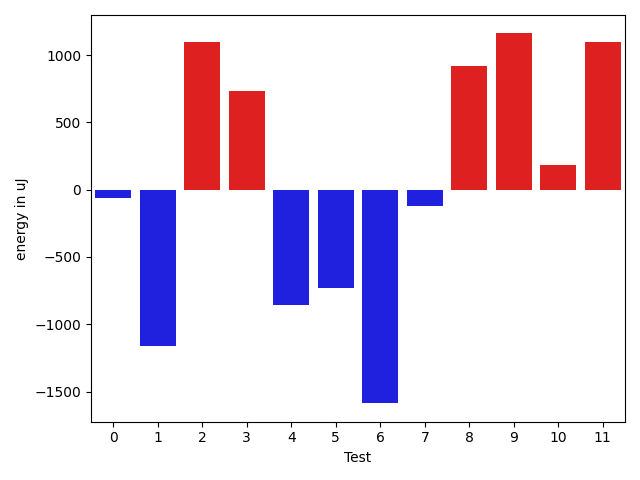

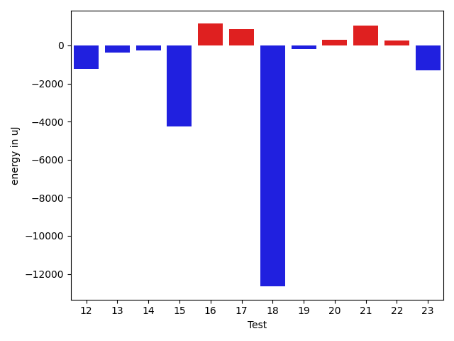

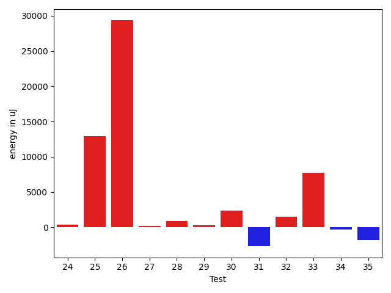

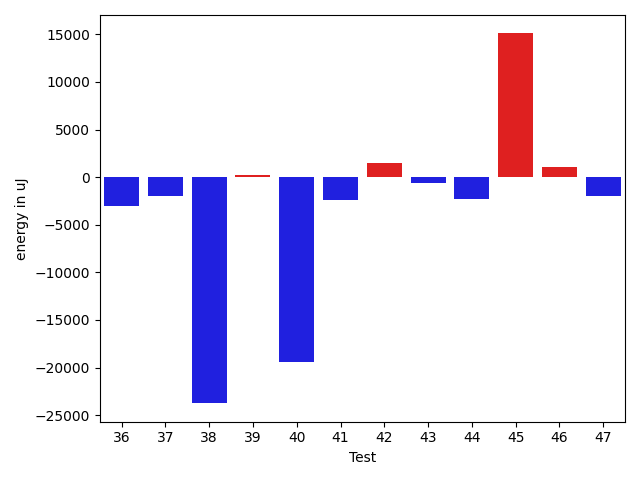

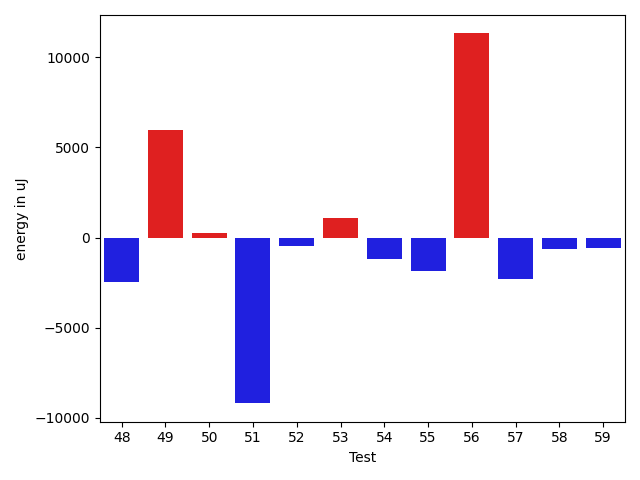

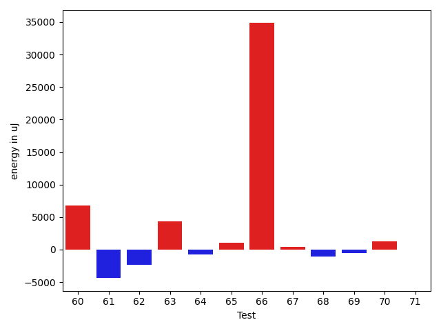

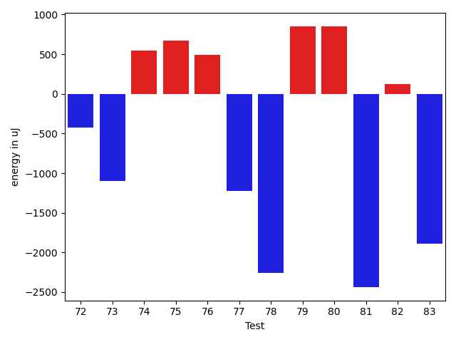

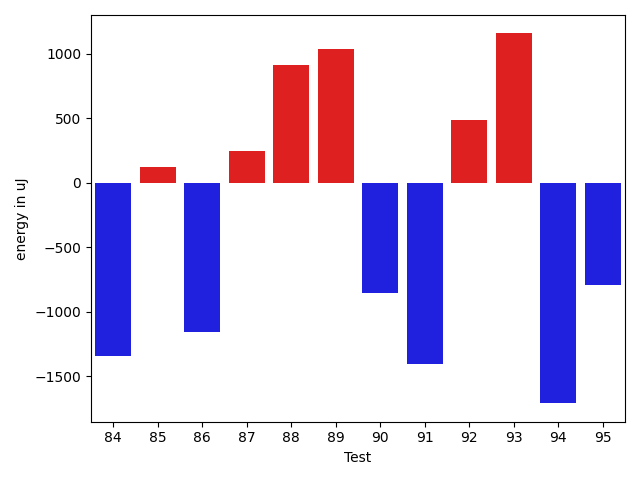

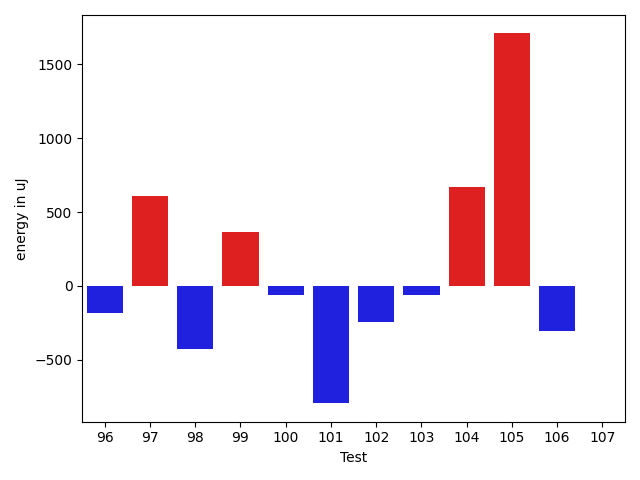

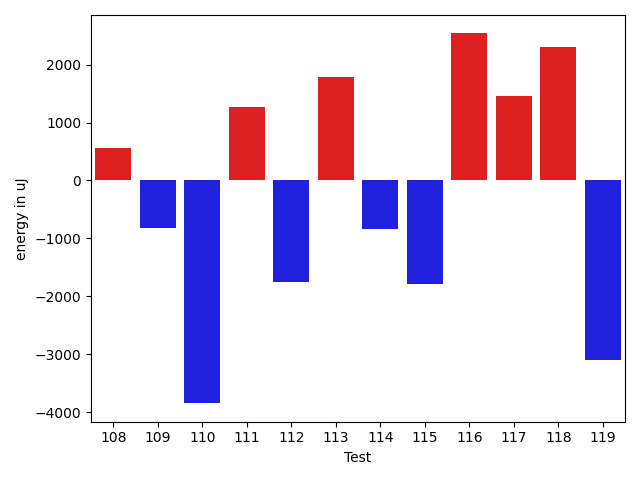

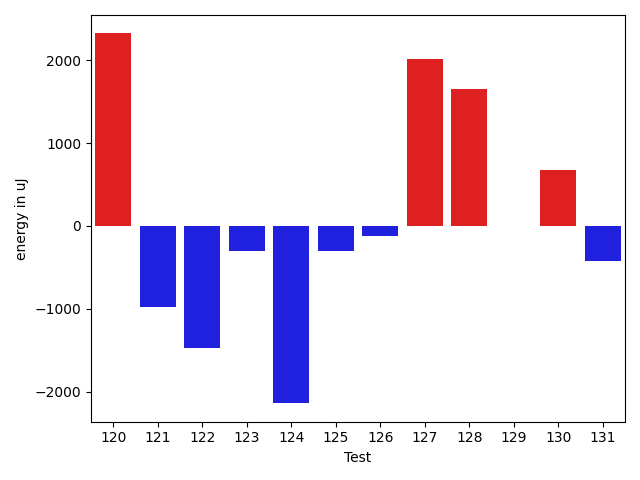

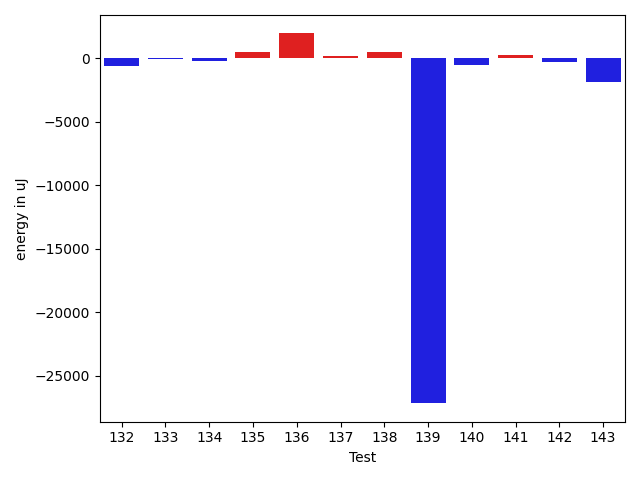

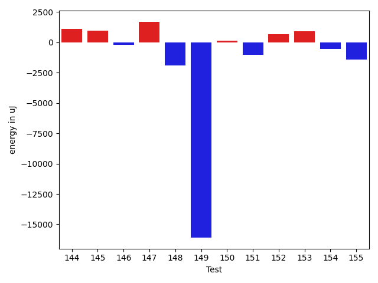

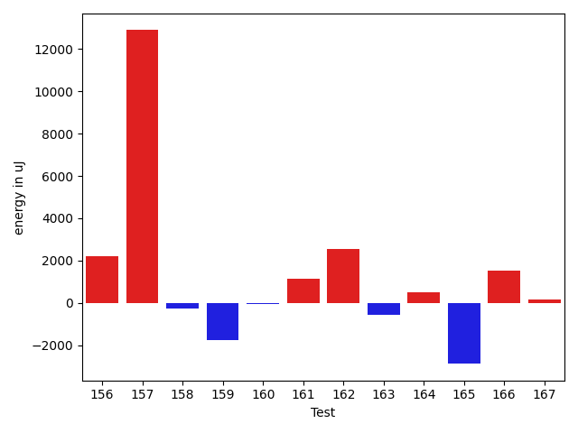

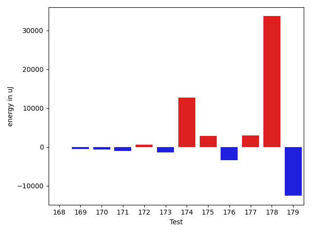

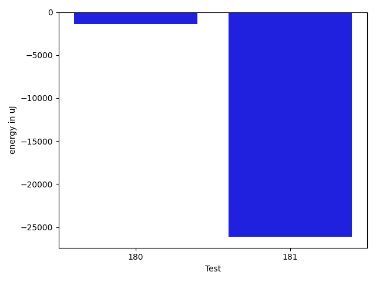

| ID | EnergyV1 | EnergyV2 | DeltaEnergy | σV1 | σV2 |
| --- | --- | --- | --- | --- | --- |
| 0 | 35461 | 35400 | -61 | 3346.90144899924 | 6011.2664952097075 |
| 1 | 36743 | 35584 | -1159 | 7087.619333546599 | 6019.090262808552 |
| 2 | 34973 | 36072 | 1099 | 4339.420940939076 | 3925.0893825147054 |
| 3 | 37659 | 38391 | 732 | 60797.68533971033 | 22586.662131140987 |
| 4 | 36560 | 35706 | -854 | 4003.1651913704254 | 4176.342470511953 |
| 5 | 36438 | 35705 | -733 | 12296.797700098989 | 8149.088745624652 |
| 6 | 37170 | 35583 | -1587 | 3194.851146375993 | 4027.262409188824 |
| 7 | 34302 | 34180 | -122 | 3801.168801551375 | 2662.379776834981 |
| 8 | 35522 | 36438 | 916 | 29162.427340764432 | 23522.644212403564 |
| 9 | 36438 | 37598 | 1160 | 16151.817600841205 | 22183.02243370575 |
| 10 | 33569 | 33752 | 183 | 3535.0576912776346 | 3495.43982807536 |
| 11 | 33508 | 34606 | 1098 | 28763.448470349183 | 18724.108909170263 |
| 12 | 35705 | 34668 | -1037 | 3774.1411679421262 | 3420.1142260712577 |
| 13 | 34729 | 36560 | 1831 | 14639.205118022233 | 5788.857742184243 |
| 14 | 33203 | 33996 | 793 | 3572.0786121568726 | 3247.195207491468 |
| 15 | 35339 | 35156 | -183 | 28749.601815737493 | 2886.7624758050283 |
| 16 | 34302 | 35401 | 1099 | 3977.4367498288257 | 3459.829222664032 |
| 17 | 36010 | 35278 | -732 | 17240.731840615117 | 17316.990045729555 |
| 18 | 34729 | 35522 | 793 | 69369.74568501477 | 4969.721493315679 |
| 19 | 35156 | 34973 | -183 | 2374.8106414546905 | 3016.4941740439044 |
| 20 | 34485 | 34362 | -123 | 3117.281496524083 | 3024.8130646537284 |
| 21 | 35218 | 36560 | 1342 | 3324.13779922262 | 3526.981994562652 |
| 22 | 35401 | 35156 | -245 | 2863.860438289548 | 3710.0637794967733 |
| 23 | 34607 | 33264 | -1343 | 2524.2200835651074 | 2913.8540094192463 |
| 24 | 35156 | 34729 | -427 | 3613.8406960447064 | 2621.508849803868 |
| 25 | 35888 | 34668 | -1220 | 3398.3807202842945 | 74451.95203380307 |
| 26 | 36377 | 37659 | 1282 | 138763.193651809 | 161098.48958597594 |
| 27 | 34302 | 35522 | 1220 | 3532.753879144745 | 3522.1597933457806 |
| 28 | 39489 | 44250 | 4761 | 92433.17331672617 | 73188.9659509275 |
| 29 | 36072 | 36865 | 793 | 3476.367016520473 | 3971.8637064302025 |
| 30 | 37110 | 36865 | -245 | 3726.576161484392 | 11898.041412338936 |
| 31 | 66406 | 62561 | -3845 | 24445.973906738633 | 23185.336416336035 |
| 32 | 34302 | 37537 | 3235 | 3845.448957360226 | 3748.984159462878 |
| 33 | 36621 | 37903 | 1282 | 44086.691961819946 | 59119.39775590439 |
| 34 | 35400 | 34851 | -549 | 3946.055965891819 | 3583.8781345137572 |
| 35 | 38513 | 38452 | -61 | 92842.2278075255 | 113945.1864829237 |
| 36 | 37353 | 36011 | -1342 | 15544.652936808163 | 10005.855542425432 |
| 37 | 37903 | 37293 | -610 | 9024.811998847417 | 4602.276586765918 |
| 38 | 37171 | 38330 | 1159 | 87928.29319859554 | 34719.48979343498 |
| 39 | 35156 | 35827 | 671 | 3640.2583152298407 | 3785.9143919077283 |
| 40 | 36438 | 35034 | -1404 | 68883.63321712332 | 4115.075409930762 |
| 41 | 34974 | 35400 | 426 | 19412.355086510215 | 6240.8733319479725 |
| 42 | 36499 | 35644 | -855 | 3978.7173697758303 | 21488.203104062195 |
| 43 | 35278 | 34729 | -549 | 3546.2172642787327 | 3088.9147349837936 |
| 44 | 36804 | 35461 | -1343 | 47217.982193170414 | 42952.57911725789 |
| 45 | 35705 | 37049 | 1344 | 19244.152637729418 | 58716.920124032746 |
| 46 | 35339 | 35340 | 1 | 3856.6688603832463 | 4287.998693799323 |
| 47 | 37841 | 35645 | -2196 | 3832.804399079087 | 3692.543170009235 |
| 48 | 36499 | 33875 | -2624 | 3305.588320999606 | 3645.2748922406386 |
| 49 | 39612 | 41259 | 1647 | 88418.37784589808 | 82850.18335072362 |
| 50 | 35462 | 35522 | 60 | 3413.3732691858127 | 3063.1074761111367 |
| 51 | 36255 | 36682 | 427 | 40042.78386019997 | 3577.764487678017 |
| 52 | 37292 | 37110 | -182 | 3733.5474720112734 | 3639.7876234579335 |
| 53 | 34058 | 36071 | 2013 | 4568.929044929457 | 3844.50184727309 |
| 54 | 37109 | 36072 | -1037 | 3069.3050401292603 | 3431.6733830031753 |
| 55 | 36499 | 34851 | -1648 | 3981.212087906005 | 3671.5068065610094 |
| 56 | 35339 | 37964 | 2625 | 3520.916130080597 | 34125.24092965011 |
| 57 | 38208 | 36316 | -1892 | 3296.42283349155 | 2938.2307412606124 |
| 58 | 34790 | 36377 | 1587 | 3472.9671592010322 | 3880.4416343173816 |
| 59 | 36072 | 34729 | -1343 | 3523.9586343707165 | 4046.8521306185426 |
| 60 | 34607 | 33996 | -611 | 3163.4252006330103 | 29427.470103969186 |
| 61 | 33935 | 34973 | 1038 | 26403.875904901288 | 3967.627811217568 |
| 62 | 35400 | 34057 | -1343 | 6529.916317027168 | 3532.1305677186187 |
| 63 | 34790 | 34973 | 183 | 3833.3013241266653 | 23044.020388126573 |
| 64 | 33509 | 33081 | -428 | 4088.060574649395 | 3062.273632524291 |
| 65 | 33691 | 34606 | 915 | 2272.449317916029 | 4207.067249265663 |
| 66 | 37659 | 37170 | -489 | 42680.84838490645 | 116708.10843435163 |
| 67 | 33387 | 33936 | 549 | 3098.560287061071 | 2565.3806483821754 |
| 68 | 34790 | 33691 | -1099 | 3607.60386763131 | 3557.32412308278 |
| 69 | 35950 | 33752 | -2198 | 3949.289631274908 | 3188.1567376881876 |
| 70 | 34362 | 35034 | 672 | 3238.7827765350753 | 6530.117874456297 |
| 71 | 35217 | 34363 | -854 | 2972.3763862232445 | 3244.6492506895106 |
| 72 | 34058 | 33630 | -428 | 3529.872199252482 | 2804.1685558362597 |
| 73 | 36377 | 35278 | -1099 | 3563.3191055546763 | 3332.721169873334 |
| 74 | 33691 | 34240 | 549 | 3739.6195742125306 | 2809.8653942527103 |
| 75 | 34302 | 34973 | 671 | 3536.5442510548937 | 3980.6952482854326 |
| 76 | 33569 | 34058 | 489 | 2728.406682423161 | 3440.8963744023154 |
| 77 | 34973 | 33752 | -1221 | 4355.630660367306 | 4203.104813871394 |
| 78 | 37903 | 35645 | -2258 | 3747.6180004498747 | 24059.968651162 |
| 79 | 34362 | 35217 | 855 | 3133.91309738146 | 2996.8847062087143 |
| 80 | 33325 | 34180 | 855 | 4062.2706249295225 | 4240.698911783797 |
| 81 | 36743 | 34302 | -2441 | 4077.3266012201866 | 3076.8129156827595 |
| 82 | 34179 | 34302 | 123 | 3935.440395505433 | 5055.361230720998 |
| 83 | 36193 | 34302 | -1891 | 5070.118431493983 | 4334.71149914985 |
| 84 | 34485 | 33142 | -1343 | 32961.6268521412 | 3401.6745320325276 |
| 85 | 34302 | 34424 | 122 | 3987.594021063022 | 3160.6979785976637 |
| 86 | 35217 | 34058 | -1159 | 3919.0472745210095 | 3503.727788116985 |
| 87 | 33631 | 33875 | 244 | 2788.5790919033575 | 3110.832274538667 |
| 88 | 34668 | 35583 | 915 | 4051.2111247872526 | 4170.019131317692 |
| 89 | 33326 | 34363 | 1037 | 3792.8552120111017 | 2947.383876839175 |
| 90 | 35645 | 34790 | -855 | 5575.948720970171 | 30796.881428264718 |
| 91 | 35828 | 34424 | -1404 | 3785.8525148852286 | 2632.727543822186 |
| 92 | 33936 | 34424 | 488 | 3577.845100406109 | 3200.7377011553485 |
| 93 | 34607 | 35766 | 1159 | 3708.9184249664418 | 6040.717754454408 |
| 94 | 39062 | 37354 | -1708 | 73902.52760624903 | 71869.13497787969 |
| 95 | 35705 | 34912 | -793 | 4506.622681979536 | 4929.312179426797 |
| 96 | 36438 | 36255 | -183 | 18481.160105750936 | 3850.1024592649464 |
| 97 | 36011 | 36621 | 610 | 3542.281081298966 | 3244.1327987939917 |
| 98 | 37110 | 36682 | -428 | 3445.1168438397463 | 3856.848698116804 |
| 99 | 36987 | 37353 | 366 | 68324.45260035785 | 55373.8857077791 |
| 100 | 37842 | 37781 | -61 | 3251.0410987229825 | 3535.107499159289 |
| 101 | 36560 | 35766 | -794 | 7506.287702717138 | 7390.740084727645 |
| 102 | 36438 | 36194 | -244 | 3642.3207523514734 | 75737.04174801936 |
| 103 | 37415 | 37353 | -62 | 51707.11529641394 | 50480.69030088252 |
| 104 | 36011 | 36682 | 671 | 101706.04805729214 | 101967.10485968307 |
| 105 | 36499 | 38208 | 1709 | 3515.9693012004705 | 2893.1554479980837 |
| 106 | 35827 | 35522 | -305 | 2759.579958991692 | 31415.59719304339 |
| 107 | 34423 | 34424 | 1 | 11512.374924991813 | 5487.564513589411 |
| 108 | 35461 | 35156 | -305 | 3709.566302151664 | 5128.300605844526 |
| 109 | 34851 | 36315 | 1464 | 20421.3547326614 | 7598.858011973085 |
| 110 | 38452 | 37414 | -1038 | 35580.897903803765 | 28307.774254826574 |
| 111 | 35095 | 36621 | 1526 | 3457.6561223377184 | 4129.050772346139 |
| 112 | 37964 | 35034 | -2930 | 2620.0660933139325 | 3781.975002120805 |
| 113 | 34851 | 36132 | 1281 | 3505.320108310851 | 3207.9492978536928 |
| 114 | 36376 | 36010 | -366 | 3368.9819241954324 | 3412.094120289516 |
| 115 | 37170 | 35645 | -1525 | 4405.482365169844 | 3349.0362018768146 |
| 116 | 36133 | 35583 | -550 | 3903.2178588546394 | 19626.564261703286 |
| 117 | 36133 | 35706 | -427 | 11805.152419461465 | 14151.703604025126 |
| 118 | 36987 | 36621 | -366 | 11227.488556454207 | 14229.829916044862 |
| 119 | 35401 | 33997 | -1404 | 71083.77461944257 | 74052.04698792535 |
| 120 | 65673 | 67993 | 2320 | 38435.11705548815 | 22738.94935599956 |
| 121 | 38086 | 37109 | -977 | 75900.94978193635 | 48926.73479959409 |
| 122 | 36255 | 34790 | -1465 | 9771.531952634887 | 13718.501326599804 |
| 123 | 37903 | 37598 | -305 | 23526.421661421464 | 15691.976128378174 |
| 124 | 37048 | 34912 | -2136 | 11329.601481156236 | 14561.455379037301 |
| 125 | 35339 | 35034 | -305 | 3015.0127600614455 | 3602.0789208691554 |
| 126 | 36255 | 36133 | -122 | 3634.7170986524316 | 3526.207210012825 |
| 127 | 35584 | 37598 | 2014 | 3520.8523606635863 | 47195.059352897624 |
| 128 | 37110 | 38757 | 1647 | 17324.14427819145 | 19909.564161841277 |
| 129 | 36255 | 36254 | -1 | 4098.946511398768 | 3577.3284792479167 |
| 130 | 34668 | 35339 | 671 | 3884.20624180654 | 4004.302727915753 |
| 131 | 36926 | 36499 | -427 | 33712.16080697448 | 34959.38305775998 |
| 132 | 35767 | 35156 | -611 | 3730.642270781165 | 3826.379500097798 |
| 133 | 35949 | 35888 | -61 | 3929.895690125337 | 4118.533931019616 |
| 134 | 36560 | 36316 | -244 | 9213.110771538712 | 3528.8627253550117 |
| 135 | 36255 | 36743 | 488 | 6611.726102797207 | 26034.178613538013 |
| 136 | 34118 | 36071 | 1953 | 3349.642564070806 | 3654.6632827196495 |
| 137 | 37414 | 37598 | 184 | 57928.623976698604 | 27859.55134812813 |
| 138 | 37170 | 37658 | 488 | 15496.532163085956 | 12439.637148301628 |
| 139 | 66284 | 39123 | -27161 | 230062.84628225575 | 362073.3648713739 |
| 140 | 36071 | 35522 | -549 | 6817.192848178508 | 4087.81782999989 |
| 141 | 36560 | 36804 | 244 | 20804.848429907044 | 6078.987157403748 |
| 142 | 35766 | 35461 | -305 | 8976.120681536902 | 5316.264142834599 |
| 143 | 37110 | 35278 | -1832 | 17866.61273996837 | 3813.616312926908 |
| 144 | 35339 | 36438 | 1099 | 7379.14997747111 | 4043.2479380107648 |
| 145 | 37658 | 38635 | 977 | 35014.6124954783 | 76356.62402633287 |
| 146 | 37537 | 37354 | -183 | 18292.50307344114 | 19473.253328534465 |
| 147 | 37293 | 39002 | 1709 | 48143.367240977685 | 46240.465025474834 |
| 148 | 39550 | 37658 | -1892 | 122386.31379629168 | 69179.04293360811 |
| 149 | 383666 | 367553 | -16113 | 167278.03430212117 | 100027.7658426912 |
| 150 | 67321 | 67444 | 123 | 21434.130563506234 | 37533.456664754165 |
| 151 | 39184 | 38147 | -1037 | 54316.176727434686 | 33483.26139779896 |
| 152 | 36376 | 37048 | 672 | 4723.420569905302 | 26091.81838274363 |
| 153 | 36560 | 37475 | 915 | 3762.5027379627913 | 7624.891075651871 |
| 154 | 71594 | 71045 | -549 | 28902.557563338087 | 31453.257782816887 |
| 155 | 35767 | 34363 | -1404 | 7504.572648767216 | 3390.3686834915165 |
| 156 | 34973 | 37170 | 2197 | 4217.2471711295275 | 4184.1719782863065 |
| 157 | 136230 | 149109 | 12879 | 31576.723690274423 | 33256.17776256878 |
| 158 | 36072 | 35828 | -244 | 3415.928766690012 | 3311.2465301105217 |
| 159 | 36621 | 34851 | -1770 | 4027.5518925893434 | 3204.2927844884107 |
| 160 | 34302 | 34241 | -61 | 6248.948129158547 | 17035.83571315497 |
| 161 | 34728 | 35888 | 1160 | 4302.397761355124 | 4369.955733113895 |
| 162 | 36865 | 39428 | 2563 | 57658.426965187806 | 89099.27072684464 |
| 163 | 35706 | 35156 | -550 | 3516.412551753134 | 3278.400779125613 |
| 164 | 33569 | 34058 | 489 | 4887.2207665360975 | 4470.251290654698 |
| 165 | 36865 | 33997 | -2868 | 47181.28431421472 | 2642.011123651829 |
| 166 | 37354 | 38879 | 1525 | 42661.702674326814 | 4060.538599195377 |
| 167 | 35584 | 35767 | 183 | 4200.680340990237 | 11315.646989294282 |
| 168 | 33569 | 36804 | 3235 | 4535.422402806831 | 3337.889974875595 |
| 169 | 36499 | 35278 | -1221 | 3045.295294974487 | 2588.8438765757874 |
| 170 | 36926 | 36438 | -488 | 38360.66995591796 | 43205.004620127125 |
| 171 | 36132 | 35217 | -915 | 3673.4609132295022 | 2973.4115144794164 |
| 172 | 34912 | 35217 | 305 | 2696.42746034246 | 3427.45388638954 |
| 173 | 35889 | 35217 | -672 | 4015.478597463159 | 3573.6652995866 |
| 174 | 36255 | 36255 | 0 | 37449.935092897314 | 59817.370006929414 |
| 175 | 35339 | 37597 | 2258 | 2931.3780113395287 | 9470.347793460818 |
| 176 | 37780 | 37902 | 122 | 21396.396489378996 | 3388.193339060973 |
| 177 | 37597 | 38146 | 549 | 22028.534328159774 | 20855.48999496296 |
| 178 | 38330 | 37232 | -1098 | 110091.37940831717 | 126858.10470163029 |
| 179 | 39978 | 36071 | -3907 | 38749.000977315525 | 3390.250792400785 |
| 180 | 37780 | 36743 | -1037 | 4782.751950731108 | 3824.991521010533 |
| 181 | 38574 | 37475 | -1099 | 325575.1933291418 | 241890.98148226138 |

## Delta Duration per test method

| ID | DurationV1 | DurationsV2 | DeltaDuration |
| --- | --- | --- | --- |
| 0 | 905923.4354838709 | 947434.8064516129 | 41511.37096774194 |
| 1 | 865630.0909090909 | 861342.3265306122 | -4287.764378478751 |
| 2 | 945072.5737704918 | 899201.0677966102 | -45871.505973881576 |
| 3 | 1535711.4905660378 | 972333.234375 | -563378.2561910378 |
| 4 | 825895.0 | 820691.3913043478 | -5203.6086956522195 |
| 5 | 1179007.3230769231 | 1069691.236111111 | -109316.08696581214 |
| 6 | 646292.6 | 604841.2105263158 | -41451.38947368413 |
| 7 | 542156.0370370371 | 603174.0689655172 | 61018.03192848014 |
| 8 | 1587157.0 | 1533470.1914893617 | -53686.80851063831 |
| 9 | 1434675.7674418604 | 1448013.6477272727 | 13337.880285412306 |
| 10 | 790849.8545454545 | 748151.9215686275 | -42697.932976827025 |
| 11 | 1107687.5438596492 | 1020404.8666666667 | -87282.67719298252 |
| 12 | 708894.8666666667 | 689929.45 | -18965.416666666744 |
| 13 | 750197.6428571428 | 706136.1568627451 | -44061.48599439778 |
| 14 | 618035.6285714286 | 665047.1666666666 | 47011.53809523804 |
| 15 | 959015.2321428572 | 795738.9423076923 | -163276.2898351649 |
| 16 | 663741.7 | 740319.3846153846 | 76577.68461538467 |
| 17 | 1207255.76 | 1198406.640625 | -8849.11937500001 |
| 18 | 1465051.7142857143 | 1032514.0806451613 | -432537.633640553 |
| 19 | 432926.04761904763 | 466385.14285714284 | 33459.09523809521 |
| 20 | 598049.3214285715 | 648038.6551724138 | 49989.33374384232 |
| 21 | 708950.5806451613 | 667196.8611111111 | -41753.71953405021 |
| 22 | 520045.1 | 473460.5 | -46584.59999999998 |
| 23 | 601416.375 | 549313.3333333334 | -52103.04166666663 |
| 24 | 576562.7916666666 | 524683.08 | -51879.71166666667 |
| 25 | 585486.28 | 984731.0606060605 | 399244.7806060605 |
| 26 | 2408378.9210526315 | 3683624.6097560977 | 1275245.6887034662 |
| 27 | 717253.8857142857 | 708225.8235294118 | -9028.062184873852 |
| 28 | 2197451.1224489794 | 2175612.4343434344 | -21838.688105545007 |
| 29 | 778537.7073170731 | 797681.7391304348 | 19144.031813361682 |
| 30 | 1111354.1125 | 1146797.012195122 | 35442.899695121916 |
| 31 | 1913393.4545454546 | 1788289.4594594594 | -125103.99508599518 |
| 32 | 642179.3870967742 | 627049.3243243244 | -15130.062772449804 |
| 33 | 1129935.8 | 1391129.8333333333 | 261194.0333333332 |
| 34 | 765926.2272727273 | 837075.8048780488 | 71149.57760532154 |
| 35 | 2203901.606060606 | 1970883.5925925926 | -233018.01346801338 |
| 36 | 1144206.5223880596 | 1094562.309859155 | -49644.21252890467 |
| 37 | 1112312.4204545454 | 1114731.075 | 2418.654545454541 |
| 38 | 1726449.1818181819 | 881859.8378378379 | -844589.343980344 |
| 39 | 765965.68 | 851440.868852459 | 85475.18885245896 |
| 40 | 1518388.75 | 814448.8983050848 | -703939.8516949152 |
| 41 | 1146216.5 | 1070077.7073170731 | -76138.79268292687 |
| 42 | 876869.6808510638 | 907088.5614035088 | 30218.880552444956 |
| 43 | 757531.1914893617 | 747476.0 | -10055.191489361692 |
| 44 | 1339762.0793650793 | 1202053.6666666667 | -137708.41269841255 |
| 45 | 886170.2765957447 | 1497126.9107142857 | 610956.634118541 |
| 46 | 817481.3220338983 | 810775.9777777778 | -6705.344256120501 |
| 47 | 599542.6 | 572364.4347826086 | -27178.16521739133 |
| 48 | 473679.3461538461 | 454256.8 | -19422.54615384614 |
| 49 | 2230435.6 | 2646078.9615384615 | 415643.3615384614 |
| 50 | 444908.0 | 435819.47826086957 | -9088.521739130432 |
| 51 | 819463.4444444445 | 415918.26923076925 | -403545.17521367525 |
| 52 | 496867.4736842105 | 467113.85714285716 | -29753.616541353345 |
| 53 | 505058.04 | 554637.6086956522 | 49579.56869565224 |
| 54 | 438635.7894736842 | 448217.8823529412 | 9582.09287925699 |
| 55 | 534411.4666666667 | 501418.4347826087 | -32993.03188405797 |
| 56 | 466604.4074074074 | 732009.6666666666 | 265405.2592592592 |
| 57 | 458493.8695652174 | 442655.5833333333 | -15838.286231884093 |
| 58 | 476631.77777777775 | 448252.3125 | -28379.465277777752 |
| 59 | 788094.5087719298 | 758919.8571428572 | -29174.651629072614 |
| 60 | 494648.75 | 704323.08 | 209674.32999999996 |
| 61 | 650258.8620689656 | 486202.9090909091 | -164055.95297805645 |
| 62 | 969051.6486486486 | 978642.8292682926 | 9591.180619644001 |
| 63 | 450749.94736842107 | 614947.2173913043 | 164197.27002288325 |
| 64 | 431946.0 | 448541.6666666667 | 16595.666666666686 |
| 65 | 551803.4827586206 | 570707.53125 | 18904.048491379363 |
| 66 | 1136449.2045454546 | 2311786.125 | 1175336.9204545454 |
| 67 | 442858.3043478261 | 448186.375 | 5328.07065217389 |
| 68 | 643862.2727272727 | 630629.0833333334 | -13233.189393939334 |
| 69 | 546481.0294117647 | 573263.5862068966 | 26782.55679513188 |
| 70 | 641971.7111111111 | 693875.5789473684 | 51903.86783625733 |
| 71 | 526508.75 | 471595.63333333336 | -54913.11666666664 |
| 72 | 497040.7083333333 | 472916.35714285716 | -24124.351190476154 |
| 73 | 625902.8148148148 | 557551.1578947369 | -68351.65692007798 |
| 74 | 608981.8387096775 | 758886.1290322581 | 149904.2903225806 |
| 75 | 419579.54545454547 | 467305.2083333333 | 47725.66287878784 |
| 76 | 431455.94444444444 | 455433.9583333333 | 23978.013888888876 |
| 77 | 636923.1935483871 | 677534.5 | 40611.30645161285 |
| 78 | 606514.2857142857 | 831919.1785714285 | 225404.89285714284 |
| 79 | 488215.2105263158 | 455257.26923076925 | -32957.94129554654 |
| 80 | 444679.0 | 443197.9655172414 | -1481.0344827586086 |
| 81 | 452458.23076923075 | 546215.75 | 93757.51923076925 |
| 82 | 490950.14285714284 | 539148.3461538461 | 48198.20329670329 |
| 83 | 729483.075 | 770841.4864864865 | 41358.411486486555 |
| 84 | 814879.3214285715 | 543720.448275862 | -271158.87315270945 |
| 85 | 503742.3333333333 | 540537.7631578947 | 36795.429824561405 |
| 86 | 425136.875 | 469525.1818181818 | 44388.30681818182 |
| 87 | 456682.36842105264 | 449570.4705882353 | -7111.89783281734 |
| 88 | 573313.08 | 663912.375 | 90599.29500000004 |
| 89 | 445372.1052631579 | 477644.0 | 32271.894736842078 |
| 90 | 570288.2222222222 | 773959.4583333334 | 203671.23611111112 |
| 91 | 435718.45454545453 | 497436.76 | 61718.30545454548 |
| 92 | 444088.9375 | 435267.1666666667 | -8821.770833333314 |
| 93 | 1006814.1 | 1023434.9848484849 | 16620.884848484886 |
| 94 | 1823052.34 | 1771966.7049180327 | -51085.63508196734 |
| 95 | 721976.1904761905 | 813762.2340425532 | 91786.0435663627 |
| 96 | 918694.72 | 906549.1587301587 | -12145.561269841273 |
| 97 | 590048.6785714285 | 623916.125 | 33867.44642857148 |
| 98 | 746087.0 | 734083.9318181818 | -12003.068181818235 |
| 99 | 1334333.351851852 | 1397442.0 | 63108.64814814809 |
| 100 | 754777.25 | 577904.6071428572 | -176872.64285714284 |
| 101 | 738805.5483870967 | 742465.8823529412 | 3660.3339658444747 |
| 102 | 577547.6071428572 | 1043708.6585365854 | 466161.05139372824 |
| 103 | 1111333.7857142857 | 1054741.2954545454 | -56592.49025974027 |
| 104 | 1618132.4333333333 | 1678338.28 | 60205.84666666668 |
| 105 | 509880.90476190473 | 547874.3636363636 | 37993.45887445891 |
| 106 | 569825.1851851852 | 883381.7333333333 | 313556.5481481481 |
| 107 | 901370.0 | 773070.3636363636 | -128299.63636363635 |
| 108 | 898586.5846153846 | 930745.3692307692 | 32158.784615384648 |
| 109 | 887465.2195121951 | 705600.4102564103 | -181864.80925578484 |
| 110 | 1101586.1764705882 | 1006441.911111111 | -95144.26535947714 |
| 111 | 710709.8611111111 | 622429.0357142857 | -88280.82539682544 |
| 112 | 421846.22222222225 | 499990.0 | 78143.77777777775 |
| 113 | 598391.0 | 642385.04 | 43994.04000000004 |
| 114 | 691686.3 | 536461.0 | -155225.30000000005 |
| 115 | 709639.9230769231 | 557116.4814814815 | -152523.44159544166 |
| 116 | 1039631.2564102564 | 1231295.3292682928 | 191664.07285803638 |
| 117 | 1236952.0689655172 | 1258128.0454545454 | 21175.976489028195 |
| 118 | 1342451.8617021276 | 1369770.7340425532 | 27318.872340425616 |
| 119 | 1780564.7011494252 | 1833488.5512820513 | 52923.850132626016 |
| 120 | 2080232.808080808 | 2087950.3232323232 | 7717.515151515137 |
| 121 | 1843972.8829787234 | 1835657.2325581396 | -8315.650420583785 |
| 122 | 1248479.8461538462 | 1318348.3043478262 | 69868.45819397992 |
| 123 | 1586821.8282828282 | 1563310.2424242424 | -23511.58585858578 |
| 124 | 1278685.430107527 | 1332131.1935483871 | 53445.7634408602 |
| 125 | 829024.1833333333 | 865670.5087719298 | 36646.325438596425 |
| 126 | 973159.1860465116 | 753812.4107142857 | -219346.77533222595 |
| 127 | 876711.4237288135 | 1596007.6911764706 | 719296.2674476571 |
| 128 | 1467922.9893617022 | 1570153.3333333333 | 102230.34397163102 |
| 129 | 738964.3260869565 | 790843.0212765958 | 51878.69518963923 |
| 130 | 848024.0333333333 | 895100.2941176471 | 47076.26078431378 |
| 131 | 1287187.2857142857 | 1302479.6323529412 | 15292.346638655523 |
| 132 | 777819.6666666666 | 943692.8085106383 | 165873.14184397168 |
| 133 | 971395.0869565217 | 1037071.2564102564 | 65676.16945373465 |
| 134 | 860163.5263157894 | 937211.44 | 77047.9136842105 |
| 135 | 790525.1860465116 | 901398.84 | 110873.65395348833 |
| 136 | 707477.2564102564 | 742708.9615384615 | 35231.705128205125 |
| 137 | 1496880.578125 | 1042320.2794117647 | -454560.2987132353 |
| 138 | 1304519.5063291139 | 1198137.1973684211 | -106382.30896069272 |
| 139 | 2489641.7529411763 | 3440069.0135135134 | 950427.2605723371 |
| 140 | 921339.8909090909 | 867687.4385964912 | -53652.452312599635 |
| 141 | 1064344.7397260275 | 937118.7611940298 | -127225.97853199765 |
| 142 | 986191.1016949152 | 968717.4666666667 | -17473.635028248536 |
| 143 | 720481.8285714285 | 829693.0333333333 | 109211.20476190478 |
| 144 | 701086.8275862068 | 530583.7931034482 | -170503.0344827586 |
| 145 | 935211.8888888889 | 1452786.8157894737 | 517574.92690058483 |
| 146 | 1316465.948051948 | 1175445.2857142857 | -141020.66233766242 |
| 147 | 1501119.9310344828 | 1605724.075471698 | 104604.14443721529 |
| 148 | 2142840.175 | 1221257.8048780488 | -921582.370121951 |
| 149 | 11627021.757575758 | 10918074.616161617 | -708947.1414141413 |
| 150 | 1960489.3163265307 | 2010490.888888889 | 50001.57256235834 |
| 151 | 1347664.2173913044 | 956868.4166666666 | -390795.8007246378 |
| 152 | 670273.7297297297 | 811394.9772727273 | 141121.2475429976 |
| 153 | 701959.1081081082 | 773834.4 | 71875.29189189186 |
| 154 | 2156945.696969697 | 2134316.9595959596 | -22628.737373737153 |
| 155 | 1005209.25 | 758554.4 | -246654.84999999998 |
| 156 | 610753.32 | 620268.6896551724 | 9515.369655172457 |
| 157 | 4402378.454545454 | 4706096.323232323 | 303717.8686868688 |
| 158 | 599788.0 | 608019.0 | 8231.0 |
| 159 | 570364.1 | 782834.4642857143 | 212470.36428571434 |
| 160 | 1031646.5 | 1086343.8051948051 | 54697.30519480514 |
| 161 | 449552.77777777775 | 447061.9375 | -2490.840277777752 |
| 162 | 1321777.9032258065 | 2503953.277777778 | 1182175.3745519714 |
| 163 | 658314.0238095238 | 806948.6 | 148634.5761904762 |
| 164 | 473206.85714285716 | 563772.88 | 90566.02285714285 |
| 165 | 1154176.0222222223 | 655922.6 | -498253.4222222223 |
| 166 | 993030.5294117647 | 524902.6 | -468127.9294117647 |
| 167 | 719546.9019607843 | 1044785.3846153846 | 325238.4826546003 |
| 168 | 545604.9523809524 | 502153.5625 | -43451.389880952425 |
| 169 | 481714.3125 | 535506.9444444445 | 53792.631944444496 |
| 170 | 1323306.1746031747 | 1291380.196969697 | -31925.977633477654 |
| 171 | 638586.1578947369 | 590922.8214285715 | -47663.336466165376 |
| 172 | 672976.4666666667 | 615730.1538461539 | -57246.3128205128 |
| 173 | 661266.6976744186 | 622366.2 | -38900.49767441861 |
| 174 | 1108244.7666666666 | 1531999.21875 | 423754.4520833334 |
| 175 | 723578.7435897436 | 888233.659574468 | 164654.91598472442 |
| 176 | 719766.8888888889 | 639186.8857142857 | -80580.00317460322 |
| 177 | 1002374.7555555556 | 1355701.16 | 353326.40444444434 |
| 178 | 2110871.0833333335 | 3349619.5714285714 | 1238748.4880952379 |
| 179 | 934346.05 | 411353.28571428574 | -522992.7642857143 |
| 180 | 522023.5 | 520340.8888888889 | -1682.611111111124 |
| 181 | 2833933.4938271604 | 2115836.786516854 | -718096.7073103064 |

## Misc.

| ID | Test Class | Test Method |
| --- | --- | --- |
| 0 | com.google.gson.functional.CustomTypeAdaptersTest | testCustomAdapterInvokedForCollectionElementDeserialization |
| 1 | com.google.gson.functional.CustomTypeAdaptersTest | testCustomAdapterInvokedForMapElementDeserialization |
| 2 | com.google.gson.functional.CustomTypeAdaptersTest | testCustomNestedDeserializers |
| 3 | com.google.gson.functional.CustomTypeAdaptersTest | testCustomDeserializers |
| 4 | com.google.gson.functional.CustomTypeAdaptersTest | testCustomByteArrayDeserializerAndInstanceCreator |
| 5 | com.google.gson.functional.CustomTypeAdaptersTest | testCustomDeserializerForLong |
| 6 | com.google.gson.functional.CustomTypeAdaptersTest | testEnsureCustomDeserializerNotInvokedForNullValues |
| 7 | com.google.gson.functional.ObjectTest | testStringFieldWithEmptyValueDeserialization |
| 8 | com.google.gson.functional.ObjectTest | testEmptyCollectionInAnObjectDeserialization |
| 9 | com.google.gson.functional.ObjectTest | testArrayOfArraysDeserialization |
| 10 | com.google.gson.functional.ObjectTest | testPrimitiveArrayInAnObjectDeserialization |
| 11 | com.google.gson.functional.ObjectTest | testNestedDeserialization |
| 12 | com.google.gson.functional.ObjectTest | testBagOfPrimitiveWrappersDeserialization |
| 13 | com.google.gson.functional.ObjectTest | testNullFieldsDeserialization |
| 14 | com.google.gson.functional.ObjectTest | testNullPrimitiveFieldsDeserialization |
| 15 | com.google.gson.functional.ObjectTest | testInnerClassDeserialization |
| 16 | com.google.gson.functional.ObjectTest | testClassWithTransientFieldsDeserialization |
| 17 | com.google.gson.functional.ObjectTest | testStringFieldWithNumberValueDeserialization |
| 18 | com.google.gson.functional.ObjectTest | testArrayOfObjectsDeserialization |
| 19 | com.google.gson.functional.ObjectTest | testClassWithNoFieldsDeserialization |
| 20 | com.google.gson.functional.ObjectTest | testClassWithTransientFieldsDeserializationTransientFieldsPassedInJsonAreIgnored |
| 21 | com.google.gson.functional.ObjectTest | testBagOfPrimitivesDeserialization |
| 22 | com.google.gson.functional.ObjectTest | testNullObjectFieldsDeserialization |
| 23 | com.google.gson.functional.ObjectTest | testPrivateNoArgConstructorDeserialization |
| 24 | com.google.gson.functional.ObjectTest | testNullArraysDeserialization |
| 25 | com.google.gson.functional.ObjectTest | testObjectFieldNamesWithoutQuotesDeserialization |
| 26 | com.google.gson.functional.ObjectTest | testJsonInSingleQuotesDeserialization |
| 27 | com.google.gson.functional.ObjectTest | testJsonInMixedQuotesDeserialization |
| 28 | com.google.gson.functional.CustomDeserializerTest | testDefaultConstructorNotCalledOnObject |
| 29 | com.google.gson.functional.CustomDeserializerTest | testDefaultConstructorNotCalledOnField |
| 30 | com.google.gson.functional.CustomDeserializerTest | testJsonTypeFieldBasedDeserialization |
| 31 | com.google.gson.functional.JsonParserTest | testBadTypeForDeserializingCustomTree |
| 32 | com.google.gson.functional.JsonParserTest | testBadFieldTypeForCustomDeserializerCustomTree |
| 33 | com.google.gson.functional.JsonParserTest | testChangingCustomTreeAndDeserializing |
| 34 | com.google.gson.functional.JsonParserTest | testBadFieldTypeForDeserializingCustomTree |
| 35 | com.google.gson.functional.JsonParserTest | testDeserializingCustomTree |
| 36 | com.google.gson.functional.ReadersWritersTest | testReadWriteTwoObjects |
| 37 | com.google.gson.functional.ReadersWritersTest | testReadWriteTwoStrings |
| 38 | com.google.gson.functional.ReadersWritersTest | testReaderForDeserialization |
| 39 | com.google.gson.functional.MapTest | testMapDeserializationWithIntegerKeys |
| 40 | com.google.gson.functional.MapTest | testMapOfMapDeserialization |
| 41 | com.google.gson.functional.MapTest | testParameterizedMapSubclassDeserialization |
| 42 | com.google.gson.functional.MapTest | testMapDeserializationWithWildcardValues |
| 43 | com.google.gson.functional.MapTest | testMapDeserializationEmpty |
| 44 | com.google.gson.functional.MapTest | testMapDeserialization |
| 45 | com.google.gson.functional.MapTest | testMapDeserializationWithNullValue |
| 46 | com.google.gson.functional.MapTest | testMapDeserializationWithNullKey |
| 47 | com.google.gson.functional.StringTest | testSingleQuoteInStringSerialization |
| 48 | com.google.gson.functional.StringTest | testEscapedCtrlNInStringDeserialization |
| 49 | com.google.gson.functional.StringTest | testStringValueDeserialization |
| 50 | com.google.gson.functional.StringTest | testAssignmentCharDeserialization |
| 51 | com.google.gson.functional.StringTest | testStringWithEscapedSlashDeserialization |
| 52 | com.google.gson.functional.StringTest | testEscapedBackslashInStringDeserialization |
| 53 | com.google.gson.functional.StringTest | testStringValueAsSingleElementArrayDeserialization |
| 54 | com.google.gson.functional.StringTest | testEscapedCtrlRInStringDeserialization |
| 55 | com.google.gson.functional.StringTest | testEscapingQuotesInStringSerialization |
| 56 | com.google.gson.functional.StringTest | testJavascriptKeywordsInStringDeserialization |
| 57 | com.google.gson.functional.StringTest | testSingleQuoteInStringDeserialization |
| 58 | com.google.gson.functional.StringTest | testEscapingQuotesInStringDeserialization |
| 59 | com.google.gson.functional.PrimitiveTest | testDoubleAsStringRepresentationDeserialization |
| 60 | com.google.gson.functional.PrimitiveTest | testFloatNaNDeserialization |
| 61 | com.google.gson.functional.PrimitiveTest | testDoubleNaNDeserialization |
| 62 | com.google.gson.functional.PrimitiveTest | testPrimitiveDoubleAutoboxedDeserialization |
| 63 | com.google.gson.functional.PrimitiveTest | testBigDecimalNoFractAsStringRepresentationDeserialization |
| 64 | com.google.gson.functional.PrimitiveTest | testBigDecimalDeserialization |
| 65 | com.google.gson.functional.PrimitiveTest | testLargeDoubleDeserialization |
| 66 | com.google.gson.functional.PrimitiveTest | testPrimitiveIntegerAutoboxedInASingleElementArrayDeserialization |
| 67 | com.google.gson.functional.PrimitiveTest | testBigIntegerInASingleElementArrayDeserialization |
| 68 | com.google.gson.functional.PrimitiveTest | testNumberDeserialization |
| 69 | com.google.gson.functional.PrimitiveTest | testBigDecimalNaNDeserializationNotSupported |
| 70 | com.google.gson.functional.PrimitiveTest | testOverridingDefaultPrimitiveSerialization |
| 71 | com.google.gson.functional.PrimitiveTest | testNegativeInfinityDeserialization |
| 72 | com.google.gson.functional.PrimitiveTest | testFloatInfinityDeserialization |
| 73 | com.google.gson.functional.PrimitiveTest | testPrimitiveLongAutoboxedDeserialization |
| 74 | com.google.gson.functional.PrimitiveTest | testBadValueForBigIntegerDeserialization |
| 75 | com.google.gson.functional.PrimitiveTest | testBigDecimalNegativeInfinityDeserializationNotSupported |
| 76 | com.google.gson.functional.PrimitiveTest | testBigDecimalInASingleElementArrayDeserialization |
| 77 | com.google.gson.functional.PrimitiveTest | testPrimitiveBooleanAutoboxedInASingleElementArrayDeserialization |
| 78 | com.google.gson.functional.PrimitiveTest | testPrimitiveIntegerAutoboxedDeserialization |
| 79 | com.google.gson.functional.PrimitiveTest | testBigIntegerDeserialization |
| 80 | com.google.gson.functional.PrimitiveTest | testBigDecimalPreservePrecisionDeserialization |
| 81 | com.google.gson.functional.PrimitiveTest | testDoubleInfinityDeserialization |
| 82 | com.google.gson.functional.PrimitiveTest | testReallyLongValuesDeserialization |
| 83 | com.google.gson.functional.PrimitiveTest | testPrimitiveBooleanAutoboxedDeserialization |
| 84 | com.google.gson.functional.PrimitiveTest | testDoubleNoFractAsStringRepresentationDeserialization |
| 85 | com.google.gson.functional.PrimitiveTest | testPrimitiveDoubleAutoboxedInASingleElementArrayDeserialization |
| 86 | com.google.gson.functional.PrimitiveTest | testBigDecimalAsStringRepresentationDeserialization |
| 87 | com.google.gson.functional.PrimitiveTest | testSmallValueForBigDecimalDeserialization |
| 88 | com.google.gson.functional.PrimitiveTest | testLongAsStringDeserialization |
| 89 | com.google.gson.functional.PrimitiveTest | testBigDecimalInfinityDeserializationNotSupported |
| 90 | com.google.gson.functional.PrimitiveTest | testPrimitiveLongAutoboxedInASingleElementArrayDeserialization |
| 91 | com.google.gson.functional.PrimitiveTest | testNegativeInfinityFloatDeserialization |
| 92 | com.google.gson.functional.PrimitiveTest | testSmallValueForBigIntegerDeserialization |
| 93 | com.google.gson.functional.VersioningTest | testVersionedGsonMixingSinceAndUntilDeserialization |
| 94 | com.google.gson.functional.VersioningTest | testVersionedUntilDeserialization |
| 95 | com.google.gson.functional.VersioningTest | testVersionedGsonWithUnversionedClassesDeserialization |
| 96 | com.google.gson.functional.VersioningTest | testVersionedClassesDeserialization |
| 97 | com.google.gson.functional.VersioningTest | testIgnoreLaterVersionClassDeserialization |
| 98 | com.google.gson.functional.ExposeFieldsTest | testNoExposedFieldDeserialization |
| 99 | com.google.gson.functional.ExposeFieldsTest | testExposeAnnotationDeserialization |
| 100 | com.google.gson.functional.ExposeFieldsTest | testExposedInterfaceFieldDeserialization |
| 101 | com.google.gson.GsonTypeAdapterTest | testDefaultTypeAdapterThrowsParseException |
| 102 | com.google.gson.GsonTypeAdapterTest | testTypeAdapterProperlyConvertsTypes |
| 103 | com.google.gson.GsonTypeAdapterTest | testTypeAdapterThrowsException |
| 104 | com.google.gson.GsonTypeAdapterTest | testTypeAdapterDoesNotAffectNonAdaptedTypes |
| 105 | com.google.gson.functional.ArrayTest | testArrayOfStringsDeserialization |
| 106 | com.google.gson.functional.ArrayTest | testEmptyArrayDeserialization |
| 107 | com.google.gson.functional.ArrayTest | testArrayOfPrimitivesAsObjectsDeserialization |
| 108 | com.google.gson.functional.ArrayTest | testArrayOfCollectionDeserialization |
| 109 | com.google.gson.functional.ArrayTest | testArrayOfObjectsWithoutTypeInfoDeserialization |
| 110 | com.google.gson.functional.ArrayTest | testTopLevelArrayOfIntsDeserialization |
| 111 | com.google.gson.functional.ArrayTest | testArrayOfPrimitivesWithCustomTypeAdapter |
| 112 | com.google.gson.functional.ArrayTest | testSingleNullInArrayDeserialization |
| 113 | com.google.gson.functional.ArrayTest | testArrayWithoutTypeInfoDeserialization |
| 114 | com.google.gson.functional.ArrayTest | testNullsInArrayDeserialization |
| 115 | com.google.gson.functional.ArrayTest | testSingleStringArrayDeserialization |
| 116 | com.google.gson.functional.ParameterizedTypesTest | testParameterizedTypeWithReaderDeserialization |
| 117 | com.google.gson.functional.ParameterizedTypesTest | testVariableTypeDeserialization |
| 118 | com.google.gson.functional.ParameterizedTypesTest | testParameterizedTypeGenericArraysDeserialization |
| 119 | com.google.gson.functional.ParameterizedTypesTest | testParameterizedTypeDeserialization |
| 120 | com.google.gson.functional.ParameterizedTypesTest | testVariableTypeFieldsAndGenericArraysDeserialization |
| 121 | com.google.gson.functional.ParameterizedTypesTest | testTypesWithMultipleParametersDeserialization |
| 122 | com.google.gson.functional.ParameterizedTypesTest | testParameterizedTypeWithVariableTypeDeserialization |
| 123 | com.google.gson.functional.ParameterizedTypesTest | testParameterizedTypesWithCustomDeserializer |
| 124 | com.google.gson.functional.ParameterizedTypesTest | testVariableTypeArrayDeserialization |
| 125 | com.google.gson.functional.ParameterizedTypesTest | testDeepParameterizedTypeDeserialization |
| 126 | com.google.gson.functional.CollectionTest | testQueueDeserialization |
| 127 | com.google.gson.functional.CollectionTest | testSetDeserialization |
| 128 | com.google.gson.functional.CollectionTest | testWildcardCollectionField |
| 129 | com.google.gson.functional.CollectionTest | testCollectionOfStringsDeserialization |
| 130 | com.google.gson.functional.CollectionTest | testWildcardPrimitiveCollectionDeserilaization |
| 131 | com.google.gson.functional.CollectionTest | testTopLevelCollectionOfIntegersDeserialization |
| 132 | com.google.gson.functional.CollectionTest | testLinkedListDeserialization |
| 133 | com.google.gson.functional.CollectionTest | testTopLevelListOfIntegerCollectionsDeserialization |
| 134 | com.google.gson.functional.CollectionTest | testRawCollectionDeserializationNotAlllowed |
| 135 | com.google.gson.functional.CollectionTest | testNullsInListDeserialization |
| 136 | com.google.gson.functional.CollectionTest | testRawCollectionOfBagOfPrimitivesNotAllowed |
| 137 | com.google.gson.functional.InheritanceTest | testSubClassDeserialization |
| 138 | com.google.gson.functional.InheritanceTest | testSubInterfacesOfCollectionDeserialization |
| 139 | com.google.gson.functional.InstanceCreatorTest | testInstanceCreatorReturnsBaseType |
| 140 | com.google.gson.functional.InstanceCreatorTest | testInstanceCreatorReturnsSubTypeForTopLevelObject |
| 141 | com.google.gson.functional.InstanceCreatorTest | testInstanceCreatorReturnsSubTypeForField |
| 142 | com.google.gson.functional.EnumTest | testCollectionOfEnumsDeserialization |
| 143 | com.google.gson.functional.EnumTest | testClassWithEnumFieldDeserialization |
| 144 | com.google.gson.functional.EnumTest | testTopLevelEnumInASingleElementArrayDeserialization |
| 145 | com.google.gson.functional.EnumTest | testTopLevelEnumDeserialization |
| 146 | com.google.gson.functional.EscapingTest | testGsonAcceptsEscapedAndNonEscapedJsonDeserialization |
| 147 | com.google.gson.functional.EscapingTest | testEscapingObjectFields |
| 148 | com.google.gson.functional.EscapingTest | testEscapingQuotesInStringArray |
| 149 | com.google.gson.functional.ConcurrencyTest | testMultiThreadDeserialization |
| 150 | com.google.gson.functional.ConcurrencyTest | testSingleThreadDeserialization |
| 151 | com.google.gson.functional.SecurityTest | testNonExecutableJsonDeserialization |
| 152 | com.google.gson.functional.SecurityTest | testJsonWithNonExectuableTokenWithConfiguredGsonDeserialization |
| 153 | com.google.gson.functional.SecurityTest | testJsonWithNonExectuableTokenWithRegularGsonDeserialization |
| 154 | com.google.gson.functional.UncategorizedTest | testReturningDerivedClassesDuringDeserialization |
| 155 | com.google.gson.functional.DefaultTypeAdaptersTest | testDateDeserializationWithPattern |
| 156 | com.google.gson.functional.DefaultTypeAdaptersTest | testBigDecimalFieldDeserialization |
| 157 | com.google.gson.functional.DefaultTypeAdaptersTest | testDefaultDateDeserialization |
| 158 | com.google.gson.functional.DefaultTypeAdaptersTest | testDefaultGregorianCalendarDeserialization |
| 159 | com.google.gson.functional.DefaultTypeAdaptersTest | testBigIntegerFieldDeserialization |
| 160 | com.google.gson.functional.DefaultTypeAdaptersTest | testDefaultDateDeserializationUsingBuilder |
| 161 | com.google.gson.functional.DefaultTypeAdaptersTest | testLocaleDeserializationWithLanguageCountryVariant |
| 162 | com.google.gson.functional.DefaultTypeAdaptersTest | testUrlDeserialization |
| 163 | com.google.gson.functional.DefaultTypeAdaptersTest | testPropertiesDeserialization |
| 164 | com.google.gson.functional.DefaultTypeAdaptersTest | testUriDeserialization |
| 165 | com.google.gson.functional.DefaultTypeAdaptersTest | testDefaultCalendarDeserialization |
| 166 | com.google.gson.functional.DefaultTypeAdaptersTest | testLocaleDeserializationWithLanguageCountry |
| 167 | com.google.gson.functional.DefaultTypeAdaptersTest | testUrlNullDeserialization |
| 168 | com.google.gson.functional.DefaultTypeAdaptersTest | testUuidDeserialization |
| 169 | com.google.gson.functional.DefaultTypeAdaptersTest | testLocaleDeserializationWithLanguage |
| 170 | com.google.gson.functional.CircularReferenceTest | testDirectedAcyclicGraphDeserialization |
| 171 | com.google.gson.functional.NamingPolicyTest | testGsonWithLowerCaseUnderscorePolicyDeserialiation |
| 172 | com.google.gson.functional.NamingPolicyTest | testGsonWithLowerCaseDashPolicyDeserialiation |
| 173 | com.google.gson.functional.NamingPolicyTest | testGsonWithSerializedNameFieldNamingPolicyDeserialization |
| 174 | com.google.gson.functional.NamingPolicyTest | testGsonWithNonDefaultFieldNamingPolicyDeserialiation |
| 175 | com.google.gson.functional.NullObjectAndFieldTest | testNullWrappedPrimitiveMemberDeserialization |
| 176 | com.google.gson.functional.NullObjectAndFieldTest | testExplicitNullSetsFieldToNullDuringDeserialization |
| 177 | com.google.gson.functional.NullObjectAndFieldTest | testExplicitDeserializationOfNulls |
| 178 | com.google.gson.functional.InternationalizationTest | testStringsWithRawChineseCharactersDeserialization |
| 179 | com.google.gson.functional.InternationalizationTest | testStringsWithUnicodeChineseCharactersEscapedDeserialization |
| 180 | com.google.gson.functional.InternationalizationTest | testStringsWithUnicodeChineseCharactersDeserialization |
| 181 | com.google.gson.JsonParserTest | testReadWriteTwoObjects |

| Test | IterationV1 | IterationV2 | DeltaIteration |
| --- | --- | --- | --- |
| 0 | 62 | 62 | 0 |
| 1 | 66 | 49 | -17 |
| 2 | 61 | 59 | -2 |
| 3 | 53 | 64 | 11 |
| 4 | 57 | 46 | -11 |
| 5 | 65 | 72 | 7 |
| 6 | 40 | 38 | -2 |
| 7 | 27 | 29 | 2 |
| 8 | 93 | 94 | 1 |
| 9 | 86 | 88 | 2 |
| 10 | 55 | 51 | -4 |
| 11 | 57 | 45 | -12 |
| 12 | 30 | 40 | 10 |
| 13 | 42 | 51 | 9 |
| 14 | 35 | 30 | -5 |
| 15 | 56 | 52 | -4 |
| 16 | 30 | 26 | -4 |
| 17 | 75 | 64 | -11 |
| 18 | 63 | 62 | -1 |
| 19 | 21 | 21 | 0 |
| 20 | 28 | 29 | 1 |
| 21 | 31 | 36 | 5 |
| 22 | 20 | 22 | 2 |
| 23 | 32 | 21 | -11 |
| 24 | 24 | 25 | 1 |
| 25 | 25 | 33 | 8 |
| 26 | 38 | 41 | 3 |
| 27 | 35 | 34 | -1 |
| 28 | 98 | 99 | 1 |
| 29 | 41 | 46 | 5 |
| 30 | 80 | 82 | 2 |
| 31 | 77 | 74 | -3 |
| 32 | 31 | 37 | 6 |
| 33 | 50 | 36 | -14 |
| 34 | 44 | 41 | -3 |
| 35 | 33 | 27 | -6 |
| 36 | 67 | 71 | 4 |
| 37 | 88 | 80 | -8 |
| 38 | 44 | 37 | -7 |
| 39 | 50 | 61 | 11 |
| 40 | 68 | 59 | -9 |
| 41 | 82 | 82 | 0 |
| 42 | 47 | 57 | 10 |
| 43 | 47 | 40 | -7 |
| 44 | 63 | 51 | -12 |
| 45 | 47 | 56 | 9 |
| 46 | 59 | 45 | -14 |
| 47 | 25 | 23 | -2 |
| 48 | 26 | 20 | -6 |
| 49 | 20 | 26 | 6 |
| 50 | 19 | 23 | 4 |
| 51 | 18 | 26 | 8 |
| 52 | 19 | 14 | -5 |
| 53 | 25 | 23 | -2 |
| 54 | 19 | 17 | -2 |
| 55 | 30 | 23 | -7 |
| 56 | 27 | 15 | -12 |
| 57 | 23 | 12 | -11 |
| 58 | 18 | 16 | -2 |
| 59 | 57 | 56 | -1 |
| 60 | 32 | 25 | -7 |
| 61 | 29 | 22 | -7 |
| 62 | 37 | 41 | 4 |
| 63 | 19 | 23 | 4 |
| 64 | 27 | 21 | -6 |
| 65 | 29 | 32 | 3 |
| 66 | 44 | 40 | -4 |
| 67 | 23 | 16 | -7 |
| 68 | 33 | 36 | 3 |
| 69 | 34 | 29 | -5 |
| 70 | 45 | 38 | -7 |
| 71 | 28 | 30 | 2 |
| 72 | 24 | 28 | 4 |
| 73 | 27 | 38 | 11 |
| 74 | 31 | 31 | 0 |
| 75 | 22 | 24 | 2 |
| 76 | 18 | 24 | 6 |
| 77 | 31 | 36 | 5 |
| 78 | 28 | 28 | 0 |
| 79 | 19 | 26 | 7 |
| 80 | 22 | 29 | 7 |
| 81 | 26 | 28 | 2 |
| 82 | 21 | 26 | 5 |
| 83 | 40 | 37 | -3 |
| 84 | 28 | 29 | 1 |
| 85 | 27 | 38 | 11 |
| 86 | 24 | 22 | -2 |
| 87 | 19 | 34 | 15 |
| 88 | 25 | 24 | -1 |
| 89 | 19 | 19 | 0 |
| 90 | 18 | 24 | 6 |
| 91 | 22 | 25 | 3 |
| 92 | 16 | 24 | 8 |
| 93 | 60 | 66 | 6 |
| 94 | 50 | 61 | 11 |
| 95 | 42 | 47 | 5 |
| 96 | 50 | 63 | 13 |
| 97 | 28 | 32 | 4 |
| 98 | 48 | 44 | -4 |
| 99 | 54 | 55 | 1 |
| 100 | 32 | 28 | -4 |
| 101 | 31 | 34 | 3 |
| 102 | 28 | 41 | 13 |
| 103 | 42 | 44 | 2 |
| 104 | 30 | 25 | -5 |
| 105 | 21 | 11 | -10 |
| 106 | 27 | 30 | 3 |
| 107 | 36 | 44 | 8 |
| 108 | 65 | 65 | 0 |
| 109 | 41 | 39 | -2 |
| 110 | 51 | 45 | -6 |
| 111 | 36 | 28 | -8 |
| 112 | 18 | 18 | 0 |
| 113 | 27 | 25 | -2 |
| 114 | 30 | 21 | -9 |
| 115 | 26 | 27 | 1 |
| 116 | 78 | 82 | 4 |
| 117 | 87 | 88 | 1 |
| 118 | 94 | 94 | 0 |
| 119 | 87 | 78 | -9 |
| 120 | 99 | 99 | 0 |
| 121 | 94 | 86 | -8 |
| 122 | 91 | 92 | 1 |
| 123 | 99 | 99 | 0 |
| 124 | 93 | 93 | 0 |
| 125 | 60 | 57 | -3 |
| 126 | 43 | 56 | 13 |
| 127 | 59 | 68 | 9 |
| 128 | 94 | 96 | 2 |
| 129 | 46 | 47 | 1 |
| 130 | 60 | 51 | -9 |
| 131 | 70 | 68 | -2 |
| 132 | 57 | 47 | -10 |
| 133 | 69 | 78 | 9 |
| 134 | 57 | 50 | -7 |
| 135 | 43 | 50 | 7 |
| 136 | 39 | 52 | 13 |
| 137 | 64 | 68 | 4 |
| 138 | 79 | 76 | -3 |
| 139 | 85 | 74 | -11 |
| 140 | 55 | 57 | 2 |
| 141 | 73 | 67 | -6 |
| 142 | 59 | 60 | 1 |
| 143 | 35 | 30 | -5 |
| 144 | 29 | 29 | 0 |
| 145 | 27 | 38 | 11 |
| 146 | 77 | 84 | 7 |
| 147 | 58 | 53 | -5 |
| 148 | 40 | 41 | 1 |
| 149 | 99 | 99 | 0 |
| 150 | 98 | 99 | 1 |
| 151 | 46 | 36 | -10 |
| 152 | 37 | 44 | 7 |
| 153 | 37 | 30 | -7 |
| 154 | 99 | 99 | 0 |
| 155 | 64 | 50 | -14 |
| 156 | 25 | 29 | 4 |
| 157 | 99 | 99 | 0 |
| 158 | 34 | 39 | 5 |
| 159 | 40 | 28 | -12 |
| 160 | 76 | 77 | 1 |
| 161 | 18 | 16 | -2 |
| 162 | 31 | 36 | 5 |
| 163 | 42 | 35 | -7 |
| 164 | 21 | 25 | 4 |
| 165 | 45 | 40 | -5 |
| 166 | 17 | 15 | -2 |
| 167 | 51 | 39 | -12 |
| 168 | 21 | 16 | -5 |
| 169 | 16 | 18 | 2 |
| 170 | 63 | 66 | 3 |
| 171 | 38 | 28 | -10 |
| 172 | 30 | 39 | 9 |
| 173 | 43 | 35 | -8 |
| 174 | 30 | 32 | 2 |
| 175 | 39 | 47 | 8 |
| 176 | 36 | 35 | -1 |
| 177 | 45 | 50 | 5 |
| 178 | 24 | 21 | -3 |
| 179 | 20 | 21 | 1 |
| 180 | 24 | 18 | -6 |
| 181 | 81 | 89 | 8 |

| Time Label | Time (s) |
| --- | --- |
| Selection | 24.667285680770874 |
| Injection | 12.770524501800537 |
| Total | 1058.781260251999 |

