# gson 60ef77

https://github.com/google/gson/commit/60ef77

## Delta Energy per test method

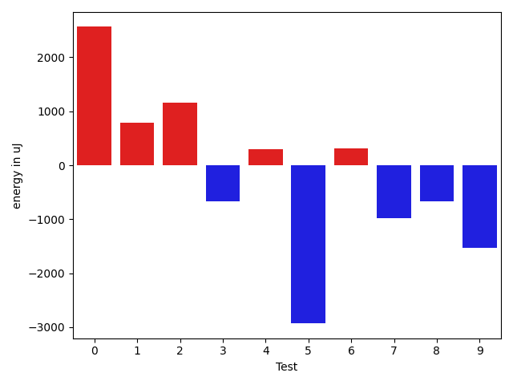

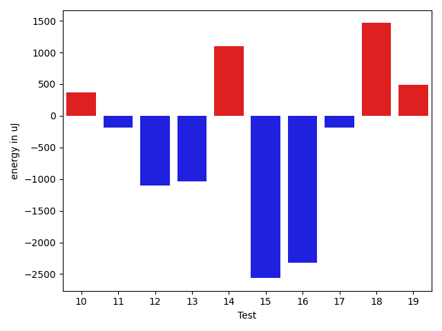

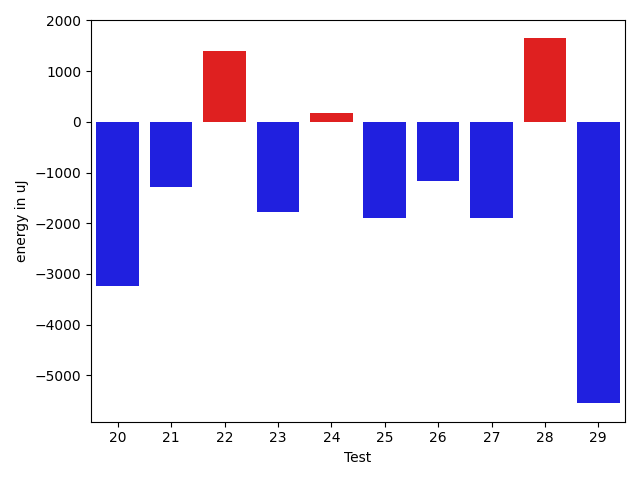

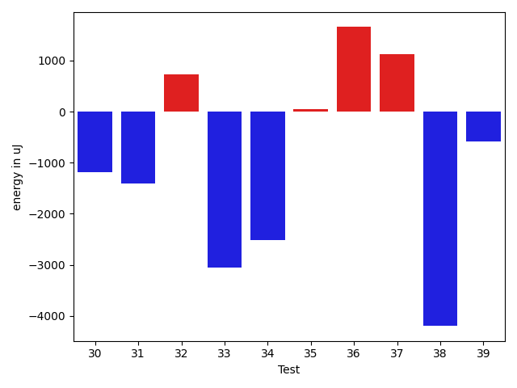

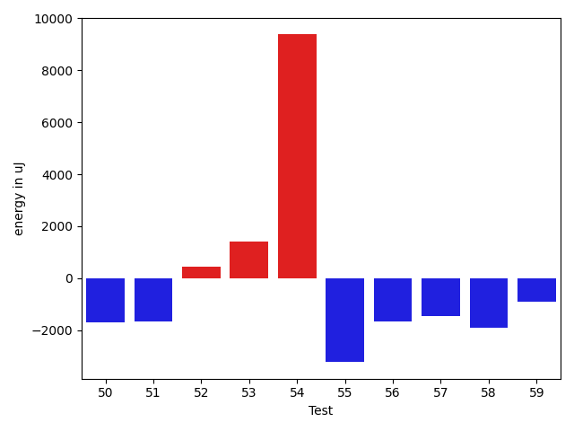

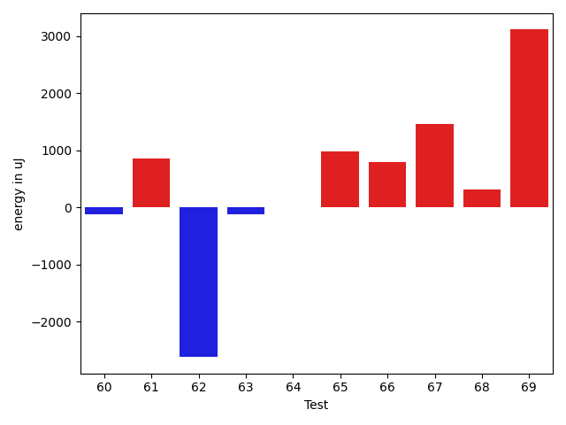

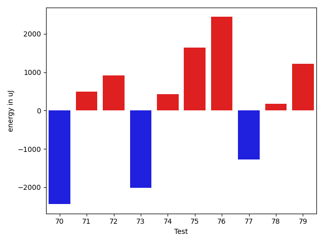

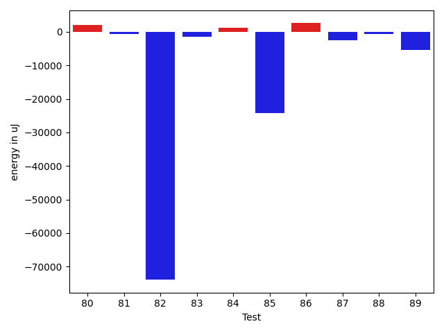

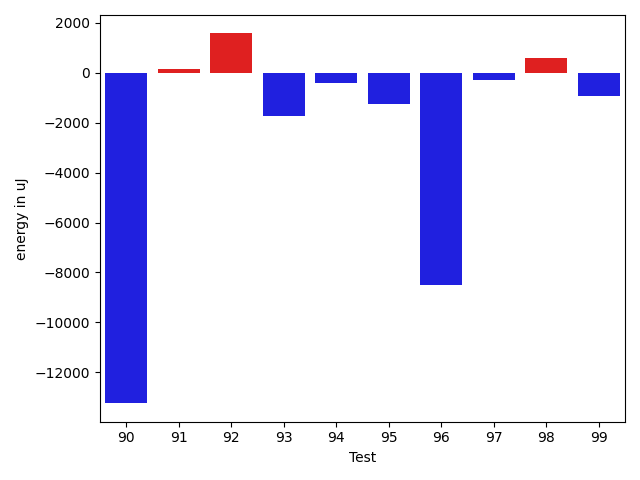

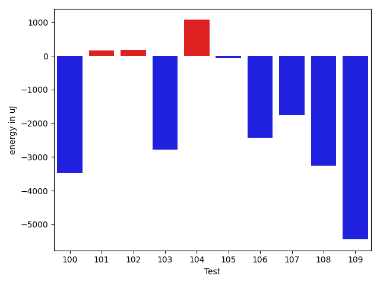

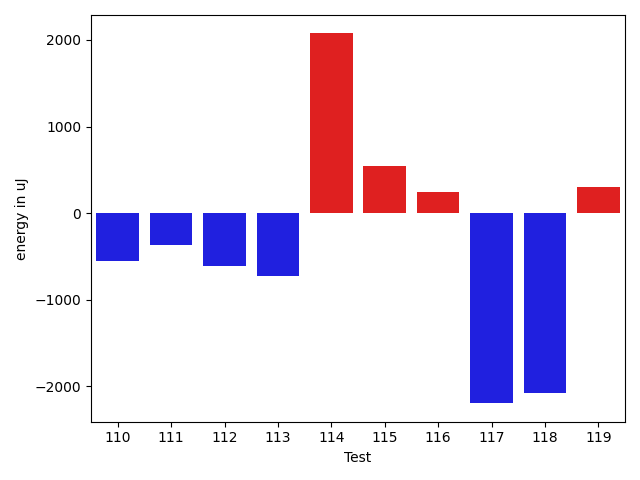

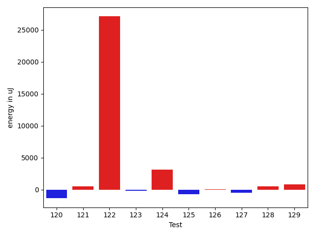

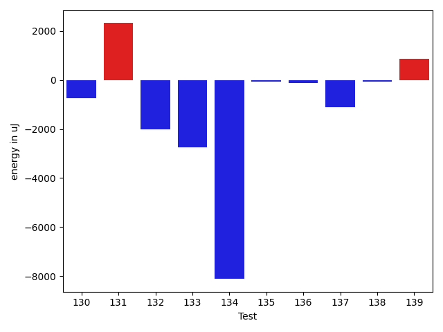

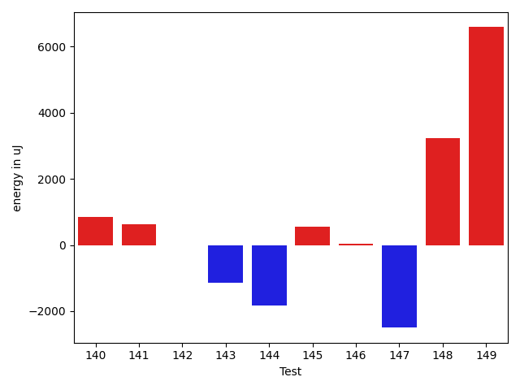

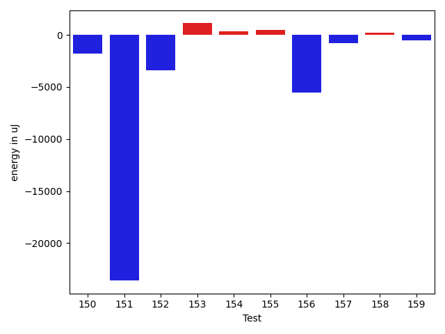

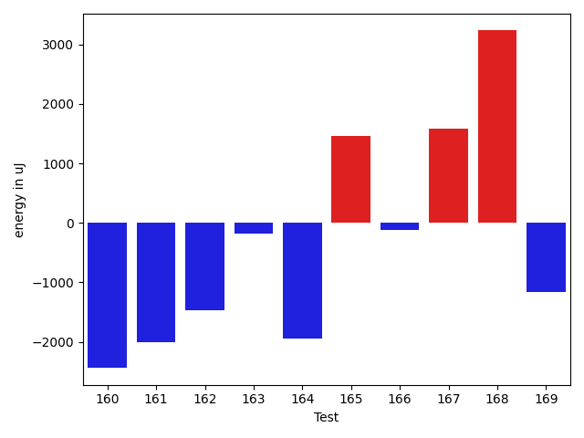

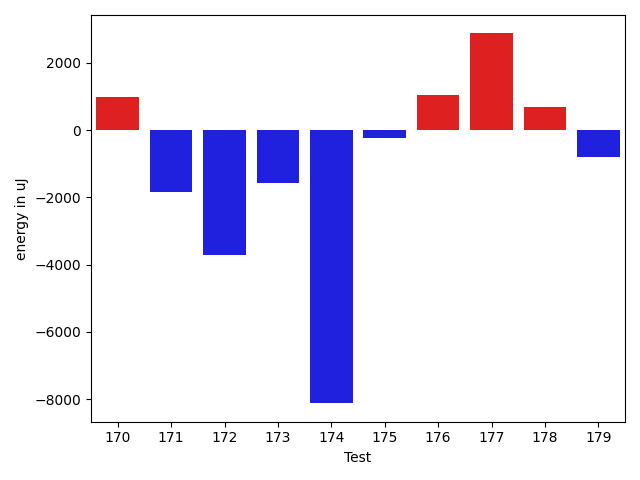

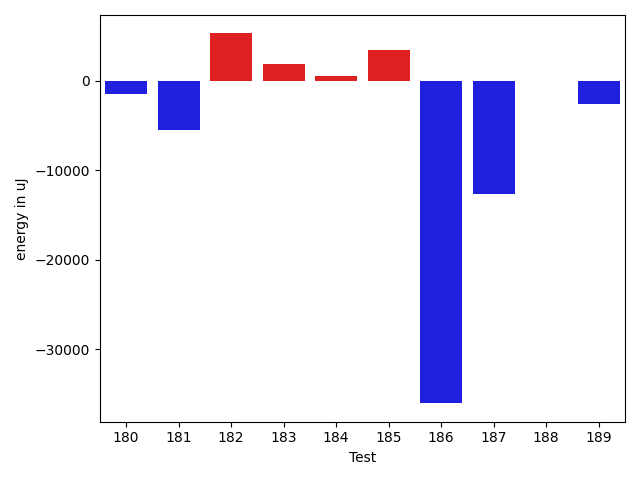

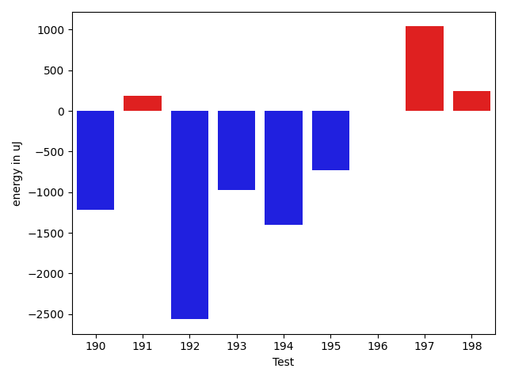

| ID | EnergyV1 | EnergyV2 | DeltaEnergy | σV1 | σV2 |
| --- | --- | --- | --- | --- | --- |
| 0 | 38635 | 41199 | 2564 | 101700.42828119374 | 64679.12888272697 |
| 1 | 36682 | 37475 | 793 | 13907.318692114197 | 60997.318078237775 |
| 2 | 35279 | 36438 | 1159 | 4280.960572284879 | 4000.0474587503672 |
| 3 | 36255 | 35583 | -672 | 4680.850231581424 | 4582.719600449869 |
| 4 | 36133 | 36438 | 305 | 5093.472597575247 | 6407.14355317722 |
| 5 | 38208 | 35278 | -2930 | 30013.759779731245 | 16764.295083664387 |
| 6 | 35339 | 35645 | 306 | 3788.6099297763553 | 3004.926129704805 |
| 7 | 38208 | 37232 | -976 | 18824.709132736527 | 13751.373830310258 |
| 8 | 38452 | 37780 | -672 | 68196.27532556758 | 42220.51184104532 |
| 9 | 38452 | 36926 | -1526 | 37375.71307756484 | 20378.9397915933 |
| 10 | 34973 | 35340 | 367 | 4019.519385152275 | 4119.554896691362 |
| 11 | 36072 | 35889 | -183 | 4417.295111898231 | 3800.8386660179285 |
| 12 | 35645 | 34546 | -1099 | 4242.755064943417 | 3183.4517304857845 |
| 13 | 37109 | 36072 | -1037 | 4567.209338303487 | 4185.081382227028 |
| 14 | 34546 | 35644 | 1098 | 4372.889479779573 | 4129.236703072373 |
| 15 | 36499 | 33936 | -2563 | 4428.372681028115 | 4392.0039944767805 |
| 16 | 37598 | 35278 | -2320 | 2997.70934247119 | 3889.196050389765 |
| 17 | 36743 | 36560 | -183 | 110937.92689109934 | 67780.19195021922 |
| 18 | 34790 | 36254 | 1464 | 2926.757944885817 | 4200.632958165757 |
| 19 | 36133 | 36621 | 488 | 40792.05671825771 | 37604.79828513345 |
| 20 | 41015 | 37781 | -3234 | 26912.129867271105 | 22773.54627951179 |
| 21 | 36438 | 35156 | -1282 | 4956.401856185594 | 3914.992708689367 |
| 22 | 35461 | 36865 | 1404 | 4430.3242088537445 | 5049.066927219202 |
| 23 | 39062 | 37293 | -1769 | 31926.50932922184 | 18160.932356115107 |
| 24 | 38757 | 38940 | 183 | 56185.867594687625 | 87435.67884650656 |
| 25 | 38086 | 36193 | -1893 | 4383.710452447614 | 4606.759257208646 |
| 26 | 36988 | 35827 | -1161 | 16640.842025613627 | 3587.284617457794 |
| 27 | 37354 | 35461 | -1893 | 7198.902507619407 | 6535.242051350692 |
| 28 | 36987 | 38635 | 1648 | 306367.09717849153 | 297288.28361699684 |
| 29 | 83618 | 78064 | -5554 | 27332.532893690157 | 22382.955524442765 |
| 30 | 36621 | 35705 | -916 | 8889.478888845226 | 7440.338805921139 |
| 31 | 37048 | 35644 | -1404 | 4645.056581524529 | 4259.171586181784 |
| 32 | 36133 | 36621 | 488 | 22544.468704593295 | 21104.248471667575 |
| 33 | 38330 | 36743 | -1587 | 36947.558449560216 | 27965.428886945174 |
| 34 | 36926 | 34485 | -2441 | 4131.203659690905 | 3296.593344378511 |
| 35 | 35095 | 36255 | 1160 | 4433.175032760803 | 4078.0395706760864 |
| 36 | 35400 | 37293 | 1893 | 3647.0525578693805 | 3572.1135321731717 |
| 37 | 39978 | 39429 | -549 | 46337.29105355815 | 41870.639178152815 |
| 38 | 37659 | 36499 | -1160 | 22263.5368452878 | 3966.756207801304 |
| 39 | 36438 | 36193 | -245 | 10462.618756070447 | 7666.296513309089 |
| 40 | 35583 | 36133 | 550 | 12822.36036057485 | 8342.559980011118 |
| 41 | 46997 | 69397 | 22400 | 99300.18545371626 | 108772.03517481795 |
| 42 | 37171 | 37781 | 610 | 70005.1890254493 | 71374.46968524865 |
| 43 | 36255 | 37353 | 1098 | 3591.7850705039964 | 4473.360606101661 |
| 44 | 38696 | 38085 | -611 | 13099.645289431239 | 12223.147032233557 |
| 45 | 35462 | 35522 | 60 | 4405.775654784734 | 3665.8858079372762 |
| 46 | 36926 | 35461 | -1465 | 4100.651038698181 | 4168.7743193226215 |
| 47 | 35095 | 35340 | 245 | 3737.4488152593703 | 2977.339332010022 |
| 48 | 37109 | 36376 | -733 | 9890.629718323386 | 10187.14910478135 |
| 49 | 37720 | 37048 | -672 | 24457.730628776975 | 9089.471220138628 |
| 50 | 40345 | 38635 | -1710 | 118293.67662622547 | 98608.20845861861 |
| 51 | 129028 | 127380 | -1648 | 91833.3950468648 | 93929.40203265076 |
| 52 | 37963 | 38391 | 428 | 11940.908752000187 | 8983.151472631802 |
| 53 | 39062 | 40466 | 1404 | 90011.20142326331 | 34760.63041975377 |
| 54 | 61218 | 70617 | 9399 | 50154.80160089704 | 47323.01828157022 |
| 55 | 41931 | 38696 | -3235 | 45674.172381001685 | 57157.86715137926 |
| 56 | 38330 | 36682 | -1648 | 10335.981816712561 | 8467.76726492204 |
| 57 | 39184 | 37720 | -1464 | 17488.25216608245 | 17553.0367889798 |
| 58 | 37475 | 35583 | -1892 | 4342.390482968565 | 4653.871050623331 |
| 59 | 37293 | 36377 | -916 | 4418.91379193934 | 3557.135795317144 |
| 60 | 35644 | 35523 | -121 | 3950.9227205160955 | 3350.3927904673374 |
| 61 | 36865 | 37720 | 855 | 3168.3958904339147 | 4200.121355324039 |
| 62 | 37964 | 35340 | -2624 | 4912.300176566102 | 3447.676734304701 |
| 63 | 37720 | 37597 | -123 | 3424.658608289786 | 3370.5372370779296 |
| 64 | 35156 | 35157 | 1 | 26643.931463016383 | 4102.960400512913 |
| 65 | 33875 | 34851 | 976 | 3708.8614820903376 | 4103.252771715844 |
| 66 | 34790 | 35583 | 793 | 7155.148875690428 | 20452.083283626846 |
| 67 | 34057 | 35522 | 1465 | 4144.395166535027 | 4215.225907027868 |
| 68 | 37292 | 37598 | 306 | 41933.848611653026 | 42302.635039923785 |
| 69 | 150817 | 153931 | 3114 | 49140.16187450283 | 54743.765733508284 |
| 70 | 36438 | 33997 | -2441 | 3758.838859163957 | 4053.74904142557 |
| 71 | 34424 | 34912 | 488 | 3433.00395487611 | 3432.4037887932473 |
| 72 | 34912 | 35828 | 916 | 4359.575122378176 | 4189.44269423603 |
| 73 | 36193 | 34180 | -2013 | 37174.83638102328 | 3236.037715446688 |
| 74 | 34668 | 35095 | 427 | 12135.852674093616 | 11302.172878193525 |
| 75 | 33630 | 35279 | 1649 | 5095.842197558922 | 3721.3254209876472 |
| 76 | 32897 | 35339 | 2442 | 3971.821943088587 | 4985.0376822119115 |
| 77 | 35706 | 34424 | -1282 | 3843.3578734038747 | 3786.857785486537 |
| 78 | 34912 | 35095 | 183 | 3938.572148759961 | 33872.823496704375 |
| 79 | 35095 | 36316 | 1221 | 3929.565048084587 | 4131.011622598231 |
| 80 | 33020 | 36988 | 3968 | 2959.0130216378266 | 4045.0442140819114 |
| 81 | 34851 | 34668 | -183 | 4339.348581001302 | 3199.369690821826 |
| 82 | 39124 | 37781 | -1343 | 562490.9576313795 | 443171.4488401748 |
| 83 | 36499 | 36560 | 61 | 14601.646909048368 | 10955.402748797896 |
| 84 | 36743 | 36072 | -671 | 12016.475878363255 | 19650.607088136443 |
| 85 | 121276 | 117736 | -3540 | 114623.96431572636 | 66216.62639753762 |
| 86 | 35644 | 36560 | 916 | 6149.194022859139 | 10213.190538475557 |
| 87 | 72815 | 75989 | 3174 | 37073.5624872134 | 30832.384291713923 |
| 88 | 36743 | 35583 | -1160 | 13973.591724101396 | 13500.153244708077 |
| 89 | 68360 | 67016 | -1344 | 26522.356159746876 | 25395.257900997534 |
| 90 | 74341 | 71288 | -3053 | 49091.849341215886 | 39482.604070565576 |
| 91 | 37231 | 35950 | -1281 | 10758.0193372123 | 10389.60370192872 |
| 92 | 35095 | 36621 | 1526 | 4783.135006284078 | 4289.585367621876 |
| 93 | 36499 | 34362 | -2137 | 3883.229529192022 | 4078.1686203979957 |
| 94 | 35827 | 34729 | -1098 | 4360.3586007284275 | 3956.1841487345137 |
| 95 | 73181 | 73364 | 183 | 28479.144308017505 | 30178.021489286813 |
| 96 | 80994 | 80627 | -367 | 250397.1805857541 | 215209.82013991088 |
| 97 | 36926 | 36438 | -488 | 3844.977405588161 | 3332.8335392575486 |
| 98 | 36072 | 36804 | 732 | 3489.558895336726 | 2720.1316411763455 |
| 99 | 37903 | 36743 | -1160 | 4727.80422059373 | 4609.361357560012 |
| 100 | 37048 | 38330 | 1282 | 31774.542387234917 | 8283.980972774785 |
| 101 | 36682 | 37842 | 1160 | 4247.595731531041 | 3924.5593440985795 |
| 102 | 35462 | 34363 | -1099 | 3801.9953610915645 | 4343.962779125853 |
| 103 | 36438 | 34790 | -1648 | 2659.350259456083 | 3682.9503437291955 |
| 104 | 34729 | 35279 | 550 | 3428.2836288732 | 2810.919159563292 |
| 105 | 35156 | 35339 | 183 | 3935.8646406013254 | 3763.5756970391535 |
| 106 | 36865 | 34912 | -1953 | 31568.229588172937 | 27993.318655350602 |
| 107 | 36621 | 35340 | -1281 | 3694.092077539994 | 3197.580791530895 |
| 108 | 35095 | 32348 | -2747 | 3912.323059462243 | 3601.1557746777366 |
| 109 | 36987 | 37659 | 672 | 26759.164035138834 | 4033.6367982342194 |
| 110 | 34180 | 33630 | -550 | 2599.379546676795 | 3497.506950646772 |
| 111 | 36316 | 35949 | -367 | 3046.8387238552145 | 4502.324614417951 |
| 112 | 35278 | 34668 | -610 | 3457.139543354046 | 4352.537594963533 |
| 113 | 37048 | 36316 | -732 | 4479.958683465235 | 4225.491021763033 |
| 114 | 34058 | 36133 | 2075 | 3446.8982129332717 | 3814.38095346699 |
| 115 | 34607 | 35156 | 549 | 4845.472749505974 | 26028.276034044626 |
| 116 | 34485 | 34729 | 244 | 3827.3417057462193 | 4329.438058857298 |
| 117 | 35645 | 33447 | -2198 | 4337.4234172232955 | 3428.588134631918 |
| 118 | 36804 | 34729 | -2075 | 8494.245079790571 | 8101.732809975573 |
| 119 | 37353 | 37659 | 306 | 26848.900621626948 | 34755.815961873486 |
| 120 | 36682 | 35339 | -1343 | 3741.341288596257 | 4137.292449004995 |
| 121 | 35339 | 35827 | 488 | 3516.901884367252 | 3904.7360412421153 |
| 122 | 41870 | 68970 | 27100 | 23373.450764373996 | 27292.152906037656 |
| 123 | 34180 | 33997 | -183 | 3867.908800604782 | 2391.093016279375 |
| 124 | 32898 | 36072 | 3174 | 3192.8072572296282 | 2941.2926332085126 |
| 125 | 35766 | 35034 | -732 | 4169.684160700904 | 3500.607222659469 |
| 126 | 35034 | 35095 | 61 | 4191.178810094102 | 4189.53621113353 |
| 127 | 34485 | 33997 | -488 | 32487.172569447983 | 2858.768557730175 |
| 128 | 34607 | 35156 | 549 | 3548.280203140671 | 2722.2302159746578 |
| 129 | 35461 | 36254 | 793 | 3122.195759397543 | 3967.883274241385 |
| 130 | 36743 | 36010 | -733 | 3913.5263203407735 | 4234.912581320726 |
| 131 | 32897 | 35217 | 2320 | 2763.487088605425 | 3925.2749677333495 |
| 132 | 35706 | 33692 | -2014 | 4070.6433459589653 | 4273.30532265398 |
| 133 | 37842 | 35095 | -2747 | 3107.781509328193 | 5065.744102657522 |
| 134 | 179931 | 171814 | -8117 | 192431.20194721362 | 266370.5489585448 |
| 135 | 36499 | 36438 | -61 | 4992.038751963685 | 7463.148719301773 |
| 136 | 37720 | 37597 | -123 | 13300.914396186878 | 29956.876617877795 |
| 137 | 37598 | 36499 | -1099 | 3873.2548193217667 | 5102.424957257524 |
| 138 | 38818 | 38757 | -61 | 17827.98824046472 | 12969.500194068802 |
| 139 | 35828 | 36682 | 854 | 3612.3496877290254 | 4074.490901864305 |
| 140 | 34302 | 35889 | 1587 | 3636.559201127141 | 4164.756610135971 |
| 141 | 35522 | 35644 | 122 | 3656.0888152923917 | 3638.907245608677 |
| 142 | 38452 | 38452 | 0 | 21339.87013338278 | 19587.90732723934 |
| 143 | 36193 | 36377 | 184 | 10263.559267152752 | 6952.472008013462 |
| 144 | 36682 | 35339 | -1343 | 7985.0459318577205 | 3598.7891414888372 |
| 145 | 36621 | 36682 | 61 | 3634.417086035751 | 3985.5223431189047 |
| 146 | 35339 | 36621 | 1282 | 4334.831383110536 | 3662.715590596682 |
| 147 | 36072 | 34301 | -1771 | 4354.32776021452 | 2895.1829452152815 |
| 148 | 36376 | 36743 | 367 | 3623.7929001236776 | 15590.41799099007 |
| 149 | 37048 | 37659 | 611 | 25359.535624910626 | 29280.052750792016 |
| 150 | 36866 | 34057 | -2809 | 3059.215985255772 | 3561.0492250646203 |
| 151 | 40771 | 38391 | -2380 | 106944.17908118361 | 49612.89528605132 |
| 152 | 35522 | 36498 | 976 | 21361.27379419629 | 3694.4321073845385 |
| 153 | 35522 | 35644 | 122 | 8327.385960299203 | 16606.40152595035 |
| 154 | 36743 | 35889 | -854 | 17571.920280104063 | 21382.83844125214 |
| 155 | 36377 | 36377 | 0 | 4837.075077519012 | 4654.236094073566 |
| 156 | 37719 | 35217 | -2502 | 22668.890529926746 | 12806.285409733851 |
| 157 | 36194 | 35217 | -977 | 4277.711517885108 | 3913.1239353735973 |
| 158 | 34973 | 35889 | 916 | 9777.330498882351 | 10453.24151332079 |
| 159 | 36682 | 35766 | -916 | 4541.01818380984 | 4740.046724189541 |
| 160 | 37842 | 35401 | -2441 | 4889.2566288386815 | 3855.4123100302013 |
| 161 | 37048 | 35034 | -2014 | 4488.184646507574 | 3335.6827398403057 |
| 162 | 36682 | 35217 | -1465 | 4041.2196632612877 | 2720.727843794745 |
| 163 | 35461 | 35278 | -183 | 4250.819471346418 | 5014.110914343427 |
| 164 | 38757 | 36804 | -1953 | 4190.217340350618 | 3491.328556558914 |
| 165 | 35705 | 37170 | 1465 | 5036.1910028199545 | 3557.3951031618626 |
| 166 | 38147 | 38025 | -122 | 2938.534692001215 | 37882.07803365792 |
| 167 | 35949 | 37537 | 1588 | 4821.057267170068 | 2958.0185912463717 |
| 168 | 39123 | 42358 | 3235 | 63467.72739594823 | 72526.61721737815 |
| 169 | 36804 | 35645 | -1159 | 4433.77014589133 | 4601.113829522393 |
| 170 | 37048 | 38025 | 977 | 10952.802401208071 | 9441.347400048102 |
| 171 | 37842 | 36011 | -1831 | 4429.526583223008 | 4468.7558546970195 |
| 172 | 38269 | 34546 | -3723 | 3459.6169425080707 | 3803.9380141144406 |
| 173 | 39245 | 37659 | -1586 | 83657.21665103843 | 88103.46969575174 |
| 174 | 235778 | 227660 | -8118 | 92632.08235754781 | 78623.50254763827 |
| 175 | 37903 | 37659 | -244 | 11480.843962444571 | 5718.407873421176 |
| 176 | 37048 | 38086 | 1038 | 3498.861336627853 | 4251.599091118214 |
| 177 | 36499 | 39367 | 2868 | 3719.8672139091395 | 4765.176311183739 |
| 178 | 38941 | 39612 | 671 | 34340.92932109925 | 22996.281104197347 |
| 179 | 40100 | 39307 | -793 | 43697.189078110336 | 36999.92332480727 |
| 180 | 35766 | 37170 | 1404 | 14983.733352171204 | 5685.887620042723 |
| 181 | 38269 | 37659 | -610 | 143363.20375523588 | 135399.870614468 |
| 182 | 36072 | 38024 | 1952 | 13456.529958955447 | 16032.503766672682 |
| 183 | 37964 | 39856 | 1892 | 77011.39459442734 | 47452.32228020529 |
| 184 | 38330 | 37537 | -793 | 6283.09527909946 | 8361.356974872419 |
| 185 | 38208 | 38818 | 610 | 35866.76091075537 | 35212.3032007714 |
| 186 | 38086 | 36438 | -1648 | 114511.94521316903 | 43887.71350862473 |
| 187 | 39124 | 38635 | -489 | 89958.6745399651 | 82915.77498584341 |
| 188 | 37170 | 38513 | 1343 | 19486.1951182754 | 19300.93067050136 |
| 189 | 39062 | 36071 | -2991 | 6245.185358850447 | 3532.580900492658 |
| 190 | 38819 | 37598 | -1221 | 450922.81554406096 | 408716.79328191275 |
| 191 | 36255 | 36438 | 183 | 61730.7496071901 | 4575.4760694623055 |
| 192 | 39246 | 36682 | -2564 | 102596.81840706788 | 49886.36289480545 |
| 193 | 38147 | 37171 | -976 | 24050.1876646588 | 51726.24123188919 |
| 194 | 39185 | 37780 | -1405 | 9968.584737518897 | 12113.59618699572 |
| 195 | 43823 | 43091 | -732 | 414781.47197799815 | 658899.3714194424 |
| 196 | 36560 | 36560 | 0 | 3864.424211496455 | 4357.938959977399 |
| 197 | 36133 | 37171 | 1038 | 9179.575488226257 | 14298.644312134302 |
| 198 | 36987 | 37231 | 244 | 3714.5915209023674 | 5024.824046300625 |

## Delta Duration per test method

| ID | DurationV1 | DurationsV2 | DeltaDuration |
| --- | --- | --- | --- |
| 0 | 2277557.4404761903 | 1848795.426966292 | -428762.0135098982 |
| 1 | 1038823.4318181818 | 1203051.7608695652 | 164228.32905138342 |
| 2 | 744246.2340425532 | 732690.8604651163 | -11555.373577436898 |
| 3 | 791157.8181818182 | 708740.3902439025 | -82417.42793791578 |
| 4 | 962596.2388059702 | 976455.8 | 13859.56119402987 |
| 5 | 1273474.2972972973 | 801983.0217391305 | -471491.2755581668 |
| 6 | 452063.95 | 444590.35294117645 | -7473.597058823565 |
| 7 | 1459037.6373626373 | 1362030.0105263158 | -97007.62683632155 |
| 8 | 1595608.551724138 | 1056231.9402985075 | -539376.6114256305 |
| 9 | 1316865.8709677418 | 1048253.2727272727 | -268612.5982404691 |
| 10 | 716642.9302325582 | 730221.7446808511 | 13578.81444829295 |
| 11 | 777514.84 | 820581.9824561403 | 43067.14245614037 |
| 12 | 628701.9354838709 | 594694.0689655172 | -34007.866518353694 |
| 13 | 726551.804347826 | 703285.2264150943 | -23266.577932731714 |
| 14 | 363965.92307692306 | 347887.9166666667 | -16078.006410256377 |
| 15 | 424471.70588235295 | 443966.25 | 19494.54411764705 |
| 16 | 559482.8947368421 | 575055.2857142857 | 15572.390977443545 |
| 17 | 1871879.0322580645 | 1659618.6896551724 | -212260.34260289208 |
| 18 | 617551.9393939395 | 698453.0277777778 | 80901.0883838383 |
| 19 | 1485411.236111111 | 1460641.8372093022 | -24769.398901808774 |
| 20 | 1527401.1724137932 | 1377981.7241379311 | -149419.44827586203 |
| 21 | 622938.65 | 532349.5909090909 | -90589.05909090908 |
| 22 | 432269.4 | 390206.652173913 | -42062.747826087 |
| 23 | 1318333.05 | 1198270.1818181819 | -120062.86818181816 |
| 24 | 1343213.6136363635 | 2189651.0816326533 | 846437.4679962897 |
| 25 | 629930.1621621621 | 635966.6285714286 | 6036.466409266461 |
| 26 | 868257.0357142857 | 760139.0208333334 | -108118.01488095231 |
| 27 | 964125.0 | 994331.6470588235 | 30206.647058823495 |
| 28 | 2533998.660714286 | 3213756.0185185187 | 679757.3578042327 |
| 29 | 2771637.4242424243 | 2680010.5454545454 | -91626.8787878789 |
| 30 | 966474.2058823529 | 1064026.8688524591 | 97552.66297010623 |
| 31 | 792295.3673469388 | 751479.6862745098 | -40815.681072429055 |
| 32 | 1053340.7323943663 | 1063651.0 | 10310.267605633708 |
| 33 | 1517575.446153846 | 1342833.704225352 | -174741.74192849407 |
| 34 | 675149.4102564103 | 644306.6764705882 | -30842.733785822056 |
| 35 | 543557.6875 | 496160.15 | -47397.53749999998 |
| 36 | 435612.0 | 480541.78571428574 | 44929.78571428574 |
| 37 | 1773674.7157894736 | 1880750.875 | 107076.15921052638 |
| 38 | 989774.5272727272 | 862574.4230769231 | -127200.1041958041 |
| 39 | 862297.0434782609 | 855056.962264151 | -7240.081214109901 |
| 40 | 1069321.064516129 | 1090473.605263158 | 21152.54074702901 |
| 41 | 2567088.56122449 | 3070967.242424242 | 503878.68119975226 |
| 42 | 1873606.7333333334 | 1604636.0740740742 | -268970.65925925924 |
| 43 | 611277.027027027 | 608115.3 | -3161.7270270269364 |
| 44 | 1008190.4255319149 | 1060671.54 | 52481.114468085114 |
| 45 | 893347.0303030303 | 681822.25 | -211524.78030303027 |
| 46 | 422180.1176470588 | 457462.23076923075 | 35282.113122171955 |
| 47 | 436779.5 | 484839.7727272727 | 48060.272727272706 |
| 48 | 1177173.4054054054 | 1069990.343283582 | -107183.06212182343 |
| 49 | 1207085.756097561 | 1093211.0555555555 | -113874.70054200548 |
| 50 | 1850160.28125 | 2102153.407407407 | 251993.12615740718 |
| 51 | 4595946.287356322 | 4600847.123595506 | 4900.836239184253 |
| 52 | 928413.5 | 1023896.4 | 95482.90000000002 |
| 53 | 2106329.5 | 1474161.0 | -632168.5 |
| 54 | 2283871.5555555555 | 2602679.0808080807 | 318807.5252525252 |
| 55 | 1580556.1186440678 | 1542544.8507462686 | -38011.267897799145 |
| 56 | 760447.7567567568 | 737298.2702702703 | -23149.48648648651 |
| 57 | 1409080.5578947368 | 1450756.9468085107 | 41676.38891377393 |
| 58 | 442227.85714285716 | 462009.44444444444 | 19781.58730158728 |
| 59 | 411090.46153846156 | 455286.0 | 44195.53846153844 |
| 60 | 415929.84210526315 | 451014.8947368421 | 35085.05263157893 |
| 61 | 579457.2222222222 | 544562.7575757576 | -34894.46464646468 |
| 62 | 419875.22222222225 | 444313.3157894737 | 24438.09356725146 |
| 63 | 526245.0 | 518061.0909090909 | -8183.909090909117 |
| 64 | 837147.3265306122 | 722656.25 | -114491.07653061219 |
| 65 | 538402.0666666667 | 535847.625 | -2554.441666666651 |
| 66 | 1056509.0649350649 | 1112921.7368421052 | 56412.67190704029 |
| 67 | 735325.1578947369 | 711574.5238095238 | -23750.634085213067 |
| 68 | 1339675.569620253 | 1296467.3472222222 | -43208.222398030804 |
| 69 | 5040159.222222222 | 4913745.171717172 | -126414.05050505046 |
| 70 | 422714.71428571426 | 462500.6842105263 | 39785.96992481203 |
| 71 | 444217.85714285716 | 468408.0689655172 | 24190.211822660058 |
| 72 | 800694.6774193548 | 806739.3962264151 | 6044.7188070602715 |
| 73 | 992620.693877551 | 757449.1020408163 | -235171.59183673467 |
| 74 | 890343.8048780488 | 845116.0512820513 | -45227.75359599758 |
| 75 | 464390.29411764705 | 458107.0416666667 | -6283.2524509803625 |
| 76 | 730405.86 | 701105.0370370371 | -29300.822962962906 |
| 77 | 567763.9444444445 | 620847.25 | 53083.305555555504 |
| 78 | 610237.6666666666 | 706383.9583333334 | 96146.29166666674 |
| 79 | 528990.6764705882 | 474843.5833333333 | -54147.09313725488 |
| 80 | 359344.4666666667 | 373386.64285714284 | 14042.176190476166 |
| 81 | 521842.2727272727 | 526745.4137931034 | 4903.141065830714 |
| 82 | 6273652.948717949 | 3902206.525 | -2371446.423717949 |
| 83 | 1324267.4891304348 | 1334835.559139785 | 10568.070009350078 |
| 84 | 1363627.2359550563 | 1307967.1294117647 | -55660.10654329159 |
| 85 | 4878854.262626262 | 4126944.222222222 | -751910.0404040404 |
| 86 | 1239179.1505376345 | 1227251.75 | -11927.400537634501 |
| 87 | 2635149.909090909 | 2494882.494949495 | -140267.41414141422 |
| 88 | 1392492.9895833333 | 1341752.3617021276 | -50740.62788120564 |
| 89 | 2100015.98989899 | 2004783.696969697 | -95232.29292929289 |
| 90 | 2861770.8484848486 | 2560088.232323232 | -301682.6161616165 |
| 91 | 1264434.0 | 1247958.8494623655 | -16475.1505376345 |
| 92 | 855455.7222222222 | 814609.9272727272 | -40845.794949495 |
| 93 | 586813.2916666666 | 566533.4210526316 | -20279.870614035055 |
| 94 | 995661.1323529412 | 980220.5538461539 | -15440.578506787308 |
| 95 | 2389569.4444444445 | 2388321.474747475 | -1247.9696969697252 |
| 96 | 4410898.95959596 | 4122780.494949495 | -288118.4646464647 |
| 97 | 777878.5909090909 | 741482.66 | -36395.93090909091 |
| 98 | 566130.9230769231 | 566870.9411764706 | 740.0180995474802 |
| 99 | 570893.4583333334 | 554375.0588235294 | -16518.399509803974 |
| 100 | 1239866.0 | 1093420.2207792208 | -146445.7792207792 |
| 101 | 596100.1538461539 | 610322.619047619 | 14222.46520146518 |
| 102 | 511772.4210526316 | 524677.9032258064 | 12905.482173174853 |
| 103 | 343305.6111111111 | 379250.5625 | 35944.951388888876 |
| 104 | 532099.8 | 567825.08 | 35725.27999999991 |
| 105 | 700657.5925925926 | 921174.375 | 220516.78240740742 |
| 106 | 597107.1666666666 | 929715.55 | 332608.3833333334 |
| 107 | 379815.5625 | 423158.28571428574 | 43342.72321428574 |
| 108 | 650101.68 | 404755.4117647059 | -245346.26823529415 |
| 109 | 696246.7692307692 | 536155.7058823529 | -160091.06334841636 |
| 110 | 423436.9411764706 | 431207.76923076925 | 7770.828054298647 |
| 111 | 379329.35714285716 | 438131.3125 | 58801.95535714284 |
| 112 | 409287.8 | 414680.9411764706 | 5393.141176470614 |
| 113 | 434216.875 | 500339.3125 | 66122.4375 |
| 114 | 639744.4838709678 | 593075.0789473684 | -46669.40492359933 |
| 115 | 733044.2631578947 | 862407.3333333334 | 129363.07017543865 |
| 116 | 466929.6153846154 | 414830.82608695654 | -52098.789297658834 |
| 117 | 380672.2631578947 | 399543.0 | 18870.73684210528 |
| 118 | 673584.5161290322 | 939690.7857142857 | 266106.26958525344 |
| 119 | 1077515.6 | 1252055.3636363635 | 174539.76363636344 |
| 120 | 352707.0714285714 | 409615.4375 | 56908.36607142858 |
| 121 | 487948.7894736842 | 501901.1538461539 | 13952.36437246966 |
| 122 | 1318582.5 | 1739025.6470588236 | 420443.1470588236 |
| 123 | 418926.4285714286 | 501134.25 | 82207.82142857142 |
| 124 | 393159.1818181818 | 400933.25 | 7774.0681818181765 |
| 125 | 404079.8888888889 | 415764.8823529412 | 11684.993464052328 |
| 126 | 494521.2727272727 | 595888.8095238095 | 101367.53679653676 |
| 127 | 692158.9411764706 | 420221.3888888889 | -271937.5522875817 |
| 128 | 416905.4666666667 | 407834.5 | -9070.966666666674 |
| 129 | 487349.15 | 486526.09523809527 | -823.0547619047575 |
| 130 | 514181.55 | 517958.4285714286 | 3776.8785714285914 |
| 131 | 432407.6666666667 | 412160.7727272727 | -20246.89393939398 |
| 132 | 392451.8333333333 | 385677.82352941175 | -6774.009803921566 |
| 133 | 363828.4166666667 | 465889.0 | 102060.58333333331 |
| 134 | 6421192.232323232 | 7314721.454545454 | 893529.222222222 |
| 135 | 933999.3287671233 | 969203.671641791 | 35204.342874667724 |
| 136 | 868899.5277777778 | 1237849.5526315789 | 368950.0248538011 |
| 137 | 836992.3541666666 | 864790.5111111111 | 27798.15694444452 |
| 138 | 1172007.375 | 1107951.648148148 | -64055.72685185191 |
| 139 | 478739.5 | 402386.375 | -76353.125 |
| 140 | 569863.5 | 544463.303030303 | -25400.19696969702 |
| 141 | 679829.0 | 630030.1794871795 | -49798.8205128205 |
| 142 | 1654711.425531915 | 1549108.7525773195 | -105602.67295459541 |
| 143 | 843549.9285714285 | 854545.0909090909 | 10995.16233766242 |
| 144 | 833012.3714285714 | 697466.0571428571 | -135546.3142857143 |
| 145 | 812573.0454545454 | 838724.525 | 26151.47954545461 |
| 146 | 618881.84 | 580797.92 | -38083.919999999925 |
| 147 | 708891.3488372093 | 713931.6666666666 | 5040.3178294573445 |
| 148 | 514021.2173913043 | 764678.3333333334 | 250657.11594202905 |
| 149 | 913146.5555555555 | 1167721.5555555555 | 254575.0 |
| 150 | 453073.8888888889 | 464592.5 | 11518.611111111124 |
| 151 | 2227228.2666666666 | 1624985.435897436 | -602242.8307692306 |
| 152 | 817406.2888888889 | 665108.8292682926 | -152297.45962059626 |
| 153 | 1066615.2307692308 | 1123003.9350649351 | 56388.704295704374 |
| 154 | 865869.552631579 | 851946.2352941176 | -13923.317337461398 |
| 155 | 450894.2916666667 | 415828.5882352941 | -35065.70343137259 |
| 156 | 1091682.5614035088 | 1003448.7692307692 | -88233.79217273952 |
| 157 | 443277.72222222225 | 480368.25 | 37090.52777777775 |
| 158 | 747495.65 | 957196.9411764706 | 209701.29117647058 |
| 159 | 649267.5714285715 | 651434.125 | 2166.5535714285215 |
| 160 | 730416.2051282051 | 721383.5 | -9032.705128205125 |
| 161 | 738048.679245283 | 703073.0975609756 | -34975.58168430743 |
| 162 | 454691.04347826086 | 453462.4347826087 | -1228.6086956521613 |
| 163 | 678388.5 | 633047.5714285715 | -45340.92857142852 |
| 164 | 478443.1875 | 424727.1875 | -53716.0 |
| 165 | 505190.0689655172 | 490534.92 | -14655.148965517234 |
| 166 | 575369.8461538461 | 797116.2592592592 | 221746.41310541308 |
| 167 | 449658.26666666666 | 370526.8823529412 | -79131.38431372546 |
| 168 | 1255914.16 | 2275223.0 | 1019308.8400000001 |
| 169 | 376159.4166666667 | 425251.5833333333 | 49092.16666666663 |
| 170 | 829577.2380952381 | 758507.4444444445 | -71069.79365079361 |
| 171 | 398249.76923076925 | 409122.6666666667 | 10872.897435897437 |
| 172 | 389145.25 | 720834.1176470588 | 331688.8676470588 |
| 173 | 2084545.9052631578 | 2099143.3777777776 | 14597.472514619818 |
| 174 | 7398274.97979798 | 7091632.05050505 | -306642.92929292936 |
| 175 | 805782.1666666666 | 767326.4347826086 | -38455.73188405798 |
| 176 | 504486.25925925927 | 565473.2083333334 | 60986.9490740741 |
| 177 | 583481.9189189189 | 647828.3 | 64346.38108108111 |
| 178 | 1218416.2285714287 | 1136946.111111111 | -81470.11746031768 |
| 179 | 1440828.125 | 1487968.7413793104 | 47140.61637931038 |
| 180 | 822301.0769230769 | 684699.8857142857 | -137601.19120879122 |
| 181 | 2561292.888888889 | 2571502.8085106383 | 10209.919621749315 |
| 182 | 1153224.0833333333 | 1268181.2117647058 | 114957.12843137258 |
| 183 | 1606965.0408163266 | 1691023.2459016393 | 84058.20508531271 |
| 184 | 831164.0175438597 | 891934.5652173914 | 60770.54767353169 |
| 185 | 1315478.2692307692 | 1587058.4 | 271580.13076923066 |
| 186 | 1973874.392857143 | 982924.1538461539 | -990950.2390109891 |
| 187 | 2028424.8688524591 | 1698126.440677966 | -330298.42817449314 |
| 188 | 914816.4 | 709744.35 | -205072.05000000005 |
| 189 | 668924.32 | 501574.47826086957 | -167349.84173913038 |
| 190 | 6518261.585365853 | 4736010.342857143 | -1782251.2425087104 |
| 191 | 866380.52 | 512400.9666666667 | -353979.55333333334 |
| 192 | 1094136.4838709678 | 1208127.9333333333 | 113991.44946236559 |
| 193 | 947306.1714285715 | 1037510.3571428572 | 90204.1857142857 |
| 194 | 840175.5806451613 | 917242.2083333334 | 77066.62768817204 |
| 195 | 4197607.391304348 | 7788294.123076923 | 3590686.7317725755 |
| 196 | 555705.84 | 579616.2666666667 | 23910.426666666754 |
| 197 | 829887.5 | 830976.4166666666 | 1088.9166666666279 |
| 198 | 536160.4230769231 | 535865.3636363636 | -295.05944055947475 |

## Misc.

| ID | Test Class | Test Method |
| --- | --- | --- |
| 0 | com.google.gson.functional.CustomDeserializerTest | testDefaultConstructorNotCalledOnField |
| 1 | com.google.gson.functional.CustomDeserializerTest | testDefaultConstructorNotCalledOnObject |
| 2 | com.google.gson.functional.CollectionTest | testCollectionOfObjectSerialization |
| 3 | com.google.gson.functional.CollectionTest | testNullsInListSerialization |
| 4 | com.google.gson.functional.CollectionTest | testWildcardPrimitiveCollectionSerilaization |
| 5 | com.google.gson.functional.CollectionTest | testCollectionOfBagOfPrimitivesSerialization |
| 6 | com.google.gson.functional.CollectionTest | testRawCollectionOfIntegersSerialization |
| 7 | com.google.gson.functional.CollectionTest | testWildcardCollectionField |
| 8 | com.google.gson.functional.CollectionTest | testSetSerialization |
| 9 | com.google.gson.functional.CollectionTest | testTopLevelCollectionOfIntegersSerialization |
| 10 | com.google.gson.functional.CollectionTest | testCollectionOfObjectWithNullSerialization |
| 11 | com.google.gson.functional.CollectionTest | testLinkedListSerialization |
| 12 | com.google.gson.functional.CollectionTest | testRawCollectionSerialization |
| 13 | com.google.gson.functional.CollectionTest | testQueueSerialization |
| 14 | com.google.gson.functional.CollectionTest | testCollectionOfStringsSerialization |
| 15 | com.google.gson.functional.ArrayTest | testSingleStringArraySerialization |
| 16 | com.google.gson.functional.ArrayTest | testNullsInArrayWithSerializeNullPropertySetSerialization |
| 17 | com.google.gson.functional.ArrayTest | testTopLevelArrayOfIntsSerialization |
| 18 | com.google.gson.functional.ArrayTest | testArrayOfPrimitivesWithCustomTypeAdapter |
| 19 | com.google.gson.functional.ArrayTest | testArrayOfCollectionSerialization |
| 20 | com.google.gson.functional.ArrayTest | testArrayOfPrimitivesAsObjectsSerialization |
| 21 | com.google.gson.functional.ArrayTest | testNullsInArraySerialization |
| 22 | com.google.gson.functional.ArrayTest | testArrayOfStringsSerialization |
| 23 | com.google.gson.functional.ArrayTest | testObjectArrayWithNonPrimitivesSerialization |
| 24 | com.google.gson.functional.InterfaceTest | testSerializingObjectImplementingInterface |
| 25 | com.google.gson.functional.InterfaceTest | testSerializingInterfaceObjectField |
| 26 | com.google.gson.functional.CustomTypeAdaptersTest | testCustomTypeAdapterAppliesToSubClassesSerializedAsBaseClass |
| 27 | com.google.gson.functional.CustomTypeAdaptersTest | testCustomAdapterInvokedForMapElementSerializationWithType |
| 28 | com.google.gson.functional.CustomTypeAdaptersTest | testCustomSerializers |
| 29 | com.google.gson.functional.CustomTypeAdaptersTest | testCustomTypeAdapterDoesNotAppliesToSubClasses |
| 30 | com.google.gson.functional.CustomTypeAdaptersTest | testCustomSerializerForLong |
| 31 | com.google.gson.functional.CustomTypeAdaptersTest | testCustomByteArraySerializer |
| 32 | com.google.gson.functional.CustomTypeAdaptersTest | testCustomNestedSerializers |
| 33 | com.google.gson.functional.CustomTypeAdaptersTest | testCustomAdapterInvokedForCollectionElementSerializationWithType |
| 34 | com.google.gson.functional.CustomTypeAdaptersTest | testEnsureCustomSerializerNotInvokedForNullValues |
| 35 | com.google.gson.functional.CustomTypeAdaptersTest | testCustomAdapterInvokedForCollectionElementSerialization |
| 36 | com.google.gson.functional.CustomTypeAdaptersTest | testCustomAdapterInvokedForMapElementSerialization |
| 37 | com.google.gson.functional.CircularReferenceTest | testCircularSerialization |
| 38 | com.google.gson.functional.CircularReferenceTest | testSelfReferenceCustomHandlerSerialization |
| 39 | com.google.gson.functional.CircularReferenceTest | testDirectedAcyclicGraphSerialization |
| 40 | com.google.gson.functional.PrettyPrintingTest | testEmptyMapField |
| 41 | com.google.gson.functional.PrettyPrintingTest | testPrettyPrintList |
| 42 | com.google.gson.functional.PrettyPrintingTest | testMap |
| 43 | com.google.gson.functional.PrettyPrintingTest | testPrettyPrintArrayOfPrimitiveArrays |
| 44 | com.google.gson.functional.PrettyPrintingTest | testPrettyPrintArrayOfObjects |
| 45 | com.google.gson.functional.PrettyPrintingTest | testPrettyPrintListOfPrimitiveArrays |
| 46 | com.google.gson.functional.PrettyPrintingTest | testPrettyPrintArrayOfPrimitives |
| 47 | com.google.gson.functional.PrettyPrintingTest | testMultipleArrays |
| 48 | com.google.gson.functional.ReadersWritersTest | testReadWriteTwoObjects |
| 49 | com.google.gson.functional.ReadersWritersTest | testReadWriteTwoStrings |
| 50 | com.google.gson.functional.ReadersWritersTest | testWriterForSerialization |
| 51 | com.google.gson.functional.ExposeFieldsTest | testNullExposeFieldSerialization |
| 52 | com.google.gson.functional.ExposeFieldsTest | testArrayWithOneNullExposeFieldObjectSerialization |
| 53 | com.google.gson.functional.ExposeFieldsTest | testExposeAnnotationSerialization |
| 54 | com.google.gson.functional.InheritanceTest | testSubInterfacesOfCollectionSerialization |
| 55 | com.google.gson.functional.InheritanceTest | testBaseSerializedAsBaseWhenSpecifiedWithExplicitTypeForToJsonMethod |
| 56 | com.google.gson.functional.InheritanceTest | testClassWithBaseArrayFieldSerialization |
| 57 | com.google.gson.functional.InheritanceTest | testSubClassSerialization |
| 58 | com.google.gson.functional.InheritanceTest | testBaseSerializedAsSubWhenSpecifiedWithExplicitTypeForToJsonMethod |
| 59 | com.google.gson.functional.InheritanceTest | testBaseSerializedAsBaseWhenSpecifiedWithExplicitType |
| 60 | com.google.gson.functional.InheritanceTest | testBaseSerializedAsSubWhenSpecifiedWithExplicitType |
| 61 | com.google.gson.functional.InheritanceTest | testClassWithBaseFieldSerialization |
| 62 | com.google.gson.functional.InheritanceTest | testBaseSerializedAsSub |
| 63 | com.google.gson.functional.InheritanceTest | testBaseSerializedAsSubForToJsonMethod |
| 64 | com.google.gson.functional.DefaultTypeAdaptersTest | testDateSerializationWithPattern |
| 65 | com.google.gson.functional.DefaultTypeAdaptersTest | testUriSerialization |
| 66 | com.google.gson.functional.DefaultTypeAdaptersTest | testDefaultDateDeserializationUsingBuilder |
| 67 | com.google.gson.functional.DefaultTypeAdaptersTest | testDateDeserializationWithPattern |
| 68 | com.google.gson.functional.DefaultTypeAdaptersTest | testDefaultDateSerialization |
| 69 | com.google.gson.functional.DefaultTypeAdaptersTest | testDefaultDateDeserialization |
| 70 | com.google.gson.functional.DefaultTypeAdaptersTest | testLocaleSerializationWithLanguage |
| 71 | com.google.gson.functional.DefaultTypeAdaptersTest | testLocaleSerializationWithLanguageCountryVariant |
| 72 | com.google.gson.functional.DefaultTypeAdaptersTest | testUrlSerialization |
| 73 | com.google.gson.functional.DefaultTypeAdaptersTest | testBigIntegerFieldSerialization |
| 74 | com.google.gson.functional.DefaultTypeAdaptersTest | testBigDecimalFieldSerialization |
| 75 | com.google.gson.functional.DefaultTypeAdaptersTest | testPropertiesSerialization |
| 76 | com.google.gson.functional.DefaultTypeAdaptersTest | testDefaultDateSerializationUsingBuilder |
| 77 | com.google.gson.functional.DefaultTypeAdaptersTest | testDefaultCalendarSerialization |
| 78 | com.google.gson.functional.DefaultTypeAdaptersTest | testSetSerialization |
| 79 | com.google.gson.functional.DefaultTypeAdaptersTest | testDefaultGregorianCalendarSerialization |
| 80 | com.google.gson.functional.DefaultTypeAdaptersTest | testLocaleSerializationWithLanguageCountry |
| 81 | com.google.gson.functional.DefaultTypeAdaptersTest | testUuidSerialization |
| 82 | com.google.gson.JsonParserTest | testReadWriteTwoObjects |
| 83 | com.google.gson.functional.ParameterizedTypesTest | testVariableTypeArrayDeserialization |
| 84 | com.google.gson.functional.ParameterizedTypesTest | testParameterizedTypeWithCustomSerializer |
| 85 | com.google.gson.functional.ParameterizedTypesTest | testParameterizedTypesSerialization |
| 86 | com.google.gson.functional.ParameterizedTypesTest | testVariableTypeDeserialization |
| 87 | com.google.gson.functional.ParameterizedTypesTest | testVariableTypeFieldsAndGenericArraysSerialization |
| 88 | com.google.gson.functional.ParameterizedTypesTest | testParameterizedTypeGenericArraysDeserialization |
| 89 | com.google.gson.functional.ParameterizedTypesTest | testVariableTypeFieldsAndGenericArraysDeserialization |
| 90 | com.google.gson.functional.ParameterizedTypesTest | testTypesWithMultipleParametersSerialization |
| 91 | com.google.gson.functional.ParameterizedTypesTest | testParameterizedTypeWithVariableTypeDeserialization |
| 92 | com.google.gson.functional.ParameterizedTypesTest | testParameterizedTypesWithWriterSerialization |
| 93 | com.google.gson.functional.ParameterizedTypesTest | testDeepParameterizedTypeSerialization |
| 94 | com.google.gson.functional.ParameterizedTypesTest | testParameterizedTypeGenericArraysSerialization |
| 95 | com.google.gson.functional.NamingPolicyTest | testGsonWithNonDefaultFieldNamingPolicySerialization |
| 96 | com.google.gson.functional.NamingPolicyTest | testGsonDuplicateNameUsingSerializedNameFieldNamingPolicySerialization |
| 97 | com.google.gson.functional.NamingPolicyTest | testGsonWithSerializedNameFieldNamingPolicySerialization |
| 98 | com.google.gson.functional.NamingPolicyTest | testGsonWithLowerCaseUnderscorePolicySerialization |
| 99 | com.google.gson.functional.NamingPolicyTest | testGsonWithLowerCaseDashPolicySerialization |
| 100 | com.google.gson.functional.FieldExclusionTest | testDefaultInnerClassExclusion |
| 101 | com.google.gson.functional.FieldExclusionTest | testDefaultNestedStaticClassIncluded |
| 102 | com.google.gson.functional.PrimitiveTest | testHtmlCharacterSerialization |
| 103 | com.google.gson.functional.PrimitiveTest | testNegativeInfinitySerialization |
| 104 | com.google.gson.functional.PrimitiveTest | testBigDecimalSerialization |
| 105 | com.google.gson.functional.PrimitiveTest | testOverridingDefaultPrimitiveSerialization |
| 106 | com.google.gson.functional.PrimitiveTest | testNumberSerialization |
| 107 | com.google.gson.functional.PrimitiveTest | testNegativeInfinityFloatSerialization |
| 108 | com.google.gson.functional.PrimitiveTest | testDoubleInfinitySerialization |
| 109 | com.google.gson.functional.PrimitiveTest | testPrimitiveDoubleAutoboxedInASingleElementArraySerialization |
| 110 | com.google.gson.functional.PrimitiveTest | testFloatNaNSerializationNotSupportedByDefault |
| 111 | com.google.gson.functional.PrimitiveTest | testSmallValueForBigDecimalSerialization |
| 112 | com.google.gson.functional.PrimitiveTest | testDoubleInfinitySerializationNotSupportedByDefault |
| 113 | com.google.gson.functional.PrimitiveTest | testPrimitiveLongAutoboxedSerialization |
| 114 | com.google.gson.functional.PrimitiveTest | testBigIntegerInASingleElementArraySerialization |
| 115 | com.google.gson.functional.PrimitiveTest | testBigIntegerSerialization |
| 116 | com.google.gson.functional.PrimitiveTest | testDoubleNaNSerialization |
| 117 | com.google.gson.functional.PrimitiveTest | testFloatInfinitySerializationNotSupportedByDefault |
| 118 | com.google.gson.functional.PrimitiveTest | testPrimitiveIntegerAutoboxedInASingleElementArraySerialization |
| 119 | com.google.gson.functional.PrimitiveTest | testPrimitiveIntegerAutoboxedSerialization |
| 120 | com.google.gson.functional.PrimitiveTest | testBigDecimalPreservePrecisionSerialization |
| 121 | com.google.gson.functional.PrimitiveTest | testPrimitiveBooleanAutoboxedInASingleElementArraySerialization |
| 122 | com.google.gson.functional.PrimitiveTest | testPrimitiveDoubleAutoboxedSerialization |
| 123 | com.google.gson.functional.PrimitiveTest | testDoubleNaNSerializationNotSupportedByDefault |
| 124 | com.google.gson.functional.PrimitiveTest | testFloatInfinitySerialization |
| 125 | com.google.gson.functional.PrimitiveTest | testNegativeInfinitySerializationNotSupportedByDefault |
| 126 | com.google.gson.functional.PrimitiveTest | testBigDecimalInASingleElementArraySerialization |
| 127 | com.google.gson.functional.PrimitiveTest | testSmallValueForBigIntegerSerialization |
| 128 | com.google.gson.functional.PrimitiveTest | testFloatNaNSerialization |
| 129 | com.google.gson.functional.PrimitiveTest | testLongAsStringSerialization |
| 130 | com.google.gson.functional.PrimitiveTest | testPrimitiveLongAutoboxedInASingleElementArraySerialization |
| 131 | com.google.gson.functional.PrimitiveTest | testPrimitiveBooleanAutoboxedSerialization |
| 132 | com.google.gson.functional.PrimitiveTest | testNegativeInfinityFloatSerializationNotSupportedByDefault |
| 133 | com.google.gson.functional.PrimitiveTest | testReallyLongValuesSerialization |
| 134 | com.google.gson.functional.VersioningTest | testVersionedUntilSerialization |
| 135 | com.google.gson.functional.VersioningTest | testVersionedGsonMixingSinceAndUntilSerialization |
| 136 | com.google.gson.functional.VersioningTest | testVersionedGsonWithUnversionedClassesSerialization |
| 137 | com.google.gson.functional.VersioningTest | testVersionedClassesSerialization |
| 138 | com.google.gson.functional.ObjectTest | testArrayOfObjectsAsFields |
| 139 | com.google.gson.functional.ObjectTest | testPrimitiveArrayFieldSerialization |
| 140 | com.google.gson.functional.ObjectTest | testStringFieldWithEmptyValueSerialization |
| 141 | com.google.gson.functional.ObjectTest | testBagOfPrimitiveWrappersSerialization |
| 142 | com.google.gson.functional.ObjectTest | testArrayOfArraysSerialization |
| 143 | com.google.gson.functional.ObjectTest | testArrayOfObjectsSerialization |
| 144 | com.google.gson.functional.ObjectTest | testClassWithTransientFieldsSerialization |
| 145 | com.google.gson.functional.ObjectTest | testNestedSerialization |
| 146 | com.google.gson.functional.ObjectTest | testNullFieldsSerialization |
| 147 | com.google.gson.functional.ObjectTest | testInnerClassSerialization |
| 148 | com.google.gson.functional.ObjectTest | testEmptyCollectionInAnObjectSerialization |
| 149 | com.google.gson.functional.ObjectTest | testBagOfPrimitivesSerialization |
| 150 | com.google.gson.functional.ObjectTest | testClassWithObjectFieldSerialization |
| 151 | com.google.gson.functional.MapTest | testMapSerializationWithNullValuesSerialized |
| 152 | com.google.gson.functional.MapTest | testMapSerializationWithIntegerKeys |
| 153 | com.google.gson.functional.MapTest | testParameterizedMapSubclassSerialization |
| 154 | com.google.gson.functional.MapTest | testMapSerialization |
| 155 | com.google.gson.functional.MapTest | testRawMapSerialization |
| 156 | com.google.gson.functional.MapTest | testMapSerializationWithWildcardValues |
| 157 | com.google.gson.functional.MapTest | testMapOfMapSerialization |
| 158 | com.google.gson.functional.MapTest | testMapSerializationWithNullValues |
| 159 | com.google.gson.functional.MapTest | testMapSerializationEmpty |
| 160 | com.google.gson.functional.MapTest | testMapSerializationWithNullValueButSerializeNulls |
| 161 | com.google.gson.functional.MapTest | testMapSerializationWithNullKey |
| 162 | com.google.gson.functional.MapTest | testMapSubclassSerialization |
| 163 | com.google.gson.functional.MapTest | testMapSerializationWithNullValue |
| 164 | com.google.gson.functional.StringTest | testJavascriptKeywordsInStringSerialization |
| 165 | com.google.gson.functional.StringTest | testEscapingQuotesInStringSerialization |
| 166 | com.google.gson.functional.StringTest | testSingleQuoteInStringSerialization |
| 167 | com.google.gson.functional.StringTest | testEscapedCtrlNInStringSerialization |
| 168 | com.google.gson.functional.StringTest | testStringValueSerialization |
| 169 | com.google.gson.functional.StringTest | testEscapedBackslashInStringSerialization |
| 170 | com.google.gson.functional.StringTest | testStringValueAsSingleElementArraySerialization |
| 171 | com.google.gson.functional.StringTest | testAssignmentCharSerialization |
| 172 | com.google.gson.functional.StringTest | testEscapedCtrlRInStringSerialization |
| 173 | com.google.gson.functional.ConcurrencyTest | testSingleThreadSerialization |
| 174 | com.google.gson.functional.ConcurrencyTest | testMultiThreadSerialization |
| 175 | com.google.gson.functional.NullObjectAndFieldTest | testPrintPrintingArraysWithNulls |
| 176 | com.google.gson.functional.NullObjectAndFieldTest | testCustomTypeAdapterPassesNullSerialization |
| 177 | com.google.gson.functional.NullObjectAndFieldTest | testCustomSerializationOfNulls |
| 178 | com.google.gson.functional.EnumTest | testTopLevelEnumSerialization |
| 179 | com.google.gson.functional.EnumTest | testCollectionOfEnumsSerialization |
| 180 | com.google.gson.functional.EnumTest | testClassWithEnumFieldSerialization |
| 181 | com.google.gson.functional.EscapingTest | testEscapingQuotesInStringArray |
| 182 | com.google.gson.functional.EscapingTest | testGsonAcceptsEscapedAndNonEscapedJsonDeserialization |
| 183 | com.google.gson.functional.EscapingTest | testEscapingObjectFields |
| 184 | com.google.gson.functional.JsonTreeTest | testToJsonTreeObjectType |
| 185 | com.google.gson.functional.JsonTreeTest | testJsonTreeToString |
| 186 | com.google.gson.functional.JsonTreeTest | testToJsonTree |
| 187 | com.google.gson.functional.PrintFormattingTest | testCompactFormattingLeavesNoWhiteSpace |
| 188 | com.google.gson.functional.InternationalizationTest | testStringsWithUnicodeChineseCharactersSerialization |
| 189 | com.google.gson.functional.SecurityTest | testJsonWithNonExectuableTokenSerialization |
| 190 | com.google.gson.functional.SecurityTest | testNonExecutableJsonSerialization |
| 191 | com.google.gson.GsonTypeAdapterTest | testTypeAdapterProperlyConvertsTypes |
| 192 | com.google.gson.GsonTypeAdapterTest | testTypeAdapterDoesNotAffectNonAdaptedTypes |
| 193 | com.google.gson.GsonTypeAdapterTest | testTypeAdapterThrowsException |
| 194 | com.google.gson.functional.UncategorizedTest | testStaticFieldsAreNotSerialized |
| 195 | com.google.gson.functional.CustomSerializerTest | testSubClassSerializerInvokedForBaseClassFieldsHoldingSubClassInstances |
| 196 | com.google.gson.functional.CustomSerializerTest | testBaseClassSerializerInvokedForBaseClassFields |
| 197 | com.google.gson.functional.CustomSerializerTest | testSubClassSerializerInvokedForBaseClassFieldsHoldingArrayOfSubClassInstances |
| 198 | com.google.gson.functional.CustomSerializerTest | testBaseClassSerializerInvokedForBaseClassFieldsHoldingSubClassInstances |

| Test | IterationV1 | IterationV2 | DeltaIteration |
| --- | --- | --- | --- |
| 0 | 84 | 89 | 5 |
| 1 | 44 | 46 | 2 |
| 2 | 47 | 43 | -4 |
| 3 | 44 | 41 | -3 |
| 4 | 67 | 70 | 3 |
| 5 | 37 | 46 | 9 |
| 6 | 20 | 17 | -3 |
| 7 | 91 | 95 | 4 |
| 8 | 58 | 67 | 9 |
| 9 | 62 | 66 | 4 |
| 10 | 43 | 47 | 4 |
| 11 | 50 | 57 | 7 |
| 12 | 31 | 29 | -2 |
| 13 | 46 | 53 | 7 |
| 14 | 13 | 24 | 11 |
| 15 | 17 | 20 | 3 |
| 16 | 19 | 21 | 2 |
| 17 | 31 | 29 | -2 |
| 18 | 33 | 36 | 3 |
| 19 | 72 | 86 | 14 |
| 20 | 29 | 29 | 0 |
| 21 | 20 | 22 | 2 |
| 22 | 15 | 23 | 8 |
| 23 | 60 | 66 | 6 |
| 24 | 44 | 49 | 5 |
| 25 | 37 | 35 | -2 |
| 26 | 56 | 48 | -8 |
| 27 | 64 | 51 | -13 |
| 28 | 56 | 54 | -2 |
| 29 | 99 | 99 | 0 |
| 30 | 68 | 61 | -7 |
| 31 | 49 | 51 | 2 |
| 32 | 71 | 61 | -10 |
| 33 | 65 | 71 | 6 |
| 34 | 39 | 34 | -5 |
| 35 | 16 | 20 | 4 |
| 36 | 17 | 14 | -3 |
| 37 | 95 | 96 | 1 |
| 38 | 55 | 52 | -3 |
| 39 | 46 | 53 | 7 |
| 40 | 62 | 76 | 14 |
| 41 | 98 | 99 | 1 |
| 42 | 15 | 27 | 12 |
| 43 | 37 | 30 | -7 |
| 44 | 47 | 50 | 3 |
| 45 | 33 | 32 | -1 |
| 46 | 17 | 13 | -4 |
| 47 | 28 | 22 | -6 |
| 48 | 74 | 67 | -7 |
| 49 | 82 | 72 | -10 |
| 50 | 32 | 27 | -5 |
| 51 | 87 | 89 | 2 |
| 52 | 52 | 45 | -7 |
| 53 | 38 | 32 | -6 |
| 54 | 99 | 99 | 0 |
| 55 | 59 | 67 | 8 |
| 56 | 37 | 37 | 0 |
| 57 | 95 | 94 | -1 |
| 58 | 21 | 27 | 6 |
| 59 | 13 | 14 | 1 |
| 60 | 19 | 19 | 0 |
| 61 | 27 | 33 | 6 |
| 62 | 18 | 19 | 1 |
| 63 | 18 | 22 | 4 |
| 64 | 49 | 48 | -1 |
| 65 | 30 | 32 | 2 |
| 66 | 77 | 76 | -1 |
| 67 | 38 | 42 | 4 |
| 68 | 79 | 72 | -7 |
| 69 | 99 | 99 | 0 |
| 70 | 21 | 19 | -2 |
| 71 | 21 | 29 | 8 |
| 72 | 62 | 53 | -9 |
| 73 | 49 | 49 | 0 |
| 74 | 41 | 39 | -2 |
| 75 | 17 | 24 | 7 |
| 76 | 50 | 54 | 4 |
| 77 | 36 | 20 | -16 |
| 78 | 18 | 24 | 6 |
| 79 | 34 | 24 | -10 |
| 80 | 15 | 14 | -1 |
| 81 | 22 | 29 | 7 |
| 82 | 78 | 80 | 2 |
| 83 | 92 | 93 | 1 |
| 84 | 89 | 85 | -4 |
| 85 | 99 | 99 | 0 |
| 86 | 93 | 88 | -5 |
| 87 | 99 | 99 | 0 |
| 88 | 96 | 94 | -2 |
| 89 | 99 | 99 | 0 |
| 90 | 99 | 99 | 0 |
| 91 | 95 | 93 | -2 |
| 92 | 54 | 55 | 1 |
| 93 | 24 | 19 | -5 |
| 94 | 68 | 65 | -3 |
| 95 | 99 | 99 | 0 |
| 96 | 99 | 99 | 0 |
| 97 | 44 | 50 | 6 |
| 98 | 26 | 17 | -9 |
| 99 | 24 | 34 | 10 |
| 100 | 74 | 77 | 3 |
| 101 | 26 | 21 | -5 |
| 102 | 19 | 31 | 12 |
| 103 | 18 | 16 | -2 |
| 104 | 20 | 25 | 5 |
| 105 | 27 | 32 | 5 |
| 106 | 24 | 20 | -4 |
| 107 | 16 | 14 | -2 |
| 108 | 25 | 17 | -8 |
| 109 | 26 | 17 | -9 |
| 110 | 17 | 26 | 9 |
| 111 | 14 | 16 | 2 |
| 112 | 15 | 17 | 2 |
| 113 | 24 | 16 | -8 |
| 114 | 31 | 38 | 7 |
| 115 | 38 | 42 | 4 |
| 116 | 13 | 23 | 10 |
| 117 | 19 | 14 | -5 |
| 118 | 31 | 28 | -3 |
| 119 | 20 | 22 | 2 |
| 120 | 14 | 16 | 2 |
| 121 | 19 | 26 | 7 |
| 122 | 26 | 34 | 8 |
| 123 | 28 | 16 | -12 |
| 124 | 22 | 12 | -10 |
| 125 | 18 | 17 | -1 |
| 126 | 22 | 21 | -1 |
| 127 | 17 | 18 | 1 |
| 128 | 15 | 18 | 3 |
| 129 | 20 | 21 | 1 |
| 130 | 20 | 28 | 8 |
| 131 | 15 | 22 | 7 |
| 132 | 18 | 17 | -1 |
| 133 | 12 | 13 | 1 |
| 134 | 99 | 99 | 0 |
| 135 | 73 | 67 | -6 |
| 136 | 36 | 38 | 2 |
| 137 | 48 | 45 | -3 |
| 138 | 64 | 54 | -10 |
| 139 | 34 | 16 | -18 |
| 140 | 36 | 33 | -3 |
| 141 | 35 | 39 | 4 |
| 142 | 94 | 97 | 3 |
| 143 | 56 | 44 | -12 |
| 144 | 35 | 35 | 0 |
| 145 | 44 | 40 | -4 |
| 146 | 25 | 25 | 0 |
| 147 | 43 | 36 | -7 |
| 148 | 23 | 21 | -2 |
| 149 | 27 | 27 | 0 |
| 150 | 18 | 24 | 6 |
| 151 | 75 | 78 | 3 |
| 152 | 45 | 41 | -4 |
| 153 | 78 | 77 | -1 |
| 154 | 38 | 51 | 13 |
| 155 | 24 | 17 | -7 |
| 156 | 57 | 52 | -5 |
| 157 | 18 | 16 | -2 |
| 158 | 40 | 34 | -6 |
| 159 | 42 | 40 | -2 |
| 160 | 39 | 38 | -1 |
| 161 | 53 | 41 | -12 |
| 162 | 23 | 23 | 0 |
| 163 | 38 | 42 | 4 |
| 164 | 16 | 16 | 0 |
| 165 | 29 | 25 | -4 |
| 166 | 26 | 27 | 1 |
| 167 | 15 | 17 | 2 |
| 168 | 25 | 16 | -9 |
| 169 | 24 | 12 | -12 |
| 170 | 21 | 18 | -3 |
| 171 | 13 | 18 | 5 |
| 172 | 12 | 17 | 5 |
| 173 | 95 | 90 | -5 |
| 174 | 99 | 99 | 0 |
| 175 | 30 | 46 | 16 |
| 176 | 27 | 24 | -3 |
| 177 | 37 | 30 | -7 |
| 178 | 70 | 72 | 2 |
| 179 | 64 | 58 | -6 |
| 180 | 39 | 35 | -4 |
| 181 | 36 | 47 | 11 |
| 182 | 72 | 85 | 13 |
| 183 | 49 | 61 | 12 |
| 184 | 57 | 46 | -11 |
| 185 | 52 | 60 | 8 |
| 186 | 28 | 39 | 11 |
| 187 | 61 | 59 | -2 |
| 188 | 20 | 20 | 0 |
| 189 | 25 | 23 | -2 |
| 190 | 41 | 35 | -6 |
| 191 | 25 | 30 | 5 |
| 192 | 31 | 30 | -1 |
| 193 | 35 | 42 | 7 |
| 194 | 31 | 24 | -7 |
| 195 | 69 | 65 | -4 |
| 196 | 25 | 30 | 5 |
| 197 | 38 | 48 | 10 |
| 198 | 26 | 22 | -4 |

| Time Label | Time (s) |
| --- | --- |
| Selection | 24.58200240135193 |
| Injection | 12.985031127929688 |
| Total | 1061.9548614025116 |

