# gson e37add

https://github.com/google/gson/commit/e37add

## Delta Energy per test method

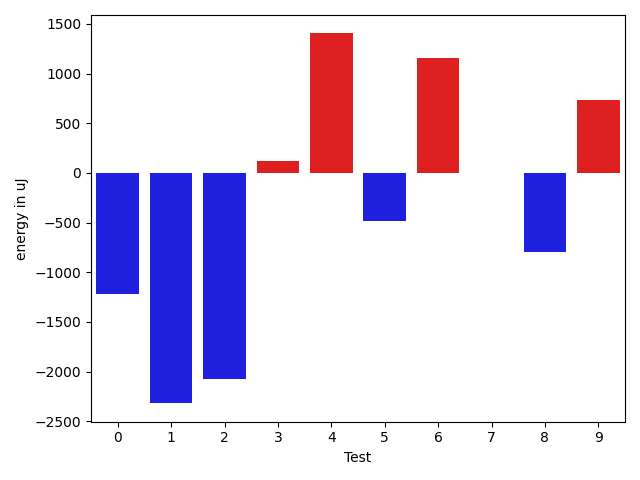

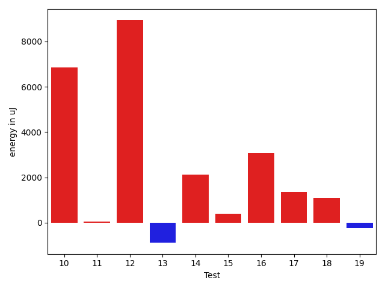

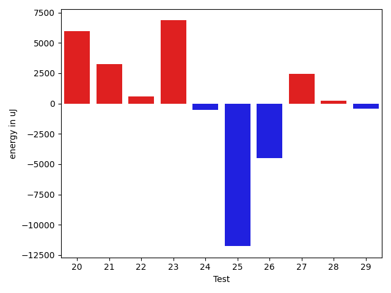

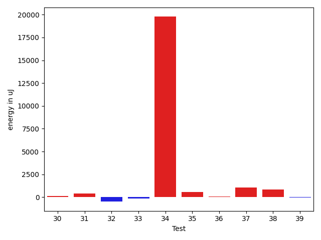

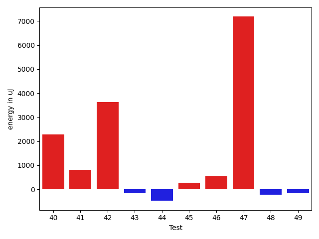

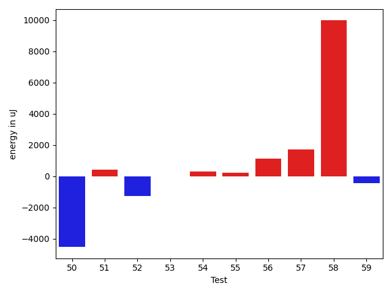

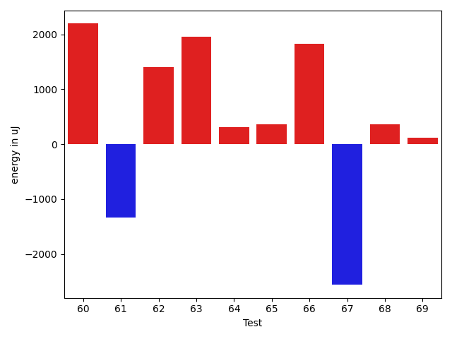

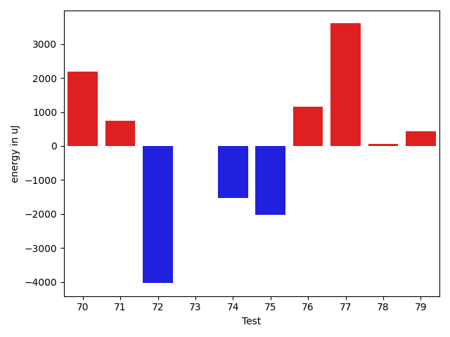

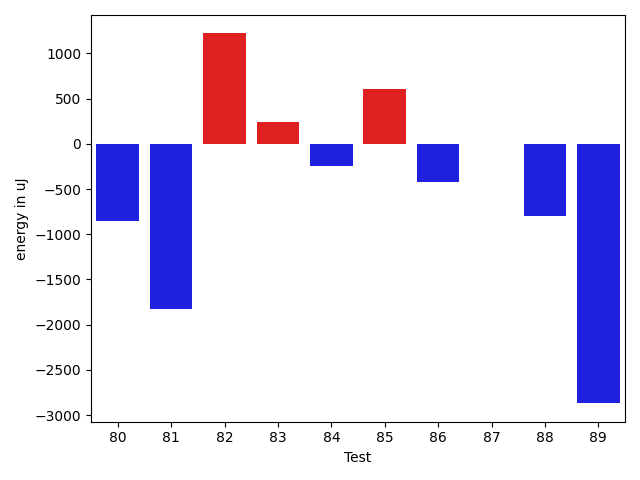

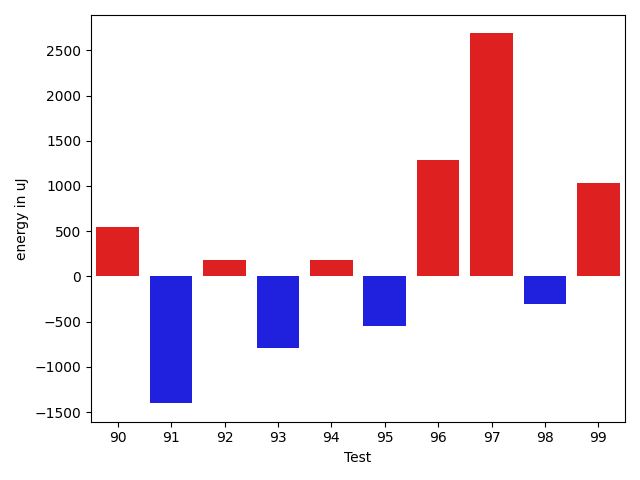

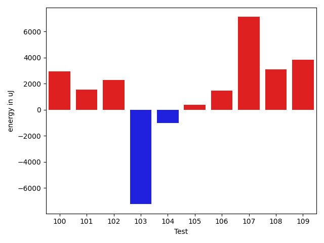

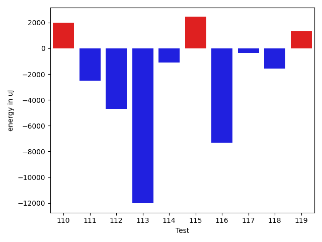

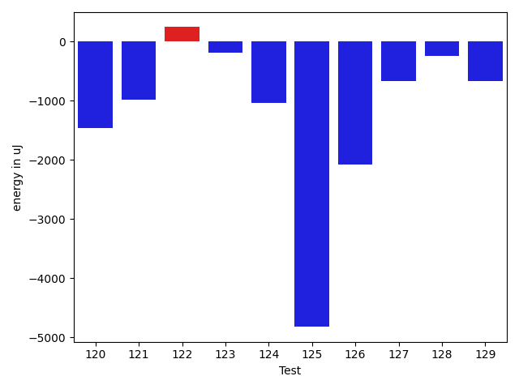

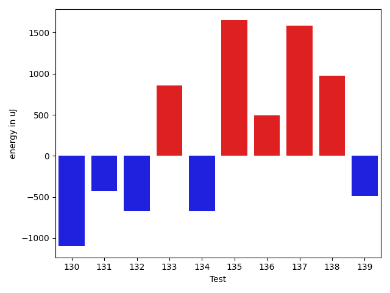

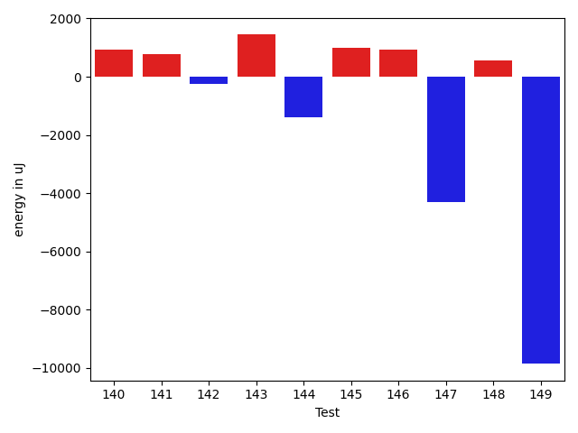

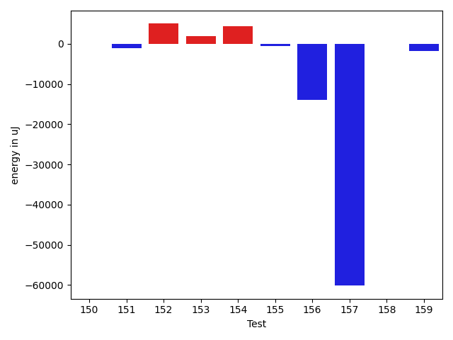

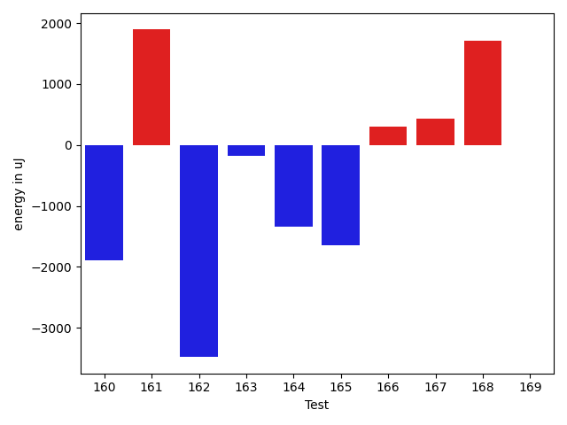

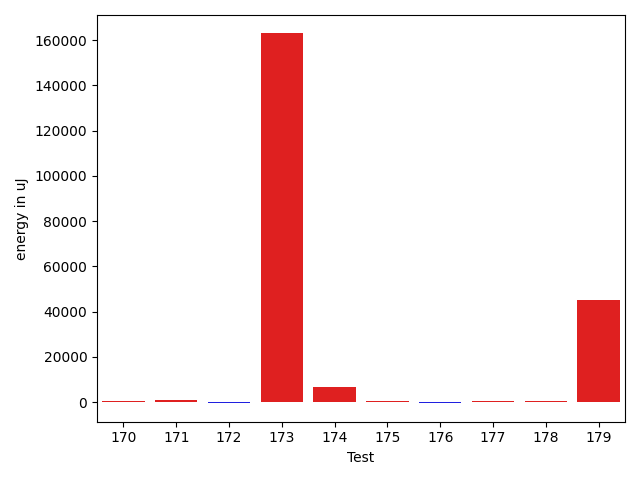

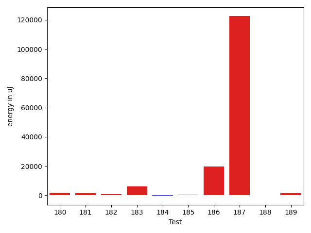

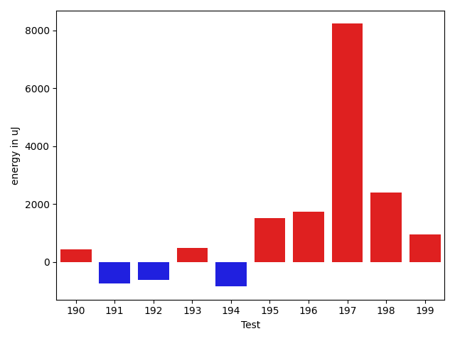

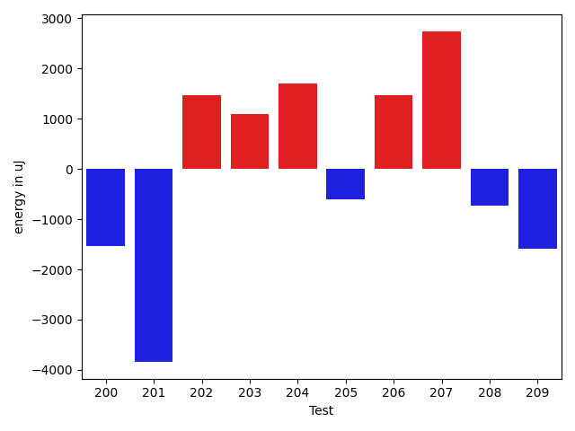

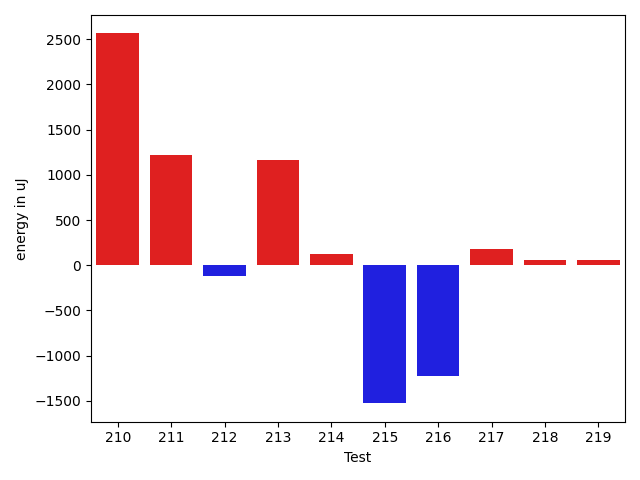

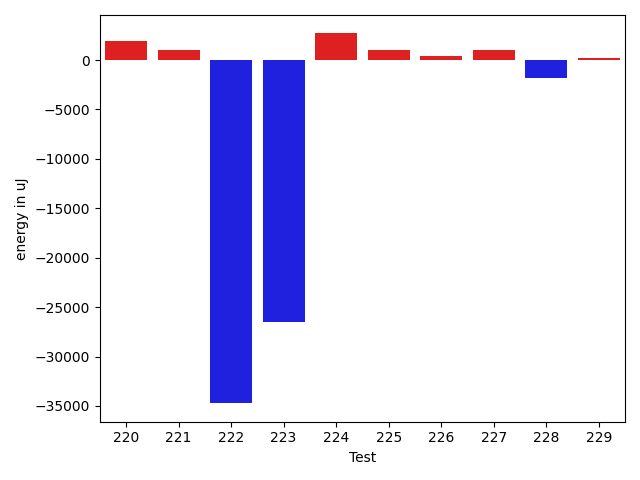

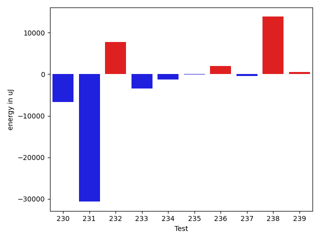

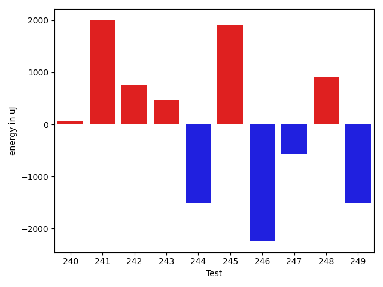

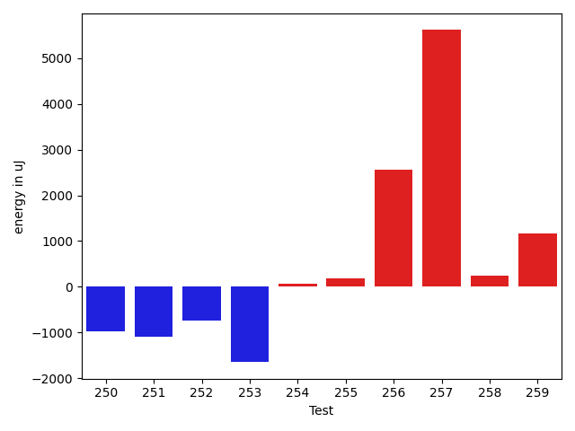

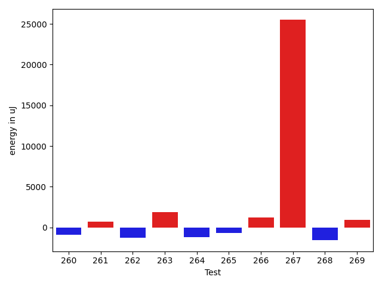

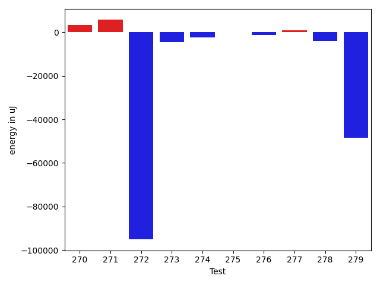

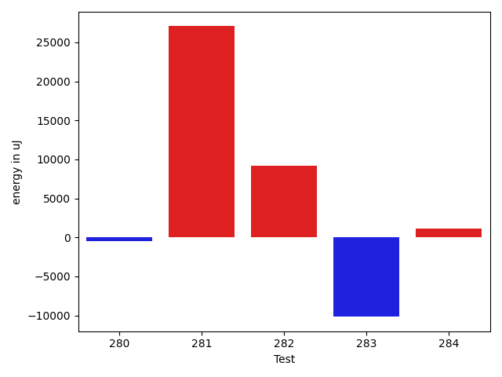

| ID | EnergyV1 | EnergyV2 | DeltaEnergy | σV1 | σV2 |
| --- | --- | --- | --- | --- | --- |
| 0 | 37964 | 36743 | -1221 | 4812.981639679178 | 4156.654190901213 |
| 1 | 41381 | 39062 | -2319 | 89000.24255568015 | 95040.00618773619 |
| 2 | 39367 | 37292 | -2075 | 12754.324873345666 | 20157.38561182669 |
| 3 | 34912 | 35034 | 122 | 3830.3169774103576 | 3843.96365817523 |
| 4 | 33142 | 34546 | 1404 | 4584.421700588216 | 4436.292241329476 |
| 5 | 36316 | 35828 | -488 | 3898.1639024032843 | 4338.252845820429 |
| 6 | 35035 | 36194 | 1159 | 8055.718858993771 | 7340.539783484941 |
| 7 | 35034 | 35034 | 0 | 3841.770916630338 | 6606.394582576825 |
| 8 | 38452 | 37659 | -793 | 16574.916589457775 | 21108.387458786434 |
| 9 | 37109 | 37842 | 733 | 36625.910641006034 | 44965.018477146725 |
| 10 | 35278 | 36682 | 1404 | 26780.81297002595 | 38549.08427758045 |
| 11 | 33264 | 33631 | 367 | 3983.7342543617287 | 3882.134070676634 |
| 12 | 39184 | 39612 | 428 | 64825.82746872896 | 86804.4758505652 |
| 13 | 35279 | 35278 | -1 | 4103.233582908683 | 3870.106715260602 |
| 14 | 35522 | 37719 | 2197 | 4310.973665119984 | 7319.886501538074 |
| 15 | 36010 | 36377 | 367 | 3903.3394482253993 | 5530.683395054044 |
| 16 | 33020 | 37720 | 4700 | 2834.259373373502 | 3547.9096343246024 |
| 17 | 35400 | 36072 | 672 | 3339.9759508177326 | 4026.890106383447 |
| 18 | 36987 | 38208 | 1221 | 3817.482414481713 | 4711.840741507859 |
| 19 | 37780 | 38696 | 916 | 25605.88505083136 | 25304.89714291591 |
| 20 | 35705 | 36804 | 1099 | 3759.143117297682 | 26448.089298064 |
| 21 | 37415 | 37292 | -123 | 31791.592542362396 | 40767.38558268399 |
| 22 | 35645 | 36010 | 365 | 4325.172037428303 | 3537.762474234205 |
| 23 | 40467 | 42968 | 2501 | 19604.116719284582 | 27385.092052313204 |
| 24 | 36255 | 36072 | -183 | 3352.312474725572 | 3339.6868896400056 |
| 25 | 35584 | 36560 | 976 | 67145.0075977931 | 38124.826380019316 |
| 26 | 38818 | 37353 | -1465 | 28764.78340647618 | 26437.594459714495 |
| 27 | 36133 | 38086 | 1953 | 2749.44202339311 | 3473.5551290248727 |
| 28 | 35828 | 35339 | -489 | 5500.99431419021 | 8089.492900020907 |
| 29 | 35217 | 34424 | -793 | 4473.010585483924 | 4334.402917630854 |
| 30 | 36804 | 36927 | 123 | 11341.440433712993 | 11247.002767805594 |
| 31 | 34790 | 35218 | 428 | 6231.589011184688 | 4849.094812416757 |
| 32 | 36132 | 35644 | -488 | 4491.199787208463 | 3860.0820043231834 |
| 33 | 36865 | 36743 | -122 | 8492.78370325722 | 10254.115037134276 |
| 34 | 80750 | 100524 | 19774 | 93585.24490062245 | 94231.98442879159 |
| 35 | 34546 | 35095 | 549 | 4283.317978701402 | 3835.1383000632773 |
| 36 | 36316 | 36377 | 61 | 5584.741221993245 | 10528.838284760335 |
| 37 | 72265 | 73303 | 1038 | 26311.63615324612 | 28221.427892742944 |
| 38 | 36926 | 37780 | 854 | 12035.252122781647 | 13596.150992990502 |
| 39 | 36865 | 36804 | -61 | 78974.43803513753 | 83732.77211663187 |
| 40 | 63599 | 62927 | -672 | 35667.02748428495 | 60212.2087103572 |
| 41 | 37109 | 37903 | 794 | 13298.581298203457 | 15145.198788397312 |
| 42 | 67810 | 73730 | 5920 | 44105.031388630276 | 43079.19414659317 |
| 43 | 35889 | 35523 | -366 | 11169.660792217632 | 10479.154812880652 |
| 44 | 37232 | 35827 | -1405 | 3512.6242503824683 | 3790.2367983544254 |
| 45 | 35462 | 36621 | 1159 | 8227.70158813044 | 6335.627567110379 |
| 46 | 38146 | 37598 | -548 | 24669.95977299803 | 23303.102617753615 |
| 47 | 76721 | 80566 | 3845 | 27452.35489478187 | 36981.635159330785 |
| 48 | 35889 | 36926 | 1037 | 7850.158914289049 | 4077.261534107763 |
| 49 | 36621 | 36682 | 61 | 10201.414326287022 | 11298.18729589277 |
| 50 | 38086 | 38147 | 61 | 193330.62817308703 | 152243.57895883685 |
| 51 | 36804 | 36499 | -305 | 4366.4984414989785 | 9291.048018914795 |
| 52 | 38391 | 37903 | -488 | 28186.593445886887 | 24093.357425223905 |
| 53 | 36560 | 36133 | -427 | 3746.817488206565 | 3154.174378968891 |
| 54 | 36560 | 36987 | 427 | 4196.500277174605 | 3980.7045310513886 |
| 55 | 36194 | 35644 | -550 | 4375.737374900341 | 4122.59310272215 |
| 56 | 36377 | 38025 | 1648 | 4675.393379171425 | 2596.848191676257 |
| 57 | 34546 | 36316 | 1770 | 3609.7683422035548 | 2876.4000125393036 |
| 58 | 38758 | 40649 | 1891 | 64258.12453361964 | 76190.36309560372 |
| 59 | 36499 | 38086 | 1587 | 9866.340014137148 | 4200.8536169582385 |
| 60 | 36987 | 39184 | 2197 | 10262.47525827221 | 12229.241567015582 |
| 61 | 37903 | 36560 | -1343 | 56898.60862695198 | 60108.14846824809 |
| 62 | 36560 | 37964 | 1404 | 4386.959016948858 | 4247.725769215552 |
| 63 | 37292 | 39245 | 1953 | 10149.790791916206 | 9808.401538522723 |
| 64 | 36376 | 36682 | 306 | 10674.523565545995 | 14886.807617811222 |
| 65 | 36255 | 36621 | 366 | 3654.260260559326 | 3869.1062573634795 |
| 66 | 36682 | 38513 | 1831 | 13492.095539364274 | 14260.368840739111 |
| 67 | 46386 | 43823 | -2563 | 98680.09922391624 | 84983.51628558458 |
| 68 | 36194 | 36560 | 366 | 6728.714159625602 | 3263.237833687449 |
| 69 | 37536 | 37659 | 123 | 3996.910305855706 | 3743.02530403772 |
| 70 | 33935 | 36132 | 2197 | 3957.7973649774217 | 3333.219920737304 |
| 71 | 35095 | 35828 | 733 | 3972.664125550745 | 4283.932198732064 |
| 72 | 45166 | 41137 | -4029 | 78297.25478069492 | 43412.42089896973 |
| 73 | 36072 | 36072 | 0 | 3770.474081164688 | 5345.430394130009 |
| 74 | 37232 | 35705 | -1527 | 4343.7488474659185 | 3229.707640707506 |
| 75 | 37353 | 35339 | -2014 | 5312.03318624776 | 4367.986268711337 |
| 76 | 34790 | 35950 | 1160 | 4550.1165962246505 | 4172.457269430678 |
| 77 | 33935 | 37536 | 3601 | 3072.48031724558 | 4303.846409445831 |
| 78 | 36072 | 36133 | 61 | 9785.313278540636 | 4178.48291562745 |
| 79 | 35034 | 35462 | 428 | 4189.098200870011 | 4139.736428320047 |
| 80 | 36743 | 35889 | -854 | 4888.221439848092 | 5490.241435407591 |
| 81 | 38391 | 36560 | -1831 | 117403.4035008629 | 17446.303611146624 |
| 82 | 35217 | 36438 | 1221 | 4656.347401247813 | 4421.713094968383 |
| 83 | 36011 | 36255 | 244 | 3704.538471778757 | 4415.83784240494 |
| 84 | 36011 | 35767 | -244 | 4595.323629055172 | 4260.533831789896 |
| 85 | 36804 | 37415 | 611 | 11201.835822351375 | 21717.711802588652 |
| 86 | 38940 | 38513 | -427 | 78420.65849815911 | 78629.82003759978 |
| 87 | 38086 | 38085 | -1 | 10753.87203608883 | 7436.913095675076 |
| 88 | 40222 | 39429 | -793 | 125281.07563976532 | 125979.68395635042 |
| 89 | 131531 | 128662 | -2869 | 90323.43982130746 | 98439.23034859482 |
| 90 | 36621 | 37171 | 550 | 8343.665401272992 | 9932.865621591644 |
| 91 | 37536 | 36133 | -1403 | 57708.20053337307 | 45639.2283288883 |
| 92 | 36499 | 36683 | 184 | 4651.665823276694 | 3620.3271491385885 |
| 93 | 37415 | 36621 | -794 | 9020.948638517206 | 15765.249884049043 |
| 94 | 36804 | 36988 | 184 | 3517.530685359969 | 4634.1983352031875 |
| 95 | 37720 | 37170 | -550 | 3993.995624634558 | 3979.847907445711 |
| 96 | 36132 | 37414 | 1282 | 3778.1171477631847 | 2970.278622890452 |
| 97 | 65002 | 67688 | 2686 | 44867.345780188996 | 57993.90754681666 |
| 98 | 37842 | 37537 | -305 | 79324.40120903206 | 68100.57469099696 |
| 99 | 34424 | 35461 | 1037 | 7718.185057707405 | 4785.733653341266 |
| 100 | 35949 | 35767 | -182 | 8310.28223206181 | 13162.029954521964 |
| 101 | 36072 | 37719 | 1647 | 15435.947044544439 | 14177.774494538648 |
| 102 | 32836 | 37232 | 4396 | 3489.5785289917176 | 2991.545924005195 |
| 103 | 35950 | 36682 | 732 | 64867.32907367442 | 46769.85084464925 |
| 104 | 37414 | 35827 | -1587 | 4797.173774444931 | 2529.2941781646405 |
| 105 | 35340 | 36743 | 1403 | 4650.611716826026 | 3342.959610506234 |
| 106 | 34302 | 36866 | 2564 | 4092.907186142266 | 3620.0211933081277 |
| 107 | 35950 | 35278 | -672 | 4007.1855097240705 | 27835.954926702987 |
| 108 | 34851 | 36743 | 1892 | 3981.146288803412 | 3397.263807637671 |
| 109 | 35828 | 35766 | -62 | 7865.667090282168 | 19672.62962888556 |
| 110 | 34667 | 37232 | 2565 | 3773.8315669425647 | 4506.335108030398 |
| 111 | 42785 | 41504 | -1281 | 23928.686184288785 | 20557.610983224684 |
| 112 | 36743 | 36987 | 244 | 31572.49470231169 | 4441.4225551730615 |
| 113 | 38696 | 38147 | -549 | 49627.82830479286 | 3802.737762651191 |
| 114 | 37598 | 35218 | -2380 | 4803.346783336349 | 5577.1022811283165 |
| 115 | 35461 | 36194 | 733 | 3655.731865703898 | 3982.4837393735834 |
| 116 | 35644 | 37354 | 1710 | 33338.37499106672 | 4818.542551538551 |
| 117 | 36682 | 37170 | 488 | 3373.7222740205248 | 3068.769697215067 |
| 118 | 37048 | 37780 | 732 | 15974.609951491264 | 14454.045703691048 |
| 119 | 36316 | 36560 | 244 | 14535.209864858616 | 13964.553880986896 |
| 120 | 36255 | 34790 | -1465 | 3653.5264342097867 | 3485.525484348209 |
| 121 | 34973 | 33996 | -977 | 4005.9964265930826 | 7118.170462119342 |
| 122 | 38513 | 38758 | 245 | 25074.549787715892 | 16864.055853253056 |
| 123 | 35644 | 35461 | -183 | 10533.198176881957 | 19872.963776429006 |
| 124 | 34363 | 33325 | -1038 | 3764.6931516448544 | 4582.336975923023 |
| 125 | 37536 | 32715 | -4821 | 4288.022262360035 | 1929.4185030728818 |
| 126 | 37720 | 35645 | -2075 | 30941.613735749725 | 16677.21418424804 |
| 127 | 37780 | 37109 | -671 | 19289.98996164744 | 13858.63155554488 |
| 128 | 35034 | 34790 | -244 | 4089.7382663485932 | 3477.5501788672714 |
| 129 | 34301 | 33630 | -671 | 4410.315190012512 | 4522.069699857619 |
| 130 | 37781 | 36682 | -1099 | 104777.2788138051 | 57305.12458310999 |
| 131 | 36194 | 35767 | -427 | 4217.561712278198 | 4222.781276862705 |
| 132 | 35949 | 35278 | -671 | 9189.0212698326 | 3047.3276199538072 |
| 133 | 33386 | 34241 | 855 | 2954.7575849268887 | 3176.639557257747 |
| 134 | 36072 | 35400 | -672 | 14800.709735326038 | 3670.591320966631 |
| 135 | 34180 | 35828 | 1648 | 3248.077139155818 | 40762.311390928684 |
| 136 | 34484 | 34973 | 489 | 3843.049569836341 | 4512.961543368953 |
| 137 | 36071 | 37658 | 1587 | 21930.94481677005 | 13370.375756474392 |
| 138 | 34545 | 35522 | 977 | 3502.592709664645 | 5142.9261492584 |
| 139 | 34485 | 33996 | -489 | 3806.3512352848434 | 3326.4235841169393 |
| 140 | 33386 | 33142 | -244 | 3837.989345089138 | 4329.375198303071 |
| 141 | 34668 | 35034 | 366 | 3851.667500164869 | 6325.091543594092 |
| 142 | 34729 | 34301 | -428 | 3895.9506886205922 | 4420.151037450819 |
| 143 | 32593 | 35339 | 2746 | 4377.9679319988845 | 3922.3879449677593 |
| 144 | 37720 | 35034 | -2686 | 4112.350796401538 | 3407.898485870728 |
| 145 | 33996 | 34851 | 855 | 4821.107297740982 | 6222.796171967841 |
| 146 | 34729 | 37110 | 2381 | 3003.078530811711 | 4124.789583993615 |
| 147 | 34668 | 35156 | 488 | 23578.818835281247 | 4579.210569993035 |
| 148 | 34912 | 34241 | -671 | 3018.732869930693 | 4413.74870365856 |
| 149 | 34851 | 33691 | -1160 | 64467.760065368726 | 3765.1748333842897 |
| 150 | 34302 | 34790 | 488 | 5070.067337631402 | 3787.092556677799 |
| 151 | 34912 | 33326 | -1586 | 3939.845358589598 | 3043.341308496305 |
| 152 | 33020 | 35400 | 2380 | 3058.303645026959 | 10844.972755785131 |
| 153 | 34485 | 36316 | 1831 | 3842.512586916198 | 3200.388331472014 |
| 154 | 33386 | 37780 | 4394 | 3692.749205044667 | 4325.458151713206 |
| 155 | 33630 | 33569 | -61 | 3308.839625407473 | 4614.6510100130945 |
| 156 | 76233 | 73975 | -2258 | 121380.78760820984 | 37139.739585384224 |
| 157 | 80811 | 74524 | -6287 | 271860.435943098 | 56881.44906738112 |
| 158 | 35889 | 34851 | -1038 | 4211.0207797284265 | 4291.226614915824 |
| 159 | 38941 | 39673 | 732 | 49437.60214562192 | 45361.50296459655 |
| 160 | 37415 | 35522 | -1893 | 69887.58315443207 | 75126.72006900334 |
| 161 | 36194 | 38086 | 1892 | 4044.1282091721846 | 3173.5686879193504 |
| 162 | 37048 | 33569 | -3479 | 3788.32484705 | 3585.5664008946915 |
| 163 | 36804 | 36621 | -183 | 4734.247666498019 | 38841.74229634949 |
| 164 | 36682 | 35340 | -1342 | 24956.204323749327 | 3827.3808559817057 |
| 165 | 36010 | 34363 | -1647 | 3670.630423388327 | 4784.274491469132 |
| 166 | 35888 | 36193 | 305 | 4332.777787142741 | 10310.356154385427 |
| 167 | 37536 | 37964 | 428 | 22092.56170578963 | 21648.686843445164 |
| 168 | 35156 | 36866 | 1710 | 4378.4239701315155 | 4483.095880359528 |
| 169 | 36071 | 36072 | 1 | 4930.854744900333 | 4599.870339381328 |
| 170 | 35644 | 35950 | 306 | 4653.485746656553 | 3846.1024514662263 |
| 171 | 38086 | 38696 | 610 | 21911.785995273796 | 17380.017123651163 |
| 172 | 36865 | 35950 | -915 | 3980.6503010930055 | 4001.533767153468 |
| 173 | 38330 | 39795 | 1465 | 330965.6096049671 | 484188.85708044155 |
| 174 | 41443 | 40039 | -1404 | 26063.00614489038 | 34608.849294941894 |
| 175 | 36438 | 36682 | 244 | 3759.0664237442365 | 4074.448328742647 |
| 176 | 36133 | 36316 | 183 | 4450.095362466151 | 4955.576040370271 |
| 177 | 35828 | 37415 | 1587 | 3801.3688534161247 | 4054.7429162237486 |
| 178 | 35827 | 36804 | 977 | 5659.598952824165 | 5308.78586626258 |
| 179 | 166077 | 170776 | 4699 | 152612.0501992786 | 258518.3827432397 |
| 180 | 35401 | 38147 | 2746 | 4179.73747161197 | 4286.837791379562 |
| 181 | 35950 | 37414 | 1464 | 4307.231385174483 | 5829.043123598962 |
| 182 | 36133 | 37292 | 1159 | 3348.591701846454 | 4479.63590097456 |
| 183 | 37048 | 38269 | 1221 | 15771.214420972272 | 24447.57229369336 |
| 184 | 36866 | 36377 | -489 | 5464.4944960547 | 5782.083438807618 |
| 185 | 36499 | 37658 | 1159 | 3568.3354799745825 | 4126.659453712358 |
| 186 | 38208 | 37841 | -367 | 40858.93255141584 | 79807.78937720328 |
| 187 | 36926 | 37903 | 977 | 6132.4884615964465 | 489597.2273021054 |
| 188 | 36926 | 37171 | 245 | 4307.6417131522085 | 3756.19986859141 |
| 189 | 34668 | 36804 | 2136 | 3405.7486855866214 | 4266.708319228952 |
| 190 | 35096 | 36010 | 914 | 3875.1776264023633 | 4288.774356782884 |
| 191 | 33814 | 33142 | -672 | 3591.1705951536687 | 3994.7643729088363 |
| 192 | 35950 | 34240 | -1710 | 5791.355913086439 | 7196.3331782665555 |
| 193 | 34180 | 33142 | -1038 | 4274.065849854081 | 3327.411093483042 |
| 194 | 35584 | 34424 | -1160 | 4031.328585581998 | 4742.575101920211 |
| 195 | 32959 | 33752 | 793 | 3728.4999205578642 | 4288.627308687086 |
| 196 | 37720 | 38330 | 610 | 34667.39802713131 | 43570.46526143204 |
| 197 | 153564 | 158752 | 5188 | 49813.902352820805 | 65592.83414406885 |
| 198 | 35339 | 36926 | 1587 | 12970.850676430517 | 19870.829613157865 |
| 199 | 34119 | 35462 | 1343 | 4341.046002386462 | 4414.9293094433315 |
| 200 | 35095 | 33569 | -1526 | 3769.5598779525158 | 4176.499503024684 |
| 201 | 35584 | 31738 | -3846 | 4271.422852191319 | 3325.0314527402966 |
| 202 | 32898 | 34363 | 1465 | 34592.05344698336 | 8622.993227267432 |
| 203 | 34119 | 35217 | 1098 | 3413.053878202072 | 3878.8623481061504 |
| 204 | 33875 | 35584 | 1709 | 5501.940217489445 | 8460.294391588497 |
| 205 | 36682 | 36072 | -610 | 3350.403319354813 | 3819.1194323299187 |
| 206 | 34301 | 35766 | 1465 | 4722.497452336827 | 5426.584084547724 |
| 207 | 32653 | 35400 | 2747 | 3233.986625062331 | 4184.661841641316 |
| 208 | 35705 | 34973 | -732 | 3925.713480056842 | 5054.457760955565 |
| 209 | 36743 | 35156 | -1587 | 3864.6267693435193 | 3860.4402426330876 |
| 210 | 34363 | 36926 | 2563 | 4043.0510297207757 | 33916.601777174124 |
| 211 | 33875 | 35095 | 1220 | 4383.307203801646 | 4882.3523378174705 |
| 212 | 36438 | 36315 | -123 | 7347.385370112121 | 7042.323904448328 |
| 213 | 35400 | 36560 | 1160 | 20012.176121946686 | 99750.28056675427 |
| 214 | 37720 | 37841 | 121 | 32953.614258171874 | 30962.223152226197 |
| 215 | 39368 | 37842 | -1526 | 37736.2545648818 | 36088.38022369178 |
| 216 | 38269 | 37048 | -1221 | 124330.1677775629 | 101562.25146921644 |
| 217 | 39733 | 39917 | 184 | 96013.49011966713 | 47845.64106182803 |
| 218 | 37475 | 37536 | 61 | 4460.660512581606 | 4297.995367481087 |
| 219 | 37903 | 37964 | 61 | 346616.57106527657 | 462689.6736737951 |
| 220 | 37293 | 39245 | 1952 | 14889.280435656801 | 22307.07055118411 |
| 221 | 37170 | 38208 | 1038 | 47225.4286370102 | 36180.193221893154 |
| 222 | 263793 | 229064 | -34729 | 123049.11956966828 | 124864.70636768885 |
| 223 | 376220 | 349731 | -26489 | 86706.37686131914 | 106148.81525703524 |
| 224 | 39245 | 41931 | 2686 | 53769.236671233506 | 46637.284318909384 |
| 225 | 35828 | 36866 | 1038 | 38276.32621259307 | 50450.531701638094 |
| 226 | 38086 | 38452 | 366 | 89303.85045325749 | 93430.60941934882 |
| 227 | 35522 | 36499 | 977 | 4732.408189723466 | 4114.957419909139 |
| 228 | 36804 | 35034 | -1770 | 5158.972515654031 | 4462.752773903978 |
| 229 | 38940 | 39123 | 183 | 18583.44449858795 | 19161.8097107277 |
| 230 | 38636 | 39245 | 609 | 51028.55705098414 | 35008.596717797875 |
| 231 | 40100 | 39001 | -1099 | 139902.02759985684 | 93317.67946463083 |
| 232 | 38697 | 38879 | 182 | 25395.64352790383 | 37090.936159384655 |
| 233 | 40344 | 38208 | -2136 | 51780.54867406925 | 42172.21583010147 |
| 234 | 38269 | 38025 | -244 | 7602.610432991641 | 4230.472745401721 |
| 235 | 34058 | 35766 | 1708 | 4830.632720920631 | 3621.2439092113086 |
| 236 | 35461 | 36682 | 1221 | 3908.321922291444 | 3788.783948702932 |
| 237 | 36072 | 36133 | 61 | 4646.403502379578 | 3111.0453525455982 |
| 238 | 41625 | 67809 | 26184 | 21127.19074507751 | 28482.172818800183 |
| 239 | 37110 | 36011 | -1099 | 3741.8737137963385 | 4126.493708992798 |
| 240 | 35096 | 34241 | -855 | 3933.8287809841413 | 4790.485099066169 |
| 241 | 33570 | 36133 | 2563 | 2810.8578887958593 | 3382.5929055301553 |
| 242 | 36682 | 37659 | 977 | 3950.5860726869796 | 4339.967303833879 |
| 243 | 36865 | 36865 | 0 | 4162.206236961687 | 3889.73690198536 |
| 244 | 36499 | 35950 | -549 | 6332.630456961614 | 4156.197898721058 |
| 245 | 36804 | 37842 | 1038 | 25035.070611252468 | 28097.420396497255 |
| 246 | 35888 | 34607 | -1281 | 3610.903951849311 | 2966.5422205142722 |
| 247 | 35400 | 34912 | -488 | 2936.8297293808164 | 3431.7194744064395 |
| 248 | 35522 | 36804 | 1282 | 3974.1445880088454 | 3958.645468780957 |
| 249 | 35888 | 35340 | -548 | 3152.414021032136 | 3064.3218934483148 |
| 250 | 34424 | 33447 | -977 | 3725.2901024618204 | 4230.408224982549 |
| 251 | 37720 | 36621 | -1099 | 4322.023126962649 | 4489.319169525302 |
| 252 | 36499 | 35767 | -732 | 5399.430140301844 | 4666.003295112424 |
| 253 | 36254 | 34607 | -1647 | 1773.6818736427592 | 3104.718706732365 |
| 254 | 36438 | 36499 | 61 | 3687.2970514259555 | 3255.466052997976 |
| 255 | 34912 | 35095 | 183 | 4961.6390230461 | 4243.071092890116 |
| 256 | 34363 | 36926 | 2563 | 3884.964578411263 | 3421.3542998201688 |
| 257 | 34058 | 39672 | 5614 | 4177.237131166963 | 4639.834908940427 |
| 258 | 34363 | 34607 | 244 | 3386.883854255196 | 3501.0633673898765 |
| 259 | 35400 | 36560 | 1160 | 3396.0120796827964 | 4254.558689870849 |
| 260 | 34607 | 34241 | -366 | 3809.1696737354437 | 4524.3735950405335 |
| 261 | 35156 | 36377 | 1221 | 4719.535194142901 | 4360.868133856656 |
| 262 | 34363 | 35157 | 794 | 3874.1356200408286 | 4144.877222017024 |
| 263 | 35645 | 37964 | 2319 | 3919.588212782749 | 4857.583992983435 |
| 264 | 36743 | 37353 | 610 | 3664.904816446052 | 4217.573622620264 |
| 265 | 34057 | 34729 | 672 | 4419.801067841169 | 3895.089961988487 |
| 266 | 33447 | 35522 | 2075 | 2984.2351932930637 | 2696.184748556209 |
| 267 | 37780 | 37841 | 61 | 25061.392326885118 | 101435.26812246311 |
| 268 | 38269 | 35278 | -2991 | 3392.1436964845693 | 3996.514611508383 |
| 269 | 38025 | 38330 | 305 | 4447.13007116078 | 3875.198981576869 |
| 270 | 37719 | 39245 | 1526 | 50393.60082982425 | 58887.1499897799 |
| 271 | 39978 | 39490 | -488 | 16532.85294292011 | 32473.967677544762 |
| 272 | 38880 | 38391 | -489 | 414047.04790285614 | 217364.00223421122 |
| 273 | 37902 | 37842 | -60 | 56906.81143119467 | 51204.4847211836 |
| 274 | 33996 | 35888 | 1892 | 18883.98085229164 | 4840.812663179603 |
| 275 | 36072 | 36499 | 427 | 3751.786041340844 | 3741.428492227131 |
| 276 | 36926 | 35034 | -1892 | 3112.0516129396055 | 3972.6561811698284 |
| 277 | 37842 | 37964 | 122 | 4638.077487775371 | 4127.910073826705 |
| 278 | 38391 | 35400 | -2991 | 8604.957196678359 | 4283.232057925512 |
| 279 | 38757 | 42968 | 4211 | 542207.2811164836 | 450620.4631813219 |
| 280 | 36987 | 35828 | -1159 | 5197.591845042694 | 2361.810334859944 |
| 281 | 38208 | 39184 | 976 | 267820.97368384607 | 333064.6901878772 |
| 282 | 37903 | 42480 | 4577 | 14206.142461630407 | 24103.908104058333 |
| 283 | 38635 | 38696 | 61 | 71478.27977291883 | 57748.34997664058 |
| 284 | 35767 | 38575 | 2808 | 4213.006350181146 | 4583.519617419834 |

## Delta Duration per test method

| ID | DurationV1 | DurationsV2 | DeltaDuration |
| --- | --- | --- | --- |
| 0 | 745805.4791666666 | 730364.976744186 | -15440.502422480611 |
| 1 | 2114918.8181818184 | 1976513.625 | -138405.19318181835 |
| 2 | 1146996.0125 | 1166942.8142857142 | 19946.801785714226 |
| 3 | 711450.509090909 | 777287.5454545454 | 65837.03636363638 |
| 4 | 568268.7096774194 | 632655.8888888889 | 64387.17921146948 |
| 5 | 715896.3 | 758300.1428571428 | 42403.842857142794 |
| 6 | 1030355.4 | 1036644.1904761905 | 6288.790476190508 |
| 7 | 837058.2786885246 | 872529.3968253968 | 35471.11813687219 |
| 8 | 1437827.84375 | 1492015.978021978 | 54188.134271977935 |
| 9 | 1317761.796875 | 1476213.296875 | 158451.5 |
| 10 | 1081251.1142857142 | 1254717.575 | 173466.46071428573 |
| 11 | 472619.875 | 487469.3333333333 | 14849.458333333314 |
| 12 | 1535660.469387755 | 1789046.351851852 | 253385.88246409688 |
| 13 | 743318.8103448276 | 732076.3265306122 | -11242.483814215404 |
| 14 | 942735.9629629629 | 791107.9375 | -151628.02546296292 |
| 15 | 709932.9285714285 | 721518.6734693878 | 11585.744897959288 |
| 16 | 390176.06666666665 | 374616.5333333333 | -15559.533333333326 |
| 17 | 453619.78571428574 | 389892.86666666664 | -63726.9190476191 |
| 18 | 448110.82608695654 | 421008.86666666664 | -27101.959420289902 |
| 19 | 1277340.0166666666 | 1374803.5272727273 | 97463.51060606074 |
| 20 | 621598.0285714286 | 779203.3714285714 | 157605.3428571428 |
| 21 | 1549006.1142857142 | 1495574.7894736843 | -53431.324812029954 |
| 22 | 488484.9696969697 | 527889.947368421 | 39404.977671451285 |
| 23 | 1398058.5333333334 | 1588342.5882352942 | 190284.05490196077 |
| 24 | 473177.73529411765 | 517214.4166666667 | 44036.681372549036 |
| 25 | 1682396.6153846155 | 1283551.652173913 | -398844.9632107024 |
| 26 | 1340367.7727272727 | 912140.0 | -428227.7727272727 |
| 27 | 426716.0 | 415719.5 | -10996.5 |
| 28 | 919086.8028169014 | 964359.5423728813 | 45272.73955597996 |
| 29 | 817117.0909090909 | 822522.1346153846 | 5405.0437062936835 |
| 30 | 1249546.142857143 | 1254782.1098901099 | 5235.9670329669025 |
| 31 | 1033263.2337662338 | 1014218.3888888889 | -19044.844877344905 |
| 32 | 804945.0819672131 | 840484.320754717 | 35539.23878750391 |
| 33 | 1211792.6705882354 | 1188961.7912087913 | -22830.879379444057 |
| 34 | 3483420.01010101 | 3667737.898989899 | 184317.888888889 |
| 35 | 517372.36666666664 | 517375.96428571426 | 3.597619047621265 |
| 36 | 1171799.2790697673 | 1194930.471264368 | 23131.19219460059 |
| 37 | 2370499.3061224488 | 2444293.6224489794 | 73794.31632653065 |
| 38 | 1326103.7096774194 | 1321166.4239130435 | -4937.285764375934 |
| 39 | 1932552.7045454546 | 1988549.9222222222 | 55997.217676767614 |
| 40 | 2091441.9797979798 | 2155205.212121212 | 63763.23232323211 |
| 41 | 1317838.2048192772 | 1341351.9425287356 | 23513.73770945845 |
| 42 | 2511474.0606060605 | 2560522.3469387754 | 49048.28633271484 |
| 43 | 1224285.6666666667 | 1219076.6483516484 | -5209.0183150183875 |
| 44 | 769534.625 | 739471.2 | -30063.425000000047 |
| 45 | 896261.696969697 | 918939.350877193 | 22677.653907496016 |
| 46 | 1042849.6911764706 | 1090970.0172413792 | 48120.326064908644 |
| 47 | 2672362.8585858587 | 2782301.5656565656 | 109938.70707070688 |
| 48 | 902812.2571428572 | 910888.8923076923 | 8076.635164835141 |
| 49 | 1076435.689189189 | 1060675.420289855 | -15760.268899334129 |
| 50 | 1650609.4603174604 | 1585266.134328358 | -65343.325989102246 |
| 51 | 897200.6721311476 | 899317.6851851852 | 2117.013054037583 |
| 52 | 1318573.8169014084 | 1222799.0571428572 | -95774.75975855114 |
| 53 | 741778.0625 | 792316.7115384615 | 50538.6490384615 |
| 54 | 614016.7428571428 | 630667.5909090909 | 16650.848051948124 |
| 55 | 620402.1842105263 | 610079.4 | -10322.784210526268 |
| 56 | 391900.94444444444 | 446239.28571428574 | 54338.3412698413 |
| 57 | 428522.125 | 443005.6956521739 | 14483.57065217389 |
| 58 | 1973404.237113402 | 2182383.6666666665 | 208979.42955326452 |
| 59 | 777170.5454545454 | 695042.1111111111 | -82128.43434343429 |
| 60 | 893101.7708333334 | 1014091.8571428572 | 120990.08630952379 |
| 61 | 1608084.5833333333 | 1517986.7258064516 | -90097.85752688162 |
| 62 | 830184.1 | 837515.4677419355 | 7331.367741935537 |
| 63 | 763040.9354838709 | 827168.0322580645 | 64127.096774193575 |
| 64 | 1001944.9855072463 | 1052571.05 | 50626.06449275371 |
| 65 | 601393.4705882353 | 511608.03846153844 | -89785.43212669686 |
| 66 | 906616.1333333333 | 1001455.9523809524 | 94839.81904761912 |
| 67 | 2594267.6464646463 | 2364007.8585858587 | -230259.7878787876 |
| 68 | 631154.358974359 | 634756.8387096775 | 3602.479735318455 |
| 69 | 457233.4166666667 | 424095.86666666664 | -33137.55000000005 |
| 70 | 420226.0 | 470939.4 | 50713.40000000002 |
| 71 | 474348.5 | 429653.4166666667 | -44695.083333333314 |
| 72 | 2092567.6136363635 | 1679043.3258426967 | -413524.2877936668 |
| 73 | 952097.4857142858 | 977670.0933333334 | 25572.60761904763 |
| 74 | 425996.6842105263 | 393920.1111111111 | -32076.573099415167 |
| 75 | 647440.8636363636 | 627190.2142857143 | -20250.649350649328 |
| 76 | 643488.1379310344 | 568991.0588235294 | -74497.07910750504 |
| 77 | 677101.5263157894 | 640960.8095238095 | -36140.71679197997 |
| 78 | 770014.1836734693 | 740723.5952380953 | -29290.588435374084 |
| 79 | 705960.1702127659 | 691898.7959183673 | -14061.374294398585 |
| 80 | 650432.3260869565 | 669235.0769230769 | 18802.750836120336 |
| 81 | 2231300.6964285714 | 997065.9615384615 | -1234234.7348901099 |
| 82 | 427427.5882352941 | 612651.3181818182 | 185223.72994652414 |
| 83 | 468600.3333333333 | 402503.3157894737 | -66097.0175438596 |
| 84 | 727370.717948718 | 661869.5853658536 | -65501.132582864375 |
| 85 | 1082523.7746478873 | 1212938.4925373134 | 130414.71788942604 |
| 86 | 1906769.7428571428 | 2027076.1470588236 | 120306.4042016808 |
| 87 | 1114491.7307692308 | 1100096.3170731708 | -14395.413696059957 |
| 88 | 3238445.75 | 3100741.35483871 | -137704.3951612902 |
| 89 | 4786954.838383839 | 4734370.434343434 | -52584.404040404595 |
| 90 | 874450.12 | 892656.3333333334 | 18206.213333333377 |
| 91 | 1435908.3777777778 | 1132913.3 | -302995.0777777778 |
| 92 | 774713.7368421053 | 714710.3653846154 | -60003.371457489906 |
| 93 | 728979.8444444444 | 761828.0 | 32848.1555555556 |
| 94 | 585205.4571428571 | 575935.9 | -9269.557142857113 |
| 95 | 506102.92 | 544143.84 | 38040.919999999984 |
| 96 | 484201.6 | 451136.32 | -33065.27999999997 |
| 97 | 2286783.484848485 | 2446369.626262626 | 159586.14141414128 |
| 98 | 1977463.2045454546 | 1681953.051724138 | -295510.1528213166 |
| 99 | 783803.1724137932 | 667050.4545454546 | -116752.71786833857 |
| 100 | 1096489.168831169 | 1210815.9466666668 | 114326.77783549787 |
| 101 | 1344618.1956521738 | 1338272.7311827957 | -6345.464469378116 |
| 102 | 372450.25 | 465356.22222222225 | 92905.97222222225 |
| 103 | 1498223.3076923077 | 1245389.2857142857 | -252834.02197802207 |
| 104 | 428999.3333333333 | 435327.17391304346 | 6327.840579710144 |
| 105 | 678464.3333333334 | 563213.0 | -115251.33333333337 |
| 106 | 451927.9583333333 | 475261.6 | 23333.641666666663 |
| 107 | 455566.1176470588 | 763333.7368421053 | 307767.6191950465 |
| 108 | 390861.2105263158 | 395069.4761904762 | 4208.265664160426 |
| 109 | 616641.1153846154 | 750464.6428571428 | 133823.52747252746 |
| 110 | 489872.73913043475 | 553464.1071428572 | 63591.368012422405 |
| 111 | 878170.5555555555 | 924901.88 | 46731.3244444445 |
| 112 | 681752.85 | 502777.08 | -178975.76999999996 |
| 113 | 813099.5625 | 480867.1304347826 | -332232.4320652174 |
| 114 | 340472.0 | 378565.5 | 38093.5 |
| 115 | 430402.7619047619 | 443236.0 | 12833.238095238106 |
| 116 | 658064.6470588235 | 391889.77777777775 | -266174.86928104574 |
| 117 | 346528.86666666664 | 445508.7272727273 | 98979.86060606065 |
| 118 | 1418979.3411764705 | 1342867.7654320989 | -76111.57574437163 |
| 119 | 1156666.6883116884 | 1084127.873015873 | -72538.81529581547 |
| 120 | 480396.1379310345 | 490069.0 | 9672.862068965507 |
| 121 | 736229.3777777777 | 725480.9782608695 | -10748.399516908219 |
| 122 | 1655287.2040816327 | 1500199.6914893617 | -155087.51259227097 |
| 123 | 877796.5714285715 | 694523.3333333334 | -183273.2380952381 |
| 124 | 785133.5416666666 | 750583.9245283019 | -34549.6171383647 |
| 125 | 337503.3043478261 | 395945.9 | 58442.59565217391 |
| 126 | 1615866.2093023255 | 1271951.1898734176 | -343915.0194289079 |
| 127 | 1311297.984375 | 1146909.6176470588 | -164388.3667279412 |
| 128 | 684920.0909090909 | 586372.6470588235 | -98547.44385026745 |
| 129 | 522344.3214285714 | 523860.18518518517 | 1515.8637566137477 |
| 130 | 1940622.9761904762 | 1276124.4594594594 | -664498.5167310168 |
| 131 | 788025.6875 | 527485.8333333334 | -260539.85416666663 |
| 132 | 701199.0769230769 | 568347.7666666667 | -132851.31025641016 |
| 133 | 736817.3243243244 | 639027.1428571428 | -97790.18146718154 |
| 134 | 779471.925 | 787713.9666666667 | 8242.041666666628 |
| 135 | 764423.1794871795 | 871416.3448275862 | 106993.1653404067 |
| 136 | 719072.4782608695 | 623270.6458333334 | -95801.83242753614 |
| 137 | 847271.3846153846 | 852064.6818181818 | 4793.297202797141 |
| 138 | 690040.6 | 791442.2051282051 | 101401.60512820515 |
| 139 | 611699.7575757576 | 607003.25 | -4696.507575757569 |
| 140 | 518691.8076923077 | 471054.81481481483 | -47636.992877492856 |
| 141 | 858174.512195122 | 755594.8974358974 | -102579.61475922458 |
| 142 | 544526.3142857143 | 539328.0 | -5198.314285714296 |
| 143 | 555212.0 | 497663.26923076925 | -57548.73076923075 |
| 144 | 357963.23529411765 | 314450.0 | -43513.23529411765 |
| 145 | 1008239.4769230769 | 958993.3913043478 | -49246.08561872912 |
| 146 | 579003.5 | 482897.1666666667 | -96106.33333333331 |
| 147 | 659058.9677419355 | 446336.375 | -212722.5927419355 |
| 148 | 480348.95 | 513896.8095238095 | 33547.859523809515 |
| 149 | 1232797.9636363636 | 820468.0181818182 | -412329.94545454544 |
| 150 | 881777.8490566037 | 785426.5714285715 | -96351.27762803226 |
| 151 | 712759.4 | 466624.2 | -246135.2 |
| 152 | 582790.2222222222 | 706234.0689655172 | 123443.84674329497 |
| 153 | 498169.63157894736 | 398938.9583333333 | -99230.67324561405 |
| 154 | 405774.22222222225 | 387948.44444444444 | -17825.77777777781 |
| 155 | 480507.8888888889 | 427163.2727272727 | -53344.61616161617 |
| 156 | 2910385.797979798 | 2378736.282828283 | -531649.5151515151 |
| 157 | 4390208.168539326 | 2574987.6263736263 | -1815220.5421656994 |
| 158 | 568688.027027027 | 576495.9032258064 | 7807.876198779442 |
| 159 | 1804573.589041096 | 1729736.2461538462 | -74837.34288724978 |
| 160 | 1528329.5862068965 | 1389169.375 | -139160.21120689646 |
| 161 | 561092.125 | 512005.04545454547 | -49087.07954545453 |
| 162 | 599329.1851851852 | 573056.0588235294 | -26273.12636165577 |
| 163 | 584980.6129032258 | 888868.2258064516 | 303887.6129032258 |
| 164 | 773936.0 | 570524.5185185185 | -203411.48148148146 |
| 165 | 501289.82608695654 | 490602.75 | -10687.076086956542 |
| 166 | 741159.8387096775 | 827582.6875 | 86422.84879032255 |
| 167 | 1350957.731707317 | 1321566.388888889 | -29391.342818428064 |
| 168 | 712309.3333333334 | 663044.3333333334 | -49265.0 |
| 169 | 588214.8928571428 | 491841.9655172414 | -96372.92733990145 |
| 170 | 717304.1632653062 | 691724.052631579 | -25580.110633727163 |
| 171 | 1072016.780487805 | 1028945.5135135135 | -43071.266974291415 |
| 172 | 719464.1714285715 | 646390.2272727273 | -73073.94415584416 |
| 173 | 4880243.416666667 | 9928204.789473685 | 5047961.3728070175 |
| 174 | 1006661.09375 | 1290447.96 | 283786.86624999996 |
| 175 | 559406.5862068966 | 509380.59375 | -50025.99245689658 |
| 176 | 584099.6923076923 | 553553.7567567568 | -30545.93555093545 |
| 177 | 464008.9166666667 | 429515.4666666667 | -34493.45000000001 |
| 178 | 832304.5254237289 | 926602.5322580645 | 94298.00683433563 |
| 179 | 5620264.151515151 | 7148044.424242424 | 1527780.2727272725 |
| 180 | 498061.25 | 518064.28 | 20003.030000000028 |
| 181 | 760042.2888888889 | 810185.1020408163 | 50142.81315192743 |
| 182 | 702801.1515151515 | 812982.2325581395 | 110181.081042988 |
| 183 | 721509.5588235294 | 1063250.205882353 | 341740.6470588236 |
| 184 | 821495.53125 | 918692.2166666667 | 97196.68541666667 |
| 185 | 576612.5789473684 | 712512.7037037037 | 135900.12475633528 |
| 186 | 1065512.224489796 | 1813473.2916666667 | 747961.0671768708 |
| 187 | 1092994.6835443038 | 4538197.705882353 | 3445203.022338049 |
| 188 | 525417.9666666667 | 700674.0357142857 | 175256.069047619 |
| 189 | 440630.4375 | 505562.53571428574 | 64932.09821428574 |
| 190 | 818157.320754717 | 797095.25 | -21062.070754716988 |
| 191 | 508016.3870967742 | 497894.6666666667 | -10121.720430107496 |
| 192 | 1009819.338028169 | 978825.5308641975 | -30993.807163971476 |
| 193 | 384843.05555555556 | 330205.38095238095 | -54637.674603174615 |
| 194 | 712452.5625 | 700244.3478260869 | -12208.214673913084 |
| 195 | 467112.04 | 502207.0 | 35094.96000000002 |
| 196 | 1226822.939759036 | 1235049.1038961038 | 8226.164137067739 |
| 197 | 4829625.545454546 | 5004009.5050505055 | 174383.95959595963 |
| 198 | 811037.7446808511 | 947209.5454545454 | 136171.8007736943 |
| 199 | 674791.5714285715 | 694212.4901960784 | 19420.918767506955 |
| 200 | 383150.1904761905 | 388097.72222222225 | 4947.531746031775 |
| 201 | 460492.3 | 508552.6551724138 | 48060.35517241381 |
| 202 | 906815.5172413794 | 674880.2 | -231935.3172413794 |
| 203 | 544116.7142857143 | 532496.4333333333 | -11620.28095238097 |
| 204 | 1006764.104477612 | 1011462.0821917808 | 4697.977714168839 |
| 205 | 424567.5 | 421334.84 | -3232.6599999999744 |
| 206 | 541225.4545454546 | 567443.9666666667 | 26218.512121212087 |
| 207 | 512995.9655172414 | 473411.3333333333 | -39584.63218390808 |
| 208 | 730514.625 | 698687.3777777777 | -31827.24722222227 |
| 209 | 413169.35714285716 | 418819.3333333333 | 5649.976190476154 |
| 210 | 713589.3783783783 | 824265.2325581395 | 110675.85417976114 |
| 211 | 509013.23076923075 | 469123.76923076925 | -39889.4615384615 |
| 212 | 770325.6304347826 | 698117.2702702703 | -72208.3601645123 |
| 213 | 769004.3235294118 | 991517.0588235294 | 222512.7352941176 |
| 214 | 1261046.4833333334 | 1179552.7662337662 | -81493.71709956718 |
| 215 | 1599136.646153846 | 1310557.0576923077 | -288579.5884615383 |
| 216 | 1863977.0 | 1734029.3870967743 | -129947.6129032257 |
| 217 | 1908638.3548387096 | 1126053.4166666667 | -782584.9381720428 |
| 218 | 531472.8148148148 | 535992.0666666667 | 4519.251851851819 |
| 219 | 3121393.533333333 | 4120714.6274509802 | 999321.094117647 |
| 220 | 1084402.148148148 | 1078289.3103448276 | -6112.837803320494 |
| 221 | 1690184.9882352941 | 1516326.816091954 | -173858.1721433401 |
| 222 | 8593385.828282828 | 8120786.303030303 | -472599.52525252476 |
| 223 | 10357227.070707072 | 10252423.727272727 | -104803.34343434498 |
| 224 | 1942510.888888889 | 1808792.2121212122 | -133718.67676767684 |
| 225 | 1159528.822222222 | 1186454.1951219512 | 26925.37289972906 |
| 226 | 1984087.5555555555 | 1916674.5 | -67413.0555555555 |
| 227 | 761472.3333333334 | 724552.0681818182 | -36920.26515151514 |
| 228 | 669321.2580645161 | 619797.7407407408 | -49523.51732377533 |
| 229 | 1331211.0277777778 | 1166643.1176470588 | -164567.91013071896 |
| 230 | 1515415.06779661 | 1228135.25 | -287279.81779661006 |
| 231 | 2795564.688888889 | 1753371.5555555555 | -1042193.1333333333 |
| 232 | 1192635.4363636363 | 1455324.7241379311 | 262689.28777429485 |
| 233 | 979719.5925925926 | 954917.3409090909 | -24802.251683501643 |
| 234 | 765300.9791666666 | 756184.8181818182 | -9116.160984848393 |
| 235 | 665494.4705882353 | 376867.1 | -288627.3705882353 |
| 236 | 582388.0416666666 | 545341.4285714285 | -37046.613095238106 |
| 237 | 690800.0789473684 | 701509.3157894737 | 10709.236842105282 |
| 238 | 1180660.2 | 1827587.48 | 646927.28 |
| 239 | 570751.2 | 660570.4642857143 | 89819.26428571437 |
| 240 | 415379.2272727273 | 482324.125 | 66944.8977272727 |
| 241 | 379159.76923076925 | 355295.2631578947 | -23864.50607287453 |
| 242 | 510248.75 | 532024.8181818182 | 21776.068181818235 |
| 243 | 339477.4736842105 | 406334.4166666667 | 66856.94298245618 |
| 244 | 702659.8461538461 | 692366.2333333333 | -10293.612820512848 |
| 245 | 791347.8695652174 | 880404.3125 | 89056.4429347826 |
| 246 | 354012.0588235294 | 348476.3125 | -5535.746323529398 |
| 247 | 396656.6875 | 376877.14285714284 | -19779.54464285716 |
| 248 | 434507.76 | 454900.1 | 20392.339999999967 |
| 249 | 377928.4 | 341834.27777777775 | -36094.12222222227 |
| 250 | 429335.8 | 389205.1875 | -40130.61249999999 |
| 251 | 481134.9 | 491269.14285714284 | 10134.242857142817 |
| 252 | 394389.5333333333 | 409936.5 | 15546.966666666674 |
| 253 | 373440.0 | 347120.54545454547 | -26319.45454545453 |
| 254 | 491111.13636363635 | 458358.72222222225 | -32752.414141414105 |
| 255 | 519669.36842105264 | 424400.61904761905 | -95268.74937343359 |
| 256 | 323493.64285714284 | 371482.28571428574 | 47988.6428571429 |
| 257 | 445664.2 | 451854.26666666666 | 6190.066666666651 |
| 258 | 351280.8823529412 | 355647.86363636365 | 4366.981283422443 |
| 259 | 486335.71428571426 | 497697.86666666664 | 11362.152380952379 |
| 260 | 465187.1818181818 | 395593.35 | -69593.83181818185 |
| 261 | 385130.4736842105 | 479838.2631578947 | 94707.78947368421 |
| 262 | 371212.1666666667 | 374700.6842105263 | 3488.517543859605 |
| 263 | 348969.29411764705 | 387298.5333333333 | 38329.23921568628 |
| 264 | 352570.07692307694 | 407640.8 | 55070.72307692305 |
| 265 | 416801.6153846154 | 422166.1818181818 | 5364.566433566448 |
| 266 | 384672.6 | 469255.0 | 84582.40000000002 |
| 267 | 1072344.0961538462 | 1976752.353846154 | 904408.2576923077 |
| 268 | 431462.88 | 469858.9 | 38396.02000000002 |
| 269 | 411679.53846153844 | 596265.2105263158 | 184585.6720647774 |
| 270 | 1343458.0714285714 | 1375295.1612903227 | 31837.0898617513 |
| 271 | 833545.7333333333 | 1223208.75 | 389663.0166666667 |
| 272 | 5190876.147058823 | 2059199.0512820513 | -3131677.095776772 |
| 273 | 1243116.1860465116 | 994645.023255814 | -248471.16279069765 |
| 274 | 723918.3333333334 | 701761.7333333333 | -22156.600000000093 |
| 275 | 682763.9166666666 | 619133.7714285714 | -63630.145238095196 |
| 276 | 483803.84 | 482857.0 | -946.8400000000256 |
| 277 | 539148.0869565217 | 514005.36 | -25142.726956521743 |
| 278 | 907816.1 | 806788.0285714286 | -101028.07142857136 |
| 279 | 5614295.084507043 | 4271254.455882353 | -1343040.6286246898 |
| 280 | 473999.1111111111 | 594575.2272727273 | 120576.11616161617 |
| 281 | 2137871.97260274 | 3074008.736842105 | 936136.7642393652 |
| 282 | 644371.1764705882 | 1015528.75 | 371157.5735294118 |
| 283 | 1489297.512195122 | 1153873.3396226414 | -335424.1725724805 |
| 284 | 523585.5 | 573832.9189189189 | 50247.418918918935 |

## Misc.

| ID | Test Class | Test Method |
| --- | --- | --- |
| 0 | com.google.gson.functional.CustomDeserializerTest | testDefaultConstructorNotCalledOnField |
| 1 | com.google.gson.functional.CustomDeserializerTest | testDefaultConstructorNotCalledOnObject |
| 2 | com.google.gson.functional.CustomDeserializerTest | testJsonTypeFieldBasedDeserialization |
| 3 | com.google.gson.functional.CollectionTest | testCollectionOfObjectSerialization |
| 4 | com.google.gson.functional.CollectionTest | testRawCollectionSerialization |
| 5 | com.google.gson.functional.CollectionTest | testNullsInListSerialization |
| 6 | com.google.gson.functional.CollectionTest | testWildcardPrimitiveCollectionSerilaization |
| 7 | com.google.gson.functional.CollectionTest | testSetDeserialization |
| 8 | com.google.gson.functional.CollectionTest | testWildcardCollectionField |
| 9 | com.google.gson.functional.CollectionTest | testTopLevelCollectionOfIntegersSerialization |
| 10 | com.google.gson.functional.CollectionTest | testCollectionOfBagOfPrimitivesSerialization |
| 11 | com.google.gson.functional.CollectionTest | testRawCollectionOfIntegersSerialization |
| 12 | com.google.gson.functional.CollectionTest | testSetSerialization |
| 13 | com.google.gson.functional.CollectionTest | testCollectionOfObjectWithNullSerialization |
| 14 | com.google.gson.functional.CollectionTest | testLinkedListSerialization |
| 15 | com.google.gson.functional.CollectionTest | testQueueSerialization |
| 16 | com.google.gson.functional.CollectionTest | testCollectionOfStringsSerialization |
| 17 | com.google.gson.functional.ArrayTest | testSingleStringArraySerialization |
| 18 | com.google.gson.functional.ArrayTest | testArrayOfStringsSerialization |
| 19 | com.google.gson.functional.ArrayTest | testObjectArrayWithNonPrimitivesSerialization |
| 20 | com.google.gson.functional.ArrayTest | testArrayOfPrimitivesWithCustomTypeAdapter |
| 21 | com.google.gson.functional.ArrayTest | testArrayOfCollectionSerialization |
| 22 | com.google.gson.functional.ArrayTest | testNullsInArrayWithSerializeNullPropertySetSerialization |
| 23 | com.google.gson.functional.ArrayTest | testArrayOfPrimitivesAsObjectsSerialization |
| 24 | com.google.gson.functional.ArrayTest | testNullsInArraySerialization |
| 25 | com.google.gson.functional.ArrayTest | testTopLevelArrayOfIntsSerialization |
| 26 | com.google.gson.functional.ArrayTest | testSingleNullInArraySerialization |
| 27 | com.google.gson.functional.ArrayTest | testEmptyArraySerialization |
| 28 | com.google.gson.functional.ParameterizedTypesTest | testParameterizedTypeGenericArraysSerialization |
| 29 | com.google.gson.functional.ParameterizedTypesTest | testParameterizedTypesWithWriterSerialization |
| 30 | com.google.gson.functional.ParameterizedTypesTest | testVariableTypeArrayDeserialization |
| 31 | com.google.gson.functional.ParameterizedTypesTest | testParameterizedTypeWithReaderDeserialization |
| 32 | com.google.gson.functional.ParameterizedTypesTest | testDeepParameterizedTypeDeserialization |
| 33 | com.google.gson.functional.ParameterizedTypesTest | testParameterizedTypeWithCustomSerializer |
| 34 | com.google.gson.functional.ParameterizedTypesTest | testParameterizedTypesSerialization |
| 35 | com.google.gson.functional.ParameterizedTypesTest | testDeepParameterizedTypeSerialization |
| 36 | com.google.gson.functional.ParameterizedTypesTest | testVariableTypeDeserialization |
| 37 | com.google.gson.functional.ParameterizedTypesTest | testVariableTypeFieldsAndGenericArraysSerialization |
| 38 | com.google.gson.functional.ParameterizedTypesTest | testParameterizedTypeGenericArraysDeserialization |
| 39 | com.google.gson.functional.ParameterizedTypesTest | testParameterizedTypeDeserialization |
| 40 | com.google.gson.functional.ParameterizedTypesTest | testVariableTypeFieldsAndGenericArraysDeserialization |
| 41 | com.google.gson.functional.ParameterizedTypesTest | testTypesWithMultipleParametersDeserialization |
| 42 | com.google.gson.functional.ParameterizedTypesTest | testTypesWithMultipleParametersSerialization |
| 43 | com.google.gson.functional.ParameterizedTypesTest | testParameterizedTypeWithVariableTypeDeserialization |
| 44 | com.google.gson.functional.CustomTypeAdaptersTest | testCustomTypeAdapterAppliesToSubClassesSerializedAsBaseClass |
| 45 | com.google.gson.functional.CustomTypeAdaptersTest | testCustomAdapterInvokedForMapElementSerializationWithType |
| 46 | com.google.gson.functional.CustomTypeAdaptersTest | testCustomNestedSerializers |
| 47 | com.google.gson.functional.CustomTypeAdaptersTest | testCustomTypeAdapterDoesNotAppliesToSubClasses |
| 48 | com.google.gson.functional.CustomTypeAdaptersTest | testCustomSerializerForLong |
| 49 | com.google.gson.functional.CustomTypeAdaptersTest | testCustomDeserializerForLong |
| 50 | com.google.gson.functional.CustomTypeAdaptersTest | testCustomSerializers |
| 51 | com.google.gson.functional.CustomTypeAdaptersTest | testCustomNestedDeserializers |
| 52 | com.google.gson.functional.CustomTypeAdaptersTest | testCustomAdapterInvokedForCollectionElementSerializationWithType |
| 53 | com.google.gson.functional.CustomTypeAdaptersTest | testCustomByteArraySerializer |
| 54 | com.google.gson.functional.CustomTypeAdaptersTest | testEnsureCustomSerializerNotInvokedForNullValues |
| 55 | com.google.gson.functional.CustomTypeAdaptersTest | testEnsureCustomDeserializerNotInvokedForNullValues |
| 56 | com.google.gson.functional.CustomTypeAdaptersTest | testCustomAdapterInvokedForCollectionElementSerialization |
| 57 | com.google.gson.functional.CustomTypeAdaptersTest | testCustomAdapterInvokedForMapElementSerialization |
| 58 | com.google.gson.functional.CircularReferenceTest | testCircularSerialization |
| 59 | com.google.gson.functional.CircularReferenceTest | testSelfReferenceArrayFieldSerialization |
| 60 | com.google.gson.functional.CircularReferenceTest | testDirectedAcyclicGraphSerialization |
| 61 | com.google.gson.functional.CircularReferenceTest | testDirectedAcyclicGraphDeserialization |
| 62 | com.google.gson.functional.CircularReferenceTest | testSelfReferenceCustomHandlerSerialization |
| 63 | com.google.gson.functional.CircularReferenceTest | testSelfReferenceSerialization |
| 64 | com.google.gson.functional.PrettyPrintingTest | testEmptyMapField |
| 65 | com.google.gson.functional.PrettyPrintingTest | testPrettyPrintArrayOfPrimitiveArrays |
| 66 | com.google.gson.functional.PrettyPrintingTest | testPrettyPrintArrayOfObjects |
| 67 | com.google.gson.functional.PrettyPrintingTest | testPrettyPrintList |
| 68 | com.google.gson.functional.PrettyPrintingTest | testPrettyPrintListOfPrimitiveArrays |
| 69 | com.google.gson.functional.PrettyPrintingTest | testMap |
| 70 | com.google.gson.functional.PrettyPrintingTest | testMultipleArrays |
| 71 | com.google.gson.functional.PrettyPrintingTest | testPrettyPrintArrayOfPrimitives |
| 72 | com.google.gson.functional.MapTest | testMapSerializationWithNullValues |
| 73 | com.google.gson.functional.MapTest | testParameterizedMapSubclassSerialization |
| 74 | com.google.gson.functional.MapTest | testMapOfMapSerialization |
| 75 | com.google.gson.functional.MapTest | testMapSerializationEmpty |
| 76 | com.google.gson.functional.MapTest | testMapSerializationWithNullValuesSerialized |
| 77 | com.google.gson.functional.MapTest | testMapSerializationWithIntegerKeys |
| 78 | com.google.gson.functional.MapTest | testMapSerialization |
| 79 | com.google.gson.functional.MapTest | testMapSerializationWithNullKey |
| 80 | com.google.gson.functional.MapTest | testMapSerializationWithNullValue |
| 81 | com.google.gson.functional.MapTest | testMapSerializationWithWildcardValues |
| 82 | com.google.gson.functional.MapTest | testMapSubclassSerialization |
| 83 | com.google.gson.functional.MapTest | testRawMapSerialization |
| 84 | com.google.gson.functional.MapTest | testMapSerializationWithNullValueButSerializeNulls |
| 85 | com.google.gson.functional.ReadersWritersTest | testReadWriteTwoObjects |
| 86 | com.google.gson.functional.ReadersWritersTest | testReaderForDeserialization |
| 87 | com.google.gson.functional.ReadersWritersTest | testReadWriteTwoStrings |
| 88 | com.google.gson.functional.ReadersWritersTest | testWriterForSerialization |
| 89 | com.google.gson.functional.ExposeFieldsTest | testNullExposeFieldSerialization |
| 90 | com.google.gson.functional.ExposeFieldsTest | testArrayWithOneNullExposeFieldObjectSerialization |
| 91 | com.google.gson.functional.ExposeFieldsTest | testExposeAnnotationDeserialization |
| 92 | com.google.gson.functional.ExposeFieldsTest | testNoExposedFieldDeserialization |
| 93 | com.google.gson.functional.ExposeFieldsTest | testExposedInterfaceFieldSerialization |
| 94 | com.google.gson.functional.ExposeFieldsTest | testExposedInterfaceFieldDeserialization |
| 95 | com.google.gson.functional.ExposeFieldsTest | testExposeAnnotationSerialization |
| 96 | com.google.gson.functional.ExposeFieldsTest | testNoExposedFieldSerialization |
| 97 | com.google.gson.functional.InheritanceTest | testSubInterfacesOfCollectionSerialization |
| 98 | com.google.gson.functional.InheritanceTest | testBaseSerializedAsBaseWhenSpecifiedWithExplicitTypeForToJsonMethod |
| 99 | com.google.gson.functional.InheritanceTest | testClassWithBaseArrayFieldSerialization |
| 100 | com.google.gson.functional.InheritanceTest | testSubInterfacesOfCollectionDeserialization |
| 101 | com.google.gson.functional.InheritanceTest | testSubClassSerialization |
| 102 | com.google.gson.functional.InheritanceTest | testBaseSerializedAsSubWhenSpecifiedWithExplicitType |
| 103 | com.google.gson.functional.InheritanceTest | testSubClassDeserialization |
| 104 | com.google.gson.functional.InheritanceTest | testBaseSerializedAsSubForToJsonMethod |
| 105 | com.google.gson.functional.InheritanceTest | testClassWithBaseFieldSerialization |
| 106 | com.google.gson.functional.InheritanceTest | testBaseSerializedAsSubWhenSpecifiedWithExplicitTypeForToJsonMethod |
| 107 | com.google.gson.functional.InheritanceTest | testBaseSerializedAsSub |
| 108 | com.google.gson.functional.InheritanceTest | testBaseSerializedAsBaseWhenSpecifiedWithExplicitType |
| 109 | com.google.gson.functional.StringTest | testStringValueAsSingleElementArraySerialization |
| 110 | com.google.gson.functional.StringTest | testSingleQuoteInStringSerialization |
| 111 | com.google.gson.functional.StringTest | testAssignmentCharSerialization |
| 112 | com.google.gson.functional.StringTest | testEscapingQuotesInStringSerialization |
| 113 | com.google.gson.functional.StringTest | testStringValueSerialization |
| 114 | com.google.gson.functional.StringTest | testEscapedCtrlRInStringSerialization |
| 115 | com.google.gson.functional.StringTest | testEscapedCtrlNInStringSerialization |
| 116 | com.google.gson.functional.StringTest | testEscapedBackslashInStringSerialization |
| 117 | com.google.gson.functional.StringTest | testJavascriptKeywordsInStringSerialization |
| 118 | com.google.gson.functional.ObjectTest | testArrayOfArraysDeserialization |
| 119 | com.google.gson.functional.ObjectTest | testArrayOfObjectsAsFields |
| 120 | com.google.gson.functional.ObjectTest | testNullArraysDeserialization |
| 121 | com.google.gson.functional.ObjectTest | testInnerClassSerialization |
| 122 | com.google.gson.functional.ObjectTest | testArrayOfArraysSerialization |
| 123 | com.google.gson.functional.ObjectTest | testClassWithTransientFieldsSerialization |
| 124 | com.google.gson.functional.ObjectTest | testInnerClassDeserialization |
| 125 | com.google.gson.functional.ObjectTest | testJsonObjectSerialization |
| 126 | com.google.gson.functional.ObjectTest | testEmptyCollectionInAnObjectDeserialization |
| 127 | com.google.gson.functional.ObjectTest | testStringFieldWithNumberValueDeserialization |
| 128 | com.google.gson.functional.ObjectTest | testBagOfPrimitiveWrappersSerialization |
| 129 | com.google.gson.functional.ObjectTest | testObjectFieldNamesWithoutQuotesDeserialization |
| 130 | com.google.gson.functional.ObjectTest | testJsonInSingleQuotesDeserialization |
| 131 | com.google.gson.functional.ObjectTest | testBagOfPrimitivesSerialization |
| 132 | com.google.gson.functional.ObjectTest | testJsonInMixedQuotesDeserialization |
| 133 | com.google.gson.functional.ObjectTest | testNullFieldsDeserialization |
| 134 | com.google.gson.functional.ObjectTest | testBagOfPrimitivesDeserialization |
| 135 | com.google.gson.functional.ObjectTest | testClassWithTransientFieldsDeserialization |
| 136 | com.google.gson.functional.ObjectTest | testPrimitiveArrayInAnObjectDeserialization |
| 137 | com.google.gson.functional.ObjectTest | testAnonymousLocalClassesSerialization |
| 138 | com.google.gson.functional.ObjectTest | testBagOfPrimitiveWrappersDeserialization |
| 139 | com.google.gson.functional.ObjectTest | testNullPrimitiveFieldsDeserialization |
| 140 | com.google.gson.functional.ObjectTest | testStringFieldWithEmptyValueDeserialization |
| 141 | com.google.gson.functional.ObjectTest | testNestedSerialization |
| 142 | com.google.gson.functional.ObjectTest | testClassWithTransientFieldsDeserializationTransientFieldsPassedInJsonAreIgnored |
| 143 | com.google.gson.functional.ObjectTest | testStringFieldWithEmptyValueSerialization |
| 144 | com.google.gson.functional.ObjectTest | testNullSerialization |
| 145 | com.google.gson.functional.ObjectTest | testArrayOfObjectsDeserialization |
| 146 | com.google.gson.functional.ObjectTest | testPrivateNoArgConstructorDeserialization |
| 147 | com.google.gson.functional.ObjectTest | testNullObjectFieldsDeserialization |
| 148 | com.google.gson.functional.ObjectTest | testClassWithObjectFieldSerialization |
| 149 | com.google.gson.functional.ObjectTest | testNestedDeserialization |
| 150 | com.google.gson.functional.ObjectTest | testArrayOfObjectsSerialization |
| 151 | com.google.gson.functional.ObjectTest | testNullFieldsSerialization |
| 152 | com.google.gson.functional.ObjectTest | testEmptyCollectionInAnObjectSerialization |
| 153 | com.google.gson.functional.ObjectTest | testClassWithNoFieldsDeserialization |
| 154 | com.google.gson.functional.ObjectTest | testClassWithNoFieldsSerialization |
| 155 | com.google.gson.functional.ObjectTest | testPrimitiveArrayFieldSerialization |
| 156 | com.google.gson.functional.NamingPolicyTest | testGsonWithNonDefaultFieldNamingPolicySerialization |
| 157 | com.google.gson.functional.NamingPolicyTest | testGsonDuplicateNameUsingSerializedNameFieldNamingPolicySerialization |
| 158 | com.google.gson.functional.NamingPolicyTest | testGsonWithSerializedNameFieldNamingPolicyDeserialization |
| 159 | com.google.gson.functional.NamingPolicyTest | testGsonWithSerializedNameFieldNamingPolicySerialization |
| 160 | com.google.gson.functional.NamingPolicyTest | testGsonWithNonDefaultFieldNamingPolicyDeserialiation |
| 161 | com.google.gson.functional.NamingPolicyTest | testGsonWithLowerCaseDashPolicySerialization |
| 162 | com.google.gson.functional.NamingPolicyTest | testGsonWithLowerCaseUnderscorePolicySerialization |
| 163 | com.google.gson.functional.NamingPolicyTest | testGsonWithLowerCaseDashPolicyDeserialiation |
| 164 | com.google.gson.functional.NamingPolicyTest | testGsonWithLowerCaseUnderscorePolicyDeserialiation |
| 165 | com.google.gson.functional.NullObjectAndFieldTest | testExplicitSerializationOfNullStringMembers |
| 166 | com.google.gson.functional.NullObjectAndFieldTest | testPrintPrintingArraysWithNulls |
| 167 | com.google.gson.functional.NullObjectAndFieldTest | testExplicitSerializationOfNullArrayMembers |
| 168 | com.google.gson.functional.NullObjectAndFieldTest | testNullWrappedPrimitiveMemberDeserialization |
| 169 | com.google.gson.functional.NullObjectAndFieldTest | testExplicitSerializationOfNullCollectionMembers |
| 170 | com.google.gson.functional.NullObjectAndFieldTest | testNullWrappedPrimitiveMemberSerialization |
| 171 | com.google.gson.functional.NullObjectAndFieldTest | testExplicitDeserializationOfNulls |
| 172 | com.google.gson.functional.NullObjectAndFieldTest | testPrintPrintingObjectWithNulls |
| 173 | com.google.gson.functional.NullObjectAndFieldTest | testTopLevelNullObjectSerialization |
| 174 | com.google.gson.functional.NullObjectAndFieldTest | testExplicitSerializationOfNulls |
| 175 | com.google.gson.functional.NullObjectAndFieldTest | testCustomSerializationOfNulls |
| 176 | com.google.gson.functional.NullObjectAndFieldTest | testExplicitNullSetsFieldToNullDuringDeserialization |
| 177 | com.google.gson.functional.NullObjectAndFieldTest | testCustomTypeAdapterPassesNullSerialization |
| 178 | com.google.gson.functional.VersioningTest | testVersionedGsonMixingSinceAndUntilDeserialization |
| 179 | com.google.gson.functional.VersioningTest | testVersionedUntilSerialization |
| 180 | com.google.gson.functional.VersioningTest | testIgnoreLaterVersionClassSerialization |
| 181 | com.google.gson.functional.VersioningTest | testVersionedClassesDeserialization |
| 182 | com.google.gson.functional.VersioningTest | testVersionedClassesSerialization |
| 183 | com.google.gson.functional.VersioningTest | testVersionedGsonWithUnversionedClassesSerialization |
| 184 | com.google.gson.functional.VersioningTest | testVersionedGsonMixingSinceAndUntilSerialization |
| 185 | com.google.gson.functional.VersioningTest | testVersionedGsonWithUnversionedClassesDeserialization |
| 186 | com.google.gson.functional.VersioningTest | testVersionedUntilDeserialization |
| 187 | com.google.gson.functional.FieldExclusionTest | testDefaultInnerClassExclusion |
| 188 | com.google.gson.functional.FieldExclusionTest | testDefaultNestedStaticClassIncluded |
| 189 | com.google.gson.functional.FieldExclusionTest | testInnerClassExclusion |
| 190 | com.google.gson.functional.DefaultTypeAdaptersTest | testUrlSerialization |
| 191 | com.google.gson.functional.DefaultTypeAdaptersTest | testBigIntegerFieldDeserialization |
| 192 | com.google.gson.functional.DefaultTypeAdaptersTest | testDefaultDateDeserializationUsingBuilder |
| 193 | com.google.gson.functional.DefaultTypeAdaptersTest | testLocaleSerializationWithLanguageCountry |
| 194 | com.google.gson.functional.DefaultTypeAdaptersTest | testBigIntegerFieldSerialization |
| 195 | com.google.gson.functional.DefaultTypeAdaptersTest | testSetSerialization |
| 196 | com.google.gson.functional.DefaultTypeAdaptersTest | testDefaultDateSerialization |
| 197 | com.google.gson.functional.DefaultTypeAdaptersTest | testDefaultDateDeserialization |
| 198 | com.google.gson.functional.DefaultTypeAdaptersTest | testBigDecimalFieldSerialization |
| 199 | com.google.gson.functional.DefaultTypeAdaptersTest | testDefaultDateSerializationUsingBuilder |
| 200 | com.google.gson.functional.DefaultTypeAdaptersTest | testLocaleSerializationWithLanguage |
| 201 | com.google.gson.functional.DefaultTypeAdaptersTest | testUuidSerialization |
| 202 | com.google.gson.functional.DefaultTypeAdaptersTest | testUrlNullDeserialization |
| 203 | com.google.gson.functional.DefaultTypeAdaptersTest | testDefaultCalendarSerialization |
| 204 | com.google.gson.functional.DefaultTypeAdaptersTest | testUrlNullSerialization |
| 205 | com.google.gson.functional.DefaultTypeAdaptersTest | testLocaleSerializationWithLanguageCountryVariant |
| 206 | com.google.gson.functional.DefaultTypeAdaptersTest | testBigDecimalFieldDeserialization |
| 207 | com.google.gson.functional.DefaultTypeAdaptersTest | testUriSerialization |
| 208 | com.google.gson.functional.DefaultTypeAdaptersTest | testDateDeserializationWithPattern |
| 209 | com.google.gson.functional.DefaultTypeAdaptersTest | testPropertiesSerialization |
| 210 | com.google.gson.functional.DefaultTypeAdaptersTest | testDateSerializationWithPattern |
| 211 | com.google.gson.functional.DefaultTypeAdaptersTest | testDefaultGregorianCalendarSerialization |
| 212 | com.google.gson.functional.EnumTest | testClassWithEnumFieldSerialization |
| 213 | com.google.gson.functional.EnumTest | testClassWithEnumFieldDeserialization |
| 214 | com.google.gson.functional.EnumTest | testTopLevelEnumSerialization |
| 215 | com.google.gson.functional.EnumTest | testCollectionOfEnumsSerialization |
| 216 | com.google.gson.GsonTypeAdapterTest | testTypeAdapterDoesNotAffectNonAdaptedTypes |
| 217 | com.google.gson.GsonTypeAdapterTest | testTypeAdapterThrowsException |
| 218 | com.google.gson.GsonTypeAdapterTest | testTypeAdapterProperlyConvertsTypes |
| 219 | com.google.gson.FunctionWithInternalDependenciesTest | testAnonymousLocalClassesSerialization |
| 220 | com.google.gson.FunctionWithInternalDependenciesTest | testUserDefinedExclusionPolicies |
| 221 | com.google.gson.functional.ConcurrencyTest | testSingleThreadSerialization |
| 222 | com.google.gson.functional.ConcurrencyTest | testMultiThreadSerialization |
| 223 | com.google.gson.functional.ConcurrencyTest | testMultiThreadDeserialization |
| 224 | com.google.gson.functional.ConcurrencyTest | testSingleThreadDeserialization |
| 225 | com.google.gson.functional.JsonParserTest | testChangingCustomTreeAndDeserializing |
| 226 | com.google.gson.functional.JsonParserTest | testDeserializingCustomTree |
| 227 | com.google.gson.functional.JsonParserTest | testBadFieldTypeForDeserializingCustomTree |
| 228 | com.google.gson.functional.JsonParserTest | testBadFieldTypeForCustomDeserializerCustomTree |
| 229 | com.google.gson.functional.EscapingTest | testGsonAcceptsEscapedAndNonEscapedJsonDeserialization |
| 230 | com.google.gson.functional.EscapingTest | testEscapingObjectFields |
| 231 | com.google.gson.functional.EscapingTest | testEscapingQuotesInStringArray |
| 232 | com.google.gson.functional.JsonTreeTest | testJsonTreeToString |
| 233 | com.google.gson.functional.JsonTreeTest | testToJsonTree |
| 234 | com.google.gson.functional.JsonTreeTest | testToJsonTreeObjectType |
| 235 | com.google.gson.functional.PrimitiveTest | testBigDecimalPreservePrecisionSerialization |
| 236 | com.google.gson.functional.PrimitiveTest | testBigIntegerInASingleElementArraySerialization |
| 237 | com.google.gson.functional.PrimitiveTest | testBigIntegerSerialization |
| 238 | com.google.gson.functional.PrimitiveTest | testPrimitiveDoubleAutoboxedSerialization |
| 239 | com.google.gson.functional.PrimitiveTest | testOverridingDefaultPrimitiveSerialization |
| 240 | com.google.gson.functional.PrimitiveTest | testDoubleNaNSerializationNotSupportedByDefault |
| 241 | com.google.gson.functional.PrimitiveTest | testNegativeInfinityFloatSerializationNotSupportedByDefault |
| 242 | com.google.gson.functional.PrimitiveTest | testBigDecimalSerialization |
| 243 | com.google.gson.functional.PrimitiveTest | testDoubleInfinitySerializationNotSupportedByDefault |
| 244 | com.google.gson.functional.PrimitiveTest | testPrimitiveIntegerAutoboxedInASingleElementArraySerialization |
| 245 | com.google.gson.functional.PrimitiveTest | testPrimitiveIntegerAutoboxedSerialization |
| 246 | com.google.gson.functional.PrimitiveTest | testNegativeInfinityFloatSerialization |
| 247 | com.google.gson.functional.PrimitiveTest | testFloatInfinitySerializationNotSupportedByDefault |
| 248 | com.google.gson.functional.PrimitiveTest | testLongAsStringSerialization |
| 249 | com.google.gson.functional.PrimitiveTest | testNegativeInfinitySerializationNotSupportedByDefault |
| 250 | com.google.gson.functional.PrimitiveTest | testFloatNaNSerializationNotSupportedByDefault |
| 251 | com.google.gson.functional.PrimitiveTest | testHtmlCharacterSerialization |
| 252 | com.google.gson.functional.PrimitiveTest | testReallyLongValuesSerialization |
| 253 | com.google.gson.functional.PrimitiveTest | testFloatInfinitySerialization |
| 254 | com.google.gson.functional.PrimitiveTest | testPrimitiveLongAutoboxedInASingleElementArraySerialization |
| 255 | com.google.gson.functional.PrimitiveTest | testPrimitiveBooleanAutoboxedInASingleElementArraySerialization |
| 256 | com.google.gson.functional.PrimitiveTest | testSmallValueForBigDecimalSerialization |
| 257 | com.google.gson.functional.PrimitiveTest | testBigDecimalInASingleElementArraySerialization |
| 258 | com.google.gson.functional.PrimitiveTest | testNegativeInfinitySerialization |
| 259 | com.google.gson.functional.PrimitiveTest | testPrimitiveDoubleAutoboxedInASingleElementArraySerialization |
| 260 | com.google.gson.functional.PrimitiveTest | testDoubleNaNSerialization |
| 261 | com.google.gson.functional.PrimitiveTest | testPrimitiveLongAutoboxedSerialization |
| 262 | com.google.gson.functional.PrimitiveTest | testFloatNaNSerialization |
| 263 | com.google.gson.functional.PrimitiveTest | testPrimitiveBooleanAutoboxedSerialization |
| 264 | com.google.gson.functional.PrimitiveTest | testNumberSerialization |
| 265 | com.google.gson.functional.PrimitiveTest | testDoubleInfinitySerialization |
| 266 | com.google.gson.functional.PrimitiveTest | testSmallValueForBigIntegerSerialization |
| 267 | com.google.gson.functional.PrintFormattingTest | testCompactFormattingLeavesNoWhiteSpace |
| 268 | com.google.gson.functional.PrintFormattingTest | testJsonObjectWithNullValues |
| 269 | com.google.gson.functional.PrintFormattingTest | testJsonObjectWithNullValuesSerialized |
| 270 | com.google.gson.functional.UncategorizedTest | testObjectEqualButNotSameSerialization |
| 271 | com.google.gson.functional.UncategorizedTest | testStaticFieldsAreNotSerialized |
| 272 | com.google.gson.functional.SecurityTest | testNonExecutableJsonSerialization |
| 273 | com.google.gson.functional.SecurityTest | testNonExecutableJsonDeserialization |
| 274 | com.google.gson.functional.SecurityTest | testJsonWithNonExectuableTokenWithConfiguredGsonDeserialization |
| 275 | com.google.gson.functional.SecurityTest | testJsonWithNonExectuableTokenWithRegularGsonDeserialization |
| 276 | com.google.gson.functional.SecurityTest | testJsonWithNonExectuableTokenSerialization |
| 277 | com.google.gson.functional.CustomSerializerTest | testBaseClassSerializerInvokedForBaseClassFields |
| 278 | com.google.gson.functional.CustomSerializerTest | testSubClassSerializerInvokedForBaseClassFieldsHoldingArrayOfSubClassInstances |
| 279 | com.google.gson.functional.CustomSerializerTest | testSubClassSerializerInvokedForBaseClassFieldsHoldingSubClassInstances |
| 280 | com.google.gson.functional.CustomSerializerTest | testBaseClassSerializerInvokedForBaseClassFieldsHoldingSubClassInstances |
| 281 | com.google.gson.JsonParserTest | testReadWriteTwoObjects |
| 282 | com.google.gson.functional.InternationalizationTest | testStringsWithUnicodeChineseCharactersSerialization |
| 283 | com.google.gson.functional.InterfaceTest | testSerializingObjectImplementingInterface |
| 284 | com.google.gson.functional.InterfaceTest | testSerializingInterfaceObjectField |

| Test | IterationV1 | IterationV2 | DeltaIteration |
| --- | --- | --- | --- |
| 0 | 48 | 43 | -5 |
| 1 | 99 | 96 | -3 |
| 2 | 80 | 70 | -10 |
| 3 | 55 | 44 | -11 |
| 4 | 31 | 27 | -4 |
| 5 | 50 | 49 | -1 |
| 6 | 65 | 63 | -2 |
| 7 | 61 | 63 | 2 |
| 8 | 96 | 91 | -5 |
| 9 | 64 | 64 | 0 |
| 10 | 35 | 40 | 5 |
| 11 | 16 | 24 | 8 |
| 12 | 49 | 54 | 5 |
| 13 | 58 | 49 | -9 |
| 14 | 54 | 48 | -6 |
| 15 | 42 | 49 | 7 |
| 16 | 15 | 15 | 0 |
| 17 | 14 | 15 | 1 |
| 18 | 23 | 15 | -8 |
| 19 | 60 | 55 | -5 |
| 20 | 35 | 35 | 0 |
| 21 | 70 | 76 | 6 |
| 22 | 33 | 19 | -14 |
| 23 | 30 | 34 | 4 |
| 24 | 34 | 24 | -10 |
| 25 | 26 | 23 | -3 |
| 26 | 22 | 14 | -8 |
| 27 | 15 | 16 | 1 |
| 28 | 71 | 59 | -12 |
| 29 | 55 | 52 | -3 |
| 30 | 91 | 91 | 0 |
| 31 | 77 | 72 | -5 |
| 32 | 61 | 53 | -8 |
| 33 | 85 | 91 | 6 |
| 34 | 99 | 99 | 0 |
| 35 | 30 | 28 | -2 |
| 36 | 86 | 87 | 1 |
| 37 | 98 | 98 | 0 |
| 38 | 93 | 92 | -1 |
| 39 | 88 | 90 | 2 |
| 40 | 99 | 99 | 0 |
| 41 | 83 | 87 | 4 |
| 42 | 99 | 98 | -1 |
| 43 | 93 | 91 | -2 |
| 44 | 40 | 50 | 10 |
| 45 | 66 | 57 | -9 |
| 46 | 68 | 58 | -10 |
| 47 | 99 | 99 | 0 |
| 48 | 70 | 65 | -5 |
| 49 | 74 | 69 | -5 |
| 50 | 63 | 67 | 4 |
| 51 | 61 | 54 | -7 |
| 52 | 71 | 70 | -1 |
| 53 | 48 | 52 | 4 |
| 54 | 35 | 44 | 9 |
| 55 | 38 | 35 | -3 |
| 56 | 18 | 14 | -4 |
| 57 | 24 | 23 | -1 |
| 58 | 97 | 99 | 2 |
| 59 | 33 | 36 | 3 |
| 60 | 48 | 42 | -6 |
| 61 | 60 | 62 | 2 |
| 62 | 60 | 62 | 2 |
| 63 | 31 | 31 | 0 |
| 64 | 69 | 60 | -9 |
| 65 | 34 | 26 | -8 |
| 66 | 60 | 42 | -18 |
| 67 | 99 | 99 | 0 |
| 68 | 39 | 31 | -8 |
| 69 | 24 | 15 | -9 |
| 70 | 15 | 20 | 5 |
| 71 | 26 | 12 | -14 |
| 72 | 88 | 89 | 1 |
| 73 | 70 | 75 | 5 |
| 74 | 19 | 18 | -1 |
| 75 | 44 | 42 | -2 |
| 76 | 29 | 34 | 5 |
| 77 | 38 | 42 | 4 |
| 78 | 49 | 42 | -7 |
| 79 | 47 | 49 | 2 |
| 80 | 46 | 39 | -7 |
| 81 | 56 | 52 | -4 |
| 82 | 17 | 22 | 5 |
| 83 | 15 | 19 | 4 |
| 84 | 39 | 41 | 2 |
| 85 | 71 | 67 | -4 |
| 86 | 35 | 34 | -1 |
| 87 | 78 | 82 | 4 |
| 88 | 24 | 31 | 7 |
| 89 | 99 | 99 | 0 |
| 90 | 50 | 48 | -2 |
| 91 | 45 | 50 | 5 |
| 92 | 38 | 52 | 14 |
| 93 | 45 | 44 | -1 |
| 94 | 35 | 30 | -5 |
| 95 | 25 | 25 | 0 |
| 96 | 15 | 25 | 10 |
| 97 | 99 | 99 | 0 |
| 98 | 44 | 58 | 14 |
| 99 | 29 | 44 | 15 |
| 100 | 77 | 75 | -2 |
| 101 | 92 | 93 | 1 |
| 102 | 20 | 18 | -2 |
| 103 | 52 | 63 | 11 |
| 104 | 24 | 23 | -1 |
| 105 | 33 | 27 | -6 |
| 106 | 24 | 15 | -9 |
| 107 | 17 | 19 | 2 |
| 108 | 19 | 21 | 2 |
| 109 | 26 | 28 | 2 |
| 110 | 23 | 28 | 5 |
| 111 | 18 | 25 | 7 |
| 112 | 20 | 25 | 5 |
| 113 | 16 | 23 | 7 |
| 114 | 18 | 12 | -6 |
| 115 | 21 | 16 | -5 |
| 116 | 17 | 9 | -8 |
| 117 | 15 | 11 | -4 |
| 118 | 85 | 81 | -4 |
| 119 | 77 | 63 | -14 |
| 120 | 29 | 35 | 6 |
| 121 | 45 | 46 | 1 |
| 122 | 98 | 94 | -4 |
| 123 | 35 | 27 | -8 |
| 124 | 48 | 53 | 5 |
| 125 | 23 | 10 | -13 |
| 126 | 86 | 79 | -7 |
| 127 | 64 | 68 | 4 |
| 128 | 33 | 34 | 1 |
| 129 | 28 | 27 | -1 |
| 130 | 42 | 37 | -5 |
| 131 | 32 | 30 | -2 |
| 132 | 39 | 30 | -9 |
| 133 | 37 | 35 | -2 |
| 134 | 40 | 30 | -10 |
| 135 | 39 | 29 | -10 |
| 136 | 46 | 48 | 2 |
| 137 | 52 | 44 | -8 |
| 138 | 35 | 39 | 4 |
| 139 | 33 | 28 | -5 |
| 140 | 26 | 27 | 1 |
| 141 | 41 | 39 | -2 |
| 142 | 35 | 28 | -7 |
| 143 | 23 | 26 | 3 |
| 144 | 17 | 10 | -7 |
| 145 | 65 | 69 | 4 |
| 146 | 30 | 30 | 0 |
| 147 | 31 | 32 | 1 |
| 148 | 20 | 21 | 1 |
| 149 | 55 | 55 | 0 |
| 150 | 53 | 56 | 3 |
| 151 | 25 | 25 | 0 |
| 152 | 27 | 29 | 2 |
| 153 | 19 | 24 | 5 |
| 154 | 18 | 9 | -9 |
| 155 | 18 | 22 | 4 |
| 156 | 99 | 99 | 0 |
| 157 | 89 | 91 | 2 |
| 158 | 37 | 31 | -6 |
| 159 | 73 | 65 | -8 |
| 160 | 29 | 24 | -5 |
| 161 | 24 | 22 | -2 |
| 162 | 27 | 17 | -10 |
| 163 | 31 | 31 | 0 |
| 164 | 28 | 27 | -1 |
| 165 | 23 | 24 | 1 |
| 166 | 31 | 32 | 1 |
| 167 | 82 | 90 | 8 |
| 168 | 45 | 54 | 9 |
| 169 | 28 | 29 | 1 |
| 170 | 49 | 38 | -11 |
| 171 | 41 | 37 | -4 |
| 172 | 35 | 44 | 9 |
| 173 | 24 | 19 | -5 |
| 174 | 32 | 25 | -7 |
| 175 | 29 | 32 | 3 |
| 176 | 39 | 37 | -2 |
| 177 | 24 | 30 | 6 |
| 178 | 59 | 62 | 3 |
| 179 | 99 | 99 | 0 |
| 180 | 24 | 25 | 1 |
| 181 | 45 | 49 | 4 |
| 182 | 33 | 43 | 10 |
| 183 | 34 | 34 | 0 |
| 184 | 64 | 60 | -4 |
| 185 | 38 | 27 | -11 |
| 186 | 49 | 48 | -1 |
| 187 | 79 | 85 | 6 |
| 188 | 30 | 28 | -2 |
| 189 | 16 | 28 | 12 |
| 190 | 53 | 64 | 11 |
| 191 | 31 | 27 | -4 |
| 192 | 71 | 81 | 10 |
| 193 | 18 | 21 | 3 |
| 194 | 48 | 46 | -2 |
| 195 | 25 | 23 | -2 |
| 196 | 83 | 77 | -6 |
| 197 | 99 | 99 | 0 |
| 198 | 47 | 33 | -14 |
| 199 | 49 | 51 | 2 |
| 200 | 21 | 18 | -3 |
| 201 | 30 | 29 | -1 |
| 202 | 29 | 40 | 11 |
| 203 | 28 | 30 | 2 |
| 204 | 67 | 73 | 6 |
| 205 | 16 | 25 | 9 |
| 206 | 33 | 30 | -3 |
| 207 | 29 | 15 | -14 |
| 208 | 40 | 45 | 5 |
| 209 | 14 | 27 | 13 |
| 210 | 37 | 43 | 6 |
| 211 | 26 | 26 | 0 |
| 212 | 46 | 37 | -9 |
| 213 | 34 | 34 | 0 |
| 214 | 60 | 77 | 17 |
| 215 | 65 | 52 | -13 |
| 216 | 28 | 31 | 3 |
| 217 | 31 | 36 | 5 |
| 218 | 27 | 30 | 3 |
| 219 | 45 | 51 | 6 |
| 220 | 54 | 58 | 4 |
| 221 | 85 | 87 | 2 |
| 222 | 99 | 99 | 0 |
| 223 | 99 | 99 | 0 |
| 224 | 99 | 99 | 0 |
| 225 | 45 | 41 | -4 |
| 226 | 36 | 38 | 2 |
| 227 | 39 | 44 | 5 |
| 228 | 31 | 27 | -4 |
| 229 | 72 | 68 | -4 |
| 230 | 59 | 52 | -7 |
| 231 | 45 | 36 | -9 |
| 232 | 55 | 58 | 3 |
| 233 | 27 | 44 | 17 |
| 234 | 48 | 55 | 7 |
| 235 | 17 | 10 | -7 |
| 236 | 24 | 28 | 4 |
| 237 | 38 | 38 | 0 |
| 238 | 30 | 25 | -5 |
| 239 | 30 | 28 | -2 |
| 240 | 22 | 16 | -6 |
| 241 | 13 | 19 | 6 |
| 242 | 24 | 22 | -2 |
| 243 | 19 | 12 | -7 |
| 244 | 26 | 30 | 4 |
| 245 | 23 | 16 | -7 |
| 246 | 17 | 16 | -1 |
| 247 | 16 | 14 | -2 |
| 248 | 25 | 20 | -5 |
| 249 | 15 | 18 | 3 |
| 250 | 20 | 16 | -4 |
| 251 | 20 | 28 | 8 |
| 252 | 15 | 12 | -3 |
| 253 | 12 | 11 | -1 |
| 254 | 22 | 18 | -4 |
| 255 | 19 | 21 | 2 |
| 256 | 14 | 14 | 0 |
| 257 | 20 | 15 | -5 |
| 258 | 17 | 22 | 5 |
| 259 | 21 | 30 | 9 |
| 260 | 11 | 20 | 9 |
| 261 | 19 | 19 | 0 |
| 262 | 18 | 19 | 1 |
| 263 | 17 | 15 | -2 |
| 264 | 13 | 15 | 2 |
| 265 | 13 | 22 | 9 |
| 266 | 15 | 11 | -4 |
| 267 | 52 | 65 | 13 |
| 268 | 25 | 20 | -5 |
| 269 | 13 | 19 | 6 |
| 270 | 28 | 31 | 3 |
| 271 | 30 | 24 | -6 |
| 272 | 34 | 39 | 5 |
| 273 | 43 | 43 | 0 |
| 274 | 39 | 30 | -9 |
| 275 | 36 | 35 | -1 |
| 276 | 25 | 21 | -4 |
| 277 | 23 | 25 | 2 |
| 278 | 30 | 35 | 5 |
| 279 | 71 | 68 | -3 |
| 280 | 18 | 22 | 4 |
| 281 | 73 | 76 | 3 |
| 282 | 17 | 24 | 7 |
| 283 | 41 | 53 | 12 |
| 284 | 30 | 37 | 7 |

| Time Label | Time (s) |
| --- | --- |
| Selection | 25.639527082443237 |
| Injection | 12.909763813018799 |
| Total | 1078.930391550064 |

