# gson 2bddd5

https://github.com/google/gson/commit/2bddd5

## Delta Energy per test method

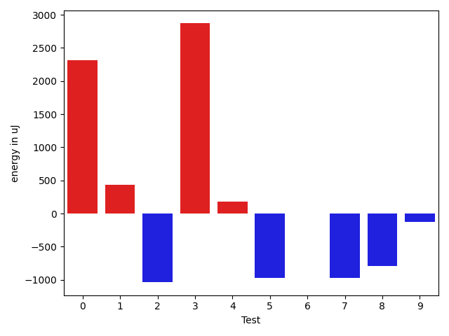

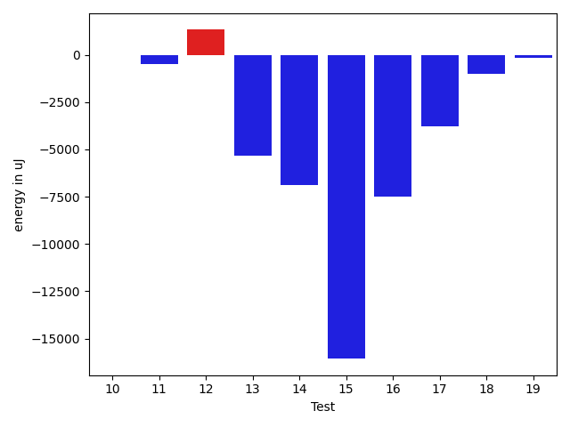

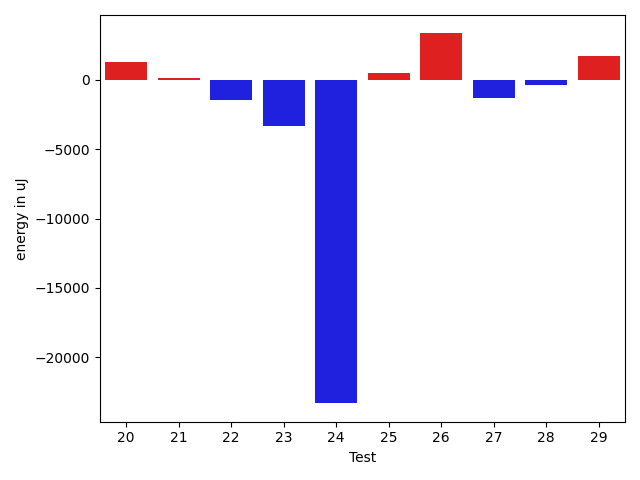

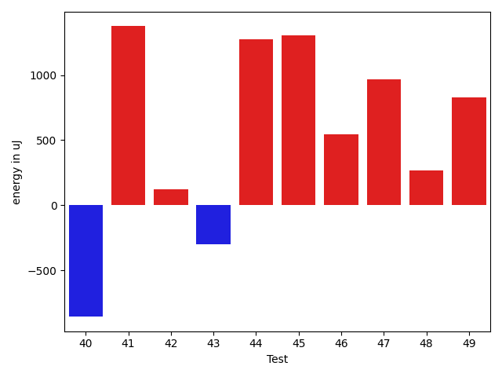

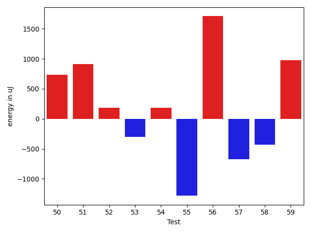

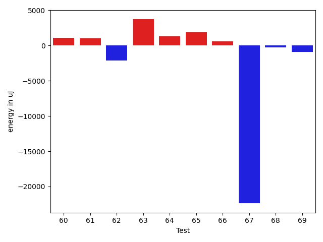

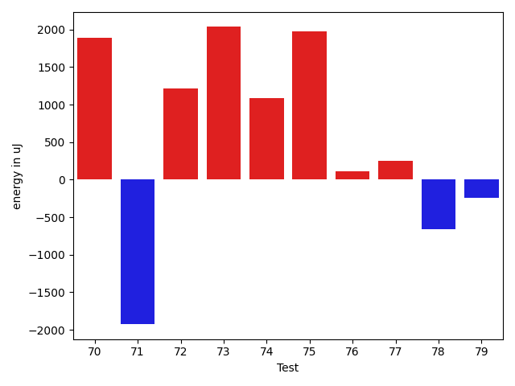

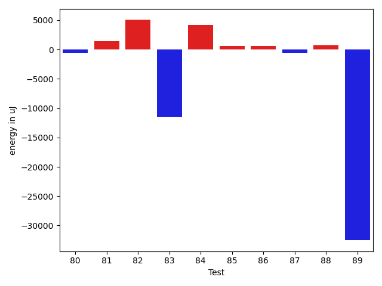

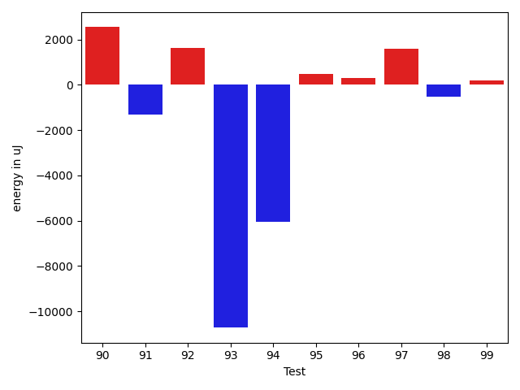

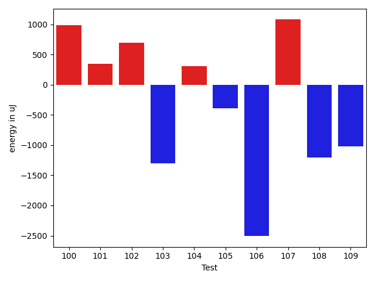

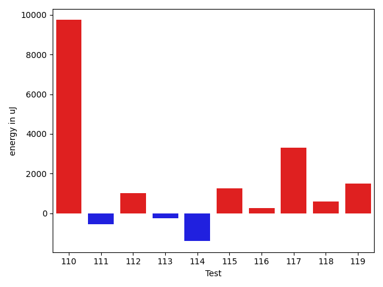

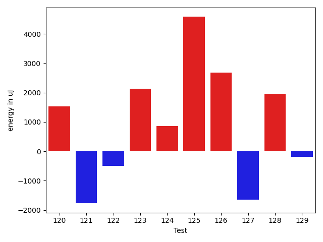

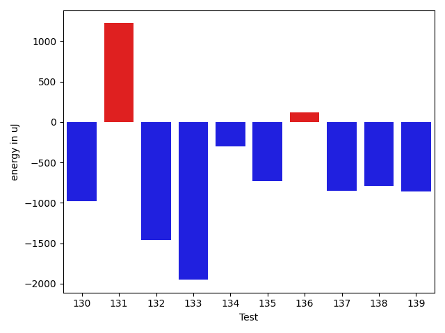

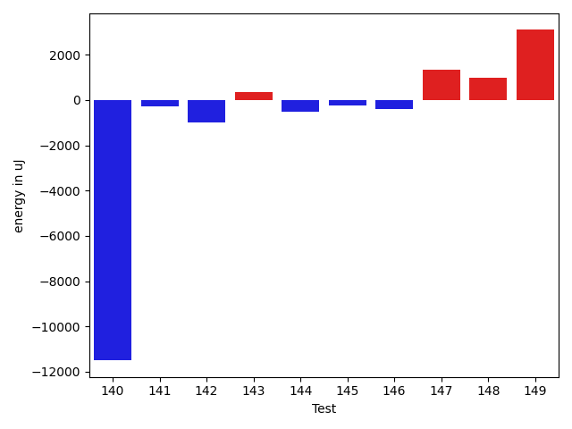

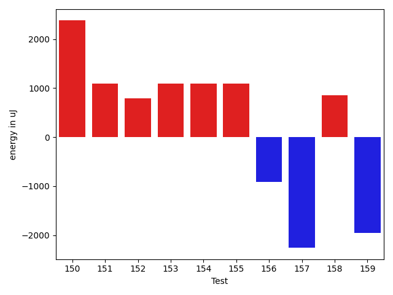

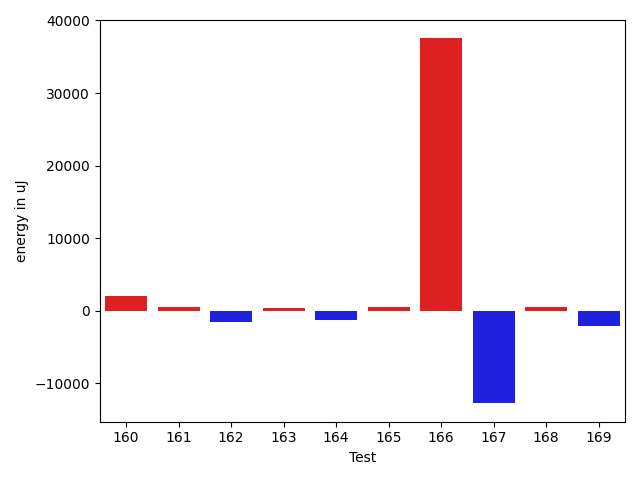

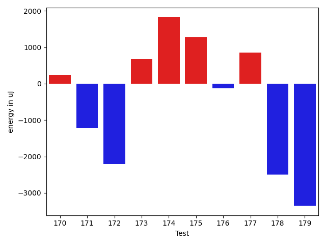

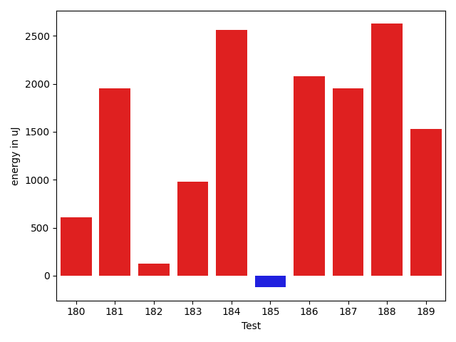

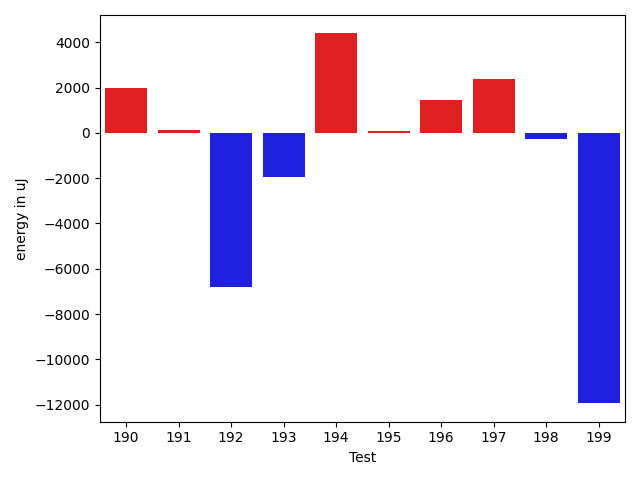

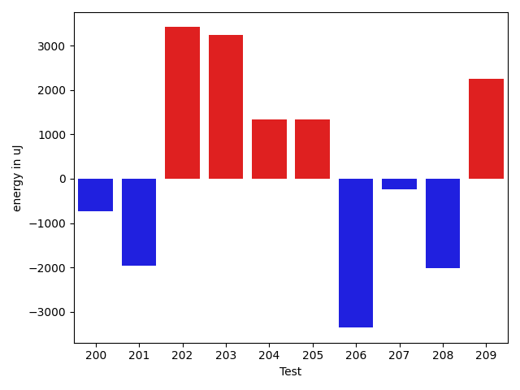

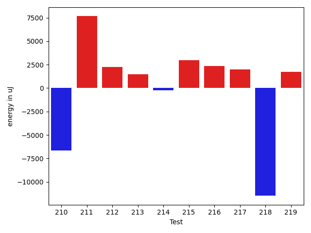

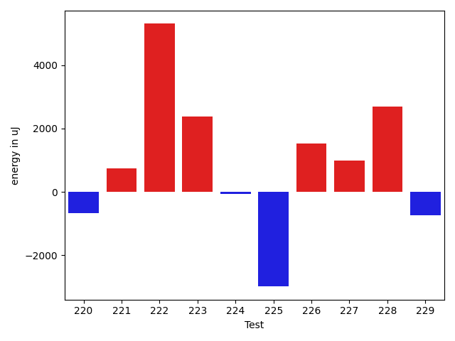

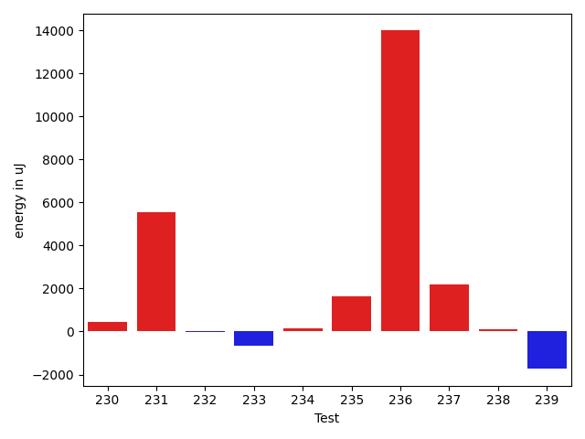

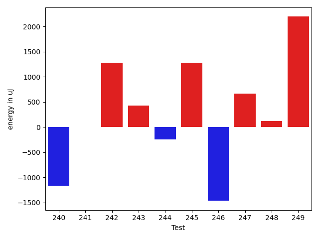

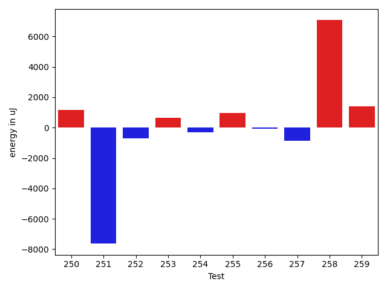

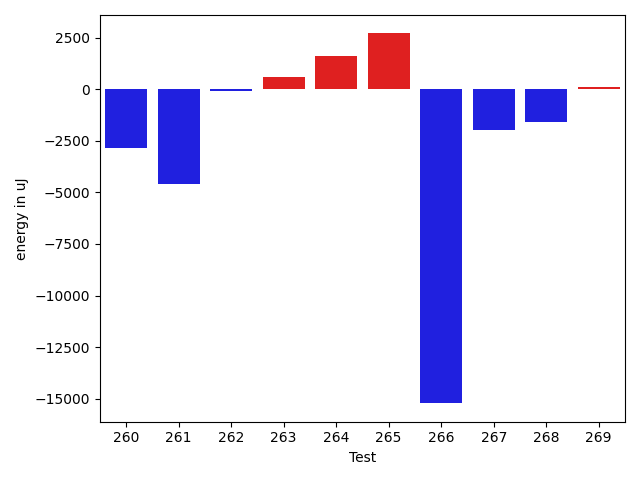

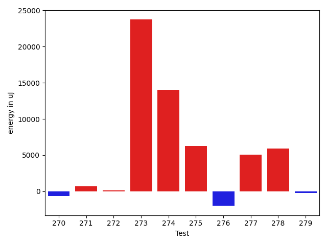

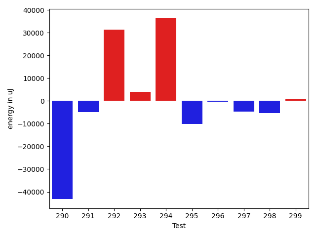

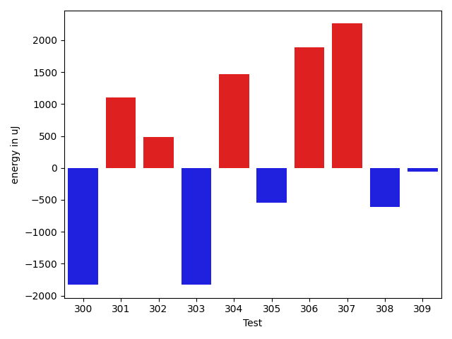

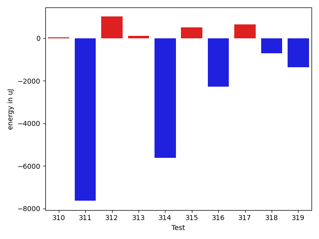

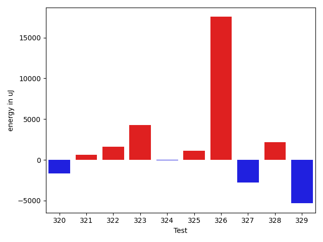

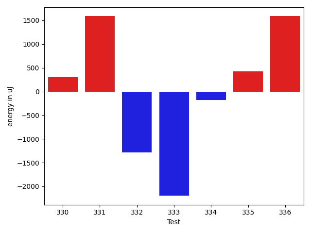

| ID | EnergyV1 | EnergyV2 | DeltaEnergy | σV1 | σV2 |
| --- | --- | --- | --- | --- | --- |
| 0 | 37537 | 39856 | 2319 | 81940.78183574846 | 78607.53783007458 |
| 1 | 36621 | 37049 | 428 | 6275.589370678663 | 24863.673924141345 |
| 2 | 36743 | 35705 | -1038 | 4254.83805916538 | 4320.891328335135 |
| 3 | 36926 | 39795 | 2869 | 25153.79454058455 | 16408.817593345255 |
| 4 | 37232 | 37414 | 182 | 366142.08011187037 | 457623.1782224236 |
| 5 | 36987 | 36010 | -977 | 4175.331444239227 | 6679.617324661698 |
| 6 | 35400 | 35400 | 0 | 3381.343567884529 | 23754.68176037037 |
| 7 | 37658 | 36682 | -976 | 11383.933831674824 | 10897.402646308152 |
| 8 | 35462 | 34668 | -794 | 7911.62447103691 | 4467.231441345764 |
| 9 | 35400 | 35278 | -122 | 8090.716433201354 | 7574.413447812258 |
| 10 | 89356 | 99304 | 9948 | 89757.29209410067 | 91133.85885080062 |
| 11 | 35400 | 35767 | 367 | 4378.637775088515 | 4368.165611452217 |
| 12 | 37292 | 36805 | -487 | 10876.409437879625 | 27396.267623852083 |
| 13 | 74341 | 70739 | -3602 | 29763.75487249875 | 25593.137629538858 |
| 14 | 37781 | 37110 | -671 | 24549.097967760754 | 9682.368056505571 |
| 15 | 35401 | 36071 | 670 | 105710.56363852545 | 77190.75284691305 |
| 16 | 65125 | 44006 | -21119 | 32350.475260443607 | 27468.505022208366 |
| 17 | 38025 | 37963 | -62 | 26819.312788970255 | 14865.658754899923 |
| 18 | 71899 | 71350 | -549 | 41682.048490045425 | 39276.68828570214 |
| 19 | 36621 | 36682 | 61 | 8676.694182192989 | 8835.301143148143 |
| 20 | 36743 | 37781 | 1038 | 16370.4634722009 | 16045.313811714508 |
| 21 | 34973 | 36072 | 1099 | 4256.8349458783205 | 4073.795024103987 |
| 22 | 36560 | 35034 | -1526 | 4205.921252579428 | 4740.424777350888 |
| 23 | 36804 | 35827 | -977 | 18457.374120436547 | 13508.161037536715 |
| 24 | 38147 | 37475 | -672 | 287100.6318429635 | 231153.32473789316 |
| 25 | 34668 | 34912 | 244 | 4800.188425680423 | 4493.544980921203 |
| 26 | 76660 | 78552 | 1892 | 19767.312860728056 | 28885.67391461164 |
| 27 | 36987 | 35400 | -1587 | 30323.501006299368 | 27087.990319035514 |
| 28 | 36255 | 35340 | -915 | 4125.721786817699 | 5096.585977353282 |
| 29 | 36316 | 37109 | 793 | 7911.650691344009 | 11742.1799465953 |
| 30 | 36621 | 34851 | -1770 | 3925.0459029486196 | 6197.343130769355 |
| 31 | 34668 | 35583 | 915 | 4377.994212586831 | 4671.1992822634875 |
| 32 | 36743 | 35462 | -1281 | 23302.557484010194 | 6040.567282954137 |
| 33 | 36743 | 34912 | -1831 | 3327.0744947893113 | 5233.430657561061 |
| 34 | 37353 | 32532 | -4821 | 4300.068971193927 | 3984.7686639948815 |
| 35 | 34546 | 36438 | 1892 | 57207.434053147146 | 53931.277552970634 |
| 36 | 35583 | 35706 | 123 | 4279.801117418865 | 4371.524602152231 |
| 37 | 34729 | 37292 | 2563 | 4068.0943775546 | 4891.481791073131 |
| 38 | 35035 | 35644 | 609 | 3535.510598754559 | 25804.594491872558 |
| 39 | 34363 | 36194 | 1831 | 3768.1140850033985 | 4472.805369680025 |
| 40 | 35645 | 35827 | 182 | 22456.19911198934 | 9789.12931413662 |
| 41 | 34546 | 35766 | 1220 | 3551.656921433562 | 4436.863003543241 |
| 42 | 35584 | 34912 | -672 | 5973.334092926733 | 5980.612736673676 |
| 43 | 36377 | 34851 | -1526 | 4360.180407754285 | 4756.744807397871 |
| 44 | 34424 | 35522 | 1098 | 4348.517242876152 | 5063.605658263358 |
| 45 | 34668 | 36743 | 2075 | 24055.52843178022 | 25434.17081437632 |
| 46 | 33508 | 35889 | 2381 | 4746.73452939184 | 2889.145522276247 |
| 47 | 35523 | 35766 | 243 | 4228.493636083658 | 4186.602268863852 |
| 48 | 34851 | 35644 | 793 | 3825.5160052097162 | 4171.796824602406 |
| 49 | 38330 | 39001 | 671 | 17891.285641939976 | 18308.349293605424 |
| 50 | 34912 | 35645 | 733 | 4183.04458337131 | 5673.60413303595 |
| 51 | 34851 | 35766 | 915 | 3248.5805417815677 | 3479.352882472433 |
| 52 | 33997 | 34179 | 182 | 3811.3910509593916 | 3837.985365426099 |
| 53 | 35278 | 34973 | -305 | 4495.396330286308 | 4083.878801171228 |
| 54 | 35645 | 35827 | 182 | 4647.843806806457 | 4043.0280607000986 |
| 55 | 39856 | 38574 | -1282 | 64275.49869412794 | 50553.339792850624 |
| 56 | 36438 | 38147 | 1709 | 28277.78370806312 | 30235.02276644587 |
| 57 | 34424 | 33752 | -672 | 3850.4703663928044 | 4137.452838299103 |
| 58 | 37048 | 36621 | -427 | 54124.702046134895 | 38199.75466291224 |
| 59 | 35523 | 36499 | 976 | 5952.981192721193 | 19273.60857141396 |
| 60 | 33753 | 34851 | 1098 | 4401.124880158612 | 3893.0462121424325 |
| 61 | 33996 | 35034 | 1038 | 2876.336009121716 | 4794.268067673014 |
| 62 | 38940 | 36804 | -2136 | 13503.148797818802 | 12636.608644062155 |
| 63 | 35278 | 39001 | 3723 | 3698.732491630458 | 4251.20785756988 |
| 64 | 35278 | 36560 | 1282 | 3685.6507191177698 | 3969.8646717768884 |
| 65 | 39062 | 40955 | 1893 | 100281.10801837148 | 51171.19910378307 |
| 66 | 38696 | 39306 | 610 | 17825.982492605188 | 16968.112082013384 |
| 67 | 69458 | 47058 | -22400 | 104191.78648157648 | 98032.6278977894 |
| 68 | 38818 | 38574 | -244 | 4516.067314323382 | 4373.50689899485 |
| 69 | 37597 | 36682 | -915 | 4257.1633389434855 | 3163.2355112144724 |
| 70 | 32287 | 34851 | 2564 | 3831.81170551115 | 3548.053239058017 |
| 71 | 35339 | 34729 | -610 | 2884.4859125313537 | 3539.998180946887 |
| 72 | 33875 | 33508 | -367 | 2900.354889922956 | 4632.30324578894 |
| 73 | 33020 | 35401 | 2381 | 3879.268966014113 | 3759.663022584395 |
| 74 | 32593 | 35766 | 3173 | 4251.050383893374 | 4242.277004371377 |
| 75 | 32470 | 35766 | 3296 | 4558.323174760161 | 3626.4529676605575 |
| 76 | 34546 | 34729 | 183 | 3173.7800794066625 | 4302.208651378964 |
| 77 | 34851 | 34851 | 0 | 4054.0923471231845 | 4206.8868202261665 |
| 78 | 34240 | 33875 | -365 | 6863.331628976532 | 5074.304523321329 |
| 79 | 32837 | 32898 | 61 | 4743.69765478366 | 4848.441160607172 |
| 80 | 34302 | 34484 | 182 | 3803.461141163894 | 4662.255488624678 |
| 81 | 32959 | 35095 | 2136 | 3563.0049244382585 | 3302.8335408797593 |
| 82 | 41931 | 60547 | 18616 | 21952.24808406501 | 25333.834445138236 |
| 83 | 35523 | 34301 | -1222 | 47202.47251888074 | 3393.4844592999398 |
| 84 | 35034 | 35583 | 549 | 4553.236573177354 | 26891.410787254896 |
| 85 | 32898 | 35217 | 2319 | 3420.990362706156 | 3307.8754079145297 |
| 86 | 34301 | 35706 | 1405 | 4382.615161932428 | 3833.1018812734706 |
| 87 | 33569 | 32471 | -1098 | 1989.305227962768 | 3092.5470262188414 |
| 88 | 33020 | 32227 | -793 | 3876.2211668002924 | 5219.024645401426 |
| 89 | 38758 | 37598 | -1160 | 132492.75616281666 | 110911.61095911966 |
| 90 | 32105 | 35767 | 3662 | 3767.3569938364303 | 4123.985317977328 |
| 91 | 34546 | 33569 | -977 | 3719.641914665084 | 3302.125751177094 |
| 92 | 32837 | 33081 | 244 | 3822.609415501958 | 5108.9363480106795 |
| 93 | 34607 | 36560 | 1953 | 42113.306096864006 | 4051.8442405897094 |
| 94 | 33569 | 36560 | 2991 | 34718.26490998651 | 4209.410659915023 |
| 95 | 34912 | 35035 | 123 | 4258.298346235918 | 4210.224456750351 |
| 96 | 34851 | 34057 | -794 | 4045.0888448088126 | 3771.780854922287 |
| 97 | 34729 | 35279 | 550 | 3663.9063358327135 | 3628.5034076864026 |
| 98 | 36316 | 34668 | -1648 | 4574.100819598453 | 3563.1935534460836 |
| 99 | 35400 | 35828 | 428 | 3221.6116774765874 | 4140.409847492809 |
| 100 | 34790 | 36560 | 1770 | 3164.0253044974215 | 4215.043905761838 |
| 101 | 35156 | 35156 | 0 | 4169.666186788607 | 4323.333072884581 |
| 102 | 33996 | 35095 | 1099 | 4214.8097177212185 | 4686.062922908272 |
| 103 | 35949 | 34851 | -1098 | 3654.547338438632 | 3491.032878134066 |
| 104 | 33996 | 34851 | 855 | 3969.6297126502304 | 3025.8971330830136 |
| 105 | 35095 | 34241 | -854 | 3700.1176318598305 | 4157.412724226065 |
| 106 | 34729 | 34241 | -488 | 4769.705791648882 | 4303.20895341911 |
| 107 | 34607 | 34241 | -366 | 3274.976300925901 | 3947.0967254426387 |
| 108 | 35461 | 34241 | -1220 | 2892.582601996873 | 2485.9901763733487 |
| 109 | 33448 | 33264 | -184 | 4612.532898267502 | 4170.191872036586 |
| 110 | 33264 | 33875 | 611 | 3909.842343474536 | 37371.133852527855 |
| 111 | 34851 | 35461 | 610 | 9674.404741894976 | 6066.483896439916 |
| 112 | 33631 | 33447 | -184 | 3000.268242940954 | 4434.469642622202 |
| 113 | 35339 | 34119 | -1220 | 3327.6027030544083 | 3727.9685765596155 |
| 114 | 34363 | 33447 | -916 | 4163.269985019379 | 3738.864374582667 |
| 115 | 34485 | 35950 | 1465 | 3698.301598331621 | 4034.775832019474 |
| 116 | 33142 | 34607 | 1465 | 3329.1924779975634 | 3436.4293641870854 |
| 117 | 31983 | 35034 | 3051 | 2376.966756183182 | 4225.418180608921 |
| 118 | 34241 | 35705 | 1464 | 4915.430612849638 | 4350.633565682073 |
| 119 | 31922 | 33203 | 1281 | 3415.7398120565067 | 4280.644339914699 |
| 120 | 34485 | 36010 | 1525 | 4580.61602928648 | 3450.8696682801024 |
| 121 | 34179 | 32410 | -1769 | 3248.3885745644634 | 4094.997332969191 |
| 122 | 37231 | 36743 | -488 | 4799.952831392591 | 3596.20335180034 |
| 123 | 31921 | 34057 | 2136 | 3795.046887575005 | 3831.3536858066163 |
| 124 | 34607 | 35462 | 855 | 36251.00625525475 | 4038.10669657286 |
| 125 | 33874 | 38452 | 4578 | 4229.887224146062 | 4766.267420634306 |
| 126 | 33081 | 35767 | 2686 | 3182.3057167312636 | 4405.632739656665 |
| 127 | 36499 | 34851 | -1648 | 4376.390682971529 | 4083.321404200262 |
| 128 | 33142 | 35095 | 1953 | 3715.443681645476 | 5140.182937664093 |
| 129 | 38330 | 38147 | -183 | 20900.723089689385 | 19136.786114619306 |
| 130 | 36804 | 35828 | -976 | 22024.603719859737 | 5289.888401703702 |
| 131 | 35339 | 36560 | 1221 | 4296.980661996672 | 3705.373298866204 |
| 132 | 35767 | 34302 | -1465 | 4967.41283630276 | 4337.0447780774575 |
| 133 | 37475 | 35523 | -1952 | 4262.583875602545 | 4157.8938314657535 |
| 134 | 40649 | 40344 | -305 | 56424.48117554952 | 52307.634469049466 |
| 135 | 37109 | 36377 | -732 | 4718.406930988467 | 4257.473285954035 |
| 136 | 35950 | 36071 | 121 | 27001.733248729433 | 10198.939214322354 |
| 137 | 36499 | 35644 | -855 | 4647.0673704705005 | 13428.182842153874 |
| 138 | 36682 | 35889 | -793 | 4248.529348804634 | 3864.2844036140104 |
| 139 | 35584 | 34728 | -856 | 3386.427105467165 | 3553.5191455384524 |
| 140 | 37537 | 36621 | -916 | 70881.91106174437 | 41858.429802463164 |
| 141 | 36499 | 35095 | -1404 | 4599.345096979535 | 4615.00424268494 |
| 142 | 37414 | 36254 | -1160 | 4147.064086118637 | 4296.206089144235 |
| 143 | 36865 | 35400 | -1465 | 4635.237945281235 | 4342.837882729362 |
| 144 | 37720 | 36193 | -1527 | 4110.340207622721 | 4396.510852621789 |
| 145 | 37231 | 35950 | -1281 | 3884.9612689650667 | 4714.590476751307 |
| 146 | 36743 | 36072 | -671 | 3952.69520580578 | 4962.850741774035 |
| 147 | 34729 | 35888 | 1159 | 3297.1970587477595 | 4451.602290943202 |
| 148 | 34851 | 35583 | 732 | 3310.5848709102747 | 4371.397889020424 |
| 149 | 33996 | 37170 | 3174 | 3702.4047998260735 | 3631.1674559751905 |
| 150 | 35401 | 37780 | 2379 | 5192.005264425924 | 9618.957704116887 |
| 151 | 37231 | 38330 | 1099 | 66790.80556986773 | 79046.56767767685 |
| 152 | 37475 | 38269 | 794 | 4101.591275840531 | 10014.483520994743 |
| 153 | 37964 | 39062 | 1098 | 97100.46752178638 | 115853.51574176547 |
| 154 | 37476 | 38574 | 1098 | 20803.352813851907 | 23201.734239083038 |
| 155 | 34668 | 35767 | 1099 | 4511.383386385702 | 4492.780059710308 |
| 156 | 38452 | 37536 | -916 | 13633.229418038976 | 26155.274367543032 |
| 157 | 36804 | 34546 | -2258 | 3011.1024271297497 | 4204.273041865102 |
| 158 | 36743 | 37597 | 854 | 15732.46042062641 | 14224.311691804873 |
| 159 | 36011 | 34058 | -1953 | 3850.7635951347006 | 4821.702410740531 |
| 160 | 36193 | 36682 | 489 | 9000.080440916721 | 11508.365184073336 |
| 161 | 36926 | 37597 | 671 | 4872.043102403276 | 4902.629936018098 |
| 162 | 36499 | 37781 | 1282 | 21284.553622764397 | 16770.03145237302 |
| 163 | 35095 | 35828 | 733 | 4101.1427122082005 | 4405.066335753695 |
| 164 | 34363 | 33264 | -1099 | 5320.180929254192 | 4416.369568062918 |
| 165 | 38330 | 39489 | 1159 | 17557.889461554325 | 18110.405576196783 |
| 166 | 36805 | 40039 | 3234 | 19033.331158892855 | 113006.12605292544 |
| 167 | 34668 | 34851 | 183 | 92499.01321399308 | 5429.894297557238 |
| 168 | 35339 | 34973 | -366 | 4556.922770445256 | 3842.048880055366 |
| 169 | 35767 | 34424 | -1343 | 4122.210175075987 | 4342.1979910200225 |
| 170 | 34729 | 34973 | 244 | 4415.132596499742 | 5141.269049885037 |
| 171 | 35706 | 34485 | -1221 | 29319.6415545412 | 3885.9912374579544 |
| 172 | 36377 | 34180 | -2197 | 61607.360928847236 | 4400.344237670503 |
| 173 | 35828 | 36499 | 671 | 3888.6868219182043 | 4110.863559715552 |
| 174 | 35217 | 37048 | 1831 | 3665.336663715085 | 8154.591149913558 |
| 175 | 34912 | 36193 | 1281 | 5375.1102677522695 | 4033.858550981659 |
| 176 | 36194 | 36072 | -122 | 7230.489817062606 | 6004.088879153847 |
| 177 | 34240 | 35095 | 855 | 9549.473001423425 | 3151.5627189189686 |
| 178 | 35095 | 32592 | -2503 | 3870.703773940858 | 4781.146537181223 |
| 179 | 37781 | 34424 | -3357 | 3301.639590320997 | 3794.3927175075796 |
| 180 | 35339 | 35950 | 611 | 4436.964171046559 | 3565.774349167888 |
| 181 | 34607 | 36560 | 1953 | 4959.318857196395 | 3877.043992844159 |
| 182 | 35095 | 35217 | 122 | 3485.2401635658375 | 3734.25016937805 |
| 183 | 34302 | 35278 | 976 | 4511.52060112774 | 4157.995359338924 |
| 184 | 33325 | 35888 | 2563 | 5076.438780420584 | 4642.488603917084 |
| 185 | 36377 | 36255 | -122 | 4142.764082476283 | 6679.51126839655 |
| 186 | 124999 | 127075 | 2076 | 93818.54789696846 | 83238.90814572545 |
| 187 | 36743 | 38696 | 1953 | 8050.1918867384275 | 8897.472047787844 |
| 188 | 36926 | 39551 | 2625 | 72855.12780071299 | 25263.84201368786 |
| 189 | 35705 | 37231 | 1526 | 35767.89690464161 | 10268.570614348973 |
| 190 | 36560 | 37476 | 916 | 3978.747133206633 | 5028.115464718686 |
| 191 | 38452 | 38941 | 489 | 3823.186571434881 | 4728.999517379352 |
| 192 | 68908 | 68542 | -366 | 69903.12812477865 | 59573.03740029057 |
| 193 | 38696 | 38391 | -305 | 56369.03979605142 | 54079.60127311587 |
| 194 | 37597 | 38330 | 733 | 45903.85642346162 | 51017.64812571945 |
| 195 | 38147 | 38452 | 305 | 3140.254554437692 | 4214.032721389051 |
| 196 | 36988 | 37536 | 548 | 14403.448785704744 | 16357.738709258152 |
| 197 | 37720 | 37903 | 183 | 15808.05169828978 | 21499.676050445552 |
| 198 | 37537 | 37231 | -306 | 4675.391458469607 | 4529.006630107264 |
| 199 | 72632 | 75867 | 3235 | 126162.04906920416 | 28547.913899582178 |
| 200 | 38086 | 37353 | -733 | 39706.053298340026 | 44231.92068871413 |
| 201 | 37048 | 35095 | -1953 | 73615.38179140197 | 40249.29073864789 |
| 202 | 33692 | 37109 | 3417 | 4089.7980761707736 | 4449.496369882776 |
| 203 | 78674 | 81909 | 3235 | 277314.3155918342 | 84946.0880231426 |
| 204 | 34424 | 35767 | 1343 | 4787.281771804971 | 4246.3177852775 |
| 205 | 35706 | 37048 | 1342 | 3387.752943308877 | 4461.995349492074 |
| 206 | 37415 | 34058 | -3357 | 4374.94354962231 | 3950.5350767067303 |
| 207 | 35522 | 35279 | -243 | 3844.3184901856603 | 3917.2007436112326 |
| 208 | 39184 | 37171 | -2013 | 3429.2170146162134 | 3653.012824214767 |
| 209 | 36072 | 38330 | 2258 | 24092.321851554465 | 22348.130331612087 |
| 210 | 38574 | 38513 | -61 | 79318.33799758003 | 69991.75430820406 |
| 211 | 40772 | 59509 | 18737 | 23945.475432173807 | 26014.343924501 |
| 212 | 35584 | 39001 | 3417 | 4249.567889338133 | 3946.0622305660618 |
| 213 | 34179 | 35888 | 1709 | 4518.754620068332 | 4671.051965547349 |
| 214 | 37841 | 35766 | -2075 | 3557.7177453468057 | 4711.825452917949 |
| 215 | 33630 | 37964 | 4334 | 3938.207977011411 | 4466.948741581591 |
| 216 | 36438 | 38574 | 2136 | 27245.807545502357 | 30691.184374260014 |
| 217 | 39184 | 41077 | 1893 | 92177.17611130684 | 92325.07495880878 |
| 218 | 34545 | 35156 | 611 | 47524.41125956079 | 4630.908344889308 |
| 219 | 36926 | 38146 | 1220 | 3749.9244074685553 | 5130.4182215000765 |
| 220 | 36987 | 36316 | -671 | 4898.29416452526 | 4164.859697907535 |
| 221 | 36193 | 36926 | 733 | 4681.7554004486 | 3923.3062351471876 |
| 222 | 40466 | 45776 | 5310 | 17312.782212706265 | 25579.67596370531 |
| 223 | 33753 | 36132 | 2379 | 4051.7944172921702 | 3361.894266310474 |
| 224 | 36010 | 35949 | -61 | 3975.9068361416284 | 3953.420142334759 |
| 225 | 175353 | 172363 | -2990 | 256979.75176186324 | 281308.8799230078 |
| 226 | 35095 | 36621 | 1526 | 4655.493026221254 | 3941.544215755968 |
| 227 | 37841 | 38819 | 978 | 29546.34050494875 | 37804.24255652032 |
| 228 | 34424 | 37109 | 2685 | 4468.8479608797825 | 4156.218762573363 |
| 229 | 36437 | 35705 | -732 | 4070.502004661238 | 8199.374005765063 |
| 230 | 34973 | 36071 | 1098 | 4132.15491866036 | 4523.7817069661305 |
| 231 | 36621 | 38025 | 1404 | 48451.90328938433 | 62795.91299374326 |
| 232 | 36743 | 36804 | 61 | 3934.334648951393 | 4315.447280381499 |
| 233 | 38391 | 35950 | -2441 | 3219.531294602556 | 4986.158526705131 |
| 234 | 36071 | 35095 | -976 | 4735.946179415575 | 4277.085839920832 |
| 235 | 39062 | 39917 | 855 | 28291.256440914145 | 28569.96238514141 |
| 236 | 38879 | 42054 | 3175 | 30439.750195209315 | 47080.76390336629 |
| 237 | 36011 | 37232 | 1221 | 7299.584123952067 | 12678.083897243918 |
| 238 | 36743 | 37964 | 1221 | 4192.978692469195 | 4300.450026868554 |
| 239 | 38269 | 35034 | -3235 | 3095.102056969294 | 4112.571091680602 |
| 240 | 37720 | 36560 | -1160 | 2982.2482943056384 | 4206.992108573535 |
| 241 | 41076 | 41076 | 0 | 210281.39310576196 | 516334.5298749249 |
| 242 | 36682 | 37964 | 1282 | 3171.7205076101936 | 4431.669682807462 |
| 243 | 35095 | 35523 | 428 | 4558.057492879882 | 3685.2215247557965 |
| 244 | 34668 | 34424 | -244 | 4124.812550718396 | 4278.951307263329 |
| 245 | 35096 | 36377 | 1281 | 4589.1808325233815 | 3818.942895218358 |
| 246 | 34118 | 32654 | -1464 | 4382.188467342957 | 3099.6862102600203 |
| 247 | 34851 | 35522 | 671 | 5826.299698843849 | 4878.0618640642915 |
| 248 | 34362 | 34485 | 123 | 4358.9631097011525 | 3541.4610140372256 |
| 249 | 33447 | 35644 | 2197 | 3962.435583007435 | 4779.401322341534 |
| 250 | 38025 | 38086 | 61 | 4693.4031425369 | 6120.897033797943 |
| 251 | 157227 | 151123 | -6104 | 52421.60381168597 | 43533.152548002734 |
| 252 | 35950 | 34668 | -1282 | 4650.670764904033 | 4085.060322736074 |
| 253 | 34607 | 34973 | 366 | 3886.188401333296 | 3402.9926588103044 |
| 254 | 34973 | 35034 | 61 | 3613.492053464604 | 4536.3395832029455 |
| 255 | 35340 | 35217 | -123 | 3950.7453777736678 | 3875.3457679104813 |
| 256 | 35705 | 36682 | 977 | 4143.061876197361 | 4029.658439482047 |
| 257 | 36438 | 35644 | -794 | 3802.213299818369 | 4023.8346109558893 |
| 258 | 35950 | 32959 | -2991 | 4376.411377279812 | 46171.223690696286 |
| 259 | 32958 | 34241 | 1283 | 3608.7106271354037 | 3295.5286084441327 |
| 260 | 35950 | 33875 | -2075 | 4548.369168274393 | 3328.5910667532326 |
| 261 | 34424 | 35583 | 1159 | 37587.768802621824 | 3401.069903693779 |
| 262 | 33325 | 34301 | 976 | 3555.5308413244666 | 3604.528240243201 |
| 263 | 34241 | 34728 | 487 | 3235.4255644865843 | 4336.666328593376 |
| 264 | 33264 | 34912 | 1648 | 4271.644648141978 | 4174.761151680446 |
| 265 | 33752 | 38086 | 4334 | 3947.973300257761 | 4299.982914061925 |
| 266 | 33814 | 33265 | -549 | 47429.74004868541 | 4376.375792409615 |
| 267 | 36438 | 35217 | -1221 | 9957.288927079688 | 9207.929260733503 |
| 268 | 35339 | 32593 | -2746 | 4348.711261131341 | 3441.0085820480595 |
| 269 | 35523 | 35949 | 426 | 3667.200274051037 | 3057.4034133921914 |
| 270 | 35644 | 33996 | -1648 | 3457.924315885827 | 3554.652951611451 |
| 271 | 34363 | 35340 | 977 | 3472.618339450492 | 3953.0213477174907 |
| 272 | 32898 | 34301 | 1403 | 4236.255352521222 | 4775.108369593095 |
| 273 | 37536 | 38391 | 855 | 33810.98542697922 | 67186.46941679859 |
| 274 | 37598 | 38208 | 610 | 20935.888824069512 | 53690.68813199827 |
| 275 | 35767 | 37354 | 1587 | 6363.359050702959 | 24487.833345116484 |
| 276 | 36315 | 35889 | -426 | 15799.011974241372 | 3788.9448996286733 |
| 277 | 35217 | 36071 | 854 | 3773.1336113399743 | 14458.081891899272 |
| 278 | 36499 | 38452 | 1953 | 26083.94216780803 | 31190.1564423029 |
| 279 | 36377 | 37231 | 854 | 4553.748410606983 | 4462.269079614348 |
| 280 | 38757 | 36743 | -2014 | 82753.29642614073 | 71790.31538691839 |
| 281 | 277648 | 240539 | -37109 | 111398.79637152451 | 138667.7657814707 |
| 282 | 359374 | 384215 | 24841 | 108617.83228068665 | 116304.28944184558 |
| 283 | 41565 | 40039 | -1526 | 73319.01248729836 | 60558.386704811644 |
| 284 | 37354 | 36866 | -488 | 51290.372731851174 | 36706.76331925602 |
| 285 | 37354 | 37781 | 427 | 110238.09681498619 | 61585.644921117775 |
| 286 | 36560 | 37780 | 1220 | 5030.042580274545 | 4229.285999589828 |
| 287 | 35583 | 37903 | 2320 | 5005.518837019307 | 4531.041209709048 |
| 288 | 37049 | 37476 | 427 | 28373.251037594266 | 15218.469304322456 |
| 289 | 37354 | 38391 | 1037 | 33460.6302801751 | 56966.51852144453 |
| 290 | 36499 | 37964 | 1465 | 123261.33189813467 | 6233.511932442639 |
| 291 | 40405 | 39367 | -1038 | 37807.068770699516 | 31294.05776002835 |
| 292 | 37476 | 40283 | 2807 | 4899.75635891534 | 117444.83722165748 |
| 293 | 37658 | 36621 | -1037 | 6930.465129412311 | 35442.132778794825 |
| 294 | 37109 | 38574 | 1465 | 60622.72257107062 | 123090.63798395386 |
| 295 | 36926 | 37110 | 184 | 58166.39834202085 | 4751.720908388965 |
| 296 | 71472 | 71655 | 183 | 27795.372758669535 | 24669.11816820822 |
| 297 | 37658 | 39428 | 1770 | 61058.54752598812 | 56840.45472354077 |
| 298 | 37476 | 36621 | -855 | 17648.584976249847 | 6917.96143314603 |
| 299 | 38330 | 37598 | -732 | 4536.688014277474 | 5000.189749896662 |
| 300 | 38330 | 36499 | -1831 | 51362.11784025184 | 53098.17682692099 |
| 301 | 36133 | 37231 | 1098 | 9379.375663742198 | 10429.067685214046 |
| 302 | 37476 | 37963 | 487 | 45950.60460037113 | 50809.93823450561 |
| 303 | 36743 | 34912 | -1831 | 2979.3955751218323 | 34281.88575425467 |
| 304 | 33569 | 35034 | 1465 | 4153.264566862828 | 4915.322526392499 |
| 305 | 36194 | 35644 | -550 | 8555.5026819889 | 9250.55942565097 |
| 306 | 33935 | 35827 | 1892 | 4161.645850119659 | 3552.4181605633084 |
| 307 | 36315 | 38574 | 2259 | 3603.868730007969 | 4814.973842861249 |
| 308 | 36377 | 35766 | -611 | 37180.46870011088 | 3950.5442077250677 |
| 309 | 34912 | 34851 | -61 | 4182.489604198073 | 3165.6556047939366 |
| 310 | 34851 | 35827 | 976 | 4310.854152763695 | 3648.6272111510048 |
| 311 | 40528 | 39062 | -1466 | 90978.35557723162 | 76608.24535801177 |
| 312 | 35522 | 36011 | 489 | 3688.443159044206 | 3983.3207531182097 |
| 313 | 36011 | 34729 | -1282 | 3364.7088269269307 | 3601.840710895842 |
| 314 | 38208 | 40527 | 2319 | 59987.76083377688 | 58986.11977785536 |
| 315 | 35278 | 36133 | 855 | 3854.960316914131 | 3527.395577778338 |
| 316 | 34363 | 33508 | -855 | 4191.840215157776 | 4135.574061279344 |
| 317 | 36377 | 36682 | 305 | 5006.938154058968 | 5356.892273277483 |
| 318 | 35339 | 35889 | 550 | 5309.294185017021 | 3437.0609003410254 |
| 319 | 37415 | 34057 | -3358 | 3920.9542100309923 | 3767.8043368563253 |
| 320 | 37841 | 36133 | -1708 | 3997.1751297324313 | 3687.3296589592896 |
| 321 | 36377 | 37964 | 1587 | 3889.929456115332 | 3740.8926878541724 |
| 322 | 33630 | 34607 | 977 | 3731.289128378661 | 5267.147684052877 |
| 323 | 38940 | 37354 | -1586 | 87270.89815314494 | 111345.3878280612 |
| 324 | 35889 | 38330 | 2441 | 3750.93821896487 | 4204.817184018873 |
| 325 | 35767 | 37109 | 1342 | 4782.984426870075 | 4577.476631135734 |
| 326 | 37109 | 38574 | 1465 | 50682.61764680845 | 87906.80881146199 |
| 327 | 39062 | 35400 | -3662 | 4999.64806511891 | 5142.336395064018 |
| 328 | 37597 | 38879 | 1282 | 3537.710572415842 | 3863.7194900222576 |
| 329 | 36683 | 37414 | 731 | 33459.1678166622 | 3453.066520213754 |
| 330 | 37659 | 37964 | 305 | 469187.5922051178 | 455321.1533128725 |
| 331 | 39795 | 41382 | 1587 | 353208.08877675404 | 621556.2644908489 |
| 332 | 40100 | 38818 | -1282 | 475707.95877817913 | 450527.9261526783 |
| 333 | 39368 | 37171 | -2197 | 86260.61056346865 | 73264.50154530119 |
| 334 | 35766 | 35584 | -182 | 4802.333529895584 | 3551.45799022409 |
| 335 | 36377 | 36804 | 427 | 6582.282195185711 | 97409.58299106457 |
| 336 | 34851 | 36438 | 1587 | 3836.266057839175 | 490972.3741128685 |

## Delta Duration per test method

| ID | DurationV1 | DurationsV2 | DeltaDuration |
| --- | --- | --- | --- |
| 0 | 2009983.7291666667 | 1962154.4166666667 | -47829.3125 |
| 1 | 1034174.575 | 1113968.7837837837 | 79794.20878378372 |
| 2 | 745306.6666666666 | 739664.3953488372 | -5642.271317829378 |
| 3 | 944251.7692307692 | 1098619.0566037735 | 154367.28737300425 |
| 4 | 2043978.7659574468 | 4628634.377777778 | 2584655.611820331 |
| 5 | 968930.7792207792 | 906553.8805970149 | -62376.89862376428 |
| 6 | 798612.7222222222 | 826924.6315789474 | 28311.90935672517 |
| 7 | 1255066.2 | 1193131.5208333333 | -61934.6791666667 |
| 8 | 1059857.076923077 | 988217.5974025974 | -71639.47952047957 |
| 9 | 1181019.3820224719 | 1169842.9662921347 | -11176.415730337147 |
| 10 | 3564970.9393939395 | 3477173.242424242 | -87797.69696969725 |
| 11 | 516857.0 | 442797.17391304346 | -74059.82608695654 |
| 12 | 1197418.0108695652 | 1247961.5185185184 | 50543.50764895324 |
| 13 | 2474310.393939394 | 2309926.878787879 | -164383.51515151514 |
| 14 | 1372575.4020618557 | 1259889.2258064516 | -112686.17625540402 |
| 15 | 2213818.206896552 | 1645110.5647058825 | -568707.6421906694 |
| 16 | 2032360.1717171718 | 1915380.5858585858 | -116979.58585858601 |
| 17 | 1392404.5227272727 | 1275511.5 | -116893.0227272727 |
| 18 | 2546792.6363636362 | 2453604.551020408 | -93188.08534322819 |
| 19 | 1225726.1477272727 | 1153912.3820224719 | -71813.76570480084 |
| 20 | 1521108.888888889 | 1509055.898989899 | -12052.989898989908 |
| 21 | 865716.3617021276 | 783893.1147540984 | -81823.24694802926 |
| 22 | 719078.1458333334 | 736676.7666666667 | 17598.62083333335 |
| 23 | 1027785.6470588235 | 948966.2419354839 | -78819.40512333962 |
| 24 | 2981066.95 | 2148536.7419354836 | -832530.2080645165 |
| 25 | 824605.716981132 | 943940.3269230769 | 119334.60994194483 |
| 26 | 2586750.1414141413 | 2637166.3333333335 | 50416.191919192206 |
| 27 | 1355719.397260274 | 1293915.9102564103 | -61803.48700386379 |
| 28 | 922672.0 | 883207.1551724138 | -39464.8448275862 |
| 29 | 1027592.5416666666 | 1100205.6923076923 | 72613.15064102563 |
| 30 | 957278.7647058824 | 813140.0169491526 | -144138.74775672983 |
| 31 | 833297.8269230769 | 802145.8787878788 | -31151.948135198094 |
| 32 | 1055788.1785714286 | 895004.1935483871 | -160783.9850230415 |
| 33 | 408371.0714285714 | 428758.1 | 20387.028571428556 |
| 34 | 434251.7727272727 | 489081.4166666667 | 54829.64393939398 |
| 35 | 1389195.3260869565 | 1207998.7666666666 | -181196.55942028994 |
| 36 | 774668.5961538461 | 752344.1041666666 | -22324.4919871795 |
| 37 | 731249.1555555556 | 740279.7 | 9030.544444444356 |
| 38 | 632065.6315789474 | 743097.3409090909 | 111031.70933014352 |
| 39 | 733042.775510204 | 705795.1403508772 | -27247.635159326834 |
| 40 | 796736.5593220339 | 757683.0 | -39053.55932203389 |
| 41 | 716762.8292682926 | 723842.3018867924 | 7079.472618499771 |
| 42 | 929722.8636363636 | 974903.8771929825 | 45181.013556618826 |
| 43 | 814637.406779661 | 814500.8409090909 | -136.5658705700189 |
| 44 | 711191.0 | 709720.8636363636 | -1470.136363636353 |
| 45 | 970861.3617021276 | 952921.6585365854 | -17939.703165542218 |
| 46 | 380391.5263157895 | 454423.4666666667 | 74031.94035087718 |
| 47 | 692550.42 | 712073.7826086957 | 19523.362608695636 |
| 48 | 793503.7454545455 | 817487.6610169491 | 23983.91556240362 |
| 49 | 1436394.8068181819 | 1427908.7916666667 | -8486.015151515137 |
| 50 | 825648.1886792453 | 907826.9365079365 | 82178.74782869115 |
| 51 | 692688.7446808511 | 669655.5192307692 | -23033.225450081867 |
| 52 | 608969.3666666667 | 546734.3235294118 | -62235.04313725489 |
| 53 | 720333.1304347826 | 719796.6037735849 | -536.5266611976549 |
| 54 | 771832.7962962963 | 795207.9245283019 | 23375.128232005634 |
| 55 | 1433129.4 | 1166416.75 | -266712.6499999999 |
| 56 | 1305647.6 | 1287189.982142857 | -18457.61785714305 |
| 57 | 655734.6888888889 | 671581.2916666666 | 15846.602777777705 |
| 58 | 1523422.593220339 | 1235102.309859155 | -288320.28336118395 |
| 59 | 930984.262295082 | 972292.6142857143 | 41308.35199063236 |
| 60 | 730200.1132075472 | 683716.0 | -46484.11320754723 |
| 61 | 399485.29411764705 | 363952.8947368421 | -35532.39938080497 |
| 62 | 1151069.5967741935 | 1058023.8181818181 | -93045.77859237534 |
| 63 | 645802.6785714285 | 662527.9583333334 | 16725.27976190485 |
| 64 | 764081.2666666667 | 718406.3 | -45674.966666666674 |
| 65 | 2452698.380952381 | 1150736.7727272727 | -1301961.6082251084 |
| 66 | 1069375.95 | 1086734.4363636363 | 17358.48636363633 |
| 67 | 2975579.1414141413 | 2721482.785714286 | -254096.35569985537 |
| 68 | 493546.3 | 394999.4 | -98546.89999999997 |
| 69 | 474464.6666666667 | 481745.07692307694 | 7280.41025641025 |
| 70 | 477199.2068965517 | 443827.5909090909 | -33371.61598746083 |
| 71 | 353343.85714285716 | 369484.35294117645 | 16140.495798319287 |
| 72 | 532616.95 | 495631.96153846156 | -36984.98846153839 |
| 73 | 677862.2807017544 | 681295.8863636364 | 3433.605661881971 |
| 74 | 442230.08 | 465611.63636363635 | 23381.556363636337 |
| 75 | 497669.2 | 440801.0 | -56868.20000000001 |
| 76 | 451333.0 | 425283.88 | -26049.119999999995 |
| 77 | 469364.63157894736 | 447514.1379310345 | -21850.493647912866 |
| 78 | 822310.8974358974 | 836046.75 | 13735.85256410262 |
| 79 | 427017.56 | 410210.1153846154 | -16807.444615384622 |
| 80 | 512916.4375 | 501039.75 | -11876.6875 |
| 81 | 496161.1935483871 | 495131.9090909091 | -1029.2844574779738 |
| 82 | 1469360.75 | 1650850.6666666667 | 181489.91666666674 |
| 83 | 750953.0952380953 | 431305.85714285716 | -319647.2380952381 |
| 84 | 558798.2413793104 | 778533.9666666667 | 219735.7252873563 |
| 85 | 392413.3888888889 | 393352.21428571426 | 938.8253968253848 |
| 86 | 484248.88 | 445922.5 | -38326.380000000005 |
| 87 | 364542.6 | 340484.0625 | -24058.537499999977 |
| 88 | 418159.8888888889 | 454071.0 | 35911.111111111124 |
| 89 | 3359207.361111111 | 2213488.891891892 | -1145718.469219219 |
| 90 | 470574.95454545453 | 403453.0909090909 | -67121.86363636365 |
| 91 | 556224.9333333333 | 500143.2580645161 | -56081.67526881723 |
| 92 | 419823.81481481483 | 413178.8333333333 | -6644.981481481518 |
| 93 | 810079.6428571428 | 358557.9375 | -451521.70535714284 |
| 94 | 632128.9 | 397577.29411764705 | -234551.60588235297 |
| 95 | 444404.125 | 693069.8275862068 | 248665.70258620684 |
| 96 | 439729.7727272727 | 406274.44444444444 | -33455.32828282827 |
| 97 | 391004.5 | 355631.9285714286 | -35372.57142857142 |
| 98 | 471719.8181818182 | 470442.95238095237 | -1276.8658008658094 |
| 99 | 436458.4285714286 | 355996.5714285714 | -80461.85714285716 |
| 100 | 413239.1 | 643387.9 | 230148.80000000005 |
| 101 | 667618.0465116279 | 617709.6923076923 | -49908.354203935596 |
| 102 | 495701.2083333333 | 483251.23076923075 | -12449.977564102563 |
| 103 | 400300.8 | 340352.46153846156 | -59948.33846153843 |
| 104 | 365593.8333333333 | 353988.15 | -11605.68333333329 |
| 105 | 462004.84 | 491879.15789473685 | 29874.31789473683 |
| 106 | 530658.6666666666 | 574223.304347826 | 43564.637681159424 |
| 107 | 415237.0 | 363773.3333333333 | -51463.666666666686 |
| 108 | 355291.875 | 371301.0909090909 | 16009.215909090883 |
| 109 | 481300.08 | 529297.8 | 47997.72000000003 |
| 110 | 392194.2272727273 | 634455.6818181818 | 242261.45454545447 |
| 111 | 963422.25 | 734646.6774193548 | -228775.5725806452 |
| 112 | 422934.84 | 376160.3333333333 | -46774.50666666671 |
| 113 | 692818.1 | 713617.4054054054 | 20799.305405405466 |
| 114 | 641721.0 | 561434.1875 | -80286.8125 |
| 115 | 520650.86666666664 | 498726.46875 | -21924.39791666664 |
| 116 | 447429.44444444444 | 467365.3043478261 | 19935.85990338167 |
| 117 | 358267.4666666667 | 354965.35714285716 | -3302.109523809515 |
| 118 | 513955.55555555556 | 486611.77777777775 | -27343.77777777781 |
| 119 | 545238.2352941176 | 431754.375 | -113483.86029411759 |
| 120 | 429253.3157894737 | 360172.46153846156 | -69080.85425101215 |
| 121 | 432548.3846153846 | 375486.9090909091 | -57061.47552447551 |
| 122 | 348976.5625 | 348079.7 | -896.8624999999884 |
| 123 | 462534.23529411765 | 410129.1176470588 | -52405.117647058854 |
| 124 | 879884.8148148148 | 581783.1176470588 | -298101.69716775604 |
| 125 | 630131.6923076923 | 504185.625 | -125946.06730769225 |
| 126 | 426885.17647058825 | 403901.28571428574 | -22983.890756302513 |
| 127 | 304751.1 | 312335.05 | 7583.950000000012 |
| 128 | 383616.3076923077 | 318392.85714285716 | -65223.45054945053 |
| 129 | 1291493.390625 | 1290214.6 | -1278.7906249999069 |
| 130 | 933015.5272727272 | 874084.4 | -58931.1272727272 |
| 131 | 509505.70967741933 | 511226.51851851854 | 1720.808841099206 |
| 132 | 1013837.0555555555 | 1013373.8108108108 | -463.2447447447339 |
| 133 | 694728.2075471698 | 721019.6153846154 | 26291.407837445615 |
| 134 | 1696724.9846153846 | 1757820.3230769231 | 61095.338461538544 |
| 135 | 751304.36 | 797836.3035714285 | 46531.943571428536 |
| 136 | 1310910.3608247424 | 1249201.8936170214 | -61708.46720772097 |
| 137 | 708478.9523809524 | 816004.3265306122 | 107525.37414965976 |
| 138 | 679190.3777777777 | 749622.5319148937 | 70432.15413711593 |
| 139 | 428378.95652173914 | 419929.0416666667 | -8449.91485507245 |
| 140 | 1451692.7735849055 | 1159136.8653846155 | -292555.90820029005 |
| 141 | 696535.9821428572 | 725899.2666666667 | 29363.28452380956 |
| 142 | 677962.425 | 694415.42 | 16452.994999999995 |
| 143 | 675400.275 | 655921.5365853659 | -19478.738414634136 |
| 144 | 705160.84 | 867352.6304347826 | 162191.79043478263 |
| 145 | 637313.8108108108 | 660064.4146341464 | 22750.60382333561 |
| 146 | 666047.075 | 666744.9069767442 | 697.8319767442299 |
| 147 | 689028.3863636364 | 719888.75 | 30860.363636363647 |
| 148 | 437625.0833333333 | 404570.7272727273 | -33054.35606060602 |
| 149 | 430238.3846153846 | 482594.73333333334 | 52356.34871794871 |
| 150 | 1005870.8260869565 | 1130893.956521739 | 125023.13043478248 |
| 151 | 1409555.21875 | 1786418.0 | 376862.78125 |
| 152 | 1030789.0365853659 | 1193522.4675324676 | 162733.43094710167 |
| 153 | 1772545.393939394 | 2320741.275 | 548195.8810606059 |
| 154 | 1250110.72 | 1334356.9411764706 | 84246.22117647063 |
| 155 | 701918.2619047619 | 691944.8541666666 | -9973.407738095266 |
| 156 | 1261468.7160493827 | 1382767.8333333333 | 121299.11728395056 |
| 157 | 563303.9666666667 | 481397.0588235294 | -81906.90784313728 |
| 158 | 1075591.7258064516 | 1107850.0819672132 | 32258.356160761556 |
| 159 | 495361.6666666667 | 499709.1212121212 | 4347.45454545453 |
| 160 | 1065009.6865671643 | 1060551.455882353 | -4458.230684811249 |
| 161 | 479879.0 | 483142.4285714286 | 3263.4285714285797 |
| 162 | 721687.6896551724 | 653316.7407407408 | -68370.94891443162 |
| 163 | 655666.46875 | 643953.9302325582 | -11712.538517441833 |
| 164 | 513381.16 | 514359.3448275862 | 978.1848275862285 |
| 165 | 1487529.6063829786 | 1495863.0103092783 | 8333.403926299652 |
| 166 | 822766.3714285714 | 2080718.4772727273 | 1257952.105844156 |
| 167 | 1245660.911111111 | 788230.1818181818 | -457430.7292929293 |
| 168 | 614458.2962962963 | 597331.3714285714 | -17126.924867724883 |
| 169 | 634713.4 | 664512.9512195121 | 29799.551219512126 |
| 170 | 751652.1538461539 | 722227.2363636363 | -29424.917482517543 |
| 171 | 607208.2702702703 | 490173.32 | -117034.95027027029 |
| 172 | 899629.5 | 696145.0333333333 | -203484.46666666667 |
| 173 | 679426.8913043478 | 688514.1458333334 | 9087.254528985592 |
| 174 | 928729.0508474576 | 922474.4 | -6254.650847457582 |
| 175 | 606669.0 | 641519.4444444445 | 34850.444444444496 |
| 176 | 787669.7804878049 | 797303.1132075472 | 9633.33271974232 |
| 177 | 829779.695652174 | 705258.2258064516 | -124521.46984572231 |
| 178 | 412074.28 | 418139.75 | 6065.469999999972 |
| 179 | 349953.625 | 347248.76923076925 | -2704.8557692307513 |
| 180 | 600825.2903225806 | 567774.25 | -33051.04032258061 |
| 181 | 387760.0625 | 370509.78571428574 | -17250.27678571426 |
| 182 | 436029.71428571426 | 452909.65 | 16879.935714285763 |
| 183 | 591258.76 | 603479.7435897436 | 12220.983589743613 |
| 184 | 517156.3703703704 | 562242.40625 | 45086.035879629606 |
| 185 | 584334.4583333334 | 645233.4814814815 | 60899.02314814809 |
| 186 | 4601914.898989899 | 4490913.03030303 | -111001.86868686881 |
| 187 | 927968.4468085107 | 882311.1707317074 | -45657.27607680333 |
| 188 | 1622256.2826086956 | 944567.568627451 | -677688.7139812446 |
| 189 | 874006.3488372093 | 680711.0930232558 | -193295.25581395347 |
| 190 | 555895.7 | 489787.1666666667 | -66108.53333333327 |
| 191 | 439668.2 | 393418.95238095237 | -46249.247619047645 |
| 192 | 2676065.01010101 | 2440356.2525252528 | -235708.75757575734 |
| 193 | 1688907.152173913 | 1661364.142857143 | -27543.009316770127 |
| 194 | 1296077.3448275863 | 1410121.3620689656 | 114044.01724137925 |
| 195 | 448829.5 | 449850.39130434784 | 1020.8913043478387 |
| 196 | 1165848.7948717948 | 1257650.7916666667 | 91801.99679487199 |
| 197 | 1376112.0 | 1339031.6304347827 | -37080.36956521729 |
| 198 | 507179.5 | 458858.5833333333 | -48320.916666666686 |
| 199 | 2776671.0606060605 | 2392865.1414141413 | -383805.91919191927 |
| 200 | 1377624.7241379311 | 1356804.1694915255 | -20820.554646405624 |
| 201 | 1533796.5142857144 | 773848.6216216217 | -759947.8926640927 |
| 202 | 567120.8064516129 | 607781.04 | 40660.23354838719 |
| 203 | 4517815.559139785 | 3104615.1170212766 | -1413200.4421185087 |
| 204 | 529015.7692307692 | 541016.5588235294 | 12000.78959276015 |
| 205 | 540388.1428571428 | 539305.7666666667 | -1082.3761904761195 |
| 206 | 487815.60869565216 | 471920.1904761905 | -15895.418219461688 |
| 207 | 573891.2413793104 | 512430.0909090909 | -61461.150470219494 |
| 208 | 382810.8888888889 | 331966.6666666667 | -50844.22222222219 |
| 209 | 1214488.4166666667 | 1159862.9365079366 | -54625.48015873018 |
| 210 | 1936246.1818181819 | 1605954.0 | -330292.1818181819 |
| 211 | 1187642.5277777778 | 1513250.7666666666 | 325608.23888888885 |
| 212 | 437471.0625 | 457218.55 | 19747.48749999999 |
| 213 | 848695.7833333333 | 835201.0625 | -13494.720833333326 |
| 214 | 400708.75 | 426925.55555555556 | 26216.805555555562 |
| 215 | 646578.9756097561 | 553424.1818181818 | -93154.79379157431 |
| 216 | 1454224.6376811594 | 1349284.7402597403 | -104939.89742141915 |
| 217 | 2697022.523809524 | 2386358.619047619 | -310663.90476190485 |
| 218 | 815521.6842105263 | 479761.77777777775 | -335759.90643274854 |
| 219 | 437253.77777777775 | 409801.95 | -27451.82777777774 |
| 220 | 570698.0833333334 | 551911.0 | -18787.083333333372 |
| 221 | 455708.1111111111 | 430827.652173913 | -24880.4589371981 |
| 222 | 1110536.0 | 1384693.0 | 274157.0 |
| 223 | 335141.55555555556 | 389857.2727272727 | 54715.717171717144 |
| 224 | 863744.484375 | 929111.0545454546 | 65366.570170454565 |
| 225 | 7044887.313131313 | 6919842.424242424 | -125044.88888888899 |
| 226 | 760228.037735849 | 836675.5581395349 | 76447.52040368586 |
| 227 | 1002053.40625 | 1182465.4666666666 | 180412.06041666656 |
| 228 | 727123.1428571428 | 749732.3269230769 | 22609.184065934038 |
| 229 | 844763.4576271187 | 925118.9821428572 | 80355.52451573848 |
| 230 | 712624.5757575758 | 768670.5128205129 | 56045.93706293707 |
| 231 | 1206438.8620689656 | 1369074.046875 | 162635.18480603443 |
| 232 | 742430.2641509434 | 743001.7818181819 | 571.5176672384841 |
| 233 | 704729.2894736842 | 736814.1860465116 | 32084.896572827478 |
| 234 | 757709.8 | 769277.8205128205 | 11568.020512820454 |
| 235 | 1358567.4675324676 | 1462313.4777777777 | 103746.01024531014 |
| 236 | 951116.6153846154 | 1489753.2424242424 | 538636.627039627 |
| 237 | 648104.0357142857 | 932144.3333333334 | 284040.2976190477 |
| 238 | 459024.55555555556 | 462443.5625 | 3419.006944444438 |
| 239 | 512393.9166666667 | 544406.5714285715 | 32012.654761904792 |
| 240 | 497928.0416666667 | 534757.96 | 36829.91833333328 |
| 241 | 1785629.2083333333 | 9781107.0 | 7995477.791666667 |
| 242 | 506203.6111111111 | 509647.6153846154 | 3444.0042735042516 |
| 243 | 558839.40625 | 528508.25 | -30331.15625 |
| 244 | 663681.4193548387 | 490948.5 | -172732.91935483867 |
| 245 | 976197.4266666666 | 962248.7714285714 | -13948.655238095205 |
| 246 | 350018.3076923077 | 326662.82352941175 | -23355.48416289594 |
| 247 | 978035.3947368421 | 983192.8205128205 | 5157.425775978365 |
| 248 | 693487.7636363637 | 626699.2380952381 | -66788.52554112556 |
| 249 | 679279.2272727273 | 673150.7777777778 | -6128.449494949542 |
| 250 | 1007089.913580247 | 1002031.472972973 | -5058.440607273951 |
| 251 | 4820648.898989899 | 4599644.888888889 | -221004.0101010101 |
| 252 | 673885.25 | 670838.1136363636 | -3047.136363636353 |
| 253 | 371441.29411764705 | 364632.7826086957 | -6808.511508951371 |
| 254 | 831661.7068965518 | 815649.5084745763 | -16012.198421975481 |
| 255 | 415263.45 | 388696.14285714284 | -26567.30714285717 |
| 256 | 373051.9 | 361091.27777777775 | -11960.622222222271 |
| 257 | 517551.3043478261 | 499965.4285714286 | -17585.87577639753 |
| 258 | 484503.7419354839 | 776253.275862069 | 291749.5339265851 |
| 259 | 447332.2 | 383261.95652173914 | -64070.243478260876 |
| 260 | 708669.6818181818 | 640767.8636363636 | -67901.81818181812 |
| 261 | 841415.9795918367 | 635855.2352941176 | -205560.7442977191 |
| 262 | 430650.53846153844 | 421753.86363636365 | -8896.674825174792 |
| 263 | 462153.9166666667 | 514637.5333333333 | 52483.61666666664 |
| 264 | 557672.4242424242 | 583846.1333333333 | 26173.709090909106 |
| 265 | 488511.8620689655 | 447850.10714285716 | -40661.75492610835 |
| 266 | 940543.6315789474 | 417276.3333333333 | -523267.2982456141 |
| 267 | 940372.6875 | 800802.8536585366 | -139569.83384146343 |
| 268 | 467206.36363636365 | 440890.5 | -26315.863636363647 |
| 269 | 529065.6666666666 | 462271.9666666667 | -66793.69999999995 |
| 270 | 427545.4705882353 | 398784.04 | -28761.430588235322 |
| 271 | 370793.35294117645 | 329452.5 | -41340.85294117645 |
| 272 | 405425.17647058825 | 394351.6111111111 | -11073.565359477128 |
| 273 | 759741.2068965518 | 1723294.2758620689 | 963553.0689655171 |
| 274 | 1127937.295774648 | 1505757.6833333333 | 377820.3875586854 |
| 275 | 630627.4285714285 | 956538.6666666666 | 325911.2380952381 |
| 276 | 901443.8 | 879062.6764705882 | -22381.123529411852 |
| 277 | 541661.625 | 748201.724137931 | 206540.099137931 |
| 278 | 1134444.4181818182 | 1319254.8235294118 | 184810.4053475936 |
| 279 | 522920.44444444444 | 476099.7931034483 | -46820.65134099615 |
| 280 | 2005388.4047619049 | 1684983.7666666666 | -320404.63809523825 |
| 281 | 8661155.93939394 | 8717776.212121213 | 56620.272727273405 |
| 282 | 10264749.676767677 | 10605254.303030303 | 340504.6262626257 |
| 283 | 2095195.0322580645 | 1843963.0824742268 | -251231.94978383766 |
| 284 | 1304210.388888889 | 984925.4883720931 | -319284.9005167959 |
| 285 | 2089704.0909090908 | 1198265.25 | -891438.8409090908 |
| 286 | 648903.1875 | 630598.0 | -18305.1875 |
| 287 | 776183.6571428571 | 711519.2 | -64664.457142857136 |
| 288 | 1216221.1875 | 1197293.1948051949 | -18927.992694805143 |
| 289 | 1206540.0185185184 | 1357033.8035714286 | 150493.7850529102 |
| 290 | 2267687.484848485 | 875772.4761904762 | -1391915.0086580086 |
| 291 | 1581402.5 | 1333252.103448276 | -248150.39655172406 |
| 292 | 744268.7631578947 | 1761617.0588235294 | 1017348.2956656347 |
| 293 | 574115.975 | 768268.75 | 194152.77500000002 |
| 294 | 776264.3076923077 | 2336190.3913043477 | 1559926.08361204 |
| 295 | 889936.5757575758 | 550663.5925925926 | -339272.9831649832 |
| 296 | 2034399.7272727273 | 1966734.7777777778 | -67664.94949494954 |
| 297 | 1568831.2580645161 | 1286859.5666666667 | -281971.69139784947 |
| 298 | 881770.1515151515 | 779335.5454545454 | -102434.60606060608 |
| 299 | 596006.875 | 605284.0869565217 | 9277.211956521729 |
| 300 | 1108850.8695652173 | 1070100.7142857143 | -38750.15527950297 |
| 301 | 952667.7450980392 | 847247.2156862745 | -105420.5294117647 |
| 302 | 1148747.125 | 1199999.105263158 | 51251.98026315798 |
| 303 | 407853.3333333333 | 708281.4545454546 | 300428.1212121213 |
| 304 | 373385.95238095237 | 404969.3846153846 | 31583.432234432257 |
| 305 | 574257.0 | 770943.3125 | 196686.3125 |
| 306 | 360500.4090909091 | 400924.1 | 40423.69090909086 |
| 307 | 384371.4761904762 | 524195.63636363635 | 139824.16017316014 |
| 308 | 650344.5217391305 | 522194.63636363635 | -128149.88537549414 |
| 309 | 385236.73913043475 | 396661.0 | 11424.260869565245 |
| 310 | 376740.04 | 450251.35294117645 | 73511.31294117647 |
| 311 | 1904834.4545454546 | 1598807.8333333333 | -306026.62121212133 |
| 312 | 378635.1875 | 366249.22222222225 | -12385.965277777752 |
| 313 | 399068.75 | 414677.2 | 15608.450000000012 |
| 314 | 1554049.3157894737 | 1196808.15 | -357241.1657894738 |
| 315 | 389961.0588235294 | 430064.3076923077 | 40103.24886877829 |
| 316 | 416120.39130434784 | 472327.38095238095 | 56206.98964803311 |
| 317 | 373214.35714285716 | 445437.25 | 72222.89285714284 |
| 318 | 332873.6666666667 | 404246.5 | 71372.83333333331 |
| 319 | 395586.1538461539 | 386871.4166666667 | -8714.737179487187 |
| 320 | 385969.3846153846 | 415279.4705882353 | 29310.085972850677 |
| 321 | 331693.54545454547 | 357532.5714285714 | 25839.02597402595 |
| 322 | 420872.5789473684 | 463174.85714285716 | 42302.27819548873 |
| 323 | 1468163.6666666667 | 1408908.6153846155 | -59255.05128205125 |
| 324 | 423768.5882352941 | 361888.35714285716 | -61880.23109243694 |
| 325 | 457605.29411764705 | 472747.3125 | 15142.018382352951 |
| 326 | 1370470.4074074074 | 1878499.3958333333 | 508028.98842592584 |
| 327 | 432008.39130434784 | 563225.2666666667 | 131216.87536231888 |
| 328 | 450152.8947368421 | 468029.1176470588 | 17876.22291021672 |
| 329 | 734585.6666666666 | 566326.8181818182 | -168258.8484848484 |
| 330 | 4116741.960526316 | 4133787.743243243 | 17045.78271692712 |
| 331 | 2937487.64 | 6105504.9 | 3168017.2600000002 |
| 332 | 7395862.607142857 | 6804388.432432433 | -591474.1747104246 |
| 333 | 1990323.3448275863 | 1827237.7631578948 | -163085.58166969148 |
| 334 | 587731.3783783783 | 717133.2857142857 | 129401.90733590734 |
| 335 | 696960.8235294118 | 2000079.358974359 | 1303118.5354449472 |
| 336 | 583359.3181818182 | 7759448.043478261 | 7176088.725296442 |

## Misc.

| ID | Test Class | Test Method |
| --- | --- | --- |
| 0 | com.google.gson.functional.CustomDeserializerTest | testDefaultConstructorNotCalledOnObject |
| 1 | com.google.gson.functional.CustomDeserializerTest | testJsonTypeFieldBasedDeserialization |
| 2 | com.google.gson.functional.CustomDeserializerTest | testDefaultConstructorNotCalledOnField |
| 3 | com.google.gson.FunctionWithInternalDependenciesTest | testUserDefinedExclusionPolicies |
| 4 | com.google.gson.FunctionWithInternalDependenciesTest | testAnonymousLocalClassesSerialization |
| 5 | com.google.gson.functional.ParameterizedTypesTest | testParameterizedTypeGenericArraysSerialization |
| 6 | com.google.gson.functional.ParameterizedTypesTest | testParameterizedTypesWithWriterSerialization |
| 7 | com.google.gson.functional.ParameterizedTypesTest | testVariableTypeArrayDeserialization |
| 8 | com.google.gson.functional.ParameterizedTypesTest | testParameterizedTypeWithReaderDeserialization |
| 9 | com.google.gson.functional.ParameterizedTypesTest | testParameterizedTypeWithCustomSerializer |
| 10 | com.google.gson.functional.ParameterizedTypesTest | testParameterizedTypesSerialization |
| 11 | com.google.gson.functional.ParameterizedTypesTest | testDeepParameterizedTypeSerialization |
| 12 | com.google.gson.functional.ParameterizedTypesTest | testVariableTypeDeserialization |
| 13 | com.google.gson.functional.ParameterizedTypesTest | testVariableTypeFieldsAndGenericArraysSerialization |
| 14 | com.google.gson.functional.ParameterizedTypesTest | testParameterizedTypeGenericArraysDeserialization |
| 15 | com.google.gson.functional.ParameterizedTypesTest | testParameterizedTypeDeserialization |
| 16 | com.google.gson.functional.ParameterizedTypesTest | testVariableTypeFieldsAndGenericArraysDeserialization |
| 17 | com.google.gson.functional.ParameterizedTypesTest | testTypesWithMultipleParametersDeserialization |
| 18 | com.google.gson.functional.ParameterizedTypesTest | testTypesWithMultipleParametersSerialization |
| 19 | com.google.gson.functional.ParameterizedTypesTest | testParameterizedTypeWithVariableTypeDeserialization |
| 20 | com.google.gson.functional.ParameterizedTypesTest | testParameterizedTypesWithCustomDeserializer |
| 21 | com.google.gson.functional.ParameterizedTypesTest | testDeepParameterizedTypeDeserialization |
| 22 | com.google.gson.functional.CustomTypeAdaptersTest | testCustomTypeAdapterAppliesToSubClassesSerializedAsBaseClass |
| 23 | com.google.gson.functional.CustomTypeAdaptersTest | testCustomNestedSerializers |
| 24 | com.google.gson.functional.CustomTypeAdaptersTest | testCustomSerializers |
| 25 | com.google.gson.functional.CustomTypeAdaptersTest | testCustomNestedDeserializers |
| 26 | com.google.gson.functional.CustomTypeAdaptersTest | testCustomTypeAdapterDoesNotAppliesToSubClasses |
| 27 | com.google.gson.functional.CustomTypeAdaptersTest | testCustomAdapterInvokedForCollectionElementSerializationWithType |
| 28 | com.google.gson.functional.CustomTypeAdaptersTest | testCustomSerializerForLong |
| 29 | com.google.gson.functional.CustomTypeAdaptersTest | testCustomDeserializerForLong |
| 30 | com.google.gson.functional.CustomTypeAdaptersTest | testCustomAdapterInvokedForCollectionElementDeserialization |
| 31 | com.google.gson.functional.CustomTypeAdaptersTest | testCustomAdapterInvokedForMapElementDeserialization |
| 32 | com.google.gson.functional.CustomTypeAdaptersTest | testCustomAdapterInvokedForMapElementSerializationWithType |
| 33 | com.google.gson.functional.CustomTypeAdaptersTest | testCustomAdapterInvokedForMapElementSerialization |
| 34 | com.google.gson.functional.CustomTypeAdaptersTest | testCustomAdapterInvokedForCollectionElementSerialization |
| 35 | com.google.gson.functional.CustomTypeAdaptersTest | testCustomDeserializers |
| 36 | com.google.gson.functional.CustomTypeAdaptersTest | testCustomByteArrayDeserializerAndInstanceCreator |
| 37 | com.google.gson.functional.CustomTypeAdaptersTest | testCustomByteArraySerializer |
| 38 | com.google.gson.functional.CustomTypeAdaptersTest | testEnsureCustomSerializerNotInvokedForNullValues |
| 39 | com.google.gson.functional.CollectionTest | testNullsInListDeserialization |
| 40 | com.google.gson.functional.CollectionTest | testCollectionOfStringsDeserialization |
| 41 | com.google.gson.functional.CollectionTest | testNullsInListSerialization |
| 42 | com.google.gson.functional.CollectionTest | testWildcardPrimitiveCollectionSerilaization |
| 43 | com.google.gson.functional.CollectionTest | testWildcardPrimitiveCollectionDeserilaization |
| 44 | com.google.gson.functional.CollectionTest | testQueueDeserialization |
| 45 | com.google.gson.functional.CollectionTest | testCollectionOfBagOfPrimitivesSerialization |
| 46 | com.google.gson.functional.CollectionTest | testRawCollectionOfIntegersSerialization |
| 47 | com.google.gson.functional.CollectionTest | testQueueSerialization |
| 48 | com.google.gson.functional.CollectionTest | testSetDeserialization |
| 49 | com.google.gson.functional.CollectionTest | testWildcardCollectionField |
| 50 | com.google.gson.functional.CollectionTest | testRawCollectionDeserializationNotAlllowed |
| 51 | com.google.gson.functional.CollectionTest | testCollectionOfObjectSerialization |
| 52 | com.google.gson.functional.CollectionTest | testRawCollectionSerialization |
| 53 | com.google.gson.functional.CollectionTest | testLinkedListDeserialization |
| 54 | com.google.gson.functional.CollectionTest | testLinkedListSerialization |
| 55 | com.google.gson.functional.CollectionTest | testSetSerialization |
| 56 | com.google.gson.functional.CollectionTest | testTopLevelCollectionOfIntegersSerialization |
| 57 | com.google.gson.functional.CollectionTest | testRawCollectionOfBagOfPrimitivesNotAllowed |
| 58 | com.google.gson.functional.CollectionTest | testTopLevelCollectionOfIntegersDeserialization |
| 59 | com.google.gson.functional.CollectionTest | testTopLevelListOfIntegerCollectionsDeserialization |
| 60 | com.google.gson.functional.CollectionTest | testCollectionOfObjectWithNullSerialization |
| 61 | com.google.gson.functional.CollectionTest | testCollectionOfStringsSerialization |
| 62 | com.google.gson.functional.PrettyPrintingTest | testEmptyMapField |
| 63 | com.google.gson.functional.PrettyPrintingTest | testPrettyPrintArrayOfPrimitiveArrays |
| 64 | com.google.gson.functional.PrettyPrintingTest | testPrettyPrintListOfPrimitiveArrays |
| 65 | com.google.gson.functional.PrettyPrintingTest | testMap |
| 66 | com.google.gson.functional.PrettyPrintingTest | testPrettyPrintArrayOfObjects |
| 67 | com.google.gson.functional.PrettyPrintingTest | testPrettyPrintList |
| 68 | com.google.gson.functional.PrettyPrintingTest | testMultipleArrays |
| 69 | com.google.gson.functional.PrettyPrintingTest | testPrettyPrintArrayOfPrimitives |
| 70 | com.google.gson.functional.PrimitiveTest | testDoubleNoFractAsStringRepresentationDeserialization |
| 71 | com.google.gson.functional.PrimitiveTest | testDoubleInfinitySerialization |
| 72 | com.google.gson.functional.PrimitiveTest | testLongAsStringDeserialization |
| 73 | com.google.gson.functional.PrimitiveTest | testDoubleAsStringRepresentationDeserialization |
| 74 | com.google.gson.functional.PrimitiveTest | testBigIntegerDeserialization |
| 75 | com.google.gson.functional.PrimitiveTest | testHtmlCharacterSerialization |
| 76 | com.google.gson.functional.PrimitiveTest | testFloatNaNDeserialization |
| 77 | com.google.gson.functional.PrimitiveTest | testDoubleNaNDeserialization |
| 78 | com.google.gson.functional.PrimitiveTest | testPrimitiveDoubleAutoboxedDeserialization |
| 79 | com.google.gson.functional.PrimitiveTest | testLongAsStringSerialization |
| 80 | com.google.gson.functional.PrimitiveTest | testBigIntegerInASingleElementArraySerialization |
| 81 | com.google.gson.functional.PrimitiveTest | testLargeDoubleDeserialization |
| 82 | com.google.gson.functional.PrimitiveTest | testPrimitiveDoubleAutoboxedSerialization |
| 83 | com.google.gson.functional.PrimitiveTest | testSmallValueForBigDecimalDeserialization |
| 84 | com.google.gson.functional.PrimitiveTest | testPrimitiveBooleanAutoboxedInASingleElementArrayDeserialization |
| 85 | com.google.gson.functional.PrimitiveTest | testSmallValueForBigIntegerDeserialization |
| 86 | com.google.gson.functional.PrimitiveTest | testPrimitiveDoubleAutoboxedInASingleElementArrayDeserialization |
| 87 | com.google.gson.functional.PrimitiveTest | testSmallValueForBigDecimalSerialization |
| 88 | com.google.gson.functional.PrimitiveTest | testBigDecimalDeserialization |
| 89 | com.google.gson.functional.PrimitiveTest | testPrimitiveIntegerAutoboxedInASingleElementArrayDeserialization |
| 90 | com.google.gson.functional.PrimitiveTest | testBigDecimalInASingleElementArraySerialization |
| 91 | com.google.gson.functional.PrimitiveTest | testBadValueForBigIntegerDeserialization |
| 92 | com.google.gson.functional.PrimitiveTest | testBigDecimalNegativeInfinityDeserializationNotSupported |
| 93 | com.google.gson.functional.PrimitiveTest | testSmallValueForBigIntegerSerialization |
| 94 | com.google.gson.functional.PrimitiveTest | testBigDecimalInASingleElementArrayDeserialization |
| 95 | com.google.gson.functional.PrimitiveTest | testDoubleInfinityDeserialization |
| 96 | com.google.gson.functional.PrimitiveTest | testNegativeInfinityDeserialization |
| 97 | com.google.gson.functional.PrimitiveTest | testDoubleNaNSerialization |
| 98 | com.google.gson.functional.PrimitiveTest | testPrimitiveLongAutoboxedInASingleElementArrayDeserialization |
| 99 | com.google.gson.functional.PrimitiveTest | testBigDecimalAsStringRepresentationDeserialization |
| 100 | com.google.gson.functional.PrimitiveTest | testBigIntegerInASingleElementArrayDeserialization |
| 101 | com.google.gson.functional.PrimitiveTest | testPrimitiveBooleanAutoboxedDeserialization |
| 102 | com.google.gson.functional.PrimitiveTest | testPrimitiveDoubleAutoboxedInASingleElementArraySerialization |
| 103 | com.google.gson.functional.PrimitiveTest | testPrimitiveBooleanAutoboxedSerialization |
| 104 | com.google.gson.functional.PrimitiveTest | testBigDecimalNoFractAsStringRepresentationDeserialization |
| 105 | com.google.gson.functional.PrimitiveTest | testPrimitiveBooleanAutoboxedInASingleElementArraySerialization |
| 106 | com.google.gson.functional.PrimitiveTest | testNumberDeserialization |
| 107 | com.google.gson.functional.PrimitiveTest | testNumberSerialization |
| 108 | com.google.gson.functional.PrimitiveTest | testBigDecimalPreservePrecisionSerialization |
| 109 | com.google.gson.functional.PrimitiveTest | testPrimitiveLongAutoboxedDeserialization |
| 110 | com.google.gson.functional.PrimitiveTest | testBigDecimalInfinityDeserializationNotSupported |
| 111 | com.google.gson.functional.PrimitiveTest | testPrimitiveIntegerAutoboxedInASingleElementArraySerialization |
| 112 | com.google.gson.functional.PrimitiveTest | testNegativeInfinityFloatDeserialization |
| 113 | com.google.gson.functional.PrimitiveTest | testBigIntegerSerialization |
| 114 | com.google.gson.functional.PrimitiveTest | testOverridingDefaultPrimitiveSerialization |
| 115 | com.google.gson.functional.PrimitiveTest | testBigDecimalNaNDeserializationNotSupported |
| 116 | com.google.gson.functional.PrimitiveTest | testBigDecimalSerialization |
| 117 | com.google.gson.functional.PrimitiveTest | testNegativeInfinityFloatSerialization |
| 118 | com.google.gson.functional.PrimitiveTest | testReallyLongValuesDeserialization |
| 119 | com.google.gson.functional.PrimitiveTest | testPrimitiveLongAutoboxedInASingleElementArraySerialization |
| 120 | com.google.gson.functional.PrimitiveTest | testReallyLongValuesSerialization |
| 121 | com.google.gson.functional.PrimitiveTest | testPrimitiveLongAutoboxedSerialization |
| 122 | com.google.gson.functional.PrimitiveTest | testFloatNaNSerialization |
| 123 | com.google.gson.functional.PrimitiveTest | testFloatInfinityDeserialization |
| 124 | com.google.gson.functional.PrimitiveTest | testPrimitiveIntegerAutoboxedDeserialization |
| 125 | com.google.gson.functional.PrimitiveTest | testPrimitiveIntegerAutoboxedSerialization |
| 126 | com.google.gson.functional.PrimitiveTest | testBigDecimalPreservePrecisionDeserialization |
| 127 | com.google.gson.functional.PrimitiveTest | testFloatInfinitySerialization |
| 128 | com.google.gson.functional.PrimitiveTest | testNegativeInfinitySerialization |
| 129 | com.google.gson.functional.MapTest | testMapSerializationWithNullValues |
| 130 | com.google.gson.functional.MapTest | testMapOfMapDeserialization |
| 131 | com.google.gson.functional.MapTest | testMapSerializationWithNullValuesSerialized |
| 132 | com.google.gson.functional.MapTest | testParameterizedMapSubclassDeserialization |
| 133 | com.google.gson.functional.MapTest | testMapSerializationWithNullValueButSerializeNulls |
| 134 | com.google.gson.functional.MapTest | testMapSerializationWithWildcardValues |
| 135 | com.google.gson.functional.MapTest | testMapDeserialization |
| 136 | com.google.gson.functional.MapTest | testParameterizedMapSubclassSerialization |
| 137 | com.google.gson.functional.MapTest | testMapSerialization |
| 138 | com.google.gson.functional.MapTest | testMapDeserializationWithNullValue |
| 139 | com.google.gson.functional.MapTest | testMapSubclassSerialization |
| 140 | com.google.gson.functional.MapTest | testMapDeserializationWithWildcardValues |
| 141 | com.google.gson.functional.MapTest | testMapSerializationWithNullKey |
| 142 | com.google.gson.functional.MapTest | testMapDeserializationEmpty |
| 143 | com.google.gson.functional.MapTest | testMapSerializationWithNullValue |
| 144 | com.google.gson.functional.MapTest | testMapDeserializationWithNullKey |
| 145 | com.google.gson.functional.MapTest | testMapSerializationEmpty |
| 146 | com.google.gson.functional.MapTest | testMapSerializationWithIntegerKeys |
| 147 | com.google.gson.functional.MapTest | testMapDeserializationWithIntegerKeys |
| 148 | com.google.gson.functional.MapTest | testMapOfMapSerialization |
| 149 | com.google.gson.functional.MapTest | testRawMapSerialization |
| 150 | com.google.gson.functional.ReadersWritersTest | testReadWriteTwoObjects |
| 151 | com.google.gson.functional.ReadersWritersTest | testReaderForDeserialization |
| 152 | com.google.gson.functional.ReadersWritersTest | testReadWriteTwoStrings |
| 153 | com.google.gson.functional.ReadersWritersTest | testWriterForSerialization |
| 154 | com.google.gson.functional.ObjectTest | testEmptyCollectionInAnObjectDeserialization |
| 155 | com.google.gson.functional.ObjectTest | testNestedSerialization |
| 156 | com.google.gson.functional.ObjectTest | testArrayOfArraysDeserialization |
| 157 | com.google.gson.functional.ObjectTest | testNullFieldsSerialization |
| 158 | com.google.gson.functional.ObjectTest | testStringFieldWithNumberValueDeserialization |
| 159 | com.google.gson.functional.ObjectTest | testPrivateNoArgConstructorDeserialization |
| 160 | com.google.gson.functional.ObjectTest | testArrayOfObjectsAsFields |
| 161 | com.google.gson.functional.ObjectTest | testStringFieldWithEmptyValueSerialization |
| 162 | com.google.gson.functional.ObjectTest | testEmptyCollectionInAnObjectSerialization |
| 163 | com.google.gson.functional.ObjectTest | testBagOfPrimitiveWrappersSerialization |
| 164 | com.google.gson.functional.ObjectTest | testObjectFieldNamesWithoutQuotesDeserialization |
| 165 | com.google.gson.functional.ObjectTest | testArrayOfArraysSerialization |
| 166 | com.google.gson.functional.ObjectTest | testJsonInSingleQuotesDeserialization |
| 167 | com.google.gson.functional.ObjectTest | testNestedDeserialization |
| 168 | com.google.gson.functional.ObjectTest | testBagOfPrimitiveWrappersDeserialization |
| 169 | com.google.gson.functional.ObjectTest | testNullFieldsDeserialization |
| 170 | com.google.gson.functional.ObjectTest | testInnerClassDeserialization |
| 171 | com.google.gson.functional.ObjectTest | testStringFieldWithEmptyValueDeserialization |
| 172 | com.google.gson.functional.ObjectTest | testPrimitiveArrayInAnObjectDeserialization |
| 173 | com.google.gson.functional.ObjectTest | testInnerClassSerialization |
| 174 | com.google.gson.functional.ObjectTest | testArrayOfObjectsDeserialization |
| 175 | com.google.gson.functional.ObjectTest | testJsonInMixedQuotesDeserialization |
| 176 | com.google.gson.functional.ObjectTest | testArrayOfObjectsSerialization |
| 177 | com.google.gson.functional.ObjectTest | testClassWithTransientFieldsSerialization |
| 178 | com.google.gson.functional.ObjectTest | testPrimitiveArrayFieldSerialization |
| 179 | com.google.gson.functional.ObjectTest | testJsonObjectSerialization |
| 180 | com.google.gson.functional.ObjectTest | testClassWithTransientFieldsDeserialization |
| 181 | com.google.gson.functional.ObjectTest | testClassWithNoFieldsSerialization |
| 182 | com.google.gson.functional.ObjectTest | testClassWithObjectFieldSerialization |
| 183 | com.google.gson.functional.ObjectTest | testBagOfPrimitivesDeserialization |
| 184 | com.google.gson.functional.ObjectTest | testClassWithTransientFieldsDeserializationTransientFieldsPassedInJsonAreIgnored |
| 185 | com.google.gson.functional.ObjectTest | testBagOfPrimitivesSerialization |
| 186 | com.google.gson.functional.ExposeFieldsTest | testNullExposeFieldSerialization |
| 187 | com.google.gson.functional.ExposeFieldsTest | testArrayWithOneNullExposeFieldObjectSerialization |
| 188 | com.google.gson.functional.ExposeFieldsTest | testExposeAnnotationDeserialization |
| 189 | com.google.gson.functional.ExposeFieldsTest | testExposedInterfaceFieldSerialization |
| 190 | com.google.gson.functional.ExposeFieldsTest | testExposeAnnotationSerialization |
| 191 | com.google.gson.functional.ExposeFieldsTest | testNoExposedFieldSerialization |
| 192 | com.google.gson.functional.InheritanceTest | testSubInterfacesOfCollectionSerialization |
| 193 | com.google.gson.functional.InheritanceTest | testBaseSerializedAsBaseWhenSpecifiedWithExplicitTypeForToJsonMethod |
| 194 | com.google.gson.functional.InheritanceTest | testSubClassDeserialization |
| 195 | com.google.gson.functional.InheritanceTest | testBaseSerializedAsSubWhenSpecifiedWithExplicitTypeForToJsonMethod |
| 196 | com.google.gson.functional.InheritanceTest | testSubInterfacesOfCollectionDeserialization |
| 197 | com.google.gson.functional.InheritanceTest | testSubClassSerialization |
| 198 | com.google.gson.functional.InheritanceTest | testBaseSerializedAsSubForToJsonMethod |
| 199 | com.google.gson.functional.NamingPolicyTest | testGsonWithNonDefaultFieldNamingPolicySerialization |
| 200 | com.google.gson.functional.NamingPolicyTest | testGsonWithSerializedNameFieldNamingPolicySerialization |
| 201 | com.google.gson.functional.NamingPolicyTest | testGsonWithNonDefaultFieldNamingPolicyDeserialiation |
| 202 | com.google.gson.functional.NamingPolicyTest | testGsonWithLowerCaseDashPolicyDeserialiation |
| 203 | com.google.gson.functional.NamingPolicyTest | testGsonDuplicateNameUsingSerializedNameFieldNamingPolicySerialization |
| 204 | com.google.gson.functional.NamingPolicyTest | testGsonWithSerializedNameFieldNamingPolicyDeserialization |
| 205 | com.google.gson.functional.NamingPolicyTest | testGsonWithLowerCaseDashPolicySerialization |
| 206 | com.google.gson.functional.NamingPolicyTest | testGsonWithLowerCaseUnderscorePolicySerialization |
| 207 | com.google.gson.functional.NamingPolicyTest | testGsonWithLowerCaseUnderscorePolicyDeserialiation |
| 208 | com.google.gson.functional.ArrayTest | testEmptyArraySerialization |
| 209 | com.google.gson.functional.ArrayTest | testObjectArrayWithNonPrimitivesSerialization |
| 210 | com.google.gson.functional.ArrayTest | testTopLevelArrayOfIntsDeserialization |
| 211 | com.google.gson.functional.ArrayTest | testArrayOfPrimitivesAsObjectsSerialization |
| 212 | com.google.gson.functional.ArrayTest | testNullsInArrayWithSerializeNullPropertySetSerialization |
| 213 | com.google.gson.functional.ArrayTest | testArrayOfCollectionDeserialization |
| 214 | com.google.gson.functional.ArrayTest | testArrayOfStringsSerialization |
| 215 | com.google.gson.functional.ArrayTest | testArrayOfPrimitivesWithCustomTypeAdapter |
| 216 | com.google.gson.functional.ArrayTest | testArrayOfCollectionSerialization |
| 217 | com.google.gson.functional.ArrayTest | testTopLevelArrayOfIntsSerialization |
| 218 | com.google.gson.functional.ArrayTest | testArrayOfStringsDeserialization |
| 219 | com.google.gson.functional.ArrayTest | testNullsInArraySerialization |
| 220 | com.google.gson.functional.ArrayTest | testNullsInArrayDeserialization |
| 221 | com.google.gson.functional.ArrayTest | testSingleStringArrayDeserialization |
| 222 | com.google.gson.functional.ArrayTest | testSingleNullInArraySerialization |
| 223 | com.google.gson.functional.ArrayTest | testSingleStringArraySerialization |
| 224 | com.google.gson.functional.VersioningTest | testVersionedGsonMixingSinceAndUntilDeserialization |
| 225 | com.google.gson.functional.VersioningTest | testVersionedUntilSerialization |
| 226 | com.google.gson.functional.VersioningTest | testVersionedClassesDeserialization |
| 227 | com.google.gson.functional.VersioningTest | testVersionedGsonWithUnversionedClassesSerialization |
| 228 | com.google.gson.functional.VersioningTest | testVersionedClassesSerialization |
| 229 | com.google.gson.functional.VersioningTest | testVersionedGsonMixingSinceAndUntilSerialization |
| 230 | com.google.gson.functional.VersioningTest | testVersionedGsonWithUnversionedClassesDeserialization |
| 231 | com.google.gson.functional.VersioningTest | testVersionedUntilDeserialization |
| 232 | com.google.gson.functional.NullObjectAndFieldTest | testCustomTypeAdapterPassesNullDesrialization |
| 233 | com.google.gson.functional.NullObjectAndFieldTest | testPrintPrintingObjectWithNulls |
| 234 | com.google.gson.functional.NullObjectAndFieldTest | testNullWrappedPrimitiveMemberSerialization |
| 235 | com.google.gson.functional.NullObjectAndFieldTest | testExplicitSerializationOfNullArrayMembers |
| 236 | com.google.gson.functional.NullObjectAndFieldTest | testExplicitSerializationOfNulls |
| 237 | com.google.gson.functional.NullObjectAndFieldTest | testPrintPrintingArraysWithNulls |
| 238 | com.google.gson.functional.NullObjectAndFieldTest | testCustomTypeAdapterPassesNullSerialization |
| 239 | com.google.gson.functional.NullObjectAndFieldTest | testExplicitSerializationOfNullStringMembers |
| 240 | com.google.gson.functional.NullObjectAndFieldTest | testExplicitSerializationOfNullCollectionMembers |
| 241 | com.google.gson.functional.NullObjectAndFieldTest | testTopLevelNullObjectSerialization |
| 242 | com.google.gson.functional.NullObjectAndFieldTest | testCustomSerializationOfNulls |
| 243 | com.google.gson.functional.DefaultTypeAdaptersTest | testDefaultGregorianCalendarDeserialization |
| 244 | com.google.gson.functional.DefaultTypeAdaptersTest | testBigIntegerFieldDeserialization |
| 245 | com.google.gson.functional.DefaultTypeAdaptersTest | testDefaultDateDeserializationUsingBuilder |
| 246 | com.google.gson.functional.DefaultTypeAdaptersTest | testLocaleSerializationWithLanguageCountry |
| 247 | com.google.gson.functional.DefaultTypeAdaptersTest | testUrlNullSerialization |
| 248 | com.google.gson.functional.DefaultTypeAdaptersTest | testDateDeserializationWithPattern |
| 249 | com.google.gson.functional.DefaultTypeAdaptersTest | testBigIntegerFieldSerialization |
| 250 | com.google.gson.functional.DefaultTypeAdaptersTest | testDefaultDateSerialization |
| 251 | com.google.gson.functional.DefaultTypeAdaptersTest | testDefaultDateDeserialization |
| 252 | com.google.gson.functional.DefaultTypeAdaptersTest | testDefaultDateSerializationUsingBuilder |
| 253 | com.google.gson.functional.DefaultTypeAdaptersTest | testLocaleSerializationWithLanguage |
| 254 | com.google.gson.functional.DefaultTypeAdaptersTest | testUrlSerialization |
| 255 | com.google.gson.functional.DefaultTypeAdaptersTest | testUriDeserialization |
| 256 | com.google.gson.functional.DefaultTypeAdaptersTest | testLocaleDeserializationWithLanguageCountry |
| 257 | com.google.gson.functional.DefaultTypeAdaptersTest | testBigDecimalFieldDeserialization |
| 258 | com.google.gson.functional.DefaultTypeAdaptersTest | testUrlDeserialization |
| 259 | com.google.gson.functional.DefaultTypeAdaptersTest | testLocaleSerializationWithLanguageCountryVariant |
| 260 | com.google.gson.functional.DefaultTypeAdaptersTest | testPropertiesDeserialization |
| 261 | com.google.gson.functional.DefaultTypeAdaptersTest | testDateSerializationWithPattern |
| 262 | com.google.gson.functional.DefaultTypeAdaptersTest | testUuidDeserialization |
| 263 | com.google.gson.functional.DefaultTypeAdaptersTest | testUuidSerialization |
| 264 | com.google.gson.functional.DefaultTypeAdaptersTest | testDefaultCalendarDeserialization |
| 265 | com.google.gson.functional.DefaultTypeAdaptersTest | testDefaultGregorianCalendarSerialization |
| 266 | com.google.gson.functional.DefaultTypeAdaptersTest | testLocaleDeserializationWithLanguage |
| 267 | com.google.gson.functional.DefaultTypeAdaptersTest | testBigDecimalFieldSerialization |
| 268 | com.google.gson.functional.DefaultTypeAdaptersTest | testUriSerialization |
| 269 | com.google.gson.functional.DefaultTypeAdaptersTest | testDefaultCalendarSerialization |
| 270 | com.google.gson.functional.DefaultTypeAdaptersTest | testSetSerialization |
| 271 | com.google.gson.functional.DefaultTypeAdaptersTest | testLocaleDeserializationWithLanguageCountryVariant |
| 272 | com.google.gson.functional.DefaultTypeAdaptersTest | testPropertiesSerialization |
| 273 | com.google.gson.functional.EnumTest | testTopLevelEnumDeserialization |
| 274 | com.google.gson.functional.EnumTest | testTopLevelEnumSerialization |
| 275 | com.google.gson.functional.EnumTest | testClassWithEnumFieldSerialization |
| 276 | com.google.gson.functional.EnumTest | testCollectionOfEnumsDeserialization |
| 277 | com.google.gson.functional.EnumTest | testClassWithEnumFieldDeserialization |
| 278 | com.google.gson.functional.EnumTest | testCollectionOfEnumsSerialization |
| 279 | com.google.gson.functional.EnumTest | testTopLevelEnumInASingleElementArrayDeserialization |
| 280 | com.google.gson.functional.ConcurrencyTest | testSingleThreadSerialization |
| 281 | com.google.gson.functional.ConcurrencyTest | testMultiThreadSerialization |
| 282 | com.google.gson.functional.ConcurrencyTest | testMultiThreadDeserialization |
| 283 | com.google.gson.functional.ConcurrencyTest | testSingleThreadDeserialization |
| 284 | com.google.gson.functional.JsonParserTest | testChangingCustomTreeAndDeserializing |
| 285 | com.google.gson.functional.JsonParserTest | testDeserializingCustomTree |
| 286 | com.google.gson.functional.JsonParserTest | testBadFieldTypeForCustomDeserializerCustomTree |
| 287 | com.google.gson.functional.JsonParserTest | testBadFieldTypeForDeserializingCustomTree |
| 288 | com.google.gson.functional.EscapingTest | testGsonAcceptsEscapedAndNonEscapedJsonDeserialization |
| 289 | com.google.gson.functional.EscapingTest | testEscapingObjectFields |
| 290 | com.google.gson.functional.EscapingTest | testEscapingQuotesInStringArray |
| 291 | com.google.gson.functional.JsonTreeTest | testJsonTreeToString |
| 292 | com.google.gson.GsonTypeAdapterTest | testTypeAdapterThrowsException |
| 293 | com.google.gson.GsonTypeAdapterTest | testDefaultTypeAdapterThrowsParseException |
| 294 | com.google.gson.GsonTypeAdapterTest | testTypeAdapterDoesNotAffectNonAdaptedTypes |
| 295 | com.google.gson.GsonTypeAdapterTest | testTypeAdapterProperlyConvertsTypes |
| 296 | com.google.gson.functional.UncategorizedTest | testReturningDerivedClassesDuringDeserialization |
| 297 | com.google.gson.functional.UncategorizedTest | testObjectEqualButNotSameSerialization |
| 298 | com.google.gson.functional.UncategorizedTest | testStaticFieldsAreNotSerialized |
| 299 | com.google.gson.functional.InterfaceTest | testSerializingInterfaceObjectField |
| 300 | com.google.gson.functional.InterfaceTest | testSerializingObjectImplementingInterface |
| 301 | com.google.gson.functional.CircularReferenceTest | testDirectedAcyclicGraphSerialization |
| 302 | com.google.gson.functional.CircularReferenceTest | testDirectedAcyclicGraphDeserialization |
| 303 | com.google.gson.functional.StringTest | testStringValueAsSingleElementArrayDeserialization |
| 304 | com.google.gson.functional.StringTest | testEscapingQuotesInStringDeserialization |
| 305 | com.google.gson.functional.StringTest | testStringValueAsSingleElementArraySerialization |
| 306 | com.google.gson.functional.StringTest | testStringValueSerialization |
| 307 | com.google.gson.functional.StringTest | testSingleQuoteInStringDeserialization |
| 308 | com.google.gson.functional.StringTest | testEscapingQuotesInStringSerialization |
| 309 | com.google.gson.functional.StringTest | testStringValueDeserialization |
| 310 | com.google.gson.functional.StringTest | testEscapedCtrlRInStringDeserialization |
| 311 | com.google.gson.functional.StringTest | testEscapedCtrlNInStringDeserialization |
| 312 | com.google.gson.functional.StringTest | testStringWithEscapedSlashDeserialization |
| 313 | com.google.gson.functional.StringTest | testAssignmentCharDeserialization |
| 314 | com.google.gson.functional.StringTest | testEscapedCtrlNInStringSerialization |
| 315 | com.google.gson.functional.StringTest | testEscapedCtrlRInStringSerialization |
| 316 | com.google.gson.functional.StringTest | testSingleQuoteInStringSerialization |
| 317 | com.google.gson.functional.StringTest | testJavascriptKeywordsInStringDeserialization |
| 318 | com.google.gson.functional.StringTest | testJavascriptKeywordsInStringSerialization |
| 319 | com.google.gson.functional.StringTest | testEscapedBackslashInStringDeserialization |
| 320 | com.google.gson.functional.StringTest | testAssignmentCharSerialization |
| 321 | com.google.gson.functional.StringTest | testEscapedBackslashInStringSerialization |
| 322 | com.google.gson.functional.InternationalizationTest | testStringsWithUnicodeChineseCharactersEscapedDeserialization |
| 323 | com.google.gson.functional.InternationalizationTest | testStringsWithRawChineseCharactersDeserialization |
| 324 | com.google.gson.functional.InternationalizationTest | testStringsWithUnicodeChineseCharactersDeserialization |
| 325 | com.google.gson.functional.InternationalizationTest | testStringsWithUnicodeChineseCharactersSerialization |
| 326 | com.google.gson.functional.PrintFormattingTest | testCompactFormattingLeavesNoWhiteSpace |
| 327 | com.google.gson.functional.PrintFormattingTest | testJsonObjectWithNullValues |
| 328 | com.google.gson.functional.PrintFormattingTest | testJsonObjectWithNullValuesSerialized |
| 329 | com.google.gson.functional.FieldExclusionTest | testDefaultNestedStaticClassIncluded |
| 330 | com.google.gson.functional.FieldExclusionTest | testDefaultInnerClassExclusion |
| 331 | com.google.gson.JsonParserTest | testReadWriteTwoObjects |
| 332 | com.google.gson.functional.SecurityTest | testNonExecutableJsonSerialization |
| 333 | com.google.gson.functional.SecurityTest | testNonExecutableJsonDeserialization |
| 334 | com.google.gson.functional.SecurityTest | testJsonWithNonExectuableTokenWithConfiguredGsonDeserialization |
| 335 | com.google.gson.functional.SecurityTest | testJsonWithNonExectuableTokenWithRegularGsonDeserialization |
| 336 | com.google.gson.functional.SecurityTest | testJsonWithNonExectuableTokenSerialization |

| Test | IterationV1 | IterationV2 | DeltaIteration |
| --- | --- | --- | --- |
| 0 | 96 | 96 | 0 |
| 1 | 80 | 74 | -6 |
| 2 | 36 | 43 | 7 |
| 3 | 52 | 53 | 1 |
| 4 | 47 | 45 | -2 |
| 5 | 77 | 67 | -10 |
| 6 | 54 | 57 | 3 |
| 7 | 90 | 96 | 6 |
| 8 | 78 | 77 | -1 |
| 9 | 89 | 89 | 0 |
| 10 | 99 | 99 | 0 |
| 11 | 36 | 23 | -13 |
| 12 | 92 | 81 | -11 |
| 13 | 99 | 99 | 0 |
| 14 | 97 | 93 | -4 |
| 15 | 87 | 85 | -2 |
| 16 | 99 | 99 | 0 |
| 17 | 88 | 82 | -6 |
| 18 | 99 | 98 | -1 |
| 19 | 88 | 89 | 1 |
| 20 | 99 | 99 | 0 |
| 21 | 47 | 61 | 14 |
| 22 | 48 | 60 | 12 |
| 23 | 51 | 62 | 11 |
| 24 | 60 | 62 | 2 |
| 25 | 53 | 52 | -1 |
| 26 | 99 | 99 | 0 |
| 27 | 73 | 78 | 5 |
| 28 | 60 | 58 | -2 |
| 29 | 72 | 65 | -7 |
| 30 | 51 | 59 | 8 |
| 31 | 52 | 66 | 14 |
| 32 | 56 | 62 | 6 |
| 33 | 14 | 20 | 6 |
| 34 | 22 | 12 | -10 |
| 35 | 46 | 60 | 14 |
| 36 | 52 | 48 | -4 |
| 37 | 45 | 50 | 5 |
| 38 | 38 | 44 | 6 |
| 39 | 49 | 57 | 8 |
| 40 | 59 | 45 | -14 |
| 41 | 41 | 53 | 12 |
| 42 | 66 | 57 | -9 |
| 43 | 59 | 44 | -15 |
| 44 | 54 | 44 | -10 |
| 45 | 47 | 41 | -6 |
| 46 | 19 | 15 | -4 |
| 47 | 50 | 46 | -4 |
| 48 | 55 | 59 | 4 |
| 49 | 88 | 96 | 8 |
| 50 | 53 | 63 | 10 |
| 51 | 47 | 52 | 5 |
| 52 | 30 | 34 | 4 |
| 53 | 46 | 53 | 7 |
| 54 | 54 | 53 | -1 |
| 55 | 55 | 56 | 1 |
| 56 | 50 | 56 | 6 |
| 57 | 45 | 48 | 3 |
| 58 | 59 | 71 | 12 |
| 59 | 61 | 70 | 9 |
| 60 | 53 | 45 | -8 |
| 61 | 17 | 19 | 2 |
| 62 | 62 | 66 | 4 |
| 63 | 28 | 24 | -4 |
| 64 | 30 | 30 | 0 |
| 65 | 21 | 22 | 1 |
| 66 | 60 | 55 | -5 |
| 67 | 99 | 98 | -1 |
| 68 | 20 | 15 | -5 |
| 69 | 18 | 13 | -5 |
| 70 | 29 | 22 | -7 |
| 71 | 7 | 17 | 10 |
| 72 | 20 | 26 | 6 |
| 73 | 57 | 44 | -13 |
| 74 | 25 | 22 | -3 |
| 75 | 30 | 23 | -7 |
| 76 | 23 | 25 | 2 |
| 77 | 19 | 29 | 10 |
| 78 | 39 | 48 | 9 |
| 79 | 25 | 26 | 1 |
| 80 | 32 | 32 | 0 |
| 81 | 31 | 22 | -9 |
| 82 | 32 | 36 | 4 |
| 83 | 21 | 14 | -7 |
| 84 | 29 | 30 | 1 |
| 85 | 18 | 14 | -4 |
| 86 | 25 | 30 | 5 |
| 87 | 10 | 16 | 6 |
| 88 | 18 | 19 | 1 |
| 89 | 36 | 37 | 1 |
| 90 | 22 | 22 | 0 |
| 91 | 30 | 31 | 1 |
| 92 | 27 | 18 | -9 |
| 93 | 14 | 16 | 2 |
| 94 | 20 | 17 | -3 |
| 95 | 24 | 29 | 5 |
| 96 | 22 | 27 | 5 |
| 97 | 14 | 14 | 0 |
| 98 | 22 | 21 | -1 |
| 99 | 21 | 21 | 0 |
| 100 | 20 | 20 | 0 |
| 101 | 43 | 52 | 9 |
| 102 | 24 | 26 | 2 |
| 103 | 15 | 13 | -2 |
| 104 | 24 | 20 | -4 |
| 105 | 25 | 19 | -6 |
| 106 | 30 | 23 | -7 |
| 107 | 17 | 15 | -2 |
| 108 | 16 | 11 | -5 |
| 109 | 25 | 25 | 0 |
| 110 | 22 | 22 | 0 |
| 111 | 20 | 31 | 11 |
| 112 | 25 | 21 | -4 |
| 113 | 40 | 37 | -3 |
| 114 | 35 | 32 | -3 |
| 115 | 30 | 32 | 2 |
| 116 | 18 | 23 | 5 |
| 117 | 15 | 14 | -1 |
| 118 | 27 | 18 | -9 |
| 119 | 17 | 16 | -1 |
| 120 | 19 | 13 | -6 |
| 121 | 13 | 11 | -2 |
| 122 | 16 | 20 | 4 |
| 123 | 17 | 17 | 0 |
| 124 | 27 | 34 | 7 |
| 125 | 13 | 16 | 3 |
| 126 | 17 | 21 | 4 |
| 127 | 10 | 20 | 10 |
| 128 | 13 | 14 | 1 |
| 129 | 64 | 65 | 1 |
| 130 | 55 | 55 | 0 |
| 131 | 31 | 27 | -4 |
| 132 | 72 | 74 | 2 |
| 133 | 53 | 39 | -14 |
| 134 | 65 | 65 | 0 |
| 135 | 50 | 56 | 6 |
| 136 | 97 | 94 | -3 |
| 137 | 42 | 49 | 7 |
| 138 | 45 | 47 | 2 |
| 139 | 23 | 24 | 1 |
| 140 | 53 | 52 | -1 |
| 141 | 56 | 45 | -11 |
| 142 | 40 | 50 | 10 |
| 143 | 40 | 41 | 1 |
| 144 | 50 | 46 | -4 |
| 145 | 37 | 41 | 4 |
| 146 | 40 | 43 | 3 |
| 147 | 44 | 52 | 8 |
| 148 | 12 | 11 | -1 |
| 149 | 13 | 15 | 2 |
| 150 | 69 | 69 | 0 |
| 151 | 32 | 47 | 15 |
| 152 | 82 | 77 | -5 |
| 153 | 33 | 40 | 7 |
| 154 | 75 | 85 | 10 |
| 155 | 42 | 48 | 6 |
| 156 | 81 | 78 | -3 |
| 157 | 30 | 34 | 4 |
| 158 | 62 | 61 | -1 |
| 159 | 39 | 33 | -6 |
| 160 | 67 | 68 | 1 |
| 161 | 31 | 28 | -3 |
| 162 | 29 | 27 | -2 |
| 163 | 32 | 43 | 11 |
| 164 | 25 | 29 | 4 |
| 165 | 94 | 97 | 3 |
| 166 | 35 | 44 | 9 |
| 167 | 45 | 55 | 10 |
| 168 | 27 | 35 | 8 |
| 169 | 40 | 41 | 1 |
| 170 | 52 | 55 | 3 |
| 171 | 37 | 25 | -12 |
| 172 | 44 | 30 | -14 |
| 173 | 46 | 48 | 2 |
| 174 | 59 | 65 | 6 |
| 175 | 22 | 27 | 5 |
| 176 | 41 | 53 | 12 |
| 177 | 23 | 31 | 8 |
| 178 | 25 | 20 | -5 |
| 179 | 16 | 13 | -3 |
| 180 | 31 | 28 | -3 |
| 181 | 16 | 14 | -2 |
| 182 | 21 | 20 | -1 |
| 183 | 25 | 39 | 14 |
| 184 | 27 | 32 | 5 |
| 185 | 24 | 27 | 3 |
| 186 | 99 | 99 | 0 |
| 187 | 47 | 41 | -6 |
| 188 | 46 | 51 | 5 |
| 189 | 43 | 43 | 0 |
| 190 | 20 | 18 | -2 |
| 191 | 10 | 21 | 11 |
| 192 | 99 | 99 | 0 |
| 193 | 92 | 91 | -1 |
| 194 | 58 | 58 | 0 |
| 195 | 18 | 23 | 5 |
| 196 | 78 | 72 | -6 |
| 197 | 90 | 92 | 2 |
| 198 | 24 | 12 | -12 |
| 199 | 99 | 99 | 0 |
| 200 | 58 | 59 | 1 |
| 201 | 35 | 37 | 2 |
| 202 | 31 | 25 | -6 |
| 203 | 93 | 94 | 1 |
| 204 | 39 | 34 | -5 |
| 205 | 35 | 30 | -5 |
| 206 | 23 | 21 | -2 |
| 207 | 29 | 33 | 4 |
| 208 | 9 | 21 | 12 |
| 209 | 60 | 63 | 3 |
| 210 | 44 | 40 | -4 |
| 211 | 36 | 30 | -6 |
| 212 | 16 | 20 | 4 |
| 213 | 60 | 64 | 4 |
| 214 | 12 | 18 | 6 |
| 215 | 41 | 22 | -19 |
| 216 | 69 | 77 | 8 |
| 217 | 21 | 21 | 0 |
| 218 | 19 | 9 | -10 |
| 219 | 18 | 20 | 2 |
| 220 | 24 | 26 | 2 |
| 221 | 27 | 23 | -4 |
| 222 | 19 | 14 | -5 |
| 223 | 9 | 11 | 2 |
| 224 | 64 | 55 | -9 |
| 225 | 99 | 99 | 0 |
| 226 | 53 | 43 | -10 |
| 227 | 32 | 30 | -2 |
| 228 | 49 | 52 | 3 |
| 229 | 59 | 56 | -3 |
| 230 | 33 | 39 | 6 |
| 231 | 58 | 64 | 6 |
| 232 | 53 | 55 | 2 |
| 233 | 38 | 43 | 5 |
| 234 | 45 | 39 | -6 |
| 235 | 77 | 90 | 13 |
| 236 | 26 | 33 | 7 |
| 237 | 28 | 36 | 8 |
| 238 | 27 | 16 | -11 |
| 239 | 24 | 21 | -3 |
| 240 | 24 | 25 | 1 |
| 241 | 24 | 26 | 2 |
| 242 | 18 | 26 | 8 |
| 243 | 32 | 32 | 0 |
| 244 | 31 | 24 | -7 |
| 245 | 75 | 70 | -5 |
| 246 | 13 | 17 | 4 |
| 247 | 76 | 78 | 2 |
| 248 | 55 | 42 | -13 |
| 249 | 44 | 36 | -8 |
| 250 | 81 | 74 | -7 |
| 251 | 99 | 99 | 0 |
| 252 | 44 | 44 | 0 |
| 253 | 17 | 23 | 6 |
| 254 | 58 | 59 | 1 |
| 255 | 20 | 21 | 1 |
| 256 | 20 | 18 | -2 |
| 257 | 23 | 35 | 12 |
| 258 | 31 | 29 | -2 |
| 259 | 25 | 23 | -2 |
| 260 | 22 | 22 | 0 |
| 261 | 49 | 51 | 2 |
| 262 | 26 | 22 | -4 |
| 263 | 24 | 30 | 6 |
| 264 | 33 | 45 | 12 |
| 265 | 29 | 28 | -1 |
| 266 | 19 | 12 | -7 |
| 267 | 32 | 41 | 9 |
| 268 | 33 | 18 | -15 |
| 269 | 30 | 30 | 0 |
| 270 | 17 | 25 | 8 |
| 271 | 17 | 14 | -3 |
| 272 | 17 | 18 | 1 |
| 273 | 29 | 29 | 0 |
| 274 | 71 | 60 | -11 |
| 275 | 35 | 39 | 4 |
| 276 | 60 | 68 | 8 |
| 277 | 32 | 29 | -3 |
| 278 | 55 | 68 | 13 |
| 279 | 27 | 29 | 2 |
| 280 | 84 | 90 | 6 |
| 281 | 99 | 99 | 0 |
| 282 | 99 | 99 | 0 |
| 283 | 93 | 97 | 4 |
| 284 | 36 | 43 | 7 |
| 285 | 33 | 20 | -13 |
| 286 | 32 | 28 | -4 |
| 287 | 35 | 35 | 0 |
| 288 | 80 | 77 | -3 |
| 289 | 54 | 56 | 2 |
| 290 | 33 | 42 | 9 |
| 291 | 58 | 58 | 0 |
| 292 | 38 | 34 | -4 |
| 293 | 40 | 36 | -4 |
| 294 | 26 | 23 | -3 |
| 295 | 33 | 27 | -6 |
| 296 | 99 | 99 | 0 |
| 297 | 31 | 30 | -1 |
| 298 | 33 | 22 | -11 |
| 299 | 24 | 23 | -1 |
| 300 | 46 | 42 | -4 |
| 301 | 51 | 51 | 0 |
| 302 | 64 | 57 | -7 |
| 303 | 24 | 22 | -2 |
| 304 | 21 | 13 | -8 |
| 305 | 31 | 32 | 1 |
| 306 | 22 | 20 | -2 |
| 307 | 21 | 11 | -10 |
| 308 | 23 | 22 | -1 |
| 309 | 23 | 14 | -9 |
| 310 | 25 | 17 | -8 |
| 311 | 22 | 24 | 2 |
| 312 | 16 | 18 | 2 |
| 313 | 20 | 15 | -5 |
| 314 | 19 | 20 | 1 |
| 315 | 17 | 13 | -4 |
| 316 | 23 | 21 | -2 |
| 317 | 14 | 20 | 6 |
| 318 | 12 | 14 | 2 |
| 319 | 13 | 12 | -1 |
| 320 | 13 | 17 | 4 |
| 321 | 11 | 14 | 3 |
| 322 | 19 | 21 | 2 |
| 323 | 24 | 26 | 2 |
| 324 | 17 | 14 | -3 |
| 325 | 17 | 16 | -1 |
| 326 | 54 | 48 | -6 |
| 327 | 23 | 15 | -8 |
| 328 | 19 | 17 | -2 |
| 329 | 39 | 33 | -6 |
| 330 | 76 | 74 | -2 |
| 331 | 75 | 70 | -5 |
| 332 | 28 | 37 | 9 |
| 333 | 29 | 38 | 9 |
| 334 | 37 | 35 | -2 |
| 335 | 34 | 39 | 5 |
| 336 | 22 | 23 | 1 |

| Time Label | Time (s) |
| --- | --- |
| Selection | 24.755184650421143 |
| Injection | 13.25675106048584 |
| Total | 1088.6508257389069 |

