# gson 93b000

https://github.com/google/gson/commit/93b000

## Delta Energy per test method

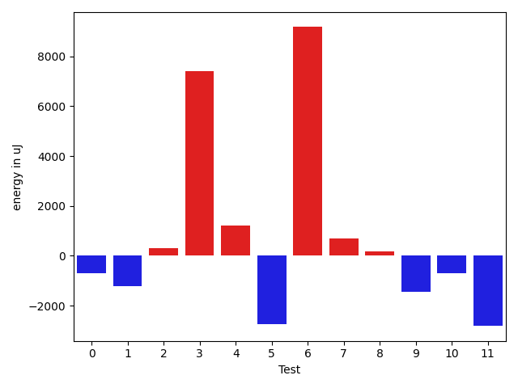

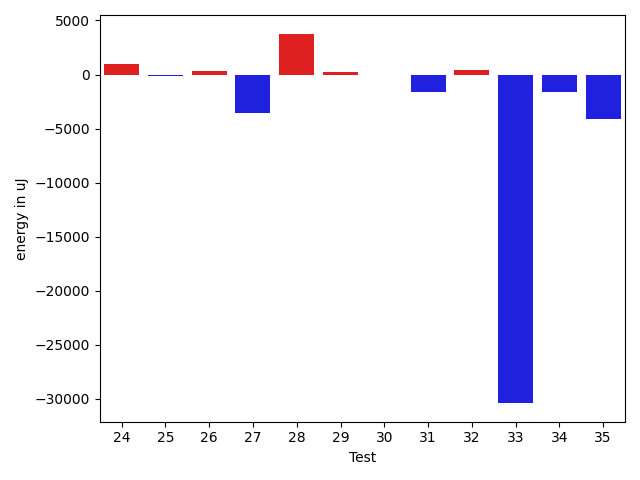

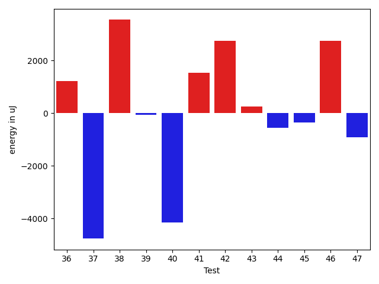

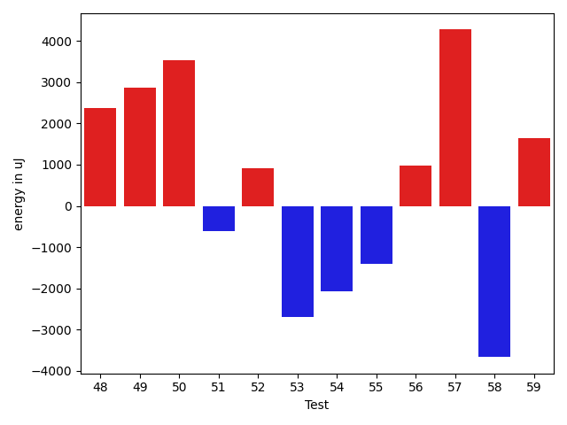

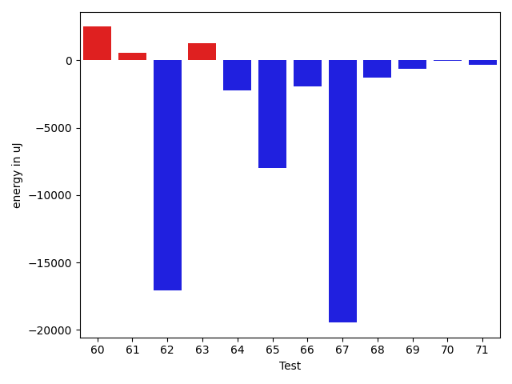

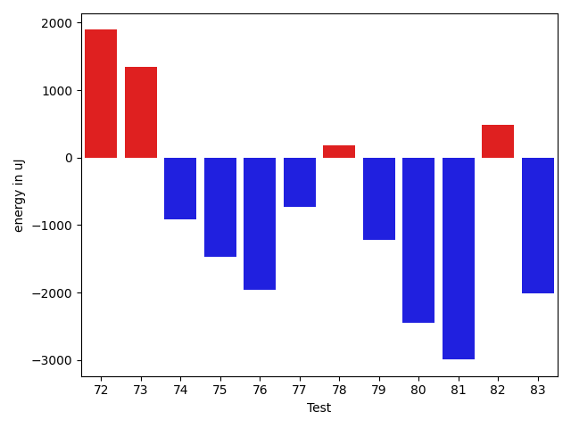

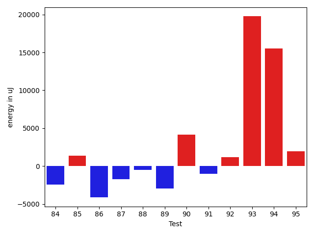

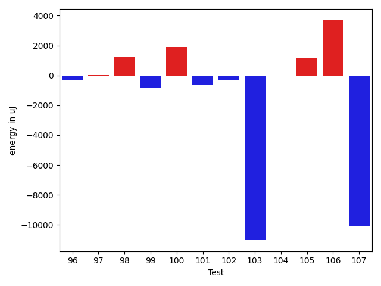

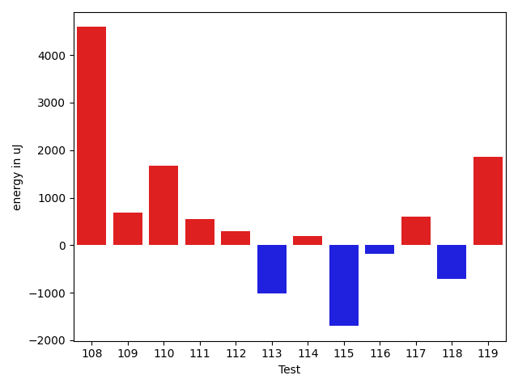

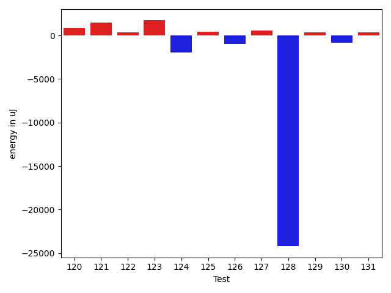

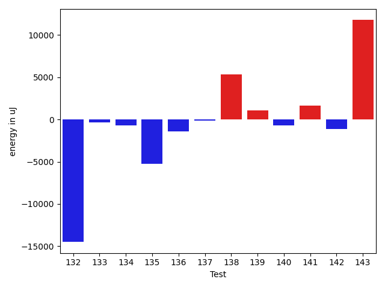

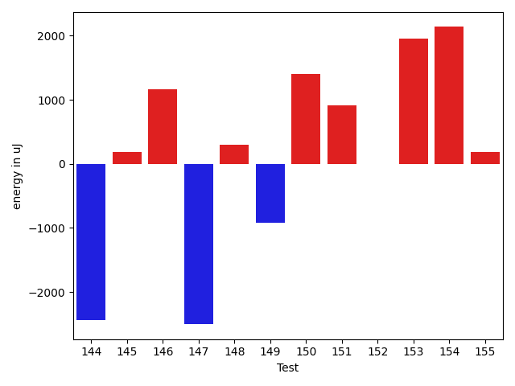

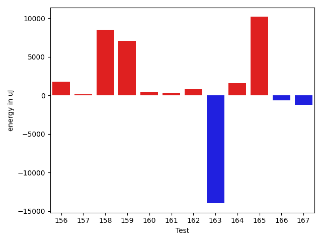

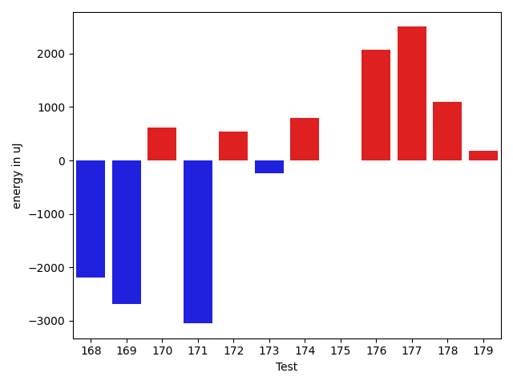

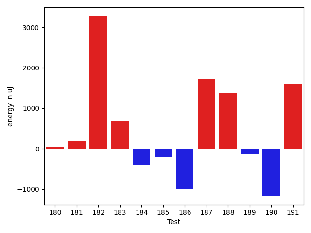

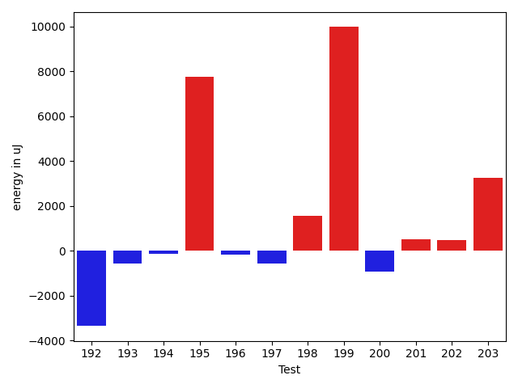

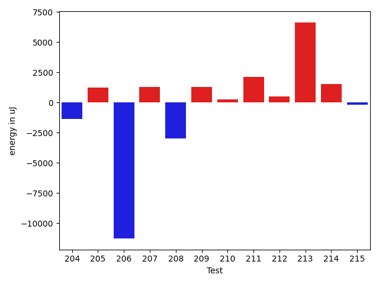

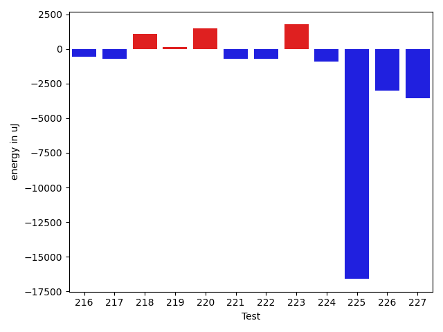

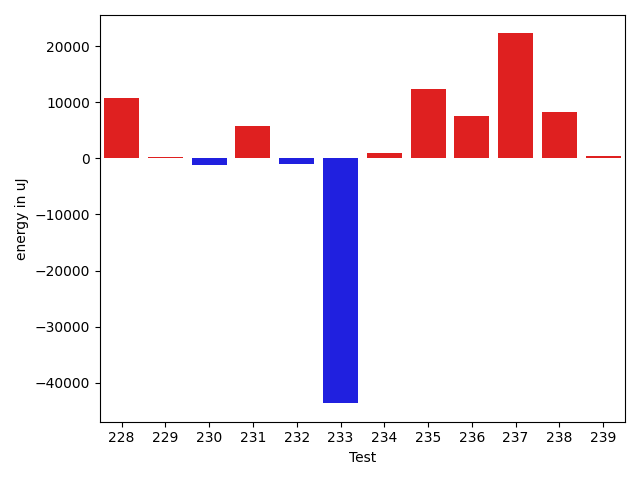

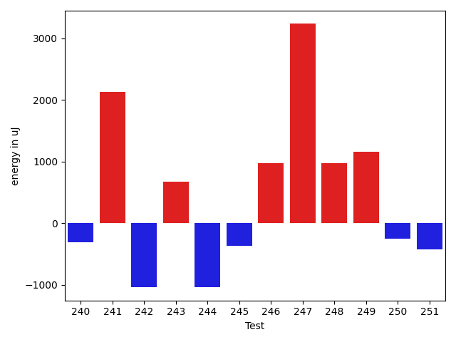

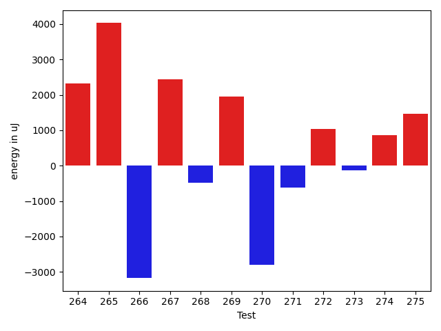

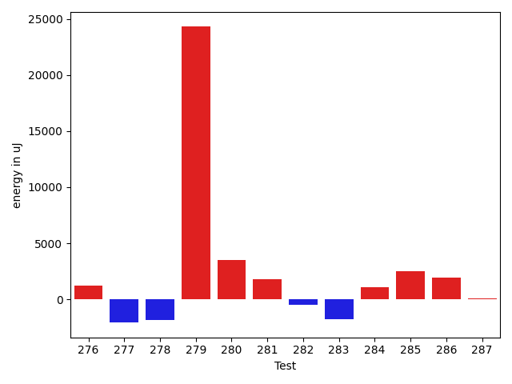

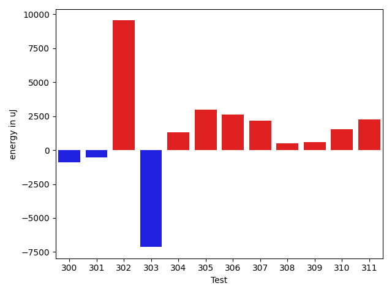

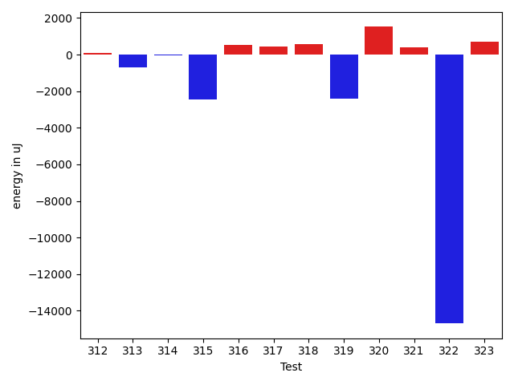

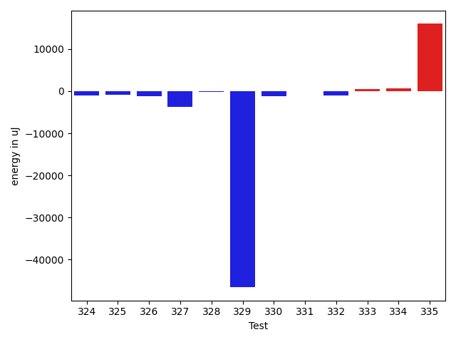

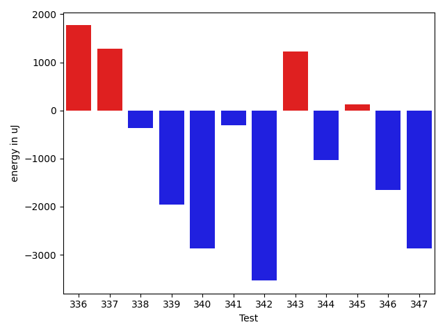

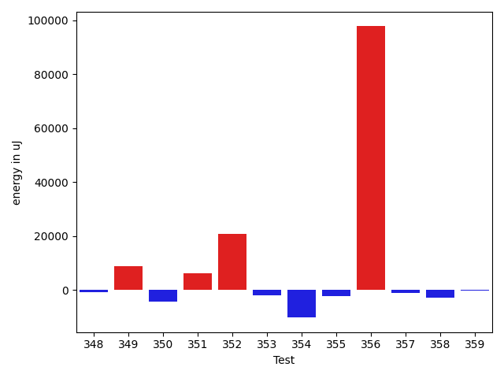

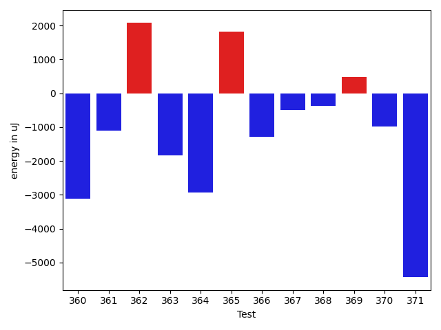

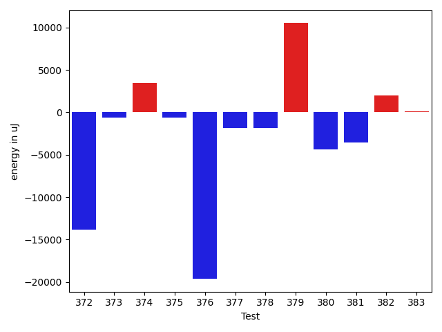

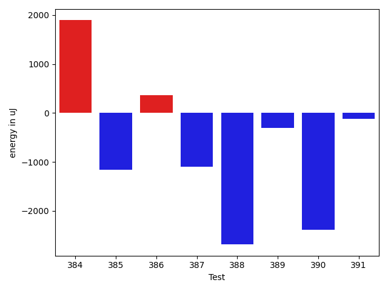

| ID | EnergyV1 | EnergyV2 | DeltaEnergy | σV1 | σV2 |
| --- | --- | --- | --- | --- | --- |
| 0 | 36743 | 34912 | -1831 | 4445.150615972162 | 6502.348768180278 |
| 1 | 35278 | 34180 | -1098 | 4194.8593106353555 | 4981.412979715183 |
| 2 | 36377 | 34668 | -1709 | 3542.7115041203783 | 7312.33776967697 |
| 3 | 38574 | 38452 | -122 | 277976.2408799163 | 278332.9055822438 |
| 4 | 78857 | 80017 | 1160 | 23260.531655195653 | 23425.958861470932 |
| 5 | 38574 | 38574 | 0 | 30378.08941225403 | 24576.62649039406 |
| 6 | 36377 | 39551 | 3174 | 54120.75622080887 | 75014.1114121964 |
| 7 | 36377 | 36010 | -367 | 3849.8933757031764 | 6371.465759403956 |
| 8 | 36499 | 37903 | 1404 | 10005.052063249273 | 8247.409105213193 |
| 9 | 37415 | 34729 | -2686 | 4137.8278483365075 | 4558.722082379556 |
| 10 | 37475 | 35949 | -1526 | 3866.0728833347403 | 3862.018618778289 |
| 11 | 37292 | 37659 | 367 | 21098.251518492725 | 17338.896628369464 |
| 12 | 37475 | 37964 | 489 | 3865.055373684074 | 3938.463963566307 |
| 13 | 36743 | 36743 | 0 | 4676.408077193207 | 4243.406786816461 |
| 14 | 36621 | 34607 | -2014 | 19130.981774189615 | 31231.951809159935 |
| 15 | 35095 | 36438 | 1343 | 3813.8659991254144 | 5884.750004930588 |
| 16 | 35156 | 32898 | -2258 | 3024.2607879628154 | 4829.869987296017 |
| 17 | 35279 | 35400 | 121 | 3894.5005528582246 | 3774.933641800873 |
| 18 | 40344 | 40344 | 0 | 110167.68154459189 | 58677.98039545951 |
| 19 | 37537 | 37720 | 183 | 11325.038890011225 | 10409.795318090943 |
| 20 | 37353 | 36743 | -610 | 4652.640559913485 | 4258.2881736534155 |
| 21 | 66040 | 67810 | 1770 | 26348.999164199857 | 26127.58225870089 |
| 22 | 38757 | 39184 | 427 | 87213.0245083575 | 69698.39202982665 |
| 23 | 37597 | 36072 | -1525 | 3810.3998887547514 | 4618.681109117219 |
| 24 | 37049 | 36804 | -245 | 39409.34578407631 | 40249.341791993385 |
| 25 | 34485 | 35339 | 854 | 4541.714348275268 | 4660.494114706972 |
| 26 | 37354 | 37231 | -123 | 3710.233399410228 | 5047.657745839728 |
| 27 | 35766 | 34668 | -1098 | 7224.67704776099 | 3237.760489037909 |
| 28 | 40100 | 39734 | -366 | 18128.712682617286 | 44260.66747649479 |
| 29 | 35888 | 37170 | 1282 | 4702.931547331822 | 3417.870206722309 |
| 30 | 33753 | 34546 | 793 | 2678.0116189824416 | 4610.1353249428275 |
| 31 | 35156 | 33386 | -1770 | 4086.446476903099 | 4420.884844186236 |
| 32 | 33997 | 34423 | 426 | 3296.3960092804386 | 2115.9982720928674 |
| 33 | 34302 | 35156 | 854 | 63795.6459580119 | 3951.079661167171 |
| 34 | 40161 | 36377 | -3784 | 4970.28080122799 | 4184.289713698523 |
| 35 | 39001 | 34241 | -4760 | 3541.9561770298624 | 5163.219949598688 |
| 36 | 36926 | 38147 | 1221 | 3509.7711730966166 | 4141.440387639909 |
| 37 | 42297 | 37536 | -4761 | 52414.21377011095 | 47446.68124004264 |
| 38 | 33936 | 37475 | 3539 | 6491.668618228205 | 2692.5701063812207 |
| 39 | 33875 | 33813 | -62 | 3665.9457287537416 | 4108.396238719069 |
| 40 | 38757 | 34607 | -4150 | 4758.395792208349 | 3626.4711185025776 |
| 41 | 35034 | 36560 | 1526 | 3048.29919499747 | 3506.9095752857343 |
| 42 | 34057 | 36804 | 2747 | 4517.098393972225 | 3851.8625416803234 |
| 43 | 37292 | 37536 | 244 | 4614.117594248517 | 5088.639994544991 |
| 44 | 36255 | 35705 | -550 | 5659.008126448187 | 4543.559669710768 |
| 45 | 35583 | 35217 | -366 | 4821.438545786273 | 3682.0922203405808 |
| 46 | 35828 | 38574 | 2746 | 3146.269806274972 | 5172.073622832529 |
| 47 | 39001 | 38086 | -915 | 79974.1758890986 | 57611.81269501869 |
| 48 | 34302 | 36683 | 2381 | 3893.814891470428 | 4018.644468114978 |
| 49 | 34912 | 37781 | 2869 | 3406.181451420344 | 4892.473298059196 |
| 50 | 35095 | 38635 | 3540 | 4110.433541896006 | 3676.5548533707138 |
| 51 | 37171 | 36560 | -611 | 3138.025844117143 | 4067.0770933405975 |
| 52 | 35339 | 36254 | 915 | 3797.3040602555197 | 4623.482389900736 |
| 53 | 36377 | 33692 | -2685 | 4342.856184210421 | 2382.810525409018 |
| 54 | 41931 | 39856 | -2075 | 101291.04064368058 | 47705.05887060093 |
| 55 | 37842 | 36438 | -1404 | 36485.11735928895 | 3005.3870663668467 |
| 56 | 36926 | 37903 | 977 | 46416.899869716704 | 4902.009241454547 |
| 57 | 34301 | 38574 | 4273 | 4098.381250048402 | 3726.920685439329 |
| 58 | 37903 | 34240 | -3663 | 5654.888190760274 | 4061.5382724885026 |
| 59 | 34546 | 36193 | 1647 | 3796.9386195837333 | 3644.8274251579696 |
| 60 | 33935 | 34118 | 183 | 3011.229575365445 | 5031.5100542089285 |
| 61 | 34423 | 36682 | 2259 | 3898.049641591324 | 4267.351205666109 |
| 62 | 35950 | 33752 | -2198 | 55138.25886365615 | 4419.843658653794 |
| 63 | 35950 | 38025 | 2075 | 3725.4866044463643 | 4656.355039844883 |
| 64 | 36010 | 36377 | 367 | 14964.369270083016 | 9604.088051627648 |
| 65 | 36621 | 34973 | -1648 | 35826.58224043012 | 3962.4774593946827 |
| 66 | 38147 | 37170 | -977 | 15693.699251148018 | 9570.23559202769 |
| 67 | 46448 | 44739 | -1709 | 116278.4810137395 | 79122.13845557568 |
| 68 | 37781 | 36255 | -1526 | 4324.4793736709835 | 3653.7832578353764 |
| 69 | 36133 | 36498 | 365 | 4394.819122557833 | 3693.068129016246 |
| 70 | 34424 | 34607 | 183 | 4880.2899801067715 | 4442.648933923827 |
| 71 | 38269 | 36804 | -1465 | 4244.095923751017 | 3892.5734208534454 |
| 72 | 35279 | 37171 | 1892 | 14083.773420675365 | 19587.86755951229 |
| 73 | 34363 | 35706 | 1343 | 4380.01308711203 | 6532.903950592007 |
| 74 | 36682 | 35767 | -915 | 3892.9183407739088 | 4312.9554753221855 |
| 75 | 36743 | 35278 | -1465 | 6118.16393421689 | 28909.34549562 |
| 76 | 37841 | 35889 | -1952 | 11986.36782390214 | 8601.514904190553 |
| 77 | 37659 | 36926 | -733 | 4537.645080277431 | 4400.152351128083 |
| 78 | 36194 | 36377 | 183 | 4106.208554960378 | 3915.425433140393 |
| 79 | 36499 | 35278 | -1221 | 5544.719928590189 | 3579.4390922103635 |
| 80 | 38452 | 36010 | -2442 | 3996.4193128474053 | 4517.069388801534 |
| 81 | 36133 | 33142 | -2991 | 4124.398385641021 | 4379.269826306665 |
| 82 | 37292 | 37781 | 489 | 6233.454673099675 | 6259.4642081423635 |
| 83 | 37414 | 35400 | -2014 | 4214.150835945383 | 3977.9124164957 |
| 84 | 37354 | 35156 | -2198 | 4726.1860771174415 | 3845.789798557511 |
| 85 | 37170 | 36438 | -732 | 15519.039671248698 | 33976.68951963127 |
| 86 | 38757 | 37842 | -915 | 49177.211812685375 | 59542.75796038413 |
| 87 | 37415 | 35828 | -1587 | 3927.9951807506072 | 4224.293611390602 |
| 88 | 35400 | 33875 | -1525 | 5445.685633393786 | 4690.2553657686785 |
| 89 | 33325 | 34973 | 1648 | 34647.19878768657 | 4293.667097668379 |
| 90 | 37659 | 37414 | -245 | 31240.495471085105 | 44053.73968299765 |
| 91 | 37414 | 35828 | -1586 | 10934.48895847259 | 10943.649437422371 |
| 92 | 36865 | 36072 | -793 | 8687.51918113823 | 9809.066286900037 |
| 93 | 38696 | 38818 | 122 | 85142.7950156806 | 116326.29304702545 |
| 94 | 38025 | 37292 | -733 | 75698.16321631128 | 91556.64809826738 |
| 95 | 37537 | 38635 | 1098 | 23338.909121901183 | 25115.911212848245 |
| 96 | 35645 | 36804 | 1159 | 3657.4831417381497 | 4523.82349591147 |
| 97 | 36011 | 37658 | 1647 | 17484.777316252967 | 13483.653703496326 |
| 98 | 35706 | 37902 | 2196 | 3488.679157480784 | 4404.444611696235 |
| 99 | 37231 | 36132 | -1099 | 14560.432453560663 | 16598.35004286434 |
| 100 | 35950 | 37841 | 1891 | 11099.277630801274 | 12992.29354377338 |
| 101 | 34546 | 33447 | -1099 | 3606.5410792725456 | 4000.770790776814 |
| 102 | 37232 | 36071 | -1161 | 4025.4267067388764 | 4143.220204836484 |
| 103 | 36621 | 35583 | -1038 | 22165.918890549066 | 4284.892742847635 |
| 104 | 36194 | 36316 | 122 | 3977.0203388495847 | 3950.8431891591754 |
| 105 | 35706 | 35950 | 244 | 6373.247992602093 | 11320.818029742943 |
| 106 | 37842 | 39367 | 1525 | 15284.293254990906 | 18240.811570367947 |
| 107 | 36499 | 38269 | 1770 | 133895.8652449051 | 138597.01251827518 |
| 108 | 35767 | 37414 | 1647 | 3835.8298571115397 | 12466.15929528593 |
| 109 | 34058 | 34912 | 854 | 3248.7965271164485 | 4171.19349980788 |
| 110 | 34728 | 36926 | 2198 | 3404.0883589524456 | 4745.334035390767 |
| 111 | 36194 | 36621 | 427 | 3832.019137762272 | 3991.4728361423245 |
| 112 | 35095 | 36926 | 1831 | 6089.141411386616 | 3681.310818226649 |
| 113 | 36255 | 35949 | -306 | 9257.14937462487 | 8111.335506583162 |
| 114 | 34851 | 37110 | 2259 | 3612.8284592538453 | 4479.090228338786 |
| 115 | 36499 | 35339 | -1160 | 7997.604768924914 | 3711.0915262380286 |
| 116 | 35950 | 35522 | -428 | 4202.270143624753 | 4901.218299854636 |
| 117 | 36255 | 36621 | 366 | 4130.418071373505 | 4570.368670075492 |
| 118 | 35767 | 34607 | -1160 | 3742.767660858474 | 3955.7945350842765 |
| 119 | 35339 | 37414 | 2075 | 2874.6868334647984 | 4278.329748570112 |
| 120 | 35034 | 35949 | 915 | 3236.8639498118905 | 4690.028526710786 |
| 121 | 34729 | 36682 | 1953 | 4715.379459123054 | 3833.793130813991 |
| 122 | 34607 | 35157 | 550 | 4488.4884193470125 | 3830.8017281796806 |
| 123 | 34241 | 36560 | 2319 | 4163.6676499078185 | 3662.013958496366 |
| 124 | 37292 | 34607 | -2685 | 3958.802932911123 | 3992.450663921867 |
| 125 | 34851 | 36255 | 1404 | 3415.656755154641 | 3507.5835100071477 |
| 126 | 34851 | 33386 | -1465 | 4820.038676907157 | 5864.02549722766 |
| 127 | 36438 | 35400 | -1038 | 3757.880513331862 | 4793.871723096372 |
| 128 | 130737 | 126098 | -4639 | 101858.59799765234 | 74205.11604735532 |
| 129 | 36987 | 37964 | 977 | 7088.641088636425 | 3831.2639286866874 |
| 130 | 36132 | 36865 | 733 | 15500.204830746121 | 11383.262530877557 |
| 131 | 36926 | 37658 | 732 | 3426.0812865048156 | 4146.913053080098 |
| 132 | 38635 | 36621 | -2014 | 59069.74115640296 | 26732.42061803607 |
| 133 | 35705 | 36011 | 306 | 4052.242707805514 | 4675.335311087947 |
| 134 | 38147 | 35705 | -2442 | 3205.94782031957 | 3270.1799557991694 |
| 135 | 34607 | 34180 | -427 | 28710.913777032987 | 3764.3740155421447 |
| 136 | 36377 | 35095 | -1282 | 3583.3649477069685 | 4511.035751203391 |
| 137 | 35400 | 34973 | -427 | 4240.102212460495 | 3722.0120995189573 |
| 138 | 36926 | 38146 | 1220 | 14520.067667747584 | 18413.810704046147 |
| 139 | 34607 | 35095 | 488 | 4453.968204895838 | 6599.236404431644 |
| 140 | 35828 | 34912 | -916 | 4268.265141420915 | 3477.4714367731017 |
| 141 | 34119 | 36560 | 2441 | 3969.385188938237 | 3983.929986137279 |
| 142 | 36560 | 36743 | 183 | 37880.77249561136 | 25616.399605979812 |
| 143 | 34851 | 36316 | 1465 | 26255.581653544017 | 54643.27032069967 |
| 144 | 35339 | 32898 | -2441 | 4285.889311486172 | 4595.339123259968 |
| 145 | 36194 | 36377 | 183 | 4776.662444800788 | 4677.842360664662 |
| 146 | 37353 | 38513 | 1160 | 27954.701557758384 | 39948.844897041774 |
| 147 | 36865 | 34363 | -2502 | 4186.387866292781 | 4138.735024631358 |
| 148 | 33936 | 34240 | 304 | 2637.3091899346214 | 3902.867325441643 |
| 149 | 36011 | 35096 | -915 | 4331.496062259731 | 4036.0721482460035 |
| 150 | 37415 | 38818 | 1403 | 35556.62771093043 | 63854.04895835808 |
| 151 | 34729 | 35645 | 916 | 4390.228025852052 | 3467.58296866244 |
| 152 | 35278 | 35279 | 1 | 9933.693697527617 | 25517.731990250515 |
| 153 | 34180 | 36132 | 1952 | 3349.2118806449507 | 3815.2961039886686 |
| 154 | 34301 | 36437 | 2136 | 4355.591419038291 | 4066.530649140617 |
| 155 | 36255 | 36438 | 183 | 3342.6340523046433 | 3976.9334937724175 |
| 156 | 34302 | 35339 | 1037 | 3562.468783899349 | 3757.8648764555405 |
| 157 | 35278 | 35889 | 611 | 4167.0637921083 | 6384.5794347469555 |
| 158 | 61646 | 62561 | 915 | 41416.60554908686 | 56355.48275191699 |
| 159 | 39002 | 37415 | -1587 | 36799.41885180234 | 70715.11945364141 |
| 160 | 35584 | 36927 | 1343 | 9968.777501985036 | 10315.135401665435 |
| 161 | 38025 | 37963 | -62 | 16369.985169731228 | 17973.399687813147 |
| 162 | 35278 | 35767 | 489 | 3331.4692954710936 | 4205.0056137480715 |
| 163 | 37476 | 34851 | -2625 | 51613.325485265195 | 7184.417393445413 |
| 164 | 35766 | 38452 | 2686 | 5724.112887516325 | 4822.130150005674 |
| 165 | 37658 | 36804 | -854 | 29397.84135369226 | 59765.752068214526 |
| 166 | 36560 | 35949 | -611 | 3619.4595300860256 | 4059.7446932024473 |
| 167 | 37293 | 34912 | -2381 | 3055.290834411716 | 4512.257678413477 |
| 168 | 36498 | 34301 | -2197 | 4688.186643042275 | 4207.3583668640795 |
| 169 | 36743 | 34058 | -2685 | 3466.899368942658 | 4351.147661977396 |
| 170 | 35034 | 35645 | 611 | 3460.274749184485 | 33062.10545185715 |
| 171 | 39856 | 36804 | -3052 | 70236.73444840906 | 4716.279622122552 |
| 172 | 34607 | 35156 | 549 | 4394.478666255393 | 3974.7895633663447 |
| 173 | 33935 | 33691 | -244 | 4267.909602365216 | 3735.679663931163 |
| 174 | 34362 | 35156 | 794 | 31860.632801689495 | 7464.19277678884 |
| 175 | 34607 | 34607 | 0 | 3261.7600156063418 | 4355.127794575598 |
| 176 | 36377 | 38452 | 2075 | 57478.67133723934 | 40233.69543747333 |
| 177 | 150634 | 153136 | 2502 | 68879.14564808333 | 66565.71548134147 |
| 178 | 33569 | 34668 | 1099 | 4018.358163551192 | 3669.353186036367 |
| 179 | 34607 | 34790 | 183 | 26881.719609126285 | 4081.3018712911326 |
| 180 | 33569 | 33813 | 244 | 4049.9516963854717 | 3444.334777369028 |
| 181 | 33996 | 34424 | 428 | 3687.9810844539234 | 3683.7137067732865 |
| 182 | 32165 | 34851 | 2686 | 3996.2363157548657 | 4604.3380974419715 |
| 183 | 35523 | 35278 | -245 | 4141.0093220951185 | 3888.8970529934527 |
| 184 | 34423 | 34363 | -60 | 3915.249314547125 | 3764.6278648742505 |
| 185 | 32532 | 33508 | 976 | 4522.628641664049 | 3534.858821634733 |
| 186 | 34485 | 33447 | -1038 | 4206.372997731631 | 2668.6113518022617 |
| 187 | 33753 | 35034 | 1281 | 3464.958786262236 | 3798.1662956199893 |
| 188 | 34179 | 35705 | 1526 | 2952.821404979098 | 4797.5095629295 |
| 189 | 33691 | 35095 | 1404 | 4521.053479850166 | 3876.2607401482114 |
| 190 | 33630 | 33570 | -60 | 4330.075455613118 | 3519.5766218309236 |
| 191 | 33753 | 35278 | 1525 | 3600.744131767414 | 3671.2893146460024 |
| 192 | 35034 | 33936 | -1098 | 12316.293657412582 | 8701.396425090596 |
| 193 | 34057 | 33325 | -732 | 4020.883629600675 | 4245.687887353237 |
| 194 | 34240 | 34606 | 366 | 36953.395642469935 | 33973.36875536148 |
| 195 | 35279 | 35889 | 610 | 4140.8435837127545 | 34584.39551985726 |
| 196 | 34180 | 34546 | 366 | 4220.298157380599 | 4999.729380002871 |
| 197 | 33020 | 34912 | 1892 | 4686.610462300483 | 3460.8645509467715 |
| 198 | 33996 | 34851 | 855 | 4346.263757288997 | 3981.227293385797 |
| 199 | 35400 | 33691 | -1709 | 3174.2443237500647 | 42880.84309924822 |
| 200 | 35950 | 36132 | 182 | 4118.70036194521 | 2687.9398563746927 |
| 201 | 32288 | 33081 | 793 | 3556.3665017042954 | 4371.2404884841635 |
| 202 | 34913 | 34607 | -306 | 3799.4354487066744 | 4064.6536709197853 |
| 203 | 35462 | 36987 | 1525 | 9457.953050812572 | 12144.487804549193 |
| 204 | 34790 | 33448 | -1342 | 4268.865177397509 | 5910.430065178222 |
| 205 | 35156 | 36377 | 1221 | 5233.369331174743 | 9517.519298611714 |
| 206 | 102112 | 90820 | -11292 | 58503.971216904174 | 60347.34146763388 |
| 207 | 35705 | 36988 | 1283 | 6633.281939683703 | 11727.837842161764 |
| 208 | 73914 | 70923 | -2991 | 24510.689748527613 | 26639.655081022225 |
| 209 | 35462 | 36743 | 1281 | 9709.471725586525 | 13104.479270567797 |
| 210 | 35156 | 35401 | 245 | 64965.71250013091 | 51974.2636273557 |
| 211 | 63416 | 65551 | 2135 | 20734.144395205818 | 21703.09001545063 |
| 212 | 35950 | 36438 | 488 | 14747.683770253416 | 13345.623870982723 |
| 213 | 66772 | 73425 | 6653 | 41655.82120678196 | 35026.95059180169 |
| 214 | 38025 | 39551 | 1526 | 17149.234675575564 | 17291.629068272043 |
| 215 | 35034 | 34851 | -183 | 4767.652107808806 | 3860.725446182939 |
| 216 | 36254 | 35706 | -548 | 7472.558576328906 | 11134.449472568893 |
| 217 | 35644 | 34912 | -732 | 3844.234799968841 | 3820.937227561774 |
| 218 | 33264 | 34362 | 1098 | 2548.7361929799436 | 3569.5748666877525 |
| 219 | 39307 | 39429 | 122 | 240362.47056134205 | 475452.49316423375 |
| 220 | 35706 | 37170 | 1464 | 52861.27610776623 | 3622.8120947577318 |
| 221 | 37902 | 37171 | -731 | 4217.316906431547 | 2487.366751486677 |
| 222 | 37048 | 36316 | -732 | 4341.268350378724 | 3915.3258006199176 |
| 223 | 35278 | 37049 | 1771 | 2521.58325405743 | 5484.980315947044 |
| 224 | 36927 | 36011 | -916 | 4015.760879778411 | 27199.803946267675 |
| 225 | 168579 | 151977 | -16602 | 161559.05828532364 | 305247.75971520133 |
| 226 | 37293 | 34302 | -2991 | 28032.161075108466 | 3601.3573867276236 |
| 227 | 37842 | 34302 | -3540 | 3954.8624324210064 | 3951.880674440309 |
| 228 | 38208 | 38879 | 671 | 41284.481728408035 | 60875.75261915025 |
| 229 | 36072 | 35583 | -489 | 4229.499810373612 | 4739.594484211159 |
| 230 | 36132 | 34302 | -1830 | 3775.977369282466 | 5570.6662702386875 |
| 231 | 34241 | 36926 | 2685 | 21540.597183344787 | 26571.831415696695 |
| 232 | 37170 | 34485 | -2685 | 3412.3044898311077 | 4078.7051815986897 |
| 233 | 40527 | 37903 | -2624 | 434765.79785643396 | 373688.9836180018 |
| 234 | 36621 | 37170 | 549 | 3900.833931100463 | 3905.247939542739 |
| 235 | 35828 | 39307 | 3479 | 22274.788360136867 | 27003.96871172076 |
| 236 | 34241 | 37293 | 3052 | 14715.704239289791 | 21202.438555605266 |
| 237 | 36316 | 37414 | 1098 | 4303.206369601045 | 70335.49708883904 |
| 238 | 36499 | 36988 | 489 | 19317.861389000136 | 32701.947176561214 |
| 239 | 37292 | 39856 | 2564 | 23838.822452260516 | 22173.360799824273 |
| 240 | 34423 | 34118 | -305 | 5686.515971553834 | 3725.3242103503176 |
| 241 | 33325 | 35461 | 2136 | 4863.91513812835 | 5038.383515325128 |
| 242 | 36865 | 35827 | -1038 | 4593.2962399022335 | 3596.3941617879077 |
| 243 | 35461 | 36133 | 672 | 3883.2624253381605 | 4064.795941011122 |
| 244 | 37475 | 36438 | -1037 | 5278.034832102655 | 3551.6524514375656 |
| 245 | 34423 | 34057 | -366 | 4607.838175920427 | 4272.486899685209 |
| 246 | 33386 | 34363 | 977 | 4294.638415972947 | 4109.5533922652285 |
| 247 | 37231 | 40466 | 3235 | 3114.6567295947525 | 56140.93539776929 |
| 248 | 36255 | 37231 | 976 | 4003.7778288011937 | 3905.3448139127936 |
| 249 | 32470 | 33630 | 1160 | 34118.83628836456 | 3193.734165659133 |
| 250 | 33753 | 33508 | -245 | 3644.652038861186 | 2590.642371342245 |
| 251 | 35217 | 34790 | -427 | 4601.471119041714 | 7145.627693512832 |
| 252 | 35217 | 34667 | -550 | 4771.793720656835 | 3227.788119876273 |
| 253 | 35339 | 35522 | 183 | 4463.613774508032 | 5419.091449154324 |
| 254 | 35340 | 34118 | -1222 | 3129.2065687646764 | 3073.5136436409484 |
| 255 | 78980 | 78185 | -795 | 303188.35128144687 | 151679.1931100478 |
| 256 | 73852 | 74890 | 1038 | 91217.89706172697 | 51412.10432950872 |
| 257 | 37231 | 35705 | -1526 | 4478.267114055121 | 4171.138438515783 |
| 258 | 41992 | 35950 | -6042 | 24009.23812894829 | 19957.647797032594 |
| 259 | 39856 | 38024 | -1832 | 38253.769787889396 | 42327.662041730924 |
| 260 | 36682 | 35034 | -1648 | 24636.12718569777 | 36845.53374525862 |
| 261 | 66589 | 63233 | -3356 | 30169.942446515524 | 29208.51891270046 |
| 262 | 36011 | 35705 | -306 | 4820.985661434298 | 4630.528344510083 |
| 263 | 37292 | 35279 | -2013 | 4564.314913787416 | 3615.4610311512747 |
| 264 | 34363 | 36682 | 2319 | 9578.408177857327 | 11062.856406253522 |
| 265 | 33692 | 37720 | 4028 | 4713.041384640425 | 4206.285168185791 |
| 266 | 37109 | 33935 | -3174 | 4883.221037964726 | 4096.866895683425 |
| 267 | 33387 | 35828 | 2441 | 3788.923571851685 | 4872.28560328723 |
| 268 | 34546 | 34057 | -489 | 4563.881688403131 | 3423.5696162280337 |
| 269 | 33691 | 35644 | 1953 | 4380.033231945582 | 4279.837713193218 |
| 270 | 35706 | 32898 | -2808 | 4031.561588207003 | 4932.266003035679 |
| 271 | 33447 | 32837 | -610 | 4956.21626873559 | 3249.1362074672334 |
| 272 | 33935 | 34973 | 1038 | 4593.7434958417725 | 3773.1851891842375 |
| 273 | 33203 | 33081 | -122 | 4370.9178697654215 | 4047.153477284752 |
| 274 | 31800 | 32654 | 854 | 3307.631976085754 | 3959.6736868549146 |
| 275 | 34607 | 36072 | 1465 | 4108.57559204593 | 3096.061780468286 |
| 276 | 33630 | 34851 | 1221 | 4686.157245518948 | 4256.674492252514 |
| 277 | 36804 | 34729 | -2075 | 4636.846086849993 | 4386.281276890482 |
| 278 | 36743 | 34912 | -1831 | 4976.735343395376 | 3554.903202706403 |
| 279 | 35889 | 60180 | 24291 | 21581.267943732397 | 22451.476837071445 |
| 280 | 33814 | 37293 | 3479 | 3831.7969726918673 | 4792.050104056914 |
| 281 | 35949 | 37719 | 1770 | 4368.039548366492 | 3159.5706733668735 |
| 282 | 34240 | 33752 | -488 | 4758.346989344715 | 1570.3741719730367 |
| 283 | 36560 | 34790 | -1770 | 5890.228224266918 | 4626.380191097985 |
| 284 | 34485 | 35584 | 1099 | 3750.316750341384 | 4061.772479284061 |
| 285 | 33325 | 35827 | 2502 | 3139.005285342141 | 3966.0268472248886 |
| 286 | 33142 | 35095 | 1953 | 3912.247978451515 | 4325.000159260114 |
| 287 | 35217 | 35279 | 62 | 4863.740127377969 | 4375.472724418491 |
| 288 | 36682 | 35705 | -977 | 5313.29782511703 | 4736.8147590684175 |
| 289 | 35156 | 33020 | -2136 | 4716.720353169138 | 3655.4737267099413 |
| 290 | 36133 | 34668 | -1465 | 3907.53618537308 | 4909.461467954041 |
| 291 | 34545 | 34484 | -61 | 5158.9917487766525 | 4719.062611152542 |
| 292 | 33570 | 34668 | 1098 | 3777.8912492036256 | 5314.2007933304185 |
| 293 | 36621 | 36743 | 122 | 104409.79159081684 | 55915.836010437095 |
| 294 | 32410 | 34057 | 1647 | 3686.5845972171264 | 4505.286663736024 |
| 295 | 34851 | 35827 | 976 | 4765.344062263084 | 4205.559313443206 |
| 296 | 36072 | 35400 | -672 | 4842.495867032023 | 4147.438615136641 |
| 297 | 32165 | 34851 | 2686 | 4390.923198243392 | 4839.031717193016 |
| 298 | 34485 | 33508 | -977 | 4886.205412519344 | 4332.268912881333 |
| 299 | 34607 | 33692 | -915 | 4359.442381376683 | 5077.907079172397 |
| 300 | 37170 | 34424 | -2746 | 4181.9574808792695 | 4475.323863979008 |
| 301 | 33264 | 32409 | -855 | 4400.824877980059 | 2854.2498701038166 |
| 302 | 32227 | 35889 | 3662 | 4062.359161319387 | 35910.130650770014 |
| 303 | 37720 | 34606 | -3114 | 33059.663459047944 | 3970.3708208954968 |
| 304 | 32532 | 33203 | 671 | 3937.836340553363 | 5005.98186863834 |
| 305 | 33935 | 36010 | 2075 | 4113.3992321504065 | 3617.1624200930396 |
| 306 | 32531 | 36011 | 3480 | 3540.061553921846 | 3993.8941189265597 |
| 307 | 33630 | 34790 | 1160 | 4566.534400122264 | 5188.302138554845 |
| 308 | 32898 | 32654 | -244 | 3687.783604014016 | 4351.6863222133525 |
| 309 | 35339 | 36988 | 1649 | 4109.253382422012 | 4764.544665197995 |
| 310 | 33630 | 36621 | 2991 | 4287.118971113959 | 3812.6327060466115 |
| 311 | 33447 | 34912 | 1465 | 3121.3957711254748 | 4539.108777823415 |
| 312 | 34912 | 34973 | 61 | 4213.676314288655 | 4249.347834259856 |
| 313 | 33752 | 32837 | -915 | 4692.838059415977 | 3789.2379653466855 |
| 314 | 33997 | 33386 | -611 | 4216.414198634243 | 4599.809819257024 |
| 315 | 34301 | 30639 | -3662 | 4201.332704858493 | 3752.4066024352956 |
| 316 | 33813 | 35461 | 1648 | 4723.846340102307 | 4309.497636923945 |
| 317 | 33569 | 34180 | 611 | 4703.78727303861 | 4532.887018225802 |
| 318 | 33203 | 33814 | 611 | 4102.755024314859 | 3533.967451192512 |
| 319 | 38574 | 33752 | -4822 | 5210.423375312222 | 4000.727035177481 |
| 320 | 32409 | 36804 | 4395 | 4108.570013466432 | 3717.9130309295233 |
| 321 | 31372 | 33081 | 1709 | 5083.764753223314 | 4513.510287493749 |
| 322 | 37659 | 35156 | -2503 | 51652.95547676217 | 3401.050610384973 |
| 323 | 36254 | 37353 | 1099 | 10336.8995123726 | 12773.49800015642 |
| 324 | 36316 | 35095 | -1221 | 7539.797343842264 | 4233.047594822821 |
| 325 | 36682 | 35034 | -1648 | 4619.7383445871665 | 4290.788789048259 |
| 326 | 40161 | 36682 | -3479 | 35654.30755548964 | 38511.19390594002 |
| 327 | 38086 | 36987 | -1099 | 49625.78905046514 | 44884.48637538262 |
| 328 | 35949 | 35583 | -366 | 3598.0828544517985 | 4131.7268492527355 |
| 329 | 39795 | 36743 | -3052 | 118258.88244650418 | 99413.48948554885 |
| 330 | 36255 | 34363 | -1892 | 3839.076709441351 | 3585.507304064517 |
| 331 | 36744 | 39063 | 2319 | 92633.02541191083 | 87389.1711501269 |
| 332 | 35034 | 34119 | -915 | 4627.722674041959 | 4388.517595102109 |
| 333 | 37476 | 37597 | 121 | 4321.3027487872105 | 4951.081461714455 |
| 334 | 39429 | 38208 | -1221 | 40045.00908474919 | 38089.48407636803 |
| 335 | 250610 | 256469 | 5859 | 92228.9839705279 | 118707.79957407608 |
| 336 | 370604 | 372374 | 1770 | 101267.88416710943 | 108954.76075800775 |
| 337 | 41687 | 42969 | 1282 | 33898.50160044042 | 51201.4175779454 |
| 338 | 39246 | 38879 | -367 | 18060.24201222859 | 16082.791174776812 |
| 339 | 40222 | 38269 | -1953 | 41919.16838883876 | 34719.61646046385 |
| 340 | 41382 | 38513 | -2869 | 89695.34642500921 | 126500.98974132902 |
| 341 | 38086 | 37781 | -305 | 4503.408183423852 | 4431.903237645339 |
| 342 | 37414 | 33874 | -3540 | 2792.51766374785 | 4616.217141109975 |
| 343 | 36865 | 38085 | 1220 | 10404.5568530312 | 22874.011299203725 |
| 344 | 36682 | 35645 | -1037 | 4216.5424150007075 | 4070.6762588238635 |
| 345 | 40222 | 40344 | 122 | 303421.58680451463 | 548233.3690827335 |
| 346 | 37841 | 36194 | -1647 | 12250.135522073044 | 6968.118840181935 |
| 347 | 38207 | 35339 | -2868 | 5305.3396825745285 | 4147.187614650574 |
| 348 | 37781 | 36437 | -1344 | 4537.6160943013665 | 4545.180653964157 |
| 349 | 39245 | 39062 | -183 | 31562.600886113767 | 39134.22114070933 |
| 350 | 38147 | 38818 | 671 | 33875.60367191098 | 4754.748831048368 |
| 351 | 37598 | 36743 | -855 | 51799.142639029305 | 63505.91215645464 |
| 352 | 39429 | 36621 | -2808 | 54589.72338489791 | 80605.0816264301 |
| 353 | 37658 | 34180 | -3478 | 3977.595778679808 | 4780.805790334717 |
| 354 | 37292 | 35583 | -1709 | 42187.3931006361 | 5243.386263806856 |
| 355 | 39673 | 35889 | -3784 | 4721.335341634109 | 4072.613320706988 |
| 356 | 37476 | 37109 | -367 | 363553.8421366511 | 437130.35282527324 |
| 357 | 35522 | 34790 | -732 | 4545.598847152985 | 4392.46001646222 |
| 358 | 37658 | 37048 | -610 | 19910.395066640354 | 17654.665157266998 |
| 359 | 34058 | 34241 | 183 | 10056.86543659217 | 6360.6425735203875 |
| 360 | 36743 | 33630 | -3113 | 4397.078897637692 | 4897.161055570361 |
| 361 | 37902 | 36804 | -1098 | 32629.11845694492 | 20949.71494336298 |
| 362 | 35034 | 37110 | 2076 | 4442.581441454748 | 4694.708733394728 |
| 363 | 36193 | 34363 | -1830 | 4088.097427342429 | 5192.698484419687 |
| 364 | 36987 | 34057 | -2930 | 4883.158709505787 | 4889.922112646732 |
| 365 | 39978 | 41809 | 1831 | 53541.20354922926 | 83605.37044293185 |
| 366 | 36682 | 35400 | -1282 | 4572.065971520303 | 5536.325660363559 |
| 367 | 33752 | 33264 | -488 | 3880.3631565011233 | 4510.295507188568 |
| 368 | 35706 | 35339 | -367 | 4017.382553874609 | 4876.788497502736 |
| 369 | 69336 | 69824 | 488 | 27234.56300601422 | 37109.80457907799 |
| 370 | 38514 | 37537 | -977 | 78761.92324878703 | 58007.253570219196 |
| 371 | 43945 | 38513 | -5432 | 22756.328468151445 | 16179.43587702028 |
| 372 | 38513 | 36987 | -1526 | 43861.627499693175 | 31660.40634397981 |
| 373 | 37903 | 36316 | -1587 | 10984.345104816895 | 11264.829491625345 |
| 374 | 36926 | 36987 | 61 | 54247.21853707271 | 58675.349936170154 |
| 375 | 38757 | 36438 | -2319 | 20828.852004128716 | 21150.543323389255 |
| 376 | 40771 | 36743 | -4028 | 96911.55749480528 | 85889.38017458937 |
| 377 | 37842 | 36133 | -1709 | 4175.302999039333 | 4337.951320868207 |
| 378 | 38635 | 36499 | -2136 | 4345.980363979998 | 3156.142441236612 |
| 379 | 39428 | 37292 | -2136 | 30448.513233343492 | 49976.05887529145 |
| 380 | 41687 | 35217 | -6470 | 4287.156003935024 | 4159.935344570384 |
| 381 | 38818 | 37171 | -1647 | 4092.4428998935205 | 5048.601930127676 |
| 382 | 33997 | 39185 | 5188 | 5899.125352880213 | 5432.493319523427 |
| 383 | 38452 | 40955 | 2503 | 3941.8421058560934 | 4150.892218547719 |
| 384 | 36316 | 38208 | 1892 | 37083.41341694919 | 4692.898261338066 |
| 385 | 37293 | 36133 | -1160 | 133586.6794095061 | 168049.36396203894 |
| 386 | 38513 | 38880 | 367 | 3847.5108396078176 | 4251.429488326824 |
| 387 | 39185 | 38086 | -1099 | 134647.227835062 | 96733.87502548567 |
| 388 | 39551 | 36865 | -2686 | 5773.339673677127 | 3459.2679802501098 |
| 389 | 38818 | 38513 | -305 | 4429.916260651988 | 5288.5234810271 |
| 390 | 40405 | 38025 | -2380 | 59975.823587315215 | 30770.309889021748 |
| 391 | 37414 | 37292 | -122 | 4101.702457135939 | 4858.124999064951 |

## Delta Duration per test method

| ID | DurationV1 | DurationsV2 | DeltaDuration |
| --- | --- | --- | --- |
| 0 | 837399.7454545455 | 851180.3333333334 | 13780.58787878789 |
| 1 | 782566.0508474576 | 790314.4905660377 | 7748.439718580106 |
| 2 | 855665.3448275862 | 939497.1428571428 | 83831.79802955664 |
| 3 | 2878001.184615385 | 3191369.6666666665 | 313368.4820512817 |
| 4 | 2566836.090909091 | 2656891.02020202 | 90054.92929292936 |
| 5 | 1426920.589041096 | 1356929.4383561644 | -69991.15068493155 |
| 6 | 1269877.5 | 1523655.3214285714 | 253777.82142857136 |
| 7 | 872600.4920634921 | 911460.5806451613 | 38860.08858166926 |
| 8 | 1058597.1818181819 | 1087975.5789473683 | 29378.39712918643 |
| 9 | 594520.6388888889 | 582523.15 | -11997.488888888853 |
| 10 | 730106.8636363636 | 718030.3488372093 | -12076.514799154364 |
| 11 | 1075585.8596491227 | 1031043.5161290322 | -44542.34352009045 |
| 12 | 730870.8372093023 | 765932.4528301887 | 35061.615620886325 |
| 13 | 686092.5 | 704336.62 | 18244.119999999995 |
| 14 | 731285.875 | 762023.4117647059 | 30737.536764705903 |
| 15 | 833630.5490196078 | 903104.6078431372 | 69474.0588235294 |
| 16 | 378957.53846153844 | 440434.2105263158 | 61476.67206477735 |
| 17 | 416561.92307692306 | 429770.2105263158 | 13208.287449392723 |
| 18 | 2562929.762886598 | 1744192.6354166667 | -818737.127469931 |
| 19 | 1162604.7066666668 | 1049989.913580247 | -112614.79308641981 |
| 20 | 787751.3181818182 | 726194.2888888889 | -61557.029292929335 |
| 21 | 1766662.106060606 | 1879483.690140845 | 112821.58408023906 |
| 22 | 1873099.5172413792 | 1516936.9310344828 | -356162.58620689646 |
| 23 | 575170.5 | 617651.2352941176 | 42480.73529411759 |
| 24 | 1095675.0 | 1120984.9393939395 | 25309.93939393945 |
| 25 | 680499.7027027027 | 738419.8536585366 | 57920.150955833844 |
| 26 | 515353.8181818182 | 418459.94444444444 | -96893.87373737374 |
| 27 | 310371.3333333333 | 340943.625 | 30572.291666666686 |
| 28 | 1101572.9555555556 | 1169209.3125 | 67636.35694444436 |
| 29 | 354305.25 | 347109.125 | -7196.125 |
| 30 | 323521.2727272727 | 366861.85714285716 | 43340.58441558445 |
| 31 | 402624.375 | 324804.25 | -77820.125 |
| 32 | 396329.0 | 346689.375 | -49639.625 |
| 33 | 1240099.2 | 274459.3333333333 | -965639.8666666667 |
| 34 | 263019.5833333333 | 266440.71428571426 | 3421.130952380947 |
| 35 | 376886.5 | 353560.7272727273 | -23325.772727272706 |
| 36 | 334915.9166666667 | 295204.25 | -39711.666666666686 |
| 37 | 1222202.4166666667 | 1134497.5454545454 | -87704.87121212133 |
| 38 | 375443.13333333336 | 263674.1111111111 | -111769.02222222224 |
| 39 | 447451.61904761905 | 452741.72222222225 | 5290.103174603195 |
| 40 | 293049.9285714286 | 343240.4666666667 | 50190.538095238095 |
| 41 | 364903.73333333334 | 341112.3076923077 | -23791.42564102565 |
| 42 | 312435.1818181818 | 365369.6 | 52934.41818181815 |
| 43 | 328625.8181818182 | 293814.6153846154 | -34811.2027972028 |
| 44 | 332136.9090909091 | 291876.75 | -40260.15909090912 |
| 45 | 415638.09523809527 | 422077.60869565216 | 6439.513457556895 |
| 46 | 352827.5 | 320375.4 | -32452.099999999977 |
| 47 | 1904600.1612903227 | 1057066.1153846155 | -847534.0459057072 |
| 48 | 507145.1034482759 | 532566.8333333334 | 25421.729885057488 |
| 49 | 421905.04 | 412141.25 | -9763.789999999979 |
| 50 | 418784.875 | 415864.75 | -2920.125 |
| 51 | 333330.1818181818 | 353972.5652173913 | 20642.383399209473 |
| 52 | 444999.4090909091 | 395487.9583333333 | -49511.4507575758 |
| 53 | 351274.0 | 339844.0 | -11430.0 |
| 54 | 2763976.9545454546 | 1168424.75 | -1595552.2045454546 |
| 55 | 716204.6666666666 | 485642.70588235295 | -230561.96078431368 |
| 56 | 834672.7857142857 | 320512.86363636365 | -514159.92207792203 |
| 57 | 378003.8095238095 | 393029.86666666664 | 15026.057142857113 |
| 58 | 331483.4 | 326288.8333333333 | -5194.566666666709 |
| 59 | 373305.15789473685 | 399676.4285714286 | 26371.270676691725 |
| 60 | 358656.8888888889 | 335002.76470588235 | -23654.124183006526 |
| 61 | 436982.0 | 438418.625 | 1436.625 |
| 62 | 864776.7333333333 | 280679.7272727273 | -584097.006060606 |
| 63 | 452859.8095238095 | 473955.3043478261 | 21095.494824016583 |
| 64 | 1089246.4193548388 | 1024331.3382352941 | -64915.08111954469 |
| 65 | 877612.1212121212 | 607489.09375 | -270123.0274621212 |
| 66 | 935864.7096774194 | 908998.9777777778 | -26865.73189964157 |
| 67 | 2912122.81443299 | 2430791.3333333335 | -481331.4810996563 |
| 68 | 384831.8181818182 | 398881.38095238095 | 14049.56277056277 |
| 69 | 563222.84 | 549470.7666666667 | -13752.073333333246 |
| 70 | 420580.9166666667 | 433588.6956521739 | 13007.778985507204 |
| 71 | 392904.35 | 374447.0714285714 | -18457.278571428556 |
| 72 | 1158729.7121212122 | 1267084.0153846154 | 108354.30326340324 |
| 73 | 988804.2739726028 | 967351.1818181818 | -21453.09215442103 |
| 74 | 686308.4 | 689339.8775510204 | 3031.4775510203326 |
| 75 | 794576.0 | 840244.0181818182 | 45668.01818181819 |
| 76 | 1239217.0555555555 | 1235612.4787234042 | -3604.5768321512733 |
| 77 | 702579.1041666666 | 674220.2391304348 | -28358.865036231815 |
| 78 | 693968.9824561403 | 695455.6041666666 | 1486.6217105262913 |
| 79 | 340952.23529411765 | 380092.625 | 39140.38970588235 |
| 80 | 603957.6315789474 | 607141.0512820513 | 3183.4197031038348 |
| 81 | 708844.6304347826 | 710857.26 | 2012.6295652174158 |
| 82 | 801318.8421052631 | 765285.6981132076 | -36033.14399205556 |
| 83 | 722876.7636363637 | 734415.7142857143 | 11538.950649350649 |
| 84 | 661456.0217391305 | 650360.8837209302 | -11095.13801820029 |
| 85 | 829540.6170212766 | 879213.7358490566 | 49673.11882778001 |
| 86 | 1882299.0666666667 | 1636889.0 | -245410.06666666665 |
| 87 | 500098.45 | 402649.36842105264 | -97449.08157894737 |
| 88 | 447257.23076923075 | 405707.5263157895 | -41549.704453441256 |
| 89 | 715541.1142857143 | 499952.44 | -215588.67428571434 |
| 90 | 1088436.6833333333 | 1183222.1153846155 | 94785.43205128214 |
| 91 | 1042853.53125 | 1076148.6301369863 | 33295.09888698626 |
| 92 | 938371.2545454545 | 1038225.8181818182 | 99854.56363636372 |
| 93 | 2023889.6129032257 | 2887976.757575758 | 864087.1446725321 |
| 94 | 1653053.2777777778 | 2389364.027777778 | 736310.7500000002 |
| 95 | 1367933.3736263737 | 1417465.3493975904 | 49531.975771216676 |
| 96 | 768452.5833333334 | 692545.9210526316 | -75906.6622807018 |
| 97 | 1281475.4675324676 | 1242320.5263157894 | -39154.941216678126 |
| 98 | 594567.4117647059 | 566125.925 | -28441.486764705856 |
| 99 | 1140566.6949152541 | 1028641.2727272727 | -111925.42218798143 |
| 100 | 1143256.3235294118 | 1016828.9677419355 | -126427.35578747629 |
| 101 | 510855.8275862069 | 491849.4482758621 | -19006.37931034481 |
| 102 | 668305.487804878 | 670272.3023255814 | 1966.8145207033958 |
| 103 | 931187.08 | 668159.3333333334 | -263027.7466666666 |
| 104 | 478211.4736842105 | 433626.8461538461 | -44584.62753036438 |
| 105 | 886056.8484848485 | 1033199.2089552239 | 147142.3604703754 |
| 106 | 1455585.469387755 | 1444856.2268041237 | -10729.242583631305 |
| 107 | 2327129.9743589745 | 1787105.761904762 | -540024.2124542126 |
| 108 | 695939.9166666666 | 643370.8846153846 | -52569.032051282 |
| 109 | 810267.7659574468 | 814200.2222222222 | 3932.456264775479 |
| 110 | 702991.125 | 615847.2727272727 | -87143.8522727273 |
| 111 | 611550.3636363636 | 645476.5 | 33926.13636363635 |
| 112 | 784594.7142857143 | 707558.5 | -77036.21428571432 |
| 113 | 662509.9117647059 | 688205.7586206896 | 25695.84685598372 |
| 114 | 613473.0 | 554186.56 | -59286.439999999944 |
| 115 | 633869.5 | 625261.4090909091 | -8608.09090909094 |
| 116 | 486203.5333333333 | 499162.3793103448 | 12958.845977011486 |
| 117 | 575304.4838709678 | 602363.5384615385 | 27059.05459057074 |
| 118 | 698974.0 | 700021.2553191489 | 1047.2553191488842 |
| 119 | 399379.4090909091 | 396077.6666666667 | -3301.7424242424313 |
| 120 | 464432.71428571426 | 469688.1538461539 | 5255.439560439612 |
| 121 | 599418.724137931 | 567387.3777777777 | -32031.346360153286 |
| 122 | 575712.3714285714 | 555233.5151515151 | -20478.85627705627 |
| 123 | 444008.26666666666 | 443997.1 | -11.16666666668607 |
| 124 | 535110.9130434783 | 496740.77419354836 | -38370.13884992991 |
| 125 | 621247.0769230769 | 662443.9787234042 | 41196.90180032735 |
| 126 | 431855.17391304346 | 421074.82608695654 | -10780.347826086916 |
| 127 | 475787.0 | 497612.8620689655 | 21825.862068965507 |
| 128 | 5185738.434343434 | 4518127.656565657 | -667610.777777777 |
| 129 | 674373.5581395349 | 642051.8717948718 | -32321.686344663147 |
| 130 | 940700.5510204082 | 917252.5 | -23448.051020408166 |
| 131 | 616189.972972973 | 761922.947368421 | 145732.974395448 |
| 132 | 1485661.7333333334 | 967948.16 | -517713.57333333336 |
| 133 | 573565.0 | 540578.724137931 | -32986.275862068986 |
| 134 | 522132.85185185185 | 529609.7142857143 | 7476.862433862465 |
| 135 | 697427.1666666666 | 558089.4666666667 | -139337.69999999995 |
| 136 | 679652.8974358974 | 695518.3333333334 | 15865.435897435993 |
| 137 | 766776.4193548387 | 836895.948275862 | 70119.52892102336 |
| 138 | 1306107.4130434783 | 1434648.0 | 128540.58695652173 |
| 139 | 778400.2786885246 | 788493.2280701754 | 10092.949381650775 |
| 140 | 667197.5116279069 | 713553.3478260869 | 46355.83619817998 |
| 141 | 671258.7058823529 | 688621.5853658536 | 17362.87948350073 |
| 142 | 977341.552631579 | 967018.1428571428 | -10323.40977443615 |
| 143 | 1035070.9076923077 | 1365679.328358209 | 330608.42066590127 |
| 144 | 652687.2058823529 | 688870.914893617 | 36183.709011264145 |
| 145 | 696615.8636363636 | 731830.9782608695 | 35215.11462450586 |
| 146 | 1111947.6981132075 | 1385421.213114754 | 273473.5150015466 |
| 147 | 668455.731707317 | 716877.4883720931 | 48421.75666477601 |
| 148 | 400078.6923076923 | 400940.7 | 862.0076923076995 |
| 149 | 674613.7441860465 | 670821.0227272727 | -3792.721458773827 |
| 150 | 979749.5853658536 | 1267022.6 | 287273.0146341465 |
| 151 | 662762.8292682926 | 647077.1904761905 | -15685.638792102109 |
| 152 | 931713.8983050848 | 1101708.6470588236 | 169994.74875373882 |
| 153 | 405833.4705882353 | 404803.1666666667 | -1030.303921568615 |
| 154 | 731285.28 | 785809.5 | 54524.21999999997 |
| 155 | 735933.5384615385 | 703222.6666666666 | -32710.87179487187 |
| 156 | 769709.1754385965 | 779620.8148148148 | 9911.639376218314 |
| 157 | 854677.6666666666 | 924987.4375 | 70309.77083333337 |
| 158 | 2180974.282828283 | 2396033.525252525 | 215059.2424242422 |
| 159 | 1390104.064516129 | 1720486.765625 | 330382.701108871 |
| 160 | 1091614.3823529412 | 1119943.8309859154 | 28329.448632974178 |
| 161 | 1337094.0106382978 | 1368186.5384615385 | 31092.52782324073 |
| 162 | 482265.22222222225 | 441227.6206896552 | -41037.60153256706 |
| 163 | 1154642.5 | 818990.1842105263 | -335652.3157894737 |
| 164 | 375235.2105263158 | 422149.3125 | 46914.10197368421 |
| 165 | 1060704.5740740742 | 1429982.476923077 | 369277.90284900274 |
| 166 | 522431.7916666667 | 563521.9677419355 | 41090.17607526883 |
| 167 | 293630.46153846156 | 439346.64705882355 | 145716.185520362 |
| 168 | 447985.8888888889 | 447920.3043478261 | -65.58454106276622 |
| 169 | 337201.875 | 419578.6923076923 | 82376.81730769231 |
| 170 | 371159.5625 | 763874.4166666666 | 392714.8541666666 |
| 171 | 1731353.0 | 335084.4117647059 | -1396268.588235294 |
| 172 | 690955.0588235294 | 693192.0810810811 | 2237.0222575516673 |
| 173 | 647127.3684210526 | 597357.0645161291 | -49770.303904923494 |
| 174 | 1107100.1097560977 | 1018711.92 | -88388.18975609762 |
| 175 | 673674.9615384615 | 704544.9534883721 | 30869.991949910647 |
| 176 | 1324605.0317460317 | 1210379.9852941176 | -114225.04645191412 |
| 177 | 4998892.353535353 | 4999200.646464647 | 308.2929292935878 |
| 178 | 657667.4772727273 | 660553.304347826 | 2885.8270750987576 |
| 179 | 902677.0746268657 | 832836.9122807018 | -69840.16234616388 |
| 180 | 555784.125 | 593171.6875 | 37387.5625 |
| 181 | 534817.8846153846 | 529991.8928571428 | -4825.991758241784 |
| 182 | 334672.1666666667 | 377020.6 | 42348.43333333329 |
| 183 | 566391.1052631579 | 589256.2368421053 | 22865.131578947417 |
| 184 | 648845.8666666667 | 626187.4666666667 | -22658.400000000023 |
| 185 | 501202.24 | 685140.0666666667 | 183937.82666666666 |
| 186 | 680488.1290322581 | 576754.3793103448 | -103733.74972191325 |
| 187 | 382789.86363636365 | 402875.4285714286 | 20085.564935064933 |
| 188 | 508149.2413793103 | 459702.32 | -48446.92137931031 |
| 189 | 770535.5227272727 | 724741.6739130435 | -45793.84881422925 |
| 190 | 519165.9259259259 | 561115.5 | 41949.5740740741 |
| 191 | 398167.0 | 367472.82352941175 | -30694.176470588252 |
| 192 | 1028416.1282051282 | 932351.8292682926 | -96064.2989368356 |
| 193 | 686334.976744186 | 695297.612244898 | 8962.635500711971 |
| 194 | 758042.6666666666 | 664598.0512820513 | -93444.61538461538 |
| 195 | 430910.4117647059 | 763542.2380952381 | 332631.8263305322 |
| 196 | 399144.95454545453 | 410502.5833333333 | 11357.628787878784 |
| 197 | 522738.9090909091 | 516506.25 | -6232.659090909117 |
| 198 | 429868.35294117645 | 427164.84 | -2703.512941176421 |
| 199 | 403067.6818181818 | 775213.0 | 372145.3181818182 |
| 200 | 373510.45454545453 | 401738.36363636365 | 28227.909090909117 |
| 201 | 403914.0 | 412399.14285714284 | 8485.14285714284 |
| 202 | 776842.1833333333 | 783448.9322033898 | 6606.748870056472 |
| 203 | 1235662.8202247191 | 1238824.3595505618 | 3161.539325842634 |
| 204 | 996866.8169014085 | 1026453.5555555555 | 29586.73865414702 |
| 205 | 1157768.5747126436 | 1213943.7411764706 | 56175.166463827016 |
| 206 | 3204452.888888889 | 3145573.9292929294 | -58878.95959595963 |
| 207 | 1155576.7108433736 | 1170526.3411764705 | 14949.630333096953 |
| 208 | 2343080.02020202 | 2418208.212121212 | 75128.19191919174 |
| 209 | 1313105.3870967743 | 1388259.1630434783 | 75153.77594670397 |
| 210 | 1534776.97752809 | 1483721.4047619049 | -51055.57276618504 |
| 211 | 1854725.9090909092 | 1929218.7171717172 | 74492.80808080803 |
| 212 | 1299855.103448276 | 1241548.6 | -58306.50344827585 |
| 213 | 2461407.4646464647 | 2443224.5102040814 | -18182.954442383256 |
| 214 | 1476425.6262626264 | 1525174.0202020202 | 48748.393939393805 |
| 215 | 953074.109375 | 913405.2028985508 | -39668.90647644922 |
| 216 | 1201634.2222222222 | 1223044.0898876404 | 21409.86766541819 |
| 217 | 811082.1403508772 | 807378.7692307692 | -3703.3711201079423 |
| 218 | 485940.0 | 509506.23333333334 | 23566.233333333337 |
| 219 | 2311295.6 | 5323664.0 | 3012368.4 |
| 220 | 838352.5238095238 | 582777.0 | -255575.5238095238 |
| 221 | 385303.0588235294 | 410296.76470588235 | 24993.70588235295 |
| 222 | 386197.05 | 445747.8125 | 59550.76250000001 |
| 223 | 475559.4285714286 | 442276.78571428574 | -33282.64285714284 |
| 224 | 857655.5535714285 | 939341.3278688524 | 81685.7742974239 |
| 225 | 5647467.848484849 | 7286077.111111111 | 1638609.2626262624 |
| 226 | 837524.7272727273 | 776365.3695652174 | -61159.35770750989 |
| 227 | 691472.6458333334 | 732434.7692307692 | 40962.12339743588 |
| 228 | 1015759.8070175438 | 1419794.7758620689 | 404034.96884452505 |
| 229 | 842999.0181818182 | 883215.5573770492 | 40216.539195231046 |
| 230 | 615655.3777777777 | 654191.4 | 38536.022222222295 |
| 231 | 858661.5384615385 | 1107568.6666666667 | 248907.12820512825 |
| 232 | 493904.1612903226 | 543297.04 | 49392.87870967743 |
| 233 | 4160456.445945946 | 2865264.76056338 | -1295191.685382566 |
| 234 | 591682.1944444445 | 599057.2258064516 | 7375.031362007139 |
| 235 | 735303.1333333333 | 1372644.6875 | 637341.5541666667 |
| 236 | 952257.0793650794 | 1316538.701754386 | 364281.62238930666 |
| 237 | 739452.0 | 1603699.8780487804 | 864247.8780487804 |
| 238 | 1157313.1066666667 | 1518613.3924050634 | 361300.2857383967 |
| 239 | 1355707.08 | 1419795.5714285714 | 64088.49142857129 |
| 240 | 433883.05263157893 | 491924.75 | 58041.69736842107 |
| 241 | 465502.1052631579 | 458500.95 | -7001.155263157911 |
| 242 | 412150.85 | 466651.0 | 54500.15000000002 |
| 243 | 703751.5277777778 | 813683.6086956522 | 109932.08091787447 |
| 244 | 409554.8 | 523076.1111111111 | 113521.31111111114 |
| 245 | 803184.5172413794 | 874758.4426229508 | 71573.9253815714 |
| 246 | 592544.6666666666 | 752591.0975609756 | 160046.43089430896 |
| 247 | 511324.44444444444 | 1294380.8235294118 | 783056.3790849673 |
| 248 | 382126.64 | 365880.13333333336 | -16246.506666666653 |
| 249 | 734234.5333333333 | 619044.375 | -115190.15833333333 |
| 250 | 397740.25 | 396996.82352941175 | -743.4264705882524 |
| 251 | 698718.75 | 848749.4545454546 | 150030.7045454546 |
| 252 | 562331.15625 | 635145.0789473684 | 72813.92269736843 |
| 253 | 406426.7368421053 | 427034.86363636365 | 20608.126794258365 |
| 254 | 408088.375 | 437267.8823529412 | 29179.507352941204 |
| 255 | 4969121.864583333 | 3518764.4680851065 | -1450357.3964982266 |
| 256 | 2825981.915492958 | 2296855.178082192 | -529126.7374107661 |
| 257 | 554649.0 | 498469.5833333333 | -56179.416666666686 |
| 258 | 1232998.9615384615 | 1058104.64 | -174894.3215384616 |
| 259 | 1314440.7413793104 | 1603666.4915254237 | 289225.75014611334 |
| 260 | 840828.9722222222 | 781303.3421052631 | -59525.6301169591 |
| 261 | 1655949.075471698 | 1722450.0444444444 | 66500.96897274628 |
| 262 | 555902.9428571429 | 573285.3939393939 | 17382.451082251035 |
| 263 | 545028.9666666667 | 530048.15625 | -14980.810416666674 |
| 264 | 667973.7741935484 | 955232.0 | 287258.22580645164 |
| 265 | 325843.13333333336 | 334260.28571428574 | 8417.152380952379 |
| 266 | 434438.07692307694 | 451969.6153846154 | 17531.53846153844 |
| 267 | 411803.4583333333 | 383053.6111111111 | -28749.84722222219 |
| 268 | 570346.027027027 | 728879.3461538461 | 158533.31912681914 |
| 269 | 505298.75757575757 | 501505.9767441861 | -3792.7808315714938 |
| 270 | 468012.18518518517 | 527716.0 | 59703.81481481483 |
| 271 | 413719.7727272727 | 397032.1538461539 | -16687.618881118833 |
| 272 | 531730.8275862068 | 515306.3333333333 | -16424.494252873526 |
| 273 | 464382.71428571426 | 459887.05263157893 | -4495.661654135329 |
| 274 | 389581.47826086957 | 407850.7894736842 | 18269.311212814646 |
| 275 | 451795.6666666667 | 417523.3157894737 | -34272.35087719298 |
| 276 | 665591.3243243244 | 723745.9047619047 | 58154.58043758036 |
| 277 | 324637.92307692306 | 422194.5 | 97556.57692307694 |
| 278 | 336461.70588235295 | 380125.5 | 43663.79411764705 |
| 279 | 1197910.8461538462 | 1570681.3 | 372770.4538461538 |
| 280 | 570258.75 | 506479.32258064515 | -63779.42741935485 |
| 281 | 317262.875 | 307217.5 | -10045.375 |
| 282 | 312842.6153846154 | 395646.0 | 82803.38461538462 |
| 283 | 602760.6111111111 | 563012.7435897436 | -39747.8675213675 |
| 284 | 381628.6666666667 | 389295.28571428574 | 7666.619047619053 |
| 285 | 435680.0 | 438525.5263157895 | 2845.526315789495 |
| 286 | 509726.9285714286 | 484034.04 | -25692.8885714286 |
| 287 | 359260.26666666666 | 309036.92307692306 | -50223.3435897436 |
| 288 | 313407.4210526316 | 321955.6111111111 | 8548.190058479551 |
| 289 | 292717.8 | 315762.0833333333 | 23044.283333333326 |
| 290 | 364383.5 | 399134.92307692306 | 34751.42307692306 |
| 291 | 359639.5238095238 | 401844.8947368421 | 42205.37092731829 |
| 292 | 495594.9259259259 | 469930.39130434784 | -25664.53462157806 |
| 293 | 1958686.5652173914 | 1012038.9375 | -946647.6277173914 |
| 294 | 376881.0 | 399406.1052631579 | 22525.105263157922 |
| 295 | 400983.1904761905 | 452355.0 | 51371.80952380953 |
| 296 | 319399.3333333333 | 387004.5714285714 | 67605.2380952381 |
| 297 | 554638.2941176471 | 591601.95 | 36963.65588235285 |
| 298 | 368174.06666666665 | 400534.3157894737 | 32360.249122807058 |
| 299 | 422948.8888888889 | 421138.63157894736 | -1810.2573099415167 |
| 300 | 429750.71428571426 | 410465.65 | -19285.064285714237 |
| 301 | 330554.05263157893 | 422126.0 | 91571.94736842107 |
| 302 | 389357.3333333333 | 632546.1818181818 | 243188.84848484845 |
| 303 | 608717.1428571428 | 655978.0 | 47260.85714285716 |
| 304 | 340657.76470588235 | 364978.44444444444 | 24320.67973856209 |
| 305 | 396494.6666666667 | 362495.6666666667 | -33999.0 |
| 306 | 445920.8333333333 | 407431.2962962963 | -38489.53703703702 |
| 307 | 432551.45 | 438360.962962963 | 5809.512962962966 |
| 308 | 484708.76470588235 | 459478.10714285716 | -25230.65756302519 |
| 309 | 392679.23076923075 | 389571.13333333336 | -3108.097435897391 |
| 310 | 514325.3461538461 | 530591.2307692308 | 16265.884615384624 |
| 311 | 423015.2 | 363978.1666666667 | -59037.033333333326 |
| 312 | 396183.1666666667 | 420406.7272727273 | 24223.560606060608 |
| 313 | 361505.8823529412 | 357776.77777777775 | -3729.104575163452 |
| 314 | 391876.27777777775 | 438520.26666666666 | 46643.98888888891 |
| 315 | 409190.05555555556 | 398644.6 | -10545.455555555585 |
| 316 | 519631.4285714286 | 463744.78571428574 | -55886.64285714284 |
| 317 | 466938.6 | 446301.2 | -20637.399999999965 |
| 318 | 645948.8571428572 | 637143.7948717949 | -8805.062271062285 |
| 319 | 356851.0 | 382888.0 | 26037.0 |
| 320 | 405580.13333333336 | 407675.5 | 2095.3666666666395 |
| 321 | 376388.45454545453 | 397418.652173913 | 21030.197628458496 |
| 322 | 804623.0 | 392044.28 | -412578.72 |
| 323 | 809842.0666666667 | 761686.4 | -48155.66666666663 |
| 324 | 884474.4915254237 | 876508.6984126985 | -7965.793112725252 |
| 325 | 541004.1071428572 | 569692.9333333333 | 28688.82619047619 |
| 326 | 1316546.0483870967 | 1305449.1014492754 | -11096.94693782134 |
| 327 | 1457364.2835820895 | 1364706.1971830986 | -92658.08639899082 |
| 328 | 671383.85 | 648623.78125 | -22760.068749999977 |
| 329 | 3488991.6875 | 1950224.3333333333 | -1538767.3541666667 |
| 330 | 461215.4137931034 | 493978.65 | 32763.236206896603 |
| 331 | 1920621.5714285714 | 1925990.4222222222 | 5368.8507936508395 |
| 332 | 522660.45454545453 | 610860.0689655172 | 88199.61442006269 |
| 333 | 541760.8157894737 | 583282.0384615385 | 41521.22267206479 |
| 334 | 1440707.25 | 1574730.7674418604 | 134023.5174418604 |
| 335 | 7787342.363636363 | 8345529.01010101 | 558186.6464646468 |
| 336 | 10371674.838383839 | 10637613.555555556 | 265938.71717171744 |
| 337 | 1641654.9222222222 | 1823970.5578947368 | 182315.63567251456 |
| 338 | 1119045.92 | 1172249.9240506329 | 53204.00405063294 |
| 339 | 1115298.1929824562 | 1257900.9655172413 | 142602.7725347851 |
| 340 | 1547357.2972972973 | 2405015.6923076925 | 857658.3950103952 |
| 341 | 463205.86363636365 | 429822.5909090909 | -33383.272727272764 |
| 342 | 398643.6875 | 431179.71428571426 | 32536.02678571426 |
| 343 | 696164.1764705882 | 844600.0952380953 | 148435.91876750707 |
| 344 | 419757.0 | 381550.8823529412 | -38206.117647058796 |
| 345 | 3009528.013333333 | 6325454.983870967 | 3315926.970537634 |
| 346 | 750193.8620689656 | 714911.625 | -35282.237068965565 |
| 347 | 438560.85 | 495913.5 | 57352.65000000002 |
| 348 | 476382.0689655172 | 502557.1379310345 | 26175.068965517276 |
| 349 | 1320471.4107142857 | 1574302.8076923077 | 253831.39697802207 |
| 350 | 907688.3 | 732622.1489361703 | -175066.15106382978 |
| 351 | 1102741.7894736843 | 1227632.6666666667 | 124890.87719298247 |
| 352 | 807871.4545454546 | 1696452.5294117648 | 888581.0748663102 |
| 353 | 547751.5357142857 | 610082.8857142857 | 62331.34999999998 |
| 354 | 891372.3913043478 | 699884.3939393939 | -191487.99736495386 |
| 355 | 483551.85714285716 | 531992.55 | 48440.69285714289 |
| 356 | 2231648.7586206896 | 5964984.787878788 | 3733336.0292580985 |
| 357 | 653528.1219512195 | 666607.2826086957 | 13079.160657476168 |
| 358 | 1158705.536585366 | 1033039.5434782609 | -125665.99310710502 |
| 359 | 859842.5277777778 | 740764.5813953489 | -119077.94638242887 |
| 360 | 672324.8936170213 | 703234.7619047619 | 30909.868287740625 |
| 361 | 1536353.8375 | 1386641.705882353 | -149712.1316176469 |
| 362 | 731117.9824561403 | 752116.3421052631 | 20998.35964912281 |
| 363 | 537461.1153846154 | 545641.4347826086 | 8180.319397993269 |
| 364 | 530447.6333333333 | 548888.5769230769 | 18440.943589743576 |
| 365 | 1634570.09375 | 2407953.962962963 | 773383.8692129632 |
| 366 | 564842.0909090909 | 548482.56 | -16359.530909090885 |
| 367 | 552366.1153846154 | 567707.1951219512 | 15341.079737335793 |
| 368 | 688351.3414634146 | 735977.45 | 47626.10853658535 |
| 369 | 2083478.6767676768 | 2166699.484848485 | 83220.80808080803 |
| 370 | 1888113.238095238 | 1380615.3921568627 | -507497.84593837545 |
| 371 | 1416270.72 | 936544.7222222222 | -479725.9977777777 |
| 372 | 1490455.2972972973 | 1002498.8235294118 | -487956.4737678855 |
| 373 | 808921.7045454546 | 905554.3255813953 | 96632.62103594071 |
| 374 | 1214295.5263157894 | 1476317.7936507936 | 262022.26733500417 |
| 375 | 919586.1132075472 | 1016080.3125 | 96494.19929245277 |
| 376 | 2298540.3684210526 | 1751606.1538461538 | -546934.2145748988 |
| 377 | 521873.04761904763 | 565871.8666666667 | 43998.819047619065 |
| 378 | 477909.2631578947 | 514231.6875 | 36322.42434210528 |
| 379 | 697609.75 | 1016714.4166666666 | 319104.6666666666 |
| 380 | 348305.82352941175 | 318507.53846153844 | -29798.28506787331 |
| 381 | 367625.44444444444 | 381370.6 | 13745.155555555539 |
| 382 | 359494.0 | 317798.3333333333 | -41695.666666666686 |
| 383 | 354462.5 | 417359.6 | 62897.09999999998 |
| 384 | 974193.0576923077 | 770575.8571428572 | -203617.2005494506 |
| 385 | 1278100.9285714286 | 1921243.9782608696 | 643143.049689441 |
| 386 | 708467.5294117647 | 478253.36363636365 | -230214.16577540105 |
| 387 | 2001924.25 | 1902501.5454545454 | -99422.70454545459 |
| 388 | 411664.22222222225 | 380844.21428571426 | -30820.007936507987 |
| 389 | 782937.25 | 700844.375 | -82092.875 |
| 390 | 1338074.2954545454 | 886186.962264151 | -451887.33319039445 |
| 391 | 594398.1875 | 580781.3448275862 | -13616.842672413797 |

## Misc.

| ID | Test Class | Test Method |
| --- | --- | --- |
| 0 | com.google.gson.functional.CustomTypeAdaptersTest | testCustomAdapterInvokedForCollectionElementDeserialization |
| 1 | com.google.gson.functional.CustomTypeAdaptersTest | testCustomAdapterInvokedForMapElementDeserialization |
| 2 | com.google.gson.functional.CustomTypeAdaptersTest | testCustomAdapterInvokedForMapElementSerializationWithType |
| 3 | com.google.gson.functional.CustomTypeAdaptersTest | testCustomSerializers |
| 4 | com.google.gson.functional.CustomTypeAdaptersTest | testCustomTypeAdapterDoesNotAppliesToSubClasses |
| 5 | com.google.gson.functional.CustomTypeAdaptersTest | testCustomAdapterInvokedForCollectionElementSerializationWithType |
| 6 | com.google.gson.functional.CustomTypeAdaptersTest | testCustomDeserializers |
| 7 | com.google.gson.functional.CustomTypeAdaptersTest | testCustomSerializerForLong |
| 8 | com.google.gson.functional.CustomTypeAdaptersTest | testCustomDeserializerForLong |
| 9 | com.google.gson.functional.CustomTypeAdaptersTest | testEnsureCustomDeserializerNotInvokedForNullValues |
| 10 | com.google.gson.functional.CustomTypeAdaptersTest | testCustomTypeAdapterAppliesToSubClassesSerializedAsBaseClass |
| 11 | com.google.gson.functional.CustomTypeAdaptersTest | testCustomNestedSerializers |
| 12 | com.google.gson.functional.CustomTypeAdaptersTest | testCustomByteArrayDeserializerAndInstanceCreator |
| 13 | com.google.gson.functional.CustomTypeAdaptersTest | testCustomByteArraySerializer |
| 14 | com.google.gson.functional.CustomTypeAdaptersTest | testEnsureCustomSerializerNotInvokedForNullValues |
| 15 | com.google.gson.functional.CustomTypeAdaptersTest | testCustomNestedDeserializers |
| 16 | com.google.gson.functional.CustomTypeAdaptersTest | testCustomAdapterInvokedForCollectionElementSerialization |
| 17 | com.google.gson.functional.CustomTypeAdaptersTest | testCustomAdapterInvokedForMapElementSerialization |
| 18 | com.google.gson.functional.CustomDeserializerTest | testDefaultConstructorNotCalledOnObject |
| 19 | com.google.gson.functional.CustomDeserializerTest | testJsonTypeFieldBasedDeserialization |
| 20 | com.google.gson.functional.CustomDeserializerTest | testDefaultConstructorNotCalledOnField |
| 21 | com.google.gson.functional.JsonParserTest | testBadTypeForDeserializingCustomTree |
| 22 | com.google.gson.functional.JsonParserTest | testDeserializingCustomTree |
| 23 | com.google.gson.functional.JsonParserTest | testBadFieldTypeForCustomDeserializerCustomTree |
| 24 | com.google.gson.functional.JsonParserTest | testChangingCustomTreeAndDeserializing |
| 25 | com.google.gson.functional.JsonParserTest | testBadFieldTypeForDeserializingCustomTree |
| 26 | com.google.gson.JsonPrimitiveTest | testParsingStringAsNumber |
| 27 | com.google.gson.JsonPrimitiveTest | testLongEqualsBigInteger |
| 28 | com.google.gson.JsonPrimitiveTest | testExponential |
| 29 | com.google.gson.JsonPrimitiveTest | testFloatEqualsBigDecimal |
| 30 | com.google.gson.JsonPrimitiveTest | testIntegerEqualsLong |
| 31 | com.google.gson.JsonPrimitiveTest | testByteEqualsLong |
| 32 | com.google.gson.JsonPrimitiveTest | testParsingStringAsBoolean |
| 33 | com.google.gson.JsonPrimitiveTest | testIntegerEqualsBigInteger |
| 34 | com.google.gson.JsonPrimitiveTest | testDoubleEqualsBigDecimal |
| 35 | com.google.gson.JsonPrimitiveTest | testByteEqualsBigInteger |
| 36 | com.google.gson.JsonPrimitiveTest | testShortEqualsLong |
| 37 | com.google.gson.JsonPrimitiveTest | testBoolean |
| 38 | com.google.gson.JsonPrimitiveTest | testShortEqualsBigInteger |
| 39 | com.google.gson.JsonPrimitiveTest | testValidJsonOnToString |
| 40 | com.google.gson.JsonPrimitiveTest | testFloatEqualsDouble |
| 41 | com.google.gson.JsonPrimitiveTest | testShortEqualsInteger |
| 42 | com.google.gson.JsonPrimitiveTest | testByteEqualsShort |
| 43 | com.google.gson.JsonPrimitiveTest | testByteEqualsInteger |
| 44 | com.google.gson.JsonPrimitiveTest | testStringsAndChar |
| 45 | com.google.gson.functional.StringTest | testEscapingQuotesInStringSerialization |
| 46 | com.google.gson.functional.StringTest | testEscapedCtrlNInStringSerialization |
| 47 | com.google.gson.functional.StringTest | testStringValueAsSingleElementArrayDeserialization |
| 48 | com.google.gson.functional.StringTest | testSingleQuoteInStringSerialization |
| 49 | com.google.gson.functional.StringTest | testStringWithEscapedSlashDeserialization |
| 50 | com.google.gson.functional.StringTest | testEscapedCtrlNInStringDeserialization |
| 51 | com.google.gson.functional.StringTest | testJavascriptKeywordsInStringSerialization |
| 52 | com.google.gson.functional.StringTest | testSingleQuoteInStringDeserialization |
| 53 | com.google.gson.functional.StringTest | testEscapedBackslashInStringDeserialization |
| 54 | com.google.gson.functional.StringTest | testStringValueAsSingleElementArraySerialization |
| 55 | com.google.gson.functional.StringTest | testStringValueDeserialization |
| 56 | com.google.gson.functional.StringTest | testStringValueSerialization |
| 57 | com.google.gson.functional.StringTest | testEscapingQuotesInStringDeserialization |
| 58 | com.google.gson.functional.StringTest | testEscapedBackslashInStringSerialization |
| 59 | com.google.gson.functional.StringTest | testEscapedCtrlRInStringDeserialization |
| 60 | com.google.gson.functional.StringTest | testEscapedCtrlRInStringSerialization |
| 61 | com.google.gson.functional.StringTest | testJavascriptKeywordsInStringDeserialization |
| 62 | com.google.gson.functional.StringTest | testAssignmentCharSerialization |
| 63 | com.google.gson.functional.StringTest | testAssignmentCharDeserialization |
| 64 | com.google.gson.functional.PrettyPrintingTest | testEmptyMapField |
| 65 | com.google.gson.functional.PrettyPrintingTest | testPrettyPrintListOfPrimitiveArrays |
| 66 | com.google.gson.functional.PrettyPrintingTest | testPrettyPrintArrayOfObjects |
| 67 | com.google.gson.functional.PrettyPrintingTest | testPrettyPrintList |
| 68 | com.google.gson.functional.PrettyPrintingTest | testPrettyPrintArrayOfPrimitives |
| 69 | com.google.gson.functional.PrettyPrintingTest | testPrettyPrintArrayOfPrimitiveArrays |
| 70 | com.google.gson.functional.PrettyPrintingTest | testMultipleArrays |
| 71 | com.google.gson.functional.PrettyPrintingTest | testMap |
| 72 | com.google.gson.functional.MapTest | testMapSerializationWithNullValues |
| 73 | com.google.gson.functional.MapTest | testParameterizedMapSubclassDeserialization |
| 74 | com.google.gson.functional.MapTest | testMapSerializationWithNullValueButSerializeNulls |
| 75 | com.google.gson.functional.MapTest | testMapDeserialization |
| 76 | com.google.gson.functional.MapTest | testParameterizedMapSubclassSerialization |
| 77 | com.google.gson.functional.MapTest | testMapDeserializationWithNullValue |
| 78 | com.google.gson.functional.MapTest | testMapSerializationWithNullKey |
| 79 | com.google.gson.functional.MapTest | testRawMapSerialization |
| 80 | com.google.gson.functional.MapTest | testMapSerializationWithNullValue |
| 81 | com.google.gson.functional.MapTest | testMapDeserializationWithIntegerKeys |
| 82 | com.google.gson.functional.MapTest | testMapOfMapDeserialization |
| 83 | com.google.gson.functional.MapTest | testMapDeserializationWithNullKey |
| 84 | com.google.gson.functional.MapTest | testMapSerializationWithIntegerKeys |
| 85 | com.google.gson.functional.MapTest | testMapSerialization |
| 86 | com.google.gson.functional.MapTest | testMapSerializationWithWildcardValues |
| 87 | com.google.gson.functional.MapTest | testMapOfMapSerialization |
| 88 | com.google.gson.functional.MapTest | testMapSubclassSerialization |
| 89 | com.google.gson.functional.MapTest | testMapSerializationWithNullValuesSerialized |
| 90 | com.google.gson.functional.MapTest | testMapDeserializationWithWildcardValues |
| 91 | com.google.gson.functional.ReadersWritersTest | testReadWriteTwoObjects |
| 92 | com.google.gson.functional.ReadersWritersTest | testReadWriteTwoStrings |
| 93 | com.google.gson.functional.ReadersWritersTest | testWriterForSerialization |
| 94 | com.google.gson.functional.ReadersWritersTest | testReaderForDeserialization |
| 95 | com.google.gson.functional.ObjectTest | testEmptyCollectionInAnObjectDeserialization |
| 96 | com.google.gson.functional.ObjectTest | testNestedSerialization |
| 97 | com.google.gson.functional.ObjectTest | testArrayOfArraysDeserialization |
| 98 | com.google.gson.functional.ObjectTest | testClassWithTransientFieldsDeserialization |
| 99 | com.google.gson.functional.ObjectTest | testStringFieldWithNumberValueDeserialization |
| 100 | com.google.gson.functional.ObjectTest | testArrayOfObjectsAsFields |
| 101 | com.google.gson.functional.ObjectTest | testStringFieldWithEmptyValueSerialization |
| 102 | com.google.gson.functional.ObjectTest | testInnerClassSerialization |
| 103 | com.google.gson.functional.ObjectTest | testEmptyCollectionInAnObjectSerialization |
| 104 | com.google.gson.functional.ObjectTest | testClassWithObjectFieldSerialization |
| 105 | com.google.gson.functional.ObjectTest | testArrayOfObjectsDeserialization |
| 106 | com.google.gson.functional.ObjectTest | testArrayOfArraysSerialization |
| 107 | com.google.gson.functional.ObjectTest | testJsonInSingleQuotesDeserialization |
| 108 | com.google.gson.functional.ObjectTest | testBagOfPrimitivesSerialization |
| 109 | com.google.gson.functional.ObjectTest | testNestedDeserialization |
| 110 | com.google.gson.functional.ObjectTest | testJsonInMixedQuotesDeserialization |
| 111 | com.google.gson.functional.ObjectTest | testNullFieldsDeserialization |
| 112 | com.google.gson.functional.ObjectTest | testArrayOfObjectsSerialization |
| 113 | com.google.gson.functional.ObjectTest | testClassWithTransientFieldsSerialization |
| 114 | com.google.gson.functional.ObjectTest | testNullPrimitiveFieldsDeserialization |
| 115 | com.google.gson.functional.ObjectTest | testNullFieldsSerialization |
| 116 | com.google.gson.functional.ObjectTest | testObjectFieldNamesWithoutQuotesDeserialization |
| 117 | com.google.gson.functional.ObjectTest | testBagOfPrimitivesDeserialization |
| 118 | com.google.gson.functional.ObjectTest | testInnerClassDeserialization |
| 119 | com.google.gson.functional.ObjectTest | testPrimitiveArrayFieldSerialization |
| 120 | com.google.gson.functional.ObjectTest | testNullArraysDeserialization |
| 121 | com.google.gson.functional.ObjectTest | testBagOfPrimitiveWrappersSerialization |
| 122 | com.google.gson.functional.ObjectTest | testBagOfPrimitiveWrappersDeserialization |
| 123 | com.google.gson.functional.ObjectTest | testStringFieldWithEmptyValueDeserialization |
| 124 | com.google.gson.functional.ObjectTest | testClassWithTransientFieldsDeserializationTransientFieldsPassedInJsonAreIgnored |
| 125 | com.google.gson.functional.ObjectTest | testPrimitiveArrayInAnObjectDeserialization |
| 126 | com.google.gson.functional.ObjectTest | testNullObjectFieldsDeserialization |
| 127 | com.google.gson.functional.ObjectTest | testPrivateNoArgConstructorDeserialization |
| 128 | com.google.gson.functional.ExposeFieldsTest | testNullExposeFieldSerialization |
| 129 | com.google.gson.functional.ExposeFieldsTest | testNoExposedFieldDeserialization |
| 130 | com.google.gson.functional.ExposeFieldsTest | testArrayWithOneNullExposeFieldObjectSerialization |
| 131 | com.google.gson.functional.ExposeFieldsTest | testExposedInterfaceFieldSerialization |
| 132 | com.google.gson.functional.ExposeFieldsTest | testExposeAnnotationDeserialization |
| 133 | com.google.gson.functional.ExposeFieldsTest | testExposedInterfaceFieldDeserialization |
| 134 | com.google.gson.functional.ExposeFieldsTest | testExposeAnnotationSerialization |
| 135 | com.google.gson.functional.CollectionTest | testRawCollectionSerialization |
| 136 | com.google.gson.functional.CollectionTest | testQueueDeserialization |
| 137 | com.google.gson.functional.CollectionTest | testSetDeserialization |
| 138 | com.google.gson.functional.CollectionTest | testWildcardCollectionField |
| 139 | com.google.gson.functional.CollectionTest | testRawCollectionDeserializationNotAlllowed |
| 140 | com.google.gson.functional.CollectionTest | testCollectionOfObjectSerialization |
| 141 | com.google.gson.functional.CollectionTest | testCollectionOfStringsDeserialization |
| 142 | com.google.gson.functional.CollectionTest | testCollectionOfBagOfPrimitivesSerialization |
| 143 | com.google.gson.functional.CollectionTest | testTopLevelCollectionOfIntegersDeserialization |
| 144 | com.google.gson.functional.CollectionTest | testQueueSerialization |
| 145 | com.google.gson.functional.CollectionTest | testLinkedListDeserialization |
| 146 | com.google.gson.functional.CollectionTest | testTopLevelCollectionOfIntegersSerialization |
| 147 | com.google.gson.functional.CollectionTest | testCollectionOfObjectWithNullSerialization |
| 148 | com.google.gson.functional.CollectionTest | testCollectionOfStringsSerialization |
| 149 | com.google.gson.functional.CollectionTest | testNullsInListDeserialization |
| 150 | com.google.gson.functional.CollectionTest | testSetSerialization |
| 151 | com.google.gson.functional.CollectionTest | testRawCollectionOfBagOfPrimitivesNotAllowed |
| 152 | com.google.gson.functional.CollectionTest | testWildcardPrimitiveCollectionSerilaization |
| 153 | com.google.gson.functional.CollectionTest | testRawCollectionOfIntegersSerialization |
| 154 | com.google.gson.functional.CollectionTest | testLinkedListSerialization |
| 155 | com.google.gson.functional.CollectionTest | testNullsInListSerialization |
| 156 | com.google.gson.functional.CollectionTest | testWildcardPrimitiveCollectionDeserilaization |
| 157 | com.google.gson.functional.CollectionTest | testTopLevelListOfIntegerCollectionsDeserialization |
| 158 | com.google.gson.functional.InheritanceTest | testSubInterfacesOfCollectionSerialization |
| 159 | com.google.gson.functional.InheritanceTest | testBaseSerializedAsBaseWhenSpecifiedWithExplicitTypeForToJsonMethod |
| 160 | com.google.gson.functional.InheritanceTest | testSubInterfacesOfCollectionDeserialization |
| 161 | com.google.gson.functional.InheritanceTest | testSubClassSerialization |
| 162 | com.google.gson.functional.InheritanceTest | testBaseSerializedAsSubForToJsonMethod |
| 163 | com.google.gson.functional.InheritanceTest | testClassWithBaseArrayFieldSerialization |
| 164 | com.google.gson.functional.InheritanceTest | testBaseSerializedAsSub |
| 165 | com.google.gson.functional.InheritanceTest | testSubClassDeserialization |
| 166 | com.google.gson.functional.InheritanceTest | testClassWithBaseFieldSerialization |
| 167 | com.google.gson.functional.InheritanceTest | testBaseSerializedAsBaseWhenSpecifiedWithExplicitType |
| 168 | com.google.gson.functional.InheritanceTest | testBaseSerializedAsSubWhenSpecifiedWithExplicitTypeForToJsonMethod |
| 169 | com.google.gson.functional.InheritanceTest | testBaseSerializedAsSubWhenSpecifiedWithExplicitType |
| 170 | com.google.gson.LongSerializationPolicyTest | testStringLongSerialization |
| 171 | com.google.gson.LongSerializationPolicyTest | testDefaultLongSerialization |
| 172 | com.google.gson.functional.DefaultTypeAdaptersTest | testDateSerializationWithPattern |
| 173 | com.google.gson.functional.DefaultTypeAdaptersTest | testPropertiesDeserialization |
| 174 | com.google.gson.functional.DefaultTypeAdaptersTest | testDefaultDateDeserializationUsingBuilder |
| 175 | com.google.gson.functional.DefaultTypeAdaptersTest | testDateDeserializationWithPattern |
| 176 | com.google.gson.functional.DefaultTypeAdaptersTest | testDefaultDateSerialization |
| 177 | com.google.gson.functional.DefaultTypeAdaptersTest | testDefaultDateDeserialization |
| 178 | com.google.gson.functional.DefaultTypeAdaptersTest | testBadValueForBigDecimalDeserialization |
| 179 | com.google.gson.functional.DefaultTypeAdaptersTest | testUrlSerialization |
| 180 | com.google.gson.functional.DefaultTypeAdaptersTest | testDefaultGregorianCalendarDeserialization |
| 181 | com.google.gson.functional.DefaultTypeAdaptersTest | testUuidSerialization |
| 182 | com.google.gson.functional.DefaultTypeAdaptersTest | testLocaleSerializationWithLanguageCountry |
| 183 | com.google.gson.functional.DefaultTypeAdaptersTest | testDefaultCalendarSerialization |
| 184 | com.google.gson.functional.DefaultTypeAdaptersTest | testDefaultCalendarDeserialization |
| 185 | com.google.gson.functional.DefaultTypeAdaptersTest | testDefaultGregorianCalendarSerialization |
| 186 | com.google.gson.functional.DefaultTypeAdaptersTest | testBigDecimalFieldDeserialization |
| 187 | com.google.gson.functional.DefaultTypeAdaptersTest | testLocaleSerializationWithLanguage |
| 188 | com.google.gson.functional.DefaultTypeAdaptersTest | testUriSerialization |
| 189 | com.google.gson.functional.DefaultTypeAdaptersTest | testBigIntegerFieldSerialization |
| 190 | com.google.gson.functional.DefaultTypeAdaptersTest | testSetSerialization |
| 191 | com.google.gson.functional.DefaultTypeAdaptersTest | testLocaleDeserializationWithLanguageCountry |
| 192 | com.google.gson.functional.DefaultTypeAdaptersTest | testBigDecimalFieldSerialization |
| 193 | com.google.gson.functional.DefaultTypeAdaptersTest | testDefaultDateSerializationUsingBuilder |
| 194 | com.google.gson.functional.DefaultTypeAdaptersTest | testUrlDeserialization |
| 195 | com.google.gson.functional.DefaultTypeAdaptersTest | testUuidDeserialization |
| 196 | com.google.gson.functional.DefaultTypeAdaptersTest | testLocaleDeserializationWithLanguage |
| 197 | com.google.gson.functional.DefaultTypeAdaptersTest | testBigIntegerFieldDeserialization |
| 198 | com.google.gson.functional.DefaultTypeAdaptersTest | testUriDeserialization |
| 199 | com.google.gson.functional.DefaultTypeAdaptersTest | testLocaleSerializationWithLanguageCountryVariant |
| 200 | com.google.gson.functional.DefaultTypeAdaptersTest | testLocaleDeserializationWithLanguageCountryVariant |
| 201 | com.google.gson.functional.DefaultTypeAdaptersTest | testPropertiesSerialization |
| 202 | com.google.gson.functional.ParameterizedTypesTest | testParameterizedTypesWithWriterSerialization |
| 203 | com.google.gson.functional.ParameterizedTypesTest | testVariableTypeArrayDeserialization |
| 204 | com.google.gson.functional.ParameterizedTypesTest | testParameterizedTypeWithReaderDeserialization |
| 205 | com.google.gson.functional.ParameterizedTypesTest | testParameterizedTypeWithCustomSerializer |
| 206 | com.google.gson.functional.ParameterizedTypesTest | testParameterizedTypesSerialization |
| 207 | com.google.gson.functional.ParameterizedTypesTest | testVariableTypeDeserialization |
| 208 | com.google.gson.functional.ParameterizedTypesTest | testVariableTypeFieldsAndGenericArraysSerialization |
| 209 | com.google.gson.functional.ParameterizedTypesTest | testParameterizedTypeGenericArraysDeserialization |
| 210 | com.google.gson.functional.ParameterizedTypesTest | testParameterizedTypeDeserialization |
| 211 | com.google.gson.functional.ParameterizedTypesTest | testVariableTypeFieldsAndGenericArraysDeserialization |
| 212 | com.google.gson.functional.ParameterizedTypesTest | testTypesWithMultipleParametersDeserialization |
| 213 | com.google.gson.functional.ParameterizedTypesTest | testTypesWithMultipleParametersSerialization |
| 214 | com.google.gson.functional.ParameterizedTypesTest | testParameterizedTypesWithCustomDeserializer |
| 215 | com.google.gson.functional.ParameterizedTypesTest | testParameterizedTypeGenericArraysSerialization |
| 216 | com.google.gson.functional.ParameterizedTypesTest | testParameterizedTypeWithVariableTypeDeserialization |
| 217 | com.google.gson.functional.ParameterizedTypesTest | testDeepParameterizedTypeDeserialization |
| 218 | com.google.gson.functional.ParameterizedTypesTest | testDeepParameterizedTypeSerialization |
| 219 | com.google.gson.JsonParserTest | testReadWriteTwoObjects |
| 220 | com.google.gson.JsonParserTest | testParseMixedArray |
| 221 | com.google.gson.JsonParserTest | testParseEmptyString |
| 222 | com.google.gson.JsonParserTest | testParseReader |
| 223 | com.google.gson.JsonParserTest | testParseString |
| 224 | com.google.gson.functional.VersioningTest | testVersionedGsonMixingSinceAndUntilDeserialization |
| 225 | com.google.gson.functional.VersioningTest | testVersionedUntilSerialization |
| 226 | com.google.gson.functional.VersioningTest | testVersionedClassesDeserialization |
| 227 | com.google.gson.functional.VersioningTest | testVersionedClassesSerialization |
| 228 | com.google.gson.functional.VersioningTest | testVersionedUntilDeserialization |
| 229 | com.google.gson.functional.VersioningTest | testVersionedGsonMixingSinceAndUntilSerialization |
| 230 | com.google.gson.functional.VersioningTest | testVersionedGsonWithUnversionedClassesDeserialization |
| 231 | com.google.gson.functional.VersioningTest | testVersionedGsonWithUnversionedClassesSerialization |
| 232 | com.google.gson.functional.VersioningTest | testIgnoreLaterVersionClassDeserialization |
| 233 | com.google.gson.functional.FieldExclusionTest | testDefaultInnerClassExclusion |
| 234 | com.google.gson.functional.FieldExclusionTest | testDefaultNestedStaticClassIncluded |
| 235 | com.google.gson.functional.ArrayTest | testSingleNullInArraySerialization |
| 236 | com.google.gson.functional.ArrayTest | testObjectArrayWithNonPrimitivesSerialization |
| 237 | com.google.gson.functional.ArrayTest | testTopLevelArrayOfIntsDeserialization |
| 238 | com.google.gson.functional.ArrayTest | testArrayOfCollectionSerialization |
| 239 | com.google.gson.functional.ArrayTest | testArrayOfPrimitivesAsObjectsSerialization |
| 240 | com.google.gson.functional.ArrayTest | testSingleStringArrayDeserialization |
| 241 | com.google.gson.functional.ArrayTest | testNullsInArrayWithSerializeNullPropertySetSerialization |
| 242 | com.google.gson.functional.ArrayTest | testNullsInArraySerialization |
| 243 | com.google.gson.functional.ArrayTest | testInvalidArrayDeserialization |
| 244 | com.google.gson.functional.ArrayTest | testNullsInArrayDeserialization |
| 245 | com.google.gson.functional.ArrayTest | testArrayOfCollectionDeserialization |
| 246 | com.google.gson.functional.ArrayTest | testArrayOfObjectsWithoutTypeInfoDeserialization |
| 247 | com.google.gson.functional.ArrayTest | testTopLevelArrayOfIntsSerialization |
| 248 | com.google.gson.functional.ArrayTest | testArrayOfStringsSerialization |
| 249 | com.google.gson.functional.ArrayTest | testArrayWithoutTypeInfoDeserialization |
| 250 | com.google.gson.functional.ArrayTest | testArrayOfStringsDeserialization |
| 251 | com.google.gson.functional.ArrayTest | testArrayOfPrimitivesAsObjectsDeserialization |
| 252 | com.google.gson.functional.ArrayTest | testArrayOfPrimitivesWithCustomTypeAdapter |
| 253 | com.google.gson.functional.ArrayTest | testSingleNullInArrayDeserialization |
| 254 | com.google.gson.functional.ArrayTest | testSingleStringArraySerialization |
| 255 | com.google.gson.functional.NamingPolicyTest | testGsonDuplicateNameUsingSerializedNameFieldNamingPolicySerialization |
| 256 | com.google.gson.functional.NamingPolicyTest | testGsonWithNonDefaultFieldNamingPolicyDeserialiation |
| 257 | com.google.gson.functional.NamingPolicyTest | testGsonWithLowerCaseUnderscorePolicySerialization |
| 258 | com.google.gson.functional.NamingPolicyTest | testGsonWithNonDefaultFieldNamingPolicySerialization |
| 259 | com.google.gson.functional.NamingPolicyTest | testGsonWithSerializedNameFieldNamingPolicySerialization |
| 260 | com.google.gson.functional.NamingPolicyTest | testGsonWithLowerCaseDashPolicyDeserialiation |
| 261 | com.google.gson.functional.NamingPolicyTest | testGsonWithLowerCaseDashPolicySerialization |
| 262 | com.google.gson.functional.NamingPolicyTest | testGsonWithSerializedNameFieldNamingPolicyDeserialization |
| 263 | com.google.gson.functional.NamingPolicyTest | testGsonWithLowerCaseUnderscorePolicyDeserialiation |
| 264 | com.google.gson.functional.PrimitiveTest | testPrimitiveIntegerAutoboxedInASingleElementArraySerialization |
| 265 | com.google.gson.functional.PrimitiveTest | testNegativeInfinitySerialization |
| 266 | com.google.gson.functional.PrimitiveTest | testDoubleNaNDeserialization |
| 267 | com.google.gson.functional.PrimitiveTest | testPrimitiveLongAutoboxedInASingleElementArraySerialization |
| 268 | com.google.gson.functional.PrimitiveTest | testBigIntegerSerialization |
| 269 | com.google.gson.functional.PrimitiveTest | testBadValueForBigIntegerDeserialization |
| 270 | com.google.gson.functional.PrimitiveTest | testBigDecimalNaNDeserializationNotSupported |
| 271 | com.google.gson.functional.PrimitiveTest | testBigDecimalInASingleElementArrayDeserialization |
| 272 | com.google.gson.functional.PrimitiveTest | testPrimitiveBooleanAutoboxedInASingleElementArrayDeserialization |
| 273 | com.google.gson.functional.PrimitiveTest | testLongAsStringDeserialization |
| 274 | com.google.gson.functional.PrimitiveTest | testBigIntegerDeserialization |
| 275 | com.google.gson.functional.PrimitiveTest | testPrimitiveIntegerAutoboxedSerialization |
| 276 | com.google.gson.functional.PrimitiveTest | testPrimitiveDoubleAutoboxedDeserialization |
| 277 | com.google.gson.functional.PrimitiveTest | testNumberSerialization |
| 278 | com.google.gson.functional.PrimitiveTest | testDoubleNaNSerialization |
| 279 | com.google.gson.functional.PrimitiveTest | testPrimitiveDoubleAutoboxedSerialization |
| 280 | com.google.gson.functional.PrimitiveTest | testNumberDeserialization |
| 281 | com.google.gson.functional.PrimitiveTest | testReallyLongValuesSerialization |
| 282 | com.google.gson.functional.PrimitiveTest | testSmallValueForBigIntegerSerialization |
| 283 | com.google.gson.functional.PrimitiveTest | testOverridingDefaultPrimitiveSerialization |
| 284 | com.google.gson.functional.PrimitiveTest | testBigDecimalInfinityDeserializationNotSupported |
| 285 | com.google.gson.functional.PrimitiveTest | testReallyLongValuesDeserialization |
| 286 | com.google.gson.functional.PrimitiveTest | testBigIntegerInASingleElementArraySerialization |
| 287 | com.google.gson.functional.PrimitiveTest | testNegativeInfinityFloatSerialization |
| 288 | com.google.gson.functional.PrimitiveTest | testFloatInfinitySerialization |
| 289 | com.google.gson.functional.PrimitiveTest | testBigDecimalPreservePrecisionSerialization |
| 290 | com.google.gson.functional.PrimitiveTest | testPrimitiveLongAutoboxedSerialization |
| 291 | com.google.gson.functional.PrimitiveTest | testBigDecimalDeserialization |
| 292 | com.google.gson.functional.PrimitiveTest | testLargeDoubleDeserialization |
| 293 | com.google.gson.functional.PrimitiveTest | testPrimitiveIntegerAutoboxedInASingleElementArrayDeserialization |
| 294 | com.google.gson.functional.PrimitiveTest | testPrimitiveBooleanAutoboxedInASingleElementArraySerialization |
| 295 | com.google.gson.functional.PrimitiveTest | testPrimitiveLongAutoboxedInASingleElementArrayDeserialization |
| 296 | com.google.gson.functional.PrimitiveTest | testBigDecimalAsStringRepresentationDeserialization |
| 297 | com.google.gson.functional.PrimitiveTest | testPrimitiveBooleanAutoboxedDeserialization |
| 298 | com.google.gson.functional.PrimitiveTest | testBigDecimalPreservePrecisionDeserialization |
| 299 | com.google.gson.functional.PrimitiveTest | testDoubleInfinityDeserialization |
| 300 | com.google.gson.functional.PrimitiveTest | testFloatInfinityDeserialization |
| 301 | com.google.gson.functional.PrimitiveTest | testSmallValueForBigDecimalSerialization |
| 302 | com.google.gson.functional.PrimitiveTest | testSmallValueForBigDecimalDeserialization |
| 303 | com.google.gson.functional.PrimitiveTest | testFloatNaNDeserialization |
| 304 | com.google.gson.functional.PrimitiveTest | testPrimitiveBooleanAutoboxedSerialization |
| 305 | com.google.gson.functional.PrimitiveTest | testBigDecimalNoFractAsStringRepresentationDeserialization |
| 306 | com.google.gson.functional.PrimitiveTest | testBigDecimalSerialization |
| 307 | com.google.gson.functional.PrimitiveTest | testDoubleNoFractAsStringRepresentationDeserialization |
| 308 | com.google.gson.functional.PrimitiveTest | testHtmlCharacterSerialization |
| 309 | com.google.gson.functional.PrimitiveTest | testNegativeInfinityDeserialization |
| 310 | com.google.gson.functional.PrimitiveTest | testPrimitiveIntegerAutoboxedDeserialization |
| 311 | com.google.gson.functional.PrimitiveTest | testFloatNaNSerialization |
| 312 | com.google.gson.functional.PrimitiveTest | testBigDecimalInASingleElementArraySerialization |
| 313 | com.google.gson.functional.PrimitiveTest | testSmallValueForBigIntegerDeserialization |
| 314 | com.google.gson.functional.PrimitiveTest | testPrimitiveDoubleAutoboxedInASingleElementArrayDeserialization |
| 315 | com.google.gson.functional.PrimitiveTest | testLongAsStringSerialization |
| 316 | com.google.gson.functional.PrimitiveTest | testPrimitiveLongAutoboxedDeserialization |
| 317 | com.google.gson.functional.PrimitiveTest | testPrimitiveDoubleAutoboxedInASingleElementArraySerialization |
| 318 | com.google.gson.functional.PrimitiveTest | testDoubleAsStringRepresentationDeserialization |
| 319 | com.google.gson.functional.PrimitiveTest | testDoubleInfinitySerialization |
| 320 | com.google.gson.functional.PrimitiveTest | testNegativeInfinityFloatDeserialization |
| 321 | com.google.gson.functional.PrimitiveTest | testBigDecimalNegativeInfinityDeserializationNotSupported |
| 322 | com.google.gson.functional.PrimitiveTest | testBigIntegerInASingleElementArrayDeserialization |
| 323 | com.google.gson.functional.EnumTest | testClassWithEnumFieldSerialization |
| 324 | com.google.gson.functional.EnumTest | testCollectionOfEnumsDeserialization |
| 325 | com.google.gson.functional.EnumTest | testClassWithEnumFieldDeserialization |
| 326 | com.google.gson.functional.EnumTest | testCollectionOfEnumsSerialization |
| 327 | com.google.gson.functional.EnumTest | testTopLevelEnumSerialization |
| 328 | com.google.gson.functional.EnumTest | testTopLevelEnumInASingleElementArrayDeserialization |
| 329 | com.google.gson.functional.EnumTest | testTopLevelEnumDeserialization |
| 330 | com.google.gson.GsonTypeAdapterTest | testTypeAdapterDoesNotAffectNonAdaptedTypes |
| 331 | com.google.gson.GsonTypeAdapterTest | testDefaultTypeAdapterThrowsParseException |
| 332 | com.google.gson.GsonTypeAdapterTest | testTypeAdapterProperlyConvertsTypes |
| 333 | com.google.gson.GsonTypeAdapterTest | testTypeAdapterThrowsException |
| 334 | com.google.gson.functional.ConcurrencyTest | testSingleThreadSerialization |
| 335 | com.google.gson.functional.ConcurrencyTest | testMultiThreadSerialization |
| 336 | com.google.gson.functional.ConcurrencyTest | testMultiThreadDeserialization |
| 337 | com.google.gson.functional.ConcurrencyTest | testSingleThreadDeserialization |
| 338 | com.google.gson.functional.EscapingTest | testGsonAcceptsEscapedAndNonEscapedJsonDeserialization |
| 339 | com.google.gson.functional.EscapingTest | testEscapingObjectFields |
| 340 | com.google.gson.functional.EscapingTest | testEscapingQuotesInStringArray |
| 341 | com.google.gson.JsonStreamParserTest | testNoSideEffectForHasNext |
| 342 | com.google.gson.JsonStreamParserTest | testCallingNextBeyondAvailableInput |
| 343 | com.google.gson.JsonStreamParserTest | testParseTwoStrings |
| 344 | com.google.gson.JsonStreamParserTest | testIterator |
| 345 | com.google.gson.functional.CustomSerializerTest | testSubClassSerializerInvokedForBaseClassFieldsHoldingSubClassInstances |
| 346 | com.google.gson.functional.CustomSerializerTest | testSubClassSerializerInvokedForBaseClassFieldsHoldingArrayOfSubClassInstances |
| 347 | com.google.gson.functional.CustomSerializerTest | testBaseClassSerializerInvokedForBaseClassFieldsHoldingSubClassInstances |
| 348 | com.google.gson.functional.CustomSerializerTest | testBaseClassSerializerInvokedForBaseClassFields |
| 349 | com.google.gson.functional.JsonTreeTest | testJsonTreeToString |
| 350 | com.google.gson.functional.JsonTreeTest | testToJsonTreeObjectType |
| 351 | com.google.gson.functional.JsonTreeTest | testToJsonTree |
| 352 | com.google.gson.functional.SecurityTest | testNonExecutableJsonDeserialization |
| 353 | com.google.gson.functional.SecurityTest | testJsonWithNonExectuableTokenWithConfiguredGsonDeserialization |
| 354 | com.google.gson.functional.SecurityTest | testJsonWithNonExectuableTokenWithRegularGsonDeserialization |
| 355 | com.google.gson.functional.SecurityTest | testJsonWithNonExectuableTokenSerialization |
| 356 | com.google.gson.functional.SecurityTest | testNonExecutableJsonSerialization |
| 357 | com.google.gson.functional.NullObjectAndFieldTest | testPrintPrintingObjectWithNulls |
| 358 | com.google.gson.functional.NullObjectAndFieldTest | testExplicitDeserializationOfNulls |
| 359 | com.google.gson.functional.NullObjectAndFieldTest | testPrintPrintingArraysWithNulls |
| 360 | com.google.gson.functional.NullObjectAndFieldTest | testNullWrappedPrimitiveMemberSerialization |
| 361 | com.google.gson.functional.NullObjectAndFieldTest | testExplicitSerializationOfNullArrayMembers |
| 362 | com.google.gson.functional.NullObjectAndFieldTest | testCustomTypeAdapterPassesNullDesrialization |
| 363 | com.google.gson.functional.NullObjectAndFieldTest | testExplicitSerializationOfNullCollectionMembers |
| 364 | com.google.gson.functional.NullObjectAndFieldTest | testCustomSerializationOfNulls |
| 365 | com.google.gson.functional.NullObjectAndFieldTest | testExplicitSerializationOfNulls |
| 366 | com.google.gson.functional.NullObjectAndFieldTest | testExplicitSerializationOfNullStringMembers |
| 367 | com.google.gson.functional.NullObjectAndFieldTest | testExplicitNullSetsFieldToNullDuringDeserialization |
| 368 | com.google.gson.functional.NullObjectAndFieldTest | testNullWrappedPrimitiveMemberDeserialization |
| 369 | com.google.gson.functional.UncategorizedTest | testReturningDerivedClassesDuringDeserialization |
| 370 | com.google.gson.functional.UncategorizedTest | testInvalidJsonDeserializationFails |
| 371 | com.google.gson.functional.UncategorizedTest | testStaticFieldsAreNotSerialized |
| 372 | com.google.gson.functional.UncategorizedTest | testObjectEqualButNotSameSerialization |
| 373 | com.google.gson.functional.CircularReferenceTest | testDirectedAcyclicGraphSerialization |
| 374 | com.google.gson.functional.CircularReferenceTest | testDirectedAcyclicGraphDeserialization |
| 375 | com.google.gson.functional.CircularReferenceTest | testSelfReferenceCustomHandlerSerialization |
| 376 | com.google.gson.functional.PrintFormattingTest | testCompactFormattingLeavesNoWhiteSpace |
| 377 | com.google.gson.functional.PrintFormattingTest | testJsonObjectWithNullValuesSerialized |
| 378 | com.google.gson.functional.PrintFormattingTest | testJsonObjectWithNullValues |
| 379 | com.google.gson.JsonObjectTest | testAddingAndRemovingObjectProperties |
| 380 | com.google.gson.JsonObjectTest | testAddingBooleanProperties |
| 381 | com.google.gson.JsonObjectTest | testAddingCharacterProperties |
| 382 | com.google.gson.JsonObjectTest | testAddingStringProperties |
| 383 | com.google.gson.JsonObjectTest | testAddingNullProperties |
| 384 | com.google.gson.DefaultDateTypeAdapterTest | testDateSerialization |
| 385 | com.google.gson.DefaultDateTypeAdapterTest | testDatePattern |
| 386 | com.google.gson.functional.InternationalizationTest | testStringsWithUnicodeChineseCharactersEscapedDeserialization |
| 387 | com.google.gson.functional.InternationalizationTest | testStringsWithRawChineseCharactersDeserialization |
| 388 | com.google.gson.functional.InternationalizationTest | testStringsWithUnicodeChineseCharactersDeserialization |
| 389 | com.google.gson.functional.InternationalizationTest | testStringsWithUnicodeChineseCharactersSerialization |
| 390 | com.google.gson.functional.InterfaceTest | testSerializingObjectImplementingInterface |
| 391 | com.google.gson.functional.InterfaceTest | testSerializingInterfaceObjectField |

| Test | IterationV1 | IterationV2 | DeltaIteration |
| --- | --- | --- | --- |
| 0 | 55 | 60 | 5 |
| 1 | 59 | 53 | -6 |
| 2 | 58 | 56 | -2 |
| 3 | 65 | 69 | 4 |
| 4 | 99 | 99 | 0 |
| 5 | 73 | 73 | 0 |
| 6 | 60 | 56 | -4 |
| 7 | 63 | 62 | -1 |
| 8 | 77 | 76 | -1 |
| 9 | 36 | 40 | 4 |
| 10 | 44 | 43 | -1 |
| 11 | 57 | 62 | 5 |
| 12 | 43 | 53 | 10 |
| 13 | 52 | 50 | -2 |
| 14 | 40 | 34 | -6 |
| 15 | 51 | 51 | 0 |
| 16 | 13 | 19 | 6 |
| 17 | 13 | 19 | 6 |
| 18 | 97 | 96 | -1 |
| 19 | 75 | 81 | 6 |
| 20 | 44 | 45 | 1 |
| 21 | 66 | 71 | 5 |
| 22 | 29 | 29 | 0 |
| 23 | 30 | 34 | 4 |
| 24 | 34 | 33 | -1 |
| 25 | 37 | 41 | 4 |
| 26 | 22 | 18 | -4 |
| 27 | 9 | 8 | -1 |
| 28 | 45 | 32 | -13 |
| 29 | 12 | 8 | -4 |
| 30 | 11 | 7 | -4 |
| 31 | 16 | 12 | -4 |
| 32 | 10 | 8 | -2 |
| 33 | 5 | 15 | 10 |
| 34 | 12 | 7 | -5 |
| 35 | 10 | 11 | 1 |
| 36 | 12 | 8 | -4 |
| 37 | 12 | 11 | -1 |
| 38 | 15 | 9 | -6 |
| 39 | 21 | 18 | -3 |
| 40 | 14 | 15 | 1 |
| 41 | 15 | 13 | -2 |
| 42 | 11 | 10 | -1 |
| 43 | 11 | 13 | 2 |
| 44 | 11 | 12 | 1 |
| 45 | 21 | 23 | 2 |
| 46 | 14 | 10 | -4 |
| 47 | 31 | 26 | -5 |
| 48 | 29 | 18 | -11 |
| 49 | 25 | 12 | -13 |
| 50 | 16 | 16 | 0 |
| 51 | 11 | 23 | 12 |
| 52 | 22 | 24 | 2 |
| 53 | 21 | 6 | -15 |
| 54 | 22 | 20 | -2 |
| 55 | 21 | 17 | -4 |
| 56 | 14 | 22 | 8 |
| 57 | 21 | 15 | -6 |
| 58 | 10 | 12 | 2 |
| 59 | 19 | 14 | -5 |
| 60 | 9 | 17 | 8 |
| 61 | 19 | 16 | -3 |
| 62 | 15 | 11 | -4 |
| 63 | 21 | 23 | 2 |
| 64 | 62 | 68 | 6 |
| 65 | 33 | 32 | -1 |
| 66 | 62 | 45 | -17 |
| 67 | 97 | 99 | 2 |
| 68 | 22 | 21 | -1 |
| 69 | 25 | 30 | 5 |
| 70 | 24 | 23 | -1 |
| 71 | 20 | 14 | -6 |
| 72 | 66 | 65 | -1 |
| 73 | 73 | 77 | 4 |
| 74 | 55 | 49 | -6 |
| 75 | 53 | 55 | 2 |
| 76 | 90 | 94 | 4 |
| 77 | 48 | 46 | -2 |
| 78 | 57 | 48 | -9 |
| 79 | 17 | 16 | -1 |
| 80 | 38 | 39 | 1 |
| 81 | 46 | 50 | 4 |
| 82 | 57 | 53 | -4 |
| 83 | 55 | 42 | -13 |
| 84 | 46 | 43 | -3 |
| 85 | 47 | 53 | 6 |
| 86 | 60 | 60 | 0 |
| 87 | 20 | 19 | -1 |
| 88 | 26 | 19 | -7 |
| 89 | 35 | 25 | -10 |
| 90 | 60 | 52 | -8 |
| 91 | 64 | 73 | 9 |
| 92 | 55 | 66 | 11 |
| 93 | 31 | 33 | 2 |
| 94 | 36 | 36 | 0 |
| 95 | 91 | 83 | -8 |
| 96 | 36 | 38 | 2 |
| 97 | 77 | 76 | -1 |
| 98 | 34 | 40 | 6 |
| 99 | 59 | 55 | -4 |
| 100 | 68 | 62 | -6 |
| 101 | 29 | 29 | 0 |
| 102 | 41 | 43 | 2 |
| 103 | 25 | 24 | -1 |
| 104 | 19 | 26 | 7 |
| 105 | 66 | 67 | 1 |
| 106 | 98 | 97 | -1 |
| 107 | 39 | 42 | 3 |
| 108 | 24 | 26 | 2 |
| 109 | 47 | 45 | -2 |
| 110 | 24 | 33 | 9 |
| 111 | 33 | 38 | 5 |
| 112 | 49 | 44 | -5 |
| 113 | 34 | 29 | -5 |
| 114 | 27 | 25 | -2 |
| 115 | 24 | 22 | -2 |
| 116 | 30 | 29 | -1 |
| 117 | 31 | 39 | 8 |
| 118 | 51 | 47 | -4 |
| 119 | 22 | 24 | 2 |
| 120 | 28 | 26 | -2 |
| 121 | 29 | 45 | 16 |
| 122 | 35 | 33 | -2 |
| 123 | 30 | 30 | 0 |
| 124 | 23 | 31 | 8 |
| 125 | 39 | 47 | 8 |
| 126 | 23 | 23 | 0 |
| 127 | 22 | 29 | 7 |
| 128 | 99 | 99 | 0 |
| 129 | 43 | 39 | -4 |
| 130 | 49 | 46 | -3 |
| 131 | 37 | 38 | 1 |
| 132 | 45 | 50 | 5 |
| 133 | 27 | 29 | 2 |
| 134 | 27 | 21 | -6 |
| 135 | 30 | 30 | 0 |
| 136 | 39 | 51 | 12 |
| 137 | 62 | 58 | -4 |
| 138 | 92 | 90 | -2 |
| 139 | 61 | 57 | -4 |
| 140 | 43 | 46 | 3 |
| 141 | 51 | 41 | -10 |
| 142 | 38 | 42 | 4 |
| 143 | 65 | 67 | 2 |
| 144 | 34 | 47 | 13 |
| 145 | 44 | 46 | 2 |
| 146 | 53 | 61 | 8 |
| 147 | 41 | 43 | 2 |
| 148 | 13 | 10 | -3 |
| 149 | 43 | 44 | 1 |
| 150 | 41 | 60 | 19 |
| 151 | 41 | 42 | 1 |
| 152 | 59 | 68 | 9 |
| 153 | 17 | 18 | 1 |
| 154 | 50 | 50 | 0 |
| 155 | 39 | 48 | 9 |
| 156 | 57 | 54 | -3 |
| 157 | 60 | 64 | 4 |
| 158 | 99 | 99 | 0 |
| 159 | 62 | 64 | 2 |
| 160 | 68 | 71 | 3 |
| 161 | 94 | 91 | -3 |
| 162 | 18 | 29 | 11 |
| 163 | 34 | 38 | 4 |
| 164 | 19 | 16 | -3 |
| 165 | 54 | 65 | 11 |
| 166 | 24 | 31 | 7 |
| 167 | 13 | 17 | 4 |
| 168 | 9 | 23 | 14 |
| 169 | 8 | 13 | 5 |
| 170 | 16 | 12 | -4 |
| 171 | 13 | 17 | 4 |
| 172 | 51 | 37 | -14 |
| 173 | 38 | 31 | -7 |
| 174 | 82 | 75 | -7 |
| 175 | 52 | 43 | -9 |
| 176 | 63 | 68 | 5 |
| 177 | 99 | 99 | 0 |
| 178 | 44 | 46 | 2 |
| 179 | 67 | 57 | -10 |
| 180 | 24 | 32 | 8 |
| 181 | 26 | 28 | 2 |
| 182 | 18 | 15 | -3 |
| 183 | 38 | 38 | 0 |
| 184 | 45 | 45 | 0 |
| 185 | 25 | 30 | 5 |
| 186 | 31 | 29 | -2 |
| 187 | 22 | 14 | -8 |
| 188 | 29 | 25 | -4 |
| 189 | 44 | 46 | 2 |
| 190 | 27 | 14 | -13 |
| 191 | 23 | 17 | -6 |
| 192 | 39 | 41 | 2 |
| 193 | 43 | 49 | 6 |
| 194 | 27 | 39 | 12 |
| 195 | 17 | 21 | 4 |
| 196 | 22 | 24 | 2 |
| 197 | 33 | 20 | -13 |
| 198 | 34 | 25 | -9 |
| 199 | 22 | 16 | -6 |
| 200 | 22 | 22 | 0 |
| 201 | 18 | 14 | -4 |
| 202 | 60 | 59 | -1 |
| 203 | 89 | 89 | 0 |
| 204 | 71 | 72 | 1 |
| 205 | 87 | 85 | -2 |
| 206 | 99 | 99 | 0 |
| 207 | 83 | 85 | 2 |
| 208 | 99 | 99 | 0 |
| 209 | 93 | 92 | -1 |
| 210 | 89 | 84 | -5 |
| 211 | 99 | 99 | 0 |
| 212 | 87 | 85 | -2 |
| 213 | 99 | 98 | -1 |
| 214 | 99 | 99 | 0 |
| 215 | 64 | 69 | 5 |
| 216 | 90 | 89 | -1 |
| 217 | 57 | 52 | -5 |
| 218 | 21 | 30 | 9 |
| 219 | 70 | 74 | 4 |
| 220 | 21 | 21 | 0 |
| 221 | 17 | 17 | 0 |
| 222 | 20 | 16 | -4 |
| 223 | 14 | 14 | 0 |
| 224 | 56 | 61 | 5 |
| 225 | 99 | 99 | 0 |
| 226 | 55 | 46 | -9 |
| 227 | 48 | 52 | 4 |
| 228 | 57 | 58 | 1 |
| 229 | 55 | 61 | 6 |
| 230 | 45 | 40 | -5 |
| 231 | 39 | 33 | -6 |
| 232 | 31 | 25 | -6 |
| 233 | 74 | 71 | -3 |
| 234 | 36 | 31 | -5 |
| 235 | 15 | 16 | 1 |
| 236 | 63 | 57 | -6 |
| 237 | 40 | 41 | 1 |
| 238 | 75 | 79 | 4 |
| 239 | 25 | 35 | 10 |
| 240 | 19 | 24 | 5 |
| 241 | 19 | 20 | 1 |
| 242 | 20 | 22 | 2 |
| 243 | 36 | 46 | 10 |
| 244 | 15 | 9 | -6 |
| 245 | 58 | 61 | 3 |
| 246 | 45 | 41 | -4 |
| 247 | 27 | 34 | 7 |
| 248 | 25 | 15 | -10 |
| 249 | 30 | 32 | 2 |
| 250 | 16 | 17 | 1 |
| 251 | 40 | 44 | 4 |
| 252 | 32 | 38 | 6 |
| 253 | 19 | 22 | 3 |
| 254 | 8 | 17 | 9 |
| 255 | 96 | 94 | -2 |
| 256 | 71 | 73 | 2 |
| 257 | 29 | 24 | -5 |
| 258 | 26 | 25 | -1 |
| 259 | 58 | 59 | 1 |
| 260 | 36 | 38 | 2 |
| 261 | 53 | 45 | -8 |
| 262 | 35 | 33 | -2 |
| 263 | 30 | 32 | 2 |
| 264 | 31 | 26 | -5 |
| 265 | 15 | 21 | 6 |
| 266 | 26 | 26 | 0 |
| 267 | 24 | 18 | -6 |
| 268 | 37 | 26 | -11 |
| 269 | 33 | 43 | 10 |
| 270 | 27 | 33 | 6 |
| 271 | 22 | 13 | -9 |
| 272 | 29 | 27 | -2 |
| 273 | 28 | 19 | -9 |
| 274 | 23 | 19 | -4 |
| 275 | 15 | 19 | 4 |
| 276 | 37 | 42 | 5 |
| 277 | 13 | 10 | -3 |
| 278 | 17 | 14 | -3 |
| 279 | 26 | 30 | 4 |
| 280 | 24 | 31 | 7 |
| 281 | 16 | 10 | -6 |
| 282 | 13 | 5 | -8 |
| 283 | 18 | 39 | 21 |
| 284 | 21 | 21 | 0 |
| 285 | 21 | 19 | -2 |
| 286 | 28 | 25 | -3 |
| 287 | 15 | 13 | -2 |
| 288 | 19 | 18 | -1 |
| 289 | 10 | 12 | 2 |
| 290 | 10 | 13 | 3 |
| 291 | 21 | 19 | -2 |
| 292 | 27 | 23 | -4 |
| 293 | 23 | 32 | 9 |
| 294 | 23 | 19 | -4 |
| 295 | 21 | 24 | 3 |
| 296 | 12 | 14 | 2 |
| 297 | 34 | 40 | 6 |
| 298 | 15 | 19 | 4 |
| 299 | 27 | 19 | -8 |
| 300 | 21 | 20 | -1 |
| 301 | 19 | 9 | -10 |
| 302 | 15 | 22 | 7 |
| 303 | 28 | 27 | -1 |
| 304 | 17 | 18 | 1 |
| 305 | 12 | 15 | 3 |
| 306 | 18 | 27 | 9 |
| 307 | 20 | 27 | 7 |
| 308 | 17 | 28 | 11 |
| 309 | 26 | 15 | -11 |
| 310 | 26 | 39 | 13 |
| 311 | 10 | 18 | 8 |
| 312 | 24 | 22 | -2 |
| 313 | 17 | 18 | 1 |
| 314 | 18 | 15 | -3 |
| 315 | 18 | 20 | 2 |
| 316 | 28 | 28 | 0 |
| 317 | 20 | 25 | 5 |
| 318 | 28 | 39 | 11 |
| 319 | 12 | 10 | -2 |
| 320 | 15 | 24 | 9 |
| 321 | 11 | 23 | 12 |
| 322 | 16 | 25 | 9 |
| 323 | 30 | 40 | 10 |
| 324 | 59 | 63 | 4 |
| 325 | 28 | 30 | 2 |
| 326 | 62 | 69 | 7 |
| 327 | 67 | 71 | 4 |
| 328 | 20 | 32 | 12 |
| 329 | 16 | 30 | 14 |
| 330 | 29 | 20 | -9 |
| 331 | 42 | 45 | 3 |
| 332 | 33 | 29 | -4 |
| 333 | 38 | 26 | -12 |
| 334 | 76 | 86 | 10 |
| 335 | 99 | 99 | 0 |
| 336 | 99 | 99 | 0 |
| 337 | 90 | 95 | 5 |
| 338 | 75 | 79 | 4 |
| 339 | 57 | 58 | 1 |
| 340 | 37 | 39 | 2 |
| 341 | 22 | 22 | 0 |
| 342 | 16 | 14 | -2 |
| 343 | 17 | 21 | 4 |
| 344 | 16 | 17 | 1 |
| 345 | 75 | 62 | -13 |
| 346 | 29 | 32 | 3 |
| 347 | 20 | 18 | -2 |
| 348 | 29 | 29 | 0 |
| 349 | 56 | 52 | -4 |
| 350 | 60 | 47 | -13 |
| 351 | 38 | 30 | -8 |
| 352 | 33 | 34 | 1 |
| 353 | 28 | 35 | 7 |
| 354 | 23 | 33 | 10 |
| 355 | 14 | 20 | 6 |
| 356 | 29 | 33 | 4 |
| 357 | 41 | 46 | 5 |
| 358 | 41 | 46 | 5 |
| 359 | 36 | 43 | 7 |
| 360 | 47 | 42 | -5 |
| 361 | 80 | 85 | 5 |
| 362 | 57 | 38 | -19 |
| 363 | 26 | 23 | -3 |
| 364 | 30 | 26 | -4 |
| 365 | 32 | 27 | -5 |
| 366 | 22 | 25 | 3 |
| 367 | 26 | 41 | 15 |
| 368 | 41 | 40 | -1 |
| 369 | 99 | 99 | 0 |
| 370 | 63 | 51 | -12 |
| 371 | 25 | 36 | 11 |
| 372 | 37 | 34 | -3 |
| 373 | 44 | 43 | -1 |
| 374 | 57 | 63 | 6 |
| 375 | 53 | 48 | -5 |
| 376 | 57 | 52 | -5 |
| 377 | 21 | 15 | -6 |
| 378 | 19 | 16 | -3 |
| 379 | 16 | 24 | 8 |
| 380 | 17 | 13 | -4 |
| 381 | 18 | 15 | -3 |
| 382 | 13 | 6 | -7 |
| 383 | 8 | 10 | 2 |
| 384 | 52 | 42 | -10 |
| 385 | 56 | 46 | -10 |
| 386 | 17 | 22 | 5 |
| 387 | 28 | 22 | -6 |
| 388 | 9 | 14 | 5 |
| 389 | 12 | 24 | 12 |
| 390 | 44 | 53 | 9 |
| 391 | 32 | 29 | -3 |

| Time Label | Time (s) |
| --- | --- |
| Selection | 25.084656476974487 |
| Injection | 13.324768543243408 |
| Total | 1100.8323822021484 |

