# gson dc5922

https://github.com/google/gson/commit/dc5922

## Delta Energy per test method

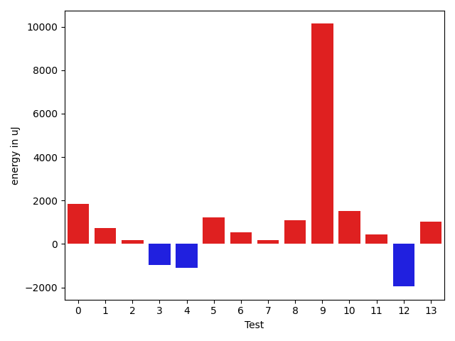

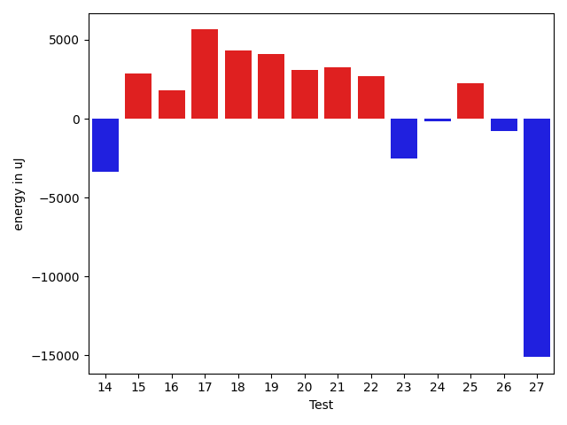

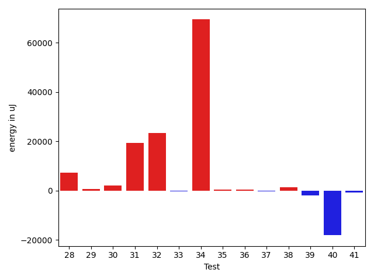

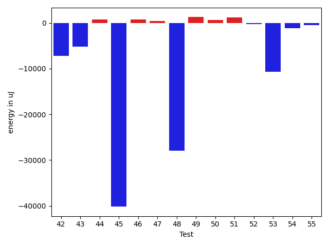

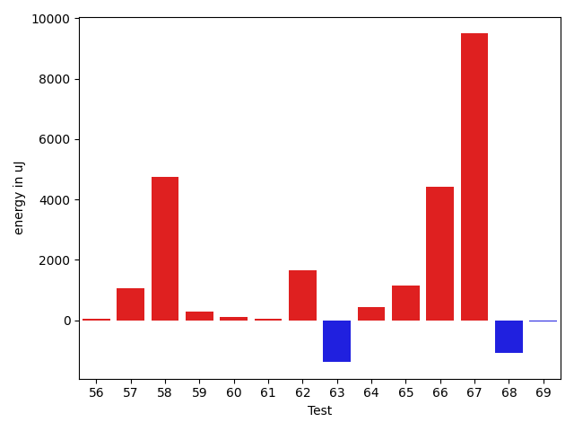

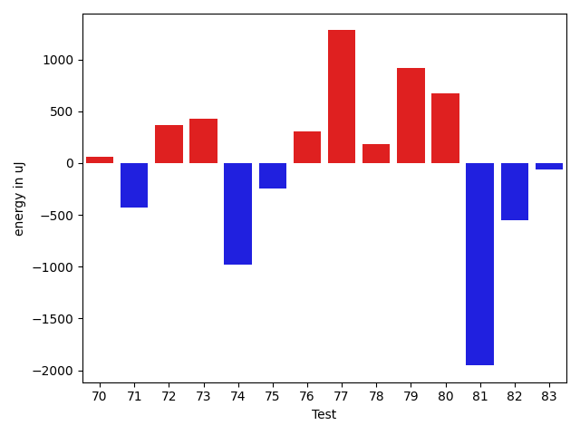

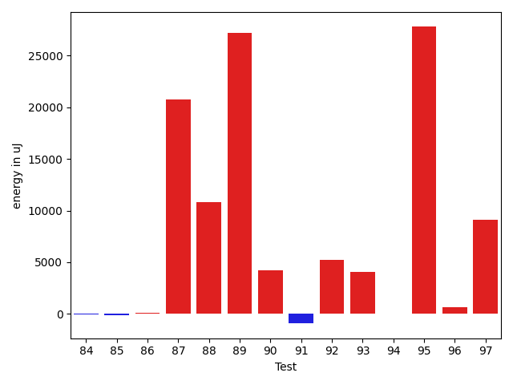

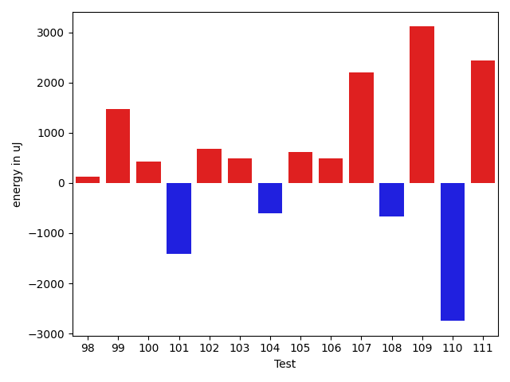

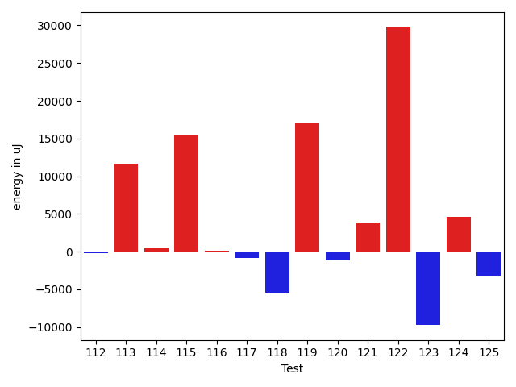

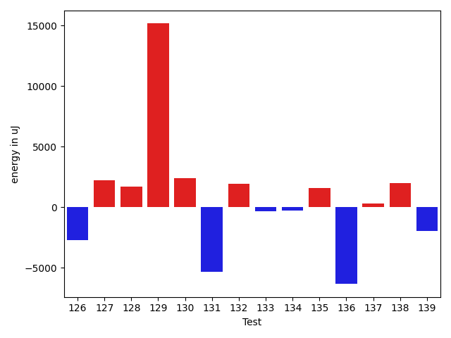

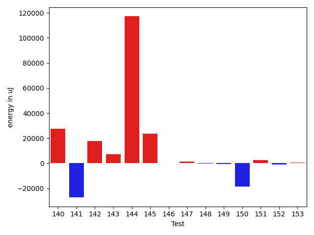

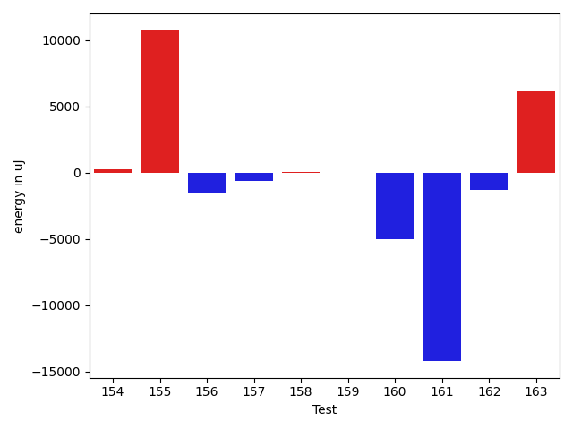

| ID | EnergyV1 | EnergyV2 | DeltaEnergy | σV1 | σV2 |
| --- | --- | --- | --- | --- | --- |
| 0 | 35034 | 36865 | 1831 | 3662.7883079817598 | 3721.2497760025876 |
| 1 | 39124 | 39856 | 732 | 82768.14419198936 | 55375.71291681866 |
| 2 | 36376 | 36560 | 184 | 8543.834326426124 | 10715.332322620974 |
| 3 | 38330 | 37353 | -977 | 375551.1438412666 | 490706.4077333963 |
| 4 | 37354 | 36254 | -1100 | 368696.88189100684 | 325058.5954568236 |
| 5 | 33935 | 35156 | 1221 | 3766.6181662030435 | 5179.20449870471 |
| 6 | 34302 | 34851 | 549 | 3380.9041270625953 | 3402.922724985424 |
| 7 | 35767 | 35950 | 183 | 11419.668434104042 | 7066.894353730402 |
| 8 | 33997 | 35095 | 1098 | 9268.511823243256 | 5498.77278706402 |
| 9 | 80444 | 90576 | 10132 | 66167.58105711204 | 71325.60896247985 |
| 10 | 33569 | 35095 | 1526 | 3189.1182291293435 | 3716.1857948173824 |
| 11 | 35583 | 36011 | 428 | 19335.772417090066 | 10430.2109525913 |
| 12 | 70556 | 68603 | -1953 | 25593.671821016807 | 27049.759790376505 |
| 13 | 35583 | 36621 | 1038 | 24948.20545698348 | 13016.824673186726 |
| 14 | 35827 | 35400 | -427 | 56014.49178570503 | 46127.854034146825 |
| 15 | 65856 | 65857 | 1 | 39323.89807121302 | 54291.81176383914 |
| 16 | 35461 | 36438 | 977 | 15438.2743194892 | 16965.255261118295 |
| 17 | 69641 | 70678 | 1037 | 33472.38215122834 | 42778.410751266114 |
| 18 | 34973 | 34790 | -183 | 7927.531328471645 | 28609.82177782514 |
| 19 | 33874 | 34424 | 550 | 2853.6865407295963 | 24442.93242417007 |
| 20 | 40162 | 39978 | -184 | 48102.69260357356 | 53292.62156389317 |
| 21 | 35400 | 36560 | 1160 | 7897.668444513701 | 11257.408151484939 |
| 22 | 36621 | 36072 | -549 | 61068.800948987286 | 64019.09056212785 |
| 23 | 37536 | 36316 | -1220 | 12336.597163284574 | 8156.021042811282 |
| 24 | 36316 | 34607 | -1709 | 7838.1843472177525 | 7953.539708507531 |
| 25 | 36987 | 37232 | 245 | 8971.072268254034 | 11277.976635599849 |
| 26 | 36988 | 37415 | 427 | 17493.667246078447 | 11786.784147377077 |
| 27 | 68054 | 43945 | -24109 | 95415.92939625419 | 70485.04584723721 |
| 28 | 37720 | 42114 | 4394 | 37835.32630795711 | 43479.99822259273 |
| 29 | 34302 | 35645 | 1343 | 4603.2100779376005 | 3620.228582444664 |
| 30 | 36866 | 37292 | 426 | 7692.477202568807 | 9901.708629192495 |
| 31 | 38208 | 37842 | -366 | 94663.95851656617 | 118808.1658208154 |
| 32 | 37049 | 37232 | 183 | 50460.857394859406 | 84245.72131289396 |
| 33 | 36682 | 36926 | 244 | 3966.017290368261 | 4722.87962249425 |
| 34 | 36438 | 38330 | 1892 | 321451.6119040753 | 484791.9071434406 |
| 35 | 36011 | 36193 | 182 | 2983.9710157528652 | 3390.631453234346 |
| 36 | 37537 | 36621 | -916 | 24490.82224132569 | 21354.754799892526 |
| 37 | 36194 | 35462 | -732 | 3427.3272145643405 | 3635.7614597990105 |
| 38 | 38208 | 39367 | 1159 | 26285.933938113267 | 19579.853070979396 |
| 39 | 37598 | 36254 | -1344 | 44186.1809877573 | 46972.2892986932 |
| 40 | 71289 | 66955 | -4334 | 55664.00611491368 | 44679.10991125947 |
| 41 | 35827 | 34424 | -1403 | 3321.581506695463 | 2904.660755131311 |
| 42 | 36438 | 34546 | -1892 | 24263.424320231337 | 10813.141039480643 |
| 43 | 37964 | 37414 | -550 | 19236.694250651395 | 16908.59213154609 |
| 44 | 35401 | 35888 | 487 | 3422.8145373767893 | 3836.9147824130782 |
| 45 | 39734 | 39612 | -122 | 106354.49935017955 | 11905.952926855596 |
| 46 | 36072 | 37170 | 1098 | 3889.0193921118757 | 4035.637112013768 |
| 47 | 36560 | 35462 | -1098 | 4019.408243448282 | 3361.790819260677 |
| 48 | 37170 | 36499 | -671 | 84507.24155217576 | 40349.73969748395 |
| 49 | 35766 | 37537 | 1771 | 4371.241361175245 | 3619.7640259146433 |
| 50 | 35279 | 36011 | 732 | 3900.1488337779924 | 4421.594289589265 |
| 51 | 34607 | 36804 | 2197 | 9228.940604807574 | 7548.500726006875 |
| 52 | 35584 | 35278 | -306 | 15857.009885201398 | 17253.548696891754 |
| 53 | 34668 | 33080 | -1588 | 54958.05559707553 | 8749.827412128814 |
| 54 | 35217 | 34546 | -671 | 3762.5033453100596 | 3302.2521271264422 |
| 55 | 33691 | 33386 | -305 | 3631.2845530471013 | 3159.057403720293 |
| 56 | 33997 | 33935 | -62 | 3426.7490598368345 | 3083.048931748498 |
| 57 | 34180 | 34424 | 244 | 3138.560251273243 | 6522.494109222659 |
| 58 | 36437 | 37171 | 734 | 14965.69667987927 | 18142.915634114528 |
| 59 | 33081 | 34057 | 976 | 3160.197680952643 | 2418.4608130134407 |
| 60 | 33630 | 34301 | 671 | 3593.5720706097804 | 2981.701365095479 |
| 61 | 34057 | 34668 | 611 | 25412.968430243247 | 26549.08064250095 |
| 62 | 35279 | 35095 | -184 | 14811.019690829511 | 17467.874754842742 |
| 63 | 34973 | 33447 | -1526 | 3593.7330445590355 | 3398.7538719118716 |
| 64 | 34241 | 34546 | 305 | 3310.827633195313 | 3298.267895251012 |
| 65 | 32470 | 34301 | 1831 | 3336.7796423329924 | 3207.0859748375938 |
| 66 | 33813 | 34057 | 244 | 7336.471351933487 | 29561.368651647266 |
| 67 | 36133 | 34912 | -1221 | 3969.6005536521625 | 61233.941531410666 |
| 68 | 34057 | 36133 | 2076 | 35690.28375054539 | 27303.36149596953 |
| 69 | 34484 | 34729 | 245 | 3818.567718608331 | 2638.136066491917 |
| 70 | 33509 | 33570 | 61 | 3632.926002140255 | 2920.5908464792296 |
| 71 | 35645 | 35217 | -428 | 13624.617507236886 | 12570.45937095269 |
| 72 | 38025 | 38391 | 366 | 166900.14962324695 | 117976.45800993255 |
| 73 | 34180 | 34607 | 427 | 42377.627900008614 | 6940.909337306672 |
| 74 | 34607 | 33630 | -977 | 6123.121714387094 | 3516.4073825973983 |
| 75 | 34362 | 34118 | -244 | 3300.996320098846 | 2807.8848808546677 |
| 76 | 34546 | 34851 | 305 | 3191.662973622071 | 3265.5596753168597 |
| 77 | 32349 | 33630 | 1281 | 2918.8139598813004 | 34434.78913927492 |
| 78 | 33936 | 34118 | 182 | 3472.708221257186 | 3254.454226509049 |
| 79 | 34302 | 35218 | 916 | 2710.8270610914574 | 3200.304911464371 |
| 80 | 33692 | 34363 | 671 | 2736.8581226167594 | 2738.221348045412 |
| 81 | 34973 | 33020 | -1953 | 2838.829903731172 | 3456.7637766921875 |
| 82 | 34057 | 33508 | -549 | 3835.2069821149503 | 2595.295417337772 |
| 83 | 33996 | 33935 | -61 | 2767.915305871671 | 6276.255397601665 |
| 84 | 34607 | 34485 | -122 | 2819.0281268988633 | 2627.0037282492185 |
| 85 | 34546 | 33509 | -1037 | 3208.349216410901 | 3482.0719157405247 |
| 86 | 34179 | 34485 | 306 | 2630.3905431935814 | 3240.7954060547117 |
| 87 | 37598 | 38025 | 427 | 454596.2600003012 | 469604.407253274 |
| 88 | 70190 | 73791 | 3601 | 40510.13512076079 | 129249.81367107401 |
| 89 | 77636 | 85937 | 8301 | 269798.3994834136 | 305159.2609651613 |
| 90 | 34668 | 35950 | 1282 | 21500.236132194183 | 35633.750055197 |
| 91 | 36377 | 34912 | -1465 | 35074.267559375585 | 42371.15519196728 |
| 92 | 35583 | 35339 | -244 | 3965.084604291808 | 28880.846804883684 |
| 93 | 34973 | 34668 | -305 | 4137.97919765438 | 22461.340212736428 |
| 94 | 34790 | 35034 | 244 | 4343.597943973278 | 3775.0327499196173 |
| 95 | 37231 | 36926 | -305 | 55645.605122346344 | 88815.11519790585 |
| 96 | 33935 | 36071 | 2136 | 3818.3565791472697 | 4140.733739192715 |
| 97 | 166992 | 161743 | -5249 | 282897.38400574645 | 322412.7577069239 |
| 98 | 35584 | 35706 | 122 | 6926.02006903578 | 25106.223366057704 |
| 99 | 37476 | 38940 | 1464 | 77447.35773797688 | 76530.2992389349 |
| 100 | 35217 | 35644 | 427 | 20245.99873867374 | 21846.389619601912 |
| 101 | 37232 | 35827 | -1405 | 36439.893128987205 | 27402.31297579945 |
| 102 | 34851 | 35523 | 672 | 3800.2180306640435 | 8343.801056240236 |
| 103 | 35705 | 36194 | 489 | 7586.948472437557 | 3768.9233351948096 |
| 104 | 36010 | 35400 | -610 | 3833.209486129837 | 3254.676011232261 |
| 105 | 38330 | 38941 | 611 | 26766.804095787833 | 20739.6107182599 |
| 106 | 36438 | 36927 | 489 | 6909.469580347844 | 3626.4431511759476 |
| 107 | 34729 | 36926 | 2197 | 3697.1309912592346 | 3226.501984553323 |
| 108 | 40100 | 39428 | -672 | 68183.32256656911 | 59012.6960411918 |
| 109 | 220886 | 223998 | 3112 | 80695.35535696537 | 94500.98497061223 |
| 110 | 321167 | 318420 | -2747 | 101050.30656838979 | 109733.38284069287 |
| 111 | 37720 | 40161 | 2441 | 69674.12067013852 | 52172.99630726209 |
| 112 | 34362 | 34973 | 611 | 3761.437952785219 | 3884.554536558857 |
| 113 | 34973 | 36682 | 1709 | 38464.07865750964 | 66008.04899351692 |
| 114 | 34912 | 35583 | 671 | 3970.146236109531 | 3372.9540570234863 |
| 115 | 37415 | 39062 | 1647 | 82454.749509059 | 98615.72070391287 |
| 116 | 34119 | 35279 | 1160 | 3897.8665693752346 | 3909.914072076317 |
| 117 | 35766 | 34668 | -1098 | 3848.393692878803 | 6657.370604074855 |
| 118 | 38025 | 34973 | -3052 | 24848.618505465558 | 8662.454693922678 |
| 119 | 35949 | 36926 | 977 | 10581.548277741493 | 85604.40242972942 |
| 120 | 36194 | 35339 | -855 | 3888.9680003857948 | 3433.8722843108844 |
| 121 | 37292 | 37536 | 244 | 10561.26177752135 | 15106.755356131636 |
| 122 | 38269 | 39428 | 1159 | 66028.79262176802 | 116494.65490757236 |
| 123 | 121093 | 116211 | -4882 | 103628.7048564732 | 104330.84409663522 |
| 124 | 36132 | 36011 | -121 | 3546.8438441459816 | 27967.673574199376 |
| 125 | 36987 | 36560 | -427 | 12234.74574764159 | 7865.190955745464 |
| 126 | 36682 | 38574 | 1892 | 59859.06873568512 | 62786.20481210851 |
| 127 | 35766 | 36926 | 1160 | 4745.7828036680985 | 3828.798750607436 |
| 128 | 37109 | 37475 | 366 | 3100.3496270582127 | 7185.402390650849 |
| 129 | 36011 | 38208 | 2197 | 31185.98507669882 | 52367.9558860225 |
| 130 | 36499 | 37781 | 1282 | 16608.085074319344 | 25756.764902617804 |
| 131 | 37415 | 37354 | -61 | 37933.25777940376 | 35460.82356934232 |
| 132 | 72265 | 76965 | 4700 | 22614.708110180924 | 20647.242301683345 |
| 133 | 34546 | 35339 | 793 | 7046.932032906874 | 3595.7172098522738 |
| 134 | 35583 | 35828 | 245 | 11877.23184511003 | 9808.541568335839 |
| 135 | 36682 | 36682 | 0 | 16157.206951896997 | 27378.824898942225 |
| 136 | 35828 | 35217 | -611 | 30387.927195219654 | 4664.416405677731 |
| 137 | 35522 | 36133 | 611 | 2768.332454055561 | 4455.503055415103 |
| 138 | 34851 | 36194 | 1343 | 3417.65386449535 | 3897.475003784457 |
| 139 | 37415 | 37109 | -306 | 31835.483009315074 | 34848.780961063174 |
| 140 | 36682 | 36560 | -122 | 3474.938025320003 | 91938.43128703251 |
| 141 | 38513 | 36866 | -1647 | 98098.50534327279 | 60307.814929139524 |
| 142 | 35522 | 36682 | 1160 | 3913.199987949965 | 57504.14688277847 |
| 143 | 36194 | 36011 | -183 | 4075.315715549642 | 40953.0651750803 |
| 144 | 37476 | 37292 | -184 | 17438.8018619072 | 376297.64898478554 |
| 145 | 35584 | 37231 | 1647 | 3565.88958185752 | 77272.73758181247 |
| 146 | 34973 | 36194 | 1221 | 4347.991839784341 | 4409.221680110324 |
| 147 | 35889 | 35645 | -244 | 3395.435168630819 | 3343.4621053632413 |
| 148 | 36560 | 37170 | 610 | 27237.001334869492 | 29483.75099217283 |
| 149 | 39673 | 39062 | -611 | 17922.5950537192 | 24537.729583809858 |
| 150 | 40161 | 39001 | -1160 | 78985.70529232016 | 68279.84521307443 |
| 151 | 34973 | 35827 | 854 | 4094.2483194999786 | 23157.058453987185 |
| 152 | 34668 | 34668 | 0 | 4608.603966075739 | 3425.7447307118496 |
| 153 | 35949 | 34485 | -1464 | 4134.84583753603 | 4141.0511391662485 |
| 154 | 35034 | 33753 | -1281 | 3694.5611480685443 | 3631.2300197566665 |
| 155 | 36987 | 39184 | 2197 | 78949.23387173316 | 79184.34460718687 |
| 156 | 36804 | 35461 | -1343 | 6959.435358523317 | 7654.094164174389 |
| 157 | 39612 | 41748 | 2136 | 396236.6809829661 | 403520.19547225465 |
| 158 | 35523 | 36255 | 732 | 3958.2572573426955 | 3516.129879479681 |
| 159 | 35827 | 35096 | -731 | 3812.455983820853 | 3516.3973988539274 |
| 160 | 38574 | 35949 | -2625 | 17113.281250148488 | 11717.228919309378 |
| 161 | 37476 | 37537 | 61 | 65669.40091026771 | 45900.961414358724 |
| 162 | 38696 | 36743 | -1953 | 4427.061223454755 | 3784.3855992857852 |
| 163 | 37537 | 38147 | 610 | 51515.11876014453 | 60037.699985113504 |

## Delta Duration per test method

| ID | DurationV1 | DurationsV2 | DeltaDuration |
| --- | --- | --- | --- |
| 0 | 858172.3265306122 | 743800.5833333334 | -114371.74319727882 |
| 1 | 2154887.0 | 1759663.2142857143 | -395223.7857142857 |
| 2 | 1167680.1136363635 | 1181974.987804878 | 14294.874168514507 |
| 3 | 2975256.230769231 | 4315325.847457627 | 1340069.6166883959 |
| 4 | 3103584.3333333335 | 2245684.926829268 | -857899.4065040653 |
| 5 | 1038405.8108108108 | 953687.2058823529 | -84718.60492845788 |
| 6 | 823542.1166666667 | 834315.1 | 10772.983333333279 |
| 7 | 1278778.7634408602 | 1271498.978021978 | -7279.785418882268 |
| 8 | 1063184.9866666666 | 1066228.6075949366 | 3043.620928270044 |
| 9 | 3217270.525252525 | 3257825.707070707 | 40555.18181818165 |
| 10 | 517932.8095238095 | 493679.9032258064 | -24252.9062980031 |
| 11 | 1467466.0108695652 | 1213324.0555555555 | -254141.95531400968 |
| 12 | 2362653.777777778 | 2413154.1919191917 | 50500.414141413756 |
| 13 | 1438348.1546391752 | 1330612.9583333333 | -107735.1963058419 |
| 14 | 1583354.7674418604 | 1482455.2 | -100899.56744186045 |
| 15 | 2328591.4545454546 | 2320850.1919191917 | -7741.262626262847 |
| 16 | 1326785.1379310344 | 1367600.8795180724 | 40815.74158703792 |
| 17 | 2495299.8282828284 | 2680458.8282828284 | 185159.0 |
| 18 | 1235285.5813953488 | 1348391.945054945 | 113106.3636595963 |
| 19 | 863357.0196078431 | 925508.723076923 | 62151.70346907992 |
| 20 | 1918397.06185567 | 2019606.0404040404 | 101208.9785483703 |
| 21 | 884468.8846153846 | 1025508.9411764706 | 141040.05656108598 |
| 22 | 1491598.638888889 | 1661807.3387096773 | 170208.69982078834 |
| 23 | 859992.380952381 | 763136.0 | -96856.38095238095 |
| 24 | 808014.9285714285 | 882830.5384615385 | 74815.60989010998 |
| 25 | 1125675.0 | 1045216.2461538462 | -80458.75384615385 |
| 26 | 1040994.9107142857 | 1010333.509090909 | -30661.401623376645 |
| 27 | 2894328.1515151514 | 2410335.121212121 | -483993.0303030303 |
| 28 | 1699180.0428571429 | 1886154.1506849315 | 186974.10782778868 |
| 29 | 646271.2058823529 | 677108.1458333334 | 30836.93995098048 |
| 30 | 1207120.9428571428 | 1223983.2394366197 | 16862.29657947691 |
| 31 | 1793673.5172413792 | 2547789.0 | 754115.4827586208 |
| 32 | 1247159.6511627906 | 2045877.657142857 | 798718.0059800665 |
| 33 | 640818.225 | 744322.5357142857 | 103504.3107142857 |
| 34 | 2730508.808219178 | 4777260.2625 | 2046751.454280822 |
| 35 | 693524.2631578947 | 675709.6052631579 | -17814.657894736854 |
| 36 | 963304.0769230769 | 983989.3863636364 | 20685.309440559475 |
| 37 | 925935.75 | 982151.1612903225 | 56215.41129032255 |
| 38 | 1628652.0408163266 | 1622135.6875 | -6516.353316326626 |
| 39 | 1270815.5892857143 | 1249499.3207547169 | -21316.268530997448 |
| 40 | 2868632.4242424243 | 2264654.515151515 | -603977.9090909092 |
| 41 | 467896.3076923077 | 460866.64 | -7029.667692307674 |
| 42 | 1378879.9875 | 1177813.810810811 | -201066.17668918916 |
| 43 | 1533957.8673469387 | 1384992.6489361702 | -148965.21841076855 |
| 44 | 461375.82608695654 | 425454.15 | -35921.67608695652 |
| 45 | 2631888.84375 | 1288793.294117647 | -1343095.549632353 |
| 46 | 514685.6666666667 | 521840.1111111111 | 7154.444444444438 |
| 47 | 481451.8 | 462255.4210526316 | -19196.378947368416 |
| 48 | 2071093.9705882352 | 1029865.0746268657 | -1041228.8959613695 |
| 49 | 644303.4848484849 | 701505.8484848485 | 57202.36363636365 |
| 50 | 484358.7272727273 | 386643.44444444444 | -97715.28282828286 |
| 51 | 891701.4583333334 | 675351.6052631579 | -216349.8530701755 |
| 52 | 1372853.1375 | 1369057.0689655172 | -3796.068534482736 |
| 53 | 1066091.2653061224 | 735585.0857142857 | -330506.17959183664 |
| 54 | 552593.2142857143 | 552170.5277777778 | -422.68650793656707 |
| 55 | 734273.3260869565 | 773613.32 | 39339.99391304341 |
| 56 | 508241.0869565217 | 533591.8 | 25350.713043478318 |
| 57 | 991183.5151515151 | 988675.3676470588 | -2508.1475044563413 |
| 58 | 1531594.2291666667 | 1592537.0104166667 | 60942.78125 |
| 59 | 842724.3773584906 | 827801.125 | -14923.252358490601 |
| 60 | 523426.1 | 535317.0357142857 | 11890.935714285704 |
| 61 | 1444321.0 | 1460291.107142857 | 15970.107142857043 |
| 62 | 1176135.696969697 | 1243897.0909090908 | 67761.3939393938 |
| 63 | 569859.6333333333 | 537504.03125 | -32355.602083333302 |
| 64 | 715228.7826086957 | 710435.0952380953 | -4793.687370600412 |
| 65 | 548486.4411764706 | 610295.8 | 61809.358823529445 |
| 66 | 733785.8965517242 | 849109.78125 | 115323.88469827583 |
| 67 | 631583.2777777778 | 1030195.3333333334 | 398612.0555555556 |
| 68 | 906250.5555555555 | 1007210.3928571428 | 100959.83730158734 |
| 69 | 571425.6923076923 | 579769.3461538461 | 8343.653846153873 |
| 70 | 782532.4210526316 | 825141.9107142857 | 42609.48966165411 |
| 71 | 1129237.609375 | 1112253.410958904 | -16984.198416095925 |
| 72 | 3060160.6666666665 | 2165208.3 | -894952.3666666667 |
| 73 | 887429.8787878788 | 729006.28125 | -158423.59753787878 |
| 74 | 776513.8297872341 | 757933.9761904762 | -18579.853596757865 |
| 75 | 560068.8857142857 | 561431.5909090909 | 1362.705194805283 |
| 76 | 438955.2727272727 | 462063.9166666667 | 23108.64393939398 |
| 77 | 554581.8928571428 | 770142.4285714285 | 215560.53571428568 |
| 78 | 848952.1964285715 | 839786.1515151515 | -9166.044913419988 |
| 79 | 653458.9024390244 | 692490.1590909091 | 39031.25665188464 |
| 80 | 552383.0 | 550286.3333333334 | -2096.666666666628 |
| 81 | 661648.3235294118 | 694323.0 | 32674.676470588194 |
| 82 | 558927.6428571428 | 542105.2692307692 | -16822.373626373592 |
| 83 | 649568.5161290322 | 759436.5945945946 | 109868.07846556231 |
| 84 | 469117.1666666667 | 449669.0588235294 | -19448.107843137288 |
| 85 | 468060.1111111111 | 460670.5 | -7389.611111111124 |
| 86 | 463920.9583333333 | 505333.6923076923 | 41412.733974359 |
| 87 | 3880009.5945945946 | 4627000.7402597405 | 746991.145665146 |
| 88 | 2684411.9696969697 | 2857578.8484848486 | 173166.8787878789 |
| 89 | 4528166.3263157895 | 5475048.237113402 | 946881.9107976127 |
| 90 | 1080123.4285714286 | 1175241.0204081633 | 95117.59183673467 |
| 91 | 889725.1 | 796234.8846153846 | -93490.21538461535 |
| 92 | 616842.4848484849 | 832040.1153846154 | 215197.6305361305 |
| 93 | 633916.2424242424 | 743801.4390243902 | 109885.19660014776 |
| 94 | 579989.1 | 579529.2702702703 | -459.8297297296813 |
| 95 | 1386452.138888889 | 2169167.6666666665 | 782715.5277777775 |
| 96 | 616862.5172413794 | 659100.3 | 42237.782758620684 |
| 97 | 7405052.323232323 | 7670942.777777778 | 265890.45454545505 |
| 98 | 1014775.2 | 1022769.3636363636 | 7994.1636363636935 |
| 99 | 1624972.3833333333 | 1902443.0588235294 | 277470.6754901961 |
| 100 | 1082795.7419354839 | 1114854.552238806 | 32058.81030332204 |
| 101 | 1316123.1081081082 | 1129608.7297297297 | -186514.37837837846 |
| 102 | 776395.0930232558 | 743360.5227272727 | -33034.57029598311 |
| 103 | 905472.9122807018 | 895115.9523809524 | -10356.959899749374 |
| 104 | 853348.5869565217 | 846054.1739130435 | -7294.413043478271 |
| 105 | 1413564.3606557378 | 1459904.9180327868 | 46340.557377049 |
| 106 | 914414.9016393443 | 637854.8125 | -276560.0891393443 |
| 107 | 582286.9629629629 | 591805.2 | 9518.237037037034 |
| 108 | 2086750.1136363635 | 1945398.3152173914 | -141351.79841897218 |
| 109 | 7140516.757575758 | 7254591.282828283 | 114074.52525252476 |
| 110 | 9646151.383838383 | 9486241.161616161 | -159910.22222222202 |
| 111 | 2356719.121212121 | 2068548.0303030303 | -288171.0909090908 |
| 112 | 679123.4571428571 | 719891.9 | 40768.44285714289 |
| 113 | 1110316.9047619049 | 1393770.2826086956 | 283453.3778467907 |
| 114 | 758121.2307692308 | 851177.8292682926 | 93056.59849906189 |
| 115 | 1502368.5172413792 | 2114243.15625 | 611874.6390086208 |
| 116 | 596074.8285714285 | 617131.6785714285 | 21056.849999999977 |
| 117 | 920606.9824561403 | 950256.4363636364 | 29649.453907496063 |
| 118 | 829514.3181818182 | 873247.119047619 | 43732.80086580082 |
| 119 | 1154267.0253164556 | 1977564.3797468354 | 823297.3544303798 |
| 120 | 602114.0277777778 | 630494.447368421 | 28380.419590643258 |
| 121 | 905882.9629629629 | 1191558.2068965517 | 285675.24393358873 |
| 122 | 1866317.2258064516 | 2597882.525 | 731565.2991935483 |
| 123 | 4958953.782608695 | 4532115.270588235 | -426838.51202046033 |
| 124 | 781890.3103448276 | 876260.1228070175 | 94369.81246218993 |
| 125 | 1015891.4528301887 | 964356.9230769231 | -51534.52975326555 |
| 126 | 1755713.576923077 | 1594242.5714285714 | -161471.00549450563 |
| 127 | 621372.5142857142 | 625932.8 | 4560.285714285797 |
| 128 | 557990.8 | 655546.5294117647 | 97555.72941176465 |
| 129 | 861701.0238095238 | 1324296.319148936 | 462595.2953394123 |
| 130 | 1225950.7027027027 | 1318415.5833333333 | 92464.88063063053 |
| 131 | 1319533.0526315789 | 1248902.9696969697 | -70630.08293460915 |
| 132 | 2670254.626262626 | 2650675.707070707 | -19578.919191919267 |
| 133 | 960582.8059701492 | 931609.2448979592 | -28973.56107219006 |
| 134 | 1128073.4246575343 | 1087709.8648648649 | -40363.55979266949 |
| 135 | 1072647.68852459 | 1110923.125 | 38275.43647540989 |
| 136 | 1109274.7936507936 | 866354.8333333334 | -242919.96031746024 |
| 137 | 671206.7105263158 | 693748.9655172414 | 22542.254990925547 |
| 138 | 629281.59375 | 652673.6052631579 | 23392.011513157864 |
| 139 | 1526352.95 | 1394515.3333333333 | -131837.6166666667 |
| 140 | 844512.7735849057 | 1793185.1875 | 948672.4139150943 |
| 141 | 2167687.2391304346 | 1300842.25 | -866844.9891304346 |
| 142 | 724838.7857142857 | 1367538.4680851065 | 642699.6823708208 |
| 143 | 657411.5 | 1014700.65625 | 357289.15625 |
| 144 | 951532.8611111111 | 4728377.260869565 | 3776844.3997584544 |
| 145 | 629551.65 | 1513644.9333333333 | 884093.2833333333 |
| 146 | 792902.725490196 | 739444.4468085107 | -53458.27868168533 |
| 147 | 624967.90625 | 587475.8666666667 | -37492.0395833333 |
| 148 | 1580280.1379310344 | 1532870.4404761905 | -47409.6974548439 |
| 149 | 1279640.72 | 1212046.488372093 | -67594.2316279069 |
| 150 | 2489150.1515151514 | 1642432.7837837837 | -846717.3677313677 |
| 151 | 805237.2666666667 | 835660.948275862 | 30423.681609195308 |
| 152 | 563381.0645161291 | 545506.76 | -17874.30451612908 |
| 153 | 774721.1739130435 | 755982.0454545454 | -18739.128458498046 |
| 154 | 565769.8888888889 | 537155.3939393939 | -28614.494949494954 |
| 155 | 1640036.8688524591 | 1934246.8333333333 | 294209.9644808741 |
| 156 | 732429.1860465116 | 912871.6176470588 | 180442.43160054716 |
| 157 | 3854151.6470588236 | 4083421.6438356163 | 229269.9967767927 |
| 158 | 599655.7142857143 | 542234.4137931034 | -57421.3004926109 |
| 159 | 507360.6285714286 | 557927.7222222222 | 50567.09365079366 |
| 160 | 988227.5714285715 | 786812.5 | -201415.07142857148 |
| 161 | 1625948.2 | 1143923.4 | -482024.80000000005 |
| 162 | 638471.6363636364 | 618546.2571428572 | -19925.37922077917 |
| 163 | 1201478.076923077 | 1356688.0392156863 | 155209.96229260927 |

## Misc.

| ID | Test Class | Test Method |
| --- | --- | --- |
| 0 | com.google.gson.functional.CustomDeserializerTest | testDefaultConstructorNotCalledOnField |
| 1 | com.google.gson.functional.CustomDeserializerTest | testDefaultConstructorNotCalledOnObject |
| 2 | com.google.gson.functional.CustomDeserializerTest | testJsonTypeFieldBasedDeserialization |
| 3 | com.google.gson.FunctionWithInternalDependenciesTest | testUserDefinedExclusionPolicies |
| 4 | com.google.gson.FunctionWithInternalDependenciesTest | testAnonymousLocalClassesSerialization |
| 5 | com.google.gson.functional.ParameterizedTypesTest | testParameterizedTypeGenericArraysSerialization |
| 6 | com.google.gson.functional.ParameterizedTypesTest | testParameterizedTypesWithWriterSerialization |
| 7 | com.google.gson.functional.ParameterizedTypesTest | testVariableTypeArrayDeserialization |
| 8 | com.google.gson.functional.ParameterizedTypesTest | testParameterizedTypeWithReaderDeserialization |
| 9 | com.google.gson.functional.ParameterizedTypesTest | testParameterizedTypesSerialization |
| 10 | com.google.gson.functional.ParameterizedTypesTest | testDeepParameterizedTypeSerialization |
| 11 | com.google.gson.functional.ParameterizedTypesTest | testVariableTypeDeserialization |
| 12 | com.google.gson.functional.ParameterizedTypesTest | testVariableTypeFieldsAndGenericArraysSerialization |
| 13 | com.google.gson.functional.ParameterizedTypesTest | testParameterizedTypeGenericArraysDeserialization |
| 14 | com.google.gson.functional.ParameterizedTypesTest | testParameterizedTypeDeserialization |
| 15 | com.google.gson.functional.ParameterizedTypesTest | testVariableTypeFieldsAndGenericArraysDeserialization |
| 16 | com.google.gson.functional.ParameterizedTypesTest | testTypesWithMultipleParametersDeserialization |
| 17 | com.google.gson.functional.ParameterizedTypesTest | testTypesWithMultipleParametersSerialization |
| 18 | com.google.gson.functional.ParameterizedTypesTest | testParameterizedTypeWithVariableTypeDeserialization |
| 19 | com.google.gson.functional.ParameterizedTypesTest | testDeepParameterizedTypeDeserialization |
| 20 | com.google.gson.functional.CircularReferenceTest | testCircularSerialization |
| 21 | com.google.gson.functional.CircularReferenceTest | testDirectedAcyclicGraphSerialization |
| 22 | com.google.gson.functional.CircularReferenceTest | testDirectedAcyclicGraphDeserialization |
| 23 | com.google.gson.functional.CircularReferenceTest | testSelfReferenceSerialization |
| 24 | com.google.gson.functional.CircularReferenceTest | testSelfReferenceArrayFieldSerialization |
| 25 | com.google.gson.functional.PrettyPrintingTest | testEmptyMapField |
| 26 | com.google.gson.functional.PrettyPrintingTest | testPrettyPrintArrayOfObjects |
| 27 | com.google.gson.functional.PrettyPrintingTest | testPrettyPrintList |
| 28 | com.google.gson.functional.MapTest | testMapSerializationWithNullValues |
| 29 | com.google.gson.functional.MapTest | testMapSerializationWithNullValuesSerialized |
| 30 | com.google.gson.functional.ReadersWritersTest | testReadWriteTwoObjects |
| 31 | com.google.gson.functional.ReadersWritersTest | testWriterForSerialization |
| 32 | com.google.gson.functional.ReadersWritersTest | testReaderForDeserialization |
| 33 | com.google.gson.functional.FieldExclusionTest | testDefaultNestedStaticClassIncluded |
| 34 | com.google.gson.functional.FieldExclusionTest | testDefaultInnerClassExclusion |
| 35 | com.google.gson.functional.CollectionTest | testRawCollectionSerialization |
| 36 | com.google.gson.functional.CollectionTest | testCollectionOfBagOfPrimitivesSerialization |
| 37 | com.google.gson.functional.CollectionTest | testSetDeserialization |
| 38 | com.google.gson.functional.CollectionTest | testWildcardCollectionField |
| 39 | com.google.gson.functional.CollectionTest | testSetSerialization |
| 40 | com.google.gson.functional.InheritanceTest | testSubInterfacesOfCollectionSerialization |
| 41 | com.google.gson.functional.InheritanceTest | testBaseSerializedAsSubWhenSpecifiedWithExplicitTypeForToJsonMethod |
| 42 | com.google.gson.functional.InheritanceTest | testSubInterfacesOfCollectionDeserialization |
| 43 | com.google.gson.functional.InheritanceTest | testSubClassSerialization |
| 44 | com.google.gson.functional.InheritanceTest | testBaseSerializedAsSubWhenSpecifiedWithExplicitType |
| 45 | com.google.gson.functional.InheritanceTest | testBaseSerializedAsBaseWhenSpecifiedWithExplicitTypeForToJsonMethod |
| 46 | com.google.gson.functional.InheritanceTest | testBaseSerializedAsSubForToJsonMethod |
| 47 | com.google.gson.functional.InheritanceTest | testBaseSerializedAsSub |
| 48 | com.google.gson.functional.InheritanceTest | testSubClassDeserialization |
| 49 | com.google.gson.functional.InheritanceTest | testClassWithBaseFieldSerialization |
| 50 | com.google.gson.functional.InheritanceTest | testBaseSerializedAsBaseWhenSpecifiedWithExplicitType |
| 51 | com.google.gson.functional.InheritanceTest | testClassWithBaseArrayFieldSerialization |
| 52 | com.google.gson.functional.ObjectTest | testArrayOfArraysDeserialization |
| 53 | com.google.gson.functional.ObjectTest | testClassWithTransientFieldsDeserialization |
| 54 | com.google.gson.functional.ObjectTest | testClassWithTransientFieldsDeserializationTransientFieldsPassedInJsonAreIgnored |
| 55 | com.google.gson.functional.ObjectTest | testInnerClassSerialization |
| 56 | com.google.gson.functional.ObjectTest | testClassWithObjectFieldSerialization |
| 57 | com.google.gson.functional.ObjectTest | testArrayOfObjectsDeserialization |
| 58 | com.google.gson.functional.ObjectTest | testArrayOfArraysSerialization |
| 59 | com.google.gson.functional.ObjectTest | testArrayOfObjectsSerialization |
| 60 | com.google.gson.functional.ObjectTest | testStringFieldWithEmptyValueDeserialization |
| 61 | com.google.gson.functional.ObjectTest | testEmptyCollectionInAnObjectDeserialization |
| 62 | com.google.gson.functional.ObjectTest | testStringFieldWithNumberValueDeserialization |
| 63 | com.google.gson.functional.ObjectTest | testPrivateNoArgConstructorDeserialization |
| 64 | com.google.gson.functional.ObjectTest | testPrimitiveArrayInAnObjectDeserialization |
| 65 | com.google.gson.functional.ObjectTest | testObjectFieldNamesWithoutQuotesDeserialization |
| 66 | com.google.gson.functional.ObjectTest | testBagOfPrimitivesSerialization |
| 67 | com.google.gson.functional.ObjectTest | testJsonInMixedQuotesDeserialization |
| 68 | com.google.gson.functional.ObjectTest | testClassWithTransientFieldsSerialization |
| 69 | com.google.gson.functional.ObjectTest | testNullPrimitiveFieldsDeserialization |
| 70 | com.google.gson.functional.ObjectTest | testInnerClassDeserialization |
| 71 | com.google.gson.functional.ObjectTest | testArrayOfObjectsAsFields |
| 72 | com.google.gson.functional.ObjectTest | testJsonInSingleQuotesDeserialization |
| 73 | com.google.gson.functional.ObjectTest | testBagOfPrimitivesDeserialization |
| 74 | com.google.gson.functional.ObjectTest | testNestedSerialization |
| 75 | com.google.gson.functional.ObjectTest | testNullFieldsSerialization |
| 76 | com.google.gson.functional.ObjectTest | testClassWithNoFieldsDeserialization |
| 77 | com.google.gson.functional.ObjectTest | testStringFieldWithEmptyValueSerialization |
| 78 | com.google.gson.functional.ObjectTest | testNestedDeserialization |
| 79 | com.google.gson.functional.ObjectTest | testNullFieldsDeserialization |
| 80 | com.google.gson.functional.ObjectTest | testNullArraysDeserialization |
| 81 | com.google.gson.functional.ObjectTest | testBagOfPrimitiveWrappersSerialization |
| 82 | com.google.gson.functional.ObjectTest | testEmptyCollectionInAnObjectSerialization |
| 83 | com.google.gson.functional.ObjectTest | testBagOfPrimitiveWrappersDeserialization |
| 84 | com.google.gson.functional.ObjectTest | testClassWithNoFieldsSerialization |
| 85 | com.google.gson.functional.ObjectTest | testPrimitiveArrayFieldSerialization |
| 86 | com.google.gson.functional.ObjectTest | testNullObjectFieldsDeserialization |
| 87 | com.google.gson.JsonParserTest | testReadWriteTwoObjects |
| 88 | com.google.gson.functional.NamingPolicyTest | testGsonWithNonDefaultFieldNamingPolicySerialization |
| 89 | com.google.gson.functional.NamingPolicyTest | testGsonDuplicateNameUsingSerializedNameFieldNamingPolicySerialization |
| 90 | com.google.gson.functional.NamingPolicyTest | testGsonWithSerializedNameFieldNamingPolicySerialization |
| 91 | com.google.gson.functional.NamingPolicyTest | testGsonWithLowerCaseUnderscorePolicySerialization |
| 92 | com.google.gson.functional.NamingPolicyTest | testGsonWithSerializedNameFieldNamingPolicyDeserialization |
| 93 | com.google.gson.functional.NamingPolicyTest | testGsonWithLowerCaseDashPolicyDeserialiation |
| 94 | com.google.gson.functional.NamingPolicyTest | testGsonWithLowerCaseDashPolicySerialization |
| 95 | com.google.gson.functional.NamingPolicyTest | testGsonWithNonDefaultFieldNamingPolicyDeserialiation |
| 96 | com.google.gson.functional.NamingPolicyTest | testGsonWithLowerCaseUnderscorePolicyDeserialiation |
| 97 | com.google.gson.functional.VersioningTest | testVersionedUntilSerialization |
| 98 | com.google.gson.functional.VersioningTest | testVersionedGsonMixingSinceAndUntilSerialization |
| 99 | com.google.gson.functional.VersioningTest | testVersionedUntilDeserialization |
| 100 | com.google.gson.functional.VersioningTest | testVersionedGsonMixingSinceAndUntilDeserialization |
| 101 | com.google.gson.functional.VersioningTest | testVersionedGsonWithUnversionedClassesSerialization |
| 102 | com.google.gson.functional.VersioningTest | testVersionedGsonWithUnversionedClassesDeserialization |
| 103 | com.google.gson.functional.VersioningTest | testVersionedClassesDeserialization |
| 104 | com.google.gson.functional.VersioningTest | testVersionedClassesSerialization |
| 105 | com.google.gson.functional.ArrayTest | testObjectArrayWithNonPrimitivesSerialization |
| 106 | com.google.gson.functional.EnumTest | testClassWithEnumFieldSerialization |
| 107 | com.google.gson.functional.EnumTest | testClassWithEnumFieldDeserialization |
| 108 | com.google.gson.functional.ConcurrencyTest | testSingleThreadSerialization |
| 109 | com.google.gson.functional.ConcurrencyTest | testMultiThreadSerialization |
| 110 | com.google.gson.functional.ConcurrencyTest | testMultiThreadDeserialization |
| 111 | com.google.gson.functional.ConcurrencyTest | testSingleThreadDeserialization |
| 112 | com.google.gson.functional.JsonParserTest | testBadFieldTypeForCustomDeserializerCustomTree |
| 113 | com.google.gson.functional.JsonParserTest | testChangingCustomTreeAndDeserializing |
| 114 | com.google.gson.functional.JsonParserTest | testBadFieldTypeForDeserializingCustomTree |
| 115 | com.google.gson.functional.JsonParserTest | testDeserializingCustomTree |
| 116 | com.google.gson.functional.DefaultTypeAdaptersTest | testBigIntegerFieldDeserialization |
| 117 | com.google.gson.functional.DefaultTypeAdaptersTest | testBigIntegerFieldSerialization |
| 118 | com.google.gson.functional.DefaultTypeAdaptersTest | testUrlNullDeserialization |
| 119 | com.google.gson.functional.DefaultTypeAdaptersTest | testUrlNullSerialization |
| 120 | com.google.gson.functional.DefaultTypeAdaptersTest | testBigDecimalFieldDeserialization |
| 121 | com.google.gson.functional.DefaultTypeAdaptersTest | testBigDecimalFieldSerialization |
| 122 | com.google.gson.functional.ExposeFieldsTest | testExposeAnnotationSerialization |
| 123 | com.google.gson.functional.ExposeFieldsTest | testNullExposeFieldSerialization |
| 124 | com.google.gson.functional.ExposeFieldsTest | testNoExposedFieldDeserialization |
| 125 | com.google.gson.functional.ExposeFieldsTest | testArrayWithOneNullExposeFieldObjectSerialization |
| 126 | com.google.gson.functional.ExposeFieldsTest | testExposeAnnotationDeserialization |
| 127 | com.google.gson.functional.ExposeFieldsTest | testExposedInterfaceFieldDeserialization |
| 128 | com.google.gson.functional.ExposeFieldsTest | testNoExposedFieldSerialization |
| 129 | com.google.gson.functional.ExposeFieldsTest | testExposedInterfaceFieldSerialization |
| 130 | com.google.gson.functional.EscapingTest | testGsonAcceptsEscapedAndNonEscapedJsonDeserialization |
| 131 | com.google.gson.functional.EscapingTest | testEscapingObjectFields |
| 132 | com.google.gson.functional.CustomTypeAdaptersTest | testCustomTypeAdapterDoesNotAppliesToSubClasses |
| 133 | com.google.gson.functional.CustomTypeAdaptersTest | testCustomSerializerForLong |
| 134 | com.google.gson.functional.CustomTypeAdaptersTest | testCustomDeserializerForLong |
| 135 | com.google.gson.functional.CustomTypeAdaptersTest | testCustomNestedSerializers |
| 136 | com.google.gson.functional.CustomTypeAdaptersTest | testCustomNestedDeserializers |
| 137 | com.google.gson.functional.CustomTypeAdaptersTest | testEnsureCustomSerializerNotInvokedForNullValues |
| 138 | com.google.gson.functional.CustomTypeAdaptersTest | testEnsureCustomDeserializerNotInvokedForNullValues |
| 139 | com.google.gson.functional.JsonTreeTest | testJsonTreeToString |
| 140 | com.google.gson.functional.JsonTreeTest | testToJsonTreeObjectType |
| 141 | com.google.gson.functional.JsonTreeTest | testToJsonTree |
| 142 | com.google.gson.functional.SecurityTest | testNonExecutableJsonDeserialization |
| 143 | com.google.gson.functional.SecurityTest | testJsonWithNonExectuableTokenWithConfiguredGsonDeserialization |
| 144 | com.google.gson.functional.SecurityTest | testNonExecutableJsonSerialization |
| 145 | com.google.gson.functional.SecurityTest | testJsonWithNonExectuableTokenWithRegularGsonDeserialization |
| 146 | com.google.gson.functional.NullObjectAndFieldTest | testNullWrappedPrimitiveMemberSerialization |
| 147 | com.google.gson.functional.NullObjectAndFieldTest | testExplicitNullSetsFieldToNullDuringDeserialization |
| 148 | com.google.gson.functional.NullObjectAndFieldTest | testExplicitSerializationOfNullArrayMembers |
| 149 | com.google.gson.functional.NullObjectAndFieldTest | testExplicitDeserializationOfNulls |
| 150 | com.google.gson.functional.NullObjectAndFieldTest | testExplicitSerializationOfNulls |
| 151 | com.google.gson.functional.NullObjectAndFieldTest | testNullWrappedPrimitiveMemberDeserialization |
| 152 | com.google.gson.functional.NullObjectAndFieldTest | testExplicitSerializationOfNullStringMembers |
| 153 | com.google.gson.functional.NullObjectAndFieldTest | testPrintPrintingObjectWithNulls |
| 154 | com.google.gson.functional.NullObjectAndFieldTest | testExplicitSerializationOfNullCollectionMembers |
| 155 | com.google.gson.functional.PrintFormattingTest | testCompactFormattingLeavesNoWhiteSpace |
| 156 | com.google.gson.functional.CustomSerializerTest | testSubClassSerializerInvokedForBaseClassFieldsHoldingArrayOfSubClassInstances |
| 157 | com.google.gson.functional.CustomSerializerTest | testSubClassSerializerInvokedForBaseClassFieldsHoldingSubClassInstances |
| 158 | com.google.gson.functional.CustomSerializerTest | testBaseClassSerializerInvokedForBaseClassFields |
| 159 | com.google.gson.functional.CustomSerializerTest | testBaseClassSerializerInvokedForBaseClassFieldsHoldingSubClassInstances |
| 160 | com.google.gson.functional.UncategorizedTest | testStaticFieldsAreNotSerialized |
| 161 | com.google.gson.functional.UncategorizedTest | testObjectEqualButNotSameSerialization |
| 162 | com.google.gson.functional.InterfaceTest | testSerializingInterfaceObjectField |
| 163 | com.google.gson.functional.InterfaceTest | testSerializingObjectImplementingInterface |

| Test | IterationV1 | IterationV2 | DeltaIteration |
| --- | --- | --- | --- |
| 0 | 49 | 48 | -1 |
| 1 | 98 | 98 | 0 |
| 2 | 88 | 82 | -6 |
| 3 | 65 | 59 | -6 |
| 4 | 48 | 41 | -7 |
| 5 | 74 | 68 | -6 |
| 6 | 60 | 60 | 0 |
| 7 | 93 | 91 | -2 |
| 8 | 75 | 79 | 4 |
| 9 | 99 | 99 | 0 |
| 10 | 21 | 31 | 10 |
| 11 | 92 | 90 | -2 |
| 12 | 99 | 99 | 0 |
| 13 | 97 | 96 | -1 |
| 14 | 86 | 90 | 4 |
| 15 | 99 | 99 | 0 |
| 16 | 87 | 83 | -4 |
| 17 | 99 | 99 | 0 |
| 18 | 86 | 91 | 5 |
| 19 | 51 | 65 | 14 |
| 20 | 97 | 99 | 2 |
| 21 | 52 | 51 | -1 |
| 22 | 72 | 62 | -10 |
| 23 | 21 | 31 | 10 |
| 24 | 28 | 39 | 11 |
| 25 | 67 | 65 | -2 |
| 26 | 56 | 55 | -1 |
| 27 | 99 | 99 | 0 |
| 28 | 70 | 73 | 3 |
| 29 | 34 | 48 | 14 |
| 30 | 70 | 71 | 1 |
| 31 | 29 | 38 | 9 |
| 32 | 43 | 35 | -8 |
| 33 | 40 | 28 | -12 |
| 34 | 73 | 80 | 7 |
| 35 | 38 | 38 | 0 |
| 36 | 52 | 44 | -8 |
| 37 | 64 | 62 | -2 |
| 38 | 98 | 96 | -2 |
| 39 | 56 | 53 | -3 |
| 40 | 99 | 99 | 0 |
| 41 | 26 | 25 | -1 |
| 42 | 80 | 74 | -6 |
| 43 | 98 | 94 | -4 |
| 44 | 23 | 20 | -3 |
| 45 | 64 | 51 | -13 |
| 46 | 30 | 27 | -3 |
| 47 | 20 | 19 | -1 |
| 48 | 68 | 67 | -1 |
| 49 | 33 | 33 | 0 |
| 50 | 22 | 18 | -4 |
| 51 | 48 | 38 | -10 |
| 52 | 80 | 87 | 7 |
| 53 | 49 | 35 | -14 |
| 54 | 28 | 36 | 8 |
| 55 | 46 | 50 | 4 |
| 56 | 23 | 30 | 7 |
| 57 | 66 | 68 | 2 |
| 58 | 96 | 96 | 0 |
| 59 | 53 | 56 | 3 |
| 60 | 30 | 28 | -2 |
| 61 | 85 | 84 | -1 |
| 62 | 66 | 66 | 0 |
| 63 | 30 | 32 | 2 |
| 64 | 46 | 42 | -4 |
| 65 | 34 | 30 | -4 |
| 66 | 29 | 32 | 3 |
| 67 | 36 | 36 | 0 |
| 68 | 36 | 28 | -8 |
| 69 | 26 | 26 | 0 |
| 70 | 57 | 56 | -1 |
| 71 | 64 | 73 | 9 |
| 72 | 30 | 40 | 10 |
| 73 | 33 | 32 | -1 |
| 74 | 47 | 42 | -5 |
| 75 | 35 | 22 | -13 |
| 76 | 22 | 24 | 2 |
| 77 | 28 | 28 | 0 |
| 78 | 56 | 66 | 10 |
| 79 | 41 | 44 | 3 |
| 80 | 30 | 27 | -3 |
| 81 | 34 | 44 | 10 |
| 82 | 28 | 26 | -2 |
| 83 | 31 | 37 | 6 |
| 84 | 18 | 17 | -1 |
| 85 | 18 | 24 | 6 |
| 86 | 24 | 26 | 2 |
| 87 | 74 | 77 | 3 |
| 88 | 99 | 99 | 0 |
| 89 | 95 | 97 | 2 |
| 90 | 49 | 49 | 0 |
| 91 | 30 | 26 | -4 |
| 92 | 33 | 26 | -7 |
| 93 | 33 | 41 | 8 |
| 94 | 30 | 37 | 7 |
| 95 | 36 | 36 | 0 |
| 96 | 29 | 30 | 1 |
| 97 | 99 | 99 | 0 |
| 98 | 65 | 66 | 1 |
| 99 | 60 | 51 | -9 |
| 100 | 62 | 67 | 5 |
| 101 | 37 | 37 | 0 |
| 102 | 43 | 44 | 1 |
| 103 | 57 | 42 | -15 |
| 104 | 46 | 46 | 0 |
| 105 | 61 | 61 | 0 |
| 106 | 61 | 32 | -29 |
| 107 | 27 | 35 | 8 |
| 108 | 88 | 92 | 4 |
| 109 | 99 | 99 | 0 |
| 110 | 99 | 99 | 0 |
| 111 | 99 | 99 | 0 |
| 112 | 35 | 40 | 5 |
| 113 | 42 | 46 | 4 |
| 114 | 39 | 41 | 2 |
| 115 | 29 | 32 | 3 |
| 116 | 35 | 28 | -7 |
| 117 | 57 | 55 | -2 |
| 118 | 44 | 42 | -2 |
| 119 | 79 | 79 | 0 |
| 120 | 36 | 38 | 2 |
| 121 | 54 | 58 | 4 |
| 122 | 31 | 40 | 9 |
| 123 | 92 | 85 | -7 |
| 124 | 58 | 57 | -1 |
| 125 | 53 | 52 | -1 |
| 126 | 52 | 49 | -3 |
| 127 | 35 | 35 | 0 |
| 128 | 20 | 34 | 14 |
| 129 | 42 | 47 | 5 |
| 130 | 74 | 84 | 10 |
| 131 | 57 | 66 | 9 |
| 132 | 99 | 99 | 0 |
| 133 | 67 | 49 | -18 |
| 134 | 73 | 74 | 1 |
| 135 | 61 | 56 | -5 |
| 136 | 63 | 60 | -3 |
| 137 | 38 | 29 | -9 |
| 138 | 32 | 38 | 6 |
| 139 | 60 | 63 | 3 |
| 140 | 53 | 48 | -5 |
| 141 | 46 | 32 | -14 |
| 142 | 42 | 47 | 5 |
| 143 | 42 | 32 | -10 |
| 144 | 36 | 46 | 10 |
| 145 | 40 | 45 | 5 |
| 146 | 51 | 47 | -4 |
| 147 | 32 | 30 | -2 |
| 148 | 87 | 84 | -3 |
| 149 | 50 | 43 | -7 |
| 150 | 33 | 37 | 4 |
| 151 | 45 | 58 | 13 |
| 152 | 31 | 25 | -6 |
| 153 | 46 | 44 | -2 |
| 154 | 27 | 33 | 6 |
| 155 | 61 | 60 | -1 |
| 156 | 43 | 34 | -9 |
| 157 | 68 | 73 | 5 |
| 158 | 28 | 29 | 1 |
| 159 | 35 | 18 | -17 |
| 160 | 28 | 40 | 12 |
| 161 | 35 | 35 | 0 |
| 162 | 33 | 35 | 2 |
| 163 | 39 | 51 | 12 |

| Time Label | Time (s) |
| --- | --- |
| Selection | 24.9630925655365 |
| Injection | 12.810173988342285 |
| Total | 1049.3194925785065 |

