# gson 839b0c

https://github.com/google/gson/commit/839b0c

## Delta Energy per test method

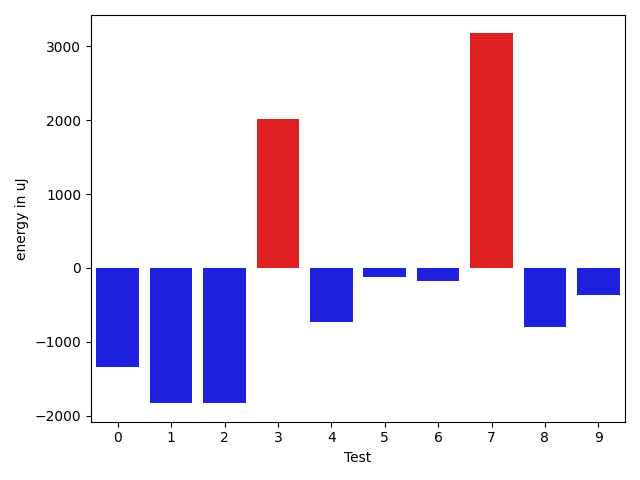

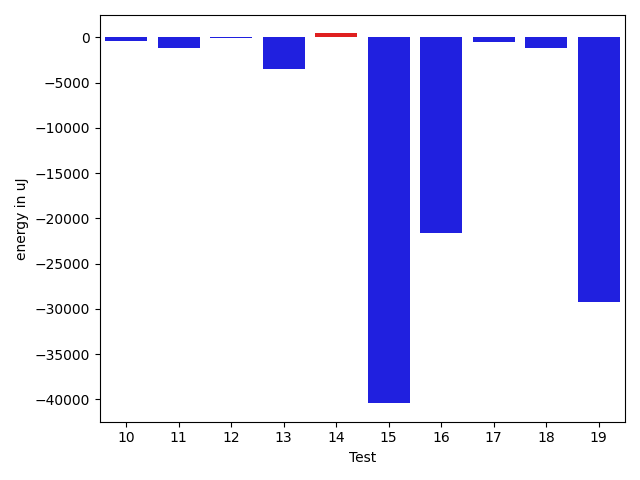

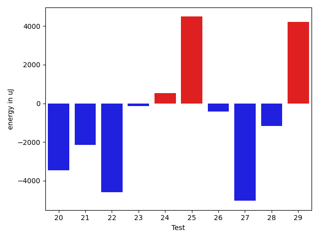

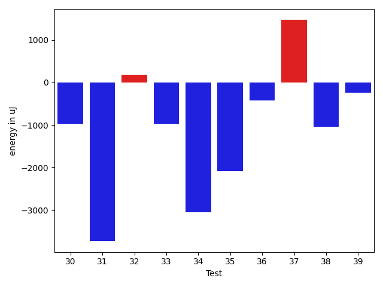

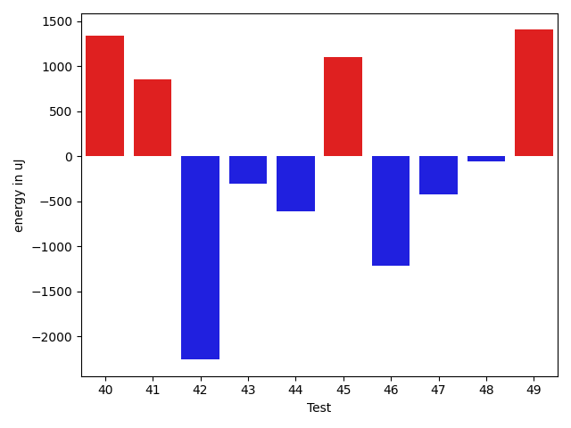

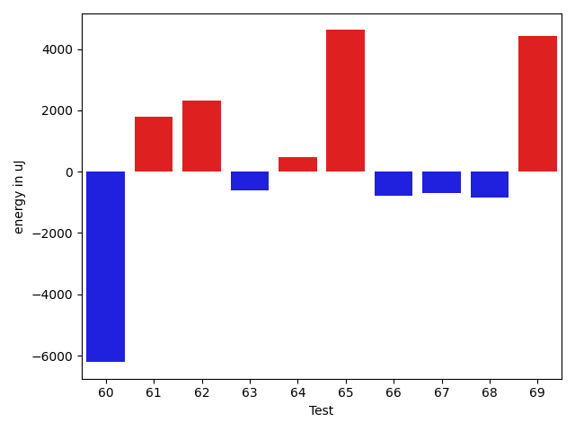

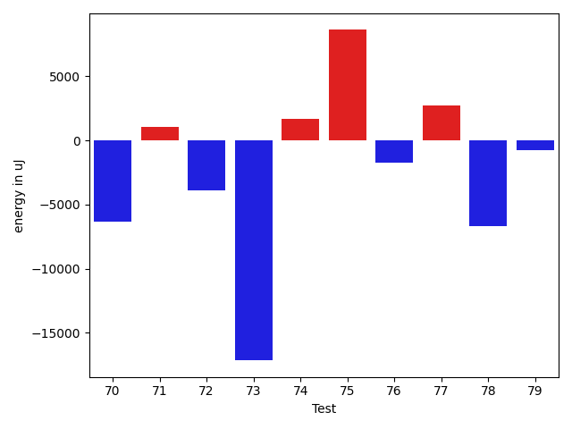

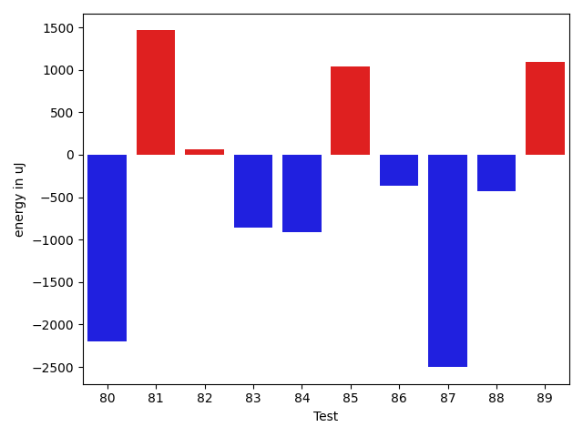

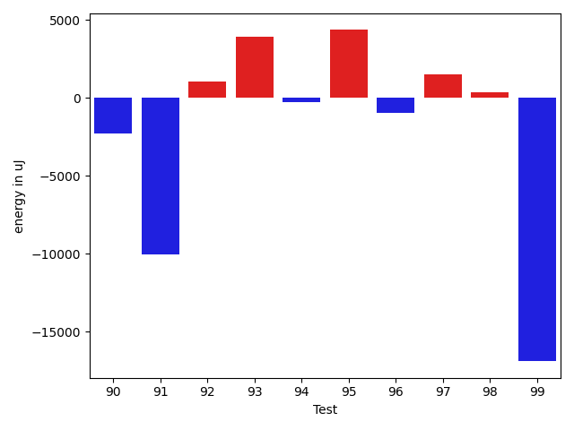

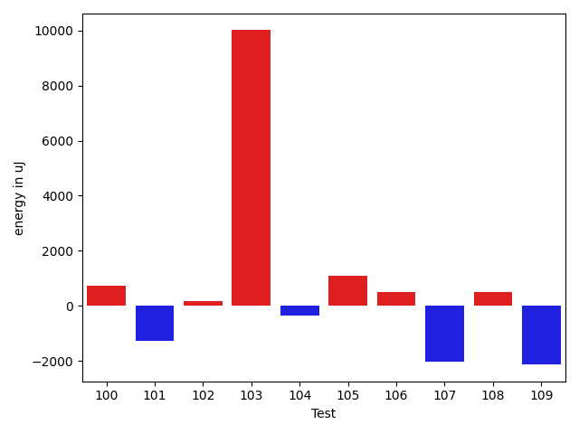

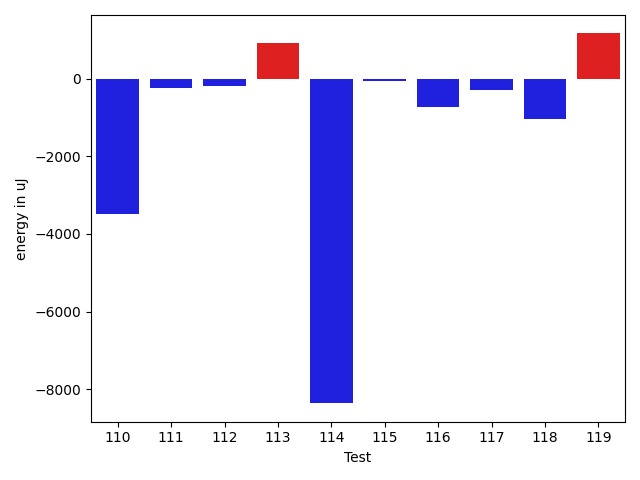

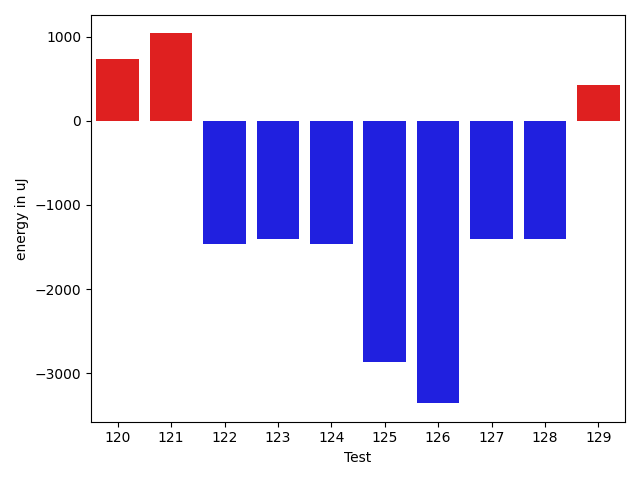

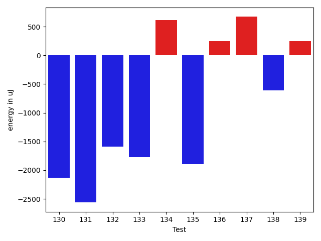

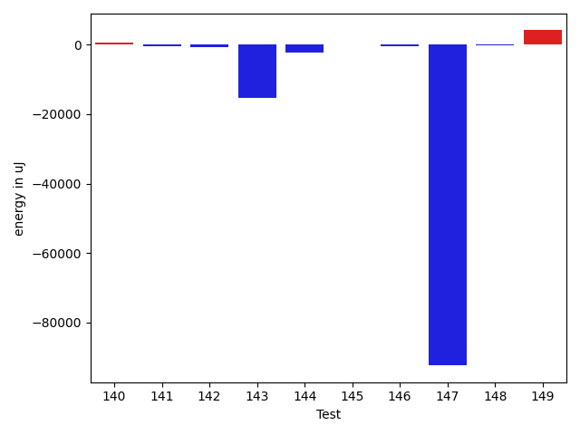

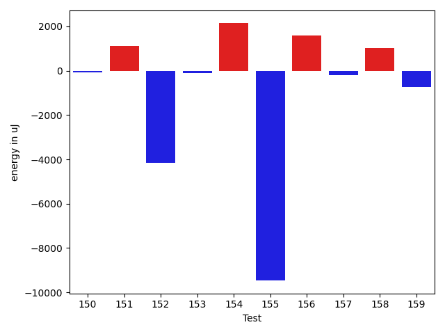

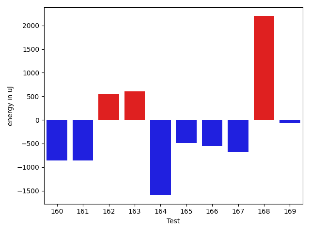

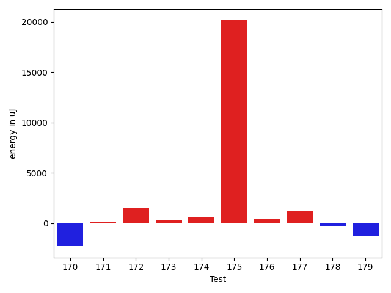

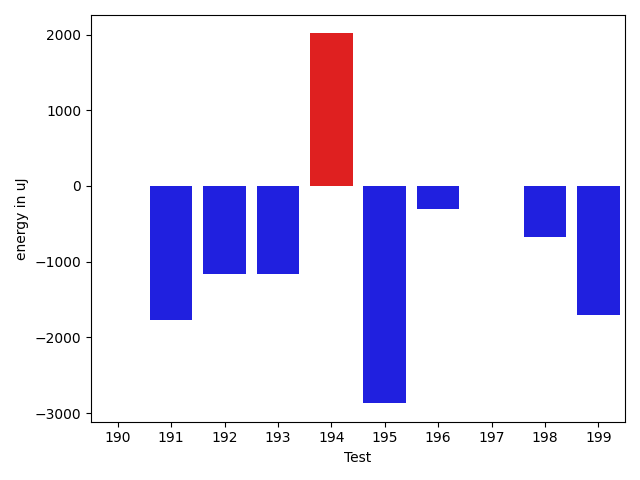

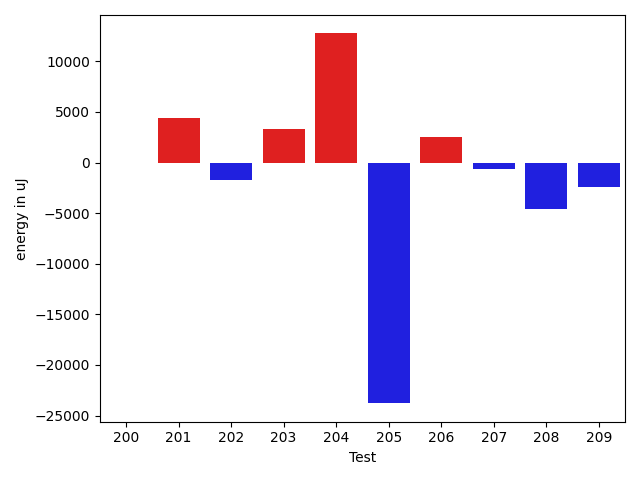

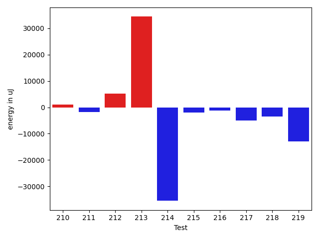

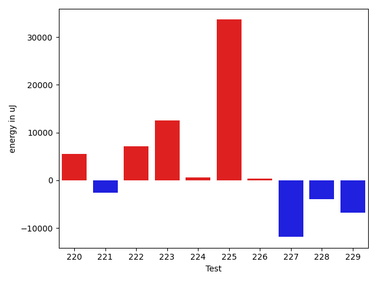

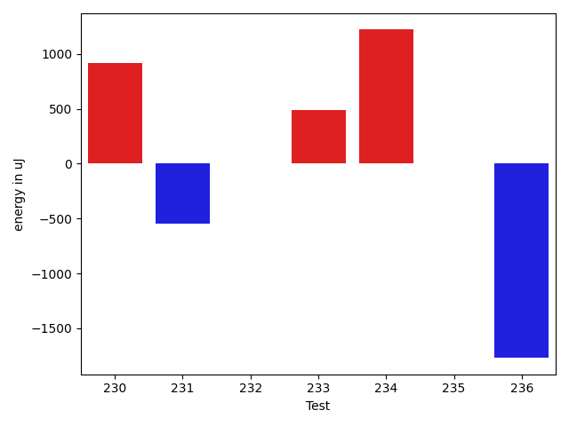

| ID | EnergyV1 | EnergyV2 | DeltaEnergy | σV1 | σV2 |
| --- | --- | --- | --- | --- | --- |
| 0 | 36438 | 35095 | -1343 | 4109.254583896843 | 4895.542468223702 |
| 1 | 37902 | 36072 | -1830 | 32522.361526900222 | 15421.157102167213 |
| 2 | 36560 | 34729 | -1831 | 4636.236689738225 | 4048.6688066099914 |
| 3 | 76782 | 78796 | 2014 | 32172.02011556144 | 26615.05426512134 |
| 4 | 37109 | 36377 | -732 | 33630.720021180445 | 37214.818984825295 |
| 5 | 35461 | 35339 | -122 | 27943.94330917313 | 3257.3383340432897 |
| 6 | 36438 | 36255 | -183 | 12879.100132766223 | 10704.528003486426 |
| 7 | 34302 | 37476 | 3174 | 3934.6460035883433 | 3404.683009482928 |
| 8 | 36255 | 35461 | -794 | 4994.300704202478 | 3792.8803843517126 |
| 9 | 36438 | 36071 | -367 | 3834.1785699315637 | 4138.458032890447 |
| 10 | 36254 | 34912 | -1342 | 3680.734665646151 | 3710.078713651181 |
| 11 | 36377 | 35705 | -672 | 5614.071291827546 | 3357.3081937545207 |
| 12 | 35889 | 35828 | -61 | 3419.4811226311494 | 3838.1618321795654 |
| 13 | 36743 | 36133 | -610 | 20168.630346265396 | 5384.424918187642 |
| 14 | 35828 | 35888 | 60 | 4130.161713365073 | 4402.105833042422 |
| 15 | 38391 | 38208 | -183 | 267559.9784354632 | 169289.28217686623 |
| 16 | 37109 | 36316 | -793 | 73776.69207094688 | 30838.363421256294 |
| 17 | 36438 | 36560 | 122 | 4828.224867899175 | 3153.3925406308244 |
| 18 | 36499 | 34363 | -2136 | 5001.939650164613 | 3557.8467217767193 |
| 19 | 39734 | 37353 | -2381 | 132187.8659098753 | 63349.501698821296 |
| 20 | 36316 | 36560 | 244 | 12933.999375776533 | 6412.920581125885 |
| 21 | 34973 | 32958 | -2015 | 4644.271679983849 | 3497.183554892279 |
| 22 | 38696 | 33997 | -4699 | 28029.045261596835 | 19551.844789723564 |
| 23 | 34546 | 33752 | -794 | 3512.881654929746 | 4512.306795841178 |
| 24 | 33691 | 34180 | 489 | 14531.912763392867 | 14152.554173657327 |
| 25 | 39062 | 37231 | -1831 | 39441.8372683361 | 51485.16539516882 |
| 26 | 35218 | 33203 | -2015 | 3101.4119673895666 | 4263.029142657462 |
| 27 | 35949 | 34546 | -1403 | 37486.99872991914 | 23548.87138409496 |
| 28 | 34668 | 34424 | -244 | 3268.950086098964 | 3583.201337840228 |
| 29 | 38635 | 37659 | -976 | 47325.54461208404 | 60578.111514149154 |
| 30 | 34424 | 33447 | -977 | 7026.7694280544965 | 5509.063436367082 |
| 31 | 37171 | 33447 | -3724 | 4040.611533101973 | 3492.586058880269 |
| 32 | 33996 | 34179 | 183 | 4132.292143445396 | 3864.2612377504 |
| 33 | 36377 | 35401 | -976 | 5475.654826307033 | 4326.406976146768 |
| 34 | 36804 | 33753 | -3051 | 4207.882936822269 | 3771.49653445088 |
| 35 | 34973 | 32898 | -2075 | 3387.3402324560657 | 3002.811198593745 |
| 36 | 36377 | 35950 | -427 | 5512.809619854644 | 4088.1925086343867 |
| 37 | 34729 | 36193 | 1464 | 30042.876159325293 | 4193.926281932483 |
| 38 | 36499 | 35461 | -1038 | 4804.428773538016 | 3824.229186030036 |
| 39 | 38819 | 38575 | -244 | 18781.142074867643 | 13464.967337602624 |
| 40 | 34180 | 35522 | 1342 | 4242.921766623294 | 24143.358647217578 |
| 41 | 34180 | 35034 | 854 | 4891.524214280134 | 25617.70223120734 |
| 42 | 40344 | 38086 | -2258 | 69532.33937599616 | 54243.71582175249 |
| 43 | 36804 | 36499 | -305 | 4712.627521025302 | 3733.4880670523776 |
| 44 | 38635 | 38025 | -610 | 52464.56516548513 | 37822.47993139623 |
| 45 | 35462 | 36560 | 1098 | 7696.613831467896 | 8311.530990213872 |
| 46 | 36437 | 35217 | -1220 | 9877.918004552364 | 10034.670005854701 |
| 47 | 36560 | 36133 | -427 | 54901.11733433659 | 23291.968242745952 |
| 48 | 36376 | 36316 | -60 | 4224.501447588552 | 4392.590337127113 |
| 49 | 36987 | 38391 | 1404 | 7957.547628126532 | 26205.169592228132 |
| 50 | 34973 | 34179 | -794 | 3565.131775300192 | 3305.4376715674553 |
| 51 | 36255 | 35705 | -550 | 33421.25448088968 | 26356.312039515033 |
| 52 | 36194 | 36194 | 0 | 13959.441321649458 | 15603.666914313175 |
| 53 | 35827 | 35095 | -732 | 13436.131078401117 | 15200.78597402461 |
| 54 | 35950 | 35950 | 0 | 3661.409392963777 | 3837.5026648896433 |
| 55 | 35156 | 35400 | 244 | 4252.261852918338 | 3232.1188556646325 |
| 56 | 35339 | 34545 | -794 | 3917.6857228266163 | 4295.882445744334 |
| 57 | 35217 | 35156 | -61 | 2798.156209513598 | 10968.439368996758 |
| 58 | 33631 | 33997 | 366 | 4409.495979033844 | 3798.0929233755373 |
| 59 | 35156 | 35827 | 671 | 3982.0093966137965 | 3847.3347514870607 |
| 60 | 35644 | 34729 | -915 | 23663.242878670957 | 3217.2617667063096 |
| 61 | 35523 | 34851 | -672 | 7062.106405783739 | 16991.125715693703 |
| 62 | 38757 | 39124 | 367 | 19755.078305478342 | 17819.22298536536 |
| 63 | 35339 | 35217 | -122 | 6595.624756355481 | 5779.48875604495 |
| 64 | 33692 | 35400 | 1708 | 4285.325610844891 | 3850.3766595710254 |
| 65 | 33020 | 34790 | 1770 | 4199.070737751639 | 25725.00555843941 |
| 66 | 34912 | 33875 | -1037 | 3687.270191408625 | 3687.3139605010297 |
| 67 | 35278 | 35217 | -61 | 3119.3573016258674 | 3500.7172572996456 |
| 68 | 36193 | 34668 | -1525 | 4230.937159079727 | 6834.846507438693 |
| 69 | 34668 | 37781 | 3113 | 3827.410941145031 | 7913.794273204928 |
| 70 | 35034 | 34668 | -366 | 26886.697409685697 | 4164.334910270541 |
| 71 | 33996 | 35644 | 1648 | 2718.2872431610645 | 3604.2550908613557 |
| 72 | 35339 | 34363 | -976 | 24962.04322589975 | 9693.548203482698 |
| 73 | 37232 | 34424 | -2808 | 63466.53120985607 | 2845.7548234581727 |
| 74 | 34362 | 36072 | 1710 | 4538.48898808653 | 4235.785091688496 |
| 75 | 35339 | 35400 | 61 | 4583.225476116351 | 40571.21300718145 |
| 76 | 37720 | 34912 | -2808 | 3854.243491270369 | 3827.3107647537586 |
| 77 | 35462 | 35827 | 365 | 6484.9968522670115 | 20200.576270207734 |
| 78 | 34729 | 33814 | -915 | 30099.651438380777 | 3286.7991424009824 |
| 79 | 36254 | 35645 | -609 | 4103.253978837253 | 3758.1492084820534 |
| 80 | 35828 | 33630 | -2198 | 4747.56173839096 | 4280.87641026928 |
| 81 | 35706 | 37170 | 1464 | 79515.48244934657 | 76412.63463939962 |
| 82 | 35828 | 35889 | 61 | 5001.685864752946 | 4248.260418911328 |
| 83 | 35828 | 34973 | -855 | 3300.358694478863 | 3373.9842345450356 |
| 84 | 35462 | 34545 | -917 | 3679.4256527054395 | 3647.9436785956595 |
| 85 | 34790 | 35827 | 1037 | 3542.846452271817 | 4208.144622499607 |
| 86 | 37109 | 36743 | -366 | 20629.555518602734 | 18761.619731922863 |
| 87 | 36743 | 34241 | -2502 | 3172.4730899983674 | 3692.3738854187322 |
| 88 | 34668 | 34241 | -427 | 4109.241627699805 | 3238.1990045784087 |
| 89 | 36987 | 38086 | 1099 | 3995.58670571336 | 4810.591999718444 |
| 90 | 38025 | 37964 | -61 | 40021.29811287325 | 34312.911341322455 |
| 91 | 42237 | 41992 | -245 | 108976.13056890773 | 82682.10264869146 |
| 92 | 34118 | 33996 | -122 | 3307.8544845350625 | 4800.01625858128 |
| 93 | 37964 | 39367 | 1403 | 34004.19976349326 | 32827.90772135787 |
| 94 | 35949 | 36194 | 245 | 5536.457332960164 | 4538.990862841653 |
| 95 | 38025 | 36438 | -1587 | 4497.446862514538 | 35894.17966024823 |
| 96 | 35827 | 35340 | -487 | 3429.8791876099663 | 4355.6263416679 |
| 97 | 37048 | 36011 | -1037 | 8563.444952225238 | 11216.797855252213 |
| 98 | 36743 | 35462 | -1281 | 4117.530152841237 | 4885.960714810002 |
| 99 | 38024 | 37902 | -122 | 98438.75884047936 | 64793.821998508276 |
| 100 | 36133 | 36865 | 732 | 8015.2209296358915 | 10169.354086333486 |
| 101 | 40405 | 39123 | -1282 | 99211.42073135544 | 79715.10119288975 |
| 102 | 36744 | 36927 | 183 | 4028.7028293856574 | 3221.738084592583 |
| 103 | 122619 | 132629 | 10010 | 99209.6096838809 | 89151.07441665466 |
| 104 | 35461 | 35095 | -366 | 4368.540766994427 | 4254.084570615706 |
| 105 | 37536 | 38635 | 1099 | 29812.926006596404 | 4312.819372052395 |
| 106 | 35767 | 36255 | 488 | 11461.953170139994 | 12434.475179097502 |
| 107 | 36987 | 34973 | -2014 | 6742.213447794414 | 20135.529837705843 |
| 108 | 35522 | 36011 | 489 | 4599.331499250734 | 3414.4865367942193 |
| 109 | 37231 | 35096 | -2135 | 3924.3068496232554 | 3497.625388904751 |
| 110 | 38391 | 34912 | -3479 | 44182.62228588973 | 56573.417315462604 |
| 111 | 35888 | 35645 | -243 | 4461.55455747612 | 3525.797209756707 |
| 112 | 37293 | 37109 | -184 | 287123.97929266293 | 382587.5188188401 |
| 113 | 35644 | 36560 | 916 | 4250.495606737238 | 39704.499897706606 |
| 114 | 66650 | 58289 | -8361 | 59473.10960836094 | 57801.77782416487 |
| 115 | 36377 | 36316 | -61 | 6922.046541472691 | 12277.89091562999 |
| 116 | 37780 | 37048 | -732 | 43024.69788478587 | 70893.0416541182 |
| 117 | 40894 | 40588 | -306 | 26955.703023673726 | 28535.85507513968 |
| 118 | 39429 | 38391 | -1038 | 49934.23875376263 | 91637.68244266078 |
| 119 | 35705 | 36865 | 1160 | 14290.234467395081 | 14014.968413697507 |
| 120 | 33813 | 34545 | 732 | 4533.784570287075 | 3810.744488566213 |
| 121 | 33814 | 34851 | 1037 | 3729.1703506453327 | 3224.2447152106824 |
| 122 | 35584 | 34119 | -1465 | 4313.034718585518 | 3523.2754062023223 |
| 123 | 35889 | 34485 | -1404 | 3837.7649862387348 | 3075.522627493126 |
| 124 | 36621 | 35156 | -1465 | 11946.382012201035 | 12925.728629076884 |
| 125 | 37232 | 34363 | -2869 | 4621.965966928905 | 3302.637805014517 |
| 126 | 37231 | 33874 | -3357 | 4507.193505541879 | 2758.990694859442 |
| 127 | 36499 | 35096 | -1403 | 3588.8499985680955 | 3872.002758300332 |
| 128 | 38329 | 36926 | -1403 | 32527.198844547045 | 9229.72764642432 |
| 129 | 33997 | 34424 | 427 | 4116.66422529734 | 3642.340591821151 |
| 130 | 37231 | 35095 | -2136 | 3331.499775640515 | 2736.9714558979235 |
| 131 | 36133 | 33570 | -2563 | 7543.80600894107 | 6173.098078039417 |
| 132 | 35339 | 33753 | -1586 | 4127.304016329945 | 3795.82010336223 |
| 133 | 34973 | 33203 | -1770 | 14012.426939156776 | 8432.435735292305 |
| 134 | 33874 | 34485 | 611 | 3616.6233680065916 | 2729.0929612573796 |
| 135 | 37048 | 35156 | -1892 | 23519.250187582402 | 24822.628019086373 |
| 136 | 34851 | 35095 | 244 | 3931.451969859359 | 3806.2478411290003 |
| 137 | 38147 | 38819 | 672 | 64288.17675419562 | 49786.46526538414 |
| 138 | 35706 | 35095 | -611 | 32671.932388322042 | 18827.458103082634 |
| 139 | 34362 | 34606 | 244 | 4224.538577827826 | 3801.5494192742062 |
| 140 | 34301 | 34668 | 367 | 4649.708599930991 | 3602.2826509867323 |
| 141 | 35889 | 35889 | 0 | 4082.197387878249 | 4017.6862206633728 |
| 142 | 35828 | 34668 | -1160 | 6981.664814182512 | 6231.86897306586 |
| 143 | 36743 | 37292 | 549 | 44091.84208206683 | 20530.48457140849 |
| 144 | 36132 | 34546 | -1586 | 4759.434483729651 | 3677.7954387840573 |
| 145 | 35950 | 36133 | 183 | 4547.3745445326895 | 3615.402840834222 |
| 146 | 35095 | 34240 | -855 | 4357.586148982722 | 3031.79163518598 |
| 147 | 36804 | 37903 | 1099 | 455878.5928556449 | 311804.6605957153 |
| 148 | 35340 | 35766 | 426 | 3927.399761787548 | 3202.7016284809265 |
| 149 | 34179 | 36194 | 2015 | 5281.707476648681 | 21202.240141161034 |
| 150 | 34973 | 36377 | 1404 | 3972.243446904946 | 3753.599219691815 |
| 151 | 35949 | 35950 | 1 | 4277.4205598182125 | 5188.510004011594 |
| 152 | 39001 | 37598 | -1403 | 13443.653001481209 | 7113.184331009782 |
| 153 | 35950 | 36010 | 60 | 2961.7580003785124 | 2713.6459043476593 |
| 154 | 34545 | 37415 | 2870 | 3189.281697503647 | 4044.8011249622487 |
| 155 | 37720 | 36194 | -1526 | 31910.049320444778 | 3788.925618014027 |
| 156 | 36743 | 37292 | 549 | 4774.892236581653 | 4053.727941997571 |
| 157 | 36865 | 34790 | -2075 | 3144.5286291143425 | 3530.326460195368 |
| 158 | 35950 | 35279 | -671 | 2119.4577282239893 | 4017.547403397495 |
| 159 | 35705 | 36010 | 305 | 4345.3491307038075 | 3397.7632578598796 |
| 160 | 36682 | 35827 | -855 | 3571.027256500105 | 2837.2639120579997 |
| 161 | 36621 | 35767 | -854 | 3207.086883145149 | 2458.7532590406413 |
| 162 | 36194 | 36743 | 549 | 4930.158040166705 | 3667.8672655236583 |
| 163 | 37414 | 38024 | 610 | 4077.8773041814875 | 2509.236449599758 |
| 164 | 36744 | 35156 | -1588 | 3851.020190373801 | 2677.1841521223378 |
| 165 | 35889 | 35400 | -489 | 2660.8740969839214 | 3387.341719323486 |
| 166 | 38757 | 38208 | -549 | 362901.27203026233 | 481917.1281189407 |
| 167 | 36255 | 35584 | -671 | 9542.33201784372 | 10423.18063790276 |
| 168 | 34119 | 36316 | 2197 | 3895.2852501874454 | 3723.805396538195 |
| 169 | 35827 | 35766 | -61 | 7687.457641364784 | 8659.287020782596 |
| 170 | 81238 | 78980 | -2258 | 82681.47664049045 | 101250.30073610894 |
| 171 | 36255 | 36438 | 183 | 9904.6239081789 | 9067.680155701915 |
| 172 | 70068 | 71655 | 1587 | 30343.563124630888 | 26833.08876640634 |
| 173 | 36194 | 36499 | 305 | 12145.49550951644 | 10036.650331816496 |
| 174 | 36682 | 37292 | 610 | 68714.80113118618 | 99016.66938022977 |
| 175 | 43396 | 63537 | 20141 | 23053.84471220113 | 22310.192615359356 |
| 176 | 36499 | 36926 | 427 | 23532.581147193923 | 16889.23576474876 |
| 177 | 72815 | 74036 | 1221 | 39360.58438810747 | 46988.71159177483 |
| 178 | 35889 | 35645 | -244 | 10371.05711233353 | 10987.298388609113 |
| 179 | 38513 | 37231 | -1282 | 16570.101846154088 | 17006.61902714995 |
| 180 | 35034 | 35278 | 244 | 7562.113790554105 | 5304.523913576895 |
| 181 | 35034 | 35583 | 549 | 3665.976640781089 | 3659.029845321474 |
| 182 | 35644 | 35217 | -427 | 4706.417232892556 | 3620.536819561014 |
| 183 | 32532 | 35949 | 3417 | 3639.023302667008 | 3187.40755028791 |
| 184 | 75134 | 76294 | 1160 | 39770.80054242468 | 163917.75361888623 |
| 185 | 79467 | 76171 | -3296 | 315167.56507503137 | 409104.0146141258 |
| 186 | 35279 | 34668 | -611 | 4051.5759770119084 | 4121.280247545521 |
| 187 | 36011 | 35584 | -427 | 11686.257455994202 | 30346.78991435303 |
| 188 | 36072 | 34363 | -1709 | 4462.631184260547 | 3820.488531381956 |
| 189 | 38879 | 37658 | -1221 | 63789.458828434515 | 97895.98395181597 |
| 190 | 35950 | 35950 | 0 | 4359.768793054157 | 3842.296574030012 |
| 191 | 37658 | 35889 | -1769 | 3884.478896787416 | 3640.25182797753 |
| 192 | 36499 | 35340 | -1159 | 4665.863395942046 | 4524.037130975936 |
| 193 | 36682 | 35522 | -1160 | 7562.283404588824 | 4176.049699641701 |
| 194 | 161865 | 163879 | 2014 | 195830.85655196718 | 210767.57324411636 |
| 195 | 38696 | 35827 | -2869 | 43046.5734868642 | 21723.787064709002 |
| 196 | 35766 | 35461 | -305 | 4280.584025251948 | 5962.548534590201 |
| 197 | 34363 | 34362 | -1 | 4458.381794841199 | 4527.6024586605035 |
| 198 | 36743 | 36071 | -672 | 4184.52091558721 | 4119.354815547115 |
| 199 | 38208 | 36499 | -1709 | 54424.907401382305 | 65344.89841005223 |
| 200 | 35828 | 35827 | -1 | 2473.2402479870484 | 4562.41437771505 |
| 201 | 36071 | 36255 | 184 | 4119.833767608503 | 27835.821483002797 |
| 202 | 36682 | 34546 | -2136 | 4090.9137778025784 | 3691.8310718386847 |
| 203 | 38575 | 38452 | -123 | 48676.25768791122 | 54018.58828033267 |
| 204 | 221374 | 234862 | 13488 | 78248.69762820435 | 86241.07780503905 |
| 205 | 365782 | 341064 | -24718 | 133318.8824902701 | 115819.95789715186 |
| 206 | 41016 | 45776 | 4760 | 52856.64376582561 | 51562.67852524066 |
| 207 | 36071 | 35523 | -548 | 4646.658531609031 | 4958.047887441858 |
| 208 | 36193 | 38635 | 2442 | 72301.41968388353 | 62974.61660356046 |
| 209 | 39917 | 37231 | -2686 | 111919.0833280574 | 120878.97063987874 |
| 210 | 44372 | 42175 | -2197 | 28541.781818563148 | 29674.142593899436 |
| 211 | 35766 | 36194 | 428 | 19107.80389932492 | 8666.494992587117 |
| 212 | 37048 | 36072 | -976 | 206545.84075342445 | 238652.02733457417 |
| 213 | 35522 | 35705 | 183 | 60871.29094686878 | 252591.31901691746 |
| 214 | 35828 | 36438 | 610 | 332415.976312533 | 255212.40769745968 |
| 215 | 37048 | 35278 | -1770 | 3439.43684262046 | 3258.7044671782855 |
| 216 | 36560 | 34423 | -2137 | 3596.219905234564 | 5245.341868977557 |
| 217 | 37964 | 38025 | 61 | 20551.931139080938 | 9162.574854289478 |
| 218 | 65979 | 62561 | -3418 | 27918.95477890855 | 25130.714578661697 |
| 219 | 38818 | 37536 | -1282 | 68517.37675191752 | 54120.04599818404 |
| 220 | 35828 | 38391 | 2563 | 11775.929952930534 | 15648.17781260378 |
| 221 | 38330 | 38452 | 122 | 46302.360182239616 | 34404.73197851281 |
| 222 | 37109 | 37659 | 550 | 94992.18613072729 | 106647.78993653462 |
| 223 | 37964 | 40283 | 2319 | 26319.832812496024 | 36768.3374969181 |
| 224 | 36682 | 37293 | 611 | 3887.6023588740586 | 4117.8347937828785 |
| 225 | 36560 | 38025 | 1465 | 87672.13001910796 | 112955.69257378978 |
| 226 | 37597 | 38574 | 977 | 20904.67291976143 | 20012.313101698794 |
| 227 | 37048 | 37720 | 672 | 63189.58277263656 | 29395.37702294546 |
| 228 | 35217 | 35340 | 123 | 25137.531593080737 | 4362.239049022659 |
| 229 | 37658 | 36988 | -670 | 29716.23587517582 | 13174.008082144655 |
| 230 | 35706 | 36621 | 915 | 66103.4850971226 | 42159.946517143 |
| 231 | 38513 | 37964 | -549 | 46108.42060763501 | 85067.95810430267 |
| 232 | 35461 | 35462 | 1 | 4127.476044542221 | 3579.587902272344 |
| 233 | 38086 | 38574 | 488 | 29256.20886806076 | 18863.07313880747 |
| 234 | 37353 | 38574 | 1221 | 10454.840335784453 | 10438.702305072107 |
| 235 | 36743 | 36743 | 0 | 3745.9251706011046 | 6011.0754134902245 |
| 236 | 39185 | 37415 | -1770 | 702183.9812343707 | 655978.7823318221 |

## Delta Duration per test method

| ID | DurationV1 | DurationsV2 | DeltaDuration |
| --- | --- | --- | --- |
| 0 | 823656.4237288135 | 837627.7272727273 | 13971.30354391376 |
| 1 | 1180911.56 | 963632.3166666667 | -217279.2433333334 |
| 2 | 818973.4912280702 | 858444.1967213114 | 39470.7054932412 |
| 3 | 2674277.5555555555 | 2723300.707070707 | 49023.151515151374 |
| 4 | 1407885.4366197183 | 1286976.0294117648 | -120909.40720795351 |
| 5 | 854254.3921568628 | 785981.8490566037 | -68272.54310025903 |
| 6 | 1152295.3220338982 | 1103235.9295774647 | -49059.3924564335 |
| 7 | 427168.5 | 433264.22222222225 | 6095.722222222248 |
| 8 | 608278.2051282051 | 647746.35 | 39468.14487179485 |
| 9 | 707473.8163265307 | 849694.5744680851 | 142220.75814155443 |
| 10 | 776410.1886792453 | 825955.5454545454 | 49545.35677530011 |
| 11 | 932488.2166666667 | 916986.3484848485 | -15501.868181818165 |
| 12 | 704723.1702127659 | 715757.2608695652 | 11034.090656799264 |
| 13 | 956300.6363636364 | 879188.48 | -77112.15636363637 |
| 14 | 536293.5 | 636690.7857142857 | 100397.28571428568 |
| 15 | 2875548.2033898304 | 1612388.6451612904 | -1263159.55822854 |
| 16 | 1653686.3953488371 | 983596.0655737704 | -670090.3297750667 |
| 17 | 418467.4375 | 491692.85714285716 | 73225.41964285716 |
| 18 | 785221.5 | 710161.2195121951 | -75060.2804878049 |
| 19 | 2477347.8958333335 | 1723108.918367347 | -754238.9774659865 |
| 20 | 1128176.3797468354 | 1075773.4025974027 | -52402.97714943276 |
| 21 | 443979.9375 | 376257.4705882353 | -67722.4669117647 |
| 22 | 842638.5238095238 | 958625.1578947369 | 115986.63408521307 |
| 23 | 757984.0714285715 | 696905.7674418605 | -61078.30398671096 |
| 24 | 1087885.7843137255 | 947528.0566037736 | -140357.72770995193 |
| 25 | 1153379.2307692308 | 1235019.6226415094 | 81640.39187227865 |
| 26 | 601734.9354838709 | 541395.7837837838 | -60339.151700087124 |
| 27 | 1362549.1392405063 | 1223295.1515151516 | -139253.98772535473 |
| 28 | 540164.0434782609 | 447184.75 | -92979.29347826086 |
| 29 | 1147141.892857143 | 1211666.4827586208 | 64524.5899014778 |
| 30 | 898583.8409090909 | 733262.0697674418 | -165321.7711416491 |
| 31 | 555966.7391304348 | 534477.9523809524 | -21488.786749482388 |
| 32 | 851589.4126984127 | 868022.2407407408 | 16432.828042328125 |
| 33 | 502969.86363636365 | 476651.1304347826 | -26318.733201581053 |
| 34 | 471053.9 | 452715.875 | -18338.025000000023 |
| 35 | 408282.4210526316 | 402012.92 | -6269.501052631589 |
| 36 | 779197.0 | 458859.72222222225 | -320337.27777777775 |
| 37 | 769099.3076923077 | 543162.4615384615 | -225936.84615384624 |
| 38 | 425236.93333333335 | 387205.72222222225 | -38031.2111111111 |
| 39 | 1331929.4242424243 | 1061928.5483870967 | -270000.8758553276 |
| 40 | 618985.6666666666 | 804613.8518518518 | 185628.18518518517 |
| 41 | 472443.1111111111 | 633519.5652173914 | 161076.45410628023 |
| 42 | 1782936.2653061224 | 1137032.2916666667 | -645903.9736394556 |
| 43 | 615542.0 | 649233.7567567568 | 33691.756756756804 |
| 44 | 1923988.724489796 | 1634168.6224489796 | -289820.10204081633 |
| 45 | 652981.1794871795 | 647549.9090909091 | -5431.27039627044 |
| 46 | 882680.9230769231 | 819405.82 | -63275.10307692317 |
| 47 | 1409481.0625 | 957319.033898305 | -452162.02860169497 |
| 48 | 853736.5 | 827334.9807692308 | -26401.51923076925 |
| 49 | 790897.4838709678 | 939724.1818181818 | 148826.697947214 |
| 50 | 477516.46428571426 | 516137.22222222225 | 38620.75793650799 |
| 51 | 1539022.2291666667 | 1540387.5662650603 | 1365.3370983935893 |
| 52 | 1300072.046511628 | 1349090.3146067415 | 49018.26809511357 |
| 53 | 1037327.5384615385 | 1287423.115942029 | 250095.57748049055 |
| 54 | 895460.803030303 | 932300.0704225352 | 36839.2673922322 |
| 55 | 489490.5652173913 | 516890.0857142857 | 27399.52049689443 |
| 56 | 691551.7962962963 | 801912.2407407408 | 110360.4444444445 |
| 57 | 491854.18518518517 | 654161.6666666666 | 162307.48148148146 |
| 58 | 461318.7619047619 | 495655.8888888889 | 34337.12698412698 |
| 59 | 574497.3103448276 | 696199.025 | 121701.71465517243 |
| 60 | 713404.3913043478 | 554946.7857142857 | -158457.6055900621 |
| 61 | 953262.9402985075 | 1112193.493150685 | 158930.55285217753 |
| 62 | 1608131.9795918367 | 1590459.180851064 | -17672.798740772763 |
| 63 | 787166.625 | 895638.296875 | 108471.671875 |
| 64 | 619625.0689655172 | 699186.7878787878 | 79561.71891327063 |
| 65 | 637110.7586206896 | 817272.4054054054 | 180161.64678471582 |
| 66 | 761089.2807017544 | 782103.3636363636 | 21014.082934609265 |
| 67 | 529587.3181818182 | 537222.9333333333 | 7635.615151515114 |
| 68 | 696238.0 | 823348.2888888889 | 127110.2888888889 |
| 69 | 635112.6060606061 | 794299.25 | 159186.64393939392 |
| 70 | 733458.08 | 592343.9285714285 | -141114.15142857144 |
| 71 | 351808.64705882355 | 371617.65 | 19809.00294117647 |
| 72 | 894621.5675675676 | 793468.6428571428 | -101152.92471042473 |
| 73 | 882437.5789473684 | 440589.5789473684 | -441848.0 |
| 74 | 575391.5294117647 | 640253.7619047619 | 64862.232492997195 |
| 75 | 572638.2121212122 | 860529.0967741936 | 287890.8846529814 |
| 76 | 447307.0 | 461756.6 | 14449.599999999977 |
| 77 | 846450.5 | 977257.306122449 | 130806.806122449 |
| 78 | 842546.7857142857 | 669675.9534883721 | -172870.83222591353 |
| 79 | 501461.15625 | 551017.7857142857 | 49556.62946428568 |
| 80 | 484949.15789473685 | 457684.0 | -27265.157894736854 |
| 81 | 1274581.03125 | 1367609.025 | 93027.9937499999 |
| 82 | 569496.0909090909 | 587783.8387096775 | 18287.747800586512 |
| 83 | 712582.0666666667 | 654838.6578947369 | -57743.4087719298 |
| 84 | 497858.38095238095 | 519739.77419354836 | 21881.393241167418 |
| 85 | 610428.0 | 633764.4651162791 | 23336.465116279083 |
| 86 | 1223026.1470588236 | 1105684.9444444445 | -117341.20261437912 |
| 87 | 586188.6451612903 | 496199.8333333333 | -89988.81182795699 |
| 88 | 632334.1515151515 | 649555.8235294118 | 17221.672014260315 |
| 89 | 402284.2173913043 | 446437.64285714284 | 44153.42546583852 |
| 90 | 1424700.7457627119 | 1272104.0 | -152596.74576271186 |
| 91 | 2578625.2608695654 | 2282082.9270833335 | -296542.33378623193 |
| 92 | 518823.8947368421 | 428300.3181818182 | -90523.5765550239 |
| 93 | 1462453.1666666667 | 1783124.0987654321 | 320670.9320987654 |
| 94 | 1004336.7236842106 | 1112681.7532467532 | 108345.02956254268 |
| 95 | 707863.0294117647 | 892131.765625 | 184268.7362132353 |
| 96 | 592764.08 | 750419.9285714285 | 157655.84857142856 |
| 97 | 1102553.3709677418 | 1078564.6296296297 | -23988.74133811216 |
| 98 | 451657.2631578947 | 477815.93333333335 | 26158.67017543863 |
| 99 | 1926023.1081081082 | 1563944.85 | -362078.2581081081 |
| 100 | 1071978.5569620254 | 1105261.8591549296 | 33283.30219290429 |
| 101 | 2542136.076923077 | 1890267.657142857 | -651868.4197802199 |
| 102 | 457843.9 | 456352.85714285716 | -1491.0428571428638 |
| 103 | 4912641.565656566 | 4884819.846938776 | -27821.71871779021 |
| 104 | 691704.6521739131 | 702948.6111111111 | 11243.95893719804 |
| 105 | 698821.2105263158 | 466254.95454545453 | -232566.25598086132 |
| 106 | 880985.0576923077 | 988272.8367346938 | 107287.7790423861 |
| 107 | 689505.7727272727 | 717016.4324324324 | 27510.65970515972 |
| 108 | 472607.86666666664 | 563690.9285714285 | 91083.06190476188 |
| 109 | 568114.90625 | 608251.0 | 40136.09375 |
| 110 | 1278303.0 | 1509893.1136363635 | 231590.11363636353 |
| 111 | 583668.28125 | 659997.1034482758 | 76328.82219827583 |
| 112 | 2442428.703703704 | 2932941.217391304 | 490512.5136876004 |
| 113 | 474569.0909090909 | 764619.380952381 | 290050.29004329006 |
| 114 | 2498287.9494949495 | 2318762.1616161615 | -179525.78787878808 |
| 115 | 740604.9090909091 | 791492.8780487805 | 50887.96895787143 |
| 116 | 1171332.5396825396 | 1469684.2222222222 | 298351.6825396826 |
| 117 | 1594135.3076923077 | 1608220.4125 | 14085.104807692347 |
| 118 | 1695148.9130434783 | 1972509.9789473685 | 277361.0659038902 |
| 119 | 1224565.8918918918 | 1177860.6142857142 | -46705.27760617761 |
| 120 | 702119.804347826 | 703468.0566037736 | 1348.252255947562 |
| 121 | 556562.9090909091 | 594315.2647058824 | 37752.35561497335 |
| 122 | 1020461.6363636364 | 1025721.3157894737 | 5259.679425837356 |
| 123 | 578373.96 | 576362.8 | -2011.1599999999162 |
| 124 | 1139174.1315789474 | 1241564.6153846155 | 102390.48380566807 |
| 125 | 662561.0 | 646265.3777777777 | -16295.622222222271 |
| 126 | 441413.63157894736 | 485157.2962962963 | 43743.66471734893 |
| 127 | 537560.1 | 608977.2413793104 | 71417.1413793104 |
| 128 | 1083613.8085106383 | 981685.9772727273 | -101927.83123791101 |
| 129 | 693306.6341463415 | 719815.0754716981 | 26508.4413253566 |
| 130 | 794210.9574468085 | 786970.04 | -7240.917446808424 |
| 131 | 786849.5365853659 | 850512.551724138 | 63663.01513877208 |
| 132 | 581933.0 | 493724.1304347826 | -88208.8695652174 |
| 133 | 779408.8863636364 | 826816.6470588235 | 47407.76069518714 |
| 134 | 590536.4347826086 | 583402.0909090909 | -7134.343873517704 |
| 135 | 1037871.6923076923 | 995472.0 | -42399.692307692254 |
| 136 | 726979.8823529412 | 716288.5818181818 | -10691.300534759415 |
| 137 | 1284232.1794871795 | 879232.3846153846 | -404999.7948717949 |
| 138 | 1506014.1704545454 | 1260569.896551724 | -245444.27390282135 |
| 139 | 735793.6888888889 | 716219.4150943396 | -19574.273794549285 |
| 140 | 460583.5652173913 | 427088.44 | -33495.125217391294 |
| 141 | 516641.0 | 489859.4166666667 | -26781.583333333314 |
| 142 | 855532.3636363636 | 700335.125 | -155197.23863636365 |
| 143 | 1294701.3243243243 | 740610.8421052631 | -554090.4822190611 |
| 144 | 578402.4782608695 | 483919.89285714284 | -94482.58540372667 |
| 145 | 715393.1458333334 | 685927.3076923077 | -29465.838141025626 |
| 146 | 698894.8536585366 | 666172.2285714286 | -32722.625087107997 |
| 147 | 5712901.689655173 | 2800549.1428571427 | -2912352.54679803 |
| 148 | 487545.8333333333 | 496176.9090909091 | 8631.075757575803 |
| 149 | 569305.6129032258 | 733052.3529411765 | 163746.7400379507 |
| 150 | 562392.5384615385 | 488087.76923076925 | -74304.76923076925 |
| 151 | 527522.6666666666 | 475487.72222222225 | -52034.94444444438 |
| 152 | 1006455.6071428572 | 723758.1538461539 | -282697.4532967033 |
| 153 | 475032.10714285716 | 471568.84210526315 | -3463.265037594014 |
| 154 | 498455.7619047619 | 468702.13636363635 | -29753.62554112554 |
| 155 | 686989.7058823529 | 392573.45454545453 | -294416.25133689836 |
| 156 | 666611.4838709678 | 584512.5454545454 | -82098.93841642234 |
| 157 | 370429.8095238095 | 378856.26666666666 | 8426.457142857136 |
| 158 | 529562.4444444445 | 469303.8888888889 | -60258.55555555562 |
| 159 | 517402.6666666667 | 495594.85714285716 | -21807.809523809527 |
| 160 | 416390.5 | 398737.0 | -17653.5 |
| 161 | 556067.2916666666 | 485358.7272727273 | -70708.56439393933 |
| 162 | 569999.6428571428 | 562632.15 | -7367.492857142817 |
| 163 | 458180.1176470588 | 410918.4 | -47261.71764705877 |
| 164 | 434158.4666666667 | 386759.0625 | -47399.404166666674 |
| 165 | 398433.73333333334 | 426886.5 | 28452.766666666663 |
| 166 | 2805779.594936709 | 4987582.084507043 | 2181802.4895703336 |
| 167 | 1244606.1555555556 | 1248521.012195122 | 3914.8566395663656 |
| 168 | 803461.9672131147 | 811965.0192307692 | 8503.052017654525 |
| 169 | 1173057.2222222222 | 1176287.8369565217 | 3230.614734299481 |
| 170 | 3242154.1052631577 | 3540251.3225806453 | 298097.2173174876 |
| 171 | 1154310.9888888889 | 1172592.3076923077 | 18281.318803418893 |
| 172 | 2305226.262626263 | 2314774.9494949495 | 9548.686868686695 |
| 173 | 1351673.6063829786 | 1313141.358695652 | -38532.24768732651 |
| 174 | 1843452.7391304348 | 2427050.197674419 | 583597.458543984 |
| 175 | 1843759.7575757576 | 1820136.0707070706 | -23623.686868686927 |
| 176 | 1371213.6626506024 | 1361719.4197530865 | -9494.242897515884 |
| 177 | 2549644.0808080807 | 2576912.404040404 | 27268.323232323397 |
| 178 | 1201060.0666666667 | 1170474.2631578948 | -30585.803508771816 |
| 179 | 1502157.878787879 | 1508254.3737373736 | 6096.494949494721 |
| 180 | 1032061.4305555555 | 1002691.3424657534 | -29370.08808980207 |
| 181 | 943437.2058823529 | 929720.3088235294 | -13716.897058823495 |
| 182 | 803000.380952381 | 824891.6481481482 | 21891.267195767257 |
| 183 | 509881.60869565216 | 523963.74074074073 | 14082.132045088569 |
| 184 | 2589163.4646464647 | 3033741.909090909 | 444578.4444444445 |
| 185 | 4861214.918367347 | 6611252.8877551025 | 1750037.9693877557 |
| 186 | 606853.625 | 663614.1842105263 | 56760.55921052629 |
| 187 | 911416.0408163265 | 1154730.9649122807 | 243314.92409595416 |
| 188 | 568872.6904761905 | 680530.5789473684 | 111657.8884711779 |
| 189 | 1304897.2702702703 | 2207382.775510204 | 902485.5052399337 |
| 190 | 544944.5666666667 | 593053.8529411765 | 48109.286274509854 |
| 191 | 532583.1363636364 | 552402.0 | 19818.863636363647 |
| 192 | 629669.4642857143 | 592456.4571428571 | -37213.00714285718 |
| 193 | 854250.1803278689 | 899179.3142857143 | 44929.13395784539 |
| 194 | 5606780.575757576 | 6360588.626262627 | 753808.0505050505 |
| 195 | 1089152.44 | 1022785.3103448276 | -66367.12965517235 |
| 196 | 833240.0677966102 | 936309.421875 | 103069.35407838982 |
| 197 | 599635.2285714286 | 677582.1794871795 | 77946.95091575093 |
| 198 | 688739.5660377359 | 828169.6585365854 | 139430.0924988495 |
| 199 | 1258326.076923077 | 1348306.5576923077 | 89980.48076923075 |
| 200 | 511629.3333333333 | 544815.4594594594 | 33186.126126126095 |
| 201 | 742436.8409090909 | 936205.24 | 193768.39909090905 |
| 202 | 483268.4285714286 | 543410.6666666666 | 60142.23809523805 |
| 203 | 1738878.7528089888 | 1812546.0108695652 | 73667.2580605764 |
| 204 | 7126924.393939394 | 7529370.353535353 | 402445.95959595963 |
| 205 | 11086577.424242424 | 10600663.262626262 | -485914.16161616147 |
| 206 | 2050202.4375 | 2043789.112244898 | -6413.325255102012 |
| 207 | 639677.15 | 615320.6111111111 | -24356.5388888889 |
| 208 | 1560830.641025641 | 1431406.4888888889 | -129424.15213675215 |
| 209 | 2479026.4285714286 | 2352976.6 | -126049.82857142854 |
| 210 | 1608862.476923077 | 1626738.9538461538 | 17876.4769230769 |
| 211 | 858563.5813953489 | 840552.0540540541 | -18011.5273412948 |
| 212 | 1871489.3902439023 | 1923175.90625 | 51686.51600609766 |
| 213 | 960454.5945945946 | 1911393.7555555555 | 950939.1609609609 |
| 214 | 3443559.4545454546 | 2268899.5625 | -1174659.8920454546 |
| 215 | 646556.875 | 651994.4545454546 | 5437.579545454588 |
| 216 | 579305.5217391305 | 493716.5142857143 | -85589.00745341618 |
| 217 | 952332.2777777778 | 768365.3870967742 | -183966.89068100357 |
| 218 | 2073522.9797979798 | 1963146.8585858585 | -110376.12121212133 |
| 219 | 1721891.5675675676 | 1278713.2 | -443178.3675675676 |
| 220 | 1154827.7571428572 | 1274983.858974359 | 120156.10183150182 |
| 221 | 1293249.93220339 | 1285053.475409836 | -8196.456793553894 |
| 222 | 1592346.0526315789 | 1949614.625 | 357268.5723684211 |
| 223 | 1158942.017857143 | 1613197.186440678 | 454255.1685835351 |
| 224 | 711500.5681818182 | 875625.0625 | 164124.49431818177 |
| 225 | 1268744.6764705882 | 2554933.3170731706 | 1286188.6406025824 |
| 226 | 1520212.152173913 | 1553851.182795699 | 33639.0306217859 |
| 227 | 1314088.4117647058 | 1004003.125 | -310085.2867647058 |
| 228 | 798213.4193548387 | 690876.1351351351 | -107337.28421970352 |
| 229 | 932913.4102564103 | 846316.7142857143 | -86596.69597069593 |
| 230 | 1338181.1285714286 | 1250549.8208955224 | -87631.30767590622 |
| 231 | 1320003.8113207547 | 2049791.2142857143 | 729787.4029649596 |
| 232 | 485691.29411764705 | 525137.0434782609 | 39445.749360613816 |
| 233 | 1156373.2916666667 | 1021565.1 | -134808.19166666677 |
| 234 | 977878.8461538461 | 1050996.156862745 | 73117.31070889893 |
| 235 | 659998.5652173914 | 614237.6 | -45760.96521739138 |
| 236 | 9780454.826086957 | 7080768.875 | -2699685.951086957 |

## Misc.

| ID | Test Class | Test Method |
| --- | --- | --- |
| 0 | com.google.gson.functional.CustomTypeAdaptersTest | testCustomAdapterInvokedForCollectionElementDeserialization |
| 1 | com.google.gson.functional.CustomTypeAdaptersTest | testCustomNestedSerializers |
| 2 | com.google.gson.functional.CustomTypeAdaptersTest | testCustomNestedDeserializers |
| 3 | com.google.gson.functional.CustomTypeAdaptersTest | testCustomTypeAdapterDoesNotAppliesToSubClasses |
| 4 | com.google.gson.functional.CustomTypeAdaptersTest | testCustomAdapterInvokedForCollectionElementSerializationWithType |
| 5 | com.google.gson.functional.CustomTypeAdaptersTest | testCustomByteArrayDeserializerAndInstanceCreator |
| 6 | com.google.gson.functional.CustomTypeAdaptersTest | testCustomDeserializerForLong |
| 7 | com.google.gson.functional.CustomTypeAdaptersTest | testCustomAdapterInvokedForCollectionElementSerialization |
| 8 | com.google.gson.functional.CustomTypeAdaptersTest | testEnsureCustomSerializerNotInvokedForNullValues |
| 9 | com.google.gson.functional.CustomTypeAdaptersTest | testCustomTypeAdapterAppliesToSubClassesSerializedAsBaseClass |
| 10 | com.google.gson.functional.CustomTypeAdaptersTest | testCustomAdapterInvokedForMapElementDeserialization |
| 11 | com.google.gson.functional.CustomTypeAdaptersTest | testCustomSerializerForLong |
| 12 | com.google.gson.functional.CustomTypeAdaptersTest | testCustomByteArraySerializer |
| 13 | com.google.gson.functional.CustomTypeAdaptersTest | testCustomAdapterInvokedForMapElementSerializationWithType |
| 14 | com.google.gson.functional.CustomTypeAdaptersTest | testEnsureCustomDeserializerNotInvokedForNullValues |
| 15 | com.google.gson.functional.CustomTypeAdaptersTest | testCustomSerializers |
| 16 | com.google.gson.functional.CustomTypeAdaptersTest | testCustomDeserializers |
| 17 | com.google.gson.functional.CustomTypeAdaptersTest | testCustomAdapterInvokedForMapElementSerialization |
| 18 | com.google.gson.functional.CustomDeserializerTest | testDefaultConstructorNotCalledOnField |
| 19 | com.google.gson.functional.CustomDeserializerTest | testDefaultConstructorNotCalledOnObject |
| 20 | com.google.gson.functional.CustomDeserializerTest | testJsonTypeFieldBasedDeserialization |
| 21 | com.google.gson.functional.ArrayTest | testSingleStringArraySerialization |
| 22 | com.google.gson.functional.ArrayTest | testSingleNullInArraySerialization |
| 23 | com.google.gson.functional.ArrayTest | testArrayOfObjectsWithoutTypeInfoDeserialization |
| 24 | com.google.gson.functional.ArrayTest | testObjectArrayWithNonPrimitivesSerialization |
| 25 | com.google.gson.functional.ArrayTest | testTopLevelArrayOfIntsDeserialization |
| 26 | com.google.gson.functional.ArrayTest | testArrayWithoutTypeInfoDeserialization |
| 27 | com.google.gson.functional.ArrayTest | testArrayOfCollectionSerialization |
| 28 | com.google.gson.functional.ArrayTest | testSingleStringArrayDeserialization |
| 29 | com.google.gson.functional.ArrayTest | testTopLevelArrayOfIntsSerialization |
| 30 | com.google.gson.functional.ArrayTest | testArrayOfPrimitivesAsObjectsDeserialization |
| 31 | com.google.gson.functional.ArrayTest | testNullsInArrayDeserialization |
| 32 | com.google.gson.functional.ArrayTest | testArrayOfCollectionDeserialization |
| 33 | com.google.gson.functional.ArrayTest | testNullsInArrayWithSerializeNullPropertySetSerialization |
| 34 | com.google.gson.functional.ArrayTest | testEmptyArraySerialization |
| 35 | com.google.gson.functional.ArrayTest | testArrayOfStringsDeserialization |
| 36 | com.google.gson.functional.ArrayTest | testNullsInArraySerialization |
| 37 | com.google.gson.functional.ArrayTest | testEmptyArrayDeserialization |
| 38 | com.google.gson.functional.ArrayTest | testArrayOfStringsSerialization |
| 39 | com.google.gson.functional.ArrayTest | testArrayOfPrimitivesAsObjectsSerialization |
| 40 | com.google.gson.functional.ArrayTest | testArrayOfPrimitivesWithCustomTypeAdapter |
| 41 | com.google.gson.functional.ArrayTest | testSingleNullInArrayDeserialization |
| 42 | com.google.gson.functional.InterfaceTest | testSerializingObjectImplementingInterface |
| 43 | com.google.gson.functional.InterfaceTest | testSerializingInterfaceObjectField |
| 44 | com.google.gson.functional.CircularReferenceTest | testCircularSerialization |
| 45 | com.google.gson.functional.CircularReferenceTest | testSelfReferenceArrayFieldSerialization |
| 46 | com.google.gson.functional.CircularReferenceTest | testDirectedAcyclicGraphSerialization |
| 47 | com.google.gson.functional.CircularReferenceTest | testDirectedAcyclicGraphDeserialization |
| 48 | com.google.gson.functional.CircularReferenceTest | testSelfReferenceCustomHandlerSerialization |
| 49 | com.google.gson.functional.CircularReferenceTest | testSelfReferenceSerialization |
| 50 | com.google.gson.functional.ObjectTest | testNullObjectFieldsDeserialization |
| 51 | com.google.gson.functional.ObjectTest | testEmptyCollectionInAnObjectDeserialization |
| 52 | com.google.gson.functional.ObjectTest | testArrayOfArraysDeserialization |
| 53 | com.google.gson.functional.ObjectTest | testStringFieldWithNumberValueDeserialization |
| 54 | com.google.gson.functional.ObjectTest | testArrayOfObjectsAsFields |
| 55 | com.google.gson.functional.ObjectTest | testStringFieldWithEmptyValueSerialization |
| 56 | com.google.gson.functional.ObjectTest | testInnerClassSerialization |
| 57 | com.google.gson.functional.ObjectTest | testEmptyCollectionInAnObjectSerialization |
| 58 | com.google.gson.functional.ObjectTest | testClassWithObjectFieldSerialization |
| 59 | com.google.gson.functional.ObjectTest | testBagOfPrimitiveWrappersSerialization |
| 60 | com.google.gson.functional.ObjectTest | testObjectFieldNamesWithoutQuotesDeserialization |
| 61 | com.google.gson.functional.ObjectTest | testArrayOfObjectsDeserialization |
| 62 | com.google.gson.functional.ObjectTest | testArrayOfArraysSerialization |
| 63 | com.google.gson.functional.ObjectTest | testNestedDeserialization |
| 64 | com.google.gson.functional.ObjectTest | testBagOfPrimitiveWrappersDeserialization |
| 65 | com.google.gson.functional.ObjectTest | testBagOfPrimitivesDeserialization |
| 66 | com.google.gson.functional.ObjectTest | testInnerClassDeserialization |
| 67 | com.google.gson.functional.ObjectTest | testNullFieldsSerialization |
| 68 | com.google.gson.functional.ObjectTest | testNullArraysDeserialization |
| 69 | com.google.gson.functional.ObjectTest | testClassWithTransientFieldsSerialization |
| 70 | com.google.gson.functional.ObjectTest | testNullPrimitiveFieldsDeserialization |
| 71 | com.google.gson.functional.ObjectTest | testJsonObjectSerialization |
| 72 | com.google.gson.functional.ObjectTest | testNestedSerialization |
| 73 | com.google.gson.functional.ObjectTest | testClassWithNoFieldsDeserialization |
| 74 | com.google.gson.functional.ObjectTest | testClassWithTransientFieldsDeserialization |
| 75 | com.google.gson.functional.ObjectTest | testClassWithTransientFieldsDeserializationTransientFieldsPassedInJsonAreIgnored |
| 76 | com.google.gson.functional.ObjectTest | testClassWithNoFieldsSerialization |
| 77 | com.google.gson.functional.ObjectTest | testArrayOfObjectsSerialization |
| 78 | com.google.gson.functional.ObjectTest | testPrimitiveArrayInAnObjectDeserialization |
| 79 | com.google.gson.functional.ObjectTest | testPrivateNoArgConstructorDeserialization |
| 80 | com.google.gson.functional.ObjectTest | testPrimitiveArrayFieldSerialization |
| 81 | com.google.gson.functional.ObjectTest | testJsonInSingleQuotesDeserialization |
| 82 | com.google.gson.functional.ObjectTest | testBagOfPrimitivesSerialization |
| 83 | com.google.gson.functional.ObjectTest | testNullFieldsDeserialization |
| 84 | com.google.gson.functional.ObjectTest | testStringFieldWithEmptyValueDeserialization |
| 85 | com.google.gson.functional.ObjectTest | testJsonInMixedQuotesDeserialization |
| 86 | com.google.gson.functional.PrettyPrintingTest | testEmptyMapField |
| 87 | com.google.gson.functional.PrettyPrintingTest | testPrettyPrintArrayOfPrimitiveArrays |
| 88 | com.google.gson.functional.PrettyPrintingTest | testPrettyPrintListOfPrimitiveArrays |
| 89 | com.google.gson.functional.PrettyPrintingTest | testPrettyPrintArrayOfPrimitives |
| 90 | com.google.gson.functional.PrettyPrintingTest | testPrettyPrintArrayOfObjects |
| 91 | com.google.gson.functional.PrettyPrintingTest | testPrettyPrintList |
| 92 | com.google.gson.functional.PrettyPrintingTest | testMultipleArrays |
| 93 | com.google.gson.functional.MapTest | testMapSerializationWithNullValues |
| 94 | com.google.gson.functional.MapTest | testParameterizedMapSubclassDeserialization |
| 95 | com.google.gson.functional.MapTest | testMapSerializationWithNullValueButSerializeNulls |
| 96 | com.google.gson.functional.MapTest | testMapSerializationWithNullValuesSerialized |
| 97 | com.google.gson.functional.ReadersWritersTest | testReadWriteTwoObjects |
| 98 | com.google.gson.functional.ReadersWritersTest | testTopLevelNullObjectDeserializationWithReaderAndSerializeNulls |
| 99 | com.google.gson.functional.ReadersWritersTest | testReaderForDeserialization |
| 100 | com.google.gson.functional.ReadersWritersTest | testReadWriteTwoStrings |
| 101 | com.google.gson.functional.ReadersWritersTest | testWriterForSerialization |
| 102 | com.google.gson.functional.ReadersWritersTest | testTopLevelNullObjectSerializationWithWriterAndSerializeNulls |
| 103 | com.google.gson.functional.ExposeFieldsTest | testNullExposeFieldSerialization |
| 104 | com.google.gson.functional.ExposeFieldsTest | testNoExposedFieldDeserialization |
| 105 | com.google.gson.functional.ExposeFieldsTest | testNoExposedFieldSerialization |
| 106 | com.google.gson.functional.ExposeFieldsTest | testArrayWithOneNullExposeFieldObjectSerialization |
| 107 | com.google.gson.functional.ExposeFieldsTest | testExposedInterfaceFieldSerialization |
| 108 | com.google.gson.functional.ExposeFieldsTest | testExposeAnnotationSerialization |
| 109 | com.google.gson.functional.ExposeFieldsTest | testExposedInterfaceFieldDeserialization |
| 110 | com.google.gson.functional.ExposeFieldsTest | testExposeAnnotationDeserialization |
| 111 | com.google.gson.functional.FieldExclusionTest | testDefaultNestedStaticClassIncluded |
| 112 | com.google.gson.functional.FieldExclusionTest | testDefaultInnerClassExclusion |
| 113 | com.google.gson.functional.FieldExclusionTest | testInnerClassExclusion |
| 114 | com.google.gson.functional.InheritanceTest | testSubInterfacesOfCollectionSerialization |
| 115 | com.google.gson.functional.InheritanceTest | testClassWithBaseArrayFieldSerialization |
| 116 | com.google.gson.functional.InheritanceTest | testSubClassDeserialization |
| 117 | com.google.gson.functional.InheritanceTest | testClassWithBaseFieldSerialization |
| 118 | com.google.gson.functional.InheritanceTest | testSubClassSerialization |
| 119 | com.google.gson.functional.InheritanceTest | testSubInterfacesOfCollectionDeserialization |
| 120 | com.google.gson.functional.DefaultTypeAdaptersTest | testDateSerializationWithPattern |
| 121 | com.google.gson.functional.DefaultTypeAdaptersTest | testDefaultGregorianCalendarDeserialization |
| 122 | com.google.gson.functional.DefaultTypeAdaptersTest | testDefaultDateDeserializationUsingBuilder |
| 123 | com.google.gson.functional.DefaultTypeAdaptersTest | testDefaultCalendarSerialization |
| 124 | com.google.gson.functional.DefaultTypeAdaptersTest | testUrlNullSerialization |
| 125 | com.google.gson.functional.DefaultTypeAdaptersTest | testDefaultCalendarDeserialization |
| 126 | com.google.gson.functional.DefaultTypeAdaptersTest | testDefaultGregorianCalendarSerialization |
| 127 | com.google.gson.functional.DefaultTypeAdaptersTest | testBigDecimalFieldDeserialization |
| 128 | com.google.gson.functional.DefaultTypeAdaptersTest | testBigDecimalFieldSerialization |
| 129 | com.google.gson.functional.DefaultTypeAdaptersTest | testDateDeserializationWithPattern |
| 130 | com.google.gson.functional.DefaultTypeAdaptersTest | testBigIntegerFieldSerialization |
| 131 | com.google.gson.functional.DefaultTypeAdaptersTest | testUrlNullDeserialization |
| 132 | com.google.gson.functional.DefaultTypeAdaptersTest | testSetSerialization |
| 133 | com.google.gson.functional.DefaultTypeAdaptersTest | testDefaultDateSerializationUsingBuilder |
| 134 | com.google.gson.functional.DefaultTypeAdaptersTest | testBigIntegerFieldDeserialization |
| 135 | com.google.gson.functional.NullObjectAndFieldTest | testExplicitDeserializationOfNulls |
| 136 | com.google.gson.functional.NullObjectAndFieldTest | testCustomTypeAdapterPassesNullDesrialization |
| 137 | com.google.gson.functional.NullObjectAndFieldTest | testTopLevelNullObjectDeserialization |
| 138 | com.google.gson.functional.NullObjectAndFieldTest | testExplicitSerializationOfNullArrayMembers |
| 139 | com.google.gson.functional.NullObjectAndFieldTest | testNullWrappedPrimitiveMemberDeserialization |
| 140 | com.google.gson.functional.NullObjectAndFieldTest | testCustomTypeAdapterPassesNullSerialization |
| 141 | com.google.gson.functional.NullObjectAndFieldTest | testExplicitSerializationOfNullStringMembers |
| 142 | com.google.gson.functional.NullObjectAndFieldTest | testPrintPrintingArraysWithNulls |
| 143 | com.google.gson.functional.NullObjectAndFieldTest | testExplicitSerializationOfNulls |
| 144 | com.google.gson.functional.NullObjectAndFieldTest | testExplicitSerializationOfNullCollectionMembers |
| 145 | com.google.gson.functional.NullObjectAndFieldTest | testNullWrappedPrimitiveMemberSerialization |
| 146 | com.google.gson.functional.NullObjectAndFieldTest | testPrintPrintingObjectWithNulls |
| 147 | com.google.gson.functional.NullObjectAndFieldTest | testTopLevelNullObjectSerialization |
| 148 | com.google.gson.functional.NullObjectAndFieldTest | testCustomSerializationOfNulls |
| 149 | com.google.gson.functional.NullObjectAndFieldTest | testExplicitNullSetsFieldToNullDuringDeserialization |
| 150 | com.google.gson.functional.PrimitiveTest | testLongAsStringDeserialization |
| 151 | com.google.gson.functional.PrimitiveTest | testPrimitiveDoubleAutoboxedInASingleElementArraySerialization |
| 152 | com.google.gson.functional.PrimitiveTest | testPrimitiveIntegerAutoboxedInASingleElementArraySerialization |
| 153 | com.google.gson.functional.PrimitiveTest | testLongAsStringSerialization |
| 154 | com.google.gson.functional.PrimitiveTest | testPrimitiveBooleanAutoboxedInASingleElementArraySerialization |
| 155 | com.google.gson.functional.PrimitiveTest | testDoubleInfinitySerialization |
| 156 | com.google.gson.functional.PrimitiveTest | testOverridingDefaultPrimitiveSerialization |
| 157 | com.google.gson.functional.PrimitiveTest | testFloatInfinitySerialization |
| 158 | com.google.gson.functional.PrimitiveTest | testPrimitiveLongAutoboxedInASingleElementArraySerialization |
| 159 | com.google.gson.functional.PrimitiveTest | testBigDecimalInASingleElementArraySerialization |
| 160 | com.google.gson.functional.PrimitiveTest | testFloatNaNSerialization |
| 161 | com.google.gson.functional.PrimitiveTest | testHtmlCharacterSerialization |
| 162 | com.google.gson.functional.PrimitiveTest | testBigIntegerInASingleElementArraySerialization |
| 163 | com.google.gson.functional.PrimitiveTest | testNegativeInfinitySerialization |
| 164 | com.google.gson.functional.PrimitiveTest | testDoubleNaNSerialization |
| 165 | com.google.gson.functional.PrimitiveTest | testNegativeInfinityFloatSerialization |
| 166 | com.google.gson.JsonParserTest | testReadWriteTwoObjects |
| 167 | com.google.gson.functional.ParameterizedTypesTest | testVariableTypeArrayDeserialization |
| 168 | com.google.gson.functional.ParameterizedTypesTest | testDeepParameterizedTypeDeserialization |
| 169 | com.google.gson.functional.ParameterizedTypesTest | testParameterizedTypeWithCustomSerializer |
| 170 | com.google.gson.functional.ParameterizedTypesTest | testParameterizedTypesSerialization |
| 171 | com.google.gson.functional.ParameterizedTypesTest | testVariableTypeDeserialization |
| 172 | com.google.gson.functional.ParameterizedTypesTest | testVariableTypeFieldsAndGenericArraysSerialization |
| 173 | com.google.gson.functional.ParameterizedTypesTest | testParameterizedTypeGenericArraysDeserialization |
| 174 | com.google.gson.functional.ParameterizedTypesTest | testParameterizedTypeDeserialization |
| 175 | com.google.gson.functional.ParameterizedTypesTest | testVariableTypeFieldsAndGenericArraysDeserialization |
| 176 | com.google.gson.functional.ParameterizedTypesTest | testTypesWithMultipleParametersDeserialization |
| 177 | com.google.gson.functional.ParameterizedTypesTest | testTypesWithMultipleParametersSerialization |
| 178 | com.google.gson.functional.ParameterizedTypesTest | testParameterizedTypeWithVariableTypeDeserialization |
| 179 | com.google.gson.functional.ParameterizedTypesTest | testParameterizedTypesWithCustomDeserializer |
| 180 | com.google.gson.functional.ParameterizedTypesTest | testParameterizedTypeWithReaderDeserialization |
| 181 | com.google.gson.functional.ParameterizedTypesTest | testParameterizedTypeGenericArraysSerialization |
| 182 | com.google.gson.functional.ParameterizedTypesTest | testParameterizedTypesWithWriterSerialization |
| 183 | com.google.gson.functional.ParameterizedTypesTest | testDeepParameterizedTypeSerialization |
| 184 | com.google.gson.functional.NamingPolicyTest | testGsonWithNonDefaultFieldNamingPolicySerialization |
| 185 | com.google.gson.functional.NamingPolicyTest | testGsonDuplicateNameUsingSerializedNameFieldNamingPolicySerialization |
| 186 | com.google.gson.functional.NamingPolicyTest | testGsonWithSerializedNameFieldNamingPolicyDeserialization |
| 187 | com.google.gson.functional.NamingPolicyTest | testGsonWithSerializedNameFieldNamingPolicySerialization |
| 188 | com.google.gson.functional.NamingPolicyTest | testGsonWithLowerCaseUnderscorePolicyDeserialiation |
| 189 | com.google.gson.functional.NamingPolicyTest | testGsonWithNonDefaultFieldNamingPolicyDeserialiation |
| 190 | com.google.gson.functional.NamingPolicyTest | testGsonWithLowerCaseDashPolicySerialization |
| 191 | com.google.gson.functional.NamingPolicyTest | testGsonWithLowerCaseUnderscorePolicySerialization |
| 192 | com.google.gson.functional.NamingPolicyTest | testGsonWithLowerCaseDashPolicyDeserialiation |
| 193 | com.google.gson.functional.VersioningTest | testVersionedGsonMixingSinceAndUntilDeserialization |
| 194 | com.google.gson.functional.VersioningTest | testVersionedUntilSerialization |
| 195 | com.google.gson.functional.VersioningTest | testVersionedGsonWithUnversionedClassesSerialization |
| 196 | com.google.gson.functional.VersioningTest | testVersionedGsonMixingSinceAndUntilSerialization |
| 197 | com.google.gson.functional.VersioningTest | testVersionedGsonWithUnversionedClassesDeserialization |
| 198 | com.google.gson.functional.VersioningTest | testVersionedClassesSerialization |
| 199 | com.google.gson.functional.VersioningTest | testVersionedUntilDeserialization |
| 200 | com.google.gson.functional.VersioningTest | testIgnoreLaterVersionClassSerialization |
| 201 | com.google.gson.functional.VersioningTest | testVersionedClassesDeserialization |
| 202 | com.google.gson.functional.VersioningTest | testIgnoreLaterVersionClassDeserialization |
| 203 | com.google.gson.functional.ConcurrencyTest | testSingleThreadSerialization |
| 204 | com.google.gson.functional.ConcurrencyTest | testMultiThreadSerialization |
| 205 | com.google.gson.functional.ConcurrencyTest | testMultiThreadDeserialization |
| 206 | com.google.gson.functional.ConcurrencyTest | testSingleThreadDeserialization |
| 207 | com.google.gson.functional.JsonParserTest | testBadFieldTypeForCustomDeserializerCustomTree |
| 208 | com.google.gson.functional.JsonParserTest | testChangingCustomTreeAndDeserializing |
| 209 | com.google.gson.functional.JsonParserTest | testDeserializingCustomTree |
| 210 | com.google.gson.functional.JsonParserTest | testBadTypeForDeserializingCustomTree |
| 211 | com.google.gson.functional.JsonParserTest | testBadFieldTypeForDeserializingCustomTree |
| 212 | com.google.gson.functional.SecurityTest | testNonExecutableJsonSerialization |
| 213 | com.google.gson.functional.SecurityTest | testJsonWithNonExectuableTokenWithRegularGsonDeserialization |
| 214 | com.google.gson.functional.SecurityTest | testNonExecutableJsonDeserialization |
| 215 | com.google.gson.functional.SecurityTest | testJsonWithNonExectuableTokenWithConfiguredGsonDeserialization |
| 216 | com.google.gson.functional.SecurityTest | testJsonWithNonExectuableTokenSerialization |
| 217 | com.google.gson.functional.UncategorizedTest | testStaticFieldsAreNotSerialized |
| 218 | com.google.gson.functional.UncategorizedTest | testReturningDerivedClassesDuringDeserialization |
| 219 | com.google.gson.functional.UncategorizedTest | testObjectEqualButNotSameSerialization |
| 220 | com.google.gson.functional.EscapingTest | testGsonAcceptsEscapedAndNonEscapedJsonDeserialization |
| 221 | com.google.gson.functional.EscapingTest | testEscapingObjectFields |
| 222 | com.google.gson.functional.EscapingTest | testEscapingQuotesInStringArray |
| 223 | com.google.gson.functional.JsonTreeTest | testJsonTreeToString |
| 224 | com.google.gson.functional.JsonTreeTest | testToJsonTreeObjectType |
| 225 | com.google.gson.functional.JsonTreeTest | testToJsonTree |
| 226 | com.google.gson.functional.CollectionTest | testWildcardCollectionField |
| 227 | com.google.gson.functional.CollectionTest | testSetSerialization |
| 228 | com.google.gson.functional.CollectionTest | testRawCollectionSerialization |
| 229 | com.google.gson.functional.CollectionTest | testCollectionOfBagOfPrimitivesSerialization |
| 230 | com.google.gson.functional.CollectionTest | testSetDeserialization |
| 231 | com.google.gson.functional.PrintFormattingTest | testCompactFormattingLeavesNoWhiteSpace |
| 232 | com.google.gson.functional.PrintFormattingTest | testJsonObjectWithNullValuesSerialized |
| 233 | com.google.gson.functional.StringTest | testStringValueAsSingleElementArraySerialization |
| 234 | com.google.gson.functional.EnumTest | testClassWithEnumFieldSerialization |
| 235 | com.google.gson.functional.EnumTest | testClassWithEnumFieldDeserialization |
| 236 | com.google.gson.GsonBuilderTest | testCreatingMoreThanOnce |

| Test | IterationV1 | IterationV2 | DeltaIteration |
| --- | --- | --- | --- |
| 0 | 59 | 55 | -4 |
| 1 | 50 | 60 | 10 |
| 2 | 57 | 61 | 4 |
| 3 | 99 | 99 | 0 |
| 4 | 71 | 68 | -3 |
| 5 | 51 | 53 | 2 |
| 6 | 59 | 71 | 12 |
| 7 | 22 | 18 | -4 |
| 8 | 39 | 40 | 1 |
| 9 | 49 | 47 | -2 |
| 10 | 53 | 55 | 2 |
| 11 | 60 | 66 | 6 |
| 12 | 47 | 46 | -1 |
| 13 | 55 | 50 | -5 |
| 14 | 34 | 28 | -6 |
| 15 | 59 | 62 | 3 |
| 16 | 43 | 61 | 18 |
| 17 | 16 | 14 | -2 |
| 18 | 48 | 41 | -7 |
| 19 | 96 | 98 | 2 |
| 20 | 79 | 77 | -2 |
| 21 | 16 | 17 | 1 |
| 22 | 21 | 19 | -2 |
| 23 | 42 | 43 | 1 |
| 24 | 51 | 53 | 2 |
| 25 | 39 | 53 | 14 |
| 26 | 31 | 37 | 6 |
| 27 | 79 | 66 | -13 |
| 28 | 23 | 20 | -3 |
| 29 | 28 | 29 | 1 |
| 30 | 44 | 43 | -1 |
| 31 | 23 | 21 | -2 |
| 32 | 63 | 54 | -9 |
| 33 | 22 | 23 | 1 |
| 34 | 10 | 8 | -2 |
| 35 | 19 | 25 | 6 |
| 36 | 21 | 18 | -3 |
| 37 | 26 | 26 | 0 |
| 38 | 15 | 18 | 3 |
| 39 | 33 | 31 | -2 |
| 40 | 39 | 27 | -12 |
| 41 | 18 | 23 | 5 |
| 42 | 49 | 48 | -1 |
| 43 | 31 | 37 | 6 |
| 44 | 98 | 98 | 0 |
| 45 | 39 | 33 | -6 |
| 46 | 52 | 50 | -2 |
| 47 | 64 | 59 | -5 |
| 48 | 58 | 52 | -6 |
| 49 | 31 | 22 | -9 |
| 50 | 28 | 18 | -10 |
| 51 | 96 | 83 | -13 |
| 52 | 86 | 89 | 3 |
| 53 | 65 | 69 | 4 |
| 54 | 66 | 71 | 5 |
| 55 | 23 | 35 | 12 |
| 56 | 54 | 54 | 0 |
| 57 | 27 | 36 | 9 |
| 58 | 21 | 27 | 6 |
| 59 | 29 | 40 | 11 |
| 60 | 23 | 28 | 5 |
| 61 | 67 | 73 | 6 |
| 62 | 98 | 94 | -4 |
| 63 | 48 | 64 | 16 |
| 64 | 29 | 33 | 4 |
| 65 | 29 | 37 | 8 |
| 66 | 57 | 55 | -2 |
| 67 | 22 | 30 | 8 |
| 68 | 35 | 45 | 10 |
| 69 | 33 | 36 | 3 |
| 70 | 25 | 28 | 3 |
| 71 | 17 | 20 | 3 |
| 72 | 37 | 42 | 5 |
| 73 | 19 | 19 | 0 |
| 74 | 34 | 42 | 8 |
| 75 | 33 | 31 | -2 |
| 76 | 10 | 20 | 10 |
| 77 | 46 | 49 | 3 |
| 78 | 42 | 43 | 1 |
| 79 | 32 | 28 | -4 |
| 80 | 19 | 20 | 1 |
| 81 | 32 | 40 | 8 |
| 82 | 22 | 31 | 9 |
| 83 | 30 | 38 | 8 |
| 84 | 21 | 31 | 10 |
| 85 | 32 | 43 | 11 |
| 86 | 68 | 72 | 4 |
| 87 | 31 | 24 | -7 |
| 88 | 33 | 34 | 1 |
| 89 | 23 | 14 | -9 |
| 90 | 59 | 52 | -7 |
| 91 | 92 | 96 | 4 |
| 92 | 19 | 22 | 3 |
| 93 | 72 | 81 | 9 |
| 94 | 76 | 77 | 1 |
| 95 | 34 | 64 | 30 |
| 96 | 25 | 42 | 17 |
| 97 | 62 | 81 | 19 |
| 98 | 19 | 15 | -4 |
| 99 | 37 | 40 | 3 |
| 100 | 79 | 71 | -8 |
| 101 | 26 | 35 | 9 |
| 102 | 20 | 14 | -6 |
| 103 | 99 | 98 | -1 |
| 104 | 46 | 54 | 8 |
| 105 | 19 | 22 | 3 |
| 106 | 52 | 49 | -3 |
| 107 | 44 | 37 | -7 |
| 108 | 15 | 28 | 13 |
| 109 | 32 | 36 | 4 |
| 110 | 50 | 44 | -6 |
| 111 | 32 | 29 | -3 |
| 112 | 81 | 69 | -12 |
| 113 | 22 | 21 | -1 |
| 114 | 99 | 99 | 0 |
| 115 | 44 | 41 | -3 |
| 116 | 63 | 63 | 0 |
| 117 | 78 | 80 | 2 |
| 118 | 92 | 95 | 3 |
| 119 | 74 | 70 | -4 |
| 120 | 46 | 53 | 7 |
| 121 | 33 | 34 | 1 |
| 122 | 77 | 76 | -1 |
| 123 | 25 | 30 | 5 |
| 124 | 76 | 78 | 2 |
| 125 | 33 | 45 | 12 |
| 126 | 19 | 27 | 8 |
| 127 | 30 | 29 | -1 |
| 128 | 47 | 44 | -3 |
| 129 | 41 | 53 | 12 |
| 130 | 47 | 50 | 3 |
| 131 | 41 | 29 | -12 |
| 132 | 19 | 23 | 4 |
| 133 | 44 | 51 | 7 |
| 134 | 23 | 33 | 10 |
| 135 | 52 | 43 | -9 |
| 136 | 51 | 55 | 4 |
| 137 | 39 | 26 | -13 |
| 138 | 88 | 87 | -1 |
| 139 | 45 | 53 | 8 |
| 140 | 23 | 25 | 2 |
| 141 | 25 | 24 | -1 |
| 142 | 33 | 32 | -1 |
| 143 | 37 | 19 | -18 |
| 144 | 23 | 28 | 5 |
| 145 | 48 | 39 | -9 |
| 146 | 41 | 35 | -6 |
| 147 | 29 | 14 | -15 |
| 148 | 24 | 22 | -2 |
| 149 | 31 | 34 | 3 |
| 150 | 26 | 26 | 0 |
| 151 | 30 | 18 | -12 |
| 152 | 28 | 26 | -2 |
| 153 | 28 | 19 | -9 |
| 154 | 21 | 22 | 1 |
| 155 | 17 | 11 | -6 |
| 156 | 31 | 33 | 2 |
| 157 | 21 | 15 | -6 |
| 158 | 18 | 27 | 9 |
| 159 | 24 | 21 | -3 |
| 160 | 18 | 15 | -3 |
| 161 | 24 | 22 | -2 |
| 162 | 28 | 40 | 12 |
| 163 | 17 | 10 | -7 |
| 164 | 15 | 16 | 1 |
| 165 | 15 | 14 | -1 |
| 166 | 79 | 71 | -8 |
| 167 | 90 | 82 | -8 |
| 168 | 61 | 52 | -9 |
| 169 | 90 | 92 | 2 |
| 170 | 95 | 93 | -2 |
| 171 | 90 | 91 | 1 |
| 172 | 99 | 99 | 0 |
| 173 | 94 | 92 | -2 |
| 174 | 92 | 86 | -6 |
| 175 | 99 | 99 | 0 |
| 176 | 83 | 81 | -2 |
| 177 | 99 | 99 | 0 |
| 178 | 90 | 95 | 5 |
| 179 | 99 | 99 | 0 |
| 180 | 72 | 73 | 1 |
| 181 | 68 | 68 | 0 |
| 182 | 63 | 54 | -9 |
| 183 | 23 | 27 | 4 |
| 184 | 99 | 99 | 0 |
| 185 | 98 | 98 | 0 |
| 186 | 40 | 38 | -2 |
| 187 | 49 | 57 | 8 |
| 188 | 42 | 38 | -4 |
| 189 | 37 | 49 | 12 |
| 190 | 30 | 34 | 4 |
| 191 | 22 | 32 | 10 |
| 192 | 28 | 35 | 7 |
| 193 | 61 | 70 | 9 |
| 194 | 99 | 99 | 0 |
| 195 | 25 | 29 | 4 |
| 196 | 59 | 64 | 5 |
| 197 | 35 | 39 | 4 |
| 198 | 53 | 41 | -12 |
| 199 | 52 | 52 | 0 |
| 200 | 21 | 37 | 16 |
| 201 | 44 | 50 | 6 |
| 202 | 21 | 33 | 12 |
| 203 | 89 | 92 | 3 |
| 204 | 99 | 99 | 0 |
| 205 | 99 | 99 | 0 |
| 206 | 96 | 98 | 2 |
| 207 | 40 | 36 | -4 |
| 208 | 39 | 45 | 6 |
| 209 | 35 | 30 | -5 |
| 210 | 65 | 65 | 0 |
| 211 | 43 | 37 | -6 |
| 212 | 41 | 32 | -9 |
| 213 | 37 | 45 | 8 |
| 214 | 33 | 32 | -1 |
| 215 | 40 | 33 | -7 |
| 216 | 23 | 35 | 12 |
| 217 | 36 | 31 | -5 |
| 218 | 99 | 99 | 0 |
| 219 | 37 | 30 | -7 |
| 220 | 70 | 78 | 8 |
| 221 | 59 | 61 | 2 |
| 222 | 38 | 48 | 10 |
| 223 | 56 | 59 | 3 |
| 224 | 44 | 48 | 4 |
| 225 | 34 | 41 | 7 |
| 226 | 92 | 93 | 1 |
| 227 | 68 | 56 | -12 |
| 228 | 31 | 37 | 6 |
| 229 | 39 | 42 | 3 |
| 230 | 70 | 67 | -3 |
| 231 | 53 | 56 | 3 |
| 232 | 17 | 23 | 6 |
| 233 | 24 | 30 | 6 |
| 234 | 52 | 51 | -1 |
| 235 | 23 | 30 | 7 |
| 236 | 23 | 24 | 1 |

| Time Label | Time (s) |
| --- | --- |
| Selection | 25.19038677215576 |
| Injection | 12.824535846710205 |
| Total | 1063.4802222251892 |

