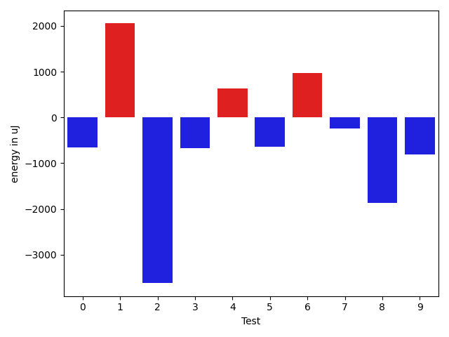
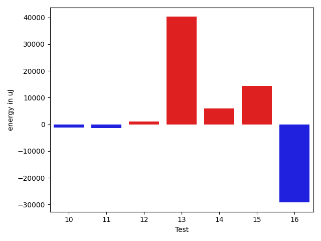

# gson c89273

https://github.com/google/gson/commit/c89273

## Delta Energy per test method

| ID | EnergyV1 | EnergyV2 | DeltaEnergy | σV1 | σV2 |
| --- | --- | --- | --- | --- | --- |
| 0 | 39062 | 37964 | -1098 | 4472.690994734043 | 3836.6223172936316 |
| 1 | 40099 | 37414 | -2685 | 4551.568215201311 | 16480.089402620582 |
| 2 | 38025 | 38757 | 732 | 13834.662096460883 | 3885.0291920028967 |
| 3 | 39856 | 39794 | -62 | 3615.092520751544 | 4104.152541845234 |
| 4 | 37597 | 37842 | 245 | 4301.963585441827 | 6579.513277570248 |
| 5 | 37536 | 38147 | 611 | 3835.893992278723 | 2777.446061735554 |
| 6 | 39368 | 39795 | 427 | 4208.898685815678 | 3563.3009738663873 |
| 7 | 38330 | 39123 | 793 | 4065.8499658248998 | 4040.234206859918 |
| 8 | 40772 | 37903 | -2869 | 5541.857539444694 | 4350.443465968926 |
| 9 | 38940 | 38086 | -854 | 3887.4784020493285 | 4601.0365511126465 |
| 10 | 39002 | 39124 | 122 | 4561.0681899748 | 3160.2255413533735 |
| 11 | 35522 | 35767 | 245 | 5590.815353300693 | 4043.2567069628412 |
| 12 | 37720 | 40038 | 2318 | 5606.694843346094 | 4557.592739197842 |
| 13 | 39489 | 41076 | 1587 | 112374.8537544239 | 196885.28380301956 |
| 14 | 45837 | 46692 | 855 | 19936.44724224433 | 53295.46024652083 |
| 15 | 124999 | 133056 | 8057 | 96733.54503658759 | 120119.22312266585 |
| 16 | 44861 | 43824 | -1037 | 220268.75528117584 | 194718.395390526 |

## Delta Duration per test method

| ID | DurationV1 | DurationsV2 | DeltaDuration |
| --- | --- | --- | --- |
| 0 | 739394.96875 | 706689.1111111111 | -32705.857638888876 |
| 1 | 720400.4545454546 | 1039907.2571428572 | 319506.8025974026 |
| 2 | 773699.5217391305 | 575283.7368421053 | -198415.7848970252 |
| 3 | 628132.8125 | 589324.8571428572 | -38807.95535714284 |
| 4 | 1170113.5810810812 | 1159251.794117647 | -10861.786963434191 |
| 5 | 593669.52 | 593021.619047619 | -647.9009523809655 |
| 6 | 824834.9375 | 827279.25 | 2444.3125 |
| 7 | 641765.5789473684 | 659684.6363636364 | 17919.057416267926 |
| 8 | 701670.8 | 616210.4230769231 | -85460.37692307692 |
| 9 | 585082.72 | 605553.1923076923 | 20470.472307692282 |
| 10 | 680033.92 | 614456.9444444445 | -65576.97555555555 |
| 11 | 936799.358490566 | 917767.6 | -19031.758490566048 |
| 12 | 825979.8717948718 | 814873.3888888889 | -11106.482905982877 |
| 13 | 1937469.8513513512 | 2892529.24 | 955059.388648649 |
| 14 | 1899742.9595959596 | 2054281.797979798 | 154538.8383838383 |
| 15 | 3709636.8659793814 | 4154481.1505376343 | 444844.2845582529 |
| 16 | 5645290.294117647 | 5077570.802816901 | -567719.4913007459 |

## Misc.

| ID | Test Class | Test Method |
| --- | --- | --- |
| 0 | com.google.gson.functional.StringTest | testEscapingQuotesInStringSerialization |
| 1 | com.google.gson.functional.StringTest | testSingleQuoteInStringSerialization |
| 2 | com.google.gson.functional.StringTest | testAssignmentCharSerialization |
| 3 | com.google.gson.EscaperTest | testParagraphSeparatorEscaping |
| 4 | com.google.gson.EscaperTest | testControlCharBlockEscaping |
| 5 | com.google.gson.EscaperTest | testRequiredEscapingUnicodeCharacter |
| 6 | com.google.gson.EscaperTest | testDoubleQuoteEscaping |
| 7 | com.google.gson.EscaperTest | testAmpersandEscaping |
| 8 | com.google.gson.EscaperTest | testLineSeparatorEscaping |
| 9 | com.google.gson.EscaperTest | testGreaterThanAndLessThanEscaping |
| 10 | com.google.gson.EscaperTest | testEqualsEscaping |
| 11 | com.google.gson.functional.PrimitiveTest | testHtmlCharacterSerialization |
| 12 | com.google.gson.functional.SecurityTest | testJsonWithNonExectuableTokenSerialization |
| 13 | com.google.gson.DefaultDateTypeAdapterTest | testDatePattern |
| 14 | com.google.gson.functional.EscapingTest | testGsonAcceptsEscapedAndNonEscapedJsonDeserialization |
| 15 | com.google.gson.functional.EscapingTest | testEscapingObjectFields |
| 16 | com.google.gson.functional.EscapingTest | testEscapingQuotesInStringArray |

| Test | IterationV1 | IterationV2 | DeltaIteration |
| --- | --- | --- | --- |
| 0 | 32 | 36 | 4 |
| 1 | 33 | 35 | 2 |
| 2 | 23 | 19 | -4 |
| 3 | 16 | 14 | -2 |
| 4 | 74 | 68 | -6 |
| 5 | 25 | 21 | -4 |
| 6 | 32 | 28 | -4 |
| 7 | 19 | 22 | 3 |
| 8 | 20 | 26 | 6 |
| 9 | 25 | 26 | 1 |
| 10 | 25 | 18 | -7 |
| 11 | 53 | 50 | -3 |
| 12 | 39 | 36 | -3 |
| 13 | 74 | 75 | 1 |
| 14 | 99 | 99 | 0 |
| 15 | 97 | 93 | -4 |
| 16 | 68 | 71 | 3 |

| Time Label | Time (s) |
| --- | --- |
| Selection | 25.37977385520935 |
| Injection | 9.260974884033203 |
| Total | 974.4975764751434 |

