# gson 536a96

https://github.com/google/gson/commit/536a96

## Delta Energy per test method

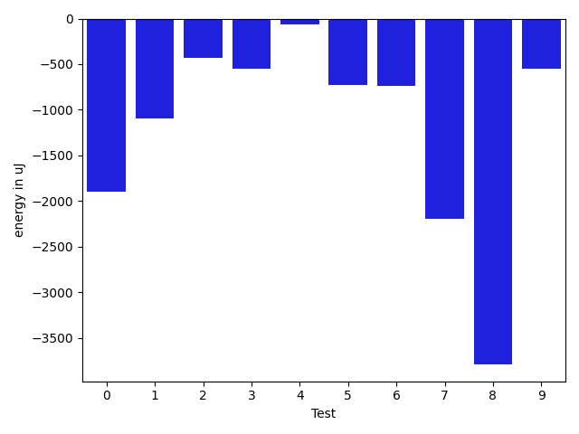

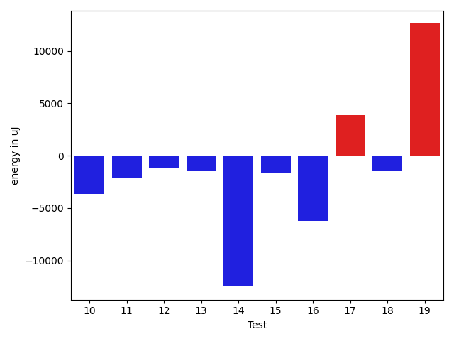

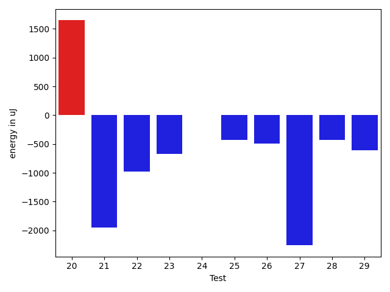

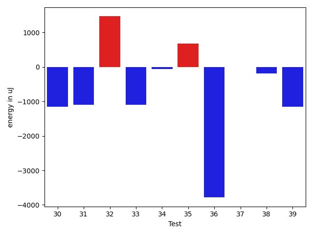

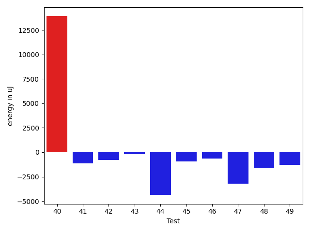

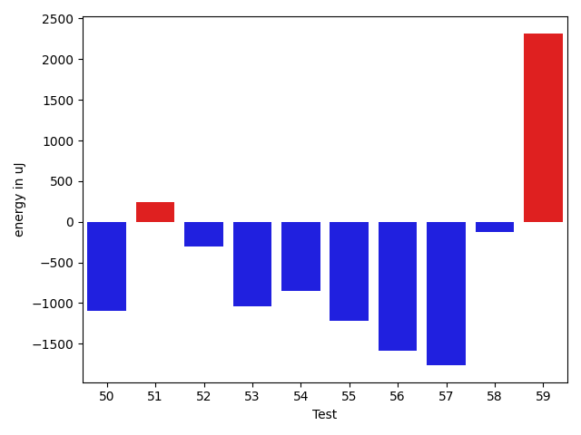

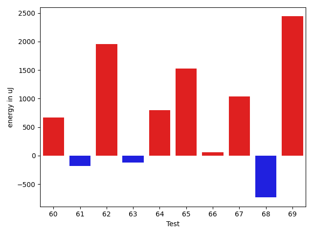

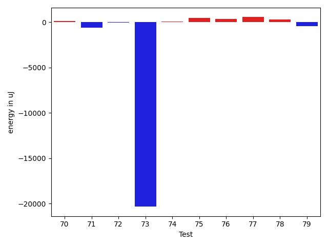

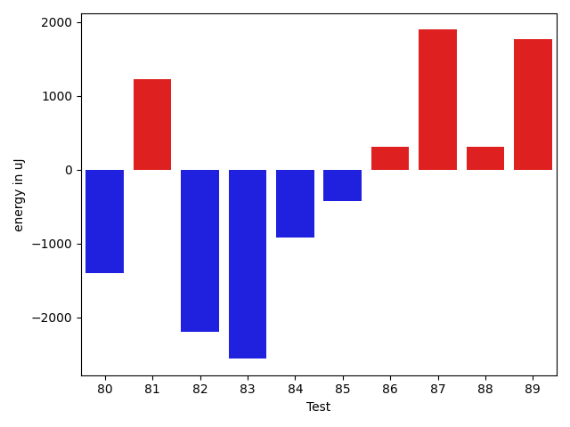

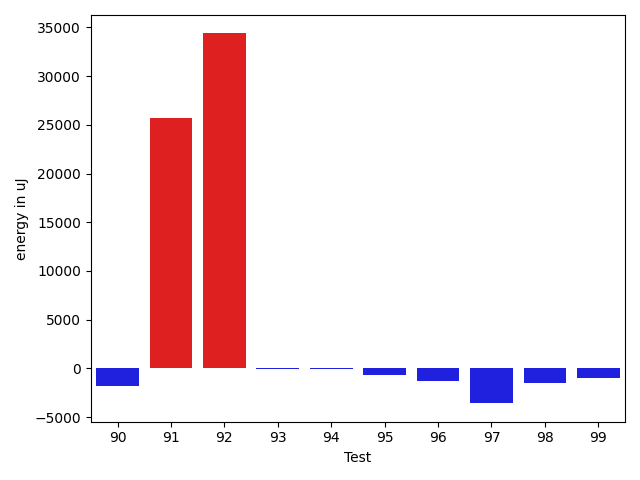

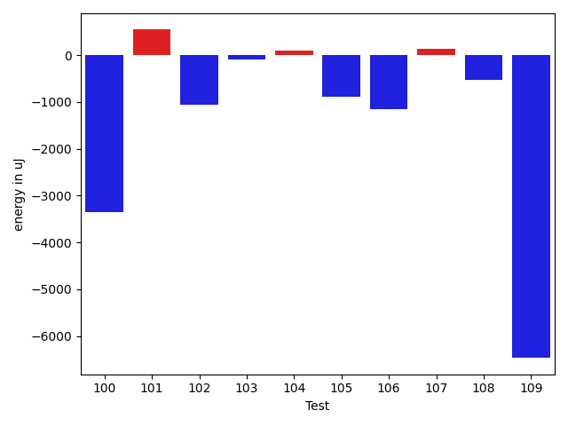

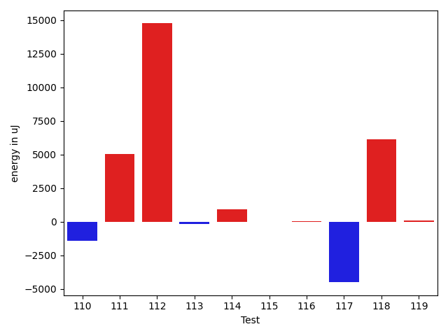

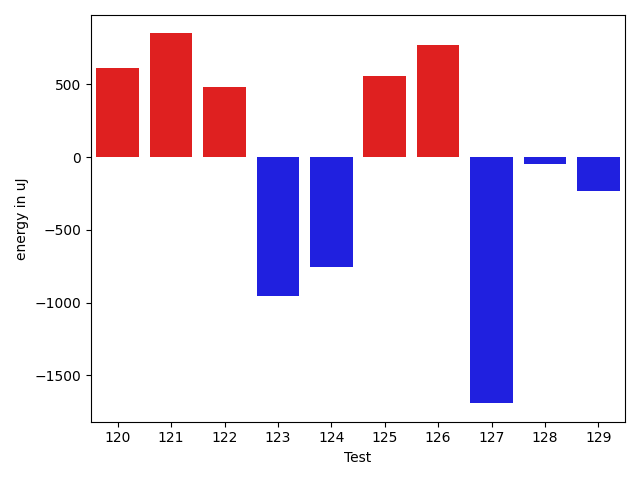

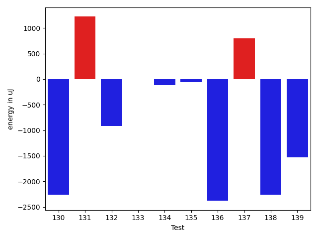

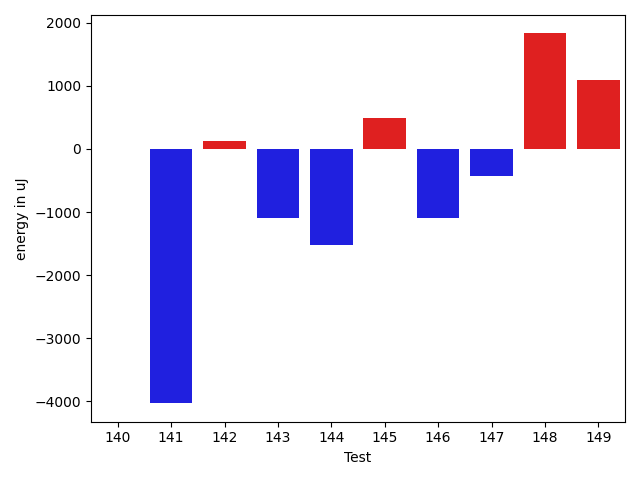

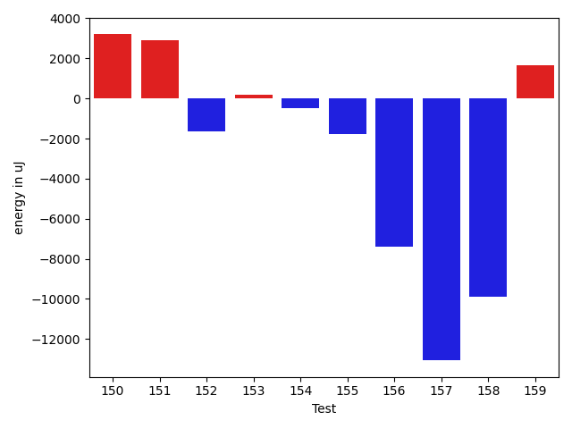

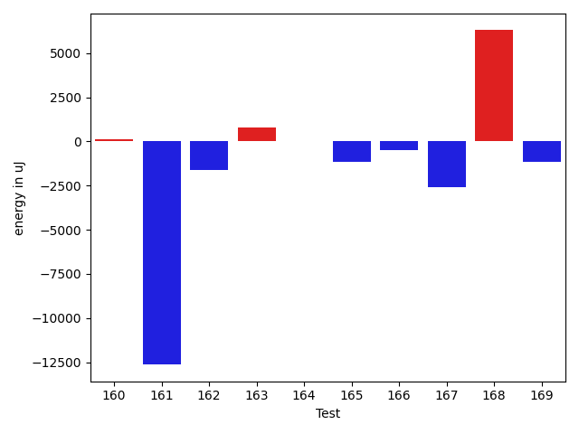

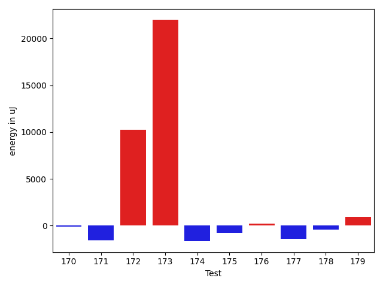

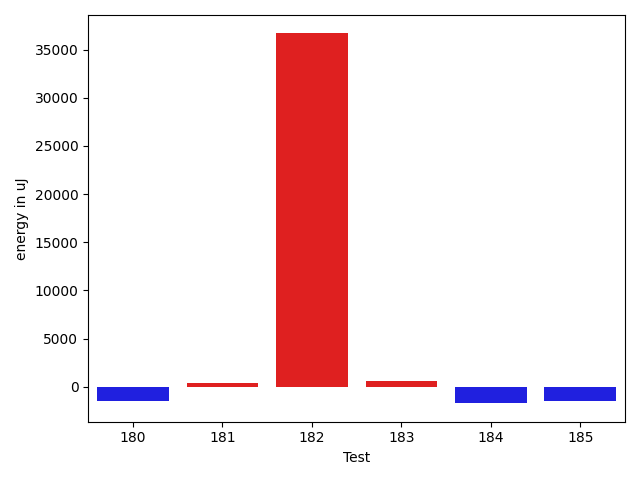

| ID | EnergyV1 | EnergyV2 | DeltaEnergy | σV1 | σV2 |
| --- | --- | --- | --- | --- | --- |
| 0 | 36865 | 34973 | -1892 | 3923.0880135559437 | 3932.258025648998 |
| 1 | 37048 | 35950 | -1098 | 4230.378449216414 | 3395.6410922380946 |
| 2 | 36499 | 36072 | -427 | 3235.3599036759074 | 5281.8758037221305 |
| 3 | 36132 | 35583 | -549 | 4342.390660638446 | 6180.687123911071 |
| 4 | 37659 | 37597 | -62 | 61264.23147290448 | 61274.71989909876 |
| 5 | 36926 | 36194 | -732 | 11774.877920759503 | 10319.058911230475 |
| 6 | 36377 | 35644 | -733 | 4167.684709713443 | 3585.513356132727 |
| 7 | 38696 | 36499 | -2197 | 4676.749039498475 | 4531.919861738288 |
| 8 | 41565 | 37781 | -3784 | 103738.92581990526 | 74126.68606883212 |
| 9 | 36866 | 36315 | -551 | 8857.228280447887 | 10352.915689639087 |
| 10 | 56580 | 41443 | -15137 | 31187.081389931114 | 28221.074156754203 |
| 11 | 35767 | 36743 | 976 | 60065.928791100036 | 53883.06548594564 |
| 12 | 37598 | 36132 | -1466 | 4394.332747699018 | 4558.398939184315 |
| 13 | 36865 | 35401 | -1464 | 7713.554279278456 | 6697.325674247802 |
| 14 | 38330 | 37597 | -733 | 111464.87234556596 | 83818.27612538103 |
| 15 | 34851 | 33569 | -1282 | 2822.918794712655 | 2163.6427832092186 |
| 16 | 36926 | 35339 | -1587 | 34600.92444369359 | 25087.465046655863 |
| 17 | 35401 | 34179 | -1222 | 3477.998197690447 | 19710.512172782866 |
| 18 | 36866 | 35095 | -1771 | 10861.871127011034 | 9949.511859885388 |
| 19 | 36010 | 36438 | 428 | 3406.742007633681 | 69171.9138278213 |
| 20 | 36927 | 38574 | 1647 | 17665.236646690286 | 17668.554301859804 |
| 21 | 36988 | 35034 | -1954 | 22671.746023922427 | 4246.829284574356 |
| 22 | 36377 | 35400 | -977 | 3466.131654834918 | 2947.530830757142 |
| 23 | 35400 | 34729 | -671 | 3152.025741568461 | 4190.282945923522 |
| 24 | 36011 | 36011 | 0 | 2998.792687375045 | 4144.383026168072 |
| 25 | 38574 | 38147 | -427 | 107075.31672995024 | 108737.53291129229 |
| 26 | 36071 | 35584 | -487 | 26369.25525149882 | 3749.6170575629912 |
| 27 | 38085 | 35827 | -2258 | 3911.9193842279087 | 5041.790754452962 |
| 28 | 34790 | 34362 | -428 | 9036.57022317291 | 3325.5483188631842 |
| 29 | 35889 | 35278 | -611 | 3453.4710307167775 | 3542.2756541513572 |
| 30 | 36743 | 35583 | -1160 | 55869.39721719811 | 30116.331250235926 |
| 31 | 38269 | 37171 | -1098 | 17784.936489031144 | 16238.703204963413 |
| 32 | 35339 | 36804 | 1465 | 12035.919474080889 | 6442.61597299139 |
| 33 | 36499 | 35400 | -1099 | 3984.7134882364294 | 5065.415400756608 |
| 34 | 36072 | 36011 | -61 | 3769.789461205782 | 4465.442630481194 |
| 35 | 34485 | 35156 | 671 | 4138.777684967621 | 3420.142596279998 |
| 36 | 36682 | 32898 | -3784 | 26854.459397854585 | 3105.0010969979185 |
| 37 | 35400 | 35400 | 0 | 3766.063197759451 | 3761.508869373433 |
| 38 | 35217 | 35034 | -183 | 8547.679782082667 | 4074.6256418984062 |
| 39 | 35766 | 34607 | -1159 | 3636.3640387604873 | 17564.657045847158 |
| 40 | 38024 | 37659 | -365 | 52051.745866605095 | 77272.12860410368 |
| 41 | 36255 | 35156 | -1099 | 3693.894599193239 | 3911.668058456304 |
| 42 | 39002 | 36682 | -2320 | 18090.419178333774 | 20200.57310253204 |
| 43 | 34668 | 35339 | 671 | 7627.545235374058 | 6465.2261888101475 |
| 44 | 35034 | 36133 | 1099 | 28344.800407040864 | 3400.297212171816 |
| 45 | 35706 | 35400 | -306 | 5813.383068052834 | 5314.831496068076 |
| 46 | 35035 | 34912 | -123 | 3582.414765629743 | 3204.1754683758963 |
| 47 | 35767 | 35278 | -489 | 19707.522766907015 | 3633.8587984275714 |
| 48 | 36194 | 35583 | -611 | 14072.310781328031 | 12149.45821648751 |
| 49 | 36866 | 36743 | -123 | 10262.297404547144 | 7959.21475407745 |
| 50 | 39428 | 38330 | -1098 | 59870.42148755988 | 60760.780052924674 |
| 51 | 37598 | 37841 | 243 | 5011.0523366564485 | 3532.546832118049 |
| 52 | 38880 | 38574 | -306 | 4007.908602802845 | 4246.793863087254 |
| 53 | 39429 | 38391 | -1038 | 17899.919442897564 | 20155.295803029036 |
| 54 | 39184 | 38330 | -854 | 95544.35951283285 | 65486.801470830746 |
| 55 | 38635 | 37414 | -1221 | 4400.285386166293 | 3910.4876818271937 |
| 56 | 37232 | 35644 | -1588 | 3571.275435843312 | 4517.578333699314 |
| 57 | 39001 | 37232 | -1769 | 594687.9730390898 | 354119.9584951137 |
| 58 | 36437 | 36316 | -121 | 3976.0922790127106 | 3649.5634791664675 |
| 59 | 35766 | 38086 | 2320 | 3591.1324370587995 | 3984.0662192103755 |
| 60 | 35523 | 36193 | 670 | 3754.9462727248374 | 3823.0084171233334 |
| 61 | 37109 | 36926 | -183 | 63753.51971293528 | 45557.49605958208 |
| 62 | 35766 | 37720 | 1954 | 3709.650441777645 | 5248.148958759967 |
| 63 | 36010 | 35888 | -122 | 4055.348370752292 | 26160.357362689192 |
| 64 | 35400 | 36194 | 794 | 4400.762221087944 | 4335.1840340946965 |
| 65 | 36316 | 37842 | 1526 | 23293.50254482655 | 4454.001905124276 |
| 66 | 36194 | 36255 | 61 | 9584.939182036733 | 10429.079822639022 |
| 67 | 34912 | 35950 | 1038 | 6574.017823238129 | 6495.323838128705 |
| 68 | 36499 | 35766 | -733 | 3770.819398024892 | 3376.692596696112 |
| 69 | 34912 | 37353 | 2441 | 8634.037363074782 | 9227.461371661468 |
| 70 | 36316 | 36437 | 121 | 7340.07587180735 | 8405.996588010368 |
| 71 | 37476 | 36865 | -611 | 11521.642706227804 | 11085.474134917205 |
| 72 | 35401 | 35339 | -62 | 38647.81576321367 | 65625.74689298664 |
| 73 | 65430 | 45105 | -20325 | 23314.167503122142 | 22013.086012156364 |
| 74 | 37170 | 37232 | 62 | 14166.679321738051 | 26675.966213912725 |
| 75 | 35949 | 36437 | 488 | 6942.46812629254 | 11334.50444241219 |
| 76 | 37109 | 37476 | 367 | 23721.141444867353 | 16081.301946194062 |
| 77 | 34546 | 35095 | 549 | 6801.629625934881 | 4010.914422755324 |
| 78 | 36987 | 37292 | 305 | 3937.762476456351 | 36280.41518468791 |
| 79 | 39124 | 38697 | -427 | 74041.20324446217 | 66635.4229100685 |
| 80 | 35889 | 34485 | -1404 | 4884.696671320849 | 3803.4230453773307 |
| 81 | 34607 | 35827 | 1220 | 24115.880764230216 | 23380.828268381676 |
| 82 | 36377 | 34180 | -2197 | 3765.2147266125476 | 3729.1500125801495 |
| 83 | 37353 | 34790 | -2563 | 4256.110323894722 | 2675.32631698336 |
| 84 | 37293 | 36377 | -916 | 17285.84651685409 | 2794.3642178896835 |
| 85 | 35767 | 35339 | -428 | 3958.436616050362 | 3767.6114051686277 |
| 86 | 35156 | 35461 | 305 | 4314.264851932486 | 3635.78119620346 |
| 87 | 33325 | 35217 | 1892 | 4597.292368609294 | 3827.0712205267528 |
| 88 | 37964 | 38269 | 305 | 8171.9375353668465 | 116878.68317503236 |
| 89 | 36743 | 38513 | 1770 | 4403.870602649595 | 4224.279159032331 |
| 90 | 37964 | 35950 | -2014 | 4578.302030706908 | 2974.934248676871 |
| 91 | 38147 | 38086 | -61 | 49326.811334403516 | 81167.6379251137 |
| 92 | 36926 | 37476 | 550 | 4836.131666297694 | 100622.15310800806 |
| 93 | 38330 | 36438 | -1892 | 4265.137767012648 | 7248.3918236073205 |
| 94 | 36682 | 35522 | -1160 | 4805.41681117354 | 8474.939505365142 |
| 95 | 38147 | 34668 | -3479 | 3845.84329921264 | 4130.315763465466 |
| 96 | 36133 | 34851 | -1282 | 3849.7156845721497 | 2744.201101586838 |
| 97 | 34118 | 34912 | 794 | 21991.598575524804 | 3608.1372961342677 |
| 98 | 35645 | 33630 | -2015 | 3479.7162792508025 | 2397.525084490706 |
| 99 | 35034 | 34668 | -366 | 4946.980425254012 | 2940.4719292431046 |
| 100 | 35522 | 35218 | -304 | 41643.04399488587 | 37308.129311485885 |
| 101 | 34485 | 35279 | 794 | 2868.8845916139603 | 2936.8953391389155 |
| 102 | 36865 | 34668 | -2197 | 3406.166003331261 | 3301.653283795862 |
| 103 | 33203 | 34179 | 976 | 3740.0705948417603 | 3616.486823587165 |
| 104 | 34118 | 33570 | -548 | 3398.145621351717 | 2538.547313848309 |
| 105 | 34545 | 34668 | 123 | 3888.276538893109 | 4258.162347961527 |
| 106 | 35217 | 35828 | 611 | 9099.04820924138 | 3967.3546811571778 |
| 107 | 33692 | 33874 | 182 | 2816.537544148844 | 3093.406817494332 |
| 108 | 35461 | 33691 | -1770 | 2785.743122109839 | 3526.6461873588696 |
| 109 | 33753 | 33203 | -550 | 31930.049071858197 | 3420.5353473458813 |
| 110 | 36255 | 35400 | -855 | 3307.7171083899852 | 4269.970125814262 |
| 111 | 34851 | 33936 | -915 | 3469.247369387199 | 29493.810438914075 |
| 112 | 34729 | 34851 | 122 | 32201.421950429914 | 77174.20005307694 |
| 113 | 35339 | 34301 | -1038 | 3445.8547633352164 | 3659.1911899941165 |
| 114 | 34607 | 35950 | 1343 | 3038.0104533624017 | 4030.7431275138333 |
| 115 | 33142 | 34485 | 1343 | 3886.7072798565546 | 3133.017164175838 |
| 116 | 35217 | 35095 | -122 | 3978.12524811241 | 3233.5574997464737 |
| 117 | 34912 | 35217 | 305 | 33346.90460178668 | 21194.000420460565 |
| 118 | 36193 | 36133 | -60 | 52538.72701883515 | 57852.21748322883 |
| 119 | 33386 | 33020 | -366 | 3887.220419015539 | 3403.4595681779765 |
| 120 | 34668 | 33692 | -976 | 2984.1526823212243 | 3381.523649762902 |
| 121 | 33630 | 34057 | 427 | 2534.4610952251514 | 3589.0938353007364 |
| 122 | 33814 | 33874 | 60 | 3329.1459703603805 | 3351.3914209992545 |
| 123 | 33264 | 33447 | 183 | 3974.3369336909523 | 4471.0791742317115 |
| 124 | 35096 | 34180 | -916 | 3422.4313199829153 | 4036.9764254603 |
| 125 | 33081 | 33996 | 915 | 3229.822439360393 | 3758.660733612037 |
| 126 | 33631 | 34973 | 1342 | 3909.168114438003 | 3273.1662394032523 |
| 127 | 35889 | 35156 | -733 | 3607.896370770954 | 3740.203922270187 |
| 128 | 33996 | 34302 | 306 | 4096.507742223706 | 3189.3329629758778 |
| 129 | 34974 | 34545 | -429 | 3685.2560732274114 | 4416.1479192215065 |
| 130 | 36255 | 33996 | -2259 | 3900.293440483036 | 4194.093569798154 |
| 131 | 34180 | 35401 | 1221 | 4036.6345124992426 | 27193.522634632627 |
| 132 | 34424 | 33508 | -916 | 3979.5069432065843 | 3374.1596817852896 |
| 133 | 35584 | 35583 | -1 | 4639.129894741141 | 5657.52756194494 |
| 134 | 140807 | 140685 | -122 | 28175.504730884917 | 30084.68213115369 |
| 135 | 35888 | 35828 | -60 | 4487.642784810346 | 45379.217038819006 |
| 136 | 35949 | 33569 | -2380 | 4801.459006045422 | 3673.624515506829 |
| 137 | 36072 | 36866 | 794 | 3687.2963307509244 | 4451.424525000411 |
| 138 | 37598 | 35340 | -2258 | 4376.117163148804 | 30873.942250462573 |
| 139 | 36499 | 34973 | -1526 | 34183.47986418293 | 2643.729760941706 |
| 140 | 36499 | 36499 | 0 | 4552.691241143008 | 3769.937124275106 |
| 141 | 39002 | 34973 | -4029 | 32360.86409905727 | 3295.3415704772856 |
| 142 | 35950 | 36072 | 122 | 3629.120700503571 | 3677.396616634254 |
| 143 | 35461 | 34363 | -1098 | 3432.090768721751 | 3106.9731245594476 |
| 144 | 36560 | 35034 | -1526 | 5053.479246708507 | 3696.9043021832654 |
| 145 | 35462 | 35949 | 487 | 79020.13093973447 | 17635.31673252235 |
| 146 | 38513 | 37414 | -1099 | 80749.24319320593 | 66011.23219650639 |
| 147 | 35584 | 35157 | -427 | 3592.997747219366 | 8376.914723230553 |
| 148 | 34119 | 35949 | 1830 | 8900.64956874497 | 3707.214151137845 |
| 149 | 35462 | 36560 | 1098 | 4145.277014706964 | 3992.72846083771 |
| 150 | 36438 | 36194 | -244 | 5408.470959685005 | 23258.576344638328 |
| 151 | 38391 | 38208 | -183 | 58320.25282394382 | 60008.444867817656 |
| 152 | 37598 | 37171 | -427 | 5758.905666074323 | 4087.5106926895246 |
| 153 | 36682 | 37293 | 611 | 3617.3200245830812 | 3609.154772734708 |
| 154 | 35340 | 34363 | -977 | 4355.463969416908 | 4939.83198094834 |
| 155 | 36682 | 34607 | -2075 | 3217.800537261438 | 3482.1076031621997 |
| 156 | 36071 | 36377 | 306 | 37508.6367207645 | 3832.988952318249 |
| 157 | 39184 | 39612 | 428 | 76117.88325016927 | 58133.51140122825 |
| 158 | 35095 | 34057 | -1038 | 37367.89976531659 | 4168.070909635592 |
| 159 | 36316 | 36316 | 0 | 4945.316566633008 | 4684.591682395514 |
| 160 | 36560 | 36132 | -428 | 4499.657305592126 | 3955.2726757467058 |
| 161 | 35584 | 35096 | -488 | 44177.54001504172 | 4406.099748818653 |
| 162 | 36438 | 34973 | -1465 | 3223.853380027844 | 3426.370724227568 |
| 163 | 34607 | 34668 | 61 | 3032.924861391022 | 3514.134459409734 |
| 164 | 36804 | 35706 | -1098 | 4795.002266944199 | 3347.5682368835614 |
| 165 | 36194 | 35034 | -1160 | 4210.256241534138 | 4683.791715101113 |
| 166 | 38879 | 39673 | 794 | 95751.88442444146 | 100323.38561049484 |
| 167 | 37414 | 35400 | -2014 | 4063.0594153297834 | 4054.4246702861296 |
| 168 | 36255 | 36499 | 244 | 4021.681091473103 | 30711.836589375776 |
| 169 | 37780 | 36682 | -1098 | 14857.801696324017 | 20621.327605786304 |
| 170 | 38574 | 38452 | -122 | 46171.439450975064 | 29031.548042371665 |
| 171 | 38392 | 36804 | -1588 | 138546.4809611211 | 58422.1143261652 |
| 172 | 363891 | 374144 | 10253 | 107622.33142579814 | 126038.11124958482 |
| 173 | 46570 | 68542 | 21972 | 34685.09635989137 | 72624.72595300592 |
| 174 | 71045 | 69397 | -1648 | 34334.82135384229 | 31173.509421885105 |
| 175 | 37598 | 36804 | -794 | 77160.7021659588 | 3958.9633095700733 |
| 176 | 37780 | 38024 | 244 | 46437.88232453599 | 59375.156918353656 |
| 177 | 36804 | 35339 | -1465 | 3845.18319977654 | 4044.690674697307 |
| 178 | 37842 | 37414 | -428 | 57035.79516533908 | 47470.54715147659 |
| 179 | 37475 | 38391 | 916 | 29006.21648861456 | 14071.541148823406 |
| 180 | 37292 | 35766 | -1526 | 3633.827430957584 | 3185.1436745823357 |
| 181 | 35157 | 35523 | 366 | 4794.208802587365 | 27844.49765204784 |
| 182 | 34363 | 71045 | 36682 | 57177.0288615675 | 29880.133389658782 |
| 183 | 34607 | 35157 | 550 | 4131.097812824104 | 3997.078356947938 |
| 184 | 37842 | 36133 | -1709 | 45183.81424030194 | 34853.24947302959 |
| 185 | 36377 | 34912 | -1465 | 15183.029038334971 | 13933.052436276977 |

## Delta Duration per test method

| ID | DurationV1 | DurationsV2 | DeltaDuration |
| --- | --- | --- | --- |
| 0 | 902086.5873015873 | 890541.5967741936 | -11544.990527393762 |
| 1 | 880618.5192307692 | 813308.625 | -67309.89423076925 |
| 2 | 818718.1071428572 | 822688.8965517242 | 3970.7894088670146 |
| 3 | 963291.42 | 906531.1940298508 | -56760.22597014927 |
| 4 | 1356275.5272727273 | 1406476.8214285714 | 50201.29415584402 |
| 5 | 1209304.01369863 | 1175841.2692307692 | -33462.744467860786 |
| 6 | 624105.8974358974 | 630124.75 | 6018.852564102621 |
| 7 | 808590.304347826 | 742421.5294117647 | -66168.77493606135 |
| 8 | 2099638.448979592 | 1945989.808080808 | -153648.64089878392 |
| 9 | 1156923.0128205128 | 1120153.3766233767 | -36769.63619713602 |
| 10 | 1699356.5223880596 | 1710330.4 | 10973.877611940261 |
| 11 | 1269634.85 | 1270823.1590909092 | 1188.3090909090824 |
| 12 | 682268.15 | 648265.6585365854 | -34002.491463414626 |
| 13 | 793772.0 | 736066.5428571429 | -57705.457142857136 |
| 14 | 2086238.5384615385 | 1871252.4705882352 | -214986.0678733033 |
| 15 | 536132.9047619047 | 508808.8333333333 | -27324.07142857142 |
| 16 | 1659191.9677419355 | 1529848.1170212766 | -129343.8507206589 |
| 17 | 460825.9130434783 | 589872.4347826086 | 129046.52173913037 |
| 18 | 1009982.8142857143 | 1001186.0757575758 | -8796.738528138492 |
| 19 | 666402.0952380953 | 1099658.7741935484 | 433256.6789554531 |
| 20 | 1488866.8395061728 | 1389023.7613636365 | -99843.07814253634 |
| 21 | 860068.6428571428 | 707892.8529411765 | -152175.78991596634 |
| 22 | 561368.027027027 | 570093.4583333334 | 8725.43130630639 |
| 23 | 590094.3928571428 | 601016.9210526316 | 10922.528195488732 |
| 24 | 885086.9230769231 | 909056.8421052631 | 23969.919028340024 |
| 25 | 1911451.261904762 | 2034385.525 | 122934.26309523801 |
| 26 | 873705.1842105263 | 654135.2 | -219569.98421052634 |
| 27 | 751202.3684210526 | 758922.2432432432 | 7719.8748221906135 |
| 28 | 665755.7586206896 | 687558.75 | 21802.991379310377 |
| 29 | 739013.7333333333 | 667248.1538461539 | -71765.5794871794 |
| 30 | 1200719.262295082 | 983050.9814814815 | -217668.28081360052 |
| 31 | 1338608.0317460317 | 1265036.3666666667 | -73571.66507936502 |
| 32 | 721554.2702702703 | 619829.0 | -101725.2702702703 |
| 33 | 555471.75 | 549023.4666666667 | -6448.283333333326 |
| 34 | 948389.2909090909 | 922906.3157894737 | -25482.975119617186 |
| 35 | 587273.6875 | 592480.9 | 5207.212500000023 |
| 36 | 938192.5102040817 | 742654.6904761905 | -195537.81972789112 |
| 37 | 738499.8780487805 | 754223.575 | 15723.696951219463 |
| 38 | 768946.4545454546 | 721846.0 | -47100.45454545459 |
| 39 | 791019.4651162791 | 853039.3793103448 | 62019.91419406573 |
| 40 | 1535278.7462686568 | 2098093.9402985075 | 562815.1940298507 |
| 41 | 847161.5 | 910175.6170212766 | 63014.117021276616 |
| 42 | 1514502.412371134 | 1558843.3092783506 | 44340.89690721664 |
| 43 | 918300.2692307692 | 883096.0161290322 | -35204.253101737006 |
| 44 | 929834.8085106383 | 745671.8823529412 | -184162.9261576971 |
| 45 | 964645.567164179 | 1007085.375 | 42439.807835820946 |
| 46 | 838116.1525423729 | 863078.524590164 | 24962.372047791025 |
| 47 | 971094.7627118644 | 900696.8064516129 | -70397.95626025158 |
| 48 | 1145707.5 | 1151552.9295774647 | 5845.4295774647035 |
| 49 | 1159723.1 | 1101404.5421686748 | -58318.557831325335 |
| 50 | 1301645.7142857143 | 1444447.8157894737 | 142802.1015037594 |
| 51 | 537066.6923076923 | 622538.0 | 85471.30769230775 |
| 52 | 517583.5263157895 | 567747.0 | 50163.473684210505 |
| 53 | 1253719.822222222 | 1227174.8 | -26545.022222222062 |
| 54 | 2092351.5 | 1643006.72 | -449344.78 |
| 55 | 624270.2258064516 | 699733.1666666666 | 75462.94086021499 |
| 56 | 733861.7826086957 | 898053.5769230769 | 164191.7943143812 |
| 57 | 5756491.72368421 | 3181708.6172839506 | -2574783.10640026 |
| 58 | 780147.9464285715 | 768656.4905660377 | -11491.455862533767 |
| 59 | 816952.2545454545 | 771247.5 | -45704.75454545452 |
| 60 | 1065650.1851851852 | 1096139.6883116884 | 30489.5031265032 |
| 61 | 1711068.8070175438 | 1305641.2631578948 | -405427.543859649 |
| 62 | 793272.2978723404 | 820069.5666666667 | 26797.268794326228 |
| 63 | 817113.4285714285 | 1011824.5510204082 | 194711.12244897964 |
| 64 | 784021.3255813953 | 860691.4905660377 | 76670.16498464241 |
| 65 | 881574.4883720931 | 807504.9756097561 | -74069.51276233699 |
| 66 | 1271296.3483146068 | 1233094.808988764 | -38201.53932584287 |
| 67 | 1023375.530120482 | 1040743.4358974359 | 17367.905776953907 |
| 68 | 842004.7586206896 | 830969.1228070175 | -11035.635813672096 |
| 69 | 1193908.831460674 | 1181317.392857143 | -12591.438603531104 |
| 70 | 1179938.3296703296 | 1166267.7790697673 | -13670.550600562245 |
| 71 | 1344515.0315789473 | 1313151.2448979593 | -31363.786680988036 |
| 72 | 1519545.3372093022 | 1595727.875 | 76182.53779069777 |
| 73 | 1887505.5555555555 | 1797861.5959595959 | -89643.95959595963 |
| 74 | 1317083.4047619049 | 1510343.5294117648 | 193260.12464985996 |
| 75 | 1236931.2258064516 | 1198596.0444444444 | -38335.18136200728 |
| 76 | 1615993.6262626264 | 1539505.0808080807 | -76488.54545454565 |
| 77 | 824393.0222222222 | 741231.1111111111 | -83161.91111111105 |
| 78 | 506528.3888888889 | 730400.4 | 223872.01111111115 |
| 79 | 1863924.4464285714 | 1863459.5384615385 | -464.9079670328647 |
| 80 | 905399.2881355932 | 856446.2089552239 | -48953.07918036927 |
| 81 | 1027831.8775510204 | 976423.0444444445 | -51408.83310657588 |
| 82 | 625059.59375 | 609553.5357142857 | -15506.058035714319 |
| 83 | 574484.8518518518 | 527755.28125 | -46729.570601851796 |
| 84 | 679561.7567567568 | 612854.7666666667 | -66706.99009009008 |
| 85 | 590915.5483870967 | 579149.6206896552 | -11765.92769744154 |
| 86 | 688903.2962962963 | 618696.2888888889 | -70207.0074074074 |
| 87 | 511419.0689655172 | 451421.5238095238 | -59997.54515599343 |
| 88 | 884866.8510638297 | 1630482.7857142857 | 745615.934650456 |
| 89 | 815467.0408163265 | 677216.0789473684 | -138250.96186895808 |
| 90 | 645649.03125 | 708877.0555555555 | 63228.024305555504 |
| 91 | 1203199.1176470588 | 2009388.918367347 | 806189.8007202882 |
| 92 | 818418.5 | 2131779.052631579 | 1313360.5526315789 |
| 93 | 508856.57692307694 | 648548.3793103448 | 139691.80238726788 |
| 94 | 610313.4848484849 | 710239.2777777778 | 99925.79292929289 |
| 95 | 482858.8333333333 | 531436.1290322581 | 48577.29569892475 |
| 96 | 538352.8214285715 | 510927.5909090909 | -27425.230519480596 |
| 97 | 757944.3409090909 | 658520.9142857143 | -99423.42662337667 |
| 98 | 586548.5 | 574584.6666666666 | -11963.833333333372 |
| 99 | 641108.0370370371 | 603764.875 | -37343.16203703708 |
| 100 | 1131418.35 | 957189.0 | -174229.3500000001 |
| 101 | 500558.52 | 503498.1379310345 | 2939.617931034474 |
| 102 | 598505.8888888889 | 521491.4 | -77014.48888888885 |
| 103 | 499092.24 | 454192.2173913043 | -44900.02260869567 |
| 104 | 550687.0606060605 | 459720.8181818182 | -90966.24242424237 |
| 105 | 579515.5294117647 | 518381.375 | -61134.1544117647 |
| 106 | 896725.4390243902 | 884911.7142857143 | -11813.724738675868 |
| 107 | 544666.72 | 464258.21428571426 | -80408.50571428571 |
| 108 | 474243.3157894737 | 486281.9130434783 | 12038.597254004562 |
| 109 | 654775.3793103448 | 467204.42424242425 | -187570.95506792056 |
| 110 | 471077.44444444444 | 420299.4210526316 | -50778.023391812865 |
| 111 | 468708.7 | 635431.4166666666 | 166722.71666666662 |
| 112 | 806496.2962962963 | 1297759.9069767443 | 491263.610680448 |
| 113 | 530123.45 | 439024.0 | -91099.44999999995 |
| 114 | 447569.95238095237 | 436127.28 | -11442.67238095234 |
| 115 | 470123.53846153844 | 493098.9285714286 | 22975.39010989014 |
| 116 | 463821.5909090909 | 441801.1666666667 | -22020.424242424197 |
| 117 | 971651.7045454546 | 869561.2291666666 | -102090.47537878796 |
| 118 | 1274382.1081081082 | 1392011.2432432433 | 117629.13513513515 |
| 119 | 608679.6521739131 | 623406.1666666666 | 14726.514492753544 |
| 120 | 447705.13636363635 | 479880.0 | 32174.863636363647 |
| 121 | 614803.4166666666 | 644864.875 | 30061.458333333372 |
| 122 | 425618.2631578947 | 504069.9411764706 | 78451.67801857588 |
| 123 | 575517.59375 | 601098.1153846154 | 25580.521634615376 |
| 124 | 433710.2 | 400231.7083333333 | -33478.4916666667 |
| 125 | 449747.64285714284 | 454822.52173913043 | 5074.878881987592 |
| 126 | 536863.5357142857 | 557561.1153846154 | 20697.579670329695 |
| 127 | 493646.5 | 409883.7272727273 | -83762.7727272727 |
| 128 | 453792.44444444444 | 467303.4285714286 | 13510.984126984142 |
| 129 | 501237.8823529412 | 468348.55555555556 | -32889.32679738564 |
| 130 | 574074.625 | 569341.4333333333 | -4733.191666666651 |
| 131 | 653559.65625 | 853154.4117647059 | 199594.7555147059 |
| 132 | 981486.2941176471 | 1034777.8974358974 | 53291.60331825027 |
| 133 | 947409.7741935484 | 934450.7 | -12959.074193548411 |
| 134 | 4344146.070707071 | 4434865.787878788 | 90719.71717171744 |
| 135 | 565726.5555555555 | 891922.8888888889 | 326196.3333333334 |
| 136 | 584943.5357142857 | 631495.8148148148 | 46552.27910052915 |
| 137 | 454482.57692307694 | 485645.3461538461 | 31162.76923076919 |
| 138 | 631031.7647058824 | 827222.5428571429 | 196190.77815126046 |
| 139 | 762886.75 | 464251.4 | -298635.35 |
| 140 | 617640.5609756098 | 710509.7555555556 | 92869.19457994576 |
| 141 | 678905.9444444445 | 469077.54545454547 | -209828.39898989903 |
| 142 | 405400.0 | 455733.45454545453 | 50333.45454545453 |
| 143 | 550696.0322580645 | 551211.4 | 515.3677419355372 |
| 144 | 491033.22222222225 | 490949.04761904763 | -84.17460317461519 |
| 145 | 1250676.7727272727 | 1052402.5901639345 | -198274.1825633382 |
| 146 | 1777353.9642857143 | 1521470.5 | -255883.46428571432 |
| 147 | 774010.78125 | 655947.9411764706 | -118062.8400735294 |
| 148 | 683778.28 | 697033.6363636364 | 13255.356363636325 |
| 149 | 879087.7924528302 | 905719.9818181818 | 26632.189365351573 |
| 150 | 1032279.2941176471 | 1042077.2413793104 | 9797.94726166327 |
| 151 | 1420774.619047619 | 1455058.0983606558 | 34283.47931303689 |
| 152 | 781790.3076923077 | 740710.8709677419 | -41079.43672456581 |
| 153 | 644717.8064516129 | 639844.2727272727 | -4873.5337243401445 |
| 154 | 496736.3333333333 | 470069.36 | -26666.973333333328 |
| 155 | 423972.72 | 421763.64 | -2209.079999999958 |
| 156 | 649242.0869565217 | 558238.9375 | -91003.14945652173 |
| 157 | 1817431.08 | 1573757.619047619 | -243673.46095238114 |
| 158 | 776190.619047619 | 554190.3913043478 | -222000.22774327127 |
| 159 | 547230.8181818182 | 574781.8461538461 | 27551.027972027892 |
| 160 | 493740.4090909091 | 486132.652173913 | -7607.756916996092 |
| 161 | 838390.6428571428 | 430188.5294117647 | -408202.11344537814 |
| 162 | 432111.0588235294 | 430528.1875 | -1582.871323529398 |
| 163 | 443905.5625 | 419820.4137931034 | -24085.14870689658 |
| 164 | 421981.15 | 423246.92307692306 | 1265.7730769230402 |
| 165 | 382387.9411764706 | 426307.5294117647 | 43919.5882352941 |
| 166 | 2120857.375 | 1889529.25 | -231328.125 |
| 167 | 515848.625 | 489204.5 | -26644.125 |
| 168 | 491058.5652173913 | 762646.5263157894 | 271587.96109839814 |
| 169 | 1250302.9866666666 | 1264592.0135135136 | 14289.026846847031 |
| 170 | 1524262.2857142857 | 1126531.3333333333 | -397730.9523809524 |
| 171 | 2447269.9024390243 | 992471.1489361703 | -1454798.7535028541 |
| 172 | 10229102.151515152 | 11265108.343434343 | 1036006.1919191908 |
| 173 | 1891993.0909090908 | 2380527.5656565656 | 488534.4747474748 |
| 174 | 2196388.4646464647 | 2211331.01010101 | 14942.545454545412 |
| 175 | 1187980.1515151516 | 762537.282051282 | -425442.8694638696 |
| 176 | 1207575.511627907 | 1327369.8780487804 | 119794.36642087344 |
| 177 | 657849.59375 | 675977.6896551724 | 18128.095905172406 |
| 178 | 1367595.1323529412 | 1396465.8387096773 | 28870.706356736133 |
| 179 | 1154462.6041666667 | 999007.4393939395 | -155455.1647727273 |
| 180 | 646933.0 | 747995.7575757576 | 101062.75757575757 |
| 181 | 633785.448275862 | 776649.25 | 142863.80172413797 |
| 182 | 1417448.65625 | 2203120.963636364 | 785672.3073863639 |
| 183 | 644776.2068965518 | 626284.1785714285 | -18492.028325123247 |
| 184 | 1456889.3333333333 | 1282303.1739130435 | -174586.1594202898 |
| 185 | 1264275.5180722892 | 1235671.6049382717 | -28603.913134017494 |

## Misc.

| ID | Test Class | Test Method |
| --- | --- | --- |
| 0 | com.google.gson.functional.CustomTypeAdaptersTest | testCustomAdapterInvokedForCollectionElementDeserialization |
| 1 | com.google.gson.functional.CustomTypeAdaptersTest | testCustomAdapterInvokedForMapElementDeserialization |
| 2 | com.google.gson.functional.CustomTypeAdaptersTest | testCustomByteArrayDeserializerAndInstanceCreator |
| 3 | com.google.gson.functional.CustomTypeAdaptersTest | testCustomNestedDeserializers |
| 4 | com.google.gson.functional.CustomTypeAdaptersTest | testCustomDeserializers |
| 5 | com.google.gson.functional.CustomTypeAdaptersTest | testCustomDeserializerForLong |
| 6 | com.google.gson.functional.CustomTypeAdaptersTest | testEnsureCustomDeserializerNotInvokedForNullValues |
| 7 | com.google.gson.functional.CustomDeserializerTest | testDefaultConstructorNotCalledOnField |
| 8 | com.google.gson.functional.CustomDeserializerTest | testDefaultConstructorNotCalledOnObject |
| 9 | com.google.gson.functional.CustomDeserializerTest | testJsonTypeFieldBasedDeserialization |
| 10 | com.google.gson.functional.JsonParserTest | testBadTypeForDeserializingCustomTree |
| 11 | com.google.gson.functional.JsonParserTest | testChangingCustomTreeAndDeserializing |
| 12 | com.google.gson.functional.JsonParserTest | testBadFieldTypeForCustomDeserializerCustomTree |
| 13 | com.google.gson.functional.JsonParserTest | testBadFieldTypeForDeserializingCustomTree |
| 14 | com.google.gson.functional.JsonParserTest | testDeserializingCustomTree |
| 15 | com.google.gson.functional.ObjectTest | testNullObjectFieldsDeserialization |
| 16 | com.google.gson.functional.ObjectTest | testEmptyCollectionInAnObjectDeserialization |
| 17 | com.google.gson.functional.ObjectTest | testClassWithNoFieldsDeserialization |
| 18 | com.google.gson.functional.ObjectTest | testArrayOfObjectsDeserialization |
| 19 | com.google.gson.functional.ObjectTest | testBagOfPrimitiveWrappersDeserialization |
| 20 | com.google.gson.functional.ObjectTest | testArrayOfArraysDeserialization |
| 21 | com.google.gson.functional.ObjectTest | testClassWithTransientFieldsDeserialization |
| 22 | com.google.gson.functional.ObjectTest | testPrivateNoArgConstructorDeserialization |
| 23 | com.google.gson.functional.ObjectTest | testClassWithTransientFieldsDeserializationTransientFieldsPassedInJsonAreIgnored |
| 24 | com.google.gson.functional.ObjectTest | testNullArraysDeserialization |
| 25 | com.google.gson.functional.ObjectTest | testJsonInSingleQuotesDeserialization |
| 26 | com.google.gson.functional.ObjectTest | testJsonInMixedQuotesDeserialization |
| 27 | com.google.gson.functional.ObjectTest | testNullFieldsDeserialization |
| 28 | com.google.gson.functional.ObjectTest | testNullPrimitiveFieldsDeserialization |
| 29 | com.google.gson.functional.ObjectTest | testBagOfPrimitivesDeserialization |
| 30 | com.google.gson.functional.ObjectTest | testInnerClassDeserialization |
| 31 | com.google.gson.functional.ObjectTest | testStringFieldWithNumberValueDeserialization |
| 32 | com.google.gson.functional.ObjectTest | testObjectFieldNamesWithoutQuotesDeserialization |
| 33 | com.google.gson.functional.ObjectTest | testNullDeserialization |
| 34 | com.google.gson.functional.ObjectTest | testNestedDeserialization |
| 35 | com.google.gson.functional.ObjectTest | testStringFieldWithEmptyValueDeserialization |
| 36 | com.google.gson.functional.ObjectTest | testPrimitiveArrayInAnObjectDeserialization |
| 37 | com.google.gson.functional.CollectionTest | testNullsInListDeserialization |
| 38 | com.google.gson.functional.CollectionTest | testRawCollectionOfBagOfPrimitivesNotAllowed |
| 39 | com.google.gson.functional.CollectionTest | testQueueDeserialization |
| 40 | com.google.gson.functional.CollectionTest | testTopLevelCollectionOfIntegersDeserialization |
| 41 | com.google.gson.functional.CollectionTest | testLinkedListDeserialization |
| 42 | com.google.gson.functional.CollectionTest | testWildcardCollectionField |
| 43 | com.google.gson.functional.CollectionTest | testRawCollectionDeserializationNotAlllowed |
| 44 | com.google.gson.functional.CollectionTest | testCollectionOfStringsDeserialization |
| 45 | com.google.gson.functional.CollectionTest | testTopLevelListOfIntegerCollectionsDeserialization |
| 46 | com.google.gson.functional.CollectionTest | testWildcardPrimitiveCollectionDeserilaization |
| 47 | com.google.gson.functional.CollectionTest | testSetDeserialization |
| 48 | com.google.gson.functional.ReadersWritersTest | testReadWriteTwoObjects |
| 49 | com.google.gson.functional.ReadersWritersTest | testReadWriteTwoStrings |
| 50 | com.google.gson.functional.ReadersWritersTest | testReaderForDeserialization |
| 51 | com.google.gson.functional.ReadersWritersTest | testTopLevelNullObjectDeserializationWithReader |
| 52 | com.google.gson.functional.ReadersWritersTest | testTopLevelNullObjectDeserializationWithReaderAndSerializeNulls |
| 53 | com.google.gson.functional.NullObjectAndFieldTest | testExplicitDeserializationOfNulls |
| 54 | com.google.gson.functional.NullObjectAndFieldTest | testTopLevelNullObjectDeserialization |
| 55 | com.google.gson.functional.NullObjectAndFieldTest | testExplicitNullSetsFieldToNullDuringDeserialization |
| 56 | com.google.gson.functional.NullObjectAndFieldTest | testNullWrappedPrimitiveMemberDeserialization |
| 57 | com.google.gson.JsonParserTest | testReadWriteTwoObjects |
| 58 | com.google.gson.functional.MapTest | testMapDeserializationWithIntegerKeys |
| 59 | com.google.gson.functional.MapTest | testMapDeserializationWithNullKey |
| 60 | com.google.gson.functional.MapTest | testParameterizedMapSubclassDeserialization |
| 61 | com.google.gson.functional.MapTest | testMapDeserialization |
| 62 | com.google.gson.functional.MapTest | testMapDeserializationWithNullValue |
| 63 | com.google.gson.functional.MapTest | testMapDeserializationWithWildcardValues |
| 64 | com.google.gson.functional.MapTest | testMapOfMapDeserialization |
| 65 | com.google.gson.functional.MapTest | testMapDeserializationEmpty |
| 66 | com.google.gson.functional.ParameterizedTypesTest | testVariableTypeArrayDeserialization |
| 67 | com.google.gson.functional.ParameterizedTypesTest | testParameterizedTypeWithReaderDeserialization |
| 68 | com.google.gson.functional.ParameterizedTypesTest | testDeepParameterizedTypeDeserialization |
| 69 | com.google.gson.functional.ParameterizedTypesTest | testParameterizedTypeWithCustomSerializer |
| 70 | com.google.gson.functional.ParameterizedTypesTest | testVariableTypeDeserialization |
| 71 | com.google.gson.functional.ParameterizedTypesTest | testParameterizedTypeGenericArraysDeserialization |
| 72 | com.google.gson.functional.ParameterizedTypesTest | testParameterizedTypeDeserialization |
| 73 | com.google.gson.functional.ParameterizedTypesTest | testVariableTypeFieldsAndGenericArraysDeserialization |
| 74 | com.google.gson.functional.ParameterizedTypesTest | testTypesWithMultipleParametersDeserialization |
| 75 | com.google.gson.functional.ParameterizedTypesTest | testParameterizedTypeWithVariableTypeDeserialization |
| 76 | com.google.gson.functional.ParameterizedTypesTest | testParameterizedTypesWithCustomDeserializer |
| 77 | com.google.gson.functional.ArrayTest | testArrayOfObjectsWithoutTypeInfoDeserialization |
| 78 | com.google.gson.functional.ArrayTest | testArrayOfStringsDeserialization |
| 79 | com.google.gson.functional.ArrayTest | testTopLevelArrayOfIntsDeserialization |
| 80 | com.google.gson.functional.ArrayTest | testArrayOfCollectionDeserialization |
| 81 | com.google.gson.functional.ArrayTest | testArrayOfPrimitivesAsObjectsDeserialization |
| 82 | com.google.gson.functional.ArrayTest | testArrayWithoutTypeInfoDeserialization |
| 83 | com.google.gson.functional.ArrayTest | testSingleStringArrayDeserialization |
| 84 | com.google.gson.functional.ArrayTest | testEmptyArrayDeserialization |
| 85 | com.google.gson.functional.ArrayTest | testNullsInArrayDeserialization |
| 86 | com.google.gson.functional.ArrayTest | testArrayOfPrimitivesWithCustomTypeAdapter |
| 87 | com.google.gson.functional.ArrayTest | testSingleNullInArrayDeserialization |
| 88 | com.google.gson.DefaultDateTypeAdapterTest | testDatePattern |
| 89 | com.google.gson.functional.ExposeFieldsTest | testNoExposedFieldDeserialization |
| 90 | com.google.gson.functional.ExposeFieldsTest | testExposedInterfaceFieldDeserialization |
| 91 | com.google.gson.functional.ExposeFieldsTest | testExposeAnnotationDeserialization |
| 92 | com.google.gson.GsonTypeAdapterTest | testDefaultTypeAdapterThrowsParseException |
| 93 | com.google.gson.GsonTypeAdapterTest | testTypeAdapterProperlyConvertsTypes |
| 94 | com.google.gson.GsonTypeAdapterTest | testTypeAdapterThrowsException |
| 95 | com.google.gson.GsonTypeAdapterTest | testTypeAdapterDoesNotAffectNonAdaptedTypes |
| 96 | com.google.gson.functional.PrimitiveTest | testDoubleNaNDeserialization |
| 97 | com.google.gson.functional.PrimitiveTest | testNumberDeserialization |
| 98 | com.google.gson.functional.PrimitiveTest | testBigDecimalNaNDeserializationNotSupported |
| 99 | com.google.gson.functional.PrimitiveTest | testPrimitiveBooleanAutoboxedInASingleElementArrayDeserialization |
| 100 | com.google.gson.functional.PrimitiveTest | testPrimitiveBooleanAutoboxedDeserialization |
| 101 | com.google.gson.functional.PrimitiveTest | testPrimitiveIntegerAutoboxedDeserialization |
| 102 | com.google.gson.functional.PrimitiveTest | testLongAsStringDeserialization |
| 103 | com.google.gson.functional.PrimitiveTest | testBigIntegerDeserialization |
| 104 | com.google.gson.functional.PrimitiveTest | testDoubleInfinityDeserialization |
| 105 | com.google.gson.functional.PrimitiveTest | testPrimitiveDoubleAutoboxedInASingleElementArrayDeserialization |
| 106 | com.google.gson.functional.PrimitiveTest | testPrimitiveDoubleAutoboxedDeserialization |
| 107 | com.google.gson.functional.PrimitiveTest | testPrimitiveIntegerAutoboxedInASingleElementArrayDeserialization |
| 108 | com.google.gson.functional.PrimitiveTest | testFloatNaNDeserialization |
| 109 | com.google.gson.functional.PrimitiveTest | testNegativeInfinityDeserialization |
| 110 | com.google.gson.functional.PrimitiveTest | testReallyLongValuesDeserialization |
| 111 | com.google.gson.functional.PrimitiveTest | testFloatInfinityDeserialization |
| 112 | com.google.gson.functional.PrimitiveTest | testPrimitiveLongAutoboxedDeserialization |
| 113 | com.google.gson.functional.PrimitiveTest | testSmallValueForBigDecimalDeserialization |
| 114 | com.google.gson.functional.PrimitiveTest | testBigDecimalNegativeInfinityDeserializationNotSupported |
| 115 | com.google.gson.functional.PrimitiveTest | testBigDecimalInASingleElementArrayDeserialization |
| 116 | com.google.gson.functional.PrimitiveTest | testBigDecimalNoFractAsStringRepresentationDeserialization |
| 117 | com.google.gson.functional.PrimitiveTest | testDoubleAsStringRepresentationDeserialization |
| 118 | com.google.gson.functional.PrimitiveTest | testPrimitiveLongAutoboxedInASingleElementArrayDeserialization |
| 119 | com.google.gson.functional.PrimitiveTest | testBadValueForBigIntegerDeserialization |
| 120 | com.google.gson.functional.PrimitiveTest | testBigIntegerInASingleElementArrayDeserialization |
| 121 | com.google.gson.functional.PrimitiveTest | testOverridingDefaultPrimitiveSerialization |
| 122 | com.google.gson.functional.PrimitiveTest | testBigDecimalPreservePrecisionDeserialization |
| 123 | com.google.gson.functional.PrimitiveTest | testLargeDoubleDeserialization |
| 124 | com.google.gson.functional.PrimitiveTest | testBigDecimalInfinityDeserializationNotSupported |
| 125 | com.google.gson.functional.PrimitiveTest | testBigDecimalAsStringRepresentationDeserialization |
| 126 | com.google.gson.functional.PrimitiveTest | testDoubleNoFractAsStringRepresentationDeserialization |
| 127 | com.google.gson.functional.PrimitiveTest | testSmallValueForBigIntegerDeserialization |
| 128 | com.google.gson.functional.PrimitiveTest | testBigDecimalDeserialization |
| 129 | com.google.gson.functional.PrimitiveTest | testNegativeInfinityFloatDeserialization |
| 130 | com.google.gson.functional.DefaultTypeAdaptersTest | testBigIntegerFieldDeserialization |
| 131 | com.google.gson.functional.DefaultTypeAdaptersTest | testPropertiesDeserialization |
| 132 | com.google.gson.functional.DefaultTypeAdaptersTest | testDefaultDateDeserializationUsingBuilder |
| 133 | com.google.gson.functional.DefaultTypeAdaptersTest | testDateDeserializationWithPattern |
| 134 | com.google.gson.functional.DefaultTypeAdaptersTest | testDefaultDateDeserialization |
| 135 | com.google.gson.functional.DefaultTypeAdaptersTest | testUrlDeserialization |
| 136 | com.google.gson.functional.DefaultTypeAdaptersTest | testDefaultGregorianCalendarDeserialization |
| 137 | com.google.gson.functional.DefaultTypeAdaptersTest | testUriDeserialization |
| 138 | com.google.gson.functional.DefaultTypeAdaptersTest | testDefaultCalendarDeserialization |
| 139 | com.google.gson.functional.DefaultTypeAdaptersTest | testLocaleDeserializationWithLanguageCountry |
| 140 | com.google.gson.functional.DefaultTypeAdaptersTest | testUrlNullDeserialization |
| 141 | com.google.gson.functional.DefaultTypeAdaptersTest | testLocaleDeserializationWithLanguage |
| 142 | com.google.gson.functional.DefaultTypeAdaptersTest | testLocaleDeserializationWithLanguageCountryVariant |
| 143 | com.google.gson.functional.DefaultTypeAdaptersTest | testBigDecimalFieldDeserialization |
| 144 | com.google.gson.functional.DefaultTypeAdaptersTest | testUuidDeserialization |
| 145 | com.google.gson.functional.EnumTest | testCollectionOfEnumsDeserialization |
| 146 | com.google.gson.functional.EnumTest | testTopLevelEnumDeserialization |
| 147 | com.google.gson.functional.EnumTest | testClassWithEnumFieldDeserialization |
| 148 | com.google.gson.functional.EnumTest | testTopLevelEnumInASingleElementArrayDeserialization |
| 149 | com.google.gson.functional.VersioningTest | testVersionedClassesDeserialization |
| 150 | com.google.gson.functional.VersioningTest | testVersionedGsonMixingSinceAndUntilDeserialization |
| 151 | com.google.gson.functional.VersioningTest | testVersionedUntilDeserialization |
| 152 | com.google.gson.functional.VersioningTest | testVersionedGsonWithUnversionedClassesDeserialization |
| 153 | com.google.gson.functional.VersioningTest | testIgnoreLaterVersionClassDeserialization |
| 154 | com.google.gson.functional.StringTest | testAssignmentCharDeserialization |
| 155 | com.google.gson.functional.StringTest | testJavascriptKeywordsInStringDeserialization |
| 156 | com.google.gson.functional.StringTest | testEscapedCtrlNInStringDeserialization |
| 157 | com.google.gson.functional.StringTest | testStringValueDeserialization |
| 158 | com.google.gson.functional.StringTest | testEscapingQuotesInStringSerialization |
| 159 | com.google.gson.functional.StringTest | testStringValueAsSingleElementArrayDeserialization |
| 160 | com.google.gson.functional.StringTest | testSingleQuoteInStringSerialization |
| 161 | com.google.gson.functional.StringTest | testEscapingQuotesInStringDeserialization |
| 162 | com.google.gson.functional.StringTest | testEscapedCtrlRInStringDeserialization |
| 163 | com.google.gson.functional.StringTest | testStringWithEscapedSlashDeserialization |
| 164 | com.google.gson.functional.StringTest | testSingleQuoteInStringDeserialization |
| 165 | com.google.gson.functional.StringTest | testEscapedBackslashInStringDeserialization |
| 166 | com.google.gson.functional.InternationalizationTest | testStringsWithRawChineseCharactersDeserialization |
| 167 | com.google.gson.functional.InternationalizationTest | testStringsWithUnicodeChineseCharactersEscapedDeserialization |
| 168 | com.google.gson.functional.InternationalizationTest | testStringsWithUnicodeChineseCharactersDeserialization |
| 169 | com.google.gson.functional.EscapingTest | testGsonAcceptsEscapedAndNonEscapedJsonDeserialization |
| 170 | com.google.gson.functional.EscapingTest | testEscapingObjectFields |
| 171 | com.google.gson.functional.EscapingTest | testEscapingQuotesInStringArray |
| 172 | com.google.gson.functional.ConcurrencyTest | testMultiThreadDeserialization |
| 173 | com.google.gson.functional.ConcurrencyTest | testSingleThreadDeserialization |
| 174 | com.google.gson.functional.UncategorizedTest | testReturningDerivedClassesDuringDeserialization |
| 175 | com.google.gson.functional.SecurityTest | testJsonWithNonExectuableTokenWithRegularGsonDeserialization |
| 176 | com.google.gson.functional.SecurityTest | testNonExecutableJsonDeserialization |
| 177 | com.google.gson.functional.SecurityTest | testJsonWithNonExectuableTokenWithConfiguredGsonDeserialization |
| 178 | com.google.gson.functional.CircularReferenceTest | testDirectedAcyclicGraphDeserialization |
| 179 | com.google.gson.functional.CircularReferenceTest | testSelfReferenceCustomHandlerSerialization |
| 180 | com.google.gson.functional.NamingPolicyTest | testGsonWithLowerCaseUnderscorePolicyDeserialiation |
| 181 | com.google.gson.functional.NamingPolicyTest | testGsonWithLowerCaseDashPolicyDeserialiation |
| 182 | com.google.gson.functional.NamingPolicyTest | testGsonWithNonDefaultFieldNamingPolicyDeserialiation |
| 183 | com.google.gson.functional.NamingPolicyTest | testGsonWithSerializedNameFieldNamingPolicyDeserialization |
| 184 | com.google.gson.functional.InheritanceTest | testSubClassDeserialization |
| 185 | com.google.gson.functional.InheritanceTest | testSubInterfacesOfCollectionDeserialization |

| Test | IterationV1 | IterationV2 | DeltaIteration |
| --- | --- | --- | --- |
| 0 | 63 | 62 | -1 |
| 1 | 52 | 56 | 4 |
| 2 | 56 | 58 | 2 |
| 3 | 50 | 67 | 17 |
| 4 | 55 | 56 | 1 |
| 5 | 73 | 78 | 5 |
| 6 | 39 | 36 | -3 |
| 7 | 46 | 34 | -12 |
| 8 | 98 | 99 | 1 |
| 9 | 78 | 77 | -1 |
| 10 | 67 | 70 | 3 |
| 11 | 40 | 44 | 4 |
| 12 | 40 | 41 | 1 |
| 13 | 40 | 35 | -5 |
| 14 | 26 | 34 | 8 |
| 15 | 21 | 30 | 9 |
| 16 | 93 | 94 | 1 |
| 17 | 23 | 23 | 0 |
| 18 | 70 | 66 | -4 |
| 19 | 42 | 31 | -11 |
| 20 | 81 | 88 | 7 |
| 21 | 42 | 34 | -8 |
| 22 | 37 | 24 | -13 |
| 23 | 28 | 38 | 10 |
| 24 | 39 | 38 | -1 |
| 25 | 42 | 40 | -2 |
| 26 | 38 | 35 | -3 |
| 27 | 38 | 37 | -1 |
| 28 | 29 | 32 | 3 |
| 29 | 30 | 39 | 9 |
| 30 | 61 | 54 | -7 |
| 31 | 63 | 60 | -3 |
| 32 | 37 | 26 | -11 |
| 33 | 12 | 30 | 18 |
| 34 | 55 | 57 | 2 |
| 35 | 32 | 30 | -2 |
| 36 | 49 | 42 | -7 |
| 37 | 41 | 40 | -1 |
| 38 | 44 | 49 | 5 |
| 39 | 43 | 58 | 15 |
| 40 | 67 | 67 | 0 |
| 41 | 56 | 47 | -9 |
| 42 | 97 | 97 | 0 |
| 43 | 52 | 62 | 10 |
| 44 | 47 | 51 | 4 |
| 45 | 67 | 72 | 5 |
| 46 | 59 | 61 | 2 |
| 47 | 59 | 62 | 3 |
| 48 | 76 | 71 | -5 |
| 49 | 80 | 83 | 3 |
| 50 | 42 | 38 | -4 |
| 51 | 26 | 17 | -9 |
| 52 | 19 | 15 | -4 |
| 53 | 45 | 50 | 5 |
| 54 | 26 | 25 | -1 |
| 55 | 31 | 36 | 5 |
| 56 | 46 | 52 | 6 |
| 57 | 76 | 81 | 5 |
| 58 | 56 | 53 | -3 |
| 59 | 55 | 52 | -3 |
| 60 | 81 | 77 | -4 |
| 61 | 57 | 57 | 0 |
| 62 | 47 | 60 | 13 |
| 63 | 49 | 49 | 0 |
| 64 | 43 | 53 | 10 |
| 65 | 43 | 41 | -2 |
| 66 | 89 | 89 | 0 |
| 67 | 83 | 78 | -5 |
| 68 | 58 | 57 | -1 |
| 69 | 89 | 84 | -5 |
| 70 | 91 | 86 | -5 |
| 71 | 95 | 98 | 3 |
| 72 | 86 | 80 | -6 |
| 73 | 99 | 99 | 0 |
| 74 | 84 | 85 | 1 |
| 75 | 93 | 90 | -3 |
| 76 | 99 | 99 | 0 |
| 77 | 45 | 45 | 0 |
| 78 | 18 | 15 | -3 |
| 79 | 56 | 39 | -17 |
| 80 | 59 | 67 | 8 |
| 81 | 49 | 45 | -4 |
| 82 | 32 | 28 | -4 |
| 83 | 27 | 32 | 5 |
| 84 | 37 | 30 | -7 |
| 85 | 31 | 29 | -2 |
| 86 | 27 | 45 | 18 |
| 87 | 29 | 21 | -8 |
| 88 | 47 | 56 | 9 |
| 89 | 49 | 38 | -11 |
| 90 | 32 | 36 | 4 |
| 91 | 51 | 49 | -2 |
| 92 | 38 | 38 | 0 |
| 93 | 26 | 29 | 3 |
| 94 | 33 | 36 | 3 |
| 95 | 18 | 31 | 13 |
| 96 | 28 | 22 | -6 |
| 97 | 44 | 35 | -9 |
| 98 | 34 | 33 | -1 |
| 99 | 27 | 24 | -3 |
| 100 | 40 | 43 | 3 |
| 101 | 25 | 29 | 4 |
| 102 | 27 | 25 | -2 |
| 103 | 25 | 23 | -2 |
| 104 | 33 | 33 | 0 |
| 105 | 34 | 24 | -10 |
| 106 | 41 | 42 | 1 |
| 107 | 25 | 28 | 3 |
| 108 | 19 | 23 | 4 |
| 109 | 29 | 33 | 4 |
| 110 | 27 | 19 | -8 |
| 111 | 20 | 24 | 4 |
| 112 | 27 | 43 | 16 |
| 113 | 20 | 24 | 4 |
| 114 | 21 | 25 | 4 |
| 115 | 26 | 28 | 2 |
| 116 | 22 | 24 | 2 |
| 117 | 44 | 48 | 4 |
| 118 | 37 | 37 | 0 |
| 119 | 23 | 30 | 7 |
| 120 | 22 | 19 | -3 |
| 121 | 36 | 32 | -4 |
| 122 | 19 | 17 | -2 |
| 123 | 32 | 26 | -6 |
| 124 | 20 | 24 | 4 |
| 125 | 28 | 23 | -5 |
| 126 | 28 | 26 | -2 |
| 127 | 18 | 22 | 4 |
| 128 | 18 | 28 | 10 |
| 129 | 17 | 18 | 1 |
| 130 | 32 | 30 | -2 |
| 131 | 32 | 34 | 2 |
| 132 | 68 | 78 | 10 |
| 133 | 62 | 60 | -2 |
| 134 | 99 | 99 | 0 |
| 135 | 27 | 27 | 0 |
| 136 | 28 | 27 | -1 |
| 137 | 26 | 26 | 0 |
| 138 | 34 | 35 | 1 |
| 139 | 16 | 15 | -1 |
| 140 | 41 | 45 | 4 |
| 141 | 18 | 22 | 4 |
| 142 | 17 | 22 | 5 |
| 143 | 31 | 35 | 4 |
| 144 | 18 | 21 | 3 |
| 145 | 66 | 61 | -5 |
| 146 | 28 | 36 | 8 |
| 147 | 32 | 34 | 2 |
| 148 | 25 | 22 | -3 |
| 149 | 53 | 55 | 2 |
| 150 | 68 | 58 | -10 |
| 151 | 63 | 61 | -2 |
| 152 | 39 | 31 | -8 |
| 153 | 31 | 22 | -9 |
| 154 | 24 | 25 | 1 |
| 155 | 25 | 25 | 0 |
| 156 | 23 | 16 | -7 |
| 157 | 25 | 21 | -4 |
| 158 | 21 | 23 | 2 |
| 159 | 22 | 13 | -9 |
| 160 | 22 | 23 | 1 |
| 161 | 14 | 17 | 3 |
| 162 | 17 | 16 | -1 |
| 163 | 16 | 29 | 13 |
| 164 | 20 | 13 | -7 |
| 165 | 17 | 17 | 0 |
| 166 | 24 | 28 | 4 |
| 167 | 16 | 22 | 6 |
| 168 | 23 | 19 | -4 |
| 169 | 75 | 74 | -1 |
| 170 | 63 | 57 | -6 |
| 171 | 41 | 47 | 6 |
| 172 | 99 | 99 | 0 |
| 173 | 99 | 99 | 0 |
| 174 | 99 | 99 | 0 |
| 175 | 33 | 39 | 6 |
| 176 | 43 | 41 | -2 |
| 177 | 32 | 29 | -3 |
| 178 | 68 | 62 | -6 |
| 179 | 48 | 66 | 18 |
| 180 | 33 | 33 | 0 |
| 181 | 29 | 28 | -1 |
| 182 | 32 | 55 | 23 |
| 183 | 29 | 28 | -1 |
| 184 | 66 | 69 | 3 |
| 185 | 83 | 81 | -2 |

| Time Label | Time (s) |
| --- | --- |
| Selection | 24.45332908630371 |
| Injection | 12.414632081985474 |
| Total | 1054.0387108325958 |

