# gson 1da3ef

https://github.com/google/gson/commit/1da3ef

## Delta Energy per test method

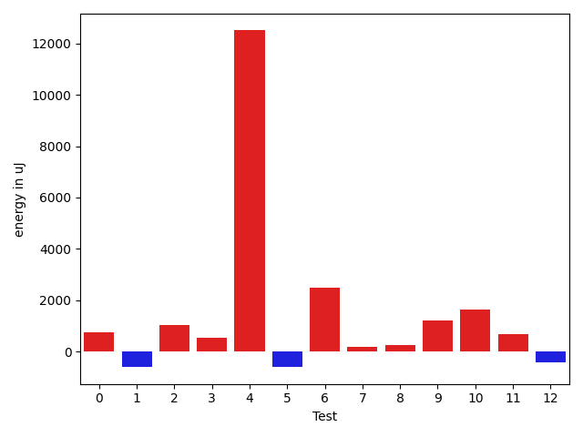

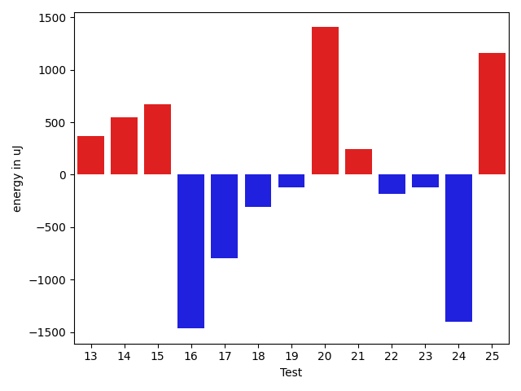

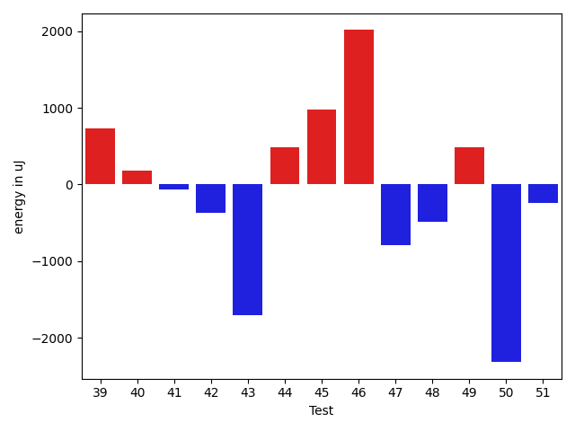

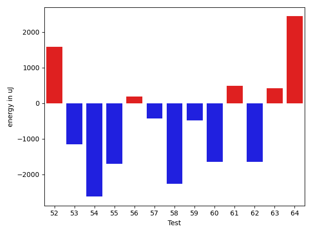

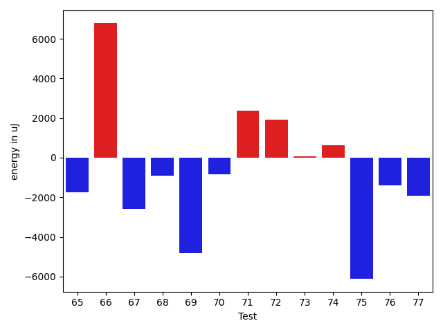

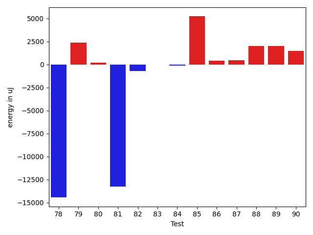

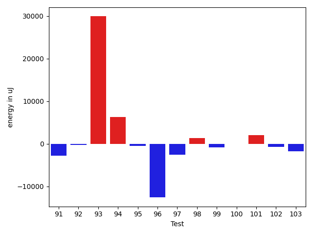

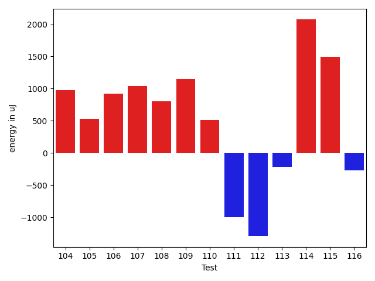

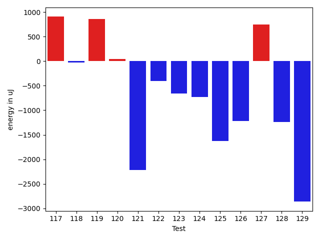

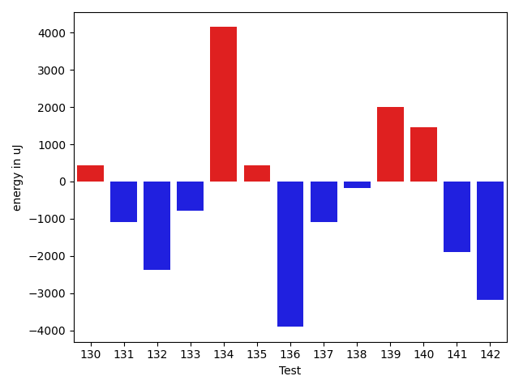

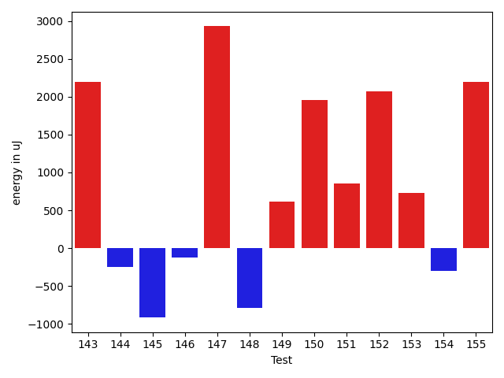

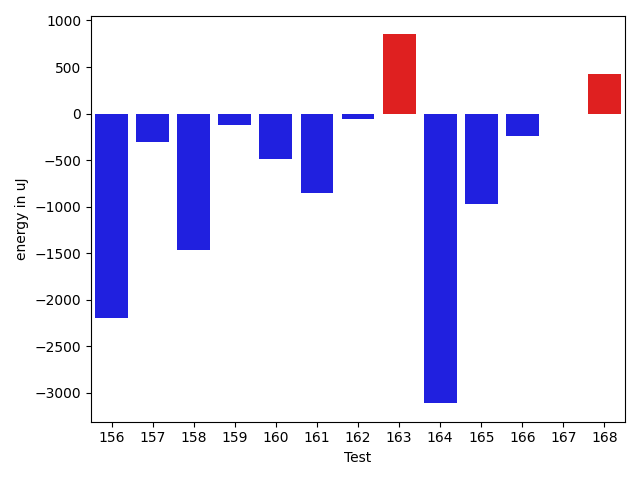

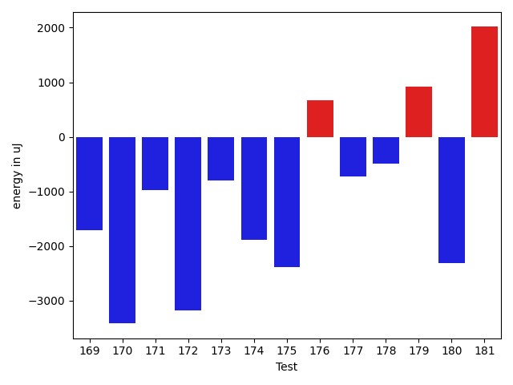

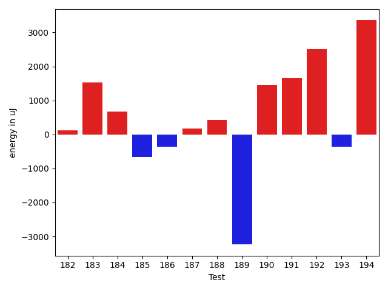

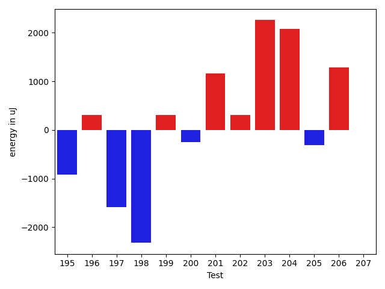

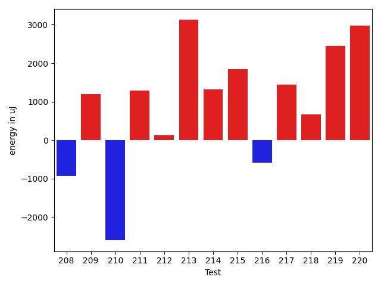

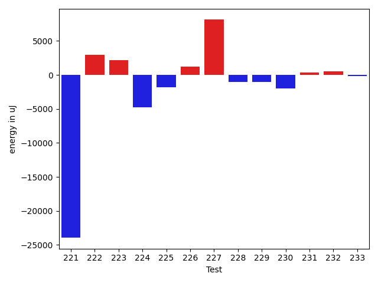

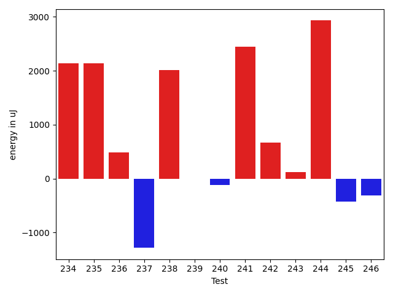

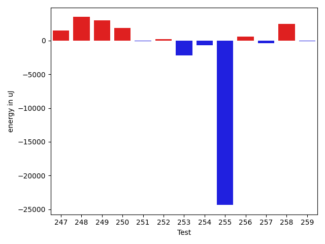

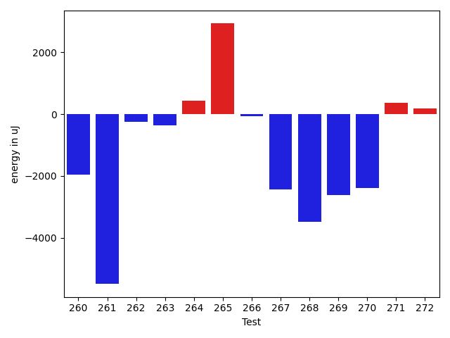

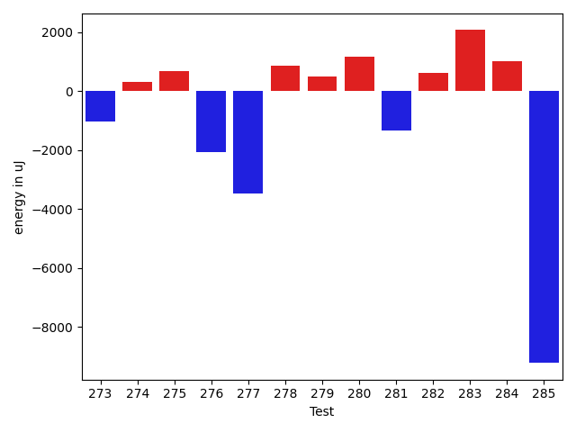

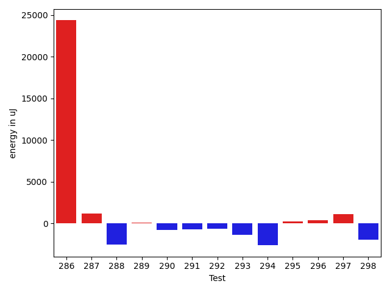

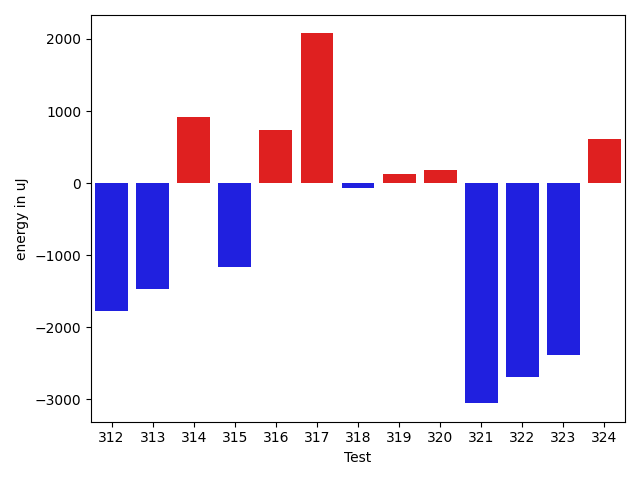

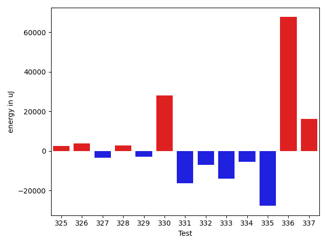

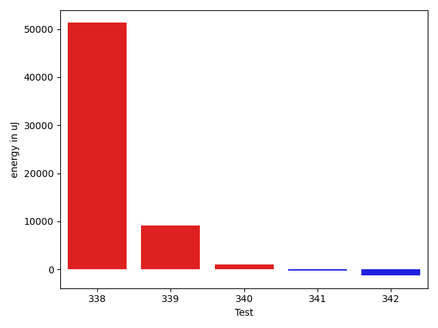

| ID | EnergyV1 | EnergyV2 | DeltaEnergy | σV1 | σV2 |
| --- | --- | --- | --- | --- | --- |
| 0 | 34118 | 34851 | 733 | 4016.8555799853116 | 6524.596438255684 |
| 1 | 34302 | 33691 | -611 | 5915.186190629781 | 5979.6345003570905 |
| 2 | 36682 | 37719 | 1037 | 17334.38654798771 | 29610.114171788096 |
| 3 | 34851 | 35401 | 550 | 24115.166047685387 | 4610.25806396875 |
| 4 | 66467 | 78979 | 12512 | 21612.74793222084 | 26290.584820499083 |
| 5 | 34363 | 33753 | -610 | 3420.2766096815467 | 3765.8778326461297 |
| 6 | 34912 | 37414 | 2502 | 26060.6601166692 | 31221.11390549671 |
| 7 | 34546 | 34729 | 183 | 5271.818569487117 | 7785.8248368420955 |
| 8 | 34729 | 34973 | 244 | 21498.790079006936 | 6432.900007279179 |
| 9 | 33569 | 34790 | 1221 | 3973.2277307323343 | 27694.674480623402 |
| 10 | 37720 | 39368 | 1648 | 254694.22399774374 | 355175.88259189564 |
| 11 | 36743 | 37415 | 672 | 45963.08142026905 | 72038.67666003895 |
| 12 | 35339 | 34912 | -427 | 3789.6900650655057 | 4137.566329243422 |
| 13 | 36011 | 36377 | 366 | 12799.643638387839 | 13656.854949366076 |
| 14 | 32898 | 33447 | 549 | 2719.7322542165866 | 3259.9636086312375 |
| 15 | 35034 | 35706 | 672 | 4072.992230584291 | 3971.1705537649204 |
| 16 | 35645 | 34180 | -1465 | 4446.86722572913 | 3548.1912283663005 |
| 17 | 34485 | 33692 | -793 | 7750.373761826917 | 3845.611722931178 |
| 18 | 34912 | 34607 | -305 | 24741.657002873453 | 22192.485433287242 |
| 19 | 34607 | 34485 | -122 | 5627.964394711411 | 3892.299945552899 |
| 20 | 36071 | 37476 | 1405 | 16962.513106106766 | 14614.291710711888 |
| 21 | 36438 | 36682 | 244 | 3532.0998980776294 | 3144.7413291875055 |
| 22 | 35157 | 34973 | -184 | 14659.378656823717 | 15896.299872380774 |
| 23 | 35400 | 35278 | -122 | 4398.226300110336 | 31494.88171915242 |
| 24 | 34301 | 32897 | -1404 | 3473.189743750512 | 3756.2663733603713 |
| 25 | 33753 | 34912 | 1159 | 3827.6002121923602 | 29805.17746101256 |
| 26 | 33752 | 34301 | 549 | 3569.988355139417 | 15911.59761306199 |
| 27 | 33570 | 34241 | 671 | 28390.04737372923 | 3825.761650003003 |
| 28 | 37903 | 36926 | -977 | 16070.222715688664 | 17648.099489685334 |
| 29 | 35583 | 35217 | -366 | 4263.172303342956 | 15712.550201202415 |
| 30 | 34179 | 34058 | -121 | 4075.237749140305 | 3853.843737822741 |
| 31 | 35583 | 35950 | 367 | 4296.9645589147385 | 3502.086634685696 |
| 32 | 34973 | 32409 | -2564 | 4360.439095484476 | 4101.560319348532 |
| 33 | 34057 | 33142 | -915 | 6490.562617318716 | 10642.217707329362 |
| 34 | 34119 | 33020 | -1099 | 4845.817398119451 | 3604.6217770141807 |
| 35 | 37414 | 33264 | -4150 | 4956.671777935962 | 4175.136522185699 |
| 36 | 37231 | 36865 | -366 | 68715.54181826729 | 87948.5094301555 |
| 37 | 34851 | 34423 | -428 | 4573.218161909331 | 5722.534824198684 |
| 38 | 34668 | 36559 | 1891 | 64322.7272103068 | 3744.1886955192736 |
| 39 | 34546 | 35278 | 732 | 3891.53162334706 | 3593.6885611269936 |
| 40 | 34851 | 35035 | 184 | 4540.065934515786 | 3710.0339930131568 |
| 41 | 34180 | 34118 | -62 | 3664.076054669171 | 3446.7171055303556 |
| 42 | 35034 | 34668 | -366 | 5603.510297415072 | 9901.052042373016 |
| 43 | 35218 | 33508 | -1710 | 3868.816366293428 | 3962.771292753122 |
| 44 | 34546 | 35034 | 488 | 4313.079257572108 | 4047.1130622814194 |
| 45 | 36071 | 37048 | 977 | 4430.5024788957 | 4928.348754277337 |
| 46 | 33691 | 35705 | 2014 | 2852.714598997476 | 3026.6686363787453 |
| 47 | 34363 | 33569 | -794 | 3919.3984046430414 | 4174.112466247936 |
| 48 | 33752 | 33265 | -487 | 3721.9980547884184 | 3570.7695969906686 |
| 49 | 33691 | 34180 | 489 | 3156.9154970669238 | 3273.442584522702 |
| 50 | 35644 | 33325 | -2319 | 3115.0097913168747 | 16571.236370532904 |
| 51 | 36621 | 36377 | -244 | 107663.74635638749 | 4140.017523593743 |
| 52 | 36682 | 38269 | 1587 | 22909.51459592919 | 98960.94964787718 |
| 53 | 42786 | 41626 | -1160 | 62814.70029622447 | 55025.488753834805 |
| 54 | 37170 | 34546 | -2624 | 66348.82703902219 | 60002.95993304959 |
| 55 | 36437 | 34729 | -1708 | 9339.818067955981 | 3967.9567553538527 |
| 56 | 36255 | 36438 | 183 | 5581.9083525349415 | 16069.285062536312 |
| 57 | 34485 | 34058 | -427 | 59337.249075176405 | 91347.84291508843 |
| 58 | 36377 | 34119 | -2258 | 3921.121177496053 | 3914.7850516810054 |
| 59 | 36133 | 35644 | -489 | 10270.391987067713 | 7644.847143554025 |
| 60 | 35278 | 33631 | -1647 | 23613.49054512787 | 8906.458481238702 |
| 61 | 35705 | 36193 | 488 | 11642.046177491218 | 11899.137759754685 |
| 62 | 77149 | 75501 | -1648 | 76201.10150327363 | 74479.46702566017 |
| 63 | 35584 | 36011 | 427 | 7698.052224959605 | 8132.730929125562 |
| 64 | 72265 | 74707 | 2442 | 27114.657365355146 | 32754.854058157354 |
| 65 | 37170 | 36438 | -732 | 13440.225821792865 | 10961.728811274017 |
| 66 | 34912 | 35828 | 916 | 55601.161700320205 | 78290.24215046868 |
| 67 | 65125 | 63720 | -1405 | 24645.064735751967 | 18888.636023878673 |
| 68 | 35705 | 36560 | 855 | 17972.476714409728 | 14888.878184591078 |
| 69 | 68421 | 68970 | 549 | 48117.339370515256 | 37525.64279800044 |
| 70 | 35462 | 35523 | 61 | 8290.289791261162 | 7494.304719601873 |
| 71 | 36987 | 37842 | 855 | 25938.126963114697 | 30868.891352477964 |
| 72 | 33813 | 35278 | 1465 | 3929.065616211326 | 7820.556780821696 |
| 73 | 34912 | 35706 | 794 | 3502.6795165415137 | 3524.37473159414 |
| 74 | 35156 | 35705 | 549 | 3539.84285337807 | 3466.5748804527093 |
| 75 | 36438 | 34668 | -1770 | 24220.836361365054 | 13985.06957311417 |
| 76 | 36560 | 35827 | -733 | 4809.365047459199 | 4572.053284728865 |
| 77 | 38025 | 34241 | -3784 | 4169.016479463192 | 3676.858720089745 |
| 78 | 37719 | 37659 | -60 | 45165.009983539516 | 8606.242244479627 |
| 79 | 62378 | 41626 | -20752 | 92732.22433244761 | 82465.04551528841 |
| 80 | 34607 | 35278 | 671 | 4490.339176317013 | 3338.895639690874 |
| 81 | 36316 | 36255 | -61 | 60781.34218267561 | 30025.30386793113 |
| 82 | 37292 | 35888 | -1404 | 2888.699707480859 | 4040.6030612725904 |
| 83 | 33508 | 32776 | -732 | 3781.2197274821256 | 3173.156119296942 |
| 84 | 34058 | 34241 | 183 | 4029.498529561342 | 4183.970691021003 |
| 85 | 33508 | 31922 | -1586 | 3370.3356846907695 | 32405.809421019017 |
| 86 | 31616 | 33325 | 1709 | 3365.949875199908 | 3636.55652950566 |
| 87 | 32471 | 32287 | -184 | 3769.907981698783 | 3444.2178495329417 |
| 88 | 37475 | 36316 | -1159 | 4226.476812399033 | 11962.129037035676 |
| 89 | 31982 | 33752 | 1770 | 2771.8419467526965 | 3456.5356352326444 |
| 90 | 31127 | 31677 | 550 | 3056.4912632142864 | 3667.113324259831 |
| 91 | 33874 | 32532 | -1342 | 4103.416264352028 | 3697.7971100545833 |
| 92 | 33508 | 32532 | -976 | 5032.5312278075835 | 4079.0144174297793 |
| 93 | 36316 | 36743 | 427 | 3971.107433630209 | 86358.37664765422 |
| 94 | 33874 | 32776 | -1098 | 3139.124413405789 | 32658.62866743642 |
| 95 | 31921 | 30701 | -1220 | 3460.0699235756865 | 3275.850465315202 |
| 96 | 35522 | 33448 | -2074 | 43632.88009284593 | 4183.6321104755925 |
| 97 | 33386 | 32409 | -977 | 7739.96930595612 | 3940.640243328963 |
| 98 | 30945 | 30945 | 0 | 3512.341590498724 | 4570.4375876994045 |
| 99 | 33203 | 32714 | -489 | 3512.009180565307 | 3001.2659967642544 |
| 100 | 34790 | 34729 | -61 | 2955.2403369081317 | 4129.804259574538 |
| 101 | 32959 | 32348 | -611 | 2768.484757799231 | 4713.121465718583 |
| 102 | 33752 | 32471 | -1281 | 2920.44060224215 | 3456.679929412036 |
| 103 | 36804 | 34668 | -2136 | 4504.422437738272 | 3651.645900443007 |
| 104 | 33569 | 31983 | -1586 | 2356.531913249482 | 4251.60457965344 |
| 105 | 35401 | 36193 | 792 | 5094.608697176236 | 4449.614500156165 |
| 106 | 32105 | 33387 | 1282 | 3178.0935278014217 | 3377.431624606024 |
| 107 | 34546 | 33569 | -977 | 3566.3823560262017 | 4697.019211273718 |
| 108 | 31860 | 33081 | 1221 | 3193.156588706542 | 3402.961775396802 |
| 109 | 31799 | 34119 | 2320 | 4532.682158016377 | 4972.792050973198 |
| 110 | 32410 | 32715 | 305 | 3786.585854747539 | 4011.7708508836845 |
| 111 | 32959 | 32471 | -488 | 4186.8171756649 | 3975.3877090794554 |
| 112 | 32288 | 32227 | -61 | 4766.002109735161 | 3869.5852778071994 |
| 113 | 33875 | 34302 | 427 | 3870.810291298773 | 4474.77799750827 |
| 114 | 32044 | 35888 | 3844 | 3534.654289565751 | 3951.3977248047095 |
| 115 | 30762 | 33081 | 2319 | 3088.43523460459 | 2829.132532931055 |
| 116 | 31738 | 32959 | 1221 | 3986.1274599191834 | 3005.8478985939014 |
| 117 | 31372 | 32409 | 1037 | 3238.503036646306 | 4208.131885611637 |
| 118 | 32227 | 33692 | 1465 | 4423.477884543035 | 3154.5535931225013 |
| 119 | 31616 | 32837 | 1221 | 3837.5829568384947 | 2924.8259883934725 |
| 120 | 33264 | 32715 | -549 | 4581.783177400557 | 4121.656544444249 |
| 121 | 35034 | 33447 | -1587 | 3923.926952542426 | 2546.828463446689 |
| 122 | 34424 | 32654 | -1770 | 4815.504668171725 | 3603.758268552882 |
| 123 | 36377 | 34057 | -2320 | 4057.931332129832 | 3985.2755699475856 |
| 124 | 33692 | 33996 | 304 | 3592.798927227613 | 3825.3772428083375 |
| 125 | 34973 | 33813 | -1160 | 4176.626088482568 | 3564.962645277258 |
| 126 | 32959 | 32227 | -732 | 3670.516778261766 | 2574.903202064109 |
| 127 | 31433 | 34668 | 3235 | 3849.9266913655497 | 3098.2857533440974 |
| 128 | 33081 | 33020 | -61 | 5173.586859977557 | 3728.2784003286483 |
| 129 | 34119 | 32776 | -1343 | 4459.491343191507 | 3861.2037711519806 |
| 130 | 33509 | 33935 | 426 | 5159.491724317986 | 3510.7635027795563 |
| 131 | 39306 | 38208 | -1098 | 16989.349435019772 | 25131.693280314663 |
| 132 | 36377 | 33996 | -2381 | 4202.000292038737 | 3662.833087583981 |
| 133 | 32776 | 31983 | -793 | 3038.376770306032 | 4254.445147958551 |
| 134 | 32166 | 36315 | 4149 | 2683.2760783036642 | 3093.0011930429787 |
| 135 | 32532 | 32959 | 427 | 2552.7884895192983 | 4551.524224316831 |
| 136 | 37720 | 33813 | -3907 | 3964.501925184663 | 3755.45459594737 |
| 137 | 34546 | 33447 | -1099 | 3512.314065495077 | 4069.0022348851076 |
| 138 | 32959 | 32776 | -183 | 3604.825605698561 | 3329.4552827752473 |
| 139 | 31617 | 33630 | 2013 | 3061.9946808584655 | 4442.217884612933 |
| 140 | 31189 | 32653 | 1464 | 2389.1519590292564 | 4345.106793566759 |
| 141 | 34362 | 32471 | -1891 | 2658.1825069020374 | 3023.231884042532 |
| 142 | 120544 | 117370 | -3174 | 118049.49377080234 | 114284.87053569726 |
| 143 | 34851 | 37048 | 2197 | 4139.816018169569 | 50123.10685952495 |
| 144 | 35645 | 35400 | -245 | 4890.694965839608 | 9100.625147559309 |
| 145 | 37048 | 36132 | -916 | 62100.24251393871 | 64444.24071823393 |
| 146 | 35888 | 35766 | -122 | 4257.6236321116885 | 3547.504595073981 |
| 147 | 35462 | 38391 | 2929 | 8381.96601432613 | 91795.06609415123 |
| 148 | 35583 | 34790 | -793 | 30249.082856483474 | 54813.296042680195 |
| 149 | 36316 | 36927 | 611 | 15716.018744100893 | 15983.851536209915 |
| 150 | 67505 | 69458 | 1953 | 54691.347905410425 | 57316.317262513374 |
| 151 | 37415 | 38269 | 854 | 91037.80757431472 | 62740.494293956595 |
| 152 | 33264 | 35339 | 2075 | 8977.148113211533 | 9645.963376744747 |
| 153 | 36132 | 36865 | 733 | 76480.1797428062 | 52244.573440784974 |
| 154 | 34607 | 34302 | -305 | 15348.148753854555 | 14312.126742121975 |
| 155 | 39123 | 41321 | 2198 | 30173.006845378703 | 26554.923215973515 |
| 156 | 36560 | 34362 | -2198 | 3758.1823566519943 | 4027.8296896424904 |
| 157 | 34729 | 34424 | -305 | 28775.18803841949 | 3541.9302125403665 |
| 158 | 34974 | 33508 | -1466 | 9474.1615665668 | 4042.3375331723187 |
| 159 | 33875 | 33753 | -122 | 4165.5486953523 | 3491.430067870803 |
| 160 | 35279 | 34790 | -489 | 50571.15759430866 | 42009.49807639076 |
| 161 | 35461 | 34606 | -855 | 5493.5819073724915 | 3132.0372087385995 |
| 162 | 36194 | 36133 | -61 | 15120.124201006143 | 16719.46846965922 |
| 163 | 36499 | 37353 | 854 | 61538.48256002164 | 56855.25488066657 |
| 164 | 36621 | 33508 | -3113 | 4569.584615209084 | 4258.217410525926 |
| 165 | 35278 | 34302 | -976 | 16681.7331168141 | 4587.475631815016 |
| 166 | 33264 | 33020 | -244 | 6425.646898219021 | 4421.155840164171 |
| 167 | 34668 | 34668 | 0 | 4705.486611311139 | 4874.768545619888 |
| 168 | 34302 | 34729 | 427 | 4807.3856609862205 | 4334.674148243512 |
| 169 | 35339 | 33631 | -1708 | 4053.801958272848 | 4801.907775931224 |
| 170 | 38330 | 34912 | -3418 | 33409.205962434964 | 33022.67921436244 |
| 171 | 34973 | 33996 | -977 | 4129.854990965178 | 3783.706210540916 |
| 172 | 36377 | 33203 | -3174 | 4423.268892742109 | 3665.590577678417 |
| 173 | 34973 | 34180 | -793 | 3386.667366183299 | 3149.7861085566756 |
| 174 | 35095 | 33203 | -1892 | 3970.463906561673 | 4263.840942714792 |
| 175 | 36072 | 33691 | -2381 | 30914.947926978315 | 4501.567792476822 |
| 176 | 32654 | 33325 | 671 | 4284.191276074806 | 3246.574182064747 |
| 177 | 34546 | 33814 | -732 | 3303.6835256074755 | 4163.606057535193 |
| 178 | 35217 | 34729 | -488 | 22179.948721274523 | 23115.70812509466 |
| 179 | 64941 | 65856 | 915 | 40588.27323307151 | 253624.4521567262 |
| 180 | 75073 | 72754 | -2319 | 213170.47542362518 | 183490.77554360733 |
| 181 | 36866 | 38880 | 2014 | 41559.294076086764 | 43478.178149836145 |
| 182 | 34729 | 34851 | 122 | 5033.909915112645 | 4421.217052773124 |
| 183 | 34729 | 36255 | 1526 | 4386.098285770358 | 3929.0524553313826 |
| 184 | 69153 | 69824 | 671 | 57113.156948243566 | 49126.91925910443 |
| 185 | 35401 | 34729 | -672 | 4153.871376223383 | 4003.876420870155 |
| 186 | 34667 | 34301 | -366 | 4927.996163058098 | 4751.873314809644 |
| 187 | 34485 | 34668 | 183 | 4444.185966370679 | 5095.558270713493 |
| 188 | 34363 | 34790 | 427 | 8812.286317408621 | 4306.379274311677 |
| 189 | 164245 | 161011 | -3234 | 274373.90743875725 | 273444.5469925223 |
| 190 | 36316 | 37780 | 1464 | 45342.85422272351 | 50229.98702027826 |
| 191 | 33936 | 35584 | 1648 | 4013.0640045413497 | 4200.994983344801 |
| 192 | 34668 | 37171 | 2503 | 35963.799342932485 | 29394.31437917273 |
| 193 | 35339 | 34973 | -366 | 3862.8956934876505 | 3628.660533247626 |
| 194 | 34241 | 37597 | 3356 | 4908.139949596823 | 3970.911933393441 |
| 195 | 34057 | 33142 | -915 | 4686.705924286809 | 4023.4703274096983 |
| 196 | 34180 | 34485 | 305 | 4403.493634767599 | 6000.426978748757 |
| 197 | 37109 | 35522 | -1587 | 383500.2685609496 | 321379.8313849137 |
| 198 | 37537 | 35217 | -2320 | 3625.60741084856 | 3968.452469363845 |
| 199 | 35461 | 35766 | 305 | 4181.2729488307705 | 4725.8115992354315 |
| 200 | 33935 | 33691 | -244 | 3533.545995795159 | 3797.6848414536544 |
| 201 | 33936 | 35095 | 1159 | 5926.701711646176 | 5619.6446631171 |
| 202 | 34179 | 34485 | 306 | 23075.07822842809 | 9638.30434746361 |
| 203 | 33813 | 36072 | 2259 | 14084.643977012116 | 4313.717247340163 |
| 204 | 33814 | 35889 | 2075 | 3586.774602849934 | 6580.154698488332 |
| 205 | 35034 | 34729 | -305 | 19167.0740861909 | 17661.812483144306 |
| 206 | 33264 | 34546 | 1282 | 3462.7463796818847 | 3261.9515303463136 |
| 207 | 34424 | 34424 | 0 | 3311.5936005425424 | 3997.294765316714 |
| 208 | 33569 | 32532 | -1037 | 4099.950597191177 | 3850.572782067624 |
| 209 | 33142 | 34485 | 1343 | 4754.598784245166 | 4785.779646108844 |
| 210 | 35766 | 35278 | -488 | 32553.035080954036 | 26715.003212895284 |
| 211 | 37659 | 39001 | 1342 | 49090.5891511805 | 40912.78540882653 |
| 212 | 34424 | 34851 | 427 | 3807.8966443183444 | 4647.084302072953 |
| 213 | 35217 | 38208 | 2991 | 3256.510118157146 | 4225.7800199323565 |
| 214 | 34119 | 35461 | 1342 | 3845.7501543736294 | 3953.183168000606 |
| 215 | 34851 | 36438 | 1587 | 3472.821311564448 | 7324.401449533873 |
| 216 | 33448 | 33264 | -184 | 5205.283010268789 | 4144.008680847988 |
| 217 | 34484 | 35462 | 978 | 3728.3577548536146 | 4371.290069677816 |
| 218 | 33570 | 33935 | 365 | 4763.929824168278 | 4396.009990916386 |
| 219 | 33142 | 34119 | 977 | 3271.631177639069 | 4773.29554716894 |
| 220 | 32348 | 36133 | 3785 | 3644.364360269154 | 4356.925333866005 |
| 221 | 39367 | 33203 | -6164 | 74936.12619768312 | 3931.9009220579173 |
| 222 | 34424 | 36560 | 2136 | 4823.149873547649 | 7984.808169874545 |
| 223 | 33630 | 34851 | 1221 | 3469.7073899935685 | 4295.5573143112115 |
| 224 | 140564 | 135375 | -5189 | 30250.304177079546 | 26919.18339384329 |
| 225 | 33447 | 32348 | -1099 | 4329.964207563517 | 2810.9386206192567 |
| 226 | 33447 | 34668 | 1221 | 4433.831399201284 | 3814.2588671827657 |
| 227 | 32959 | 36682 | 3723 | 3004.8180607205722 | 28465.737527971025 |
| 228 | 33997 | 32532 | -1465 | 3786.414218591973 | 3254.023310549572 |
| 229 | 34057 | 33386 | -671 | 8612.447266149346 | 5897.435615916478 |
| 230 | 33752 | 36011 | 2259 | 34934.23185572586 | 8711.166850338584 |
| 231 | 34179 | 34423 | 244 | 3346.001066779401 | 4394.8375230945685 |
| 232 | 33020 | 35034 | 2014 | 8710.893983972024 | 8521.17598209904 |
| 233 | 32044 | 32287 | 243 | 3907.367526041471 | 3373.952406961966 |
| 234 | 32836 | 34973 | 2137 | 4062.598302434312 | 3916.3450891287475 |
| 235 | 33020 | 35156 | 2136 | 3153.867504908919 | 4229.671336742833 |
| 236 | 32471 | 32959 | 488 | 3897.890452481587 | 3849.66565553101 |
| 237 | 35217 | 33935 | -1282 | 4115.114749224602 | 3580.344178045958 |
| 238 | 32898 | 34912 | 2014 | 3105.509698873266 | 3758.827448381426 |
| 239 | 34058 | 34057 | -1 | 3670.6203848917203 | 4508.44000708671 |
| 240 | 34241 | 34119 | -122 | 3686.1432174910624 | 3758.2692614861203 |
| 241 | 32959 | 35401 | 2442 | 4644.954327448401 | 65816.9349828745 |
| 242 | 33630 | 34302 | 672 | 3472.905580845726 | 2796.3186416429726 |
| 243 | 35340 | 35461 | 121 | 8012.338357190951 | 4350.236205073301 |
| 244 | 32715 | 35644 | 2929 | 4061.0818928691365 | 3520.6667424699385 |
| 245 | 32837 | 32409 | -428 | 4610.863685501691 | 3527.102124375752 |
| 246 | 33570 | 33264 | -306 | 2929.9679011383932 | 4154.017688337075 |
| 247 | 32654 | 34119 | 1465 | 3054.184501041154 | 3881.7325928427326 |
| 248 | 32226 | 35705 | 3479 | 3706.7037617462433 | 4054.021809295914 |
| 249 | 32470 | 35462 | 2992 | 3424.0624541617226 | 3543.5939109265264 |
| 250 | 32227 | 34058 | 1831 | 3125.8326134807667 | 4355.308282357863 |
| 251 | 34241 | 34119 | -122 | 4053.6314377069903 | 4772.512523381178 |
| 252 | 37903 | 38086 | 183 | 79432.61022287272 | 57050.03182829943 |
| 253 | 39002 | 36804 | -2198 | 87329.0695786429 | 4032.9001056315224 |
| 254 | 34363 | 33691 | -672 | 5945.6374615905725 | 4353.109720610018 |
| 255 | 61523 | 37170 | -24353 | 36967.33731920954 | 35626.354663590224 |
| 256 | 34301 | 34851 | 550 | 15492.588685962764 | 9459.732539478677 |
| 257 | 34973 | 34607 | -366 | 3547.1678262382793 | 3557.943962234369 |
| 258 | 32410 | 34851 | 2441 | 4640.281040606608 | 4304.526573460349 |
| 259 | 33691 | 33570 | -121 | 3975.8950816780007 | 3393.816135267201 |
| 260 | 36499 | 34546 | -1953 | 41519.12716923506 | 26099.149742635902 |
| 261 | 43030 | 37537 | -5493 | 22206.521687548593 | 18030.483707166317 |
| 262 | 34363 | 34119 | -244 | 4701.155886048723 | 4741.894793545707 |
| 263 | 35461 | 35095 | -366 | 3438.775922757802 | 4146.673140467856 |
| 264 | 33325 | 33752 | 427 | 3755.4706661820946 | 5050.3842330465095 |
| 265 | 33935 | 36866 | 2931 | 3528.035003532361 | 4297.6006048349445 |
| 266 | 35278 | 35217 | -61 | 4498.453358095252 | 5192.752694621611 |
| 267 | 35950 | 33508 | -2442 | 3761.708742688613 | 3818.961182101354 |
| 268 | 38452 | 34973 | -3479 | 3321.749849435117 | 3962.9641638911794 |
| 269 | 34363 | 31739 | -2624 | 4944.47391984682 | 3233.0182430663767 |
| 270 | 35950 | 33569 | -2381 | 2428.2329901690764 | 27200.56199942771 |
| 271 | 33813 | 34180 | 367 | 4056.5202965225967 | 4290.234438070685 |
| 272 | 34668 | 34851 | 183 | 13109.604952476073 | 10375.773469004595 |
| 273 | 35461 | 34423 | -1038 | 5948.676905284854 | 8448.223822753807 |
| 274 | 36865 | 37171 | 306 | 37199.897718301334 | 43242.941017620375 |
| 275 | 33508 | 34180 | 672 | 6533.978784527655 | 3286.5780555314777 |
| 276 | 37903 | 35828 | -2075 | 67780.66370612996 | 44898.24864876422 |
| 277 | 39124 | 35644 | -3480 | 82357.02200866722 | 63448.003928616345 |
| 278 | 35034 | 35888 | 854 | 3990.7032140785846 | 3495.977669734741 |
| 279 | 35156 | 35644 | 488 | 3892.07818740373 | 4551.805907033616 |
| 280 | 36865 | 38025 | 1160 | 5971.44597605119 | 62010.76318729509 |
| 281 | 38452 | 37110 | -1342 | 71422.25300116483 | 162639.29813803182 |
| 282 | 36621 | 37232 | 611 | 4130.344385579031 | 4903.311864293399 |
| 283 | 34912 | 36987 | 2075 | 367753.22568314505 | 635776.5084978006 |
| 284 | 36805 | 37841 | 1036 | 67120.77240420891 | 39588.85889340877 |
| 285 | 249877 | 240661 | -9216 | 116007.69876309129 | 119532.76820534944 |
| 286 | 341246 | 365599 | 24353 | 120774.28672370892 | 105746.04692212451 |
| 287 | 40405 | 41626 | 1221 | 83808.0111751833 | 34981.68286973913 |
| 288 | 36316 | 33752 | -2564 | 4731.031179114283 | 3778.843429885661 |
| 289 | 37536 | 37658 | 122 | 26679.39541968671 | 50711.01029366134 |
| 290 | 36010 | 35217 | -793 | 33688.54866508532 | 17280.4574412287 |
| 291 | 35339 | 34607 | -732 | 3852.3068979444524 | 4109.03281705467 |
| 292 | 34912 | 34241 | -671 | 3695.448998280032 | 4692.3400932818595 |
| 293 | 36133 | 34790 | -1343 | 4190.1467972015935 | 4363.4448131171675 |
| 294 | 37353 | 34729 | -2624 | 11250.580246162695 | 4363.033161816132 |
| 295 | 34668 | 34912 | 244 | 4304.29222735282 | 4604.277135922099 |
| 296 | 37109 | 37476 | 367 | 21356.940892506376 | 11610.133806343018 |
| 297 | 35888 | 36987 | 1099 | 215441.23976277508 | 370282.11452510103 |
| 298 | 36011 | 34058 | -1953 | 4680.433286381069 | 3867.60627614423 |
| 299 | 33630 | 33325 | -305 | 3375.430962104068 | 28761.33014814521 |
| 300 | 35096 | 33569 | -1527 | 3700.291189742895 | 3653.5977544087154 |
| 301 | 34180 | 35767 | 1587 | 24445.246699387302 | 4569.08441906816 |
| 302 | 35278 | 34729 | -549 | 4236.713245086779 | 5001.694877738945 |
| 303 | 33874 | 33325 | -549 | 4347.467982558928 | 4044.804172744059 |
| 304 | 34790 | 33569 | -1221 | 9118.926723162109 | 13055.868912006583 |
| 305 | 33508 | 36865 | 3357 | 6074.307005489497 | 3594.7896111963823 |
| 306 | 38085 | 36926 | -1159 | 47096.795771247955 | 37181.37217584758 |
| 307 | 38025 | 38085 | 60 | 67167.58944427091 | 49755.15799196657 |
| 308 | 34057 | 34912 | 855 | 3824.1354287399067 | 3230.5037114344623 |
| 309 | 35462 | 33752 | -1710 | 3214.832823436489 | 4295.279603941175 |
| 310 | 34546 | 37292 | 2746 | 3534.898601438092 | 35850.42372695675 |
| 311 | 33874 | 36071 | 2197 | 4098.371195279123 | 4928.761910051401 |
| 312 | 34912 | 33142 | -1770 | 3591.2808221966643 | 4564.922350075873 |
| 313 | 36193 | 34729 | -1464 | 4748.232897862504 | 3090.1627242302666 |
| 314 | 33020 | 33935 | 915 | 4108.891607933543 | 4519.536880035386 |
| 315 | 37781 | 36621 | -1160 | 3834.7072587095877 | 4143.9021314874535 |
| 316 | 32592 | 33325 | 733 | 3785.104050690841 | 3271.0494434567113 |
| 317 | 33447 | 35522 | 2075 | 3646.8308153183575 | 3686.483682502613 |
| 318 | 37537 | 37475 | -62 | 86450.56972755492 | 71022.75651362888 |
| 319 | 35339 | 35461 | 122 | 10695.29951653399 | 10470.754611195396 |
| 320 | 36072 | 36255 | 183 | 7481.282147040947 | 5735.830944281286 |
| 321 | 41321 | 38269 | -3052 | 134356.65282359184 | 90729.97429649047 |
| 322 | 39124 | 36437 | -2687 | 46087.17647271853 | 48765.29588736709 |
| 323 | 39246 | 36866 | -2380 | 163105.13430273577 | 154111.1289920341 |
| 324 | 36072 | 36682 | 610 | 13591.496131411639 | 13819.333767407828 |
| 325 | 38330 | 40222 | 1892 | 40133.24559467154 | 32190.44436209716 |
| 326 | 63354 | 63537 | 183 | 23987.829377432045 | 34047.06623935144 |
| 327 | 37231 | 36499 | -732 | 12809.712577179434 | 8738.443117292109 |
| 328 | 36194 | 37048 | 854 | 27985.7484558113 | 38170.5538398689 |
| 329 | 35827 | 32349 | -3478 | 5457.453902080469 | 4778.06344117927 |
| 330 | 36744 | 38453 | 1709 | 100339.70912632522 | 131183.03530405436 |
| 331 | 37476 | 33081 | -4395 | 47227.74913797029 | 4165.486849497107 |
| 332 | 36987 | 36377 | -610 | 41119.520768608185 | 5895.577041213938 |
| 333 | 36926 | 37110 | 184 | 37792.39193678828 | 6954.05467340216 |
| 334 | 36438 | 37781 | 1343 | 55842.982166925474 | 45748.207068865064 |
| 335 | 38757 | 38024 | -733 | 408034.47366944334 | 339348.9011563776 |
| 336 | 38574 | 36926 | -1648 | 264299.9889209341 | 371194.6399994944 |
| 337 | 36011 | 34973 | -1038 | 4613.297305344627 | 89432.5585222912 |
| 338 | 36255 | 36316 | 61 | 4057.112755362146 | 260170.016712339 |
| 339 | 37597 | 36621 | -976 | 37917.640182815565 | 62535.600505072456 |
| 340 | 33142 | 34668 | 1526 | 3541.104654343102 | 4391.546870625145 |
| 341 | 36926 | 35400 | -1526 | 5047.503877896137 | 4095.449029687294 |
| 342 | 38696 | 36133 | -2563 | 57552.46790637172 | 57702.555332999764 |

## Delta Duration per test method

| ID | DurationV1 | DurationsV2 | DeltaDuration |
| --- | --- | --- | --- |
| 0 | 776554.4696969697 | 903752.7222222222 | 127198.25252525252 |
| 1 | 839285.3623188406 | 924082.8852459016 | 84797.52292706107 |
| 2 | 1037374.0161290322 | 1297649.8524590165 | 260275.83632998425 |
| 3 | 988427.2 | 864008.2666666667 | -124418.93333333323 |
| 4 | 2085568.9494949495 | 2706715.212121212 | 621146.2626262624 |
| 5 | 441421.9285714286 | 436936.63157894736 | -4485.2969924812205 |
| 6 | 1170579.15625 | 1477868.111111111 | 307288.954861111 |
| 7 | 930746.779661017 | 919892.6428571428 | -10854.136803874164 |
| 8 | 909203.8627450981 | 725708.9215686275 | -183494.9411764706 |
| 9 | 774795.2083333334 | 903606.3793103448 | 128811.17097701144 |
| 10 | 2302795.709090909 | 4723921.442622951 | 2421125.7335320422 |
| 11 | 1120201.3454545455 | 1672056.9607843137 | 551855.6153297683 |
| 12 | 731275.9772727273 | 700937.9777777778 | -30337.999494949472 |
| 13 | 1154310.9333333333 | 1145361.3472222222 | -8949.5861111111 |
| 14 | 357260.7894736842 | 423030.16 | 65769.37052631576 |
| 15 | 752047.62 | 771740.5294117647 | 19692.909411764704 |
| 16 | 494914.1666666667 | 488513.0416666667 | -6401.125 |
| 17 | 521822.2173913043 | 772817.2105263158 | 250994.99313501152 |
| 18 | 1478932.3488372094 | 1338393.3777777778 | -140538.97105943155 |
| 19 | 748496.8717948718 | 751059.3414634146 | 2562.46966854285 |
| 20 | 1332978.45 | 1358273.9404761905 | 25295.49047619058 |
| 21 | 419818.25 | 402517.3 | -17300.95000000001 |
| 22 | 1109094.3442622952 | 1201531.4761904762 | 92437.13192818104 |
| 23 | 897882.0923076923 | 1049747.238095238 | 151865.14578754583 |
| 24 | 497635.78125 | 542791.1612903225 | 45155.38004032255 |
| 25 | 745294.2 | 925215.8048780488 | 179921.60487804888 |
| 26 | 490244.42424242425 | 663701.9 | 173457.47575757577 |
| 27 | 1145284.3174603174 | 1002645.1967213114 | -142639.12073900597 |
| 28 | 1523508.9895833333 | 1529555.8144329898 | 6046.82484965655 |
| 29 | 608958.551724138 | 682538.8285714285 | 73580.27684729057 |
| 30 | 802971.9761904762 | 828564.6666666666 | 25592.690476190415 |
| 31 | 667825.3636363636 | 635144.5641025641 | -32680.799533799523 |
| 32 | 755224.4915254237 | 782968.8461538461 | 27744.354628422414 |
| 33 | 717211.552631579 | 763941.3829787234 | 46729.830347144394 |
| 34 | 729354.5384615385 | 682208.274509804 | -47146.26395173452 |
| 35 | 635142.9117647059 | 615673.0333333333 | -19469.878431372577 |
| 36 | 1029441.5641025641 | 1626318.5 | 596876.9358974359 |
| 37 | 807768.0350877193 | 851062.9333333333 | 43294.89824561402 |
| 38 | 1049513.1666666667 | 615076.1111111111 | -434437.0555555556 |
| 39 | 682279.2857142857 | 645479.6 | -36799.685714285704 |
| 40 | 614229.4210526316 | 614918.3023255814 | 688.8812729498604 |
| 41 | 522203.4 | 503378.125 | -18825.275000000023 |
| 42 | 645248.8085106383 | 720247.8965517242 | 74999.08804108587 |
| 43 | 539907.8965517242 | 553482.4137931034 | 13574.517241379246 |
| 44 | 415871.22222222225 | 370717.0 | -45154.22222222225 |
| 45 | 543127.9565217391 | 595779.6538461539 | 52651.69732441474 |
| 46 | 515104.55555555556 | 516514.9285714286 | 1410.3730158730177 |
| 47 | 547571.2580645161 | 604408.6315789474 | 56837.373514431296 |
| 48 | 455335.9130434783 | 502914.5 | 47578.58695652173 |
| 49 | 466230.46153846156 | 444231.7083333333 | -21998.753205128247 |
| 50 | 486488.875 | 591923.1904761905 | 105434.31547619053 |
| 51 | 2097730.8307692306 | 602505.6785714285 | -1495225.152197802 |
| 52 | 854247.023255814 | 2049417.1690140846 | 1195170.1457582708 |
| 53 | 2115547.0422535213 | 1850917.7866666666 | -264629.25558685465 |
| 54 | 1422486.8333333333 | 1472383.8717948718 | 49897.0384615385 |
| 55 | 854544.0 | 762793.5952380953 | -91750.40476190473 |
| 56 | 735151.5405405406 | 809882.4210526316 | 74730.88051209098 |
| 57 | 1141427.3333333333 | 1323680.7727272727 | 182253.43939393945 |
| 58 | 920099.6447368421 | 945396.7647058824 | 25297.119969040272 |
| 59 | 1258640.2444444445 | 1237034.5376344086 | -21605.706810035976 |
| 60 | 1083190.675 | 1019338.9540229886 | -63851.720977011486 |
| 61 | 1212385.0714285714 | 1254487.75 | 42102.67857142864 |
| 62 | 3186250.1515151514 | 3088574.9175257734 | -97675.23398937797 |
| 63 | 1181754.9670329671 | 1182691.9333333333 | 936.9663003662135 |
| 64 | 2389105.97979798 | 2488720.787878788 | 99614.80808080826 |
| 65 | 1330418.3510638298 | 1281067.329787234 | -49351.02127659577 |
| 66 | 1604465.7471264368 | 1745567.3095238095 | 141101.56239737268 |
| 67 | 1885599.6464646466 | 1832613.9696969697 | -52985.676767676836 |
| 68 | 1314634.8444444444 | 1302533.5813953488 | -12101.263049095636 |
| 69 | 2611306.9292929294 | 2455146.474747475 | -156160.4545454546 |
| 70 | 1225774.912087912 | 1211926.2666666666 | -13848.645421245368 |
| 71 | 1610939.9797979798 | 1619375.2424242424 | 8435.262626262615 |
| 72 | 778782.2692307692 | 820421.9038461539 | 41639.634615384624 |
| 73 | 866158.625 | 819254.7580645161 | -46903.86693548388 |
| 74 | 534401.8888888889 | 480580.78571428574 | -53821.10317460314 |
| 75 | 1228925.9846153846 | 1085362.765625 | -143563.2189903846 |
| 76 | 522750.9583333333 | 612020.92 | 89269.96166666673 |
| 77 | 641639.4814814815 | 625819.4 | -15820.081481481437 |
| 78 | 1410397.9090909092 | 982116.3773584906 | -428281.5317324186 |
| 79 | 2563559.212765957 | 2615445.8080808083 | 51886.59531485103 |
| 80 | 444348.7619047619 | 462417.7586206897 | 18068.996715927788 |
| 81 | 1144113.75 | 666658.24 | -477455.51 |
| 82 | 431897.125 | 479123.6111111111 | 47226.486111111124 |
| 83 | 445992.15 | 451418.8275862069 | 5426.677586206875 |
| 84 | 686582.717948718 | 691302.4255319149 | 4719.707583196927 |
| 85 | 407926.8 | 632590.1818181818 | 224663.38181818178 |
| 86 | 454412.90476190473 | 489627.14285714284 | 35214.238095238106 |
| 87 | 405990.95238095237 | 372435.9090909091 | -33555.04329004325 |
| 88 | 563527.8260869565 | 746372.6551724138 | 182844.82908545726 |
| 89 | 399502.1666666667 | 416353.6153846154 | 16851.44871794869 |
| 90 | 398392.15789473685 | 402774.0 | 4381.842105263146 |
| 91 | 502046.0 | 464291.70588235295 | -37754.29411764705 |
| 92 | 456452.2068965517 | 443000.6 | -13451.606896551733 |
| 93 | 618580.2380952381 | 1768062.607142857 | 1149482.369047619 |
| 94 | 393904.46153846156 | 690910.25 | 297005.78846153844 |
| 95 | 388024.9090909091 | 403763.0344827586 | 15738.125391849491 |
| 96 | 929481.4516129033 | 631621.5277777778 | -297859.9238351255 |
| 97 | 677957.9428571429 | 813660.3125 | 135702.3696428571 |
| 98 | 404856.0 | 641938.0 | 237082.0 |
| 99 | 335192.4375 | 289926.6666666667 | -45265.770833333314 |
| 100 | 417617.8 | 429549.8 | 11932.0 |
| 101 | 379683.5833333333 | 341464.6666666667 | -38218.91666666663 |
| 102 | 389374.35714285716 | 390226.84 | 852.4828571428661 |
| 103 | 500335.84 | 548809.7666666667 | 48473.926666666695 |
| 104 | 397283.0714285714 | 358362.23529411765 | -38920.83613445377 |
| 105 | 375928.625 | 341745.0 | -34183.625 |
| 106 | 538809.1176470588 | 544153.1666666666 | 5344.049019607832 |
| 107 | 350885.125 | 344464.0 | -6421.125 |
| 108 | 638326.7222222222 | 606883.9090909091 | -31442.81313131319 |
| 109 | 418159.96 | 794055.6 | 375895.63999999996 |
| 110 | 395127.4285714286 | 445319.6 | 50192.1714285714 |
| 111 | 549328.6666666666 | 589177.78125 | 39849.11458333337 |
| 112 | 423314.65 | 439850.0 | 16535.349999999977 |
| 113 | 361027.9285714286 | 359273.6666666667 | -1754.2619047618937 |
| 114 | 331216.3076923077 | 370373.78571428574 | 39157.47802197805 |
| 115 | 316825.2727272727 | 386585.3333333333 | 69760.06060606061 |
| 116 | 545661.3939393939 | 521715.6216216216 | -23945.772317772324 |
| 117 | 452424.8095238095 | 472010.93548387097 | 19586.125960061443 |
| 118 | 506640.1818181818 | 538355.1904761905 | 31715.008658008708 |
| 119 | 412732.3333333333 | 426941.4347826087 | 14209.10144927539 |
| 120 | 458227.8181818182 | 479102.05263157893 | 20874.234449760756 |
| 121 | 361310.86666666664 | 326550.6666666667 | -34760.19999999995 |
| 122 | 360181.78571428574 | 466894.4285714286 | 106712.64285714284 |
| 123 | 433235.04545454547 | 435211.8947368421 | 1976.8492822966073 |
| 124 | 516534.5882352941 | 575403.6571428571 | 58869.06890756299 |
| 125 | 481952.2380952381 | 623210.0333333333 | 141257.79523809522 |
| 126 | 386072.95238095237 | 476415.5833333333 | 90342.63095238095 |
| 127 | 347332.0 | 298842.0 | -48490.0 |
| 128 | 454575.8095238095 | 448013.75 | -6562.059523809527 |
| 129 | 370452.06666666665 | 355601.4285714286 | -14850.638095238071 |
| 130 | 425784.63636363635 | 456377.14285714284 | 30592.506493506487 |
| 131 | 1130170.7272727273 | 1351129.1470588236 | 220958.41978609632 |
| 132 | 510756.63157894736 | 481564.55 | -29192.08157894737 |
| 133 | 506859.1724137931 | 514193.3939393939 | 7334.22152560082 |
| 134 | 345070.7272727273 | 396589.8181818182 | 51519.09090909088 |
| 135 | 425256.93333333335 | 414165.6842105263 | -11091.249122807058 |
| 136 | 377685.46153846156 | 461636.77777777775 | 83951.31623931619 |
| 137 | 362288.1538461539 | 416045.375 | 53757.22115384613 |
| 138 | 476911.3 | 459494.84 | -17416.459999999963 |
| 139 | 395992.17647058825 | 406886.875 | 10894.698529411748 |
| 140 | 375783.1666666667 | 372974.35 | -2808.8166666667094 |
| 141 | 331607.8 | 360213.27777777775 | 28605.477777777764 |
| 142 | 5132764.404040404 | 4880997.898989899 | -251766.50505050458 |
| 143 | 696538.0566037736 | 1129747.6888888888 | 433209.6322851152 |
| 144 | 464864.4666666667 | 565544.625 | 100680.15833333333 |
| 145 | 1625012.46 | 1790993.8214285714 | 165981.3614285714 |
| 146 | 595658.8709677419 | 546972.5384615385 | -48686.33250620344 |
| 147 | 708961.731707317 | 2174000.761904762 | 1465039.030197445 |
| 148 | 902447.5454545454 | 1112075.03125 | 209627.4857954546 |
| 149 | 1052074.5208333333 | 1179448.76 | 127374.23916666675 |
| 150 | 2620603.1515151514 | 2584567.8484848486 | -36035.30303030275 |
| 151 | 2212881.1789473686 | 1913933.8775510204 | -298947.3013963483 |
| 152 | 883471.947368421 | 823859.6304347826 | -59612.316933638416 |
| 153 | 1888861.484375 | 1424587.5238095238 | -464273.9605654762 |
| 154 | 1219518.1025641025 | 1244894.0845070423 | 25375.981942939805 |
| 155 | 1664374.0714285714 | 1714858.3086419753 | 50484.23721340392 |
| 156 | 667038.7380952381 | 606330.6486486486 | -60708.08944658947 |
| 157 | 929438.08 | 672714.3076923077 | -256723.7723076922 |
| 158 | 909237.7540983607 | 852453.8939393939 | -56783.86015896674 |
| 159 | 782929.8852459016 | 788654.2452830189 | 5724.360037117265 |
| 160 | 1315382.6923076923 | 1273285.3898305085 | -42097.30247718375 |
| 161 | 417173.4705882353 | 390127.6923076923 | -27045.77828054299 |
| 162 | 1373522.608695652 | 1348506.8863636365 | -25015.722332015634 |
| 163 | 1270944.8070175438 | 1282870.450980392 | 11925.643962848233 |
| 164 | 960092.4 | 865115.5535714285 | -94976.8464285715 |
| 165 | 890284.2857142857 | 926738.0185185185 | 36453.73280423286 |
| 166 | 799131.8 | 779283.6153846154 | -19848.18461538467 |
| 167 | 522665.02777777775 | 532210.1034482758 | 9545.075670498074 |
| 168 | 693082.2325581395 | 692925.4722222222 | -156.76033591723535 |
| 169 | 725313.0 | 677886.8095238095 | -47426.19047619053 |
| 170 | 1253891.62 | 1168842.1016949152 | -85049.5183050849 |
| 171 | 671013.52 | 665468.243902439 | -5545.276097561 |
| 172 | 672454.05 | 694481.4146341464 | 22027.36463414633 |
| 173 | 842723.4642857143 | 803074.8709677419 | -39648.59331797238 |
| 174 | 730245.7027027027 | 653613.8536585366 | -76631.84904416616 |
| 175 | 970373.3414634146 | 714045.5869565217 | -256327.75450689287 |
| 176 | 697170.4468085107 | 647542.5675675676 | -49627.87924094312 |
| 177 | 402743.4117647059 | 877522.6875 | 474779.2757352941 |
| 178 | 960190.0571428571 | 920666.3529411765 | -39523.70420168061 |
| 179 | 2030618.822222222 | 3606460.933333333 | 1575842.111111111 |
| 180 | 3843244.6666666665 | 3155753.6853932585 | -687490.981273408 |
| 181 | 1414364.6393442622 | 1532457.2833333334 | 118092.64398907125 |
| 182 | 573578.9142857143 | 530469.303030303 | -43109.61125541129 |
| 183 | 558032.2631578947 | 542036.8076923077 | -15995.455465586972 |
| 184 | 2348878.8157894737 | 2395315.703703704 | 46436.887914230116 |
| 185 | 641880.5652173914 | 458692.56 | -183188.00521739136 |
| 186 | 534320.1724137932 | 515208.625 | -19111.54741379316 |
| 187 | 553382.8965517242 | 882498.1538461539 | 329115.2572944297 |
| 188 | 892584.375 | 867007.2931034482 | -25577.08189655177 |
| 189 | 6837680.707070707 | 6986820.777777778 | 149140.07070707064 |
| 190 | 1130799.0327868853 | 1267457.0961538462 | 136658.06336696097 |
| 191 | 788164.6363636364 | 719272.2380952381 | -68892.39826839825 |
| 192 | 1158399.28125 | 1043238.1034482758 | -115161.17780172417 |
| 193 | 711218.3111111111 | 678918.4883720931 | -32299.82273901801 |
| 194 | 579534.7096774194 | 530067.1904761905 | -49467.51920122886 |
| 195 | 663566.4324324324 | 754246.2580645161 | 90679.8256320837 |
| 196 | 877851.8275862068 | 867891.1428571428 | -9960.684729064 |
| 197 | 3239527.052631579 | 2494479.8076923075 | -745047.2449392714 |
| 198 | 616610.36 | 686149.4 | 69539.04000000004 |
| 199 | 723220.2045454546 | 682030.052631579 | -41190.1519138756 |
| 200 | 738542.96 | 719390.7777777778 | -19152.18222222221 |
| 201 | 983292.9102564103 | 1036453.4189189189 | 53160.508662508684 |
| 202 | 1333918.5425531915 | 1316563.25 | -17355.29255319154 |
| 203 | 753389.9523809524 | 678585.52 | -74804.4323809524 |
| 204 | 653822.6875 | 669746.3170731707 | 15923.629573170678 |
| 205 | 1269962.950819672 | 1275469.0363636364 | 5506.085543964291 |
| 206 | 745747.72 | 683239.6808510638 | -62508.039148936165 |
| 207 | 770917.1111111111 | 744994.1346153846 | -25922.9764957265 |
| 208 | 561504.8076923077 | 496802.5833333333 | -64702.22435897443 |
| 209 | 876742.0754716981 | 832096.2857142857 | -44645.78975741239 |
| 210 | 1069423.982142857 | 933168.283018868 | -136255.6991239891 |
| 211 | 1524749.9666666666 | 1495471.7258064516 | -29278.240860214923 |
| 212 | 818538.3469387755 | 699192.8627450981 | -119345.48419367743 |
| 213 | 495649.4285714286 | 396641.0 | -99008.42857142858 |
| 214 | 708217.6511627907 | 659160.9038461539 | -49056.74731663684 |
| 215 | 728900.1923076923 | 714971.7446808511 | -13928.447626841138 |
| 216 | 819712.9591836735 | 744439.3529411765 | -75273.60624249699 |
| 217 | 727030.5416666666 | 704820.3333333334 | -22210.208333333256 |
| 218 | 433636.64 | 369001.1538461539 | -64635.48615384614 |
| 219 | 367668.375 | 320807.70588235295 | -46860.66911764705 |
| 220 | 396445.24 | 426938.25925925927 | 30493.01925925928 |
| 221 | 1662804.3709677418 | 561824.1034482758 | -1100980.267519466 |
| 222 | 613182.027027027 | 698955.1842105263 | 85773.15718349931 |
| 223 | 442781.1379310345 | 477584.8846153846 | 34803.74668435013 |
| 224 | 4553550.929292929 | 4336437.757575758 | -217113.17171717156 |
| 225 | 357743.84210526315 | 367940.5333333333 | 10196.69122807018 |
| 226 | 463138.5 | 425606.9411764706 | -37531.5588235294 |
| 227 | 756689.1153846154 | 959764.1666666666 | 203075.05128205125 |
| 228 | 560323.7419354839 | 559038.96 | -1284.7819354839157 |
| 229 | 1033024.6521739131 | 956078.8873239437 | -76945.76484996942 |
| 230 | 1006060.5593220339 | 1004772.9076923077 | -1287.6516297261696 |
| 231 | 488332.0833333333 | 478831.4 | -9500.68333333329 |
| 232 | 898243.5333333333 | 781859.0 | -116384.53333333333 |
| 233 | 671674.0769230769 | 634373.5333333333 | -37300.54358974355 |
| 234 | 365465.7727272727 | 398985.8095238095 | 33520.03679653682 |
| 235 | 505355.14285714284 | 508070.3461538461 | 2715.2032967032865 |
| 236 | 642144.7837837838 | 675892.4 | 33747.616216216236 |
| 237 | 998468.8695652174 | 925637.3846153846 | -72831.48494983278 |
| 238 | 582095.3142857143 | 564173.5945945946 | -17921.71969111974 |
| 239 | 654686.9375 | 644193.425 | -10493.512499999953 |
| 240 | 550933.6666666666 | 516955.29032258067 | -33978.37634408596 |
| 241 | 488159.0714285714 | 1152097.2916666667 | 663938.2202380954 |
| 242 | 600385.3214285715 | 472704.2 | -127681.12142857147 |
| 243 | 737657.619047619 | 397749.5 | -339908.11904761905 |
| 244 | 417118.3333333333 | 390543.7586206897 | -26574.574712643633 |
| 245 | 623953.3793103448 | 569162.5757575758 | -54790.80355276901 |
| 246 | 444766.4347826087 | 427166.29411764705 | -17600.140664961655 |
| 247 | 543179.0 | 658784.8431372549 | 115605.84313725494 |
| 248 | 407821.0625 | 392536.8888888889 | -15284.173611111124 |
| 249 | 392588.6 | 303851.5 | -88737.09999999998 |
| 250 | 444675.5 | 449582.5 | 4907.0 |
| 251 | 713433.1428571428 | 735787.0465116279 | 22353.90365448501 |
| 252 | 1952098.551020408 | 1276513.1904761905 | -675585.3605442175 |
| 253 | 2162616.9411764704 | 760541.1851851852 | -1402075.7559912852 |
| 254 | 847368.695652174 | 804541.7727272727 | -42826.92292490124 |
| 255 | 1867087.5 | 1105504.6470588236 | -761582.8529411764 |
| 256 | 1235276.9672131147 | 939826.8474576271 | -295450.11975548766 |
| 257 | 505764.6 | 404719.2 | -101045.39999999997 |
| 258 | 594348.3823529412 | 603574.8529411765 | 9226.470588235301 |
| 259 | 579430.6486486486 | 580955.475 | 1524.8263513513375 |
| 260 | 1633824.8529411764 | 1278633.6486486488 | -355191.20429252763 |
| 261 | 1448492.3076923077 | 1181788.0 | -266704.30769230775 |
| 262 | 489786.4166666667 | 458489.8275862069 | -31296.589080459788 |
| 263 | 549109.7857142857 | 557183.6 | 8073.814285714296 |
| 264 | 817227.0370370371 | 862046.9677419355 | 44819.930704898434 |
| 265 | 377867.05263157893 | 371711.36363636365 | -6155.688995215285 |
| 266 | 420377.94736842107 | 426774.7 | 6396.752631578944 |
| 267 | 554792.1578947369 | 434329.7826086957 | -120462.37528604118 |
| 268 | 438455.4666666667 | 373394.0 | -65061.466666666674 |
| 269 | 395421.39130434784 | 432369.06666666665 | 36947.67536231881 |
| 270 | 582047.6363636364 | 680535.5909090909 | 98487.95454545459 |
| 271 | 639028.1904761905 | 514803.1111111111 | -124225.07936507941 |
| 272 | 967412.0384615385 | 881203.4150943396 | -86208.62336719886 |
| 273 | 1042441.1785714285 | 979810.8867924528 | -62630.29177897575 |
| 274 | 1445780.6379310344 | 1578547.0204081633 | 132766.38247712888 |
| 275 | 627736.9696969697 | 525474.6551724138 | -102262.31452455593 |
| 276 | 1696222.2325581396 | 1152150.2549019607 | -544071.9776561789 |
| 277 | 2117963.9615384615 | 1304088.3142857142 | -813875.6472527473 |
| 278 | 648186.7142857143 | 714698.8333333334 | 66512.11904761905 |
| 279 | 651452.7307692308 | 667772.2142857143 | 16319.483516483568 |
| 280 | 770630.4 | 1340312.0487804879 | 569681.6487804878 |
| 281 | 955308.4090909091 | 3269034.2916666665 | 2313725.8825757573 |
| 282 | 487815.3703703704 | 520068.46428571426 | 32253.093915343867 |
| 283 | 2776598.3469387754 | 8389977.697674418 | 5613379.350735642 |
| 284 | 1789294.511904762 | 1638080.0689655172 | -151214.44293924468 |
| 285 | 8473341.525252525 | 8261145.121212121 | -212196.40404040366 |
| 286 | 10144703.212121213 | 10542061.090909092 | 397357.8787878789 |
| 287 | 2270115.2708333335 | 1793379.387755102 | -476735.8830782315 |
| 288 | 483876.23076923075 | 464888.2105263158 | -18988.020242914965 |
| 289 | 1025862.4 | 1284454.9285714286 | 258592.52857142861 |
| 290 | 1327295.1066666667 | 1112567.5657894737 | -214727.54087719298 |
| 291 | 687118.5454545454 | 653354.9090909091 | -33763.63636363635 |
| 292 | 577017.9 | 502599.8214285714 | -74418.0785714286 |
| 293 | 735015.6388888889 | 613274.552631579 | -121741.08625730989 |
| 294 | 743050.2105263158 | 866011.9117647059 | 122961.70123839006 |
| 295 | 693436.3913043478 | 654380.925 | -39055.466304347734 |
| 296 | 1200139.5263157894 | 1137220.6896551724 | -62918.83666061703 |
| 297 | 2065319.9047619049 | 4437435.947368421 | 2372116.042606516 |
| 298 | 565065.8333333334 | 469002.77777777775 | -96063.05555555562 |
| 299 | 389404.5882352941 | 534215.8965517242 | 144811.30831643008 |
| 300 | 352845.1666666667 | 382071.85714285716 | 29226.690476190473 |
| 301 | 562162.6842105263 | 368915.0 | -193247.6842105263 |
| 302 | 369928.375 | 361914.8 | -8013.575000000012 |
| 303 | 369334.5625 | 341967.35294117645 | -27367.209558823553 |
| 304 | 782651.88 | 681586.15 | -101065.72999999998 |
| 305 | 396032.85714285716 | 401097.05555555556 | 5064.1984126984025 |
| 306 | 1085300.2692307692 | 734045.8823529412 | -351254.38687782804 |
| 307 | 1361436.5909090908 | 929264.25 | -432172.3409090908 |
| 308 | 408431.375 | 372141.21428571426 | -36290.16071428574 |
| 309 | 504261.2727272727 | 492745.5 | -11515.772727272706 |
| 310 | 418662.78571428574 | 801612.9375 | 382950.15178571426 |
| 311 | 461640.1052631579 | 477478.0869565217 | 15837.981693363807 |
| 312 | 405612.28571428574 | 349181.4 | -56430.885714285716 |
| 313 | 384896.6875 | 680087.8666666667 | 295191.1791666667 |
| 314 | 452769.4347826087 | 380248.2 | -72521.23478260869 |
| 315 | 388983.2 | 379831.2631578947 | -9151.936842105293 |
| 316 | 414723.92307692306 | 437786.3846153846 | 23062.46153846156 |
| 317 | 420953.6 | 378576.3333333333 | -42377.26666666666 |
| 318 | 2125471.3157894737 | 1668522.282051282 | -456949.0337381917 |
| 319 | 1138934.347826087 | 1049823.6818181819 | -89110.66600790503 |
| 320 | 1108786.2222222222 | 1066871.1139240507 | -41915.108298171544 |
| 321 | 3493604.0714285714 | 2198513.4444444445 | -1295090.6269841269 |
| 322 | 1459539.8833333333 | 1581267.3275862068 | 121727.44425287354 |
| 323 | 2809134.1428571427 | 2924759.25 | 115625.10714285728 |
| 324 | 1120960.8307692308 | 1203451.2162162163 | 82490.38544698549 |
| 325 | 1465761.7666666666 | 1574479.1964285714 | 108717.42976190476 |
| 326 | 1941434.797979798 | 2099545.4343434344 | 158110.63636363647 |
| 327 | 755869.9285714285 | 680920.3103448276 | -74949.61822660093 |
| 328 | 800396.25 | 964989.3793103448 | 164593.1293103448 |
| 329 | 449799.73333333334 | 437427.8181818182 | -12371.91515151516 |
| 330 | 2109619.5833333335 | 3008437.411764706 | 898817.8284313725 |
| 331 | 951888.5384615385 | 504857.73333333334 | -447030.80512820516 |
| 332 | 670427.84 | 420991.6 | -249436.24 |
| 333 | 1481687.0277777778 | 906503.7959183673 | -575183.2318594104 |
| 334 | 1515484.8 | 1314432.9827586208 | -201051.8172413793 |
| 335 | 3792662.6338028167 | 2925654.7397260275 | -867007.8940767893 |
| 336 | 2289433.9285714286 | 4549711.027777778 | 2260277.0992063493 |
| 337 | 609929.25 | 1197390.2758620689 | 587461.0258620689 |
| 338 | 584476.0 | 2291955.296296296 | 1707479.2962962962 |
| 339 | 945932.6857142857 | 1281764.7441860465 | 335832.0584717608 |
| 340 | 419042.82352941175 | 534622.5789473684 | 115579.75541795668 |
| 341 | 584346.0555555555 | 570360.1282051282 | -13985.927350427257 |
| 342 | 1302069.119047619 | 1230075.6458333333 | -71993.47321428568 |

## Misc.

| ID | Test Class | Test Method |
| --- | --- | --- |
| 0 | com.google.gson.functional.CustomTypeAdaptersTest | testCustomAdapterInvokedForCollectionElementDeserialization |
| 1 | com.google.gson.functional.CustomTypeAdaptersTest | testCustomAdapterInvokedForMapElementSerializationWithType |
| 2 | com.google.gson.functional.CustomTypeAdaptersTest | testCustomNestedSerializers |
| 3 | com.google.gson.functional.CustomTypeAdaptersTest | testCustomNestedDeserializers |
| 4 | com.google.gson.functional.CustomTypeAdaptersTest | testCustomTypeAdapterDoesNotAppliesToSubClasses |
| 5 | com.google.gson.functional.CustomTypeAdaptersTest | testCustomAdapterInvokedForCollectionElementSerialization |
| 6 | com.google.gson.functional.CustomTypeAdaptersTest | testCustomAdapterInvokedForCollectionElementSerializationWithType |
| 7 | com.google.gson.functional.CustomTypeAdaptersTest | testCustomSerializerForLong |
| 8 | com.google.gson.functional.CustomTypeAdaptersTest | testCustomTypeAdapterAppliesToSubClassesSerializedAsBaseClass |
| 9 | com.google.gson.functional.CustomTypeAdaptersTest | testCustomAdapterInvokedForMapElementDeserialization |
| 10 | com.google.gson.functional.CustomTypeAdaptersTest | testCustomSerializers |
| 11 | com.google.gson.functional.CustomTypeAdaptersTest | testCustomDeserializers |
| 12 | com.google.gson.functional.CustomTypeAdaptersTest | testCustomByteArraySerializer |
| 13 | com.google.gson.functional.CustomTypeAdaptersTest | testCustomDeserializerForLong |
| 14 | com.google.gson.functional.CustomTypeAdaptersTest | testCustomAdapterInvokedForMapElementSerialization |
| 15 | com.google.gson.functional.CustomTypeAdaptersTest | testCustomByteArrayDeserializerAndInstanceCreator |
| 16 | com.google.gson.functional.ObjectTest | testStringFieldWithEmptyValueDeserialization |
| 17 | com.google.gson.functional.ObjectTest | testNullObjectFieldsDeserialization |
| 18 | com.google.gson.functional.ObjectTest | testEmptyCollectionInAnObjectDeserialization |
| 19 | com.google.gson.functional.ObjectTest | testNestedSerialization |
| 20 | com.google.gson.functional.ObjectTest | testArrayOfArraysDeserialization |
| 21 | com.google.gson.functional.ObjectTest | testClassWithNoFieldsDeserialization |
| 22 | com.google.gson.functional.ObjectTest | testStringFieldWithNumberValueDeserialization |
| 23 | com.google.gson.functional.ObjectTest | testArrayOfObjectsAsFields |
| 24 | com.google.gson.functional.ObjectTest | testStringFieldWithEmptyValueSerialization |
| 25 | com.google.gson.functional.ObjectTest | testNullArraysDeserialization |
| 26 | com.google.gson.functional.ObjectTest | testObjectFieldNamesWithoutQuotesDeserialization |
| 27 | com.google.gson.functional.ObjectTest | testArrayOfObjectsDeserialization |
| 28 | com.google.gson.functional.ObjectTest | testArrayOfArraysSerialization |
| 29 | com.google.gson.functional.ObjectTest | testJsonInMixedQuotesDeserialization |
| 30 | com.google.gson.functional.ObjectTest | testArrayOfObjectsSerialization |
| 31 | com.google.gson.functional.ObjectTest | testBagOfPrimitivesDeserialization |
| 32 | com.google.gson.functional.ObjectTest | testInnerClassDeserialization |
| 33 | com.google.gson.functional.ObjectTest | testPrimitiveArrayInAnObjectDeserialization |
| 34 | com.google.gson.functional.ObjectTest | testInnerClassSerialization |
| 35 | com.google.gson.functional.ObjectTest | testBagOfPrimitiveWrappersSerialization |
| 36 | com.google.gson.functional.ObjectTest | testJsonInSingleQuotesDeserialization |
| 37 | com.google.gson.functional.ObjectTest | testNestedDeserialization |
| 38 | com.google.gson.functional.ObjectTest | testBagOfPrimitiveWrappersDeserialization |
| 39 | com.google.gson.functional.ObjectTest | testNullFieldsDeserialization |
| 40 | com.google.gson.functional.ObjectTest | testClassWithTransientFieldsDeserialization |
| 41 | com.google.gson.functional.ObjectTest | testPrivateNoArgConstructorDeserialization |
| 42 | com.google.gson.functional.ObjectTest | testClassWithTransientFieldsSerialization |
| 43 | com.google.gson.functional.ObjectTest | testClassWithTransientFieldsDeserializationTransientFieldsPassedInJsonAreIgnored |
| 44 | com.google.gson.functional.ObjectTest | testClassWithNoFieldsSerialization |
| 45 | com.google.gson.functional.ObjectTest | testBagOfPrimitivesSerialization |
| 46 | com.google.gson.functional.ObjectTest | testNullFieldsSerialization |
| 47 | com.google.gson.functional.ObjectTest | testNullPrimitiveFieldsDeserialization |
| 48 | com.google.gson.functional.ObjectTest | testClassWithObjectFieldSerialization |
| 49 | com.google.gson.functional.ObjectTest | testPrimitiveArrayFieldSerialization |
| 50 | com.google.gson.functional.ObjectTest | testEmptyCollectionInAnObjectSerialization |
| 51 | com.google.gson.functional.CustomDeserializerTest | testDefaultConstructorNotCalledOnObject |
| 52 | com.google.gson.functional.CustomDeserializerTest | testDefaultConstructorNotCalledOnField |
| 53 | com.google.gson.functional.JsonParserTest | testBadTypeForDeserializingCustomTree |
| 54 | com.google.gson.functional.JsonParserTest | testChangingCustomTreeAndDeserializing |
| 55 | com.google.gson.functional.JsonParserTest | testBadFieldTypeForDeserializingCustomTree |
| 56 | com.google.gson.functional.JsonParserTest | testBadFieldTypeForCustomDeserializerCustomTree |
| 57 | com.google.gson.functional.JsonParserTest | testDeserializingCustomTree |
| 58 | com.google.gson.functional.ParameterizedTypesTest | testParameterizedTypeGenericArraysSerialization |
| 59 | com.google.gson.functional.ParameterizedTypesTest | testVariableTypeArrayDeserialization |
| 60 | com.google.gson.functional.ParameterizedTypesTest | testParameterizedTypeWithReaderDeserialization |
| 61 | com.google.gson.functional.ParameterizedTypesTest | testParameterizedTypeWithCustomSerializer |
| 62 | com.google.gson.functional.ParameterizedTypesTest | testParameterizedTypesSerialization |
| 63 | com.google.gson.functional.ParameterizedTypesTest | testVariableTypeDeserialization |
| 64 | com.google.gson.functional.ParameterizedTypesTest | testVariableTypeFieldsAndGenericArraysSerialization |
| 65 | com.google.gson.functional.ParameterizedTypesTest | testParameterizedTypeGenericArraysDeserialization |
| 66 | com.google.gson.functional.ParameterizedTypesTest | testParameterizedTypeDeserialization |
| 67 | com.google.gson.functional.ParameterizedTypesTest | testVariableTypeFieldsAndGenericArraysDeserialization |
| 68 | com.google.gson.functional.ParameterizedTypesTest | testTypesWithMultipleParametersDeserialization |
| 69 | com.google.gson.functional.ParameterizedTypesTest | testTypesWithMultipleParametersSerialization |
| 70 | com.google.gson.functional.ParameterizedTypesTest | testParameterizedTypeWithVariableTypeDeserialization |
| 71 | com.google.gson.functional.ParameterizedTypesTest | testParameterizedTypesWithCustomDeserializer |
| 72 | com.google.gson.functional.ParameterizedTypesTest | testParameterizedTypesWithWriterSerialization |
| 73 | com.google.gson.functional.ParameterizedTypesTest | testDeepParameterizedTypeDeserialization |
| 74 | com.google.gson.functional.ParameterizedTypesTest | testDeepParameterizedTypeSerialization |
| 75 | com.google.gson.functional.PrettyPrintingTest | testEmptyMapField |
| 76 | com.google.gson.functional.PrettyPrintingTest | testPrettyPrintArrayOfPrimitiveArrays |
| 77 | com.google.gson.functional.PrettyPrintingTest | testPrettyPrintListOfPrimitiveArrays |
| 78 | com.google.gson.functional.PrettyPrintingTest | testPrettyPrintArrayOfObjects |
| 79 | com.google.gson.functional.PrettyPrintingTest | testPrettyPrintList |
| 80 | com.google.gson.functional.PrettyPrintingTest | testMultipleArrays |
| 81 | com.google.gson.functional.PrettyPrintingTest | testMap |
| 82 | com.google.gson.functional.PrettyPrintingTest | testPrettyPrintArrayOfPrimitives |
| 83 | com.google.gson.functional.PrimitiveTest | testDoubleNoFractAsStringRepresentationDeserialization |
| 84 | com.google.gson.functional.PrimitiveTest | testDoubleAsStringRepresentationDeserialization |
| 85 | com.google.gson.functional.PrimitiveTest | testBigIntegerDeserialization |
| 86 | com.google.gson.functional.PrimitiveTest | testHtmlCharacterSerialization |
| 87 | com.google.gson.functional.PrimitiveTest | testBigDecimalInfinityDeserializationNotSupported |
| 88 | com.google.gson.functional.PrimitiveTest | testPrimitiveIntegerAutoboxedInASingleElementArraySerialization |
| 89 | com.google.gson.functional.PrimitiveTest | testNegativeInfinityFloatDeserialization |
| 90 | com.google.gson.functional.PrimitiveTest | testFloatInfinityDeserialization |
| 91 | com.google.gson.functional.PrimitiveTest | testBigDecimalSerialization |
| 92 | com.google.gson.functional.PrimitiveTest | testLargeDoubleDeserialization |
| 93 | com.google.gson.functional.PrimitiveTest | testPrimitiveIntegerAutoboxedInASingleElementArrayDeserialization |
| 94 | com.google.gson.functional.PrimitiveTest | testBigDecimalInASingleElementArraySerialization |
| 95 | com.google.gson.functional.PrimitiveTest | testBigDecimalNegativeInfinityDeserializationNotSupported |
| 96 | com.google.gson.functional.PrimitiveTest | testPrimitiveBooleanAutoboxedDeserialization |
| 97 | com.google.gson.functional.PrimitiveTest | testPrimitiveDoubleAutoboxedDeserialization |
| 98 | com.google.gson.functional.PrimitiveTest | testLongAsStringSerialization |
| 99 | com.google.gson.functional.PrimitiveTest | testFloatInfinitySerialization |
| 100 | com.google.gson.functional.PrimitiveTest | testPrimitiveLongAutoboxedInASingleElementArraySerialization |
| 101 | com.google.gson.functional.PrimitiveTest | testSmallValueForBigIntegerSerialization |
| 102 | com.google.gson.functional.PrimitiveTest | testBigDecimalInASingleElementArrayDeserialization |
| 103 | com.google.gson.functional.PrimitiveTest | testPrimitiveIntegerAutoboxedDeserialization |
| 104 | com.google.gson.functional.PrimitiveTest | testSmallValueForBigIntegerDeserialization |
| 105 | com.google.gson.functional.PrimitiveTest | testPrimitiveBooleanAutoboxedSerialization |
| 106 | com.google.gson.functional.PrimitiveTest | testBigIntegerInASingleElementArraySerialization |
| 107 | com.google.gson.functional.PrimitiveTest | testFloatNaNSerialization |
| 108 | com.google.gson.functional.PrimitiveTest | testBigIntegerSerialization |
| 109 | com.google.gson.functional.PrimitiveTest | testBigIntegerInASingleElementArrayDeserialization |
| 110 | com.google.gson.functional.PrimitiveTest | testSmallValueForBigDecimalDeserialization |
| 111 | com.google.gson.functional.PrimitiveTest | testOverridingDefaultPrimitiveSerialization |
| 112 | com.google.gson.functional.PrimitiveTest | testNegativeInfinityDeserialization |
| 113 | com.google.gson.functional.PrimitiveTest | testSmallValueForBigDecimalSerialization |
| 114 | com.google.gson.functional.PrimitiveTest | testBigDecimalPreservePrecisionSerialization |
| 115 | com.google.gson.functional.PrimitiveTest | testNegativeInfinityFloatSerialization |
| 116 | com.google.gson.functional.PrimitiveTest | testBadValueForBigIntegerDeserialization |
| 117 | com.google.gson.functional.PrimitiveTest | testLongAsStringDeserialization |
| 118 | com.google.gson.functional.PrimitiveTest | testPrimitiveDoubleAutoboxedInASingleElementArraySerialization |
| 119 | com.google.gson.functional.PrimitiveTest | testDoubleInfinityDeserialization |
| 120 | com.google.gson.functional.PrimitiveTest | testPrimitiveDoubleAutoboxedInASingleElementArrayDeserialization |
| 121 | com.google.gson.functional.PrimitiveTest | testNumberSerialization |
| 122 | com.google.gson.functional.PrimitiveTest | testBigDecimalDeserialization |
| 123 | com.google.gson.functional.PrimitiveTest | testPrimitiveBooleanAutoboxedInASingleElementArraySerialization |
| 124 | com.google.gson.functional.PrimitiveTest | testNumberDeserialization |
| 125 | com.google.gson.functional.PrimitiveTest | testPrimitiveBooleanAutoboxedInASingleElementArrayDeserialization |
| 126 | com.google.gson.functional.PrimitiveTest | testBigDecimalPreservePrecisionDeserialization |
| 127 | com.google.gson.functional.PrimitiveTest | testNegativeInfinitySerialization |
| 128 | com.google.gson.functional.PrimitiveTest | testReallyLongValuesDeserialization |
| 129 | com.google.gson.functional.PrimitiveTest | testPrimitiveLongAutoboxedSerialization |
| 130 | com.google.gson.functional.PrimitiveTest | testPrimitiveLongAutoboxedInASingleElementArrayDeserialization |
| 131 | com.google.gson.functional.PrimitiveTest | testPrimitiveDoubleAutoboxedSerialization |
| 132 | com.google.gson.functional.PrimitiveTest | testPrimitiveLongAutoboxedDeserialization |
| 133 | com.google.gson.functional.PrimitiveTest | testBigDecimalNaNDeserializationNotSupported |
| 134 | com.google.gson.functional.PrimitiveTest | testDoubleInfinitySerialization |
| 135 | com.google.gson.functional.PrimitiveTest | testFloatNaNDeserialization |
| 136 | com.google.gson.functional.PrimitiveTest | testPrimitiveIntegerAutoboxedSerialization |
| 137 | com.google.gson.functional.PrimitiveTest | testReallyLongValuesSerialization |
| 138 | com.google.gson.functional.PrimitiveTest | testDoubleNaNDeserialization |
| 139 | com.google.gson.functional.PrimitiveTest | testBigDecimalAsStringRepresentationDeserialization |
| 140 | com.google.gson.functional.PrimitiveTest | testBigDecimalNoFractAsStringRepresentationDeserialization |
| 141 | com.google.gson.functional.PrimitiveTest | testDoubleNaNSerialization |
| 142 | com.google.gson.functional.ExposeFieldsTest | testNullExposeFieldSerialization |
| 143 | com.google.gson.functional.ExposeFieldsTest | testNoExposedFieldDeserialization |
| 144 | com.google.gson.functional.ExposeFieldsTest | testNoExposedFieldSerialization |
| 145 | com.google.gson.functional.ExposeFieldsTest | testExposeAnnotationDeserialization |
| 146 | com.google.gson.functional.ExposeFieldsTest | testExposeAnnotationSerialization |
| 147 | com.google.gson.functional.ExposeFieldsTest | testExposedInterfaceFieldSerialization |
| 148 | com.google.gson.functional.ExposeFieldsTest | testExposedInterfaceFieldDeserialization |
| 149 | com.google.gson.functional.ExposeFieldsTest | testArrayWithOneNullExposeFieldObjectSerialization |
| 150 | com.google.gson.functional.InheritanceTest | testSubInterfacesOfCollectionSerialization |
| 151 | com.google.gson.functional.InheritanceTest | testSubClassSerialization |
| 152 | com.google.gson.functional.InheritanceTest | testClassWithBaseArrayFieldSerialization |
| 153 | com.google.gson.functional.InheritanceTest | testSubClassDeserialization |
| 154 | com.google.gson.functional.InheritanceTest | testSubInterfacesOfCollectionDeserialization |
| 155 | com.google.gson.functional.InheritanceTest | testClassWithBaseFieldSerialization |
| 156 | com.google.gson.functional.CollectionTest | testRawCollectionOfBagOfPrimitivesNotAllowed |
| 157 | com.google.gson.functional.CollectionTest | testCollectionOfStringsDeserialization |
| 158 | com.google.gson.functional.CollectionTest | testWildcardPrimitiveCollectionSerilaization |
| 159 | com.google.gson.functional.CollectionTest | testWildcardPrimitiveCollectionDeserilaization |
| 160 | com.google.gson.functional.CollectionTest | testTopLevelCollectionOfIntegersDeserialization |
| 161 | com.google.gson.functional.CollectionTest | testRawCollectionOfIntegersSerialization |
| 162 | com.google.gson.functional.CollectionTest | testWildcardCollectionField |
| 163 | com.google.gson.functional.CollectionTest | testSetSerialization |
| 164 | com.google.gson.functional.CollectionTest | testTopLevelListOfIntegerCollectionsDeserialization |
| 165 | com.google.gson.functional.CollectionTest | testLinkedListSerialization |
| 166 | com.google.gson.functional.CollectionTest | testRawCollectionDeserializationNotAlllowed |
| 167 | com.google.gson.functional.CollectionTest | testRawCollectionSerialization |
| 168 | com.google.gson.functional.CollectionTest | testNullsInListSerialization |
| 169 | com.google.gson.functional.CollectionTest | testQueueDeserialization |
| 170 | com.google.gson.functional.CollectionTest | testTopLevelCollectionOfIntegersSerialization |
| 171 | com.google.gson.functional.CollectionTest | testCollectionOfObjectSerialization |
| 172 | com.google.gson.functional.CollectionTest | testNullsInListDeserialization |
| 173 | com.google.gson.functional.CollectionTest | testSetDeserialization |
| 174 | com.google.gson.functional.CollectionTest | testQueueSerialization |
| 175 | com.google.gson.functional.CollectionTest | testLinkedListDeserialization |
| 176 | com.google.gson.functional.CollectionTest | testCollectionOfObjectWithNullSerialization |
| 177 | com.google.gson.functional.CollectionTest | testCollectionOfStringsSerialization |
| 178 | com.google.gson.functional.CollectionTest | testCollectionOfBagOfPrimitivesSerialization |
| 179 | com.google.gson.functional.NamingPolicyTest | testGsonWithNonDefaultFieldNamingPolicySerialization |
| 180 | com.google.gson.functional.NamingPolicyTest | testGsonDuplicateNameUsingSerializedNameFieldNamingPolicySerialization |
| 181 | com.google.gson.functional.NamingPolicyTest | testGsonWithSerializedNameFieldNamingPolicySerialization |
| 182 | com.google.gson.functional.NamingPolicyTest | testGsonWithLowerCaseDashPolicySerialization |
| 183 | com.google.gson.functional.NamingPolicyTest | testGsonWithLowerCaseDashPolicyDeserialiation |
| 184 | com.google.gson.functional.NamingPolicyTest | testGsonWithNonDefaultFieldNamingPolicyDeserialiation |
| 185 | com.google.gson.functional.NamingPolicyTest | testGsonWithLowerCaseUnderscorePolicySerialization |
| 186 | com.google.gson.functional.NamingPolicyTest | testGsonWithLowerCaseUnderscorePolicyDeserialiation |
| 187 | com.google.gson.functional.NamingPolicyTest | testGsonWithSerializedNameFieldNamingPolicyDeserialization |
| 188 | com.google.gson.functional.VersioningTest | testVersionedGsonMixingSinceAndUntilDeserialization |
| 189 | com.google.gson.functional.VersioningTest | testVersionedUntilSerialization |
| 190 | com.google.gson.functional.VersioningTest | testVersionedUntilDeserialization |
| 191 | com.google.gson.functional.VersioningTest | testVersionedClassesDeserialization |
| 192 | com.google.gson.functional.VersioningTest | testVersionedGsonWithUnversionedClassesSerialization |
| 193 | com.google.gson.functional.VersioningTest | testVersionedClassesSerialization |
| 194 | com.google.gson.functional.VersioningTest | testIgnoreLaterVersionClassDeserialization |
| 195 | com.google.gson.functional.VersioningTest | testVersionedGsonWithUnversionedClassesDeserialization |
| 196 | com.google.gson.functional.VersioningTest | testVersionedGsonMixingSinceAndUntilSerialization |
| 197 | com.google.gson.functional.FieldExclusionTest | testDefaultInnerClassExclusion |
| 198 | com.google.gson.functional.FieldExclusionTest | testDefaultNestedStaticClassIncluded |
| 199 | com.google.gson.functional.MapTest | testMapSerializationEmpty |
| 200 | com.google.gson.functional.MapTest | testMapOfMapDeserialization |
| 201 | com.google.gson.functional.MapTest | testParameterizedMapSubclassDeserialization |
| 202 | com.google.gson.functional.MapTest | testParameterizedMapSubclassSerialization |
| 203 | com.google.gson.functional.MapTest | testMapDeserializationEmpty |
| 204 | com.google.gson.functional.MapTest | testMapSerializationWithNullValue |
| 205 | com.google.gson.functional.MapTest | testMapSerializationWithNullValues |
| 206 | com.google.gson.functional.MapTest | testMapDeserializationWithIntegerKeys |
| 207 | com.google.gson.functional.MapTest | testMapDeserializationWithNullKey |
| 208 | com.google.gson.functional.MapTest | testMapSerializationWithNullValuesSerialized |
| 209 | com.google.gson.functional.MapTest | testMapSerializationWithWildcardValues |
| 210 | com.google.gson.functional.MapTest | testMapDeserialization |
| 211 | com.google.gson.functional.MapTest | testMapSerialization |
| 212 | com.google.gson.functional.MapTest | testMapSerializationWithNullKey |
| 213 | com.google.gson.functional.MapTest | testRawMapSerialization |
| 214 | com.google.gson.functional.MapTest | testMapSerializationWithIntegerKeys |
| 215 | com.google.gson.functional.MapTest | testMapDeserializationWithNullValue |
| 216 | com.google.gson.functional.MapTest | testMapDeserializationWithWildcardValues |
| 217 | com.google.gson.functional.MapTest | testMapSerializationWithNullValueButSerializeNulls |
| 218 | com.google.gson.functional.MapTest | testMapSubclassSerialization |
| 219 | com.google.gson.functional.MapTest | testMapOfMapSerialization |
| 220 | com.google.gson.functional.DefaultTypeAdaptersTest | testUuidDeserialization |
| 221 | com.google.gson.functional.DefaultTypeAdaptersTest | testBigIntegerFieldDeserialization |
| 222 | com.google.gson.functional.DefaultTypeAdaptersTest | testUrlNullDeserialization |
| 223 | com.google.gson.functional.DefaultTypeAdaptersTest | testUriSerialization |
| 224 | com.google.gson.functional.DefaultTypeAdaptersTest | testDefaultDateDeserialization |
| 225 | com.google.gson.functional.DefaultTypeAdaptersTest | testPropertiesSerialization |
| 226 | com.google.gson.functional.DefaultTypeAdaptersTest | testLocaleSerializationWithLanguageCountryVariant |
| 227 | com.google.gson.functional.DefaultTypeAdaptersTest | testUrlSerialization |
| 228 | com.google.gson.functional.DefaultTypeAdaptersTest | testDefaultGregorianCalendarDeserialization |
| 229 | com.google.gson.functional.DefaultTypeAdaptersTest | testDefaultDateDeserializationUsingBuilder |
| 230 | com.google.gson.functional.DefaultTypeAdaptersTest | testUrlNullSerialization |
| 231 | com.google.gson.functional.DefaultTypeAdaptersTest | testDefaultGregorianCalendarSerialization |
| 232 | com.google.gson.functional.DefaultTypeAdaptersTest | testBigDecimalFieldSerialization |
| 233 | com.google.gson.functional.DefaultTypeAdaptersTest | testDefaultDateSerializationUsingBuilder |
| 234 | com.google.gson.functional.DefaultTypeAdaptersTest | testLocaleSerializationWithLanguage |
| 235 | com.google.gson.functional.DefaultTypeAdaptersTest | testUuidSerialization |
| 236 | com.google.gson.functional.DefaultTypeAdaptersTest | testDateDeserializationWithPattern |
| 237 | com.google.gson.functional.DefaultTypeAdaptersTest | testDefaultDateSerialization |
| 238 | com.google.gson.functional.DefaultTypeAdaptersTest | testDefaultCalendarDeserialization |
| 239 | com.google.gson.functional.DefaultTypeAdaptersTest | testDateSerializationWithPattern |
| 240 | com.google.gson.functional.DefaultTypeAdaptersTest | testBigDecimalFieldDeserialization |
| 241 | com.google.gson.functional.DefaultTypeAdaptersTest | testUrlDeserialization |
| 242 | com.google.gson.functional.DefaultTypeAdaptersTest | testDefaultCalendarSerialization |
| 243 | com.google.gson.functional.DefaultTypeAdaptersTest | testSetSerialization |
| 244 | com.google.gson.functional.DefaultTypeAdaptersTest | testLocaleDeserializationWithLanguageCountry |
| 245 | com.google.gson.functional.DefaultTypeAdaptersTest | testPropertiesDeserialization |
| 246 | com.google.gson.functional.DefaultTypeAdaptersTest | testLocaleDeserializationWithLanguage |
| 247 | com.google.gson.functional.DefaultTypeAdaptersTest | testBigIntegerFieldSerialization |
| 248 | com.google.gson.functional.DefaultTypeAdaptersTest | testLocaleDeserializationWithLanguageCountryVariant |
| 249 | com.google.gson.functional.DefaultTypeAdaptersTest | testLocaleSerializationWithLanguageCountry |
| 250 | com.google.gson.functional.DefaultTypeAdaptersTest | testUriDeserialization |
| 251 | com.google.gson.functional.ArrayTest | testArrayOfObjectsWithoutTypeInfoDeserialization |
| 252 | com.google.gson.functional.ArrayTest | testTopLevelArrayOfIntsDeserialization |
| 253 | com.google.gson.functional.ArrayTest | testTopLevelArrayOfIntsSerialization |
| 254 | com.google.gson.functional.ArrayTest | testArrayOfPrimitivesAsObjectsDeserialization |
| 255 | com.google.gson.functional.ArrayTest | testSingleNullInArraySerialization |
| 256 | com.google.gson.functional.ArrayTest | testObjectArrayWithNonPrimitivesSerialization |
| 257 | com.google.gson.functional.ArrayTest | testArrayOfStringsDeserialization |
| 258 | com.google.gson.functional.ArrayTest | testArrayOfPrimitivesWithCustomTypeAdapter |
| 259 | com.google.gson.functional.ArrayTest | testArrayWithoutTypeInfoDeserialization |
| 260 | com.google.gson.functional.ArrayTest | testArrayOfCollectionSerialization |
| 261 | com.google.gson.functional.ArrayTest | testArrayOfPrimitivesAsObjectsSerialization |
| 262 | com.google.gson.functional.ArrayTest | testSingleStringArrayDeserialization |
| 263 | com.google.gson.functional.ArrayTest | testEmptyArrayDeserialization |
| 264 | com.google.gson.functional.ArrayTest | testArrayOfCollectionDeserialization |
| 265 | com.google.gson.functional.ArrayTest | testSingleStringArraySerialization |
| 266 | com.google.gson.functional.ArrayTest | testSingleNullInArrayDeserialization |
| 267 | com.google.gson.functional.ArrayTest | testNullsInArrayWithSerializeNullPropertySetSerialization |
| 268 | com.google.gson.functional.ArrayTest | testEmptyArraySerialization |
| 269 | com.google.gson.functional.ArrayTest | testArrayOfStringsSerialization |
| 270 | com.google.gson.functional.ArrayTest | testNullsInArraySerialization |
| 271 | com.google.gson.functional.ArrayTest | testNullsInArrayDeserialization |
| 272 | com.google.gson.functional.EnumTest | testClassWithEnumFieldSerialization |
| 273 | com.google.gson.functional.EnumTest | testCollectionOfEnumsDeserialization |
| 274 | com.google.gson.functional.EnumTest | testCollectionOfEnumsSerialization |
| 275 | com.google.gson.functional.EnumTest | testClassWithEnumFieldDeserialization |
| 276 | com.google.gson.functional.EnumTest | testTopLevelEnumSerialization |
| 277 | com.google.gson.functional.EnumTest | testTopLevelEnumDeserialization |
| 278 | com.google.gson.functional.EnumTest | testTopLevelEnumInASingleElementArrayDeserialization |
| 279 | com.google.gson.GsonTypeAdapterTest | testDefaultTypeAdapterThrowsParseException |
| 280 | com.google.gson.GsonTypeAdapterTest | testTypeAdapterThrowsException |
| 281 | com.google.gson.GsonTypeAdapterTest | testTypeAdapterDoesNotAffectNonAdaptedTypes |
| 282 | com.google.gson.GsonTypeAdapterTest | testTypeAdapterProperlyConvertsTypes |
| 283 | com.google.gson.FunctionWithInternalDependenciesTest | testAnonymousLocalClassesSerialization |
| 284 | com.google.gson.functional.ConcurrencyTest | testSingleThreadSerialization |
| 285 | com.google.gson.functional.ConcurrencyTest | testMultiThreadSerialization |
| 286 | com.google.gson.functional.ConcurrencyTest | testMultiThreadDeserialization |
| 287 | com.google.gson.functional.ConcurrencyTest | testSingleThreadDeserialization |
| 288 | com.google.gson.functional.NullObjectAndFieldTest | testCustomSerializationOfNulls |
| 289 | com.google.gson.functional.NullObjectAndFieldTest | testExplicitSerializationOfNulls |
| 290 | com.google.gson.functional.NullObjectAndFieldTest | testExplicitSerializationOfNullArrayMembers |
| 291 | com.google.gson.functional.NullObjectAndFieldTest | testNullWrappedPrimitiveMemberDeserialization |
| 292 | com.google.gson.functional.NullObjectAndFieldTest | testExplicitSerializationOfNullStringMembers |
| 293 | com.google.gson.functional.NullObjectAndFieldTest | testPrintPrintingObjectWithNulls |
| 294 | com.google.gson.functional.NullObjectAndFieldTest | testPrintPrintingArraysWithNulls |
| 295 | com.google.gson.functional.NullObjectAndFieldTest | testNullWrappedPrimitiveMemberSerialization |
| 296 | com.google.gson.functional.NullObjectAndFieldTest | testExplicitDeserializationOfNulls |
| 297 | com.google.gson.functional.NullObjectAndFieldTest | testTopLevelNullObjectSerialization |
| 298 | com.google.gson.functional.NullObjectAndFieldTest | testExplicitSerializationOfNullCollectionMembers |
| 299 | com.google.gson.functional.StringTest | testAssignmentCharDeserialization |
| 300 | com.google.gson.functional.StringTest | testEscapedBackslashInStringSerialization |
| 301 | com.google.gson.functional.StringTest | testEscapingQuotesInStringDeserialization |
| 302 | com.google.gson.functional.StringTest | testEscapedCtrlRInStringSerialization |
| 303 | com.google.gson.functional.StringTest | testJavascriptKeywordsInStringSerialization |
| 304 | com.google.gson.functional.StringTest | testStringValueAsSingleElementArraySerialization |
| 305 | com.google.gson.functional.StringTest | testEscapedCtrlRInStringDeserialization |
| 306 | com.google.gson.functional.StringTest | testStringValueSerialization |
| 307 | com.google.gson.functional.StringTest | testStringValueDeserialization |
| 308 | com.google.gson.functional.StringTest | testEscapedBackslashInStringDeserialization |
| 309 | com.google.gson.functional.StringTest | testSingleQuoteInStringSerialization |
| 310 | com.google.gson.functional.StringTest | testSingleQuoteInStringDeserialization |
| 311 | com.google.gson.functional.StringTest | testStringValueAsSingleElementArrayDeserialization |
| 312 | com.google.gson.functional.StringTest | testAssignmentCharSerialization |
| 313 | com.google.gson.functional.StringTest | testEscapedCtrlNInStringSerialization |
| 314 | com.google.gson.functional.StringTest | testEscapingQuotesInStringSerialization |
| 315 | com.google.gson.functional.StringTest | testStringWithEscapedSlashDeserialization |
| 316 | com.google.gson.functional.StringTest | testJavascriptKeywordsInStringDeserialization |
| 317 | com.google.gson.functional.StringTest | testEscapedCtrlNInStringDeserialization |
| 318 | com.google.gson.functional.ReadersWritersTest | testReaderForDeserialization |
| 319 | com.google.gson.functional.ReadersWritersTest | testReadWriteTwoObjects |
| 320 | com.google.gson.functional.ReadersWritersTest | testReadWriteTwoStrings |
| 321 | com.google.gson.functional.ReadersWritersTest | testWriterForSerialization |
| 322 | com.google.gson.functional.EscapingTest | testEscapingObjectFields |
| 323 | com.google.gson.functional.EscapingTest | testEscapingQuotesInStringArray |
| 324 | com.google.gson.functional.EscapingTest | testGsonAcceptsEscapedAndNonEscapedJsonDeserialization |
| 325 | com.google.gson.functional.JsonTreeTest | testJsonTreeToString |
| 326 | com.google.gson.functional.UncategorizedTest | testReturningDerivedClassesDuringDeserialization |
| 327 | com.google.gson.functional.UncategorizedTest | testStaticFieldsAreNotSerialized |
| 328 | com.google.gson.functional.UncategorizedTest | testObjectEqualButNotSameSerialization |
| 329 | com.google.gson.functional.InternationalizationTest | testStringsWithUnicodeChineseCharactersEscapedDeserialization |
| 330 | com.google.gson.functional.InternationalizationTest | testStringsWithRawChineseCharactersDeserialization |
| 331 | com.google.gson.functional.InternationalizationTest | testStringsWithUnicodeChineseCharactersSerialization |
| 332 | com.google.gson.functional.InternationalizationTest | testStringsWithUnicodeChineseCharactersDeserialization |
| 333 | com.google.gson.functional.CircularReferenceTest | testDirectedAcyclicGraphSerialization |
| 334 | com.google.gson.functional.CircularReferenceTest | testDirectedAcyclicGraphDeserialization |
| 335 | com.google.gson.JsonParserTest | testReadWriteTwoObjects |
| 336 | com.google.gson.functional.SecurityTest | testNonExecutableJsonSerialization |
| 337 | com.google.gson.functional.SecurityTest | testJsonWithNonExectuableTokenWithRegularGsonDeserialization |
| 338 | com.google.gson.functional.SecurityTest | testJsonWithNonExectuableTokenWithConfiguredGsonDeserialization |
| 339 | com.google.gson.functional.SecurityTest | testNonExecutableJsonDeserialization |
| 340 | com.google.gson.functional.SecurityTest | testJsonWithNonExectuableTokenSerialization |
| 341 | com.google.gson.functional.InterfaceTest | testSerializingInterfaceObjectField |
| 342 | com.google.gson.functional.InterfaceTest | testSerializingObjectImplementingInterface |

| Test | IterationV1 | IterationV2 | DeltaIteration |
| --- | --- | --- | --- |
| 0 | 66 | 54 | -12 |
| 1 | 69 | 61 | -8 |
| 2 | 62 | 61 | -1 |
| 3 | 55 | 60 | 5 |
| 4 | 99 | 99 | 0 |
| 5 | 14 | 19 | 5 |
| 6 | 64 | 72 | 8 |
| 7 | 59 | 56 | -3 |
| 8 | 51 | 51 | 0 |
| 9 | 48 | 58 | 10 |
| 10 | 55 | 61 | 6 |
| 11 | 55 | 51 | -4 |
| 12 | 44 | 45 | 1 |
| 13 | 60 | 72 | 12 |
| 14 | 19 | 25 | 6 |
| 15 | 50 | 51 | 1 |
| 16 | 24 | 24 | 0 |
| 17 | 23 | 19 | -4 |
| 18 | 86 | 90 | 4 |
| 19 | 39 | 41 | 2 |
| 20 | 80 | 84 | 4 |
| 21 | 20 | 20 | 0 |
| 22 | 61 | 63 | 2 |
| 23 | 65 | 63 | -2 |
| 24 | 32 | 31 | -1 |
| 25 | 40 | 41 | 1 |
| 26 | 33 | 30 | -3 |
| 27 | 63 | 61 | -2 |
| 28 | 96 | 97 | 1 |
| 29 | 29 | 35 | 6 |
| 30 | 42 | 48 | 6 |
| 31 | 33 | 39 | 6 |
| 32 | 59 | 52 | -7 |
| 33 | 38 | 47 | 9 |
| 34 | 52 | 51 | -1 |
| 35 | 34 | 30 | -4 |
| 36 | 39 | 38 | -1 |
| 37 | 57 | 60 | 3 |
| 38 | 42 | 36 | -6 |
| 39 | 35 | 40 | 5 |
| 40 | 38 | 43 | 5 |
| 41 | 25 | 24 | -1 |
| 42 | 47 | 29 | -18 |
| 43 | 29 | 29 | 0 |
| 44 | 18 | 18 | 0 |
| 45 | 23 | 26 | 3 |
| 46 | 18 | 28 | 10 |
| 47 | 31 | 19 | -12 |
| 48 | 23 | 26 | 3 |
| 49 | 13 | 24 | 11 |
| 50 | 16 | 21 | 5 |
| 51 | 65 | 28 | -37 |
| 52 | 43 | 71 | 28 |
| 53 | 71 | 75 | 4 |
| 54 | 42 | 39 | -3 |
| 55 | 42 | 42 | 0 |
| 56 | 37 | 38 | 1 |
| 57 | 21 | 22 | 1 |
| 58 | 76 | 68 | -8 |
| 59 | 90 | 93 | 3 |
| 60 | 80 | 87 | 7 |
| 61 | 84 | 88 | 4 |
| 62 | 99 | 97 | -2 |
| 63 | 91 | 90 | -1 |
| 64 | 99 | 99 | 0 |
| 65 | 94 | 94 | 0 |
| 66 | 87 | 84 | -3 |
| 67 | 99 | 99 | 0 |
| 68 | 90 | 86 | -4 |
| 69 | 99 | 99 | 0 |
| 70 | 91 | 90 | -1 |
| 71 | 99 | 99 | 0 |
| 72 | 52 | 52 | 0 |
| 73 | 56 | 62 | 6 |
| 74 | 27 | 28 | 1 |
| 75 | 65 | 64 | -1 |
| 76 | 24 | 25 | 1 |
| 77 | 27 | 20 | -7 |
| 78 | 55 | 53 | -2 |
| 79 | 94 | 99 | 5 |
| 80 | 21 | 29 | 8 |
| 81 | 20 | 25 | 5 |
| 82 | 8 | 18 | 10 |
| 83 | 20 | 29 | 9 |
| 84 | 39 | 47 | 8 |
| 85 | 20 | 22 | 2 |
| 86 | 21 | 21 | 0 |
| 87 | 21 | 11 | -10 |
| 88 | 23 | 29 | 6 |
| 89 | 18 | 26 | 8 |
| 90 | 19 | 19 | 0 |
| 91 | 21 | 17 | -4 |
| 92 | 29 | 25 | -4 |
| 93 | 21 | 28 | 7 |
| 94 | 13 | 24 | 11 |
| 95 | 22 | 29 | 7 |
| 96 | 31 | 36 | 5 |
| 97 | 35 | 32 | -3 |
| 98 | 22 | 24 | 2 |
| 99 | 16 | 12 | -4 |
| 100 | 15 | 25 | 10 |
| 101 | 12 | 9 | -3 |
| 102 | 14 | 25 | 11 |
| 103 | 25 | 30 | 5 |
| 104 | 14 | 17 | 3 |
| 105 | 16 | 15 | -1 |
| 106 | 34 | 30 | -4 |
| 107 | 16 | 11 | -5 |
| 108 | 36 | 33 | -3 |
| 109 | 25 | 15 | -10 |
| 110 | 21 | 15 | -6 |
| 111 | 33 | 32 | -1 |
| 112 | 20 | 18 | -2 |
| 113 | 14 | 21 | 7 |
| 114 | 13 | 14 | 1 |
| 115 | 11 | 12 | 1 |
| 116 | 33 | 37 | 4 |
| 117 | 21 | 31 | 10 |
| 118 | 22 | 21 | -1 |
| 119 | 18 | 23 | 5 |
| 120 | 22 | 19 | -3 |
| 121 | 15 | 12 | -3 |
| 122 | 14 | 14 | 0 |
| 123 | 22 | 19 | -3 |
| 124 | 34 | 35 | 1 |
| 125 | 21 | 30 | 9 |
| 126 | 21 | 12 | -9 |
| 127 | 15 | 8 | -7 |
| 128 | 21 | 28 | 7 |
| 129 | 15 | 21 | 6 |
| 130 | 22 | 28 | 6 |
| 131 | 22 | 34 | 12 |
| 132 | 19 | 20 | 1 |
| 133 | 29 | 33 | 4 |
| 134 | 11 | 11 | 0 |
| 135 | 30 | 19 | -11 |
| 136 | 13 | 18 | 5 |
| 137 | 13 | 8 | -5 |
| 138 | 20 | 25 | 5 |
| 139 | 17 | 16 | -1 |
| 140 | 12 | 20 | 8 |
| 141 | 10 | 18 | 8 |
| 142 | 99 | 99 | 0 |
| 143 | 53 | 45 | -8 |
| 144 | 30 | 24 | -6 |
| 145 | 50 | 56 | 6 |
| 146 | 31 | 26 | -5 |
| 147 | 41 | 42 | 1 |
| 148 | 33 | 32 | -1 |
| 149 | 48 | 50 | 2 |
| 150 | 99 | 99 | 0 |
| 151 | 95 | 98 | 3 |
| 152 | 38 | 46 | 8 |
| 153 | 64 | 63 | -1 |
| 154 | 78 | 71 | -7 |
| 155 | 84 | 81 | -3 |
| 156 | 42 | 37 | -5 |
| 157 | 50 | 39 | -11 |
| 158 | 61 | 66 | 5 |
| 159 | 61 | 53 | -8 |
| 160 | 65 | 59 | -6 |
| 161 | 17 | 13 | -4 |
| 162 | 92 | 88 | -4 |
| 163 | 57 | 51 | -6 |
| 164 | 60 | 56 | -4 |
| 165 | 56 | 54 | -2 |
| 166 | 65 | 52 | -13 |
| 167 | 36 | 29 | -7 |
| 168 | 43 | 36 | -7 |
| 169 | 39 | 42 | 3 |
| 170 | 50 | 59 | 9 |
| 171 | 50 | 41 | -9 |
| 172 | 40 | 41 | 1 |
| 173 | 56 | 62 | 6 |
| 174 | 37 | 41 | 4 |
| 175 | 41 | 46 | 5 |
| 176 | 47 | 37 | -10 |
| 177 | 17 | 16 | -1 |
| 178 | 35 | 34 | -1 |
| 179 | 45 | 45 | 0 |
| 180 | 90 | 89 | -1 |
| 181 | 61 | 60 | -1 |
| 182 | 35 | 33 | -2 |
| 183 | 38 | 26 | -12 |
| 184 | 76 | 81 | 5 |
| 185 | 23 | 25 | 2 |
| 186 | 29 | 24 | -5 |
| 187 | 29 | 26 | -3 |
| 188 | 56 | 58 | 2 |
| 189 | 99 | 99 | 0 |
| 190 | 61 | 52 | -9 |
| 191 | 44 | 63 | 19 |
| 192 | 32 | 29 | -3 |
| 193 | 45 | 43 | -2 |
| 194 | 31 | 21 | -10 |
| 195 | 37 | 31 | -6 |
| 196 | 58 | 56 | -2 |
| 197 | 76 | 78 | 2 |
| 198 | 25 | 25 | 0 |
| 199 | 44 | 38 | -6 |
| 200 | 50 | 54 | 4 |
| 201 | 78 | 74 | -4 |
| 202 | 94 | 96 | 2 |
| 203 | 42 | 50 | 8 |
| 204 | 48 | 41 | -7 |
| 205 | 61 | 55 | -6 |
| 206 | 50 | 47 | -3 |
| 207 | 36 | 52 | 16 |
| 208 | 26 | 24 | -2 |
| 209 | 53 | 56 | 3 |
| 210 | 56 | 53 | -3 |
| 211 | 60 | 62 | 2 |
| 212 | 49 | 51 | 2 |
| 213 | 21 | 11 | -10 |
| 214 | 43 | 52 | 9 |
| 215 | 52 | 47 | -5 |
| 216 | 49 | 51 | 2 |
| 217 | 48 | 48 | 0 |
| 218 | 25 | 26 | 1 |
| 219 | 16 | 17 | 1 |
| 220 | 25 | 27 | 2 |
| 221 | 62 | 29 | -33 |
| 222 | 37 | 38 | 1 |
| 223 | 29 | 26 | -3 |
| 224 | 99 | 99 | 0 |
| 225 | 19 | 15 | -4 |
| 226 | 18 | 17 | -1 |
| 227 | 52 | 42 | -10 |
| 228 | 31 | 25 | -6 |
| 229 | 69 | 71 | 2 |
| 230 | 59 | 65 | 6 |
| 231 | 24 | 25 | 1 |
| 232 | 45 | 43 | -2 |
| 233 | 39 | 45 | 6 |
| 234 | 22 | 21 | -1 |
| 235 | 28 | 26 | -2 |
| 236 | 37 | 40 | 3 |
| 237 | 69 | 78 | 9 |
| 238 | 35 | 37 | 2 |
| 239 | 48 | 40 | -8 |
| 240 | 39 | 31 | -8 |
| 241 | 28 | 24 | -4 |
| 242 | 28 | 25 | -3 |
| 243 | 21 | 24 | 3 |
| 244 | 21 | 29 | 8 |
| 245 | 29 | 33 | 4 |
| 246 | 23 | 17 | -6 |
| 247 | 25 | 51 | 26 |
| 248 | 16 | 18 | 2 |
| 249 | 10 | 6 | -4 |
| 250 | 20 | 24 | 4 |
| 251 | 42 | 43 | 1 |
| 252 | 49 | 42 | -7 |
| 253 | 34 | 27 | -7 |
| 254 | 46 | 44 | -2 |
| 255 | 18 | 17 | -1 |
| 256 | 61 | 59 | -2 |
| 257 | 20 | 25 | 5 |
| 258 | 34 | 34 | 0 |
| 259 | 37 | 40 | 3 |
| 260 | 68 | 74 | 6 |
| 261 | 39 | 37 | -2 |
| 262 | 24 | 29 | 5 |
| 263 | 28 | 35 | 7 |
| 264 | 54 | 62 | 8 |
| 265 | 19 | 11 | -8 |
| 266 | 19 | 20 | 1 |
| 267 | 19 | 23 | 4 |
| 268 | 15 | 14 | -1 |
| 269 | 23 | 15 | -8 |
| 270 | 11 | 22 | 11 |
| 271 | 21 | 27 | 6 |
| 272 | 52 | 53 | 1 |
| 273 | 56 | 53 | -3 |
| 274 | 58 | 49 | -9 |
| 275 | 33 | 29 | -4 |
| 276 | 43 | 51 | 8 |
| 277 | 26 | 35 | 9 |
| 278 | 28 | 18 | -10 |
| 279 | 26 | 28 | 2 |
| 280 | 35 | 41 | 6 |
| 281 | 22 | 24 | 2 |
| 282 | 27 | 28 | 1 |
| 283 | 49 | 43 | -6 |
| 284 | 84 | 87 | 3 |
| 285 | 99 | 99 | 0 |
| 286 | 99 | 99 | 0 |
| 287 | 96 | 98 | 2 |
| 288 | 26 | 19 | -7 |
| 289 | 30 | 28 | -2 |
| 290 | 75 | 76 | 1 |
| 291 | 44 | 44 | 0 |
| 292 | 30 | 28 | -2 |
| 293 | 36 | 38 | 2 |
| 294 | 38 | 34 | -4 |
| 295 | 46 | 40 | -6 |
| 296 | 38 | 29 | -9 |
| 297 | 21 | 19 | -2 |
| 298 | 24 | 27 | 3 |
| 299 | 17 | 29 | 12 |
| 300 | 12 | 14 | 2 |
| 301 | 19 | 14 | -5 |
| 302 | 16 | 10 | -6 |
| 303 | 16 | 17 | 1 |
| 304 | 25 | 20 | -5 |
| 305 | 14 | 18 | 4 |
| 306 | 26 | 17 | -9 |
| 307 | 22 | 12 | -10 |
| 308 | 16 | 14 | -2 |
| 309 | 22 | 22 | 0 |
| 310 | 14 | 16 | 2 |
| 311 | 19 | 23 | 4 |
| 312 | 14 | 15 | 1 |
| 313 | 16 | 15 | -1 |
| 314 | 23 | 20 | -3 |
| 315 | 10 | 19 | 9 |
| 316 | 13 | 13 | 0 |
| 317 | 15 | 18 | 3 |
| 318 | 38 | 39 | 1 |
| 319 | 69 | 66 | -3 |
| 320 | 81 | 79 | -2 |
| 321 | 28 | 36 | 8 |
| 322 | 60 | 58 | -2 |
| 323 | 35 | 40 | 5 |
| 324 | 65 | 74 | 9 |
| 325 | 60 | 56 | -4 |
| 326 | 99 | 99 | 0 |
| 327 | 28 | 29 | 1 |
| 328 | 36 | 29 | -7 |
| 329 | 15 | 11 | -4 |
| 330 | 24 | 17 | -7 |
| 331 | 13 | 15 | 2 |
| 332 | 25 | 15 | -10 |
| 333 | 72 | 49 | -23 |
| 334 | 60 | 58 | -2 |
| 335 | 71 | 73 | 2 |
| 336 | 28 | 36 | 8 |
| 337 | 40 | 29 | -11 |
| 338 | 36 | 27 | -9 |
| 339 | 35 | 43 | 8 |
| 340 | 17 | 19 | 2 |
| 341 | 36 | 39 | 3 |
| 342 | 42 | 48 | 6 |

| Time Label | Time (s) |
| --- | --- |
| Selection | 25.058517694473267 |
| Injection | 12.688173055648804 |
| Total | 1083.0841286182404 |

