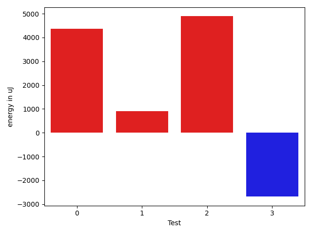

# gson ff7422

https://github.com/google/gson/commit/ff7422

## Delta Energy per test method

| ID | EnergyV1 | EnergyV2 | DeltaEnergy | σV1 | σV2 |
| --- | --- | --- | --- | --- | --- |
| 0 | 33813 | 34118 | 305 | 42880.592658773676 | 52781.61766153062 |
| 1 | 33569 | 33997 | 428 | 4392.259751548051 | 8074.52493911484 |
| 2 | 38757 | 61340 | 22583 | 17474.42928029916 | 17006.08489225895 |
| 3 | 37964 | 35644 | -2320 | 61668.200092577055 | 69722.1586094842 |

## Delta Duration per test method

| ID | DurationV1 | DurationsV2 | DeltaDuration |
| --- | --- | --- | --- |
| 0 | 1345443.2272727273 | 1462393.5238095238 | 116950.2965367965 |
| 1 | 1253694.3493975904 | 1340257.705882353 | 86563.35648476263 |
| 2 | 1896415.0303030303 | 1965143.6363636365 | 68728.6060606062 |
| 3 | 2424096.3636363638 | 2326337.2191780824 | -97759.14445828134 |

## Misc.

| ID | Test Class | Test Method |
| --- | --- | --- |
| 0 | com.google.gson.functional.CircularReferenceTest | testCircularSerialization |
| 1 | com.google.gson.functional.CircularReferenceTest | testSelfReferenceArrayFieldSerialization |
| 2 | com.google.gson.functional.CircularReferenceTest | testSelfReferenceSerialization |
| 3 | com.google.gson.functional.CircularReferenceTest | testSelfReferenceCustomHandlerSerialization |

| Test | IterationV1 | IterationV2 | DeltaIteration |
| --- | --- | --- | --- |
| 0 | 66 | 63 | -3 |
| 1 | 83 | 85 | 2 |
| 2 | 99 | 99 | 0 |
| 3 | 77 | 73 | -4 |

| Time Label | Time (s) |
| --- | --- |
| Selection | 24.075191736221313 |
| Injection | 8.86424207687378 |
| Total | 954.9459972381592 |

