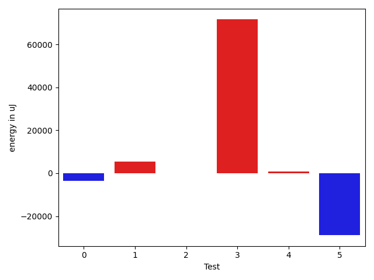

# gson 25ea87

https://github.com/google/gson/commit/25ea87

## Delta Energy per test method

| ID | EnergyV1 | EnergyV2 | DeltaEnergy | σV1 | σV2 |
| --- | --- | --- | --- | --- | --- |
| 0 | 75989 | 72326 | -3663 | 162573.62528221137 | 130569.1784661744 |
| 1 | 66162 | 71594 | 5432 | 115612.00413508677 | 78746.05837742363 |
| 2 | 36254 | 36254 | 0 | 22351.23688515462 | 25933.111366925783 |
| 3 | 46997 | 118591 | 71594 | 47999.5062199025 | 48441.78616749799 |
| 4 | 36560 | 37354 | 794 | 19142.675683680653 | 3206.49376252862 |
| 5 | 120606 | 91735 | -28871 | 49315.54283377397 | 47640.32619962481 |

## Delta Duration per test method

| ID | DurationV1 | DurationsV2 | DeltaDuration |
| --- | --- | --- | --- |
| 0 | 4973604.262626262 | 4274700.636363637 | -698903.6262626257 |
| 1 | 3437266.0704225353 | 2929572.4210526315 | -507693.64936990384 |
| 2 | 1022679.6666666666 | 1050157.225 | 27477.558333333465 |
| 3 | 2451266.787234043 | 3033033.7 | 581766.9127659574 |
| 4 | 830303.5 | 709032.2352941176 | -121271.26470588241 |
| 5 | 3033371.4285714286 | 2889013.7586206896 | -144357.66995073901 |

## Misc.

| ID | Test Class | Test Method |
| --- | --- | --- |
| 0 | com.google.gson.functional.ReadersWritersTest | testReadWriteTwoObjects |
| 1 | com.google.gson.functional.ReadersWritersTest | testReadWriteTwoStrings |
| 2 | com.google.gson.JsonStreamParserTest | testNoSideEffectForHasNext |
| 3 | com.google.gson.JsonStreamParserTest | testIterator |
| 4 | com.google.gson.JsonStreamParserTest | testCallingNextBeyondAvailableInput |
| 5 | com.google.gson.JsonStreamParserTest | testParseTwoStrings |

| Test | IterationV1 | IterationV2 | DeltaIteration |
| --- | --- | --- | --- |
| 0 | 99 | 99 | 0 |
| 1 | 71 | 76 | 5 |
| 2 | 27 | 40 | 13 |
| 3 | 47 | 50 | 3 |
| 4 | 22 | 17 | -5 |
| 5 | 28 | 29 | 1 |

| Time Label | Time (s) |
| --- | --- |
| Selection | 24.402302503585815 |
| Injection | 8.692922830581665 |
| Total | 955.6243109703064 |

