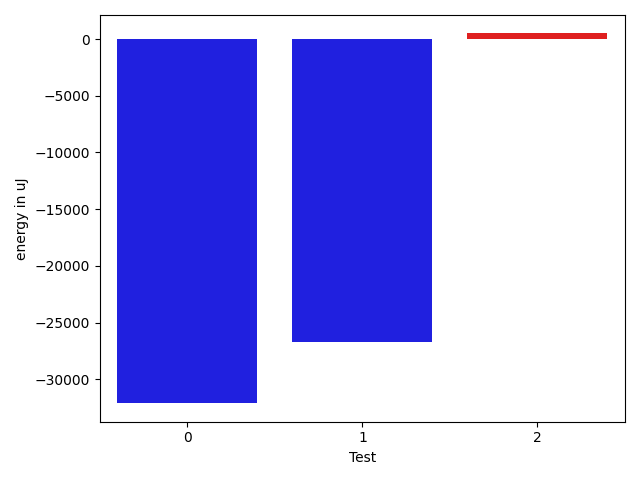

# gson c64b79

https://github.com/google/gson/commit/c64b79

## Delta Energy per test method

| ID | EnergyV1 | EnergyV2 | DeltaEnergy | σV1 | σV2 |
| --- | --- | --- | --- | --- | --- |
| 0 | 74585 | 42481 | -32104 | 117116.86335069734 | 123486.71886775341 |
| 1 | 422301 | 395568 | -26733 | 221325.62927999787 | 211668.9820170772 |
| 2 | 36926 | 37414 | 488 | 201538.29460838737 | 206081.6046746986 |

## Delta Duration per test method

| ID | DurationV1 | DurationsV2 | DeltaDuration |
| --- | --- | --- | --- |
| 0 | 3765670.135135135 | 3555394.6363636362 | -210275.4987714989 |
| 1 | 9608616.344262294 | 8485326.127659574 | -1123290.2166027203 |
| 2 | 5032328.6 | 4602606.577777778 | -429722.0222222218 |

## Misc.

| ID | Test Class | Test Method |
| --- | --- | --- |
| 0 | com.google.gson.functional.ReadersWritersTest | testReadWriteTwoStrings |
| 1 | com.google.gson.JsonStreamParserTest | testIterator |
| 2 | com.google.gson.JsonStreamParserTest | testParseTwoStrings |

| Test | IterationV1 | IterationV2 | DeltaIteration |
| --- | --- | --- | --- |
| 0 | 74 | 77 | 3 |
| 1 | 61 | 47 | -14 |
| 2 | 35 | 45 | 10 |

| Time Label | Time (s) |
| --- | --- |
| Selection | 23.642395496368408 |
| Injection | 8.849090337753296 |
| Total | 953.0141787528992 |

