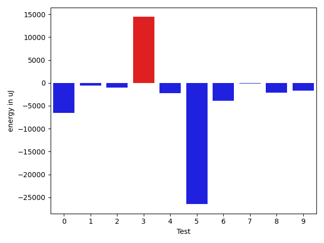

# gson 77c2c2

https://github.com/google/gson/commit/77c2c2

## Delta Energy per test method

| ID | EnergyV1 | EnergyV2 | DeltaEnergy | σV1 | σV2 |
| --- | --- | --- | --- | --- | --- |
| 0 | 69824 | 63293 | -6531 | 68519.85249162822 | 67272.79269073774 |
| 1 | 35950 | 35400 | -550 | 9060.256968676415 | 5844.523542147019 |
| 2 | 37048 | 36010 | -1038 | 32098.545461279024 | 38540.549439207236 |
| 3 | 175415 | 189819 | 14404 | 95945.83932542497 | 92071.6994714857 |
| 4 | 37475 | 35218 | -2257 | 68903.58677142848 | 48940.47718667417 |
| 5 | 67078 | 40589 | -26489 | 93843.85165641355 | 84463.56217323405 |
| 6 | 176575 | 172729 | -3846 | 86181.6117859848 | 60182.98366001653 |
| 7 | 37293 | 37109 | -184 | 61443.742215482845 | 52248.153041882004 |
| 8 | 40039 | 37903 | -2136 | 22621.131462785168 | 218755.88129949744 |
| 9 | 35889 | 34240 | -1649 | 7721.84138716885 | 11673.895214088958 |

## Delta Duration per test method

| ID | DurationV1 | DurationsV2 | DeltaDuration |
| --- | --- | --- | --- |
| 0 | 2778604.1326530613 | 2732399.0808080807 | -46205.05184498057 |
| 1 | 1078212.3548387096 | 1002257.9090909091 | -75954.44574780052 |
| 2 | 1303470.357142857 | 1225298.7538461538 | -78171.6032967032 |
| 3 | 4329529.7894736845 | 4974250.891304348 | 644721.1018306632 |
| 4 | 1922965.875 | 1710461.175 | -212504.69999999995 |
| 5 | 3407763.551020408 | 3051545.3673469387 | -356218.18367346935 |
| 6 | 6219888.373737373 | 5895813.03030303 | -324075.3434343431 |
| 7 | 1465905.3125 | 1550938.8048780488 | 85033.49237804883 |
| 8 | 1777684.905882353 | 2927913.8333333335 | 1150228.9274509805 |
| 9 | 1284062.2625 | 1354968.6184210526 | 70906.35592105263 |

## Misc.

| ID | Test Class | Test Method |
| --- | --- | --- |
| 0 | com.google.gson.functional.PrettyPrintingTest | testEmptyMapField |
| 1 | com.google.gson.functional.PrettyPrintingTest | testPrettyPrintArrayOfPrimitiveArrays |
| 2 | com.google.gson.functional.PrettyPrintingTest | testPrettyPrintListOfPrimitiveArrays |
| 3 | com.google.gson.functional.PrettyPrintingTest | testPrettyPrintArrayOfPrimitives |
| 4 | com.google.gson.functional.PrettyPrintingTest | testMap |
| 5 | com.google.gson.functional.PrettyPrintingTest | testPrettyPrintArrayOfObjects |
| 6 | com.google.gson.functional.PrettyPrintingTest | testPrettyPrintList |
| 7 | com.google.gson.functional.PrettyPrintingTest | testMultipleArrays |
| 8 | com.google.gson.functional.NullObjectAndFieldTest | testPrintPrintingObjectWithNulls |
| 9 | com.google.gson.functional.NullObjectAndFieldTest | testPrintPrintingArraysWithNulls |

| Test | IterationV1 | IterationV2 | DeltaIteration |
| --- | --- | --- | --- |
| 0 | 98 | 99 | 1 |
| 1 | 62 | 55 | -7 |
| 2 | 70 | 65 | -5 |
| 3 | 57 | 46 | -11 |
| 4 | 32 | 40 | 8 |
| 5 | 98 | 98 | 0 |
| 6 | 99 | 99 | 0 |
| 7 | 48 | 41 | -7 |
| 8 | 85 | 78 | -7 |
| 9 | 80 | 76 | -4 |

| Time Label | Time (s) |
| --- | --- |
| Selection | 23.72221851348877 |
| Injection | 8.82947850227356 |
| Total | 956.8846609592438 |

