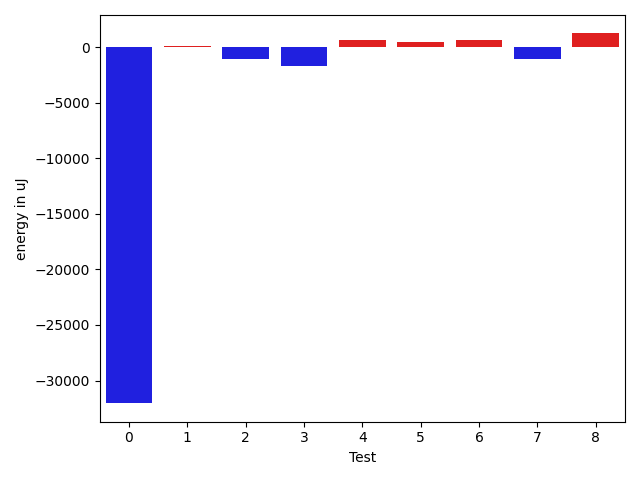

# gson fbefa5

https://github.com/google/gson/commit/fbefa5

## Delta Energy per test method

| ID | EnergyV1 | EnergyV2 | DeltaEnergy | σV1 | σV2 |
| --- | --- | --- | --- | --- | --- |
| 0 | 75257 | 43213 | -32044 | 56535.5789972436 | 44380.29581141248 |
| 1 | 34668 | 34729 | 61 | 82408.83124810859 | 131777.91286786422 |
| 2 | 34668 | 33630 | -1038 | 3508.7231917783765 | 18808.229049191847 |
| 3 | 149902 | 148193 | -1709 | 56539.60015760348 | 46605.24768672362 |
| 4 | 35644 | 36316 | 672 | 3392.5280224421963 | 3017.161637624777 |
| 5 | 34118 | 34607 | 489 | 3313.127596580683 | 3376.7626048709985 |
| 6 | 33203 | 33874 | 671 | 35021.18553221979 | 24504.415920588344 |
| 7 | 37170 | 36071 | -1099 | 146422.51655541625 | 167556.3510518147 |
| 8 | 38269 | 39490 | 1221 | 297114.2289655597 | 313872.41773809167 |

## Delta Duration per test method

| ID | DurationV1 | DurationsV2 | DeltaDuration |
| --- | --- | --- | --- |
| 0 | 2783238.8736842107 | 2607235.305263158 | -176003.56842105277 |
| 1 | 1749659.3608247424 | 2568286.945054945 | 818627.5842302027 |
| 2 | 1199232.328125 | 1267767.3846153845 | 68535.05649038451 |
| 3 | 4714662.908163265 | 4458309.040816327 | -256353.8673469387 |
| 4 | 977362.05 | 1004606.2580645161 | 27244.208064516075 |
| 5 | 985126.6571428571 | 1052527.8448275863 | 67401.18768472923 |
| 6 | 1149077.0 | 1118392.2571428572 | -30684.742857142817 |
| 7 | 2856724.8983050846 | 2465790.4098360655 | -390934.48846901907 |
| 8 | 5829329.8965517245 | 6668933.327868853 | 839603.4313171282 |

## Misc.

| ID | Test Class | Test Method |
| --- | --- | --- |
| 0 | com.google.gson.JsonDeserializerExceptionWrapperTest | testProperSerialization |
| 1 | com.google.gson.functional.DefaultTypeAdaptersTest | testDefaultDateDeserializationUsingBuilder |
| 2 | com.google.gson.functional.DefaultTypeAdaptersTest | testDefaultDateSerialization |
| 3 | com.google.gson.functional.DefaultTypeAdaptersTest | testDefaultDateDeserialization |
| 4 | com.google.gson.functional.DefaultTypeAdaptersTest | testDateSerializationWithPattern |
| 5 | com.google.gson.functional.DefaultTypeAdaptersTest | testDateDeserializationWithPattern |
| 6 | com.google.gson.functional.DefaultTypeAdaptersTest | testDefaultDateSerializationUsingBuilder |
| 7 | com.google.gson.DefaultDateTypeAdapterTest | testDateSerialization |
| 8 | com.google.gson.DefaultDateTypeAdapterTest | testDatePattern |

| Test | IterationV1 | IterationV2 | DeltaIteration |
| --- | --- | --- | --- |
| 0 | 95 | 95 | 0 |
| 1 | 97 | 91 | -6 |
| 2 | 64 | 65 | 1 |
| 3 | 98 | 98 | 0 |
| 4 | 60 | 62 | 2 |
| 5 | 70 | 58 | -12 |
| 6 | 59 | 70 | 11 |
| 7 | 59 | 61 | 2 |
| 8 | 58 | 61 | 3 |

| Time Label | Time (s) |
| --- | --- |
| Selection | 24.804647207260132 |
| Injection | 8.893520832061768 |
| Total | 957.942067861557 |

