# gson 907082

https://github.com/google/gson/commit/907082

## Delta Energy per test method

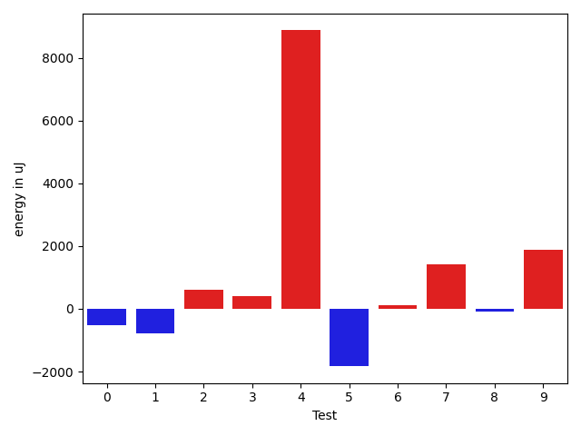

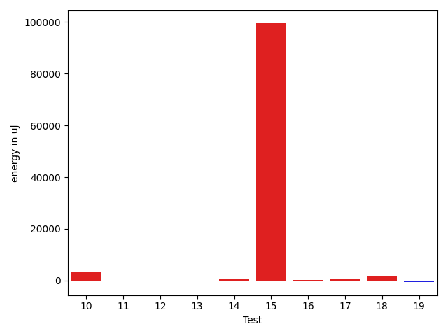

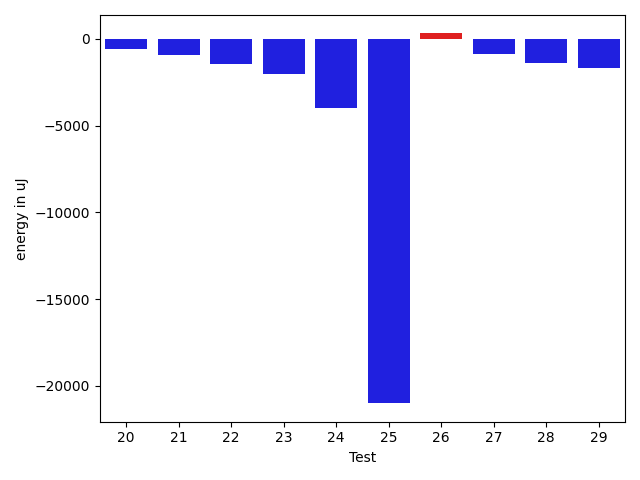

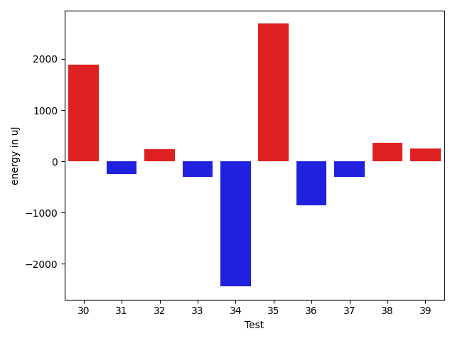

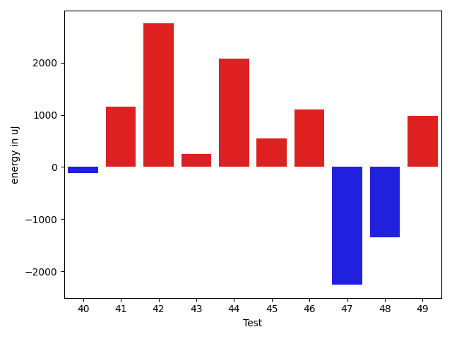

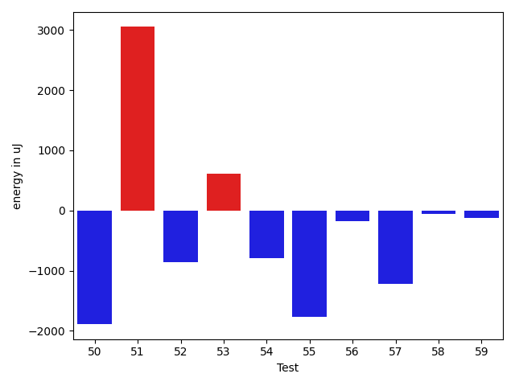

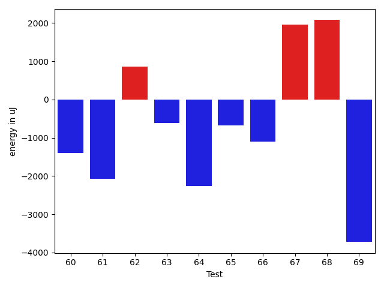

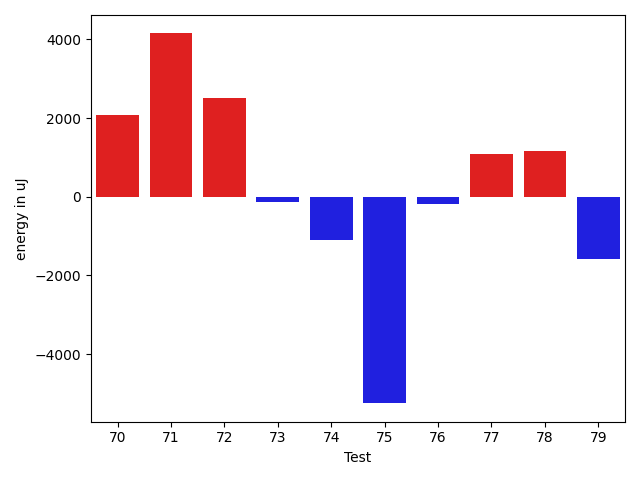

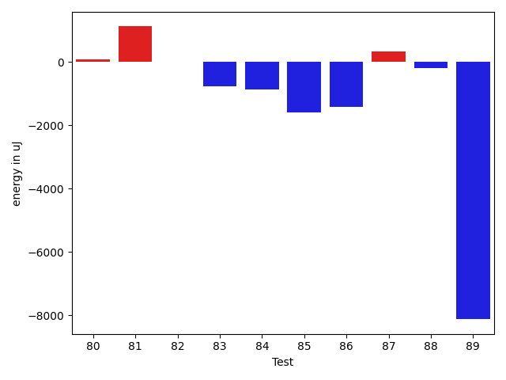

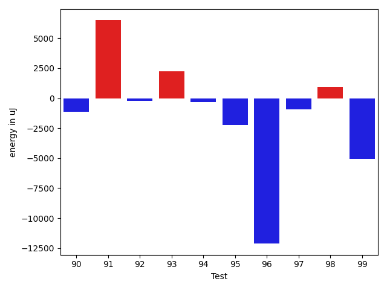

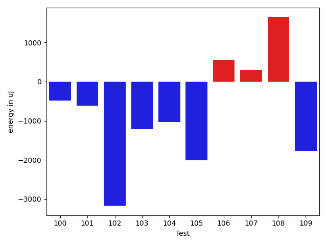

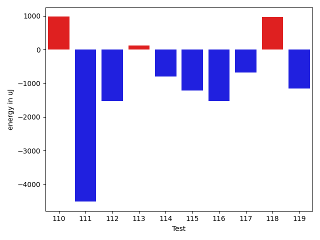

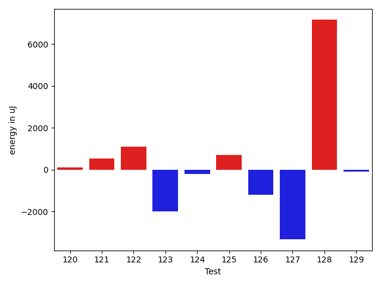

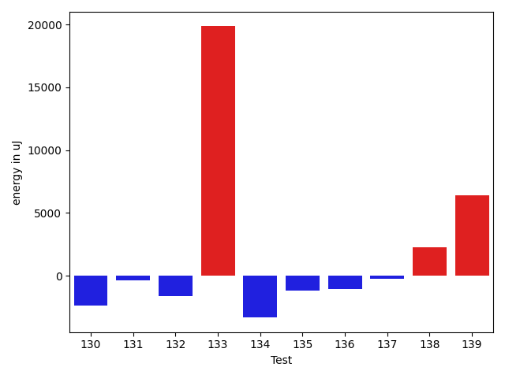

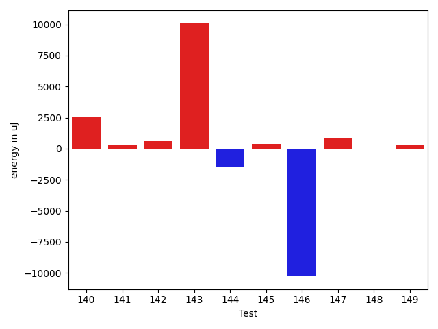

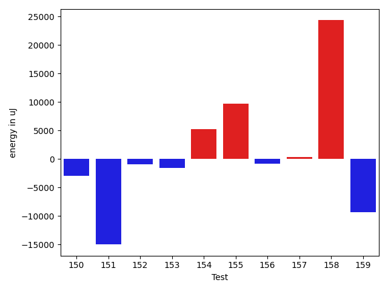

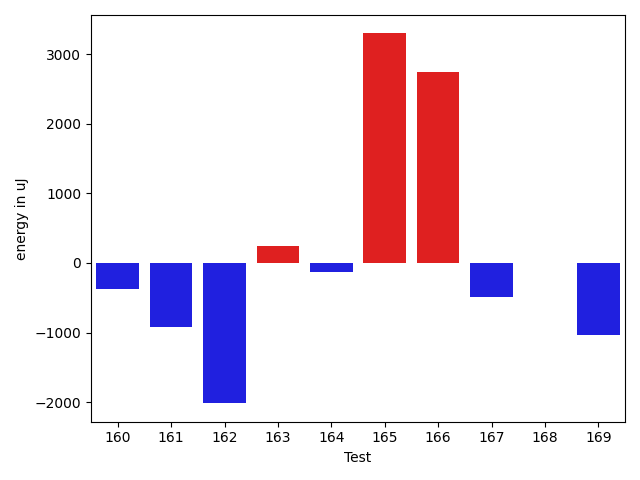

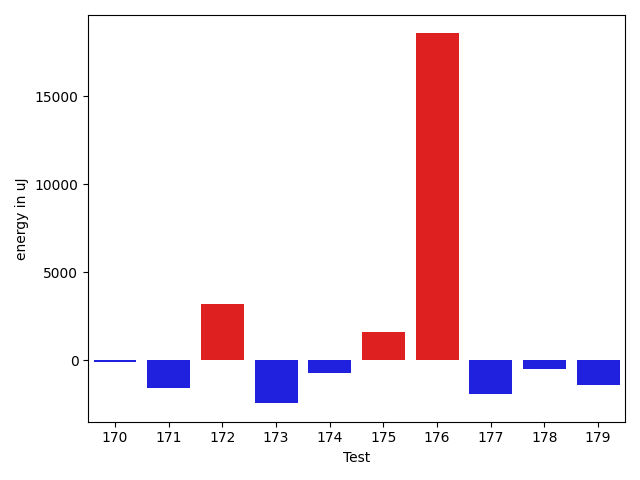

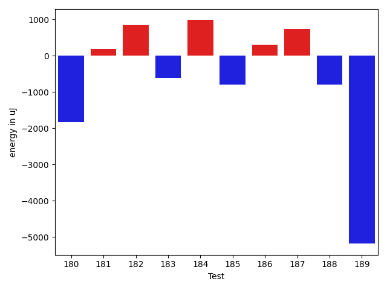

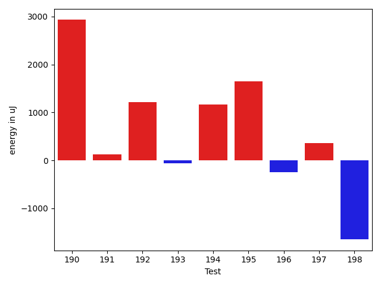

| ID | EnergyV1 | EnergyV2 | DeltaEnergy | σV1 | σV2 |
| --- | --- | --- | --- | --- | --- |
| 0 | 35339 | 34912 | -427 | 3808.0297472593506 | 3168.075467294579 |
| 1 | 36011 | 33935 | -2076 | 3997.9071958463733 | 4020.275621500343 |
| 2 | 36194 | 35949 | -245 | 10653.530404019264 | 11478.76545681507 |
| 3 | 36804 | 36010 | -794 | 8767.81721537983 | 10311.150056902217 |
| 4 | 83496 | 87219 | 3723 | 52531.41863693749 | 69027.38192252444 |
| 5 | 35217 | 34424 | -793 | 4100.97640866634 | 3362.2107402315514 |
| 6 | 35889 | 35156 | -733 | 8789.865616214567 | 9045.622324638307 |
| 7 | 72266 | 72509 | 243 | 24353.434943070657 | 25179.756534101365 |
| 8 | 35889 | 35034 | -855 | 10739.04902112548 | 11290.002906947762 |
| 9 | 63659 | 64209 | 550 | 24790.662841431633 | 19040.348559198967 |
| 10 | 72997 | 71655 | -1342 | 37088.01130329618 | 37871.72530211208 |
| 11 | 36682 | 35401 | -1281 | 8552.428601186628 | 8285.23144810069 |
| 12 | 34973 | 35705 | 732 | 4052.2228526563936 | 4288.579497581818 |
| 13 | 35888 | 34363 | -1525 | 3528.4064613741234 | 6519.712206303108 |
| 14 | 36438 | 36011 | -427 | 34732.69386460327 | 34242.60684918359 |
| 15 | 37719 | 37109 | -610 | 189891.4417155189 | 392790.6514727271 |
| 16 | 68665 | 67870 | -795 | 27897.658273254998 | 30801.51597225637 |
| 17 | 35584 | 37780 | 2196 | 3514.2275224243917 | 3557.9225943659876 |
| 18 | 35217 | 36499 | 1282 | 3588.4632827879836 | 8371.963232492779 |
| 19 | 34790 | 34851 | 61 | 3973.2933246006364 | 4617.275670037456 |
| 20 | 37415 | 36804 | -611 | 34835.87032394423 | 40221.21405598494 |
| 21 | 35095 | 34179 | -916 | 3109.767729804484 | 4837.351513421274 |
| 22 | 37415 | 35950 | -1465 | 13078.637712893793 | 13752.575476845304 |
| 23 | 37537 | 35523 | -2014 | 3826.327154869765 | 3224.4584591169164 |
| 24 | 37537 | 33570 | -3967 | 4023.0696243638813 | 4297.393842585033 |
| 25 | 62073 | 41077 | -20996 | 75950.62896022743 | 73354.63455351365 |
| 26 | 34973 | 35279 | 306 | 4284.902463681512 | 37466.29339308573 |
| 27 | 37780 | 36926 | -854 | 68382.58002406945 | 32269.652956438717 |
| 28 | 38269 | 36865 | -1404 | 13700.065489492701 | 11614.371293805523 |
| 29 | 37780 | 36071 | -1709 | 4079.9799280165275 | 4055.557549653161 |
| 30 | 35583 | 37476 | 1893 | 13937.566853405082 | 20558.186453959825 |
| 31 | 36194 | 35950 | -244 | 3880.803580613382 | 4253.702131599602 |
| 32 | 34302 | 34546 | 244 | 8831.150891106301 | 3893.334593446719 |
| 33 | 37171 | 36865 | -306 | 14318.250735734573 | 13255.29531172058 |
| 34 | 40466 | 38025 | -2441 | 32099.49655172625 | 52726.26622796726 |
| 35 | 33997 | 36682 | 2685 | 4205.8239077564285 | 4314.951560162794 |
| 36 | 37781 | 36926 | -855 | 5250.681737908209 | 3533.3164098437333 |
| 37 | 37414 | 37110 | -304 | 4785.24097236286 | 5219.334081037875 |
| 38 | 35034 | 35400 | 366 | 4874.212633395834 | 3463.5385912908623 |
| 39 | 36926 | 37171 | 245 | 4507.915839804689 | 3369.7350596818405 |
| 40 | 37353 | 37232 | -121 | 19734.28138410746 | 4317.803893534045 |
| 41 | 34241 | 35401 | 1160 | 3170.7550525554298 | 3716.591598410431 |
| 42 | 34362 | 37109 | 2747 | 3060.3102726429147 | 14081.003991119522 |
| 43 | 124328 | 124573 | 245 | 113273.95504166116 | 99673.06318336599 |
| 44 | 35766 | 37841 | 2075 | 4522.142945919924 | 3490.5742793987356 |
| 45 | 36560 | 37109 | 549 | 12909.358749200348 | 3054.2465074703878 |
| 46 | 36926 | 38024 | 1098 | 4624.773950840323 | 7214.955391085344 |
| 47 | 38147 | 35889 | -2258 | 70044.32758628154 | 7580.96883687039 |
| 48 | 35827 | 34484 | -1343 | 4674.218126736697 | 4604.846042052428 |
| 49 | 36926 | 37903 | 977 | 549940.4733692112 | 377705.00884161214 |
| 50 | 36743 | 34851 | -1892 | 3605.4074660284587 | 3814.268714069481 |
| 51 | 63843 | 66895 | 3052 | 66434.38247896254 | 57669.984127304444 |
| 52 | 36621 | 35766 | -855 | 25089.26387235456 | 7289.2699923433065 |
| 53 | 66100 | 66712 | 612 | 29635.971660779145 | 34300.451163062986 |
| 54 | 39001 | 38208 | -793 | 81788.88026773417 | 57342.89783099684 |
| 55 | 36743 | 34973 | -1770 | 3467.7115202248297 | 3505.69684766882 |
| 56 | 36377 | 36193 | -184 | 2546.1445719765984 | 3645.7499054835525 |
| 57 | 35522 | 34301 | -1221 | 3210.167576275201 | 2065.4443421642986 |
| 58 | 34546 | 34485 | -61 | 4448.094492704148 | 2251.7178093059615 |
| 59 | 36560 | 36438 | -122 | 3540.5432767302823 | 4216.563998104782 |
| 60 | 35583 | 34180 | -1403 | 37474.60339511682 | 3000.045429054182 |
| 61 | 35889 | 33813 | -2076 | 26602.409402110556 | 3501.474098376639 |
| 62 | 34423 | 35279 | 856 | 3881.2867185658906 | 35993.310430454374 |
| 63 | 35339 | 34729 | -610 | 26358.767998752726 | 4086.4848981526857 |
| 64 | 35949 | 33692 | -2257 | 3711.1198966753955 | 3324.6054884721643 |
| 65 | 35706 | 35035 | -671 | 30703.044805259942 | 2875.157272220078 |
| 66 | 36133 | 35034 | -1099 | 39032.07794478152 | 3413.1233663884536 |
| 67 | 61951 | 63903 | 1952 | 36480.36396033586 | 32834.378890517066 |
| 68 | 36377 | 38452 | 2075 | 6725.114174224961 | 11721.929638894087 |
| 69 | 38940 | 35217 | -3723 | 17861.5384345806 | 23693.899370049345 |
| 70 | 33325 | 35400 | 2075 | 36836.59798150761 | 3193.3470293721603 |
| 71 | 35705 | 39856 | 4151 | 3337.170275847488 | 4771.660553465638 |
| 72 | 33447 | 35950 | 2503 | 3659.1831782080053 | 3314.9639135560706 |
| 73 | 34241 | 34119 | -122 | 4080.1598824882667 | 2931.3710610528065 |
| 74 | 37536 | 36438 | -1098 | 4348.570206428394 | 2611.802986314142 |
| 75 | 37415 | 32166 | -5249 | 2801.669895630396 | 5324.674471009681 |
| 76 | 36011 | 35827 | -184 | 3935.992083781896 | 3880.449762511428 |
| 77 | 35461 | 36560 | 1099 | 3550.4640389626193 | 4439.903076238139 |
| 78 | 36621 | 37781 | 1160 | 4406.478677023839 | 24297.487986389733 |
| 79 | 38696 | 37109 | -1587 | 4662.768810950743 | 3061.5700518234466 |
| 80 | 34607 | 32898 | -1709 | 2195.857097019873 | 4279.777338951866 |
| 81 | 34729 | 33935 | -794 | 3417.8221175918447 | 4178.124080653102 |
| 82 | 33569 | 33691 | 122 | 3757.8347605369772 | 3492.8720420365835 |
| 83 | 36133 | 34790 | -1343 | 3654.8994143874797 | 3763.133029885774 |
| 84 | 36621 | 34729 | -1892 | 2474.3715363703973 | 3030.6228578737187 |
| 85 | 38025 | 33691 | -4334 | 3965.351938490927 | 3909.5607267810647 |
| 86 | 40650 | 37293 | -3357 | 3722.011581121155 | 2721.0709735425053 |
| 87 | 34790 | 34668 | -122 | 3212.961011233711 | 7526.2732876719465 |
| 88 | 36804 | 36804 | 0 | 7318.724650406342 | 8603.479077761458 |
| 89 | 37536 | 35828 | -1708 | 24697.440628961813 | 3648.715433029067 |
| 90 | 36255 | 35279 | -976 | 4010.47216476751 | 3393.999059503731 |
| 91 | 37292 | 39795 | 2503 | 15106.289443993348 | 18225.77746997232 |
| 92 | 37293 | 36133 | -1160 | 4493.760792723865 | 6622.301933134627 |
| 93 | 36926 | 35339 | -1587 | 3662.678683122841 | 15407.225063561584 |
| 94 | 34851 | 35339 | 488 | 4075.734764762646 | 3709.2238706970584 |
| 95 | 37231 | 35522 | -1709 | 4344.006658476583 | 3294.3969625621585 |
| 96 | 37842 | 35645 | -2197 | 59791.69701358595 | 13343.215365932203 |
| 97 | 37231 | 35522 | -1709 | 3901.469850281181 | 3476.7730555789803 |
| 98 | 34607 | 34058 | -549 | 3535.1084695663867 | 4031.116020464736 |
| 99 | 36316 | 36011 | -305 | 26083.410391839785 | 3218.8069154592454 |
| 100 | 35644 | 35156 | -488 | 3693.2108147855542 | 2978.5444098606768 |
| 101 | 38635 | 38025 | -610 | 462608.4219514746 | 322254.4502241006 |
| 102 | 74524 | 71350 | -3174 | 29175.250315836805 | 30830.30907898797 |
| 103 | 84838 | 83618 | -1220 | 221648.04083427007 | 321786.3452303406 |
| 104 | 35767 | 34729 | -1038 | 58073.879934476136 | 64798.54550337343 |
| 105 | 35645 | 33631 | -2014 | 3895.8560319677918 | 4005.493279006128 |
| 106 | 34973 | 35523 | 550 | 4250.916177670859 | 4727.275798847969 |
| 107 | 34851 | 35156 | 305 | 29351.96996311013 | 3319.614774318933 |
| 108 | 35278 | 36927 | 1649 | 29353.730460458864 | 9439.74850247611 |
| 109 | 38879 | 37110 | -1769 | 36379.69161496346 | 26444.625905548553 |
| 110 | 35156 | 36133 | 977 | 3556.0483911569236 | 3645.315019363896 |
| 111 | 41748 | 37231 | -4517 | 59503.09381171332 | 58305.90568426415 |
| 112 | 36743 | 35217 | -1526 | 3894.387933970912 | 26087.10351853841 |
| 113 | 34546 | 34668 | 122 | 3467.0967118577755 | 3306.242440697093 |
| 114 | 36255 | 35461 | -794 | 28301.46665255389 | 25726.774103889304 |
| 115 | 35827 | 34607 | -1220 | 10640.917744270675 | 24323.68783804857 |
| 116 | 148559 | 147033 | -1526 | 30438.703437807566 | 25284.28793997909 |
| 117 | 33448 | 32775 | -673 | 3010.16940332844 | 4009.547481549847 |
| 118 | 34241 | 35217 | 976 | 5652.408339264228 | 3960.6050163743957 |
| 119 | 35522 | 34362 | -1160 | 3692.07951374468 | 3630.855547088941 |
| 120 | 34667 | 35034 | 367 | 3847.9766312541715 | 3708.026683550326 |
| 121 | 34851 | 34973 | 122 | 3421.0233547288153 | 3759.357819753548 |
| 122 | 34790 | 35522 | 732 | 3381.136599179435 | 3988.7325956231616 |
| 123 | 36865 | 35645 | -1220 | 12423.52572446855 | 8757.426516641463 |
| 124 | 33691 | 33753 | 62 | 3116.814737288048 | 3603.067593988914 |
| 125 | 33691 | 34973 | 1282 | 3930.4531464588067 | 4286.70767538619 |
| 126 | 34851 | 33264 | -1587 | 2965.0885726681618 | 2647.7951672918134 |
| 127 | 36621 | 33508 | -3113 | 4916.2715810793625 | 3753.9453569988646 |
| 128 | 36071 | 36499 | 428 | 4125.802682117569 | 30747.818657276286 |
| 129 | 35401 | 34668 | -733 | 3333.831682070197 | 4362.845353150878 |
| 130 | 37536 | 34424 | -3112 | 4340.759199299571 | 3762.3178187920275 |
| 131 | 35339 | 34180 | -1159 | 3169.551641695557 | 3110.4600509241495 |
| 132 | 36926 | 33325 | -3601 | 4107.861836819734 | 3939.284187514275 |
| 133 | 166991 | 191528 | 24537 | 176954.92906251652 | 225669.31548360782 |
| 134 | 38147 | 37537 | -610 | 29450.77616405423 | 25080.3689099069 |
| 135 | 36866 | 36255 | -611 | 7168.535696756473 | 4058.3446891845197 |
| 136 | 38757 | 37170 | -1587 | 4937.453916838102 | 3483.8586730480747 |
| 137 | 37902 | 37231 | -671 | 4030.9384476068426 | 4443.176682927912 |
| 138 | 36988 | 36682 | -306 | 4301.803037907604 | 8366.554727190623 |
| 139 | 37842 | 37659 | -183 | 15136.80361757285 | 36339.217388226185 |
| 140 | 38513 | 38635 | 122 | 37451.114388055976 | 38934.21474884775 |
| 141 | 36316 | 36254 | -62 | 4054.716575319764 | 6717.158232160273 |
| 142 | 35217 | 35705 | 488 | 5515.826156539414 | 6717.760313180603 |
| 143 | 34912 | 36560 | 1648 | 3916.6499826214194 | 22849.26477253821 |
| 144 | 36560 | 35522 | -1038 | 4039.154408092746 | 3140.359123300826 |
| 145 | 38330 | 38635 | 305 | 18384.05982664226 | 19797.042189576263 |
| 146 | 37170 | 36011 | -1159 | 36366.98022533185 | 27223.62564151367 |
| 147 | 35461 | 35950 | 489 | 3636.8654221410825 | 3624.4900587194243 |
| 148 | 37109 | 36743 | -366 | 3596.0152222609736 | 3959.435702384088 |
| 149 | 35156 | 35340 | 184 | 3674.491592702826 | 4505.698192301986 |
| 150 | 38330 | 37109 | -1221 | 60092.77378459622 | 61819.48970329687 |
| 151 | 36621 | 35217 | -1404 | 32153.001584246267 | 3155.3169455111693 |
| 152 | 36926 | 35400 | -1526 | 3035.2095159239925 | 3476.2464520737817 |
| 153 | 36316 | 34607 | -1709 | 3692.0440255683156 | 2728.9051114756658 |
| 154 | 36987 | 39733 | 2746 | 14260.405416431853 | 18757.411945385455 |
| 155 | 38269 | 39245 | 976 | 45036.51890003788 | 56057.614256931134 |
| 156 | 228881 | 212585 | -16296 | 78873.25981248662 | 104906.98837102346 |
| 157 | 38574 | 38757 | 183 | 59306.076307307994 | 58221.776297329496 |
| 158 | 37171 | 37964 | 793 | 15024.511471477406 | 121708.91988326541 |
| 159 | 38147 | 36499 | -1648 | 32849.38551979862 | 8203.571744734798 |
| 160 | 37354 | 36987 | -367 | 79574.83472873113 | 7253.3880392994415 |
| 161 | 38208 | 37293 | -915 | 28830.62351172436 | 30274.63630997813 |
| 162 | 39551 | 37536 | -2015 | 76678.37764103404 | 4279.40280642054 |
| 163 | 36437 | 36682 | 245 | 3700.015524715551 | 71531.7605764041 |
| 164 | 37842 | 37719 | -123 | 4211.750078739451 | 28401.938028759123 |
| 165 | 37903 | 41199 | 3296 | 106358.81157489558 | 142336.24682866217 |
| 166 | 36804 | 39551 | 2747 | 3984.5130955751665 | 4140.669243316155 |
| 167 | 38085 | 37598 | -487 | 33212.05528972225 | 33453.618371369404 |
| 168 | 34912 | 34912 | 0 | 4506.486146800448 | 3581.6022339671213 |
| 169 | 37049 | 36011 | -1038 | 16774.628879972515 | 25275.150621824654 |
| 170 | 35522 | 35401 | -121 | 4474.454388681249 | 3391.1062264409493 |
| 171 | 39307 | 37720 | -1587 | 66412.6375584329 | 63794.18933863283 |
| 172 | 39855 | 43030 | 3175 | 18632.271746622846 | 25701.41762829059 |
| 173 | 36865 | 34424 | -2441 | 3509.4941715295668 | 3253.78609261702 |
| 174 | 37292 | 36560 | -732 | 3924.079578609001 | 3773.7235800204294 |
| 175 | 36682 | 38269 | 1587 | 3579.350270649689 | 4306.907132955517 |
| 176 | 38940 | 57495 | 18555 | 20491.036500111186 | 25385.724308192795 |
| 177 | 35705 | 33814 | -1891 | 3930.385128004363 | 3332.423826586288 |
| 178 | 37720 | 37231 | -489 | 48149.364258073445 | 7170.495590493799 |
| 179 | 37353 | 35949 | -1404 | 12305.46135867257 | 19971.53413732656 |
| 180 | 40466 | 38635 | -1831 | 95929.12485056526 | 75049.29170416573 |
| 181 | 38635 | 38819 | 184 | 553946.5675281978 | 644291.0821875173 |
| 182 | 34912 | 35766 | 854 | 4423.86414756305 | 4282.4425895211225 |
| 183 | 36866 | 36255 | -611 | 11964.609189104798 | 3656.0444208538056 |
| 184 | 35827 | 36805 | 978 | 3327.5048465519226 | 4076.6707977697224 |
| 185 | 39123 | 38330 | -793 | 49236.64503778043 | 35396.262022147144 |
| 186 | 36072 | 36377 | 305 | 3866.3743197599742 | 4840.690678171404 |
| 187 | 36255 | 36988 | 733 | 3430.772252715123 | 2860.367845225505 |
| 188 | 38696 | 37903 | -793 | 4455.5927432696935 | 4450.511814355988 |
| 189 | 38879 | 33692 | -5187 | 5447.92900971534 | 5039.322286886512 |
| 190 | 35950 | 38880 | 2930 | 3739.9539169671684 | 3498.545081530321 |
| 191 | 36682 | 36804 | 122 | 7804.890554235851 | 4212.902131935169 |
| 192 | 37597 | 38818 | 1221 | 155853.8353311751 | 120620.62982432524 |
| 193 | 37414 | 37354 | -60 | 57940.307697059034 | 55203.481000957174 |
| 194 | 35034 | 36194 | 1160 | 4785.362627034886 | 4292.247717947115 |
| 195 | 35583 | 37232 | 1649 | 261557.40906950244 | 424450.5938908922 |
| 196 | 38574 | 38330 | -244 | 668410.6391122873 | 399876.324030596 |
| 197 | 38269 | 38635 | 366 | 308088.70152621425 | 445088.11874335574 |
| 198 | 38147 | 36499 | -1648 | 20308.92829428038 | 17435.895661841183 |

## Delta Duration per test method

| ID | DurationV1 | DurationsV2 | DeltaDuration |
| --- | --- | --- | --- |
| 0 | 991873.5147058824 | 942499.5138888889 | -49374.00081699353 |
| 1 | 831505.1509433963 | 843933.051724138 | 12427.900780741707 |
| 2 | 1235432.0947368422 | 1266413.4782608696 | 30981.38352402742 |
| 3 | 1183180.8915662651 | 1210994.4395604397 | 27813.54799417453 |
| 4 | 2926071.232323232 | 3245438.787878788 | 319367.55555555597 |
| 5 | 734669.0 | 528866.5925925926 | -205802.40740740742 |
| 6 | 1188528.1 | 1225438.1573033708 | 36910.057303370675 |
| 7 | 2269371.5757575757 | 2398376.9292929294 | 129005.35353535367 |
| 8 | 1326141.7311827957 | 1358374.59375 | 32232.862567204284 |
| 9 | 1867820.111111111 | 1866336.3434343433 | -1483.7676767676603 |
| 10 | 2495555.272727273 | 2571369.9292929294 | 75814.65656565642 |
| 11 | 1199776.8 | 1231208.3723404256 | 31431.57234042557 |
| 12 | 727756.487804878 | 770150.4146341464 | 42393.92682926834 |
| 13 | 929280.3 | 945752.6307692308 | 16472.330769230728 |
| 14 | 1325463.1666666667 | 1388044.0 | 62580.833333333256 |
| 15 | 1995588.8026315789 | 5185368.268656717 | 3189779.466025138 |
| 16 | 2266510.212121212 | 2207491.6868686867 | -59018.52525252523 |
| 17 | 485471.95238095237 | 461804.05 | -23667.90238095238 |
| 18 | 966490.1754385965 | 974361.15625 | 7870.980811403482 |
| 19 | 764019.8333333334 | 783331.2954545454 | 19311.46212121204 |
| 20 | 1455760.875 | 1608783.095890411 | 153022.22089041094 |
| 21 | 427220.8333333333 | 441605.90476190473 | 14385.07142857142 |
| 22 | 1057212.810810811 | 1031485.7121212122 | -25727.09868959873 |
| 23 | 574288.375 | 567856.947368421 | -6431.42763157899 |
| 24 | 615429.1590909091 | 629621.275862069 | 14192.116771159926 |
| 25 | 2431851.757575758 | 2274609.1340206186 | -157242.62355513917 |
| 26 | 494332.75 | 730492.0952380953 | 236159.34523809527 |
| 27 | 1294552.6666666667 | 911369.7692307692 | -383182.8974358975 |
| 28 | 1015782.85 | 945783.7924528302 | -69999.05754716974 |
| 29 | 466478.53846153844 | 384176.5238095238 | -82302.01465201465 |
| 30 | 1297054.4 | 1325708.2280701755 | 28653.8280701756 |
| 31 | 705884.2272727273 | 745261.325 | 39377.09772727266 |
| 32 | 916520.490909091 | 876007.6727272727 | -40512.818181818235 |
| 33 | 1359725.1030927836 | 1321100.9673913044 | -38624.13570147916 |
| 34 | 1442059.8142857142 | 1688776.9454545456 | 246717.13116883137 |
| 35 | 746414.5833333334 | 743908.6274509804 | -2505.9558823530097 |
| 36 | 542474.8235294118 | 363734.1538461539 | -178740.66968325793 |
| 37 | 738818.3518518518 | 711367.0454545454 | -27451.306397306384 |
| 38 | 544345.4 | 547371.9032258064 | 3026.503225806402 |
| 39 | 741115.4117647059 | 721924.2142857143 | -19191.197478991584 |
| 40 | 825276.0357142857 | 751224.5769230769 | -74051.4587912088 |
| 41 | 426939.0 | 432307.5 | 5368.5 |
| 42 | 461236.4375 | 537085.7058823529 | 75849.2683823529 |
| 43 | 5034582.333333333 | 5065986.545454546 | 31404.212121212855 |
| 44 | 513420.73333333334 | 471142.65 | -42278.083333333314 |
| 45 | 669542.0333333333 | 484071.5 | -185470.53333333333 |
| 46 | 671226.6829268293 | 736962.4761904762 | 65735.79326364689 |
| 47 | 1441541.6888888888 | 910385.7 | -531155.9888888889 |
| 48 | 565660.0344827586 | 669801.1923076923 | 104141.15782493365 |
| 49 | 5183553.042253521 | 3264981.493670886 | -1918571.5485826354 |
| 50 | 548778.75 | 514176.90476190473 | -34601.845238095266 |
| 51 | 2479182.5454545454 | 2667608.717171717 | 188426.17171717156 |
| 52 | 1013822.3888888889 | 807567.914893617 | -206254.47399527184 |
| 53 | 1964810.1379310344 | 2027411.125 | 62600.987068965565 |
| 54 | 1758806.2105263157 | 1857784.5625 | 98978.35197368427 |
| 55 | 392769.9166666667 | 380460.64285714284 | -12309.273809523846 |
| 56 | 391953.5714285714 | 397369.13333333336 | 5415.56190476194 |
| 57 | 387671.0909090909 | 516400.36363636365 | 128729.27272727276 |
| 58 | 714067.9677419355 | 725059.7575757576 | 10991.789833822055 |
| 59 | 469269.88 | 438092.1904761905 | -31177.68952380953 |
| 60 | 712230.9230769231 | 430369.75 | -281861.1730769231 |
| 61 | 758613.225 | 661385.6129032258 | -97227.61209677416 |
| 62 | 366968.0 | 745744.1666666666 | 378776.1666666666 |
| 63 | 651462.2903225806 | 486908.7586206897 | -164553.53170189093 |
| 64 | 362667.95 | 365999.64705882355 | 3331.6970588235417 |
| 65 | 635863.6086956522 | 473308.85 | -162554.75869565224 |
| 66 | 757279.9166666666 | 342775.17647058825 | -414504.7401960784 |
| 67 | 1783972.107142857 | 1691352.2272727273 | -92619.87987012975 |
| 68 | 787063.6206896552 | 709754.25 | -77309.37068965519 |
| 69 | 958985.8125 | 956897.6666666666 | -2088.145833333372 |
| 70 | 738129.3529411765 | 338985.75 | -399143.6029411765 |
| 71 | 403552.8 | 344852.75 | -58700.04999999999 |
| 72 | 627955.2424242424 | 602354.6451612903 | -25600.597262952127 |
| 73 | 418941.75 | 369213.1176470588 | -49728.632352941204 |
| 74 | 519628.57692307694 | 519087.17391304346 | -541.4030100334785 |
| 75 | 413671.5 | 387582.8333333333 | -26088.666666666686 |
| 76 | 361002.625 | 378034.625 | 17032.0 |
| 77 | 495451.7368421053 | 483738.75 | -11712.986842105282 |
| 78 | 458363.4761904762 | 697476.3684210526 | 239112.89223057637 |
| 79 | 442415.375 | 436176.13333333336 | -6239.2416666666395 |
| 80 | 346921.76923076925 | 340713.1538461539 | -6208.615384615376 |
| 81 | 354477.1 | 342081.8333333333 | -12395.266666666663 |
| 82 | 369732.65 | 413118.0714285714 | 43385.4214285714 |
| 83 | 491067.5 | 463332.6111111111 | -27734.888888888876 |
| 84 | 324081.5 | 359677.2 | 35595.70000000001 |
| 85 | 360801.4375 | 686320.8333333334 | 325519.3958333334 |
| 86 | 416046.7 | 435131.1666666667 | 19084.466666666674 |
| 87 | 783592.4651162791 | 791725.0 | 8132.534883720917 |
| 88 | 983552.1475409836 | 973104.671641791 | -10447.475899192621 |
| 89 | 678994.0625 | 421152.21428571426 | -257841.84821428574 |
| 90 | 585052.125 | 591341.7777777778 | 6289.652777777752 |
| 91 | 1179411.7432432433 | 1599987.1237113401 | 420575.3804680968 |
| 92 | 723855.5 | 606023.5294117647 | -117831.9705882353 |
| 93 | 744535.925925926 | 797879.027027027 | 53343.10110110103 |
| 94 | 778570.0975609756 | 749289.5344827586 | -29280.563078216976 |
| 95 | 590547.3666666667 | 787646.6 | 197099.23333333328 |
| 96 | 1193991.5909090908 | 876329.125 | -317662.4659090908 |
| 97 | 549277.9142857143 | 556146.68 | 6868.765714285779 |
| 98 | 900160.28 | 525711.7419354839 | -374448.53806451615 |
| 99 | 1000906.3333333334 | 813008.2545454545 | -187898.07878787885 |
| 100 | 446671.38095238095 | 444302.82608695654 | -2368.554865424405 |
| 101 | 4325615.9875 | 3078470.0632911394 | -1247145.9242088604 |
| 102 | 2508488.909090909 | 2459376.97979798 | -49111.92929292936 |
| 103 | 4393772.171717172 | 5131386.090909091 | 737613.9191919193 |
| 104 | 1219942.6888888888 | 1517992.1935483871 | 298049.50465949834 |
| 105 | 768255.7446808511 | 927648.612244898 | 159392.86756404687 |
| 106 | 557764.3103448276 | 548956.2647058824 | -8808.045638945187 |
| 107 | 871348.3846153846 | 758472.2666666667 | -112876.1179487179 |
| 108 | 949079.8292682926 | 782191.975 | -166887.85426829266 |
| 109 | 1521458.8125 | 1334460.7341772153 | -186998.07832278474 |
| 110 | 521343.32258064515 | 495872.24 | -25471.08258064516 |
| 111 | 1813153.3333333333 | 1444240.3448275863 | -368912.98850574694 |
| 112 | 716828.7142857143 | 893236.2 | 176407.48571428563 |
| 113 | 603685.1875 | 533306.2666666667 | -70378.92083333328 |
| 114 | 1066808.6181818182 | 919707.8648648649 | -147100.7533169533 |
| 115 | 1102413.892857143 | 931007.6097560975 | -171406.2831010454 |
| 116 | 4680371.777777778 | 4541405.95959596 | -138965.81818181835 |
| 117 | 396173.71428571426 | 441585.1904761905 | 45411.47619047621 |
| 118 | 996591.8108108108 | 1000451.6060606061 | 3859.7952497953083 |
| 119 | 522890.73529411765 | 506924.96428571426 | -15965.77100840339 |
| 120 | 698602.9302325582 | 697951.0425531915 | -651.8876793666277 |
| 121 | 473390.52 | 561633.2727272727 | 88242.75272727269 |
| 122 | 965349.0 | 960924.0 | -4425.0 |
| 123 | 936806.4634146341 | 848831.6 | -87974.86341463414 |
| 124 | 680708.2380952381 | 671029.487804878 | -9678.750290360069 |
| 125 | 405209.8095238095 | 378864.5909090909 | -26345.218614718644 |
| 126 | 446725.0 | 435811.86363636365 | -10913.136363636353 |
| 127 | 626793.3928571428 | 562413.6666666666 | -64379.72619047621 |
| 128 | 787936.1860465116 | 1129148.1710526317 | 341211.98500612006 |
| 129 | 701199.575 | 714011.6857142857 | 12812.11071428575 |
| 130 | 599385.1904761905 | 504522.32 | -94862.87047619052 |
| 131 | 511908.25 | 482777.6666666667 | -29130.583333333314 |
| 132 | 444119.72 | 420095.15 | -24024.56999999995 |
| 133 | 6193966.545454546 | 6843251.05050505 | 649284.5050505046 |
| 134 | 1020946.8235294118 | 944191.1363636364 | -76755.68716577545 |
| 135 | 926345.6034482758 | 951023.0491803279 | 24677.44573205209 |
| 136 | 631999.8181818182 | 563160.0370370371 | -68839.78114478115 |
| 137 | 805195.4888888889 | 828387.2678571428 | 23191.778968253988 |
| 138 | 833217.6290322581 | 858971.2156862745 | 25753.5866540164 |
| 139 | 876530.4237288135 | 1110733.4 | 234202.97627118637 |
| 140 | 1284007.2413793104 | 1374318.6551724137 | 90311.4137931033 |
| 141 | 814786.1111111111 | 801060.7450980392 | -13725.366013071965 |
| 142 | 983565.4696969697 | 979304.3484848485 | -4261.121212121216 |
| 143 | 648965.0645161291 | 1089475.9666666666 | 440510.90215053747 |
| 144 | 782324.0 | 770984.0784313725 | -11339.92156862747 |
| 145 | 1560426.4086021506 | 1498685.4361702127 | -61740.97243193793 |
| 146 | 1426608.564516129 | 1166052.5970149254 | -260555.96750120353 |
| 147 | 745145.5 | 777565.224489796 | 32419.724489795975 |
| 148 | 842346.0208333334 | 816535.1964285715 | -25810.824404761894 |
| 149 | 787571.1666666666 | 770510.880952381 | -17060.28571428568 |
| 150 | 1415229.9782608696 | 1235113.3442622952 | -180116.63399857446 |
| 151 | 1187133.3333333333 | 758338.1515151515 | -428795.18181818177 |
| 152 | 408785.22222222225 | 380036.2 | -28749.022222222236 |
| 153 | 347518.4285714286 | 399599.63636363635 | 52081.20779220777 |
| 154 | 769292.5161290322 | 1094398.5833333333 | 325106.067204301 |
| 155 | 1108208.0285714285 | 1562113.9 | 453905.8714285714 |
| 156 | 6975542.858585859 | 7064763.454545454 | 89220.5959595954 |
| 157 | 1829293.802197802 | 1854368.1538461538 | 25074.351648351643 |
| 158 | 1196177.4225352113 | 1992914.1445783132 | 796736.7220431019 |
| 159 | 1279902.2826086956 | 871804.3333333334 | -408097.9492753622 |
| 160 | 1401649.642857143 | 749967.2564102564 | -651682.3864468866 |
| 161 | 1415534.7538461538 | 1326177.6666666667 | -89357.0871794871 |
| 162 | 1908647.5967741935 | 827879.38 | -1080768.2167741936 |
| 163 | 521827.57692307694 | 1535370.0 | 1013542.423076923 |
| 164 | 752358.7368421053 | 936306.2631578947 | 183947.52631578944 |
| 165 | 1815518.037037037 | 3752478.714285714 | 1936960.677248677 |
| 166 | 540860.1282051282 | 557051.8846153846 | 16191.756410256377 |
| 167 | 1535124.0135135136 | 1661178.537313433 | 126054.52379991929 |
| 168 | 658223.6086956522 | 454089.85714285716 | -204133.75155279506 |
| 169 | 1154692.7346938776 | 1111015.4090909092 | -43677.325602968456 |
| 170 | 657291.5625 | 626899.7567567568 | -30391.805743243196 |
| 171 | 1889521.65625 | 1795135.6 | -94386.0562499999 |
| 172 | 1425335.45 | 1384768.3529411764 | -40567.097058823565 |
| 173 | 443735.15 | 522542.38095238095 | 78807.23095238092 |
| 174 | 512499.54545454547 | 524385.8181818182 | 11886.272727272764 |
| 175 | 422043.05 | 450924.70588235295 | 28881.655882352963 |
| 176 | 1283796.3333333333 | 1735395.9189189188 | 451599.58558558556 |
| 177 | 794096.8461538461 | 362754.5333333333 | -431342.3128205128 |
| 178 | 1101716.5061728396 | 1066315.633802817 | -35400.87237002258 |
| 179 | 1068297.5 | 1189436.48 | 121138.97999999998 |
| 180 | 2439588.5185185187 | 1694091.612244898 | -745496.9062736207 |
| 181 | 5769968.578125 | 7581690.418181818 | 1811721.840056818 |
| 182 | 387993.125 | 448035.6923076923 | 60042.56730769231 |
| 183 | 810057.074074074 | 764151.2380952381 | -45905.83597883594 |
| 184 | 500339.03571428574 | 549194.1818181818 | 48855.146103896026 |
| 185 | 1367935.5 | 968523.6363636364 | -399411.86363636365 |
| 186 | 480642.3448275862 | 453954.2272727273 | -26688.11755485891 |
| 187 | 416462.8333333333 | 362722.8 | -53740.033333333326 |
| 188 | 411522.0 | 420012.75 | 8490.75 |
| 189 | 377682.0 | 364135.1111111111 | -13546.888888888876 |
| 190 | 360112.1176470588 | 344769.6666666667 | -15342.45098039211 |
| 191 | 771869.54 | 748539.6666666666 | -23329.87333333341 |
| 192 | 2426250.1612903224 | 2318586.7288135593 | -107663.43247676315 |
| 193 | 1474320.680851064 | 1453717.1162790698 | -20603.564571994124 |
| 194 | 619897.4 | 691065.4 | 71168.0 |
| 195 | 2695199.6666666665 | 4481166.714285715 | 1785967.047619048 |
| 196 | 11130764.555555556 | 3876549.1666666665 | -7254215.38888889 |
| 197 | 2631578.7407407407 | 3919238.5833333335 | 1287659.8425925928 |
| 198 | 919267.6666666666 | 969618.5714285715 | 50350.90476190485 |

## Misc.

| ID | Test Class | Test Method |
| --- | --- | --- |
| 0 | com.google.gson.functional.ParameterizedTypesTest | testParameterizedTypeGenericArraysSerialization |
| 1 | com.google.gson.functional.ParameterizedTypesTest | testParameterizedTypesWithWriterSerialization |
| 2 | com.google.gson.functional.ParameterizedTypesTest | testVariableTypeArrayDeserialization |
| 3 | com.google.gson.functional.ParameterizedTypesTest | testParameterizedTypeWithCustomSerializer |
| 4 | com.google.gson.functional.ParameterizedTypesTest | testParameterizedTypesSerialization |
| 5 | com.google.gson.functional.ParameterizedTypesTest | testDeepParameterizedTypeSerialization |
| 6 | com.google.gson.functional.ParameterizedTypesTest | testVariableTypeDeserialization |
| 7 | com.google.gson.functional.ParameterizedTypesTest | testVariableTypeFieldsAndGenericArraysSerialization |
| 8 | com.google.gson.functional.ParameterizedTypesTest | testParameterizedTypeGenericArraysDeserialization |
| 9 | com.google.gson.functional.ParameterizedTypesTest | testVariableTypeFieldsAndGenericArraysDeserialization |
| 10 | com.google.gson.functional.ParameterizedTypesTest | testTypesWithMultipleParametersSerialization |
| 11 | com.google.gson.functional.ParameterizedTypesTest | testParameterizedTypeWithVariableTypeDeserialization |
| 12 | com.google.gson.functional.CustomTypeAdaptersTest | testCustomTypeAdapterAppliesToSubClassesSerializedAsBaseClass |
| 13 | com.google.gson.functional.CustomTypeAdaptersTest | testCustomAdapterInvokedForMapElementSerializationWithType |
| 14 | com.google.gson.functional.CustomTypeAdaptersTest | testCustomNestedSerializers |
| 15 | com.google.gson.functional.CustomTypeAdaptersTest | testCustomSerializers |
| 16 | com.google.gson.functional.CustomTypeAdaptersTest | testCustomTypeAdapterDoesNotAppliesToSubClasses |
| 17 | com.google.gson.functional.CustomTypeAdaptersTest | testCustomAdapterInvokedForCollectionElementSerialization |
| 18 | com.google.gson.functional.CustomTypeAdaptersTest | testCustomSerializerForLong |
| 19 | com.google.gson.functional.CustomTypeAdaptersTest | testCustomByteArraySerializer |
| 20 | com.google.gson.functional.CustomTypeAdaptersTest | testCustomAdapterInvokedForCollectionElementSerializationWithType |
| 21 | com.google.gson.functional.CustomTypeAdaptersTest | testCustomAdapterInvokedForMapElementSerialization |
| 22 | com.google.gson.functional.PrettyPrintingTest | testEmptyMapField |
| 23 | com.google.gson.functional.PrettyPrintingTest | testPrettyPrintArrayOfPrimitiveArrays |
| 24 | com.google.gson.functional.PrettyPrintingTest | testPrettyPrintListOfPrimitiveArrays |
| 25 | com.google.gson.functional.PrettyPrintingTest | testPrettyPrintList |
| 26 | com.google.gson.functional.PrettyPrintingTest | testMultipleArrays |
| 27 | com.google.gson.functional.PrettyPrintingTest | testMap |
| 28 | com.google.gson.functional.PrettyPrintingTest | testPrettyPrintArrayOfObjects |
| 29 | com.google.gson.functional.PrettyPrintingTest | testPrettyPrintArrayOfPrimitives |
| 30 | com.google.gson.functional.MapTest | testMapSerializationWithNullValues |
| 31 | com.google.gson.functional.MapTest | testMapSerializationWithIntegerKeys |
| 32 | com.google.gson.functional.MapTest | testMapSerializationWithWildcardValues |
| 33 | com.google.gson.functional.MapTest | testParameterizedMapSubclassSerialization |
| 34 | com.google.gson.functional.MapTest | testMapSerialization |
| 35 | com.google.gson.functional.MapTest | testMapSerializationWithNullKey |
| 36 | com.google.gson.functional.MapTest | testRawMapSerialization |
| 37 | com.google.gson.functional.MapTest | testMapSerializationEmpty |
| 38 | com.google.gson.functional.MapTest | testMapSerializationWithNullValuesSerialized |
| 39 | com.google.gson.functional.MapTest | testMapSerializationWithNullValue |
| 40 | com.google.gson.functional.MapTest | testMapSerializationWithNullValueButSerializeNulls |
| 41 | com.google.gson.functional.MapTest | testMapOfMapSerialization |
| 42 | com.google.gson.functional.MapTest | testMapSubclassSerialization |
| 43 | com.google.gson.functional.ExposeFieldsTest | testNullExposeFieldSerialization |
| 44 | com.google.gson.functional.ExposeFieldsTest | testNoExposedFieldSerialization |
| 45 | com.google.gson.functional.ExposeFieldsTest | testExposeAnnotationSerialization |
| 46 | com.google.gson.functional.ExposeFieldsTest | testExposedInterfaceFieldSerialization |
| 47 | com.google.gson.functional.ExposeFieldsTest | testArrayWithOneNullExposeFieldObjectSerialization |
| 48 | com.google.gson.functional.FieldExclusionTest | testDefaultNestedStaticClassIncluded |
| 49 | com.google.gson.functional.FieldExclusionTest | testDefaultInnerClassExclusion |
| 50 | com.google.gson.functional.FieldExclusionTest | testInnerClassExclusion |
| 51 | com.google.gson.functional.InheritanceTest | testSubInterfacesOfCollectionSerialization |
| 52 | com.google.gson.functional.InheritanceTest | testClassWithBaseArrayFieldSerialization |
| 53 | com.google.gson.functional.InheritanceTest | testClassWithBaseFieldSerialization |
| 54 | com.google.gson.functional.InheritanceTest | testSubClassSerialization |
| 55 | com.google.gson.functional.PrimitiveTest | testDoubleInfinitySerialization |
| 56 | com.google.gson.functional.PrimitiveTest | testDoubleNaNSerializationNotSupportedByDefault |
| 57 | com.google.gson.functional.PrimitiveTest | testPrimitiveLongAutoboxedSerialization |
| 58 | com.google.gson.functional.PrimitiveTest | testBigIntegerSerialization |
| 59 | com.google.gson.functional.PrimitiveTest | testPrimitiveBooleanAutoboxedInASingleElementArraySerialization |
| 60 | com.google.gson.functional.PrimitiveTest | testDoubleNaNSerialization |
| 61 | com.google.gson.functional.PrimitiveTest | testOverridingDefaultPrimitiveSerialization |
| 62 | com.google.gson.functional.PrimitiveTest | testFloatInfinitySerializationNotSupportedByDefault |
| 63 | com.google.gson.functional.PrimitiveTest | testPrimitiveDoubleAutoboxedInASingleElementArraySerialization |
| 64 | com.google.gson.functional.PrimitiveTest | testFloatNaNSerializationNotSupportedByDefault |
| 65 | com.google.gson.functional.PrimitiveTest | testLongAsStringSerialization |
| 66 | com.google.gson.functional.PrimitiveTest | testNegativeInfinitySerializationNotSupportedByDefault |
| 67 | com.google.gson.functional.PrimitiveTest | testPrimitiveDoubleAutoboxedSerialization |
| 68 | com.google.gson.functional.PrimitiveTest | testPrimitiveIntegerAutoboxedInASingleElementArraySerialization |
| 69 | com.google.gson.functional.PrimitiveTest | testPrimitiveIntegerAutoboxedSerialization |
| 70 | com.google.gson.functional.PrimitiveTest | testFloatInfinitySerialization |
| 71 | com.google.gson.functional.PrimitiveTest | testNegativeInfinityFloatSerializationNotSupportedByDefault |
| 72 | com.google.gson.functional.PrimitiveTest | testBigIntegerInASingleElementArraySerialization |
| 73 | com.google.gson.functional.PrimitiveTest | testFloatNaNSerialization |
| 74 | com.google.gson.functional.PrimitiveTest | testPrimitiveLongAutoboxedInASingleElementArraySerialization |
| 75 | com.google.gson.functional.PrimitiveTest | testNumberSerialization |
| 76 | com.google.gson.functional.PrimitiveTest | testBigDecimalPreservePrecisionSerialization |
| 77 | com.google.gson.functional.PrimitiveTest | testBigDecimalSerialization |
| 78 | com.google.gson.functional.PrimitiveTest | testBigDecimalInASingleElementArraySerialization |
| 79 | com.google.gson.functional.PrimitiveTest | testPrimitiveBooleanAutoboxedSerialization |
| 80 | com.google.gson.functional.PrimitiveTest | testNegativeInfinityFloatSerialization |
| 81 | com.google.gson.functional.PrimitiveTest | testNegativeInfinitySerialization |
| 82 | com.google.gson.functional.PrimitiveTest | testSmallValueForBigDecimalSerialization |
| 83 | com.google.gson.functional.PrimitiveTest | testHtmlCharacterSerialization |
| 84 | com.google.gson.functional.PrimitiveTest | testDoubleInfinitySerializationNotSupportedByDefault |
| 85 | com.google.gson.functional.PrimitiveTest | testSmallValueForBigIntegerSerialization |
| 86 | com.google.gson.functional.PrimitiveTest | testReallyLongValuesSerialization |
| 87 | com.google.gson.functional.ObjectTest | testNestedSerialization |
| 88 | com.google.gson.functional.ObjectTest | testArrayOfObjectsAsFields |
| 89 | com.google.gson.functional.ObjectTest | testClassWithNoFieldsSerialization |
| 90 | com.google.gson.functional.ObjectTest | testStringFieldWithEmptyValueSerialization |
| 91 | com.google.gson.functional.ObjectTest | testArrayOfArraysSerialization |
| 92 | com.google.gson.functional.ObjectTest | testBagOfPrimitivesSerialization |
| 93 | com.google.gson.functional.ObjectTest | testClassWithTransientFieldsSerialization |
| 94 | com.google.gson.functional.ObjectTest | testInnerClassSerialization |
| 95 | com.google.gson.functional.ObjectTest | testBagOfPrimitiveWrappersSerialization |
| 96 | com.google.gson.functional.ObjectTest | testAnonymousLocalClassesSerialization |
| 97 | com.google.gson.functional.ObjectTest | testNullFieldsSerialization |
| 98 | com.google.gson.functional.ObjectTest | testClassWithObjectFieldSerialization |
| 99 | com.google.gson.functional.ObjectTest | testArrayOfObjectsSerialization |
| 100 | com.google.gson.functional.ObjectTest | testPrimitiveArrayFieldSerialization |
| 101 | com.google.gson.JsonParserTest | testReadWriteTwoObjects |
| 102 | com.google.gson.functional.NamingPolicyTest | testGsonWithNonDefaultFieldNamingPolicySerialization |
| 103 | com.google.gson.functional.NamingPolicyTest | testGsonDuplicateNameUsingSerializedNameFieldNamingPolicySerialization |
| 104 | com.google.gson.functional.NamingPolicyTest | testGsonWithNonDefaultFieldNamingPolicyDeserialiation |
| 105 | com.google.gson.functional.NamingPolicyTest | testGsonWithSerializedNameFieldNamingPolicySerialization |
| 106 | com.google.gson.functional.NullObjectAndFieldTest | testExplicitSerializationOfNullStringMembers |
| 107 | com.google.gson.functional.NullObjectAndFieldTest | testPrintPrintingObjectWithNulls |
| 108 | com.google.gson.functional.NullObjectAndFieldTest | testPrintPrintingArraysWithNulls |
| 109 | com.google.gson.functional.NullObjectAndFieldTest | testExplicitSerializationOfNullArrayMembers |
| 110 | com.google.gson.functional.NullObjectAndFieldTest | testCustomSerializationOfNulls |
| 111 | com.google.gson.functional.NullObjectAndFieldTest | testExplicitSerializationOfNulls |
| 112 | com.google.gson.functional.NullObjectAndFieldTest | testNullWrappedPrimitiveMemberSerialization |
| 113 | com.google.gson.functional.NullObjectAndFieldTest | testExplicitSerializationOfNullCollectionMembers |
| 114 | com.google.gson.functional.DefaultTypeAdaptersTest | testUrlSerialization |
| 115 | com.google.gson.functional.DefaultTypeAdaptersTest | testUrlNullSerialization |
| 116 | com.google.gson.functional.DefaultTypeAdaptersTest | testDefaultDateDeserialization |
| 117 | com.google.gson.functional.DefaultTypeAdaptersTest | testPropertiesSerialization |
| 118 | com.google.gson.functional.DefaultTypeAdaptersTest | testDefaultDateDeserializationUsingBuilder |
| 119 | com.google.gson.functional.DefaultTypeAdaptersTest | testDefaultCalendarSerialization |
| 120 | com.google.gson.functional.DefaultTypeAdaptersTest | testDateDeserializationWithPattern |
| 121 | com.google.gson.functional.DefaultTypeAdaptersTest | testSetSerialization |
| 122 | com.google.gson.functional.DefaultTypeAdaptersTest | testDefaultDateSerialization |
| 123 | com.google.gson.functional.DefaultTypeAdaptersTest | testBigDecimalFieldSerialization |
| 124 | com.google.gson.functional.DefaultTypeAdaptersTest | testDefaultDateSerializationUsingBuilder |
| 125 | com.google.gson.functional.DefaultTypeAdaptersTest | testLocaleSerializationWithLanguageCountry |
| 126 | com.google.gson.functional.DefaultTypeAdaptersTest | testLocaleSerializationWithLanguageCountryVariant |
| 127 | com.google.gson.functional.DefaultTypeAdaptersTest | testUuidSerialization |
| 128 | com.google.gson.functional.DefaultTypeAdaptersTest | testBigIntegerFieldSerialization |
| 129 | com.google.gson.functional.DefaultTypeAdaptersTest | testDateSerializationWithPattern |
| 130 | com.google.gson.functional.DefaultTypeAdaptersTest | testUriSerialization |
| 131 | com.google.gson.functional.DefaultTypeAdaptersTest | testDefaultGregorianCalendarSerialization |
| 132 | com.google.gson.functional.DefaultTypeAdaptersTest | testLocaleSerializationWithLanguage |
| 133 | com.google.gson.functional.VersioningTest | testVersionedUntilSerialization |
| 134 | com.google.gson.functional.VersioningTest | testVersionedGsonWithUnversionedClassesSerialization |
| 135 | com.google.gson.functional.VersioningTest | testVersionedGsonMixingSinceAndUntilSerialization |
| 136 | com.google.gson.functional.VersioningTest | testIgnoreLaterVersionClassSerialization |
| 137 | com.google.gson.functional.VersioningTest | testVersionedClassesSerialization |
| 138 | com.google.gson.functional.EnumTest | testClassWithEnumFieldSerialization |
| 139 | com.google.gson.functional.EnumTest | testTopLevelEnumSerialization |
| 140 | com.google.gson.functional.EnumTest | testCollectionOfEnumsSerialization |
| 141 | com.google.gson.functional.CollectionTest | testNullsInListSerialization |
| 142 | com.google.gson.functional.CollectionTest | testWildcardPrimitiveCollectionSerilaization |
| 143 | com.google.gson.functional.CollectionTest | testCollectionOfBagOfPrimitivesSerialization |
| 144 | com.google.gson.functional.CollectionTest | testQueueSerialization |
| 145 | com.google.gson.functional.CollectionTest | testWildcardCollectionField |
| 146 | com.google.gson.functional.CollectionTest | testTopLevelCollectionOfIntegersSerialization |
| 147 | com.google.gson.functional.CollectionTest | testCollectionOfObjectWithNullSerialization |
| 148 | com.google.gson.functional.CollectionTest | testLinkedListSerialization |
| 149 | com.google.gson.functional.CollectionTest | testCollectionOfObjectSerialization |
| 150 | com.google.gson.functional.CollectionTest | testSetSerialization |
| 151 | com.google.gson.functional.CollectionTest | testRawCollectionSerialization |
| 152 | com.google.gson.functional.CollectionTest | testRawCollectionOfIntegersSerialization |
| 153 | com.google.gson.functional.CollectionTest | testCollectionOfStringsSerialization |
| 154 | com.google.gson.functional.UncategorizedTest | testStaticFieldsAreNotSerialized |
| 155 | com.google.gson.functional.UncategorizedTest | testObjectEqualButNotSameSerialization |
| 156 | com.google.gson.functional.ConcurrencyTest | testMultiThreadSerialization |
| 157 | com.google.gson.functional.ConcurrencyTest | testSingleThreadSerialization |
| 158 | com.google.gson.functional.EscapingTest | testGsonAcceptsEscapedAndNonEscapedJsonDeserialization |
| 159 | com.google.gson.functional.EscapingTest | testEscapingObjectFields |
| 160 | com.google.gson.functional.EscapingTest | testEscapingQuotesInStringArray |
| 161 | com.google.gson.functional.JsonTreeTest | testJsonTreeToString |
| 162 | com.google.gson.functional.JsonTreeTest | testToJsonTreeObjectType |
| 163 | com.google.gson.functional.JsonTreeTest | testToJsonTree |
| 164 | com.google.gson.GsonTypeAdapterTest | testTypeAdapterThrowsException |
| 165 | com.google.gson.GsonTypeAdapterTest | testTypeAdapterDoesNotAffectNonAdaptedTypes |
| 166 | com.google.gson.GsonTypeAdapterTest | testTypeAdapterProperlyConvertsTypes |
| 167 | com.google.gson.functional.ArrayTest | testArrayOfCollectionSerialization |
| 168 | com.google.gson.functional.ArrayTest | testArrayOfStringsSerialization |
| 169 | com.google.gson.functional.ArrayTest | testObjectArrayWithNonPrimitivesSerialization |
| 170 | com.google.gson.functional.ArrayTest | testArrayOfPrimitivesWithCustomTypeAdapter |
| 171 | com.google.gson.functional.ArrayTest | testTopLevelArrayOfIntsSerialization |
| 172 | com.google.gson.functional.ArrayTest | testSingleNullInArraySerialization |
| 173 | com.google.gson.functional.ArrayTest | testNullsInArrayWithSerializeNullPropertySetSerialization |
| 174 | com.google.gson.functional.ArrayTest | testNullsInArraySerialization |
| 175 | com.google.gson.functional.ArrayTest | testEmptyArraySerialization |
| 176 | com.google.gson.functional.ArrayTest | testArrayOfPrimitivesAsObjectsSerialization |
| 177 | com.google.gson.functional.ArrayTest | testSingleStringArraySerialization |
| 178 | com.google.gson.functional.ReadersWritersTest | testReadWriteTwoStrings |
| 179 | com.google.gson.functional.ReadersWritersTest | testReadWriteTwoObjects |
| 180 | com.google.gson.functional.ReadersWritersTest | testWriterForSerialization |
| 181 | com.google.gson.functional.PrintFormattingTest | testCompactFormattingLeavesNoWhiteSpace |
| 182 | com.google.gson.functional.StringTest | testAssignmentCharSerialization |
| 183 | com.google.gson.functional.StringTest | testStringValueAsSingleElementArraySerialization |
| 184 | com.google.gson.functional.StringTest | testSingleQuoteInStringSerialization |
| 185 | com.google.gson.functional.StringTest | testStringValueSerialization |
| 186 | com.google.gson.functional.StringTest | testEscapingQuotesInStringSerialization |
| 187 | com.google.gson.functional.StringTest | testJavascriptKeywordsInStringSerialization |
| 188 | com.google.gson.functional.StringTest | testEscapedCtrlRInStringSerialization |
| 189 | com.google.gson.functional.StringTest | testEscapedBackslashInStringSerialization |
| 190 | com.google.gson.functional.StringTest | testEscapedCtrlNInStringSerialization |
| 191 | com.google.gson.functional.CustomDeserializerTest | testDefaultConstructorNotCalledOnField |
| 192 | com.google.gson.functional.CustomDeserializerTest | testDefaultConstructorNotCalledOnObject |
| 193 | com.google.gson.functional.InterfaceTest | testSerializingObjectImplementingInterface |
| 194 | com.google.gson.functional.InterfaceTest | testSerializingInterfaceObjectField |
| 195 | com.google.gson.functional.SecurityTest | testJsonWithNonExectuableTokenSerialization |
| 196 | com.google.gson.functional.SecurityTest | testNonExecutableJsonSerialization |
| 197 | com.google.gson.FunctionWithInternalDependenciesTest | testAnonymousLocalClassesSerialization |
| 198 | com.google.gson.functional.InternationalizationTest | testStringsWithUnicodeChineseCharactersSerialization |

| Test | IterationV1 | IterationV2 | DeltaIteration |
| --- | --- | --- | --- |
| 0 | 68 | 72 | 4 |
| 1 | 53 | 58 | 5 |
| 2 | 95 | 92 | -3 |
| 3 | 83 | 91 | 8 |
| 4 | 99 | 99 | 0 |
| 5 | 26 | 27 | 1 |
| 6 | 90 | 89 | -1 |
| 7 | 99 | 99 | 0 |
| 8 | 93 | 96 | 3 |
| 9 | 99 | 99 | 0 |
| 10 | 99 | 99 | 0 |
| 11 | 90 | 94 | 4 |
| 12 | 41 | 41 | 0 |
| 13 | 60 | 65 | 5 |
| 14 | 54 | 70 | 16 |
| 15 | 76 | 67 | -9 |
| 16 | 99 | 99 | 0 |
| 17 | 21 | 20 | -1 |
| 18 | 57 | 64 | 7 |
| 19 | 48 | 44 | -4 |
| 20 | 72 | 73 | 1 |
| 21 | 18 | 21 | 3 |
| 22 | 74 | 66 | -8 |
| 23 | 32 | 19 | -13 |
| 24 | 44 | 29 | -15 |
| 25 | 99 | 97 | -2 |
| 26 | 24 | 21 | -3 |
| 27 | 24 | 13 | -11 |
| 28 | 60 | 53 | -7 |
| 29 | 13 | 21 | 8 |
| 30 | 65 | 57 | -8 |
| 31 | 44 | 40 | -4 |
| 32 | 55 | 55 | 0 |
| 33 | 97 | 92 | -5 |
| 34 | 70 | 55 | -15 |
| 35 | 48 | 51 | 3 |
| 36 | 17 | 13 | -4 |
| 37 | 54 | 44 | -10 |
| 38 | 30 | 31 | 1 |
| 39 | 51 | 42 | -9 |
| 40 | 56 | 52 | -4 |
| 41 | 11 | 16 | 5 |
| 42 | 16 | 17 | 1 |
| 43 | 96 | 99 | 3 |
| 44 | 30 | 20 | -10 |
| 45 | 30 | 18 | -12 |
| 46 | 41 | 42 | 1 |
| 47 | 45 | 50 | 5 |
| 48 | 29 | 26 | -3 |
| 49 | 71 | 79 | 8 |
| 50 | 16 | 21 | 5 |
| 51 | 99 | 99 | 0 |
| 52 | 36 | 47 | 11 |
| 53 | 87 | 88 | 1 |
| 54 | 95 | 96 | 1 |
| 55 | 12 | 14 | 2 |
| 56 | 21 | 15 | -6 |
| 57 | 11 | 11 | 0 |
| 58 | 31 | 33 | 2 |
| 59 | 25 | 21 | -4 |
| 60 | 13 | 12 | -1 |
| 61 | 40 | 31 | -9 |
| 62 | 13 | 12 | -1 |
| 63 | 31 | 29 | -2 |
| 64 | 20 | 17 | -3 |
| 65 | 23 | 20 | -3 |
| 66 | 12 | 17 | 5 |
| 67 | 28 | 22 | -6 |
| 68 | 29 | 28 | -1 |
| 69 | 16 | 9 | -7 |
| 70 | 17 | 8 | -9 |
| 71 | 10 | 8 | -2 |
| 72 | 33 | 31 | -2 |
| 73 | 12 | 17 | 5 |
| 74 | 26 | 23 | -3 |
| 75 | 14 | 6 | -8 |
| 76 | 16 | 16 | 0 |
| 77 | 19 | 24 | 5 |
| 78 | 21 | 19 | -2 |
| 79 | 16 | 15 | -1 |
| 80 | 13 | 13 | 0 |
| 81 | 20 | 12 | -8 |
| 82 | 20 | 14 | -6 |
| 83 | 26 | 18 | -8 |
| 84 | 4 | 15 | 11 |
| 85 | 16 | 12 | -4 |
| 86 | 10 | 12 | 2 |
| 87 | 43 | 47 | 4 |
| 88 | 61 | 67 | 6 |
| 89 | 16 | 14 | -2 |
| 90 | 32 | 27 | -5 |
| 91 | 74 | 97 | 23 |
| 92 | 30 | 34 | 4 |
| 93 | 27 | 37 | 10 |
| 94 | 41 | 58 | 17 |
| 95 | 30 | 35 | 5 |
| 96 | 44 | 48 | 4 |
| 97 | 35 | 25 | -10 |
| 98 | 50 | 31 | -19 |
| 99 | 45 | 55 | 10 |
| 100 | 21 | 23 | 2 |
| 101 | 80 | 79 | -1 |
| 102 | 99 | 99 | 0 |
| 103 | 99 | 99 | 0 |
| 104 | 45 | 31 | -14 |
| 105 | 47 | 49 | 2 |
| 106 | 29 | 34 | 5 |
| 107 | 39 | 45 | 6 |
| 108 | 41 | 40 | -1 |
| 109 | 80 | 79 | -1 |
| 110 | 31 | 25 | -6 |
| 111 | 30 | 29 | -1 |
| 112 | 49 | 35 | -14 |
| 113 | 16 | 30 | 14 |
| 114 | 55 | 37 | -18 |
| 115 | 84 | 41 | -43 |
| 116 | 99 | 99 | 0 |
| 117 | 14 | 21 | 7 |
| 118 | 74 | 66 | -8 |
| 119 | 34 | 28 | -6 |
| 120 | 43 | 47 | 4 |
| 121 | 25 | 22 | -3 |
| 122 | 77 | 69 | -8 |
| 123 | 41 | 40 | -1 |
| 124 | 42 | 41 | -1 |
| 125 | 21 | 22 | 1 |
| 126 | 19 | 22 | 3 |
| 127 | 28 | 30 | 2 |
| 128 | 43 | 76 | 33 |
| 129 | 40 | 35 | -5 |
| 130 | 21 | 25 | 4 |
| 131 | 24 | 27 | 3 |
| 132 | 25 | 20 | -5 |
| 133 | 99 | 99 | 0 |
| 134 | 34 | 44 | 10 |
| 135 | 58 | 61 | 3 |
| 136 | 33 | 27 | -6 |
| 137 | 45 | 56 | 11 |
| 138 | 62 | 51 | -11 |
| 139 | 59 | 55 | -4 |
| 140 | 58 | 58 | 0 |
| 141 | 54 | 51 | -3 |
| 142 | 66 | 66 | 0 |
| 143 | 31 | 30 | -1 |
| 144 | 33 | 51 | 18 |
| 145 | 93 | 94 | 1 |
| 146 | 62 | 67 | 5 |
| 147 | 54 | 49 | -5 |
| 148 | 48 | 56 | 8 |
| 149 | 48 | 42 | -6 |
| 150 | 46 | 61 | 15 |
| 151 | 36 | 33 | -3 |
| 152 | 18 | 15 | -3 |
| 153 | 14 | 11 | -3 |
| 154 | 31 | 24 | -7 |
| 155 | 35 | 30 | -5 |
| 156 | 99 | 99 | 0 |
| 157 | 91 | 91 | 0 |
| 158 | 71 | 83 | 12 |
| 159 | 46 | 51 | 5 |
| 160 | 42 | 39 | -3 |
| 161 | 65 | 57 | -8 |
| 162 | 62 | 50 | -12 |
| 163 | 26 | 40 | 14 |
| 164 | 38 | 38 | 0 |
| 165 | 27 | 21 | -6 |
| 166 | 39 | 26 | -13 |
| 167 | 74 | 67 | -7 |
| 168 | 23 | 21 | -2 |
| 169 | 49 | 66 | 17 |
| 170 | 48 | 37 | -11 |
| 171 | 32 | 30 | -2 |
| 172 | 20 | 17 | -3 |
| 173 | 20 | 21 | 1 |
| 174 | 22 | 33 | 11 |
| 175 | 20 | 17 | -3 |
| 176 | 30 | 37 | 7 |
| 177 | 13 | 15 | 2 |
| 178 | 81 | 71 | -10 |
| 179 | 68 | 75 | 7 |
| 180 | 27 | 49 | 22 |
| 181 | 64 | 55 | -9 |
| 182 | 16 | 13 | -3 |
| 183 | 27 | 21 | -6 |
| 184 | 28 | 22 | -6 |
| 185 | 24 | 11 | -13 |
| 186 | 29 | 22 | -7 |
| 187 | 18 | 10 | -8 |
| 188 | 14 | 12 | -2 |
| 189 | 14 | 9 | -5 |
| 190 | 17 | 12 | -5 |
| 191 | 50 | 48 | -2 |
| 192 | 62 | 59 | -3 |
| 193 | 47 | 43 | -4 |
| 194 | 30 | 30 | 0 |
| 195 | 24 | 21 | -3 |
| 196 | 27 | 36 | 9 |
| 197 | 54 | 48 | -6 |
| 198 | 15 | 14 | -1 |

| Time Label | Time (s) |
| --- | --- |
| Selection | 25.040804386138916 |
| Injection | 12.641333103179932 |
| Total | 1052.3071081638336 |

