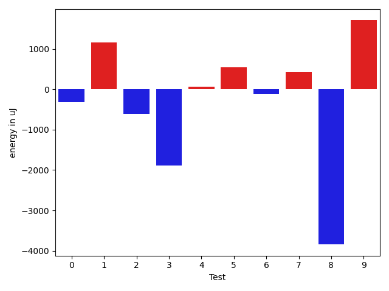
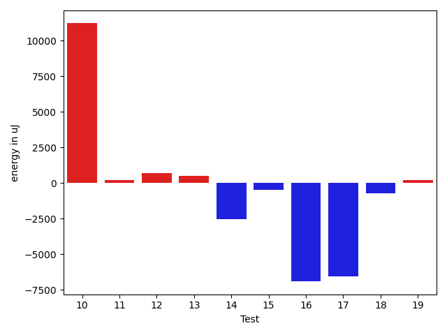
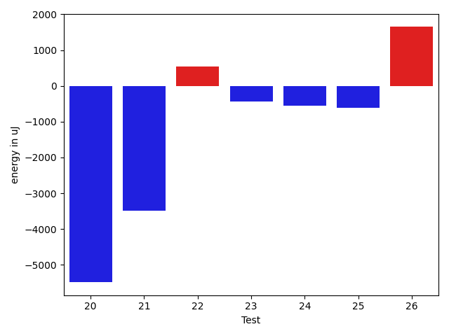

# gson 933a3e

https://github.com/google/gson/commit/933a3e

## Delta Energy per test method

| ID | EnergyV1 | EnergyV2 | DeltaEnergy | σV1 | σV2 |
| --- | --- | --- | --- | --- | --- |
| 0 | 34729 | 34424 | -305 | 6241.767938126616 | 3357.778816252669 |
| 1 | 71594 | 72754 | 1160 | 35023.68343223645 | 35591.404257014445 |
| 2 | 36255 | 35644 | -611 | 17541.479349809106 | 16399.031610757862 |
| 3 | 71228 | 69336 | -1892 | 84708.42468549812 | 29046.6218638811 |
| 4 | 35157 | 35217 | 60 | 12956.083207222922 | 12526.586943815682 |
| 5 | 34545 | 35095 | 550 | 3635.3357003765323 | 3588.104538398352 |
| 6 | 35583 | 35461 | -122 | 3283.1299350771196 | 3363.3498853925753 |
| 7 | 36865 | 37292 | 427 | 23542.174532889352 | 27738.855426271435 |
| 8 | 42968 | 39124 | -3844 | 21802.830870694863 | 20671.337152464275 |
| 9 | 38269 | 39978 | 1709 | 62772.8650418592 | 89890.18008154712 |
| 10 | 39123 | 39123 | 0 | 35127.38577844676 | 48355.06541402103 |
| 11 | 35645 | 35767 | 122 | 3650.1495589179817 | 3432.544832463882 |
| 12 | 36010 | 36804 | 794 | 3619.816639619031 | 2793.750279083425 |
| 13 | 35034 | 35461 | 427 | 3393.018804174251 | 3708.7331147863465 |
| 14 | 36377 | 33631 | -2746 | 3473.576641077672 | 2867.29994158569 |
| 15 | 35095 | 34973 | -122 | 3261.844833997224 | 2960.128696666151 |
| 16 | 80383 | 80566 | 183 | 57715.24291046392 | 52395.2848785123 |
| 17 | 39612 | 39856 | 244 | 40265.21954391026 | 26603.600888238398 |
| 18 | 37109 | 36499 | -610 | 3828.1479902368114 | 4245.903458843381 |
| 19 | 38146 | 37964 | -182 | 4028.5870582502316 | 3265.0922409697428 |
| 20 | 90332 | 84839 | -5493 | 123770.48652711378 | 141292.4445513366 |
| 21 | 38757 | 35278 | -3479 | 3853.067080586581 | 3724.023250930288 |
| 22 | 36682 | 37231 | 549 | 32140.485165565653 | 33593.54436388808 |
| 23 | 39673 | 39246 | -427 | 35925.10446647685 | 30154.614377274174 |
| 24 | 38513 | 37964 | -549 | 569897.4275251515 | 586897.7802858307 |
| 25 | 35888 | 35278 | -610 | 3581.999498955664 | 2799.248653545269 |
| 26 | 37048 | 38696 | 1648 | 4082.725220301973 | 41072.424126153994 |

## Delta Duration per test method

| ID | DurationV1 | DurationsV2 | DeltaDuration |
| --- | --- | --- | --- |
| 0 | 1195067.141025641 | 1138846.7160493827 | -56220.424976258306 |
| 1 | 2549737.090909091 | 2734460.525252525 | 184723.4343434344 |
| 2 | 1619968.836734694 | 1580198.5858585858 | -39770.250876108184 |
| 3 | 2804100.1919191917 | 2486492.8585858587 | -317607.333333333 |
| 4 | 1537848.1134020619 | 1479696.2323232323 | -58151.88107882952 |
| 5 | 826288.4736842106 | 749521.3023255814 | -76767.17135862913 |
| 6 | 924915.3392857143 | 902286.2909090909 | -22629.048376623425 |
| 7 | 1333887.2549019607 | 1610298.6666666667 | 276411.411764706 |
| 8 | 1849805.202020202 | 1830233.2121212122 | -19571.98989898991 |
| 9 | 1741446.0 | 2689762.714285714 | 948316.7142857141 |
| 10 | 1632819.4655172413 | 1986276.9027777778 | 353457.4372605365 |
| 11 | 1021406.3333333334 | 1036872.655737705 | 15466.322404371575 |
| 12 | 933866.9272727272 | 902661.1206896552 | -31205.80658307206 |
| 13 | 938157.3731343284 | 919674.5263157894 | -18482.846818538965 |
| 14 | 575425.7368421053 | 585539.3529411765 | 10113.616099071223 |
| 15 | 552851.2727272727 | 562110.0 | 9258.727272727294 |
| 16 | 3390920.212121212 | 3210998.727272727 | -179921.48484848486 |
| 17 | 2109167.9318181816 | 1842763.393258427 | -266404.5385597546 |
| 18 | 796541.6511627907 | 829126.0909090909 | 32584.439746300224 |
| 19 | 867899.3902439025 | 861511.4 | -6387.99024390243 |
| 20 | 4293803.747474748 | 4259422.656565657 | -34381.090909090824 |
| 21 | 663215.95 | 671615.25 | 8399.300000000047 |
| 22 | 1680828.5802469135 | 1723965.7530864198 | 43137.1728395063 |
| 23 | 1823049.2650602409 | 1645904.5512820513 | -177144.71377818962 |
| 24 | 6327608.917808219 | 6690905.479452055 | 363296.5616438361 |
| 25 | 813901.6756756756 | 804534.025 | -9367.650675675599 |
| 26 | 964150.0408163265 | 1378160.8363636364 | 414010.7955473099 |

## Misc.

| ID | Test Class | Test Method |
| --- | --- | --- |
| 0 | com.google.gson.functional.ParameterizedTypesTest | testParameterizedTypeGenericArraysSerialization |
| 1 | com.google.gson.functional.ParameterizedTypesTest | testVariableTypeFieldsAndGenericArraysSerialization |
| 2 | com.google.gson.functional.ParameterizedTypesTest | testParameterizedTypeGenericArraysDeserialization |
| 3 | com.google.gson.functional.ParameterizedTypesTest | testVariableTypeFieldsAndGenericArraysDeserialization |
| 4 | com.google.gson.functional.ParameterizedTypesTest | testParameterizedTypeWithVariableTypeDeserialization |
| 5 | com.google.gson.functional.CollectionTest | testRawCollectionSerialization |
| 6 | com.google.gson.functional.CollectionTest | testNullsInListSerialization |
| 7 | com.google.gson.functional.CollectionTest | testCollectionOfBagOfPrimitivesSerialization |
| 8 | com.google.gson.functional.CollectionTest | testWildcardCollectionField |
| 9 | com.google.gson.functional.CollectionTest | testSetSerialization |
| 10 | com.google.gson.functional.CollectionTest | testTopLevelCollectionOfIntegersSerialization |
| 11 | com.google.gson.functional.CollectionTest | testLinkedListSerialization |
| 12 | com.google.gson.functional.CollectionTest | testCollectionOfObjectSerialization |
| 13 | com.google.gson.functional.CollectionTest | testQueueSerialization |
| 14 | com.google.gson.functional.CollectionTest | testCollectionOfStringsSerialization |
| 15 | com.google.gson.functional.CollectionTest | testRawCollectionOfIntegersSerialization |
| 16 | com.google.gson.functional.InheritanceTest | testSubInterfacesOfCollectionSerialization |
| 17 | com.google.gson.functional.ObjectTest | testDirectedAcyclicGraphSerialization |
| 18 | com.google.gson.functional.ObjectTest | testCircularSerialization |
| 19 | com.google.gson.functional.PrettyPrintingTest | testPrettyPrintListOfPrimitiveArrays |
| 20 | com.google.gson.functional.PrettyPrintingTest | testPrettyPrintList |
| 21 | com.google.gson.functional.CustomTypeAdaptersTest | testCustomAdapterInvokedForCollectionElementSerialization |
| 22 | com.google.gson.functional.CustomTypeAdaptersTest | testCustomAdapterInvokedForCollectionElementSerializationWithType |
| 23 | com.google.gson.functional.ArrayTest | testArrayOfCollectionSerialization |
| 24 | com.google.gson.functional.PrintFormattingTest | testCompactFormattingLeavesNoWhiteSpace |
| 25 | com.google.gson.functional.DefaultTypeAdaptersTest | testSetSerialization |
| 26 | com.google.gson.functional.EnumTest | testCollectionOfEnumsSerialization |

| Test | IterationV1 | IterationV2 | DeltaIteration |
| --- | --- | --- | --- |
| 0 | 78 | 81 | 3 |
| 1 | 99 | 99 | 0 |
| 2 | 98 | 99 | 1 |
| 3 | 99 | 99 | 0 |
| 4 | 97 | 99 | 2 |
| 5 | 38 | 43 | 5 |
| 6 | 56 | 55 | -1 |
| 7 | 51 | 69 | 18 |
| 8 | 99 | 99 | 0 |
| 9 | 70 | 63 | -7 |
| 10 | 58 | 72 | 14 |
| 11 | 72 | 61 | -11 |
| 12 | 55 | 58 | 3 |
| 13 | 67 | 57 | -10 |
| 14 | 19 | 17 | -2 |
| 15 | 22 | 22 | 0 |
| 16 | 99 | 99 | 0 |
| 17 | 88 | 89 | 1 |
| 18 | 43 | 44 | 1 |
| 19 | 41 | 35 | -6 |
| 20 | 99 | 99 | 0 |
| 21 | 20 | 28 | 8 |
| 22 | 81 | 81 | 0 |
| 23 | 83 | 78 | -5 |
| 24 | 73 | 73 | 0 |
| 25 | 37 | 40 | 3 |
| 26 | 49 | 55 | 6 |

| Time Label | Time (s) |
| --- | --- |
| Selection | 24.416365146636963 |
| Injection | 10.848846912384033 |
| Total | 989.669659614563 |

