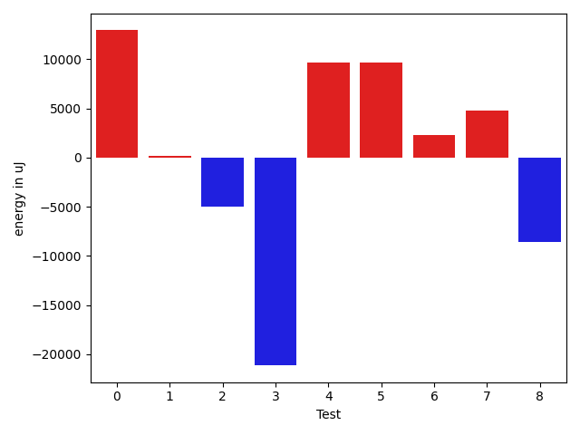

# gson e9a2a1

https://github.com/google/gson/commit/e9a2a1

## Delta Energy per test method

| ID | EnergyV1 | EnergyV2 | DeltaEnergy | σV1 | σV2 |
| --- | --- | --- | --- | --- | --- |
| 0 | 63110 | 38147 | -24963 | 18604.041891916873 | 157776.63339023673 |
| 1 | 35462 | 34546 | -916 | 11642.351644907849 | 11006.436304245835 |
| 2 | 39062 | 38025 | -1037 | 78627.13196929143 | 69219.92901481065 |
| 3 | 189514 | 162292 | -27222 | 83837.1985878796 | 67018.10721674716 |
| 4 | 34179 | 36194 | 2015 | 6649.421405185154 | 39912.44782673457 |
| 5 | 39673 | 176086 | 136413 | 94520.72689406981 | 87875.09278159121 |
| 6 | 35950 | 36987 | 1037 | 52688.963336908404 | 60676.349751391506 |
| 7 | 35644 | 36254 | 610 | 49386.138744650474 | 54765.14880361824 |
| 8 | 35705 | 34729 | -976 | 49603.00840852982 | 5846.5125187660515 |

## Delta Duration per test method

| ID | DurationV1 | DurationsV2 | DeltaDuration |
| --- | --- | --- | --- |
| 0 | 1995785.511627907 | 2420093.8780487804 | 424308.36642087344 |
| 1 | 1365446.0232558139 | 1320406.7605633803 | -45039.26269243355 |
| 2 | 2832484.387755102 | 2708967.4545454546 | -123516.93320964742 |
| 3 | 6514166.515151516 | 5979533.707070707 | -534632.8080808083 |
| 4 | 1114795.1014492754 | 1451226.393939394 | 336431.29249011865 |
| 5 | 3826315.407407407 | 4439749.020833333 | 613433.6134259258 |
| 6 | 1665067.0909090908 | 1686593.6923076923 | 21526.60139860143 |
| 7 | 1425699.5714285714 | 1559749.142857143 | 134049.5714285716 |
| 8 | 1254906.6829268292 | 1010844.0 | -244062.6829268292 |

## Misc.

| ID | Test Class | Test Method |
| --- | --- | --- |
| 0 | com.google.gson.functional.NullObjectAndFieldTest | testPrintPrintingObjectWithNulls |
| 1 | com.google.gson.functional.NullObjectAndFieldTest | testPrintPrintingArraysWithNulls |
| 2 | com.google.gson.functional.PrettyPrintingTest | testPrettyPrintArrayOfObjects |
| 3 | com.google.gson.functional.PrettyPrintingTest | testPrettyPrintList |
| 4 | com.google.gson.functional.PrettyPrintingTest | testPrettyPrintListOfPrimitiveArrays |
| 5 | com.google.gson.functional.PrettyPrintingTest | testPrettyPrintArrayOfPrimitives |
| 6 | com.google.gson.functional.PrettyPrintingTest | testMultipleArrays |
| 7 | com.google.gson.functional.PrettyPrintingTest | testMap |
| 8 | com.google.gson.functional.PrettyPrintingTest | testPrettyPrintArrayOfPrimitiveArrays |

| Test | IterationV1 | IterationV2 | DeltaIteration |
| --- | --- | --- | --- |
| 0 | 86 | 82 | -4 |
| 1 | 86 | 71 | -15 |
| 2 | 98 | 99 | 1 |
| 3 | 99 | 99 | 0 |
| 4 | 69 | 66 | -3 |
| 5 | 54 | 48 | -6 |
| 6 | 44 | 39 | -5 |
| 7 | 28 | 35 | 7 |
| 8 | 41 | 61 | 20 |

| Time Label | Time (s) |
| --- | --- |
| Selection | 23.558690547943115 |
| Injection | 8.78485631942749 |
| Total | 953.7689027786255 |

