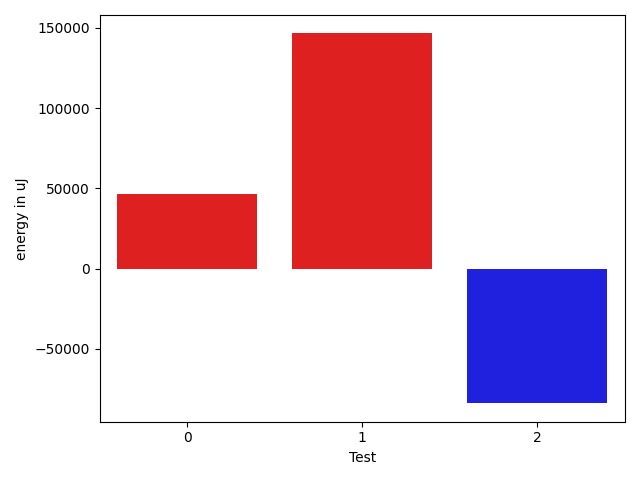

# gson fdcd39

https://github.com/google/gson/commit/fdcd39

## Delta Energy per test method

| ID | EnergyV1 | EnergyV2 | DeltaEnergy | σV1 | σV2 |
| --- | --- | --- | --- | --- | --- |
| 0 | 40161 | 86609 | 46448 | 45546.326054725134 | 58852.1232040213 |
| 1 | 39734 | 186218 | 146484 | 126953.73832449991 | 129342.56366410019 |
| 2 | 273131 | 189269 | -83862 | 112780.38483453168 | 116588.15240692328 |

## Delta Duration per test method

| ID | DurationV1 | DurationsV2 | DeltaDuration |
| --- | --- | --- | --- |
| 0 | 2354322.0833333335 | 2919920.1025641025 | 565598.019230769 |
| 1 | 4397288.784090909 | 5110252.19047619 | 712963.4063852811 |
| 2 | 7082841.92 | 5870203.038961039 | -1212638.881038961 |

## Misc.

| ID | Test Class | Test Method |
| --- | --- | --- |
| 0 | com.google.gson.JsonObjectTest | testAddingAndRemovingObjectProperties |
| 1 | com.google.gson.functional.JsonTreeTest | testToJsonTreeObjectType |
| 2 | com.google.gson.functional.JsonTreeTest | testToJsonTree |

| Test | IterationV1 | IterationV2 | DeltaIteration |
| --- | --- | --- | --- |
| 0 | 36 | 39 | 3 |
| 1 | 88 | 84 | -4 |
| 2 | 75 | 77 | 2 |

| Time Label | Time (s) |
| --- | --- |
| Selection | 23.803509950637817 |
| Injection | 8.469670057296753 |
| Total | 944.9973347187042 |

