# gson 18b301

https://github.com/google/gson/commit/18b301

## Delta Energy per test method

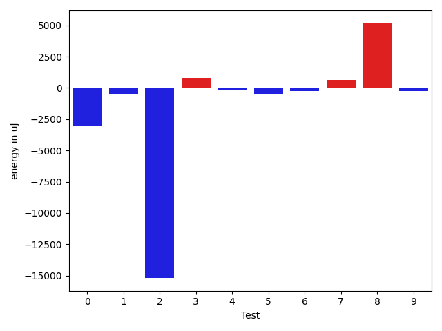

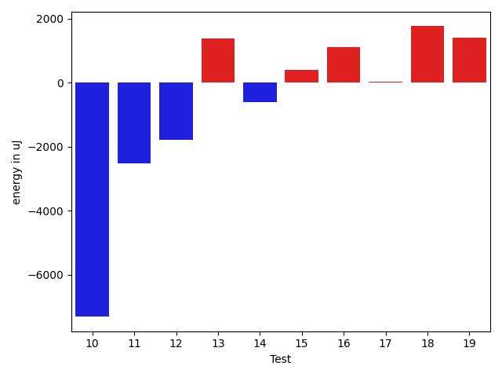

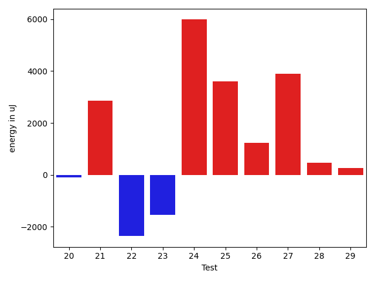

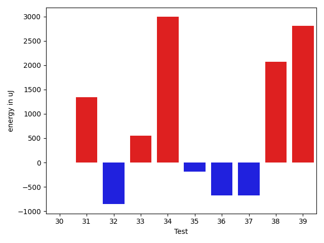

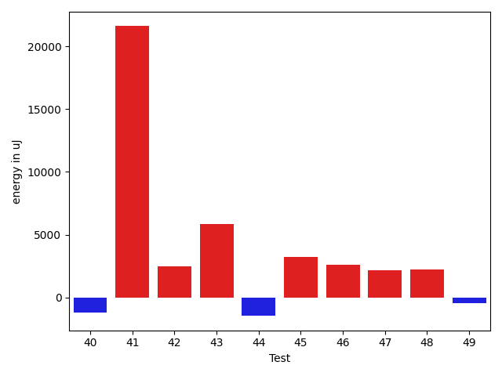

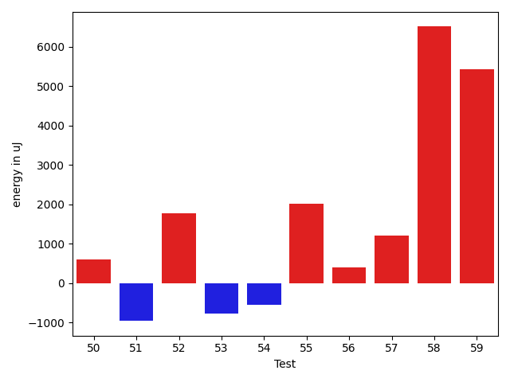

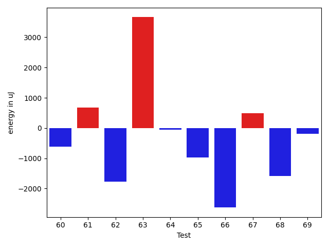

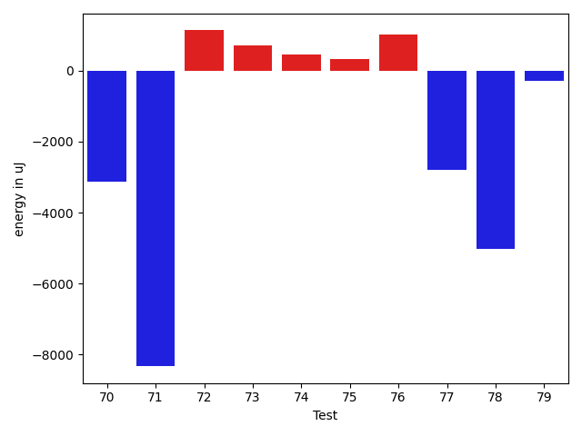

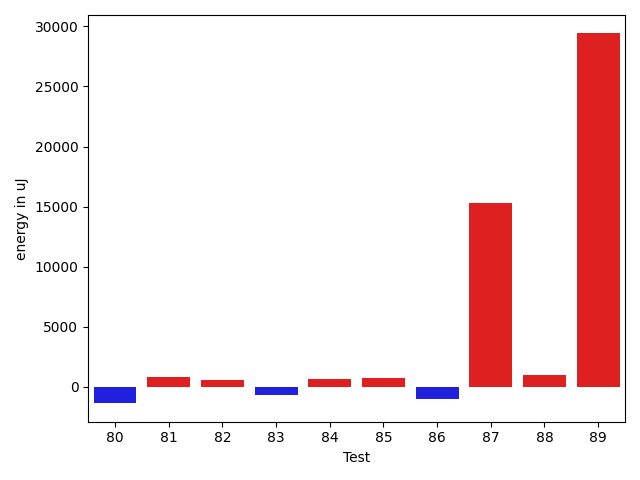

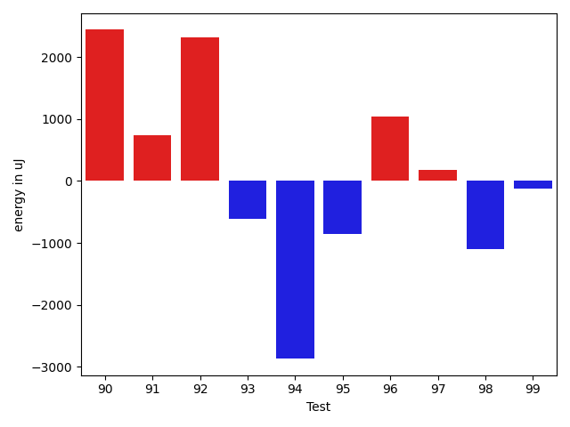

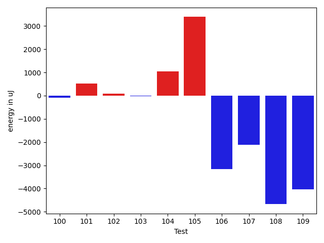

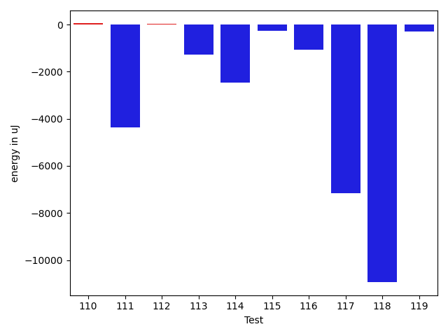

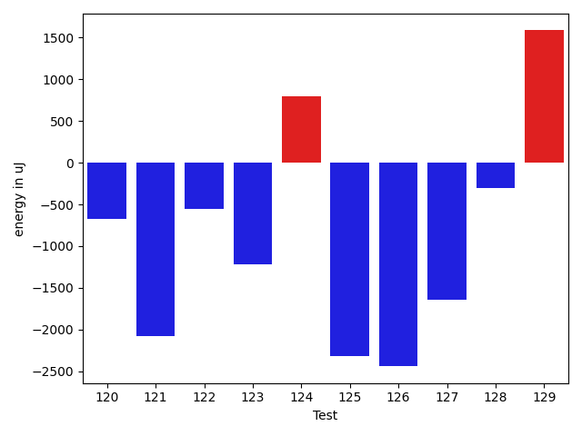

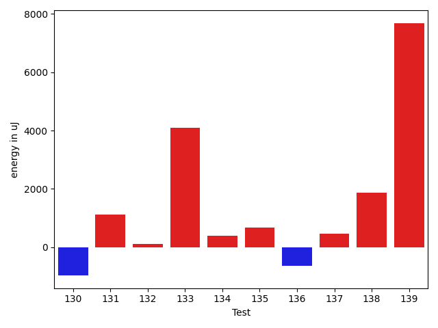

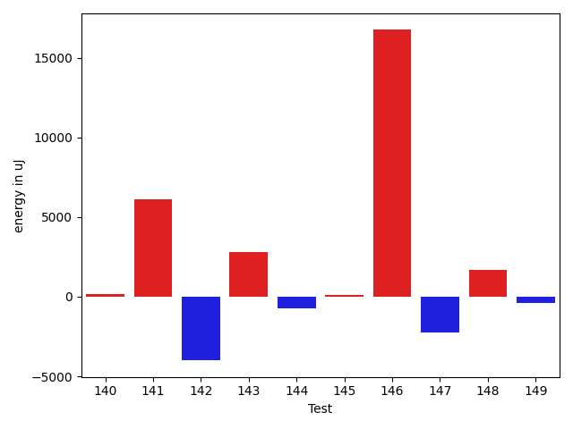

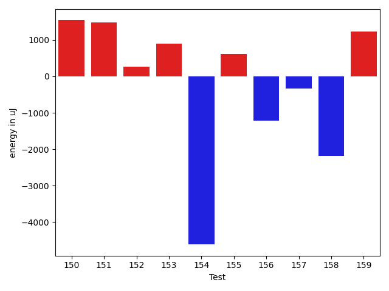

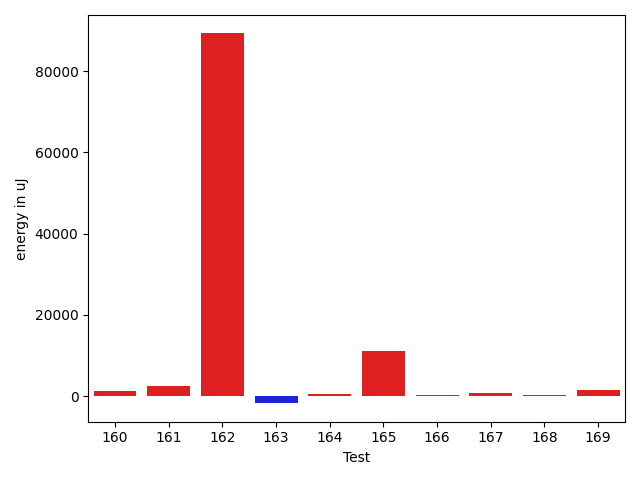

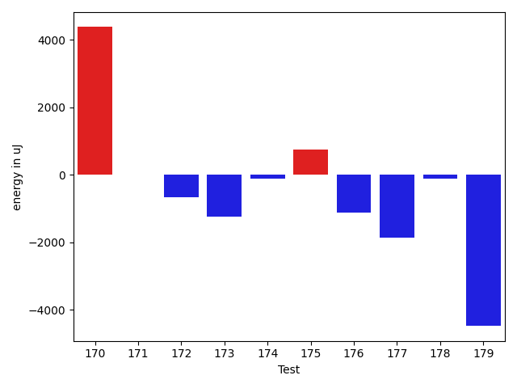

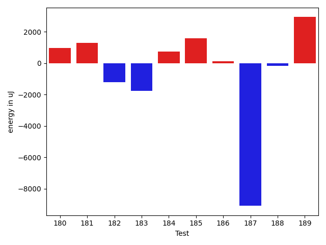

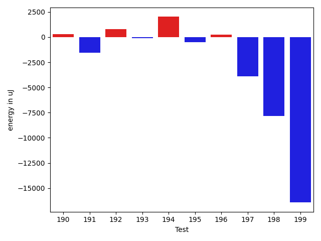

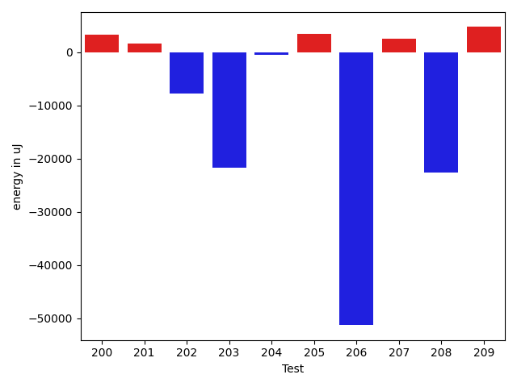

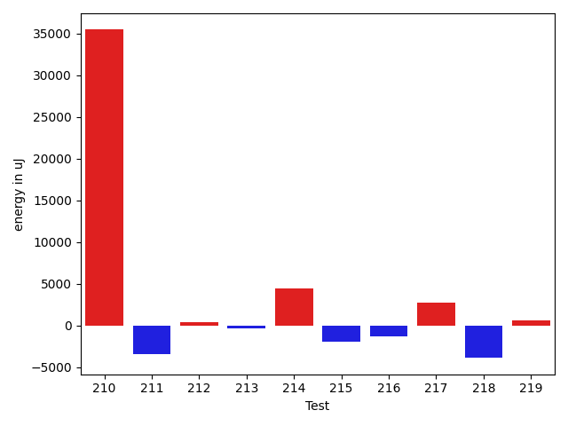

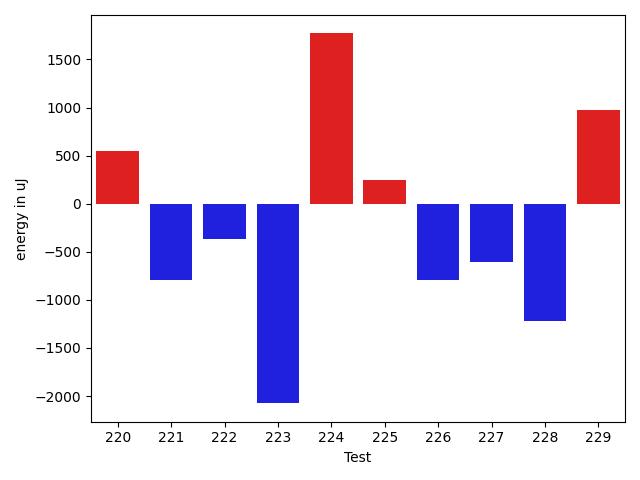

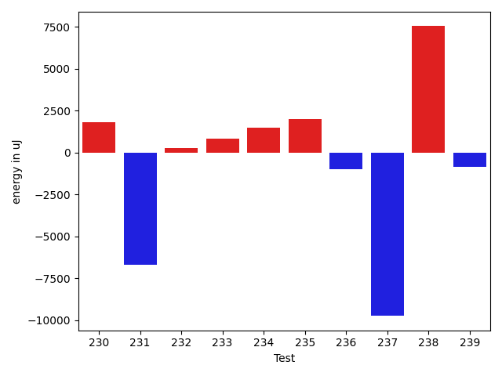

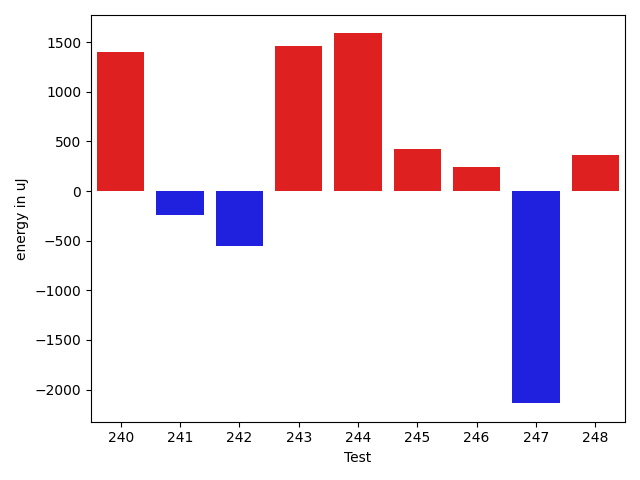

| ID | EnergyV1 | EnergyV2 | DeltaEnergy | σV1 | σV2 |
| --- | --- | --- | --- | --- | --- |
| 0 | 65978 | 65430 | -548 | 80699.13375845992 | 61997.881873575 |
| 1 | 36926 | 36560 | -366 | 9815.441524819373 | 6769.134481359585 |
| 2 | 35950 | 36743 | 793 | 75034.49948839324 | 39974.02625071321 |
| 3 | 35400 | 36988 | 1588 | 4580.201550518797 | 6418.0017213929195 |
| 4 | 36316 | 36498 | 182 | 3074.678805366967 | 3665.1027257090627 |
| 5 | 36011 | 35888 | -123 | 4133.183868026388 | 3762.342389735416 |
| 6 | 37415 | 38330 | 915 | 33451.52011345062 | 34317.45366018216 |
| 7 | 34790 | 35522 | 732 | 21751.904757148124 | 22581.63505092935 |
| 8 | 36132 | 36316 | 184 | 12743.937886672824 | 26869.714387432967 |
| 9 | 36071 | 35217 | -854 | 6952.087456638925 | 11823.959815321841 |
| 10 | 38696 | 38086 | -610 | 37900.857852943285 | 30353.379748660704 |
| 11 | 37659 | 36743 | -916 | 56348.87881186983 | 49022.44063300387 |
| 12 | 35767 | 34974 | -793 | 4770.248434306121 | 3712.2095643969237 |
| 13 | 35583 | 36499 | 916 | 3737.6580679190906 | 4379.962199410651 |
| 14 | 36927 | 35766 | -1161 | 5038.549147863113 | 3794.165457393565 |
| 15 | 35889 | 35095 | -794 | 3172.8686692169863 | 4763.506028230431 |
| 16 | 35461 | 37170 | 1709 | 3035.0445801183523 | 4005.4957630351214 |
| 17 | 35889 | 36560 | 671 | 3208.694499152091 | 3930.689302145363 |
| 18 | 34912 | 35889 | 977 | 3655.6093115370645 | 7757.502372539049 |
| 19 | 35583 | 36438 | 855 | 3689.304742289729 | 4051.3113966001456 |
| 20 | 35461 | 34424 | -1037 | 8803.717103350855 | 9810.68441367981 |
| 21 | 32715 | 34973 | 2258 | 3972.1955700448184 | 3384.6785215292616 |
| 22 | 34912 | 34119 | -793 | 14931.657615356675 | 2469.706761773411 |
| 23 | 35095 | 34668 | -427 | 6721.465361817828 | 2969.3260166801037 |
| 24 | 36194 | 36926 | 732 | 4162.499617241191 | 20533.71132951285 |
| 25 | 68481 | 70740 | 2259 | 32404.593150044457 | 37641.04366054312 |
| 26 | 34118 | 35096 | 978 | 3172.35635616179 | 4599.779817290273 |
| 27 | 34180 | 34424 | 244 | 3613.781663128022 | 19748.148654626013 |
| 28 | 34851 | 34179 | -672 | 3859.304503795697 | 4168.697939654216 |
| 29 | 34729 | 34668 | -61 | 3748.4546948287466 | 3376.6245385834386 |
| 30 | 35523 | 35523 | 0 | 4352.868087245573 | 3805.984129859919 |
| 31 | 33814 | 35157 | 1343 | 3307.040697633228 | 3219.240391455506 |
| 32 | 35706 | 34851 | -855 | 4492.647872883232 | 2743.3667152344137 |
| 33 | 33813 | 34363 | 550 | 7313.857901343289 | 28192.2308262166 |
| 34 | 37902 | 40893 | 2991 | 32018.054943422154 | 36926.67432347087 |
| 35 | 35645 | 35461 | -184 | 3601.773976752889 | 4260.0053813786435 |
| 36 | 35034 | 34363 | -671 | 61503.368054440725 | 3469.3728455198484 |
| 37 | 34729 | 34058 | -671 | 5000.356056689647 | 3841.768894161852 |
| 38 | 34485 | 36560 | 2075 | 2925.1088426751917 | 3787.2394468925745 |
| 39 | 33264 | 36071 | 2807 | 3338.7389131520526 | 3789.074756070253 |
| 40 | 35766 | 34241 | -1525 | 4339.788963175279 | 2859.806612249761 |
| 41 | 34606 | 37170 | 2564 | 103327.95644910313 | 96618.32923781387 |
| 42 | 33875 | 35400 | 1525 | 3566.182606508532 | 10596.618435666438 |
| 43 | 35523 | 37353 | 1830 | 11264.89268184443 | 16973.224052396516 |
| 44 | 35095 | 35461 | 366 | 57863.14925549384 | 30908.926430660602 |
| 45 | 34668 | 36499 | 1831 | 3372.8647263449834 | 8056.27713759329 |
| 46 | 33752 | 35279 | 1527 | 3921.9613291980086 | 8193.353406912225 |
| 47 | 35584 | 35462 | -122 | 3623.1232261645355 | 9014.950319512383 |
| 48 | 34424 | 35705 | 1281 | 4446.957700978558 | 8309.987125274156 |
| 49 | 35156 | 34912 | -244 | 3262.7972332224335 | 2934.8662980619747 |
| 50 | 34607 | 35462 | 855 | 4429.852350537947 | 3772.722385726544 |
| 51 | 35644 | 34668 | -976 | 4294.690899366861 | 3521.715643757281 |
| 52 | 34912 | 35156 | 244 | 3212.7262912084843 | 8779.745432104053 |
| 53 | 35766 | 34302 | -1464 | 6953.295983751102 | 4179.746018685625 |
| 54 | 35034 | 33874 | -1160 | 3704.7344132184708 | 3247.1097178875866 |
| 55 | 33325 | 34424 | 1099 | 4084.4081485610795 | 9260.255984712301 |
| 56 | 33203 | 35095 | 1892 | 3526.4335886097847 | 2919.741278965428 |
| 57 | 34789 | 35340 | 551 | 3594.029360697483 | 3879.051961890775 |
| 58 | 34851 | 35035 | 184 | 4016.0299633676373 | 26913.611467475384 |
| 59 | 32654 | 35217 | 2563 | 4857.151783131242 | 18080.391835511196 |
| 60 | 34973 | 34362 | -611 | 4113.870798081857 | 2713.0480625071286 |
| 61 | 35644 | 36316 | 672 | 4553.768656051766 | 25073.90468826337 |
| 62 | 39733 | 37964 | -1769 | 350815.9865469202 | 247718.79002384644 |
| 63 | 34607 | 38269 | 3662 | 4668.811748989243 | 223691.06945886815 |
| 64 | 36682 | 36621 | -61 | 192694.88462639815 | 3457.509773624761 |
| 65 | 68787 | 67810 | -977 | 23003.538757988215 | 23379.76875486837 |
| 66 | 39185 | 36560 | -2625 | 51269.269794296095 | 29961.329547818063 |
| 67 | 35950 | 36438 | 488 | 5761.941602151167 | 6058.596429399794 |
| 68 | 37109 | 35522 | -1587 | 4733.243918429165 | 4240.103842596056 |
| 69 | 36926 | 36743 | -183 | 12986.060613210111 | 14047.845201438897 |
| 70 | 36621 | 35339 | -1282 | 18463.28600592328 | 16264.684712124972 |
| 71 | 37964 | 36926 | -1038 | 51943.49896826031 | 35487.24325692809 |
| 72 | 34119 | 36621 | 2502 | 4760.451691248336 | 4381.867388739645 |
| 73 | 37536 | 37964 | 428 | 23651.23938433724 | 20296.77274029749 |
| 74 | 35705 | 36255 | 550 | 4278.911499114239 | 4814.22828706741 |
| 75 | 36255 | 35828 | -427 | 3785.550513683608 | 3961.7951956753436 |
| 76 | 34302 | 35034 | 732 | 3677.3436864674973 | 5633.026410281208 |
| 77 | 35400 | 35888 | 488 | 13862.073543932436 | 8961.792304108305 |
| 78 | 39306 | 38269 | -1037 | 63054.5228980946 | 54664.760126067544 |
| 79 | 35218 | 34851 | -367 | 4055.5744880768298 | 3984.98065645552 |
| 80 | 37171 | 37842 | 671 | 4588.368505863495 | 3816.2258332022234 |
| 81 | 33081 | 35644 | 2563 | 3892.192131624719 | 4500.854050166469 |
| 82 | 35034 | 35461 | 427 | 3882.1609857623107 | 4054.8241202095724 |
| 83 | 33020 | 34729 | 1709 | 5211.350615603821 | 2720.7532621684018 |
| 84 | 35400 | 36255 | 855 | 3732.514420049906 | 4368.01357463954 |
| 85 | 34179 | 33631 | -548 | 3136.6764756696525 | 4763.919265697426 |
| 86 | 36621 | 36804 | 183 | 13682.292816673706 | 10466.546883245286 |
| 87 | 37719 | 38697 | 978 | 33681.492086059974 | 57675.54374428172 |
| 88 | 36987 | 37475 | 488 | 4535.042331695714 | 8664.204460500086 |
| 89 | 37781 | 38391 | 610 | 45955.57344625561 | 91879.9220125618 |
| 90 | 147156 | 149596 | 2440 | 112300.41143201606 | 112873.4208924006 |
| 91 | 38757 | 39490 | 733 | 66742.5065231281 | 65409.36665956609 |
| 92 | 35339 | 37659 | 2320 | 4542.453491157617 | 3558.9414457512103 |
| 93 | 36072 | 35461 | -611 | 4401.282215770439 | 3569.8808428363473 |
| 94 | 39185 | 36316 | -2869 | 79103.79528709095 | 7405.605342833335 |
| 95 | 37719 | 36865 | -854 | 3742.812674253918 | 67557.29445942638 |
| 96 | 37048 | 38086 | 1038 | 4146.256311271691 | 4072.782732622201 |
| 97 | 36255 | 36437 | 182 | 4188.921233369636 | 3630.1400989655053 |
| 98 | 35828 | 34729 | -1099 | 3422.33570359472 | 3989.8910356512883 |
| 99 | 36621 | 36499 | -122 | 8919.942930838404 | 10175.150362957302 |
| 100 | 35156 | 35950 | 794 | 8925.359254127517 | 7061.374288219429 |
| 101 | 90820 | 93384 | 2564 | 78951.00385183282 | 78152.96436726165 |
| 102 | 36254 | 35034 | -1220 | 7310.446576790589 | 8807.079531367588 |
| 103 | 71044 | 71289 | 245 | 30233.985666864242 | 28232.219182211917 |
| 104 | 37231 | 37048 | -183 | 10869.06472102699 | 12144.806770899646 |
| 105 | 36376 | 37231 | 855 | 62517.23999505993 | 70967.76593745082 |
| 106 | 62317 | 58105 | -4212 | 23776.462841347853 | 20625.84140737209 |
| 107 | 37048 | 37719 | 671 | 20496.822094032534 | 14565.151966350171 |
| 108 | 70862 | 70923 | 61 | 45546.56611776891 | 43242.445248343836 |
| 109 | 37109 | 35644 | -1465 | 33024.861661075105 | 10232.579588483914 |
| 110 | 36071 | 35950 | -121 | 4206.00795237926 | 3845.6717546604823 |
| 111 | 36133 | 34790 | -1343 | 20505.535969492103 | 3173.7274738974406 |
| 112 | 35522 | 35950 | 428 | 4226.999523068266 | 3965.1974664379336 |
| 113 | 37536 | 35645 | -1891 | 4418.421745626171 | 4020.475275858189 |
| 114 | 38452 | 37964 | -488 | 17764.596708059544 | 15739.006192777488 |
| 115 | 37781 | 34546 | -3235 | 5708.977750497777 | 9561.898499237597 |
| 116 | 37293 | 38268 | 975 | 27636.163796043915 | 22317.49419796368 |
| 117 | 37842 | 35034 | -2808 | 28474.995600603692 | 3807.996374589777 |
| 118 | 35888 | 35035 | -853 | 57671.10799948615 | 5367.436746175459 |
| 119 | 36133 | 36133 | 0 | 4077.5990083587017 | 4209.583204263304 |
| 120 | 35156 | 34485 | -671 | 4159.476381794956 | 3626.663597766881 |
| 121 | 36560 | 34485 | -2075 | 4429.779192646116 | 5274.486927237567 |
| 122 | 38880 | 38330 | -550 | 58500.93961561673 | 58893.971394324864 |
| 123 | 35827 | 34607 | -1220 | 4663.468648202369 | 5252.101559026137 |
| 124 | 37536 | 38330 | 794 | 524607.4280204101 | 371082.441601263 |
| 125 | 75562 | 73242 | -2320 | 38502.82618672911 | 32527.528575021763 |
| 126 | 84717 | 82275 | -2442 | 391401.0918331213 | 248182.50413165812 |
| 127 | 35888 | 34240 | -1648 | 3906.2305409219284 | 4205.18088194632 |
| 128 | 34851 | 34546 | -305 | 3649.902683121004 | 3399.037878839185 |
| 129 | 34851 | 36438 | 1587 | 65164.47650829021 | 48171.742423512675 |
| 130 | 36010 | 33936 | -2074 | 4240.486419201054 | 3326.244668044656 |
| 131 | 34118 | 36377 | 2259 | 4540.055208590767 | 3624.924074130364 |
| 132 | 34546 | 36255 | 1709 | 4793.391929521307 | 3066.676976753839 |
| 133 | 39063 | 42297 | 3234 | 31913.754044420348 | 42993.61542943182 |
| 134 | 34667 | 35339 | 672 | 3430.96661553235 | 3831.283319111467 |
| 135 | 35950 | 35584 | -366 | 4295.7132652913415 | 3907.2950042196712 |
| 136 | 36377 | 36254 | -123 | 4784.241802696292 | 3653.4199453460255 |
| 137 | 35218 | 36254 | 1036 | 3922.869794599107 | 3292.108206527083 |
| 138 | 33020 | 35278 | 2258 | 4930.795915405038 | 4611.5403036640955 |
| 139 | 37231 | 37719 | 488 | 3353.869547254335 | 34118.484902285745 |
| 140 | 36010 | 36255 | 245 | 3659.5641868680464 | 3814.7244949304304 |
| 141 | 64575 | 63049 | -1526 | 27483.312267047506 | 28816.904244022877 |
| 142 | 38269 | 34179 | -4090 | 4146.4281993662935 | 3673.887034719161 |
| 143 | 33508 | 36072 | 2564 | 3207.492291495024 | 3138.486823813762 |
| 144 | 36805 | 36805 | 0 | 3310.7314439376614 | 4664.40380479292 |
| 145 | 35400 | 36804 | 1404 | 2690.7050162318055 | 3979.605529803112 |
| 146 | 34668 | 37658 | 2990 | 2891.9686640992895 | 43948.4869024104 |
| 147 | 35706 | 36682 | 976 | 20132.449573743757 | 3500.106133833214 |
| 148 | 36316 | 37170 | 854 | 3375.209343044517 | 3755.6262930842554 |
| 149 | 35766 | 35095 | -671 | 4359.043442588638 | 4713.206141714738 |
| 150 | 32532 | 38086 | 5554 | 5300.156464031026 | 2734.0043078889903 |
| 151 | 36865 | 38635 | 1770 | 3125.8499537754533 | 4391.147093116834 |
| 152 | 36133 | 36072 | -61 | 2829.000546718458 | 4198.956125038699 |
| 153 | 35950 | 36133 | 183 | 3976.11508379042 | 4689.73362075009 |
| 154 | 37903 | 36255 | -1648 | 18239.547300938226 | 9767.59269504654 |
| 155 | 34546 | 34973 | 427 | 4568.001089719514 | 4529.548916834876 |
| 156 | 37353 | 35705 | -1648 | 3717.000505269382 | 3636.016459516864 |
| 157 | 36194 | 38513 | 2319 | 3483.751049149319 | 4552.955182076801 |
| 158 | 37049 | 35644 | -1405 | 4538.177710353343 | 3415.5558510477176 |
| 159 | 35034 | 36437 | 1403 | 3851.443373882345 | 4813.722950066819 |
| 160 | 35339 | 35706 | 367 | 2288.455015807608 | 4774.676598187982 |
| 161 | 33570 | 36804 | 3234 | 4410.459017358811 | 4018.5960744670797 |
| 162 | 36560 | 36499 | -61 | 217477.06747478968 | 465685.4283488506 |
| 163 | 36010 | 34118 | -1892 | 3442.6551575816693 | 2458.13192485676 |
| 164 | 35645 | 35584 | -61 | 4138.487670606521 | 4262.256762406524 |
| 165 | 37109 | 38757 | 1648 | 13118.858711858335 | 43961.57369401391 |
| 166 | 36194 | 36072 | -122 | 4509.923124860578 | 4718.873270637381 |
| 167 | 33935 | 34546 | 611 | 3901.2194427616764 | 6496.529907200594 |
| 168 | 34180 | 33874 | -306 | 3660.484031657666 | 3980.1220467049334 |
| 169 | 35645 | 37475 | 1830 | 7709.80715484398 | 7642.785710212527 |
| 170 | 34668 | 34362 | -306 | 3963.4230950796996 | 29428.399682074032 |
| 171 | 144592 | 146362 | 1770 | 33646.04981731668 | 27290.10524574884 |
| 172 | 38330 | 36499 | -1831 | 10169.189516641827 | 10424.310427083632 |
| 173 | 33814 | 32775 | -1039 | 4317.947390370708 | 3589.270786294028 |
| 174 | 34912 | 35523 | 611 | 4336.776577708487 | 2978.184903530322 |
| 175 | 34729 | 36682 | 1953 | 4115.524927928144 | 4239.806203998119 |
| 176 | 36560 | 35583 | -977 | 3725.899524317064 | 3515.0647308722805 |
| 177 | 36194 | 34546 | -1648 | 4757.062548061335 | 4100.5368850386085 |
| 178 | 35217 | 35339 | 122 | 4115.384907694014 | 4879.198236316245 |
| 179 | 36987 | 36255 | -732 | 21395.05840134384 | 4160.576632067171 |
| 180 | 33386 | 34362 | 976 | 3471.2047510108728 | 3196.705757882533 |
| 181 | 35218 | 36499 | 1281 | 3758.418590129599 | 8568.270758592384 |
| 182 | 36682 | 35461 | -1221 | 4571.075815072734 | 2962.237605786561 |
| 183 | 36316 | 34546 | -1770 | 3759.513621024223 | 3122.244455348985 |
| 184 | 34180 | 34912 | 732 | 3338.341071716776 | 4199.584951567488 |
| 185 | 34973 | 36560 | 1587 | 4863.312157253417 | 3719.6682008258067 |
| 186 | 36560 | 36682 | 122 | 4974.9820797544135 | 3867.6685556948614 |
| 187 | 171691 | 162597 | -9094 | 276370.6350520165 | 260948.00068224006 |
| 188 | 35767 | 35584 | -183 | 10314.492241057142 | 3954.7656115582663 |
| 189 | 34728 | 37659 | 2931 | 33665.21129990548 | 22835.74979121566 |
| 190 | 36010 | 36316 | 306 | 3376.593635689452 | 3628.2943782225448 |
| 191 | 36865 | 35339 | -1526 | 4086.9254263309836 | 3166.1005843150347 |
| 192 | 37537 | 38330 | 793 | 42564.81397093352 | 47717.37709996964 |
| 193 | 36133 | 36010 | -123 | 3804.257712665508 | 4152.4722701822875 |
| 194 | 35339 | 37354 | 2015 | 3858.969532837996 | 3104.683659983965 |
| 195 | 36377 | 35889 | -488 | 4279.731727293195 | 4086.896512673905 |
| 196 | 37171 | 37415 | 244 | 442360.75946395786 | 393126.2331476705 |
| 197 | 41076 | 37170 | -3906 | 57304.78902820931 | 62760.645051242296 |
| 198 | 227844 | 220031 | -7813 | 79909.09905544341 | 86329.94760753184 |
| 199 | 378906 | 362486 | -16420 | 101818.36791335608 | 102130.8160228414 |
| 200 | 41747 | 40161 | -1586 | 53342.43914557307 | 66810.07097516175 |
| 201 | 37659 | 36315 | -1344 | 11607.92303204562 | 16039.19536039335 |
| 202 | 39246 | 37842 | -1404 | 46201.77728110794 | 42108.464167869286 |
| 203 | 38513 | 36926 | -1587 | 152635.04503132944 | 114589.22280985733 |
| 204 | 35889 | 37720 | 1831 | 13530.079995205744 | 4168.989561522268 |
| 205 | 36804 | 38513 | 1709 | 4481.329402072173 | 18513.317066251406 |
| 206 | 38330 | 40710 | 2380 | 316618.5983136115 | 55922.74127162698 |
| 207 | 37231 | 39001 | 1770 | 4616.18476376787 | 3203.2422007926243 |
| 208 | 37659 | 35767 | -1892 | 304320.90247101017 | 277011.2877710625 |
| 209 | 39429 | 37171 | -2258 | 34750.692873934015 | 40182.585251009754 |
| 210 | 38513 | 41199 | 2686 | 55130.103029948834 | 82109.80799594111 |
| 211 | 36621 | 34667 | -1954 | 11594.802834132053 | 3872.4801734647463 |
| 212 | 34362 | 35156 | 794 | 3699.096159594108 | 4296.099200419347 |
| 213 | 37048 | 36011 | -1037 | 3869.609600023912 | 4282.88439898245 |
| 214 | 40344 | 60241 | 19897 | 30332.208471781665 | 27747.84806757714 |
| 215 | 38940 | 37171 | -1769 | 4524.016231427803 | 4039.673552177609 |
| 216 | 37659 | 37170 | -489 | 4767.173937897239 | 4027.1603370321986 |
| 217 | 36071 | 37048 | 977 | 10949.674750136957 | 14076.589588644481 |
| 218 | 65308 | 46692 | -18616 | 88855.98515069712 | 72112.5933362182 |
| 219 | 37597 | 38025 | 428 | 4099.340975739167 | 4485.073029859805 |
| 220 | 36499 | 37048 | 549 | 3342.3487789277765 | 5967.462797794014 |
| 221 | 38086 | 37292 | -794 | 4527.536560029085 | 4582.827175135428 |
| 222 | 36255 | 35889 | -366 | 4036.5552687743325 | 3776.1948831923055 |
| 223 | 40344 | 38269 | -2075 | 42214.49414779472 | 52648.84260745265 |
| 224 | 34485 | 36255 | 1770 | 42635.5729687468 | 32754.147136165826 |
| 225 | 38758 | 39001 | 243 | 34193.73142894005 | 9569.827489636682 |
| 226 | 36682 | 35888 | -794 | 4747.337836157466 | 3034.3209141420753 |
| 227 | 34912 | 34302 | -610 | 3160.15324191671 | 4550.155681829896 |
| 228 | 37353 | 36132 | -1221 | 72558.11448491387 | 4173.219066855009 |
| 229 | 35767 | 36743 | 976 | 4063.1636833591374 | 4416.460334517184 |
| 230 | 36804 | 36987 | 183 | 3260.1223976255865 | 3939.1590052496044 |
| 231 | 40100 | 33996 | -6104 | 30987.810824664837 | 44100.61938521953 |
| 232 | 34729 | 34240 | -489 | 2857.2722374763757 | 4757.3691701913995 |
| 233 | 40283 | 37476 | -2807 | 33779.71588620136 | 35436.29762836781 |
| 234 | 37598 | 36254 | -1344 | 4347.273527166194 | 17599.98595742186 |
| 235 | 37048 | 35705 | -1343 | 4191.410924688726 | 21109.802632320072 |
| 236 | 36376 | 35889 | -487 | 3973.582209211366 | 3945.554721416062 |
| 237 | 37720 | 38208 | 488 | 44583.8948567429 | 29750.581737444885 |
| 238 | 38085 | 38207 | 122 | 37054.229259604544 | 57563.684844502095 |
| 239 | 38024 | 37048 | -976 | 3606.1122049064143 | 4534.579169028835 |
| 240 | 38086 | 39489 | 1403 | 229568.84785282248 | 521537.25826478103 |
| 241 | 38025 | 37780 | -245 | 93857.0011575463 | 121076.24491260348 |
| 242 | 36743 | 36193 | -550 | 3925.850860013565 | 4069.8661367536097 |
| 243 | 37109 | 38574 | 1465 | 17567.902423102933 | 5892.858459289895 |
| 244 | 38819 | 40406 | 1587 | 115330.52370303919 | 79381.95899309465 |
| 245 | 37048 | 37475 | 427 | 3253.833913845156 | 3603.5013760357915 |
| 246 | 38513 | 38758 | 245 | 14514.544682297133 | 18352.032737898633 |
| 247 | 39246 | 37109 | -2137 | 57697.1115650249 | 85578.23430636762 |
| 248 | 37475 | 37842 | 367 | 26157.38829776398 | 34520.722103216496 |

## Delta Duration per test method

| ID | DurationV1 | DurationsV2 | DeltaDuration |
| --- | --- | --- | --- |
| 0 | 2309715.734177215 | 2309137.5352112674 | -578.1989659476094 |
| 1 | 905510.84375 | 808468.552631579 | -97042.29111842101 |
| 2 | 1543452.394736842 | 1142001.625 | -401450.769736842 |
| 3 | 825850.2325581395 | 779577.3555555556 | -46272.87700258393 |
| 4 | 552732.0 | 506904.7 | -45827.29999999999 |
| 5 | 700492.7111111111 | 885313.86 | 184821.14888888889 |
| 6 | 1412924.4923076923 | 1429689.109375 | 16764.6170673077 |
| 7 | 743488.6944444445 | 797244.8064516129 | 53756.112007168354 |
| 8 | 788763.8125 | 969899.7777777778 | 181135.96527777775 |
| 9 | 1008301.1034482758 | 929398.3768115942 | -78902.72663668159 |
| 10 | 1768901.1630434783 | 1637616.0 | -131285.16304347827 |
| 11 | 1286759.5846153847 | 1212393.9 | -74365.68461538479 |
| 12 | 572366.8125 | 618252.95 | 45886.13749999995 |
| 13 | 754653.3018867924 | 754129.4042553192 | -523.8976314732572 |
| 14 | 702961.5277777778 | 770045.5681818182 | 67084.04040404048 |
| 15 | 703832.0222222222 | 664034.2666666667 | -39797.75555555546 |
| 16 | 386965.5909090909 | 435004.53846153844 | 48038.94755244756 |
| 17 | 377385.6666666667 | 415427.1 | 38041.43333333329 |
| 18 | 880800.245614035 | 936040.1428571428 | 55239.897243107785 |
| 19 | 493650.4074074074 | 544084.5666666667 | 50434.159259259235 |
| 20 | 955981.8431372549 | 1014999.1052631579 | 59017.262125902926 |
| 21 | 535874.5357142857 | 535979.1851851852 | 104.64947089948691 |
| 22 | 714404.7906976744 | 692342.625 | -22062.165697674383 |
| 23 | 966778.027027027 | 873426.1 | -93351.927027027 |
| 24 | 722969.6818181818 | 1027944.2558139535 | 304974.5739957717 |
| 25 | 2271838.0714285714 | 2477193.1818181816 | 205355.1103896103 |
| 26 | 821450.7962962963 | 867927.9803921569 | 46477.184095860575 |
| 27 | 800852.9272727272 | 937193.4 | 136340.47272727278 |
| 28 | 978581.1076923077 | 883220.7971014492 | -95360.31059085845 |
| 29 | 615819.0 | 686524.0 | 70705.0 |
| 30 | 615981.46875 | 647378.8846153846 | 31397.415865384624 |
| 31 | 725185.3333333334 | 740403.9827586206 | 15218.649425287265 |
| 32 | 452723.7916666667 | 554204.0 | 101480.20833333331 |
| 33 | 613613.625 | 811196.4545454546 | 197582.8295454546 |
| 34 | 1718651.3 | 1846540.2608695652 | 127888.96086956514 |
| 35 | 625182.7272727273 | 641637.775 | 16455.04772727273 |
| 36 | 1065882.4 | 597619.6060606061 | -468262.7939393938 |
| 37 | 567294.6666666666 | 647595.052631579 | 80300.38596491236 |
| 38 | 454285.85714285716 | 419393.0 | -34892.85714285716 |
| 39 | 635659.0 | 662488.0217391305 | 26829.02173913049 |
| 40 | 529275.3214285715 | 500311.1153846154 | -28964.206043956103 |
| 41 | 1167424.7428571428 | 2103277.9583333335 | 935853.2154761907 |
| 42 | 689525.8421052631 | 695106.4137931034 | 5580.5716878402745 |
| 43 | 1244940.5569620254 | 1347183.630952381 | 102243.07399035571 |
| 44 | 1370234.7260273972 | 1259724.3974358975 | -110510.32859149971 |
| 45 | 792223.9555555555 | 625981.5833333334 | -166242.37222222215 |
| 46 | 948430.90625 | 1010229.6610169491 | 61798.7547669491 |
| 47 | 1035582.1403508772 | 1034704.6438356164 | -877.4965152607765 |
| 48 | 540843.9310344828 | 653351.1 | 112507.1689655172 |
| 49 | 403118.8181818182 | 378598.0625 | -24520.755681818177 |
| 50 | 609722.6060606061 | 654789.448275862 | 45066.84221525595 |
| 51 | 574025.282051282 | 615274.5263157894 | 41249.24426450743 |
| 52 | 465673.6111111111 | 765650.5652173914 | 299976.95410628023 |
| 53 | 676470.0 | 762520.1304347826 | 86050.1304347826 |
| 54 | 588765.2692307692 | 545372.96 | -43392.309230769286 |
| 55 | 734665.2702702703 | 813288.7 | 78623.42972972966 |
| 56 | 476580.61904761905 | 374390.76923076925 | -102189.8498168498 |
| 57 | 478523.4 | 722711.5757575758 | 244188.17575757578 |
| 58 | 507472.0 | 787891.8888888889 | 280419.8888888889 |
| 59 | 565232.125 | 692069.6666666666 | 126837.54166666663 |
| 60 | 413507.28571428574 | 512241.6842105263 | 98734.39849624055 |
| 61 | 766890.0222222222 | 845564.3636363636 | 78674.34141414147 |
| 62 | 4222830.093333334 | 2555363.375 | -1667466.7183333337 |
| 63 | 535493.3 | 2341966.217391304 | 1806472.9173913042 |
| 64 | 1731369.5757575757 | 725208.5 | -1006161.0757575757 |
| 65 | 2138442.0404040404 | 2051721.2626262626 | -86720.77777777775 |
| 66 | 1840641.3378378379 | 1258220.7777777778 | -582420.5600600601 |
| 67 | 960109.1323529412 | 941419.03125 | -18690.101102941204 |
| 68 | 757650.0930232558 | 678656.3023255814 | -78993.79069767438 |
| 69 | 1294594.7471264368 | 1258672.1590909092 | -35922.58803552762 |
| 70 | 1081967.2786885246 | 989126.2372881356 | -92841.04140038905 |
| 71 | 1396056.366197183 | 1115956.7166666666 | -280099.6495305165 |
| 72 | 449702.8947368421 | 405564.125 | -44138.76973684208 |
| 73 | 1488466.6617647058 | 1327386.3157894737 | -161080.34597523208 |
| 74 | 742073.6818181818 | 663068.1224489796 | -79005.55936920212 |
| 75 | 776956.7435897436 | 745300.2127659575 | -31656.53082378616 |
| 76 | 886904.6615384616 | 824202.0677966102 | -62702.59374185139 |
| 77 | 1331145.4479166667 | 1270204.0833333333 | -60941.36458333349 |
| 78 | 1910977.5454545454 | 1597702.5789473683 | -313274.9665071771 |
| 79 | 775217.0930232558 | 750790.3773584906 | -24426.715664765215 |
| 80 | 413325.32 | 367349.2 | -45976.119999999995 |
| 81 | 534508.8378378379 | 565848.2424242424 | 31339.404586404562 |
| 82 | 716879.375 | 697293.6041666666 | -19585.770833333372 |
| 83 | 444503.64705882355 | 443097.28 | -1406.3670588235254 |
| 84 | 707134.2340425532 | 726003.7647058824 | 18869.530663329177 |
| 85 | 403421.2631578947 | 435922.5789473684 | 32501.31578947371 |
| 86 | 1114876.7662337662 | 1132191.4153846153 | 17314.649150849087 |
| 87 | 902426.5116279069 | 1405932.8717948718 | 503506.3601669648 |
| 88 | 1028004.2465753425 | 1029025.09375 | 1020.8471746575087 |
| 89 | 1152531.4516129033 | 2025350.4285714286 | 872818.9769585254 |
| 90 | 5499551.448979592 | 5271697.135416667 | -227854.31356292497 |
| 91 | 1892338.107142857 | 1765268.125 | -127069.98214285704 |
| 92 | 720696.1702127659 | 701310.0714285715 | -19386.098784194444 |
| 93 | 782427.0571428571 | 549363.0322580645 | -233064.02488479263 |
| 94 | 1474825.8039215687 | 980309.2272727273 | -494516.5766488414 |
| 95 | 547120.1739130435 | 1095888.2962962964 | 548768.122383253 |
| 96 | 501339.6818181818 | 686666.9565217391 | 185327.2747035573 |
| 97 | 686461.2 | 647625.8611111111 | -38835.33888888883 |
| 98 | 931246.9454545454 | 794052.9347826086 | -137194.0106719368 |
| 99 | 1229769.8152173914 | 1213137.8260869565 | -16631.989130434813 |
| 100 | 1175151.7802197803 | 1149615.7386363635 | -25536.04158341675 |
| 101 | 3341070.98989899 | 3258015.090909091 | -83055.89898989908 |
| 102 | 1197647.965116279 | 1171156.894117647 | -26491.070998631883 |
| 103 | 2410652.626262626 | 2353765.797979798 | -56886.82828282798 |
| 104 | 1311839.4948453608 | 1304384.1063829786 | -7455.388462382136 |
| 105 | 1694356.0232558139 | 1678550.0823529412 | -15805.94090287271 |
| 106 | 1882445.9797979798 | 1812690.7575757576 | -69755.22222222225 |
| 107 | 1425660.4216867469 | 1298126.843373494 | -127533.57831325289 |
| 108 | 2722176.6363636362 | 2498396.373737374 | -223780.26262626238 |
| 109 | 1265822.935483871 | 1198524.5604395603 | -67298.3750443107 |
| 110 | 935334.4246575342 | 905181.8823529412 | -30152.542304593022 |
| 111 | 1130986.8767123288 | 1024500.8285714285 | -106486.04814090021 |
| 112 | 839054.4918032787 | 808376.126984127 | -30678.3648191517 |
| 113 | 493915.2083333333 | 480259.5 | -13655.708333333314 |
| 114 | 981708.14 | 1091578.7368421052 | 109870.59684210515 |
| 115 | 836227.052631579 | 645592.3333333334 | -190634.71929824562 |
| 116 | 1388432.782051282 | 1351034.8157894737 | -37397.966261808295 |
| 117 | 782728.04 | 497458.0833333333 | -285269.9566666667 |
| 118 | 1027270.088888889 | 841984.5897435897 | -185285.4991452992 |
| 119 | 720228.8260869565 | 645323.7045454546 | -74905.12154150195 |
| 120 | 580442.3076923077 | 488376.5517241379 | -92065.75596816983 |
| 121 | 516526.0344827586 | 510517.56 | -6008.474482758611 |
| 122 | 1465080.705882353 | 1666318.9666666666 | 201238.26078431355 |
| 123 | 761653.8571428572 | 706690.0769230769 | -54963.78021978028 |
| 124 | 4855685.065789473 | 3416556.9135802467 | -1439128.1522092265 |
| 125 | 2725945.3333333335 | 2591894.9595959596 | -134050.37373737385 |
| 126 | 6166098.636363637 | 4778861.141414141 | -1387237.4949494954 |
| 127 | 761311.2156862745 | 794903.2553191489 | 33592.039632874425 |
| 128 | 606052.5483870967 | 595417.0344827586 | -10635.51390433812 |
| 129 | 1512573.2444444445 | 1115046.5681818181 | -397526.6762626264 |
| 130 | 408997.10714285716 | 412051.8823529412 | 3054.7752100840444 |
| 131 | 528531.8571428572 | 541571.3703703703 | 13039.513227513176 |
| 132 | 430820.85 | 381217.45454545453 | -49603.39545454545 |
| 133 | 1478313.4210526317 | 1409217.0 | -69096.42105263169 |
| 134 | 446799.6842105263 | 435306.92307692306 | -11492.761133603228 |
| 135 | 588763.96 | 551726.6818181818 | -37037.2781818182 |
| 136 | 407740.6666666667 | 398482.85714285716 | -9257.809523809527 |
| 137 | 779939.1025641026 | 749753.5348837209 | -30185.567680381704 |
| 138 | 383987.375 | 407226.64705882355 | 23239.272058823553 |
| 139 | 529764.75 | 691892.55 | 162127.80000000005 |
| 140 | 490753.8695652174 | 521208.875 | 30455.005434782594 |
| 141 | 1609241.1515151516 | 1767658.8214285714 | 158417.66991341976 |
| 142 | 390938.4375 | 407882.4285714286 | 16943.99107142858 |
| 143 | 408321.3 | 383042.76470588235 | -25278.53529411764 |
| 144 | 294870.14285714284 | 357216.0833333333 | 62345.94047619047 |
| 145 | 425368.3125 | 383431.0 | -41937.3125 |
| 146 | 583788.2272727273 | 1038784.4761904762 | 454996.2489177489 |
| 147 | 550076.8421052631 | 342995.64705882355 | -207081.1950464396 |
| 148 | 539308.1875 | 507836.6818181818 | -31471.505681818177 |
| 149 | 458462.6875 | 401156.7727272727 | -57305.914772727294 |
| 150 | 386343.6666666667 | 393948.1666666667 | 7604.5 |
| 151 | 354948.63157894736 | 377862.8181818182 | 22914.186602870817 |
| 152 | 605138.5666666667 | 551451.25 | -53687.31666666665 |
| 153 | 659262.0465116279 | 644211.90625 | -15050.14026162785 |
| 154 | 996742.1379310344 | 928748.9714285714 | -67993.16650246305 |
| 155 | 385538.5263157895 | 633772.1 | 248233.57368421048 |
| 156 | 396439.0 | 382356.71428571426 | -14082.28571428574 |
| 157 | 379480.85714285716 | 416905.55 | 37424.69285714283 |
| 158 | 339947.6842105263 | 402144.0588235294 | 62196.37461300311 |
| 159 | 414493.4666666667 | 407155.73333333334 | -7337.733333333337 |
| 160 | 436721.125 | 372913.3333333333 | -63807.791666666686 |
| 161 | 381075.1818181818 | 403018.0 | 21942.818181818177 |
| 162 | 1763063.5802469135 | 4336783.0 | 2573719.4197530868 |
| 163 | 419880.92307692306 | 524263.7 | 104382.77692307695 |
| 164 | 570310.8965517242 | 533021.9310344828 | -37288.96551724139 |
| 165 | 867600.6739130435 | 1209664.6727272726 | 342063.99881422915 |
| 166 | 570143.4827586206 | 589305.4375 | 19161.954741379363 |
| 167 | 1040948.697368421 | 975617.4084507042 | -65331.288917716825 |
| 168 | 480416.23529411765 | 543170.5333333333 | 62754.298039215675 |
| 169 | 1058577.3333333333 | 1099558.0256410257 | 40980.69230769249 |
| 170 | 654011.0697674418 | 780632.3829787234 | 126621.31321128155 |
| 171 | 4509885.242424242 | 4547988.05050505 | 38102.80808080826 |
| 172 | 967168.6923076923 | 915025.8918918918 | -52142.80041580042 |
| 173 | 662941.4871794871 | 640887.7708333334 | -22053.716346153757 |
| 174 | 515369.15625 | 555354.0370370371 | 39984.88078703708 |
| 175 | 533247.4285714285 | 540833.125 | 7585.6964285714785 |
| 176 | 778472.7551020408 | 760372.1333333333 | -18100.621768707526 |
| 177 | 469071.14285714284 | 518113.46153846156 | 49042.31868131872 |
| 178 | 940779.8333333334 | 955267.6417910447 | 14487.808457711362 |
| 179 | 765910.0277777778 | 628912.0465116279 | -136997.9812661499 |
| 180 | 651687.5217391305 | 669955.0 | 18267.47826086951 |
| 181 | 692961.9024390244 | 763331.9459459459 | 70370.0435069215 |
| 182 | 394529.28571428574 | 348730.6153846154 | -45798.67032967036 |
| 183 | 469221.18518518517 | 520535.5925925926 | 51314.407407407416 |
| 184 | 390956.8333333333 | 407158.55555555556 | 16201.722222222248 |
| 185 | 487158.44444444444 | 451865.21428571426 | -35293.23015873018 |
| 186 | 444124.0714285714 | 478252.95652173914 | 34128.885093167715 |
| 187 | 6730806.242424242 | 7091837.353535353 | 361031.111111111 |
| 188 | 894812.1578947369 | 884533.0754716981 | -10279.08242303878 |
| 189 | 1031631.0 | 889414.3888888889 | -142216.61111111112 |
| 190 | 755211.2727272727 | 780983.3636363636 | 25772.09090909094 |
| 191 | 850966.4576271187 | 899290.05 | 48323.592372881365 |
| 192 | 1191077.6923076923 | 1289341.9122807018 | 98264.21997300955 |
| 193 | 799567.525 | 814154.5098039216 | 14586.984803921543 |
| 194 | 590658.2272727273 | 676110.5142857142 | 85452.28701298696 |
| 195 | 539263.76 | 548501.4857142858 | 9237.725714285742 |
| 196 | 3978444.02 | 3229155.5490196077 | -749288.4709803923 |
| 197 | 1875186.847826087 | 1983431.677777778 | 108244.82995169098 |
| 198 | 7085942.808080808 | 7067034.323232323 | -18908.48484848533 |
| 199 | 10649814.484848484 | 10520145.202020202 | -129669.28282828256 |
| 200 | 2039462.8775510204 | 2102879.616161616 | 63416.7386105957 |
| 201 | 1133976.7272727273 | 1090439.8405797102 | -43536.88669301709 |
| 202 | 1468961.705882353 | 1301695.914893617 | -167265.7909887361 |
| 203 | 2730011.2564102565 | 2073394.4545454546 | -656616.8018648019 |
| 204 | 719739.1333333333 | 620023.6571428571 | -99715.47619047621 |
| 205 | 739348.2592592592 | 812696.1666666666 | 73347.90740740742 |
| 206 | 2793137.172413793 | 1347398.5185185184 | -1445738.6538952745 |
| 207 | 534555.1904761905 | 418838.5 | -115716.69047619053 |
| 208 | 3581764.5483870967 | 2566055.28 | -1015709.2683870969 |
| 209 | 1562119.32 | 1638307.0746268656 | 76187.7546268655 |
| 210 | 1324019.59375 | 2844417.0 | 1520397.40625 |
| 211 | 481980.7727272727 | 468258.61904761905 | -13722.153679653653 |
| 212 | 631071.0294117647 | 695619.6875 | 64548.6580882353 |
| 213 | 487300.7083333333 | 547276.695652174 | 59975.987318840635 |
| 214 | 1208765.4210526317 | 1650168.5925925926 | 441403.1715399609 |
| 215 | 547659.0666666667 | 458595.4761904762 | -89063.59047619044 |
| 216 | 454679.0 | 433956.2727272727 | -20722.727272727294 |
| 217 | 987905.5079365079 | 1051906.6981132075 | 64001.19017669954 |
| 218 | 2555715.202020202 | 2486657.87628866 | -69057.32573154196 |
| 219 | 410875.14285714284 | 424006.2173913043 | 13131.074534161482 |
| 220 | 507838.56 | 439796.6666666667 | -68041.89333333331 |
| 221 | 582575.4 | 518178.73076923075 | -64396.66923076927 |
| 222 | 528367.5128205129 | 597819.4705882353 | 69451.95776772243 |
| 223 | 1067707.380952381 | 1151405.5 | 83698.11904761894 |
| 224 | 1152525.6666666667 | 844530.0 | -307995.66666666674 |
| 225 | 1151930.3448275863 | 728028.9047619047 | -423901.4400656816 |
| 226 | 421172.85714285716 | 349967.3 | -71205.55714285717 |
| 227 | 393577.8181818182 | 373483.3333333333 | -20094.484848484863 |
| 228 | 881067.4285714285 | 473400.0 | -407667.4285714285 |
| 229 | 467052.13636363635 | 451913.7727272727 | -15138.363636363647 |
| 230 | 446121.15 | 414353.3846153846 | -31767.7653846154 |
| 231 | 1164651.7142857143 | 842972.9 | -321678.8142857143 |
| 232 | 422555.6923076923 | 325364.54545454547 | -97191.14685314684 |
| 233 | 1296229.0 | 1347368.4528301887 | 51139.452830188675 |
| 234 | 814844.38 | 917904.0877192982 | 103059.7077192982 |
| 235 | 779364.82 | 932030.1509433963 | 152665.33094339631 |
| 236 | 512958.5483870968 | 562328.5 | 49369.95161290321 |
| 237 | 1605702.6666666667 | 1368579.7666666666 | -237122.90000000014 |
| 238 | 1086224.5666666667 | 1371399.3230769231 | 285174.7564102565 |
| 239 | 559184.46875 | 538914.448275862 | -20270.02047413797 |
| 240 | 2240246.5 | 5641411.454545454 | 3401164.954545454 |
| 241 | 1797802.0757575757 | 2215698.706896552 | 417896.6311389762 |
| 242 | 768952.3947368421 | 777922.6875 | 8970.292763157864 |
| 243 | 901938.6923076923 | 761424.8 | -140513.8923076922 |
| 244 | 2444355.1666666665 | 1360058.9615384615 | -1084296.205128205 |
| 245 | 539082.4166666666 | 502095.60714285716 | -36986.80952380947 |
| 246 | 910192.84 | 1137048.3870967743 | 226855.54709677433 |
| 247 | 1216691.1935483871 | 2642076.7333333334 | 1425385.5397849462 |
| 248 | 930723.3 | 1108833.6 | 178110.30000000005 |

## Misc.

| ID | Test Class | Test Method |
| --- | --- | --- |
| 0 | com.google.gson.functional.JsonParserTest | testBadTypeForDeserializingCustomTree |
| 1 | com.google.gson.functional.JsonParserTest | testBadFieldTypeForCustomDeserializerCustomTree |
| 2 | com.google.gson.functional.JsonParserTest | testChangingCustomTreeAndDeserializing |
| 3 | com.google.gson.functional.JsonParserTest | testBadFieldTypeForDeserializingCustomTree |
| 4 | com.google.gson.functional.JsonParserTest | testDeserializingCustomTree |
| 5 | com.google.gson.functional.CollectionTest | testCollectionOfObjectSerialization |
| 6 | com.google.gson.functional.CollectionTest | testWildcardPrimitiveCollectionSerilaization |
| 7 | com.google.gson.functional.CollectionTest | testCollectionOfBagOfPrimitivesSerialization |
| 8 | com.google.gson.functional.CollectionTest | testQueueSerialization |
| 9 | com.google.gson.functional.CollectionTest | testSetDeserialization |
| 10 | com.google.gson.functional.CollectionTest | testWildcardCollectionField |
| 11 | com.google.gson.functional.CollectionTest | testSetSerialization |
| 12 | com.google.gson.functional.CollectionTest | testRawCollectionSerialization |
| 13 | com.google.gson.functional.CollectionTest | testLinkedListSerialization |
| 14 | com.google.gson.functional.CollectionTest | testNullsInListSerialization |
| 15 | com.google.gson.functional.CollectionTest | testTopLevelCollectionOfIntegersSerialization |
| 16 | com.google.gson.functional.CollectionTest | testRawCollectionOfIntegersSerialization |
| 17 | com.google.gson.functional.CollectionTest | testCollectionOfStringsSerialization |
| 18 | com.google.gson.functional.ObjectTest | testDirectedAcyclicGraphDeserialization |
| 19 | com.google.gson.functional.ObjectTest | testNullFieldsSerialization |
| 20 | com.google.gson.functional.ObjectTest | testStringFieldWithNumberValueDeserialization |
| 21 | com.google.gson.functional.ObjectTest | testPrivateNoArgConstructorDeserialization |
| 22 | com.google.gson.functional.ObjectTest | testInnerClassSerialization |
| 23 | com.google.gson.functional.ObjectTest | testClassWithObjectFieldSerialization |
| 24 | com.google.gson.functional.ObjectTest | testAnonymousLocalClassesSerialization |
| 25 | com.google.gson.functional.ObjectTest | testSubInterfacesOfCollectionSerialization |
| 26 | com.google.gson.functional.ObjectTest | testNestedDeserialization |
| 27 | com.google.gson.functional.ObjectTest | testInheritenceDeserialization |
| 28 | com.google.gson.functional.ObjectTest | testInheritenceSerialization |
| 29 | com.google.gson.functional.ObjectTest | testClassWithTransientFieldsSerialization |
| 30 | com.google.gson.functional.ObjectTest | testBagOfPrimitivesDeserialization |
| 31 | com.google.gson.functional.ObjectTest | testInnerClassDeserialization |
| 32 | com.google.gson.functional.ObjectTest | testStringFieldWithEmptyValueDeserialization |
| 33 | com.google.gson.functional.ObjectTest | testNullObjectFieldsDeserialization |
| 34 | com.google.gson.functional.ObjectTest | testDirectedAcyclicGraphSerialization |
| 35 | com.google.gson.functional.ObjectTest | testClassWithTransientFieldsDeserialization |
| 36 | com.google.gson.functional.ObjectTest | testBagOfPrimitiveWrappersDeserialization |
| 37 | com.google.gson.functional.ObjectTest | testNullFieldsDeserialization |
| 38 | com.google.gson.functional.ObjectTest | testClassWithNoFieldsDeserialization |
| 39 | com.google.gson.functional.ObjectTest | testPrimitiveArrayInAnObjectDeserialization |
| 40 | com.google.gson.functional.ObjectTest | testStringFieldWithEmptyValueSerialization |
| 41 | com.google.gson.functional.ObjectTest | testJsonInSingleQuotesDeserialization |
| 42 | com.google.gson.functional.ObjectTest | testCircularSerialization |
| 43 | com.google.gson.functional.ObjectTest | testArrayOfArraysDeserialization |
| 44 | com.google.gson.functional.ObjectTest | testSubInterfacesOfCollectionDeserialization |
| 45 | com.google.gson.functional.ObjectTest | testNullArraysDeserialization |
| 46 | com.google.gson.functional.ObjectTest | testArrayOfObjectsDeserialization |
| 47 | com.google.gson.functional.ObjectTest | testArrayOfArraysSerialization |
| 48 | com.google.gson.functional.ObjectTest | testBagOfPrimitivesSerialization |
| 49 | com.google.gson.functional.ObjectTest | testClassWithNoFieldsSerialization |
| 50 | com.google.gson.functional.ObjectTest | testJsonInMixedQuotesDeserialization |
| 51 | com.google.gson.functional.ObjectTest | testBagOfPrimitiveWrappersSerialization |
| 52 | com.google.gson.functional.ObjectTest | testNullPrimitiveFieldsDeserialization |
| 53 | com.google.gson.functional.ObjectTest | testNestedSerialization |
| 54 | com.google.gson.functional.ObjectTest | testObjectFieldNamesWithoutQuotesDeserialization |
| 55 | com.google.gson.functional.ObjectTest | testArrayOfObjectsSerialization |
| 56 | com.google.gson.functional.ObjectTest | testSelfReferenceSerialization |
| 57 | com.google.gson.functional.ObjectTest | testClassWithTransientFieldsDeserializationTransientFieldsPassedInJsonAreIgnored |
| 58 | com.google.gson.functional.ObjectTest | testEmptyCollectionInAnObjectSerialization |
| 59 | com.google.gson.functional.ObjectTest | testEmptyCollectionInAnObjectDeserialization |
| 60 | com.google.gson.functional.ObjectTest | testPrimitiveArrayFieldSerialization |
| 61 | com.google.gson.functional.CustomTypeAdaptersTest | testCustomTypeAdapterAppliesToSubClassesSerializedAsBaseClass |
| 62 | com.google.gson.functional.CustomTypeAdaptersTest | testCustomNestedSerializers |
| 63 | com.google.gson.functional.CustomTypeAdaptersTest | testCustomAdapterInvokedForMapElementSerialization |
| 64 | com.google.gson.functional.CustomTypeAdaptersTest | testCustomSerializers |
| 65 | com.google.gson.functional.CustomTypeAdaptersTest | testCustomTypeAdapterDoesNotAppliesToSubClasses |
| 66 | com.google.gson.functional.CustomTypeAdaptersTest | testCustomAdapterInvokedForCollectionElementSerializationWithType |
| 67 | com.google.gson.functional.CustomTypeAdaptersTest | testCustomSerializerForLong |
| 68 | com.google.gson.functional.CustomTypeAdaptersTest | testCustomByteArraySerializer |
| 69 | com.google.gson.functional.CustomTypeAdaptersTest | testCustomDeserializerForLong |
| 70 | com.google.gson.functional.CustomTypeAdaptersTest | testCustomAdapterInvokedForMapElementSerializationWithType |
| 71 | com.google.gson.functional.CustomTypeAdaptersTest | testCustomNestedDeserializers |
| 72 | com.google.gson.functional.CustomTypeAdaptersTest | testCustomAdapterInvokedForCollectionElementSerialization |
| 73 | com.google.gson.functional.MapTest | testMapSerializationWithNullValues |
| 74 | com.google.gson.functional.MapTest | testMapSerializationEmpty |
| 75 | com.google.gson.functional.MapTest | testMapSerializationWithNullValueButSerializeNulls |
| 76 | com.google.gson.functional.MapTest | testMapSerializationWithWildcardValues |
| 77 | com.google.gson.functional.MapTest | testParameterizedMapSubclassSerialization |
| 78 | com.google.gson.functional.MapTest | testMapSerialization |
| 79 | com.google.gson.functional.MapTest | testMapSerializationWithNullKey |
| 80 | com.google.gson.functional.MapTest | testRawMapSerialization |
| 81 | com.google.gson.functional.MapTest | testMapSerializationWithNullValuesSerialized |
| 82 | com.google.gson.functional.MapTest | testMapSerializationWithIntegerKeys |
| 83 | com.google.gson.functional.MapTest | testMapSubclassSerialization |
| 84 | com.google.gson.functional.MapTest | testMapSerializationWithNullValue |
| 85 | com.google.gson.functional.MapTest | testMapOfMapSerialization |
| 86 | com.google.gson.functional.ReadersWritersTest | testReadWriteTwoObjects |
| 87 | com.google.gson.functional.ReadersWritersTest | testReaderForDeserialization |
| 88 | com.google.gson.functional.ReadersWritersTest | testReadWriteTwoStrings |
| 89 | com.google.gson.functional.ReadersWritersTest | testWriterForSerialization |
| 90 | com.google.gson.functional.ExposeFieldsTest | testNullExposeFieldSerialization |
| 91 | com.google.gson.functional.ExposeFieldsTest | testExposeAnnotationDeserialization |
| 92 | com.google.gson.functional.ExposeFieldsTest | testNoExposedFieldDeserialization |
| 93 | com.google.gson.functional.ExposeFieldsTest | testExposedInterfaceFieldDeserialization |
| 94 | com.google.gson.functional.ExposeFieldsTest | testArrayWithOneNullExposeFieldObjectSerialization |
| 95 | com.google.gson.functional.ExposeFieldsTest | testExposeAnnotationSerialization |
| 96 | com.google.gson.functional.ExposeFieldsTest | testNoExposedFieldSerialization |
| 97 | com.google.gson.functional.ExposeFieldsTest | testExposedInterfaceFieldSerialization |
| 98 | com.google.gson.functional.ParameterizedTypesTest | testParameterizedTypesWithWriterSerialization |
| 99 | com.google.gson.functional.ParameterizedTypesTest | testVariableTypeArrayDeserialization |
| 100 | com.google.gson.functional.ParameterizedTypesTest | testParameterizedTypeWithCustomSerializer |
| 101 | com.google.gson.functional.ParameterizedTypesTest | testParameterizedTypesSerialization |
| 102 | com.google.gson.functional.ParameterizedTypesTest | testVariableTypeDeserialization |
| 103 | com.google.gson.functional.ParameterizedTypesTest | testVariableTypeFieldsAndGenericArraysSerialization |
| 104 | com.google.gson.functional.ParameterizedTypesTest | testParameterizedTypeGenericArraysDeserialization |
| 105 | com.google.gson.functional.ParameterizedTypesTest | testParameterizedTypeDeserialization |
| 106 | com.google.gson.functional.ParameterizedTypesTest | testVariableTypeFieldsAndGenericArraysDeserialization |
| 107 | com.google.gson.functional.ParameterizedTypesTest | testTypesWithMultipleParametersDeserialization |
| 108 | com.google.gson.functional.ParameterizedTypesTest | testTypesWithMultipleParametersSerialization |
| 109 | com.google.gson.functional.ParameterizedTypesTest | testParameterizedTypeWithVariableTypeDeserialization |
| 110 | com.google.gson.functional.ParameterizedTypesTest | testParameterizedTypeGenericArraysSerialization |
| 111 | com.google.gson.functional.ParameterizedTypesTest | testParameterizedTypeWithReaderDeserialization |
| 112 | com.google.gson.functional.ParameterizedTypesTest | testDeepParameterizedTypeDeserialization |
| 113 | com.google.gson.functional.ParameterizedTypesTest | testDeepParameterizedTypeSerialization |
| 114 | com.google.gson.functional.NullObjectAndFieldTest | testExplicitDeserializationOfNulls |
| 115 | com.google.gson.functional.NullObjectAndFieldTest | testPrintPrintingArraysWithNulls |
| 116 | com.google.gson.functional.NullObjectAndFieldTest | testExplicitSerializationOfNullArrayMembers |
| 117 | com.google.gson.functional.NullObjectAndFieldTest | testExplicitSerializationOfNullCollectionMembers |
| 118 | com.google.gson.functional.NullObjectAndFieldTest | testNullWrappedPrimitiveMemberSerialization |
| 119 | com.google.gson.functional.NullObjectAndFieldTest | testPrintPrintingObjectWithNulls |
| 120 | com.google.gson.functional.NullObjectAndFieldTest | testExplicitSerializationOfNullStringMembers |
| 121 | com.google.gson.functional.NullObjectAndFieldTest | testCustomSerializationOfNulls |
| 122 | com.google.gson.functional.NullObjectAndFieldTest | testExplicitSerializationOfNulls |
| 123 | com.google.gson.functional.NullObjectAndFieldTest | testNullWrappedPrimitiveMemberDeserialization |
| 124 | com.google.gson.JsonParserTest | testReadWriteTwoObjects |
| 125 | com.google.gson.functional.NamingPolicyTest | testGsonWithNonDefaultFieldNamingPolicySerialization |
| 126 | com.google.gson.functional.NamingPolicyTest | testGsonDuplicateNameUsingSerializedNameFieldNamingPolicySerialization |
| 127 | com.google.gson.functional.NamingPolicyTest | testGsonWithSerializedNameFieldNamingPolicySerialization |
| 128 | com.google.gson.functional.NamingPolicyTest | testGsonWithSerializedNameFieldNamingPolicyDeserialization |
| 129 | com.google.gson.functional.NamingPolicyTest | testGsonWithNonDefaultFieldNamingPolicyDeserialiation |
| 130 | com.google.gson.functional.PrimitiveTest | testFloatNaNSerializationNotSupportedByDefault |
| 131 | com.google.gson.functional.PrimitiveTest | testHtmlCharacterSerialization |
| 132 | com.google.gson.functional.PrimitiveTest | testDoubleNaNSerializationNotSupportedByDefault |
| 133 | com.google.gson.functional.PrimitiveTest | testPrimitiveIntegerAutoboxedSerialization |
| 134 | com.google.gson.functional.PrimitiveTest | testLongAsStringSerialization |
| 135 | com.google.gson.functional.PrimitiveTest | testBigDecimalSerialization |
| 136 | com.google.gson.functional.PrimitiveTest | testFloatNaNSerialization |
| 137 | com.google.gson.functional.PrimitiveTest | testBigIntegerSerialization |
| 138 | com.google.gson.functional.PrimitiveTest | testNegativeInfinityFloatSerialization |
| 139 | com.google.gson.functional.PrimitiveTest | testPrimitiveBooleanAutoboxedInASingleElementArraySerialization |
| 140 | com.google.gson.functional.PrimitiveTest | testBigDecimalInASingleElementArraySerialization |
| 141 | com.google.gson.functional.PrimitiveTest | testPrimitiveDoubleAutoboxedSerialization |
| 142 | com.google.gson.functional.PrimitiveTest | testReallyLongValuesSerialization |
| 143 | com.google.gson.functional.PrimitiveTest | testNegativeInfinitySerialization |
| 144 | com.google.gson.functional.PrimitiveTest | testNegativeInfinityFloatSerializationNotSupportedByDefault |
| 145 | com.google.gson.functional.PrimitiveTest | testDoubleInfinitySerialization |
| 146 | com.google.gson.functional.PrimitiveTest | testPrimitiveDoubleAutoboxedInASingleElementArraySerialization |
| 147 | com.google.gson.functional.PrimitiveTest | testFloatInfinitySerialization |
| 148 | com.google.gson.functional.PrimitiveTest | testPrimitiveLongAutoboxedInASingleElementArraySerialization |
| 149 | com.google.gson.functional.PrimitiveTest | testNumberSerialization |
| 150 | com.google.gson.functional.PrimitiveTest | testBigDecimalPreservePrecisionSerialization |
| 151 | com.google.gson.functional.PrimitiveTest | testDoubleInfinitySerializationNotSupportedByDefault |
| 152 | com.google.gson.functional.PrimitiveTest | testBigIntegerInASingleElementArraySerialization |
| 153 | com.google.gson.functional.PrimitiveTest | testOverridingDefaultPrimitiveSerialization |
| 154 | com.google.gson.functional.PrimitiveTest | testPrimitiveIntegerAutoboxedInASingleElementArraySerialization |
| 155 | com.google.gson.functional.PrimitiveTest | testDoubleNaNSerialization |
| 156 | com.google.gson.functional.PrimitiveTest | testSmallValueForBigIntegerSerialization |
| 157 | com.google.gson.functional.PrimitiveTest | testPrimitiveLongAutoboxedSerialization |
| 158 | com.google.gson.functional.PrimitiveTest | testNegativeInfinitySerializationNotSupportedByDefault |
| 159 | com.google.gson.functional.PrimitiveTest | testPrimitiveBooleanAutoboxedSerialization |
| 160 | com.google.gson.functional.PrimitiveTest | testSmallValueForBigDecimalSerialization |
| 161 | com.google.gson.functional.PrimitiveTest | testFloatInfinitySerializationNotSupportedByDefault |
| 162 | com.google.gson.functional.FieldExclusionTest | testDefaultInnerClassExclusion |
| 163 | com.google.gson.functional.FieldExclusionTest | testInnerClassExclusion |
| 164 | com.google.gson.functional.FieldExclusionTest | testDefaultNestedStaticClassIncluded |
| 165 | com.google.gson.functional.DefaultTypeAdaptersTest | testUrlSerialization |
| 166 | com.google.gson.functional.DefaultTypeAdaptersTest | testUuidSerialization |
| 167 | com.google.gson.functional.DefaultTypeAdaptersTest | testDefaultDateDeserializationUsingBuilder |
| 168 | com.google.gson.functional.DefaultTypeAdaptersTest | testDefaultCalendarSerialization |
| 169 | com.google.gson.functional.DefaultTypeAdaptersTest | testUrlNullSerialization |
| 170 | com.google.gson.functional.DefaultTypeAdaptersTest | testDateDeserializationWithPattern |
| 171 | com.google.gson.functional.DefaultTypeAdaptersTest | testDefaultDateDeserialization |
| 172 | com.google.gson.functional.DefaultTypeAdaptersTest | testBigDecimalFieldSerialization |
| 173 | com.google.gson.functional.DefaultTypeAdaptersTest | testDefaultDateSerializationUsingBuilder |
| 174 | com.google.gson.functional.DefaultTypeAdaptersTest | testBigIntegerFieldDeserialization |
| 175 | com.google.gson.functional.DefaultTypeAdaptersTest | testUriSerialization |
| 176 | com.google.gson.functional.DefaultTypeAdaptersTest | testBigIntegerFieldSerialization |
| 177 | com.google.gson.functional.DefaultTypeAdaptersTest | testSetSerialization |
| 178 | com.google.gson.functional.DefaultTypeAdaptersTest | testDefaultDateSerialization |
| 179 | com.google.gson.functional.DefaultTypeAdaptersTest | testBigDecimalFieldDeserialization |
| 180 | com.google.gson.functional.DefaultTypeAdaptersTest | testDateSerializationWithPattern |
| 181 | com.google.gson.functional.DefaultTypeAdaptersTest | testUrlNullDeserialization |
| 182 | com.google.gson.functional.DefaultTypeAdaptersTest | testLocaleSerializationWithLanguageCountry |
| 183 | com.google.gson.functional.DefaultTypeAdaptersTest | testDefaultGregorianCalendarSerialization |
| 184 | com.google.gson.functional.DefaultTypeAdaptersTest | testPropertiesSerialization |
| 185 | com.google.gson.functional.DefaultTypeAdaptersTest | testLocaleSerializationWithLanguageCountryVariant |
| 186 | com.google.gson.functional.DefaultTypeAdaptersTest | testLocaleSerializationWithLanguage |
| 187 | com.google.gson.functional.VersioningTest | testVersionedUntilSerialization |
| 188 | com.google.gson.functional.VersioningTest | testVersionedGsonMixingSinceAndUntilDeserialization |
| 189 | com.google.gson.functional.VersioningTest | testVersionedGsonWithUnversionedClassesSerialization |
| 190 | com.google.gson.functional.VersioningTest | testVersionedClassesSerialization |
| 191 | com.google.gson.functional.VersioningTest | testVersionedGsonMixingSinceAndUntilSerialization |
| 192 | com.google.gson.functional.VersioningTest | testVersionedUntilDeserialization |
| 193 | com.google.gson.functional.VersioningTest | testVersionedClassesDeserialization |
| 194 | com.google.gson.functional.VersioningTest | testVersionedGsonWithUnversionedClassesDeserialization |
| 195 | com.google.gson.functional.VersioningTest | testIgnoreLaterVersionClassSerialization |
| 196 | com.google.gson.FunctionWithInternalDependenciesTest | testAnonymousLocalClassesSerialization |
| 197 | com.google.gson.functional.ConcurrencyTest | testSingleThreadSerialization |
| 198 | com.google.gson.functional.ConcurrencyTest | testMultiThreadSerialization |
| 199 | com.google.gson.functional.ConcurrencyTest | testMultiThreadDeserialization |
| 200 | com.google.gson.functional.ConcurrencyTest | testSingleThreadDeserialization |
| 201 | com.google.gson.functional.EscapingTest | testGsonAcceptsEscapedAndNonEscapedJsonDeserialization |
| 202 | com.google.gson.functional.EscapingTest | testEscapingObjectFields |
| 203 | com.google.gson.functional.EscapingTest | testEscapingQuotesInStringArray |
| 204 | com.google.gson.functional.SecurityTest | testJsonWithNonExectuableTokenWithConfiguredGsonDeserialization |
| 205 | com.google.gson.functional.SecurityTest | testJsonWithNonExectuableTokenWithRegularGsonDeserialization |
| 206 | com.google.gson.functional.SecurityTest | testNonExecutableJsonDeserialization |
| 207 | com.google.gson.functional.SecurityTest | testJsonWithNonExectuableTokenSerialization |
| 208 | com.google.gson.functional.SecurityTest | testNonExecutableJsonSerialization |
| 209 | com.google.gson.functional.ArrayTest | testArrayOfCollectionSerialization |
| 210 | com.google.gson.functional.ArrayTest | testTopLevelArrayOfIntsSerialization |
| 211 | com.google.gson.functional.ArrayTest | testArrayOfStringsSerialization |
| 212 | com.google.gson.functional.ArrayTest | testArrayOfPrimitivesWithCustomTypeAdapter |
| 213 | com.google.gson.functional.ArrayTest | testNullsInArraySerialization |
| 214 | com.google.gson.functional.ArrayTest | testSingleNullInArraySerialization |
| 215 | com.google.gson.functional.ArrayTest | testNullsInArrayWithSerializeNullPropertySetSerialization |
| 216 | com.google.gson.functional.ArrayTest | testEmptyArraySerialization |
| 217 | com.google.gson.functional.PrettyPrintingTest | testPrettyPrintArrayOfObjects |
| 218 | com.google.gson.functional.PrettyPrintingTest | testPrettyPrintList |
| 219 | com.google.gson.functional.PrettyPrintingTest | testPrettyPrintArrayOfPrimitives |
| 220 | com.google.gson.functional.PrettyPrintingTest | testMultipleArrays |
| 221 | com.google.gson.functional.PrettyPrintingTest | testPrettyPrintArrayOfPrimitiveArrays |
| 222 | com.google.gson.functional.PrettyPrintingTest | testPrettyPrintListOfPrimitiveArrays |
| 223 | com.google.gson.functional.PrettyPrintingTest | testMap |
| 224 | com.google.gson.functional.StringTest | testStringValueSerialization |
| 225 | com.google.gson.functional.StringTest | testStringValueAsSingleElementArraySerialization |
| 226 | com.google.gson.functional.StringTest | testAssignmentCharSerialization |
| 227 | com.google.gson.functional.StringTest | testEscapedCtrlRInStringSerialization |
| 228 | com.google.gson.functional.StringTest | testEscapingQuotesInStringSerialization |
| 229 | com.google.gson.functional.StringTest | testSingleQuoteInStringSerialization |
| 230 | com.google.gson.functional.StringTest | testJavascriptKeywordsInStringSerialization |
| 231 | com.google.gson.functional.StringTest | testEscapedBackslashInStringSerialization |
| 232 | com.google.gson.functional.StringTest | testEscapedCtrlNInStringSerialization |
| 233 | com.google.gson.functional.EnumTest | testCollectionOfEnumsSerialization |
| 234 | com.google.gson.functional.EnumTest | testClassWithEnumFieldSerialization |
| 235 | com.google.gson.functional.EnumTest | testTopLevelEnumSerialization |
| 236 | com.google.gson.functional.EnumTest | testClassWithEnumFieldDeserialization |
| 237 | com.google.gson.functional.JsonTreeTest | testJsonTreeToString |
| 238 | com.google.gson.functional.JsonTreeTest | testToJsonTreeObjectType |
| 239 | com.google.gson.functional.JsonTreeTest | testToJsonTree |
| 240 | com.google.gson.functional.PrintFormattingTest | testCompactFormattingLeavesNoWhiteSpace |
| 241 | com.google.gson.functional.CustomDeserializerTest | testDefaultConstructorNotCalledOnObject |
| 242 | com.google.gson.functional.CustomDeserializerTest | testDefaultConstructorNotCalledOnField |
| 243 | com.google.gson.GsonTypeAdapterTest | testTypeAdapterThrowsException |
| 244 | com.google.gson.GsonTypeAdapterTest | testTypeAdapterDoesNotAffectNonAdaptedTypes |
| 245 | com.google.gson.GsonTypeAdapterTest | testTypeAdapterProperlyConvertsTypes |
| 246 | com.google.gson.functional.UncategorizedTest | testStaticFieldsAreNotSerialized |
| 247 | com.google.gson.functional.UncategorizedTest | testObjectEqualButNotSameSerialization |
| 248 | com.google.gson.functional.InternationalizationTest | testStringsWithUnicodeChineseCharactersSerialization |

| Test | IterationV1 | IterationV2 | DeltaIteration |
| --- | --- | --- | --- |
| 0 | 79 | 71 | -8 |
| 1 | 32 | 38 | 6 |
| 2 | 38 | 48 | 10 |
| 3 | 43 | 45 | 2 |
| 4 | 18 | 20 | 2 |
| 5 | 45 | 50 | 5 |
| 6 | 65 | 64 | -1 |
| 7 | 36 | 31 | -5 |
| 8 | 48 | 45 | -3 |
| 9 | 58 | 69 | 11 |
| 10 | 92 | 91 | -1 |
| 11 | 65 | 60 | -5 |
| 12 | 32 | 20 | -12 |
| 13 | 53 | 47 | -6 |
| 14 | 36 | 44 | 8 |
| 15 | 45 | 45 | 0 |
| 16 | 22 | 13 | -9 |
| 17 | 12 | 20 | 8 |
| 18 | 57 | 56 | -1 |
| 19 | 27 | 30 | 3 |
| 20 | 51 | 57 | 6 |
| 21 | 28 | 27 | -1 |
| 22 | 43 | 48 | 5 |
| 23 | 74 | 60 | -14 |
| 24 | 44 | 43 | -1 |
| 25 | 98 | 99 | 1 |
| 26 | 54 | 51 | -3 |
| 27 | 55 | 65 | 10 |
| 28 | 65 | 69 | 4 |
| 29 | 35 | 33 | -2 |
| 30 | 32 | 26 | -6 |
| 31 | 45 | 58 | 13 |
| 32 | 24 | 17 | -7 |
| 33 | 24 | 22 | -2 |
| 34 | 90 | 92 | 2 |
| 35 | 33 | 40 | 7 |
| 36 | 40 | 33 | -7 |
| 37 | 36 | 38 | 2 |
| 38 | 21 | 22 | 1 |
| 39 | 49 | 46 | -3 |
| 40 | 28 | 26 | -2 |
| 41 | 35 | 24 | -11 |
| 42 | 38 | 29 | -9 |
| 43 | 79 | 84 | 5 |
| 44 | 73 | 78 | 5 |
| 45 | 45 | 24 | -21 |
| 46 | 64 | 59 | -5 |
| 47 | 57 | 73 | 16 |
| 48 | 29 | 30 | 1 |
| 49 | 11 | 16 | 5 |
| 50 | 33 | 29 | -4 |
| 51 | 39 | 38 | -1 |
| 52 | 18 | 23 | 5 |
| 53 | 33 | 46 | 13 |
| 54 | 26 | 25 | -1 |
| 55 | 37 | 50 | 13 |
| 56 | 21 | 13 | -8 |
| 57 | 30 | 33 | 3 |
| 58 | 18 | 18 | 0 |
| 59 | 40 | 33 | -7 |
| 60 | 21 | 19 | -2 |
| 61 | 45 | 44 | -1 |
| 62 | 75 | 64 | -11 |
| 63 | 20 | 23 | 3 |
| 64 | 33 | 44 | 11 |
| 65 | 99 | 99 | 0 |
| 66 | 74 | 72 | -2 |
| 67 | 68 | 64 | -4 |
| 68 | 43 | 43 | 0 |
| 69 | 87 | 88 | 1 |
| 70 | 61 | 59 | -2 |
| 71 | 71 | 60 | -11 |
| 72 | 19 | 16 | -3 |
| 73 | 68 | 57 | -11 |
| 74 | 44 | 49 | 5 |
| 75 | 39 | 47 | 8 |
| 76 | 65 | 59 | -6 |
| 77 | 96 | 96 | 0 |
| 78 | 66 | 57 | -9 |
| 79 | 43 | 53 | 10 |
| 80 | 25 | 10 | -15 |
| 81 | 37 | 33 | -4 |
| 82 | 40 | 48 | 8 |
| 83 | 17 | 25 | 8 |
| 84 | 47 | 34 | -13 |
| 85 | 19 | 19 | 0 |
| 86 | 77 | 65 | -12 |
| 87 | 43 | 39 | -4 |
| 88 | 73 | 64 | -9 |
| 89 | 31 | 28 | -3 |
| 90 | 98 | 96 | -2 |
| 91 | 56 | 48 | -8 |
| 92 | 47 | 28 | -19 |
| 93 | 35 | 31 | -4 |
| 94 | 51 | 44 | -7 |
| 95 | 23 | 27 | 4 |
| 96 | 22 | 23 | 1 |
| 97 | 40 | 36 | -4 |
| 98 | 55 | 46 | -9 |
| 99 | 92 | 92 | 0 |
| 100 | 91 | 88 | -3 |
| 101 | 99 | 99 | 0 |
| 102 | 86 | 85 | -1 |
| 103 | 99 | 99 | 0 |
| 104 | 97 | 94 | -3 |
| 105 | 86 | 85 | -1 |
| 106 | 99 | 99 | 0 |
| 107 | 83 | 83 | 0 |
| 108 | 99 | 99 | 0 |
| 109 | 93 | 91 | -2 |
| 110 | 73 | 68 | -5 |
| 111 | 73 | 70 | -3 |
| 112 | 61 | 63 | 2 |
| 113 | 24 | 26 | 2 |
| 114 | 50 | 38 | -12 |
| 115 | 38 | 36 | -2 |
| 116 | 78 | 76 | -2 |
| 117 | 25 | 24 | -1 |
| 118 | 45 | 39 | -6 |
| 119 | 46 | 44 | -2 |
| 120 | 26 | 29 | 3 |
| 121 | 29 | 25 | -4 |
| 122 | 34 | 30 | -4 |
| 123 | 42 | 39 | -3 |
| 124 | 76 | 81 | 5 |
| 125 | 99 | 99 | 0 |
| 126 | 99 | 99 | 0 |
| 127 | 51 | 47 | -4 |
| 128 | 31 | 29 | -2 |
| 129 | 45 | 44 | -1 |
| 130 | 28 | 17 | -11 |
| 131 | 21 | 27 | 6 |
| 132 | 20 | 22 | 2 |
| 133 | 19 | 14 | -5 |
| 134 | 19 | 26 | 7 |
| 135 | 25 | 22 | -3 |
| 136 | 15 | 21 | 6 |
| 137 | 39 | 43 | 4 |
| 138 | 16 | 17 | 1 |
| 139 | 20 | 20 | 0 |
| 140 | 23 | 24 | 1 |
| 141 | 33 | 28 | -5 |
| 142 | 16 | 14 | -2 |
| 143 | 10 | 17 | 7 |
| 144 | 7 | 12 | 5 |
| 145 | 16 | 9 | -7 |
| 146 | 22 | 21 | -1 |
| 147 | 19 | 17 | -2 |
| 148 | 16 | 22 | 6 |
| 149 | 16 | 22 | 6 |
| 150 | 9 | 6 | -3 |
| 151 | 19 | 11 | -8 |
| 152 | 30 | 40 | 10 |
| 153 | 43 | 32 | -11 |
| 154 | 29 | 35 | 6 |
| 155 | 19 | 20 | 1 |
| 156 | 18 | 14 | -4 |
| 157 | 14 | 20 | 6 |
| 158 | 19 | 17 | -2 |
| 159 | 15 | 15 | 0 |
| 160 | 8 | 9 | 1 |
| 161 | 11 | 12 | 1 |
| 162 | 81 | 69 | -12 |
| 163 | 26 | 10 | -16 |
| 164 | 29 | 29 | 0 |
| 165 | 46 | 55 | 9 |
| 166 | 29 | 32 | 3 |
| 167 | 76 | 71 | -5 |
| 168 | 34 | 30 | -4 |
| 169 | 81 | 78 | -3 |
| 170 | 43 | 47 | 4 |
| 171 | 99 | 99 | 0 |
| 172 | 39 | 37 | -2 |
| 173 | 39 | 48 | 9 |
| 174 | 32 | 27 | -5 |
| 175 | 28 | 32 | 4 |
| 176 | 49 | 45 | -4 |
| 177 | 21 | 26 | 5 |
| 178 | 66 | 67 | 1 |
| 179 | 36 | 43 | 7 |
| 180 | 46 | 44 | -2 |
| 181 | 41 | 37 | -4 |
| 182 | 14 | 13 | -1 |
| 183 | 27 | 27 | 0 |
| 184 | 18 | 18 | 0 |
| 185 | 18 | 28 | 10 |
| 186 | 14 | 23 | 9 |
| 187 | 99 | 99 | 0 |
| 188 | 57 | 53 | -4 |
| 189 | 36 | 36 | 0 |
| 190 | 44 | 44 | 0 |
| 191 | 59 | 60 | 1 |
| 192 | 52 | 57 | 5 |
| 193 | 40 | 51 | 11 |
| 194 | 44 | 35 | -9 |
| 195 | 25 | 35 | 10 |
| 196 | 50 | 51 | 1 |
| 197 | 92 | 90 | -2 |
| 198 | 99 | 99 | 0 |
| 199 | 99 | 99 | 0 |
| 200 | 98 | 99 | 1 |
| 201 | 77 | 69 | -8 |
| 202 | 51 | 47 | -4 |
| 203 | 39 | 33 | -6 |
| 204 | 30 | 35 | 5 |
| 205 | 27 | 30 | 3 |
| 206 | 29 | 27 | -2 |
| 207 | 21 | 14 | -7 |
| 208 | 31 | 25 | -6 |
| 209 | 75 | 67 | -8 |
| 210 | 32 | 27 | -5 |
| 211 | 22 | 21 | -1 |
| 212 | 34 | 32 | -2 |
| 213 | 24 | 23 | -1 |
| 214 | 19 | 27 | 8 |
| 215 | 15 | 21 | 6 |
| 216 | 12 | 11 | -1 |
| 217 | 63 | 53 | -10 |
| 218 | 99 | 97 | -2 |
| 219 | 21 | 23 | 2 |
| 220 | 25 | 12 | -13 |
| 221 | 25 | 26 | 1 |
| 222 | 39 | 34 | -5 |
| 223 | 21 | 18 | -3 |
| 224 | 15 | 25 | 10 |
| 225 | 29 | 21 | -8 |
| 226 | 14 | 20 | 6 |
| 227 | 11 | 15 | 4 |
| 228 | 28 | 23 | -5 |
| 229 | 22 | 22 | 0 |
| 230 | 20 | 13 | -7 |
| 231 | 21 | 10 | -11 |
| 232 | 13 | 11 | -2 |
| 233 | 59 | 53 | -6 |
| 234 | 50 | 57 | 7 |
| 235 | 50 | 53 | 3 |
| 236 | 31 | 34 | 3 |
| 237 | 57 | 60 | 3 |
| 238 | 60 | 65 | 5 |
| 239 | 32 | 29 | -3 |
| 240 | 58 | 44 | -14 |
| 241 | 66 | 58 | -8 |
| 242 | 38 | 48 | 10 |
| 243 | 39 | 35 | -4 |
| 244 | 18 | 26 | 8 |
| 245 | 24 | 28 | 4 |
| 246 | 25 | 31 | 6 |
| 247 | 31 | 30 | -1 |
| 248 | 20 | 20 | 0 |

| Time Label | Time (s) |
| --- | --- |
| Selection | 26.310428142547607 |
| Injection | 12.734216690063477 |
| Total | 1056.1021270751953 |

