# gson 66649a

https://github.com/google/gson/commit/66649a

## Delta Energy per test method

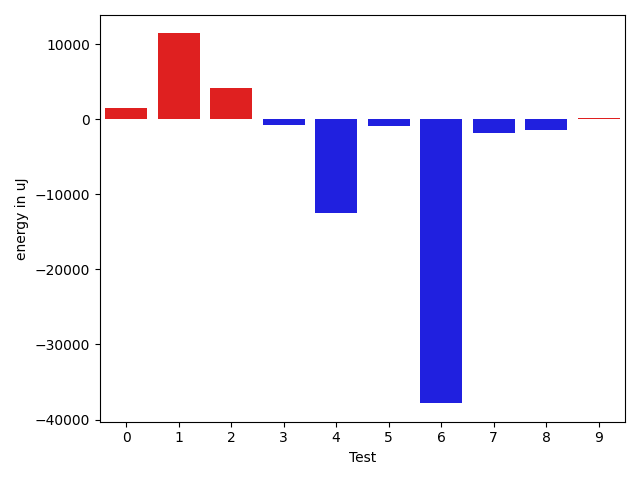

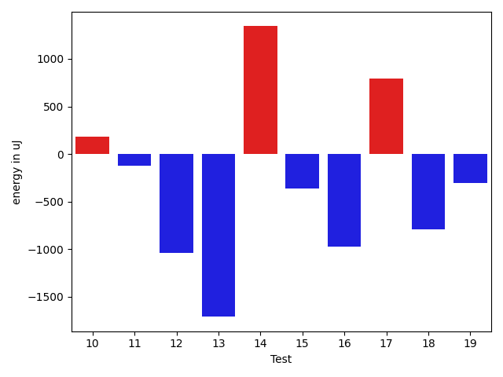

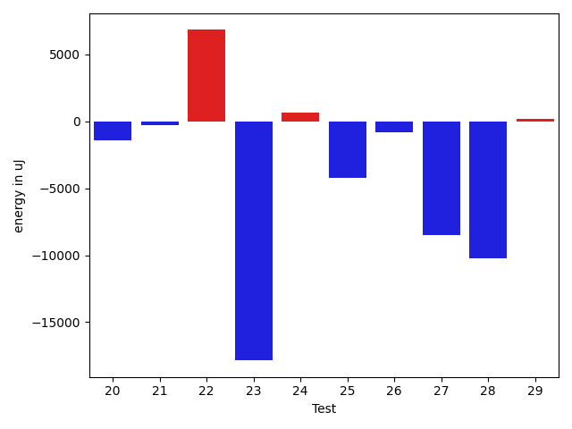

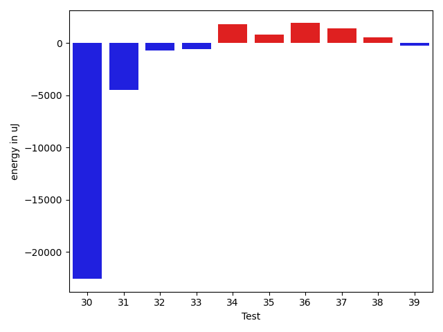

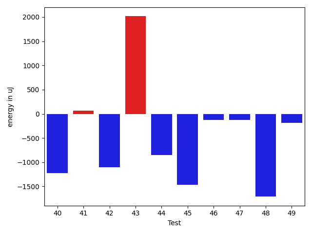

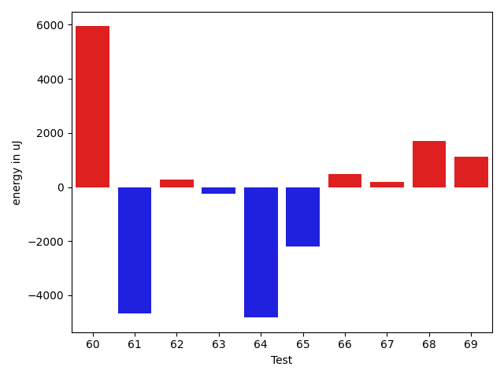

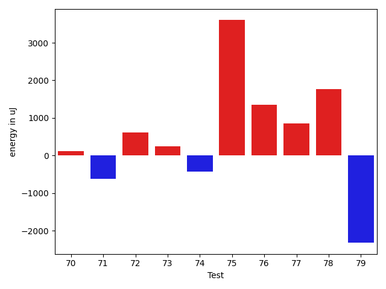

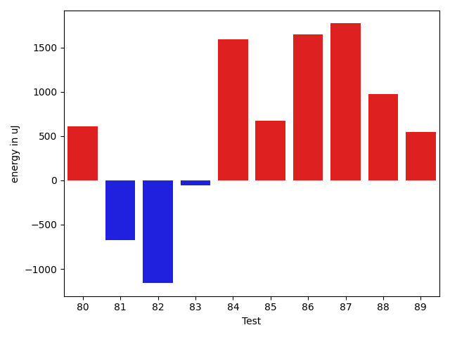

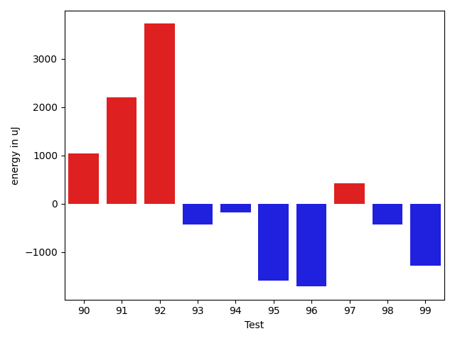

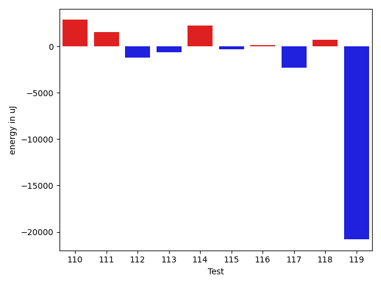

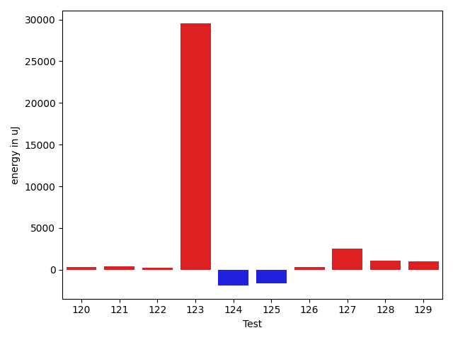

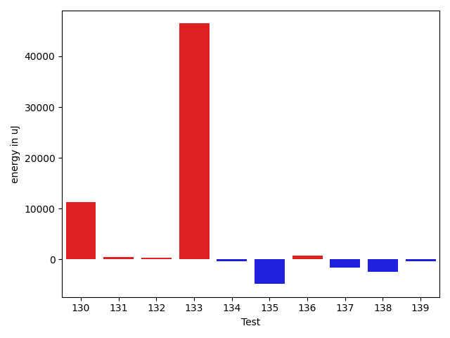

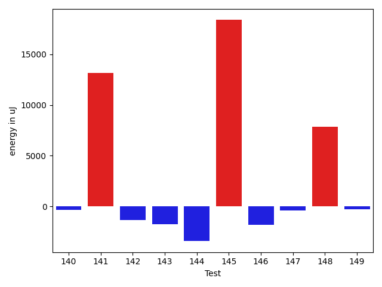

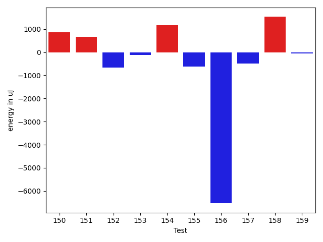

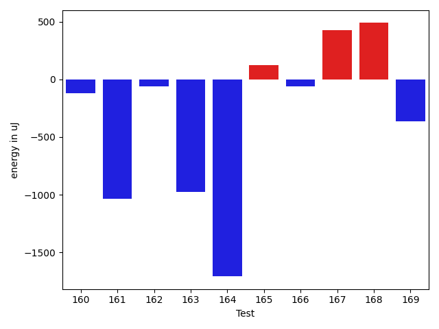

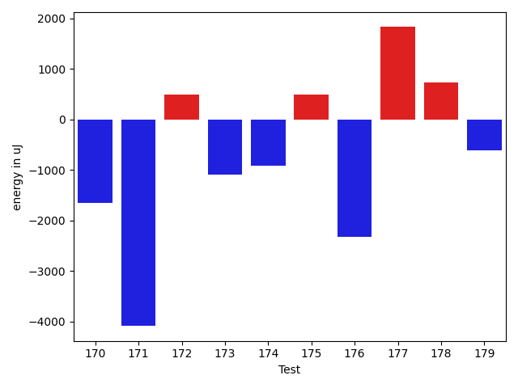

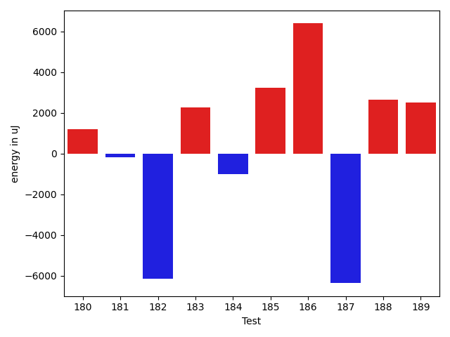

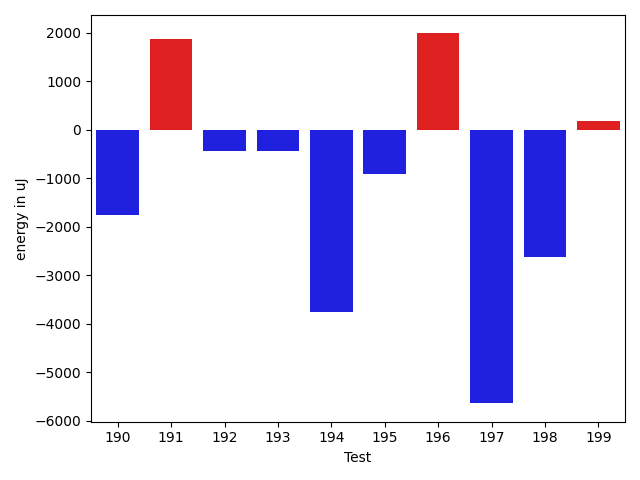

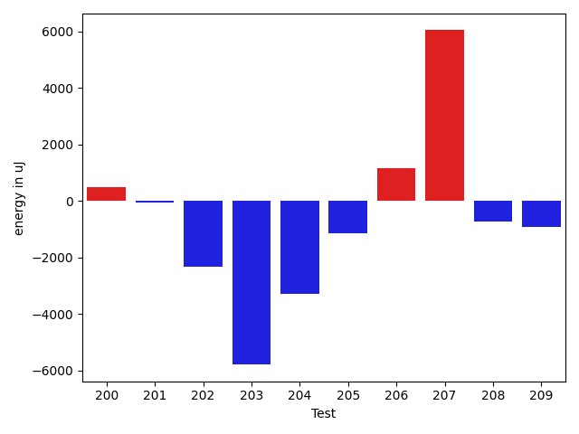

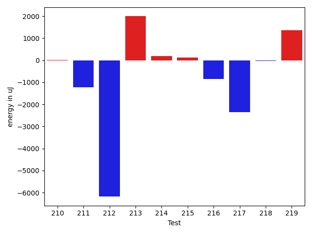

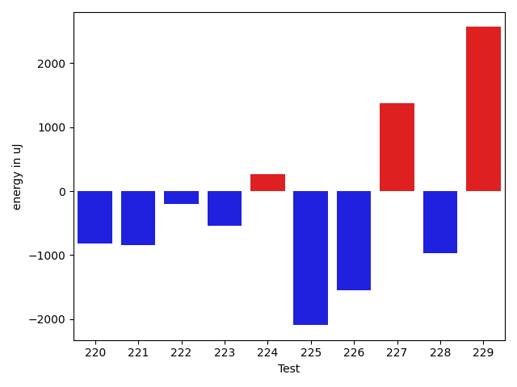

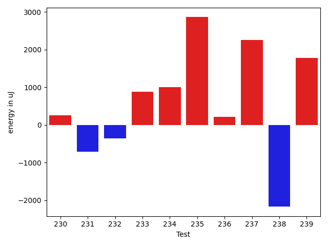

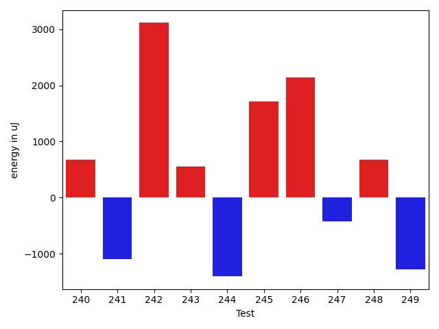

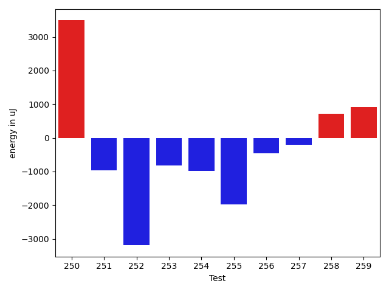

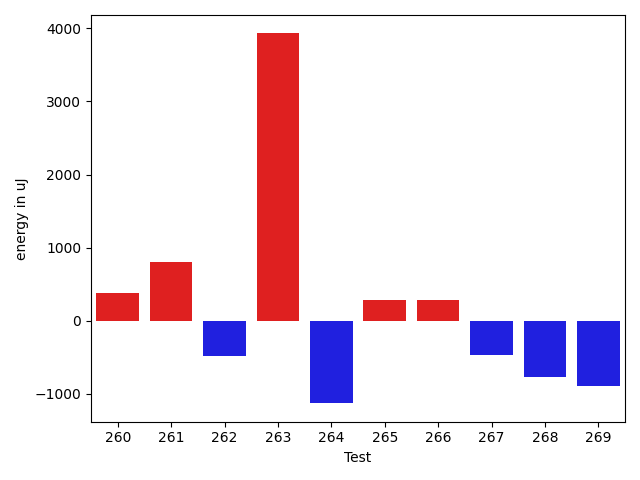

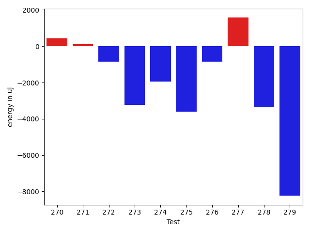

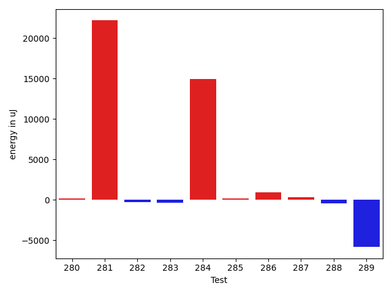

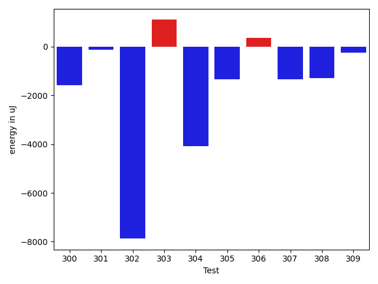

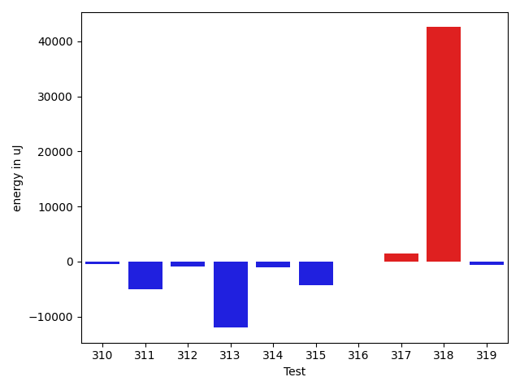

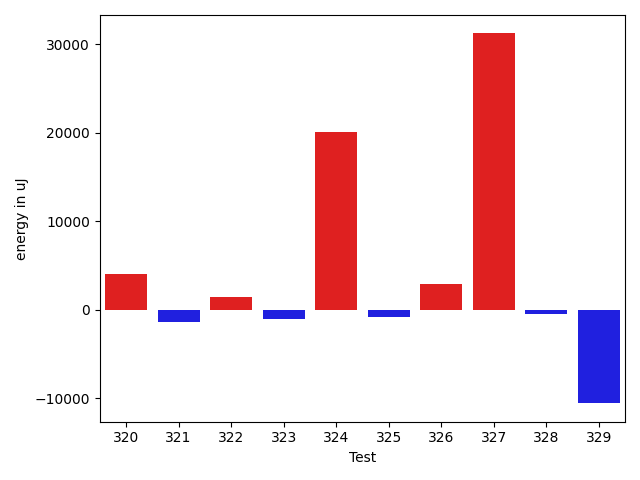

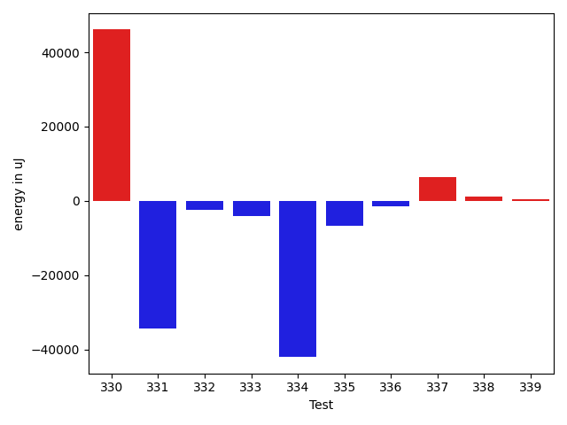

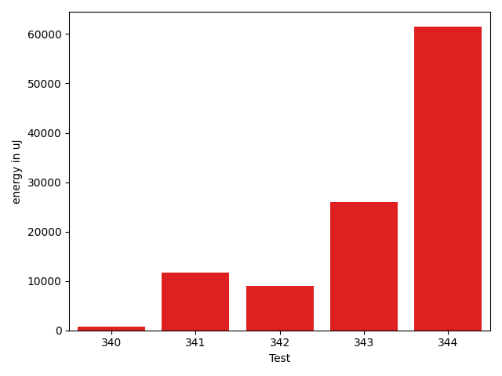

| ID | EnergyV1 | EnergyV2 | DeltaEnergy | σV1 | σV2 |
| --- | --- | --- | --- | --- | --- |
| 0 | 38391 | 37293 | -1098 | 65170.21145102825 | 75673.31330196351 |
| 1 | 37414 | 37109 | -305 | 8597.223158973153 | 71675.32956975917 |
| 2 | 65918 | 67078 | 1160 | 28656.84967263448 | 29385.336082629154 |
| 3 | 35400 | 34668 | -732 | 4409.994611603851 | 4489.525717388401 |
| 4 | 35827 | 34729 | -1098 | 68433.78545893832 | 45827.38463228301 |
| 5 | 35156 | 35156 | 0 | 4226.069588340312 | 3856.3646472444757 |
| 6 | 36560 | 36865 | 305 | 121553.44293134201 | 66439.37137742457 |
| 7 | 35400 | 32837 | -2563 | 4333.943338455954 | 3771.9554352274345 |
| 8 | 35279 | 33325 | -1954 | 3809.815079202173 | 3797.6846657079177 |
| 9 | 34606 | 33936 | -670 | 3485.094360459004 | 10227.986828377943 |
| 10 | 34241 | 34424 | 183 | 3471.6927521264383 | 3997.549595848254 |
| 11 | 36926 | 36804 | -122 | 48492.152207098305 | 33922.083973513705 |
| 12 | 34851 | 33813 | -1038 | 14686.001414228147 | 19205.480510231682 |
| 13 | 34851 | 33142 | -1709 | 4157.775559964659 | 3821.9790318629434 |
| 14 | 33814 | 35156 | 1342 | 3561.890077700298 | 3215.680394158683 |
| 15 | 36621 | 36255 | -366 | 27366.277505384267 | 37751.6876914868 |
| 16 | 34057 | 33081 | -976 | 3017.6440302549495 | 3073.4217082170476 |
| 17 | 33447 | 34240 | 793 | 4498.948821616824 | 4012.7337126502002 |
| 18 | 34363 | 33569 | -794 | 4039.5085150828104 | 3297.5170780721537 |
| 19 | 34607 | 34301 | -306 | 3786.3623335214584 | 3633.868853198978 |
| 20 | 33813 | 33142 | -671 | 3518.5275033430466 | 3275.2304193206437 |
| 21 | 33814 | 34180 | 366 | 3843.46313379307 | 3858.093656013858 |
| 22 | 34790 | 34668 | -122 | 7703.366603123603 | 34931.72803704851 |
| 23 | 35706 | 33203 | -2503 | 60268.1494005379 | 27340.47784620996 |
| 24 | 33569 | 33996 | 427 | 3515.6111097170383 | 4827.460407110785 |
| 25 | 39734 | 35705 | -4029 | 20002.914316958857 | 18253.046131405998 |
| 26 | 33814 | 33264 | -550 | 3754.1667609772758 | 3416.6993506130066 |
| 27 | 35095 | 36011 | 916 | 37230.415029944794 | 2907.4335630362025 |
| 28 | 39307 | 35950 | -3357 | 62691.39040244509 | 50675.56597272061 |
| 29 | 33752 | 34058 | 306 | 4993.6584339846595 | 5958.514441190658 |
| 30 | 34058 | 34424 | 366 | 71562.74406626956 | 6861.417873855915 |
| 31 | 40344 | 37903 | -2441 | 39940.250618789694 | 37243.14375297496 |
| 32 | 33447 | 33325 | -122 | 3672.525223790165 | 3398.424251930126 |
| 33 | 37598 | 36743 | -855 | 17045.535992868794 | 17153.26124015234 |
| 34 | 33386 | 34729 | 1343 | 4065.3359965258023 | 4123.903320345368 |
| 35 | 34790 | 35217 | 427 | 10904.98968233264 | 10096.629831111582 |
| 36 | 35889 | 34729 | -1160 | 28016.08294941322 | 33933.46704028481 |
| 37 | 31921 | 34057 | 2136 | 3484.770317568288 | 3674.251156039276 |
| 38 | 33325 | 33935 | 610 | 3095.5926346399633 | 3305.6697901099674 |
| 39 | 34546 | 33631 | -915 | 4375.420918768844 | 3546.9134934475073 |
| 40 | 35218 | 33997 | -1221 | 7210.158647106604 | 4101.873714133743 |
| 41 | 34057 | 34119 | 62 | 6507.634140713121 | 2962.688654067759 |
| 42 | 34302 | 33203 | -1099 | 4222.884268797137 | 4024.9079442889124 |
| 43 | 34546 | 36560 | 2014 | 3759.8490549106887 | 3763.639381709618 |
| 44 | 33935 | 33081 | -854 | 3474.2375057758773 | 7071.164312140536 |
| 45 | 35095 | 33631 | -1464 | 9030.738740381485 | 6480.9838212118175 |
| 46 | 33813 | 33692 | -121 | 7486.187364691005 | 35409.012543807265 |
| 47 | 35095 | 34973 | -122 | 13044.024378996071 | 18246.736843208604 |
| 48 | 34058 | 32349 | -1709 | 5055.902449919675 | 4579.306746784046 |
| 49 | 35522 | 35339 | -183 | 24671.355802791233 | 20311.18504833397 |
| 50 | 35766 | 34485 | -1281 | 139138.3949690118 | 83934.58736876848 |
| 51 | 33508 | 35705 | 2197 | 7440.744484147651 | 31014.551178092952 |
| 52 | 71289 | 72266 | 977 | 38191.552444281115 | 31492.993761405312 |
| 53 | 33813 | 34119 | 306 | 6064.284433802532 | 5997.625327640025 |
| 54 | 33692 | 33875 | 183 | 7592.524777161517 | 5799.527789535732 |
| 55 | 34485 | 35034 | 549 | 7284.900769155419 | 28552.820660365494 |
| 56 | 34973 | 33996 | -977 | 3773.631778599167 | 3486.971406555559 |
| 57 | 34119 | 35034 | 915 | 5309.976310125157 | 3272.5301616133474 |
| 58 | 34240 | 34973 | 733 | 4145.873536185199 | 3477.4467428524335 |
| 59 | 34973 | 33203 | -1770 | 3769.5651937833118 | 2769.4343445626173 |
| 60 | 33753 | 34668 | 915 | 4228.541789116761 | 30669.405387416762 |
| 61 | 33997 | 34240 | 243 | 27815.142258628275 | 3319.555624377054 |
| 62 | 33813 | 33631 | -182 | 3466.750651087782 | 4546.782186406447 |
| 63 | 34362 | 33264 | -1098 | 2457.333852431691 | 4247.4647485212345 |
| 64 | 35217 | 34363 | -854 | 23859.944734135 | 3403.9522770107496 |
| 65 | 37109 | 34485 | -2624 | 3493.597241740954 | 2608.473296298047 |
| 66 | 33875 | 34180 | 305 | 4196.0182451430555 | 3124.8254880198533 |
| 67 | 33814 | 35157 | 1343 | 4156.3514942497095 | 4193.6665971131215 |
| 68 | 33386 | 35217 | 1831 | 3737.6325199783887 | 4477.408206764266 |
| 69 | 32837 | 34241 | 1404 | 3916.980784334249 | 4383.884984644756 |
| 70 | 34668 | 34790 | 122 | 3472.392304797705 | 29465.250059212176 |
| 71 | 34912 | 34301 | -611 | 28800.10650243344 | 3920.1932246213764 |
| 72 | 33264 | 33874 | 610 | 45285.55544549881 | 24155.093072217707 |
| 73 | 33386 | 33631 | 245 | 3822.254636223525 | 3237.672682814257 |
| 74 | 34545 | 34119 | -426 | 21206.37843476977 | 3691.0659292116393 |
| 75 | 32959 | 36560 | 3601 | 3478.5245749939104 | 3905.110876341636 |
| 76 | 33996 | 35340 | 1344 | 19833.426774534786 | 17617.515894068103 |
| 77 | 34851 | 35705 | 854 | 7364.505665659561 | 4820.278948358407 |
| 78 | 35523 | 37293 | 1770 | 351736.7208798207 | 213630.9654718309 |
| 79 | 70495 | 68176 | -2319 | 30759.712610912484 | 23301.36597983193 |
| 80 | 35095 | 35706 | 611 | 31832.689715998895 | 33075.94377103282 |
| 81 | 36743 | 36072 | -671 | 7323.80796679096 | 4154.865875894207 |
| 82 | 36682 | 35522 | -1160 | 16758.619496739368 | 16672.653627651907 |
| 83 | 37170 | 37110 | -60 | 291112.19436878955 | 157133.69484263193 |
| 84 | 34362 | 35950 | 1588 | 4467.060245128818 | 5878.329378560238 |
| 85 | 36621 | 37293 | 672 | 4984.217844503604 | 4823.999933655142 |
| 86 | 34058 | 35705 | 1647 | 4120.043100603008 | 4556.801478254481 |
| 87 | 35095 | 36865 | 1770 | 35330.32643166951 | 33856.60572198703 |
| 88 | 34790 | 35767 | 977 | 4379.315904700515 | 4092.025163616878 |
| 89 | 35156 | 35705 | 549 | 4923.050819436662 | 3579.004788694756 |
| 90 | 34668 | 35705 | 1037 | 21881.145715785293 | 15117.726073757038 |
| 91 | 33630 | 35828 | 2198 | 3439.722081247158 | 3449.02292869006 |
| 92 | 35217 | 38940 | 3723 | 20936.324469056388 | 23621.210364541355 |
| 93 | 33997 | 33569 | -428 | 3625.3522025901766 | 3446.972997256444 |
| 94 | 34240 | 34058 | -182 | 4360.4652100894 | 3491.26394766941 |
| 95 | 35156 | 33570 | -1586 | 4090.3877779750233 | 3682.5234636579717 |
| 96 | 34729 | 33020 | -1709 | 4195.449707784357 | 4550.502425984288 |
| 97 | 34118 | 34546 | 428 | 5143.694681651714 | 4038.9815259862703 |
| 98 | 34058 | 33630 | -428 | 7316.5696465309675 | 3096.3073327967963 |
| 99 | 35339 | 34058 | -1281 | 13359.56551082251 | 10999.222504744055 |
| 100 | 37841 | 39672 | 1831 | 51371.39998854297 | 71570.89006900345 |
| 101 | 34424 | 33325 | -1099 | 4720.38707734212 | 3958.7735303024397 |
| 102 | 33935 | 32898 | -1037 | 4439.763385267256 | 4076.7824319838833 |
| 103 | 34484 | 34485 | 1 | 3598.5782182284624 | 3860.363252828286 |
| 104 | 35950 | 34180 | -1770 | 4654.8304923328915 | 3734.191564784734 |
| 105 | 34973 | 34180 | -793 | 4301.485129709237 | 4833.516051437207 |
| 106 | 35217 | 35888 | 671 | 4271.397150160588 | 4461.693858492936 |
| 107 | 34790 | 34180 | -610 | 5010.374999298954 | 3690.0362528259548 |
| 108 | 34851 | 35034 | 183 | 4445.325393333607 | 3502.752672875233 |
| 109 | 36804 | 35644 | -1160 | 39287.516733742945 | 54722.971758515945 |
| 110 | 32165 | 35034 | 2869 | 3078.405315086143 | 37361.15576370731 |
| 111 | 35218 | 36804 | 1586 | 5696.7320131953975 | 4443.961809466396 |
| 112 | 33569 | 32349 | -1220 | 3570.7309937748014 | 3517.023942907151 |
| 113 | 35461 | 34851 | -610 | 10127.011277220392 | 6993.075937293389 |
| 114 | 34973 | 37231 | 2258 | 5102.232427065227 | 3273.167036296804 |
| 115 | 35400 | 35095 | -305 | 10420.221002561424 | 5961.828676773275 |
| 116 | 37049 | 37170 | 121 | 69130.90143596694 | 79191.42146785543 |
| 117 | 39734 | 37475 | -2259 | 78041.88124421088 | 108029.83890475333 |
| 118 | 36133 | 36866 | 733 | 4400.486050923807 | 4576.496714032877 |
| 119 | 153259 | 132446 | -20813 | 118112.35800947552 | 116060.82216224218 |
| 120 | 37231 | 36682 | -549 | 4116.2044601906355 | 3959.4615100890355 |
| 121 | 36254 | 36255 | 1 | 4551.934909776227 | 4148.6614617917685 |
| 122 | 37231 | 35523 | -1708 | 75089.43986945141 | 74077.0359759296 |
| 123 | 37048 | 37171 | 123 | 12228.260016742299 | 97667.10073866021 |
| 124 | 35584 | 35095 | -489 | 5408.178922524188 | 3080.5639542203417 |
| 125 | 36682 | 34607 | -2075 | 4286.6133139931935 | 3712.215015324409 |
| 126 | 34851 | 35034 | 183 | 3894.8468389907835 | 2977.66658044651 |
| 127 | 33875 | 35279 | 1404 | 3944.6664499881417 | 9237.683305668745 |
| 128 | 33875 | 35217 | 1342 | 4100.775959188165 | 2703.588029707004 |
| 129 | 35156 | 36682 | 1526 | 2856.0298412449465 | 3903.2252116207155 |
| 130 | 39612 | 38147 | -1465 | 25046.102161841172 | 46337.08348449315 |
| 131 | 33448 | 33386 | -62 | 3791.7158717495645 | 4710.20716724859 |
| 132 | 36316 | 36743 | 427 | 3855.9808816365144 | 3815.681943558713 |
| 133 | 37658 | 38940 | 1282 | 35096.36592277896 | 83099.48824300015 |
| 134 | 32959 | 33508 | 549 | 4416.320162210608 | 3494.5757248789987 |
| 135 | 35766 | 35767 | 1 | 23827.591819462807 | 4849.616757283072 |
| 136 | 33264 | 34790 | 1526 | 3589.4995019579283 | 4929.055269409027 |
| 137 | 36194 | 34728 | -1466 | 3953.335332349129 | 3849.5334446522997 |
| 138 | 34790 | 32532 | -2258 | 3642.3232369407133 | 3658.9991233989135 |
| 139 | 34423 | 34851 | 428 | 3393.6558580445712 | 4288.668249858075 |
| 140 | 34180 | 33447 | -733 | 4691.141486887813 | 4278.242980476915 |
| 141 | 37719 | 34607 | -3112 | 4791.685750480821 | 51527.45288339023 |
| 142 | 34119 | 32714 | -1405 | 3425.696788642081 | 3687.2731869981585 |
| 143 | 35827 | 34241 | -1586 | 4327.505805437325 | 3457.3430336128067 |
| 144 | 37293 | 33935 | -3358 | 4789.484920694035 | 4209.808602801583 |
| 145 | 34057 | 34057 | 0 | 4960.611590523977 | 58857.1430788991 |
| 146 | 35949 | 38452 | 2503 | 88934.87980941906 | 76078.02850892214 |
| 147 | 33875 | 33448 | -427 | 3367.5302522124393 | 3510.2365813635492 |
| 148 | 36438 | 37597 | 1159 | 23414.021292005367 | 41654.0464871967 |
| 149 | 34546 | 34240 | -306 | 4404.717928103834 | 4422.079081019349 |
| 150 | 32410 | 33265 | 855 | 3728.0283306655474 | 4223.556160456796 |
| 151 | 33569 | 34240 | 671 | 3851.811675769673 | 26318.4523516185 |
| 152 | 35767 | 35096 | -671 | 5862.450532527068 | 9323.965155414031 |
| 153 | 34058 | 33936 | -122 | 4835.025499936273 | 20455.800884406486 |
| 154 | 33386 | 34546 | 1160 | 3640.539203160803 | 4253.176479401079 |
| 155 | 34301 | 33691 | -610 | 4793.21610090568 | 7599.327471515075 |
| 156 | 140808 | 134277 | -6531 | 36818.22516352217 | 33432.57418279534 |
| 157 | 33203 | 32715 | -488 | 3819.9055117215566 | 3884.2742395161276 |
| 158 | 34119 | 35645 | 1526 | 4371.66155726476 | 2857.2305695102295 |
| 159 | 33326 | 33264 | -62 | 3053.2307490267945 | 3492.1875965627587 |
| 160 | 34118 | 33996 | -122 | 3398.2104712664272 | 3699.629414624599 |
| 161 | 33508 | 32471 | -1037 | 3908.0475473338624 | 3874.5853462199448 |
| 162 | 34973 | 34912 | -61 | 4575.784462169782 | 4429.106499213758 |
| 163 | 35340 | 34362 | -978 | 6666.760203189972 | 4217.94792828912 |
| 164 | 37109 | 35401 | -1708 | 4235.069830814988 | 4737.038378072957 |
| 165 | 33569 | 33692 | 123 | 3804.2179534370616 | 3957.885610327548 |
| 166 | 34729 | 34668 | -61 | 3508.190664929231 | 3946.687436461599 |
| 167 | 33875 | 34302 | 427 | 4089.463762862876 | 3133.677494423007 |
| 168 | 33325 | 33814 | 489 | 2930.1474271163697 | 3797.8420754496105 |
| 169 | 33874 | 33508 | -366 | 4036.10238302759 | 3317.7650405455065 |
| 170 | 35095 | 33447 | -1648 | 11939.54418849965 | 13313.26356622748 |
| 171 | 37903 | 33813 | -4090 | 4308.6461291995965 | 3625.187805597159 |
| 172 | 32287 | 32776 | 489 | 3393.2019152497132 | 2918.2138131697957 |
| 173 | 33997 | 32898 | -1099 | 4058.4259465259315 | 2915.0687604439704 |
| 174 | 35339 | 34423 | -916 | 4083.534505691313 | 3236.460024439653 |
| 175 | 33691 | 34180 | 489 | 4059.4273425738015 | 3406.831454738174 |
| 176 | 35400 | 33080 | -2320 | 4478.218542630044 | 4255.689429639097 |
| 177 | 33814 | 35644 | 1830 | 7968.9396660986495 | 3967.8149774851586 |
| 178 | 35339 | 36072 | 733 | 9147.184226731384 | 7654.116067825424 |
| 179 | 34912 | 34302 | -610 | 6612.172362609519 | 4555.029609504677 |
| 180 | 33935 | 36316 | 2381 | 3654.943870538854 | 3972.290697713839 |
| 181 | 34973 | 35401 | 428 | 11446.013256640965 | 8937.170088287992 |
| 182 | 86182 | 83618 | -2564 | 74223.40640778505 | 63779.826860883266 |
| 183 | 35339 | 37598 | 2259 | 4462.190969497371 | 4055.2777167538106 |
| 184 | 35522 | 36254 | 732 | 19436.76741386201 | 9419.809740449613 |
| 185 | 71289 | 72082 | 793 | 25880.18168555111 | 31000.332182836017 |
| 186 | 36376 | 36865 | 489 | 10320.985795309589 | 36035.78206334951 |
| 187 | 35644 | 33752 | -1892 | 56613.568588716 | 37966.946298324765 |
| 188 | 39795 | 59814 | 20019 | 21403.42123168101 | 22920.244799219698 |
| 189 | 68054 | 70190 | 2136 | 36325.76634463823 | 34449.79172401745 |
| 190 | 35156 | 36621 | 1465 | 12164.984362143294 | 7024.216561037854 |
| 191 | 36560 | 38086 | 1526 | 15208.63477547885 | 16408.01384434113 |
| 192 | 36194 | 35035 | -1159 | 4102.715541967054 | 4196.980773122897 |
| 193 | 36438 | 36377 | -61 | 14849.394257736023 | 14768.183777788527 |
| 194 | 38147 | 37353 | -794 | 24748.862326204086 | 14606.245257243188 |
| 195 | 36621 | 35644 | -977 | 4222.211120119071 | 4141.57753908124 |
| 196 | 37781 | 36743 | -1038 | 26207.511941293364 | 27679.865677294092 |
| 197 | 36743 | 37293 | 550 | 43861.99767624129 | 28241.93294359294 |
| 198 | 35645 | 33569 | -2076 | 4492.398834612189 | 2945.0543677536657 |
| 199 | 35217 | 35767 | 550 | 3902.8014811211788 | 4129.0259440833715 |
| 200 | 35462 | 35949 | 487 | 3326.994152384401 | 3211.1988691602264 |
| 201 | 35034 | 34973 | -61 | 9248.616367091056 | 4653.85833726427 |
| 202 | 36376 | 34058 | -2318 | 4689.034904615698 | 4132.039873539861 |
| 203 | 42358 | 36560 | -5798 | 97269.66652844049 | 28844.161283192076 |
| 204 | 36927 | 33630 | -3297 | 4433.820768703625 | 4129.2530923982185 |
| 205 | 39245 | 38086 | -1159 | 791286.8940260012 | 239087.37306320513 |
| 206 | 74219 | 75378 | 1159 | 23789.08160657141 | 27563.972029755387 |
| 207 | 77087 | 83129 | 6042 | 213915.02405669884 | 160180.27600680542 |
| 208 | 36133 | 35400 | -733 | 24798.163032086282 | 4607.462385473315 |
| 209 | 36193 | 35278 | -915 | 3786.5728914444817 | 4231.1111356531 |
| 210 | 36072 | 35095 | -977 | 32264.6129116856 | 34321.63333523933 |
| 211 | 34729 | 33264 | -1465 | 4009.8708602384536 | 3245.8353883740087 |
| 212 | 35339 | 32410 | -2929 | 27825.953813245356 | 4214.935975924412 |
| 213 | 31189 | 33325 | 2136 | 3045.880471865055 | 3089.296066663084 |
| 214 | 33569 | 35400 | 1831 | 5082.674118405174 | 2772.0834885125573 |
| 215 | 33447 | 34058 | 611 | 4335.531924432855 | 4540.394903162793 |
| 216 | 33874 | 33692 | -182 | 3795.7737512412727 | 3855.619927496242 |
| 217 | 35584 | 33814 | -1770 | 4920.132782622788 | 3681.0822938024007 |
| 218 | 33936 | 34424 | 488 | 4668.282368783122 | 3897.112203133177 |
| 219 | 33813 | 36255 | 2442 | 2867.0031146434076 | 4469.442087821351 |
| 220 | 41504 | 55786 | 14282 | 23577.934990941103 | 18072.16047125769 |
| 221 | 34484 | 34607 | 123 | 4290.479830249446 | 3722.4310636087826 |
| 222 | 35523 | 33874 | -1649 | 4221.032727891428 | 3882.095843433028 |
| 223 | 34180 | 33936 | -244 | 3601.7476807600106 | 4167.719041974819 |
| 224 | 32349 | 31677 | -672 | 3244.8181521060137 | 4246.845817634581 |
| 225 | 35400 | 32654 | -2746 | 4029.8453547665245 | 2767.3005677732153 |
| 226 | 34485 | 33264 | -1221 | 6199.7209589458835 | 3943.2194453321217 |
| 227 | 31006 | 33630 | 2624 | 3826.4508407899675 | 3668.621716610582 |
| 228 | 34790 | 33631 | -1159 | 3758.5620327482447 | 2821.0658074564662 |
| 229 | 31982 | 34485 | 2503 | 3493.8210676696885 | 3730.3238290827358 |
| 230 | 38208 | 37841 | -367 | 4443.324782749963 | 2779.547049430896 |
| 231 | 35034 | 32532 | -2502 | 3965.229609325452 | 3640.370777208766 |
| 232 | 34485 | 35095 | 610 | 4547.099473410907 | 3896.2876805492683 |
| 233 | 32959 | 33264 | 305 | 2783.387189543269 | 4364.151231604874 |
| 234 | 32776 | 32897 | 121 | 2520.2625929037795 | 3181.7514212563283 |
| 235 | 32837 | 34363 | 1526 | 3209.2883854257166 | 5423.9145317816865 |
| 236 | 32532 | 32105 | -427 | 4168.853605610972 | 4032.6609192895703 |
| 237 | 31922 | 35400 | 3478 | 3411.438678082668 | 3998.1945029533913 |
| 238 | 36255 | 33447 | -2808 | 4218.085815790736 | 3066.7665421308816 |
| 239 | 31799 | 34301 | 2502 | 4210.51976582615 | 4530.464168640266 |
| 240 | 31860 | 32532 | 672 | 2617.5356641139747 | 3036.964428092631 |
| 241 | 32776 | 31677 | -1099 | 3615.8921367536227 | 4858.109336486727 |
| 242 | 31433 | 34546 | 3113 | 3391.868937854414 | 4510.971814026195 |
| 243 | 33997 | 34546 | 549 | 3513.2186295317415 | 4694.8752496072775 |
| 244 | 36438 | 35034 | -1404 | 3437.0050938909153 | 2886.9221422860196 |
| 245 | 33752 | 35462 | 1710 | 3265.793327814851 | 4035.154143276314 |
| 246 | 33142 | 35278 | 2136 | 21118.0104559863 | 3343.3713474488814 |
| 247 | 32592 | 32165 | -427 | 4196.588632595377 | 3300.4571832016622 |
| 248 | 33936 | 34607 | 671 | 4420.029207545529 | 4364.380608975345 |
| 249 | 35767 | 34485 | -1282 | 4501.4626786094295 | 30643.611269561552 |
| 250 | 39429 | 39307 | -122 | 91291.07721031325 | 96767.39821207123 |
| 251 | 32044 | 31128 | -916 | 3764.4835118660185 | 2094.143108618654 |
| 252 | 33996 | 32043 | -1953 | 4980.624087958814 | 3310.2886697270187 |
| 253 | 35828 | 34485 | -1343 | 3588.229736102923 | 3879.669659374875 |
| 254 | 33142 | 33142 | 0 | 4017.5643706382875 | 4600.922422786095 |
| 255 | 35888 | 34362 | -1526 | 4842.475982552727 | 4448.860698600885 |
| 256 | 31433 | 31860 | 427 | 4025.811465863458 | 4072.6484061272163 |
| 257 | 34912 | 33936 | -976 | 5548.005506670015 | 4103.862736255282 |
| 258 | 33081 | 33020 | -61 | 3568.582947882417 | 3589.2583297980505 |
| 259 | 33142 | 33142 | 0 | 4175.871174511458 | 2328.617697297109 |
| 260 | 34058 | 34424 | 366 | 3832.474986483928 | 4304.374597106582 |
| 261 | 34363 | 36011 | 1648 | 3350.874233315837 | 4466.978845931554 |
| 262 | 31494 | 31555 | 61 | 3139.2348021225084 | 3832.2500024916462 |
| 263 | 39245 | 38025 | -1220 | 11539.281079582037 | 17420.933663059175 |
| 264 | 36499 | 34119 | -2380 | 4017.4416279984703 | 3722.889648055287 |
| 265 | 33325 | 31494 | -1831 | 3220.6649098498997 | 4073.8751970460835 |
| 266 | 34607 | 31921 | -2686 | 3792.4726634541603 | 5001.974336421792 |
| 267 | 38269 | 36194 | -2075 | 4243.785800438095 | 4369.808489246066 |
| 268 | 35278 | 34179 | -1099 | 4049.440378916573 | 3699.1601920629514 |
| 269 | 36316 | 36072 | -244 | 3680.7301205879708 | 3124.6394531565115 |
| 270 | 36438 | 36865 | 427 | 4566.457945351809 | 5257.683095300843 |
| 271 | 32227 | 32349 | 122 | 3392.5789495594768 | 3113.7507471786425 |
| 272 | 35034 | 34180 | -854 | 4400.630270515551 | 4562.110850606673 |
| 273 | 34484 | 31250 | -3234 | 4593.624751693917 | 5503.2312567532645 |
| 274 | 33936 | 31982 | -1954 | 5041.325235638728 | 2899.8840051035763 |
| 275 | 38025 | 34423 | -3602 | 4988.651615166166 | 4675.486470344556 |
| 276 | 37475 | 36621 | -854 | 450518.4515096173 | 409610.9498697942 |
| 277 | 34607 | 36194 | 1587 | 2511.907187400093 | 3978.2941086986175 |
| 278 | 38879 | 35522 | -3357 | 5611.949556302623 | 3676.1553619097713 |
| 279 | 172424 | 164184 | -8240 | 157597.21018369618 | 316021.2143968 |
| 280 | 35705 | 35889 | 184 | 4187.803393925369 | 4657.258841410369 |
| 281 | 36560 | 36255 | -305 | 29306.333644553208 | 66253.27589465128 |
| 282 | 35400 | 34729 | -671 | 4099.892982442565 | 4171.23406525199 |
| 283 | 35217 | 35522 | 305 | 4519.145544945415 | 4391.417278833249 |
| 284 | 35034 | 38452 | 3418 | 14883.512685891517 | 30122.283079420682 |
| 285 | 34973 | 35461 | 488 | 4208.667694605615 | 4350.529175923535 |
| 286 | 35705 | 37354 | 1649 | 4508.428101906413 | 3793.800215666198 |
| 287 | 34973 | 36438 | 1465 | 4510.086566779373 | 3873.272306206303 |
| 288 | 34607 | 33874 | -733 | 4244.36665462456 | 4800.988658642666 |
| 289 | 35705 | 38086 | 2381 | 40485.41638962622 | 5820.182500475649 |
| 290 | 36621 | 37781 | 1160 | 81127.1375216933 | 57734.229302457905 |
| 291 | 36560 | 37231 | 671 | 4474.372267315655 | 8341.432890705008 |
| 292 | 35644 | 36804 | 1160 | 3631.9669525751933 | 2609.814104663329 |
| 293 | 38147 | 36987 | -1160 | 19538.37964315656 | 21748.093343705867 |
| 294 | 217651 | 226623 | 8972 | 93552.44408550204 | 89254.15694592691 |
| 295 | 445617 | 462645 | 17028 | 138604.4065832713 | 193734.68668434248 |
| 296 | 57678 | 63720 | 6042 | 20174.178357822195 | 27336.287715072434 |
| 297 | 35828 | 33875 | -1953 | 3613.5397931577695 | 4048.1489138628367 |
| 298 | 35706 | 33753 | -1953 | 3383.8673876074963 | 4065.0745383657036 |
| 299 | 36682 | 34607 | -2075 | 32784.03681543784 | 25232.910579158044 |
| 300 | 35522 | 33935 | -1587 | 4273.190648683955 | 3570.317993735136 |
| 301 | 34423 | 34301 | -122 | 6757.57651288537 | 4332.646241147289 |
| 302 | 45349 | 37476 | -7873 | 30367.930601008266 | 17606.022284556784 |
| 303 | 33508 | 34606 | 1098 | 2775.8274695286036 | 4554.119589380038 |
| 304 | 37414 | 33325 | -4089 | 4100.089839425232 | 2969.628800035452 |
| 305 | 39002 | 37658 | -1344 | 81411.05428522987 | 53616.49503845072 |
| 306 | 34912 | 35278 | 366 | 4399.957546177379 | 4057.4883140540433 |
| 307 | 38696 | 37353 | -1343 | 78990.85867458019 | 46780.853480190664 |
| 308 | 36133 | 34851 | -1282 | 4272.757900185779 | 3669.3223679584216 |
| 309 | 35278 | 35034 | -244 | 4332.865095223102 | 4256.7750086095575 |
| 310 | 33813 | 34301 | 488 | 5227.091300838434 | 5380.7379419555455 |
| 311 | 35583 | 35705 | 122 | 36158.06910812747 | 6309.2252117979115 |
| 312 | 37842 | 36438 | -1404 | 28285.873053120165 | 27909.090230630576 |
| 313 | 37293 | 36072 | -1221 | 63494.42327666572 | 32015.902814980305 |
| 314 | 35156 | 34607 | -549 | 9471.309407973975 | 8659.122019075628 |
| 315 | 38086 | 38025 | -61 | 61282.41403975485 | 52216.78092666507 |
| 316 | 33569 | 33325 | -244 | 4003.1745258012006 | 3975.641704550721 |
| 317 | 34057 | 36011 | 1954 | 4722.492664791367 | 4128.825547295502 |
| 318 | 39002 | 39001 | -1 | 82743.59558512167 | 116630.843253355 |
| 319 | 36438 | 36377 | -61 | 4871.217967449208 | 5560.06979369204 |
| 320 | 35949 | 36194 | 245 | 34844.44548655217 | 52751.71916582435 |
| 321 | 36804 | 34729 | -2075 | 3853.477398727025 | 5342.59802032731 |
| 322 | 37903 | 37537 | -366 | 14962.461466349238 | 20482.296425703644 |
| 323 | 69519 | 63232 | -6287 | 34042.423479022 | 31918.972571529277 |
| 324 | 37963 | 39002 | 1039 | 51029.31396336898 | 77170.57259546919 |
| 325 | 37719 | 36621 | -1098 | 16590.729108640116 | 16473.778002988063 |
| 326 | 37903 | 38574 | 671 | 39921.87264902366 | 42600.26575820399 |
| 327 | 37354 | 37964 | 610 | 103143.53425566004 | 141508.88274068903 |
| 328 | 37170 | 36804 | -366 | 3682.9518856096906 | 3980.2268654282766 |
| 329 | 37171 | 37231 | 60 | 62076.77524284718 | 18196.126350452076 |
| 330 | 37415 | 36987 | -428 | 324667.2065564324 | 405554.544634343 |
| 331 | 36255 | 37292 | 1037 | 256417.7916733316 | 70128.46903811966 |
| 332 | 40405 | 36743 | -3662 | 5924.520207577994 | 4135.91858420199 |
| 333 | 36254 | 36926 | 672 | 30021.60835951315 | 4644.283053748268 |
| 334 | 37720 | 36560 | -1160 | 110975.45622996001 | 43526.14806602578 |
| 335 | 41748 | 37781 | -3967 | 37256.059098222846 | 33884.35940077585 |
| 336 | 38025 | 36193 | -1832 | 487351.81938943185 | 485923.4758449965 |
| 337 | 68054 | 40955 | -27099 | 65091.99978620644 | 91314.10662180446 |
| 338 | 34301 | 34301 | 0 | 3019.2909359935556 | 3667.391146675615 |
| 339 | 35278 | 35034 | -244 | 3744.3002350238958 | 3000.0807811912073 |
| 340 | 36499 | 35889 | -610 | 3787.603977890684 | 3809.1300773878074 |
| 341 | 36255 | 35217 | -1038 | 9815.593849533436 | 64135.27100912738 |
| 342 | 36437 | 36682 | 245 | 4188.442438168542 | 42098.97221770978 |
| 343 | 34179 | 40893 | 6714 | 30265.08716844558 | 60573.85423982139 |
| 344 | 36316 | 36011 | -305 | 483335.08046493307 | 553444.7312788572 |

## Delta Duration per test method

| ID | DurationV1 | DurationsV2 | DeltaDuration |
| --- | --- | --- | --- |
| 0 | 1381869.9333333333 | 1588188.4925373134 | 206318.55920398002 |
| 1 | 619943.8620689656 | 891327.84375 | 271383.98168103443 |
| 2 | 1834621.6216216215 | 1967704.1066666667 | 133082.48504504515 |
| 3 | 602275.025 | 648889.75 | 46614.72499999998 |
| 4 | 1563251.4 | 1188315.5945945946 | -374935.80540540535 |
| 5 | 729308.8604651163 | 702074.9761904762 | -27233.88427464012 |
| 6 | 2587278.5 | 1507856.0 | -1079422.5 |
| 7 | 723086.4423076923 | 730795.0425531915 | 7708.600245499285 |
| 8 | 587178.5588235294 | 526375.6785714285 | -60802.88025210088 |
| 9 | 641298.2407407408 | 700908.7948717949 | 59610.55413105409 |
| 10 | 730778.9019607843 | 720977.804347826 | -9801.097612958285 |
| 11 | 1555794.8 | 1324350.981818182 | -231443.81818181812 |
| 12 | 1004773.2794117647 | 1018411.2 | 13637.920588235254 |
| 13 | 788877.2835820896 | 826180.98 | 37303.696417910396 |
| 14 | 670999.6363636364 | 671787.4722222222 | 787.835858585895 |
| 15 | 1129572.3095238095 | 1197487.711111111 | 67915.40158730163 |
| 16 | 530028.0 | 463986.82352941175 | -66041.17647058825 |
| 17 | 682528.5652173914 | 639634.880952381 | -42893.68426501041 |
| 18 | 704875.6829268293 | 799647.0 | 94771.31707317068 |
| 19 | 854994.1538461539 | 847331.3518518518 | -7662.801994302077 |
| 20 | 869276.1060606061 | 867111.1206896552 | -2164.98537095089 |
| 21 | 718326.0545454546 | 716179.6590909091 | -2146.3954545455053 |
| 22 | 879645.6271186441 | 1105120.6296296297 | 225475.0025109856 |
| 23 | 1448627.9666666666 | 933991.0384615385 | -514636.92820512806 |
| 24 | 950785.9838709678 | 905939.8 | -44846.18387096771 |
| 25 | 1546749.4835164836 | 1461672.042105263 | -85077.44141122047 |
| 26 | 657702.7674418605 | 690753.7954545454 | 33051.028012684896 |
| 27 | 634715.7894736842 | 381211.5714285714 | -253504.21804511274 |
| 28 | 1569794.6101694915 | 1246982.2833333334 | -322812.32683615806 |
| 29 | 954036.4 | 893991.593220339 | -60044.80677966098 |
| 30 | 1321324.24 | 580593.2727272727 | -740730.9672727273 |
| 31 | 1974682.7078651686 | 1840224.4725274725 | -134458.23533769604 |
| 32 | 797255.575 | 677355.1276595745 | -119900.44734042545 |
| 33 | 1378449.3103448276 | 1274024.1153846155 | -104425.1949602121 |
| 34 | 762990.0625 | 587592.8 | -175397.26249999995 |
| 35 | 1025584.5873015873 | 999351.5344827586 | -26233.052818828728 |
| 36 | 1315170.923076923 | 1326944.858974359 | 11773.935897435993 |
| 37 | 919101.5263157894 | 462239.52173913043 | -456862.004576659 |
| 38 | 460059.09523809527 | 381494.64705882355 | -78564.44817927171 |
| 39 | 678658.46 | 644190.36 | -34468.09999999998 |
| 40 | 579637.3478260869 | 524966.2580645161 | -54671.089761570795 |
| 41 | 867432.125 | 806806.447368421 | -60625.67763157899 |
| 42 | 701904.2666666667 | 661331.325 | -40572.94166666677 |
| 43 | 649204.1935483871 | 576699.5 | -72504.69354838715 |
| 44 | 579765.1764705882 | 572452.9230769231 | -7312.2533936650725 |
| 45 | 999428.4126984127 | 931499.6666666666 | -67928.74603174604 |
| 46 | 583393.4814814815 | 1117075.15 | 533681.6685185184 |
| 47 | 1084863.1 | 1091373.2714285713 | 6510.171428571222 |
| 48 | 550845.2727272727 | 538211.2941176471 | -12633.9786096256 |
| 49 | 1171174.956521739 | 958007.1136363636 | -213167.84288537537 |
| 50 | 2764546.11627907 | 1595099.5 | -1169446.6162790698 |
| 51 | 691734.7647058824 | 743526.6176470588 | 51791.85294117639 |
| 52 | 2696591.101010101 | 2432770.3163265307 | -263820.78468357027 |
| 53 | 913475.4561403509 | 798136.1034482758 | -115339.35269207507 |
| 54 | 940072.6031746032 | 922724.2291666666 | -17348.374007936567 |
| 55 | 942287.0967741936 | 969133.9672131147 | 26846.87043892115 |
| 56 | 671721.7619047619 | 618528.5714285715 | -53193.190476190415 |
| 57 | 790447.4655172414 | 780956.7659574468 | -9490.699559794622 |
| 58 | 590730.8461538461 | 532305.025 | -58425.821153846104 |
| 59 | 694712.8378378379 | 744413.0454545454 | 49700.20761670754 |
| 60 | 511758.7931034483 | 668176.375 | 156417.5818965517 |
| 61 | 807750.3684210526 | 626693.5666666667 | -181056.80175438593 |
| 62 | 758611.4814814815 | 695997.1132075472 | -62614.36827393423 |
| 63 | 490059.8275862069 | 457587.7916666667 | -32472.035919540212 |
| 64 | 692583.8846153846 | 472540.375 | -220043.50961538462 |
| 65 | 432604.375 | 442501.0625 | 9896.6875 |
| 66 | 510118.7894736842 | 464223.36363636365 | -45895.42583732057 |
| 67 | 889762.1694915254 | 816722.2142857143 | -73039.95520581107 |
| 68 | 721600.44 | 460616.53571428574 | -260983.9042857142 |
| 69 | 681559.96875 | 580752.78125 | -100807.1875 |
| 70 | 630799.4838709678 | 673315.3235294118 | 42515.83965844405 |
| 71 | 821484.6451612903 | 518842.4285714286 | -302642.2165898617 |
| 72 | 804739.0 | 640516.625 | -164222.375 |
| 73 | 445299.7272727273 | 426198.0 | -19101.727272727294 |
| 74 | 699677.8275862068 | 490813.23076923075 | -208864.5968169761 |
| 75 | 466851.7894736842 | 575394.3478260869 | 108542.5583524027 |
| 76 | 939355.7833333333 | 925735.2321428572 | -13620.551190476166 |
| 77 | 972516.0645161291 | 900910.8214285715 | -71605.24308755761 |
| 78 | 2360209.433333333 | 1606354.5263157894 | -753854.9070175437 |
| 79 | 2163142.1919191917 | 2044766.6464646466 | -118375.54545454518 |
| 80 | 901908.5555555555 | 901292.7727272727 | -615.7828282827977 |
| 81 | 936649.8703703703 | 906288.8870967742 | -30360.983273596154 |
| 82 | 1261218.7951807228 | 1174250.0987654321 | -86968.6964152907 |
| 83 | 3060182.486842105 | 1678813.3194444445 | -1381369.1673976607 |
| 84 | 867155.5438596491 | 853196.0714285715 | -13959.472431077622 |
| 85 | 764272.7631578947 | 718224.268292683 | -46048.494865211775 |
| 86 | 550516.0454545454 | 729067.7333333333 | 178551.68787878787 |
| 87 | 1397201.6666666667 | 1319285.338028169 | -77916.32863849774 |
| 88 | 751370.0169491526 | 828397.5263157894 | 77027.50936663686 |
| 89 | 709721.5531914893 | 900512.45 | 190790.89680851065 |
| 90 | 914771.4038461539 | 897624.3962264151 | -17147.00761973881 |
| 91 | 449154.2173913043 | 383494.4705882353 | -65659.74680306902 |
| 92 | 1226918.7692307692 | 1601913.6666666667 | 374994.8974358975 |
| 93 | 700926.75 | 755578.4081632653 | 54651.658163265325 |
| 94 | 716814.32 | 812405.320754717 | 95591.00075471704 |
| 95 | 674345.1403508772 | 705451.7142857143 | 31106.573934837128 |
| 96 | 964562.5945945946 | 1016224.28 | 51661.68540540547 |
| 97 | 716166.4814814815 | 730464.3846153846 | 14297.903133903164 |
| 98 | 817809.5535714285 | 891884.0149253731 | 74074.46135394461 |
| 99 | 1257908.170212766 | 1308371.430107527 | 50463.259894761024 |
| 100 | 1538467.044117647 | 2142629.025 | 604161.9808823529 |
| 101 | 720015.5098039216 | 754831.1020408163 | 34815.592236894765 |
| 102 | 440827.42307692306 | 436141.8095238095 | -4685.613553113537 |
| 103 | 786672.625 | 762225.5192307692 | -24447.10576923075 |
| 104 | 706703.6923076923 | 722666.9069767442 | 15963.21466905193 |
| 105 | 692580.6428571428 | 858072.6904761905 | 165492.0476190477 |
| 106 | 663605.78 | 750988.0 | 87382.21999999997 |
| 107 | 698896.92 | 747275.4905660377 | 48378.57056603767 |
| 108 | 709693.2452830189 | 744807.695652174 | 35114.450369155034 |
| 109 | 1136801.4727272727 | 1324503.8194444445 | 187702.34671717184 |
| 110 | 335148.22222222225 | 807681.5 | 472533.27777777775 |
| 111 | 410721.54545454547 | 476931.9032258064 | 66210.35777126095 |
| 112 | 501863.3703703704 | 542940.3793103448 | 41077.00893997442 |
| 113 | 1167300.6290322582 | 1053037.7142857143 | -114262.91474654386 |
| 114 | 496238.03571428574 | 419352.45 | -76885.58571428573 |
| 115 | 1019801.92 | 983073.323943662 | -36728.59605633805 |
| 116 | 1456691.875 | 1730744.6279069767 | 274052.75290697673 |
| 117 | 1663653.4857142856 | 2289997.9393939395 | 626344.4536796538 |
| 118 | 463864.7916666667 | 494742.7272727273 | 30877.935606060608 |
| 119 | 5870754.95959596 | 5100280.483870967 | -770474.4757249923 |
| 120 | 698240.3888888889 | 665154.6888888889 | -33085.69999999995 |
| 121 | 497139.6666666667 | 448711.8076923077 | -48427.858974359 |
| 122 | 1600001.109375 | 1821141.3333333333 | 221140.22395833326 |
| 123 | 940725.3220338983 | 1892107.948275862 | 951382.6262419637 |
| 124 | 646305.1212121212 | 623224.1666666666 | -23080.954545454588 |
| 125 | 563815.8518518518 | 494880.12 | -68935.7318518518 |
| 126 | 630255.4054054054 | 554050.3225806452 | -76205.08282476023 |
| 127 | 606199.3684210526 | 764851.0303030303 | 158651.6618819777 |
| 128 | 367174.23076923075 | 504389.75 | 137215.51923076925 |
| 129 | 454118.28571428574 | 369546.8947368421 | -84571.39097744366 |
| 130 | 667723.947368421 | 1184248.4666666666 | 516524.51929824555 |
| 131 | 411457.4736842105 | 502136.24 | 90678.76631578949 |
| 132 | 501955.95652173914 | 481308.4 | -20647.556521739112 |
| 133 | 704335.88 | 2512835.6153846155 | 1808499.7353846156 |
| 134 | 376681.8461538461 | 362280.77777777775 | -14401.068376068375 |
| 135 | 608608.875 | 464529.7894736842 | -144079.0855263158 |
| 136 | 397847.46153846156 | 394242.93333333335 | -3604.528205128212 |
| 137 | 387356.6111111111 | 452234.90476190473 | 64878.29365079361 |
| 138 | 370592.1904761905 | 405844.5714285714 | 35252.38095238095 |
| 139 | 463224.6923076923 | 358728.84210526315 | -104495.85020242917 |
| 140 | 360384.4 | 383963.0 | 23578.599999999977 |
| 141 | 370525.0 | 906784.0 | 536259.0 |
| 142 | 393995.7826086957 | 366229.26666666666 | -27766.515942029015 |
| 143 | 410951.625 | 461498.6153846154 | 50546.990384615376 |
| 144 | 387607.77777777775 | 376005.3333333333 | -11602.444444444438 |
| 145 | 352055.35714285716 | 825770.7 | 473715.3428571428 |
| 146 | 1814411.3448275863 | 1826187.2580645161 | 11775.913236929802 |
| 147 | 639503.7708333334 | 641994.1666666666 | 2490.3958333332557 |
| 148 | 973972.947368421 | 1250541.064516129 | 276568.11714770796 |
| 149 | 610002.6206896552 | 516041.6176470588 | -93961.00304259639 |
| 150 | 602016.1724137932 | 637867.3461538461 | 35851.17374005297 |
| 151 | 950312.4342105263 | 1025592.625 | 75280.19078947371 |
| 152 | 1040351.9848484849 | 1085060.15 | 44708.165151515044 |
| 153 | 748562.9761904762 | 834545.5961538461 | 85982.61996336991 |
| 154 | 506654.2105263158 | 477312.375 | -29341.835526315786 |
| 155 | 931438.2077922078 | 1023080.5797101449 | 91642.37191793707 |
| 156 | 4497483.333333333 | 4445285.05050505 | -52198.282828282565 |
| 157 | 635492.1904761905 | 655686.2954545454 | 20194.10497835488 |
| 158 | 437602.04347826086 | 394200.4375 | -43401.605978260865 |
| 159 | 663507.3095238095 | 658445.6727272727 | -5061.636796536739 |
| 160 | 451312.7272727273 | 427174.5833333333 | -24138.14393939398 |
| 161 | 481518.4666666667 | 524647.7272727273 | 43129.26060606062 |
| 162 | 531891.6521739131 | 536182.2142857143 | 4290.562111801235 |
| 163 | 730272.7692307692 | 783544.0243902439 | 53271.25515947468 |
| 164 | 526835.3333333334 | 572344.5185185185 | 45509.18518518517 |
| 165 | 487811.48387096776 | 464438.03846153844 | -23373.445409429318 |
| 166 | 396230.28571428574 | 431532.3870967742 | 35302.10138248844 |
| 167 | 327057.0909090909 | 348459.76923076925 | 21402.678321678366 |
| 168 | 590239.5 | 604994.4736842106 | 14754.973684210563 |
| 169 | 421969.8181818182 | 441560.7368421053 | 19590.918660287105 |
| 170 | 951551.4444444445 | 937272.775510204 | -14278.668934240472 |
| 171 | 434549.06666666665 | 465497.04761904763 | 30947.98095238098 |
| 172 | 419417.6111111111 | 379156.125 | -40261.486111111124 |
| 173 | 400736.2631578947 | 418509.6842105263 | 17773.421052631573 |
| 174 | 398204.46153846156 | 493297.0 | 95092.53846153844 |
| 175 | 556341.3225806452 | 533881.7837837838 | -22459.538796861423 |
| 176 | 509185.6666666667 | 458188.8095238095 | -50996.85714285716 |
| 177 | 818056.5925925926 | 873005.3 | 54948.70740740746 |
| 178 | 1270181.6136363635 | 1210231.1182795698 | -59950.49535679375 |
| 179 | 1000655.9285714285 | 958526.077922078 | -42129.850649350556 |
| 180 | 788045.051724138 | 819053.4189189189 | 31008.367194780963 |
| 181 | 1149223.488372093 | 1180483.105882353 | 31259.61751025985 |
| 182 | 3179844.6868686867 | 3103113.6666666665 | -76731.02020202018 |
| 183 | 485100.8333333333 | 447185.28 | -37915.553333333286 |
| 184 | 1171574.595505618 | 1149129.606741573 | -22444.98876404506 |
| 185 | 2265567.4646464647 | 2255281.1717171716 | -10286.292929293122 |
| 186 | 1271080.6153846155 | 1466543.1530612244 | 195462.5376766089 |
| 187 | 1489165.0722891567 | 1276953.4444444445 | -212211.62784471223 |
| 188 | 1750220.4141414142 | 1771059.6767676768 | 20839.262626262615 |
| 189 | 2348711.404040404 | 2339232.101010101 | -9479.303030303214 |
| 190 | 1168664.9130434783 | 1173625.4318181819 | 4960.518774703611 |
| 191 | 1450975.5454545454 | 1473746.6565656567 | 22771.11111111124 |
| 192 | 887486.1081081082 | 891136.7424242424 | 3650.6343161342666 |
| 193 | 1288674.280487805 | 1288326.0632911392 | -348.21719666570425 |
| 194 | 1169571.731707317 | 1028562.1904761905 | -141009.54123112652 |
| 195 | 525814.1714285715 | 492001.23333333334 | -33812.93809523812 |
| 196 | 1373837.0853658537 | 1459216.2173913044 | 85379.1320254507 |
| 197 | 1286108.2121212122 | 1167406.64 | -118701.57212121226 |
| 198 | 550757.695652174 | 508498.1904761905 | -42259.505175983475 |
| 199 | 448472.625 | 509444.3333333333 | 60971.708333333314 |
| 200 | 702981.275 | 677214.7142857143 | -25766.560714285704 |
| 201 | 747072.0 | 619187.0909090909 | -127884.90909090906 |
| 202 | 724499.2195121951 | 683005.085106383 | -41494.13440581213 |
| 203 | 2754426.3157894737 | 750621.1034482758 | -2003805.2123411978 |
| 204 | 748241.2727272727 | 728548.1666666666 | -19693.10606060608 |
| 205 | 8898509.61445783 | 2338936.217948718 | -6559573.396509113 |
| 206 | 2428383.9595959596 | 2503644.6464646463 | 75260.6868686867 |
| 207 | 3680579.898989899 | 3893876.202020202 | 213296.30303030275 |
| 208 | 792859.9591836735 | 800126.6341463415 | 7266.674962667981 |
| 209 | 570557.3333333334 | 517578.1935483871 | -52979.13978494628 |
| 210 | 794866.4772727273 | 867701.0 | 72834.5227272727 |
| 211 | 467512.2105263158 | 432761.2105263158 | -34751.0 |
| 212 | 591758.8076923077 | 465836.32352941175 | -125922.484162896 |
| 213 | 312330.4 | 320228.75 | 7898.349999999977 |
| 214 | 393226.2631578947 | 403949.6666666667 | 10723.403508771968 |
| 215 | 530863.9655172414 | 546065.3666666667 | 15201.401149425306 |
| 216 | 673630.5714285715 | 604393.0857142857 | -69237.48571428575 |
| 217 | 477867.3333333333 | 438356.1724137931 | -39511.16091954021 |
| 218 | 415197.44444444444 | 395096.38095238095 | -20101.06349206349 |
| 219 | 391051.625 | 381887.4166666667 | -9164.208333333314 |
| 220 | 1400626.677419355 | 1405320.7 | 4694.022580645047 |
| 221 | 536324.6129032258 | 517483.74074074073 | -18840.872162485088 |
| 222 | 447529.5416666667 | 483204.28 | 35674.73833333334 |
| 223 | 693708.2391304348 | 694122.4666666667 | 414.22753623186145 |
| 224 | 412904.57692307694 | 406982.4090909091 | -5922.167832167819 |
| 225 | 479947.625 | 448825.85714285716 | -31121.76785714284 |
| 226 | 803045.1481481482 | 820158.5652173914 | 17113.41706924315 |
| 227 | 408073.6923076923 | 410026.7727272727 | 1953.080419580394 |
| 228 | 520585.05263157893 | 451116.1 | -69468.95263157896 |
| 229 | 315232.2727272727 | 318335.6153846154 | 3103.3426573426696 |
| 230 | 420942.9375 | 314716.0 | -106226.9375 |
| 231 | 347596.9411764706 | 329956.6 | -17640.341176470625 |
| 232 | 513691.875 | 495125.28 | -18566.594999999972 |
| 233 | 436567.0 | 384678.0 | -51889.0 |
| 234 | 381013.54545454547 | 384591.6 | 3578.0545454545063 |
| 235 | 439689.6538461539 | 430487.0 | -9202.653846153873 |
| 236 | 494078.12903225806 | 486649.82352941175 | -7428.305502846313 |
| 237 | 580773.4193548387 | 604583.4761904762 | 23810.056835637544 |
| 238 | 598858.75 | 615452.8387096775 | 16594.088709677453 |
| 239 | 386724.38095238095 | 391401.3333333333 | 4676.952380952367 |
| 240 | 512459.0 | 528279.5 | 15820.5 |
| 241 | 362583.70588235295 | 381850.23529411765 | 19266.5294117647 |
| 242 | 378328.85714285716 | 397938.34285714285 | 19609.485714285693 |
| 243 | 366285.5 | 337741.6875 | -28543.8125 |
| 244 | 399831.1111111111 | 326270.1538461539 | -73560.95726495725 |
| 245 | 352230.8 | 299150.1 | -53080.70000000001 |
| 246 | 550107.8387096775 | 422364.9090909091 | -127742.92961876834 |
| 247 | 423397.4347826087 | 379448.347826087 | -43949.08695652173 |
| 248 | 436774.06666666665 | 388592.15 | -48181.91666666663 |
| 249 | 417153.3888888889 | 617643.1 | 200489.7111111111 |
| 250 | 2151227.925 | 2214146.470588235 | 62918.54558823537 |
| 251 | 328840.72222222225 | 279843.375 | -48997.34722222225 |
| 252 | 324986.9166666667 | 344422.3076923077 | 19435.391025641 |
| 253 | 489343.53846153844 | 402810.8275862069 | -86532.71087533154 |
| 254 | 350578.6666666667 | 331532.0 | -19046.666666666686 |
| 255 | 546381.16 | 474710.1666666667 | -71670.99333333335 |
| 256 | 388973.5909090909 | 395293.2083333333 | 6319.617424242431 |
| 257 | 419749.71428571426 | 351508.5 | -68241.21428571426 |
| 258 | 464738.73076923075 | 431688.55555555556 | -33050.17521367519 |
| 259 | 347769.7272727273 | 308651.8181818182 | -39117.90909090912 |
| 260 | 538495.5384615385 | 525912.5161290322 | -12583.022332506254 |
| 261 | 491642.2 | 496584.1 | 4941.899999999965 |
| 262 | 474298.6666666667 | 435295.5833333333 | -39003.08333333337 |
| 263 | 989631.56 | 987566.625 | -2064.935000000056 |
| 264 | 546918.875 | 528129.8333333334 | -18789.041666666628 |
| 265 | 441741.0 | 407269.0 | -34472.0 |
| 266 | 410140.2631578947 | 329162.73333333334 | -80977.52982456138 |
| 267 | 490210.12 | 434417.4736842105 | -55792.64631578949 |
| 268 | 474595.56 | 471265.72222222225 | -3329.8377777777496 |
| 269 | 621646.6451612903 | 550472.6666666666 | -71173.97849462368 |
| 270 | 332907.5833333333 | 296849.4285714286 | -36058.154761904734 |
| 271 | 321218.07692307694 | 343777.8 | 22559.723076923052 |
| 272 | 590854.5555555555 | 622119.1818181818 | 31264.62626262626 |
| 273 | 450057.4375 | 388213.85714285716 | -61843.58035714284 |
| 274 | 363826.35294117645 | 366601.4166666667 | 2775.0637254902394 |
| 275 | 346559.625 | 337944.8125 | -8614.8125 |
| 276 | 4362944.0 | 3306448.3493975904 | -1056495.6506024096 |
| 277 | 604010.0714285715 | 708607.2857142857 | 104597.2142857142 |
| 278 | 498739.8461538461 | 431197.14285714284 | -67542.70329670329 |
| 279 | 5774968.090909091 | 7666422.575757576 | 1891454.4848484853 |
| 280 | 647529.088888889 | 785343.6111111111 | 137814.52222222218 |
| 281 | 882549.7962962963 | 1660616.2352941176 | 778066.4389978213 |
| 282 | 815695.1774193548 | 873368.6440677966 | 57673.466648441856 |
| 283 | 748192.5 | 793520.9756097561 | 45328.475609756075 |
| 284 | 721628.4375 | 1382029.0 | 660400.5625 |
| 285 | 818394.7924528302 | 908852.0806451613 | 90457.28819233109 |
| 286 | 515356.0689655172 | 591164.625 | 75808.55603448278 |
| 287 | 508410.34375 | 534287.1111111111 | 25876.767361111124 |
| 288 | 604201.4666666667 | 668496.7894736842 | 64295.32280701748 |
| 289 | 778791.6774193548 | 569655.7727272727 | -209135.90469208208 |
| 290 | 1195400.448275862 | 884522.5882352941 | -310877.86004056793 |
| 291 | 616278.5 | 768907.0322580645 | 152628.5322580645 |
| 292 | 507216.15789473685 | 451861.0588235294 | -55355.099071207456 |
| 293 | 1373213.7402597403 | 1448244.2222222222 | 75030.48196248198 |
| 294 | 6796040.95959596 | 6814669.676767677 | 18628.717171717435 |
| 295 | 12805231.868686868 | 13301106.717171717 | 495874.84848484956 |
| 296 | 1791488.412371134 | 1860912.7474747475 | 69424.33510361356 |
| 297 | 358822.35714285716 | 397460.84210526315 | 38638.484962405986 |
| 298 | 568166.4722222222 | 594965.3777777777 | 26798.90555555548 |
| 299 | 1431982.2028985508 | 1284462.1139240507 | -147520.08897450007 |
| 300 | 502931.72 | 516721.0833333333 | 13789.363333333342 |
| 301 | 803361.4666666667 | 844147.765625 | 40786.298958333326 |
| 302 | 1438846.2222222222 | 1034912.9130434783 | -403933.309178744 |
| 303 | 395718.4761904762 | 439295.8125 | 43577.33630952379 |
| 304 | 365361.77777777775 | 369350.7 | 3988.9222222222597 |
| 305 | 1446114.7045454546 | 1343422.3846153845 | -102692.31993007008 |
| 306 | 505546.4285714286 | 455406.0588235294 | -50140.36974789918 |
| 307 | 2136361.55 | 1270743.0 | -865618.5499999998 |
| 308 | 477170.04 | 434006.6 | -43163.44 |
| 309 | 550713.5161290322 | 524979.2857142857 | -25734.230414746562 |
| 310 | 380482.8275862069 | 449336.7 | 68853.87241379311 |
| 311 | 1062221.9827586208 | 855268.1515151515 | -206953.83124346926 |
| 312 | 960873.5689655172 | 981387.0961538461 | 20513.52718832891 |
| 313 | 1568825.4333333333 | 1289494.9655172413 | -279330.4678160921 |
| 314 | 836355.1764705882 | 859966.7659574468 | 23611.589486858575 |
| 315 | 1266946.7692307692 | 1144256.6666666667 | -122690.1025641025 |
| 316 | 504488.26923076925 | 534402.4814814815 | 29914.21225071221 |
| 317 | 523421.6818181818 | 475212.6 | -48209.08181818185 |
| 318 | 1640572.75 | 3037480.1304347827 | 1396907.3804347827 |
| 319 | 484955.8 | 474449.1176470588 | -10506.682352941192 |
| 320 | 683102.380952381 | 919929.85 | 236827.46904761903 |
| 321 | 489698.625 | 592637.5217391305 | 102938.89673913049 |
| 322 | 870890.0689655172 | 1143430.1379310344 | 272540.0689655172 |
| 323 | 2051469.5555555555 | 2062861.2525252525 | 11391.696969697019 |
| 324 | 1278909.4242424243 | 1998348.2727272727 | 719438.8484848484 |
| 325 | 1219353.61971831 | 1200765.32 | -18588.299718309892 |
| 326 | 1387954.8421052631 | 1476427.956521739 | 88473.11441647587 |
| 327 | 1881124.3720930233 | 2968928.3636363638 | 1087803.9915433405 |
| 328 | 599365.8461538461 | 653063.3947368421 | 53697.54858299601 |
| 329 | 1137209.3333333333 | 870267.696969697 | -266941.63636363624 |
| 330 | 3716998.5483870967 | 4870814.53125 | 1153815.9828629033 |
| 331 | 2918520.1515151514 | 1603398.9743589743 | -1315121.1771561771 |
| 332 | 557597.3 | 551977.380952381 | -5619.9190476191 |
| 333 | 972340.1320754717 | 792325.125 | -180015.0070754717 |
| 334 | 2212538.027027027 | 912500.72 | -1300037.3070270272 |
| 335 | 1668374.015625 | 1487432.8615384616 | -180941.15408653836 |
| 336 | 5023187.507246377 | 5054054.616666666 | 30867.109420289285 |
| 337 | 2327248.12371134 | 2700403.0714285714 | 373154.94771723123 |
| 338 | 441489.44444444444 | 475947.8947368421 | 34458.45029239764 |
| 339 | 515679.35 | 547760.3611111111 | 32081.011111111147 |
| 340 | 637952.1 | 620154.9024390244 | -17797.19756097556 |
| 341 | 916465.9074074074 | 1288233.0 | 371767.0925925926 |
| 342 | 395668.86363636365 | 847315.6 | 451646.73636363633 |
| 343 | 643474.0384615385 | 1567430.9411764706 | 923956.9027149321 |
| 344 | 3829021.7959183673 | 6128812.9387755105 | 2299791.142857143 |

## Misc.

| ID | Test Class | Test Method |
| --- | --- | --- |
| 0 | com.google.gson.functional.CustomDeserializerTest | testDefaultConstructorNotCalledOnField |
| 1 | com.google.gson.functional.CustomDeserializerTest | testDefaultConstructorNotCalledOnObject |
| 2 | com.google.gson.functional.JsonParserTest | testBadTypeForDeserializingCustomTree |
| 3 | com.google.gson.functional.JsonParserTest | testBadFieldTypeForCustomDeserializerCustomTree |
| 4 | com.google.gson.functional.JsonParserTest | testChangingCustomTreeAndDeserializing |
| 5 | com.google.gson.functional.JsonParserTest | testBadFieldTypeForDeserializingCustomTree |
| 6 | com.google.gson.functional.JsonParserTest | testDeserializingCustomTree |
| 7 | com.google.gson.functional.CollectionTest | testCollectionOfObjectSerialization |
| 8 | com.google.gson.functional.CollectionTest | testRawCollectionSerialization |
| 9 | com.google.gson.functional.CollectionTest | testRawCollectionOfBagOfPrimitivesNotAllowed |
| 10 | com.google.gson.functional.CollectionTest | testCollectionOfStringsDeserialization |
| 11 | com.google.gson.functional.CollectionTest | testNullsInListSerialization |
| 12 | com.google.gson.functional.CollectionTest | testWildcardPrimitiveCollectionSerilaization |
| 13 | com.google.gson.functional.CollectionTest | testWildcardPrimitiveCollectionDeserilaization |
| 14 | com.google.gson.functional.CollectionTest | testQueueDeserialization |
| 15 | com.google.gson.functional.CollectionTest | testCollectionOfBagOfPrimitivesSerialization |
| 16 | com.google.gson.functional.CollectionTest | testRawCollectionOfIntegersSerialization |
| 17 | com.google.gson.functional.CollectionTest | testQueueSerialization |
| 18 | com.google.gson.functional.CollectionTest | testLinkedListDeserialization |
| 19 | com.google.gson.functional.CollectionTest | testSetDeserialization |
| 20 | com.google.gson.functional.CollectionTest | testTopLevelListOfIntegerCollectionsDeserialization |
| 21 | com.google.gson.functional.CollectionTest | testLinkedListSerialization |
| 22 | com.google.gson.functional.CollectionTest | testRawCollectionDeserializationNotAlllowed |
| 23 | com.google.gson.functional.CollectionTest | testNullsInListDeserialization |
| 24 | com.google.gson.functional.CollectionTest | testTopLevelCollectionOfIntegersDeserialization |
| 25 | com.google.gson.functional.CollectionTest | testWildcardCollectionField |
| 26 | com.google.gson.functional.CollectionTest | testTopLevelCollectionOfIntegersSerialization |
| 27 | com.google.gson.functional.CollectionTest | testCollectionOfStringsSerialization |
| 28 | com.google.gson.functional.CollectionTest | testSetSerialization |
| 29 | com.google.gson.functional.ObjectTest | testDirectedAcyclicGraphDeserialization |
| 30 | com.google.gson.functional.ObjectTest | testNullObjectFieldsDeserialization |
| 31 | com.google.gson.functional.ObjectTest | testDirectedAcyclicGraphSerialization |
| 32 | com.google.gson.functional.ObjectTest | testNestedSerialization |
| 33 | com.google.gson.functional.ObjectTest | testArrayOfArraysDeserialization |
| 34 | com.google.gson.functional.ObjectTest | testClassWithTransientFieldsDeserialization |
| 35 | com.google.gson.functional.ObjectTest | testStringFieldWithNumberValueDeserialization |
| 36 | com.google.gson.functional.ObjectTest | testSubInterfacesOfCollectionDeserialization |
| 37 | com.google.gson.functional.ObjectTest | testClassWithTransientFieldsDeserializationTransientFieldsPassedInJsonAreIgnored |
| 38 | com.google.gson.functional.ObjectTest | testPrimitiveArrayFieldSerialization |
| 39 | com.google.gson.functional.ObjectTest | testPrimitiveArrayInAnObjectDeserialization |
| 40 | com.google.gson.functional.ObjectTest | testStringFieldWithEmptyValueSerialization |
| 41 | com.google.gson.functional.ObjectTest | testNullArraysDeserialization |
| 42 | com.google.gson.functional.ObjectTest | testInnerClassSerialization |
| 43 | com.google.gson.functional.ObjectTest | testBagOfPrimitiveWrappersSerialization |
| 44 | com.google.gson.functional.ObjectTest | testArrayOfPrimitivesAsObjectsDeserialization |
| 45 | com.google.gson.functional.ObjectTest | testArrayOfObjectsDeserialization |
| 46 | com.google.gson.functional.ObjectTest | testArrayOfPrimitivesAsObjectsSerialization |
| 47 | com.google.gson.functional.ObjectTest | testArrayOfArraysSerialization |
| 48 | com.google.gson.functional.ObjectTest | testArrayWithoutTypeInfoDeserialization |
| 49 | com.google.gson.functional.ObjectTest | testAnonymousLocalClassesSerialization |
| 50 | com.google.gson.functional.ObjectTest | testJsonInSingleQuotesDeserialization |
| 51 | com.google.gson.functional.ObjectTest | testBagOfPrimitivesSerialization |
| 52 | com.google.gson.functional.ObjectTest | testSubInterfacesOfCollectionSerialization |
| 53 | com.google.gson.functional.ObjectTest | testNestedDeserialization |
| 54 | com.google.gson.functional.ObjectTest | testInheritenceDeserialization |
| 55 | com.google.gson.functional.ObjectTest | testInheritenceSerialization |
| 56 | com.google.gson.functional.ObjectTest | testNullFieldsDeserialization |
| 57 | com.google.gson.functional.ObjectTest | testArrayOfObjectsSerialization |
| 58 | com.google.gson.functional.ObjectTest | testCircularSerialization |
| 59 | com.google.gson.functional.ObjectTest | testClassWithTransientFieldsSerialization |
| 60 | com.google.gson.functional.ObjectTest | testNullPrimitiveFieldsDeserialization |
| 61 | com.google.gson.functional.ObjectTest | testBagOfPrimitivesDeserialization |
| 62 | com.google.gson.functional.ObjectTest | testInnerClassDeserialization |
| 63 | com.google.gson.functional.ObjectTest | testStringFieldWithEmptyValueDeserialization |
| 64 | com.google.gson.functional.ObjectTest | testNullFieldsSerialization |
| 65 | com.google.gson.functional.ObjectTest | testClassWithNoFieldsSerialization |
| 66 | com.google.gson.functional.ObjectTest | testSelfReferenceSerialization |
| 67 | com.google.gson.functional.ObjectTest | testClassWithObjectFieldSerialization |
| 68 | com.google.gson.functional.ObjectTest | testObjectFieldNamesWithoutQuotesDeserialization |
| 69 | com.google.gson.functional.ObjectTest | testBagOfPrimitiveWrappersDeserialization |
| 70 | com.google.gson.functional.ObjectTest | testJsonInMixedQuotesDeserialization |
| 71 | com.google.gson.functional.ObjectTest | testEmptyCollectionInAnObjectDeserialization |
| 72 | com.google.gson.functional.ObjectTest | testArrayOfObjectsWithoutTypeInfoDeserialization |
| 73 | com.google.gson.functional.ObjectTest | testClassWithNoFieldsDeserialization |
| 74 | com.google.gson.functional.ObjectTest | testPrivateNoArgConstructorDeserialization |
| 75 | com.google.gson.functional.ObjectTest | testEmptyCollectionInAnObjectSerialization |
| 76 | com.google.gson.functional.CustomTypeAdaptersTest | testCustomAdapterInvokedForMapElementDeserialization |
| 77 | com.google.gson.functional.CustomTypeAdaptersTest | testCustomAdapterInvokedForMapElementSerializationWithType |
| 78 | com.google.gson.functional.CustomTypeAdaptersTest | testCustomSerializers |
| 79 | com.google.gson.functional.CustomTypeAdaptersTest | testCustomTypeAdapterDoesNotAppliesToSubClasses |
| 80 | com.google.gson.functional.CustomTypeAdaptersTest | testCustomDeserializers |
| 81 | com.google.gson.functional.CustomTypeAdaptersTest | testCustomSerializerForLong |
| 82 | com.google.gson.functional.CustomTypeAdaptersTest | testCustomDeserializerForLong |
| 83 | com.google.gson.functional.CustomTypeAdaptersTest | testCustomNestedDeserializers |
| 84 | com.google.gson.functional.CustomTypeAdaptersTest | testCustomAdapterInvokedForCollectionElementDeserialization |
| 85 | com.google.gson.functional.CustomTypeAdaptersTest | testCustomTypeAdapterAppliesToSubClassesSerializedAsBaseClass |
| 86 | com.google.gson.functional.CustomTypeAdaptersTest | testCustomAdapterInvokedForMapElementSerialization |
| 87 | com.google.gson.functional.CustomTypeAdaptersTest | testCustomAdapterInvokedForCollectionElementSerializationWithType |
| 88 | com.google.gson.functional.CustomTypeAdaptersTest | testCustomByteArrayDeserializerAndInstanceCreator |
| 89 | com.google.gson.functional.CustomTypeAdaptersTest | testCustomByteArraySerializer |
| 90 | com.google.gson.functional.CustomTypeAdaptersTest | testCustomNestedSerializers |
| 91 | com.google.gson.functional.CustomTypeAdaptersTest | testCustomAdapterInvokedForCollectionElementSerialization |
| 92 | com.google.gson.functional.MapTest | testMapSerializationWithNullValues |
| 93 | com.google.gson.functional.MapTest | testMapDeserializationWithIntegerKeys |
| 94 | com.google.gson.functional.MapTest | testMapOfMapDeserialization |
| 95 | com.google.gson.functional.MapTest | testMapSerializationWithIntegerKeys |
| 96 | com.google.gson.functional.MapTest | testParameterizedMapSubclassDeserialization |
| 97 | com.google.gson.functional.MapTest | testMapSerializationWithNullValueButSerializeNulls |
| 98 | com.google.gson.functional.MapTest | testMapSerializationWithWildcardValues |
| 99 | com.google.gson.functional.MapTest | testParameterizedMapSubclassSerialization |
| 100 | com.google.gson.functional.MapTest | testMapSerialization |
| 101 | com.google.gson.functional.MapTest | testMapDeserializationWithNullValue |
| 102 | com.google.gson.functional.MapTest | testMapSubclassSerialization |
| 103 | com.google.gson.functional.MapTest | testMapDeserializationWithWildcardValues |
| 104 | com.google.gson.functional.MapTest | testMapSerializationWithNullKey |
| 105 | com.google.gson.functional.MapTest | testMapSerializationWithNullValue |
| 106 | com.google.gson.functional.MapTest | testMapSerializationEmpty |
| 107 | com.google.gson.functional.MapTest | testMapDeserializationWithNullKey |
| 108 | com.google.gson.functional.MapTest | testMapDeserializationEmpty |
| 109 | com.google.gson.functional.MapTest | testMapDeserialization |
| 110 | com.google.gson.functional.MapTest | testMapOfMapSerialization |
| 111 | com.google.gson.functional.MapTest | testRawMapSerialization |
| 112 | com.google.gson.functional.MapTest | testMapSerializationWithNullValuesSerialized |
| 113 | com.google.gson.functional.ReadersWritersTest | testReadWriteTwoObjects |
| 114 | com.google.gson.functional.ReadersWritersTest | testTopLevelNullObjectDeserializationWithReaderAndSerializeNulls |
| 115 | com.google.gson.functional.ReadersWritersTest | testReadWriteTwoStrings |
| 116 | com.google.gson.functional.ReadersWritersTest | testReaderForDeserialization |
| 117 | com.google.gson.functional.ReadersWritersTest | testWriterForSerialization |
| 118 | com.google.gson.functional.ReadersWritersTest | testTopLevelNullObjectDeserializationWithReader |
| 119 | com.google.gson.functional.ExposeFieldsTest | testNullExposeFieldSerialization |
| 120 | com.google.gson.functional.ExposeFieldsTest | testNoExposedFieldDeserialization |
| 121 | com.google.gson.functional.ExposeFieldsTest | testNoExposedFieldSerialization |
| 122 | com.google.gson.functional.ExposeFieldsTest | testExposeAnnotationDeserialization |
| 123 | com.google.gson.functional.ExposeFieldsTest | testArrayWithOneNullExposeFieldObjectSerialization |
| 124 | com.google.gson.functional.ExposeFieldsTest | testExposedInterfaceFieldSerialization |
| 125 | com.google.gson.functional.ExposeFieldsTest | testExposeAnnotationSerialization |
| 126 | com.google.gson.functional.ExposeFieldsTest | testExposedInterfaceFieldDeserialization |
| 127 | com.google.gson.functional.StringTest | testStringValueAsSingleElementArraySerialization |
| 128 | com.google.gson.functional.StringTest | testSingleQuoteInStringDeserialization |
| 129 | com.google.gson.functional.StringTest | testEscapedCtrlRInStringDeserialization |
| 130 | com.google.gson.functional.StringTest | testStringValueSerialization |
| 131 | com.google.gson.functional.StringTest | testStringValueAsSingleElementArrayDeserialization |
| 132 | com.google.gson.functional.StringTest | testSingleQuoteInStringSerialization |
| 133 | com.google.gson.functional.StringTest | testStringValueDeserialization |
| 134 | com.google.gson.functional.StringTest | testAssignmentCharSerialization |
| 135 | com.google.gson.functional.StringTest | testEscapingQuotesInStringSerialization |
| 136 | com.google.gson.functional.StringTest | testStringWithEscapedSlashDeserialization |
| 137 | com.google.gson.functional.StringTest | testAssignmentCharDeserialization |
| 138 | com.google.gson.functional.StringTest | testJavascriptKeywordsInStringDeserialization |
| 139 | com.google.gson.functional.StringTest | testEscapedCtrlNInStringSerialization |
| 140 | com.google.gson.functional.StringTest | testJavascriptKeywordsInStringSerialization |
| 141 | com.google.gson.functional.StringTest | testEscapedBackslashInStringSerialization |
| 142 | com.google.gson.functional.StringTest | testEscapingQuotesInStringDeserialization |
| 143 | com.google.gson.functional.StringTest | testEscapedCtrlNInStringDeserialization |
| 144 | com.google.gson.functional.StringTest | testEscapedBackslashInStringDeserialization |
| 145 | com.google.gson.functional.StringTest | testEscapedCtrlRInStringSerialization |
| 146 | com.google.gson.functional.DefaultTypeAdaptersTest | testUrlDeserialization |
| 147 | com.google.gson.functional.DefaultTypeAdaptersTest | testDateSerializationWithPattern |
| 148 | com.google.gson.functional.DefaultTypeAdaptersTest | testUrlSerialization |
| 149 | com.google.gson.functional.DefaultTypeAdaptersTest | testBigIntegerFieldDeserialization |
| 150 | com.google.gson.functional.DefaultTypeAdaptersTest | testPropertiesDeserialization |
| 151 | com.google.gson.functional.DefaultTypeAdaptersTest | testDefaultDateDeserializationUsingBuilder |
| 152 | com.google.gson.functional.DefaultTypeAdaptersTest | testUrlNullSerialization |
| 153 | com.google.gson.functional.DefaultTypeAdaptersTest | testBigIntegerFieldSerialization |
| 154 | com.google.gson.functional.DefaultTypeAdaptersTest | testSetSerialization |
| 155 | com.google.gson.functional.DefaultTypeAdaptersTest | testDefaultDateSerialization |
| 156 | com.google.gson.functional.DefaultTypeAdaptersTest | testDefaultDateDeserialization |
| 157 | com.google.gson.functional.DefaultTypeAdaptersTest | testDefaultDateSerializationUsingBuilder |
| 158 | com.google.gson.functional.DefaultTypeAdaptersTest | testLocaleDeserializationWithLanguage |
| 159 | com.google.gson.functional.DefaultTypeAdaptersTest | testDateDeserializationWithPattern |
| 160 | com.google.gson.functional.DefaultTypeAdaptersTest | testDefaultGregorianCalendarSerialization |
| 161 | com.google.gson.functional.DefaultTypeAdaptersTest | testDefaultGregorianCalendarDeserialization |
| 162 | com.google.gson.functional.DefaultTypeAdaptersTest | testUuidSerialization |
| 163 | com.google.gson.functional.DefaultTypeAdaptersTest | testUrlNullDeserialization |
| 164 | com.google.gson.functional.DefaultTypeAdaptersTest | testUriSerialization |
| 165 | com.google.gson.functional.DefaultTypeAdaptersTest | testDefaultCalendarSerialization |
| 166 | com.google.gson.functional.DefaultTypeAdaptersTest | testLocaleSerializationWithLanguageCountryVariant |
| 167 | com.google.gson.functional.DefaultTypeAdaptersTest | testLocaleSerializationWithLanguageCountry |
| 168 | com.google.gson.functional.DefaultTypeAdaptersTest | testDefaultCalendarDeserialization |
| 169 | com.google.gson.functional.DefaultTypeAdaptersTest | testLocaleDeserializationWithLanguageCountry |
| 170 | com.google.gson.functional.DefaultTypeAdaptersTest | testBigDecimalFieldSerialization |
| 171 | com.google.gson.functional.DefaultTypeAdaptersTest | testUriDeserialization |
| 172 | com.google.gson.functional.DefaultTypeAdaptersTest | testLocaleDeserializationWithLanguageCountryVariant |
| 173 | com.google.gson.functional.DefaultTypeAdaptersTest | testPropertiesSerialization |
| 174 | com.google.gson.functional.DefaultTypeAdaptersTest | testLocaleSerializationWithLanguage |
| 175 | com.google.gson.functional.DefaultTypeAdaptersTest | testBigDecimalFieldDeserialization |
| 176 | com.google.gson.functional.DefaultTypeAdaptersTest | testUuidDeserialization |
| 177 | com.google.gson.functional.ParameterizedTypesTest | testParameterizedTypesWithWriterSerialization |
| 178 | com.google.gson.functional.ParameterizedTypesTest | testVariableTypeArrayDeserialization |
| 179 | com.google.gson.functional.ParameterizedTypesTest | testParameterizedTypeWithReaderDeserialization |
| 180 | com.google.gson.functional.ParameterizedTypesTest | testDeepParameterizedTypeDeserialization |
| 181 | com.google.gson.functional.ParameterizedTypesTest | testParameterizedTypeWithCustomSerializer |
| 182 | com.google.gson.functional.ParameterizedTypesTest | testParameterizedTypesSerialization |
| 183 | com.google.gson.functional.ParameterizedTypesTest | testDeepParameterizedTypeSerialization |
| 184 | com.google.gson.functional.ParameterizedTypesTest | testVariableTypeDeserialization |
| 185 | com.google.gson.functional.ParameterizedTypesTest | testVariableTypeFieldsAndGenericArraysSerialization |
| 186 | com.google.gson.functional.ParameterizedTypesTest | testParameterizedTypeGenericArraysDeserialization |
| 187 | com.google.gson.functional.ParameterizedTypesTest | testParameterizedTypeDeserialization |
| 188 | com.google.gson.functional.ParameterizedTypesTest | testVariableTypeFieldsAndGenericArraysDeserialization |
| 189 | com.google.gson.functional.ParameterizedTypesTest | testTypesWithMultipleParametersSerialization |
| 190 | com.google.gson.functional.ParameterizedTypesTest | testParameterizedTypeWithVariableTypeDeserialization |
| 191 | com.google.gson.functional.ParameterizedTypesTest | testParameterizedTypesWithCustomDeserializer |
| 192 | com.google.gson.functional.ParameterizedTypesTest | testParameterizedTypeGenericArraysSerialization |
| 193 | com.google.gson.functional.ParameterizedTypesTest | testTypesWithMultipleParametersDeserialization |
| 194 | com.google.gson.functional.NullObjectAndFieldTest | testExplicitDeserializationOfNulls |
| 195 | com.google.gson.functional.NullObjectAndFieldTest | testExplicitSerializationOfNullStringMembers |
| 196 | com.google.gson.functional.NullObjectAndFieldTest | testExplicitSerializationOfNullArrayMembers |
| 197 | com.google.gson.functional.NullObjectAndFieldTest | testExplicitSerializationOfNulls |
| 198 | com.google.gson.functional.NullObjectAndFieldTest | testExplicitSerializationOfNullCollectionMembers |
| 199 | com.google.gson.functional.NullObjectAndFieldTest | testCustomSerializationOfNulls |
| 200 | com.google.gson.functional.NullObjectAndFieldTest | testPrintPrintingObjectWithNulls |
| 201 | com.google.gson.functional.NullObjectAndFieldTest | testPrintPrintingArraysWithNulls |
| 202 | com.google.gson.functional.NullObjectAndFieldTest | testNullWrappedPrimitiveMemberDeserialization |
| 203 | com.google.gson.functional.NullObjectAndFieldTest | testTopLevelNullObjectDeserialization |
| 204 | com.google.gson.functional.NullObjectAndFieldTest | testNullWrappedPrimitiveMemberSerialization |
| 205 | com.google.gson.JsonParserTest | testReadWriteTwoObjects |
| 206 | com.google.gson.functional.NamingPolicyTest | testGsonWithNonDefaultFieldNamingPolicySerialization |
| 207 | com.google.gson.functional.NamingPolicyTest | testGsonDuplicateNameUsingSerializedNameFieldNamingPolicySerialization |
| 208 | com.google.gson.functional.NamingPolicyTest | testGsonWithSerializedNameFieldNamingPolicySerialization |
| 209 | com.google.gson.functional.NamingPolicyTest | testGsonWithSerializedNameFieldNamingPolicyDeserialization |
| 210 | com.google.gson.functional.NamingPolicyTest | testGsonWithNonDefaultFieldNamingPolicyDeserialiation |
| 211 | com.google.gson.functional.PrimitiveTest | testBigIntegerDeserialization |
| 212 | com.google.gson.functional.PrimitiveTest | testDoubleNaNDeserialization |
| 213 | com.google.gson.functional.PrimitiveTest | testFloatInfinitySerialization |
| 214 | com.google.gson.functional.PrimitiveTest | testBigDecimalDeserialization |
| 215 | com.google.gson.functional.PrimitiveTest | testBigIntegerInASingleElementArraySerialization |
| 216 | com.google.gson.functional.PrimitiveTest | testBigIntegerSerialization |
| 217 | com.google.gson.functional.PrimitiveTest | testPrimitiveLongAutoboxedInASingleElementArrayDeserialization |
| 218 | com.google.gson.functional.PrimitiveTest | testBigDecimalAsStringRepresentationDeserialization |
| 219 | com.google.gson.functional.PrimitiveTest | testBigIntegerInASingleElementArrayDeserialization |
| 220 | com.google.gson.functional.PrimitiveTest | testPrimitiveDoubleAutoboxedSerialization |
| 221 | com.google.gson.functional.PrimitiveTest | testNumberDeserialization |
| 222 | com.google.gson.functional.PrimitiveTest | testPrimitiveDoubleAutoboxedInASingleElementArraySerialization |
| 223 | com.google.gson.functional.PrimitiveTest | testDoubleAsStringRepresentationDeserialization |
| 224 | com.google.gson.functional.PrimitiveTest | testDoubleInfinityDeserialization |
| 225 | com.google.gson.functional.PrimitiveTest | testPrimitiveDoubleAutoboxedInASingleElementArrayDeserialization |
| 226 | com.google.gson.functional.PrimitiveTest | testPrimitiveDoubleAutoboxedDeserialization |
| 227 | com.google.gson.functional.PrimitiveTest | testNegativeInfinityFloatDeserialization |
| 228 | com.google.gson.functional.PrimitiveTest | testBigDecimalSerialization |
| 229 | com.google.gson.functional.PrimitiveTest | testNegativeInfinitySerializationNotSupportedByDefault |
| 230 | com.google.gson.functional.PrimitiveTest | testReallyLongValuesSerialization |
| 231 | com.google.gson.functional.PrimitiveTest | testSmallValueForBigIntegerSerialization |
| 232 | com.google.gson.functional.PrimitiveTest | testPrimitiveBooleanAutoboxedInASingleElementArrayDeserialization |
| 233 | com.google.gson.functional.PrimitiveTest | testLongAsStringSerialization |
| 234 | com.google.gson.functional.PrimitiveTest | testNumberSerialization |
| 235 | com.google.gson.functional.PrimitiveTest | testBigDecimalInASingleElementArraySerialization |
| 236 | com.google.gson.functional.PrimitiveTest | testBigDecimalNaNDeserializationNotSupported |
| 237 | com.google.gson.functional.PrimitiveTest | testOverridingDefaultPrimitiveSerialization |
| 238 | com.google.gson.functional.PrimitiveTest | testPrimitiveBooleanAutoboxedDeserialization |
| 239 | com.google.gson.functional.PrimitiveTest | testSmallValueForBigIntegerDeserialization |
| 240 | com.google.gson.functional.PrimitiveTest | testLongAsStringDeserialization |
| 241 | com.google.gson.functional.PrimitiveTest | testBigDecimalInfinityDeserializationNotSupported |
| 242 | com.google.gson.functional.PrimitiveTest | testNegativeInfinityDeserialization |
| 243 | com.google.gson.functional.PrimitiveTest | testSmallValueForBigDecimalSerialization |
| 244 | com.google.gson.functional.PrimitiveTest | testPrimitiveLongAutoboxedSerialization |
| 245 | com.google.gson.functional.PrimitiveTest | testFloatNaNSerialization |
| 246 | com.google.gson.functional.PrimitiveTest | testSmallValueForBigDecimalDeserialization |
| 247 | com.google.gson.functional.PrimitiveTest | testBigDecimalInASingleElementArrayDeserialization |
| 248 | com.google.gson.functional.PrimitiveTest | testBigDecimalPreservePrecisionDeserialization |
| 249 | com.google.gson.functional.PrimitiveTest | testBigDecimalNoFractAsStringRepresentationDeserialization |
| 250 | com.google.gson.functional.PrimitiveTest | testPrimitiveIntegerAutoboxedInASingleElementArrayDeserialization |
| 251 | com.google.gson.functional.PrimitiveTest | testNegativeInfinityFloatSerialization |
| 252 | com.google.gson.functional.PrimitiveTest | testDoubleInfinitySerialization |
| 253 | com.google.gson.functional.PrimitiveTest | testPrimitiveLongAutoboxedInASingleElementArraySerialization |
| 254 | com.google.gson.functional.PrimitiveTest | testBigDecimalPreservePrecisionSerialization |
| 255 | com.google.gson.functional.PrimitiveTest | testPrimitiveLongAutoboxedDeserialization |
| 256 | com.google.gson.functional.PrimitiveTest | testBigDecimalNegativeInfinityDeserializationNotSupported |
| 257 | com.google.gson.functional.PrimitiveTest | testFloatNaNSerializationNotSupportedByDefault |
| 258 | com.google.gson.functional.PrimitiveTest | testFloatNaNDeserialization |
| 259 | com.google.gson.functional.PrimitiveTest | testNegativeInfinityFloatSerializationNotSupportedByDefault |
| 260 | com.google.gson.functional.PrimitiveTest | testBadValueForBigIntegerDeserialization |
| 261 | com.google.gson.functional.PrimitiveTest | testDoubleNoFractAsStringRepresentationDeserialization |
| 262 | com.google.gson.functional.PrimitiveTest | testHtmlCharacterSerialization |
| 263 | com.google.gson.functional.PrimitiveTest | testPrimitiveIntegerAutoboxedInASingleElementArraySerialization |
| 264 | com.google.gson.functional.PrimitiveTest | testPrimitiveIntegerAutoboxedSerialization |
| 265 | com.google.gson.functional.PrimitiveTest | testFloatInfinityDeserialization |
| 266 | com.google.gson.functional.PrimitiveTest | testPrimitiveBooleanAutoboxedSerialization |
| 267 | com.google.gson.functional.PrimitiveTest | testReallyLongValuesDeserialization |
| 268 | com.google.gson.functional.PrimitiveTest | testLargeDoubleDeserialization |
| 269 | com.google.gson.functional.PrimitiveTest | testPrimitiveIntegerAutoboxedDeserialization |
| 270 | com.google.gson.functional.PrimitiveTest | testFloatInfinitySerializationNotSupportedByDefault |
| 271 | com.google.gson.functional.PrimitiveTest | testNegativeInfinitySerialization |
| 272 | com.google.gson.functional.PrimitiveTest | testDoubleNaNSerializationNotSupportedByDefault |
| 273 | com.google.gson.functional.PrimitiveTest | testPrimitiveBooleanAutoboxedInASingleElementArraySerialization |
| 274 | com.google.gson.functional.PrimitiveTest | testDoubleNaNSerialization |
| 275 | com.google.gson.functional.PrimitiveTest | testDoubleInfinitySerializationNotSupportedByDefault |
| 276 | com.google.gson.functional.FieldExclusionTest | testDefaultInnerClassExclusion |
| 277 | com.google.gson.functional.FieldExclusionTest | testDefaultNestedStaticClassIncluded |
| 278 | com.google.gson.functional.FieldExclusionTest | testInnerClassExclusion |
| 279 | com.google.gson.functional.VersioningTest | testVersionedUntilSerialization |
| 280 | com.google.gson.functional.VersioningTest | testVersionedClassesSerialization |
| 281 | com.google.gson.functional.VersioningTest | testVersionedUntilDeserialization |
| 282 | com.google.gson.functional.VersioningTest | testVersionedGsonMixingSinceAndUntilDeserialization |
| 283 | com.google.gson.functional.VersioningTest | testVersionedClassesDeserialization |
| 284 | com.google.gson.functional.VersioningTest | testVersionedGsonWithUnversionedClassesSerialization |
| 285 | com.google.gson.functional.VersioningTest | testVersionedGsonMixingSinceAndUntilSerialization |
| 286 | com.google.gson.functional.VersioningTest | testIgnoreLaterVersionClassDeserialization |
| 287 | com.google.gson.functional.VersioningTest | testIgnoreLaterVersionClassSerialization |
| 288 | com.google.gson.functional.VersioningTest | testVersionedGsonWithUnversionedClassesDeserialization |
| 289 | com.google.gson.GsonTypeAdapterTest | testDefaultTypeAdapterThrowsParseException |
| 290 | com.google.gson.GsonTypeAdapterTest | testTypeAdapterDoesNotAffectNonAdaptedTypes |
| 291 | com.google.gson.GsonTypeAdapterTest | testTypeAdapterThrowsException |
| 292 | com.google.gson.GsonTypeAdapterTest | testTypeAdapterProperlyConvertsTypes |
| 293 | com.google.gson.functional.ConcurrencyTest | testSingleThreadSerialization |
| 294 | com.google.gson.functional.ConcurrencyTest | testMultiThreadSerialization |
| 295 | com.google.gson.functional.ConcurrencyTest | testMultiThreadDeserialization |
| 296 | com.google.gson.functional.ConcurrencyTest | testSingleThreadDeserialization |
| 297 | com.google.gson.functional.ArrayTest | testArrayOfStringsSerialization |
| 298 | com.google.gson.functional.ArrayTest | testArrayOfPrimitivesWithCustomTypeAdapter |
| 299 | com.google.gson.functional.ArrayTest | testArrayOfCollectionSerialization |
| 300 | com.google.gson.functional.ArrayTest | testNullsInArrayDeserialization |
| 301 | com.google.gson.functional.ArrayTest | testArrayOfCollectionDeserialization |
| 302 | com.google.gson.functional.ArrayTest | testSingleNullInArraySerialization |
| 303 | com.google.gson.functional.ArrayTest | testArrayOfStringsDeserialization |
| 304 | com.google.gson.functional.ArrayTest | testEmptyArraySerialization |
| 305 | com.google.gson.functional.ArrayTest | testTopLevelArrayOfIntsDeserialization |
| 306 | com.google.gson.functional.ArrayTest | testNullsInArrayWithSerializeNullPropertySetSerialization |
| 307 | com.google.gson.functional.ArrayTest | testTopLevelArrayOfIntsSerialization |
| 308 | com.google.gson.functional.ArrayTest | testNullsInArraySerialization |
| 309 | com.google.gson.functional.ArrayTest | testEmptyArrayDeserialization |
| 310 | com.google.gson.functional.ArrayTest | testSingleNullInArrayDeserialization |
| 311 | com.google.gson.functional.EnumTest | testCollectionOfEnumsDeserialization |
| 312 | com.google.gson.functional.EnumTest | testTopLevelEnumSerialization |
| 313 | com.google.gson.functional.EnumTest | testCollectionOfEnumsSerialization |
| 314 | com.google.gson.functional.EnumTest | testClassWithEnumFieldSerialization |
| 315 | com.google.gson.functional.EnumTest | testTopLevelEnumDeserialization |
| 316 | com.google.gson.functional.EnumTest | testClassWithEnumFieldDeserialization |
| 317 | com.google.gson.functional.EnumTest | testTopLevelEnumInASingleElementArrayDeserialization |
| 318 | com.google.gson.functional.InternationalizationTest | testStringsWithRawChineseCharactersDeserialization |
| 319 | com.google.gson.functional.InternationalizationTest | testStringsWithUnicodeChineseCharactersEscapedDeserialization |
| 320 | com.google.gson.functional.InternationalizationTest | testStringsWithUnicodeChineseCharactersDeserialization |
| 321 | com.google.gson.functional.InternationalizationTest | testStringsWithUnicodeChineseCharactersSerialization |
| 322 | com.google.gson.functional.UncategorizedTest | testStaticFieldsAreNotSerialized |
| 323 | com.google.gson.functional.UncategorizedTest | testReturningDerivedClassesDuringDeserialization |
| 324 | com.google.gson.functional.UncategorizedTest | testObjectEqualButNotSameSerialization |
| 325 | com.google.gson.functional.EscapingTest | testGsonAcceptsEscapedAndNonEscapedJsonDeserialization |
| 326 | com.google.gson.functional.EscapingTest | testEscapingObjectFields |
| 327 | com.google.gson.functional.EscapingTest | testEscapingQuotesInStringArray |
| 328 | com.google.gson.functional.SecurityTest | testJsonWithNonExectuableTokenWithConfiguredGsonDeserialization |
| 329 | com.google.gson.functional.SecurityTest | testJsonWithNonExectuableTokenWithRegularGsonDeserialization |
| 330 | com.google.gson.functional.SecurityTest | testNonExecutableJsonSerialization |
| 331 | com.google.gson.functional.SecurityTest | testNonExecutableJsonDeserialization |
| 332 | com.google.gson.functional.SecurityTest | testJsonWithNonExectuableTokenSerialization |
| 333 | com.google.gson.functional.JsonTreeTest | testToJsonTreeObjectType |
| 334 | com.google.gson.functional.JsonTreeTest | testToJsonTree |
| 335 | com.google.gson.functional.JsonTreeTest | testJsonTreeToString |
| 336 | com.google.gson.functional.PrintFormattingTest | testCompactFormattingLeavesNoWhiteSpace |
| 337 | com.google.gson.functional.PrettyPrintingTest | testPrettyPrintList |
| 338 | com.google.gson.functional.PrettyPrintingTest | testMultipleArrays |
| 339 | com.google.gson.functional.PrettyPrintingTest | testPrettyPrintArrayOfPrimitiveArrays |
| 340 | com.google.gson.functional.PrettyPrintingTest | testPrettyPrintListOfPrimitiveArrays |
| 341 | com.google.gson.functional.PrettyPrintingTest | testPrettyPrintArrayOfObjects |
| 342 | com.google.gson.functional.PrettyPrintingTest | testPrettyPrintArrayOfPrimitives |
| 343 | com.google.gson.functional.PrettyPrintingTest | testMap |
| 344 | com.google.gson.FunctionWithInternalDependenciesTest | testAnonymousLocalClassesSerialization |

| Test | IterationV1 | IterationV2 | DeltaIteration |
| --- | --- | --- | --- |
| 0 | 75 | 67 | -8 |
| 1 | 29 | 32 | 3 |
| 2 | 74 | 75 | 1 |
| 3 | 40 | 28 | -12 |
| 4 | 35 | 37 | 2 |
| 5 | 43 | 42 | -1 |
| 6 | 26 | 32 | 6 |
| 7 | 52 | 47 | -5 |
| 8 | 34 | 28 | -6 |
| 9 | 54 | 39 | -15 |
| 10 | 51 | 46 | -5 |
| 11 | 60 | 55 | -5 |
| 12 | 68 | 60 | -8 |
| 13 | 67 | 50 | -17 |
| 14 | 55 | 36 | -19 |
| 15 | 42 | 45 | 3 |
| 16 | 15 | 17 | 2 |
| 17 | 46 | 42 | -4 |
| 18 | 41 | 52 | 11 |
| 19 | 65 | 54 | -11 |
| 20 | 66 | 58 | -8 |
| 21 | 55 | 44 | -11 |
| 22 | 59 | 54 | -5 |
| 23 | 60 | 52 | -8 |
| 24 | 62 | 60 | -2 |
| 25 | 91 | 95 | 4 |
| 26 | 43 | 44 | 1 |
| 27 | 19 | 14 | -5 |
| 28 | 59 | 60 | 1 |
| 29 | 70 | 59 | -11 |
| 30 | 25 | 22 | -3 |
| 31 | 89 | 91 | 2 |
| 32 | 40 | 47 | 7 |
| 33 | 87 | 78 | -9 |
| 34 | 32 | 30 | -2 |
| 35 | 63 | 58 | -5 |
| 36 | 78 | 78 | 0 |
| 37 | 19 | 23 | 4 |
| 38 | 21 | 17 | -4 |
| 39 | 50 | 50 | 0 |
| 40 | 23 | 31 | 8 |
| 41 | 40 | 38 | -2 |
| 42 | 45 | 40 | -5 |
| 43 | 31 | 30 | -1 |
| 44 | 34 | 26 | -8 |
| 45 | 63 | 54 | -9 |
| 46 | 27 | 20 | -7 |
| 47 | 80 | 70 | -10 |
| 48 | 33 | 34 | 1 |
| 49 | 46 | 44 | -2 |
| 50 | 43 | 36 | -7 |
| 51 | 34 | 34 | 0 |
| 52 | 99 | 98 | -1 |
| 53 | 57 | 58 | 1 |
| 54 | 63 | 48 | -15 |
| 55 | 62 | 61 | -1 |
| 56 | 42 | 42 | 0 |
| 57 | 58 | 47 | -11 |
| 58 | 39 | 40 | 1 |
| 59 | 37 | 22 | -15 |
| 60 | 29 | 24 | -5 |
| 61 | 38 | 30 | -8 |
| 62 | 54 | 53 | -1 |
| 63 | 29 | 24 | -5 |
| 64 | 26 | 24 | -2 |
| 65 | 8 | 16 | 8 |
| 66 | 19 | 22 | 3 |
| 67 | 59 | 56 | -3 |
| 68 | 25 | 28 | 3 |
| 69 | 32 | 32 | 0 |
| 70 | 31 | 34 | 3 |
| 71 | 31 | 28 | -3 |
| 72 | 33 | 40 | 7 |
| 73 | 22 | 24 | 2 |
| 74 | 29 | 26 | -3 |
| 75 | 19 | 23 | 4 |
| 76 | 60 | 56 | -4 |
| 77 | 62 | 56 | -6 |
| 78 | 30 | 38 | 8 |
| 79 | 99 | 99 | 0 |
| 80 | 45 | 44 | -1 |
| 81 | 54 | 62 | 8 |
| 82 | 83 | 81 | -2 |
| 83 | 76 | 72 | -4 |
| 84 | 57 | 56 | -1 |
| 85 | 38 | 41 | 3 |
| 86 | 22 | 30 | 8 |
| 87 | 72 | 71 | -1 |
| 88 | 59 | 57 | -2 |
| 89 | 47 | 40 | -7 |
| 90 | 52 | 53 | 1 |
| 91 | 23 | 17 | -6 |
| 92 | 65 | 63 | -2 |
| 93 | 52 | 49 | -3 |
| 94 | 50 | 53 | 3 |
| 95 | 57 | 49 | -8 |
| 96 | 74 | 75 | 1 |
| 97 | 54 | 39 | -15 |
| 98 | 56 | 67 | 11 |
| 99 | 94 | 93 | -1 |
| 100 | 68 | 80 | 12 |
| 101 | 51 | 49 | -2 |
| 102 | 26 | 21 | -5 |
| 103 | 48 | 52 | 4 |
| 104 | 52 | 43 | -9 |
| 105 | 56 | 42 | -14 |
| 106 | 50 | 45 | -5 |
| 107 | 50 | 53 | 3 |
| 108 | 53 | 46 | -7 |
| 109 | 55 | 72 | 17 |
| 110 | 9 | 14 | 5 |
| 111 | 22 | 31 | 9 |
| 112 | 27 | 29 | 2 |
| 113 | 62 | 63 | 1 |
| 114 | 28 | 20 | -8 |
| 115 | 75 | 71 | -4 |
| 116 | 40 | 43 | 3 |
| 117 | 35 | 33 | -2 |
| 118 | 24 | 22 | -2 |
| 119 | 99 | 93 | -6 |
| 120 | 54 | 45 | -9 |
| 121 | 18 | 26 | 8 |
| 122 | 64 | 48 | -16 |
| 123 | 59 | 58 | -1 |
| 124 | 33 | 48 | 15 |
| 125 | 27 | 25 | -2 |
| 126 | 37 | 31 | -6 |
| 127 | 19 | 33 | 14 |
| 128 | 13 | 8 | -5 |
| 129 | 14 | 19 | 5 |
| 130 | 19 | 30 | 11 |
| 131 | 19 | 25 | 6 |
| 132 | 23 | 25 | 2 |
| 133 | 25 | 13 | -12 |
| 134 | 13 | 18 | 5 |
| 135 | 24 | 19 | -5 |
| 136 | 13 | 15 | 2 |
| 137 | 18 | 21 | 3 |
| 138 | 21 | 21 | 0 |
| 139 | 13 | 19 | 6 |
| 140 | 10 | 10 | 0 |
| 141 | 13 | 10 | -3 |
| 142 | 23 | 15 | -8 |
| 143 | 16 | 13 | -3 |
| 144 | 18 | 12 | -6 |
| 145 | 14 | 10 | -4 |
| 146 | 29 | 31 | 2 |
| 147 | 48 | 42 | -6 |
| 148 | 57 | 62 | 5 |
| 149 | 29 | 34 | 5 |
| 150 | 29 | 26 | -3 |
| 151 | 76 | 72 | -4 |
| 152 | 66 | 80 | 14 |
| 153 | 42 | 52 | 10 |
| 154 | 19 | 24 | 5 |
| 155 | 77 | 69 | -8 |
| 156 | 99 | 99 | 0 |
| 157 | 42 | 44 | 2 |
| 158 | 23 | 16 | -7 |
| 159 | 42 | 55 | 13 |
| 160 | 22 | 24 | 2 |
| 161 | 30 | 33 | 3 |
| 162 | 23 | 28 | 5 |
| 163 | 39 | 41 | 2 |
| 164 | 27 | 27 | 0 |
| 165 | 31 | 26 | -5 |
| 166 | 21 | 31 | 10 |
| 167 | 11 | 13 | 2 |
| 168 | 34 | 38 | 4 |
| 169 | 22 | 19 | -3 |
| 170 | 45 | 49 | 4 |
| 171 | 15 | 21 | 6 |
| 172 | 18 | 16 | -2 |
| 173 | 19 | 19 | 0 |
| 174 | 13 | 14 | 1 |
| 175 | 31 | 37 | 6 |
| 176 | 15 | 21 | 6 |
| 177 | 54 | 60 | 6 |
| 178 | 88 | 93 | 5 |
| 179 | 70 | 77 | 7 |
| 180 | 58 | 74 | 16 |
| 181 | 86 | 85 | -1 |
| 182 | 99 | 99 | 0 |
| 183 | 24 | 25 | 1 |
| 184 | 89 | 89 | 0 |
| 185 | 99 | 99 | 0 |
| 186 | 91 | 98 | 7 |
| 187 | 83 | 90 | 7 |
| 188 | 99 | 99 | 0 |
| 189 | 99 | 99 | 0 |
| 190 | 92 | 88 | -4 |
| 191 | 99 | 99 | 0 |
| 192 | 74 | 66 | -8 |
| 193 | 82 | 79 | -3 |
| 194 | 41 | 42 | 1 |
| 195 | 35 | 30 | -5 |
| 196 | 82 | 69 | -13 |
| 197 | 33 | 25 | -8 |
| 198 | 23 | 21 | -2 |
| 199 | 24 | 18 | -6 |
| 200 | 40 | 28 | -12 |
| 201 | 37 | 33 | -4 |
| 202 | 41 | 47 | 6 |
| 203 | 19 | 29 | 10 |
| 204 | 44 | 36 | -8 |
| 205 | 83 | 78 | -5 |
| 206 | 99 | 99 | 0 |
| 207 | 99 | 99 | 0 |
| 208 | 49 | 41 | -8 |
| 209 | 30 | 31 | 1 |
| 210 | 44 | 36 | -8 |
| 211 | 19 | 19 | 0 |
| 212 | 26 | 34 | 8 |
| 213 | 15 | 16 | 1 |
| 214 | 19 | 18 | -1 |
| 215 | 29 | 30 | 1 |
| 216 | 35 | 35 | 0 |
| 217 | 21 | 29 | 8 |
| 218 | 18 | 21 | 3 |
| 219 | 16 | 12 | -4 |
| 220 | 31 | 30 | -1 |
| 221 | 31 | 27 | -4 |
| 222 | 24 | 25 | 1 |
| 223 | 46 | 45 | -1 |
| 224 | 26 | 22 | -4 |
| 225 | 24 | 28 | 4 |
| 226 | 54 | 46 | -8 |
| 227 | 26 | 22 | -4 |
| 228 | 19 | 20 | 1 |
| 229 | 11 | 13 | 2 |
| 230 | 16 | 10 | -6 |
| 231 | 17 | 15 | -2 |
| 232 | 32 | 25 | -7 |
| 233 | 18 | 17 | -1 |
| 234 | 11 | 15 | 4 |
| 235 | 26 | 21 | -5 |
| 236 | 31 | 34 | 3 |
| 237 | 31 | 21 | -10 |
| 238 | 40 | 31 | -9 |
| 239 | 21 | 18 | -3 |
| 240 | 19 | 24 | 5 |
| 241 | 17 | 17 | 0 |
| 242 | 28 | 35 | 7 |
| 243 | 18 | 16 | -2 |
| 244 | 18 | 13 | -5 |
| 245 | 20 | 10 | -10 |
| 246 | 31 | 11 | -20 |
| 247 | 23 | 23 | 0 |
| 248 | 15 | 20 | 5 |
| 249 | 18 | 20 | 2 |
| 250 | 40 | 34 | -6 |
| 251 | 18 | 8 | -10 |
| 252 | 12 | 13 | 1 |
| 253 | 26 | 29 | 3 |
| 254 | 12 | 11 | -1 |
| 255 | 25 | 30 | 5 |
| 256 | 22 | 24 | 2 |
| 257 | 14 | 18 | 4 |
| 258 | 26 | 27 | 1 |
| 259 | 11 | 11 | 0 |
| 260 | 39 | 31 | -8 |
| 261 | 20 | 20 | 0 |
| 262 | 21 | 24 | 3 |
| 263 | 25 | 24 | -1 |
| 264 | 16 | 24 | 8 |
| 265 | 13 | 17 | 4 |
| 266 | 19 | 15 | -4 |
| 267 | 25 | 19 | -6 |
| 268 | 25 | 18 | -7 |
| 269 | 31 | 30 | -1 |
| 270 | 12 | 14 | 2 |
| 271 | 13 | 15 | 2 |
| 272 | 18 | 22 | 4 |
| 273 | 16 | 14 | -2 |
| 274 | 17 | 12 | -5 |
| 275 | 8 | 16 | 8 |
| 276 | 72 | 83 | 11 |
| 277 | 28 | 28 | 0 |
| 278 | 26 | 21 | -5 |
| 279 | 99 | 99 | 0 |
| 280 | 45 | 36 | -9 |
| 281 | 54 | 51 | -3 |
| 282 | 62 | 59 | -3 |
| 283 | 50 | 41 | -9 |
| 284 | 32 | 31 | -1 |
| 285 | 53 | 62 | 9 |
| 286 | 29 | 24 | -5 |
| 287 | 32 | 18 | -14 |
| 288 | 30 | 38 | 8 |
| 289 | 31 | 22 | -9 |
| 290 | 29 | 17 | -12 |
| 291 | 32 | 31 | -1 |
| 292 | 19 | 17 | -2 |
| 293 | 77 | 90 | 13 |
| 294 | 99 | 99 | 0 |
| 295 | 99 | 99 | 0 |
| 296 | 97 | 99 | 2 |
| 297 | 14 | 19 | 5 |
| 298 | 36 | 45 | 9 |
| 299 | 69 | 79 | 10 |
| 300 | 25 | 24 | -1 |
| 301 | 60 | 64 | 4 |
| 302 | 18 | 23 | 5 |
| 303 | 21 | 16 | -5 |
| 304 | 18 | 10 | -8 |
| 305 | 44 | 52 | 8 |
| 306 | 14 | 17 | 3 |
| 307 | 20 | 31 | 11 |
| 308 | 25 | 15 | -10 |
| 309 | 31 | 21 | -10 |
| 310 | 29 | 10 | -19 |
| 311 | 58 | 66 | 8 |
| 312 | 58 | 52 | -6 |
| 313 | 60 | 58 | -2 |
| 314 | 51 | 47 | -4 |
| 315 | 26 | 30 | 4 |
| 316 | 26 | 27 | 1 |
| 317 | 22 | 20 | -2 |
| 318 | 24 | 23 | -1 |
| 319 | 25 | 17 | -8 |
| 320 | 21 | 20 | -1 |
| 321 | 16 | 23 | 7 |
| 322 | 29 | 29 | 0 |
| 323 | 99 | 99 | 0 |
| 324 | 33 | 33 | 0 |
| 325 | 71 | 75 | 4 |
| 326 | 57 | 69 | 12 |
| 327 | 43 | 44 | 1 |
| 328 | 39 | 38 | -1 |
| 329 | 33 | 33 | 0 |
| 330 | 31 | 32 | 1 |
| 331 | 33 | 39 | 6 |
| 332 | 10 | 21 | 11 |
| 333 | 53 | 48 | -5 |
| 334 | 37 | 25 | -12 |
| 335 | 64 | 65 | 1 |
| 336 | 69 | 60 | -9 |
| 337 | 97 | 98 | 1 |
| 338 | 18 | 19 | 1 |
| 339 | 20 | 36 | 16 |
| 340 | 30 | 41 | 11 |
| 341 | 54 | 47 | -7 |
| 342 | 22 | 20 | -2 |
| 343 | 26 | 17 | -9 |
| 344 | 49 | 49 | 0 |

| Time Label | Time (s) |
| --- | --- |
| Selection | 24.445886850357056 |
| Injection | 12.879907846450806 |
| Total | 1071.5535068511963 |

