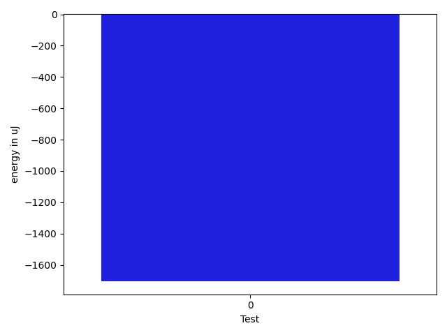

# gson 3090a7

https://github.com/google/gson/commit/3090a7

## Delta Energy per test method

| ID | EnergyV1 | EnergyV2 | DeltaEnergy | σV1 | σV2 |
| --- | --- | --- | --- | --- | --- |
| 0 | 38882.343434343435 | 37179.58585858586 | -1702.757575757576 | 13014.80064470627 | 12604.984741102877 |

## Delta Duration per test method

| ID | DurationV1 | DurationsV2 | DeltaDuration |
| --- | --- | --- | --- |
| 0 | 2345428.717171717 | 2324623.525252525 | -20805.19191919174 |

## Misc.

| ID | Test Class | Test Method |
| --- | --- | --- |
| 0 | com.google.gson.JsonArrayTest | testDeepCopy |

| Test | IterationV1 | IterationV2 | DeltaIteration |
| --- | --- | --- | --- |
| 0 | 99 | 99 | 0 |

| Time Label | Time (s) |
| --- | --- |
| Selection | 34.81734561920166 |
| Injection | 13.491726875305176 |
| Total | 1357.673492193222 |

