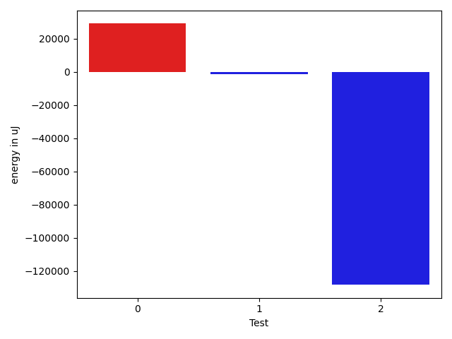

# gson c13fc5

https://github.com/google/gson/commit/c13fc5

## Delta Energy per test method

| ID | EnergyV1 | EnergyV2 | DeltaEnergy | σV1 | σV2 |
| --- | --- | --- | --- | --- | --- |
| 0 | 46142 | 75134 | 28992 | 34931.75772973808 | 33851.3514832126 |
| 1 | 216674 | 215454 | -1220 | 107133.59264789567 | 91194.24055792336 |
| 2 | 167297 | 39062 | -128235 | 119290.16549736203 | 106021.02470616899 |

## Delta Duration per test method

| ID | DurationV1 | DurationsV2 | DeltaDuration |
| --- | --- | --- | --- |
| 0 | 2315300.3513513515 | 2578021.325 | 262720.9736486487 |
| 1 | 6098912.607594937 | 6538013.153846154 | 439100.5462512169 |
| 2 | 4776749.507042253 | 3752209.2875 | -1024540.2195422533 |

## Misc.

| ID | Test Class | Test Method |
| --- | --- | --- |
| 0 | com.google.gson.JsonObjectTest | testAddingAndRemovingObjectProperties |
| 1 | com.google.gson.functional.JsonTreeTest | testToJsonTree |
| 2 | com.google.gson.functional.JsonTreeTest | testToJsonTreeObjectType |

| Test | IterationV1 | IterationV2 | DeltaIteration |
| --- | --- | --- | --- |
| 0 | 37 | 40 | 3 |
| 1 | 79 | 78 | -1 |
| 2 | 71 | 80 | 9 |

| Time Label | Time (s) |
| --- | --- |
| Selection | 23.431724309921265 |
| Injection | 8.734557628631592 |
| Total | 941.335063457489 |

