# gson b7cbfc

https://github.com/google/gson/commit/b7cbfc

## Delta Energy per test method

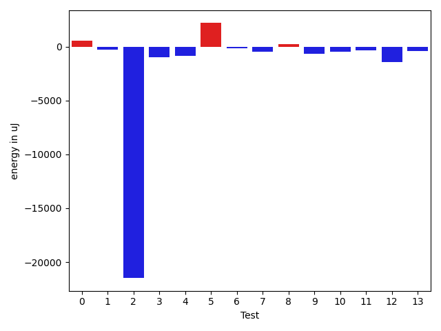

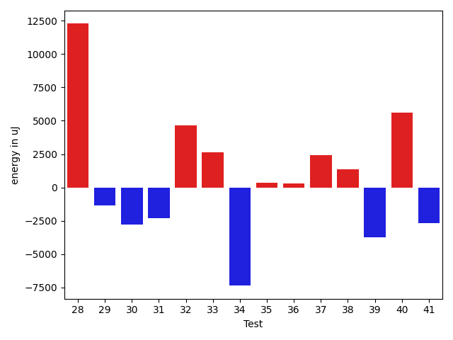

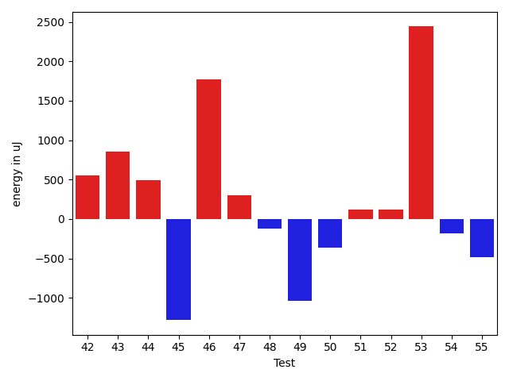

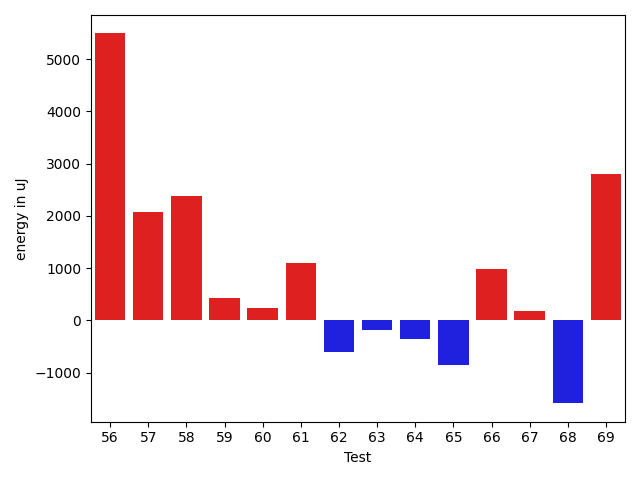

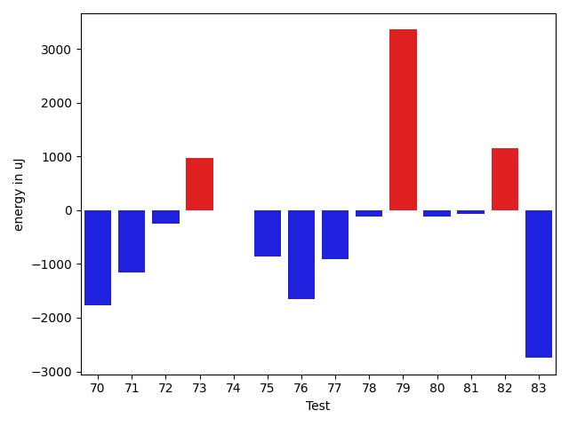

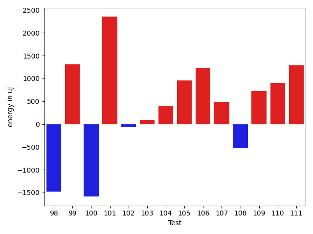

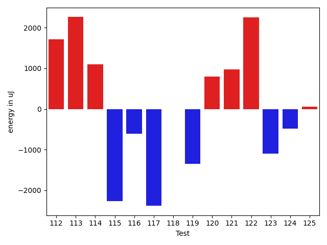

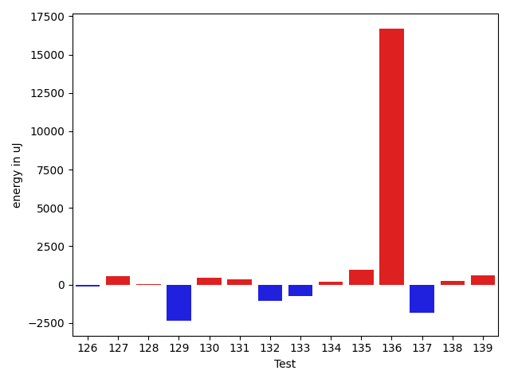

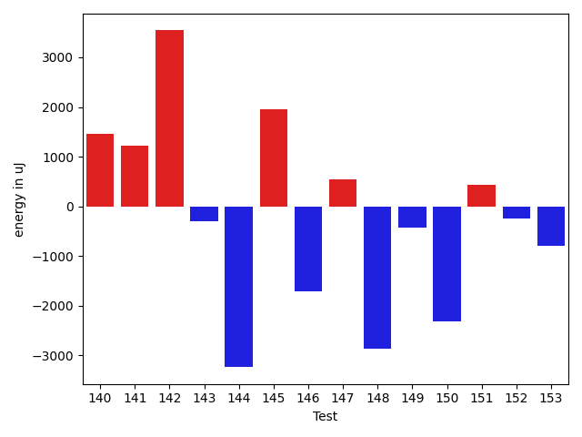

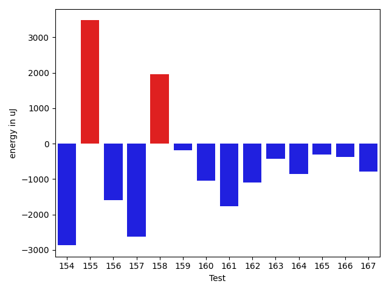

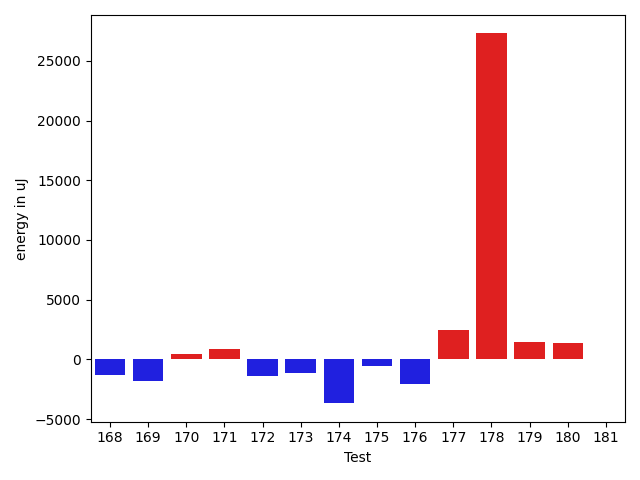

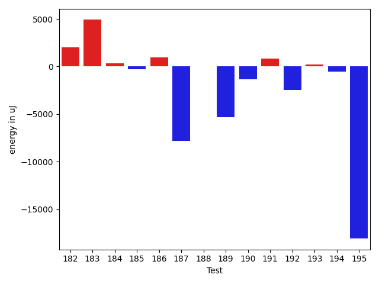

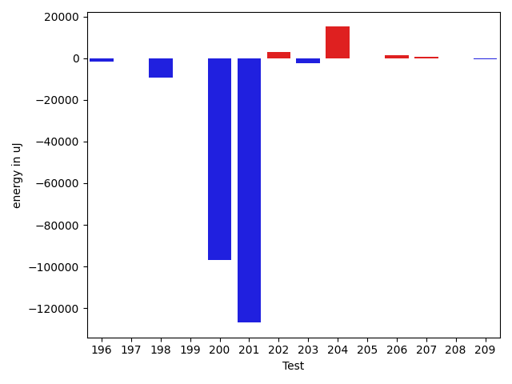

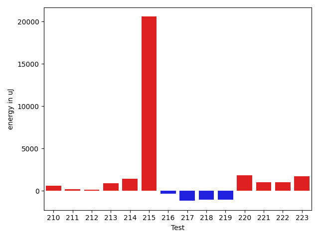

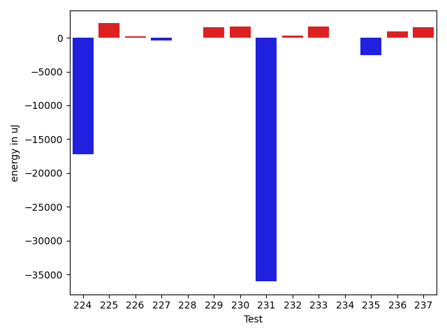

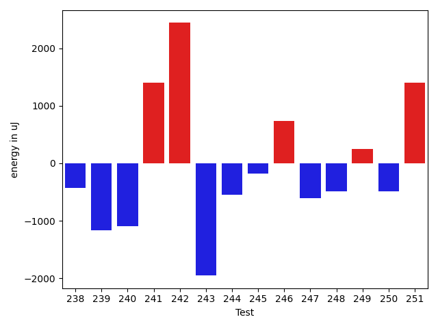

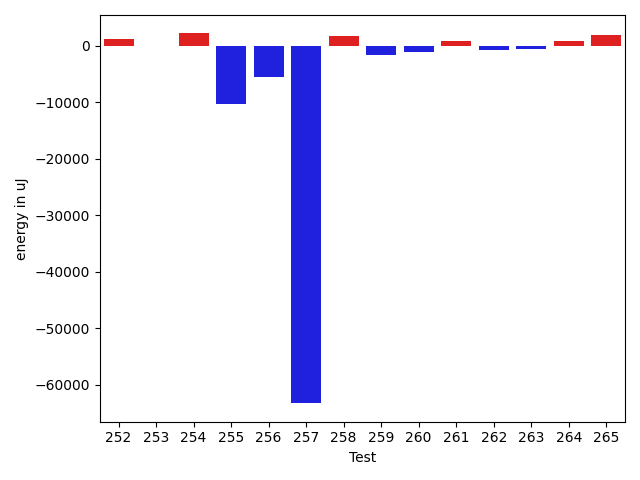

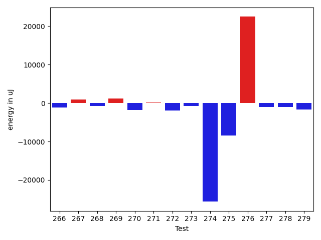

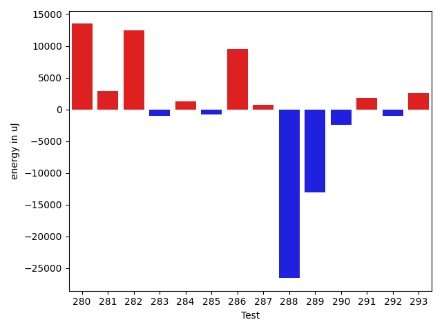

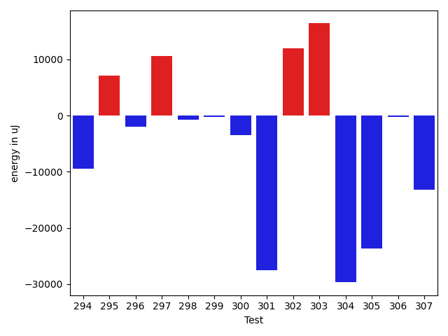

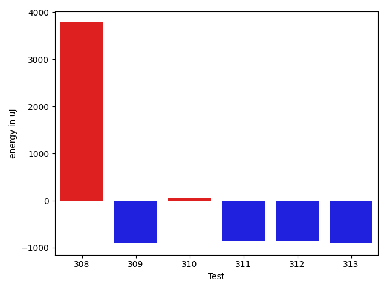

| ID | EnergyV1 | EnergyV2 | DeltaEnergy | σV1 | σV2 |
| --- | --- | --- | --- | --- | --- |
| 0 | 34729 | 35278 | 549 | 8371.52106429186 | 10821.565762019594 |
| 1 | 34546 | 34302 | -244 | 6814.344745400808 | 66853.56823939244 |
| 2 | 59448 | 37963 | -21485 | 39155.16487385496 | 29474.624276170674 |
| 3 | 34973 | 33996 | -977 | 5971.020817307901 | 3888.477585392356 |
| 4 | 38025 | 37171 | -854 | 17039.560479841395 | 16353.665698816982 |
| 5 | 33203 | 35400 | 2197 | 3485.041251785119 | 3875.6102808384685 |
| 6 | 35218 | 35095 | -123 | 12195.83732354984 | 10197.813114520079 |
| 7 | 35705 | 35217 | -488 | 29656.37591245876 | 28541.547430337847 |
| 8 | 34119 | 34363 | 244 | 45024.20551187498 | 17284.977789687782 |
| 9 | 35218 | 34545 | -673 | 3197.9973485343353 | 3071.3011761824896 |
| 10 | 33447 | 32959 | -488 | 3934.7095236171954 | 3322.7117109291285 |
| 11 | 33935 | 33630 | -305 | 6937.1302998164065 | 3719.3293908363407 |
| 12 | 36133 | 34729 | -1404 | 3769.116112653093 | 4087.3145917337106 |
| 13 | 34607 | 34241 | -366 | 7326.688737716036 | 9077.235952980935 |
| 14 | 34729 | 35278 | 549 | 5778.562525302421 | 18800.7935013136 |
| 15 | 36560 | 35034 | -1526 | 61103.81318281719 | 105609.31092473115 |
| 16 | 75073 | 70557 | -4516 | 40800.89964106994 | 40912.84699367229 |
| 17 | 34851 | 33936 | -915 | 4035.6909418105115 | 5329.336543309263 |
| 18 | 33874 | 34485 | 611 | 3456.6517440894663 | 54019.30311891931 |
| 19 | 36133 | 33508 | -2625 | 3556.389091786215 | 32521.20597039708 |
| 20 | 35278 | 34729 | -549 | 4718.067739411214 | 6018.913316619187 |
| 21 | 34851 | 33935 | -916 | 34878.71538004417 | 30366.5741796338 |
| 22 | 33936 | 35034 | 1098 | 3530.1377580226645 | 4343.551654992932 |
| 23 | 35766 | 34485 | -1281 | 4052.0345121309124 | 5559.907629728037 |
| 24 | 34485 | 34362 | -123 | 3508.3691012206796 | 3000.156606645575 |
| 25 | 33814 | 34302 | 488 | 3896.2472669616495 | 3309.874921062665 |
| 26 | 35522 | 34973 | -549 | 3548.3400588942595 | 2935.1952928556925 |
| 27 | 35156 | 33386 | -1770 | 40868.30298743394 | 4517.8706975619825 |
| 28 | 34485 | 34667 | 182 | 2823.678762559975 | 40205.22728855167 |
| 29 | 37109 | 33081 | -4028 | 35717.20329283535 | 41032.35560186896 |
| 30 | 32837 | 34485 | 1648 | 18042.039746952778 | 3192.965547496559 |
| 31 | 33081 | 35401 | 2320 | 24380.213544621412 | 3275.2809326725956 |
| 32 | 34118 | 35156 | 1038 | 8556.085439469383 | 17528.85705299942 |
| 33 | 32043 | 35888 | 3845 | 2847.687359702801 | 3397.4752367567007 |
| 34 | 34301 | 34912 | 611 | 53550.26222643359 | 4405.744060756241 |
| 35 | 34790 | 34301 | -489 | 4030.532706541479 | 7249.468502059877 |
| 36 | 33447 | 33630 | 183 | 3868.2426190553956 | 3485.81581079744 |
| 37 | 33081 | 34485 | 1404 | 18294.15597960947 | 23466.90238421308 |
| 38 | 33936 | 35156 | 1220 | 3308.9306558234202 | 4004.5955393265062 |
| 39 | 36254 | 32531 | -3723 | 3114.561355611705 | 743.4932682950129 |
| 40 | 35400 | 35583 | 183 | 7303.844323064092 | 44891.7847287942 |
| 41 | 35645 | 34851 | -794 | 8629.308108287427 | 2866.1450277599456 |
| 42 | 33691 | 34241 | 550 | 7745.0075798606085 | 10287.891660223682 |
| 43 | 34241 | 35096 | 855 | 3465.362031592082 | 3165.130035694765 |
| 44 | 33814 | 34302 | 488 | 4556.94894736431 | 3852.1154611514003 |
| 45 | 36560 | 35278 | -1282 | 8664.29448991165 | 23448.727649177723 |
| 46 | 33386 | 35156 | 1770 | 4042.0579370988617 | 3166.2106469673477 |
| 47 | 34912 | 35217 | 305 | 12649.632353847284 | 4704.839386665712 |
| 48 | 34484 | 34363 | -121 | 2947.999370871276 | 7762.104255433717 |
| 49 | 34851 | 33813 | -1038 | 4008.7783240086583 | 4605.909394915044 |
| 50 | 33020 | 32654 | -366 | 2954.9549417735557 | 3228.0108046454543 |
| 51 | 34729 | 34851 | 122 | 3623.1250649988706 | 5003.029773019767 |
| 52 | 33447 | 33570 | 123 | 3344.2774162242117 | 3536.255966834949 |
| 53 | 32715 | 35156 | 2441 | 3177.9452143978638 | 4081.0750725145945 |
| 54 | 32105 | 31922 | -183 | 3615.863161740518 | 3205.517276273465 |
| 55 | 34973 | 34484 | -489 | 3737.178582090602 | 4229.430972265129 |
| 56 | 137268 | 142761 | 5493 | 26854.190791308803 | 28166.612370071707 |
| 57 | 32348 | 34423 | 2075 | 3762.235600656045 | 3595.0673566167175 |
| 58 | 36377 | 38757 | 2380 | 87843.25153802842 | 87265.77861229422 |
| 59 | 36988 | 37415 | 427 | 35963.92405415827 | 50711.631072915334 |
| 60 | 35401 | 35645 | 244 | 6384.153920866771 | 9534.38454724921 |
| 61 | 36255 | 37354 | 1099 | 7224.4079881948055 | 10557.101616977725 |
| 62 | 34241 | 33631 | -610 | 3373.066771383999 | 7634.428580633537 |
| 63 | 33753 | 33569 | -184 | 4661.275566154482 | 5105.997835622001 |
| 64 | 36621 | 36255 | -366 | 3351.309613781428 | 3885.323095388021 |
| 65 | 35522 | 34668 | -854 | 28138.366944657166 | 3254.875255264883 |
| 66 | 31982 | 32959 | 977 | 2963.076801732279 | 3851.0851124338806 |
| 67 | 32715 | 32897 | 182 | 3376.6243375832855 | 3640.3731328220792 |
| 68 | 36194 | 34606 | -1588 | 3065.900717354965 | 4410.867843054119 |
| 69 | 33325 | 36133 | 2808 | 4509.051361584374 | 4626.174509996221 |
| 70 | 36316 | 34546 | -1770 | 2832.426737308879 | 3463.2701595958565 |
| 71 | 34790 | 33630 | -1160 | 5302.605899696866 | 4120.15233778602 |
| 72 | 35583 | 35339 | -244 | 3888.708475080983 | 4536.491336232201 |
| 73 | 32715 | 33691 | 976 | 5089.563323159644 | 4919.657627676313 |
| 74 | 34851 | 34851 | 0 | 13244.814249750618 | 15657.643599998444 |
| 75 | 33691 | 32837 | -854 | 3147.2323563292716 | 3668.4249205042406 |
| 76 | 33936 | 32287 | -1649 | 3245.3926104856723 | 3025.317614179818 |
| 77 | 35096 | 34179 | -917 | 3798.7265185361475 | 4640.745711762893 |
| 78 | 35949 | 35827 | -122 | 2837.4779269889627 | 4673.275078484431 |
| 79 | 34851 | 38208 | 3357 | 2711.670732223955 | 4150.343897178131 |
| 80 | 32898 | 32776 | -122 | 3999.6268116729416 | 3065.7019381103137 |
| 81 | 35705 | 35644 | -61 | 3414.2629738086944 | 3577.098410165854 |
| 82 | 36499 | 37658 | 1159 | 40524.18678310298 | 29177.466274188475 |
| 83 | 39429 | 36682 | -2747 | 4465.058050581395 | 3492.9152317693784 |
| 84 | 37598 | 36743 | -855 | 40815.29573479001 | 4324.28061755652 |
| 85 | 38147 | 37231 | -916 | 4608.044137074944 | 4923.632672123297 |
| 86 | 37171 | 32165 | -5006 | 3967.054679280633 | 4843.909442935326 |
| 87 | 34057 | 34057 | 0 | 4264.891095790948 | 3698.877303717775 |
| 88 | 33386 | 36987 | 3601 | 3536.8745015436184 | 4429.25292307825 |
| 89 | 35706 | 35705 | -1 | 4015.7313338081667 | 3802.7755016655997 |
| 90 | 34851 | 36133 | 1282 | 4696.610196710362 | 4452.678181443164 |
| 91 | 35889 | 38208 | 2319 | 41324.40439434669 | 44707.654118450984 |
| 92 | 39062 | 34790 | -4272 | 4144.265036635272 | 2530.424807550437 |
| 93 | 35522 | 35523 | 1 | 3724.463800334217 | 4247.707823151806 |
| 94 | 35827 | 39306 | 3479 | 4735.272761679099 | 4331.866894698916 |
| 95 | 34728 | 36255 | 1527 | 3757.9288945360436 | 3983.8753930689145 |
| 96 | 37231 | 37476 | 245 | 4660.060067247754 | 3079.9322947103883 |
| 97 | 37842 | 34912 | -2930 | 10449.170497048504 | 9799.71328968353 |
| 98 | 34484 | 33325 | -1159 | 4049.4815905673345 | 4130.701823607649 |
| 99 | 35583 | 37476 | 1893 | 4064.2875778303537 | 3150.0142499912486 |
| 100 | 35949 | 35217 | -732 | 3128.352722099036 | 3612.4824720835827 |
| 101 | 32532 | 35950 | 3418 | 3713.9213094861816 | 3665.1299856395744 |
| 102 | 33264 | 33630 | 366 | 3639.700257842965 | 3888.565292205601 |
| 103 | 34057 | 32288 | -1769 | 3511.9642691487875 | 2573.1636635996206 |
| 104 | 34424 | 34607 | 183 | 3862.1511613122348 | 4258.035534564049 |
| 105 | 32105 | 34180 | 2075 | 2572.5529414112425 | 3070.155276665906 |
| 106 | 32958 | 33813 | 855 | 3686.461669406045 | 3936.8705298956675 |
| 107 | 33325 | 33509 | 184 | 4607.146100353233 | 3927.6221304309943 |
| 108 | 32715 | 34180 | 1465 | 4296.981223939533 | 3864.122668635649 |
| 109 | 32226 | 32837 | 611 | 3922.470315659391 | 3500.6597559992497 |
| 110 | 33142 | 33874 | 732 | 2955.3300916508947 | 3802.772901422844 |
| 111 | 33386 | 34119 | 733 | 3565.3697829672765 | 3938.080077184946 |
| 112 | 32226 | 33935 | 1709 | 5280.0051877078895 | 4063.0269984335573 |
| 113 | 30700 | 32959 | 2259 | 3659.466787438758 | 3997.835229413783 |
| 114 | 34546 | 35644 | 1098 | 3787.1446177239595 | 4158.733142135956 |
| 115 | 35889 | 33630 | -2259 | 4629.212675222274 | 3670.471112214343 |
| 116 | 34424 | 33813 | -611 | 3850.424026974172 | 3303.304657460465 |
| 117 | 35706 | 33325 | -2381 | 28979.857119970024 | 4629.406825781652 |
| 118 | 33570 | 33569 | -1 | 4136.78461654847 | 4144.214296990684 |
| 119 | 34973 | 33630 | -1343 | 3157.7887077021715 | 3606.4828394038045 |
| 120 | 34546 | 35339 | 793 | 3292.8384857149726 | 5467.558353053525 |
| 121 | 34912 | 35888 | 976 | 3907.30056410111 | 4242.481183877609 |
| 122 | 58472 | 60730 | 2258 | 23704.842163051977 | 21420.180152834684 |
| 123 | 34546 | 33447 | -1099 | 3650.026404950509 | 4074.042363556791 |
| 124 | 33569 | 33081 | -488 | 3165.9906423582493 | 3495.276562653248 |
| 125 | 35584 | 35644 | 60 | 3922.945611747284 | 4189.206159514423 |
| 126 | 31494 | 32532 | 1038 | 3682.785641331843 | 3274.0575266021215 |
| 127 | 35095 | 35950 | 855 | 4327.7087678116795 | 4941.184243427885 |
| 128 | 36560 | 35767 | -793 | 4194.242738843777 | 4192.129591932429 |
| 129 | 34424 | 32288 | -2136 | 3408.265494143822 | 3068.320756587571 |
| 130 | 32898 | 32227 | -671 | 3426.4818400219197 | 3644.517683854613 |
| 131 | 34362 | 36438 | 2076 | 5338.957760341085 | 3633.6214050937606 |
| 132 | 36072 | 36682 | 610 | 10662.983413845799 | 6485.286074758045 |
| 133 | 33081 | 32166 | -915 | 2986.670688654699 | 3534.808097199007 |
| 134 | 33080 | 34424 | 1344 | 4351.275697299106 | 4258.6272516131085 |
| 135 | 30395 | 30762 | 367 | 1474.1449349559216 | 3279.6094321886612 |
| 136 | 38086 | 37842 | -244 | 38759.19594838593 | 71586.29854443712 |
| 137 | 36621 | 34912 | -1709 | 4801.929274035017 | 3809.057474000187 |
| 138 | 34058 | 34484 | 426 | 4456.160096490649 | 3161.4564061559813 |
| 139 | 32349 | 33630 | 1281 | 3423.8862663544414 | 3136.15607763878 |
| 140 | 32409 | 33874 | 1465 | 2528.9222562968107 | 55252.81899034804 |
| 141 | 32104 | 33326 | 1222 | 4942.484458296112 | 3910.5886850823545 |
| 142 | 30212 | 33752 | 3540 | 4721.408311557521 | 4798.308772126316 |
| 143 | 33081 | 32776 | -305 | 2681.159126753908 | 2885.0228123186903 |
| 144 | 39001 | 35767 | -3234 | 5275.452507605391 | 37816.57964639774 |
| 145 | 32165 | 34119 | 1954 | 3476.3069963454373 | 4062.0020743558225 |
| 146 | 34668 | 32959 | -1709 | 4004.672368697875 | 3422.6089688782963 |
| 147 | 33386 | 33936 | 550 | 3865.5440127145416 | 4079.1080561659005 |
| 148 | 36682 | 33813 | -2869 | 3153.824425667432 | 5039.772781719234 |
| 149 | 35401 | 34973 | -428 | 30717.01342675383 | 4035.797148953351 |
| 150 | 36865 | 34546 | -2319 | 4585.178938425037 | 4267.4487413441775 |
| 151 | 32104 | 32531 | 427 | 3942.6969945664273 | 3777.4816276853026 |
| 152 | 32532 | 32287 | -245 | 4232.463272630569 | 3846.9583068761935 |
| 153 | 33691 | 32897 | -794 | 2557.490827614702 | 4528.350345784507 |
| 154 | 35095 | 32227 | -2868 | 4972.7423649430275 | 3624.7319117555116 |
| 155 | 32592 | 36072 | 3480 | 2895.4435067173586 | 2522.529769471477 |
| 156 | 33691 | 32104 | -1587 | 3603.752634859174 | 4171.468795247331 |
| 157 | 36743 | 34118 | -2625 | 3636.7093295313 | 2937.546162113109 |
| 158 | 31677 | 33630 | 1953 | 3747.902178131402 | 2390.6941771980973 |
| 159 | 31922 | 31738 | -184 | 3458.403645215901 | 2616.244003815393 |
| 160 | 34240 | 33204 | -1036 | 3786.260911506232 | 3817.190305741504 |
| 161 | 35034 | 33264 | -1770 | 32251.88288515502 | 3785.2774923217385 |
| 162 | 35095 | 33997 | -1098 | 4024.1546831080245 | 3793.75873343311 |
| 163 | 33447 | 33020 | -427 | 3626.9057017794103 | 3352.07887750578 |
| 164 | 34119 | 33265 | -854 | 3030.7487374776256 | 3425.5167141619336 |
| 165 | 37109 | 36805 | -304 | 22854.231273662634 | 21596.93071267682 |
| 166 | 35279 | 34912 | -367 | 3903.074124569259 | 4192.89616481125 |
| 167 | 35340 | 34546 | -794 | 4260.920733912551 | 3402.170760688712 |
| 168 | 36865 | 35584 | -1281 | 11626.075534309583 | 11552.304956437802 |
| 169 | 39368 | 37597 | -1771 | 51197.0434389754 | 50496.681138363885 |
| 170 | 35706 | 36133 | 427 | 4714.354386339661 | 3497.7818759279776 |
| 171 | 35949 | 36865 | 916 | 4256.838939828142 | 3746.444413962869 |
| 172 | 34729 | 33386 | -1343 | 3909.3849105323748 | 3335.658077684895 |
| 173 | 36011 | 34851 | -1160 | 4215.525343599809 | 3730.7860428052004 |
| 174 | 37048 | 33386 | -3662 | 3591.7429683957625 | 3235.3426592014916 |
| 175 | 36194 | 35645 | -549 | 3617.4250369012484 | 3555.285369832052 |
| 176 | 37720 | 35644 | -2076 | 7257.415146808115 | 4143.961155514124 |
| 177 | 35828 | 38330 | 2502 | 5306.073481700934 | 4427.485779637116 |
| 178 | 126037 | 153320 | 27283 | 113036.60118667575 | 93276.29508729602 |
| 179 | 37049 | 38513 | 1464 | 46502.83373327577 | 44492.09038621657 |
| 180 | 35583 | 36987 | 1404 | 3889.8786911961956 | 7760.769212137501 |
| 181 | 37293 | 37353 | 60 | 35526.02653443574 | 22864.438073602367 |
| 182 | 37475 | 37720 | 245 | 4612.706538397495 | 15888.072530222902 |
| 183 | 36621 | 36560 | -61 | 3995.3136768195645 | 33828.23073937046 |
| 184 | 36133 | 35156 | -977 | 4454.697055847345 | 4153.627308461847 |
| 185 | 36560 | 36866 | 306 | 3840.7760198666374 | 4666.439323908415 |
| 186 | 36682 | 37292 | 610 | 5032.892361182661 | 4970.4655146272535 |
| 187 | 37170 | 37598 | 428 | 407606.3816255743 | 384867.4334776072 |
| 188 | 36011 | 36133 | 122 | 3965.2089644163634 | 4977.079742178138 |
| 189 | 38269 | 35645 | -2624 | 16200.76900690918 | 6868.356105597151 |
| 190 | 36255 | 34301 | -1954 | 4033.929178158685 | 3247.6165097389385 |
| 191 | 35279 | 35400 | 121 | 5440.858402351796 | 4100.173171454692 |
| 192 | 36254 | 36377 | 123 | 25562.548608118675 | 21872.81958494751 |
| 193 | 34973 | 35462 | 489 | 4575.217970829899 | 4560.986351535037 |
| 194 | 35278 | 35888 | 610 | 9204.583440949542 | 6529.235057249668 |
| 195 | 39978 | 37719 | -2259 | 63680.27394853135 | 47414.755821267296 |
| 196 | 35950 | 35339 | -611 | 4842.274797328407 | 3790.3366246805917 |
| 197 | 34729 | 34912 | 183 | 3514.425991075848 | 4100.442353974006 |
| 198 | 36988 | 36804 | -184 | 31995.52687625082 | 27314.97147830984 |
| 199 | 35827 | 35217 | -610 | 4238.9297045362755 | 4234.817511611682 |
| 200 | 36316 | 36560 | 244 | 429823.7246014958 | 309068.2188540124 |
| 201 | 38514 | 37842 | -672 | 641098.4601312149 | 427049.8818205698 |
| 202 | 36499 | 36438 | -61 | 6320.037657408324 | 11787.747323577332 |
| 203 | 36255 | 36316 | 61 | 10936.274794609448 | 4557.2686990511365 |
| 204 | 114929 | 123657 | 8728 | 47520.69447308827 | 66740.65666289299 |
| 205 | 36499 | 35584 | -915 | 8158.409189944225 | 9121.38059509694 |
| 206 | 70617 | 72693 | 2076 | 30233.548896786808 | 25497.29314848551 |
| 207 | 36621 | 36316 | -305 | 9062.955523230163 | 10766.09578401482 |
| 208 | 61462 | 65246 | 3784 | 22655.69107082689 | 20548.989856383283 |
| 209 | 72143 | 72204 | 61 | 46857.60943849115 | 45991.36101017902 |
| 210 | 35827 | 36437 | 610 | 11492.04779108237 | 10328.896030884087 |
| 211 | 35156 | 35339 | 183 | 5734.383169103128 | 3410.0413796958974 |
| 212 | 35156 | 35278 | 122 | 4777.18399845157 | 7356.711849927631 |
| 213 | 35584 | 36499 | 915 | 4592.774932923182 | 4058.0787577854594 |
| 214 | 74645 | 76110 | 1465 | 33535.16183978617 | 34290.544885246265 |
| 215 | 81787 | 102355 | 20568 | 203660.73655191553 | 347437.0737059501 |
| 216 | 35889 | 35584 | -305 | 3689.525327952556 | 4169.643844214995 |
| 217 | 35400 | 34240 | -1160 | 4071.1139092232834 | 3956.926588984467 |
| 218 | 36560 | 35522 | -1038 | 50776.70376055051 | 62341.164514655866 |
| 219 | 36315 | 35278 | -1037 | 3581.357883632609 | 4010.4916603858796 |
| 220 | 34851 | 36682 | 1831 | 4133.502889801821 | 4168.404154871155 |
| 221 | 37658 | 38696 | 1038 | 87445.00344890646 | 63756.95476618171 |
| 222 | 35461 | 36499 | 1038 | 35578.36188800145 | 36226.16994235054 |
| 223 | 33996 | 35705 | 1709 | 4182.460646300362 | 4018.629008754105 |
| 224 | 40588 | 37597 | -2991 | 82095.69038120755 | 81149.05018838227 |
| 225 | 34851 | 36987 | 2136 | 3754.024182437677 | 3770.7740807912833 |
| 226 | 34851 | 34790 | -61 | 3390.994617475334 | 3207.731423578531 |
| 227 | 33691 | 34729 | 1038 | 4861.197469709102 | 3960.2824655699237 |
| 228 | 36071 | 36011 | -60 | 4636.704927801638 | 4505.592446813892 |
| 229 | 34180 | 37170 | 2990 | 4734.8124075983615 | 4094.6689189182994 |
| 230 | 35706 | 35706 | 0 | 3682.5301343250912 | 7486.557076106559 |
| 231 | 192932 | 165099 | -27833 | 261582.56503499826 | 212108.6068138505 |
| 232 | 34668 | 35583 | 915 | 3853.9975996274156 | 4573.810969335077 |
| 233 | 36072 | 35766 | -306 | 4314.282538905553 | 21733.86901905871 |
| 234 | 35461 | 35339 | -122 | 3938.9938847555372 | 3641.393372568663 |
| 235 | 37902 | 36804 | -1098 | 28829.883261020703 | 27677.004322993173 |
| 236 | 35217 | 35949 | 732 | 4330.461051272684 | 3856.024133165605 |
| 237 | 33936 | 36194 | 2258 | 3798.256309309699 | 4505.346882384556 |
| 238 | 34484 | 34057 | -427 | 3610.5137904895028 | 3120.980399224537 |
| 239 | 37658 | 36498 | -1160 | 61684.14600755023 | 40960.68752218132 |
| 240 | 35095 | 33997 | -1098 | 5310.883305917534 | 8102.936608572209 |
| 241 | 36194 | 37598 | 1404 | 252477.21044682237 | 295943.9675432884 |
| 242 | 67077 | 69519 | 2442 | 22624.991725125194 | 29681.063098890827 |
| 243 | 37841 | 35889 | -1952 | 29464.476020148435 | 31340.90589969176 |
| 244 | 34180 | 33630 | -550 | 47479.58710815401 | 38445.01805898378 |
| 245 | 34912 | 34729 | -183 | 4012.9103131710926 | 4468.725300193977 |
| 246 | 34607 | 35339 | 732 | 4339.138074094795 | 24540.93746924719 |
| 247 | 36011 | 35400 | -611 | 4285.382742255743 | 4295.275946618565 |
| 248 | 36254 | 35767 | -487 | 16027.069059213303 | 16362.049112220835 |
| 249 | 34851 | 35095 | 244 | 4324.657048029273 | 4361.936114794795 |
| 250 | 36377 | 35889 | -488 | 270379.08789046766 | 199634.78158990986 |
| 251 | 35278 | 36682 | 1404 | 43157.687910018074 | 54575.36613535726 |
| 252 | 32531 | 35217 | 2686 | 4492.814399580839 | 3732.439823999916 |
| 253 | 35218 | 34546 | -672 | 4280.843508281983 | 4569.19939231532 |
| 254 | 37903 | 40710 | 2807 | 4605.782815581654 | 5364.561256265252 |
| 255 | 38696 | 38330 | -366 | 75671.35996354042 | 55080.33714933465 |
| 256 | 37049 | 37048 | -1 | 285796.5176117149 | 221941.42565463725 |
| 257 | 40527 | 38025 | -2502 | 472798.9412814662 | 405523.31305992603 |
| 258 | 36743 | 37293 | 550 | 4535.375378077233 | 13382.678103958884 |
| 259 | 36560 | 35644 | -916 | 4345.202205574976 | 4741.002902913276 |
| 260 | 36865 | 35400 | -1465 | 4195.965282253482 | 4215.073895185166 |
| 261 | 38086 | 37354 | -732 | 18530.17061933428 | 18479.172706351146 |
| 262 | 35583 | 34424 | -1159 | 4544.82374183807 | 3721.223411232367 |
| 263 | 35279 | 34485 | -794 | 3991.956864620108 | 3512.912505081549 |
| 264 | 35156 | 34485 | -671 | 4392.54929317881 | 8052.6197544477545 |
| 265 | 35278 | 34667 | -611 | 6945.372283626893 | 16903.879357380923 |
| 266 | 36255 | 35095 | -1160 | 4018.8059148070884 | 5033.0531399078045 |
| 267 | 35827 | 36804 | 977 | 26638.40434640457 | 31794.315086435032 |
| 268 | 38147 | 37354 | -793 | 55736.964631867275 | 53255.09652589288 |
| 269 | 34912 | 36071 | 1159 | 5186.177118267445 | 1595.5787264256885 |
| 270 | 36316 | 34546 | -1770 | 5087.218507090972 | 4629.721135517026 |
| 271 | 35766 | 35949 | 183 | 4944.895598772397 | 4037.1540973259316 |
| 272 | 36621 | 34729 | -1892 | 4662.024177639177 | 5047.140960312471 |
| 273 | 38269 | 37537 | -732 | 56238.22152969345 | 41237.005253097625 |
| 274 | 268859 | 243225 | -25634 | 103457.22390754375 | 101106.86813290947 |
| 275 | 392272 | 383789 | -8483 | 108324.97100497586 | 99118.74348340482 |
| 276 | 42115 | 64575 | 22460 | 57817.03976788037 | 52373.63401779347 |
| 277 | 38330 | 37293 | -1037 | 35148.64515980434 | 46490.24764161714 |
| 278 | 64880 | 63842 | -1038 | 21808.176334738215 | 30410.0184836897 |
| 279 | 39063 | 37414 | -1649 | 20790.708682833276 | 22157.91704500116 |
| 280 | 36133 | 39429 | 3296 | 25375.04419889083 | 29801.157550894965 |
| 281 | 36926 | 36682 | -244 | 7461.947424055935 | 17205.610879871896 |
| 282 | 45776 | 60974 | 15198 | 58448.8474851037 | 78246.0761963268 |
| 283 | 36804 | 36133 | -671 | 3653.8406946172277 | 3620.902663530937 |
| 284 | 36926 | 37292 | 366 | 4339.335728233858 | 4064.7104180251144 |
| 285 | 36743 | 35767 | -976 | 3468.47571997689 | 3463.551802905905 |
| 286 | 36010 | 38086 | 2076 | 52636.55311519637 | 55614.52743152727 |
| 287 | 36804 | 37536 | 732 | 3449.7071480090585 | 4235.840178221093 |
| 288 | 37903 | 36926 | -977 | 79836.15078427558 | 3397.234196740048 |
| 289 | 39246 | 39428 | 182 | 115300.87281413189 | 106172.86602985757 |
| 290 | 36682 | 36316 | -366 | 11412.503280157198 | 8815.554246599615 |
| 291 | 36010 | 36865 | 855 | 6896.191737716385 | 10095.103859353276 |
| 292 | 37049 | 34424 | -2625 | 4517.816885070133 | 4145.261342500993 |
| 293 | 36987 | 38086 | 1099 | 51980.25815649536 | 47793.118076478575 |
| 294 | 37720 | 37598 | -122 | 48008.96294072668 | 46179.79924503976 |
| 295 | 32593 | 35645 | 3052 | 3679.8365134547826 | 29560.978543548732 |
| 296 | 36743 | 35583 | -1160 | 15684.36341533822 | 13531.518510529571 |
| 297 | 38513 | 38147 | -366 | 78608.9762655145 | 83777.58915300017 |
| 298 | 36743 | 36377 | -366 | 4503.431466735776 | 2687.771331287307 |
| 299 | 36926 | 36377 | -549 | 4220.140424880136 | 5342.171042230344 |
| 300 | 40344 | 34912 | -5432 | 6979.584576418212 | 4707.279172489797 |
| 301 | 38696 | 37414 | -1282 | 113661.13977933487 | 77733.09360108832 |
| 302 | 35889 | 37476 | 1587 | 4541.640821557867 | 53882.453662499065 |
| 303 | 37475 | 40039 | 2564 | 527573.0227083198 | 519826.49256719626 |
| 304 | 39428 | 36438 | -2990 | 137147.50746380494 | 82269.83845063907 |
| 305 | 38269 | 34301 | -3968 | 89549.82599239767 | 3512.117564516064 |
| 306 | 36988 | 36438 | -550 | 4115.541990951701 | 4696.263896261935 |
| 307 | 36438 | 36560 | 122 | 78726.67916000554 | 59671.798545153746 |
| 308 | 37170 | 40955 | 3785 | 84134.58384781814 | 144513.9177786979 |
| 309 | 35889 | 34973 | -916 | 4387.16337245346 | 58493.90433807801 |
| 310 | 36011 | 36071 | 60 | 243879.55406039165 | 642611.200278415 |
| 311 | 37109 | 36255 | -854 | 16104.393134289947 | 10977.66666167715 |
| 312 | 38696 | 37842 | -854 | 63032.7006231664 | 57123.91443096897 |
| 313 | 37658 | 36743 | -915 | 160751.1493053875 | 136293.0548709881 |

## Delta Duration per test method

| ID | DurationV1 | DurationsV2 | DeltaDuration |
| --- | --- | --- | --- |
| 0 | 991857.2894736842 | 1011863.0588235294 | 20005.769349845243 |
| 1 | 631906.3846153846 | 913533.7058823529 | 281627.32126696827 |
| 2 | 2057237.8333333333 | 1760130.9425287356 | -297106.89080459764 |
| 3 | 788491.9574468085 | 712005.7222222222 | -76486.23522458621 |
| 4 | 1411422.5 | 1347078.8651685393 | -64343.63483146066 |
| 5 | 671344.2380952381 | 631259.1891891892 | -40085.048906048876 |
| 6 | 1063928.0294117648 | 873585.0545454546 | -190342.97486631025 |
| 7 | 1363647.1609195403 | 1291807.445945946 | -71839.7149735943 |
| 8 | 893844.7659574468 | 729598.05 | -164246.71595744672 |
| 9 | 760282.8541666666 | 772516.1578947369 | 12233.303728070226 |
| 10 | 688145.7924528302 | 667050.3095238095 | -21095.48292902077 |
| 11 | 893788.859375 | 875613.9848484849 | -18174.874526515137 |
| 12 | 648346.0681818182 | 587303.3823529412 | -61042.68582887703 |
| 13 | 989467.8472222222 | 991989.6885245901 | 2521.8413023678586 |
| 14 | 1052296.87012987 | 1083396.4054054054 | 31099.535275535425 |
| 15 | 1323341.6956521738 | 2097932.088235294 | 774590.3925831201 |
| 16 | 2730435.1919191917 | 2464839.8282828284 | -265595.3636363633 |
| 17 | 881998.8823529412 | 856226.5319148937 | -25772.35043804755 |
| 18 | 890897.7580645161 | 1213449.2608695652 | 322551.50280504907 |
| 19 | 700060.8275862068 | 786075.6129032258 | 86014.78531701898 |
| 20 | 642926.4722222222 | 684300.8823529412 | 41374.410130718956 |
| 21 | 742742.9615384615 | 764304.0 | 21561.038461538497 |
| 22 | 593584.9333333333 | 561332.1785714285 | -32252.754761904827 |
| 23 | 621902.625 | 572500.4736842106 | -49402.15131578944 |
| 24 | 453440.12 | 457243.5238095238 | 3803.403809523792 |
| 25 | 552020.1071428572 | 510067.73529411765 | -41952.37184873951 |
| 26 | 426840.0909090909 | 458802.2631578947 | 31962.172248803836 |
| 27 | 746841.2222222222 | 510142.7368421053 | -236698.48538011697 |
| 28 | 510925.3181818182 | 720707.3157894737 | 209781.99760765553 |
| 29 | 761332.8333333334 | 712081.7368421053 | -49251.09649122809 |
| 30 | 674468.3913043478 | 516338.15 | -158130.24130434776 |
| 31 | 676064.6279069767 | 583752.8518518518 | -92311.77605512494 |
| 32 | 607029.65 | 715982.5789473684 | 108952.9289473684 |
| 33 | 569599.8888888889 | 533122.5416666666 | -36477.34722222225 |
| 34 | 928842.4117647059 | 606162.6222222223 | -322679.78954248363 |
| 35 | 808276.1568627451 | 788027.5476190476 | -20248.609243697487 |
| 36 | 653298.4166666666 | 565448.5483870967 | -87849.8682795699 |
| 37 | 850292.3272727273 | 821341.8085106383 | -28950.518762088963 |
| 38 | 531321.925925926 | 504951.1875 | -26370.738425925956 |
| 39 | 323102.53846153844 | 393109.2 | 70006.66153846157 |
| 40 | 921918.9833333333 | 1129972.7 | 208053.71666666667 |
| 41 | 782371.6571428571 | 637706.8214285715 | -144664.8357142856 |
| 42 | 572855.0 | 570406.125 | -2448.875 |
| 43 | 509703.45 | 645899.6428571428 | 136196.19285714283 |
| 44 | 480012.0 | 457306.9583333333 | -22705.041666666686 |
| 45 | 812705.3469387755 | 967282.4565217391 | 154577.10958296363 |
| 46 | 569757.1538461539 | 610314.5 | 40557.34615384613 |
| 47 | 770825.3 | 633702.7111111111 | -137122.58888888895 |
| 48 | 395511.0588235294 | 492108.6666666667 | 96597.60784313729 |
| 49 | 654358.9375 | 663949.6666666666 | 9590.729166666628 |
| 50 | 645598.6341463415 | 641191.4390243902 | -4407.195121951285 |
| 51 | 465212.8275862069 | 538465.75 | 73252.9224137931 |
| 52 | 945997.698630137 | 1026554.7205882353 | 80557.02195809828 |
| 53 | 584275.5357142857 | 600523.3 | 16247.764285714366 |
| 54 | 629299.6578947369 | 616767.0 | -12532.657894736854 |
| 55 | 910142.1527777778 | 937304.6 | 27162.447222222225 |
| 56 | 4424095.98989899 | 4474131.474747474 | 50035.4848484844 |
| 57 | 633986.6458333334 | 637266.9722222222 | 3280.326388888876 |
| 58 | 1167230.5333333334 | 2010328.2857142857 | 843097.7523809522 |
| 59 | 1048362.7291666666 | 1384053.4905660378 | 335690.7613993712 |
| 60 | 671869.1052631579 | 778738.1951219512 | 106869.0898587933 |
| 61 | 1017253.9024390244 | 1109850.7215189873 | 92596.81907996291 |
| 62 | 699566.3636363636 | 813386.6923076923 | 113820.3286713286 |
| 63 | 555732.0243902439 | 548617.1111111111 | -7114.913279132801 |
| 64 | 386871.0 | 378899.1666666667 | -7971.833333333314 |
| 65 | 600205.0322580645 | 449085.4705882353 | -151119.56166982919 |
| 66 | 463864.15789473685 | 439299.1111111111 | -24565.04678362573 |
| 67 | 579182.3076923077 | 630445.4222222222 | 51263.114529914455 |
| 68 | 408142.2727272727 | 396249.6 | -11892.67272727273 |
| 69 | 377496.4285714286 | 356273.5 | -21222.92857142858 |
| 70 | 322835.1666666667 | 285364.54545454547 | -37470.621212121216 |
| 71 | 464610.95 | 464267.3793103448 | -343.5706896552001 |
| 72 | 532202.9583333334 | 518014.0303030303 | -14188.928030303097 |
| 73 | 551683.448275862 | 593228.0 | 41544.55172413797 |
| 74 | 982844.304347826 | 1071051.7234042552 | 88207.41905642918 |
| 75 | 504660.73913043475 | 517918.19444444444 | 13257.455314009683 |
| 76 | 500724.2068965517 | 491689.74074074073 | -9034.46615581098 |
| 77 | 434408.0588235294 | 430539.4117647059 | -3868.647058823495 |
| 78 | 460218.4736842105 | 490152.04761904763 | 29933.573934837128 |
| 79 | 435482.8 | 474488.25 | 39005.45000000001 |
| 80 | 365857.5714285714 | 375303.6 | 9446.028571428556 |
| 81 | 437369.72222222225 | 412420.94736842107 | -24948.77485380118 |
| 82 | 845982.3636363636 | 941997.4285714285 | 96015.06493506487 |
| 83 | 447201.05555555556 | 391077.5714285714 | -56123.48412698414 |
| 84 | 778757.1428571428 | 375378.25 | -403378.89285714284 |
| 85 | 344676.76923076925 | 376978.5 | 32301.73076923075 |
| 86 | 350363.07692307694 | 354632.0 | 4268.9230769230635 |
| 87 | 458720.0 | 412056.70588235295 | -46663.29411764705 |
| 88 | 346520.0909090909 | 370123.4166666667 | 23603.325757575803 |
| 89 | 472589.0588235294 | 461969.73913043475 | -10619.319693094643 |
| 90 | 319001.9375 | 391514.9 | 72512.96250000002 |
| 91 | 775835.1 | 1031966.9565217391 | 256131.85652173916 |
| 92 | 364504.35714285716 | 386753.6666666667 | 22249.309523809527 |
| 93 | 475732.3 | 399147.0588235294 | -76585.24117647059 |
| 94 | 343100.75 | 372319.63636363635 | 29218.886363636353 |
| 95 | 372711.0416666667 | 390810.25 | 18099.208333333314 |
| 96 | 479315.85714285716 | 417742.9 | -61572.957142857136 |
| 97 | 848186.3333333334 | 577188.36 | -270997.9733333334 |
| 98 | 387100.0625 | 343382.5333333333 | -43717.529166666674 |
| 99 | 439165.78571428574 | 411986.3076923077 | -27179.47802197805 |
| 100 | 615443.8965517242 | 667889.8055555555 | 52445.90900383133 |
| 101 | 447902.5833333333 | 485512.7368421053 | 37610.15350877197 |
| 102 | 342995.1818181818 | 340409.6666666667 | -2585.5151515151374 |
| 103 | 340464.55555555556 | 339791.2727272727 | -673.2828282828559 |
| 104 | 693672.5769230769 | 726687.0588235294 | 33014.48190045252 |
| 105 | 465526.2272727273 | 466258.27777777775 | 732.050505050458 |
| 106 | 422399.0 | 463210.38095238095 | 40811.38095238095 |
| 107 | 454106.85 | 434744.0740740741 | -19362.775925925875 |
| 108 | 490209.1666666667 | 504821.8333333333 | 14612.666666666628 |
| 109 | 437318.6666666667 | 427642.6818181818 | -9675.984848484863 |
| 110 | 448784.48148148146 | 607110.6428571428 | 158326.16137566138 |
| 111 | 792005.6326530612 | 918182.8666666667 | 126177.23401360551 |
| 112 | 366747.3333333333 | 412287.15 | 45539.81666666671 |
| 113 | 392686.03571428574 | 439160.6666666667 | 46474.63095238095 |
| 114 | 500576.4 | 449229.9 | -51346.5 |
| 115 | 456041.0869565217 | 461110.16 | 5069.073043478245 |
| 116 | 487354.95 | 499791.2 | 12436.25 |
| 117 | 663745.6428571428 | 337219.0625 | -326526.58035714284 |
| 118 | 644625.3414634146 | 721293.4358974359 | 76668.09443402127 |
| 119 | 343205.0 | 321840.5263157895 | -21364.473684210505 |
| 120 | 412901.39130434784 | 457061.26086956525 | 44159.86956521741 |
| 121 | 509783.3076923077 | 498162.1 | -11621.207692307711 |
| 122 | 1409022.1363636365 | 1672178.8780487804 | 263156.7416851439 |
| 123 | 558833.1875 | 568739.2894736842 | 9906.101973684155 |
| 124 | 412413.1 | 455964.04761904763 | 43550.947619047656 |
| 125 | 589918.0 | 564581.7037037037 | -25336.296296296292 |
| 126 | 455631.64 | 462544.95 | 6913.309999999998 |
| 127 | 446494.57692307694 | 510615.3 | 64120.72307692305 |
| 128 | 475499.375 | 441609.93333333335 | -33889.44166666665 |
| 129 | 308437.5714285714 | 320026.5714285714 | 11589.0 |
| 130 | 342725.8 | 354108.23076923075 | 11382.430769230763 |
| 131 | 579159.4827586206 | 585936.2 | 6776.717241379316 |
| 132 | 769764.7777777778 | 657968.2777777778 | -111796.5 |
| 133 | 326975.22222222225 | 354200.76923076925 | 27225.547008547 |
| 134 | 421565.3157894737 | 432526.45454545453 | 10961.13875598082 |
| 135 | 326330.7272727273 | 336342.3157894737 | 10011.588516746415 |
| 136 | 892091.7027027027 | 1425051.756097561 | 532960.0533948583 |
| 137 | 451926.61904761905 | 546587.5769230769 | 94660.95787545783 |
| 138 | 423851.8333333333 | 381781.94444444444 | -42069.888888888876 |
| 139 | 427114.25 | 484627.1904761905 | 57512.94047619047 |
| 140 | 380462.63157894736 | 882171.1818181818 | 501708.5502392344 |
| 141 | 367811.8947368421 | 403303.52173913043 | 35491.627002288355 |
| 142 | 384767.3333333333 | 385566.23529411765 | 798.9019607843366 |
| 143 | 428247.82352941175 | 435650.52173913043 | 7402.698209718685 |
| 144 | 355722.1 | 643293.75 | 287571.65 |
| 145 | 503283.57692307694 | 530068.1153846154 | 26784.53846153844 |
| 146 | 322294.28571428574 | 335736.6153846154 | 13442.329670329636 |
| 147 | 522984.6060606061 | 553386.8285714285 | 30402.222510822467 |
| 148 | 424448.0 | 431838.6111111111 | 7390.611111111124 |
| 149 | 705223.0 | 419650.2 | -285572.8 |
| 150 | 521847.25 | 578766.2333333333 | 56918.98333333328 |
| 151 | 395576.275862069 | 447881.25 | 52304.974137931014 |
| 152 | 389337.875 | 419488.8125 | 30150.9375 |
| 153 | 291786.6666666667 | 296363.25 | 4576.583333333314 |
| 154 | 332352.1818181818 | 343091.77777777775 | 10739.595959595928 |
| 155 | 340699.3846153846 | 365893.23076923075 | 25193.846153846127 |
| 156 | 334743.3846153846 | 312428.8333333333 | -22314.55128205131 |
| 157 | 405367.3 | 389395.8181818182 | -15971.481818181812 |
| 158 | 421728.2631578947 | 406316.8 | -15411.46315789473 |
| 159 | 414599.3333333333 | 406720.9166666667 | -7878.416666666628 |
| 160 | 446046.2 | 508171.72222222225 | 62125.52222222224 |
| 161 | 793906.2142857143 | 382307.0714285714 | -411599.1428571429 |
| 162 | 360461.77777777775 | 386859.05 | 26397.272222222236 |
| 163 | 517424.0 | 529775.5357142857 | 12351.535714285681 |
| 164 | 415019.0833333333 | 421755.3157894737 | 6736.232456140395 |
| 165 | 1267910.6923076923 | 1378501.357142857 | 110590.66483516479 |
| 166 | 718357.8333333334 | 699845.6888888889 | -18512.14444444445 |
| 167 | 851994.2962962963 | 863041.5357142857 | 11047.239417989389 |
| 168 | 1308456.5979381443 | 1291849.8842105262 | -16606.713727618102 |
| 169 | 1602566.890625 | 1630777.8709677418 | 28210.980342741823 |
| 170 | 773358.06 | 744178.3090909091 | -29179.750909090973 |
| 171 | 730392.9285714285 | 711801.0277777778 | -18591.90079365077 |
| 172 | 544322.3333333334 | 542435.6071428572 | -1886.7261904762127 |
| 173 | 744300.7142857143 | 726078.6181818182 | -18222.096103896154 |
| 174 | 371155.85714285716 | 398131.85714285716 | 26976.0 |
| 175 | 436780.8 | 454678.05263157893 | 17897.252631578944 |
| 176 | 666001.8409090909 | 692310.2325581395 | 26308.391649048543 |
| 177 | 426386.3888888889 | 515629.26666666666 | 89242.87777777779 |
| 178 | 5050392.469387755 | 5247026.424242424 | 196633.95485466905 |
| 179 | 1384617.1136363635 | 1353369.9574468085 | -31247.15618955507 |
| 180 | 495863.76666666666 | 626827.2702702703 | 130963.50360360363 |
| 181 | 1078449.6 | 1038985.6346153846 | -39463.96538461547 |
| 182 | 639263.84375 | 767366.7380952381 | 128102.8943452381 |
| 183 | 756338.2391304348 | 843375.1702127659 | 87036.93108233111 |
| 184 | 481960.25 | 450136.44 | -31823.809999999998 |
| 185 | 560996.5217391305 | 584209.1428571428 | 23212.62111801235 |
| 186 | 572341.9354838709 | 535717.5925925926 | -36624.34289127833 |
| 187 | 3539210.053333333 | 3287398.6103896103 | -251811.44294372294 |
| 188 | 519351.5294117647 | 448016.95 | -71334.57941176469 |
| 189 | 1010243.4634146341 | 910815.5581395349 | -99427.90527509921 |
| 190 | 499016.68 | 503152.47826086957 | 4135.798260869575 |
| 191 | 688345.3181818182 | 681465.4782608695 | -6879.839920948725 |
| 192 | 1354879.1927710844 | 1261614.2023809524 | -93264.99039013195 |
| 193 | 646636.641025641 | 640402.1333333333 | -6234.5076923076995 |
| 194 | 770141.6486486486 | 613742.9310344828 | -156398.71761416586 |
| 195 | 1611095.15 | 951302.6 | -659792.5499999999 |
| 196 | 511145.7931034483 | 563754.5 | 52608.70689655171 |
| 197 | 497298.13513513515 | 463113.8333333333 | -34184.301801801834 |
| 198 | 1128223.9 | 745559.551724138 | -382664.34827586194 |
| 199 | 684885.46 | 654874.5 | -30010.959999999963 |
| 200 | 5072328.043478261 | 2323551.565217391 | -2748776.4782608696 |
| 201 | 6882819.525641026 | 3256954.986842105 | -3625864.538798921 |
| 202 | 1250087.1595744682 | 1253161.2688172043 | 3074.109242736129 |
| 203 | 1176564.711111111 | 1180339.0909090908 | 3774.3797979797237 |
| 204 | 3716563.948979592 | 4178345.7708333335 | 461781.82185374154 |
| 205 | 1167280.3406593406 | 1189768.393258427 | 22488.052599086426 |
| 206 | 2306356.212121212 | 2387846.232323232 | 81490.02020202018 |
| 207 | 1281829.2258064516 | 1306983.1789473684 | 25153.95314091677 |
| 208 | 1837384.1414141415 | 1879350.2525252525 | 41966.11111111101 |
| 209 | 2648280.525252525 | 2666903.090909091 | 18622.565656565595 |
| 210 | 1196058.9887640448 | 1210564.7272727273 | 14505.738508682465 |
| 211 | 894250.8169014085 | 929902.2741935484 | 35651.45729213988 |
| 212 | 811056.1777777778 | 837568.8103448276 | 26512.63256704982 |
| 213 | 512094.7368421053 | 482156.1111111111 | -29938.625730994157 |
| 214 | 2527021.484848485 | 2654486.3434343436 | 127464.85858585872 |
| 215 | 4218562.191919192 | 5950985.838383839 | 1732423.6464646468 |
| 216 | 757588.0754716981 | 786640.9 | 29052.82452830195 |
| 217 | 564837.4883720931 | 572520.0357142857 | 7682.547342192614 |
| 218 | 1156179.0 | 1502388.9318181819 | 346209.9318181819 |
| 219 | 433327.29411764705 | 325255.05555555556 | -108072.23856209149 |
| 220 | 449461.5 | 473906.0 | 24444.5 |
| 221 | 1898937.914893617 | 1572306.0526315789 | -326631.86226203805 |
| 222 | 1508240.4625 | 1578117.904109589 | 69877.44160958915 |
| 223 | 469995.2727272727 | 468306.2 | -1689.0727272726945 |
| 224 | 2449289.3214285714 | 1840668.8709677418 | -608620.4504608295 |
| 225 | 433394.5263157895 | 470186.78571428574 | 36792.259398496244 |
| 226 | 651330.6086956522 | 673745.8823529412 | 22415.273657288984 |
| 227 | 614871.0370370371 | 551939.5 | -62931.53703703708 |
| 228 | 533978.05 | 486294.52173913043 | -47683.528260869614 |
| 229 | 511480.85714285716 | 496372.36666666664 | -15108.49047619052 |
| 230 | 857249.3859649122 | 894100.6315789474 | 36851.24561403517 |
| 231 | 7338530.070707071 | 6206595.747474748 | -1131934.323232323 |
| 232 | 812434.7045454546 | 744935.2 | -67499.50454545463 |
| 233 | 753522.3965517242 | 800086.98 | 46564.58344827581 |
| 234 | 581894.4516129033 | 534760.8846153846 | -47133.56699751865 |
| 235 | 1195235.5428571429 | 949635.3823529412 | -245600.16050420166 |
| 236 | 869595.8596491228 | 864760.4833333333 | -4835.37631578953 |
| 237 | 512882.65625 | 528379.5 | 15496.84375 |
| 238 | 681979.7941176471 | 593785.125 | -88194.6691176471 |
| 239 | 1327715.7301587302 | 1055973.1666666667 | -271742.56349206343 |
| 240 | 1000155.4035087719 | 922278.5396825396 | -77876.86382623226 |
| 241 | 2493541.0694444445 | 3022567.987012987 | 529026.9175685425 |
| 242 | 2067135.101010101 | 2165740.282828283 | 98605.18181818211 |
| 243 | 1375111.5820895522 | 1401396.12 | 26284.53791044792 |
| 244 | 1098961.5098039217 | 981112.8620689656 | -117848.64773495612 |
| 245 | 1062783.7164179105 | 943758.75 | -119024.96641791053 |
| 246 | 804097.5471698113 | 855026.9137931034 | 50929.366623292095 |
| 247 | 728236.1276595745 | 733685.26 | 5449.132340425509 |
| 248 | 1235337.256097561 | 1244846.9294117647 | 9509.673314203741 |
| 249 | 721743.1063829787 | 733367.1860465116 | 11624.079663532902 |
| 250 | 2836058.6923076925 | 1673039.8205128205 | -1163018.871794872 |
| 251 | 1140764.5714285714 | 1325252.8148148148 | 184488.24338624347 |
| 252 | 439123.22222222225 | 717895.7407407408 | 278772.51851851854 |
| 253 | 443213.2 | 383925.85714285716 | -59287.34285714285 |
| 254 | 443267.85185185185 | 512865.25 | 69597.39814814815 |
| 255 | 1721834.268292683 | 1327808.03125 | -394026.23704268294 |
| 256 | 1808616.465116279 | 1833590.8378378379 | 24974.372721558902 |
| 257 | 6670705.029411765 | 4746713.972222222 | -1923991.0571895428 |
| 258 | 682159.4117647059 | 669859.0 | -12300.411764705903 |
| 259 | 772148.5531914893 | 814779.3555555556 | 42630.80236406624 |
| 260 | 752445.2 | 824621.1304347826 | 72175.93043478264 |
| 261 | 1443171.2580645161 | 1523038.1304347827 | 79866.87237026659 |
| 262 | 656627.625 | 649544.9047619047 | -7082.720238095266 |
| 263 | 648552.3863636364 | 680524.3529411765 | 31971.96657754015 |
| 264 | 805953.4130434783 | 892044.9 | 86091.48695652175 |
| 265 | 919519.4242424242 | 1019391.7833333333 | 99872.35909090913 |
| 266 | 744244.0227272727 | 705851.0666666667 | -38392.956060606055 |
| 267 | 1030044.5365853659 | 1279816.9714285715 | 249772.4348432056 |
| 268 | 1207220.09375 | 1399278.0 | 192057.90625 |
| 269 | 356208.85714285716 | 404872.6666666667 | 48663.80952380953 |
| 270 | 544936.2916666666 | 543322.0571428571 | -1614.234523809515 |
| 271 | 594947.0 | 691029.2 | 96082.19999999995 |
| 272 | 419050.1304347826 | 441324.0416666667 | 22273.911231884093 |
| 273 | 1888455.6966292134 | 1672270.2340425532 | -216185.46258666017 |
| 274 | 8457783.717171717 | 8357926.585858586 | -99857.13131313119 |
| 275 | 10837839.989898989 | 10663534.747474747 | -174305.2424242422 |
| 276 | 2159840.888888889 | 2105299.3333333335 | -54541.555555555504 |
| 277 | 1245520.865671642 | 1462129.7 | 216608.83432835806 |
| 278 | 1965141.4747474748 | 2016961.494949495 | 51820.02020202018 |
| 279 | 919517.5 | 1194390.8064516129 | 274873.30645161285 |
| 280 | 1034959.9285714285 | 1599502.875 | 564542.9464285715 |
| 281 | 938561.2916666666 | 981619.7291666666 | 43058.4375 |
| 282 | 2145539.1134020616 | 2474864.3608247424 | 329325.2474226807 |
| 283 | 501766.2068965517 | 543462.2777777778 | 41696.07088122604 |
| 284 | 628073.8684210526 | 622135.2413793104 | -5938.627041742206 |
| 285 | 390984.29411764705 | 474881.0 | 83896.70588235295 |
| 286 | 926777.0666666667 | 1361657.8148148148 | 434880.7481481482 |
| 287 | 421962.3181818182 | 397112.94444444444 | -24849.37373737374 |
| 288 | 1067403.4545454546 | 343595.1666666667 | -723808.2878787878 |
| 289 | 3144706.6666666665 | 2525030.0384615385 | -619676.628205128 |
| 290 | 1098290.388888889 | 1049868.0588235294 | -48422.330065359594 |
| 291 | 1027527.6617647059 | 977140.6666666666 | -50386.995098039275 |
| 292 | 553756.1818181818 | 442934.0 | -110822.18181818177 |
| 293 | 1345049.576923077 | 1434911.125 | 89861.548076923 |
| 294 | 1641078.2711864407 | 1496273.5 | -144804.77118644072 |
| 295 | 576847.7586206896 | 713080.0 | 136232.24137931038 |
| 296 | 1013623.2 | 938981.4745762711 | -74641.72542372881 |
| 297 | 1472465.4333333333 | 2094484.7 | 622019.2666666666 |
| 298 | 652717.09375 | 593817.5 | -58899.59375 |
| 299 | 495594.1724137931 | 398447.0 | -97147.1724137931 |
| 300 | 741164.5625 | 555414.8947368421 | -185749.66776315786 |
| 301 | 2528832.53125 | 1555055.3333333333 | -973777.1979166667 |
| 302 | 518568.35714285716 | 753568.4444444445 | 235000.08730158734 |
| 303 | 5067334.9375 | 5752695.884057971 | 685360.9465579707 |
| 304 | 2513413.9696969697 | 1793667.8194444445 | -719746.1502525252 |
| 305 | 1529615.9473684211 | 569757.5769230769 | -959858.3704453442 |
| 306 | 680236.8148148148 | 625424.8 | -54812.014814814785 |
| 307 | 1622479.5142857144 | 1052781.717948718 | -569697.7963369964 |
| 308 | 1427222.3333333333 | 3360264.7083333335 | 1933042.3750000002 |
| 309 | 480970.6666666667 | 779171.8666666667 | 298201.2 |
| 310 | 1988045.2093023255 | 7881595.425925926 | 5893550.216623601 |
| 311 | 1259754.4929577464 | 1111944.8 | -147809.69295774633 |
| 312 | 1871108.2666666666 | 1625925.851851852 | -245182.4148148147 |
| 313 | 3281900.1951219514 | 2322552.466666667 | -959347.7284552846 |

## Misc.

| ID | Test Class | Test Method |
| --- | --- | --- |
| 0 | com.google.gson.functional.ObjectTest | testDirectedAcyclicGraphDeserialization |
| 1 | com.google.gson.functional.ObjectTest | testEmptyCollectionInAnObjectDeserialization |
| 2 | com.google.gson.functional.ObjectTest | testDirectedAcyclicGraphSerialization |
| 3 | com.google.gson.functional.ObjectTest | testNestedSerialization |
| 4 | com.google.gson.functional.ObjectTest | testArrayOfArraysDeserialization |
| 5 | com.google.gson.functional.ObjectTest | testClassWithTransientFieldsDeserialization |
| 6 | com.google.gson.functional.ObjectTest | testStringFieldWithNumberValueDeserialization |
| 7 | com.google.gson.functional.ObjectTest | testSubInterfacesOfCollectionDeserialization |
| 8 | com.google.gson.functional.ObjectTest | testPrimitiveArrayInAnObjectDeserialization |
| 9 | com.google.gson.functional.ObjectTest | testNullArraysDeserialization |
| 10 | com.google.gson.functional.ObjectTest | testInnerClassSerialization |
| 11 | com.google.gson.functional.ObjectTest | testClassWithObjectFieldSerialization |
| 12 | com.google.gson.functional.ObjectTest | testBagOfPrimitiveWrappersSerialization |
| 13 | com.google.gson.functional.ObjectTest | testArrayOfObjectsDeserialization |
| 14 | com.google.gson.functional.ObjectTest | testArrayOfArraysSerialization |
| 15 | com.google.gson.functional.ObjectTest | testJsonInSingleQuotesDeserialization |
| 16 | com.google.gson.functional.ObjectTest | testSubInterfacesOfCollectionSerialization |
| 17 | com.google.gson.functional.ObjectTest | testNestedDeserialization |
| 18 | com.google.gson.functional.ObjectTest | testInheritenceDeserialization |
| 19 | com.google.gson.functional.ObjectTest | testJsonInMixedQuotesDeserialization |
| 20 | com.google.gson.functional.ObjectTest | testNullFieldsDeserialization |
| 21 | com.google.gson.functional.ObjectTest | testNullFieldsSerialization |
| 22 | com.google.gson.functional.ObjectTest | testArrayOfPrimitivesAsObjectsDeserialization |
| 23 | com.google.gson.functional.ObjectTest | testBagOfPrimitivesSerialization |
| 24 | com.google.gson.functional.ObjectTest | testClassWithNoFieldsDeserialization |
| 25 | com.google.gson.functional.ObjectTest | testClassWithTransientFieldsDeserializationTransientFieldsPassedInJsonAreIgnored |
| 26 | com.google.gson.functional.ObjectTest | testClassWithNoFieldsSerialization |
| 27 | com.google.gson.functional.ObjectTest | testStringFieldWithEmptyValueSerialization |
| 28 | com.google.gson.functional.ObjectTest | testSelfReferenceSerialization |
| 29 | com.google.gson.functional.ObjectTest | testNullDeserialization |
| 30 | com.google.gson.functional.ObjectTest | testEmptyCollectionInAnObjectSerialization |
| 31 | com.google.gson.functional.ObjectTest | testArrayOfObjectsWithoutTypeInfoDeserialization |
| 32 | com.google.gson.functional.ObjectTest | testArrayOfPrimitivesAsObjectsSerialization |
| 33 | com.google.gson.functional.ObjectTest | testArrayWithoutTypeInfoDeserialization |
| 34 | com.google.gson.functional.ObjectTest | testBagOfPrimitiveWrappersDeserialization |
| 35 | com.google.gson.functional.ObjectTest | testArrayOfObjectsSerialization |
| 36 | com.google.gson.functional.ObjectTest | testCircularSerialization |
| 37 | com.google.gson.functional.ObjectTest | testInnerClassDeserialization |
| 38 | com.google.gson.functional.ObjectTest | testNullObjectFieldsDeserialization |
| 39 | com.google.gson.functional.ObjectTest | testNullSerialization |
| 40 | com.google.gson.functional.ObjectTest | testInheritenceSerialization |
| 41 | com.google.gson.functional.ObjectTest | testClassWithTransientFieldsSerialization |
| 42 | com.google.gson.functional.ObjectTest | testNullPrimitiveFieldsDeserialization |
| 43 | com.google.gson.functional.ObjectTest | testPrivateNoArgConstructorDeserialization |
| 44 | com.google.gson.functional.ObjectTest | testStringFieldWithEmptyValueDeserialization |
| 45 | com.google.gson.functional.ObjectTest | testAnonymousLocalClassesSerialization |
| 46 | com.google.gson.functional.ObjectTest | testObjectFieldNamesWithoutQuotesDeserialization |
| 47 | com.google.gson.functional.ObjectTest | testBagOfPrimitivesDeserialization |
| 48 | com.google.gson.functional.ObjectTest | testPrimitiveArrayFieldSerialization |
| 49 | com.google.gson.functional.DefaultTypeAdaptersTest | testBadValueForBigDecimalDeserialization |
| 50 | com.google.gson.functional.DefaultTypeAdaptersTest | testDateSerializationWithPattern |
| 51 | com.google.gson.functional.DefaultTypeAdaptersTest | testUriSerialization |
| 52 | com.google.gson.functional.DefaultTypeAdaptersTest | testDefaultDateDeserializationUsingBuilder |
| 53 | com.google.gson.functional.DefaultTypeAdaptersTest | testDefaultCalendarDeserialization |
| 54 | com.google.gson.functional.DefaultTypeAdaptersTest | testDateDeserializationWithPattern |
| 55 | com.google.gson.functional.DefaultTypeAdaptersTest | testDefaultDateSerialization |
| 56 | com.google.gson.functional.DefaultTypeAdaptersTest | testDefaultDateDeserialization |
| 57 | com.google.gson.functional.DefaultTypeAdaptersTest | testDefaultDateSerializationUsingBuilder |
| 58 | com.google.gson.functional.DefaultTypeAdaptersTest | testUrlDeserialization |
| 59 | com.google.gson.functional.DefaultTypeAdaptersTest | testUrlSerialization |
| 60 | com.google.gson.functional.DefaultTypeAdaptersTest | testUrlNullDeserialization |
| 61 | com.google.gson.functional.DefaultTypeAdaptersTest | testUrlNullSerialization |
| 62 | com.google.gson.functional.DefaultTypeAdaptersTest | testBigIntegerFieldSerialization |
| 63 | com.google.gson.functional.DefaultTypeAdaptersTest | testBigDecimalFieldDeserialization |
| 64 | com.google.gson.functional.DefaultTypeAdaptersTest | testLocaleSerializationWithLanguage |
| 65 | com.google.gson.functional.DefaultTypeAdaptersTest | testLocaleSerializationWithLanguageCountryVariant |
| 66 | com.google.gson.functional.DefaultTypeAdaptersTest | testDefaultGregorianCalendarSerialization |
| 67 | com.google.gson.functional.DefaultTypeAdaptersTest | testPropertiesDeserialization |
| 68 | com.google.gson.functional.DefaultTypeAdaptersTest | testLocaleDeserializationWithLanguage |
| 69 | com.google.gson.functional.DefaultTypeAdaptersTest | testLocaleDeserializationWithLanguageCountryVariant |
| 70 | com.google.gson.functional.DefaultTypeAdaptersTest | testLocaleSerializationWithLanguageCountry |
| 71 | com.google.gson.functional.DefaultTypeAdaptersTest | testSetSerialization |
| 72 | com.google.gson.functional.DefaultTypeAdaptersTest | testUuidSerialization |
| 73 | com.google.gson.functional.DefaultTypeAdaptersTest | testBigIntegerFieldDeserialization |
| 74 | com.google.gson.functional.DefaultTypeAdaptersTest | testBigDecimalFieldSerialization |
| 75 | com.google.gson.functional.DefaultTypeAdaptersTest | testDefaultCalendarSerialization |
| 76 | com.google.gson.functional.DefaultTypeAdaptersTest | testDefaultGregorianCalendarDeserialization |
| 77 | com.google.gson.functional.DefaultTypeAdaptersTest | testLocaleDeserializationWithLanguageCountry |
| 78 | com.google.gson.functional.DefaultTypeAdaptersTest | testUuidDeserialization |
| 79 | com.google.gson.functional.DefaultTypeAdaptersTest | testUriDeserialization |
| 80 | com.google.gson.functional.DefaultTypeAdaptersTest | testPropertiesSerialization |
| 81 | com.google.gson.functional.StringTest | testEscapingQuotesInStringSerialization |
| 82 | com.google.gson.functional.StringTest | testStringValueSerialization |
| 83 | com.google.gson.functional.StringTest | testEscapedCtrlRInStringDeserialization |
| 84 | com.google.gson.functional.StringTest | testStringWithEscapedSlashDeserialization |
| 85 | com.google.gson.functional.StringTest | testEscapedBackslashInStringSerialization |
| 86 | com.google.gson.functional.StringTest | testEscapedCtrlRInStringSerialization |
| 87 | com.google.gson.functional.StringTest | testAssignmentCharDeserialization |
| 88 | com.google.gson.functional.StringTest | testEscapedBackslashInStringDeserialization |
| 89 | com.google.gson.functional.StringTest | testSingleQuoteInStringSerialization |
| 90 | com.google.gson.functional.StringTest | testEscapingQuotesInStringDeserialization |
| 91 | com.google.gson.functional.StringTest | testStringValueDeserialization |
| 92 | com.google.gson.functional.StringTest | testEscapedCtrlNInStringSerialization |
| 93 | com.google.gson.functional.StringTest | testEscapedCtrlNInStringDeserialization |
| 94 | com.google.gson.functional.StringTest | testJavascriptKeywordsInStringSerialization |
| 95 | com.google.gson.functional.StringTest | testJavascriptKeywordsInStringDeserialization |
| 96 | com.google.gson.functional.StringTest | testStringValueAsSingleElementArrayDeserialization |
| 97 | com.google.gson.functional.StringTest | testStringValueAsSingleElementArraySerialization |
| 98 | com.google.gson.functional.StringTest | testAssignmentCharSerialization |
| 99 | com.google.gson.functional.StringTest | testSingleQuoteInStringDeserialization |
| 100 | com.google.gson.functional.PrimitiveTest | testPrimitiveBooleanAutoboxedDeserialization |
| 101 | com.google.gson.functional.PrimitiveTest | testDoubleNoFractAsStringRepresentationDeserialization |
| 102 | com.google.gson.functional.PrimitiveTest | testDoubleInfinitySerialization |
| 103 | com.google.gson.functional.PrimitiveTest | testFloatInfinitySerializationNotSupportedByDefault |
| 104 | com.google.gson.functional.PrimitiveTest | testDoubleAsStringRepresentationDeserialization |
| 105 | com.google.gson.functional.PrimitiveTest | testBigIntegerDeserialization |
| 106 | com.google.gson.functional.PrimitiveTest | testDoubleInfinityDeserialization |
| 107 | com.google.gson.functional.PrimitiveTest | testFloatNaNDeserialization |
| 108 | com.google.gson.functional.PrimitiveTest | testPrimitiveDoubleAutoboxedInASingleElementArrayDeserialization |
| 109 | com.google.gson.functional.PrimitiveTest | testNegativeInfinityDeserialization |
| 110 | com.google.gson.functional.PrimitiveTest | testDoubleNaNDeserialization |
| 111 | com.google.gson.functional.PrimitiveTest | testPrimitiveDoubleAutoboxedDeserialization |
| 112 | com.google.gson.functional.PrimitiveTest | testBigDecimalNoFractAsStringRepresentationDeserialization |
| 113 | com.google.gson.functional.PrimitiveTest | testLongAsStringSerialization |
| 114 | com.google.gson.functional.PrimitiveTest | testPrimitiveLongAutoboxedInASingleElementArraySerialization |
| 115 | com.google.gson.functional.PrimitiveTest | testBigDecimalSerialization |
| 116 | com.google.gson.functional.PrimitiveTest | testLargeDoubleDeserialization |
| 117 | com.google.gson.functional.PrimitiveTest | testFloatNaNSerialization |
| 118 | com.google.gson.functional.PrimitiveTest | testBigIntegerSerialization |
| 119 | com.google.gson.functional.PrimitiveTest | testDoubleNaNSerialization |
| 120 | com.google.gson.functional.PrimitiveTest | testBigDecimalInASingleElementArraySerialization |
| 121 | com.google.gson.functional.PrimitiveTest | testPrimitiveLongAutoboxedInASingleElementArrayDeserialization |
| 122 | com.google.gson.functional.PrimitiveTest | testPrimitiveDoubleAutoboxedSerialization |
| 123 | com.google.gson.functional.PrimitiveTest | testBadValueForBigIntegerDeserialization |
| 124 | com.google.gson.functional.PrimitiveTest | testBigDecimalInASingleElementArrayDeserialization |
| 125 | com.google.gson.functional.PrimitiveTest | testPrimitiveBooleanAutoboxedInASingleElementArrayDeserialization |
| 126 | com.google.gson.functional.PrimitiveTest | testHtmlCharacterSerialization |
| 127 | com.google.gson.functional.PrimitiveTest | testReallyLongValuesDeserialization |
| 128 | com.google.gson.functional.PrimitiveTest | testPrimitiveIntegerAutoboxedSerialization |
| 129 | com.google.gson.functional.PrimitiveTest | testBigDecimalPreservePrecisionSerialization |
| 130 | com.google.gson.functional.PrimitiveTest | testNegativeInfinityFloatSerialization |
| 131 | com.google.gson.functional.PrimitiveTest | testPrimitiveIntegerAutoboxedDeserialization |
| 132 | com.google.gson.functional.PrimitiveTest | testPrimitiveIntegerAutoboxedInASingleElementArraySerialization |
| 133 | com.google.gson.functional.PrimitiveTest | testDoubleInfinitySerializationNotSupportedByDefault |
| 134 | com.google.gson.functional.PrimitiveTest | testBigDecimalDeserialization |
| 135 | com.google.gson.functional.PrimitiveTest | testNegativeInfinitySerializationNotSupportedByDefault |
| 136 | com.google.gson.functional.PrimitiveTest | testPrimitiveIntegerAutoboxedInASingleElementArrayDeserialization |
| 137 | com.google.gson.functional.PrimitiveTest | testPrimitiveLongAutoboxedDeserialization |
| 138 | com.google.gson.functional.PrimitiveTest | testSmallValueForBigIntegerDeserialization |
| 139 | com.google.gson.functional.PrimitiveTest | testLongAsStringDeserialization |
| 140 | com.google.gson.functional.PrimitiveTest | testFloatNaNSerializationNotSupportedByDefault |
| 141 | com.google.gson.functional.PrimitiveTest | testBigDecimalInfinityDeserializationNotSupported |
| 142 | com.google.gson.functional.PrimitiveTest | testDoubleNaNSerializationNotSupportedByDefault |
| 143 | com.google.gson.functional.PrimitiveTest | testFloatInfinityDeserialization |
| 144 | com.google.gson.functional.PrimitiveTest | testReallyLongValuesSerialization |
| 145 | com.google.gson.functional.PrimitiveTest | testBigDecimalNaNDeserializationNotSupported |
| 146 | com.google.gson.functional.PrimitiveTest | testSmallValueForBigIntegerSerialization |
| 147 | com.google.gson.functional.PrimitiveTest | testOverridingDefaultPrimitiveSerialization |
| 148 | com.google.gson.functional.PrimitiveTest | testPrimitiveBooleanAutoboxedInASingleElementArraySerialization |
| 149 | com.google.gson.functional.PrimitiveTest | testBigIntegerInASingleElementArrayDeserialization |
| 150 | com.google.gson.functional.PrimitiveTest | testNumberDeserialization |
| 151 | com.google.gson.functional.PrimitiveTest | testNegativeInfinityFloatDeserialization |
| 152 | com.google.gson.functional.PrimitiveTest | testBigDecimalNegativeInfinityDeserializationNotSupported |
| 153 | com.google.gson.functional.PrimitiveTest | testNegativeInfinitySerialization |
| 154 | com.google.gson.functional.PrimitiveTest | testFloatInfinitySerialization |
| 155 | com.google.gson.functional.PrimitiveTest | testSmallValueForBigDecimalSerialization |
| 156 | com.google.gson.functional.PrimitiveTest | testNegativeInfinityFloatSerializationNotSupportedByDefault |
| 157 | com.google.gson.functional.PrimitiveTest | testNumberSerialization |
| 158 | com.google.gson.functional.PrimitiveTest | testBigDecimalPreservePrecisionDeserialization |
| 159 | com.google.gson.functional.PrimitiveTest | testBigDecimalAsStringRepresentationDeserialization |
| 160 | com.google.gson.functional.PrimitiveTest | testPrimitiveDoubleAutoboxedInASingleElementArraySerialization |
| 161 | com.google.gson.functional.PrimitiveTest | testPrimitiveLongAutoboxedSerialization |
| 162 | com.google.gson.functional.PrimitiveTest | testPrimitiveBooleanAutoboxedSerialization |
| 163 | com.google.gson.functional.PrimitiveTest | testBigIntegerInASingleElementArraySerialization |
| 164 | com.google.gson.functional.PrimitiveTest | testSmallValueForBigDecimalDeserialization |
| 165 | com.google.gson.functional.MapTest | testMapSerializationWithNullValues |
| 166 | com.google.gson.functional.MapTest | testMapSerializationWithIntegerKeys |
| 167 | com.google.gson.functional.MapTest | testMapSerializationWithWildcardValues |
| 168 | com.google.gson.functional.MapTest | testParameterizedMapSubclassSerialization |
| 169 | com.google.gson.functional.MapTest | testMapSerialization |
| 170 | com.google.gson.functional.MapTest | testMapSerializationWithNullKey |
| 171 | com.google.gson.functional.MapTest | testMapSerializationWithNullValue |
| 172 | com.google.gson.functional.MapTest | testMapSerializationWithNullValuesSerialized |
| 173 | com.google.gson.functional.MapTest | testMapSerializationWithNullValueButSerializeNulls |
| 174 | com.google.gson.functional.MapTest | testMapOfMapSerialization |
| 175 | com.google.gson.functional.MapTest | testMapSubclassSerialization |
| 176 | com.google.gson.functional.MapTest | testMapSerializationEmpty |
| 177 | com.google.gson.functional.MapTest | testRawMapSerialization |
| 178 | com.google.gson.functional.ExposeFieldsTest | testNullExposeFieldSerialization |
| 179 | com.google.gson.functional.ExposeFieldsTest | testExposeAnnotationDeserialization |
| 180 | com.google.gson.functional.ExposeFieldsTest | testExposedInterfaceFieldDeserialization |
| 181 | com.google.gson.functional.ExposeFieldsTest | testArrayWithOneNullExposeFieldObjectSerialization |
| 182 | com.google.gson.functional.ExposeFieldsTest | testExposedInterfaceFieldSerialization |
| 183 | com.google.gson.functional.ExposeFieldsTest | testNoExposedFieldDeserialization |
| 184 | com.google.gson.functional.ExposeFieldsTest | testNoExposedFieldSerialization |
| 185 | com.google.gson.functional.ExposeFieldsTest | testExposeAnnotationSerialization |
| 186 | com.google.gson.functional.FieldExclusionTest | testDefaultNestedStaticClassIncluded |
| 187 | com.google.gson.functional.FieldExclusionTest | testDefaultInnerClassExclusion |
| 188 | com.google.gson.functional.FieldExclusionTest | testInnerClassExclusion |
| 189 | com.google.gson.functional.NullObjectAndFieldTest | testExplicitDeserializationOfNulls |
| 190 | com.google.gson.functional.NullObjectAndFieldTest | testExplicitSerializationOfNullStringMembers |
| 191 | com.google.gson.functional.NullObjectAndFieldTest | testNullWrappedPrimitiveMemberSerialization |
| 192 | com.google.gson.functional.NullObjectAndFieldTest | testExplicitSerializationOfNullArrayMembers |
| 193 | com.google.gson.functional.NullObjectAndFieldTest | testPrintPrintingObjectWithNulls |
| 194 | com.google.gson.functional.NullObjectAndFieldTest | testPrintPrintingArraysWithNulls |
| 195 | com.google.gson.functional.NullObjectAndFieldTest | testTopLevelNullObjectDeserialization |
| 196 | com.google.gson.functional.NullObjectAndFieldTest | testExplicitSerializationOfNullCollectionMembers |
| 197 | com.google.gson.functional.NullObjectAndFieldTest | testCustomSerializationOfNulls |
| 198 | com.google.gson.functional.NullObjectAndFieldTest | testExplicitSerializationOfNulls |
| 199 | com.google.gson.functional.NullObjectAndFieldTest | testNullWrappedPrimitiveMemberDeserialization |
| 200 | com.google.gson.functional.NullObjectAndFieldTest | testTopLevelNullObjectSerialization |
| 201 | com.google.gson.JsonParserTest | testReadWriteTwoObjects |
| 202 | com.google.gson.functional.ParameterizedTypesTest | testVariableTypeArrayDeserialization |
| 203 | com.google.gson.functional.ParameterizedTypesTest | testParameterizedTypeWithCustomSerializer |
| 204 | com.google.gson.functional.ParameterizedTypesTest | testParameterizedTypesSerialization |
| 205 | com.google.gson.functional.ParameterizedTypesTest | testVariableTypeDeserialization |
| 206 | com.google.gson.functional.ParameterizedTypesTest | testVariableTypeFieldsAndGenericArraysSerialization |
| 207 | com.google.gson.functional.ParameterizedTypesTest | testParameterizedTypeGenericArraysDeserialization |
| 208 | com.google.gson.functional.ParameterizedTypesTest | testVariableTypeFieldsAndGenericArraysDeserialization |
| 209 | com.google.gson.functional.ParameterizedTypesTest | testTypesWithMultipleParametersSerialization |
| 210 | com.google.gson.functional.ParameterizedTypesTest | testParameterizedTypeWithVariableTypeDeserialization |
| 211 | com.google.gson.functional.ParameterizedTypesTest | testParameterizedTypeGenericArraysSerialization |
| 212 | com.google.gson.functional.ParameterizedTypesTest | testParameterizedTypesWithWriterSerialization |
| 213 | com.google.gson.functional.ParameterizedTypesTest | testDeepParameterizedTypeSerialization |
| 214 | com.google.gson.functional.NamingPolicyTest | testGsonWithNonDefaultFieldNamingPolicySerialization |
| 215 | com.google.gson.functional.NamingPolicyTest | testGsonDuplicateNameUsingSerializedNameFieldNamingPolicySerialization |
| 216 | com.google.gson.functional.NamingPolicyTest | testGsonWithSerializedNameFieldNamingPolicySerialization |
| 217 | com.google.gson.functional.NamingPolicyTest | testGsonWithSerializedNameFieldNamingPolicyDeserialization |
| 218 | com.google.gson.functional.NamingPolicyTest | testGsonWithNonDefaultFieldNamingPolicyDeserialiation |
| 219 | com.google.gson.functional.ArrayTest | testEmptyArraySerialization |
| 220 | com.google.gson.functional.ArrayTest | testArrayOfStringsDeserialization |
| 221 | com.google.gson.functional.ArrayTest | testTopLevelArrayOfIntsDeserialization |
| 222 | com.google.gson.functional.ArrayTest | testArrayOfCollectionSerialization |
| 223 | com.google.gson.functional.ArrayTest | testNullsInArrayWithSerializeNullPropertySetSerialization |
| 224 | com.google.gson.functional.ArrayTest | testTopLevelArrayOfIntsSerialization |
| 225 | com.google.gson.functional.ArrayTest | testArrayOfStringsSerialization |
| 226 | com.google.gson.functional.ArrayTest | testArrayOfPrimitivesWithCustomTypeAdapter |
| 227 | com.google.gson.functional.ArrayTest | testNullsInArrayDeserialization |
| 228 | com.google.gson.functional.ArrayTest | testNullsInArraySerialization |
| 229 | com.google.gson.functional.ArrayTest | testEmptyArrayDeserialization |
| 230 | com.google.gson.functional.VersioningTest | testVersionedGsonMixingSinceAndUntilDeserialization |
| 231 | com.google.gson.functional.VersioningTest | testVersionedUntilSerialization |
| 232 | com.google.gson.functional.VersioningTest | testVersionedClassesDeserialization |
| 233 | com.google.gson.functional.VersioningTest | testVersionedClassesSerialization |
| 234 | com.google.gson.functional.VersioningTest | testIgnoreLaterVersionClassSerialization |
| 235 | com.google.gson.functional.VersioningTest | testVersionedGsonWithUnversionedClassesSerialization |
| 236 | com.google.gson.functional.VersioningTest | testVersionedGsonMixingSinceAndUntilSerialization |
| 237 | com.google.gson.functional.VersioningTest | testIgnoreLaterVersionClassDeserialization |
| 238 | com.google.gson.functional.VersioningTest | testVersionedGsonWithUnversionedClassesDeserialization |
| 239 | com.google.gson.functional.VersioningTest | testVersionedUntilDeserialization |
| 240 | com.google.gson.functional.CustomTypeAdaptersTest | testCustomAdapterInvokedForMapElementSerializationWithType |
| 241 | com.google.gson.functional.CustomTypeAdaptersTest | testCustomNestedSerializers |
| 242 | com.google.gson.functional.CustomTypeAdaptersTest | testCustomTypeAdapterDoesNotAppliesToSubClasses |
| 243 | com.google.gson.functional.CustomTypeAdaptersTest | testCustomAdapterInvokedForCollectionElementSerializationWithType |
| 244 | com.google.gson.functional.CustomTypeAdaptersTest | testCustomDeserializers |
| 245 | com.google.gson.functional.CustomTypeAdaptersTest | testCustomSerializerForLong |
| 246 | com.google.gson.functional.CustomTypeAdaptersTest | testCustomByteArrayDeserializerAndInstanceCreator |
| 247 | com.google.gson.functional.CustomTypeAdaptersTest | testCustomByteArraySerializer |
| 248 | com.google.gson.functional.CustomTypeAdaptersTest | testCustomDeserializerForLong |
| 249 | com.google.gson.functional.CustomTypeAdaptersTest | testCustomTypeAdapterAppliesToSubClassesSerializedAsBaseClass |
| 250 | com.google.gson.functional.CustomTypeAdaptersTest | testCustomSerializers |
| 251 | com.google.gson.functional.CustomTypeAdaptersTest | testCustomNestedDeserializers |
| 252 | com.google.gson.functional.CustomTypeAdaptersTest | testCustomAdapterInvokedForMapElementSerialization |
| 253 | com.google.gson.functional.CustomTypeAdaptersTest | testCustomAdapterInvokedForCollectionElementSerialization |
| 254 | com.google.gson.functional.SecurityTest | testJsonWithNonExectuableTokenSerialization |
| 255 | com.google.gson.functional.SecurityTest | testNonExecutableJsonDeserialization |
| 256 | com.google.gson.functional.SecurityTest | testJsonWithNonExectuableTokenWithRegularGsonDeserialization |
| 257 | com.google.gson.functional.SecurityTest | testNonExecutableJsonSerialization |
| 258 | com.google.gson.functional.SecurityTest | testJsonWithNonExectuableTokenWithConfiguredGsonDeserialization |
| 259 | com.google.gson.functional.CollectionTest | testNullsInListSerialization |
| 260 | com.google.gson.functional.CollectionTest | testQueueSerialization |
| 261 | com.google.gson.functional.CollectionTest | testWildcardCollectionField |
| 262 | com.google.gson.functional.CollectionTest | testTopLevelCollectionOfIntegersSerialization |
| 263 | com.google.gson.functional.CollectionTest | testLinkedListSerialization |
| 264 | com.google.gson.functional.CollectionTest | testRawCollectionDeserializationNotAlllowed |
| 265 | com.google.gson.functional.CollectionTest | testWildcardPrimitiveCollectionSerilaization |
| 266 | com.google.gson.functional.CollectionTest | testCollectionOfObjectSerialization |
| 267 | com.google.gson.functional.CollectionTest | testCollectionOfBagOfPrimitivesSerialization |
| 268 | com.google.gson.functional.CollectionTest | testSetSerialization |
| 269 | com.google.gson.functional.CollectionTest | testCollectionOfStringsSerialization |
| 270 | com.google.gson.functional.CollectionTest | testRawCollectionSerialization |
| 271 | com.google.gson.functional.CollectionTest | testRawCollectionOfBagOfPrimitivesNotAllowed |
| 272 | com.google.gson.functional.CollectionTest | testRawCollectionOfIntegersSerialization |
| 273 | com.google.gson.functional.ConcurrencyTest | testSingleThreadSerialization |
| 274 | com.google.gson.functional.ConcurrencyTest | testMultiThreadSerialization |
| 275 | com.google.gson.functional.ConcurrencyTest | testMultiThreadDeserialization |
| 276 | com.google.gson.functional.ConcurrencyTest | testSingleThreadDeserialization |
| 277 | com.google.gson.functional.UncategorizedTest | testInvalidJsonDeserializationFails |
| 278 | com.google.gson.functional.UncategorizedTest | testReturningDerivedClassesDuringDeserialization |
| 279 | com.google.gson.functional.UncategorizedTest | testStaticFieldsAreNotSerialized |
| 280 | com.google.gson.functional.UncategorizedTest | testObjectEqualButNotSameSerialization |
| 281 | com.google.gson.functional.PrettyPrintingTest | testPrettyPrintArrayOfObjects |
| 282 | com.google.gson.functional.PrettyPrintingTest | testPrettyPrintList |
| 283 | com.google.gson.functional.PrettyPrintingTest | testPrettyPrintArrayOfPrimitiveArrays |
| 284 | com.google.gson.functional.PrettyPrintingTest | testPrettyPrintListOfPrimitiveArrays |
| 285 | com.google.gson.functional.PrettyPrintingTest | testMultipleArrays |
| 286 | com.google.gson.functional.PrettyPrintingTest | testMap |
| 287 | com.google.gson.functional.PrettyPrintingTest | testPrettyPrintArrayOfPrimitives |
| 288 | com.google.gson.functional.ReadersWritersTest | testTopLevelNullObjectSerializationWithWriter |
| 289 | com.google.gson.functional.ReadersWritersTest | testWriterForSerialization |
| 290 | com.google.gson.functional.ReadersWritersTest | testReadWriteTwoObjects |
| 291 | com.google.gson.functional.ReadersWritersTest | testReadWriteTwoStrings |
| 292 | com.google.gson.functional.ReadersWritersTest | testTopLevelNullObjectSerializationWithWriterAndSerializeNulls |
| 293 | com.google.gson.functional.EnumTest | testTopLevelEnumSerialization |
| 294 | com.google.gson.functional.EnumTest | testCollectionOfEnumsSerialization |
| 295 | com.google.gson.functional.EnumTest | testClassWithEnumFieldDeserialization |
| 296 | com.google.gson.functional.EnumTest | testClassWithEnumFieldSerialization |
| 297 | com.google.gson.functional.EnumTest | testTopLevelEnumDeserialization |
| 298 | com.google.gson.functional.EnumTest | testTopLevelEnumInASingleElementArrayDeserialization |
| 299 | com.google.gson.functional.InternationalizationTest | testStringsWithUnicodeChineseCharactersEscapedDeserialization |
| 300 | com.google.gson.functional.InternationalizationTest | testStringsWithUnicodeChineseCharactersSerialization |
| 301 | com.google.gson.functional.InternationalizationTest | testStringsWithRawChineseCharactersDeserialization |
| 302 | com.google.gson.functional.InternationalizationTest | testStringsWithUnicodeChineseCharactersDeserialization |
| 303 | com.google.gson.functional.PrintFormattingTest | testCompactFormattingLeavesNoWhiteSpace |
| 304 | com.google.gson.functional.CustomDeserializerTest | testDefaultConstructorNotCalledOnField |
| 305 | com.google.gson.functional.CustomDeserializerTest | testDefaultConstructorNotCalledOnObject |
| 306 | com.google.gson.GsonTypeAdapterTest | testDefaultTypeAdapterThrowsParseException |
| 307 | com.google.gson.GsonTypeAdapterTest | testTypeAdapterThrowsException |
| 308 | com.google.gson.GsonTypeAdapterTest | testTypeAdapterDoesNotAffectNonAdaptedTypes |
| 309 | com.google.gson.GsonTypeAdapterTest | testTypeAdapterProperlyConvertsTypes |
| 310 | com.google.gson.FunctionWithInternalDependenciesTest | testAnonymousLocalClassesSerialization |
| 311 | com.google.gson.functional.EscapingTest | testGsonAcceptsEscapedAndNonEscapedJsonDeserialization |
| 312 | com.google.gson.functional.EscapingTest | testEscapingObjectFields |
| 313 | com.google.gson.functional.EscapingTest | testEscapingQuotesInStringArray |

| Test | IterationV1 | IterationV2 | DeltaIteration |
| --- | --- | --- | --- |
| 0 | 76 | 51 | -25 |
| 1 | 26 | 34 | 8 |
| 2 | 90 | 87 | -3 |
| 3 | 47 | 36 | -11 |
| 4 | 90 | 89 | -1 |
| 5 | 42 | 37 | -5 |
| 6 | 68 | 55 | -13 |
| 7 | 87 | 74 | -13 |
| 8 | 47 | 40 | -7 |
| 9 | 48 | 38 | -10 |
| 10 | 53 | 42 | -11 |
| 11 | 64 | 66 | 2 |
| 12 | 44 | 34 | -10 |
| 13 | 72 | 61 | -11 |
| 14 | 77 | 74 | -3 |
| 15 | 46 | 34 | -12 |
| 16 | 99 | 99 | 0 |
| 17 | 68 | 47 | -21 |
| 18 | 62 | 46 | -16 |
| 19 | 29 | 31 | 2 |
| 20 | 36 | 34 | -2 |
| 21 | 26 | 19 | -7 |
| 22 | 45 | 28 | -17 |
| 23 | 32 | 38 | 6 |
| 24 | 25 | 21 | -4 |
| 25 | 28 | 34 | 6 |
| 26 | 11 | 19 | 8 |
| 27 | 27 | 19 | -8 |
| 28 | 22 | 19 | -3 |
| 29 | 18 | 19 | 1 |
| 30 | 23 | 20 | -3 |
| 31 | 43 | 27 | -16 |
| 32 | 40 | 19 | -21 |
| 33 | 36 | 24 | -12 |
| 34 | 51 | 45 | -6 |
| 35 | 51 | 42 | -9 |
| 36 | 36 | 31 | -5 |
| 37 | 55 | 47 | -8 |
| 38 | 27 | 16 | -11 |
| 39 | 13 | 5 | -8 |
| 40 | 60 | 50 | -10 |
| 41 | 35 | 28 | -7 |
| 42 | 23 | 16 | -7 |
| 43 | 40 | 28 | -12 |
| 44 | 23 | 24 | 1 |
| 45 | 49 | 46 | -3 |
| 46 | 26 | 28 | 2 |
| 47 | 40 | 45 | 5 |
| 48 | 17 | 18 | 1 |
| 49 | 48 | 48 | 0 |
| 50 | 41 | 41 | 0 |
| 51 | 29 | 24 | -5 |
| 52 | 73 | 68 | -5 |
| 53 | 28 | 40 | 12 |
| 54 | 38 | 36 | -2 |
| 55 | 72 | 75 | 3 |
| 56 | 99 | 99 | 0 |
| 57 | 48 | 36 | -12 |
| 58 | 30 | 28 | -2 |
| 59 | 48 | 53 | 5 |
| 60 | 38 | 41 | 3 |
| 61 | 82 | 79 | -3 |
| 62 | 44 | 39 | -5 |
| 63 | 41 | 36 | -5 |
| 64 | 19 | 12 | -7 |
| 65 | 31 | 17 | -14 |
| 66 | 19 | 27 | 8 |
| 67 | 26 | 45 | 19 |
| 68 | 22 | 15 | -7 |
| 69 | 21 | 14 | -7 |
| 70 | 12 | 11 | -1 |
| 71 | 20 | 29 | 9 |
| 72 | 24 | 33 | 9 |
| 73 | 29 | 22 | -7 |
| 74 | 46 | 47 | 1 |
| 75 | 23 | 36 | 13 |
| 76 | 29 | 27 | -2 |
| 77 | 17 | 17 | 0 |
| 78 | 19 | 21 | 2 |
| 79 | 15 | 16 | 1 |
| 80 | 14 | 15 | 1 |
| 81 | 18 | 19 | 1 |
| 82 | 22 | 21 | -1 |
| 83 | 18 | 14 | -4 |
| 84 | 14 | 16 | 2 |
| 85 | 13 | 10 | -3 |
| 86 | 13 | 9 | -4 |
| 87 | 21 | 17 | -4 |
| 88 | 11 | 24 | 13 |
| 89 | 17 | 23 | 6 |
| 90 | 16 | 20 | 4 |
| 91 | 20 | 23 | 3 |
| 92 | 14 | 15 | 1 |
| 93 | 10 | 17 | 7 |
| 94 | 20 | 11 | -9 |
| 95 | 24 | 20 | -4 |
| 96 | 28 | 20 | -8 |
| 97 | 24 | 25 | 1 |
| 98 | 16 | 15 | -1 |
| 99 | 14 | 13 | -1 |
| 100 | 29 | 36 | 7 |
| 101 | 24 | 19 | -5 |
| 102 | 11 | 21 | 10 |
| 103 | 18 | 11 | -7 |
| 104 | 52 | 51 | -1 |
| 105 | 22 | 18 | -4 |
| 106 | 30 | 21 | -9 |
| 107 | 20 | 27 | 7 |
| 108 | 24 | 24 | 0 |
| 109 | 27 | 22 | -5 |
| 110 | 27 | 28 | 1 |
| 111 | 49 | 45 | -4 |
| 112 | 15 | 20 | 5 |
| 113 | 28 | 21 | -7 |
| 114 | 15 | 20 | 5 |
| 115 | 23 | 25 | 2 |
| 116 | 20 | 20 | 0 |
| 117 | 14 | 16 | 2 |
| 118 | 41 | 39 | -2 |
| 119 | 17 | 19 | 2 |
| 120 | 23 | 23 | 0 |
| 121 | 26 | 30 | 4 |
| 122 | 44 | 41 | -3 |
| 123 | 32 | 38 | 6 |
| 124 | 20 | 21 | 1 |
| 125 | 22 | 27 | 5 |
| 126 | 25 | 20 | -5 |
| 127 | 26 | 20 | -6 |
| 128 | 16 | 15 | -1 |
| 129 | 14 | 14 | 0 |
| 130 | 10 | 13 | 3 |
| 131 | 29 | 30 | 1 |
| 132 | 27 | 36 | 9 |
| 133 | 9 | 13 | 4 |
| 134 | 19 | 22 | 3 |
| 135 | 11 | 19 | 8 |
| 136 | 37 | 41 | 4 |
| 137 | 21 | 26 | 5 |
| 138 | 12 | 18 | 6 |
| 139 | 24 | 21 | -3 |
| 140 | 19 | 11 | -8 |
| 141 | 19 | 23 | 4 |
| 142 | 9 | 17 | 8 |
| 143 | 17 | 23 | 6 |
| 144 | 10 | 16 | 6 |
| 145 | 26 | 26 | 0 |
| 146 | 14 | 13 | -1 |
| 147 | 33 | 35 | 2 |
| 148 | 21 | 18 | -3 |
| 149 | 16 | 20 | 4 |
| 150 | 36 | 30 | -6 |
| 151 | 29 | 20 | -9 |
| 152 | 24 | 32 | 8 |
| 153 | 6 | 12 | 6 |
| 154 | 11 | 9 | -2 |
| 155 | 13 | 13 | 0 |
| 156 | 13 | 12 | -1 |
| 157 | 20 | 11 | -9 |
| 158 | 19 | 15 | -4 |
| 159 | 21 | 12 | -9 |
| 160 | 30 | 18 | -12 |
| 161 | 14 | 14 | 0 |
| 162 | 9 | 20 | 11 |
| 163 | 25 | 28 | 3 |
| 164 | 12 | 19 | 7 |
| 165 | 65 | 70 | 5 |
| 166 | 42 | 45 | 3 |
| 167 | 54 | 56 | 2 |
| 168 | 97 | 95 | -2 |
| 169 | 64 | 62 | -2 |
| 170 | 50 | 55 | 5 |
| 171 | 42 | 36 | -6 |
| 172 | 39 | 28 | -11 |
| 173 | 49 | 55 | 6 |
| 174 | 14 | 14 | 0 |
| 175 | 25 | 19 | -6 |
| 176 | 44 | 43 | -1 |
| 177 | 18 | 15 | -3 |
| 178 | 98 | 99 | 1 |
| 179 | 44 | 47 | 3 |
| 180 | 30 | 37 | 7 |
| 181 | 45 | 52 | 7 |
| 182 | 32 | 42 | 10 |
| 183 | 46 | 47 | 1 |
| 184 | 24 | 25 | 1 |
| 185 | 23 | 21 | -2 |
| 186 | 31 | 27 | -4 |
| 187 | 75 | 77 | 2 |
| 188 | 17 | 20 | 3 |
| 189 | 41 | 43 | 2 |
| 190 | 25 | 23 | -2 |
| 191 | 44 | 46 | 2 |
| 192 | 83 | 84 | 1 |
| 193 | 39 | 30 | -9 |
| 194 | 37 | 29 | -8 |
| 195 | 20 | 25 | 5 |
| 196 | 29 | 18 | -11 |
| 197 | 37 | 24 | -13 |
| 198 | 30 | 29 | -1 |
| 199 | 50 | 54 | 4 |
| 200 | 23 | 23 | 0 |
| 201 | 78 | 76 | -2 |
| 202 | 94 | 93 | -1 |
| 203 | 90 | 88 | -2 |
| 204 | 98 | 96 | -2 |
| 205 | 91 | 89 | -2 |
| 206 | 99 | 99 | 0 |
| 207 | 93 | 95 | 2 |
| 208 | 99 | 99 | 0 |
| 209 | 99 | 99 | 0 |
| 210 | 89 | 88 | -1 |
| 211 | 71 | 62 | -9 |
| 212 | 45 | 58 | 13 |
| 213 | 19 | 27 | 8 |
| 214 | 99 | 99 | 0 |
| 215 | 99 | 99 | 0 |
| 216 | 53 | 50 | -3 |
| 217 | 43 | 28 | -15 |
| 218 | 38 | 44 | 6 |
| 219 | 17 | 18 | 1 |
| 220 | 20 | 22 | 2 |
| 221 | 47 | 57 | 10 |
| 222 | 80 | 73 | -7 |
| 223 | 22 | 20 | -2 |
| 224 | 28 | 31 | 3 |
| 225 | 19 | 14 | -5 |
| 226 | 46 | 34 | -12 |
| 227 | 27 | 26 | -1 |
| 228 | 20 | 23 | 3 |
| 229 | 21 | 30 | 9 |
| 230 | 57 | 57 | 0 |
| 231 | 99 | 99 | 0 |
| 232 | 44 | 45 | 1 |
| 233 | 58 | 50 | -8 |
| 234 | 31 | 26 | -5 |
| 235 | 35 | 34 | -1 |
| 236 | 57 | 60 | 3 |
| 237 | 32 | 28 | -4 |
| 238 | 34 | 32 | -2 |
| 239 | 63 | 54 | -9 |
| 240 | 57 | 63 | 6 |
| 241 | 72 | 77 | 5 |
| 242 | 99 | 99 | 0 |
| 243 | 67 | 75 | 8 |
| 244 | 51 | 58 | 7 |
| 245 | 67 | 64 | -3 |
| 246 | 53 | 58 | 5 |
| 247 | 47 | 50 | 3 |
| 248 | 82 | 85 | 3 |
| 249 | 47 | 43 | -4 |
| 250 | 39 | 39 | 0 |
| 251 | 56 | 54 | -2 |
| 252 | 27 | 27 | 0 |
| 253 | 25 | 14 | -11 |
| 254 | 27 | 12 | -15 |
| 255 | 41 | 32 | -9 |
| 256 | 43 | 37 | -6 |
| 257 | 34 | 36 | 2 |
| 258 | 34 | 43 | 9 |
| 259 | 47 | 45 | -2 |
| 260 | 45 | 46 | 1 |
| 261 | 93 | 92 | -1 |
| 262 | 40 | 42 | 2 |
| 263 | 44 | 51 | 7 |
| 264 | 46 | 60 | 14 |
| 265 | 66 | 60 | -6 |
| 266 | 44 | 45 | 1 |
| 267 | 41 | 35 | -6 |
| 268 | 64 | 54 | -10 |
| 269 | 7 | 6 | -1 |
| 270 | 24 | 35 | 11 |
| 271 | 29 | 30 | 1 |
| 272 | 23 | 24 | 1 |
| 273 | 89 | 94 | 5 |
| 274 | 99 | 99 | 0 |
| 275 | 99 | 99 | 0 |
| 276 | 99 | 99 | 0 |
| 277 | 67 | 60 | -7 |
| 278 | 99 | 99 | 0 |
| 279 | 28 | 31 | 3 |
| 280 | 28 | 24 | -4 |
| 281 | 48 | 48 | 0 |
| 282 | 97 | 97 | 0 |
| 283 | 29 | 18 | -11 |
| 284 | 38 | 29 | -9 |
| 285 | 17 | 19 | 2 |
| 286 | 15 | 27 | 12 |
| 287 | 22 | 18 | -4 |
| 288 | 11 | 12 | 1 |
| 289 | 36 | 26 | -10 |
| 290 | 72 | 68 | -4 |
| 291 | 68 | 66 | -2 |
| 292 | 22 | 13 | -9 |
| 293 | 52 | 48 | -4 |
| 294 | 59 | 62 | 3 |
| 295 | 29 | 32 | 3 |
| 296 | 50 | 59 | 9 |
| 297 | 30 | 30 | 0 |
| 298 | 32 | 26 | -6 |
| 299 | 29 | 18 | -11 |
| 300 | 16 | 19 | 3 |
| 301 | 32 | 30 | -2 |
| 302 | 14 | 18 | 4 |
| 303 | 64 | 69 | 5 |
| 304 | 66 | 72 | 6 |
| 305 | 38 | 26 | -12 |
| 306 | 27 | 30 | 3 |
| 307 | 35 | 39 | 4 |
| 308 | 27 | 24 | -3 |
| 309 | 24 | 30 | 6 |
| 310 | 43 | 54 | 11 |
| 311 | 71 | 70 | -1 |
| 312 | 60 | 54 | -6 |
| 313 | 41 | 45 | 4 |

| Time Label | Time (s) |
| --- | --- |
| Selection | 23.614866256713867 |
| Injection | 12.825619220733643 |
| Total | 1063.083782672882 |

