# gson 6d50bc

https://github.com/google/gson/commit/6d50bc

## Delta Energy per test method

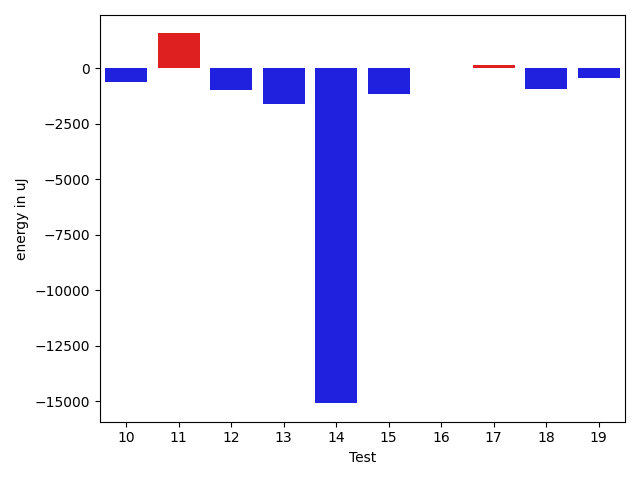

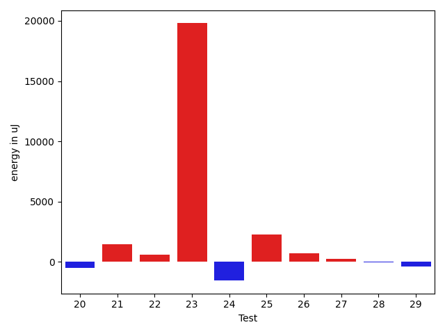

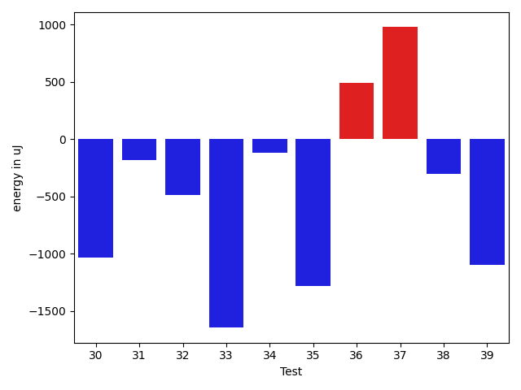

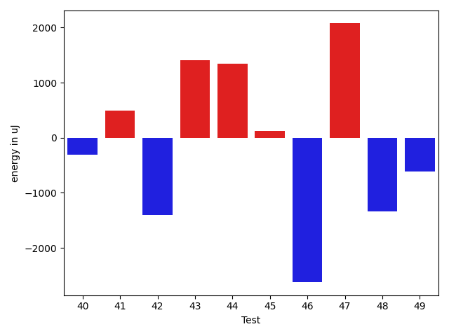

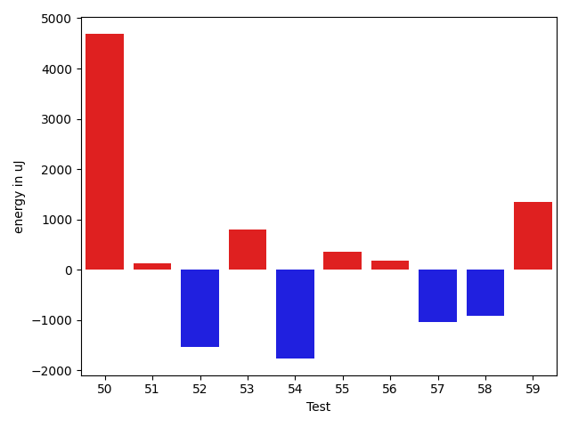

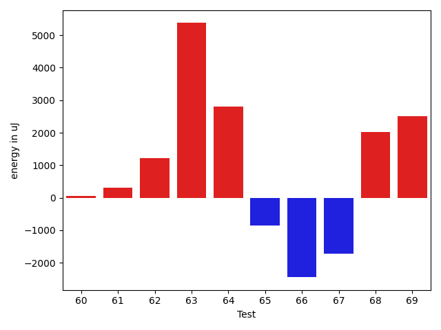

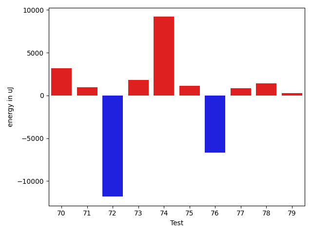

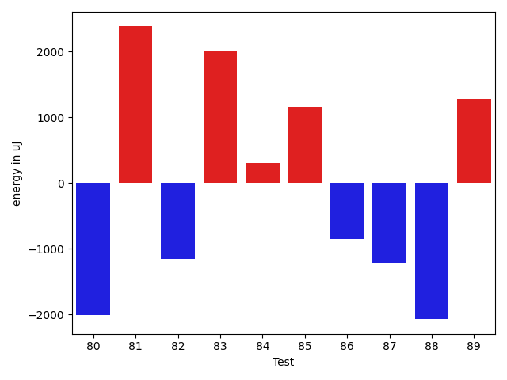

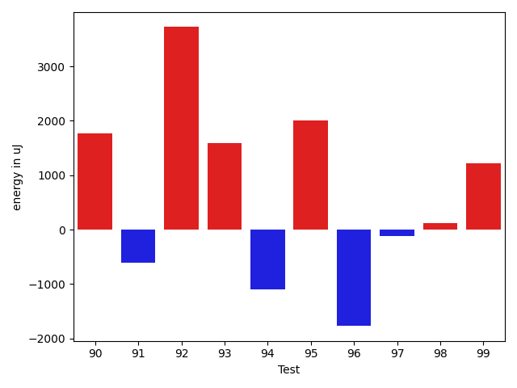

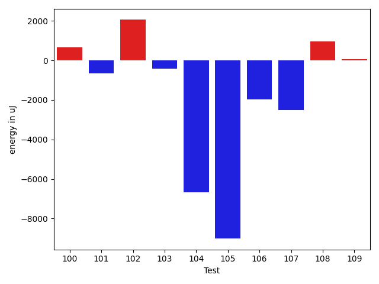

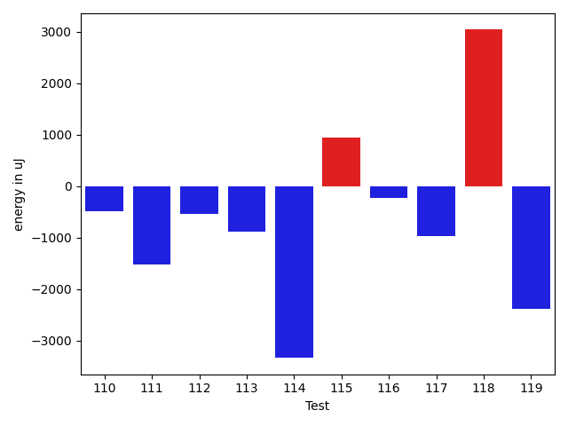

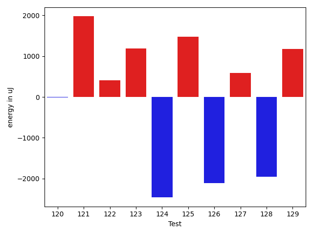

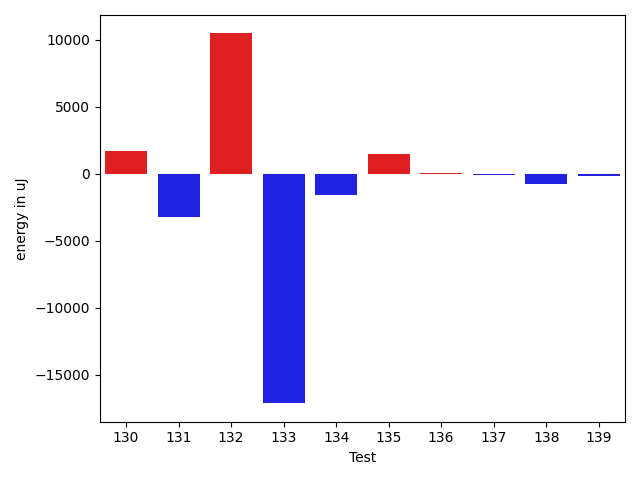

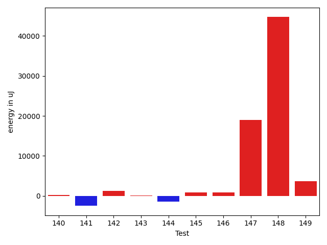

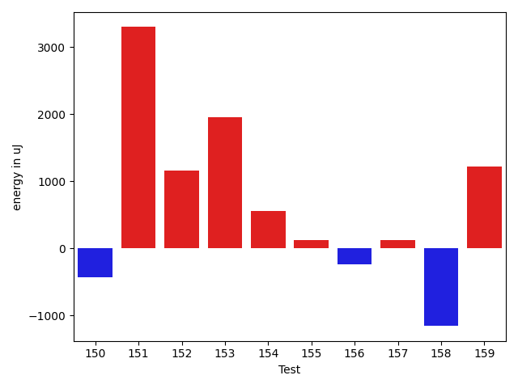

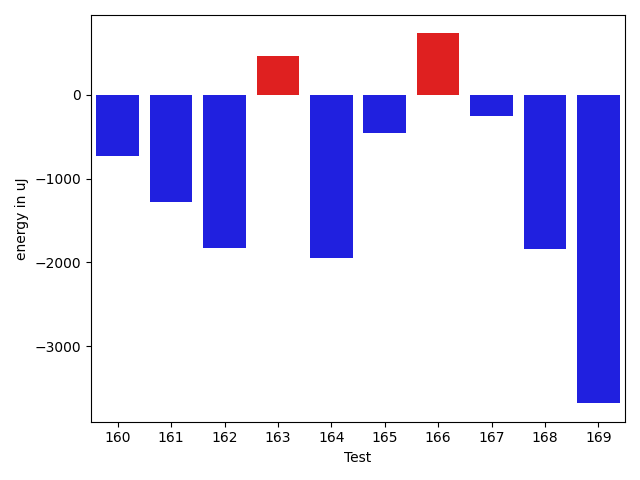

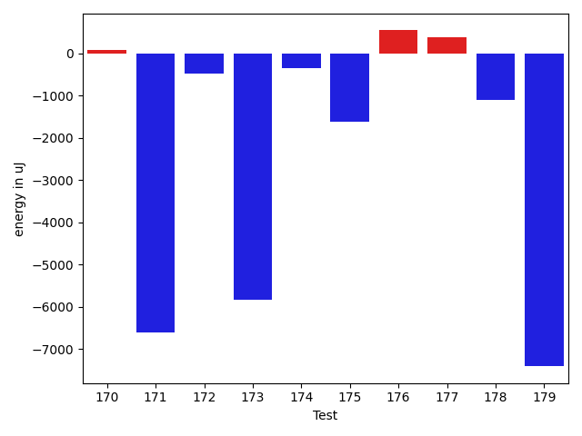

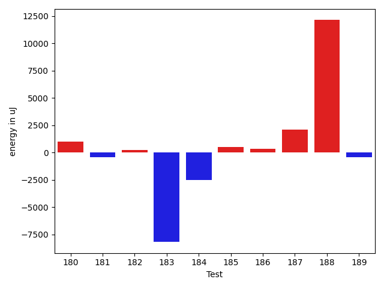

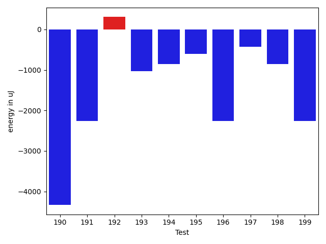

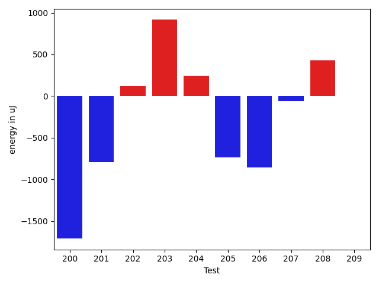

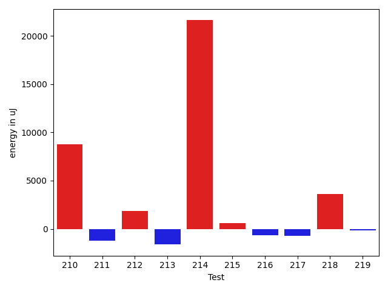

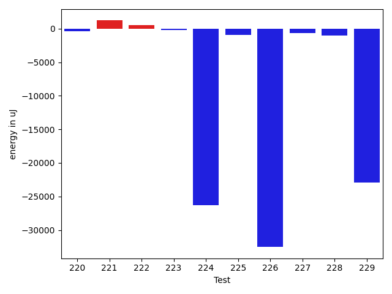

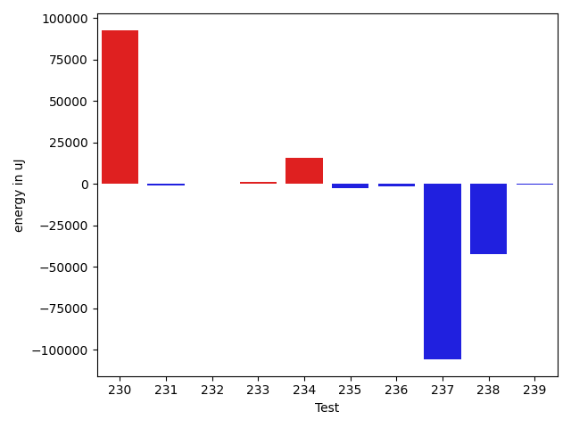

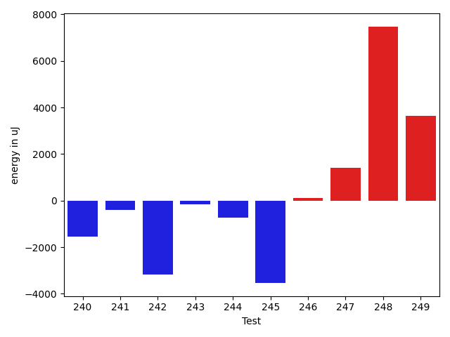

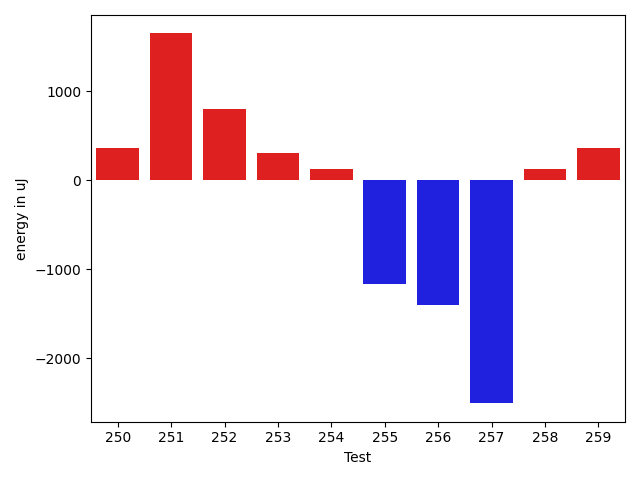

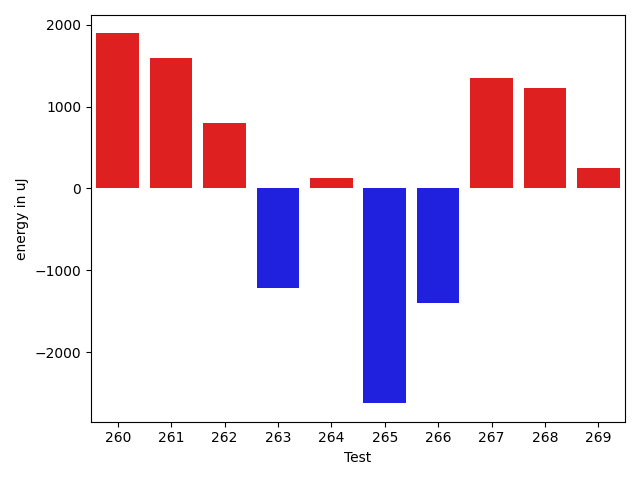

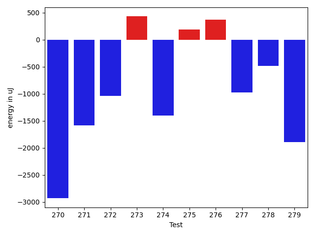

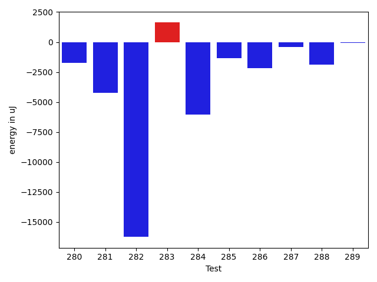

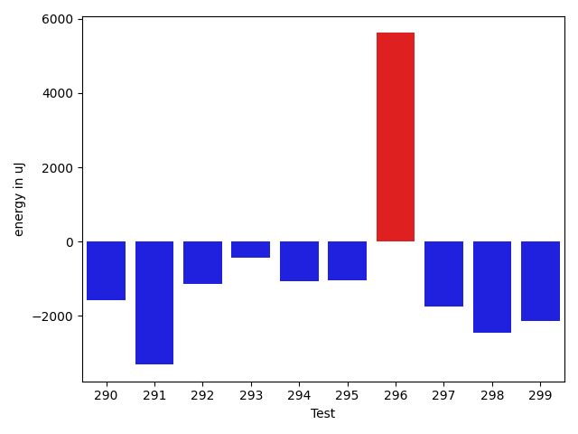

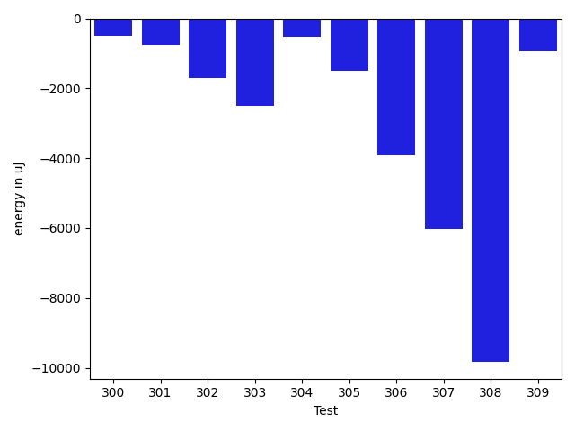

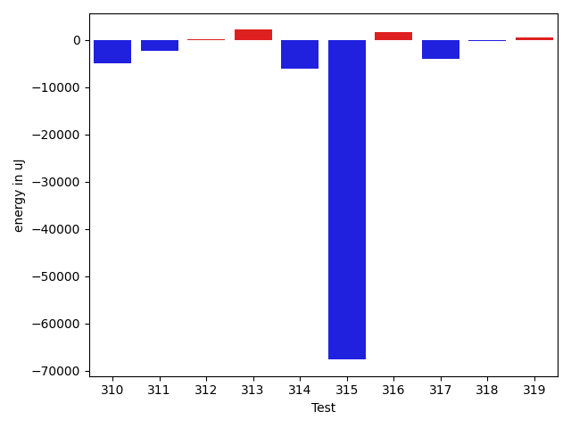

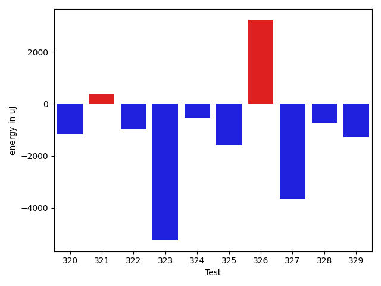

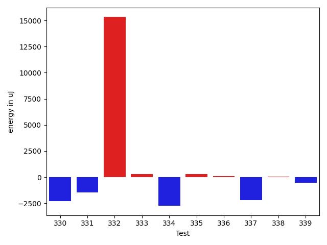

| ID | EnergyV1 | EnergyV2 | DeltaEnergy | σV1 | σV2 |
| --- | --- | --- | --- | --- | --- |
| 0 | 37048 | 36560 | -488 | 27864.4602340231 | 112355.87292641963 |
| 1 | 36926 | 33569 | -3357 | 90862.54548201407 | 4051.414686254667 |
| 2 | 66528 | 64697 | -1831 | 27592.831495265676 | 26305.29927766159 |
| 3 | 35766 | 34119 | -1647 | 4141.945808089289 | 3867.7413341227543 |
| 4 | 36560 | 35278 | -1282 | 83615.31803427725 | 62995.82918553851 |
| 5 | 35217 | 33936 | -1281 | 6443.474817644869 | 22716.35168017406 |
| 6 | 37964 | 35522 | -2442 | 96596.45714240111 | 69085.62635657209 |
| 7 | 35522 | 34179 | -1343 | 5975.419813416215 | 4194.845888593851 |
| 8 | 34057 | 33692 | -365 | 4276.666868071341 | 4150.508514179437 |
| 9 | 36743 | 35278 | -1465 | 39773.43397898283 | 38406.35661932743 |
| 10 | 34668 | 34363 | -305 | 4271.682559698433 | 3905.797112017842 |
| 11 | 36132 | 36194 | 62 | 14885.084338392859 | 15647.705524466292 |
| 12 | 35279 | 33142 | -2137 | 9175.133441128433 | 9228.679844158236 |
| 13 | 34607 | 34790 | 183 | 16913.26351178777 | 15019.223609686725 |
| 14 | 35034 | 33447 | -1587 | 76889.89017628742 | 32861.44983293417 |
| 15 | 34179 | 32409 | -1770 | 4114.551889117733 | 3897.9063114518417 |
| 16 | 33447 | 33691 | 244 | 6692.66301257554 | 6340.150637396188 |
| 17 | 34301 | 33936 | -365 | 3369.22412799892 | 3415.402759107689 |
| 18 | 34912 | 33264 | -1648 | 4536.855177322724 | 3601.3831433845726 |
| 19 | 34241 | 33569 | -672 | 7742.130950386295 | 7354.1469491828 |
| 20 | 34973 | 34119 | -854 | 9517.548433008493 | 8436.23679815569 |
| 21 | 34424 | 34851 | 427 | 5316.33263941438 | 9665.79627696711 |
| 22 | 35522 | 36438 | 916 | 20731.954821935575 | 22035.545037408607 |
| 23 | 35339 | 37293 | 1954 | 70778.01330033968 | 102302.2967029231 |
| 24 | 36072 | 37292 | 1220 | 34842.05902848846 | 29616.740544469023 |
| 25 | 72509 | 71594 | -915 | 48182.30505098867 | 41809.83281272696 |
| 26 | 33935 | 33264 | -671 | 3783.559883437046 | 5750.997090263758 |
| 27 | 35034 | 36316 | 1282 | 5346.193528222761 | 2741.007896730842 |
| 28 | 34790 | 33570 | -1220 | 3962.9659190573984 | 8201.432856145357 |
| 29 | 35278 | 34241 | -1037 | 3595.4343358672345 | 4296.027809596721 |
| 30 | 34668 | 33630 | -1038 | 20349.333992819636 | 4069.4688193240427 |
| 31 | 33142 | 32959 | -183 | 4157.805425750464 | 2941.3235553214554 |
| 32 | 35767 | 35278 | -489 | 4375.522516058142 | 39008.14398050112 |
| 33 | 36193 | 34546 | -1647 | 3084.974013037665 | 4501.6074818267925 |
| 34 | 33508 | 33386 | -122 | 3901.107893105597 | 4707.997298167957 |
| 35 | 35156 | 33874 | -1282 | 3843.1021838555835 | 4667.65489122683 |
| 36 | 33142 | 33630 | 488 | 4255.09303187093 | 3786.135865799392 |
| 37 | 34851 | 35828 | 977 | 3717.130490490391 | 3301.9797530090946 |
| 38 | 34790 | 34485 | -305 | 3559.168508545532 | 41933.518046343976 |
| 39 | 34606 | 33508 | -1098 | 3926.4607365121965 | 4024.37731838126 |
| 40 | 35644 | 35339 | -305 | 4816.455384000404 | 4117.268455916609 |
| 41 | 33691 | 34180 | 489 | 3325.0425224051596 | 3716.16839709782 |
| 42 | 35400 | 33997 | -1403 | 19310.478975104004 | 3457.908066786494 |
| 43 | 33081 | 34485 | 1404 | 3055.1428632603347 | 4049.5716521078566 |
| 44 | 31982 | 33325 | 1343 | 2083.5571508255166 | 3533.2117778485945 |
| 45 | 33447 | 33569 | 122 | 4173.318972122738 | 3700.509970975424 |
| 46 | 35583 | 32959 | -2624 | 4096.130704883125 | 3829.39489226797 |
| 47 | 34546 | 36621 | 2075 | 4549.312368674829 | 3416.9134299474285 |
| 48 | 35400 | 34057 | -1343 | 4103.730277002928 | 4340.242671081602 |
| 49 | 34057 | 33447 | -610 | 4333.840183005588 | 7463.245540029243 |
| 50 | 32105 | 36804 | 4699 | 3885.939203859699 | 4059.002124425873 |
| 51 | 35766 | 35888 | 122 | 6094.372708096116 | 3867.570377252043 |
| 52 | 66894 | 65369 | -1525 | 23682.184975029468 | 29519.59227609562 |
| 53 | 34912 | 35705 | 793 | 13902.297017772651 | 11676.267812669692 |
| 54 | 35278 | 33508 | -1770 | 21910.324982948074 | 4748.326525316981 |
| 55 | 35583 | 35950 | 367 | 73731.30364885693 | 7505.47174108606 |
| 56 | 35279 | 35461 | 182 | 4627.193424259483 | 7595.923387306579 |
| 57 | 34607 | 33570 | -1037 | 4396.420089406575 | 4393.896833773764 |
| 58 | 34118 | 33203 | -915 | 4404.891529099905 | 4346.929043850152 |
| 59 | 34180 | 35523 | 1343 | 5119.181545548175 | 8120.884270236741 |
| 60 | 37048 | 37109 | 61 | 153098.1432530359 | 22298.825855809144 |
| 61 | 35034 | 35339 | 305 | 35751.96875452541 | 4362.175036724273 |
| 62 | 34118 | 35339 | 1221 | 32769.25430043132 | 31522.48689446287 |
| 63 | 32654 | 38025 | 5371 | 4161.9426148855055 | 5179.3250978419765 |
| 64 | 33752 | 36560 | 2808 | 3026.935230375584 | 6257.3276123336045 |
| 65 | 41077 | 40222 | -855 | 86376.00707556226 | 74905.9965294001 |
| 66 | 34729 | 32287 | -2442 | 4036.3743495865197 | 5736.613208208456 |
| 67 | 34729 | 33020 | -1709 | 4305.541340903273 | 3096.592717285792 |
| 68 | 35156 | 37170 | 2014 | 4201.784687434232 | 5030.55743169681 |
| 69 | 36377 | 38879 | 2502 | 3631.5532374820928 | 3979.526435254437 |
| 70 | 32715 | 37292 | 4577 | 3215.5297645437317 | 3655.7206102293158 |
| 71 | 34790 | 36376 | 1586 | 4257.348792662197 | 2656.6765182176355 |
| 72 | 39428 | 36926 | -2502 | 42867.49435494024 | 29997.948136940846 |
| 73 | 35034 | 33935 | -1099 | 3398.423209626546 | 4962.303934459289 |
| 74 | 34668 | 34424 | -244 | 3784.861860975466 | 32626.357423425135 |
| 75 | 33813 | 36682 | 2869 | 2951.2492214216927 | 3122.914081330929 |
| 76 | 35888 | 36194 | 306 | 20005.845465207858 | 15520.286129805096 |
| 77 | 33264 | 35096 | 1832 | 3908.624308145031 | 3863.7167263111396 |
| 78 | 34058 | 35034 | 976 | 3554.8963538666912 | 3930.3918232534425 |
| 79 | 32898 | 33081 | 183 | 4128.3289991544425 | 3471.750173390359 |
| 80 | 35766 | 33752 | -2014 | 4478.602999541264 | 4533.016832973896 |
| 81 | 33508 | 35889 | 2381 | 3776.2030560685103 | 4982.094414556549 |
| 82 | 35461 | 34302 | -1159 | 1370.08302668123 | 4064.4801930874264 |
| 83 | 32410 | 34424 | 2014 | 3800.118675859648 | 4682.368814169956 |
| 84 | 32837 | 33142 | 305 | 4371.439196708452 | 3289.121531466033 |
| 85 | 35401 | 36560 | 1159 | 9921.178074959733 | 10274.554720890845 |
| 86 | 33813 | 32958 | -855 | 4004.585418617013 | 2875.428601976013 |
| 87 | 33631 | 32410 | -1221 | 52287.25411950819 | 3179.909308102392 |
| 88 | 34058 | 31983 | -2075 | 4037.718428904015 | 3087.814598636964 |
| 89 | 32410 | 33691 | 1281 | 3678.0519857286167 | 3035.7185002071587 |
| 90 | 31433 | 33203 | 1770 | 3999.6171061184787 | 3686.0927416439213 |
| 91 | 33630 | 33020 | -610 | 4193.828966156887 | 4097.578358006104 |
| 92 | 31738 | 35461 | 3723 | 3814.8713114433294 | 2710.209562209858 |
| 93 | 32105 | 33691 | 1586 | 3720.1349958704454 | 3998.3298357622157 |
| 94 | 35644 | 34545 | -1099 | 4335.664475884933 | 3825.924079810246 |
| 95 | 32348 | 34362 | 2014 | 4160.937609473442 | 3952.339162340027 |
| 96 | 32593 | 30823 | -1770 | 4022.2817917359016 | 3264.989541728465 |
| 97 | 32897 | 32775 | -122 | 3956.3894174360544 | 4076.9519147956057 |
| 98 | 33020 | 33142 | 122 | 3417.8423643433293 | 3324.6046747027767 |
| 99 | 34485 | 35705 | 1220 | 4654.5900725042975 | 4517.811310800839 |
| 100 | 36011 | 35644 | -367 | 4840.335497451717 | 4706.08148328688 |
| 101 | 34119 | 33264 | -855 | 5839.376002638384 | 7391.680423587348 |
| 102 | 31494 | 33203 | 1709 | 2623.057741865353 | 4377.537221138043 |
| 103 | 33325 | 33813 | 488 | 3068.3219845740455 | 2977.3747559721132 |
| 104 | 36804 | 36133 | -671 | 109435.40420903811 | 88440.05877488926 |
| 105 | 61401 | 59143 | -2258 | 24945.297756602457 | 20060.269343485266 |
| 106 | 37049 | 34363 | -2686 | 4052.740427494907 | 4764.580659341911 |
| 107 | 35034 | 32043 | -2991 | 3317.18407796441 | 2893.469905610659 |
| 108 | 33386 | 33142 | -244 | 3178.1383094803873 | 4562.334781994146 |
| 109 | 33692 | 33264 | -428 | 3550.507039846562 | 4582.049890332928 |
| 110 | 33447 | 32531 | -916 | 2998.2530368078133 | 4482.588375393158 |
| 111 | 34484 | 32532 | -1952 | 3852.297320755499 | 4826.729489375748 |
| 112 | 33997 | 33691 | -306 | 3344.577411149516 | 3911.579532618505 |
| 113 | 34363 | 32959 | -1404 | 3968.6804994439485 | 4878.945252358362 |
| 114 | 34729 | 32898 | -1831 | 3348.3733387171897 | 2665.1448288372035 |
| 115 | 32044 | 33509 | 1465 | 4134.687377772515 | 4414.738099276909 |
| 116 | 33814 | 33569 | -245 | 3470.590019136917 | 3385.1458931798265 |
| 117 | 32715 | 32043 | -672 | 3684.5485812375982 | 2629.975036003194 |
| 118 | 34973 | 36377 | 1404 | 3941.842768708963 | 5529.056828248376 |
| 119 | 35828 | 33508 | -2320 | 3370.6078457750023 | 3552.2256741372726 |
| 120 | 33570 | 34545 | 975 | 4423.365982742548 | 3666.7011227074254 |
| 121 | 34119 | 35156 | 1037 | 4323.167370039587 | 3826.7700706122046 |
| 122 | 33813 | 33020 | -793 | 4094.811904802745 | 3516.757113107556 |
| 123 | 33448 | 33996 | 548 | 3063.3485758094166 | 3335.398250209411 |
| 124 | 34729 | 33569 | -1160 | 5362.330413198861 | 3713.950994975511 |
| 125 | 32410 | 35400 | 2990 | 3406.4215375314348 | 3443.4442655573794 |
| 126 | 35949 | 32959 | -2990 | 2865.5309620460293 | 2277.7174297967695 |
| 127 | 33692 | 35401 | 1709 | 4992.029793034638 | 4728.30211586452 |
| 128 | 33386 | 30152 | -3234 | 2790.061073383498 | 3071.7075234102285 |
| 129 | 31983 | 33692 | 1709 | 3624.8042167084636 | 3322.4700509815616 |
| 130 | 32226 | 34668 | 2442 | 3480.132592620894 | 3403.8985558765153 |
| 131 | 31982 | 35156 | 3174 | 26726.40940581993 | 4406.699448210588 |
| 132 | 33814 | 35339 | 1525 | 3534.806814359697 | 33417.89166467161 |
| 133 | 34729 | 34546 | -183 | 50102.35554841708 | 3558.1875435453544 |
| 134 | 33935 | 33142 | -793 | 5129.079883789454 | 2502.17885052208 |
| 135 | 30884 | 33020 | 2136 | 2018.3630208539337 | 3789.5545659871095 |
| 136 | 33142 | 34058 | 916 | 3230.2919981543887 | 4671.800302048689 |
| 137 | 33936 | 33447 | -489 | 3595.4789301621663 | 4452.999024731083 |
| 138 | 34301 | 33936 | -365 | 3783.6906533172078 | 3484.84144785192 |
| 139 | 32471 | 34058 | 1587 | 3905.1670480876214 | 3632.844324890469 |
| 140 | 33752 | 34607 | 855 | 4756.745500826924 | 3971.715474451814 |
| 141 | 38513 | 35584 | -2929 | 3857.0486147479296 | 3651.851648347515 |
| 142 | 33020 | 33813 | 793 | 3377.8187853375757 | 4868.365316127269 |
| 143 | 33569 | 33508 | -61 | 4132.923282541668 | 3080.662076640316 |
| 144 | 33630 | 31555 | -2075 | 2825.9246274449715 | 3741.772351291416 |
| 145 | 34607 | 36072 | 1465 | 4100.664924944083 | 4514.370495319172 |
| 146 | 33692 | 36071 | 2379 | 3126.7488266331966 | 3791.8220722365127 |
| 147 | 37292 | 34302 | -2990 | 3480.6127832522216 | 84865.40886972148 |
| 148 | 65490 | 79956 | 14466 | 78668.8165523899 | 110929.61223447585 |
| 149 | 37475 | 36194 | -1281 | 22189.617641890898 | 29237.00797188438 |
| 150 | 37049 | 36621 | -428 | 4834.230737397626 | 2800.4090512637613 |
| 151 | 35949 | 39246 | 3297 | 5939.82485712612 | 4355.897221487976 |
| 152 | 35950 | 37109 | 1159 | 20509.57525125823 | 3746.5985712019697 |
| 153 | 35034 | 36987 | 1953 | 4257.243695530724 | 3700.425664783166 |
| 154 | 35217 | 35767 | 550 | 4639.644919086655 | 4422.5538411090765 |
| 155 | 37353 | 37476 | 123 | 70731.81615659641 | 56216.24269933566 |
| 156 | 33814 | 33569 | -245 | 3869.844915416508 | 2917.92006990853 |
| 157 | 37231 | 37353 | 122 | 33602.63286391647 | 33751.05153923099 |
| 158 | 35461 | 34302 | -1159 | 4587.576578503771 | 4391.345504023415 |
| 159 | 33264 | 34485 | 1221 | 2517.9444786978947 | 3615.9493988811005 |
| 160 | 34424 | 33630 | -794 | 4252.932344036905 | 3263.1187853186334 |
| 161 | 36194 | 34484 | -1710 | 5990.113813954808 | 2617.8898338589847 |
| 162 | 36255 | 35889 | -366 | 10989.893959201285 | 8655.520429372742 |
| 163 | 32776 | 32287 | -489 | 3514.2915018535386 | 3938.5936246145425 |
| 164 | 37109 | 34667 | -2442 | 4290.396404524701 | 3053.145626409995 |
| 165 | 34363 | 33814 | -549 | 3527.031266603686 | 4044.234628623571 |
| 166 | 34668 | 34240 | -428 | 4005.080343763406 | 3577.5052232594962 |
| 167 | 34118 | 33691 | -427 | 4030.945185349075 | 3404.9609387376127 |
| 168 | 135864 | 134400 | -1464 | 29788.396965929805 | 22992.8675948846 |
| 169 | 37353 | 35278 | -2075 | 14502.184662727595 | 13852.8244961235 |
| 170 | 33753 | 34362 | 609 | 3912.214355698133 | 4328.105914831568 |
| 171 | 32654 | 32287 | -367 | 39757.76888613729 | 3329.201776342191 |
| 172 | 33692 | 33874 | 182 | 3116.938136820401 | 3458.9166730380202 |
| 173 | 33691 | 33508 | -183 | 32462.93820078823 | 3332.674784552468 |
| 174 | 33874 | 32837 | -1037 | 3936.542087922865 | 2876.146865663668 |
| 175 | 33386 | 32714 | -672 | 3385.485603748214 | 3846.1214322787123 |
| 176 | 33325 | 34240 | 915 | 3217.4903113099804 | 3460.0027963626676 |
| 177 | 32837 | 33386 | 549 | 3068.5768518470595 | 3388.4116272040947 |
| 178 | 36254 | 35339 | -915 | 4363.370363881338 | 4126.595587737771 |
| 179 | 35096 | 35340 | 244 | 72244.90214096382 | 39402.30785862168 |
| 180 | 32898 | 34606 | 1708 | 3704.8885610771076 | 3072.252452508492 |
| 181 | 36438 | 35950 | -488 | 3594.1523923921764 | 4158.155030779877 |
| 182 | 34912 | 36866 | 1954 | 4630.635164607641 | 4494.4112688693285 |
| 183 | 34363 | 35034 | 671 | 37315.489629633965 | 4362.757919787284 |
| 184 | 37598 | 33813 | -3785 | 5164.363650027196 | 3676.640110970885 |
| 185 | 35827 | 35522 | -305 | 3851.311996824057 | 4423.884739798315 |
| 186 | 36194 | 35339 | -855 | 7914.1736820299775 | 8802.477211248843 |
| 187 | 34424 | 34179 | -245 | 4037.0903543465906 | 19201.773976459273 |
| 188 | 35156 | 36255 | 1099 | 51839.40278425375 | 74592.15310011483 |
| 189 | 33997 | 33813 | -184 | 4038.4042602238433 | 3882.2000392902737 |
| 190 | 38085 | 33752 | -4333 | 42848.03764248294 | 3536.044615720346 |
| 191 | 36377 | 34119 | -2258 | 3818.1307156204894 | 4269.300623769156 |
| 192 | 37964 | 38269 | 305 | 17755.660167933773 | 25558.50815887508 |
| 193 | 37719 | 36682 | -1037 | 9305.101779872528 | 9827.955745308014 |
| 194 | 34607 | 33752 | -855 | 3952.8412124583365 | 3760.6331490985344 |
| 195 | 35461 | 34851 | -610 | 3441.718285327193 | 3693.4627651409505 |
| 196 | 36926 | 34668 | -2258 | 9849.864478758953 | 7837.672370042988 |
| 197 | 35278 | 34851 | -427 | 4671.439588963271 | 3787.9313937930347 |
| 198 | 35767 | 34912 | -855 | 4257.633699119559 | 4788.27886106304 |
| 199 | 36804 | 34546 | -2258 | 4283.429346311638 | 3704.1150641095464 |
| 200 | 35034 | 33326 | -1708 | 4160.958107022356 | 4584.886950532147 |
| 201 | 35645 | 34851 | -794 | 4434.377921778319 | 4097.14122833556 |
| 202 | 35462 | 35583 | 121 | 12722.483103372517 | 23209.795414788176 |
| 203 | 34241 | 35156 | 915 | 5311.102687241367 | 3957.767673469447 |
| 204 | 35767 | 36011 | 244 | 4347.615925572876 | 4560.822333570998 |
| 205 | 35035 | 34301 | -734 | 4644.812828363089 | 4613.3253279599985 |
| 206 | 34546 | 33692 | -854 | 3690.096689823576 | 3183.1441919500858 |
| 207 | 34485 | 34424 | -61 | 23519.23492242398 | 4917.613298528447 |
| 208 | 35644 | 36072 | 428 | 8500.471706096645 | 8732.930919561879 |
| 209 | 34118 | 34118 | 0 | 7221.004421887457 | 7322.705921234915 |
| 210 | 91735 | 80078 | -11657 | 60804.10266105302 | 87642.82692267091 |
| 211 | 35706 | 35767 | 61 | 10514.99706799026 | 8622.667885666717 |
| 212 | 71289 | 70435 | -854 | 25515.06665777215 | 30910.442697438968 |
| 213 | 36133 | 35400 | -733 | 10995.164501450683 | 8499.936964869343 |
| 214 | 34973 | 36194 | 1221 | 35411.221494985795 | 86387.63458924837 |
| 215 | 61767 | 43701 | -18066 | 19666.708308283152 | 28352.30586778448 |
| 216 | 35034 | 37048 | 2014 | 15526.276232098331 | 12603.53085076053 |
| 217 | 71472 | 71777 | 305 | 42616.0304277802 | 43478.11109327026 |
| 218 | 36316 | 39184 | 2868 | 16520.678366273864 | 18316.450462720964 |
| 219 | 34973 | 35156 | 183 | 3066.2441025680237 | 3747.4038182065437 |
| 220 | 34851 | 34119 | -732 | 3699.2700314555304 | 4257.398703134524 |
| 221 | 35217 | 35827 | 610 | 4378.201565505483 | 7633.290408346924 |
| 222 | 35766 | 34668 | -1098 | 8548.642613399292 | 10640.632894229948 |
| 223 | 36011 | 34607 | -1404 | 2664.8279803639402 | 3937.8327092807017 |
| 224 | 39184 | 37475 | -1709 | 393822.327748425 | 344506.8201071985 |
| 225 | 75622 | 73608 | -2014 | 34186.24988040098 | 46449.913093718904 |
| 226 | 86731 | 79163 | -7568 | 166111.19559916403 | 82397.93845192755 |
| 227 | 34912 | 36194 | 1282 | 4736.992310123887 | 4618.602036984965 |
| 228 | 37048 | 36499 | -549 | 8698.130616983846 | 8454.923659135635 |
| 229 | 37292 | 35218 | -2074 | 87847.26170359174 | 35796.97275235651 |
| 230 | 37841 | 36804 | -1037 | 283462.2230684327 | 498982.06123967323 |
| 231 | 34424 | 34179 | -245 | 3784.260408375724 | 4397.765367311167 |
| 232 | 33386 | 34485 | 1099 | 4993.677721101175 | 6044.061013476455 |
| 233 | 38391 | 37598 | -793 | 3834.025535897923 | 10747.241095586656 |
| 234 | 40039 | 37964 | -2075 | 109140.75334731136 | 271330.69101667387 |
| 235 | 36804 | 35156 | -1648 | 4605.30213746544 | 4322.280951650413 |
| 236 | 35706 | 33936 | -1770 | 4469.976106134571 | 3607.036633909801 |
| 237 | 39550 | 37964 | -1586 | 513373.9396177639 | 371183.42858419934 |
| 238 | 168518 | 167541 | -977 | 334858.21144086245 | 206865.72163410462 |
| 239 | 35034 | 34668 | -366 | 4190.363180689332 | 3609.850394973383 |
| 240 | 33997 | 34301 | 304 | 17414.107337599704 | 6873.8317867781425 |
| 241 | 35400 | 34790 | -610 | 4545.873306028679 | 6688.597780261418 |
| 242 | 37170 | 35888 | -1282 | 70735.60789850033 | 71312.334707812 |
| 243 | 35156 | 36010 | 854 | 4396.68970097539 | 3492.9885930246687 |
| 244 | 34851 | 34180 | -671 | 4673.217280418277 | 3384.8791305942727 |
| 245 | 36865 | 35034 | -1831 | 36106.73001245963 | 32211.457110940526 |
| 246 | 34424 | 34790 | 366 | 4088.7569811423173 | 3194.0186659171463 |
| 247 | 32227 | 34179 | 1952 | 3558.4679383060693 | 3471.148612971408 |
| 248 | 34728 | 35156 | 428 | 3738.6398386008564 | 29919.758085274978 |
| 249 | 42053 | 65308 | 23255 | 83484.22503930441 | 80317.41162244591 |
| 250 | 36254 | 36621 | 367 | 11619.182684216607 | 8835.569433879944 |
| 251 | 35218 | 36865 | 1647 | 3837.180596245203 | 4940.981019212906 |
| 252 | 35644 | 36438 | 794 | 4123.710156715337 | 4335.234325846759 |
| 253 | 35645 | 35950 | 305 | 2420.2875905216993 | 4843.641600089068 |
| 254 | 36133 | 36255 | 122 | 41470.37869645635 | 45067.84225934323 |
| 255 | 37964 | 36804 | -1160 | 4221.32350084253 | 5319.417323880502 |
| 256 | 36010 | 34607 | -1403 | 6848.178451147825 | 7430.000950188062 |
| 257 | 37110 | 34607 | -2503 | 9866.34850005896 | 8930.741116586561 |
| 258 | 37963 | 38085 | 122 | 83611.21796544857 | 73168.12165535828 |
| 259 | 36560 | 36926 | 366 | 3519.4652691299916 | 3909.350255761464 |
| 260 | 36621 | 38513 | 1892 | 48514.0812875177 | 88075.67623966503 |
| 261 | 36682 | 38269 | 1587 | 3708.1121235520013 | 4912.532505681481 |
| 262 | 34607 | 35401 | 794 | 34562.77177478001 | 12760.377488707807 |
| 263 | 36011 | 34790 | -1221 | 3941.435875519648 | 10304.929595712336 |
| 264 | 35462 | 35584 | 122 | 39874.76595484416 | 11780.61830645053 |
| 265 | 39611 | 36988 | -2623 | 35752.323002086945 | 53225.59526980584 |
| 266 | 37903 | 36499 | -1404 | 36431.014829607506 | 38428.124356781285 |
| 267 | 35095 | 36438 | 1343 | 5647.778688467292 | 4745.825333794838 |
| 268 | 35095 | 36316 | 1221 | 67026.70625952016 | 83300.16329839823 |
| 269 | 33386 | 33630 | 244 | 5233.260438419488 | 32951.71469680866 |
| 270 | 35584 | 32653 | -2931 | 4573.972450324921 | 3866.849913042915 |
| 271 | 37231 | 35644 | -1587 | 39716.34988909563 | 33464.928736730864 |
| 272 | 36743 | 35705 | -1038 | 4241.824631025907 | 3550.295045357626 |
| 273 | 37231 | 37659 | 428 | 36239.74367420505 | 57878.88930939846 |
| 274 | 37049 | 35644 | -1405 | 5750.659129830249 | 4730.650141534459 |
| 275 | 35156 | 35339 | 183 | 5148.825769668265 | 8480.686131744325 |
| 276 | 35340 | 35705 | 365 | 5149.530958990343 | 4305.287594379887 |
| 277 | 34912 | 33936 | -976 | 6712.364356171378 | 4463.394643806209 |
| 278 | 37964 | 37476 | -488 | 39542.62675389466 | 107199.76878301948 |
| 279 | 35767 | 33874 | -1893 | 5176.234099962293 | 4239.919469848846 |
| 280 | 37597 | 35584 | -2013 | 2623.5779122656895 | 3309.8922970017434 |
| 281 | 39551 | 36377 | -3174 | 52313.70787161194 | 55034.51170813007 |
| 282 | 249877 | 248840 | -1037 | 103279.26826763724 | 98967.81001258164 |
| 283 | 376220 | 377502 | 1282 | 122258.66184173999 | 114170.07930737518 |
| 284 | 61218 | 37292 | -23926 | 68954.43273204837 | 66486.45751506595 |
| 285 | 34546 | 33142 | -1404 | 9706.213057351431 | 8416.17034430932 |
| 286 | 34057 | 32349 | -1708 | 6010.179479740869 | 3277.1302650935504 |
| 287 | 35034 | 34302 | -732 | 11481.55616778082 | 10821.834202944221 |
| 288 | 34424 | 33020 | -1404 | 4895.448614744107 | 3580.985249992125 |
| 289 | 34912 | 34851 | -61 | 4265.420000633199 | 4004.776648249306 |
| 290 | 36071 | 33874 | -2197 | 4701.651851257681 | 3837.9522566565365 |
| 291 | 36560 | 35035 | -1525 | 23761.461478053447 | 18298.843047095143 |
| 292 | 33874 | 33752 | -122 | 4381.865018160629 | 3824.9856557418107 |
| 293 | 34973 | 35157 | 184 | 4240.005448036005 | 4877.641993979597 |
| 294 | 33509 | 32714 | -795 | 3516.9305265940193 | 4224.985673085505 |
| 295 | 34363 | 33203 | -1160 | 4964.517585141038 | 3695.4037406486455 |
| 296 | 36926 | 36499 | -427 | 52179.09290402047 | 57253.41677267779 |
| 297 | 37353 | 39978 | 2625 | 69586.55838954877 | 66590.92493046005 |
| 298 | 35705 | 33325 | -2380 | 5370.771321033902 | 3706.7427893862105 |
| 299 | 34485 | 34606 | 121 | 26512.794201693978 | 14009.249132021874 |
| 300 | 34973 | 35217 | 244 | 4870.287495620767 | 3978.8196151622665 |
| 301 | 34180 | 33874 | -306 | 3749.3626931606946 | 4467.042682737102 |
| 302 | 35950 | 33813 | -2137 | 4024.9635487990445 | 3754.309033762092 |
| 303 | 36133 | 34607 | -1526 | 4036.7953406411652 | 3852.8300334216647 |
| 304 | 33753 | 33203 | -550 | 3760.7574579592833 | 3311.5096060699793 |
| 305 | 34423 | 33753 | -670 | 4082.5592336417817 | 3553.645733609359 |
| 306 | 38757 | 39063 | 306 | 22374.60235845459 | 13855.203818642425 |
| 307 | 68298 | 67566 | -732 | 35147.66599858149 | 24111.38905210645 |
| 308 | 38635 | 40406 | 1771 | 82372.78715385894 | 68044.40091035429 |
| 309 | 37415 | 36926 | -489 | 14508.954224923384 | 14314.806390415113 |
| 310 | 38208 | 37780 | -428 | 46950.918111767736 | 37593.892773471314 |
| 311 | 37903 | 36133 | -1770 | 117001.94239780777 | 116697.16881532081 |
| 312 | 34729 | 35156 | 427 | 3950.7303937969327 | 5128.491961540622 |
| 313 | 36743 | 38208 | 1465 | 18321.76643316372 | 17125.544457940265 |
| 314 | 42175 | 37109 | -5066 | 67614.09237548042 | 65946.8886533882 |
| 315 | 38513 | 36072 | -2441 | 438247.4045655086 | 325348.3509903266 |
| 316 | 36804 | 38147 | 1343 | 27580.245108127216 | 27422.166408670942 |
| 317 | 43579 | 37292 | -6287 | 45126.88291719787 | 48781.99479121369 |
| 318 | 35461 | 35217 | -244 | 4517.286249774304 | 5214.591075093983 |
| 319 | 34851 | 35523 | 672 | 3606.990001552787 | 4244.681037533916 |
| 320 | 35095 | 33936 | -1159 | 4277.168171548593 | 5152.014616123291 |
| 321 | 34789 | 35156 | 367 | 5209.391426999658 | 5034.66370674348 |
| 322 | 34790 | 33813 | -977 | 3393.938653612869 | 4587.252173855262 |
| 323 | 38208 | 32959 | -5249 | 11480.930188537985 | 7783.77173033742 |
| 324 | 36438 | 35889 | -549 | 32644.077964178712 | 37487.129148225285 |
| 325 | 37170 | 35584 | -1586 | 73809.24639296655 | 62931.661224696756 |
| 326 | 35034 | 38269 | 3235 | 598495.8208213758 | 714976.3215062907 |
| 327 | 37414 | 33752 | -3662 | 4448.787477747242 | 4639.991485377424 |
| 328 | 36926 | 36194 | -732 | 4219.951994906988 | 2879.821582483675 |
| 329 | 38635 | 37354 | -1281 | 88350.11622276672 | 73442.0314708976 |
| 330 | 37476 | 35156 | -2320 | 4006.4242907651633 | 108801.33390731017 |
| 331 | 37293 | 35828 | -1465 | 4541.138342948376 | 4029.0109097668633 |
| 332 | 79467 | 94788 | 15321 | 58433.368011308965 | 63049.012435501885 |
| 333 | 36194 | 36499 | 305 | 4894.716092037798 | 3665.398106890699 |
| 334 | 38697 | 35950 | -2747 | 4408.881919324525 | 3873.0134960592945 |
| 335 | 35583 | 35889 | 306 | 3966.869617532192 | 3931.2998028194743 |
| 336 | 37231 | 37353 | 122 | 68988.6413543175 | 15656.668445471938 |
| 337 | 38818 | 36621 | -2197 | 130544.63604489721 | 108708.64051234198 |
| 338 | 37231 | 37293 | 62 | 559793.908323079 | 646896.8827775011 |
| 339 | 38086 | 37537 | -549 | 701386.7566222219 | 346595.6868428459 |

## Delta Duration per test method

| ID | DurationV1 | DurationsV2 | DeltaDuration |
| --- | --- | --- | --- |
| 0 | 1101839.1935483871 | 2142045.1739130435 | 1040205.9803646563 |
| 1 | 1620917.9090909092 | 582369.64 | -1038548.2690909092 |
| 2 | 1740832.3896103897 | 1871355.5125 | 130523.12288961024 |
| 3 | 628323.59375 | 616211.6764705882 | -12111.917279411806 |
| 4 | 1648232.0666666667 | 1337509.5263157894 | -310722.5403508772 |
| 5 | 754854.5476190476 | 862837.0975609756 | 107982.54994192801 |
| 6 | 2167543.6896551726 | 1564527.121212121 | -603016.5684430515 |
| 7 | 896001.4745762711 | 925773.765625 | 29772.29104872886 |
| 8 | 514112.7272727273 | 516915.60869565216 | 2802.8814229248674 |
| 9 | 1739515.793478261 | 1784098.3655913977 | 44582.57211313676 |
| 10 | 673131.8260869565 | 732071.3888888889 | 58939.562801932334 |
| 11 | 1268255.0481927712 | 1307599.3846153845 | 39344.336422613356 |
| 12 | 979875.8490566037 | 1003015.7346938775 | 23139.88563727378 |
| 13 | 1398653.6923076923 | 1168782.5384615385 | -229871.15384615376 |
| 14 | 1079025.1290322582 | 670023.4761904762 | -409001.65284178196 |
| 15 | 610637.0 | 676925.2972972973 | 66288.29729729728 |
| 16 | 854733.6818181818 | 951455.5952380953 | 96721.9134199135 |
| 17 | 646178.4318181818 | 811115.2156862745 | 164936.7838680927 |
| 18 | 400914.25 | 409798.13636363635 | 8883.886363636353 |
| 19 | 888632.4477611941 | 904512.2950819673 | 15879.847320773173 |
| 20 | 977257.6610169491 | 982270.5538461539 | 5012.892829204793 |
| 21 | 1010501.7611940298 | 1037055.3278688524 | 26553.566674822592 |
| 22 | 877268.8604651163 | 942371.2142857143 | 65102.353820597986 |
| 23 | 1199676.1458333333 | 1808036.7352941176 | 608360.5894607843 |
| 24 | 923809.5 | 863355.1666666666 | -60454.33333333337 |
| 25 | 2634440.6767676766 | 2618430.9393939395 | -16009.737373737153 |
| 26 | 829418.2542372881 | 919866.2 | 90447.94576271181 |
| 27 | 586729.90625 | 615168.8076923077 | 28438.901442307746 |
| 28 | 866965.7966101695 | 886800.8064516129 | 19835.00984144339 |
| 29 | 778287.2954545454 | 744506.9807692308 | -33780.31468531466 |
| 30 | 650421.0465116279 | 552737.7777777778 | -97683.2687338501 |
| 31 | 428773.84 | 473053.7826086957 | 44279.94260869565 |
| 32 | 668670.972972973 | 844034.8648648649 | 175363.89189189184 |
| 33 | 494604.8275862069 | 559136.1111111111 | 64531.283524904225 |
| 34 | 408706.09523809527 | 403817.15789473685 | -4888.937343358411 |
| 35 | 661675.5333333333 | 611069.625 | -50605.908333333326 |
| 36 | 525736.3055555555 | 503142.1379310345 | -22594.16762452101 |
| 37 | 620226.8611111111 | 613603.2258064516 | -6623.635304659489 |
| 38 | 576971.8888888889 | 837895.1666666666 | 260923.27777777775 |
| 39 | 800552.5272727272 | 905896.4107142857 | 105343.88344155846 |
| 40 | 584243.0789473684 | 613790.0 | 29546.921052631573 |
| 41 | 733936.5111111111 | 749533.775862069 | 15597.264750957838 |
| 42 | 621664.4545454546 | 440987.4090909091 | -180677.04545454547 |
| 43 | 508379.0 | 539083.4333333333 | 30704.43333333335 |
| 44 | 427772.26086956525 | 471289.1176470588 | 43516.85677749355 |
| 45 | 636756.0 | 655310.2162162162 | 18554.216216216213 |
| 46 | 561332.3448275862 | 619741.8536585366 | 58409.50883095036 |
| 47 | 356578.77777777775 | 383974.64285714284 | 27395.86507936509 |
| 48 | 770960.1153846154 | 742887.0714285715 | -28073.043956043897 |
| 49 | 877316.7647058824 | 857322.4912280702 | -19994.27347781218 |
| 50 | 384684.9375 | 391071.4375 | 6386.5 |
| 51 | 860228.475409836 | 826199.4716981133 | -34029.00371172279 |
| 52 | 2062487.8484848484 | 2098811.3636363638 | 36323.51515151537 |
| 53 | 1153347.2716049382 | 1117102.2028985508 | -36245.06870638742 |
| 54 | 914796.15625 | 775087.0 | -139709.15625 |
| 55 | 1341215.0 | 761431.6111111111 | -579783.3888888889 |
| 56 | 893880.1285714286 | 869880.0757575758 | -24000.052813852788 |
| 57 | 782082.3703703703 | 723173.4090909091 | -58908.96127946128 |
| 58 | 663914.4230769231 | 685852.5106382979 | 21938.087561374763 |
| 59 | 701879.5454545454 | 692012.8636363636 | -9866.681818181765 |
| 60 | 1632754.96875 | 1037194.2950819673 | -595560.6736680327 |
| 61 | 1057124.7894736843 | 838739.5 | -218385.28947368427 |
| 62 | 1314744.4078947369 | 1337439.2537313432 | 22694.845836606342 |
| 63 | 454330.4 | 380027.6666666667 | -74302.73333333334 |
| 64 | 463509.3333333333 | 430934.90476190473 | -32574.42857142858 |
| 65 | 2352257.086956522 | 1736062.6875 | -616194.399456522 |
| 66 | 380899.3 | 443244.46153846156 | 62345.16153846157 |
| 67 | 408532.36842105264 | 457909.1176470588 | 49376.749226006155 |
| 68 | 503666.15789473685 | 515883.88 | 12217.72210526315 |
| 69 | 422757.55555555556 | 435481.5333333333 | 12723.977777777764 |
| 70 | 412780.25 | 425720.2631578947 | 12940.013157894718 |
| 71 | 371341.84210526315 | 409278.04761904763 | 37936.20551378449 |
| 72 | 1412457.375 | 1071800.4210526317 | -340656.9539473683 |
| 73 | 406887.77777777775 | 349393.6842105263 | -57494.09356725146 |
| 74 | 398047.86666666664 | 634895.4285714285 | 236847.56190476188 |
| 75 | 335286.63636363635 | 363998.625 | 28711.988636363647 |
| 76 | 1133871.388888889 | 922775.9428571429 | -211095.4460317461 |
| 77 | 418766.93333333335 | 370497.4705882353 | -48269.46274509805 |
| 78 | 430790.35714285716 | 414009.0 | -16781.35714285716 |
| 79 | 388330.5882352941 | 373151.9411764706 | -15178.647058823495 |
| 80 | 441912.35 | 545529.0555555555 | 103616.70555555553 |
| 81 | 378565.9090909091 | 371143.26666666666 | -7422.642424242455 |
| 82 | 243420.0 | 375707.3 | 132287.3 |
| 83 | 374384.8888888889 | 369351.15789473685 | -5033.730994152022 |
| 84 | 403620.0 | 395805.3157894737 | -7814.684210526291 |
| 85 | 840919.5185185185 | 824948.8484848485 | -15970.67003367003 |
| 86 | 448772.1875 | 470762.0 | 21989.8125 |
| 87 | 882600.6111111111 | 456925.4210526316 | -425675.19005847955 |
| 88 | 397646.44444444444 | 405908.5 | 8262.055555555562 |
| 89 | 332932.9166666667 | 341250.25 | 8317.333333333314 |
| 90 | 361012.3333333333 | 372683.9 | 11671.56666666671 |
| 91 | 535543.1944444445 | 502067.375 | -33475.819444444496 |
| 92 | 405925.4347826087 | 387254.3125 | -18671.122282608703 |
| 93 | 585932.45 | 587275.0645161291 | 1342.6145161291352 |
| 94 | 548749.6774193548 | 555997.1851851852 | 7247.507765830378 |
| 95 | 389987.5833333333 | 372597.8333333333 | -17389.75 |
| 96 | 492338.5 | 502605.48387096776 | 10266.983870967757 |
| 97 | 471095.0 | 436877.0 | -34218.0 |
| 98 | 437693.5 | 435134.7083333333 | -2558.791666666686 |
| 99 | 331329.3333333333 | 350325.9 | 18996.56666666671 |
| 100 | 443193.28571428574 | 646764.8235294118 | 203571.53781512607 |
| 101 | 892556.0217391305 | 826485.1777777778 | -66070.84396135272 |
| 102 | 319177.8461538461 | 305979.85714285716 | -13197.989010988967 |
| 103 | 333699.28571428574 | 316480.875 | -17218.41071428574 |
| 104 | 2172804.966666667 | 2231152.3571428573 | 58347.390476190485 |
| 105 | 1881946.4666666666 | 1827438.0 | -54508.46666666656 |
| 106 | 524742.551724138 | 557218.4583333334 | 32475.9066091954 |
| 107 | 378419.1153846154 | 402616.8461538461 | 24197.73076923075 |
| 108 | 511993.64705882355 | 482445.6666666667 | -29547.980392156867 |
| 109 | 579725.475 | 648112.75 | 68387.27500000002 |
| 110 | 479713.86363636365 | 455988.3333333333 | -23725.530303030333 |
| 111 | 464499.1 | 476780.6538461539 | 12281.553846153896 |
| 112 | 652817.2051282051 | 679794.0 | 26976.794871794875 |
| 113 | 390020.3333333333 | 376615.28571428574 | -13405.047619047575 |
| 114 | 410071.3888888889 | 336901.7272727273 | -73169.66161616158 |
| 115 | 332977.5263157895 | 350230.46153846156 | 17252.935222672066 |
| 116 | 536504.3703703703 | 537089.4285714285 | 585.0582010581857 |
| 117 | 511422.85 | 522514.4 | 11091.550000000047 |
| 118 | 375621.63636363635 | 305469.7 | -70151.93636363634 |
| 119 | 372204.6111111111 | 421196.5 | 48991.888888888876 |
| 120 | 405343.6666666667 | 717998.6666666666 | 312654.99999999994 |
| 121 | 341173.5625 | 448232.13333333336 | 107058.57083333336 |
| 122 | 436549.71428571426 | 439382.0 | 2832.2857142857392 |
| 123 | 408163.6111111111 | 409311.75 | 1148.138888888876 |
| 124 | 416863.38095238095 | 538044.2352941176 | 121180.85434173665 |
| 125 | 369387.5 | 370279.5 | 892.0 |
| 126 | 376159.05555555556 | 399467.5 | 23308.444444444438 |
| 127 | 484739.5909090909 | 542996.6 | 58257.009090909094 |
| 128 | 342227.94444444444 | 302966.3125 | -39261.63194444444 |
| 129 | 343997.0 | 303885.0909090909 | -40111.90909090912 |
| 130 | 475334.0 | 440244.07692307694 | -35089.92307692306 |
| 131 | 633247.45 | 407154.86363636365 | -226092.5863636363 |
| 132 | 535487.125 | 733275.6111111111 | 197788.48611111112 |
| 133 | 870481.375 | 325671.9090909091 | -544809.4659090908 |
| 134 | 315119.6842105263 | 301220.8333333333 | -13898.850877192977 |
| 135 | 321829.6666666667 | 329691.125 | 7861.458333333314 |
| 136 | 437607.3870967742 | 437898.6 | 291.21290322579443 |
| 137 | 503205.95652173914 | 517113.93548387097 | 13907.978962131834 |
| 138 | 327137.7 | 336821.9166666667 | 9684.216666666674 |
| 139 | 276956.28571428574 | 383131.8888888889 | 106175.60317460314 |
| 140 | 418689.8095238095 | 401173.4 | -17516.409523809503 |
| 141 | 310921.63636363635 | 393537.23076923075 | 82615.5944055944 |
| 142 | 592932.0731707317 | 659233.8139534884 | 66301.74078275671 |
| 143 | 408471.625 | 410156.5882352941 | 1684.963235294097 |
| 144 | 474821.94444444444 | 379688.26666666666 | -95133.67777777778 |
| 145 | 430182.6666666667 | 526416.0909090909 | 96233.42424242425 |
| 146 | 411306.23076923075 | 804440.75 | 393134.51923076925 |
| 147 | 334214.5714285714 | 1058524.0 | 724309.4285714286 |
| 148 | 2585402.9263157896 | 3950398.3131313133 | 1364995.3868155237 |
| 149 | 926419.6666666666 | 1073285.3829787234 | 146865.71631205676 |
| 150 | 411400.64 | 479873.96 | 68473.32 |
| 151 | 416544.4 | 569528.0 | 152983.59999999998 |
| 152 | 733231.0588235294 | 662606.9791666666 | -70624.07965686277 |
| 153 | 512242.6923076923 | 771028.25 | 258785.5576923077 |
| 154 | 435274.54545454547 | 406735.1176470588 | -28539.427807486674 |
| 155 | 1676523.1764705882 | 1268379.8421052631 | -408143.33436532505 |
| 156 | 646347.725 | 652306.1 | 5958.375 |
| 157 | 1210352.137254902 | 1136210.2857142857 | -74141.85154061625 |
| 158 | 736884.1818181818 | 706250.8301886793 | -30633.35162950249 |
| 159 | 699590.3703703703 | 704624.8863636364 | 5034.515993266017 |
| 160 | 1022414.3194444445 | 916476.0869565217 | -105938.23248792277 |
| 161 | 375651.2727272727 | 335636.5333333333 | -40014.73939393938 |
| 162 | 1123502.0533333332 | 1077697.88 | -45804.17333333334 |
| 163 | 575270.875 | 573933.5806451613 | -1337.2943548386684 |
| 164 | 417542.4705882353 | 416443.3157894737 | -1099.1547987615922 |
| 165 | 762684.3 | 762808.4222222222 | 124.12222222215496 |
| 166 | 501218.64 | 485328.85714285716 | -15889.782857142854 |
| 167 | 940250.7066666667 | 946771.7971014492 | 6521.090434782556 |
| 168 | 4422162.696969697 | 4405438.929292929 | -16723.767676767893 |
| 169 | 1204380.8085106383 | 1070401.3541666667 | -133979.45434397156 |
| 170 | 401443.9166666667 | 604828.2 | 203384.28333333327 |
| 171 | 967449.8648648649 | 625890.4 | -341559.4648648648 |
| 172 | 413814.8333333333 | 395766.64285714284 | -18048.190476190473 |
| 173 | 801670.9459459459 | 574393.8285714285 | -227277.11737451737 |
| 174 | 547844.1724137932 | 513536.3703703704 | -34307.802043422766 |
| 175 | 519284.8181818182 | 478601.1304347826 | -40683.68774703558 |
| 176 | 649714.1836734693 | 654746.6808510638 | 5032.497177594458 |
| 177 | 385735.4761904762 | 454560.63636363635 | 68825.16017316014 |
| 178 | 563391.1785714285 | 532962.8684210526 | -30428.31015037594 |
| 179 | 786592.0454545454 | 657944.4 | -128647.64545454539 |
| 180 | 550575.8055555555 | 563401.9166666666 | 12826.111111111124 |
| 181 | 492943.724137931 | 530746.35 | 37802.62586206896 |
| 182 | 487488.36842105264 | 421678.0 | -65810.36842105264 |
| 183 | 632266.1904761905 | 441574.25 | -190691.94047619053 |
| 184 | 481046.375 | 511432.64 | 30386.265000000014 |
| 185 | 643670.4565217391 | 730277.8571428572 | 86607.40062111802 |
| 186 | 988844.609375 | 941568.9344262296 | -47275.67494877044 |
| 187 | 801426.2033898305 | 902855.0701754387 | 101428.86678560812 |
| 188 | 1073638.2096774194 | 1514723.357142857 | 441085.14746543765 |
| 189 | 876251.1384615385 | 909402.0172413794 | 33150.87877984089 |
| 190 | 1426543.1578947369 | 657733.4897959183 | -768809.6680988185 |
| 191 | 687797.0 | 667331.7727272727 | -20465.227272727294 |
| 192 | 1499388.1030927836 | 1551360.7 | 51972.59690721636 |
| 193 | 879263.1746031746 | 878588.1578947369 | -675.0167084377026 |
| 194 | 813089.1090909091 | 827308.9629629629 | 14219.85387205379 |
| 195 | 704296.6444444444 | 724490.0833333334 | 20193.438888888923 |
| 196 | 902909.6181818182 | 925770.4150943396 | 22860.796912521473 |
| 197 | 749482.9444444445 | 698018.2884615385 | -51464.655982906 |
| 198 | 774496.3529411765 | 717511.1666666666 | -56985.18627450988 |
| 199 | 627864.15625 | 616759.0714285715 | -11105.084821428522 |
| 200 | 675572.0 | 669747.5405405406 | -5824.459459459409 |
| 201 | 740473.4444444445 | 749769.6037735849 | 9296.159329140442 |
| 202 | 743542.4545454546 | 866722.8604651163 | 123180.40591966175 |
| 203 | 958546.3387096775 | 865955.0923076923 | -92591.24640198518 |
| 204 | 736187.6086956522 | 727051.48 | -9136.128695652238 |
| 205 | 468501.7894736842 | 491010.7916666667 | 22509.002192982472 |
| 206 | 405106.77777777775 | 376691.3846153846 | -28415.393162393128 |
| 207 | 874373.1428571428 | 776075.6949152543 | -98297.44794188859 |
| 208 | 1209119.505263158 | 1221978.120879121 | 12858.615615963005 |
| 209 | 1020584.1388888889 | 1003720.8533333334 | -16863.285555555485 |
| 210 | 3154816.515151515 | 3420977.9494949495 | 266161.4343434344 |
| 211 | 1175351.0625 | 1154566.5747126436 | -20784.487787356367 |
| 212 | 2303894.5757575757 | 2455738.090909091 | 151843.51515151514 |
| 213 | 1283164.2842105264 | 1290509.7849462365 | 7345.500735710142 |
| 214 | 1344905.1609195403 | 1909036.058139535 | 564130.8972199946 |
| 215 | 1812493.8686868686 | 1885089.5757575757 | 72595.70707070711 |
| 216 | 1333918.6790123456 | 1255535.6741573033 | -78383.00485504232 |
| 217 | 2687080.101010101 | 2590825.0 | -96255.10101010092 |
| 218 | 1501005.1414141415 | 1516118.5656565656 | 15113.42424242408 |
| 219 | 905831.9016393443 | 907400.265625 | 1568.363985655713 |
| 220 | 823678.5 | 840032.0350877193 | 16353.535087719327 |
| 221 | 1128087.2527472528 | 1130844.3295454546 | 2757.0767982017715 |
| 222 | 1215796.7283950618 | 1196684.4891304348 | -19112.239264626987 |
| 223 | 502982.8333333333 | 464207.8181818182 | -38775.01515151514 |
| 224 | 3781669.6790123456 | 3048198.45 | -733471.2290123454 |
| 225 | 2622889.707070707 | 2546432.9595959596 | -76456.74747474724 |
| 226 | 4296229.404040404 | 3284545.5454545454 | -1011683.8585858583 |
| 227 | 715222.1111111111 | 699077.5416666666 | -16144.569444444496 |
| 228 | 810583.1025641026 | 551975.1351351351 | -258607.96742896747 |
| 229 | 1467545.375 | 787239.5454545454 | -680305.8295454546 |
| 230 | 2632485.7647058824 | 5509671.613333333 | 2877185.848627451 |
| 231 | 486186.84 | 610943.8620689656 | 124757.02206896554 |
| 232 | 466247.6 | 487048.8947368421 | 20801.2947368421 |
| 233 | 498482.9090909091 | 554341.9166666666 | 55859.00757575751 |
| 234 | 2006448.0212765958 | 2436454.1860465114 | 430006.16476991563 |
| 235 | 685301.125 | 647346.15625 | -37954.96875 |
| 236 | 714513.5 | 665630.4 | -48883.09999999998 |
| 237 | 7460957.0344827585 | 4604747.2105263155 | -2856209.823956443 |
| 238 | 7419135.5050505055 | 6202040.191919192 | -1217095.3131313138 |
| 239 | 794562.2222222222 | 779091.4032258064 | -15470.818996415823 |
| 240 | 941063.3846153846 | 898272.7627118644 | -42790.621903520194 |
| 241 | 856679.1290322581 | 858230.0555555555 | 1550.926523297443 |
| 242 | 1559345.2452830188 | 1401093.3454545455 | -158251.89982847334 |
| 243 | 740875.0 | 733664.0212765958 | -7210.978723404231 |
| 244 | 675906.4318181818 | 658117.8958333334 | -17788.535984848393 |
| 245 | 1265867.7428571428 | 1146098.21875 | -119769.52410714282 |
| 246 | 545795.1081081082 | 533617.5789473684 | -12177.529160739738 |
| 247 | 527896.6060606061 | 550072.5333333333 | 22175.927272727247 |
| 248 | 513086.03125 | 696587.2142857143 | 183501.18303571432 |
| 249 | 2510737.1515151514 | 2557485.4226804124 | 46748.271165261045 |
| 250 | 952129.0566037736 | 948710.3050847457 | -3418.7515190278646 |
| 251 | 633511.7352941176 | 579149.0 | -54362.73529411759 |
| 252 | 449747.6666666667 | 452836.55 | 3088.8833333333023 |
| 253 | 408964.25 | 508088.38095238095 | 99124.13095238095 |
| 254 | 957500.55 | 1162055.956521739 | 204555.40652173897 |
| 255 | 492291.72222222225 | 461899.72 | -30392.002222222276 |
| 256 | 948983.0634920635 | 1064611.5135135136 | 115628.45002145006 |
| 257 | 1031042.746031746 | 1075305.6056338027 | 44262.85960205668 |
| 258 | 1752105.121212121 | 1664946.3846153845 | -87158.73659673659 |
| 259 | 436643.5714285714 | 461225.8 | 24582.228571428568 |
| 260 | 1132711.96875 | 1863464.0 | 730752.03125 |
| 261 | 458220.4583333333 | 467274.0 | 9053.541666666686 |
| 262 | 984333.779661017 | 1020754.9629629629 | 36421.183301945915 |
| 263 | 883552.6833333333 | 1000196.0163934426 | 116643.33306010929 |
| 264 | 740599.7073170731 | 738275.0303030303 | -2324.677014042856 |
| 265 | 1442071.2833333334 | 1781173.2280701755 | 339101.94473684207 |
| 266 | 1031154.1186440678 | 1283553.648148148 | 252399.5295040803 |
| 267 | 598686.2692307692 | 707287.9666666667 | 108601.69743589743 |
| 268 | 1302481.16 | 1883561.6756756757 | 581080.5156756758 |
| 269 | 396234.71428571426 | 739869.7777777778 | 343635.0634920635 |
| 270 | 395397.1538461539 | 476403.5 | 81006.34615384613 |
| 271 | 1554228.28 | 1534776.3835616438 | -19451.896438356256 |
| 272 | 470553.04347826086 | 470450.2727272727 | -102.7707509881584 |
| 273 | 1015346.4848484849 | 1684390.72 | 669044.2351515151 |
| 274 | 443659.55 | 518182.96 | 74523.41000000003 |
| 275 | 548834.48 | 549794.9655172414 | 960.48551724141 |
| 276 | 452471.44 | 621625.695652174 | 169154.25565217395 |
| 277 | 904813.2142857143 | 857298.6451612903 | -47514.569124424015 |
| 278 | 1169291.5869565217 | 1989932.1333333333 | 820640.5463768116 |
| 279 | 665463.8235294118 | 658803.0789473684 | -6660.744582043379 |
| 280 | 294107.6666666667 | 404541.76923076925 | 110434.10256410256 |
| 281 | 1763414.7415730336 | 1781198.712643678 | 17783.971070644446 |
| 282 | 8390071.575757576 | 7833843.353535353 | -556228.222222223 |
| 283 | 10920291.91919192 | 11049042.464646464 | 128750.54545454495 |
| 284 | 2182497.887755102 | 2180441.21875 | -2056.6690051020123 |
| 285 | 1058800.647887324 | 1024679.8732394367 | -34120.77464788733 |
| 286 | 873124.4038461539 | 889017.052631579 | 15892.648785425117 |
| 287 | 1246515.852631579 | 1255948.2365591398 | 9432.383927560877 |
| 288 | 766185.62 | 784450.9818181818 | 18265.361818181816 |
| 289 | 638999.8723404255 | 700708.0869565217 | 61708.21461609623 |
| 290 | 673901.804347826 | 720947.35 | 47045.545652173925 |
| 291 | 1307419.1230769232 | 1386654.95 | 79235.82692307676 |
| 292 | 726737.1320754717 | 685735.2790697674 | -41001.85300570424 |
| 293 | 671757.525 | 665247.7948717949 | -6509.7301282051485 |
| 294 | 718918.088888889 | 763489.4444444445 | 44571.35555555555 |
| 295 | 741729.4047619047 | 733578.46 | -8150.944761904771 |
| 296 | 1160942.22 | 1382021.0161290322 | 221078.79612903227 |
| 297 | 1889047.4310344828 | 1961905.6166666667 | 72858.18563218392 |
| 298 | 732850.6346153846 | 769408.6 | 36557.96538461535 |
| 299 | 787034.4285714285 | 786861.4166666666 | -173.01190476189367 |
| 300 | 706966.74 | 696337.24 | -10629.5 |
| 301 | 669600.5128205129 | 685405.6739130435 | 15805.161092530587 |
| 302 | 401443.14285714284 | 413882.22222222225 | 12439.079365079408 |
| 303 | 495855.13333333336 | 442646.8823529412 | -53208.25098039216 |
| 304 | 530671.4761904762 | 538802.78125 | 8131.305059523787 |
| 305 | 618431.6470588235 | 375877.2 | -242554.44705882348 |
| 306 | 1172184.2352941176 | 1083706.9655172413 | -88477.26977687632 |
| 307 | 2122520.98989899 | 2007203.9494949495 | -115317.04040404037 |
| 308 | 2124566.6666666665 | 1822086.3125 | -302480.3541666665 |
| 309 | 1211455.5853658537 | 1111356.3918918918 | -100099.1934739619 |
| 310 | 1495865.8253968253 | 1348664.2413793104 | -147201.58401751495 |
| 311 | 2208007.418604651 | 2074463.5757575757 | -133543.8428470753 |
| 312 | 695108.5862068966 | 696015.9318181818 | 907.3456112851854 |
| 313 | 1046461.8636363636 | 1185162.4545454546 | 138700.59090909094 |
| 314 | 1754585.95 | 1614609.7826086956 | -139976.1673913044 |
| 315 | 5290233.9130434785 | 3616670.3913043477 | -1673563.5217391308 |
| 316 | 1386495.075 | 1513414.3684210526 | 126919.29342105263 |
| 317 | 1791207.0 | 1653596.5666666667 | -137610.43333333335 |
| 318 | 539986.6 | 505725.3823529412 | -34261.21764705877 |
| 319 | 527277.3461538461 | 511847.44 | -15429.906153846125 |
| 320 | 678061.9583333334 | 732431.224489796 | 54369.2661564626 |
| 321 | 716316.0217391305 | 748762.02 | 32445.998260869528 |
| 322 | 501562.94736842107 | 652384.2413793104 | 150821.2940108893 |
| 323 | 890354.8846153846 | 735927.975 | -154426.90961538465 |
| 324 | 898043.2142857143 | 1083616.4528301887 | 185573.23854447436 |
| 325 | 1713637.3421052631 | 1634502.1666666667 | -79135.1754385964 |
| 326 | 6427087.192307692 | 9236883.291666666 | 2809796.099358974 |
| 327 | 433105.8947368421 | 355566.6875 | -77539.20723684208 |
| 328 | 711360.0434782609 | 447999.78571428574 | -263360.2577639751 |
| 329 | 1490715.125 | 1540013.7727272727 | 49298.647727272706 |
| 330 | 496948.92307692306 | 1506920.3 | 1009971.376923077 |
| 331 | 662568.0285714286 | 667547.5428571429 | 4979.514285714249 |
| 332 | 2768134.6379310344 | 3319611.7538461536 | 551477.1159151192 |
| 333 | 681687.1707317074 | 708313.2580645161 | 26626.087332808762 |
| 334 | 616441.6470588235 | 687298.0 | 70856.3529411765 |
| 335 | 532994.78125 | 525486.78125 | -7508.0 |
| 336 | 1157621.3333333333 | 872991.0652173914 | -284630.2681159419 |
| 337 | 2640756.230769231 | 2445194.32 | -195561.91076923115 |
| 338 | 5544298.822222223 | 9068766.863636363 | 3524468.0414141407 |
| 339 | 8730059.018181818 | 3394743.8363636364 | -5335315.181818182 |

## Misc.

| ID | Test Class | Test Method |
| --- | --- | --- |
| 0 | com.google.gson.functional.CustomDeserializerTest | testDefaultConstructorNotCalledOnField |
| 1 | com.google.gson.functional.CustomDeserializerTest | testDefaultConstructorNotCalledOnObject |
| 2 | com.google.gson.functional.JsonParserTest | testBadTypeForDeserializingCustomTree |
| 3 | com.google.gson.functional.JsonParserTest | testBadFieldTypeForCustomDeserializerCustomTree |
| 4 | com.google.gson.functional.JsonParserTest | testChangingCustomTreeAndDeserializing |
| 5 | com.google.gson.functional.JsonParserTest | testBadFieldTypeForDeserializingCustomTree |
| 6 | com.google.gson.functional.JsonParserTest | testDeserializingCustomTree |
| 7 | com.google.gson.functional.ObjectTest | testDirectedAcyclicGraphDeserialization |
| 8 | com.google.gson.functional.ObjectTest | testNullObjectFieldsDeserialization |
| 9 | com.google.gson.functional.ObjectTest | testDirectedAcyclicGraphSerialization |
| 10 | com.google.gson.functional.ObjectTest | testNestedSerialization |
| 11 | com.google.gson.functional.ObjectTest | testArrayOfArraysDeserialization |
| 12 | com.google.gson.functional.ObjectTest | testStringFieldWithNumberValueDeserialization |
| 13 | com.google.gson.functional.ObjectTest | testSubInterfacesOfCollectionDeserialization |
| 14 | com.google.gson.functional.ObjectTest | testPrivateNoArgConstructorDeserialization |
| 15 | com.google.gson.functional.ObjectTest | testPrimitiveArrayInAnObjectDeserialization |
| 16 | com.google.gson.functional.ObjectTest | testNullArraysDeserialization |
| 17 | com.google.gson.functional.ObjectTest | testInnerClassSerialization |
| 18 | com.google.gson.functional.ObjectTest | testEmptyCollectionInAnObjectSerialization |
| 19 | com.google.gson.functional.ObjectTest | testClassWithObjectFieldSerialization |
| 20 | com.google.gson.functional.ObjectTest | testArrayOfObjectsDeserialization |
| 21 | com.google.gson.functional.ObjectTest | testArrayOfArraysSerialization |
| 22 | com.google.gson.functional.ObjectTest | testAnonymousLocalClassesSerialization |
| 23 | com.google.gson.functional.ObjectTest | testJsonInSingleQuotesDeserialization |
| 24 | com.google.gson.functional.ObjectTest | testBagOfPrimitivesSerialization |
| 25 | com.google.gson.functional.ObjectTest | testSubInterfacesOfCollectionSerialization |
| 26 | com.google.gson.functional.ObjectTest | testInheritenceDeserialization |
| 27 | com.google.gson.functional.ObjectTest | testJsonInMixedQuotesDeserialization |
| 28 | com.google.gson.functional.ObjectTest | testInheritenceSerialization |
| 29 | com.google.gson.functional.ObjectTest | testArrayOfObjectsSerialization |
| 30 | com.google.gson.functional.ObjectTest | testCircularSerialization |
| 31 | com.google.gson.functional.ObjectTest | testNullPrimitiveFieldsDeserialization |
| 32 | com.google.gson.functional.ObjectTest | testBagOfPrimitivesDeserialization |
| 33 | com.google.gson.functional.ObjectTest | testNullFieldsSerialization |
| 34 | com.google.gson.functional.ObjectTest | testClassWithNoFieldsDeserialization |
| 35 | com.google.gson.functional.ObjectTest | testClassWithTransientFieldsSerialization |
| 36 | com.google.gson.functional.ObjectTest | testEmptyCollectionInAnObjectDeserialization |
| 37 | com.google.gson.functional.ObjectTest | testBagOfPrimitiveWrappersSerialization |
| 38 | com.google.gson.functional.ObjectTest | testObjectFieldNamesWithoutQuotesDeserialization |
| 39 | com.google.gson.functional.ObjectTest | testNestedDeserialization |
| 40 | com.google.gson.functional.ObjectTest | testBagOfPrimitiveWrappersDeserialization |
| 41 | com.google.gson.functional.ObjectTest | testInnerClassDeserialization |
| 42 | com.google.gson.functional.ObjectTest | testPrimitiveArrayFieldSerialization |
| 43 | com.google.gson.functional.ObjectTest | testClassWithTransientFieldsDeserializationTransientFieldsPassedInJsonAreIgnored |
| 44 | com.google.gson.functional.ObjectTest | testSelfReferenceSerialization |
| 45 | com.google.gson.functional.ObjectTest | testNullFieldsDeserialization |
| 46 | com.google.gson.functional.ObjectTest | testClassWithTransientFieldsDeserialization |
| 47 | com.google.gson.functional.ObjectTest | testClassWithNoFieldsSerialization |
| 48 | com.google.gson.functional.CustomTypeAdaptersTest | testCustomAdapterInvokedForMapElementDeserialization |
| 49 | com.google.gson.functional.CustomTypeAdaptersTest | testCustomAdapterInvokedForMapElementSerializationWithType |
| 50 | com.google.gson.functional.CustomTypeAdaptersTest | testCustomAdapterInvokedForMapElementSerialization |
| 51 | com.google.gson.functional.CustomTypeAdaptersTest | testCustomSerializers |
| 52 | com.google.gson.functional.CustomTypeAdaptersTest | testCustomTypeAdapterDoesNotAppliesToSubClasses |
| 53 | com.google.gson.functional.CustomTypeAdaptersTest | testCustomDeserializerForLong |
| 54 | com.google.gson.functional.CustomTypeAdaptersTest | testCustomAdapterInvokedForCollectionElementDeserialization |
| 55 | com.google.gson.functional.CustomTypeAdaptersTest | testCustomDeserializers |
| 56 | com.google.gson.functional.CustomTypeAdaptersTest | testCustomSerializerForLong |
| 57 | com.google.gson.functional.CustomTypeAdaptersTest | testCustomByteArrayDeserializerAndInstanceCreator |
| 58 | com.google.gson.functional.CustomTypeAdaptersTest | testCustomByteArraySerializer |
| 59 | com.google.gson.functional.CustomTypeAdaptersTest | testCustomTypeAdapterAppliesToSubClassesSerializedAsBaseClass |
| 60 | com.google.gson.functional.CustomTypeAdaptersTest | testCustomNestedSerializers |
| 61 | com.google.gson.functional.CustomTypeAdaptersTest | testCustomNestedDeserializers |
| 62 | com.google.gson.functional.CustomTypeAdaptersTest | testCustomAdapterInvokedForCollectionElementSerializationWithType |
| 63 | com.google.gson.functional.CustomTypeAdaptersTest | testCustomAdapterInvokedForCollectionElementSerialization |
| 64 | com.google.gson.functional.StringTest | testEscapingQuotesInStringSerialization |
| 65 | com.google.gson.functional.StringTest | testStringValueDeserialization |
| 66 | com.google.gson.functional.StringTest | testStringWithEscapedSlashDeserialization |
| 67 | com.google.gson.functional.StringTest | testAssignmentCharSerialization |
| 68 | com.google.gson.functional.StringTest | testSingleQuoteInStringSerialization |
| 69 | com.google.gson.functional.StringTest | testEscapedCtrlNInStringDeserialization |
| 70 | com.google.gson.functional.StringTest | testEscapedCtrlNInStringSerialization |
| 71 | com.google.gson.functional.StringTest | testJavascriptKeywordsInStringDeserialization |
| 72 | com.google.gson.functional.StringTest | testStringValueSerialization |
| 73 | com.google.gson.functional.StringTest | testEscapedCtrlRInStringDeserialization |
| 74 | com.google.gson.functional.StringTest | testAssignmentCharDeserialization |
| 75 | com.google.gson.functional.StringTest | testEscapedBackslashInStringSerialization |
| 76 | com.google.gson.functional.StringTest | testStringValueAsSingleElementArraySerialization |
| 77 | com.google.gson.functional.StringTest | testEscapedBackslashInStringDeserialization |
| 78 | com.google.gson.functional.StringTest | testEscapingQuotesInStringDeserialization |
| 79 | com.google.gson.functional.StringTest | testSingleQuoteInStringDeserialization |
| 80 | com.google.gson.functional.StringTest | testStringValueAsSingleElementArrayDeserialization |
| 81 | com.google.gson.functional.StringTest | testJavascriptKeywordsInStringSerialization |
| 82 | com.google.gson.functional.StringTest | testEscapedCtrlRInStringSerialization |
| 83 | com.google.gson.functional.PrimitiveTest | testBigDecimalPreservePrecisionDeserialization |
| 84 | com.google.gson.functional.PrimitiveTest | testBigDecimalInfinityDeserializationNotSupported |
| 85 | com.google.gson.functional.PrimitiveTest | testPrimitiveIntegerAutoboxedInASingleElementArraySerialization |
| 86 | com.google.gson.functional.PrimitiveTest | testDoubleNaNDeserialization |
| 87 | com.google.gson.functional.PrimitiveTest | testNegativeInfinityFloatDeserialization |
| 88 | com.google.gson.functional.PrimitiveTest | testFloatInfinityDeserialization |
| 89 | com.google.gson.functional.PrimitiveTest | testBigDecimalPreservePrecisionSerialization |
| 90 | com.google.gson.functional.PrimitiveTest | testDoubleNaNSerialization |
| 91 | com.google.gson.functional.PrimitiveTest | testBadValueForBigIntegerDeserialization |
| 92 | com.google.gson.functional.PrimitiveTest | testBigDecimalNegativeInfinityDeserializationNotSupported |
| 93 | com.google.gson.functional.PrimitiveTest | testOverridingDefaultPrimitiveSerialization |
| 94 | com.google.gson.functional.PrimitiveTest | testPrimitiveIntegerAutoboxedDeserialization |
| 95 | com.google.gson.functional.PrimitiveTest | testSmallValueForBigIntegerDeserialization |
| 96 | com.google.gson.functional.PrimitiveTest | testLongAsStringDeserialization |
| 97 | com.google.gson.functional.PrimitiveTest | testHtmlCharacterSerialization |
| 98 | com.google.gson.functional.PrimitiveTest | testFloatNaNDeserialization |
| 99 | com.google.gson.functional.PrimitiveTest | testNegativeInfinitySerialization |
| 100 | com.google.gson.functional.PrimitiveTest | testPrimitiveIntegerAutoboxedSerialization |
| 101 | com.google.gson.functional.PrimitiveTest | testPrimitiveDoubleAutoboxedDeserialization |
| 102 | com.google.gson.functional.PrimitiveTest | testDoubleInfinitySerializationNotSupportedByDefault |
| 103 | com.google.gson.functional.PrimitiveTest | testNegativeInfinitySerializationNotSupportedByDefault |
| 104 | com.google.gson.functional.PrimitiveTest | testPrimitiveIntegerAutoboxedInASingleElementArrayDeserialization |
| 105 | com.google.gson.functional.PrimitiveTest | testPrimitiveDoubleAutoboxedSerialization |
| 106 | com.google.gson.functional.PrimitiveTest | testNumberDeserialization |
| 107 | com.google.gson.functional.PrimitiveTest | testSmallValueForBigDecimalDeserialization |
| 108 | com.google.gson.functional.PrimitiveTest | testBigDecimalNaNDeserializationNotSupported |
| 109 | com.google.gson.functional.PrimitiveTest | testPrimitiveBooleanAutoboxedDeserialization |
| 110 | com.google.gson.functional.PrimitiveTest | testDoubleNoFractAsStringRepresentationDeserialization |
| 111 | com.google.gson.functional.PrimitiveTest | testPrimitiveDoubleAutoboxedInASingleElementArraySerialization |
| 112 | com.google.gson.functional.PrimitiveTest | testDoubleAsStringRepresentationDeserialization |
| 113 | com.google.gson.functional.PrimitiveTest | testFloatNaNSerializationNotSupportedByDefault |
| 114 | com.google.gson.functional.PrimitiveTest | testBigDecimalNoFractAsStringRepresentationDeserialization |
| 115 | com.google.gson.functional.PrimitiveTest | testSmallValueForBigDecimalSerialization |
| 116 | com.google.gson.functional.PrimitiveTest | testBigIntegerInASingleElementArraySerialization |
| 117 | com.google.gson.functional.PrimitiveTest | testLargeDoubleDeserialization |
| 118 | com.google.gson.functional.PrimitiveTest | testFloatNaNSerialization |
| 119 | com.google.gson.functional.PrimitiveTest | testPrimitiveBooleanAutoboxedInASingleElementArraySerialization |
| 120 | com.google.gson.functional.PrimitiveTest | testPrimitiveDoubleAutoboxedInASingleElementArrayDeserialization |
| 121 | com.google.gson.functional.PrimitiveTest | testPrimitiveLongAutoboxedSerialization |
| 122 | com.google.gson.functional.PrimitiveTest | testBigDecimalDeserialization |
| 123 | com.google.gson.functional.PrimitiveTest | testBigIntegerInASingleElementArrayDeserialization |
| 124 | com.google.gson.functional.PrimitiveTest | testReallyLongValuesDeserialization |
| 125 | com.google.gson.functional.PrimitiveTest | testDoubleNaNSerializationNotSupportedByDefault |
| 126 | com.google.gson.functional.PrimitiveTest | testBigDecimalAsStringRepresentationDeserialization |
| 127 | com.google.gson.functional.PrimitiveTest | testPrimitiveLongAutoboxedDeserialization |
| 128 | com.google.gson.functional.PrimitiveTest | testNegativeInfinityFloatSerialization |
| 129 | com.google.gson.functional.PrimitiveTest | testSmallValueForBigIntegerSerialization |
| 130 | com.google.gson.functional.PrimitiveTest | testBigIntegerDeserialization |
| 131 | com.google.gson.functional.PrimitiveTest | testNegativeInfinityDeserialization |
| 132 | com.google.gson.functional.PrimitiveTest | testBigDecimalSerialization |
| 133 | com.google.gson.functional.PrimitiveTest | testFloatInfinitySerialization |
| 134 | com.google.gson.functional.PrimitiveTest | testNegativeInfinityFloatSerializationNotSupportedByDefault |
| 135 | com.google.gson.functional.PrimitiveTest | testDoubleInfinitySerialization |
| 136 | com.google.gson.functional.PrimitiveTest | testDoubleInfinityDeserialization |
| 137 | com.google.gson.functional.PrimitiveTest | testPrimitiveBooleanAutoboxedInASingleElementArrayDeserialization |
| 138 | com.google.gson.functional.PrimitiveTest | testFloatInfinitySerializationNotSupportedByDefault |
| 139 | com.google.gson.functional.PrimitiveTest | testNumberSerialization |
| 140 | com.google.gson.functional.PrimitiveTest | testBigDecimalInASingleElementArraySerialization |
| 141 | com.google.gson.functional.PrimitiveTest | testPrimitiveBooleanAutoboxedSerialization |
| 142 | com.google.gson.functional.PrimitiveTest | testBigIntegerSerialization |
| 143 | com.google.gson.functional.PrimitiveTest | testBigDecimalInASingleElementArrayDeserialization |
| 144 | com.google.gson.functional.PrimitiveTest | testLongAsStringSerialization |
| 145 | com.google.gson.functional.PrimitiveTest | testPrimitiveLongAutoboxedInASingleElementArrayDeserialization |
| 146 | com.google.gson.functional.PrimitiveTest | testPrimitiveLongAutoboxedInASingleElementArraySerialization |
| 147 | com.google.gson.functional.PrimitiveTest | testReallyLongValuesSerialization |
| 148 | com.google.gson.functional.ExposeFieldsTest | testNullExposeFieldSerialization |
| 149 | com.google.gson.functional.ExposeFieldsTest | testArrayWithOneNullExposeFieldObjectSerialization |
| 150 | com.google.gson.functional.ExposeFieldsTest | testNoExposedFieldSerialization |
| 151 | com.google.gson.functional.ExposeFieldsTest | testExposeAnnotationSerialization |
| 152 | com.google.gson.functional.ExposeFieldsTest | testExposedInterfaceFieldSerialization |
| 153 | com.google.gson.functional.ExposeFieldsTest | testExposedInterfaceFieldDeserialization |
| 154 | com.google.gson.functional.DefaultTypeAdaptersTest | testLocaleSerializationWithLanguage |
| 155 | com.google.gson.functional.DefaultTypeAdaptersTest | testUrlDeserialization |
| 156 | com.google.gson.functional.DefaultTypeAdaptersTest | testDateSerializationWithPattern |
| 157 | com.google.gson.functional.DefaultTypeAdaptersTest | testUrlSerialization |
| 158 | com.google.gson.functional.DefaultTypeAdaptersTest | testUrlNullDeserialization |
| 159 | com.google.gson.functional.DefaultTypeAdaptersTest | testPropertiesDeserialization |
| 160 | com.google.gson.functional.DefaultTypeAdaptersTest | testDefaultDateDeserializationUsingBuilder |
| 161 | com.google.gson.functional.DefaultTypeAdaptersTest | testLocaleSerializationWithLanguageCountry |
| 162 | com.google.gson.functional.DefaultTypeAdaptersTest | testUrlNullSerialization |
| 163 | com.google.gson.functional.DefaultTypeAdaptersTest | testDefaultCalendarDeserialization |
| 164 | com.google.gson.functional.DefaultTypeAdaptersTest | testLocaleDeserializationWithLanguageCountryVariant |
| 165 | com.google.gson.functional.DefaultTypeAdaptersTest | testBigIntegerFieldSerialization |
| 166 | com.google.gson.functional.DefaultTypeAdaptersTest | testSetSerialization |
| 167 | com.google.gson.functional.DefaultTypeAdaptersTest | testDefaultDateSerialization |
| 168 | com.google.gson.functional.DefaultTypeAdaptersTest | testDefaultDateDeserialization |
| 169 | com.google.gson.functional.DefaultTypeAdaptersTest | testBigDecimalFieldSerialization |
| 170 | com.google.gson.functional.DefaultTypeAdaptersTest | testPropertiesSerialization |
| 171 | com.google.gson.functional.DefaultTypeAdaptersTest | testDefaultDateSerializationUsingBuilder |
| 172 | com.google.gson.functional.DefaultTypeAdaptersTest | testLocaleDeserializationWithLanguageCountry |
| 173 | com.google.gson.functional.DefaultTypeAdaptersTest | testBigDecimalFieldDeserialization |
| 174 | com.google.gson.functional.DefaultTypeAdaptersTest | testDefaultGregorianCalendarDeserialization |
| 175 | com.google.gson.functional.DefaultTypeAdaptersTest | testDefaultCalendarSerialization |
| 176 | com.google.gson.functional.DefaultTypeAdaptersTest | testDateDeserializationWithPattern |
| 177 | com.google.gson.functional.DefaultTypeAdaptersTest | testDefaultGregorianCalendarSerialization |
| 178 | com.google.gson.functional.DefaultTypeAdaptersTest | testUuidSerialization |
| 179 | com.google.gson.functional.DefaultTypeAdaptersTest | testLocaleDeserializationWithLanguage |
| 180 | com.google.gson.functional.DefaultTypeAdaptersTest | testBigIntegerFieldDeserialization |
| 181 | com.google.gson.functional.DefaultTypeAdaptersTest | testUriSerialization |
| 182 | com.google.gson.functional.DefaultTypeAdaptersTest | testUriDeserialization |
| 183 | com.google.gson.functional.DefaultTypeAdaptersTest | testLocaleSerializationWithLanguageCountryVariant |
| 184 | com.google.gson.functional.DefaultTypeAdaptersTest | testUuidDeserialization |
| 185 | com.google.gson.functional.CollectionTest | testRawCollectionOfBagOfPrimitivesNotAllowed |
| 186 | com.google.gson.functional.CollectionTest | testWildcardPrimitiveCollectionSerilaization |
| 187 | com.google.gson.functional.CollectionTest | testWildcardPrimitiveCollectionDeserilaization |
| 188 | com.google.gson.functional.CollectionTest | testQueueDeserialization |
| 189 | com.google.gson.functional.CollectionTest | testTopLevelCollectionOfIntegersDeserialization |
| 190 | com.google.gson.functional.CollectionTest | testQueueSerialization |
| 191 | com.google.gson.functional.CollectionTest | testLinkedListDeserialization |
| 192 | com.google.gson.functional.CollectionTest | testWildcardCollectionField |
| 193 | com.google.gson.functional.CollectionTest | testSetSerialization |
| 194 | com.google.gson.functional.CollectionTest | testTopLevelListOfIntegerCollectionsDeserialization |
| 195 | com.google.gson.functional.CollectionTest | testLinkedListSerialization |
| 196 | com.google.gson.functional.CollectionTest | testRawCollectionDeserializationNotAlllowed |
| 197 | com.google.gson.functional.CollectionTest | testCollectionOfObjectSerialization |
| 198 | com.google.gson.functional.CollectionTest | testNullsInListDeserialization |
| 199 | com.google.gson.functional.CollectionTest | testRawCollectionSerialization |
| 200 | com.google.gson.functional.CollectionTest | testTopLevelCollectionOfIntegersSerialization |
| 201 | com.google.gson.functional.CollectionTest | testCollectionOfStringsDeserialization |
| 202 | com.google.gson.functional.CollectionTest | testCollectionOfBagOfPrimitivesSerialization |
| 203 | com.google.gson.functional.CollectionTest | testSetDeserialization |
| 204 | com.google.gson.functional.CollectionTest | testNullsInListSerialization |
| 205 | com.google.gson.functional.CollectionTest | testRawCollectionOfIntegersSerialization |
| 206 | com.google.gson.functional.CollectionTest | testCollectionOfStringsSerialization |
| 207 | com.google.gson.functional.ParameterizedTypesTest | testParameterizedTypesWithWriterSerialization |
| 208 | com.google.gson.functional.ParameterizedTypesTest | testVariableTypeArrayDeserialization |
| 209 | com.google.gson.functional.ParameterizedTypesTest | testParameterizedTypeWithReaderDeserialization |
| 210 | com.google.gson.functional.ParameterizedTypesTest | testParameterizedTypesSerialization |
| 211 | com.google.gson.functional.ParameterizedTypesTest | testVariableTypeDeserialization |
| 212 | com.google.gson.functional.ParameterizedTypesTest | testVariableTypeFieldsAndGenericArraysSerialization |
| 213 | com.google.gson.functional.ParameterizedTypesTest | testParameterizedTypeGenericArraysDeserialization |
| 214 | com.google.gson.functional.ParameterizedTypesTest | testParameterizedTypeDeserialization |
| 215 | com.google.gson.functional.ParameterizedTypesTest | testVariableTypeFieldsAndGenericArraysDeserialization |
| 216 | com.google.gson.functional.ParameterizedTypesTest | testTypesWithMultipleParametersDeserialization |
| 217 | com.google.gson.functional.ParameterizedTypesTest | testTypesWithMultipleParametersSerialization |
| 218 | com.google.gson.functional.ParameterizedTypesTest | testParameterizedTypesWithCustomDeserializer |
| 219 | com.google.gson.functional.ParameterizedTypesTest | testParameterizedTypeGenericArraysSerialization |
| 220 | com.google.gson.functional.ParameterizedTypesTest | testDeepParameterizedTypeDeserialization |
| 221 | com.google.gson.functional.ParameterizedTypesTest | testParameterizedTypeWithCustomSerializer |
| 222 | com.google.gson.functional.ParameterizedTypesTest | testParameterizedTypeWithVariableTypeDeserialization |
| 223 | com.google.gson.functional.ParameterizedTypesTest | testDeepParameterizedTypeSerialization |
| 224 | com.google.gson.JsonParserTest | testReadWriteTwoObjects |
| 225 | com.google.gson.functional.NamingPolicyTest | testGsonWithNonDefaultFieldNamingPolicySerialization |
| 226 | com.google.gson.functional.NamingPolicyTest | testGsonDuplicateNameUsingSerializedNameFieldNamingPolicySerialization |
| 227 | com.google.gson.functional.NamingPolicyTest | testGsonWithSerializedNameFieldNamingPolicySerialization |
| 228 | com.google.gson.functional.NamingPolicyTest | testGsonWithSerializedNameFieldNamingPolicyDeserialization |
| 229 | com.google.gson.functional.NamingPolicyTest | testGsonWithNonDefaultFieldNamingPolicyDeserialiation |
| 230 | com.google.gson.functional.FieldExclusionTest | testDefaultInnerClassExclusion |
| 231 | com.google.gson.functional.FieldExclusionTest | testDefaultNestedStaticClassIncluded |
| 232 | com.google.gson.functional.FieldExclusionTest | testInnerClassExclusion |
| 233 | com.google.gson.functional.SecurityTest | testJsonWithNonExectuableTokenSerialization |
| 234 | com.google.gson.functional.SecurityTest | testNonExecutableJsonDeserialization |
| 235 | com.google.gson.functional.SecurityTest | testJsonWithNonExectuableTokenWithConfiguredGsonDeserialization |
| 236 | com.google.gson.functional.SecurityTest | testJsonWithNonExectuableTokenWithRegularGsonDeserialization |
| 237 | com.google.gson.functional.SecurityTest | testNonExecutableJsonSerialization |
| 238 | com.google.gson.functional.VersioningTest | testVersionedUntilSerialization |
| 239 | com.google.gson.functional.VersioningTest | testVersionedClassesDeserialization |
| 240 | com.google.gson.functional.VersioningTest | testVersionedGsonMixingSinceAndUntilDeserialization |
| 241 | com.google.gson.functional.VersioningTest | testVersionedGsonMixingSinceAndUntilSerialization |
| 242 | com.google.gson.functional.VersioningTest | testVersionedUntilDeserialization |
| 243 | com.google.gson.functional.VersioningTest | testVersionedClassesSerialization |
| 244 | com.google.gson.functional.VersioningTest | testVersionedGsonWithUnversionedClassesDeserialization |
| 245 | com.google.gson.functional.VersioningTest | testVersionedGsonWithUnversionedClassesSerialization |
| 246 | com.google.gson.functional.VersioningTest | testIgnoreLaterVersionClassSerialization |
| 247 | com.google.gson.functional.VersioningTest | testIgnoreLaterVersionClassDeserialization |
| 248 | com.google.gson.functional.PrettyPrintingTest | testPrettyPrintArrayOfPrimitiveArrays |
| 249 | com.google.gson.functional.PrettyPrintingTest | testPrettyPrintList |
| 250 | com.google.gson.functional.PrettyPrintingTest | testPrettyPrintArrayOfObjects |
| 251 | com.google.gson.functional.PrettyPrintingTest | testPrettyPrintListOfPrimitiveArrays |
| 252 | com.google.gson.functional.PrettyPrintingTest | testPrettyPrintArrayOfPrimitives |
| 253 | com.google.gson.functional.PrettyPrintingTest | testMultipleArrays |
| 254 | com.google.gson.functional.PrettyPrintingTest | testMap |
| 255 | com.google.gson.functional.ReadersWritersTest | testTopLevelNullObjectDeserializationWithReaderAndSerializeNulls |
| 256 | com.google.gson.functional.ReadersWritersTest | testReadWriteTwoStrings |
| 257 | com.google.gson.functional.ReadersWritersTest | testReadWriteTwoObjects |
| 258 | com.google.gson.functional.ReadersWritersTest | testReaderForDeserialization |
| 259 | com.google.gson.functional.ReadersWritersTest | testTopLevelNullObjectSerializationWithWriterAndSerializeNulls |
| 260 | com.google.gson.functional.ReadersWritersTest | testWriterForSerialization |
| 261 | com.google.gson.functional.ReadersWritersTest | testTopLevelNullObjectDeserializationWithReader |
| 262 | com.google.gson.functional.EnumTest | testClassWithEnumFieldSerialization |
| 263 | com.google.gson.functional.EnumTest | testCollectionOfEnumsDeserialization |
| 264 | com.google.gson.functional.EnumTest | testClassWithEnumFieldDeserialization |
| 265 | com.google.gson.functional.EnumTest | testCollectionOfEnumsSerialization |
| 266 | com.google.gson.functional.EnumTest | testTopLevelEnumSerialization |
| 267 | com.google.gson.functional.EnumTest | testTopLevelEnumInASingleElementArrayDeserialization |
| 268 | com.google.gson.functional.EnumTest | testTopLevelEnumDeserialization |
| 269 | com.google.gson.functional.ArrayTest | testArrayOfStringsDeserialization |
| 270 | com.google.gson.functional.ArrayTest | testArrayOfStringsSerialization |
| 271 | com.google.gson.functional.ArrayTest | testArrayOfCollectionSerialization |
| 272 | com.google.gson.functional.ArrayTest | testNullsInArrayWithSerializeNullPropertySetSerialization |
| 273 | com.google.gson.functional.ArrayTest | testTopLevelArrayOfIntsSerialization |
| 274 | com.google.gson.functional.ArrayTest | testNullsInArraySerialization |
| 275 | com.google.gson.functional.ArrayTest | testEmptyArrayDeserialization |
| 276 | com.google.gson.functional.ArrayTest | testNullsInArrayDeserialization |
| 277 | com.google.gson.functional.ArrayTest | testArrayOfCollectionDeserialization |
| 278 | com.google.gson.functional.ArrayTest | testTopLevelArrayOfIntsDeserialization |
| 279 | com.google.gson.functional.ArrayTest | testArrayOfPrimitivesWithCustomTypeAdapter |
| 280 | com.google.gson.functional.ArrayTest | testEmptyArraySerialization |
| 281 | com.google.gson.functional.ConcurrencyTest | testSingleThreadSerialization |
| 282 | com.google.gson.functional.ConcurrencyTest | testMultiThreadSerialization |
| 283 | com.google.gson.functional.ConcurrencyTest | testMultiThreadDeserialization |
| 284 | com.google.gson.functional.ConcurrencyTest | testSingleThreadDeserialization |
| 285 | com.google.gson.functional.MapTest | testParameterizedMapSubclassDeserialization |
| 286 | com.google.gson.functional.MapTest | testMapSerializationWithWildcardValues |
| 287 | com.google.gson.functional.MapTest | testParameterizedMapSubclassSerialization |
| 288 | com.google.gson.functional.MapTest | testMapDeserializationWithWildcardValues |
| 289 | com.google.gson.functional.MapTest | testMapDeserializationEmpty |
| 290 | com.google.gson.functional.MapTest | testMapSerializationWithNullValue |
| 291 | com.google.gson.functional.MapTest | testMapSerializationWithNullValues |
| 292 | com.google.gson.functional.MapTest | testMapDeserializationWithIntegerKeys |
| 293 | com.google.gson.functional.MapTest | testMapSerializationEmpty |
| 294 | com.google.gson.functional.MapTest | testMapOfMapDeserialization |
| 295 | com.google.gson.functional.MapTest | testMapDeserializationWithNullKey |
| 296 | com.google.gson.functional.MapTest | testMapDeserialization |
| 297 | com.google.gson.functional.MapTest | testMapSerialization |
| 298 | com.google.gson.functional.MapTest | testMapDeserializationWithNullValue |
| 299 | com.google.gson.functional.MapTest | testMapSerializationWithNullKey |
| 300 | com.google.gson.functional.MapTest | testMapSerializationWithNullValueButSerializeNulls |
| 301 | com.google.gson.functional.MapTest | testMapSerializationWithIntegerKeys |
| 302 | com.google.gson.functional.MapTest | testMapSubclassSerialization |
| 303 | com.google.gson.functional.MapTest | testRawMapSerialization |
| 304 | com.google.gson.functional.MapTest | testMapSerializationWithNullValuesSerialized |
| 305 | com.google.gson.functional.MapTest | testMapOfMapSerialization |
| 306 | com.google.gson.functional.UncategorizedTest | testStaticFieldsAreNotSerialized |
| 307 | com.google.gson.functional.UncategorizedTest | testReturningDerivedClassesDuringDeserialization |
| 308 | com.google.gson.functional.UncategorizedTest | testObjectEqualButNotSameSerialization |
| 309 | com.google.gson.functional.EscapingTest | testGsonAcceptsEscapedAndNonEscapedJsonDeserialization |
| 310 | com.google.gson.functional.EscapingTest | testEscapingObjectFields |
| 311 | com.google.gson.functional.EscapingTest | testEscapingQuotesInStringArray |
| 312 | com.google.gson.functional.NullObjectAndFieldTest | testPrintPrintingObjectWithNulls |
| 313 | com.google.gson.functional.NullObjectAndFieldTest | testExplicitDeserializationOfNulls |
| 314 | com.google.gson.functional.NullObjectAndFieldTest | testTopLevelNullObjectDeserialization |
| 315 | com.google.gson.functional.NullObjectAndFieldTest | testTopLevelNullObjectSerialization |
| 316 | com.google.gson.functional.NullObjectAndFieldTest | testExplicitSerializationOfNullArrayMembers |
| 317 | com.google.gson.functional.NullObjectAndFieldTest | testExplicitSerializationOfNulls |
| 318 | com.google.gson.functional.NullObjectAndFieldTest | testExplicitSerializationOfNullCollectionMembers |
| 319 | com.google.gson.functional.NullObjectAndFieldTest | testExplicitSerializationOfNullStringMembers |
| 320 | com.google.gson.functional.NullObjectAndFieldTest | testNullWrappedPrimitiveMemberSerialization |
| 321 | com.google.gson.functional.NullObjectAndFieldTest | testNullWrappedPrimitiveMemberDeserialization |
| 322 | com.google.gson.functional.NullObjectAndFieldTest | testCustomSerializationOfNulls |
| 323 | com.google.gson.functional.NullObjectAndFieldTest | testPrintPrintingArraysWithNulls |
| 324 | com.google.gson.functional.JsonTreeTest | testToJsonTreeObjectType |
| 325 | com.google.gson.functional.JsonTreeTest | testToJsonTree |
| 326 | com.google.gson.GsonBuilderTest | testCreatingMoreThanOnce |
| 327 | com.google.gson.functional.InternationalizationTest | testStringsWithUnicodeChineseCharactersDeserialization |
| 328 | com.google.gson.functional.InternationalizationTest | testStringsWithUnicodeChineseCharactersEscapedDeserialization |
| 329 | com.google.gson.functional.InternationalizationTest | testStringsWithRawChineseCharactersDeserialization |
| 330 | com.google.gson.functional.InternationalizationTest | testStringsWithUnicodeChineseCharactersSerialization |
| 331 | com.google.gson.ExposeAnnotationBasedExclusionStrategyTest | testSkipNonAnnotatedFields |
| 332 | com.google.gson.ExposeAnnotationBasedExclusionStrategyTest | testNeverSkipExposedAnnotatedFields |
| 333 | com.google.gson.ExposeAnnotationBasedExclusionStrategyTest | testNeverSkipClasses |
| 334 | com.google.gson.GsonTypeAdapterTest | testDefaultTypeAdapterThrowsParseException |
| 335 | com.google.gson.GsonTypeAdapterTest | testTypeAdapterProperlyConvertsTypes |
| 336 | com.google.gson.GsonTypeAdapterTest | testTypeAdapterThrowsException |
| 337 | com.google.gson.GsonTypeAdapterTest | testTypeAdapterDoesNotAffectNonAdaptedTypes |
| 338 | com.google.gson.FunctionWithInternalDependenciesTest | testAnonymousLocalClassesSerialization |
| 339 | com.google.gson.functional.PrintFormattingTest | testCompactFormattingLeavesNoWhiteSpace |

| Test | IterationV1 | IterationV2 | DeltaIteration |
| --- | --- | --- | --- |
| 0 | 62 | 69 | 7 |
| 1 | 22 | 25 | 3 |
| 2 | 77 | 80 | 3 |
| 3 | 32 | 34 | 2 |
| 4 | 45 | 38 | -7 |
| 5 | 42 | 41 | -1 |
| 6 | 29 | 33 | 4 |
| 7 | 59 | 64 | 5 |
| 8 | 33 | 23 | -10 |
| 9 | 92 | 93 | 1 |
| 10 | 46 | 36 | -10 |
| 11 | 83 | 91 | 8 |
| 12 | 53 | 49 | -4 |
| 13 | 65 | 78 | 13 |
| 14 | 31 | 42 | 11 |
| 15 | 43 | 37 | -6 |
| 16 | 44 | 42 | -2 |
| 17 | 44 | 51 | 7 |
| 18 | 20 | 22 | 2 |
| 19 | 67 | 61 | -6 |
| 20 | 59 | 65 | 6 |
| 21 | 67 | 61 | -6 |
| 22 | 43 | 56 | 13 |
| 23 | 48 | 34 | -14 |
| 24 | 26 | 36 | 10 |
| 25 | 99 | 99 | 0 |
| 26 | 59 | 60 | 1 |
| 27 | 32 | 26 | -6 |
| 28 | 59 | 62 | 3 |
| 29 | 44 | 52 | 8 |
| 30 | 43 | 36 | -7 |
| 31 | 25 | 23 | -2 |
| 32 | 37 | 37 | 0 |
| 33 | 29 | 27 | -2 |
| 34 | 21 | 19 | -2 |
| 35 | 30 | 32 | 2 |
| 36 | 36 | 29 | -7 |
| 37 | 36 | 31 | -5 |
| 38 | 18 | 24 | 6 |
| 39 | 55 | 56 | 1 |
| 40 | 38 | 32 | -6 |
| 41 | 45 | 58 | 13 |
| 42 | 22 | 22 | 0 |
| 43 | 24 | 30 | 6 |
| 44 | 23 | 17 | -6 |
| 45 | 34 | 37 | 3 |
| 46 | 29 | 41 | 12 |
| 47 | 18 | 14 | -4 |
| 48 | 52 | 56 | 4 |
| 49 | 68 | 57 | -11 |
| 50 | 16 | 16 | 0 |
| 51 | 61 | 53 | -8 |
| 52 | 99 | 99 | 0 |
| 53 | 81 | 69 | -12 |
| 54 | 64 | 53 | -11 |
| 55 | 54 | 54 | 0 |
| 56 | 70 | 66 | -4 |
| 57 | 54 | 44 | -10 |
| 58 | 52 | 47 | -5 |
| 59 | 44 | 44 | 0 |
| 60 | 64 | 61 | -3 |
| 61 | 57 | 56 | -1 |
| 62 | 76 | 67 | -9 |
| 63 | 25 | 18 | -7 |
| 64 | 18 | 21 | 3 |
| 65 | 23 | 16 | -7 |
| 66 | 20 | 13 | -7 |
| 67 | 19 | 17 | -2 |
| 68 | 19 | 25 | 6 |
| 69 | 18 | 15 | -3 |
| 70 | 12 | 19 | 7 |
| 71 | 19 | 21 | 2 |
| 72 | 24 | 19 | -5 |
| 73 | 18 | 19 | 1 |
| 74 | 15 | 21 | 6 |
| 75 | 11 | 8 | -3 |
| 76 | 18 | 35 | 17 |
| 77 | 15 | 17 | 2 |
| 78 | 14 | 11 | -3 |
| 79 | 17 | 17 | 0 |
| 80 | 20 | 18 | -2 |
| 81 | 11 | 15 | 4 |
| 82 | 4 | 10 | 6 |
| 83 | 18 | 19 | 1 |
| 84 | 17 | 19 | 2 |
| 85 | 27 | 33 | 6 |
| 86 | 16 | 18 | 2 |
| 87 | 18 | 19 | 1 |
| 88 | 18 | 30 | 12 |
| 89 | 12 | 16 | 4 |
| 90 | 15 | 20 | 5 |
| 91 | 36 | 40 | 4 |
| 92 | 23 | 16 | -7 |
| 93 | 40 | 31 | -9 |
| 94 | 31 | 27 | -4 |
| 95 | 24 | 12 | -12 |
| 96 | 26 | 31 | 5 |
| 97 | 25 | 15 | -10 |
| 98 | 20 | 24 | 4 |
| 99 | 12 | 10 | -2 |
| 100 | 21 | 17 | -4 |
| 101 | 46 | 45 | -1 |
| 102 | 13 | 14 | 1 |
| 103 | 14 | 8 | -6 |
| 104 | 30 | 28 | -2 |
| 105 | 30 | 29 | -1 |
| 106 | 29 | 24 | -5 |
| 107 | 26 | 13 | -13 |
| 108 | 34 | 33 | -1 |
| 109 | 40 | 40 | 0 |
| 110 | 22 | 27 | 5 |
| 111 | 20 | 26 | 6 |
| 112 | 39 | 40 | 1 |
| 113 | 15 | 21 | 6 |
| 114 | 18 | 11 | -7 |
| 115 | 19 | 13 | -6 |
| 116 | 27 | 28 | 1 |
| 117 | 20 | 20 | 0 |
| 118 | 11 | 10 | -1 |
| 119 | 18 | 10 | -8 |
| 120 | 18 | 24 | 6 |
| 121 | 16 | 15 | -1 |
| 122 | 14 | 27 | 13 |
| 123 | 18 | 20 | 2 |
| 124 | 21 | 17 | -4 |
| 125 | 18 | 20 | 2 |
| 126 | 18 | 10 | -8 |
| 127 | 22 | 30 | 8 |
| 128 | 18 | 16 | -2 |
| 129 | 13 | 11 | -2 |
| 130 | 15 | 26 | 11 |
| 131 | 20 | 22 | 2 |
| 132 | 16 | 18 | 2 |
| 133 | 8 | 11 | 3 |
| 134 | 19 | 18 | -1 |
| 135 | 9 | 16 | 7 |
| 136 | 31 | 15 | -16 |
| 137 | 23 | 31 | 8 |
| 138 | 10 | 12 | 2 |
| 139 | 7 | 18 | 11 |
| 140 | 21 | 20 | -1 |
| 141 | 11 | 13 | 2 |
| 142 | 41 | 43 | 2 |
| 143 | 24 | 17 | -7 |
| 144 | 18 | 15 | -3 |
| 145 | 15 | 22 | 7 |
| 146 | 13 | 20 | 7 |
| 147 | 7 | 16 | 9 |
| 148 | 95 | 99 | 4 |
| 149 | 48 | 47 | -1 |
| 150 | 25 | 25 | 0 |
| 151 | 15 | 24 | 9 |
| 152 | 34 | 48 | 14 |
| 153 | 26 | 32 | 6 |
| 154 | 22 | 17 | -5 |
| 155 | 34 | 38 | 4 |
| 156 | 40 | 40 | 0 |
| 157 | 51 | 56 | 5 |
| 158 | 44 | 53 | 9 |
| 159 | 27 | 44 | 17 |
| 160 | 72 | 69 | -3 |
| 161 | 11 | 15 | 4 |
| 162 | 75 | 75 | 0 |
| 163 | 40 | 31 | -9 |
| 164 | 17 | 19 | 2 |
| 165 | 50 | 45 | -5 |
| 166 | 25 | 28 | 3 |
| 167 | 75 | 69 | -6 |
| 168 | 99 | 99 | 0 |
| 169 | 47 | 48 | 1 |
| 170 | 24 | 20 | -4 |
| 171 | 37 | 50 | 13 |
| 172 | 18 | 14 | -4 |
| 173 | 37 | 35 | -2 |
| 174 | 29 | 27 | -2 |
| 175 | 33 | 23 | -10 |
| 176 | 49 | 47 | -2 |
| 177 | 21 | 22 | 1 |
| 178 | 28 | 38 | 10 |
| 179 | 22 | 25 | 3 |
| 180 | 36 | 36 | 0 |
| 181 | 29 | 20 | -9 |
| 182 | 19 | 19 | 0 |
| 183 | 21 | 24 | 3 |
| 184 | 24 | 25 | 1 |
| 185 | 46 | 35 | -11 |
| 186 | 64 | 61 | -3 |
| 187 | 59 | 57 | -2 |
| 188 | 62 | 56 | -6 |
| 189 | 65 | 58 | -7 |
| 190 | 57 | 49 | -8 |
| 191 | 42 | 44 | 2 |
| 192 | 97 | 90 | -7 |
| 193 | 63 | 57 | -6 |
| 194 | 55 | 54 | -1 |
| 195 | 45 | 48 | 3 |
| 196 | 55 | 53 | -2 |
| 197 | 36 | 52 | 16 |
| 198 | 51 | 54 | 3 |
| 199 | 32 | 28 | -4 |
| 200 | 45 | 37 | -8 |
| 201 | 54 | 53 | -1 |
| 202 | 44 | 43 | -1 |
| 203 | 62 | 65 | 3 |
| 204 | 46 | 50 | 4 |
| 205 | 19 | 24 | 5 |
| 206 | 9 | 13 | 4 |
| 207 | 42 | 59 | 17 |
| 208 | 95 | 91 | -4 |
| 209 | 72 | 75 | 3 |
| 210 | 99 | 99 | 0 |
| 211 | 80 | 87 | 7 |
| 212 | 99 | 99 | 0 |
| 213 | 95 | 93 | -2 |
| 214 | 87 | 86 | -1 |
| 215 | 99 | 99 | 0 |
| 216 | 81 | 89 | 8 |
| 217 | 99 | 99 | 0 |
| 218 | 99 | 99 | 0 |
| 219 | 61 | 64 | 3 |
| 220 | 64 | 57 | -7 |
| 221 | 91 | 88 | -3 |
| 222 | 81 | 92 | 11 |
| 223 | 24 | 22 | -2 |
| 224 | 81 | 80 | -1 |
| 225 | 99 | 99 | 0 |
| 226 | 99 | 99 | 0 |
| 227 | 45 | 48 | 3 |
| 228 | 39 | 37 | -2 |
| 229 | 32 | 44 | 12 |
| 230 | 68 | 75 | 7 |
| 231 | 25 | 29 | 4 |
| 232 | 15 | 19 | 4 |
| 233 | 22 | 12 | -10 |
| 234 | 47 | 43 | -4 |
| 235 | 32 | 32 | 0 |
| 236 | 46 | 35 | -11 |
| 237 | 29 | 38 | 9 |
| 238 | 99 | 99 | 0 |
| 239 | 54 | 62 | 8 |
| 240 | 65 | 59 | -6 |
| 241 | 62 | 54 | -8 |
| 242 | 53 | 55 | 2 |
| 243 | 43 | 47 | 4 |
| 244 | 44 | 48 | 4 |
| 245 | 35 | 32 | -3 |
| 246 | 37 | 38 | 1 |
| 247 | 33 | 30 | -3 |
| 248 | 32 | 28 | -4 |
| 249 | 99 | 97 | -2 |
| 250 | 53 | 59 | 6 |
| 251 | 34 | 30 | -4 |
| 252 | 24 | 20 | -4 |
| 253 | 24 | 21 | -3 |
| 254 | 20 | 23 | 3 |
| 255 | 18 | 25 | 7 |
| 256 | 63 | 74 | 11 |
| 257 | 63 | 71 | 8 |
| 258 | 33 | 39 | 6 |
| 259 | 14 | 15 | 1 |
| 260 | 32 | 39 | 7 |
| 261 | 24 | 17 | -7 |
| 262 | 59 | 54 | -5 |
| 263 | 60 | 61 | 1 |
| 264 | 41 | 33 | -8 |
| 265 | 60 | 57 | -3 |
| 266 | 59 | 54 | -5 |
| 267 | 26 | 30 | 4 |
| 268 | 25 | 37 | 12 |
| 269 | 21 | 18 | -3 |
| 270 | 13 | 18 | 5 |
| 271 | 75 | 73 | -2 |
| 272 | 23 | 22 | -1 |
| 273 | 33 | 25 | -8 |
| 274 | 20 | 25 | 5 |
| 275 | 25 | 29 | 4 |
| 276 | 25 | 23 | -2 |
| 277 | 56 | 62 | 6 |
| 278 | 46 | 45 | -1 |
| 279 | 34 | 38 | 4 |
| 280 | 9 | 13 | 4 |
| 281 | 89 | 87 | -2 |
| 282 | 99 | 99 | 0 |
| 283 | 99 | 99 | 0 |
| 284 | 98 | 96 | -2 |
| 285 | 71 | 71 | 0 |
| 286 | 52 | 57 | 5 |
| 287 | 95 | 93 | -2 |
| 288 | 50 | 55 | 5 |
| 289 | 47 | 46 | -1 |
| 290 | 46 | 40 | -6 |
| 291 | 65 | 60 | -5 |
| 292 | 53 | 43 | -10 |
| 293 | 40 | 39 | -1 |
| 294 | 45 | 45 | 0 |
| 295 | 42 | 50 | 8 |
| 296 | 50 | 62 | 12 |
| 297 | 58 | 60 | 2 |
| 298 | 52 | 45 | -7 |
| 299 | 56 | 48 | -8 |
| 300 | 50 | 50 | 0 |
| 301 | 39 | 46 | 7 |
| 302 | 21 | 18 | -3 |
| 303 | 15 | 17 | 2 |
| 304 | 21 | 32 | 11 |
| 305 | 17 | 10 | -7 |
| 306 | 34 | 29 | -5 |
| 307 | 99 | 99 | 0 |
| 308 | 33 | 32 | -1 |
| 309 | 82 | 74 | -8 |
| 310 | 63 | 58 | -5 |
| 311 | 43 | 33 | -10 |
| 312 | 29 | 44 | 15 |
| 313 | 44 | 44 | 0 |
| 314 | 20 | 23 | 3 |
| 315 | 23 | 23 | 0 |
| 316 | 80 | 76 | -4 |
| 317 | 26 | 30 | 4 |
| 318 | 25 | 34 | 9 |
| 319 | 26 | 25 | -1 |
| 320 | 48 | 49 | 1 |
| 321 | 46 | 50 | 4 |
| 322 | 19 | 29 | 10 |
| 323 | 26 | 40 | 14 |
| 324 | 56 | 53 | -3 |
| 325 | 38 | 36 | -2 |
| 326 | 26 | 24 | -2 |
| 327 | 19 | 16 | -3 |
| 328 | 23 | 14 | -9 |
| 329 | 24 | 22 | -2 |
| 330 | 13 | 10 | -3 |
| 331 | 35 | 35 | 0 |
| 332 | 58 | 65 | 7 |
| 333 | 41 | 31 | -10 |
| 334 | 34 | 34 | 0 |
| 335 | 32 | 32 | 0 |
| 336 | 51 | 46 | -5 |
| 337 | 26 | 25 | -1 |
| 338 | 45 | 44 | -1 |
| 339 | 55 | 55 | 0 |

| Time Label | Time (s) |
| --- | --- |
| Selection | 24.178829431533813 |
| Injection | 12.448880672454834 |
| Total | 1067.4971241950989 |

