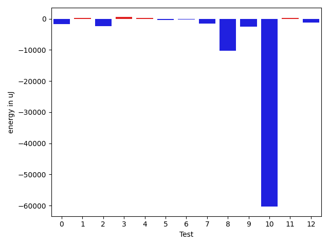

# gson 376385

https://github.com/google/gson/commit/376385

## Delta Energy per test method

| ID | EnergyV1 | EnergyV2 | DeltaEnergy | σV1 | σV2 |
| --- | --- | --- | --- | --- | --- |
| 0 | 39673 | 36926 | -2747 | 3518.9785440950977 | 4356.258091755294 |
| 1 | 37536 | 38147 | 611 | 3578.749705634156 | 3257.808572011476 |
| 2 | 39368 | 38147 | -1221 | 3690.5471470905177 | 4147.0154508198275 |
| 3 | 38391 | 38208 | -183 | 2809.442451359344 | 4396.634007783682 |
| 4 | 38940 | 38086 | -854 | 2803.834177557242 | 2495.3293032377956 |
| 5 | 37781 | 37720 | -61 | 4168.499239963977 | 4207.292634191519 |
| 6 | 37476 | 39429 | 1953 | 4734.606750470413 | 3648.284223694681 |
| 7 | 38880 | 40405 | 1525 | 19305.458249789746 | 10493.914662880312 |
| 8 | 39673 | 37720 | -1953 | 22114.972218159375 | 4094.5562505665075 |
| 9 | 39063 | 36743 | -2320 | 8549.372615552864 | 6321.625337056068 |
| 10 | 158874 | 41443 | -117431 | 92325.19376145791 | 68339.07057652858 |
| 11 | 36132 | 36376 | 244 | 4490.105209502333 | 4603.559769600706 |
| 12 | 36987 | 35584 | -1403 | 4160.700990646169 | 4805.7835000960995 |

## Delta Duration per test method

| ID | DurationV1 | DurationsV2 | DeltaDuration |
| --- | --- | --- | --- |
| 0 | 654902.6363636364 | 671628.8636363636 | 16726.227272727294 |
| 1 | 602740.0434782609 | 650756.6521739131 | 48016.60869565222 |
| 2 | 654550.3333333334 | 631377.9565217391 | -23172.376811594237 |
| 3 | 731240.6 | 552396.2 | -178844.40000000002 |
| 4 | 558221.0 | 592584.4166666666 | 34363.41666666663 |
| 5 | 1272421.4305555555 | 1193463.8333333333 | -78957.59722222225 |
| 6 | 745434.16 | 696027.9545454546 | -49406.205454545445 |
| 7 | 1017472.53125 | 915324.3658536585 | -102148.16539634147 |
| 8 | 1041461.1875 | 666675.7692307692 | -374785.41826923075 |
| 9 | 890352.6739130435 | 890541.1860465116 | 188.5121334681753 |
| 10 | 4348343.231578947 | 2542465.43373494 | -1805877.7978440071 |
| 11 | 903956.14 | 891912.0638297872 | -12044.076170212822 |
| 12 | 871609.3823529412 | 849172.1428571428 | -22437.239495798363 |

## Misc.

| ID | Test Class | Test Method |
| --- | --- | --- |
| 0 | com.google.gson.EscaperTest | testParagraphSeparatorEscaping |
| 1 | com.google.gson.EscaperTest | testAmpersandEscaping |
| 2 | com.google.gson.EscaperTest | testEqualsEscaping |
| 3 | com.google.gson.EscaperTest | testGreaterThanAndLessThanEscaping |
| 4 | com.google.gson.EscaperTest | testRequiredEscapingUnicodeCharacter |
| 5 | com.google.gson.EscaperTest | testControlCharBlockEscaping |
| 6 | com.google.gson.EscaperTest | testLineSeparatorEscaping |
| 7 | com.google.gson.functional.StringTest | testSingleQuoteInStringSerialization |
| 8 | com.google.gson.functional.StringTest | testAssignmentCharSerialization |
| 9 | com.google.gson.GsonTypeAdapterTest | testTypeAdapterProperlyConvertsTypes |
| 10 | com.google.gson.functional.EscapingTest | testEscapingObjectFields |
| 11 | com.google.gson.functional.PrimitiveTest | testHtmlCharacterSerialization |
| 12 | com.google.gson.functional.SecurityTest | testJsonWithNonExectuableTokenSerialization |

| Test | IterationV1 | IterationV2 | DeltaIteration |
| --- | --- | --- | --- |
| 0 | 22 | 22 | 0 |
| 1 | 23 | 23 | 0 |
| 2 | 21 | 23 | 2 |
| 3 | 20 | 25 | 5 |
| 4 | 21 | 24 | 3 |
| 5 | 72 | 60 | -12 |
| 6 | 25 | 22 | -3 |
| 7 | 32 | 41 | 9 |
| 8 | 32 | 26 | -6 |
| 9 | 46 | 43 | -3 |
| 10 | 95 | 83 | -12 |
| 11 | 50 | 47 | -3 |
| 12 | 34 | 35 | 1 |

| Time Label | Time (s) |
| --- | --- |
| Selection | 24.149895429611206 |
| Injection | 8.726296663284302 |
| Total | 955.1076762676239 |

