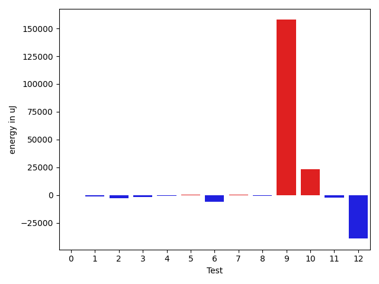

# gson cd9bd7

https://github.com/google/gson/commit/cd9bd7

## Delta Energy per test method

| ID | EnergyV1 | EnergyV2 | DeltaEnergy | σV1 | σV2 |
| --- | --- | --- | --- | --- | --- |
| 0 | 37964 | 37842 | -122 | 5888.341558464132 | 7043.828130595146 |
| 1 | 37353 | 36133 | -1220 | 37451.43006787448 | 6403.929789590139 |
| 2 | 37963 | 35340 | -2623 | 23384.86072846276 | 3886.704114002774 |
| 3 | 38025 | 36560 | -1465 | 14654.926028852997 | 3658.809844506936 |
| 4 | 37964 | 37476 | -488 | 13816.112051029304 | 5026.838423417585 |
| 5 | 37231 | 37903 | 672 | 26127.87157897673 | 3902.0452892613084 |
| 6 | 40406 | 34668 | -5738 | 15322.567430404079 | 5776.969429337497 |
| 7 | 36193 | 36682 | 489 | 66366.83835971015 | 3414.6702807947954 |
| 8 | 38024 | 37292 | -732 | 39928.20300179947 | 5511.124718687698 |
| 9 | 47058 | 204834 | 157776 | 161888.34381352892 | 113607.8415483505 |
| 10 | 119080 | 142150 | 23070 | 529042.42002135 | 490738.0102000531 |
| 11 | 40894 | 38513 | -2381 | 182549.24871667186 | 249447.46812384846 |
| 12 | 77698 | 38574 | -39124 | 339841.52075968275 | 378617.88798891037 |

## Delta Duration per test method

| ID | DurationV1 | DurationsV2 | DeltaDuration |
| --- | --- | --- | --- |
| 0 | 1452037.822222222 | 1511360.3617021276 | 59322.53947990551 |
| 1 | 924551.2058823529 | 976968.5 | 52417.29411764711 |
| 2 | 719498.48 | 599641.052631579 | -119857.42736842099 |
| 3 | 752671.8260869565 | 555189.7826086957 | -197482.04347826086 |
| 4 | 781924.3333333334 | 618080.6666666666 | -163843.66666666674 |
| 5 | 957418.2 | 580319.0 | -377099.19999999995 |
| 6 | 726897.052631579 | 674888.95 | -52008.10263157904 |
| 7 | 911346.7391304348 | 558198.7222222222 | -353148.01690821256 |
| 8 | 949570.8421052631 | 643520.625 | -306050.21710526315 |
| 9 | 4637272.7375 | 5050474.544303797 | 413201.8068037974 |
| 10 | 11746000.808080807 | 10394436.969696969 | -1351563.8383838385 |
| 11 | 3757050.878787879 | 4399594.131313131 | 642543.2525252523 |
| 12 | 6357629.670588235 | 5647720.454545454 | -709909.2160427812 |

## Misc.

| ID | Test Class | Test Method |
| --- | --- | --- |
| 0 | com.google.gson.JsonFieldNameValidatorTest | testValidFieldBeginsWithUnderscore |
| 1 | com.google.gson.JsonFieldNameValidatorTest | testInvalidCharacters |
| 2 | com.google.gson.JsonFieldNameValidatorTest | testInvalidFieldStartingTwoUnderscores |
| 3 | com.google.gson.JsonFieldNameValidatorTest | testValidFieldBeginsWithLetter |
| 4 | com.google.gson.JsonFieldNameValidatorTest | testValidFieldMixingLetter |
| 5 | com.google.gson.JsonFieldNameValidatorTest | testValidFieldBeginsWithDollarSign |
| 6 | com.google.gson.JsonFieldNameValidatorTest | testInvalidFieldStartingTwoDollarSigns |
| 7 | com.google.gson.JsonFieldNameValidatorTest | testInvalidFieldStartingDollarUnderscore |
| 8 | com.google.gson.JsonFieldNameValidatorTest | testInvalidFieldStartingWithNumbers |
| 9 | com.google.gson.SerializedNameAnnotationInterceptingNamingPolicyTest | testFieldWithAnnotation |
| 10 | com.google.gson.functional.NamingPolicyTest | testGsonDuplicateNameUsingSerializedNameFieldNamingPolicySerialization |
| 11 | com.google.gson.functional.NamingPolicyTest | testGsonWithSerializedNameFieldNamingPolicyDeserialization |
| 12 | com.google.gson.functional.NamingPolicyTest | testGsonWithSerializedNameFieldNamingPolicySerialization |

| Test | IterationV1 | IterationV2 | DeltaIteration |
| --- | --- | --- | --- |
| 0 | 45 | 47 | 2 |
| 1 | 34 | 20 | -14 |
| 2 | 25 | 19 | -6 |
| 3 | 23 | 23 | 0 |
| 4 | 24 | 21 | -3 |
| 5 | 20 | 17 | -3 |
| 6 | 19 | 20 | 1 |
| 7 | 23 | 18 | -5 |
| 8 | 19 | 24 | 5 |
| 9 | 80 | 79 | -1 |
| 10 | 99 | 99 | 0 |
| 11 | 99 | 99 | 0 |
| 12 | 85 | 77 | -8 |

| Time Label | Time (s) |
| --- | --- |
| Selection | 22.851027488708496 |
| Injection | 8.656145811080933 |
| Total | 967.0843076705933 |

