# gson abf4ab

https://github.com/google/gson/commit/abf4ab

## Delta Energy per test method

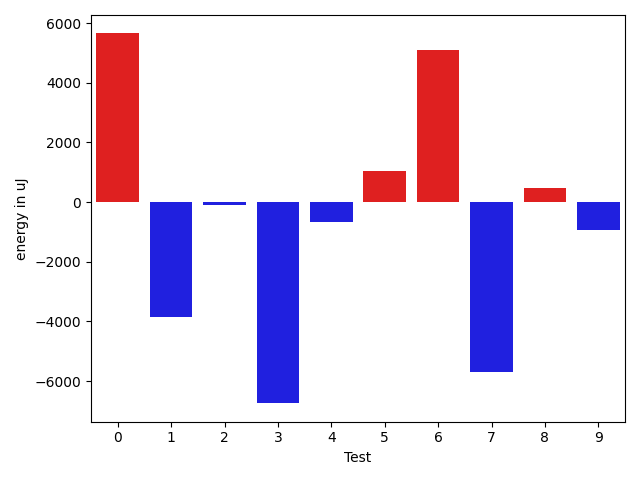

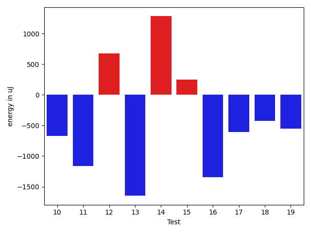

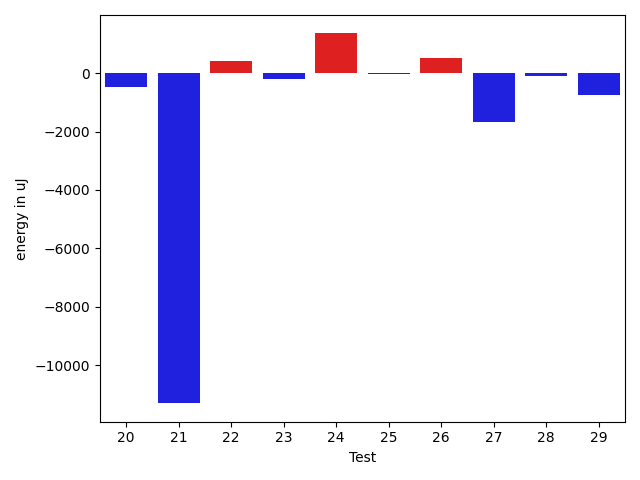

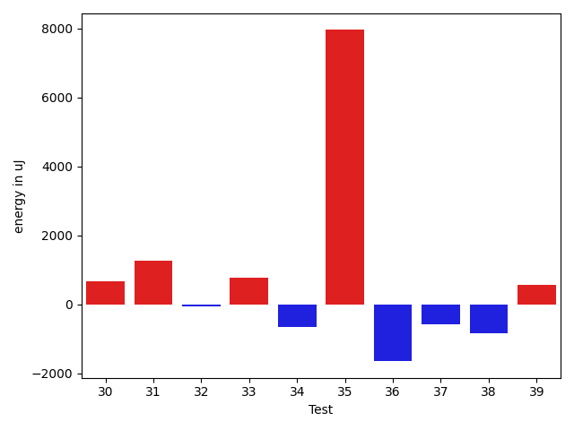

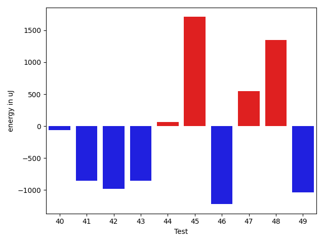

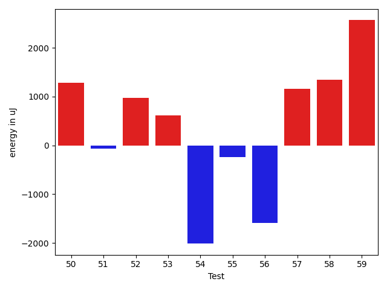

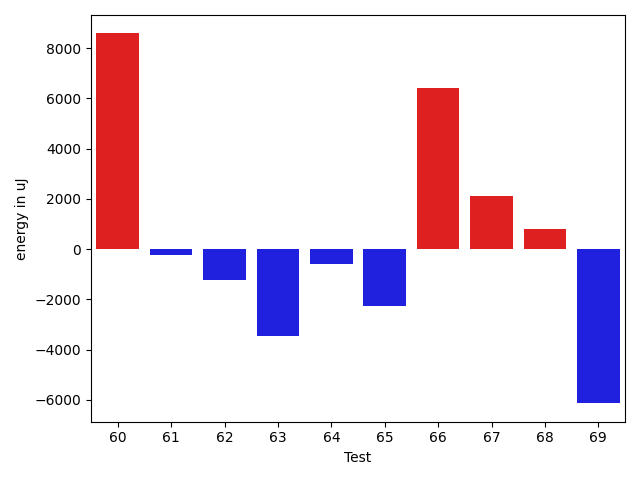

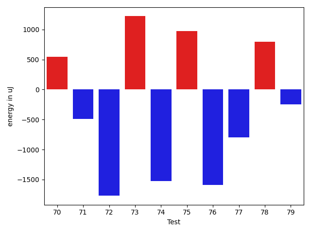

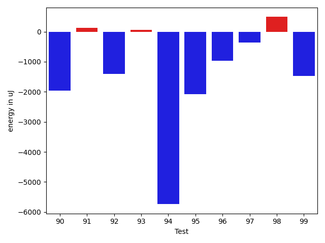

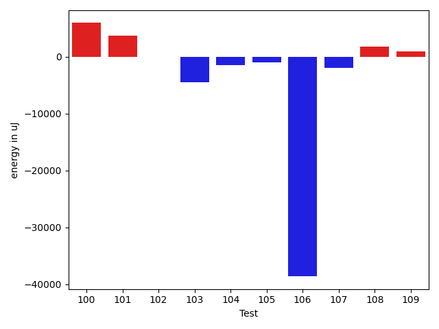

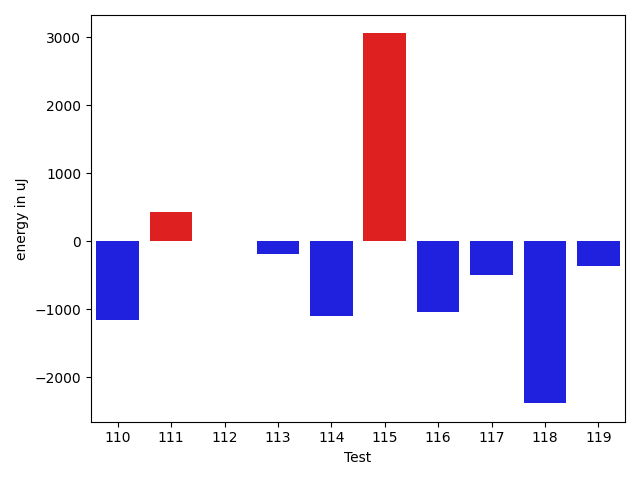

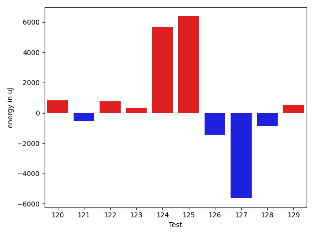

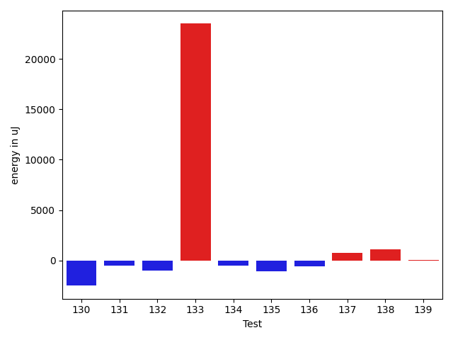

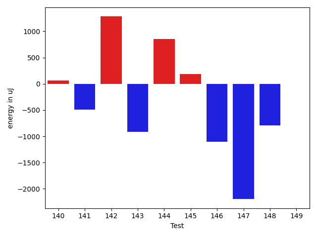

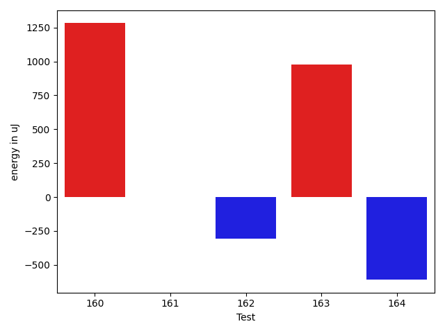

| ID | EnergyV1 | EnergyV2 | DeltaEnergy | σV1 | σV2 |
| --- | --- | --- | --- | --- | --- |
| 0 | 36926 | 37171 | 245 | 146927.3491174279 | 146862.96045282303 |
| 1 | 36682 | 36376 | -306 | 22882.06712135278 | 4481.801384604372 |
| 2 | 35400 | 35278 | -122 | 6737.459988056077 | 7960.9039589286 |
| 3 | 35156 | 33386 | -1770 | 27473.935249591836 | 2940.5163722914867 |
| 4 | 34729 | 34240 | -489 | 3752.8854844727243 | 3290.571857097511 |
| 5 | 38696 | 37964 | -732 | 26120.247558682506 | 28244.28637114339 |
| 6 | 35034 | 35339 | 305 | 5752.039591248058 | 19760.760278512873 |
| 7 | 36682 | 34973 | -1709 | 28360.54295192973 | 14744.922826336624 |
| 8 | 33264 | 33203 | -61 | 3216.011751082972 | 4151.354338184826 |
| 9 | 34424 | 34729 | 305 | 7890.682827367896 | 4764.485094067481 |
| 10 | 34058 | 33386 | -672 | 3719.0997789190274 | 25086.25371556243 |
| 11 | 36133 | 34973 | -1160 | 7301.476505248087 | 7407.589250073383 |
| 12 | 35461 | 36133 | 672 | 57146.41654552626 | 58231.76191591959 |
| 13 | 35766 | 34118 | -1648 | 5032.5174457552985 | 18156.042155484105 |
| 14 | 35705 | 36987 | 1282 | 72866.08514307014 | 12434.069503560568 |
| 15 | 35766 | 36011 | 245 | 4413.204552211436 | 4493.199036984756 |
| 16 | 36560 | 35218 | -1342 | 3631.563309460568 | 3443.350161552868 |
| 17 | 34851 | 34241 | -610 | 3352.6914816947547 | 3628.931207570191 |
| 18 | 34545 | 34118 | -427 | 4233.129802152894 | 2641.3505093098775 |
| 19 | 34729 | 34180 | -549 | 3242.3406977482105 | 3782.7533886707724 |
| 20 | 35827 | 34851 | -976 | 3610.3767048399063 | 4035.527277606298 |
| 21 | 37475 | 36499 | -976 | 89166.39614190039 | 67086.21944086338 |
| 22 | 34485 | 35523 | 1038 | 4252.748296405026 | 4009.495622496987 |
| 23 | 35461 | 34362 | -1099 | 3549.2143294539687 | 4118.818682448754 |
| 24 | 35339 | 33325 | -2014 | 4884.938454900037 | 24050.802175673653 |
| 25 | 34851 | 34912 | 61 | 3874.033514898421 | 4185.5778292329 |
| 26 | 33448 | 35827 | 2379 | 5155.271000773164 | 3626.8844219246907 |
| 27 | 36376 | 35828 | -548 | 4153.29930532327 | 3412.4568970280156 |
| 28 | 33508 | 34729 | 1221 | 4700.895322524565 | 3282.010111850833 |
| 29 | 36499 | 36316 | -183 | 4017.4722634512373 | 3841.3400202674025 |
| 30 | 34180 | 34790 | 610 | 3048.9027579132276 | 3017.5674977215976 |
| 31 | 34485 | 35889 | 1404 | 3198.1747464584682 | 2971.453495605006 |
| 32 | 34058 | 33752 | -306 | 4082.0597035753553 | 4257.613181114508 |
| 33 | 32898 | 34485 | 1587 | 4175.606319542405 | 3012.809237527345 |
| 34 | 35461 | 34790 | -671 | 3174.176572123927 | 3627.90677840176 |
| 35 | 39062 | 37963 | -1099 | 85676.204947304 | 97914.14390919806 |
| 36 | 34546 | 35156 | 610 | 2834.49115405217 | 3845.5880375004635 |
| 37 | 34363 | 33386 | -977 | 3932.9751364016684 | 2513.9130865649913 |
| 38 | 34790 | 33569 | -1221 | 3856.7879802025277 | 2755.767615164408 |
| 39 | 34119 | 34851 | 732 | 3112.0202179186904 | 2643.600975101113 |
| 40 | 34485 | 34424 | -61 | 3729.5599370937853 | 3241.392256260901 |
| 41 | 35950 | 35095 | -855 | 4350.906431666891 | 4674.343038647362 |
| 42 | 34363 | 33386 | -977 | 3991.797604987467 | 3056.942342487689 |
| 43 | 37048 | 36194 | -854 | 3815.6990766969316 | 3950.2043777316558 |
| 44 | 35888 | 35950 | 62 | 4535.235645472379 | 3768.341558851409 |
| 45 | 34119 | 35827 | 1708 | 3367.752167206225 | 3279.3995184810983 |
| 46 | 35644 | 34424 | -1220 | 7327.739493102581 | 8678.9307002171 |
| 47 | 34240 | 34790 | 550 | 3201.4823191765404 | 3574.9310985493134 |
| 48 | 34545 | 35889 | 1344 | 3297.171853934065 | 3211.5589089802384 |
| 49 | 35644 | 34606 | -1038 | 2945.6068272222806 | 3927.5135918797278 |
| 50 | 34240 | 35523 | 1283 | 2386.84027035545 | 3120.499910804891 |
| 51 | 37720 | 37658 | -62 | 4287.127921112627 | 46370.16191671537 |
| 52 | 34668 | 35644 | 976 | 3413.0604098202257 | 3449.204313325282 |
| 53 | 33387 | 33997 | 610 | 2736.2648219095745 | 2490.871483690776 |
| 54 | 35156 | 33142 | -2014 | 3841.381294026115 | 2751.098220620473 |
| 55 | 35522 | 35278 | -244 | 3608.984836756599 | 4121.646669896408 |
| 56 | 37842 | 36255 | -1587 | 3741.7052672906016 | 4103.690186488701 |
| 57 | 34362 | 35523 | 1161 | 3176.343607284713 | 2989.2206908896796 |
| 58 | 36499 | 37842 | 1343 | 3566.1834380468454 | 3493.7370801369652 |
| 59 | 34423 | 36987 | 2564 | 4056.7026622615563 | 3348.611896475612 |
| 60 | 37903 | 35766 | -2137 | 45884.5205875815 | 62305.233965777494 |
| 61 | 35889 | 36011 | 122 | 3854.1055167703958 | 2993.585684135981 |
| 62 | 36255 | 34363 | -1892 | 4277.111018463996 | 3928.273972388074 |
| 63 | 36927 | 33691 | -3236 | 3917.5751665533576 | 3107.8568221299233 |
| 64 | 35339 | 33630 | -1709 | 3922.4606954818555 | 3865.8569474566116 |
| 65 | 36255 | 34851 | -1404 | 4413.0393161535685 | 3269.122989596333 |
| 66 | 35828 | 36499 | 671 | 27481.720975529526 | 42148.87505498523 |
| 67 | 142273 | 144348 | 2075 | 32853.38200013588 | 33905.396540532565 |
| 68 | 33936 | 34729 | 793 | 3585.734626064963 | 3737.998860551121 |
| 69 | 35034 | 33752 | -1282 | 31160.320948895354 | 7344.695486481134 |
| 70 | 34790 | 35339 | 549 | 7488.090393434558 | 3194.36014343429 |
| 71 | 35095 | 34607 | -488 | 3478.2534677047324 | 3984.2493385955104 |
| 72 | 35827 | 34058 | -1769 | 30279.247673089285 | 3032.4699141988635 |
| 73 | 35034 | 36255 | 1221 | 3634.138566369158 | 3769.5922835732513 |
| 74 | 36438 | 34912 | -1526 | 3415.540902756429 | 3889.4768561907845 |
| 75 | 33997 | 34973 | 976 | 3757.557731750507 | 3795.690271749429 |
| 76 | 39001 | 37414 | -1587 | 15547.379023115116 | 15167.216126949197 |
| 77 | 39062 | 38269 | -793 | 71808.96897533257 | 61143.993040790374 |
| 78 | 35766 | 36560 | 794 | 3502.3102389708424 | 3693.7917319977582 |
| 79 | 35340 | 35096 | -244 | 3111.073112673503 | 3842.7644399725873 |
| 80 | 35095 | 35095 | 0 | 3109.6738190405827 | 3797.764340190695 |
| 81 | 35644 | 35523 | -121 | 4680.7970204717085 | 5475.281213195666 |
| 82 | 36927 | 36804 | -123 | 66930.86141125095 | 46249.98389627345 |
| 83 | 35583 | 36255 | 672 | 3662.290439736756 | 3888.504589012111 |
| 84 | 36682 | 36194 | -488 | 3563.2401545266725 | 3885.2008751157255 |
| 85 | 35949 | 35034 | -915 | 3718.424842725809 | 4152.769276326341 |
| 86 | 36621 | 35522 | -1099 | 3342.3842309945853 | 3543.3161881738693 |
| 87 | 36743 | 35949 | -794 | 11126.178730544061 | 12623.636407865602 |
| 88 | 36316 | 35644 | -672 | 11938.602902841201 | 7634.4158100274435 |
| 89 | 37781 | 37415 | -366 | 13889.219156910694 | 21624.648134145904 |
| 90 | 36438 | 34485 | -1953 | 95502.07114241809 | 63032.676551149365 |
| 91 | 64941 | 65063 | 122 | 22134.71286253302 | 27579.427324252418 |
| 92 | 38452 | 37048 | -1404 | 17536.557305538474 | 18546.699715018996 |
| 93 | 35889 | 35950 | 61 | 9694.44049658742 | 9991.624845598179 |
| 94 | 43579 | 37842 | -5737 | 20720.670649658405 | 17676.6347681064 |
| 95 | 36194 | 34119 | -2075 | 25022.07825748555 | 22053.1765546925 |
| 96 | 36315 | 35339 | -976 | 4392.3497079202 | 3826.7831297488106 |
| 97 | 36132 | 35767 | -365 | 21560.32651109595 | 7394.73498956637 |
| 98 | 35339 | 35828 | 489 | 3666.7873516502464 | 4301.9335902543235 |
| 99 | 37109 | 35644 | -1465 | 4391.128023849024 | 3998.839411629329 |
| 100 | 37170 | 38025 | 855 | 75113.75262894768 | 79818.15816537234 |
| 101 | 35400 | 35401 | 1 | 3484.1185812983967 | 24373.774133930427 |
| 102 | 36499 | 36194 | -305 | 4409.836621406739 | 2822.1102897854053 |
| 103 | 41748 | 37292 | -4456 | 81123.20977634811 | 80412.4796595031 |
| 104 | 37597 | 36194 | -1403 | 33681.81598702175 | 39540.13133879624 |
| 105 | 36133 | 35400 | -733 | 6793.864901705919 | 4128.59127571076 |
| 106 | 39245 | 38269 | -976 | 130509.55840407503 | 85244.06325414535 |
| 107 | 37842 | 37048 | -794 | 9364.011462556977 | 8026.488512922234 |
| 108 | 34851 | 36316 | 1465 | 3596.472711283961 | 7030.801114282337 |
| 109 | 35340 | 36316 | 976 | 6861.909745908033 | 6147.434926697299 |
| 110 | 37597 | 36438 | -1159 | 75854.46610270347 | 36743.46586362652 |
| 111 | 35339 | 35766 | 427 | 3467.877653177631 | 3860.973204171887 |
| 112 | 35949 | 35949 | 0 | 3671.020808445747 | 3505.810000359502 |
| 113 | 38574 | 38391 | -183 | 66598.18795266475 | 65383.352414268076 |
| 114 | 35584 | 34485 | -1099 | 3525.554669590515 | 3881.467082503345 |
| 115 | 37780 | 40832 | 3052 | 17824.65063584502 | 19745.1856826397 |
| 116 | 36315 | 35278 | -1037 | 7371.420637160854 | 4396.4622375948165 |
| 117 | 36499 | 36010 | -489 | 19696.038599868247 | 3990.1467523849487 |
| 118 | 36560 | 34180 | -2380 | 4293.0734391594815 | 5012.20018883855 |
| 119 | 36072 | 35705 | -367 | 3557.0374055626976 | 4345.142042300642 |
| 120 | 35766 | 36437 | 671 | 3197.318697338854 | 3648.5930640369825 |
| 121 | 36437 | 36193 | -244 | 4249.968676355156 | 3774.709571133694 |
| 122 | 34912 | 35339 | 427 | 3893.0663237037393 | 3705.9237000703256 |
| 123 | 34790 | 36255 | 1465 | 4018.9069247653847 | 3791.3073626740634 |
| 124 | 38330 | 38452 | 122 | 65407.29390433109 | 65641.35186127569 |
| 125 | 37476 | 36987 | -489 | 3703.468221246741 | 31142.493382950935 |
| 126 | 37598 | 36804 | -794 | 3191.8668910216165 | 3937.546993426718 |
| 127 | 35218 | 36987 | 1769 | 28716.84946232005 | 2545.1626869451175 |
| 128 | 36133 | 36011 | -122 | 8440.147175332979 | 7533.757258761557 |
| 129 | 35034 | 35156 | 122 | 3646.535257988753 | 4566.862207070338 |
| 130 | 38085 | 35583 | -2502 | 4103.203019999539 | 4921.209655068133 |
| 131 | 38819 | 38330 | -489 | 56762.18443250022 | 69964.75365541055 |
| 132 | 343871 | 342895 | -976 | 102711.36732896637 | 104291.3547813547 |
| 133 | 43457 | 66955 | 23498 | 52176.32705190237 | 49838.67016944931 |
| 134 | 37231 | 36743 | -488 | 44122.448072575164 | 42611.500975507486 |
| 135 | 37292 | 36194 | -1098 | 85071.31893508212 | 104034.98970132208 |
| 136 | 39307 | 38696 | -611 | 32554.00893231788 | 59288.21150844197 |
| 137 | 36926 | 37659 | 733 | 4555.234905616996 | 53892.991238973904 |
| 138 | 36438 | 37537 | 1099 | 3174.6296446309702 | 5921.827197651375 |
| 139 | 38330 | 38391 | 61 | 32963.88597382804 | 61078.52371093972 |
| 140 | 71410 | 71472 | 62 | 21560.85283197199 | 30127.416278919478 |
| 141 | 37842 | 37353 | -489 | 51066.016156184654 | 73858.05349845234 |
| 142 | 36987 | 38269 | 1282 | 12325.140949270113 | 12930.17890402038 |
| 143 | 36926 | 36011 | -915 | 4105.599673329172 | 7225.768912562282 |
| 144 | 35766 | 36621 | 855 | 27843.498049806596 | 5705.615898611228 |
| 145 | 36316 | 36499 | 183 | 23426.365434268213 | 3993.44802778093 |
| 146 | 36804 | 35705 | -1099 | 3481.6310581048 | 3552.064993509021 |
| 147 | 40100 | 37903 | -2197 | 59203.71614233772 | 54808.106757287846 |
| 148 | 37903 | 37109 | -794 | 22884.616234542114 | 3812.881270536742 |
| 149 | 36560 | 36560 | 0 | 3881.053088435548 | 3793.4893123727047 |
| 150 | 35949 | 36072 | 123 | 3370.3163547456134 | 3271.164737885005 |
| 151 | 34790 | 36743 | 1953 | 4291.3048745156375 | 3701.282787457245 |
| 152 | 36804 | 35279 | -1525 | 4104.9004777184045 | 4368.069787293544 |
| 153 | 35461 | 39246 | 3785 | 4121.736176796267 | 4140.520747744177 |
| 154 | 35095 | 37109 | 2014 | 4161.9645484906 | 4842.222214810055 |
| 155 | 36071 | 36438 | 367 | 36883.20250217335 | 3212.8864135814024 |
| 156 | 35401 | 37475 | 2074 | 3070.0829991920687 | 3214.5180272476305 |
| 157 | 40100 | 37109 | -2991 | 62606.90303917791 | 54901.83791569823 |
| 158 | 36499 | 35461 | -1038 | 3981.1664495065697 | 3603.242191312734 |
| 159 | 37109 | 36987 | -122 | 3202.9784735572302 | 4439.843179933273 |
| 160 | 35217 | 36499 | 1282 | 35758.713080497364 | 4922.823738014145 |
| 161 | 34912 | 34912 | 0 | 3522.1702309931975 | 3417.0702509882694 |
| 162 | 37781 | 37475 | -306 | 3609.8825797620375 | 3992.3225050557976 |
| 163 | 36316 | 37292 | 976 | 102921.76348900363 | 106607.15375617649 |
| 164 | 37598 | 36988 | -610 | 3312.1281337532823 | 3990.8142256429014 |

## Delta Duration per test method

| ID | DurationV1 | DurationsV2 | DeltaDuration |
| --- | --- | --- | --- |
| 0 | 2307511.895522388 | 2443988.475409836 | 136476.57988744788 |
| 1 | 932278.8125 | 817637.7708333334 | -114641.04166666663 |
| 2 | 1066458.6056338027 | 1080531.7323943663 | 14073.12676056358 |
| 3 | 737568.5555555555 | 559242.25 | -178326.3055555555 |
| 4 | 744320.4358974359 | 652615.7741935484 | -91704.66170388751 |
| 5 | 1702710.5454545454 | 1551152.06185567 | -151558.48359887535 |
| 6 | 953158.7049180327 | 1079675.5846153847 | 126516.87969735195 |
| 7 | 1401705.4805194805 | 1259763.0506329115 | -141942.42988656904 |
| 8 | 616599.0606060605 | 605367.487804878 | -11231.572801182512 |
| 9 | 854036.2553191489 | 936213.7777777778 | 82177.52245862887 |
| 10 | 709137.7666666667 | 747155.1724137932 | 38017.40574712644 |
| 11 | 1073245.7397260275 | 1109700.40625 | 36454.666523972526 |
| 12 | 1237219.9032258065 | 1285418.9137931035 | 48199.010567296995 |
| 13 | 992763.3709677419 | 1121994.353846154 | 129230.982878412 |
| 14 | 1179450.46875 | 790103.125 | -389347.34375 |
| 15 | 768307.3913043478 | 652827.5853658536 | -115479.80593849416 |
| 16 | 704205.6382978724 | 732859.9130434783 | 28654.274745605886 |
| 17 | 690331.3142857143 | 638224.4594594594 | -52106.85482625489 |
| 18 | 516303.8125 | 521411.2962962963 | 5107.483796296292 |
| 19 | 798674.7962962963 | 830789.7142857143 | 32114.917989418027 |
| 20 | 598217.0869565217 | 551541.8529411765 | -46675.234015345224 |
| 21 | 1547630.4347826086 | 1262154.0869565217 | -285476.3478260869 |
| 22 | 729138.1463414634 | 687515.9189189189 | -41622.2274225445 |
| 23 | 504784.76470588235 | 486560.9 | -18223.864705882326 |
| 24 | 770090.0 | 864259.1136363636 | 94169.11363636365 |
| 25 | 488260.1923076923 | 513635.4827586207 | 25375.290450928384 |
| 26 | 469758.8947368421 | 446153.35 | -23605.5447368421 |
| 27 | 695029.6944444445 | 655339.4074074074 | -39690.28703703708 |
| 28 | 472411.25 | 466551.6956521739 | -5859.55434782611 |
| 29 | 749951.72 | 739378.5862068966 | -10573.133793103392 |
| 30 | 500613.38095238095 | 491938.95454545453 | -8674.426406926417 |
| 31 | 485182.82608695654 | 503322.2962962963 | 18139.47020933975 |
| 32 | 518073.5 | 536787.64 | 18714.140000000014 |
| 33 | 507490.3333333333 | 458041.0 | -49449.333333333314 |
| 34 | 600507.3142857143 | 562548.21875 | -37959.095535714296 |
| 35 | 1899403.6315789474 | 2278324.5405405406 | 378920.9089615932 |
| 36 | 447952.72 | 431766.0833333333 | -16186.636666666658 |
| 37 | 439543.54545454547 | 472529.38095238095 | 32985.83549783548 |
| 38 | 598779.6428571428 | 578359.5294117647 | -20420.11344537814 |
| 39 | 477697.38095238095 | 462264.0 | -15433.380952380947 |
| 40 | 571060.4 | 570679.8648648649 | -380.535135135171 |
| 41 | 632824.7692307692 | 609461.5675675676 | -23363.201663201675 |
| 42 | 687678.1142857143 | 669025.9117647059 | -18652.20252100844 |
| 43 | 703391.1842105263 | 706597.9285714285 | 3206.7443609022303 |
| 44 | 548277.0606060605 | 517092.625 | -31184.43560606055 |
| 45 | 443256.3333333333 | 437561.95238095237 | -5694.380952380947 |
| 46 | 968479.6206896552 | 954506.3928571428 | -13973.227832512348 |
| 47 | 483982.92 | 490840.75 | 6857.830000000016 |
| 48 | 424301.4166666667 | 465525.1904761905 | 41223.77380952379 |
| 49 | 484310.5 | 481227.64 | -3082.859999999986 |
| 50 | 509491.7619047619 | 471626.6 | -37865.16190476192 |
| 51 | 583303.9545454546 | 875263.96 | 291960.0054545454 |
| 52 | 689775.2258064516 | 601430.3703703703 | -88344.8554360813 |
| 53 | 491037.0909090909 | 509911.7916666667 | 18874.700757575803 |
| 54 | 408496.9375 | 444264.8095238095 | 35767.87202380953 |
| 55 | 612394.2894736842 | 564791.8157894737 | -47602.47368421045 |
| 56 | 589757.7777777778 | 565832.9642857143 | -23924.813492063433 |
| 57 | 496303.3461538461 | 511755.36363636365 | 15452.01748251752 |
| 58 | 512415.52173913043 | 520016.04545454547 | 7600.523715415038 |
| 59 | 429651.35 | 472070.0588235294 | 42418.70882352942 |
| 60 | 1144882.1162790698 | 1507778.3125 | 362896.1962209302 |
| 61 | 563353.48 | 552266.125 | -11087.354999999981 |
| 62 | 821551.8703703703 | 838306.8292682926 | 16754.958897922304 |
| 63 | 510435.94736842107 | 507753.95454545453 | -2681.9928229665384 |
| 64 | 684340.62 | 680769.7692307692 | -3570.8507692307467 |
| 65 | 489720.3461538461 | 453368.1176470588 | -36352.22850678733 |
| 66 | 703060.2272727273 | 864871.9565217391 | 161811.72924901184 |
| 67 | 4634600.787878788 | 4761953.858585859 | 127353.07070707064 |
| 68 | 625867.448275862 | 615765.3703703703 | -10102.077905491693 |
| 69 | 1221125.2253521127 | 1041184.2911392405 | -179940.93421287218 |
| 70 | 762659.2 | 746771.5961538461 | -15887.603846153826 |
| 71 | 748065.74 | 958927.4888888889 | 210861.74888888886 |
| 72 | 745583.0 | 614251.1851851852 | -131331.81481481483 |
| 73 | 693651.0975609756 | 614239.65625 | -79411.44131097558 |
| 74 | 762509.1515151515 | 732103.90625 | -30405.24526515149 |
| 75 | 523771.2272727273 | 494674.0 | -29097.227272727294 |
| 76 | 1132046.62 | 1026963.0652173914 | -105083.55478260876 |
| 77 | 1869531.2424242424 | 1442924.625 | -426606.61742424243 |
| 78 | 839354.64 | 863436.375 | 24081.734999999986 |
| 79 | 875678.82 | 788182.7735849057 | -87496.04641509429 |
| 80 | 828345.9636363636 | 844656.8679245283 | 16310.90428816469 |
| 81 | 1080678.1780821919 | 1104272.0921052631 | 23593.914023071295 |
| 82 | 1673457.7586206896 | 1127589.5 | -545868.2586206896 |
| 83 | 800546.625 | 795096.8867924528 | -5449.738207547227 |
| 84 | 813519.4594594594 | 784758.2666666667 | -28761.192792792688 |
| 85 | 782981.8936170213 | 832482.36 | 49500.46638297872 |
| 86 | 839043.0169491526 | 870403.6785714285 | 31360.661622275948 |
| 87 | 1370999.701030928 | 1322819.0 | -48180.70103092794 |
| 88 | 1353601.9 | 1257654.6630434783 | -95947.23695652164 |
| 89 | 1402277.191919192 | 1422264.0404040404 | 19986.848484848393 |
| 90 | 2416002.263736264 | 1781100.630952381 | -634901.6327838828 |
| 91 | 2054209.9595959596 | 2058983.2727272727 | 4773.3131313130725 |
| 92 | 1498666.1847826086 | 1503120.7727272727 | 4454.587944664061 |
| 93 | 1294386.3617021276 | 1286524.652173913 | -7861.709528214531 |
| 94 | 1688552.2323232323 | 1633653.6565656567 | -54898.57575757569 |
| 95 | 1194080.6790123456 | 1134306.756097561 | -59773.922914784634 |
| 96 | 871583.7333333333 | 1001490.1607142857 | 129906.4273809524 |
| 97 | 1095480.1466666667 | 997795.6 | -97684.54666666675 |
| 98 | 896623.3833333333 | 918019.4035087719 | 21396.020175438607 |
| 99 | 660025.8292682926 | 651497.6571428571 | -8528.17212543555 |
| 100 | 1777098.611111111 | 2140392.4545454546 | 363293.8434343436 |
| 101 | 804725.9285714285 | 911972.0263157894 | 107246.09774436092 |
| 102 | 517526.75 | 566671.2173913043 | 49144.46739130432 |
| 103 | 2207541.2978723403 | 2175525.1 | -32016.197872340214 |
| 104 | 908155.9375 | 777437.1818181818 | -130718.75568181823 |
| 105 | 668748.9736842106 | 649831.3125 | -18917.661184210563 |
| 106 | 2844256.5 | 1409546.9714285715 | -1434709.5285714285 |
| 107 | 935495.96875 | 807180.2619047619 | -128315.7068452381 |
| 108 | 615590.2857142857 | 565483.34375 | -50106.94196428568 |
| 109 | 806017.6666666666 | 748862.8684210526 | -57154.798245614045 |
| 110 | 1931205.261904762 | 935982.0454545454 | -995223.2164502165 |
| 111 | 862019.3220338983 | 904547.4722222222 | 42528.150188323925 |
| 112 | 807889.1041666666 | 884853.5 | 76964.39583333337 |
| 113 | 1973150.3384615385 | 1974322.5606060605 | 1172.2221445220057 |
| 114 | 927369.53125 | 933722.4788732395 | 6352.947623239481 |
| 115 | 1620961.3541666667 | 1685015.0918367347 | 64053.73767006793 |
| 116 | 1004702.734375 | 991488.8333333334 | -13213.901041666628 |
| 117 | 971195.35 | 940533.6825396825 | -30661.66746031749 |
| 118 | 763815.0 | 802877.6666666666 | 39062.66666666663 |
| 119 | 906266.4893617021 | 817203.8636363636 | -89062.62572533847 |
| 120 | 827901.2790697674 | 790703.1020408163 | -37198.17702895112 |
| 121 | 869319.8269230769 | 903310.9565217391 | 33991.12959866226 |
| 122 | 690958.4565217391 | 704154.3333333334 | 13195.876811594237 |
| 123 | 931218.9354838709 | 1010440.5079365079 | 79221.57245263702 |
| 124 | 1563397.3673469387 | 1800871.6 | 237474.2326530614 |
| 125 | 544211.5652173914 | 759844.3214285715 | 215632.75621118012 |
| 126 | 486030.9375 | 486447.03846153844 | 416.10096153843915 |
| 127 | 825944.3684210526 | 533873.5806451613 | -292070.78777589125 |
| 128 | 1050517.6610169492 | 938395.7391304348 | -112121.9218865144 |
| 129 | 649483.4285714285 | 608792.3928571428 | -40691.03571428568 |
| 130 | 679143.3 | 795684.0370370371 | 116540.73703703703 |
| 131 | 1358737.4473684211 | 1746927.5294117648 | 388190.0820433437 |
| 132 | 10029179.757575758 | 10393426.252525253 | 364246.4949494954 |
| 133 | 2053574.121212121 | 2095894.4343434344 | 42320.313131313305 |
| 134 | 1314239.2142857143 | 1329620.4696969697 | 15381.255411255406 |
| 135 | 1272137.3617021276 | 1804573.0714285714 | 532435.7097264437 |
| 136 | 943403.911111111 | 1412769.6181818182 | 469365.7070707071 |
| 137 | 645041.380952381 | 1219706.024390244 | 574664.643437863 |
| 138 | 647849.2162162162 | 732439.4047619047 | 84590.18854568852 |
| 139 | 1208667.4788732394 | 1736110.4794520547 | 527443.0005788154 |
| 140 | 2150167.494949495 | 2298611.6565656564 | 148444.16161616147 |
| 141 | 1446967.0597014925 | 2010706.6296296297 | 563739.5699281371 |
| 142 | 1142758.6125 | 1305543.9871794872 | 162785.3746794872 |
| 143 | 997338.2407407408 | 948097.9076923077 | -49240.333048433065 |
| 144 | 1051074.5967741935 | 1024584.5384615385 | -26490.05831265496 |
| 145 | 919179.3333333334 | 849217.4339622641 | -69961.89937106927 |
| 146 | 840139.0370370371 | 881528.4107142857 | 41389.3736772486 |
| 147 | 1343320.5625 | 1277678.3018867925 | -65642.26061320747 |
| 148 | 837794.5217391305 | 738577.4222222222 | -99217.09951690829 |
| 149 | 606212.7857142857 | 629926.375 | 23713.58928571432 |
| 150 | 519130.3333333333 | 520492.2105263158 | 1361.8771929824725 |
| 151 | 498294.9166666667 | 502515.4090909091 | 4220.492424242431 |
| 152 | 423686.38095238095 | 477473.7083333333 | 53787.32738095237 |
| 153 | 480787.6666666667 | 502627.0 | 21839.333333333314 |
| 154 | 550085.0454545454 | 506057.08 | -44027.965454545396 |
| 155 | 780068.0476190476 | 454970.4285714286 | -325097.619047619 |
| 156 | 443192.7826086957 | 443101.95 | -90.83260869566584 |
| 157 | 1508247.8636363635 | 1071624.76 | -436623.1036363635 |
| 158 | 447532.347826087 | 466170.36363636365 | 18638.015810276673 |
| 159 | 464004.6923076923 | 471565.08 | 7560.387692307704 |
| 160 | 802292.8 | 493385.2 | -308907.60000000003 |
| 161 | 404444.46153846156 | 445321.9130434783 | 40877.45150501671 |
| 162 | 520665.7727272727 | 474217.1666666667 | -46448.60606060602 |
| 163 | 2522650.84 | 2300093.625 | -222557.21499999985 |
| 164 | 504909.32 | 454419.9375 | -50489.38250000001 |

## Misc.

| ID | Test Class | Test Method |
| --- | --- | --- |
| 0 | com.google.gson.functional.CustomDeserializerTest | testDefaultConstructorNotCalledOnObject |
| 1 | com.google.gson.functional.CustomDeserializerTest | testDefaultConstructorNotCalledOnField |
| 2 | com.google.gson.functional.ObjectTest | testDirectedAcyclicGraphDeserialization |
| 3 | com.google.gson.functional.ObjectTest | testNullObjectFieldsDeserialization |
| 4 | com.google.gson.functional.ObjectTest | testEmptyCollectionInAnObjectDeserialization |
| 5 | com.google.gson.functional.ObjectTest | testArrayOfArraysDeserialization |
| 6 | com.google.gson.functional.ObjectTest | testStringFieldWithNumberValueDeserialization |
| 7 | com.google.gson.functional.ObjectTest | testSubInterfacesOfCollectionDeserialization |
| 8 | com.google.gson.functional.ObjectTest | testClassWithTransientFieldsDeserializationTransientFieldsPassedInJsonAreIgnored |
| 9 | com.google.gson.functional.ObjectTest | testNullArraysDeserialization |
| 10 | com.google.gson.functional.ObjectTest | testObjectFieldNamesWithoutQuotesDeserialization |
| 11 | com.google.gson.functional.ObjectTest | testArrayOfObjectsDeserialization |
| 12 | com.google.gson.functional.ObjectTest | testNestedDeserialization |
| 13 | com.google.gson.functional.ObjectTest | testInheritenceDeserialization |
| 14 | com.google.gson.functional.ObjectTest | testBagOfPrimitiveWrappersDeserialization |
| 15 | com.google.gson.functional.ObjectTest | testJsonInMixedQuotesDeserialization |
| 16 | com.google.gson.functional.ObjectTest | testNullFieldsDeserialization |
| 17 | com.google.gson.functional.ObjectTest | testClassWithTransientFieldsDeserialization |
| 18 | com.google.gson.functional.ObjectTest | testNullPrimitiveFieldsDeserialization |
| 19 | com.google.gson.functional.ObjectTest | testInnerClassDeserialization |
| 20 | com.google.gson.functional.ObjectTest | testPrivateNoArgConstructorDeserialization |
| 21 | com.google.gson.functional.ObjectTest | testJsonInSingleQuotesDeserialization |
| 22 | com.google.gson.functional.ObjectTest | testBagOfPrimitivesDeserialization |
| 23 | com.google.gson.functional.ObjectTest | testClassWithNoFieldsDeserialization |
| 24 | com.google.gson.functional.ObjectTest | testPrimitiveArrayInAnObjectDeserialization |
| 25 | com.google.gson.functional.ObjectTest | testNullDeserialization |
| 26 | com.google.gson.functional.PrimitiveTest | testBigDecimalPreservePrecisionDeserialization |
| 27 | com.google.gson.functional.PrimitiveTest | testPrimitiveIntegerAutoboxedDeserialization |
| 28 | com.google.gson.functional.PrimitiveTest | testSmallValueForBigIntegerDeserialization |
| 29 | com.google.gson.functional.PrimitiveTest | testDoubleAsStringRepresentationDeserialization |
| 30 | com.google.gson.functional.PrimitiveTest | testDoubleInfinityDeserialization |
| 31 | com.google.gson.functional.PrimitiveTest | testFloatNaNDeserialization |
| 32 | com.google.gson.functional.PrimitiveTest | testPrimitiveDoubleAutoboxedInASingleElementArrayDeserialization |
| 33 | com.google.gson.functional.PrimitiveTest | testBigDecimalDeserialization |
| 34 | com.google.gson.functional.PrimitiveTest | testLargeDoubleDeserialization |
| 35 | com.google.gson.functional.PrimitiveTest | testPrimitiveIntegerAutoboxedInASingleElementArrayDeserialization |
| 36 | com.google.gson.functional.PrimitiveTest | testBigDecimalAsStringRepresentationDeserialization |
| 37 | com.google.gson.functional.PrimitiveTest | testBigIntegerInASingleElementArrayDeserialization |
| 38 | com.google.gson.functional.PrimitiveTest | testBadValueForBigIntegerDeserialization |
| 39 | com.google.gson.functional.PrimitiveTest | testSmallValueForBigDecimalDeserialization |
| 40 | com.google.gson.functional.PrimitiveTest | testBigDecimalNaNDeserializationNotSupported |
| 41 | com.google.gson.functional.PrimitiveTest | testPrimitiveBooleanAutoboxedInASingleElementArrayDeserialization |
| 42 | com.google.gson.functional.PrimitiveTest | testOverridingDefaultPrimitiveSerialization |
| 43 | com.google.gson.functional.PrimitiveTest | testPrimitiveBooleanAutoboxedDeserialization |
| 44 | com.google.gson.functional.PrimitiveTest | testDoubleNoFractAsStringRepresentationDeserialization |
| 45 | com.google.gson.functional.PrimitiveTest | testBigDecimalInfinityDeserializationNotSupported |
| 46 | com.google.gson.functional.PrimitiveTest | testPrimitiveDoubleAutoboxedDeserialization |
| 47 | com.google.gson.functional.PrimitiveTest | testNegativeInfinityFloatDeserialization |
| 48 | com.google.gson.functional.PrimitiveTest | testBigDecimalNegativeInfinityDeserializationNotSupported |
| 49 | com.google.gson.functional.PrimitiveTest | testNegativeInfinityDeserialization |
| 50 | com.google.gson.functional.PrimitiveTest | testFloatInfinityDeserialization |
| 51 | com.google.gson.functional.PrimitiveTest | testPrimitiveLongAutoboxedInASingleElementArrayDeserialization |
| 52 | com.google.gson.functional.PrimitiveTest | testLongAsStringDeserialization |
| 53 | com.google.gson.functional.PrimitiveTest | testBigIntegerDeserialization |
| 54 | com.google.gson.functional.PrimitiveTest | testBigDecimalNoFractAsStringRepresentationDeserialization |
| 55 | com.google.gson.functional.PrimitiveTest | testNumberDeserialization |
| 56 | com.google.gson.functional.PrimitiveTest | testPrimitiveLongAutoboxedDeserialization |
| 57 | com.google.gson.functional.PrimitiveTest | testDoubleNaNDeserialization |
| 58 | com.google.gson.functional.PrimitiveTest | testReallyLongValuesDeserialization |
| 59 | com.google.gson.functional.PrimitiveTest | testBigDecimalInASingleElementArrayDeserialization |
| 60 | com.google.gson.functional.DefaultTypeAdaptersTest | testUrlDeserialization |
| 61 | com.google.gson.functional.DefaultTypeAdaptersTest | testUuidDeserialization |
| 62 | com.google.gson.functional.DefaultTypeAdaptersTest | testUrlNullDeserialization |
| 63 | com.google.gson.functional.DefaultTypeAdaptersTest | testUriDeserialization |
| 64 | com.google.gson.functional.DefaultTypeAdaptersTest | testDefaultCalendarDeserialization |
| 65 | com.google.gson.functional.DefaultTypeAdaptersTest | testLocaleDeserializationWithLanguageCountryVariant |
| 66 | com.google.gson.functional.DefaultTypeAdaptersTest | testLocaleDeserializationWithLanguageCountry |
| 67 | com.google.gson.functional.DefaultTypeAdaptersTest | testDefaultDateDeserialization |
| 68 | com.google.gson.functional.DefaultTypeAdaptersTest | testBigIntegerFieldDeserialization |
| 69 | com.google.gson.functional.DefaultTypeAdaptersTest | testDefaultDateDeserializationUsingBuilder |
| 70 | com.google.gson.functional.DefaultTypeAdaptersTest | testDateDeserializationWithPattern |
| 71 | com.google.gson.functional.DefaultTypeAdaptersTest | testBadValueForBigDecimalDeserialization |
| 72 | com.google.gson.functional.DefaultTypeAdaptersTest | testDefaultGregorianCalendarDeserialization |
| 73 | com.google.gson.functional.DefaultTypeAdaptersTest | testBigDecimalFieldDeserialization |
| 74 | com.google.gson.functional.DefaultTypeAdaptersTest | testPropertiesDeserialization |
| 75 | com.google.gson.functional.DefaultTypeAdaptersTest | testLocaleDeserializationWithLanguage |
| 76 | com.google.gson.functional.NullObjectAndFieldTest | testExplicitDeserializationOfNulls |
| 77 | com.google.gson.functional.NullObjectAndFieldTest | testTopLevelNullObjectDeserialization |
| 78 | com.google.gson.functional.NullObjectAndFieldTest | testNullWrappedPrimitiveMemberDeserialization |
| 79 | com.google.gson.functional.MapTest | testMapDeserializationWithIntegerKeys |
| 80 | com.google.gson.functional.MapTest | testMapOfMapDeserialization |
| 81 | com.google.gson.functional.MapTest | testParameterizedMapSubclassDeserialization |
| 82 | com.google.gson.functional.MapTest | testMapDeserialization |
| 83 | com.google.gson.functional.MapTest | testMapDeserializationWithNullValue |
| 84 | com.google.gson.functional.MapTest | testMapDeserializationEmpty |
| 85 | com.google.gson.functional.MapTest | testMapDeserializationWithNullKey |
| 86 | com.google.gson.functional.MapTest | testMapDeserializationWithWildcardValues |
| 87 | com.google.gson.functional.ParameterizedTypesTest | testVariableTypeArrayDeserialization |
| 88 | com.google.gson.functional.ParameterizedTypesTest | testVariableTypeDeserialization |
| 89 | com.google.gson.functional.ParameterizedTypesTest | testParameterizedTypeGenericArraysDeserialization |
| 90 | com.google.gson.functional.ParameterizedTypesTest | testParameterizedTypeDeserialization |
| 91 | com.google.gson.functional.ParameterizedTypesTest | testVariableTypeFieldsAndGenericArraysDeserialization |
| 92 | com.google.gson.functional.ParameterizedTypesTest | testTypesWithMultipleParametersDeserialization |
| 93 | com.google.gson.functional.ParameterizedTypesTest | testParameterizedTypeWithVariableTypeDeserialization |
| 94 | com.google.gson.functional.ParameterizedTypesTest | testParameterizedTypesWithCustomDeserializer |
| 95 | com.google.gson.functional.ParameterizedTypesTest | testParameterizedTypeWithReaderDeserialization |
| 96 | com.google.gson.functional.ParameterizedTypesTest | testDeepParameterizedTypeDeserialization |
| 97 | com.google.gson.functional.VersioningTest | testVersionedGsonMixingSinceAndUntilDeserialization |
| 98 | com.google.gson.functional.VersioningTest | testVersionedClassesDeserialization |
| 99 | com.google.gson.functional.VersioningTest | testIgnoreLaterVersionClassDeserialization |
| 100 | com.google.gson.functional.VersioningTest | testVersionedUntilDeserialization |
| 101 | com.google.gson.functional.VersioningTest | testVersionedGsonWithUnversionedClassesDeserialization |
| 102 | com.google.gson.functional.ReadersWritersTest | testTopLevelNullObjectDeserializationWithReaderAndSerializeNulls |
| 103 | com.google.gson.functional.ReadersWritersTest | testReaderForDeserialization |
| 104 | com.google.gson.functional.ReadersWritersTest | testTopLevelNullObjectDeserializationWithReader |
| 105 | com.google.gson.GsonTypeAdapterTest | testDefaultTypeAdapterThrowsParseException |
| 106 | com.google.gson.GsonTypeAdapterTest | testTypeAdapterDoesNotAffectNonAdaptedTypes |
| 107 | com.google.gson.GsonTypeAdapterTest | testTypeAdapterThrowsException |
| 108 | com.google.gson.GsonTypeAdapterTest | testTypeAdapterProperlyConvertsTypes |
| 109 | com.google.gson.functional.NamingPolicyTest | testGsonWithSerializedNameFieldNamingPolicyDeserialization |
| 110 | com.google.gson.functional.NamingPolicyTest | testGsonWithNonDefaultFieldNamingPolicyDeserialiation |
| 111 | com.google.gson.functional.CollectionTest | testWildcardPrimitiveCollectionDeserilaization |
| 112 | com.google.gson.functional.CollectionTest | testQueueDeserialization |
| 113 | com.google.gson.functional.CollectionTest | testTopLevelCollectionOfIntegersDeserialization |
| 114 | com.google.gson.functional.CollectionTest | testSetDeserialization |
| 115 | com.google.gson.functional.CollectionTest | testWildcardCollectionField |
| 116 | com.google.gson.functional.CollectionTest | testTopLevelListOfIntegerCollectionsDeserialization |
| 117 | com.google.gson.functional.CollectionTest | testRawCollectionDeserializationNotAlllowed |
| 118 | com.google.gson.functional.CollectionTest | testRawCollectionOfBagOfPrimitivesNotAllowed |
| 119 | com.google.gson.functional.CollectionTest | testNullsInListDeserialization |
| 120 | com.google.gson.functional.CollectionTest | testCollectionOfStringsDeserialization |
| 121 | com.google.gson.functional.CollectionTest | testLinkedListDeserialization |
| 122 | com.google.gson.functional.ArrayTest | testArrayOfPrimitivesWithCustomTypeAdapter |
| 123 | com.google.gson.functional.ArrayTest | testArrayOfCollectionDeserialization |
| 124 | com.google.gson.functional.ArrayTest | testTopLevelArrayOfIntsDeserialization |
| 125 | com.google.gson.functional.ArrayTest | testEmptyArrayDeserialization |
| 126 | com.google.gson.functional.ArrayTest | testArrayOfStringsDeserialization |
| 127 | com.google.gson.functional.ArrayTest | testNullsInArrayDeserialization |
| 128 | com.google.gson.functional.EnumTest | testCollectionOfEnumsDeserialization |
| 129 | com.google.gson.functional.EnumTest | testClassWithEnumFieldDeserialization |
| 130 | com.google.gson.functional.EnumTest | testTopLevelEnumInASingleElementArrayDeserialization |
| 131 | com.google.gson.functional.EnumTest | testTopLevelEnumDeserialization |
| 132 | com.google.gson.functional.ConcurrencyTest | testMultiThreadDeserialization |
| 133 | com.google.gson.functional.ConcurrencyTest | testSingleThreadDeserialization |
| 134 | com.google.gson.functional.EscapingTest | testEscapingObjectFields |
| 135 | com.google.gson.functional.EscapingTest | testEscapingQuotesInStringArray |
| 136 | com.google.gson.functional.SecurityTest | testNonExecutableJsonDeserialization |
| 137 | com.google.gson.functional.SecurityTest | testJsonWithNonExectuableTokenWithRegularGsonDeserialization |
| 138 | com.google.gson.functional.SecurityTest | testJsonWithNonExectuableTokenWithConfiguredGsonDeserialization |
| 139 | com.google.gson.functional.UncategorizedTest | testInvalidJsonDeserializationFails |
| 140 | com.google.gson.functional.UncategorizedTest | testReturningDerivedClassesDuringDeserialization |
| 141 | com.google.gson.functional.CustomTypeAdaptersTest | testCustomDeserializers |
| 142 | com.google.gson.functional.CustomTypeAdaptersTest | testCustomDeserializerForLong |
| 143 | com.google.gson.functional.CustomTypeAdaptersTest | testCustomAdapterInvokedForCollectionElementDeserialization |
| 144 | com.google.gson.functional.CustomTypeAdaptersTest | testCustomNestedDeserializers |
| 145 | com.google.gson.functional.CustomTypeAdaptersTest | testCustomByteArrayDeserializerAndInstanceCreator |
| 146 | com.google.gson.functional.CustomTypeAdaptersTest | testCustomAdapterInvokedForMapElementDeserialization |
| 147 | com.google.gson.functional.ExposeFieldsTest | testExposeAnnotationDeserialization |
| 148 | com.google.gson.functional.ExposeFieldsTest | testNoExposedFieldDeserialization |
| 149 | com.google.gson.functional.ExposeFieldsTest | testExposedInterfaceFieldDeserialization |
| 150 | com.google.gson.functional.StringTest | testStringValueAsSingleElementArrayDeserialization |
| 151 | com.google.gson.functional.StringTest | testAssignmentCharDeserialization |
| 152 | com.google.gson.functional.StringTest | testJavascriptKeywordsInStringDeserialization |
| 153 | com.google.gson.functional.StringTest | testEscapingQuotesInStringSerialization |
| 154 | com.google.gson.functional.StringTest | testSingleQuoteInStringSerialization |
| 155 | com.google.gson.functional.StringTest | testEscapedBackslashInStringDeserialization |
| 156 | com.google.gson.functional.StringTest | testEscapingQuotesInStringDeserialization |
| 157 | com.google.gson.functional.StringTest | testStringValueDeserialization |
| 158 | com.google.gson.functional.StringTest | testEscapedCtrlRInStringDeserialization |
| 159 | com.google.gson.functional.StringTest | testEscapedCtrlNInStringDeserialization |
| 160 | com.google.gson.functional.StringTest | testSingleQuoteInStringDeserialization |
| 161 | com.google.gson.functional.StringTest | testStringWithEscapedSlashDeserialization |
| 162 | com.google.gson.functional.InternationalizationTest | testStringsWithUnicodeChineseCharactersDeserialization |
| 163 | com.google.gson.functional.InternationalizationTest | testStringsWithRawChineseCharactersDeserialization |
| 164 | com.google.gson.functional.InternationalizationTest | testStringsWithUnicodeChineseCharactersEscapedDeserialization |

| Test | IterationV1 | IterationV2 | DeltaIteration |
| --- | --- | --- | --- |
| 0 | 67 | 61 | -6 |
| 1 | 48 | 48 | 0 |
| 2 | 71 | 71 | 0 |
| 3 | 27 | 28 | 1 |
| 4 | 39 | 31 | -8 |
| 5 | 88 | 97 | 9 |
| 6 | 61 | 65 | 4 |
| 7 | 77 | 79 | 2 |
| 8 | 33 | 41 | 8 |
| 9 | 47 | 54 | 7 |
| 10 | 30 | 29 | -1 |
| 11 | 73 | 64 | -9 |
| 12 | 62 | 58 | -4 |
| 13 | 62 | 65 | 3 |
| 14 | 32 | 40 | 8 |
| 15 | 46 | 41 | -5 |
| 16 | 47 | 46 | -1 |
| 17 | 35 | 37 | 2 |
| 18 | 32 | 27 | -5 |
| 19 | 54 | 49 | -5 |
| 20 | 23 | 34 | 11 |
| 21 | 46 | 46 | 0 |
| 22 | 41 | 37 | -4 |
| 23 | 34 | 30 | -4 |
| 24 | 44 | 44 | 0 |
| 25 | 26 | 29 | 3 |
| 26 | 19 | 20 | 1 |
| 27 | 36 | 27 | -9 |
| 28 | 24 | 23 | -1 |
| 29 | 50 | 58 | 8 |
| 30 | 21 | 22 | 1 |
| 31 | 23 | 27 | 4 |
| 32 | 22 | 25 | 3 |
| 33 | 18 | 17 | -1 |
| 34 | 35 | 32 | -3 |
| 35 | 38 | 37 | -1 |
| 36 | 25 | 12 | -13 |
| 37 | 22 | 21 | -1 |
| 38 | 28 | 34 | 6 |
| 39 | 21 | 15 | -6 |
| 40 | 40 | 37 | -3 |
| 41 | 39 | 37 | -2 |
| 42 | 35 | 34 | -1 |
| 43 | 38 | 42 | 4 |
| 44 | 33 | 24 | -9 |
| 45 | 24 | 21 | -3 |
| 46 | 58 | 56 | -2 |
| 47 | 25 | 24 | -1 |
| 48 | 24 | 21 | -3 |
| 49 | 22 | 25 | 3 |
| 50 | 21 | 30 | 9 |
| 51 | 22 | 25 | 3 |
| 52 | 31 | 27 | -4 |
| 53 | 22 | 24 | 2 |
| 54 | 16 | 21 | 5 |
| 55 | 38 | 38 | 0 |
| 56 | 27 | 28 | 1 |
| 57 | 26 | 22 | -4 |
| 58 | 23 | 22 | -1 |
| 59 | 20 | 17 | -3 |
| 60 | 43 | 32 | -11 |
| 61 | 25 | 24 | -1 |
| 62 | 54 | 41 | -13 |
| 63 | 19 | 22 | 3 |
| 64 | 50 | 39 | -11 |
| 65 | 26 | 17 | -9 |
| 66 | 22 | 23 | 1 |
| 67 | 99 | 99 | 0 |
| 68 | 29 | 27 | -2 |
| 69 | 71 | 79 | 8 |
| 70 | 45 | 52 | 7 |
| 71 | 50 | 45 | -5 |
| 72 | 31 | 27 | -4 |
| 73 | 41 | 32 | -9 |
| 74 | 33 | 32 | -1 |
| 75 | 22 | 26 | 4 |
| 76 | 50 | 46 | -4 |
| 77 | 33 | 24 | -9 |
| 78 | 50 | 48 | -2 |
| 79 | 50 | 53 | 3 |
| 80 | 55 | 53 | -2 |
| 81 | 73 | 76 | 3 |
| 82 | 58 | 60 | 2 |
| 83 | 56 | 53 | -3 |
| 84 | 37 | 45 | 8 |
| 85 | 47 | 50 | 3 |
| 86 | 59 | 56 | -3 |
| 87 | 97 | 94 | -3 |
| 88 | 90 | 92 | 2 |
| 89 | 99 | 99 | 0 |
| 90 | 91 | 84 | -7 |
| 91 | 99 | 99 | 0 |
| 92 | 92 | 88 | -4 |
| 93 | 94 | 92 | -2 |
| 94 | 99 | 99 | 0 |
| 95 | 81 | 82 | 1 |
| 96 | 60 | 56 | -4 |
| 97 | 75 | 65 | -10 |
| 98 | 60 | 57 | -3 |
| 99 | 41 | 35 | -6 |
| 100 | 54 | 55 | 1 |
| 101 | 42 | 38 | -4 |
| 102 | 20 | 23 | 3 |
| 103 | 47 | 40 | -7 |
| 104 | 16 | 22 | 6 |
| 105 | 38 | 32 | -6 |
| 106 | 30 | 35 | 5 |
| 107 | 32 | 42 | 10 |
| 108 | 28 | 32 | 4 |
| 109 | 45 | 38 | -7 |
| 110 | 42 | 44 | 2 |
| 111 | 59 | 72 | 13 |
| 112 | 48 | 58 | 10 |
| 113 | 65 | 66 | 1 |
| 114 | 64 | 71 | 7 |
| 115 | 96 | 98 | 2 |
| 116 | 64 | 72 | 8 |
| 117 | 60 | 63 | 3 |
| 118 | 38 | 42 | 4 |
| 119 | 47 | 44 | -3 |
| 120 | 43 | 49 | 6 |
| 121 | 52 | 46 | -6 |
| 122 | 46 | 39 | -7 |
| 123 | 62 | 63 | 1 |
| 124 | 49 | 45 | -4 |
| 125 | 23 | 28 | 5 |
| 126 | 16 | 26 | 10 |
| 127 | 19 | 31 | 12 |
| 128 | 59 | 69 | 10 |
| 129 | 28 | 28 | 0 |
| 130 | 30 | 27 | -3 |
| 131 | 38 | 34 | -4 |
| 132 | 99 | 99 | 0 |
| 133 | 99 | 99 | 0 |
| 134 | 56 | 66 | 10 |
| 135 | 47 | 42 | -5 |
| 136 | 45 | 55 | 10 |
| 137 | 42 | 41 | -1 |
| 138 | 37 | 42 | 5 |
| 139 | 71 | 73 | 2 |
| 140 | 99 | 99 | 0 |
| 141 | 67 | 54 | -13 |
| 142 | 80 | 78 | -2 |
| 143 | 54 | 65 | 11 |
| 144 | 62 | 65 | 3 |
| 145 | 54 | 53 | -1 |
| 146 | 54 | 56 | 2 |
| 147 | 32 | 53 | 21 |
| 148 | 46 | 45 | -1 |
| 149 | 28 | 32 | 4 |
| 150 | 21 | 19 | -2 |
| 151 | 24 | 22 | -2 |
| 152 | 21 | 24 | 3 |
| 153 | 27 | 16 | -11 |
| 154 | 22 | 25 | 3 |
| 155 | 21 | 21 | 0 |
| 156 | 23 | 20 | -3 |
| 157 | 22 | 25 | 3 |
| 158 | 23 | 22 | -1 |
| 159 | 26 | 25 | -1 |
| 160 | 15 | 15 | 0 |
| 161 | 13 | 23 | 10 |
| 162 | 22 | 24 | 2 |
| 163 | 25 | 24 | -1 |
| 164 | 25 | 16 | -9 |

| Time Label | Time (s) |
| --- | --- |
| Selection | 24.99583125114441 |
| Injection | 12.281712770462036 |
| Total | 1033.4959189891815 |

