# gson 6e59e5

https://github.com/google/gson/commit/6e59e5

## Delta Energy per test method

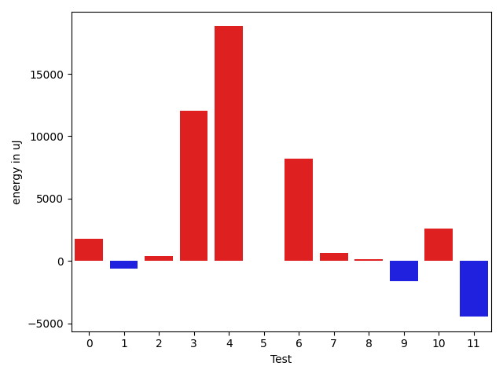

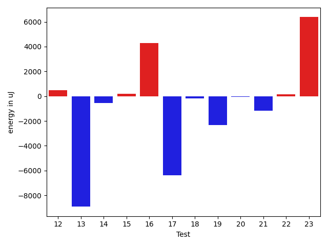

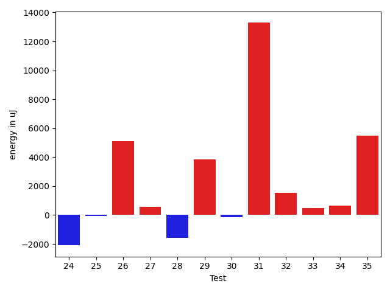

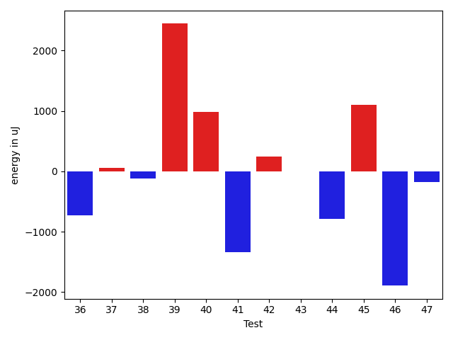

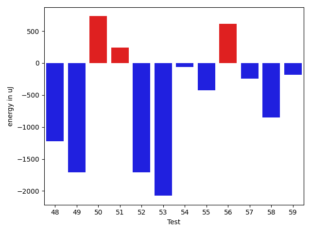

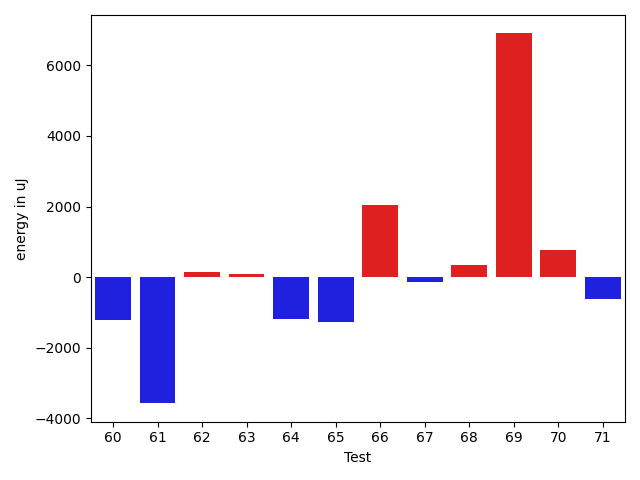

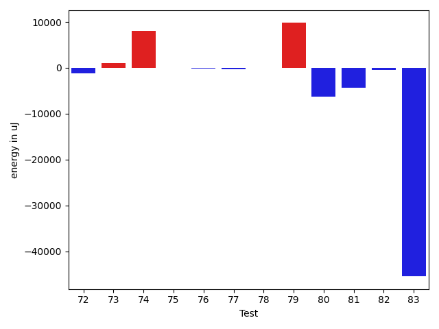

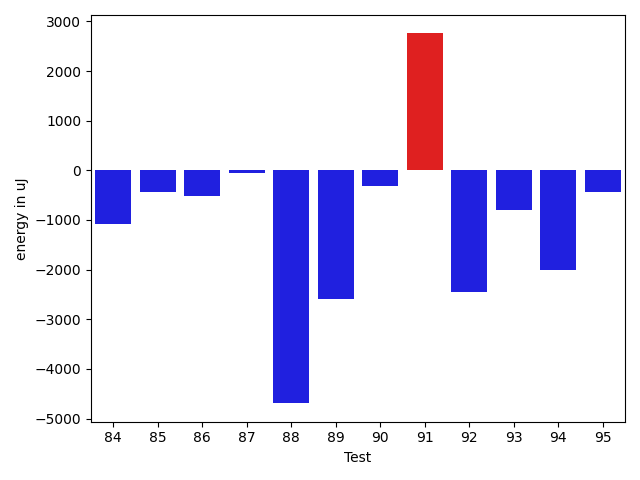

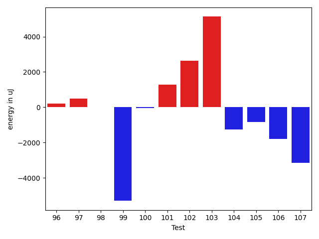

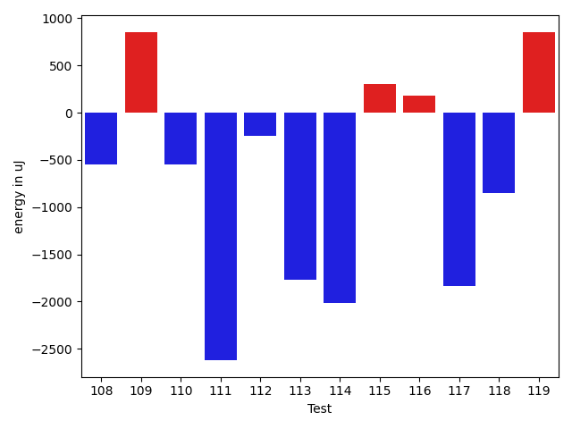

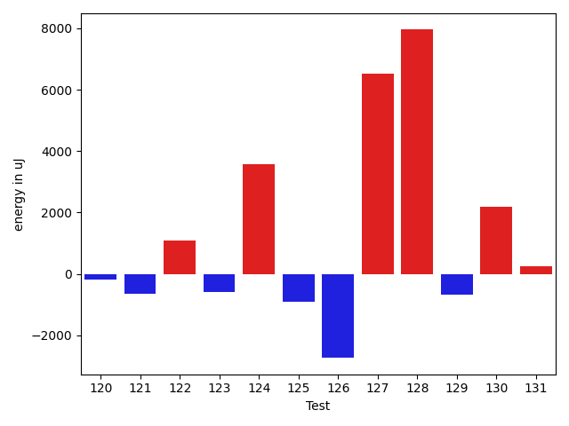

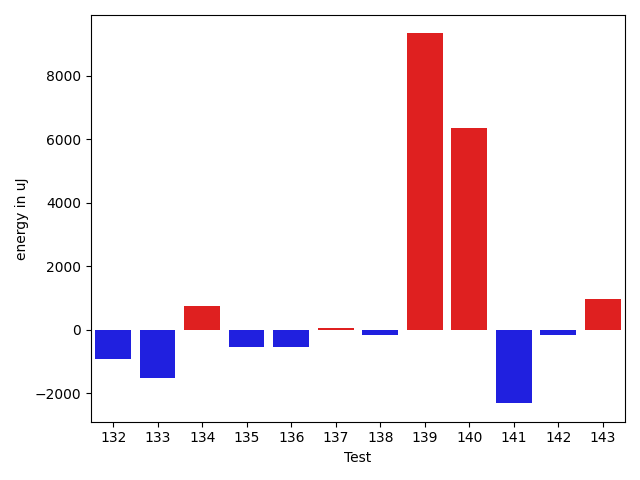

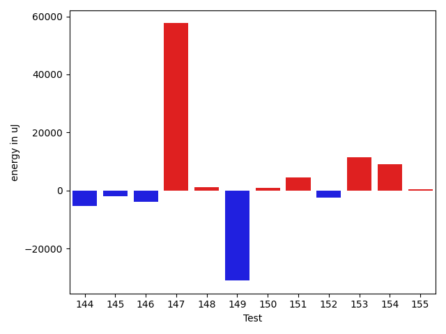

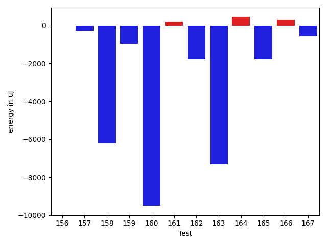

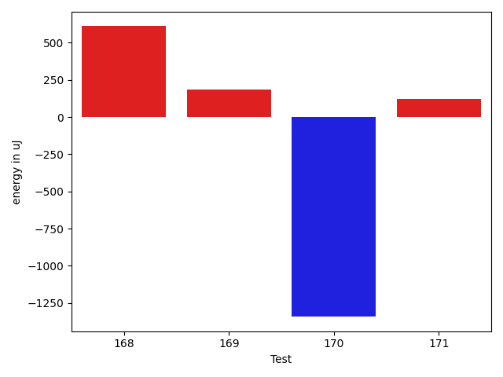

| ID | EnergyV1 | EnergyV2 | DeltaEnergy | σV1 | σV2 |
| --- | --- | --- | --- | --- | --- |
| 0 | 36927 | 37048 | 121 | 90458.34804852954 | 93179.74140484183 |
| 1 | 35645 | 36621 | 976 | 4116.2495534169675 | 3925.264684953652 |
| 2 | 70007 | 69397 | -610 | 27624.541378587735 | 30376.923472120965 |
| 3 | 37048 | 36865 | -183 | 49098.49424672616 | 71299.49632999627 |
| 4 | 39307 | 39550 | 243 | 71026.22044839068 | 96631.40386446778 |
| 5 | 35645 | 36499 | 854 | 8178.696829876626 | 5917.094440889042 |
| 6 | 35949 | 36133 | 184 | 3775.270778608345 | 51458.9107434658 |
| 7 | 34424 | 36377 | 1953 | 9598.698943340189 | 8797.797307011955 |
| 8 | 33936 | 33691 | -245 | 2232.783766274463 | 2928.5225377145703 |
| 9 | 33936 | 33325 | -611 | 6198.46285136268 | 2790.5435723370333 |
| 10 | 36011 | 35949 | -62 | 14060.660607190124 | 17164.655399474996 |
| 11 | 34973 | 34179 | -794 | 30659.122462963198 | 15921.97744007844 |
| 12 | 33020 | 34729 | 1709 | 3081.2655451715927 | 3453.979519457713 |
| 13 | 34302 | 32410 | -1892 | 38870.489610694916 | 6478.900352161826 |
| 14 | 35156 | 34912 | -244 | 2825.7199331313545 | 4084.0773565355817 |
| 15 | 34790 | 35095 | 305 | 6191.516975268797 | 6567.521752364192 |
| 16 | 36438 | 38025 | 1587 | 124600.05572426443 | 120964.81982165654 |
| 17 | 34729 | 34058 | -671 | 29285.181749331066 | 4365.38873841329 |
| 18 | 34851 | 34667 | -184 | 2951.5199098784838 | 2947.9212316393623 |
| 19 | 34973 | 35522 | 549 | 34840.5315071469 | 19586.167931544056 |
| 20 | 35828 | 34912 | -916 | 11980.418938209135 | 12321.040182465884 |
| 21 | 36133 | 34118 | -2015 | 3354.2705641143425 | 3162.3788001471034 |
| 22 | 35461 | 35706 | 245 | 3775.781034207697 | 3687.895755753696 |
| 23 | 33631 | 32837 | -794 | 3221.2615348700047 | 32247.47750789088 |
| 24 | 35034 | 33936 | -1098 | 10922.860278130394 | 6438.797727281042 |
| 25 | 34546 | 35278 | 732 | 4508.60151278423 | 4030.21601815159 |
| 26 | 35217 | 34668 | -549 | 3590.982846581761 | 31579.682417836768 |
| 27 | 35400 | 35157 | -243 | 2475.6924311245884 | 3250.1668494565115 |
| 28 | 35950 | 33997 | -1953 | 3895.4064581309663 | 3521.0354901237592 |
| 29 | 35706 | 35217 | -489 | 3025.8038656859435 | 26766.04637226736 |
| 30 | 35828 | 35156 | -672 | 3796.0331495795854 | 3916.705968094207 |
| 31 | 36316 | 37353 | 1037 | 54500.36812225108 | 67721.32588686058 |
| 32 | 33874 | 34668 | 794 | 3214.0509620352213 | 3775.325155614049 |
| 33 | 35400 | 35400 | 0 | 3273.1065536117326 | 3359.289757546128 |
| 34 | 33508 | 34912 | 1404 | 3101.1176411227166 | 3089.227670273307 |
| 35 | 34058 | 33874 | -184 | 3411.0074875808195 | 33411.799840352796 |
| 36 | 35096 | 34362 | -734 | 49420.54852739078 | 3398.6533441754887 |
| 37 | 142272 | 142334 | 62 | 24960.614563900697 | 30371.492840105806 |
| 38 | 34667 | 34545 | -122 | 3273.8724949547636 | 3012.282548370306 |
| 39 | 34912 | 37354 | 2442 | 3594.9112603234034 | 4135.83232005262 |
| 40 | 34180 | 35157 | 977 | 24298.301969570723 | 3458.46509047646 |
| 41 | 36376 | 35034 | -1342 | 31167.53148614757 | 2737.5916468113646 |
| 42 | 34973 | 35217 | 244 | 37829.72529424233 | 3254.7130473873326 |
| 43 | 36132 | 36133 | 1 | 3750.423484568109 | 28760.03514439656 |
| 44 | 37231 | 36438 | -793 | 3213.9975487009256 | 4656.743814125917 |
| 45 | 34119 | 35217 | 1098 | 25522.218143525584 | 3293.4337273499405 |
| 46 | 37536 | 35644 | -1892 | 3804.851338025509 | 3670.1995737190446 |
| 47 | 33386 | 33203 | -183 | 2396.062838804525 | 3186.707498569714 |
| 48 | 36133 | 34912 | -1221 | 8044.820063921871 | 5710.258389613317 |
| 49 | 37293 | 35584 | -1709 | 4020.6075400392424 | 4378.630423732261 |
| 50 | 34790 | 35522 | 732 | 4177.7848648166355 | 3550.8699905797735 |
| 51 | 36438 | 36682 | 244 | 3970.8000228196447 | 2804.867729303627 |
| 52 | 35828 | 34119 | -1709 | 43306.84461228067 | 4437.663320167822 |
| 53 | 36010 | 33936 | -2074 | 3399.1381006057436 | 3211.21502829107 |
| 54 | 34057 | 33996 | -61 | 3705.325472799252 | 3887.542354456387 |
| 55 | 34851 | 34423 | -428 | 3955.165109656341 | 3536.2450685982135 |
| 56 | 35339 | 35950 | 611 | 4095.1448515962848 | 3370.9400863474193 |
| 57 | 34057 | 33814 | -243 | 2814.0386338663243 | 3080.739021988068 |
| 58 | 34546 | 33692 | -854 | 3693.4317275300928 | 2883.0241351904024 |
| 59 | 35827 | 35645 | -182 | 4372.767539977135 | 3791.518608830914 |
| 60 | 35217 | 34423 | -794 | 3441.333650625082 | 3850.8726269405056 |
| 61 | 39062 | 39002 | -60 | 100200.25867590419 | 80345.0044041359 |
| 62 | 34607 | 33752 | -855 | 3804.0489651013813 | 3343.7934347741602 |
| 63 | 33996 | 34668 | 672 | 2896.9016314645296 | 2449.9002034374216 |
| 64 | 36377 | 34484 | -1893 | 3506.968839926423 | 3736.9651816290025 |
| 65 | 36071 | 34057 | -2014 | 3945.3735657099382 | 3423.7470441471346 |
| 66 | 33264 | 34851 | 1587 | 2841.1022899963004 | 2889.480167392589 |
| 67 | 35583 | 34973 | -610 | 2715.311151394788 | 3128.1302606349377 |
| 68 | 34851 | 34790 | -61 | 2746.9362557602017 | 3055.8930163701743 |
| 69 | 33814 | 34790 | 976 | 3173.023508200617 | 34422.68887843701 |
| 70 | 34119 | 35522 | 1403 | 3459.036795923911 | 3672.4016382181762 |
| 71 | 34607 | 34546 | -61 | 4609.76001060488 | 3465.756944499586 |
| 72 | 34607 | 33814 | -793 | 3632.869109236355 | 2633.0657962724745 |
| 73 | 33691 | 35950 | 2259 | 4234.08261862021 | 2289.801781453388 |
| 74 | 34302 | 35523 | 1221 | 2985.864546989786 | 35096.73551830124 |
| 75 | 36377 | 35461 | -916 | 3983.8951652246074 | 4024.7818216666283 |
| 76 | 34179 | 34301 | 122 | 3521.145298337813 | 3487.7919643138375 |
| 77 | 36926 | 37354 | 428 | 2441.684292367412 | 3999.996591258952 |
| 78 | 33631 | 34302 | 671 | 2753.135697019852 | 3646.775099704398 |
| 79 | 34362 | 34668 | 306 | 2730.955599121853 | 41179.52014394192 |
| 80 | 38574 | 37353 | -1221 | 27198.272971870232 | 15708.774556039345 |
| 81 | 36316 | 34729 | -1587 | 24468.5048565291 | 4172.9022023817815 |
| 82 | 39307 | 40283 | 976 | 77059.31449680895 | 77429.07281559901 |
| 83 | 38941 | 39245 | 304 | 572028.2979567716 | 457554.5319723225 |
| 84 | 35828 | 35400 | -428 | 3672.003729788633 | 3421.6827930266527 |
| 85 | 37414 | 36133 | -1281 | 3646.4596572217865 | 3791.124275308491 |
| 86 | 35827 | 34790 | -1037 | 3180.540563211652 | 3301.4315229492704 |
| 87 | 36743 | 35461 | -1282 | 3264.4735682241812 | 3262.6159143772998 |
| 88 | 36682 | 34851 | -1831 | 20057.455659990108 | 3985.749980882254 |
| 89 | 36133 | 36193 | 60 | 41997.52395462101 | 35641.57681204689 |
| 90 | 35828 | 35523 | -305 | 3993.0537593212957 | 3700.5267425467027 |
| 91 | 36194 | 35645 | -549 | 3955.593972506442 | 23388.744445484994 |
| 92 | 35767 | 36559 | 792 | 20483.881623617395 | 2923.047858495191 |
| 93 | 36804 | 35034 | -1770 | 3623.438546382191 | 3663.1991539659866 |
| 94 | 36621 | 34913 | -1708 | 11988.730515507976 | 16464.895621079333 |
| 95 | 35400 | 35828 | 428 | 8857.012907586597 | 6491.969508296148 |
| 96 | 35400 | 36377 | 977 | 3610.3913641694216 | 3858.263167170283 |
| 97 | 35766 | 36316 | 550 | 9373.41001065185 | 10372.618611272417 |
| 98 | 37292 | 37232 | -60 | 11842.581807564135 | 11493.430863587602 |
| 99 | 36987 | 36072 | -915 | 72549.49777947625 | 54244.012100727836 |
| 100 | 63660 | 63537 | -123 | 20090.293248159956 | 22427.85457551213 |
| 101 | 36621 | 38086 | 1465 | 22646.51877009891 | 17937.096046328814 |
| 102 | 35767 | 36560 | 793 | 8141.855614998149 | 12330.065990917998 |
| 103 | 38330 | 40588 | 2258 | 17821.31057316062 | 19019.677180145172 |
| 104 | 36255 | 34912 | -1343 | 22042.366135724566 | 23457.160511478312 |
| 105 | 37231 | 36743 | -488 | 3918.4955184775185 | 3529.5563666083303 |
| 106 | 37109 | 35279 | -1830 | 4380.716799634224 | 3338.5916408532207 |
| 107 | 37415 | 37414 | -1 | 72736.76040060836 | 65940.48607592218 |
| 108 | 35278 | 34729 | -549 | 4072.7953768150314 | 3999.713304293597 |
| 109 | 35462 | 36316 | 854 | 2992.7542695061115 | 3601.6751175483423 |
| 110 | 39123 | 38574 | -549 | 64319.20273413039 | 58635.06288840748 |
| 111 | 38147 | 35523 | -2624 | 3399.721145694265 | 3369.1965821802382 |
| 112 | 37292 | 37048 | -244 | 9616.164008812193 | 31850.902454491857 |
| 113 | 40039 | 38269 | -1770 | 142995.5666514261 | 110992.28455960187 |
| 114 | 38757 | 36743 | -2014 | 4374.466823556901 | 3609.706623868483 |
| 115 | 36987 | 37292 | 305 | 61221.305460524585 | 47458.72083144822 |
| 116 | 35035 | 35217 | 182 | 3949.6434456084785 | 25464.244850180432 |
| 117 | 36682 | 34851 | -1831 | 4394.074250607147 | 3524.699090141072 |
| 118 | 37292 | 36438 | -854 | 52752.81466432635 | 67792.83502339367 |
| 119 | 38024 | 38879 | 855 | 19635.86879540626 | 23300.582953834477 |
| 120 | 36438 | 36377 | -61 | 9103.866918012363 | 9628.777424976175 |
| 121 | 36316 | 35645 | -671 | 3384.7449879032383 | 3162.1977736437025 |
| 122 | 36132 | 35889 | -243 | 2804.699259617663 | 8467.033861553788 |
| 123 | 35095 | 35034 | -61 | 3949.5149325022676 | 3960.9073922420043 |
| 124 | 35278 | 35217 | -61 | 2917.5043379856997 | 20396.76505998929 |
| 125 | 37170 | 36377 | -793 | 3864.536548866933 | 3194.2195156989264 |
| 126 | 36072 | 35278 | -794 | 22399.488663588225 | 3832.0521186434826 |
| 127 | 37171 | 38330 | 1159 | 63162.03819082237 | 78331.51154275321 |
| 128 | 36866 | 37109 | 243 | 4035.1219750584983 | 35936.07198522631 |
| 129 | 35278 | 35218 | -60 | 3580.3461477209153 | 3653.381288863919 |
| 130 | 35462 | 35889 | 427 | 5057.653633056528 | 17417.1957741879 |
| 131 | 37598 | 38696 | 1098 | 3973.7236804902386 | 3514.060764678272 |
| 132 | 38452 | 37537 | -915 | 3479.7530074784836 | 4342.254190404061 |
| 133 | 36194 | 34668 | -1526 | 6671.25108699382 | 4345.43530834656 |
| 134 | 35766 | 36499 | 733 | 4496.557561373183 | 3962.5649649195448 |
| 135 | 36133 | 35584 | -549 | 3846.7290141371436 | 3555.9676755733076 |
| 136 | 37353 | 36804 | -549 | 42311.306923737 | 3700.972179181354 |
| 137 | 37537 | 37597 | 60 | 21201.794090753836 | 20500.643108357803 |
| 138 | 35583 | 35400 | -183 | 4291.005497034814 | 20056.066337673117 |
| 139 | 372618 | 381957 | 9339 | 110264.38278802323 | 119005.93886801861 |
| 140 | 61950 | 68298 | 6348 | 66194.01853196914 | 57624.442375304505 |
| 141 | 39062 | 36743 | -2319 | 48311.65694501042 | 38454.32863623945 |
| 142 | 36499 | 36316 | -183 | 126231.79655983638 | 56852.93678138157 |
| 143 | 36255 | 37232 | 977 | 4626.924274888834 | 3522.151277589056 |
| 144 | 38269 | 36926 | -1343 | 57545.816780888534 | 53713.8361942014 |
| 145 | 37048 | 37293 | 245 | 10185.96867705767 | 4970.783948048008 |
| 146 | 36133 | 35523 | -610 | 25479.66241622276 | 3834.973150877623 |
| 147 | 37964 | 38147 | 183 | 26996.89722761488 | 263269.44192775764 |
| 148 | 35523 | 37598 | 2075 | 4207.745660838584 | 4021.6177383460385 |
| 149 | 39123 | 36438 | -2685 | 202927.95685003427 | 27642.74131324758 |
| 150 | 36194 | 38819 | 2625 | 48389.84876402914 | 49512.42913104534 |
| 151 | 69763 | 71961 | 2198 | 26168.510622680962 | 31308.44202849459 |
| 152 | 36255 | 34546 | -1709 | 3902.1715377978967 | 2854.692349399883 |
| 153 | 36682 | 37353 | 671 | 84023.35204163317 | 85274.10494522941 |
| 154 | 36865 | 36133 | -732 | 3940.4697408295565 | 42652.4829085059 |
| 155 | 35949 | 36682 | 733 | 3730.4259659611457 | 3665.2635589636207 |
| 156 | 36316 | 34912 | -1404 | 3749.9178863269804 | 2378.3519945542125 |
| 157 | 36377 | 36621 | 244 | 3724.377361290064 | 3770.332548661988 |
| 158 | 35949 | 35339 | -610 | 33223.9430757231 | 3290.9617033299915 |
| 159 | 36682 | 35583 | -1099 | 3943.2593562422085 | 3582.106636157853 |
| 160 | 39673 | 37964 | -1709 | 79902.17101941643 | 67062.08535326552 |
| 161 | 35339 | 34545 | -794 | 4476.420307939518 | 3103.290915571189 |
| 162 | 37170 | 35279 | -1891 | 4176.918804852683 | 4075.465120036814 |
| 163 | 36438 | 35279 | -1159 | 28817.666037289255 | 3957.6568027836925 |
| 164 | 35095 | 35889 | 794 | 3009.393396510076 | 3710.592408860256 |
| 165 | 37109 | 36377 | -732 | 4923.812073993076 | 4037.6785577609407 |
| 166 | 35645 | 36072 | 427 | 4275.600503113244 | 3722.5977677677683 |
| 167 | 37903 | 37231 | -672 | 4007.2740963980555 | 3222.5260029740257 |
| 168 | 38391 | 39002 | 611 | 88280.510337163 | 79830.64533333211 |
| 169 | 36743 | 36926 | 183 | 19042.024141988368 | 3991.025717479849 |
| 170 | 34851 | 33508 | -1343 | 4147.210192207073 | 3702.4192781031115 |
| 171 | 37597 | 37719 | 122 | 37660.974766917214 | 56843.009830846015 |

## Delta Duration per test method

| ID | DurationV1 | DurationsV2 | DeltaDuration |
| --- | --- | --- | --- |
| 0 | 1658478.262295082 | 1749583.75 | 91105.48770491802 |
| 1 | 783177.4901960784 | 771972.2558139535 | -11205.234382124967 |
| 2 | 2053331.676056338 | 2122740.025 | 69408.3489436619 |
| 3 | 1356412.3555555556 | 1763045.391304348 | 406633.03574879235 |
| 4 | 2202235.970588235 | 2796714.205128205 | 594478.2345399698 |
| 5 | 954125.7619047619 | 960981.76 | 6855.998095238116 |
| 6 | 659378.3095238095 | 1015841.5294117647 | 356463.21988795523 |
| 7 | 1088985.281690141 | 1105349.2112676057 | 16363.929577464703 |
| 8 | 541812.7142857143 | 542150.7419354839 | 338.0276497695595 |
| 9 | 778897.6470588235 | 547957.7826086957 | -230939.86445012782 |
| 10 | 1369421.1529411764 | 1363599.0361445784 | -5822.116796598071 |
| 11 | 1093982.859375 | 1048984.4 | -44998.45937500009 |
| 12 | 808890.1764705882 | 580906.1111111111 | -227984.06535947707 |
| 13 | 1078832.956521739 | 866606.3571428572 | -212226.59937888186 |
| 14 | 565339.7878787878 | 569687.2222222222 | 4347.434343434405 |
| 15 | 1018915.186440678 | 1013119.1176470588 | -5796.068793619168 |
| 16 | 2118826.8857142855 | 2334740.595238095 | 215913.7095238096 |
| 17 | 1084749.7118644067 | 933204.9696969697 | -151544.74216743698 |
| 18 | 616031.5909090909 | 681936.947368421 | 65905.35645933007 |
| 19 | 1023210.5818181818 | 880470.9454545454 | -142739.63636363635 |
| 20 | 1230845.9625 | 1214928.4285714286 | -15917.533928571269 |
| 21 | 708752.911111111 | 693794.9318181818 | -14957.979292929289 |
| 22 | 684439.552631579 | 692800.9142857143 | 8361.361654135282 |
| 23 | 460910.7272727273 | 763928.6521739131 | 303017.9249011858 |
| 24 | 1012891.1016949152 | 931565.2037037037 | -81325.8979912115 |
| 25 | 652797.7777777778 | 641579.7096774194 | -11218.06810035836 |
| 26 | 604293.2 | 981047.4857142858 | 376754.2857142858 |
| 27 | 578396.0967741936 | 618933.1891891892 | 40537.092414995655 |
| 28 | 663478.5882352941 | 672172.1379310344 | 8693.549695740337 |
| 29 | 540344.6 | 690252.1923076923 | 149907.59230769228 |
| 30 | 712312.5576923077 | 822432.4561403509 | 110119.89844804315 |
| 31 | 1177383.3846153845 | 1658599.75 | 481216.3653846155 |
| 32 | 632162.8648648649 | 590691.5714285715 | -41471.293436293374 |
| 33 | 590179.8965517242 | 615476.3055555555 | 25296.40900383133 |
| 34 | 1023443.0985915493 | 1041717.582278481 | 18274.483686931664 |
| 35 | 649380.1842105263 | 874233.2941176471 | 224853.10990712082 |
| 36 | 1155606.7704918033 | 736974.7391304348 | -418632.0313613685 |
| 37 | 4598322.05050505 | 4766284.5050505055 | 167962.45454545505 |
| 38 | 788367.3243243244 | 752484.8461538461 | -35882.47817047825 |
| 39 | 513869.4 | 520764.61904761905 | 6895.21904761903 |
| 40 | 908256.7555555556 | 852269.6744186047 | -55987.081136950874 |
| 41 | 686610.45 | 478080.5 | -208529.94999999995 |
| 42 | 883168.0810810811 | 652278.4444444445 | -230889.63663663657 |
| 43 | 525541.96 | 748678.8947368421 | 223136.93473684217 |
| 44 | 538897.9166666666 | 562104.72 | 23206.803333333344 |
| 45 | 614131.0 | 546402.5217391305 | -67728.47826086951 |
| 46 | 623615.3225806452 | 667391.5757575758 | 43776.25317693059 |
| 47 | 520737.95 | 502074.36842105264 | -18663.58157894737 |
| 48 | 1008921.7931034482 | 956154.0 | -52767.79310344823 |
| 49 | 542246.4571428571 | 521930.4482758621 | -20316.00886699505 |
| 50 | 616465.4516129033 | 584940.0 | -31525.45161290327 |
| 51 | 611064.2285714286 | 609456.1 | -1608.1285714285914 |
| 52 | 1051025.8666666667 | 560488.8620689656 | -490537.00459770113 |
| 53 | 743520.3137254902 | 730981.9743589744 | -12538.339366515866 |
| 54 | 519299.40625 | 481467.53846153844 | -37831.86778846156 |
| 55 | 490892.71428571426 | 524066.74074074073 | 33174.02645502647 |
| 56 | 512656.36666666664 | 542279.7058823529 | 29623.339215686254 |
| 57 | 509673.04347826086 | 499192.92 | -10480.12347826088 |
| 58 | 495391.51851851854 | 492228.5172413793 | -3163.0012771392358 |
| 59 | 515041.86363636365 | 460229.27777777775 | -54812.585858585895 |
| 60 | 503206.55555555556 | 465588.05263157893 | -37618.50292397663 |
| 61 | 1798112.142857143 | 1912038.638888889 | 113926.49603174604 |
| 62 | 738433.4333333333 | 521402.21428571426 | -217031.2190476191 |
| 63 | 491363.47826086957 | 454673.61904761905 | -36689.859213250515 |
| 64 | 686521.4318181818 | 687766.7619047619 | 1245.3300865801284 |
| 65 | 545318.7575757576 | 518943.52173913043 | -26375.235836627136 |
| 66 | 437203.4666666667 | 431005.14285714284 | -6198.323809523834 |
| 67 | 475245.2 | 947877.7 | 472632.49999999994 |
| 68 | 748424.6111111111 | 507428.35 | -240996.26111111115 |
| 69 | 573951.59375 | 756545.6363636364 | 182594.04261363635 |
| 70 | 465435.72222222225 | 461334.0 | -4101.722222222248 |
| 71 | 427310.3181818182 | 448543.7272727273 | 21233.409090909117 |
| 72 | 551991.3125 | 579548.1 | 27556.787499999977 |
| 73 | 478473.1538461539 | 487054.0909090909 | 8580.93706293701 |
| 74 | 463142.4285714286 | 673524.6086956522 | 210382.18012422364 |
| 75 | 570631.3125 | 526571.2857142857 | -44060.02678571432 |
| 76 | 652446.7209302326 | 652284.0882352941 | -162.63269493845291 |
| 77 | 537300.5625 | 516051.724137931 | -21248.838362068986 |
| 78 | 470556.15789473685 | 422685.6551724138 | -47870.50272232306 |
| 79 | 430028.5 | 697801.5789473684 | 267773.0789473684 |
| 80 | 1241113.2692307692 | 1154086.3703703703 | -87026.89886039891 |
| 81 | 895528.6170212766 | 812960.0869565217 | -82568.53006475489 |
| 82 | 1911767.0 | 2017591.4166666667 | 105824.41666666674 |
| 83 | 5908969.311111111 | 4664819.35 | -1244149.9611111116 |
| 84 | 550080.3928571428 | 583253.5769230769 | 33173.18406593404 |
| 85 | 510775.85714285716 | 504412.8333333333 | -6363.023809523846 |
| 86 | 772772.9464285715 | 796146.8863636364 | 23373.939935064875 |
| 87 | 824367.224489796 | 773389.387755102 | -50977.83673469396 |
| 88 | 1146148.4305555555 | 1083505.168831169 | -62643.2617243866 |
| 89 | 1139526.5862068965 | 1023104.7692307692 | -116421.81697612721 |
| 90 | 739073.7380952381 | 844100.7924528302 | 105027.05435759213 |
| 91 | 788037.2452830189 | 900727.5849056604 | 112690.33962264145 |
| 92 | 877007.5 | 805684.1621621621 | -71323.33783783787 |
| 93 | 818286.7115384615 | 805538.7586206896 | -12747.95291777188 |
| 94 | 1323814.2765957448 | 1331925.0319148935 | 8110.755319148768 |
| 95 | 1069566.2533333334 | 1063059.5897435897 | -6506.6635897436645 |
| 96 | 871252.6825396825 | 845676.7571428572 | -25575.925396825303 |
| 97 | 1232070.6847826086 | 1219049.2282608696 | -13021.456521739019 |
| 98 | 1359587.4845360825 | 1371842.4130434783 | 12254.928507395787 |
| 99 | 1768544.7826086956 | 1649751.858695652 | -118792.92391304346 |
| 100 | 1937685.494949495 | 1896897.7676767677 | -40787.727272727294 |
| 101 | 1506233.8181818181 | 1426360.717647059 | -79873.10053475923 |
| 102 | 1246991.3469387756 | 1289121.9886363635 | 42130.64169758791 |
| 103 | 1621128.9696969697 | 1636256.9797979798 | 15128.010101010092 |
| 104 | 1083237.323943662 | 1089875.014084507 | 6637.690140845021 |
| 105 | 865901.0576923077 | 891184.4827586206 | 25283.42506631289 |
| 106 | 653469.2972972973 | 617752.45 | -35716.847297297325 |
| 107 | 1784043.7586206896 | 1674548.5 | -109495.25862068962 |
| 108 | 798255.3571428572 | 753474.3555555556 | -44781.00158730161 |
| 109 | 458305.8823529412 | 482084.3461538461 | 23778.463800904923 |
| 110 | 1490964.388888889 | 1535592.8 | 44628.411111111054 |
| 111 | 517522.38095238095 | 542453.9375 | 24931.556547619053 |
| 112 | 814512.15 | 930631.0333333333 | 116118.8833333333 |
| 113 | 3023241.714285714 | 2073692.6666666667 | -949549.0476190473 |
| 114 | 604866.0 | 535710.88 | -69155.12 |
| 115 | 1278738.2894736843 | 1010320.1290322581 | -268418.1604414262 |
| 116 | 862460.4363636364 | 1041451.0 | 178990.5636363636 |
| 117 | 780870.3478260869 | 806320.1509433963 | 25449.803117309348 |
| 118 | 1551419.810810811 | 1622872.4722222222 | 71452.66141141136 |
| 119 | 1604568.4742268042 | 1603907.9793814432 | -660.4948453609832 |
| 120 | 940421.775862069 | 968681.568627451 | 28259.79276538198 |
| 121 | 761788.0 | 799369.880952381 | 37581.88095238095 |
| 122 | 899524.3333333334 | 875199.3333333334 | -24325.0 |
| 123 | 916951.0 | 950091.0727272728 | 33140.07272727275 |
| 124 | 761812.1463414634 | 857665.88 | 95853.73365853657 |
| 125 | 747783.6428571428 | 811046.5555555555 | 63262.91269841266 |
| 126 | 1140515.524590164 | 961065.3538461538 | -179450.17074401013 |
| 127 | 1498305.7272727273 | 1704081.1538461538 | 205775.42657342646 |
| 128 | 526734.08 | 673944.4193548387 | 147210.3393548387 |
| 129 | 708328.025 | 713150.2777777778 | 4822.252777777729 |
| 130 | 959572.524590164 | 1028883.6666666666 | 69311.14207650267 |
| 131 | 586453.8888888889 | 556089.3636363636 | -30364.52525252523 |
| 132 | 532363.9583333334 | 582746.4642857143 | 50382.50595238095 |
| 133 | 931562.6567164179 | 884869.0 | -46693.65671641787 |
| 134 | 834981.2142857143 | 853573.7959183673 | 18592.58163265302 |
| 135 | 834944.1034482758 | 866812.0666666667 | 31867.963218390825 |
| 136 | 1179234.423076923 | 882719.6 | -296514.823076923 |
| 137 | 1251257.6973684211 | 1245791.0410958903 | -5466.656272530789 |
| 138 | 931162.2777777778 | 999443.9344262296 | 68281.65664845181 |
| 139 | 10491253.303030303 | 10942042.424242424 | 450789.1212121211 |
| 140 | 2421922.767676768 | 2334591.404040404 | -87331.36363636376 |
| 141 | 1433583.564516129 | 1403863.553846154 | -29720.010669975076 |
| 142 | 1876242.880952381 | 1263395.709090909 | -612847.1718614721 |
| 143 | 659194.2666666667 | 695859.4666666667 | 36665.19999999995 |
| 144 | 1347233.4 | 1150765.825 | -196467.57499999995 |
| 145 | 604141.7333333333 | 683984.4210526316 | 79842.6877192983 |
| 146 | 1124024.7307692308 | 943698.3636363636 | -180326.3671328671 |
| 147 | 863320.28 | 2798655.8055555555 | 1935335.5255555555 |
| 148 | 719213.3225806452 | 695116.8421052631 | -24096.480475382064 |
| 149 | 1749460.0232558139 | 867430.8780487805 | -882029.1452070334 |
| 150 | 1539413.3137254901 | 1580391.703125 | 40978.38939950988 |
| 151 | 2123849.595959596 | 2252253.909090909 | 128404.3131313133 |
| 152 | 507106.16 | 472738.1666666667 | -34367.99333333329 |
| 153 | 1691731.3666666667 | 2141916.65 | 450185.2833333332 |
| 154 | 505500.5263157895 | 824265.6315789474 | 318765.1052631579 |
| 155 | 531828.4444444445 | 515943.6666666667 | -15884.77777777781 |
| 156 | 413719.4761904762 | 438699.15 | 24979.67380952381 |
| 157 | 508184.1923076923 | 466654.35 | -41529.842307692335 |
| 158 | 727005.1333333333 | 530128.2222222222 | -196876.91111111105 |
| 159 | 483517.23076923075 | 440509.9285714286 | -43007.30219780217 |
| 160 | 1828347.357142857 | 1533424.962962963 | -294922.3941798941 |
| 161 | 421176.93333333335 | 472993.3333333333 | 51816.399999999965 |
| 162 | 548175.3703703703 | 601020.7647058824 | 52845.39433551207 |
| 163 | 714419.380952381 | 437744.652173913 | -276674.7287784679 |
| 164 | 480807.0 | 438327.0 | -42480.0 |
| 165 | 512538.5 | 492332.5 | -20206.0 |
| 166 | 451061.3333333333 | 496343.5714285714 | 45282.238095238106 |
| 167 | 600157.4516129033 | 680726.71875 | 80569.26713709673 |
| 168 | 2211718.534883721 | 1972369.8181818181 | -239348.71670190268 |
| 169 | 893472.3921568628 | 738977.3137254902 | -154495.07843137253 |
| 170 | 740404.7804878049 | 771692.3478260869 | 31287.56733828201 |
| 171 | 996451.8 | 1298616.6486486488 | 302164.8486486487 |

## Misc.

| ID | Test Class | Test Method |
| --- | --- | --- |
| 0 | com.google.gson.functional.CustomDeserializerTest | testDefaultConstructorNotCalledOnObject |
| 1 | com.google.gson.functional.CustomDeserializerTest | testDefaultConstructorNotCalledOnField |
| 2 | com.google.gson.functional.JsonParserTest | testBadTypeForDeserializingCustomTree |
| 3 | com.google.gson.functional.JsonParserTest | testChangingCustomTreeAndDeserializing |
| 4 | com.google.gson.functional.JsonParserTest | testDeserializingCustomTree |
| 5 | com.google.gson.functional.JsonParserTest | testBadFieldTypeForDeserializingCustomTree |
| 6 | com.google.gson.functional.JsonParserTest | testBadFieldTypeForCustomDeserializerCustomTree |
| 7 | com.google.gson.functional.ObjectTest | testDirectedAcyclicGraphDeserialization |
| 8 | com.google.gson.functional.ObjectTest | testNullObjectFieldsDeserialization |
| 9 | com.google.gson.functional.ObjectTest | testEmptyCollectionInAnObjectDeserialization |
| 10 | com.google.gson.functional.ObjectTest | testArrayOfArraysDeserialization |
| 11 | com.google.gson.functional.ObjectTest | testStringFieldWithNumberValueDeserialization |
| 12 | com.google.gson.functional.ObjectTest | testClassWithTransientFieldsDeserializationTransientFieldsPassedInJsonAreIgnored |
| 13 | com.google.gson.functional.ObjectTest | testNullArraysDeserialization |
| 14 | com.google.gson.functional.ObjectTest | testObjectFieldNamesWithoutQuotesDeserialization |
| 15 | com.google.gson.functional.ObjectTest | testArrayOfObjectsDeserialization |
| 16 | com.google.gson.functional.ObjectTest | testJsonInSingleQuotesDeserialization |
| 17 | com.google.gson.functional.ObjectTest | testInheritenceDeserialization |
| 18 | com.google.gson.functional.ObjectTest | testNullFieldsDeserialization |
| 19 | com.google.gson.functional.ObjectTest | testInnerClassDeserialization |
| 20 | com.google.gson.functional.ObjectTest | testSubInterfacesOfCollectionDeserialization |
| 21 | com.google.gson.functional.ObjectTest | testPrimitiveArrayInAnObjectDeserialization |
| 22 | com.google.gson.functional.ObjectTest | testBagOfPrimitivesDeserialization |
| 23 | com.google.gson.functional.ObjectTest | testClassWithNoFieldsDeserialization |
| 24 | com.google.gson.functional.ObjectTest | testNestedDeserialization |
| 25 | com.google.gson.functional.ObjectTest | testJsonInMixedQuotesDeserialization |
| 26 | com.google.gson.functional.ObjectTest | testClassWithTransientFieldsDeserialization |
| 27 | com.google.gson.functional.ObjectTest | testPrivateNoArgConstructorDeserialization |
| 28 | com.google.gson.functional.ObjectTest | testBagOfPrimitiveWrappersDeserialization |
| 29 | com.google.gson.functional.ObjectTest | testNullPrimitiveFieldsDeserialization |
| 30 | com.google.gson.functional.DefaultTypeAdaptersTest | testBadValueForBigDecimalDeserialization |
| 31 | com.google.gson.functional.DefaultTypeAdaptersTest | testUrlDeserialization |
| 32 | com.google.gson.functional.DefaultTypeAdaptersTest | testDefaultGregorianCalendarDeserialization |
| 33 | com.google.gson.functional.DefaultTypeAdaptersTest | testBigIntegerFieldDeserialization |
| 34 | com.google.gson.functional.DefaultTypeAdaptersTest | testDefaultDateDeserializationUsingBuilder |
| 35 | com.google.gson.functional.DefaultTypeAdaptersTest | testDefaultCalendarDeserialization |
| 36 | com.google.gson.functional.DefaultTypeAdaptersTest | testDateDeserializationWithPattern |
| 37 | com.google.gson.functional.DefaultTypeAdaptersTest | testDefaultDateDeserialization |
| 38 | com.google.gson.functional.DefaultTypeAdaptersTest | testPropertiesDeserialization |
| 39 | com.google.gson.functional.DefaultTypeAdaptersTest | testLocaleDeserializationWithLanguage |
| 40 | com.google.gson.functional.DefaultTypeAdaptersTest | testUrlNullDeserialization |
| 41 | com.google.gson.functional.DefaultTypeAdaptersTest | testLocaleDeserializationWithLanguageCountry |
| 42 | com.google.gson.functional.DefaultTypeAdaptersTest | testBigDecimalFieldDeserialization |
| 43 | com.google.gson.functional.DefaultTypeAdaptersTest | testUriDeserialization |
| 44 | com.google.gson.functional.DefaultTypeAdaptersTest | testUuidDeserialization |
| 45 | com.google.gson.functional.DefaultTypeAdaptersTest | testLocaleDeserializationWithLanguageCountryVariant |
| 46 | com.google.gson.functional.PrimitiveTest | testPrimitiveIntegerAutoboxedDeserialization |
| 47 | com.google.gson.functional.PrimitiveTest | testNegativeInfinityDeserialization |
| 48 | com.google.gson.functional.PrimitiveTest | testPrimitiveDoubleAutoboxedDeserialization |
| 49 | com.google.gson.functional.PrimitiveTest | testPrimitiveLongAutoboxedInASingleElementArrayDeserialization |
| 50 | com.google.gson.functional.PrimitiveTest | testNumberDeserialization |
| 51 | com.google.gson.functional.PrimitiveTest | testPrimitiveBooleanAutoboxedInASingleElementArrayDeserialization |
| 52 | com.google.gson.functional.PrimitiveTest | testLongAsStringDeserialization |
| 53 | com.google.gson.functional.PrimitiveTest | testDoubleAsStringRepresentationDeserialization |
| 54 | com.google.gson.functional.PrimitiveTest | testDoubleInfinityDeserialization |
| 55 | com.google.gson.functional.PrimitiveTest | testFloatNaNDeserialization |
| 56 | com.google.gson.functional.PrimitiveTest | testPrimitiveDoubleAutoboxedInASingleElementArrayDeserialization |
| 57 | com.google.gson.functional.PrimitiveTest | testDoubleNaNDeserialization |
| 58 | com.google.gson.functional.PrimitiveTest | testNegativeInfinityFloatDeserialization |
| 59 | com.google.gson.functional.PrimitiveTest | testFloatInfinityDeserialization |
| 60 | com.google.gson.functional.PrimitiveTest | testBigDecimalDeserialization |
| 61 | com.google.gson.functional.PrimitiveTest | testPrimitiveIntegerAutoboxedInASingleElementArrayDeserialization |
| 62 | com.google.gson.functional.PrimitiveTest | testBigDecimalNaNDeserializationNotSupported |
| 63 | com.google.gson.functional.PrimitiveTest | testBigDecimalInASingleElementArrayDeserialization |
| 64 | com.google.gson.functional.PrimitiveTest | testPrimitiveBooleanAutoboxedDeserialization |
| 65 | com.google.gson.functional.PrimitiveTest | testDoubleNoFractAsStringRepresentationDeserialization |
| 66 | com.google.gson.functional.PrimitiveTest | testBigDecimalNoFractAsStringRepresentationDeserialization |
| 67 | com.google.gson.functional.PrimitiveTest | testBigDecimalPreservePrecisionDeserialization |
| 68 | com.google.gson.functional.PrimitiveTest | testBigIntegerDeserialization |
| 69 | com.google.gson.functional.PrimitiveTest | testBadValueForBigIntegerDeserialization |
| 70 | com.google.gson.functional.PrimitiveTest | testBigDecimalInfinityDeserializationNotSupported |
| 71 | com.google.gson.functional.PrimitiveTest | testBigDecimalAsStringRepresentationDeserialization |
| 72 | com.google.gson.functional.PrimitiveTest | testLargeDoubleDeserialization |
| 73 | com.google.gson.functional.PrimitiveTest | testSmallValueForBigDecimalDeserialization |
| 74 | com.google.gson.functional.PrimitiveTest | testBigIntegerInASingleElementArrayDeserialization |
| 75 | com.google.gson.functional.PrimitiveTest | testPrimitiveLongAutoboxedDeserialization |
| 76 | com.google.gson.functional.PrimitiveTest | testOverridingDefaultPrimitiveSerialization |
| 77 | com.google.gson.functional.PrimitiveTest | testReallyLongValuesDeserialization |
| 78 | com.google.gson.functional.PrimitiveTest | testBigDecimalNegativeInfinityDeserializationNotSupported |
| 79 | com.google.gson.functional.PrimitiveTest | testSmallValueForBigIntegerDeserialization |
| 80 | com.google.gson.functional.NullObjectAndFieldTest | testExplicitDeserializationOfNulls |
| 81 | com.google.gson.functional.NullObjectAndFieldTest | testNullWrappedPrimitiveMemberDeserialization |
| 82 | com.google.gson.functional.NullObjectAndFieldTest | testTopLevelNullObjectDeserialization |
| 83 | com.google.gson.JsonParserTest | testReadWriteTwoObjects |
| 84 | com.google.gson.JsonParserTest | testParseString |
| 85 | com.google.gson.JsonParserTest | testParseReader |
| 86 | com.google.gson.functional.MapTest | testMapDeserializationWithIntegerKeys |
| 87 | com.google.gson.functional.MapTest | testMapDeserializationWithNullKey |
| 88 | com.google.gson.functional.MapTest | testParameterizedMapSubclassDeserialization |
| 89 | com.google.gson.functional.MapTest | testMapDeserialization |
| 90 | com.google.gson.functional.MapTest | testMapDeserializationEmpty |
| 91 | com.google.gson.functional.MapTest | testMapOfMapDeserialization |
| 92 | com.google.gson.functional.MapTest | testMapDeserializationWithNullValue |
| 93 | com.google.gson.functional.MapTest | testMapDeserializationWithWildcardValues |
| 94 | com.google.gson.functional.ParameterizedTypesTest | testVariableTypeArrayDeserialization |
| 95 | com.google.gson.functional.ParameterizedTypesTest | testParameterizedTypeWithReaderDeserialization |
| 96 | com.google.gson.functional.ParameterizedTypesTest | testDeepParameterizedTypeDeserialization |
| 97 | com.google.gson.functional.ParameterizedTypesTest | testVariableTypeDeserialization |
| 98 | com.google.gson.functional.ParameterizedTypesTest | testParameterizedTypeGenericArraysDeserialization |
| 99 | com.google.gson.functional.ParameterizedTypesTest | testParameterizedTypeDeserialization |
| 100 | com.google.gson.functional.ParameterizedTypesTest | testVariableTypeFieldsAndGenericArraysDeserialization |
| 101 | com.google.gson.functional.ParameterizedTypesTest | testTypesWithMultipleParametersDeserialization |
| 102 | com.google.gson.functional.ParameterizedTypesTest | testParameterizedTypeWithVariableTypeDeserialization |
| 103 | com.google.gson.functional.ParameterizedTypesTest | testParameterizedTypesWithCustomDeserializer |
| 104 | com.google.gson.functional.VersioningTest | testVersionedGsonMixingSinceAndUntilDeserialization |
| 105 | com.google.gson.functional.VersioningTest | testVersionedClassesDeserialization |
| 106 | com.google.gson.functional.VersioningTest | testIgnoreLaterVersionClassDeserialization |
| 107 | com.google.gson.functional.VersioningTest | testVersionedUntilDeserialization |
| 108 | com.google.gson.functional.VersioningTest | testVersionedGsonWithUnversionedClassesDeserialization |
| 109 | com.google.gson.functional.ReadersWritersTest | testTopLevelNullObjectDeserializationWithReaderAndSerializeNulls |
| 110 | com.google.gson.functional.ReadersWritersTest | testReaderForDeserialization |
| 111 | com.google.gson.functional.ReadersWritersTest | testTopLevelNullObjectDeserializationWithReader |
| 112 | com.google.gson.GsonTypeAdapterTest | testDefaultTypeAdapterThrowsParseException |
| 113 | com.google.gson.GsonTypeAdapterTest | testTypeAdapterDoesNotAffectNonAdaptedTypes |
| 114 | com.google.gson.GsonTypeAdapterTest | testTypeAdapterProperlyConvertsTypes |
| 115 | com.google.gson.GsonTypeAdapterTest | testTypeAdapterThrowsException |
| 116 | com.google.gson.functional.CollectionTest | testWildcardPrimitiveCollectionDeserilaization |
| 117 | com.google.gson.functional.CollectionTest | testQueueDeserialization |
| 118 | com.google.gson.functional.CollectionTest | testTopLevelCollectionOfIntegersDeserialization |
| 119 | com.google.gson.functional.CollectionTest | testWildcardCollectionField |
| 120 | com.google.gson.functional.CollectionTest | testRawCollectionDeserializationNotAlllowed |
| 121 | com.google.gson.functional.CollectionTest | testNullsInListDeserialization |
| 122 | com.google.gson.functional.CollectionTest | testLinkedListDeserialization |
| 123 | com.google.gson.functional.CollectionTest | testSetDeserialization |
| 124 | com.google.gson.functional.CollectionTest | testRawCollectionOfBagOfPrimitivesNotAllowed |
| 125 | com.google.gson.functional.CollectionTest | testCollectionOfStringsDeserialization |
| 126 | com.google.gson.functional.CollectionTest | testTopLevelListOfIntegerCollectionsDeserialization |
| 127 | com.google.gson.functional.ArrayTest | testTopLevelArrayOfIntsDeserialization |
| 128 | com.google.gson.functional.ArrayTest | testArrayOfStringsDeserialization |
| 129 | com.google.gson.functional.ArrayTest | testArrayOfPrimitivesWithCustomTypeAdapter |
| 130 | com.google.gson.functional.ArrayTest | testArrayOfCollectionDeserialization |
| 131 | com.google.gson.functional.ArrayTest | testEmptyArrayDeserialization |
| 132 | com.google.gson.functional.ArrayTest | testNullsInArrayDeserialization |
| 133 | com.google.gson.functional.CustomTypeAdaptersTest | testCustomNestedDeserializers |
| 134 | com.google.gson.functional.CustomTypeAdaptersTest | testCustomByteArrayDeserializerAndInstanceCreator |
| 135 | com.google.gson.functional.CustomTypeAdaptersTest | testCustomAdapterInvokedForMapElementDeserialization |
| 136 | com.google.gson.functional.CustomTypeAdaptersTest | testCustomDeserializers |
| 137 | com.google.gson.functional.CustomTypeAdaptersTest | testCustomDeserializerForLong |
| 138 | com.google.gson.functional.CustomTypeAdaptersTest | testCustomAdapterInvokedForCollectionElementDeserialization |
| 139 | com.google.gson.functional.ConcurrencyTest | testMultiThreadDeserialization |
| 140 | com.google.gson.functional.ConcurrencyTest | testSingleThreadDeserialization |
| 141 | com.google.gson.functional.EscapingTest | testEscapingObjectFields |
| 142 | com.google.gson.functional.EscapingTest | testEscapingQuotesInStringArray |
| 143 | com.google.gson.functional.EnumTest | testClassWithEnumFieldDeserialization |
| 144 | com.google.gson.functional.EnumTest | testTopLevelEnumDeserialization |
| 145 | com.google.gson.functional.EnumTest | testTopLevelEnumInASingleElementArrayDeserialization |
| 146 | com.google.gson.functional.EnumTest | testCollectionOfEnumsDeserialization |
| 147 | com.google.gson.functional.SecurityTest | testNonExecutableJsonDeserialization |
| 148 | com.google.gson.functional.SecurityTest | testJsonWithNonExectuableTokenWithConfiguredGsonDeserialization |
| 149 | com.google.gson.functional.SecurityTest | testJsonWithNonExectuableTokenWithRegularGsonDeserialization |
| 150 | com.google.gson.functional.UncategorizedTest | testInvalidJsonDeserializationFails |
| 151 | com.google.gson.functional.UncategorizedTest | testReturningDerivedClassesDuringDeserialization |
| 152 | com.google.gson.functional.InternationalizationTest | testStringsWithUnicodeChineseCharactersEscapedDeserialization |
| 153 | com.google.gson.functional.InternationalizationTest | testStringsWithRawChineseCharactersDeserialization |
| 154 | com.google.gson.functional.InternationalizationTest | testStringsWithUnicodeChineseCharactersDeserialization |
| 155 | com.google.gson.functional.StringTest | testStringValueAsSingleElementArrayDeserialization |
| 156 | com.google.gson.functional.StringTest | testStringWithEscapedSlashDeserialization |
| 157 | com.google.gson.functional.StringTest | testEscapedBackslashInStringDeserialization |
| 158 | com.google.gson.functional.StringTest | testEscapingQuotesInStringSerialization |
| 159 | com.google.gson.functional.StringTest | testAssignmentCharDeserialization |
| 160 | com.google.gson.functional.StringTest | testStringValueDeserialization |
| 161 | com.google.gson.functional.StringTest | testEscapingQuotesInStringDeserialization |
| 162 | com.google.gson.functional.StringTest | testSingleQuoteInStringSerialization |
| 163 | com.google.gson.functional.StringTest | testJavascriptKeywordsInStringDeserialization |
| 164 | com.google.gson.functional.StringTest | testSingleQuoteInStringDeserialization |
| 165 | com.google.gson.functional.StringTest | testEscapedCtrlNInStringDeserialization |
| 166 | com.google.gson.functional.StringTest | testEscapedCtrlRInStringDeserialization |
| 167 | com.google.gson.functional.ExposeFieldsTest | testExposedInterfaceFieldDeserialization |
| 168 | com.google.gson.functional.ExposeFieldsTest | testExposeAnnotationDeserialization |
| 169 | com.google.gson.functional.ExposeFieldsTest | testNoExposedFieldDeserialization |
| 170 | com.google.gson.functional.NamingPolicyTest | testGsonWithNonDefaultFieldNamingPolicyDeserialiation |
| 171 | com.google.gson.functional.NamingPolicyTest | testGsonWithSerializedNameFieldNamingPolicyDeserialization |

| Test | IterationV1 | IterationV2 | DeltaIteration |
| --- | --- | --- | --- |
| 0 | 61 | 64 | 3 |
| 1 | 51 | 43 | -8 |
| 2 | 71 | 80 | 9 |
| 3 | 45 | 46 | 1 |
| 4 | 34 | 39 | 5 |
| 5 | 42 | 50 | 8 |
| 6 | 42 | 34 | -8 |
| 7 | 71 | 71 | 0 |
| 8 | 28 | 31 | 3 |
| 9 | 34 | 23 | -11 |
| 10 | 85 | 83 | -2 |
| 11 | 64 | 65 | 1 |
| 12 | 34 | 36 | 2 |
| 13 | 46 | 42 | -4 |
| 14 | 33 | 36 | 3 |
| 15 | 59 | 68 | 9 |
| 16 | 35 | 42 | 7 |
| 17 | 59 | 66 | 7 |
| 18 | 44 | 38 | -6 |
| 19 | 55 | 55 | 0 |
| 20 | 80 | 77 | -3 |
| 21 | 45 | 44 | -1 |
| 22 | 38 | 35 | -3 |
| 23 | 22 | 23 | 1 |
| 24 | 59 | 54 | -5 |
| 25 | 36 | 31 | -5 |
| 26 | 45 | 35 | -10 |
| 27 | 31 | 37 | 6 |
| 28 | 34 | 29 | -5 |
| 29 | 25 | 26 | 1 |
| 30 | 52 | 57 | 5 |
| 31 | 39 | 40 | 1 |
| 32 | 37 | 28 | -9 |
| 33 | 29 | 36 | 7 |
| 34 | 71 | 79 | 8 |
| 35 | 38 | 34 | -4 |
| 36 | 61 | 46 | -15 |
| 37 | 99 | 99 | 0 |
| 38 | 37 | 39 | 2 |
| 39 | 25 | 21 | -4 |
| 40 | 45 | 43 | -2 |
| 41 | 20 | 18 | -2 |
| 42 | 37 | 36 | -1 |
| 43 | 25 | 19 | -6 |
| 44 | 24 | 25 | 1 |
| 45 | 27 | 23 | -4 |
| 46 | 31 | 33 | 2 |
| 47 | 20 | 19 | -1 |
| 48 | 58 | 43 | -15 |
| 49 | 35 | 29 | -6 |
| 50 | 31 | 30 | -1 |
| 51 | 35 | 30 | -5 |
| 52 | 30 | 29 | -1 |
| 53 | 51 | 39 | -12 |
| 54 | 32 | 26 | -6 |
| 55 | 28 | 27 | -1 |
| 56 | 30 | 17 | -13 |
| 57 | 23 | 25 | 2 |
| 58 | 27 | 29 | 2 |
| 59 | 22 | 18 | -4 |
| 60 | 27 | 19 | -8 |
| 61 | 28 | 36 | 8 |
| 62 | 30 | 28 | -2 |
| 63 | 23 | 21 | -2 |
| 64 | 44 | 42 | -2 |
| 65 | 33 | 23 | -10 |
| 66 | 15 | 14 | -1 |
| 67 | 15 | 20 | 5 |
| 68 | 18 | 20 | 2 |
| 69 | 32 | 33 | 1 |
| 70 | 18 | 17 | -1 |
| 71 | 22 | 22 | 0 |
| 72 | 32 | 20 | -12 |
| 73 | 13 | 11 | -2 |
| 74 | 21 | 23 | 2 |
| 75 | 32 | 21 | -11 |
| 76 | 43 | 34 | -9 |
| 77 | 16 | 29 | 13 |
| 78 | 19 | 29 | 10 |
| 79 | 16 | 19 | 3 |
| 80 | 52 | 54 | 2 |
| 81 | 47 | 46 | -1 |
| 82 | 28 | 24 | -4 |
| 83 | 90 | 80 | -10 |
| 84 | 28 | 26 | -2 |
| 85 | 21 | 24 | 3 |
| 86 | 56 | 44 | -12 |
| 87 | 49 | 49 | 0 |
| 88 | 72 | 77 | 5 |
| 89 | 58 | 52 | -6 |
| 90 | 42 | 53 | 11 |
| 91 | 53 | 53 | 0 |
| 92 | 54 | 37 | -17 |
| 93 | 52 | 58 | 6 |
| 94 | 94 | 94 | 0 |
| 95 | 75 | 78 | 3 |
| 96 | 63 | 70 | 7 |
| 97 | 92 | 92 | 0 |
| 98 | 97 | 92 | -5 |
| 99 | 92 | 92 | 0 |
| 100 | 99 | 99 | 0 |
| 101 | 88 | 85 | -3 |
| 102 | 98 | 88 | -10 |
| 103 | 99 | 99 | 0 |
| 104 | 71 | 71 | 0 |
| 105 | 52 | 58 | 6 |
| 106 | 37 | 40 | 3 |
| 107 | 58 | 60 | 2 |
| 108 | 42 | 45 | 3 |
| 109 | 17 | 26 | 9 |
| 110 | 36 | 40 | 4 |
| 111 | 21 | 16 | -5 |
| 112 | 40 | 30 | -10 |
| 113 | 35 | 21 | -14 |
| 114 | 25 | 25 | 0 |
| 115 | 38 | 31 | -7 |
| 116 | 55 | 52 | -3 |
| 117 | 46 | 53 | 7 |
| 118 | 74 | 72 | -2 |
| 119 | 97 | 97 | 0 |
| 120 | 58 | 51 | -7 |
| 121 | 52 | 42 | -10 |
| 122 | 54 | 42 | -12 |
| 123 | 69 | 55 | -14 |
| 124 | 41 | 50 | 9 |
| 125 | 42 | 54 | 12 |
| 126 | 61 | 65 | 4 |
| 127 | 44 | 52 | 8 |
| 128 | 25 | 31 | 6 |
| 129 | 40 | 36 | -4 |
| 130 | 61 | 60 | -1 |
| 131 | 18 | 22 | 4 |
| 132 | 24 | 28 | 4 |
| 133 | 67 | 58 | -9 |
| 134 | 56 | 49 | -7 |
| 135 | 58 | 60 | 2 |
| 136 | 52 | 55 | 3 |
| 137 | 76 | 73 | -3 |
| 138 | 54 | 61 | 7 |
| 139 | 99 | 99 | 0 |
| 140 | 99 | 99 | 0 |
| 141 | 62 | 65 | 3 |
| 142 | 42 | 55 | 13 |
| 143 | 30 | 30 | 0 |
| 144 | 35 | 40 | 5 |
| 145 | 30 | 19 | -11 |
| 146 | 52 | 66 | 14 |
| 147 | 50 | 36 | -14 |
| 148 | 31 | 38 | 7 |
| 149 | 43 | 41 | -2 |
| 150 | 51 | 64 | 13 |
| 151 | 99 | 99 | 0 |
| 152 | 25 | 24 | -1 |
| 153 | 30 | 20 | -10 |
| 154 | 19 | 19 | 0 |
| 155 | 27 | 30 | 3 |
| 156 | 21 | 20 | -1 |
| 157 | 26 | 20 | -6 |
| 158 | 30 | 27 | -3 |
| 159 | 26 | 28 | 2 |
| 160 | 28 | 27 | -1 |
| 161 | 15 | 15 | 0 |
| 162 | 27 | 17 | -10 |
| 163 | 21 | 23 | 2 |
| 164 | 19 | 18 | -1 |
| 165 | 20 | 18 | -2 |
| 166 | 15 | 21 | 6 |
| 167 | 31 | 32 | 1 |
| 168 | 43 | 44 | 1 |
| 169 | 51 | 51 | 0 |
| 170 | 41 | 46 | 5 |
| 171 | 40 | 37 | -3 |

| Time Label | Time (s) |
| --- | --- |
| Selection | 24.739983320236206 |
| Injection | 11.924629211425781 |
| Total | 1033.2550563812256 |

