# gson 012789

https://github.com/google/gson/commit/012789

## Delta Energy per test method

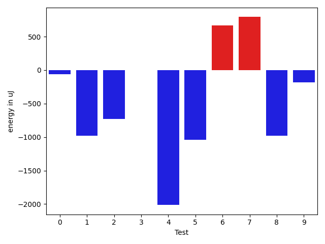

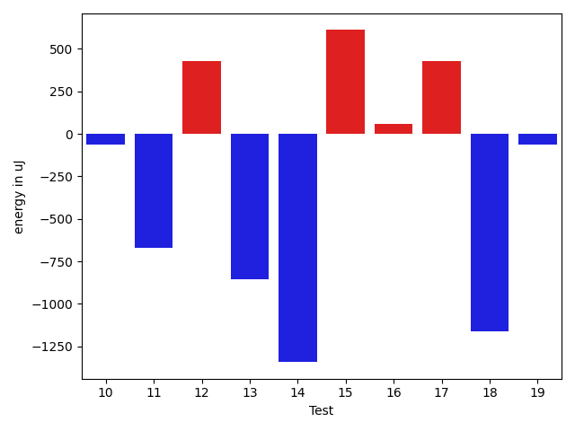

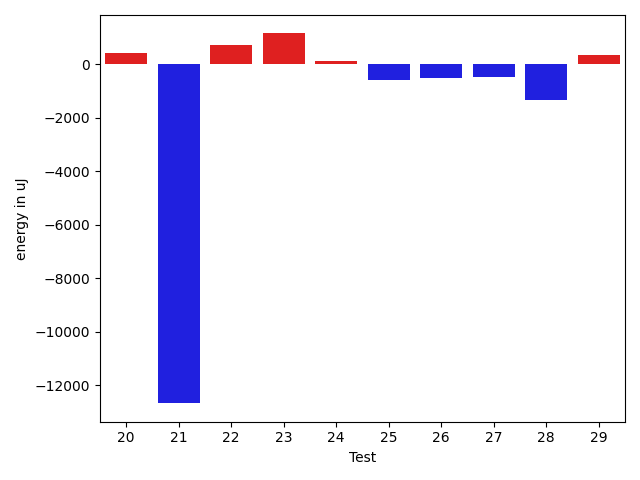

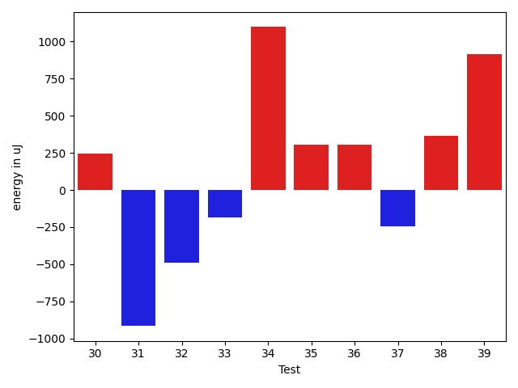

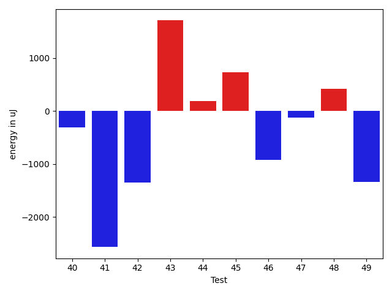

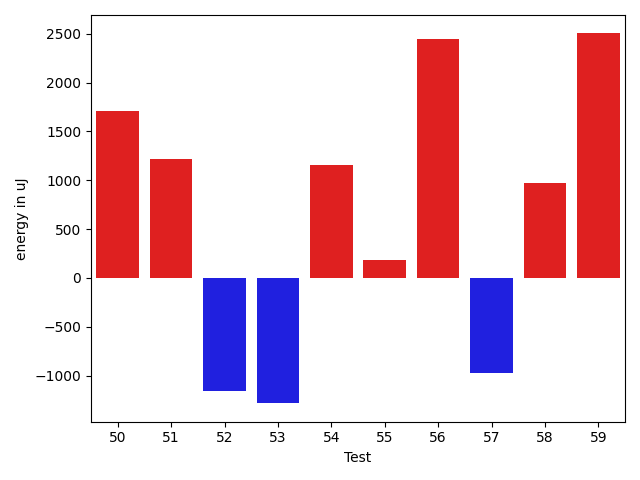

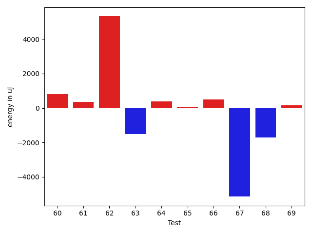

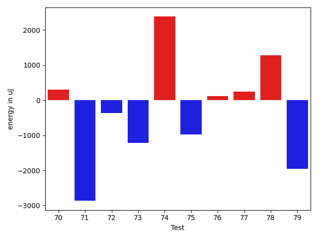

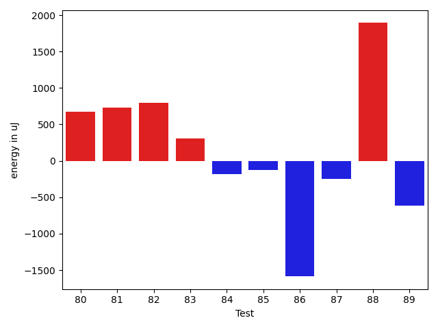

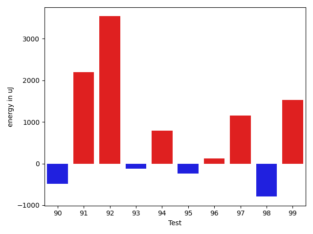

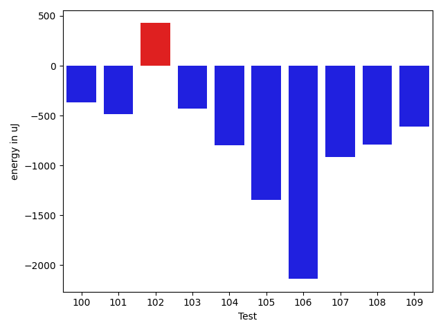

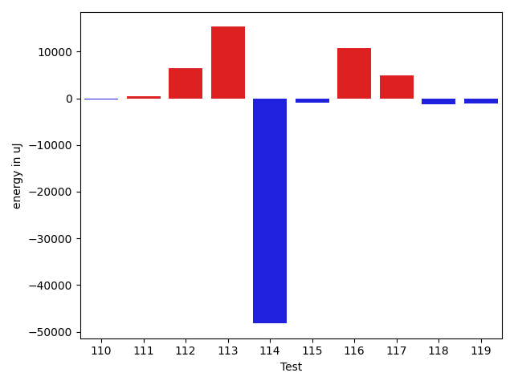

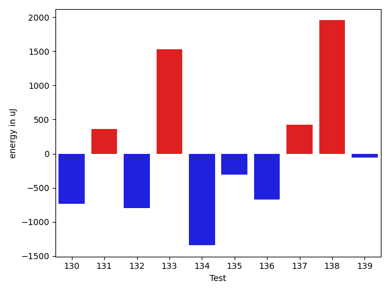

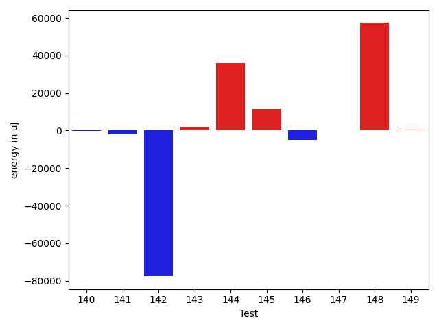

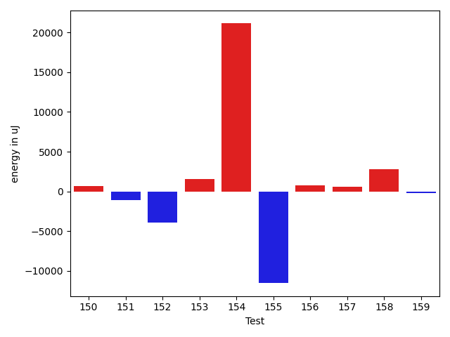

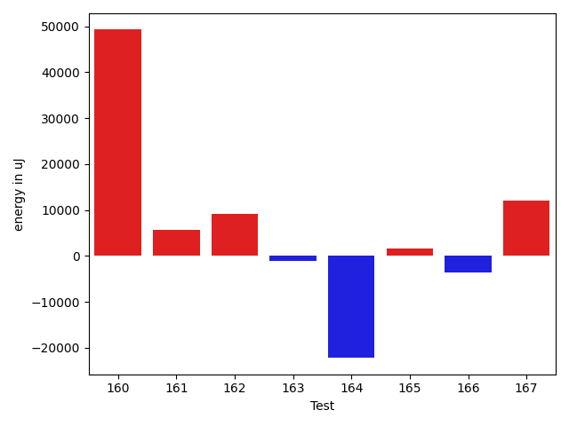

| ID | EnergyV1 | EnergyV2 | DeltaEnergy | σV1 | σV2 |
| --- | --- | --- | --- | --- | --- |
| 0 | 35827 | 35766 | -61 | 3715.8025422817527 | 3375.189915479654 |
| 1 | 36743 | 35767 | -976 | 20461.96430899459 | 3663.1049453315745 |
| 2 | 36376 | 35644 | -732 | 4296.909196899557 | 3685.208448451722 |
| 3 | 36682 | 36682 | 0 | 12348.591404166718 | 21920.581745053005 |
| 4 | 38574 | 36560 | -2014 | 66670.42086930625 | 29075.57548313692 |
| 5 | 36804 | 35767 | -1037 | 3834.419977849257 | 2991.275304213986 |
| 6 | 34607 | 35278 | 671 | 7170.260463683048 | 9693.765495895199 |
| 7 | 34180 | 34973 | 793 | 2977.2961069397243 | 3344.557204931443 |
| 8 | 37842 | 36865 | -977 | 16353.547554956454 | 15467.277543849814 |
| 9 | 34363 | 34180 | -183 | 11836.440772656304 | 7494.988645057497 |
| 10 | 35889 | 35828 | -61 | 62285.039943210504 | 20588.11827563551 |
| 11 | 35339 | 34668 | -671 | 4248.400929757094 | 3659.8782871003905 |
| 12 | 33691 | 34119 | 428 | 7017.786754349036 | 3221.052277756706 |
| 13 | 34973 | 34119 | -854 | 7577.882945962437 | 20666.31080455337 |
| 14 | 34790 | 33447 | -1343 | 3028.3520550870853 | 3431.417088230231 |
| 15 | 34973 | 35584 | 611 | 6107.461055239812 | 5952.989940854781 |
| 16 | 36499 | 36560 | 61 | 82658.49602445232 | 130958.60575233912 |
| 17 | 34790 | 35217 | 427 | 3411.0710353785416 | 8730.691887222032 |
| 18 | 34973 | 33813 | -1160 | 2752.578004047723 | 3470.558804323321 |
| 19 | 34241 | 34180 | -61 | 27212.68583027391 | 3056.0734142994747 |
| 20 | 34912 | 35523 | 611 | 3389.0372407958475 | 4552.6754752979605 |
| 21 | 34424 | 34973 | 549 | 73374.48824602154 | 4223.202761421908 |
| 22 | 35339 | 35522 | 183 | 3298.6172588282107 | 3793.751278788071 |
| 23 | 34362 | 34790 | 428 | 3478.4580578454465 | 3985.6677549605283 |
| 24 | 34302 | 34973 | 671 | 3241.5079128653956 | 2722.5272790455915 |
| 25 | 33996 | 34546 | 550 | 7777.825663782358 | 3224.9094039206498 |
| 26 | 35645 | 35522 | -123 | 3615.705795685237 | 3493.897519604718 |
| 27 | 34973 | 34180 | -793 | 2896.12464217687 | 3335.7569486653747 |
| 28 | 35584 | 34607 | -977 | 2348.755627986871 | 3046.4713485105876 |
| 29 | 34607 | 35278 | 671 | 3659.3832147597464 | 3575.7017693547996 |
| 30 | 35034 | 35278 | 244 | 3750.929716944708 | 3360.048110572722 |
| 31 | 37781 | 36865 | -916 | 56873.76127238792 | 60893.19691620038 |
| 32 | 34851 | 34363 | -488 | 2860.9063885745804 | 3200.556699622739 |
| 33 | 34546 | 34363 | -183 | 22586.67547504771 | 3129.0822087914216 |
| 34 | 35401 | 36499 | 1098 | 3204.8423758399167 | 3882.891950631257 |
| 35 | 139709 | 140014 | 305 | 32486.026837603604 | 25242.91472123431 |
| 36 | 35400 | 35705 | 305 | 3213.0283445461764 | 3831.423518736971 |
| 37 | 36499 | 36254 | -245 | 3745.2012997606334 | 31872.485728449086 |
| 38 | 34302 | 34668 | 366 | 20455.745158418198 | 6847.982230182833 |
| 39 | 35523 | 36438 | 915 | 27292.224415763543 | 11640.621134649973 |
| 40 | 34851 | 34546 | -305 | 6531.271328912542 | 3910.028001462678 |
| 41 | 36743 | 34179 | -2564 | 3108.2492826387934 | 30998.44672318276 |
| 42 | 38452 | 37109 | -1343 | 3793.12242727069 | 4415.671703720887 |
| 43 | 35949 | 37658 | 1709 | 3642.1016045002057 | 3981.903694291494 |
| 44 | 35461 | 35645 | 184 | 31606.434157780783 | 4116.19571688449 |
| 45 | 36255 | 36987 | 732 | 4032.846719727883 | 3932.574537507911 |
| 46 | 36316 | 35400 | -916 | 3214.32727564586 | 4343.7396296279085 |
| 47 | 34973 | 34851 | -122 | 4079.168116507001 | 32960.63841196397 |
| 48 | 35218 | 35644 | 426 | 3023.2694858873433 | 3682.3537041100403 |
| 49 | 36132 | 34790 | -1342 | 3596.3961882987633 | 3237.372713508255 |
| 50 | 33631 | 35339 | 1708 | 3710.992738074384 | 3566.5505105604066 |
| 51 | 35523 | 36743 | 1220 | 3236.5209778402486 | 4041.3628550718445 |
| 52 | 34912 | 33753 | -1159 | 3466.845635948598 | 3167.387095924983 |
| 53 | 36072 | 34790 | -1282 | 3493.4003450478544 | 3296.3243180020677 |
| 54 | 33935 | 35095 | 1160 | 3959.6852144750633 | 3505.9726350396772 |
| 55 | 34362 | 34546 | 184 | 3324.798517339045 | 3503.3739851748633 |
| 56 | 36499 | 38941 | 2442 | 111078.46877192197 | 66894.86132203368 |
| 57 | 35705 | 34728 | -977 | 2645.950625022918 | 2713.6500929833305 |
| 58 | 33936 | 34912 | 976 | 3819.81998185608 | 3071.5888300403103 |
| 59 | 32471 | 34973 | 2502 | 3422.6879473776116 | 2940.27419309467 |
| 60 | 34973 | 35766 | 793 | 1783.67326960495 | 3612.636682313903 |
| 61 | 34728 | 35278 | 550 | 3017.869050784304 | 2648.4611672032897 |
| 62 | 34912 | 35400 | 488 | 2997.774932880078 | 27137.86520338293 |
| 63 | 36316 | 34424 | -1892 | 3190.371156060303 | 3716.8429541452024 |
| 64 | 35645 | 35828 | 183 | 3030.6409052995705 | 3158.946473806576 |
| 65 | 36194 | 34240 | -1954 | 3113.047616082992 | 2551.038018048552 |
| 66 | 35217 | 36071 | 854 | 3968.217262155567 | 3489.6767794011175 |
| 67 | 35644 | 35461 | -183 | 24318.353440690156 | 3350.845621460055 |
| 68 | 36438 | 34240 | -2198 | 3557.1790809348954 | 3052.244244482711 |
| 69 | 34668 | 35461 | 793 | 3412.556742943555 | 4102.479115120515 |
| 70 | 36438 | 36743 | 305 | 3773.499261094971 | 3316.0314976389072 |
| 71 | 35584 | 32715 | -2869 | 3743.639137112399 | 2569.207477263074 |
| 72 | 35766 | 35400 | -366 | 2579.489567242867 | 58895.02119330101 |
| 73 | 34424 | 33203 | -1221 | 3229.767563215145 | 2099.4074759321975 |
| 74 | 32654 | 35034 | 2380 | 3757.2973171682866 | 3052.8523527233256 |
| 75 | 37292 | 36316 | -976 | 3268.816259652567 | 4327.338807029841 |
| 76 | 35705 | 35827 | 122 | 3645.043568640017 | 3459.7496818367354 |
| 77 | 33508 | 33752 | 244 | 2546.5011833187887 | 3613.1320229254243 |
| 78 | 33203 | 34484 | 1281 | 3328.9419739010173 | 3318.8238303447056 |
| 79 | 34363 | 32410 | -1953 | 2707.1092800847523 | 2911.9189005866474 |
| 80 | 35705 | 36377 | 672 | 3826.708345159887 | 35358.68026733651 |
| 81 | 34485 | 35218 | 733 | 3965.5721685631347 | 6092.721765218044 |
| 82 | 36987 | 37781 | 794 | 73223.12838427218 | 69671.1203094427 |
| 83 | 35217 | 35522 | 305 | 3631.3680911446454 | 28514.563490042176 |
| 84 | 36438 | 36255 | -183 | 4062.416235517908 | 3245.0906436181094 |
| 85 | 35584 | 35461 | -123 | 4164.192611379015 | 3749.978866195592 |
| 86 | 35827 | 34241 | -1586 | 4041.479325344877 | 4042.5921342104557 |
| 87 | 35400 | 35156 | -244 | 3574.3952565045493 | 3233.7713013990438 |
| 88 | 34729 | 36621 | 1892 | 4908.234941217184 | 29833.095519430568 |
| 89 | 35584 | 34973 | -611 | 2977.34241729474 | 3026.174555426256 |
| 90 | 37598 | 37109 | -489 | 4187.327816987055 | 3447.302407519376 |
| 91 | 34362 | 36560 | 2198 | 3389.9209858048316 | 2799.746388514502 |
| 92 | 33997 | 37536 | 3539 | 3380.801585423197 | 4059.98441800399 |
| 93 | 36072 | 35949 | -123 | 37036.61338454278 | 3343.0549674744443 |
| 94 | 37597 | 38392 | 795 | 83227.30750541604 | 68924.98886278039 |
| 95 | 36315 | 36072 | -243 | 3931.6510151862944 | 3548.784627389667 |
| 96 | 35584 | 35705 | 121 | 3944.3593211168823 | 3082.7594417194155 |
| 97 | 35583 | 36743 | 1160 | 37772.36592608836 | 4088.256012635715 |
| 98 | 36865 | 36072 | -793 | 3982.77702143481 | 3002.439952216641 |
| 99 | 35522 | 37048 | 1526 | 33647.44511227164 | 28087.930231575938 |
| 100 | 36315 | 35949 | -366 | 10960.583662367357 | 9282.38848200498 |
| 101 | 36255 | 35767 | -488 | 4692.719280510154 | 5199.001724907924 |
| 102 | 36072 | 36499 | 427 | 8534.726257552611 | 10672.34008145782 |
| 103 | 65552 | 65125 | -427 | 29113.86453549238 | 22298.530335850908 |
| 104 | 36499 | 35705 | -794 | 11171.389647528797 | 9853.78397921799 |
| 105 | 41260 | 39917 | -1343 | 19064.131446365598 | 17633.719108040354 |
| 106 | 38208 | 36071 | -2137 | 12873.307644257087 | 8011.720758362874 |
| 107 | 36804 | 35889 | -915 | 84649.48363360434 | 77077.48920499439 |
| 108 | 38574 | 37781 | -793 | 14074.818675611368 | 16234.73340081554 |
| 109 | 36193 | 35583 | -610 | 3273.7374565227983 | 3670.1140008251427 |
| 110 | 36682 | 37598 | 916 | 4098.913402159451 | 3113.4650997722774 |
| 111 | 37536 | 38025 | 489 | 53288.0753411627 | 56905.98842486668 |
| 112 | 37170 | 37415 | 245 | 3056.1359425601936 | 36013.8657379005 |
| 113 | 36316 | 38697 | 2381 | 3352.4563660681 | 48434.11853640768 |
| 114 | 75317 | 35217 | -40100 | 36271.24426897885 | 3831.121698232342 |
| 115 | 36377 | 33692 | -2685 | 4582.4186233709315 | 3713.4865357489934 |
| 116 | 36865 | 36499 | -366 | 36683.9252228494 | 66877.1614249985 |
| 117 | 34424 | 34912 | 488 | 3852.5042357973643 | 29101.09084404243 |
| 118 | 39611 | 38513 | -1098 | 27224.30019339035 | 28893.660847399984 |
| 119 | 35583 | 35157 | -426 | 6771.34272161058 | 3934.0624454087115 |
| 120 | 35522 | 36682 | 1160 | 3591.54255126668 | 3953.986153019494 |
| 121 | 36316 | 35400 | -916 | 3834.317175210389 | 3456.6906647169594 |
| 122 | 35766 | 35339 | -427 | 3193.4060098206546 | 3592.3360652409133 |
| 123 | 36499 | 36743 | 244 | 4262.908336525645 | 25363.66117959609 |
| 124 | 36194 | 34973 | -1221 | 28819.706369851894 | 3476.8224475726784 |
| 125 | 36255 | 36743 | 488 | 27310.456029786365 | 3390.600790172145 |
| 126 | 39001 | 37963 | -1038 | 69819.00711409484 | 78922.70876737632 |
| 127 | 37171 | 36560 | -611 | 35858.60608640818 | 4077.7631533674116 |
| 128 | 38269 | 34668 | -3601 | 3551.0627186222177 | 3658.855557930875 |
| 129 | 34790 | 35462 | 672 | 3645.564671136873 | 5553.260935302389 |
| 130 | 36438 | 35706 | -732 | 3369.8051588472813 | 4225.36594006957 |
| 131 | 33997 | 34363 | 366 | 4331.792710017612 | 20652.07954163018 |
| 132 | 36743 | 35949 | -794 | 7035.891176493631 | 7380.506026373897 |
| 133 | 35461 | 36987 | 1526 | 4832.810706996524 | 30970.51859242035 |
| 134 | 38025 | 36682 | -1343 | 88301.56533715398 | 27519.96737257332 |
| 135 | 36315 | 36010 | -305 | 7127.32195071644 | 4370.218485058025 |
| 136 | 37903 | 37231 | -672 | 50322.62947290815 | 37977.11456104058 |
| 137 | 36804 | 37231 | 427 | 4148.574013008223 | 7020.614607539578 |
| 138 | 34790 | 36743 | 1953 | 6108.894547890899 | 5398.340158293701 |
| 139 | 35827 | 35766 | -61 | 7409.026817503442 | 27649.15455484589 |
| 140 | 36743 | 37963 | 1220 | 4372.178400452879 | 4223.3837661907355 |
| 141 | 38025 | 38208 | 183 | 63004.286002917084 | 61727.169920161876 |
| 142 | 39551 | 36072 | -3479 | 149393.5142379476 | 3740.0320411246553 |
| 143 | 36499 | 37964 | 1465 | 4347.892775816809 | 10678.899025590623 |
| 144 | 358276 | 399535 | 41259 | 109992.66410158204 | 116395.84284905533 |
| 145 | 65551 | 60729 | -4822 | 35963.433938180235 | 64405.34797978747 |
| 146 | 37048 | 38269 | 1221 | 44560.50546160896 | 41767.91650084267 |
| 147 | 37292 | 36194 | -1098 | 120753.7262524407 | 132676.91889551913 |
| 148 | 37659 | 38513 | 854 | 56870.560610456254 | 237686.86085128982 |
| 149 | 36865 | 37720 | 855 | 5298.1905355146755 | 6144.240880371775 |
| 150 | 36804 | 37536 | 732 | 228936.93954420657 | 231206.69957597487 |
| 151 | 74340 | 71594 | -2746 | 24718.30039665213 | 24565.20422723248 |
| 152 | 37780 | 37536 | -244 | 46740.0497998154 | 36365.45507964754 |
| 153 | 36988 | 38452 | 1464 | 3849.611652491716 | 3444.8803011507093 |
| 154 | 36743 | 38025 | 1282 | 76619.71972235084 | 101918.56676051914 |
| 155 | 36682 | 36560 | -122 | 51138.9017721331 | 3983.5013691342865 |
| 156 | 38757 | 38269 | -488 | 14878.170413308295 | 17416.911344892218 |
| 157 | 40893 | 39184 | -1709 | 57861.74070526982 | 62079.06894177941 |
| 158 | 36316 | 36377 | 61 | 4030.2109287452336 | 24731.09628170346 |
| 159 | 36804 | 37170 | 366 | 5498.948114368908 | 5704.632698737054 |
| 160 | 38085 | 37170 | -915 | 61097.50957211701 | 152184.1257167558 |
| 161 | 37476 | 37475 | -1 | 33642.75946792807 | 73374.40390275557 |
| 162 | 37171 | 37049 | -122 | 3979.5276070175555 | 43910.28228397671 |
| 163 | 37292 | 37049 | -243 | 6364.696500694544 | 4543.279583435723 |
| 164 | 37720 | 37232 | -488 | 134335.34682482437 | 88970.62676476855 |
| 165 | 35767 | 37781 | 2014 | 4554.6610242528195 | 3553.4364147678407 |
| 166 | 36743 | 36316 | -427 | 23913.85882333678 | 3661.0517952354785 |
| 167 | 39489 | 38330 | -1159 | 54630.78455517311 | 68023.33221558755 |

## Delta Duration per test method

| ID | DurationV1 | DurationsV2 | DeltaDuration |
| --- | --- | --- | --- |
| 0 | 915762.7605633803 | 912586.3666666667 | -3176.39389671362 |
| 1 | 930680.796875 | 891836.4150943396 | -38844.38178066036 |
| 2 | 927613.5733333334 | 938968.4848484849 | 11354.9115151515 |
| 3 | 1247124.7402597403 | 1270959.6184210526 | 23834.878161312314 |
| 4 | 1617081.5882352942 | 1075064.0175438595 | -542017.5706914347 |
| 5 | 847988.6481481482 | 864965.551724138 | 16976.903575989767 |
| 6 | 1093668.4324324324 | 1074317.3918918918 | -19351.04054054059 |
| 7 | 656636.28125 | 628869.4117647059 | -27766.869485294097 |
| 8 | 1538116.2555555555 | 1449368.119047619 | -88748.13650793652 |
| 9 | 1050468.6818181819 | 979084.3392857143 | -71384.34253246756 |
| 10 | 1674026.7654320989 | 1392311.6103896103 | -281715.1550424886 |
| 11 | 607277.34375 | 604896.0277777778 | -2381.315972222248 |
| 12 | 797752.1403508772 | 707796.9791666666 | -89955.16118421056 |
| 13 | 881346.2708333334 | 970166.6666666666 | 88820.39583333326 |
| 14 | 647048.6470588235 | 555787.46875 | -91261.1783088235 |
| 15 | 1035185.8108108108 | 1036189.25 | 1003.4391891892301 |
| 16 | 1541439.2 | 2094493.0681818181 | 553053.8681818182 |
| 17 | 923795.96875 | 933614.2419354839 | 9818.273185483878 |
| 18 | 504666.14285714284 | 508923.037037037 | 4256.894179894181 |
| 19 | 901572.0181818182 | 791312.4406779661 | -110259.57750385208 |
| 20 | 517639.95238095237 | 493973.6842105263 | -23666.268170426076 |
| 21 | 1163144.0 | 669538.2571428572 | -493605.7428571428 |
| 22 | 968378.6935483871 | 927127.0178571428 | -41251.67569124431 |
| 23 | 694960.9189189189 | 617201.0833333334 | -77759.83558558556 |
| 24 | 680373.6315789474 | 724420.3571428572 | 44046.72556390974 |
| 25 | 633904.4193548387 | 555915.7586206896 | -77988.66073414905 |
| 26 | 682189.8048780488 | 705249.725 | 23059.920121951145 |
| 27 | 694381.6756756756 | 656047.4242424242 | -38334.251433251426 |
| 28 | 604175.0384615385 | 562457.4642857143 | -41717.57417582418 |
| 29 | 722218.9210526316 | 639103.4146341464 | -83115.5064184852 |
| 30 | 731270.1052631579 | 785488.0 | 54217.894736842136 |
| 31 | 1264442.657142857 | 1097995.4166666667 | -166447.24047619035 |
| 32 | 630135.8529411765 | 613980.03125 | -16155.821691176505 |
| 33 | 814614.7948717949 | 649864.225 | -164750.5698717949 |
| 34 | 633349.8235294118 | 693726.3157894737 | 60376.4922600619 |
| 35 | 4608445.181818182 | 4522952.868686869 | -85492.31313131284 |
| 36 | 615637.3928571428 | 579790.0588235294 | -35847.33403361344 |
| 37 | 833540.4146341464 | 866474.4871794871 | 32934.07254534075 |
| 38 | 1096806.7368421052 | 1101087.4430379746 | 4280.706195869483 |
| 39 | 836228.66 | 1051126.3389830508 | 214897.67898305075 |
| 40 | 779761.9375 | 687201.3055555555 | -92560.6319444445 |
| 41 | 533850.695652174 | 1008252.2 | 474401.504347826 |
| 42 | 533499.2083333334 | 504447.63636363635 | -29051.57196969702 |
| 43 | 531098.6206896552 | 512656.64285714284 | -18441.977832512348 |
| 44 | 659707.5217391305 | 505900.962962963 | -153806.5587761675 |
| 45 | 436772.3157894737 | 485684.375 | 48912.05921052629 |
| 46 | 652497.59375 | 693929.22 | 41431.62624999997 |
| 47 | 548066.9090909091 | 689254.3214285715 | 141187.41233766242 |
| 48 | 744519.4318181818 | 740210.6382978724 | -4308.79352030938 |
| 49 | 444701.8333333333 | 506043.28571428574 | 61341.452380952425 |
| 50 | 451083.95238095237 | 454665.23076923075 | 3581.278388278384 |
| 51 | 675353.6666666666 | 625840.7878787878 | -49512.878787878784 |
| 52 | 511504.3103448276 | 529537.8333333334 | 18033.522988505778 |
| 53 | 976254.6666666666 | 950530.2173913043 | -25724.449275362305 |
| 54 | 444791.38095238095 | 420423.17647058825 | -24368.204481792694 |
| 55 | 475317.8484848485 | 471345.36 | -3972.4884848485235 |
| 56 | 2505965.03125 | 1475220.9411764706 | -1030744.0900735294 |
| 57 | 572187.3076923077 | 582623.71875 | 10436.411057692254 |
| 58 | 431084.23076923075 | 414740.6538461539 | -16343.576923076878 |
| 59 | 476796.5909090909 | 474569.2727272727 | -2227.3181818181765 |
| 60 | 467596.0 | 477906.2 | 10310.200000000012 |
| 61 | 516070.7037037037 | 479355.6296296296 | -36715.0740740741 |
| 62 | 446361.60869565216 | 639665.1111111111 | 193303.50241545896 |
| 63 | 544706.7826086957 | 524274.0344827586 | -20432.74812593707 |
| 64 | 577268.375 | 642423.15 | 65154.77500000002 |
| 65 | 439277.3 | 479586.36842105264 | 40309.06842105265 |
| 66 | 439057.6818181818 | 448691.22222222225 | 9633.540404040425 |
| 67 | 722979.3928571428 | 590135.0277777778 | -132844.3650793651 |
| 68 | 666770.2647058824 | 614159.6315789474 | -52610.63312693499 |
| 69 | 534199.1904761905 | 550137.2666666667 | 15938.07619047619 |
| 70 | 588474.1891891892 | 610968.9666666667 | 22494.777477477444 |
| 71 | 738475.3157894737 | 443388.21428571426 | -295087.10150375945 |
| 72 | 480199.1153846154 | 1502335.4166666667 | 1022136.3012820514 |
| 73 | 469149.13636363635 | 467628.5625 | -1520.573863636353 |
| 74 | 456930.84 | 431488.3333333333 | -25442.50666666671 |
| 75 | 504986.77777777775 | 538595.7727272727 | 33608.994949494954 |
| 76 | 565302.7037037037 | 597398.2857142857 | 32095.582010581973 |
| 77 | 497609.61904761905 | 542150.0 | 44540.38095238095 |
| 78 | 551928.16 | 563704.7307692308 | 11776.570769230719 |
| 79 | 475461.8333333333 | 471276.0625 | -4185.770833333314 |
| 80 | 793256.4814814815 | 1096006.4761904762 | 302749.99470899475 |
| 81 | 1220377.4366197183 | 1102391.0714285714 | -117986.36519114696 |
| 82 | 1852078.1206896552 | 1900258.2037037036 | 48180.0830140484 |
| 83 | 839187.5901639344 | 960668.2586206896 | 121480.66845675523 |
| 84 | 831357.4107142857 | 821079.1020408163 | -10278.30867346935 |
| 85 | 831954.2264150943 | 817693.9074074074 | -14260.319007686921 |
| 86 | 817129.8545454545 | 823644.2222222222 | 6514.367676767753 |
| 87 | 838995.1166666667 | 837208.6545454545 | -1786.4621212121565 |
| 88 | 505227.73913043475 | 814412.1052631579 | 309184.3661327231 |
| 89 | 478950.8461538461 | 466723.6666666667 | -12227.179487179441 |
| 90 | 507313.962962963 | 503813.3888888889 | -3500.574074074102 |
| 91 | 450776.55 | 448009.15 | -2767.399999999965 |
| 92 | 542564.76 | 557982.9310344828 | 15418.171034482773 |
| 93 | 794168.0 | 417483.4666666667 | -376684.5333333333 |
| 94 | 2123358.4166666665 | 1666392.76 | -456965.6566666665 |
| 95 | 499383.71428571426 | 502521.375 | 3137.6607142857392 |
| 96 | 434640.14285714284 | 440994.5714285714 | 6354.42857142858 |
| 97 | 715081.6666666666 | 467466.6538461539 | -247615.01282051275 |
| 98 | 464089.8888888889 | 476526.7916666667 | 12436.90277777781 |
| 99 | 701290.7222222222 | 776721.2857142857 | 75430.56349206343 |
| 100 | 1310989.0 | 1316454.9473684211 | 5465.947368421126 |
| 101 | 1170141.3815789474 | 1071378.5526315789 | -98762.82894736854 |
| 102 | 1225389.1333333333 | 1243980.393258427 | 18591.259925093735 |
| 103 | 1990634.707070707 | 1952593.7878787878 | -38040.91919191927 |
| 104 | 1262881.7666666666 | 1275353.6703296704 | 12471.903663003817 |
| 105 | 1617106.5353535353 | 1645440.3535353534 | 28333.81818181812 |
| 106 | 1451845.4226804124 | 1343623.1354166667 | -108222.28726374567 |
| 107 | 2045807.6470588236 | 1935656.8720930233 | -110150.77496580034 |
| 108 | 1380536.6463414633 | 1470706.9666666666 | 90170.32032520324 |
| 109 | 884507.6984126985 | 858028.3125 | -26479.38591269846 |
| 110 | 477335.5 | 564693.35 | 87357.84999999998 |
| 111 | 1268349.0222222223 | 1336413.8260869565 | 68064.80386473425 |
| 112 | 496178.8076923077 | 790059.5217391305 | 293880.7140468228 |
| 113 | 726061.4615384615 | 1303250.6470588236 | 577189.1855203621 |
| 114 | 2466109.894117647 | 718136.3666666667 | -1747973.5274509802 |
| 115 | 834407.3469387755 | 908942.5 | 74535.1530612245 |
| 116 | 1315315.238095238 | 1771926.5857142857 | 456611.3476190476 |
| 117 | 933801.7096774194 | 1083865.7462686568 | 150064.0365912374 |
| 118 | 1722288.6105263159 | 1712524.0606060605 | -9764.549920255318 |
| 119 | 938761.671641791 | 999331.5081967213 | 60569.83655493031 |
| 120 | 753358.0769230769 | 777303.725490196 | 23945.648567119148 |
| 121 | 694713.9523809524 | 761391.4883720931 | 66677.53599114064 |
| 122 | 782694.2321428572 | 842343.1694915254 | 59648.93734866823 |
| 123 | 948550.2545454545 | 1026420.9375 | 77870.68295454548 |
| 124 | 993509.9387755102 | 807597.1219512195 | -185912.81682429067 |
| 125 | 1003857.4651162791 | 797179.1041666666 | -206678.36094961246 |
| 126 | 1689039.7777777778 | 2197224.7209302327 | 508184.9431524549 |
| 127 | 788438.6216216217 | 593895.8125 | -194542.80912162166 |
| 128 | 522589.7878787879 | 660914.5909090909 | 138324.80303030304 |
| 129 | 989464.9552238806 | 969891.3833333333 | -19573.57189054729 |
| 130 | 448075.6875 | 529668.65 | 81592.96250000002 |
| 131 | 771409.8055555555 | 859560.4358974359 | 88150.63034188037 |
| 132 | 1030904.40625 | 953448.8412698413 | -77455.5649801587 |
| 133 | 693090.2727272727 | 796908.8064516129 | 103818.53372434014 |
| 134 | 2546031.0 | 858605.3125 | -1687425.6875 |
| 135 | 691732.4242424242 | 663004.4642857143 | -28727.959956709878 |
| 136 | 1329474.8372093022 | 1156704.38 | -172770.45720930235 |
| 137 | 953869.8823529412 | 868770.9137931034 | -85098.96855983778 |
| 138 | 761632.3265306122 | 902502.4848484849 | 140870.15831787267 |
| 139 | 1001609.1692307693 | 1103380.5714285714 | 101771.40219780209 |
| 140 | 630309.2558139535 | 644892.125 | 14582.869186046533 |
| 141 | 1560399.1818181819 | 1524249.5555555555 | -36149.62626262638 |
| 142 | 2964198.9655172415 | 542884.6538461539 | -2421314.3116710875 |
| 143 | 546815.75 | 979252.9545454546 | 432437.2045454546 |
| 144 | 10203853.8989899 | 11183541.848484848 | 979687.9494949486 |
| 145 | 2004863.808080808 | 2442499.6565656564 | 437635.8484848484 |
| 146 | 1466377.8769230768 | 1383101.619047619 | -83276.25787545787 |
| 147 | 2196064.95 | 2179955.742857143 | -16109.207142857369 |
| 148 | 1543616.425531915 | 3300738.3863636362 | 1757121.9608317213 |
| 149 | 813327.9722222222 | 768877.0 | -44450.97222222225 |
| 150 | 1964883.347826087 | 2007826.1842105263 | 42942.836384439375 |
| 151 | 2188849.2525252528 | 2155900.373737374 | -32948.8787878789 |
| 152 | 1391024.0869565217 | 1292639.2962962964 | -98384.79066022532 |
| 153 | 453508.4375 | 511087.13636363635 | 57578.69886363635 |
| 154 | 1212379.2083333333 | 1971888.68 | 759509.4716666667 |
| 155 | 873418.0555555555 | 468393.1052631579 | -405024.9502923976 |
| 156 | 1009673.9787234042 | 1188884.2340425532 | 179210.255319149 |
| 157 | 1546079.642857143 | 1564688.1470588236 | 18608.504201680655 |
| 158 | 772910.1923076923 | 856103.9019607843 | 83193.70965309208 |
| 159 | 763224.1627906977 | 699279.35 | -63944.81279069767 |
| 160 | 1034402.3333333334 | 2696311.1333333333 | 1661908.7999999998 |
| 161 | 864261.2307692308 | 1212516.7272727273 | 348255.49650349654 |
| 162 | 659296.5609756098 | 1175462.0 | 516165.4390243902 |
| 163 | 902985.9074074074 | 782239.7291666666 | -120746.17824074079 |
| 164 | 2197357.6029411764 | 1628568.4696969697 | -568789.1332442067 |
| 165 | 578750.4117647059 | 587388.8387096775 | 8638.42694497155 |
| 166 | 861220.25 | 785259.1836734693 | -75961.06632653065 |
| 167 | 1290258.4615384615 | 1782813.4166666667 | 492554.95512820524 |

## Misc.

| ID | Test Class | Test Method |
| --- | --- | --- |
| 0 | com.google.gson.functional.CustomTypeAdaptersTest | testCustomAdapterInvokedForCollectionElementDeserialization |
| 1 | com.google.gson.functional.CustomTypeAdaptersTest | testCustomAdapterInvokedForMapElementDeserialization |
| 2 | com.google.gson.functional.CustomTypeAdaptersTest | testCustomNestedDeserializers |
| 3 | com.google.gson.functional.CustomTypeAdaptersTest | testCustomDeserializerForLong |
| 4 | com.google.gson.functional.CustomTypeAdaptersTest | testCustomDeserializers |
| 5 | com.google.gson.functional.CustomTypeAdaptersTest | testCustomByteArrayDeserializerAndInstanceCreator |
| 6 | com.google.gson.functional.ObjectTest | testDirectedAcyclicGraphDeserialization |
| 7 | com.google.gson.functional.ObjectTest | testEmptyCollectionInAnObjectDeserialization |
| 8 | com.google.gson.functional.ObjectTest | testArrayOfArraysDeserialization |
| 9 | com.google.gson.functional.ObjectTest | testStringFieldWithNumberValueDeserialization |
| 10 | com.google.gson.functional.ObjectTest | testSubInterfacesOfCollectionDeserialization |
| 11 | com.google.gson.functional.ObjectTest | testClassWithTransientFieldsDeserializationTransientFieldsPassedInJsonAreIgnored |
| 12 | com.google.gson.functional.ObjectTest | testPrimitiveArrayInAnObjectDeserialization |
| 13 | com.google.gson.functional.ObjectTest | testNullArraysDeserialization |
| 14 | com.google.gson.functional.ObjectTest | testObjectFieldNamesWithoutQuotesDeserialization |
| 15 | com.google.gson.functional.ObjectTest | testArrayOfObjectsDeserialization |
| 16 | com.google.gson.functional.ObjectTest | testJsonInSingleQuotesDeserialization |
| 17 | com.google.gson.functional.ObjectTest | testInheritenceDeserialization |
| 18 | com.google.gson.functional.ObjectTest | testNullPrimitiveFieldsDeserialization |
| 19 | com.google.gson.functional.ObjectTest | testInnerClassDeserialization |
| 20 | com.google.gson.functional.ObjectTest | testClassWithNoFieldsDeserialization |
| 21 | com.google.gson.functional.ObjectTest | testClassWithTransientFieldsDeserialization |
| 22 | com.google.gson.functional.ObjectTest | testNestedDeserialization |
| 23 | com.google.gson.functional.ObjectTest | testJsonInMixedQuotesDeserialization |
| 24 | com.google.gson.functional.ObjectTest | testNullFieldsDeserialization |
| 25 | com.google.gson.functional.ObjectTest | testNullObjectFieldsDeserialization |
| 26 | com.google.gson.functional.ObjectTest | testNullDeserialization |
| 27 | com.google.gson.functional.ObjectTest | testBagOfPrimitiveWrappersDeserialization |
| 28 | com.google.gson.functional.ObjectTest | testPrivateNoArgConstructorDeserialization |
| 29 | com.google.gson.functional.ObjectTest | testBagOfPrimitivesDeserialization |
| 30 | com.google.gson.functional.DefaultTypeAdaptersTest | testBadValueForBigDecimalDeserialization |
| 31 | com.google.gson.functional.DefaultTypeAdaptersTest | testUrlDeserialization |
| 32 | com.google.gson.functional.DefaultTypeAdaptersTest | testDefaultGregorianCalendarDeserialization |
| 33 | com.google.gson.functional.DefaultTypeAdaptersTest | testDefaultCalendarDeserialization |
| 34 | com.google.gson.functional.DefaultTypeAdaptersTest | testBigDecimalFieldDeserialization |
| 35 | com.google.gson.functional.DefaultTypeAdaptersTest | testDefaultDateDeserialization |
| 36 | com.google.gson.functional.DefaultTypeAdaptersTest | testBigIntegerFieldDeserialization |
| 37 | com.google.gson.functional.DefaultTypeAdaptersTest | testUrlNullDeserialization |
| 38 | com.google.gson.functional.DefaultTypeAdaptersTest | testDefaultDateDeserializationUsingBuilder |
| 39 | com.google.gson.functional.DefaultTypeAdaptersTest | testDateDeserializationWithPattern |
| 40 | com.google.gson.functional.DefaultTypeAdaptersTest | testPropertiesDeserialization |
| 41 | com.google.gson.functional.DefaultTypeAdaptersTest | testUriDeserialization |
| 42 | com.google.gson.functional.DefaultTypeAdaptersTest | testLocaleDeserializationWithLanguage |
| 43 | com.google.gson.functional.DefaultTypeAdaptersTest | testUuidDeserialization |
| 44 | com.google.gson.functional.DefaultTypeAdaptersTest | testLocaleDeserializationWithLanguageCountry |
| 45 | com.google.gson.functional.DefaultTypeAdaptersTest | testLocaleDeserializationWithLanguageCountryVariant |
| 46 | com.google.gson.functional.PrimitiveTest | testPrimitiveBooleanAutoboxedDeserialization |
| 47 | com.google.gson.functional.PrimitiveTest | testLongAsStringDeserialization |
| 48 | com.google.gson.functional.PrimitiveTest | testDoubleAsStringRepresentationDeserialization |
| 49 | com.google.gson.functional.PrimitiveTest | testFloatNaNDeserialization |
| 50 | com.google.gson.functional.PrimitiveTest | testBigDecimalNegativeInfinityDeserializationNotSupported |
| 51 | com.google.gson.functional.PrimitiveTest | testPrimitiveIntegerAutoboxedDeserialization |
| 52 | com.google.gson.functional.PrimitiveTest | testPrimitiveDoubleAutoboxedInASingleElementArrayDeserialization |
| 53 | com.google.gson.functional.PrimitiveTest | testPrimitiveDoubleAutoboxedDeserialization |
| 54 | com.google.gson.functional.PrimitiveTest | testBigDecimalNoFractAsStringRepresentationDeserialization |
| 55 | com.google.gson.functional.PrimitiveTest | testFloatInfinityDeserialization |
| 56 | com.google.gson.functional.PrimitiveTest | testPrimitiveIntegerAutoboxedInASingleElementArrayDeserialization |
| 57 | com.google.gson.functional.PrimitiveTest | testBadValueForBigIntegerDeserialization |
| 58 | com.google.gson.functional.PrimitiveTest | testBigDecimalPreservePrecisionDeserialization |
| 59 | com.google.gson.functional.PrimitiveTest | testBigIntegerDeserialization |
| 60 | com.google.gson.functional.PrimitiveTest | testNegativeInfinityDeserialization |
| 61 | com.google.gson.functional.PrimitiveTest | testDoubleNaNDeserialization |
| 62 | com.google.gson.functional.PrimitiveTest | testNegativeInfinityFloatDeserialization |
| 63 | com.google.gson.functional.PrimitiveTest | testPrimitiveLongAutoboxedInASingleElementArrayDeserialization |
| 64 | com.google.gson.functional.PrimitiveTest | testNumberDeserialization |
| 65 | com.google.gson.functional.PrimitiveTest | testSmallValueForBigDecimalDeserialization |
| 66 | com.google.gson.functional.PrimitiveTest | testBigDecimalInfinityDeserializationNotSupported |
| 67 | com.google.gson.functional.PrimitiveTest | testBigDecimalNaNDeserializationNotSupported |
| 68 | com.google.gson.functional.PrimitiveTest | testOverridingDefaultPrimitiveSerialization |
| 69 | com.google.gson.functional.PrimitiveTest | testDoubleNoFractAsStringRepresentationDeserialization |
| 70 | com.google.gson.functional.PrimitiveTest | testPrimitiveBooleanAutoboxedInASingleElementArrayDeserialization |
| 71 | com.google.gson.functional.PrimitiveTest | testSmallValueForBigIntegerDeserialization |
| 72 | com.google.gson.functional.PrimitiveTest | testBigIntegerInASingleElementArrayDeserialization |
| 73 | com.google.gson.functional.PrimitiveTest | testBigDecimalDeserialization |
| 74 | com.google.gson.functional.PrimitiveTest | testBigDecimalAsStringRepresentationDeserialization |
| 75 | com.google.gson.functional.PrimitiveTest | testReallyLongValuesDeserialization |
| 76 | com.google.gson.functional.PrimitiveTest | testPrimitiveLongAutoboxedDeserialization |
| 77 | com.google.gson.functional.PrimitiveTest | testDoubleInfinityDeserialization |
| 78 | com.google.gson.functional.PrimitiveTest | testLargeDoubleDeserialization |
| 79 | com.google.gson.functional.PrimitiveTest | testBigDecimalInASingleElementArrayDeserialization |
| 80 | com.google.gson.functional.MapTest | testMapDeserializationWithIntegerKeys |
| 81 | com.google.gson.functional.MapTest | testParameterizedMapSubclassDeserialization |
| 82 | com.google.gson.functional.MapTest | testMapDeserialization |
| 83 | com.google.gson.functional.MapTest | testMapDeserializationWithWildcardValues |
| 84 | com.google.gson.functional.MapTest | testMapDeserializationEmpty |
| 85 | com.google.gson.functional.MapTest | testMapDeserializationWithNullKey |
| 86 | com.google.gson.functional.MapTest | testMapDeserializationWithNullValue |
| 87 | com.google.gson.functional.MapTest | testMapOfMapDeserialization |
| 88 | com.google.gson.functional.StringTest | testSingleQuoteInStringSerialization |
| 89 | com.google.gson.functional.StringTest | testAssignmentCharDeserialization |
| 90 | com.google.gson.functional.StringTest | testEscapedCtrlNInStringDeserialization |
| 91 | com.google.gson.functional.StringTest | testStringWithEscapedSlashDeserialization |
| 92 | com.google.gson.functional.StringTest | testStringValueAsSingleElementArrayDeserialization |
| 93 | com.google.gson.functional.StringTest | testEscapingQuotesInStringDeserialization |
| 94 | com.google.gson.functional.StringTest | testStringValueDeserialization |
| 95 | com.google.gson.functional.StringTest | testEscapingQuotesInStringSerialization |
| 96 | com.google.gson.functional.StringTest | testSingleQuoteInStringDeserialization |
| 97 | com.google.gson.functional.StringTest | testEscapedBackslashInStringDeserialization |
| 98 | com.google.gson.functional.StringTest | testJavascriptKeywordsInStringDeserialization |
| 99 | com.google.gson.functional.StringTest | testEscapedCtrlRInStringDeserialization |
| 100 | com.google.gson.functional.ParameterizedTypesTest | testVariableTypeArrayDeserialization |
| 101 | com.google.gson.functional.ParameterizedTypesTest | testParameterizedTypeWithReaderDeserialization |
| 102 | com.google.gson.functional.ParameterizedTypesTest | testVariableTypeDeserialization |
| 103 | com.google.gson.functional.ParameterizedTypesTest | testVariableTypeFieldsAndGenericArraysDeserialization |
| 104 | com.google.gson.functional.ParameterizedTypesTest | testParameterizedTypeWithVariableTypeDeserialization |
| 105 | com.google.gson.functional.ParameterizedTypesTest | testParameterizedTypesWithCustomDeserializer |
| 106 | com.google.gson.functional.ParameterizedTypesTest | testParameterizedTypeGenericArraysDeserialization |
| 107 | com.google.gson.functional.ParameterizedTypesTest | testParameterizedTypeDeserialization |
| 108 | com.google.gson.functional.ParameterizedTypesTest | testTypesWithMultipleParametersDeserialization |
| 109 | com.google.gson.functional.ParameterizedTypesTest | testDeepParameterizedTypeDeserialization |
| 110 | com.google.gson.functional.ReadersWritersTest | testTopLevelNullObjectDeserializationWithReaderAndSerializeNulls |
| 111 | com.google.gson.functional.ReadersWritersTest | testReaderForDeserialization |
| 112 | com.google.gson.functional.ReadersWritersTest | testTopLevelNullObjectDeserializationWithReader |
| 113 | com.google.gson.functional.NamingPolicyTest | testGsonWithSerializedNameFieldNamingPolicyDeserialization |
| 114 | com.google.gson.functional.NamingPolicyTest | testGsonWithNonDefaultFieldNamingPolicyDeserialiation |
| 115 | com.google.gson.functional.CollectionTest | testWildcardPrimitiveCollectionDeserilaization |
| 116 | com.google.gson.functional.CollectionTest | testTopLevelCollectionOfIntegersDeserialization |
| 117 | com.google.gson.functional.CollectionTest | testSetDeserialization |
| 118 | com.google.gson.functional.CollectionTest | testWildcardCollectionField |
| 119 | com.google.gson.functional.CollectionTest | testTopLevelListOfIntegerCollectionsDeserialization |
| 120 | com.google.gson.functional.CollectionTest | testNullsInListDeserialization |
| 121 | com.google.gson.functional.CollectionTest | testRawCollectionOfBagOfPrimitivesNotAllowed |
| 122 | com.google.gson.functional.CollectionTest | testLinkedListDeserialization |
| 123 | com.google.gson.functional.CollectionTest | testRawCollectionDeserializationNotAlllowed |
| 124 | com.google.gson.functional.CollectionTest | testCollectionOfStringsDeserialization |
| 125 | com.google.gson.functional.CollectionTest | testQueueDeserialization |
| 126 | com.google.gson.functional.ArrayTest | testTopLevelArrayOfIntsDeserialization |
| 127 | com.google.gson.functional.ArrayTest | testEmptyArrayDeserialization |
| 128 | com.google.gson.functional.ArrayTest | testNullsInArrayDeserialization |
| 129 | com.google.gson.functional.ArrayTest | testArrayOfCollectionDeserialization |
| 130 | com.google.gson.functional.ArrayTest | testArrayOfStringsDeserialization |
| 131 | com.google.gson.functional.ArrayTest | testArrayOfPrimitivesWithCustomTypeAdapter |
| 132 | com.google.gson.functional.EnumTest | testCollectionOfEnumsDeserialization |
| 133 | com.google.gson.functional.EnumTest | testTopLevelEnumInASingleElementArrayDeserialization |
| 134 | com.google.gson.functional.EnumTest | testTopLevelEnumDeserialization |
| 135 | com.google.gson.functional.EnumTest | testClassWithEnumFieldDeserialization |
| 136 | com.google.gson.functional.JsonParserTest | testChangingCustomTreeAndDeserializing |
| 137 | com.google.gson.functional.VersioningTest | testVersionedClassesDeserialization |
| 138 | com.google.gson.functional.VersioningTest | testVersionedGsonWithUnversionedClassesDeserialization |
| 139 | com.google.gson.functional.VersioningTest | testVersionedGsonMixingSinceAndUntilDeserialization |
| 140 | com.google.gson.functional.VersioningTest | testIgnoreLaterVersionClassDeserialization |
| 141 | com.google.gson.functional.VersioningTest | testVersionedUntilDeserialization |
| 142 | com.google.gson.JsonParserTest | testParseReader |
| 143 | com.google.gson.JsonParserTest | testParseString |
| 144 | com.google.gson.functional.ConcurrencyTest | testMultiThreadDeserialization |
| 145 | com.google.gson.functional.ConcurrencyTest | testSingleThreadDeserialization |
| 146 | com.google.gson.functional.EscapingTest | testEscapingObjectFields |
| 147 | com.google.gson.functional.EscapingTest | testEscapingQuotesInStringArray |
| 148 | com.google.gson.functional.SecurityTest | testNonExecutableJsonDeserialization |
| 149 | com.google.gson.functional.SecurityTest | testJsonWithNonExectuableTokenWithConfiguredGsonDeserialization |
| 150 | com.google.gson.functional.SecurityTest | testJsonWithNonExectuableTokenWithRegularGsonDeserialization |
| 151 | com.google.gson.functional.UncategorizedTest | testReturningDerivedClassesDuringDeserialization |
| 152 | com.google.gson.functional.UncategorizedTest | testInvalidJsonDeserializationFails |
| 153 | com.google.gson.functional.InternationalizationTest | testStringsWithUnicodeChineseCharactersEscapedDeserialization |
| 154 | com.google.gson.functional.InternationalizationTest | testStringsWithRawChineseCharactersDeserialization |
| 155 | com.google.gson.functional.InternationalizationTest | testStringsWithUnicodeChineseCharactersDeserialization |
| 156 | com.google.gson.functional.NullObjectAndFieldTest | testExplicitDeserializationOfNulls |
| 157 | com.google.gson.functional.NullObjectAndFieldTest | testTopLevelNullObjectDeserialization |
| 158 | com.google.gson.functional.NullObjectAndFieldTest | testNullWrappedPrimitiveMemberDeserialization |
| 159 | com.google.gson.GsonTypeAdapterTest | testDefaultTypeAdapterThrowsParseException |
| 160 | com.google.gson.GsonTypeAdapterTest | testTypeAdapterDoesNotAffectNonAdaptedTypes |
| 161 | com.google.gson.GsonTypeAdapterTest | testTypeAdapterProperlyConvertsTypes |
| 162 | com.google.gson.GsonTypeAdapterTest | testTypeAdapterThrowsException |
| 163 | com.google.gson.functional.CustomDeserializerTest | testDefaultConstructorNotCalledOnField |
| 164 | com.google.gson.functional.CustomDeserializerTest | testDefaultConstructorNotCalledOnObject |
| 165 | com.google.gson.functional.ExposeFieldsTest | testExposedInterfaceFieldDeserialization |
| 166 | com.google.gson.functional.ExposeFieldsTest | testNoExposedFieldDeserialization |
| 167 | com.google.gson.functional.ExposeFieldsTest | testExposeAnnotationDeserialization |

| Test | IterationV1 | IterationV2 | DeltaIteration |
| --- | --- | --- | --- |
| 0 | 71 | 60 | -11 |
| 1 | 64 | 53 | -11 |
| 2 | 75 | 66 | -9 |
| 3 | 77 | 76 | -1 |
| 4 | 51 | 57 | 6 |
| 5 | 54 | 58 | 4 |
| 6 | 74 | 74 | 0 |
| 7 | 32 | 34 | 2 |
| 8 | 90 | 84 | -6 |
| 9 | 66 | 56 | -10 |
| 10 | 81 | 77 | -4 |
| 11 | 32 | 36 | 4 |
| 12 | 57 | 48 | -9 |
| 13 | 48 | 48 | 0 |
| 14 | 34 | 32 | -2 |
| 15 | 74 | 72 | -2 |
| 16 | 50 | 44 | -6 |
| 17 | 64 | 62 | -2 |
| 18 | 28 | 27 | -1 |
| 19 | 55 | 59 | 4 |
| 20 | 21 | 19 | -2 |
| 21 | 30 | 35 | 5 |
| 22 | 62 | 56 | -6 |
| 23 | 37 | 36 | -1 |
| 24 | 38 | 42 | 4 |
| 25 | 31 | 29 | -2 |
| 26 | 41 | 40 | -1 |
| 27 | 37 | 33 | -4 |
| 28 | 26 | 28 | 2 |
| 29 | 38 | 41 | 3 |
| 30 | 57 | 34 | -23 |
| 31 | 35 | 36 | 1 |
| 32 | 34 | 32 | -2 |
| 33 | 39 | 40 | 1 |
| 34 | 34 | 38 | 4 |
| 35 | 99 | 99 | 0 |
| 36 | 28 | 34 | 6 |
| 37 | 41 | 39 | -2 |
| 38 | 76 | 79 | 3 |
| 39 | 50 | 59 | 9 |
| 40 | 32 | 36 | 4 |
| 41 | 23 | 20 | -3 |
| 42 | 24 | 22 | -2 |
| 43 | 29 | 28 | -1 |
| 44 | 23 | 27 | 4 |
| 45 | 19 | 24 | 5 |
| 46 | 32 | 50 | 18 |
| 47 | 22 | 28 | 6 |
| 48 | 44 | 47 | 3 |
| 49 | 18 | 21 | 3 |
| 50 | 21 | 13 | -8 |
| 51 | 30 | 33 | 3 |
| 52 | 29 | 18 | -11 |
| 53 | 51 | 46 | -5 |
| 54 | 21 | 17 | -4 |
| 55 | 33 | 25 | -8 |
| 56 | 32 | 34 | 2 |
| 57 | 26 | 32 | 6 |
| 58 | 26 | 26 | 0 |
| 59 | 22 | 22 | 0 |
| 60 | 23 | 25 | 2 |
| 61 | 27 | 27 | 0 |
| 62 | 23 | 27 | 4 |
| 63 | 23 | 29 | 6 |
| 64 | 32 | 40 | 8 |
| 65 | 20 | 19 | -1 |
| 66 | 22 | 27 | 5 |
| 67 | 28 | 36 | 8 |
| 68 | 34 | 38 | 4 |
| 69 | 21 | 30 | 9 |
| 70 | 37 | 30 | -7 |
| 71 | 19 | 14 | -5 |
| 72 | 26 | 24 | -2 |
| 73 | 22 | 16 | -6 |
| 74 | 25 | 21 | -4 |
| 75 | 27 | 22 | -5 |
| 76 | 27 | 28 | 1 |
| 77 | 21 | 27 | 6 |
| 78 | 25 | 26 | 1 |
| 79 | 18 | 16 | -2 |
| 80 | 54 | 42 | -12 |
| 81 | 71 | 84 | 13 |
| 82 | 58 | 54 | -4 |
| 83 | 61 | 58 | -3 |
| 84 | 56 | 49 | -7 |
| 85 | 53 | 54 | 1 |
| 86 | 55 | 54 | -1 |
| 87 | 60 | 55 | -5 |
| 88 | 23 | 19 | -4 |
| 89 | 26 | 21 | -5 |
| 90 | 27 | 18 | -9 |
| 91 | 20 | 20 | 0 |
| 92 | 25 | 29 | 4 |
| 93 | 16 | 15 | -1 |
| 94 | 36 | 25 | -11 |
| 95 | 21 | 24 | 3 |
| 96 | 14 | 14 | 0 |
| 97 | 27 | 26 | -1 |
| 98 | 18 | 24 | 6 |
| 99 | 18 | 14 | -4 |
| 100 | 92 | 95 | 3 |
| 101 | 76 | 76 | 0 |
| 102 | 90 | 89 | -1 |
| 103 | 99 | 99 | 0 |
| 104 | 90 | 91 | 1 |
| 105 | 99 | 99 | 0 |
| 106 | 97 | 96 | -1 |
| 107 | 85 | 86 | 1 |
| 108 | 82 | 90 | 8 |
| 109 | 63 | 64 | 1 |
| 110 | 26 | 20 | -6 |
| 111 | 45 | 46 | 1 |
| 112 | 26 | 23 | -3 |
| 113 | 26 | 34 | 8 |
| 114 | 85 | 30 | -55 |
| 115 | 49 | 58 | 9 |
| 116 | 63 | 70 | 7 |
| 117 | 62 | 67 | 5 |
| 118 | 95 | 99 | 4 |
| 119 | 67 | 61 | -6 |
| 120 | 52 | 51 | -1 |
| 121 | 42 | 43 | 1 |
| 122 | 56 | 59 | 3 |
| 123 | 55 | 64 | 9 |
| 124 | 49 | 41 | -8 |
| 125 | 43 | 48 | 5 |
| 126 | 45 | 43 | -2 |
| 127 | 37 | 32 | -5 |
| 128 | 33 | 22 | -11 |
| 129 | 67 | 60 | -7 |
| 130 | 16 | 20 | 4 |
| 131 | 36 | 39 | 3 |
| 132 | 64 | 63 | -1 |
| 133 | 33 | 31 | -2 |
| 134 | 29 | 32 | 3 |
| 135 | 33 | 28 | -5 |
| 136 | 43 | 50 | 7 |
| 137 | 51 | 58 | 7 |
| 138 | 49 | 33 | -16 |
| 139 | 65 | 70 | 5 |
| 140 | 43 | 32 | -11 |
| 141 | 66 | 54 | -12 |
| 142 | 29 | 26 | -3 |
| 143 | 20 | 22 | 2 |
| 144 | 99 | 99 | 0 |
| 145 | 99 | 99 | 0 |
| 146 | 65 | 63 | -2 |
| 147 | 40 | 35 | -5 |
| 148 | 47 | 44 | -3 |
| 149 | 36 | 42 | 6 |
| 150 | 46 | 38 | -8 |
| 151 | 99 | 99 | 0 |
| 152 | 46 | 54 | 8 |
| 153 | 16 | 22 | 6 |
| 154 | 24 | 25 | 1 |
| 155 | 18 | 19 | 1 |
| 156 | 47 | 47 | 0 |
| 157 | 28 | 34 | 6 |
| 158 | 52 | 51 | -1 |
| 159 | 43 | 40 | -3 |
| 160 | 24 | 30 | 6 |
| 161 | 26 | 22 | -4 |
| 162 | 41 | 43 | 2 |
| 163 | 54 | 48 | -6 |
| 164 | 68 | 66 | -2 |
| 165 | 34 | 31 | -3 |
| 166 | 48 | 49 | 1 |
| 167 | 39 | 36 | -3 |

| Time Label | Time (s) |
| --- | --- |
| Selection | 23.150745391845703 |
| Injection | 12.191310405731201 |
| Total | 1031.359548330307 |

