# gson b44bbb

https://github.com/google/gson/commit/b44bbb

## Delta Energy per test method

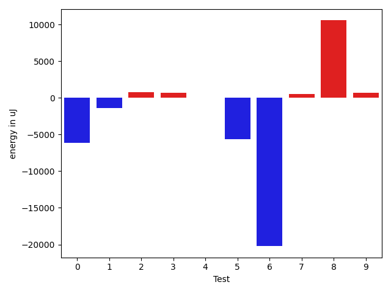

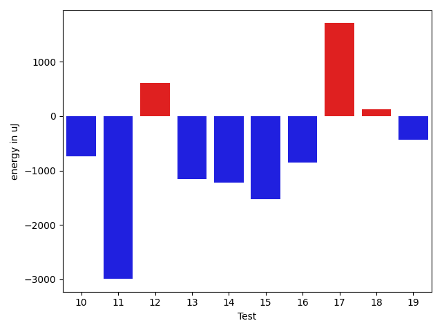

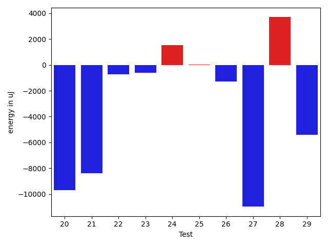

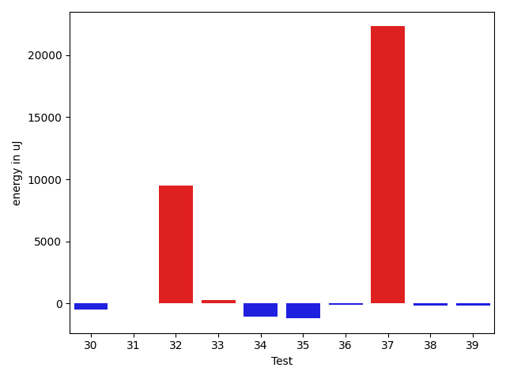

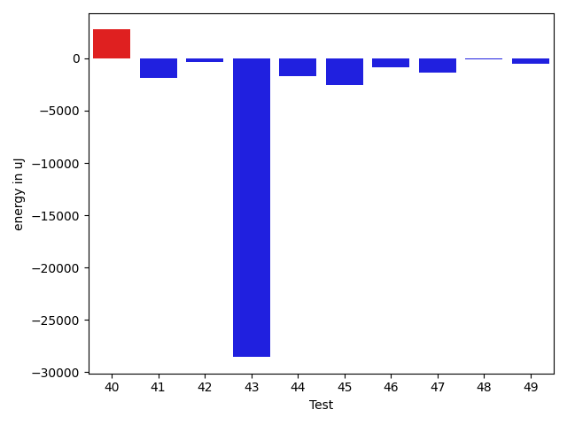

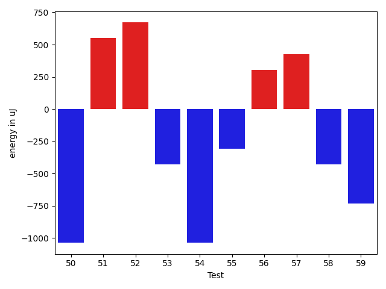

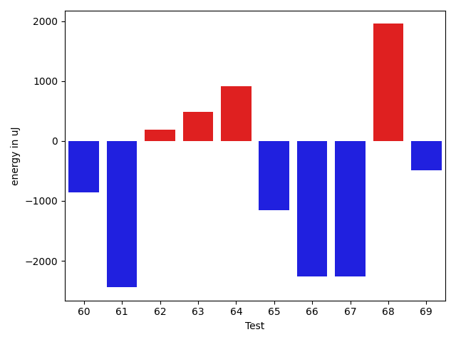

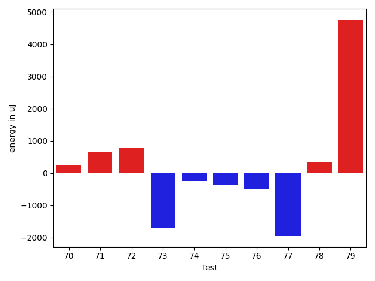

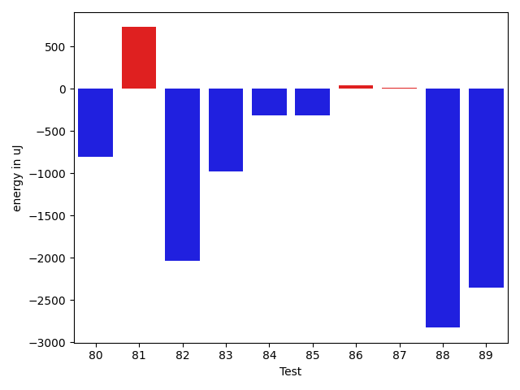

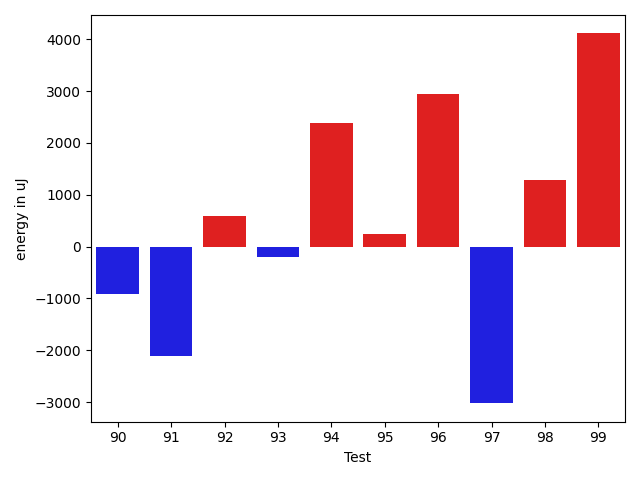

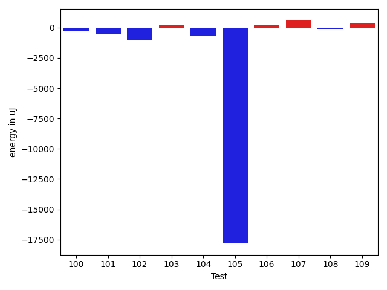

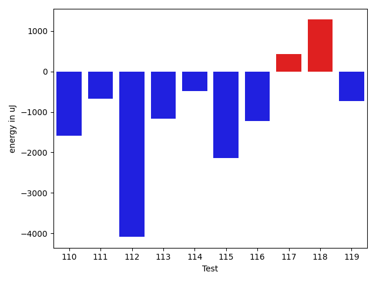

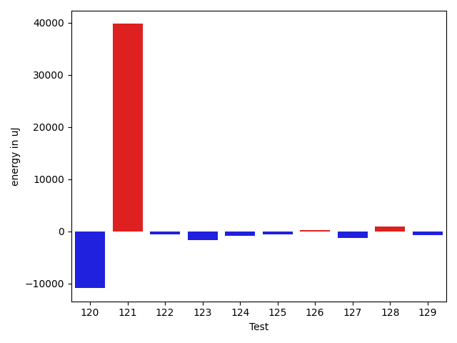

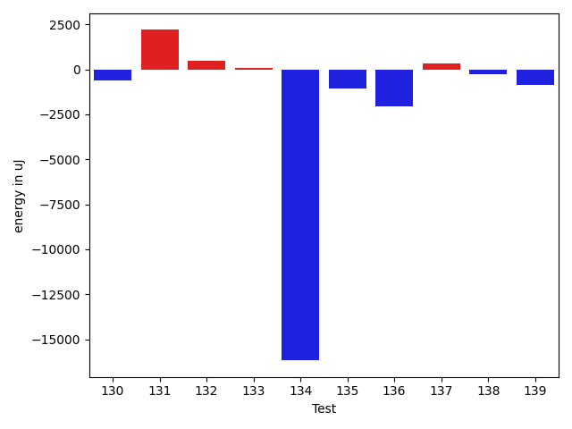

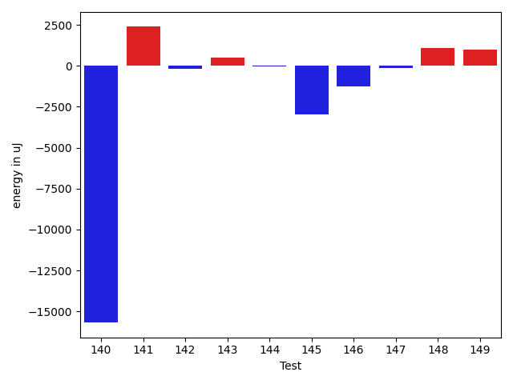

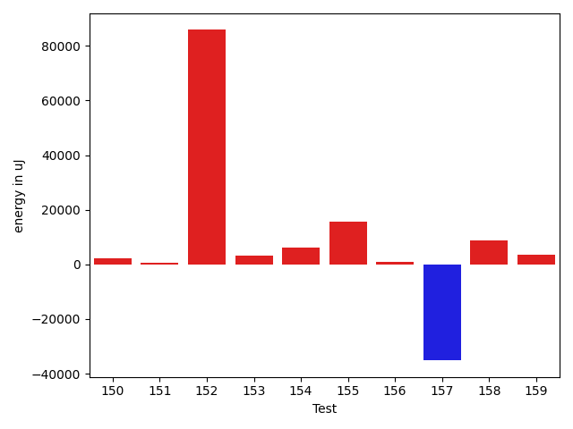

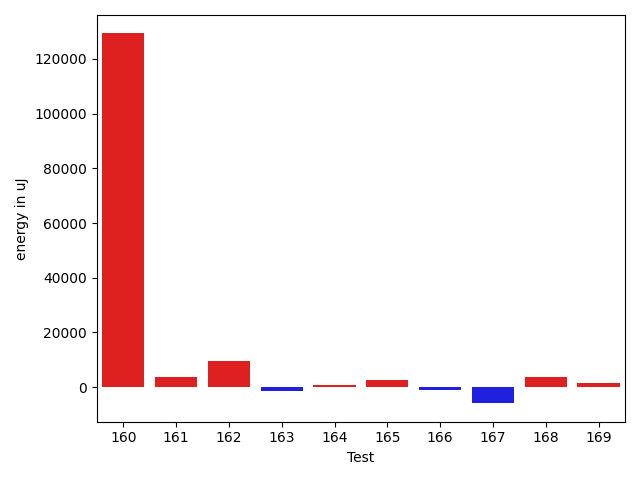

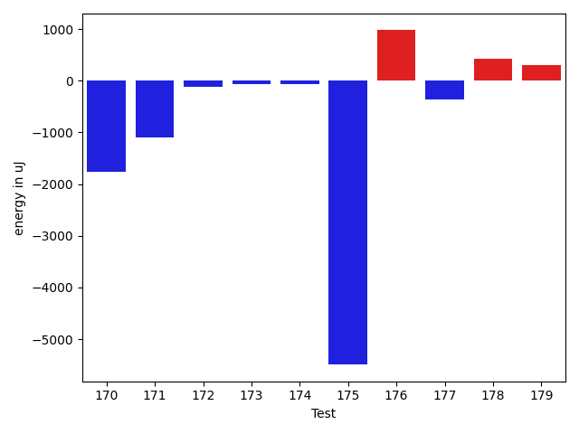

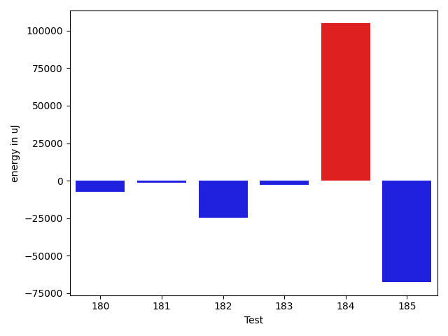

| ID | EnergyV1 | EnergyV2 | DeltaEnergy | σV1 | σV2 |
| --- | --- | --- | --- | --- | --- |
| 0 | 37353 | 38025 | 672 | 99245.90697901999 | 87659.22305661086 |
| 1 | 36926 | 34546 | -2380 | 4773.879516139404 | 4102.543367733193 |
| 2 | 34546 | 35095 | 549 | 3967.3582824194295 | 3439.5151686183485 |
| 3 | 35645 | 35522 | -123 | 6968.9633366045755 | 8125.882115943383 |
| 4 | 36316 | 35827 | -489 | 3857.3343470949476 | 3962.110729208807 |
| 5 | 40405 | 37964 | -2441 | 21669.56366525889 | 18297.27861559681 |
| 6 | 38635 | 37171 | -1464 | 79483.7449467552 | 47491.477204268966 |
| 7 | 36560 | 35156 | -1404 | 2946.223088197046 | 9937.058336510352 |
| 8 | 33996 | 35156 | 1160 | 3979.797301371013 | 40722.246168743906 |
| 9 | 34607 | 35157 | 550 | 3895.4535970992115 | 4223.213374504919 |
| 10 | 36254 | 35522 | -732 | 19285.076455755134 | 3370.2855486964404 |
| 11 | 39246 | 36255 | -2991 | 38327.028600110876 | 29449.174094361788 |
| 12 | 36926 | 37537 | 611 | 3769.5646006343204 | 4006.660481360077 |
| 13 | 35888 | 34729 | -1159 | 2820.50645509333 | 4091.127688058636 |
| 14 | 35400 | 34180 | -1220 | 3786.0974683136465 | 8456.224293217003 |
| 15 | 38330 | 36804 | -1526 | 442358.06308681006 | 246818.25830765188 |
| 16 | 65186 | 64330 | -856 | 21855.145932919535 | 21881.783313498006 |
| 17 | 34057 | 35767 | 1710 | 13533.3232212828 | 8901.88499406335 |
| 18 | 35706 | 35828 | 122 | 9039.059173148336 | 27282.643135150964 |
| 19 | 35949 | 35522 | -427 | 6904.67954094011 | 5676.675265833141 |
| 20 | 36804 | 36438 | -366 | 43957.456512358694 | 29866.49348103034 |
| 21 | 36255 | 36987 | 732 | 44812.159763981246 | 28138.83013267351 |
| 22 | 35767 | 35583 | -184 | 3654.8026601138126 | 4310.173524988316 |
| 23 | 35644 | 34668 | -976 | 2354.204908845971 | 3725.8675748871656 |
| 24 | 38696 | 39490 | 794 | 21858.312093641984 | 27054.80673490406 |
| 25 | 35095 | 35767 | 672 | 6926.041125942912 | 4069.9387166458996 |
| 26 | 36987 | 36010 | -977 | 13170.41368576488 | 12850.883128819749 |
| 27 | 38941 | 38757 | -184 | 86068.86210499276 | 52578.1980348482 |
| 28 | 36010 | 35767 | -243 | 4530.208579789677 | 30540.68425441759 |
| 29 | 34180 | 34485 | 305 | 29473.429196615336 | 3945.219149544298 |
| 30 | 34973 | 35034 | 61 | 3867.29050369894 | 4237.271554856006 |
| 31 | 34790 | 34301 | -489 | 5413.888915326948 | 4329.779462106147 |
| 32 | 34058 | 35767 | 1709 | 4356.136345885603 | 33259.89883060714 |
| 33 | 34363 | 34546 | 183 | 3920.168696098084 | 3683.929763127558 |
| 34 | 36865 | 35522 | -1343 | 3967.0733919726385 | 3672.22315775609 |
| 35 | 35766 | 35217 | -549 | 4719.092594443511 | 3282.6292612447187 |
| 36 | 35950 | 35583 | -367 | 4362.79101257154 | 4212.52434727682 |
| 37 | 81543 | 113098 | 31555 | 64037.29549597271 | 68409.908176568 |
| 38 | 35522 | 35278 | -244 | 4505.006162230983 | 4259.281815747901 |
| 39 | 35950 | 37231 | 1281 | 4831.732209432483 | 3387.338555224834 |
| 40 | 37048 | 36560 | -488 | 9024.130310652454 | 14750.790083463326 |
| 41 | 40039 | 36316 | -3723 | 4611.848741014823 | 3271.577398058558 |
| 42 | 37049 | 36560 | -489 | 4134.176312967992 | 4522.196058056306 |
| 43 | 38453 | 37659 | -794 | 384066.06615699094 | 294450.60399442964 |
| 44 | 37720 | 35400 | -2320 | 4418.344712672383 | 4883.270625308412 |
| 45 | 35889 | 35461 | -428 | 12295.015804164792 | 11576.814661158149 |
| 46 | 37231 | 36499 | -732 | 4648.171280828317 | 3651.491154366415 |
| 47 | 35950 | 35522 | -428 | 4592.366554003123 | 3944.6234219958214 |
| 48 | 36132 | 36194 | 62 | 4543.446872473936 | 2877.815869962131 |
| 49 | 36316 | 36560 | 244 | 4628.141991942107 | 3683.818984820667 |
| 50 | 39612 | 38574 | -1038 | 46752.787721017485 | 29071.28572684709 |
| 51 | 36376 | 36926 | 550 | 5064.575610607029 | 5197.46296183719 |
| 52 | 35827 | 36499 | 672 | 4745.34855580702 | 3200.100825108285 |
| 53 | 37049 | 36621 | -428 | 5278.291034326882 | 3734.8202015246015 |
| 54 | 39673 | 38636 | -1037 | 35673.52714337922 | 56196.300834775095 |
| 55 | 36683 | 36377 | -306 | 3880.1651837654777 | 3541.608391677431 |
| 56 | 33753 | 34057 | 304 | 3963.3249516304413 | 3776.079460787713 |
| 57 | 34668 | 35095 | 427 | 33884.65746320007 | 3959.5617551700934 |
| 58 | 34790 | 34363 | -427 | 8056.777290361753 | 3889.86334266631 |
| 59 | 36438 | 35706 | -732 | 16940.54300667812 | 7883.211218389431 |
| 60 | 37414 | 36560 | -854 | 29140.974449275127 | 13371.283433971386 |
| 61 | 76294 | 73852 | -2442 | 47031.85154284939 | 42894.76502338707 |
| 62 | 35644 | 35828 | 184 | 20119.087214144452 | 8110.010033194234 |
| 63 | 34973 | 35461 | 488 | 6073.87240370623 | 3601.3695800404635 |
| 64 | 34668 | 35583 | 915 | 14444.679400648098 | 12713.10666665582 |
| 65 | 36438 | 35278 | -1160 | 4567.954391118188 | 10772.325238931639 |
| 66 | 36743 | 34485 | -2258 | 4099.907047726814 | 4672.257777970053 |
| 67 | 36743 | 34484 | -2259 | 67964.44841174113 | 36738.199117719734 |
| 68 | 33508 | 35461 | 1953 | 2629.6159356032767 | 3813.734759368409 |
| 69 | 36377 | 35889 | -488 | 3404.5093164409273 | 3047.7291230121214 |
| 70 | 35278 | 35523 | 245 | 6272.511316657787 | 8292.511564835473 |
| 71 | 33691 | 34362 | 671 | 26445.308968888243 | 4595.8423463193585 |
| 72 | 33874 | 34668 | 794 | 8313.223340775194 | 3101.714523009576 |
| 73 | 35218 | 33509 | -1709 | 3602.072226703525 | 22786.702778478928 |
| 74 | 38208 | 37964 | -244 | 24992.98204955926 | 27730.76385850296 |
| 75 | 33997 | 33630 | -367 | 3635.9154243691773 | 16785.733500174752 |
| 76 | 37231 | 36743 | -488 | 9100.645696248297 | 27544.34197848235 |
| 77 | 36011 | 34058 | -1953 | 3509.8128624510855 | 21612.435102310894 |
| 78 | 34607 | 34973 | 366 | 3623.5902965068735 | 3676.8117837678933 |
| 79 | 142822 | 147583 | 4761 | 23890.36716353795 | 24429.473853121202 |
| 80 | 34119 | 32654 | -1465 | 2947.8959372062686 | 2828.973624811045 |
| 81 | 35461 | 36132 | 671 | 3595.8293809606407 | 3804.6592487120615 |
| 82 | 35644 | 32776 | -2868 | 3389.217789795555 | 2796.517893094911 |
| 83 | 34546 | 33447 | -1099 | 3893.838813109672 | 3897.0397533905366 |
| 84 | 36499 | 34179 | -2320 | 4231.241908659915 | 4599.118568560911 |
| 85 | 36438 | 35888 | -550 | 3739.572607056415 | 3818.070331802932 |
| 86 | 35217 | 35157 | -60 | 3758.909835768263 | 3792.681085995658 |
| 87 | 35584 | 34729 | -855 | 3947.635382554979 | 4177.831644226464 |
| 88 | 38574 | 35400 | -3174 | 16223.864971616718 | 16589.96754069307 |
| 89 | 37110 | 34484 | -2626 | 3371.4544683020576 | 2929.4093363679985 |
| 90 | 36438 | 34729 | -1709 | 2970.939839065031 | 3528.060085904753 |
| 91 | 36560 | 34363 | -2197 | 4560.220056854949 | 3226.6181856705284 |
| 92 | 35522 | 35522 | 0 | 10693.580727933499 | 11441.157650856516 |
| 93 | 36133 | 35522 | -611 | 8472.688104086908 | 9065.126535426802 |
| 94 | 117188 | 124390 | 7202 | 77518.17951267619 | 65053.65093148858 |
| 95 | 35339 | 34424 | -915 | 9530.70809278523 | 10671.08552237318 |
| 96 | 71289 | 72998 | 1709 | 26539.52685725883 | 33632.554923350326 |
| 97 | 35644 | 36010 | 366 | 13663.311383441214 | 10974.336953403934 |
| 98 | 62927 | 64208 | 1281 | 27772.374315515593 | 20054.28435766919 |
| 99 | 72998 | 73364 | 366 | 41859.369159571695 | 45499.435892541966 |
| 100 | 34974 | 34729 | -245 | 8255.139813448153 | 10281.82339112432 |
| 101 | 35401 | 34851 | -550 | 3910.3859165901604 | 5750.5691263029685 |
| 102 | 35583 | 34545 | -1038 | 5807.627508525128 | 5676.049747193838 |
| 103 | 35828 | 36011 | 183 | 22929.156314781674 | 3718.4187103660074 |
| 104 | 75012 | 74340 | -672 | 33514.517357913785 | 26336.129376316272 |
| 105 | 99792 | 81970 | -17822 | 185001.09016348692 | 204645.43901792707 |
| 106 | 35157 | 35400 | 243 | 3755.378252374719 | 3217.4445341883534 |
| 107 | 34973 | 35583 | 610 | 23865.782332046983 | 46285.3683417701 |
| 108 | 34180 | 34057 | -123 | 2309.401595898502 | 2347.516114901498 |
| 109 | 35705 | 36072 | 367 | 3160.3490696779895 | 3283.557073124988 |
| 110 | 35888 | 34302 | -1586 | 4393.578932071416 | 26079.992185102357 |
| 111 | 35767 | 35095 | -672 | 31226.575276753276 | 4198.178151815225 |
| 112 | 66406 | 62317 | -4089 | 29329.6528054172 | 32023.409095844178 |
| 113 | 35522 | 34363 | -1159 | 3075.9259980633683 | 3736.7626898158787 |
| 114 | 34241 | 33752 | -489 | 3967.708259313546 | 3624.0300591775563 |
| 115 | 35644 | 33508 | -2136 | 3694.371651274515 | 27509.88762935905 |
| 116 | 35096 | 33875 | -1221 | 2748.41359065664 | 2095.1114313377752 |
| 117 | 33630 | 34057 | 427 | 25151.49975019801 | 3410.6788497623484 |
| 118 | 33875 | 35157 | 1282 | 3688.897614464245 | 3209.7169906395175 |
| 119 | 33936 | 33203 | -733 | 3692.700711972764 | 35148.43809885606 |
| 120 | 39001 | 35827 | -3174 | 33159.48167489203 | 16952.885400633862 |
| 121 | 36010 | 39856 | 3846 | 3761.9559533779375 | 69488.76274301877 |
| 122 | 35339 | 34485 | -854 | 3972.1830582104203 | 2842.065066082012 |
| 123 | 35645 | 34790 | -855 | 3321.7522778731645 | 3255.8123827192717 |
| 124 | 35156 | 33142 | -2014 | 3297.461243705468 | 4224.716989206364 |
| 125 | 36072 | 35706 | -366 | 2951.3753667664087 | 2409.5832309631423 |
| 126 | 35217 | 36194 | 977 | 3635.1302476197143 | 2877.488801986127 |
| 127 | 34058 | 32654 | -1404 | 3860.335234464616 | 3987.351074113652 |
| 128 | 35156 | 35767 | 611 | 4069.1412597396984 | 4181.544864714631 |
| 129 | 37719 | 37719 | 0 | 14003.4337099384 | 11689.390005439616 |
| 130 | 35278 | 34912 | -366 | 3280.947959773094 | 3165.235302581794 |
| 131 | 32837 | 33813 | 976 | 3573.834519609675 | 4660.1144664053045 |
| 132 | 33447 | 34912 | 1465 | 3817.5672795011756 | 3161.313899181952 |
| 133 | 35339 | 35278 | -61 | 3501.3825241722034 | 3605.7483826191105 |
| 134 | 35156 | 35278 | 122 | 45656.02912504687 | 2759.577814602036 |
| 135 | 35645 | 34607 | -1038 | 4148.128264923737 | 3598.480009516363 |
| 136 | 39306 | 35645 | -3661 | 4565.804801062454 | 3748.9904455575156 |
| 137 | 34058 | 34607 | 549 | 3046.9471951244154 | 2670.735089289045 |
| 138 | 34668 | 32348 | -2320 | 3506.8040038373456 | 5955.080755952631 |
| 139 | 34118 | 33325 | -793 | 3924.5148516551285 | 4046.4947412986994 |
| 140 | 191345 | 175658 | -15687 | 150337.66949944798 | 302865.55802886846 |
| 141 | 37232 | 39612 | 2380 | 5321.722246330771 | 4498.543266907044 |
| 142 | 36926 | 36743 | -183 | 4071.5533799976947 | 3890.6808269496205 |
| 143 | 37964 | 38452 | 488 | 33260.771568311146 | 29285.92518535172 |
| 144 | 36316 | 36255 | -61 | 6220.123745019201 | 3944.231533387548 |
| 145 | 37964 | 34973 | -2991 | 11314.869299618003 | 9809.37918641052 |
| 146 | 38940 | 37658 | -1282 | 39288.13222393979 | 40434.89915852394 |
| 147 | 37659 | 37537 | -122 | 50649.462913770076 | 22783.609563407048 |
| 148 | 35340 | 36438 | 1098 | 4301.858065996505 | 3326.433946435732 |
| 149 | 36560 | 37536 | 976 | 34092.98992497859 | 3403.509969042988 |
| 150 | 34179 | 36438 | 2259 | 3669.001067425089 | 5786.231656721573 |
| 151 | 36621 | 36987 | 366 | 7867.587303952058 | 7777.158043150427 |
| 152 | 37781 | 39429 | 1648 | 487254.2518702657 | 501896.0076677706 |
| 153 | 35278 | 35400 | 122 | 4006.98339769146 | 27808.132934528738 |
| 154 | 36133 | 38391 | 2258 | 22210.55258363798 | 25801.237743527454 |
| 155 | 36682 | 41138 | 4456 | 39958.65321589624 | 43785.76995211316 |
| 156 | 35218 | 37110 | 1892 | 4128.396641838384 | 4334.176877803398 |
| 157 | 36926 | 35766 | -1160 | 138973.2021114782 | 77192.42843123354 |
| 158 | 37598 | 36438 | -1160 | 4099.385846805306 | 36797.15506288719 |
| 159 | 36926 | 37110 | 184 | 47220.09150557495 | 54839.972591876016 |
| 160 | 37170 | 37780 | 610 | 6588.450329801681 | 458186.45236132847 |
| 161 | 39978 | 39306 | -672 | 47278.481570867916 | 52245.19122730436 |
| 162 | 226745 | 227416 | 671 | 73127.68143091981 | 100148.59602912278 |
| 163 | 36926 | 35339 | -1587 | 3533.923938672278 | 3344.928807071236 |
| 164 | 38330 | 38147 | -183 | 40585.44336734169 | 34894.75858562462 |
| 165 | 35278 | 37231 | 1953 | 3610.2402884018675 | 3591.558699227955 |
| 166 | 35583 | 36072 | 489 | 3650.470166966071 | 1740.8331998189362 |
| 167 | 37780 | 36438 | -1342 | 26293.233620960356 | 2951.9069714620227 |
| 168 | 40893 | 40467 | -426 | 63867.21777835843 | 61203.288439741 |
| 169 | 35156 | 37841 | 2685 | 4057.710101749664 | 3631.5500472982258 |
| 170 | 40039 | 38269 | -1770 | 24306.970072814664 | 14983.077496476884 |
| 171 | 39368 | 38269 | -1099 | 67062.71304537891 | 61802.296559458395 |
| 172 | 38696 | 38574 | -122 | 51349.87749454898 | 201997.30144500834 |
| 173 | 37597 | 37537 | -60 | 140709.7556437757 | 144844.5629777442 |
| 174 | 39490 | 39428 | -62 | 464831.2891594828 | 497900.5925186123 |
| 175 | 70618 | 65124 | -5494 | 77832.28698370159 | 77177.43357688417 |
| 176 | 35950 | 36926 | 976 | 11625.269102238664 | 22792.8831642894 |
| 177 | 36255 | 35889 | -366 | 4492.59973527328 | 3977.831657462299 |
| 178 | 36377 | 36804 | 427 | 4541.982107761065 | 4064.4556256089677 |
| 179 | 36499 | 36804 | 305 | 3436.8661455596916 | 4319.128412816642 |
| 180 | 40161 | 39490 | -671 | 60944.82463943157 | 51728.13140453573 |
| 181 | 34545 | 35583 | 1038 | 4657.836936533486 | 3331.7057052907103 |
| 182 | 36682 | 37171 | 489 | 112658.28816287042 | 61315.41464526105 |
| 183 | 36926 | 38086 | 1160 | 27518.685578121276 | 21668.97898451621 |
| 184 | 36927 | 37537 | 610 | 470708.9343920343 | 517943.1935462114 |
| 185 | 38025 | 35278 | -2747 | 261984.1797593378 | 3420.561401169255 |

## Delta Duration per test method

| ID | DurationV1 | DurationsV2 | DeltaDuration |
| --- | --- | --- | --- |
| 0 | 1916066.0172413792 | 1610724.5 | -305341.51724137925 |
| 1 | 775795.1730769231 | 824011.3265306122 | 48216.15345368907 |
| 2 | 783962.7931034482 | 712095.5490196078 | -71867.2440838404 |
| 3 | 1097272.0285714285 | 1065254.5925925926 | -32017.435978835914 |
| 4 | 752585.8936170213 | 727923.1489361703 | -24662.744680851 |
| 5 | 1676646.96875 | 1500391.642857143 | -176255.32589285704 |
| 6 | 1900491.75 | 1376130.02 | -524361.73 |
| 7 | 735159.1219512195 | 776696.7555555556 | 41537.633604336064 |
| 8 | 343102.2 | 688727.3888888889 | 345625.18888888886 |
| 9 | 714581.7692307692 | 576116.1666666666 | -138465.60256410262 |
| 10 | 866810.0370370371 | 721656.6363636364 | -145153.40067340073 |
| 11 | 1613947.680851064 | 1012446.0810810811 | -601501.5997699829 |
| 12 | 821047.7826086957 | 785951.4727272728 | -35096.3098814229 |
| 13 | 512772.63636363635 | 496718.4 | -16054.23636363633 |
| 14 | 785043.4807692308 | 820686.0588235294 | 35642.57805429865 |
| 15 | 5135050.933333334 | 2409066.6226415094 | -2725984.310691824 |
| 16 | 2101257.6868686867 | 2055923.1717171718 | -45334.515151514905 |
| 17 | 1051216.1896551724 | 1013831.8591549295 | -37384.33050024288 |
| 18 | 845719.5 | 1063400.36 | 217680.8600000001 |
| 19 | 984913.4307692308 | 1055393.103448276 | 70479.67267904512 |
| 20 | 1699501.9295774647 | 1464093.405063291 | -235408.52451417362 |
| 21 | 1450523.3484848484 | 1249601.0144927537 | -200922.33399209473 |
| 22 | 456482.8125 | 472772.14285714284 | 16289.33035714284 |
| 23 | 479359.2380952381 | 474035.94736842107 | -5323.290726817038 |
| 24 | 1457120.1 | 1521450.892857143 | 64330.792857142864 |
| 25 | 806372.1071428572 | 768977.6724137932 | -37394.434729064 |
| 26 | 1359728.6210526316 | 1322448.0638297873 | -37280.557222844334 |
| 27 | 2212240.6101694917 | 1679405.8307692308 | -532834.7794002609 |
| 28 | 867351.6 | 911397.693877551 | 44046.09387755103 |
| 29 | 731593.1212121212 | 606565.3448275862 | -125027.77638453501 |
| 30 | 459520.3333333333 | 460193.78571428574 | 673.4523809524253 |
| 31 | 485793.9375 | 477666.61904761905 | -8127.318452380947 |
| 32 | 736408.0476190476 | 721580.3333333334 | -14827.714285714203 |
| 33 | 883622.8035714285 | 893712.5370370371 | 10089.733465608559 |
| 34 | 715643.7027027027 | 736995.2105263158 | 21351.507823613123 |
| 35 | 737315.3414634146 | 708681.7619047619 | -28633.57955865271 |
| 36 | 783793.025 | 722592.84 | -61200.185000000056 |
| 37 | 3227947.696969697 | 3818473.448979592 | 590525.7520098952 |
| 38 | 618314.6739130435 | 661012.268292683 | 42697.594379639486 |
| 39 | 466721.0 | 530338.5217391305 | 63617.52173913049 |
| 40 | 809879.9545454546 | 963771.76 | 153891.80545454542 |
| 41 | 469957.4 | 474985.95454545453 | 5028.554545454506 |
| 42 | 690275.4054054054 | 653927.25 | -36348.15540540544 |
| 43 | 3342848.951807229 | 2653281.8076923075 | -689567.1441149213 |
| 44 | 539193.4705882353 | 538974.2777777778 | -219.19281045754906 |
| 45 | 950983.8604651163 | 745364.7575757576 | -205619.10288935876 |
| 46 | 480122.3461538461 | 524936.275862069 | 44813.92970822286 |
| 47 | 548698.7857142857 | 563134.9444444445 | 14436.158730158815 |
| 48 | 468526.2380952381 | 415512.04761904763 | -53014.19047619047 |
| 49 | 418289.5294117647 | 405414.61904761905 | -12874.910364145646 |
| 50 | 1541629.28125 | 937438.4545454546 | -604190.8267045454 |
| 51 | 414970.6666666667 | 356410.36363636365 | -58560.30303030304 |
| 52 | 447414.71428571426 | 438930.63157894736 | -8484.082706766902 |
| 53 | 464131.8333333333 | 438665.64705882355 | -25466.18627450976 |
| 54 | 1921960.120879121 | 1963538.1075268816 | 41577.98664776073 |
| 55 | 424690.2272727273 | 476073.1111111111 | 51382.88383838383 |
| 56 | 533277.6129032258 | 538712.4736842106 | 5434.860780984745 |
| 57 | 958752.92 | 516453.60869565216 | -442299.3113043479 |
| 58 | 936605.3066666666 | 907857.5263157894 | -28747.780350877205 |
| 59 | 1195640.6944444445 | 1151797.1153846155 | -43843.579059829004 |
| 60 | 1127258.7727272727 | 867771.3846153846 | -259487.38811188808 |
| 61 | 2971725.9183673467 | 2788623.3333333335 | -183102.58503401326 |
| 62 | 1049481.5135135136 | 960298.1639344263 | -89183.34957908734 |
| 63 | 855615.6037735849 | 838263.3928571428 | -17352.210916442098 |
| 64 | 884909.8292682926 | 821472.2045454546 | -63437.62472283805 |
| 65 | 729428.90625 | 790098.5405405406 | 60669.63429054059 |
| 66 | 383392.3 | 413413.63636363635 | 30021.336363636365 |
| 67 | 1449148.5666666667 | 921290.2727272727 | -527858.293939394 |
| 68 | 689152.6363636364 | 601033.8888888889 | -88118.74747474748 |
| 69 | 715324.6923076923 | 644508.5238095238 | -70816.16849816847 |
| 70 | 853507.4 | 856629.8695652174 | 3122.469565217383 |
| 71 | 725542.1875 | 518058.0 | -207484.1875 |
| 72 | 557191.5384615385 | 468210.3076923077 | -88981.23076923081 |
| 73 | 660552.8125 | 752956.7857142857 | 92403.97321428568 |
| 74 | 1079907.3035714286 | 1244435.2631578948 | 164527.9595864662 |
| 75 | 978812.0 | 1062205.138888889 | 83393.13888888899 |
| 76 | 1117837.5131578948 | 1338739.1780821919 | 220901.66492429702 |
| 77 | 666922.625 | 812942.2 | 146019.57499999995 |
| 78 | 961670.1857142857 | 1002746.6307692308 | 41076.44505494507 |
| 79 | 4491731.373737373 | 4548965.98989899 | 57234.61616161652 |
| 80 | 656210.3541666666 | 671336.6666666666 | 15126.3125 |
| 81 | 615824.5862068966 | 584255.3902439025 | -31569.195962994127 |
| 82 | 403758.8 | 397580.36 | -6178.440000000002 |
| 83 | 547604.2272727273 | 544177.2962962963 | -3426.930976431002 |
| 84 | 559969.6 | 579028.0370370371 | 19058.437037037103 |
| 85 | 416335.38095238095 | 424245.9375 | 7910.556547619053 |
| 86 | 722489.6226415094 | 844916.7450980392 | 122427.12245652976 |
| 87 | 556165.0 | 596236.75 | 40071.75 |
| 88 | 1185347.8409090908 | 1222939.7142857143 | 37591.873376623495 |
| 89 | 440237.1176470588 | 467303.1 | 27065.98235294118 |
| 90 | 458157.875 | 474287.9130434783 | 16130.038043478271 |
| 91 | 460964.13636363635 | 499524.7619047619 | 38560.62554112554 |
| 92 | 1318728.9784946237 | 1303239.7113402062 | -15489.267154417466 |
| 93 | 1234305.1 | 1226156.8488372094 | -8148.251162790693 |
| 94 | 4235171.686868687 | 4298323.575757576 | 63151.88888888899 |
| 95 | 1229487.5 | 1241825.411111111 | 12337.911111111054 |
| 96 | 2396749.9191919193 | 2519044.8383838385 | 122294.91919191927 |
| 97 | 1410017.6703296704 | 1353330.8673469387 | -56686.80298273172 |
| 98 | 1956877.0202020202 | 1951174.4343434344 | -5702.585858585779 |
| 99 | 2722379.4242424243 | 2909813.0404040404 | 187433.61616161605 |
| 100 | 1244766.064516129 | 1252122.8817204302 | 7356.8172043012455 |
| 101 | 833903.9666666667 | 871153.7833333333 | 37249.81666666665 |
| 102 | 987189.9027777778 | 984176.5072463768 | -3013.3955314009218 |
| 103 | 698042.8461538461 | 537724.48 | -160318.36615384615 |
| 104 | 2669230.3131313133 | 2488634.0404040404 | -180596.27272727294 |
| 105 | 4469003.787878788 | 4133468.707070707 | -335535.0808080812 |
| 106 | 777456.0204081633 | 738497.8636363636 | -38958.156771799666 |
| 107 | 858109.9411764706 | 974647.1555555556 | 116537.214379085 |
| 108 | 538076.6296296297 | 510653.8333333333 | -27422.79629629635 |
| 109 | 516206.5882352941 | 499427.3333333333 | -16779.254901960783 |
| 110 | 689167.3953488372 | 826435.75 | 137268.35465116275 |
| 111 | 780901.6666666666 | 517908.6153846154 | -262993.05128205125 |
| 112 | 1921791.2790697673 | 1926314.6216216215 | 4523.342551854206 |
| 113 | 365208.23076923075 | 383194.0 | 17985.76923076925 |
| 114 | 402131.6842105263 | 828560.6153846154 | 426428.9311740891 |
| 115 | 488214.2413793103 | 696821.9565217391 | 208607.71514242882 |
| 116 | 383674.5714285714 | 343598.5 | -40076.07142857142 |
| 117 | 881547.3157894737 | 580210.3513513514 | -301336.96443812235 |
| 118 | 445814.35 | 405091.7 | -40722.649999999965 |
| 119 | 442314.26086956525 | 686186.5238095238 | 243872.26293995854 |
| 120 | 1106914.4 | 709116.6818181818 | -397797.71818181814 |
| 121 | 504930.23529411765 | 1736180.5833333333 | 1231250.3480392157 |
| 122 | 584946.4545454546 | 589449.40625 | 4502.951704545412 |
| 123 | 397222.13333333336 | 407341.1052631579 | 10118.971929824562 |
| 124 | 380221.5789473684 | 390961.25 | 10739.671052631573 |
| 125 | 399482.77777777775 | 381319.35714285716 | -18163.420634920592 |
| 126 | 406500.6153846154 | 442615.25 | 36114.634615384624 |
| 127 | 392892.5714285714 | 379461.76470588235 | -13430.80672268907 |
| 128 | 428603.07692307694 | 391823.76923076925 | -36779.30769230769 |
| 129 | 827089.1153846154 | 773094.8064516129 | -53994.308933002525 |
| 130 | 397968.8095238095 | 385344.07692307694 | -12624.73260073259 |
| 131 | 350428.45454545453 | 361366.9 | 10938.445454545494 |
| 132 | 410085.0 | 412746.2380952381 | 2661.2380952381063 |
| 133 | 612763.2272727273 | 367822.45454545453 | -244940.77272727276 |
| 134 | 947883.2352941176 | 385324.5625 | -562558.6727941176 |
| 135 | 529718.551724138 | 575229.0333333333 | 45510.481609195354 |
| 136 | 464284.1818181818 | 473469.63636363635 | 9185.45454545453 |
| 137 | 380858.55555555556 | 395695.6923076923 | 14837.13675213675 |
| 138 | 654839.5789473684 | 377649.1818181818 | -277190.3971291866 |
| 139 | 374578.38095238095 | 383355.5 | 8777.119047619053 |
| 140 | 6248709.575757576 | 7719561.070707071 | 1470851.4949494945 |
| 141 | 635152.75 | 584328.7142857143 | -50824.03571428568 |
| 142 | 818516.1355932204 | 795646.9411764706 | -22869.194416749757 |
| 143 | 1181814.8 | 1239780.5714285714 | 57965.771428571315 |
| 144 | 962923.2575757576 | 959664.033898305 | -3259.2236774525372 |
| 145 | 984313.5818181818 | 929155.1320754717 | -55158.4497427101 |
| 146 | 1426530.7575757576 | 1238523.12 | -188007.63757575746 |
| 147 | 1219380.9122807018 | 1005028.7419354839 | -214352.17034521792 |
| 148 | 604220.1935483871 | 668940.4 | 64720.206451612874 |
| 149 | 701136.2592592592 | 594796.0833333334 | -106340.17592592584 |
| 150 | 744461.3095238095 | 860113.0731707317 | 115651.76364692219 |
| 151 | 860505.3636363636 | 908672.2564102564 | 48166.89277389273 |
| 152 | 7642018.4375 | 11445881.142857144 | 3803862.7053571437 |
| 153 | 745054.575 | 905262.0714285715 | 160207.49642857153 |
| 154 | 1329528.5060240964 | 1545805.8255813953 | 216277.3195572989 |
| 155 | 1103623.5263157894 | 1834528.175 | 730904.6486842106 |
| 156 | 528616.3793103448 | 679303.724137931 | 150687.3448275862 |
| 157 | 2168938.6363636362 | 1227134.611111111 | -941804.0252525252 |
| 158 | 617617.0 | 837759.1935483871 | 220142.19354838715 |
| 159 | 1100439.641025641 | 1103145.282051282 | 2705.6410256410018 |
| 160 | 793533.7291666666 | 4602938.12962963 | 3809404.400462963 |
| 161 | 1770468.255319149 | 1942839.4782608696 | 172371.22294172063 |
| 162 | 6953329.343434343 | 7247346.131313131 | 294016.7878787881 |
| 163 | 695644.0277777778 | 706003.05 | 10359.022222222295 |
| 164 | 1596794.1095890412 | 1742858.1875 | 146064.0779109588 |
| 165 | 537792.25 | 552051.15 | 14258.900000000023 |
| 166 | 504380.71428571426 | 467105.64285714284 | -37275.07142857142 |
| 167 | 593453.32 | 392713.23529411765 | -200740.0847058823 |
| 168 | 1822033.625 | 2074434.5185185184 | 252400.89351851842 |
| 169 | 532648.380952381 | 585933.8571428572 | 53285.47619047621 |
| 170 | 1247099.064516129 | 1007186.1111111111 | -239912.95340501785 |
| 171 | 1867492.0 | 1569610.0952380951 | -297881.90476190485 |
| 172 | 1595877.9836065574 | 2080404.8 | 484526.8163934427 |
| 173 | 2406019.904761905 | 2379880.6666666665 | -26139.23809523834 |
| 174 | 4107489.426229508 | 5369392.293103448 | 1261902.86687394 |
| 175 | 2664062.1530612246 | 2673735.9693877553 | 9673.81632653065 |
| 176 | 1035724.1724137932 | 1044315.9354838709 | 8591.763070077752 |
| 177 | 573932.5 | 582107.9032258064 | 8175.403225806425 |
| 178 | 597292.1935483871 | 536346.0384615385 | -60946.15508684865 |
| 179 | 524546.0476190476 | 490295.24 | -34250.807619047584 |
| 180 | 1684409.761904762 | 1210780.043478261 | -473629.7184265009 |
| 181 | 770033.2941176471 | 443817.2 | -326216.0941176471 |
| 182 | 2104324.103448276 | 1521127.6666666667 | -583196.4367816092 |
| 183 | 1086480.65 | 1047818.5454545454 | -38662.104545454495 |
| 184 | 3950637.0 | 7782244.794871795 | 3831607.794871795 |
| 185 | 2646203.0588235296 | 557840.2105263158 | -2088362.8482972137 |

## Misc.

| ID | Test Class | Test Method |
| --- | --- | --- |
| 0 | com.google.gson.functional.CustomDeserializerTest | testDefaultConstructorNotCalledOnObject |
| 1 | com.google.gson.functional.CustomDeserializerTest | testDefaultConstructorNotCalledOnField |
| 2 | com.google.gson.functional.CollectionTest | testCollectionOfObjectSerialization |
| 3 | com.google.gson.functional.CollectionTest | testWildcardPrimitiveCollectionSerilaization |
| 4 | com.google.gson.functional.CollectionTest | testQueueSerialization |
| 5 | com.google.gson.functional.CollectionTest | testWildcardCollectionField |
| 6 | com.google.gson.functional.CollectionTest | testSetSerialization |
| 7 | com.google.gson.functional.CollectionTest | testTopLevelCollectionOfIntegersSerialization |
| 8 | com.google.gson.functional.CollectionTest | testCollectionOfStringsSerialization |
| 9 | com.google.gson.functional.CollectionTest | testRawCollectionSerialization |
| 10 | com.google.gson.functional.CollectionTest | testNullsInListSerialization |
| 11 | com.google.gson.functional.CollectionTest | testCollectionOfBagOfPrimitivesSerialization |
| 12 | com.google.gson.functional.CollectionTest | testLinkedListSerialization |
| 13 | com.google.gson.functional.CollectionTest | testRawCollectionOfIntegersSerialization |
| 14 | com.google.gson.functional.CustomTypeAdaptersTest | testCustomTypeAdapterAppliesToSubClassesSerializedAsBaseClass |
| 15 | com.google.gson.functional.CustomTypeAdaptersTest | testCustomSerializers |
| 16 | com.google.gson.functional.CustomTypeAdaptersTest | testCustomTypeAdapterDoesNotAppliesToSubClasses |
| 17 | com.google.gson.functional.CustomTypeAdaptersTest | testCustomSerializerForLong |
| 18 | com.google.gson.functional.CustomTypeAdaptersTest | testCustomByteArraySerializer |
| 19 | com.google.gson.functional.CustomTypeAdaptersTest | testCustomAdapterInvokedForMapElementSerializationWithType |
| 20 | com.google.gson.functional.CustomTypeAdaptersTest | testCustomAdapterInvokedForCollectionElementSerializationWithType |
| 21 | com.google.gson.functional.CustomTypeAdaptersTest | testCustomNestedSerializers |
| 22 | com.google.gson.functional.CustomTypeAdaptersTest | testCustomAdapterInvokedForCollectionElementSerialization |
| 23 | com.google.gson.functional.CustomTypeAdaptersTest | testCustomAdapterInvokedForMapElementSerialization |
| 24 | com.google.gson.functional.MapTest | testMapSerializationWithNullValues |
| 25 | com.google.gson.functional.MapTest | testMapSerializationWithNullValueButSerializeNulls |
| 26 | com.google.gson.functional.MapTest | testParameterizedMapSubclassSerialization |
| 27 | com.google.gson.functional.MapTest | testMapSerialization |
| 28 | com.google.gson.functional.MapTest | testMapSerializationWithNullKey |
| 29 | com.google.gson.functional.MapTest | testMapSerializationWithNullValuesSerialized |
| 30 | com.google.gson.functional.MapTest | testMapOfMapSerialization |
| 31 | com.google.gson.functional.MapTest | testRawMapSerialization |
| 32 | com.google.gson.functional.MapTest | testMapSubclassSerialization |
| 33 | com.google.gson.functional.MapTest | testMapSerializationWithWildcardValues |
| 34 | com.google.gson.functional.MapTest | testMapSerializationWithNullValue |
| 35 | com.google.gson.functional.MapTest | testMapSerializationEmpty |
| 36 | com.google.gson.functional.MapTest | testMapSerializationWithIntegerKeys |
| 37 | com.google.gson.functional.ExposeFieldsTest | testNullExposeFieldSerialization |
| 38 | com.google.gson.functional.ExposeFieldsTest | testExposedInterfaceFieldSerialization |
| 39 | com.google.gson.functional.ExposeFieldsTest | testNoExposedFieldSerialization |
| 40 | com.google.gson.functional.ExposeFieldsTest | testArrayWithOneNullExposeFieldObjectSerialization |
| 41 | com.google.gson.functional.ExposeFieldsTest | testExposeAnnotationSerialization |
| 42 | com.google.gson.functional.FieldExclusionTest | testDefaultNestedStaticClassIncluded |
| 43 | com.google.gson.functional.FieldExclusionTest | testDefaultInnerClassExclusion |
| 44 | com.google.gson.functional.FieldExclusionTest | testInnerClassExclusion |
| 45 | com.google.gson.functional.StringTest | testStringValueAsSingleElementArraySerialization |
| 46 | com.google.gson.functional.StringTest | testSingleQuoteInStringSerialization |
| 47 | com.google.gson.functional.StringTest | testEscapingQuotesInStringSerialization |
| 48 | com.google.gson.functional.StringTest | testJavascriptKeywordsInStringSerialization |
| 49 | com.google.gson.functional.StringTest | testEscapedCtrlNInStringSerialization |
| 50 | com.google.gson.functional.StringTest | testStringValueSerialization |
| 51 | com.google.gson.functional.StringTest | testEscapedCtrlRInStringSerialization |
| 52 | com.google.gson.functional.StringTest | testEscapedBackslashInStringSerialization |
| 53 | com.google.gson.functional.StringTest | testAssignmentCharSerialization |
| 54 | com.google.gson.functional.ObjectTest | testDirectedAcyclicGraphSerialization |
| 55 | com.google.gson.functional.ObjectTest | testClassWithNoFieldsSerialization |
| 56 | com.google.gson.functional.ObjectTest | testSelfReferenceSerialization |
| 57 | com.google.gson.functional.ObjectTest | testEmptyCollectionInAnObjectSerialization |
| 58 | com.google.gson.functional.ObjectTest | testClassWithObjectFieldSerialization |
| 59 | com.google.gson.functional.ObjectTest | testArrayOfArraysSerialization |
| 60 | com.google.gson.functional.ObjectTest | testAnonymousLocalClassesSerialization |
| 61 | com.google.gson.functional.ObjectTest | testSubInterfacesOfCollectionSerialization |
| 62 | com.google.gson.functional.ObjectTest | testInheritenceSerialization |
| 63 | com.google.gson.functional.ObjectTest | testArrayOfObjectsSerialization |
| 64 | com.google.gson.functional.ObjectTest | testInnerClassSerialization |
| 65 | com.google.gson.functional.ObjectTest | testClassWithTransientFieldsSerialization |
| 66 | com.google.gson.functional.ObjectTest | testNullSerialization |
| 67 | com.google.gson.functional.ObjectTest | testBagOfPrimitivesSerialization |
| 68 | com.google.gson.functional.ObjectTest | testCircularSerialization |
| 69 | com.google.gson.functional.ObjectTest | testBagOfPrimitiveWrappersSerialization |
| 70 | com.google.gson.functional.ObjectTest | testNestedSerialization |
| 71 | com.google.gson.functional.ObjectTest | testNullFieldsSerialization |
| 72 | com.google.gson.functional.ObjectTest | testPrimitiveArrayFieldSerialization |
| 73 | com.google.gson.functional.DefaultTypeAdaptersTest | testDateSerializationWithPattern |
| 74 | com.google.gson.functional.DefaultTypeAdaptersTest | testUrlSerialization |
| 75 | com.google.gson.functional.DefaultTypeAdaptersTest | testDefaultDateDeserializationUsingBuilder |
| 76 | com.google.gson.functional.DefaultTypeAdaptersTest | testUrlNullSerialization |
| 77 | com.google.gson.functional.DefaultTypeAdaptersTest | testDateDeserializationWithPattern |
| 78 | com.google.gson.functional.DefaultTypeAdaptersTest | testDefaultDateSerialization |
| 79 | com.google.gson.functional.DefaultTypeAdaptersTest | testDefaultDateDeserialization |
| 80 | com.google.gson.functional.DefaultTypeAdaptersTest | testDefaultDateSerializationUsingBuilder |
| 81 | com.google.gson.functional.DefaultTypeAdaptersTest | testUuidSerialization |
| 82 | com.google.gson.functional.DefaultTypeAdaptersTest | testPropertiesSerialization |
| 83 | com.google.gson.functional.DefaultTypeAdaptersTest | testDefaultCalendarSerialization |
| 84 | com.google.gson.functional.DefaultTypeAdaptersTest | testUriSerialization |
| 85 | com.google.gson.functional.DefaultTypeAdaptersTest | testLocaleSerializationWithLanguageCountry |
| 86 | com.google.gson.functional.DefaultTypeAdaptersTest | testBigIntegerFieldSerialization |
| 87 | com.google.gson.functional.DefaultTypeAdaptersTest | testSetSerialization |
| 88 | com.google.gson.functional.DefaultTypeAdaptersTest | testBigDecimalFieldSerialization |
| 89 | com.google.gson.functional.DefaultTypeAdaptersTest | testLocaleSerializationWithLanguage |
| 90 | com.google.gson.functional.DefaultTypeAdaptersTest | testLocaleSerializationWithLanguageCountryVariant |
| 91 | com.google.gson.functional.DefaultTypeAdaptersTest | testDefaultGregorianCalendarSerialization |
| 92 | com.google.gson.functional.ParameterizedTypesTest | testVariableTypeArrayDeserialization |
| 93 | com.google.gson.functional.ParameterizedTypesTest | testParameterizedTypeWithCustomSerializer |
| 94 | com.google.gson.functional.ParameterizedTypesTest | testParameterizedTypesSerialization |
| 95 | com.google.gson.functional.ParameterizedTypesTest | testVariableTypeDeserialization |
| 96 | com.google.gson.functional.ParameterizedTypesTest | testVariableTypeFieldsAndGenericArraysSerialization |
| 97 | com.google.gson.functional.ParameterizedTypesTest | testParameterizedTypeGenericArraysDeserialization |
| 98 | com.google.gson.functional.ParameterizedTypesTest | testVariableTypeFieldsAndGenericArraysDeserialization |
| 99 | com.google.gson.functional.ParameterizedTypesTest | testTypesWithMultipleParametersSerialization |
| 100 | com.google.gson.functional.ParameterizedTypesTest | testParameterizedTypeWithVariableTypeDeserialization |
| 101 | com.google.gson.functional.ParameterizedTypesTest | testParameterizedTypesWithWriterSerialization |
| 102 | com.google.gson.functional.ParameterizedTypesTest | testParameterizedTypeGenericArraysSerialization |
| 103 | com.google.gson.functional.ParameterizedTypesTest | testDeepParameterizedTypeSerialization |
| 104 | com.google.gson.functional.NamingPolicyTest | testGsonWithNonDefaultFieldNamingPolicySerialization |
| 105 | com.google.gson.functional.NamingPolicyTest | testGsonDuplicateNameUsingSerializedNameFieldNamingPolicySerialization |
| 106 | com.google.gson.functional.NamingPolicyTest | testGsonWithSerializedNameFieldNamingPolicySerialization |
| 107 | com.google.gson.functional.NamingPolicyTest | testGsonWithNonDefaultFieldNamingPolicyDeserialiation |
| 108 | com.google.gson.functional.PrimitiveTest | testHtmlCharacterSerialization |
| 109 | com.google.gson.functional.PrimitiveTest | testBigDecimalSerialization |
| 110 | com.google.gson.functional.PrimitiveTest | testBigIntegerSerialization |
| 111 | com.google.gson.functional.PrimitiveTest | testBigDecimalInASingleElementArraySerialization |
| 112 | com.google.gson.functional.PrimitiveTest | testPrimitiveDoubleAutoboxedSerialization |
| 113 | com.google.gson.functional.PrimitiveTest | testSmallValueForBigIntegerSerialization |
| 114 | com.google.gson.functional.PrimitiveTest | testFloatInfinitySerializationNotSupportedByDefault |
| 115 | com.google.gson.functional.PrimitiveTest | testPrimitiveLongAutoboxedInASingleElementArraySerialization |
| 116 | com.google.gson.functional.PrimitiveTest | testNegativeInfinityFloatSerializationNotSupportedByDefault |
| 117 | com.google.gson.functional.PrimitiveTest | testOverridingDefaultPrimitiveSerialization |
| 118 | com.google.gson.functional.PrimitiveTest | testFloatNaNSerializationNotSupportedByDefault |
| 119 | com.google.gson.functional.PrimitiveTest | testDoubleNaNSerializationNotSupportedByDefault |
| 120 | com.google.gson.functional.PrimitiveTest | testPrimitiveIntegerAutoboxedSerialization |
| 121 | com.google.gson.functional.PrimitiveTest | testPrimitiveLongAutoboxedSerialization |
| 122 | com.google.gson.functional.PrimitiveTest | testBigIntegerInASingleElementArraySerialization |
| 123 | com.google.gson.functional.PrimitiveTest | testPrimitiveBooleanAutoboxedSerialization |
| 124 | com.google.gson.functional.PrimitiveTest | testNegativeInfinitySerialization |
| 125 | com.google.gson.functional.PrimitiveTest | testSmallValueForBigDecimalSerialization |
| 126 | com.google.gson.functional.PrimitiveTest | testNumberSerialization |
| 127 | com.google.gson.functional.PrimitiveTest | testDoubleNaNSerialization |
| 128 | com.google.gson.functional.PrimitiveTest | testReallyLongValuesSerialization |
| 129 | com.google.gson.functional.PrimitiveTest | testPrimitiveIntegerAutoboxedInASingleElementArraySerialization |
| 130 | com.google.gson.functional.PrimitiveTest | testNegativeInfinitySerializationNotSupportedByDefault |
| 131 | com.google.gson.functional.PrimitiveTest | testNegativeInfinityFloatSerialization |
| 132 | com.google.gson.functional.PrimitiveTest | testLongAsStringSerialization |
| 133 | com.google.gson.functional.PrimitiveTest | testDoubleInfinitySerialization |
| 134 | com.google.gson.functional.PrimitiveTest | testDoubleInfinitySerializationNotSupportedByDefault |
| 135 | com.google.gson.functional.PrimitiveTest | testPrimitiveDoubleAutoboxedInASingleElementArraySerialization |
| 136 | com.google.gson.functional.PrimitiveTest | testPrimitiveBooleanAutoboxedInASingleElementArraySerialization |
| 137 | com.google.gson.functional.PrimitiveTest | testBigDecimalPreservePrecisionSerialization |
| 138 | com.google.gson.functional.PrimitiveTest | testFloatNaNSerialization |
| 139 | com.google.gson.functional.PrimitiveTest | testFloatInfinitySerialization |
| 140 | com.google.gson.functional.VersioningTest | testVersionedUntilSerialization |
| 141 | com.google.gson.functional.VersioningTest | testIgnoreLaterVersionClassSerialization |
| 142 | com.google.gson.functional.VersioningTest | testVersionedClassesSerialization |
| 143 | com.google.gson.functional.VersioningTest | testVersionedGsonWithUnversionedClassesSerialization |
| 144 | com.google.gson.functional.VersioningTest | testVersionedGsonMixingSinceAndUntilSerialization |
| 145 | com.google.gson.functional.EnumTest | testClassWithEnumFieldSerialization |
| 146 | com.google.gson.functional.EnumTest | testCollectionOfEnumsSerialization |
| 147 | com.google.gson.functional.EnumTest | testTopLevelEnumSerialization |
| 148 | com.google.gson.functional.NullObjectAndFieldTest | testExplicitSerializationOfNullCollectionMembers |
| 149 | com.google.gson.functional.NullObjectAndFieldTest | testCustomSerializationOfNulls |
| 150 | com.google.gson.functional.NullObjectAndFieldTest | testPrintPrintingObjectWithNulls |
| 151 | com.google.gson.functional.NullObjectAndFieldTest | testPrintPrintingArraysWithNulls |
| 152 | com.google.gson.functional.NullObjectAndFieldTest | testTopLevelNullObjectSerialization |
| 153 | com.google.gson.functional.NullObjectAndFieldTest | testNullWrappedPrimitiveMemberSerialization |
| 154 | com.google.gson.functional.NullObjectAndFieldTest | testExplicitSerializationOfNullArrayMembers |
| 155 | com.google.gson.functional.NullObjectAndFieldTest | testExplicitSerializationOfNulls |
| 156 | com.google.gson.functional.NullObjectAndFieldTest | testExplicitSerializationOfNullStringMembers |
| 157 | com.google.gson.GsonTypeAdapterTest | testTypeAdapterDoesNotAffectNonAdaptedTypes |
| 158 | com.google.gson.GsonTypeAdapterTest | testTypeAdapterProperlyConvertsTypes |
| 159 | com.google.gson.GsonTypeAdapterTest | testTypeAdapterThrowsException |
| 160 | com.google.gson.FunctionWithInternalDependenciesTest | testAnonymousLocalClassesSerialization |
| 161 | com.google.gson.functional.ConcurrencyTest | testSingleThreadSerialization |
| 162 | com.google.gson.functional.ConcurrencyTest | testMultiThreadSerialization |
| 163 | com.google.gson.functional.ArrayTest | testArrayOfPrimitivesWithCustomTypeAdapter |
| 164 | com.google.gson.functional.ArrayTest | testArrayOfCollectionSerialization |
| 165 | com.google.gson.functional.ArrayTest | testNullsInArrayWithSerializeNullPropertySetSerialization |
| 166 | com.google.gson.functional.ArrayTest | testArrayOfStringsSerialization |
| 167 | com.google.gson.functional.ArrayTest | testEmptyArraySerialization |
| 168 | com.google.gson.functional.ArrayTest | testTopLevelArrayOfIntsSerialization |
| 169 | com.google.gson.functional.ArrayTest | testNullsInArraySerialization |
| 170 | com.google.gson.functional.UncategorizedTest | testStaticFieldsAreNotSerialized |
| 171 | com.google.gson.functional.UncategorizedTest | testObjectEqualButNotSameSerialization |
| 172 | com.google.gson.functional.EscapingTest | testEscapingObjectFields |
| 173 | com.google.gson.functional.EscapingTest | testEscapingQuotesInStringArray |
| 174 | com.google.gson.functional.PrintFormattingTest | testCompactFormattingLeavesNoWhiteSpace |
| 175 | com.google.gson.functional.PrettyPrintingTest | testPrettyPrintList |
| 176 | com.google.gson.functional.PrettyPrintingTest | testPrettyPrintArrayOfObjects |
| 177 | com.google.gson.functional.PrettyPrintingTest | testPrettyPrintArrayOfPrimitiveArrays |
| 178 | com.google.gson.functional.PrettyPrintingTest | testPrettyPrintListOfPrimitiveArrays |
| 179 | com.google.gson.functional.PrettyPrintingTest | testMultipleArrays |
| 180 | com.google.gson.functional.PrettyPrintingTest | testMap |
| 181 | com.google.gson.functional.PrettyPrintingTest | testPrettyPrintArrayOfPrimitives |
| 182 | com.google.gson.functional.ReadersWritersTest | testWriterForSerialization |
| 183 | com.google.gson.functional.InternationalizationTest | testStringsWithUnicodeChineseCharactersSerialization |
| 184 | com.google.gson.functional.SecurityTest | testNonExecutableJsonSerialization |
| 185 | com.google.gson.functional.SecurityTest | testJsonWithNonExectuableTokenSerialization |

| Test | IterationV1 | IterationV2 | DeltaIteration |
| --- | --- | --- | --- |
| 0 | 58 | 62 | 4 |
| 1 | 52 | 49 | -3 |
| 2 | 58 | 51 | -7 |
| 3 | 70 | 54 | -16 |
| 4 | 47 | 47 | 0 |
| 5 | 96 | 98 | 2 |
| 6 | 60 | 50 | -10 |
| 7 | 41 | 45 | 4 |
| 8 | 10 | 18 | 8 |
| 9 | 39 | 24 | -15 |
| 10 | 54 | 44 | -10 |
| 11 | 47 | 37 | -10 |
| 12 | 46 | 55 | 9 |
| 13 | 22 | 20 | -2 |
| 14 | 52 | 51 | -1 |
| 15 | 60 | 53 | -7 |
| 16 | 99 | 99 | 0 |
| 17 | 58 | 71 | 13 |
| 18 | 48 | 50 | 2 |
| 19 | 65 | 58 | -7 |
| 20 | 71 | 79 | 8 |
| 21 | 66 | 69 | 3 |
| 22 | 16 | 35 | 19 |
| 23 | 21 | 19 | -2 |
| 24 | 60 | 56 | -4 |
| 25 | 56 | 58 | 2 |
| 26 | 95 | 94 | -1 |
| 27 | 59 | 65 | 6 |
| 28 | 50 | 49 | -1 |
| 29 | 33 | 29 | -4 |
| 30 | 15 | 14 | -1 |
| 31 | 16 | 21 | 5 |
| 32 | 21 | 21 | 0 |
| 33 | 56 | 54 | -2 |
| 34 | 37 | 38 | 1 |
| 35 | 41 | 42 | 1 |
| 36 | 40 | 50 | 10 |
| 37 | 99 | 98 | -1 |
| 38 | 46 | 41 | -5 |
| 39 | 23 | 23 | 0 |
| 40 | 44 | 50 | 6 |
| 41 | 10 | 22 | 12 |
| 42 | 37 | 28 | -9 |
| 43 | 83 | 78 | -5 |
| 44 | 17 | 18 | 1 |
| 45 | 43 | 33 | -10 |
| 46 | 26 | 29 | 3 |
| 47 | 28 | 18 | -10 |
| 48 | 21 | 21 | 0 |
| 49 | 17 | 21 | 4 |
| 50 | 32 | 22 | -10 |
| 51 | 15 | 11 | -4 |
| 52 | 21 | 19 | -2 |
| 53 | 12 | 17 | 5 |
| 54 | 91 | 93 | 2 |
| 55 | 22 | 18 | -4 |
| 56 | 31 | 19 | -12 |
| 57 | 25 | 23 | -2 |
| 58 | 75 | 76 | 1 |
| 59 | 72 | 78 | 6 |
| 60 | 44 | 52 | 8 |
| 61 | 98 | 99 | 1 |
| 62 | 74 | 61 | -13 |
| 63 | 53 | 56 | 3 |
| 64 | 41 | 44 | 3 |
| 65 | 32 | 37 | 5 |
| 66 | 10 | 11 | 1 |
| 67 | 30 | 33 | 3 |
| 68 | 33 | 27 | -6 |
| 69 | 39 | 42 | 3 |
| 70 | 50 | 46 | -4 |
| 71 | 32 | 30 | -2 |
| 72 | 26 | 26 | 0 |
| 73 | 48 | 42 | -6 |
| 74 | 56 | 57 | 1 |
| 75 | 73 | 72 | -1 |
| 76 | 76 | 73 | -3 |
| 77 | 48 | 50 | 2 |
| 78 | 70 | 65 | -5 |
| 79 | 99 | 99 | 0 |
| 80 | 48 | 45 | -3 |
| 81 | 29 | 41 | 12 |
| 82 | 15 | 25 | 10 |
| 83 | 22 | 27 | 5 |
| 84 | 25 | 27 | 2 |
| 85 | 21 | 16 | -5 |
| 86 | 53 | 51 | -2 |
| 87 | 25 | 20 | -5 |
| 88 | 44 | 49 | 5 |
| 89 | 17 | 20 | 3 |
| 90 | 16 | 23 | 7 |
| 91 | 22 | 21 | -1 |
| 92 | 93 | 97 | 4 |
| 93 | 90 | 86 | -4 |
| 94 | 99 | 99 | 0 |
| 95 | 92 | 90 | -2 |
| 96 | 99 | 99 | 0 |
| 97 | 91 | 98 | 7 |
| 98 | 99 | 99 | 0 |
| 99 | 99 | 99 | 0 |
| 100 | 93 | 93 | 0 |
| 101 | 60 | 60 | 0 |
| 102 | 72 | 69 | -3 |
| 103 | 26 | 25 | -1 |
| 104 | 99 | 99 | 0 |
| 105 | 99 | 99 | 0 |
| 106 | 49 | 44 | -5 |
| 107 | 51 | 45 | -6 |
| 108 | 27 | 24 | -3 |
| 109 | 17 | 18 | 1 |
| 110 | 43 | 32 | -11 |
| 111 | 21 | 26 | 5 |
| 112 | 43 | 37 | -6 |
| 113 | 13 | 10 | -3 |
| 114 | 19 | 13 | -6 |
| 115 | 29 | 23 | -6 |
| 116 | 14 | 12 | -2 |
| 117 | 38 | 37 | -1 |
| 118 | 20 | 20 | 0 |
| 119 | 23 | 21 | -2 |
| 120 | 20 | 22 | 2 |
| 121 | 17 | 12 | -5 |
| 122 | 33 | 32 | -1 |
| 123 | 15 | 19 | 4 |
| 124 | 19 | 12 | -7 |
| 125 | 18 | 14 | -4 |
| 126 | 13 | 12 | -1 |
| 127 | 14 | 17 | 3 |
| 128 | 13 | 13 | 0 |
| 129 | 26 | 31 | 5 |
| 130 | 21 | 13 | -8 |
| 131 | 11 | 10 | -1 |
| 132 | 19 | 21 | 2 |
| 133 | 22 | 22 | 0 |
| 134 | 17 | 16 | -1 |
| 135 | 29 | 30 | 1 |
| 136 | 22 | 33 | 11 |
| 137 | 9 | 13 | 4 |
| 138 | 19 | 11 | -8 |
| 139 | 21 | 18 | -3 |
| 140 | 99 | 99 | 0 |
| 141 | 28 | 28 | 0 |
| 142 | 59 | 51 | -8 |
| 143 | 40 | 42 | 2 |
| 144 | 66 | 59 | -7 |
| 145 | 55 | 53 | -2 |
| 146 | 66 | 50 | -16 |
| 147 | 57 | 62 | 5 |
| 148 | 31 | 25 | -6 |
| 149 | 27 | 24 | -3 |
| 150 | 42 | 41 | -1 |
| 151 | 33 | 39 | 6 |
| 152 | 16 | 28 | 12 |
| 153 | 40 | 42 | 2 |
| 154 | 83 | 86 | 3 |
| 155 | 38 | 40 | 2 |
| 156 | 29 | 29 | 0 |
| 157 | 22 | 18 | -4 |
| 158 | 27 | 31 | 4 |
| 159 | 39 | 39 | 0 |
| 160 | 48 | 54 | 6 |
| 161 | 94 | 92 | -2 |
| 162 | 99 | 99 | 0 |
| 163 | 36 | 40 | 4 |
| 164 | 73 | 64 | -9 |
| 165 | 20 | 20 | 0 |
| 166 | 21 | 14 | -7 |
| 167 | 25 | 17 | -8 |
| 168 | 24 | 27 | 3 |
| 169 | 21 | 21 | 0 |
| 170 | 31 | 36 | 5 |
| 171 | 32 | 42 | 10 |
| 172 | 61 | 60 | -1 |
| 173 | 42 | 42 | 0 |
| 174 | 61 | 58 | -3 |
| 175 | 98 | 98 | 0 |
| 176 | 58 | 62 | 4 |
| 177 | 28 | 31 | 3 |
| 178 | 31 | 26 | -5 |
| 179 | 21 | 25 | 4 |
| 180 | 21 | 23 | 2 |
| 181 | 17 | 15 | -2 |
| 182 | 29 | 33 | 4 |
| 183 | 20 | 22 | 2 |
| 184 | 34 | 39 | 5 |
| 185 | 17 | 19 | 2 |

| Time Label | Time (s) |
| --- | --- |
| Selection | 22.7419376373291 |
| Injection | 12.268090963363647 |
| Total | 1034.2508382797241 |

