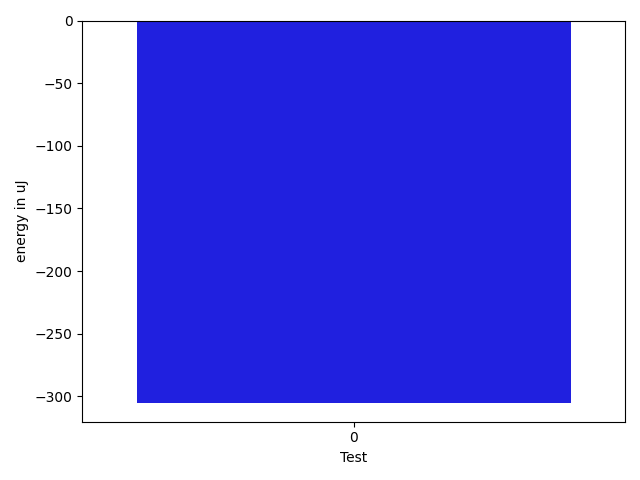

# gson f418ab

https://github.com/google/gson/commit/f418ab

## Delta Energy per test method

| ID | EnergyV1 | EnergyV2 | DeltaEnergy | σV1 | σV2 |
| --- | --- | --- | --- | --- | --- |
| 0 | 42175 | 41870 | -305 | 16810.32717856543 | 19119.69114410873 |

## Delta Duration per test method

| ID | DurationV1 | DurationsV2 | DeltaDuration |
| --- | --- | --- | --- |
| 0 | 2201965.8245614036 | 2264891.285714286 | 62925.461152882315 |

## Misc.

| ID | Test Class | Test Method |
| --- | --- | --- |
| 0 | com.google.gson.JsonObjectTest | testAddingAndRemovingObjectProperties |

| Test | IterationV1 | IterationV2 | DeltaIteration |
| --- | --- | --- | --- |
| 0 | 57 | 56 | -1 |

| Time Label | Time (s) |
| --- | --- |
| Selection | 22.840667963027954 |
| Injection | 8.306742906570435 |
| Total | 933.2295093536377 |

