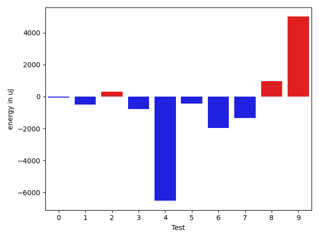
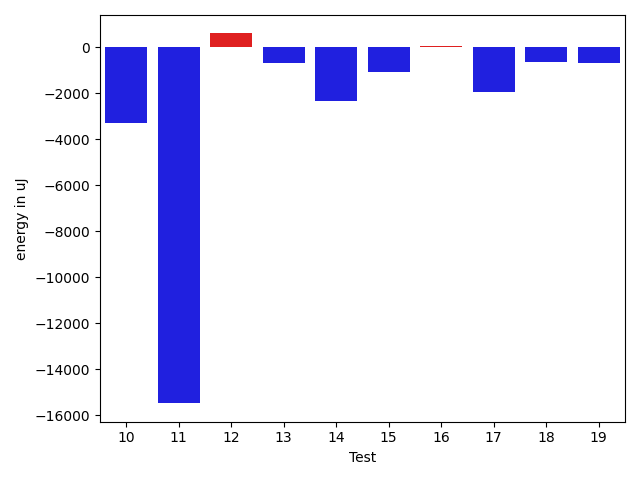
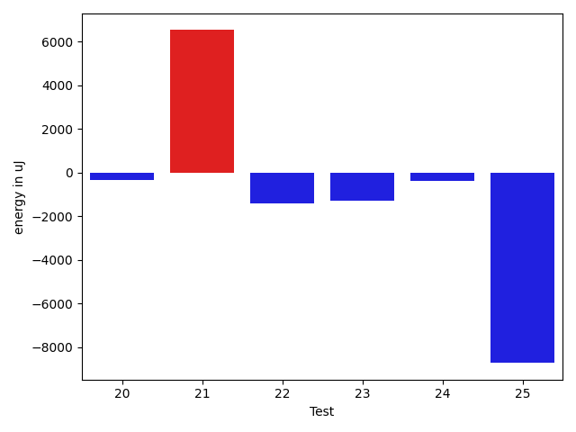

# gson 84f0dd

https://github.com/google/gson/commit/84f0dd

## Delta Energy per test method

| ID | EnergyV1 | EnergyV2 | DeltaEnergy | σV1 | σV2 |
| --- | --- | --- | --- | --- | --- |
| 0 | 33570 | 33508 | -62 | 6002.730119894634 | 5883.0447248485125 |
| 1 | 33936 | 33447 | -489 | 19897.36481919814 | 21598.996989204796 |
| 2 | 36255 | 36560 | 305 | 65097.77996916315 | 101448.958714348 |
| 3 | 33752 | 32959 | -793 | 12487.219881886187 | 19887.355689828357 |
| 4 | 156249 | 149719 | -6530 | 150402.0396377691 | 154651.93502093115 |
| 5 | 35889 | 35461 | -428 | 15564.003021762184 | 13963.850579501057 |
| 6 | 90576 | 88623 | -1953 | 29805.392334732383 | 48664.54259430229 |
| 7 | 36133 | 34790 | -1343 | 17337.46088115356 | 17064.32370980739 |
| 8 | 68115 | 69091 | 976 | 197352.36172961435 | 199414.9199193224 |
| 9 | 69886 | 74890 | 5004 | 139820.28936348256 | 124014.3784403442 |
| 10 | 68969 | 66712 | -2257 | 66208.95147562976 | 66112.11809136104 |
| 11 | 147094 | 138245 | -8849 | 112300.19373017445 | 94174.6454809559 |
| 12 | 34119 | 35400 | 1281 | 15791.830073286787 | 14946.602726976227 |
| 13 | 36683 | 36499 | -184 | 3656.6660989994616 | 3721.1804129335083 |
| 14 | 35827 | 34057 | -1770 | 3720.150059758367 | 3536.1057533519684 |
| 15 | 35339 | 34973 | -366 | 4094.5206003291464 | 3178.4133315886734 |
| 16 | 36621 | 34973 | -1648 | 3934.214961022899 | 6332.643166777698 |
| 17 | 36499 | 35522 | -977 | 13586.89382809159 | 10960.94844345731 |
| 18 | 34790 | 34546 | -244 | 4056.655533789193 | 2836.8404410311523 |
| 19 | 36316 | 35461 | -855 | 6861.484197522948 | 6441.021241313739 |
| 20 | 35888 | 36072 | 184 | 3366.2917929355417 | 3727.135760410254 |
| 21 | 37964 | 37720 | -244 | 44112.54075673573 | 48134.601971826974 |
| 22 | 36010 | 34790 | -1220 | 6058.640526709551 | 5354.720796511593 |
| 23 | 36132 | 35156 | -976 | 4330.110822377647 | 3531.04685099838 |
| 24 | 36255 | 35645 | -610 | 4186.052605954861 | 5352.984149232936 |
| 25 | 78186 | 75195 | -2991 | 81043.90796975994 | 68766.29512600486 |

## Delta Duration per test method

| ID | DurationV1 | DurationsV2 | DeltaDuration |
| --- | --- | --- | --- |
| 0 | 1223457.5952380951 | 1193580.2098765431 | -29877.385361552006 |
| 1 | 1298617.0 | 1201888.2435897435 | -96728.7564102565 |
| 2 | 1832967.121212121 | 2059704.898989899 | 226737.77777777798 |
| 3 | 1463303.0206185568 | 1479848.1489361702 | 16545.128317613387 |
| 4 | 6591831.956989247 | 6721836.177083333 | 130004.22009408567 |
| 5 | 1572351.2222222222 | 1515207.1313131314 | -57144.090909090824 |
| 6 | 2944042.8080808083 | 2970922.414141414 | 26879.606060605962 |
| 7 | 1669208.9797979798 | 1620194.5555555555 | -49014.42424242431 |
| 8 | 6560143.360824742 | 6452935.898989899 | -107207.46183484327 |
| 9 | 3512808.737373737 | 3518217.6363636362 | 5408.898989899084 |
| 10 | 2787992.0707070706 | 2730760.9292929294 | -57231.14141414128 |
| 11 | 5372235.545454546 | 5065288.767676768 | -306946.777777778 |
| 12 | 1576726.4646464647 | 1580320.4848484849 | 3594.020202020183 |
| 13 | 874790.8448275862 | 885184.9 | 10394.05517241382 |
| 14 | 749890.9523809524 | 669134.0666666667 | -80756.88571428577 |
| 15 | 888862.5737704918 | 930699.2352941176 | 41836.66152362584 |
| 16 | 1029876.9365079365 | 1064749.6101694915 | 34872.67366155505 |
| 17 | 1018765.4375 | 954937.3880597015 | -63828.04944029846 |
| 18 | 661325.6153846154 | 666622.1923076923 | 5296.576923076878 |
| 19 | 942925.625 | 955190.4255319149 | 12264.800531914923 |
| 20 | 999380.4074074074 | 1030698.4545454546 | 31318.04713804717 |
| 21 | 2202692.788235294 | 2355265.1807228914 | 152572.3924875972 |
| 22 | 1020907.5762711865 | 1046343.375 | 25435.798728813534 |
| 23 | 640068.5789473684 | 617483.8095238095 | -22584.76942355896 |
| 24 | 946788.0877192982 | 1021141.7368421053 | 74353.64912280708 |
| 25 | 2977909.898989899 | 2720783.1414141413 | -257126.7575757578 |

## Misc.

| ID | Test Class | Test Method |
| --- | --- | --- |
| 0 | com.google.gson.functional.ParameterizedTypesTest | testParameterizedTypeGenericArraysSerialization |
| 1 | com.google.gson.functional.ParameterizedTypesTest | testParameterizedTypesWithWriterSerialization |
| 2 | com.google.gson.functional.ParameterizedTypesTest | testVariableTypeArrayDeserialization |
| 3 | com.google.gson.functional.ParameterizedTypesTest | testParameterizedTypeWithReaderDeserialization |
| 4 | com.google.gson.functional.ParameterizedTypesTest | testParameterizedTypesSerialization |
| 5 | com.google.gson.functional.ParameterizedTypesTest | testVariableTypeDeserialization |
| 6 | com.google.gson.functional.ParameterizedTypesTest | testVariableTypeFieldsAndGenericArraysSerialization |
| 7 | com.google.gson.functional.ParameterizedTypesTest | testParameterizedTypeGenericArraysDeserialization |
| 8 | com.google.gson.functional.ParameterizedTypesTest | testParameterizedTypeDeserialization |
| 9 | com.google.gson.functional.ParameterizedTypesTest | testVariableTypeFieldsAndGenericArraysDeserialization |
| 10 | com.google.gson.functional.ParameterizedTypesTest | testTypesWithMultipleParametersDeserialization |
| 11 | com.google.gson.functional.ParameterizedTypesTest | testTypesWithMultipleParametersSerialization |
| 12 | com.google.gson.functional.ParameterizedTypesTest | testParameterizedTypeWithVariableTypeDeserialization |
| 13 | com.google.gson.TypeInfoFactoryTest | testListTypeVariableWildcardField |
| 14 | com.google.gson.TypeInfoFactoryTest | testMutliDimensionalTypeVariableArrayField |
| 15 | com.google.gson.TypeInfoFactoryTest | testListStringWildcardField |
| 16 | com.google.gson.TypeInfoFactoryTest | testWildcardField |
| 17 | com.google.gson.TypeInfoFactoryTest | testParameterizedTypeVariableField |
| 18 | com.google.gson.TypeInfoFactoryTest | testTypeVariableArrayField |
| 19 | com.google.gson.TypeInfoFactoryTest | testArrayOfListStringWildcardField |
| 20 | com.google.gson.TypeInfoFactoryTest | testParameterizedTypeVariableArrayField |
| 21 | com.google.gson.TypeInfoFactoryTest | testNestedParameterizedTypeVariableField |
| 22 | com.google.gson.TypeInfoFactoryTest | testArrayOfWildcardField |
| 23 | com.google.gson.TypeInfoFactoryTest | testTypeVariableField |
| 24 | com.google.gson.TypeInfoFactoryTest | testArrayOfListTypeVariableWildcardField |
| 25 | com.google.gson.functional.CollectionTest | testWildcardCollectionField |

| Test | IterationV1 | IterationV2 | DeltaIteration |
| --- | --- | --- | --- |
| 0 | 84 | 81 | -3 |
| 1 | 72 | 78 | 6 |
| 2 | 99 | 99 | 0 |
| 3 | 97 | 94 | -3 |
| 4 | 93 | 96 | 3 |
| 5 | 99 | 99 | 0 |
| 6 | 99 | 99 | 0 |
| 7 | 99 | 99 | 0 |
| 8 | 97 | 99 | 2 |
| 9 | 99 | 99 | 0 |
| 10 | 99 | 99 | 0 |
| 11 | 99 | 99 | 0 |
| 12 | 99 | 99 | 0 |
| 13 | 58 | 50 | -8 |
| 14 | 21 | 30 | 9 |
| 15 | 61 | 51 | -10 |
| 16 | 63 | 59 | -4 |
| 17 | 48 | 67 | 19 |
| 18 | 26 | 26 | 0 |
| 19 | 56 | 47 | -9 |
| 20 | 54 | 55 | 1 |
| 21 | 85 | 83 | -2 |
| 22 | 59 | 64 | 5 |
| 23 | 19 | 21 | 2 |
| 24 | 57 | 57 | 0 |
| 25 | 99 | 99 | 0 |

| Time Label | Time (s) |
| --- | --- |
| Selection | 23.301917791366577 |
| Injection | 9.622926712036133 |
| Total | 957.0247995853424 |

