# gson 5c6d5a

https://github.com/google/gson/commit/5c6d5a

## Delta Energy per test method

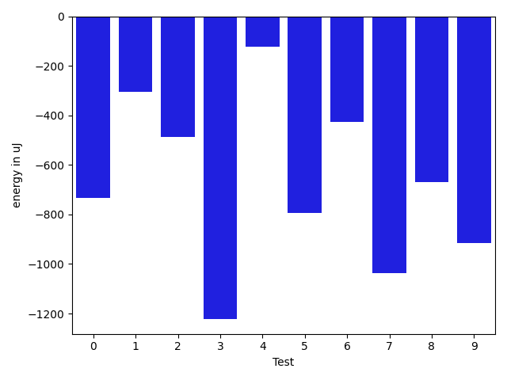

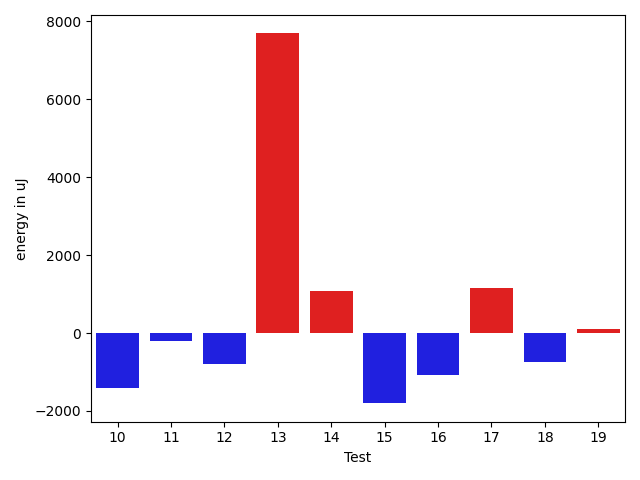

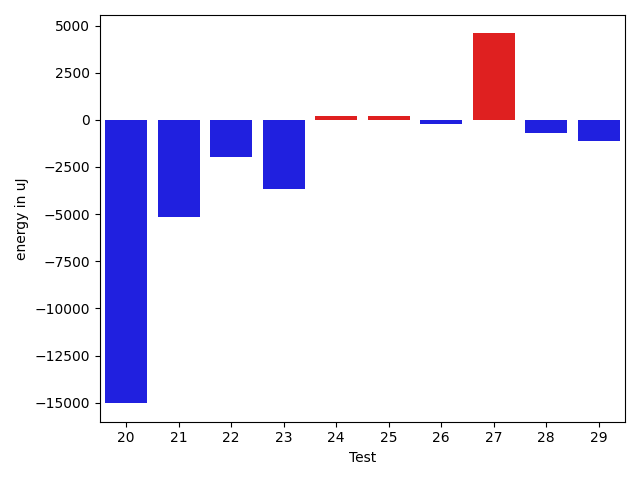

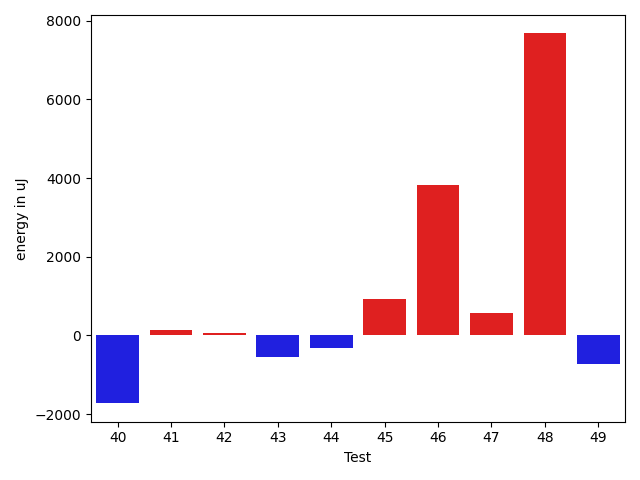

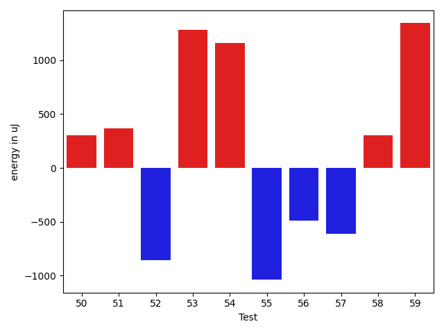

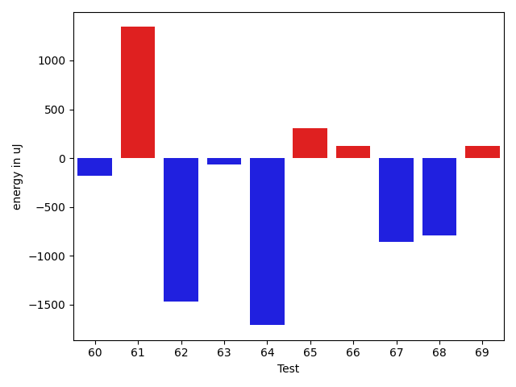

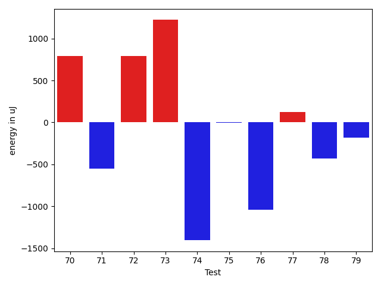

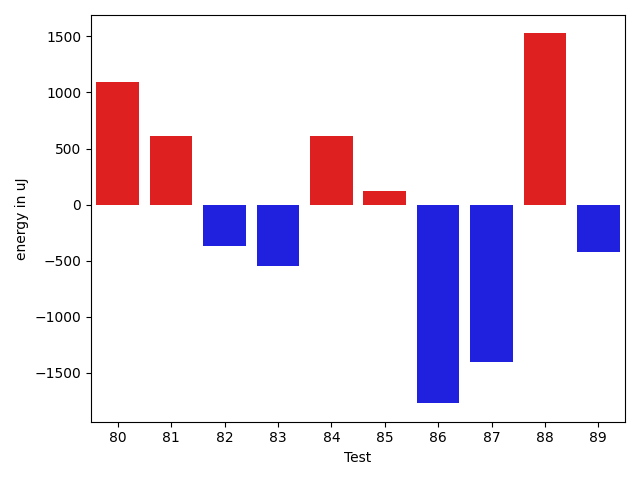

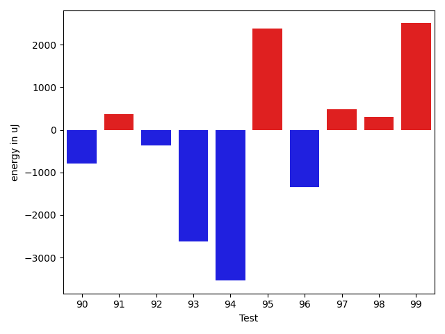

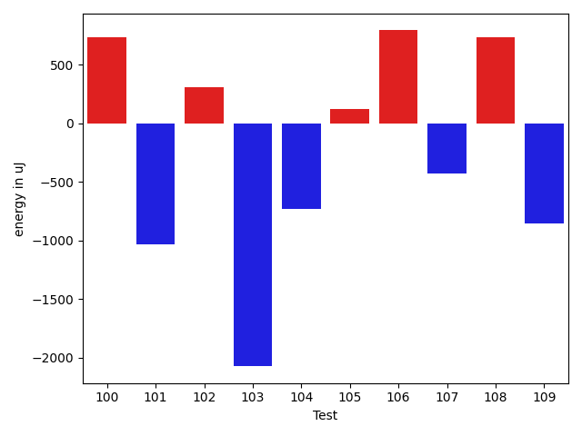

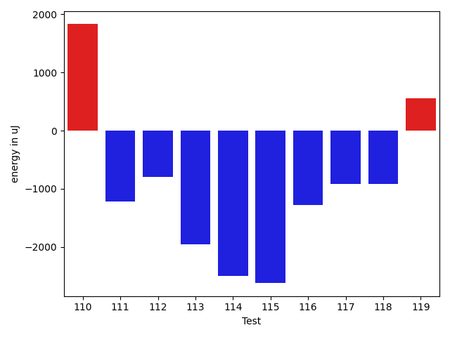

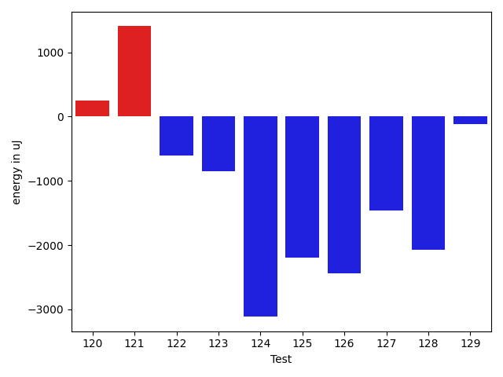

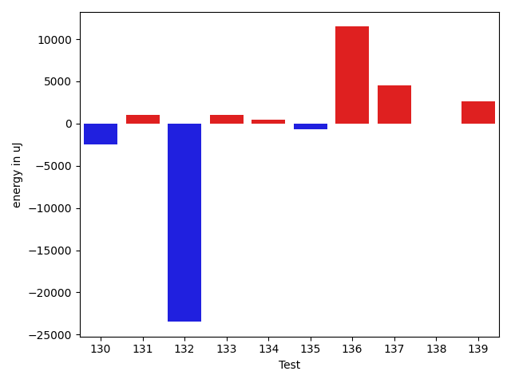

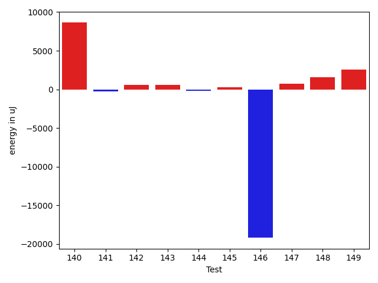

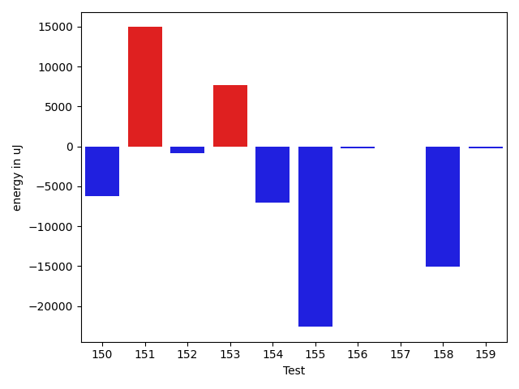

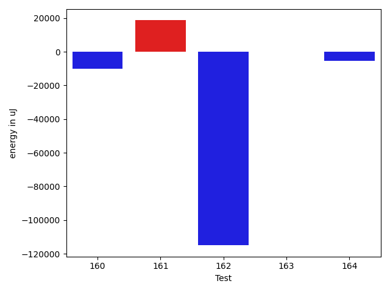

| ID | EnergyV1 | EnergyV2 | DeltaEnergy | σV1 | σV2 |
| --- | --- | --- | --- | --- | --- |
| 0 | 36377 | 35645 | -732 | 4232.42146431567 | 3568.0953939041488 |
| 1 | 37231 | 36926 | -305 | 41438.56048808544 | 44518.37758862439 |
| 2 | 35339 | 34851 | -488 | 3567.8401139100583 | 3595.5236604218117 |
| 3 | 35950 | 34729 | -1221 | 5562.589163146484 | 3642.898453783145 |
| 4 | 38514 | 38391 | -123 | 18999.668011598562 | 20039.268667493274 |
| 5 | 36194 | 35400 | -794 | 18728.62670630545 | 3774.0102045810067 |
| 6 | 35766 | 35339 | -427 | 4184.388201553424 | 3861.4960482577053 |
| 7 | 37415 | 36377 | -1038 | 23857.75934537511 | 31969.341524473115 |
| 8 | 35888 | 35217 | -671 | 3723.354929361423 | 3664.1421005923517 |
| 9 | 37353 | 36438 | -915 | 3769.9124440641363 | 7972.775823990011 |
| 10 | 36438 | 34546 | -1892 | 3353.2720365493324 | 2870.6138387049004 |
| 11 | 35218 | 34729 | -489 | 3575.6689387267106 | 3842.5822549549503 |
| 12 | 33996 | 34363 | 367 | 4925.311873374111 | 3572.028959693481 |
| 13 | 35217 | 34546 | -671 | 41704.191630627276 | 52632.269457789334 |
| 14 | 34790 | 36072 | 1282 | 2967.3884264787443 | 3836.808089767891 |
| 15 | 35400 | 34546 | -854 | 6387.355930675317 | 3677.742006162054 |
| 16 | 34851 | 33997 | -854 | 3510.448891998477 | 3544.7452412832154 |
| 17 | 37048 | 37903 | 855 | 3565.4833991792034 | 4175.452150632578 |
| 18 | 36866 | 36743 | -123 | 4349.994051720071 | 3807.530174142573 |
| 19 | 36926 | 35950 | -976 | 3718.2856987579485 | 3775.959723496715 |
| 20 | 39062 | 36621 | -2441 | 62714.8268163717 | 43262.04457587387 |
| 21 | 34607 | 34302 | -305 | 28491.133607925265 | 3232.276174391453 |
| 22 | 36011 | 34668 | -1343 | 3502.655587806192 | 2570.1591318665837 |
| 23 | 34241 | 36316 | 2075 | 22829.577042619592 | 3426.2393372462684 |
| 24 | 34180 | 34546 | 366 | 4149.444292479479 | 3059.927311363204 |
| 25 | 34851 | 34546 | -305 | 3773.0777553959697 | 3537.4920975369055 |
| 26 | 34606 | 34973 | 367 | 3151.307481030691 | 3496.461777282858 |
| 27 | 37414 | 37536 | 122 | 69452.33726181494 | 77349.874576884 |
| 28 | 34179 | 33814 | -365 | 3448.891838102125 | 3396.0863283467675 |
| 29 | 34484 | 33386 | -1098 | 3242.2141725825118 | 2553.4402231091467 |
| 30 | 35034 | 34057 | -977 | 4437.390198537703 | 3134.5374895944783 |
| 31 | 36011 | 34424 | -1587 | 3300.0793490549845 | 3567.088597390644 |
| 32 | 34424 | 35279 | 855 | 2801.573625264519 | 3520.9708482584338 |
| 33 | 34485 | 33996 | -489 | 3124.738497602639 | 2648.11730666171 |
| 34 | 34546 | 33813 | -733 | 3316.19943945207 | 2853.5774690521525 |
| 35 | 34485 | 34790 | 305 | 4074.1730958478624 | 3108.8830613081745 |
| 36 | 35034 | 34424 | -610 | 3891.0934241759473 | 2739.4757387594104 |
| 37 | 35339 | 34058 | -1281 | 3366.38153755059 | 4185.095274881301 |
| 38 | 34607 | 35279 | 672 | 3375.6753990868256 | 3892.2203626979494 |
| 39 | 34485 | 32898 | -1587 | 3912.2112252405846 | 3302.3186819230496 |
| 40 | 34362 | 33447 | -915 | 5059.317922431509 | 3875.311400230111 |
| 41 | 35705 | 34973 | -732 | 2722.6004929927644 | 3518.44753690364 |
| 42 | 34180 | 34363 | 183 | 3952.788023269122 | 3165.8284844658842 |
| 43 | 36010 | 36438 | 428 | 3868.737600444588 | 3470.1371939831715 |
| 44 | 35034 | 34973 | -61 | 4041.077793617938 | 2972.4020869772426 |
| 45 | 39734 | 38635 | -1099 | 11855.99852675445 | 13633.961310468048 |
| 46 | 38635 | 38147 | -488 | 66847.86413560611 | 65693.55012523629 |
| 47 | 37720 | 36743 | -977 | 4315.423715205825 | 3810.4125306646465 |
| 48 | 37781 | 41259 | 3478 | 14633.699816567663 | 18832.400489671603 |
| 49 | 35889 | 33874 | -2015 | 3531.363748964414 | 3395.4354063993724 |
| 50 | 33753 | 34058 | 305 | 6576.202415829196 | 21341.731763450825 |
| 51 | 35767 | 36133 | 366 | 34554.29176855944 | 29590.31471718422 |
| 52 | 36377 | 35522 | -855 | 3668.9895502713007 | 2380.3019481122246 |
| 53 | 33996 | 35278 | 1282 | 2771.298407059295 | 3443.7199068354403 |
| 54 | 33142 | 34301 | 1159 | 16408.191430168463 | 2913.3275865694654 |
| 55 | 34058 | 33020 | -1038 | 3635.2334074931123 | 3508.605289839512 |
| 56 | 35217 | 34729 | -488 | 3561.9436479973742 | 53496.274336011404 |
| 57 | 34973 | 34363 | -610 | 3203.994542347574 | 3368.7004242699377 |
| 58 | 35095 | 35400 | 305 | 10732.335157256524 | 6424.13311150812 |
| 59 | 32776 | 34119 | 1343 | 21854.986377451572 | 2779.3576990261263 |
| 60 | 35096 | 34912 | -184 | 11619.765231485766 | 6772.257838929258 |
| 61 | 33081 | 34423 | 1342 | 26867.699736135044 | 2170.3343401057027 |
| 62 | 35217 | 33752 | -1465 | 3248.602280219488 | 2934.688793742141 |
| 63 | 35522 | 35461 | -61 | 3433.5660023798523 | 3474.2157217132244 |
| 64 | 37231 | 35522 | -1709 | 3900.4546578682257 | 4062.8572244391366 |
| 65 | 35096 | 35400 | 304 | 4214.055788932941 | 12215.121062457769 |
| 66 | 33447 | 33569 | 122 | 3307.6209209341714 | 2881.4454280634563 |
| 67 | 37171 | 36316 | -855 | 3566.7615069500985 | 4364.797045583557 |
| 68 | 37659 | 36866 | -793 | 136862.43218429456 | 98916.8324441615 |
| 69 | 36132 | 36255 | 123 | 4203.388998261649 | 4022.7090258852645 |
| 70 | 34729 | 35523 | 794 | 2741.94345026378 | 3896.390209482887 |
| 71 | 33570 | 33020 | -550 | 2973.174147982799 | 2873.2688554841266 |
| 72 | 36193 | 36987 | 794 | 15738.65760195979 | 3121.403964949106 |
| 73 | 34424 | 35645 | 1221 | 3605.6819425332096 | 2938.2106860468425 |
| 74 | 36438 | 35034 | -1404 | 6173.435401432833 | 6549.922184245096 |
| 75 | 37354 | 37353 | -1 | 49882.390087215135 | 63094.085688659296 |
| 76 | 35950 | 34912 | -1038 | 3546.44621986574 | 3077.9095945498825 |
| 77 | 36011 | 36133 | 122 | 24690.42210160765 | 2738.4926886013154 |
| 78 | 36438 | 36010 | -428 | 4480.142255573758 | 3199.095085511505 |
| 79 | 37292 | 37109 | -183 | 18174.60831981321 | 20276.79958480489 |
| 80 | 36011 | 37109 | 1098 | 11883.371410122389 | 22108.618053535578 |
| 81 | 35217 | 35828 | 611 | 5422.301713986413 | 18227.213119432832 |
| 82 | 35950 | 35584 | -366 | 3641.6472322104196 | 21893.219034511923 |
| 83 | 35339 | 34790 | -549 | 8861.792349049487 | 11149.367817129902 |
| 84 | 36315 | 36926 | 611 | 11044.408900628667 | 12196.29745288915 |
| 85 | 34973 | 35095 | 122 | 82258.5626595902 | 123408.53343264994 |
| 86 | 63537 | 61767 | -1770 | 20015.20956063022 | 31795.83227151608 |
| 87 | 38147 | 36743 | -1404 | 15673.699499867762 | 16711.46941081127 |
| 88 | 34668 | 36194 | 1526 | 6938.343636802776 | 8686.97291011037 |
| 89 | 39611 | 39185 | -426 | 19340.47488906088 | 27163.190156034932 |
| 90 | 36010 | 35217 | -793 | 4197.951023478559 | 3587.501992117124 |
| 91 | 38330 | 38697 | 367 | 55721.918402680334 | 142001.42769161274 |
| 92 | 36437 | 36072 | -365 | 4041.9805985757466 | 6472.070218300884 |
| 93 | 37537 | 34912 | -2625 | 4061.780538213065 | 4282.333070138287 |
| 94 | 38208 | 34668 | -3540 | 3190.314722910184 | 4378.137670778035 |
| 95 | 37598 | 39978 | 2380 | 92937.84307258336 | 72397.68895538278 |
| 96 | 36011 | 34668 | -1343 | 3516.516442289 | 3944.0118627307756 |
| 97 | 36072 | 36560 | 488 | 4964.704472816081 | 4152.273123431463 |
| 98 | 35950 | 36255 | 305 | 6488.962844890305 | 3951.41105692972 |
| 99 | 34668 | 37170 | 2502 | 5614.588514152838 | 24125.73514762691 |
| 100 | 36438 | 37170 | 732 | 74802.37357963104 | 100907.05715679105 |
| 101 | 37841 | 36804 | -1037 | 20243.620110904983 | 30145.85255241211 |
| 102 | 36560 | 36865 | 305 | 57389.02273403658 | 43438.060418890906 |
| 103 | 35461 | 33386 | -2075 | 12778.722006306583 | 6050.352381976449 |
| 104 | 37048 | 36316 | -732 | 71544.90274858623 | 67147.71081724393 |
| 105 | 38941 | 39062 | 121 | 83373.52074447436 | 61643.90765672958 |
| 106 | 35523 | 36315 | 792 | 3963.0610790497626 | 24552.52447828777 |
| 107 | 37964 | 37537 | -427 | 4405.031006287199 | 3641.9088575528303 |
| 108 | 35218 | 35950 | 732 | 19860.386624946 | 5551.033940061161 |
| 109 | 37414 | 36560 | -854 | 4355.868899916972 | 3304.7850125520026 |
| 110 | 37170 | 39002 | 1832 | 2968.150789820341 | 4191.073124809444 |
| 111 | 34546 | 33325 | -1221 | 3585.3202378707556 | 2125.244121331736 |
| 112 | 35645 | 34851 | -794 | 3816.6998318444403 | 3647.3378969364853 |
| 113 | 35096 | 33142 | -1954 | 5218.168430597814 | 24937.97647967937 |
| 114 | 36987 | 34484 | -2503 | 3502.9711041457913 | 2866.502151287058 |
| 115 | 144958 | 142333 | -2625 | 34006.13837974396 | 43277.81961137673 |
| 116 | 35583 | 34301 | -1282 | 3331.273584448513 | 23388.19693438835 |
| 117 | 35095 | 34179 | -916 | 3775.533742848609 | 3597.7426149558546 |
| 118 | 35461 | 34546 | -915 | 3535.0079705767025 | 3461.3955956196337 |
| 119 | 35278 | 35828 | 550 | 3648.0659639117175 | 3933.2334148462714 |
| 120 | 35034 | 35278 | 244 | 30434.846699926686 | 3081.3163176433222 |
| 121 | 35156 | 36560 | 1404 | 5902.802428562072 | 5697.318259093937 |
| 122 | 35827 | 35218 | -609 | 3071.2417138562305 | 4191.084819480708 |
| 123 | 34729 | 33874 | -855 | 3316.641773668705 | 2351.6915249605822 |
| 124 | 36438 | 33325 | -3113 | 3605.8807145227815 | 3750.900900110395 |
| 125 | 38147 | 35950 | -2197 | 62696.17394771611 | 56938.631260237154 |
| 126 | 38208 | 35766 | -2442 | 4540.282424012401 | 3191.04848867901 |
| 127 | 38757 | 37292 | -1465 | 85831.0505126026 | 78758.55371668935 |
| 128 | 37903 | 35828 | -2075 | 4670.938381178687 | 2626.534471763305 |
| 129 | 37537 | 37414 | -123 | 4109.13967648782 | 4116.969937642929 |
| 130 | 36499 | 35522 | -977 | 8850.265305952298 | 3614.6024189283826 |
| 131 | 37109 | 36194 | -915 | 15640.521128769564 | 24355.166298779368 |
| 132 | 38696 | 38086 | -610 | 80436.18113238428 | 23749.09153415477 |
| 133 | 35828 | 36621 | 793 | 4250.9201269006335 | 3587.6751423671576 |
| 134 | 36132 | 36743 | 611 | 4297.375365298386 | 2837.838092633193 |
| 135 | 36072 | 35827 | -245 | 3903.0136124446926 | 3051.7150990221044 |
| 136 | 342590 | 367126 | 24536 | 123467.21853771328 | 108960.78179120671 |
| 137 | 68237 | 68725 | 488 | 62861.06713264573 | 71177.43942195429 |
| 138 | 38391 | 37231 | -1160 | 28265.810926566548 | 32367.12855801251 |
| 139 | 68298 | 70617 | 2319 | 23399.915656884565 | 23373.520426299958 |
| 140 | 36682 | 37598 | 916 | 3294.4447295999503 | 36505.27581322248 |
| 141 | 35583 | 36194 | 611 | 4233.055050179626 | 3868.7295134018877 |
| 142 | 37048 | 36255 | -793 | 3500.1911556417963 | 3627.952756281986 |
| 143 | 37048 | 37476 | 428 | 3498.1837555365787 | 3875.9919428479975 |
| 144 | 37476 | 36377 | -1099 | 4682.338663531291 | 4817.961865140759 |
| 145 | 35828 | 34546 | -1282 | 3998.6622215598777 | 5033.994740562506 |
| 146 | 39245 | 37353 | -1892 | 87116.75531045957 | 68703.64022163385 |
| 147 | 37110 | 36866 | -244 | 3756.3751310272514 | 3918.6355184411946 |
| 148 | 36682 | 37231 | 549 | 4069.9461209596857 | 3893.153418493877 |
| 149 | 36499 | 38208 | 1709 | 34612.11220355001 | 39379.567308976075 |
| 150 | 35583 | 35888 | 305 | 28996.183104291504 | 4297.593014584822 |
| 151 | 38574 | 36865 | -1709 | 3828.427147885495 | 51932.73000591986 |
| 152 | 37354 | 36377 | -977 | 3204.4453981929537 | 3330.012947046903 |
| 153 | 37720 | 38574 | 854 | 56708.95450756666 | 66645.5352922451 |
| 154 | 37415 | 37354 | -61 | 32067.81324145197 | 4458.486229560844 |
| 155 | 39001 | 37537 | -1464 | 75608.08178528272 | 38377.42598141097 |
| 156 | 36438 | 38147 | 1709 | 4115.20797192903 | 3027.595462987088 |
| 157 | 36743 | 36316 | -427 | 3714.506584042169 | 2716.627843528938 |
| 158 | 37659 | 36865 | -794 | 118085.12310905993 | 96739.2253974527 |
| 159 | 36682 | 36499 | -183 | 4534.590361531041 | 3981.2329990479498 |
| 160 | 39062 | 39733 | 671 | 48725.936051342826 | 39352.19989741195 |
| 161 | 37292 | 38879 | 1587 | 79721.64264107075 | 110714.03977743555 |
| 162 | 40588 | 38330 | -2258 | 398743.73885224754 | 53970.372236370196 |
| 163 | 36682 | 36255 | -427 | 4233.454702689422 | 3630.4880852324977 |
| 164 | 37476 | 37292 | -184 | 19996.584396749662 | 3693.6515055490067 |

## Delta Duration per test method

| ID | DurationV1 | DurationsV2 | DeltaDuration |
| --- | --- | --- | --- |
| 0 | 762476.68 | 785814.4333333333 | 23337.753333333298 |
| 1 | 1028238.6140350878 | 1138360.95 | 110122.3359649122 |
| 2 | 876405.9830508474 | 872208.2142857143 | -4197.768765133107 |
| 3 | 1015163.6081081082 | 920814.9850746269 | -94348.6230334813 |
| 4 | 1550868.5360824743 | 1583286.3894736841 | 32417.85339120985 |
| 5 | 1291111.1594202898 | 1113027.3134328357 | -178083.84598745406 |
| 6 | 770463.3333333334 | 781835.5277777778 | 11372.19444444438 |
| 7 | 1129318.7205882352 | 1263649.3783783785 | 134330.65779014328 |
| 8 | 797562.04 | 817033.3703703703 | 19471.3303703703 |
| 9 | 913906.6896551724 | 1052924.421875 | 139017.7322198276 |
| 10 | 727104.0408163265 | 748796.8260869565 | 21692.785270630033 |
| 11 | 532021.28125 | 561585.9230769231 | 29564.64182692312 |
| 12 | 541670.2 | 550756.7777777778 | 9086.577777777798 |
| 13 | 876343.8857142857 | 1138974.25 | 262630.36428571434 |
| 14 | 580866.0 | 586697.9583333334 | 5831.958333333372 |
| 15 | 1023361.7692307692 | 1027630.7708333334 | 4269.0016025641235 |
| 16 | 554874.2333333333 | 615761.64 | 60887.406666666735 |
| 17 | 562115.8846153846 | 580060.9 | 17945.0153846154 |
| 18 | 616158.8125 | 634995.9722222222 | 18837.159722222248 |
| 19 | 675411.6511627907 | 723000.4857142858 | 47588.834551495034 |
| 20 | 1491364.0256410257 | 1094359.857142857 | -397004.1684981687 |
| 21 | 785808.15625 | 595983.275862069 | -189824.880387931 |
| 22 | 749214.1730769231 | 768186.9756097561 | 18972.802532832953 |
| 23 | 789122.1515151515 | 479134.3125 | -309987.8390151515 |
| 24 | 501743.76923076925 | 510943.54545454547 | 9199.776223776222 |
| 25 | 481194.3333333333 | 529504.2380952381 | 48309.90476190479 |
| 26 | 464756.9666666667 | 522844.04 | 58087.073333333305 |
| 27 | 1614229.2333333334 | 1781269.3333333333 | 167040.09999999986 |
| 28 | 579765.8181818182 | 550132.2068965518 | -29633.611285266466 |
| 29 | 695161.0 | 654659.3684210526 | -40501.63157894742 |
| 30 | 511903.3103448276 | 494972.29032258067 | -16931.02002224693 |
| 31 | 627464.8461538461 | 627848.2105263158 | 383.36437246971764 |
| 32 | 481045.77777777775 | 481399.61904761905 | 353.84126984130125 |
| 33 | 467975.4 | 468486.6666666667 | 511.2666666666628 |
| 34 | 461832.3333333333 | 473207.71428571426 | 11375.380952380947 |
| 35 | 485139.6666666667 | 511160.75 | 26021.083333333314 |
| 36 | 471905.7037037037 | 457552.4347826087 | -14353.268921095005 |
| 37 | 432823.9655172414 | 439539.1052631579 | 6715.139745916531 |
| 38 | 448897.05 | 402008.3157894737 | -46888.73421052628 |
| 39 | 595624.21875 | 624972.9268292683 | 29348.70807926834 |
| 40 | 450924.6538461539 | 496310.3157894737 | 45385.661943319836 |
| 41 | 455514.5 | 426859.4347826087 | -28655.065217391297 |
| 42 | 497144.95652173914 | 491570.9166666667 | -5574.039855072449 |
| 43 | 554023.84375 | 583015.3103448276 | 28991.466594827594 |
| 44 | 447254.3157894737 | 449982.0833333333 | 2727.767543859605 |
| 45 | 1017106.8461538461 | 1205306.1621621621 | 188199.316008316 |
| 46 | 1135114.5185185184 | 1384534.606060606 | 249420.08754208754 |
| 47 | 797864.8048780488 | 761566.5769230769 | -36298.22795497195 |
| 48 | 1455072.3723404256 | 1556071.625 | 100999.25265957438 |
| 49 | 721188.1 | 621558.3157894737 | -99629.78421052627 |
| 50 | 1013118.9848484849 | 1035655.5625 | 22536.577651515137 |
| 51 | 1394235.189189189 | 1452462.2784810127 | 58227.08929182356 |
| 52 | 545009.92 | 564245.4705882353 | 19235.55058823526 |
| 53 | 596800.9285714285 | 572108.6571428571 | -24692.271428571432 |
| 54 | 870908.4893617021 | 745695.1777777778 | -125213.31158392434 |
| 55 | 608407.9459459459 | 573664.7575757576 | -34743.18837018835 |
| 56 | 973588.8548387097 | 1173712.696969697 | 200123.84213098732 |
| 57 | 841228.9824561403 | 890254.8947368421 | 49025.9122807018 |
| 58 | 1150178.9324324324 | 1038956.0694444445 | -111222.86298798793 |
| 59 | 737102.375 | 680819.75 | -56282.625 |
| 60 | 1082216.8717948718 | 1107977.7142857143 | 25760.842490842566 |
| 61 | 703706.5925925926 | 554132.1818181818 | -149574.41077441082 |
| 62 | 462031.2173913043 | 459065.04545454547 | -2966.171936758852 |
| 63 | 753427.4186046511 | 772916.4871794871 | 19489.068574836012 |
| 64 | 686184.3125 | 638149.1842105263 | -48035.12828947371 |
| 65 | 954477.3396226416 | 1066837.3870967743 | 112360.04747413273 |
| 66 | 793845.7959183673 | 902106.4146341464 | 108260.61871577904 |
| 67 | 696349.90625 | 626050.1470588235 | -70299.7591911765 |
| 68 | 2631207.7021276597 | 1263235.8461538462 | -1367971.8559738134 |
| 69 | 632004.4848484849 | 633260.5428571429 | 1256.0580086580012 |
| 70 | 713912.4888888889 | 702210.2765957447 | -11702.212293144199 |
| 71 | 562613.5757575758 | 560575.2777777778 | -2038.2979797980515 |
| 72 | 1052021.4561403508 | 776059.14 | -275962.31614035077 |
| 73 | 786116.1346153846 | 836095.2641509434 | 49979.12953555875 |
| 74 | 1102161.9113924052 | 1080424.5064935065 | -21737.404898898676 |
| 75 | 1227712.343283582 | 1639408.1746031747 | 411695.83131959266 |
| 76 | 819594.54 | 825494.8666666667 | 5900.3266666666605 |
| 77 | 911600.9074074074 | 849377.0 | -62223.907407407416 |
| 78 | 782777.6538461539 | 789145.5116279069 | 6367.85778175306 |
| 79 | 847467.8627450981 | 1111755.9791666667 | 264288.1164215687 |
| 80 | 1368383.505263158 | 1464737.9894736842 | 96354.48421052634 |
| 81 | 1110438.65 | 1233184.6714285715 | 122746.02142857155 |
| 82 | 916896.1929824562 | 958146.546875 | 41250.35389254382 |
| 83 | 1269983.808988764 | 1256075.978021978 | -13907.830966786016 |
| 84 | 1397620.7551020407 | 1370329.948979592 | -27290.80612244876 |
| 85 | 2063567.9555555556 | 2761844.7303370787 | 698276.774781523 |
| 86 | 1959470.9595959596 | 2054474.6363636365 | 95003.67676767684 |
| 87 | 1480885.4252873564 | 1510729.3095238095 | 29843.8842364531 |
| 88 | 1281093.6907216494 | 1339739.8936170214 | 58646.20289537194 |
| 89 | 1670759.7777777778 | 1773588.878787879 | 102829.10101010115 |
| 90 | 1065853.9166666667 | 977189.2419354839 | -88664.67473118287 |
| 91 | 1495895.9259259258 | 2615472.5 | 1119576.5740740742 |
| 92 | 795452.8478260869 | 741045.7555555556 | -54407.09227053134 |
| 93 | 860687.3620689656 | 916837.3 | 56149.93793103448 |
| 94 | 699180.1935483871 | 652651.1785714285 | -46529.01497695863 |
| 95 | 1636537.5238095238 | 1749104.4864864864 | 112566.9626769626 |
| 96 | 667878.3666666667 | 571366.7096774194 | -96511.6569892473 |
| 97 | 610408.28 | 591552.3225806452 | -18855.957419354818 |
| 98 | 934407.7692307692 | 937521.4363636364 | 3113.667132867151 |
| 99 | 763975.1224489796 | 814716.3783783783 | 50741.2559293987 |
| 100 | 1364941.6785714286 | 1734651.851851852 | 369710.1732804233 |
| 101 | 724816.2058823529 | 821401.0344827586 | 96584.82860040572 |
| 102 | 1047550.5681818182 | 1041904.9761904762 | -5645.591991342022 |
| 103 | 946817.4838709678 | 791778.9230769231 | -155038.56079404464 |
| 104 | 1547923.680851064 | 1360276.7608695652 | -187646.91998149874 |
| 105 | 1844117.6792452831 | 1606668.7818181817 | -237448.8974271014 |
| 106 | 722548.0930232558 | 860407.5294117647 | 137859.43638850888 |
| 107 | 522497.26086956525 | 580861.3636363636 | 58364.1027667984 |
| 108 | 1020876.34375 | 984069.125 | -36807.21875 |
| 109 | 597195.5833333334 | 605656.6129032258 | 8461.029569892446 |
| 110 | 496207.8333333333 | 504261.5625 | 8053.729166666686 |
| 111 | 609930.551724138 | 648201.8571428572 | 38271.30541871919 |
| 112 | 902688.2647058824 | 687042.7647058824 | -215645.5 |
| 113 | 1023685.2702702703 | 1113448.9166666667 | 89763.64639639645 |
| 114 | 482969.3448275862 | 481778.3888888889 | -1190.955938697327 |
| 115 | 4689917.868686869 | 4673849.303030303 | -16068.565656566061 |
| 116 | 879504.8888888889 | 835499.306122449 | -44005.58276643988 |
| 117 | 494927.7272727273 | 474191.28571428574 | -20736.441558441555 |
| 118 | 751792.4047619047 | 715211.825 | -36580.57976190478 |
| 119 | 449586.6551724138 | 460755.46428571426 | 11168.809113300464 |
| 120 | 748774.6896551724 | 599306.375 | -149468.3146551724 |
| 121 | 819462.2553191489 | 827587.9574468085 | 8125.702127659577 |
| 122 | 532259.7916666666 | 559183.9428571429 | 26924.15119047626 |
| 123 | 610870.1764705882 | 597581.1428571428 | -13289.033613445354 |
| 124 | 669024.7096774194 | 648015.4285714285 | -21009.28110599087 |
| 125 | 1678820.696969697 | 1391870.2272727273 | -286950.4696969697 |
| 126 | 545002.8571428572 | 576711.9615384615 | 31709.104395604343 |
| 127 | 2187114.5714285714 | 1626460.857142857 | -560653.7142857143 |
| 128 | 494253.8888888889 | 496852.92307692306 | 2599.0341880341875 |
| 129 | 471334.1052631579 | 438871.46153846156 | -32462.64372469636 |
| 130 | 1071341.7313432836 | 912319.231884058 | -159022.49945922557 |
| 131 | 1350972.935897436 | 1241766.3918918918 | -109206.54400554416 |
| 132 | 1777532.1694915255 | 1026612.0819672131 | -750920.0875243124 |
| 133 | 969982.0 | 872828.8870967742 | -97153.11290322582 |
| 134 | 903396.0625 | 848581.1272727273 | -54814.93522727268 |
| 135 | 899147.9642857143 | 837023.6964285715 | -62124.26785714284 |
| 136 | 10155139.090909092 | 10420205.828282828 | 265066.73737373576 |
| 137 | 2339224.888888889 | 2643177.448979592 | 303952.56009070296 |
| 138 | 1034220.0980392157 | 1118742.7272727273 | 84522.62923351163 |
| 139 | 2037859.2222222222 | 2099385.4444444445 | 61526.22222222225 |
| 140 | 461409.3333333333 | 788051.0 | 326641.6666666667 |
| 141 | 493065.1818181818 | 453418.5806451613 | -39646.60117302055 |
| 142 | 428641.4090909091 | 475937.09523809527 | 47295.68614718615 |
| 143 | 502370.6 | 554483.7586206896 | 52113.158620689646 |
| 144 | 487528.4 | 521196.72222222225 | 33668.322222222225 |
| 145 | 470333.3846153846 | 475012.25925925927 | 4678.874643874646 |
| 146 | 2199889.846153846 | 1525664.7037037036 | -674225.1424501424 |
| 147 | 434176.0 | 486369.5 | 52193.5 |
| 148 | 500402.1538461539 | 493830.4166666667 | -6571.737179487187 |
| 149 | 1028768.5789473684 | 777409.8571428572 | -251358.72180451127 |
| 150 | 648899.68 | 485543.7727272727 | -163355.90727272735 |
| 151 | 457296.13333333336 | 936204.1818181818 | 478908.0484848484 |
| 152 | 521648.65 | 510862.6 | -10786.050000000047 |
| 153 | 1294800.6511627906 | 1672232.8043478262 | 377432.15318503557 |
| 154 | 792458.4210526316 | 543903.8928571428 | -248554.52819548873 |
| 155 | 1839271.025 | 1053843.4318181819 | -785427.593181818 |
| 156 | 752427.6734693878 | 781426.45 | 28998.776530612144 |
| 157 | 603334.3783783783 | 610803.1794871795 | 7468.801108801155 |
| 158 | 2203902.6612903224 | 1667803.6164383562 | -536099.0448519662 |
| 159 | 838916.1395348837 | 820359.5416666666 | -18556.59786821704 |
| 160 | 1608425.3606557378 | 1397343.935483871 | -211081.42517186678 |
| 161 | 1535885.738095238 | 2206808.769230769 | 670923.0311355309 |
| 162 | 4962703.75 | 1346709.972972973 | -3615993.7770270268 |
| 163 | 715227.9411764706 | 641940.2307692308 | -73287.71040723985 |
| 164 | 892080.1470588235 | 770867.5833333334 | -121212.56372549012 |

## Misc.

| ID | Test Class | Test Method |
| --- | --- | --- |
| 0 | com.google.gson.functional.CollectionTest | testNullsInListDeserialization |
| 1 | com.google.gson.functional.CollectionTest | testCollectionOfStringsDeserialization |
| 2 | com.google.gson.functional.CollectionTest | testWildcardPrimitiveCollectionDeserilaization |
| 3 | com.google.gson.functional.CollectionTest | testSetDeserialization |
| 4 | com.google.gson.functional.CollectionTest | testWildcardCollectionField |
| 5 | com.google.gson.functional.CollectionTest | testTopLevelListOfIntegerCollectionsDeserialization |
| 6 | com.google.gson.functional.CollectionTest | testQueueDeserialization |
| 7 | com.google.gson.functional.CollectionTest | testTopLevelCollectionOfIntegersDeserialization |
| 8 | com.google.gson.functional.CollectionTest | testLinkedListDeserialization |
| 9 | com.google.gson.functional.CollectionTest | testRawCollectionDeserializationNotAlllowed |
| 10 | com.google.gson.functional.CollectionTest | testRawCollectionOfBagOfPrimitivesNotAllowed |
| 11 | com.google.gson.functional.PrimitiveTest | testDoubleNoFractAsStringRepresentationDeserialization |
| 12 | com.google.gson.functional.PrimitiveTest | testPrimitiveDoubleAutoboxedInASingleElementArrayDeserialization |
| 13 | com.google.gson.functional.PrimitiveTest | testDoubleNaNDeserialization |
| 14 | com.google.gson.functional.PrimitiveTest | testReallyLongValuesDeserialization |
| 15 | com.google.gson.functional.PrimitiveTest | testPrimitiveDoubleAutoboxedDeserialization |
| 16 | com.google.gson.functional.PrimitiveTest | testLargeDoubleDeserialization |
| 17 | com.google.gson.functional.PrimitiveTest | testPrimitiveLongAutoboxedDeserialization |
| 18 | com.google.gson.functional.PrimitiveTest | testPrimitiveBooleanAutoboxedInASingleElementArrayDeserialization |
| 19 | com.google.gson.functional.PrimitiveTest | testPrimitiveBooleanAutoboxedDeserialization |
| 20 | com.google.gson.functional.PrimitiveTest | testPrimitiveIntegerAutoboxedDeserialization |
| 21 | com.google.gson.functional.PrimitiveTest | testLongAsStringDeserialization |
| 22 | com.google.gson.functional.PrimitiveTest | testDoubleAsStringRepresentationDeserialization |
| 23 | com.google.gson.functional.PrimitiveTest | testDoubleInfinityDeserialization |
| 24 | com.google.gson.functional.PrimitiveTest | testNegativeInfinityDeserialization |
| 25 | com.google.gson.functional.PrimitiveTest | testNegativeInfinityFloatDeserialization |
| 26 | com.google.gson.functional.PrimitiveTest | testFloatInfinityDeserialization |
| 27 | com.google.gson.functional.PrimitiveTest | testPrimitiveIntegerAutoboxedInASingleElementArrayDeserialization |
| 28 | com.google.gson.functional.PrimitiveTest | testBigDecimalNaNDeserializationNotSupported |
| 29 | com.google.gson.functional.PrimitiveTest | testOverridingDefaultPrimitiveSerialization |
| 30 | com.google.gson.functional.PrimitiveTest | testBigIntegerDeserialization |
| 31 | com.google.gson.functional.PrimitiveTest | testNumberDeserialization |
| 32 | com.google.gson.functional.PrimitiveTest | testBigDecimalDeserialization |
| 33 | com.google.gson.functional.PrimitiveTest | testBigIntegerInASingleElementArrayDeserialization |
| 34 | com.google.gson.functional.PrimitiveTest | testSmallValueForBigDecimalDeserialization |
| 35 | com.google.gson.functional.PrimitiveTest | testFloatNaNDeserialization |
| 36 | com.google.gson.functional.PrimitiveTest | testBigDecimalPreservePrecisionDeserialization |
| 37 | com.google.gson.functional.PrimitiveTest | testSmallValueForBigIntegerDeserialization |
| 38 | com.google.gson.functional.PrimitiveTest | testBigDecimalAsStringRepresentationDeserialization |
| 39 | com.google.gson.functional.PrimitiveTest | testBadValueForBigIntegerDeserialization |
| 40 | com.google.gson.functional.PrimitiveTest | testBigDecimalInfinityDeserializationNotSupported |
| 41 | com.google.gson.functional.PrimitiveTest | testBigDecimalNoFractAsStringRepresentationDeserialization |
| 42 | com.google.gson.functional.PrimitiveTest | testBigDecimalInASingleElementArrayDeserialization |
| 43 | com.google.gson.functional.PrimitiveTest | testPrimitiveLongAutoboxedInASingleElementArrayDeserialization |
| 44 | com.google.gson.functional.PrimitiveTest | testBigDecimalNegativeInfinityDeserializationNotSupported |
| 45 | com.google.gson.functional.NullObjectAndFieldTest | testExplicitDeserializationOfNulls |
| 46 | com.google.gson.functional.NullObjectAndFieldTest | testTopLevelNullObjectDeserialization |
| 47 | com.google.gson.functional.NullObjectAndFieldTest | testNullWrappedPrimitiveMemberDeserialization |
| 48 | com.google.gson.functional.ObjectTest | testArrayOfArraysDeserialization |
| 49 | com.google.gson.functional.ObjectTest | testClassWithTransientFieldsDeserialization |
| 50 | com.google.gson.functional.ObjectTest | testStringFieldWithNumberValueDeserialization |
| 51 | com.google.gson.functional.ObjectTest | testSubInterfacesOfCollectionDeserialization |
| 52 | com.google.gson.functional.ObjectTest | testPrivateNoArgConstructorDeserialization |
| 53 | com.google.gson.functional.ObjectTest | testClassWithTransientFieldsDeserializationTransientFieldsPassedInJsonAreIgnored |
| 54 | com.google.gson.functional.ObjectTest | testPrimitiveArrayInAnObjectDeserialization |
| 55 | com.google.gson.functional.ObjectTest | testObjectFieldNamesWithoutQuotesDeserialization |
| 56 | com.google.gson.functional.ObjectTest | testNestedDeserialization |
| 57 | com.google.gson.functional.ObjectTest | testInnerClassDeserialization |
| 58 | com.google.gson.functional.ObjectTest | testDirectedAcyclicGraphDeserialization |
| 59 | com.google.gson.functional.ObjectTest | testEmptyCollectionInAnObjectDeserialization |
| 60 | com.google.gson.functional.ObjectTest | testArrayOfObjectsDeserialization |
| 61 | com.google.gson.functional.ObjectTest | testNullPrimitiveFieldsDeserialization |
| 62 | com.google.gson.functional.ObjectTest | testClassWithNoFieldsDeserialization |
| 63 | com.google.gson.functional.ObjectTest | testNullDeserialization |
| 64 | com.google.gson.functional.ObjectTest | testBagOfPrimitivesDeserialization |
| 65 | com.google.gson.functional.ObjectTest | testInheritenceDeserialization |
| 66 | com.google.gson.functional.ObjectTest | testNullArraysDeserialization |
| 67 | com.google.gson.functional.ObjectTest | testBagOfPrimitiveWrappersDeserialization |
| 68 | com.google.gson.functional.ObjectTest | testJsonInSingleQuotesDeserialization |
| 69 | com.google.gson.functional.ObjectTest | testJsonInMixedQuotesDeserialization |
| 70 | com.google.gson.functional.ObjectTest | testNullFieldsDeserialization |
| 71 | com.google.gson.functional.ObjectTest | testNullObjectFieldsDeserialization |
| 72 | com.google.gson.functional.MapTest | testMapDeserializationWithIntegerKeys |
| 73 | com.google.gson.functional.MapTest | testMapOfMapDeserialization |
| 74 | com.google.gson.functional.MapTest | testParameterizedMapSubclassDeserialization |
| 75 | com.google.gson.functional.MapTest | testMapDeserialization |
| 76 | com.google.gson.functional.MapTest | testMapDeserializationWithWildcardValues |
| 77 | com.google.gson.functional.MapTest | testMapDeserializationWithNullKey |
| 78 | com.google.gson.functional.MapTest | testMapDeserializationWithNullValue |
| 79 | com.google.gson.functional.MapTest | testMapDeserializationEmpty |
| 80 | com.google.gson.functional.ParameterizedTypesTest | testVariableTypeArrayDeserialization |
| 81 | com.google.gson.functional.ParameterizedTypesTest | testParameterizedTypeWithReaderDeserialization |
| 82 | com.google.gson.functional.ParameterizedTypesTest | testDeepParameterizedTypeDeserialization |
| 83 | com.google.gson.functional.ParameterizedTypesTest | testVariableTypeDeserialization |
| 84 | com.google.gson.functional.ParameterizedTypesTest | testParameterizedTypeGenericArraysDeserialization |
| 85 | com.google.gson.functional.ParameterizedTypesTest | testParameterizedTypeDeserialization |
| 86 | com.google.gson.functional.ParameterizedTypesTest | testVariableTypeFieldsAndGenericArraysDeserialization |
| 87 | com.google.gson.functional.ParameterizedTypesTest | testTypesWithMultipleParametersDeserialization |
| 88 | com.google.gson.functional.ParameterizedTypesTest | testParameterizedTypeWithVariableTypeDeserialization |
| 89 | com.google.gson.functional.ParameterizedTypesTest | testParameterizedTypesWithCustomDeserializer |
| 90 | com.google.gson.functional.VersioningTest | testVersionedGsonMixingSinceAndUntilDeserialization |
| 91 | com.google.gson.functional.VersioningTest | testVersionedUntilDeserialization |
| 92 | com.google.gson.functional.VersioningTest | testVersionedGsonWithUnversionedClassesDeserialization |
| 93 | com.google.gson.functional.VersioningTest | testVersionedClassesDeserialization |
| 94 | com.google.gson.functional.VersioningTest | testIgnoreLaterVersionClassDeserialization |
| 95 | com.google.gson.functional.EnumTest | testTopLevelEnumDeserialization |
| 96 | com.google.gson.functional.EnumTest | testClassWithEnumFieldDeserialization |
| 97 | com.google.gson.functional.EnumTest | testTopLevelEnumInASingleElementArrayDeserialization |
| 98 | com.google.gson.functional.EnumTest | testCollectionOfEnumsDeserialization |
| 99 | com.google.gson.GsonTypeAdapterTest | testDefaultTypeAdapterThrowsParseException |
| 100 | com.google.gson.GsonTypeAdapterTest | testTypeAdapterDoesNotAffectNonAdaptedTypes |
| 101 | com.google.gson.GsonTypeAdapterTest | testTypeAdapterProperlyConvertsTypes |
| 102 | com.google.gson.GsonTypeAdapterTest | testTypeAdapterThrowsException |
| 103 | com.google.gson.functional.NamingPolicyTest | testGsonWithSerializedNameFieldNamingPolicyDeserialization |
| 104 | com.google.gson.functional.NamingPolicyTest | testGsonWithNonDefaultFieldNamingPolicyDeserialiation |
| 105 | com.google.gson.functional.ArrayTest | testTopLevelArrayOfIntsDeserialization |
| 106 | com.google.gson.functional.ArrayTest | testArrayOfPrimitivesWithCustomTypeAdapter |
| 107 | com.google.gson.functional.ArrayTest | testEmptyArrayDeserialization |
| 108 | com.google.gson.functional.ArrayTest | testArrayOfCollectionDeserialization |
| 109 | com.google.gson.functional.ArrayTest | testNullsInArrayDeserialization |
| 110 | com.google.gson.functional.ArrayTest | testArrayOfStringsDeserialization |
| 111 | com.google.gson.functional.DefaultTypeAdaptersTest | testBigIntegerFieldDeserialization |
| 112 | com.google.gson.functional.DefaultTypeAdaptersTest | testPropertiesDeserialization |
| 113 | com.google.gson.functional.DefaultTypeAdaptersTest | testDefaultDateDeserializationUsingBuilder |
| 114 | com.google.gson.functional.DefaultTypeAdaptersTest | testLocaleDeserializationWithLanguageCountryVariant |
| 115 | com.google.gson.functional.DefaultTypeAdaptersTest | testDefaultDateDeserialization |
| 116 | com.google.gson.functional.DefaultTypeAdaptersTest | testBadValueForBigDecimalDeserialization |
| 117 | com.google.gson.functional.DefaultTypeAdaptersTest | testLocaleDeserializationWithLanguage |
| 118 | com.google.gson.functional.DefaultTypeAdaptersTest | testDateDeserializationWithPattern |
| 119 | com.google.gson.functional.DefaultTypeAdaptersTest | testLocaleDeserializationWithLanguageCountry |
| 120 | com.google.gson.functional.DefaultTypeAdaptersTest | testDefaultGregorianCalendarDeserialization |
| 121 | com.google.gson.functional.DefaultTypeAdaptersTest | testUrlNullDeserialization |
| 122 | com.google.gson.functional.DefaultTypeAdaptersTest | testUriDeserialization |
| 123 | com.google.gson.functional.DefaultTypeAdaptersTest | testDefaultCalendarDeserialization |
| 124 | com.google.gson.functional.DefaultTypeAdaptersTest | testBigDecimalFieldDeserialization |
| 125 | com.google.gson.functional.DefaultTypeAdaptersTest | testUrlDeserialization |
| 126 | com.google.gson.functional.DefaultTypeAdaptersTest | testUuidDeserialization |
| 127 | com.google.gson.functional.InternationalizationTest | testStringsWithRawChineseCharactersDeserialization |
| 128 | com.google.gson.functional.InternationalizationTest | testStringsWithUnicodeChineseCharactersEscapedDeserialization |
| 129 | com.google.gson.functional.InternationalizationTest | testStringsWithUnicodeChineseCharactersDeserialization |
| 130 | com.google.gson.functional.CustomTypeAdaptersTest | testCustomNestedDeserializers |
| 131 | com.google.gson.functional.CustomTypeAdaptersTest | testCustomDeserializerForLong |
| 132 | com.google.gson.functional.CustomTypeAdaptersTest | testCustomDeserializers |
| 133 | com.google.gson.functional.CustomTypeAdaptersTest | testCustomAdapterInvokedForCollectionElementDeserialization |
| 134 | com.google.gson.functional.CustomTypeAdaptersTest | testCustomByteArrayDeserializerAndInstanceCreator |
| 135 | com.google.gson.functional.CustomTypeAdaptersTest | testCustomAdapterInvokedForMapElementDeserialization |
| 136 | com.google.gson.functional.ConcurrencyTest | testMultiThreadDeserialization |
| 137 | com.google.gson.functional.ConcurrencyTest | testSingleThreadDeserialization |
| 138 | com.google.gson.functional.UncategorizedTest | testInvalidJsonDeserializationFails |
| 139 | com.google.gson.functional.UncategorizedTest | testReturningDerivedClassesDuringDeserialization |
| 140 | com.google.gson.functional.StringTest | testSingleQuoteInStringDeserialization |
| 141 | com.google.gson.functional.StringTest | testJavascriptKeywordsInStringDeserialization |
| 142 | com.google.gson.functional.StringTest | testEscapedBackslashInStringDeserialization |
| 143 | com.google.gson.functional.StringTest | testStringValueAsSingleElementArrayDeserialization |
| 144 | com.google.gson.functional.StringTest | testEscapedCtrlNInStringDeserialization |
| 145 | com.google.gson.functional.StringTest | testEscapingQuotesInStringSerialization |
| 146 | com.google.gson.functional.StringTest | testStringValueDeserialization |
| 147 | com.google.gson.functional.StringTest | testStringWithEscapedSlashDeserialization |
| 148 | com.google.gson.functional.StringTest | testAssignmentCharDeserialization |
| 149 | com.google.gson.functional.StringTest | testSingleQuoteInStringSerialization |
| 150 | com.google.gson.functional.StringTest | testEscapingQuotesInStringDeserialization |
| 151 | com.google.gson.functional.StringTest | testEscapedCtrlRInStringDeserialization |
| 152 | com.google.gson.functional.ReadersWritersTest | testTopLevelNullObjectDeserializationWithReader |
| 153 | com.google.gson.functional.ReadersWritersTest | testReaderForDeserialization |
| 154 | com.google.gson.functional.ReadersWritersTest | testTopLevelNullObjectDeserializationWithReaderAndSerializeNulls |
| 155 | com.google.gson.functional.ExposeFieldsTest | testExposeAnnotationDeserialization |
| 156 | com.google.gson.functional.ExposeFieldsTest | testNoExposedFieldDeserialization |
| 157 | com.google.gson.functional.ExposeFieldsTest | testExposedInterfaceFieldDeserialization |
| 158 | com.google.gson.functional.CustomDeserializerTest | testDefaultConstructorNotCalledOnObject |
| 159 | com.google.gson.functional.CustomDeserializerTest | testDefaultConstructorNotCalledOnField |
| 160 | com.google.gson.functional.EscapingTest | testEscapingObjectFields |
| 161 | com.google.gson.functional.EscapingTest | testEscapingQuotesInStringArray |
| 162 | com.google.gson.functional.SecurityTest | testNonExecutableJsonDeserialization |
| 163 | com.google.gson.functional.SecurityTest | testJsonWithNonExectuableTokenWithConfiguredGsonDeserialization |
| 164 | com.google.gson.functional.SecurityTest | testJsonWithNonExectuableTokenWithRegularGsonDeserialization |

| Test | IterationV1 | IterationV2 | DeltaIteration |
| --- | --- | --- | --- |
| 0 | 50 | 60 | 10 |
| 1 | 57 | 60 | 3 |
| 2 | 59 | 70 | 11 |
| 3 | 74 | 67 | -7 |
| 4 | 97 | 95 | -2 |
| 5 | 69 | 67 | -2 |
| 6 | 51 | 36 | -15 |
| 7 | 68 | 74 | 6 |
| 8 | 50 | 54 | 4 |
| 9 | 58 | 64 | 6 |
| 10 | 49 | 46 | -3 |
| 11 | 32 | 26 | -6 |
| 12 | 20 | 18 | -2 |
| 13 | 35 | 32 | -3 |
| 14 | 25 | 24 | -1 |
| 15 | 52 | 48 | -4 |
| 16 | 30 | 25 | -5 |
| 17 | 26 | 30 | 4 |
| 18 | 32 | 36 | 4 |
| 19 | 43 | 35 | -8 |
| 20 | 39 | 35 | -4 |
| 21 | 32 | 29 | -3 |
| 22 | 52 | 41 | -11 |
| 23 | 33 | 16 | -17 |
| 24 | 26 | 22 | -4 |
| 25 | 24 | 21 | -3 |
| 26 | 30 | 25 | -5 |
| 27 | 30 | 33 | 3 |
| 28 | 33 | 29 | -4 |
| 29 | 31 | 38 | 7 |
| 30 | 29 | 31 | 2 |
| 31 | 26 | 38 | 12 |
| 32 | 18 | 21 | 3 |
| 33 | 25 | 21 | -4 |
| 34 | 12 | 21 | 9 |
| 35 | 24 | 24 | 0 |
| 36 | 27 | 23 | -4 |
| 37 | 29 | 19 | -10 |
| 38 | 20 | 19 | -1 |
| 39 | 32 | 41 | 9 |
| 40 | 26 | 19 | -7 |
| 41 | 18 | 23 | 5 |
| 42 | 23 | 24 | 1 |
| 43 | 32 | 29 | -3 |
| 44 | 19 | 24 | 5 |
| 45 | 39 | 37 | -2 |
| 46 | 27 | 33 | 6 |
| 47 | 41 | 52 | 11 |
| 48 | 94 | 88 | -6 |
| 49 | 40 | 38 | -2 |
| 50 | 66 | 64 | -2 |
| 51 | 74 | 79 | 5 |
| 52 | 25 | 34 | 9 |
| 53 | 28 | 35 | 7 |
| 54 | 47 | 45 | -2 |
| 55 | 37 | 33 | -4 |
| 56 | 62 | 66 | 4 |
| 57 | 57 | 57 | 0 |
| 58 | 74 | 72 | -2 |
| 59 | 32 | 36 | 4 |
| 60 | 78 | 70 | -8 |
| 61 | 27 | 33 | 6 |
| 62 | 23 | 22 | -1 |
| 63 | 43 | 39 | -4 |
| 64 | 32 | 38 | 6 |
| 65 | 53 | 62 | 9 |
| 66 | 49 | 41 | -8 |
| 67 | 32 | 34 | 2 |
| 68 | 47 | 39 | -8 |
| 69 | 33 | 35 | 2 |
| 70 | 45 | 47 | 2 |
| 71 | 33 | 36 | 3 |
| 72 | 57 | 50 | -7 |
| 73 | 52 | 53 | 1 |
| 74 | 79 | 77 | -2 |
| 75 | 67 | 63 | -4 |
| 76 | 50 | 60 | 10 |
| 77 | 54 | 47 | -7 |
| 78 | 52 | 43 | -9 |
| 79 | 51 | 48 | -3 |
| 80 | 95 | 95 | 0 |
| 81 | 80 | 70 | -10 |
| 82 | 57 | 64 | 7 |
| 83 | 89 | 91 | 2 |
| 84 | 98 | 98 | 0 |
| 85 | 90 | 89 | -1 |
| 86 | 99 | 99 | 0 |
| 87 | 87 | 84 | -3 |
| 88 | 97 | 94 | -3 |
| 89 | 99 | 99 | 0 |
| 90 | 72 | 62 | -10 |
| 91 | 54 | 56 | 2 |
| 92 | 46 | 45 | -1 |
| 93 | 58 | 50 | -8 |
| 94 | 31 | 28 | -3 |
| 95 | 21 | 37 | 16 |
| 96 | 30 | 31 | 1 |
| 97 | 25 | 31 | 6 |
| 98 | 65 | 55 | -10 |
| 99 | 49 | 37 | -12 |
| 100 | 28 | 27 | -1 |
| 101 | 34 | 29 | -5 |
| 102 | 44 | 42 | -2 |
| 103 | 31 | 39 | 8 |
| 104 | 47 | 46 | -1 |
| 105 | 53 | 55 | 2 |
| 106 | 43 | 34 | -9 |
| 107 | 23 | 33 | 10 |
| 108 | 64 | 64 | 0 |
| 109 | 24 | 31 | 7 |
| 110 | 18 | 16 | -2 |
| 111 | 29 | 28 | -1 |
| 112 | 34 | 34 | 0 |
| 113 | 74 | 72 | -2 |
| 114 | 29 | 18 | -11 |
| 115 | 99 | 99 | 0 |
| 116 | 36 | 49 | 13 |
| 117 | 22 | 28 | 6 |
| 118 | 42 | 40 | -2 |
| 119 | 29 | 28 | -1 |
| 120 | 29 | 40 | 11 |
| 121 | 47 | 47 | 0 |
| 122 | 24 | 35 | 11 |
| 123 | 34 | 35 | 1 |
| 124 | 31 | 35 | 4 |
| 125 | 33 | 44 | 11 |
| 126 | 14 | 26 | 12 |
| 127 | 28 | 28 | 0 |
| 128 | 27 | 26 | -1 |
| 129 | 19 | 13 | -6 |
| 130 | 67 | 69 | 2 |
| 131 | 78 | 74 | -4 |
| 132 | 59 | 61 | 2 |
| 133 | 61 | 62 | 1 |
| 134 | 64 | 55 | -9 |
| 135 | 56 | 56 | 0 |
| 136 | 99 | 99 | 0 |
| 137 | 99 | 98 | -1 |
| 138 | 51 | 44 | -7 |
| 139 | 99 | 99 | 0 |
| 140 | 24 | 19 | -5 |
| 141 | 22 | 31 | 9 |
| 142 | 22 | 21 | -1 |
| 143 | 20 | 29 | 9 |
| 144 | 15 | 18 | 3 |
| 145 | 26 | 27 | 1 |
| 146 | 26 | 27 | 1 |
| 147 | 16 | 24 | 8 |
| 148 | 26 | 24 | -2 |
| 149 | 19 | 21 | 2 |
| 150 | 25 | 22 | -3 |
| 151 | 15 | 11 | -4 |
| 152 | 20 | 20 | 0 |
| 153 | 43 | 46 | 3 |
| 154 | 19 | 28 | 9 |
| 155 | 40 | 44 | 4 |
| 156 | 49 | 40 | -9 |
| 157 | 37 | 39 | 2 |
| 158 | 62 | 73 | 11 |
| 159 | 43 | 48 | 5 |
| 160 | 61 | 62 | 1 |
| 161 | 42 | 39 | -3 |
| 162 | 40 | 37 | -3 |
| 163 | 34 | 39 | 5 |
| 164 | 34 | 36 | 2 |

| Time Label | Time (s) |
| --- | --- |
| Selection | 23.688657522201538 |
| Injection | 11.857843399047852 |
| Total | 1026.4216983318329 |

