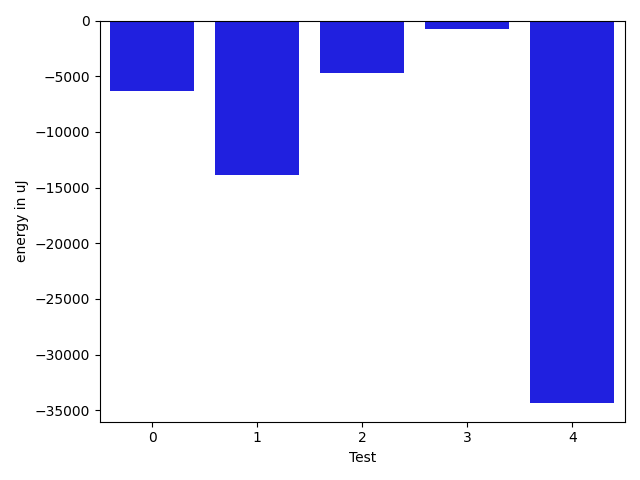

# gson cee6c7

https://github.com/google/gson/commit/cee6c7

## Delta Energy per test method

| ID | EnergyV1 | EnergyV2 | DeltaEnergy | σV1 | σV2 |
| --- | --- | --- | --- | --- | --- |
| 0 | 75500 | 73730 | -1770 | 23188.092853475682 | 16514.81986375054 |
| 1 | 225891 | 218261 | -7630 | 52283.75195030304 | 86341.37084516024 |
| 2 | 292541 | 280273 | -12268 | 104405.34271774208 | 61557.9671778727 |
| 3 | 34912 | 34423 | -489 | 3595.479243149889 | 3293.006415178328 |
| 4 | 34790 | 34118 | -672 | 117296.3917570649 | 67558.50575814431 |

## Delta Duration per test method

| ID | DurationV1 | DurationsV2 | DeltaDuration |
| --- | --- | --- | --- |
| 0 | 2922122.787878788 | 2882428.9595959596 | -39693.82828282844 |
| 1 | 7448693.262626262 | 7418730.737373738 | -29962.525252524763 |
| 2 | 8537147.878787879 | 8875803.632653061 | 338655.7538651824 |
| 3 | 922081.081632653 | 887870.4418604651 | -34210.63977218792 |
| 4 | 2530465.2608695654 | 1615192.5918367347 | -915272.6690328307 |

## Misc.

| ID | Test Class | Test Method |
| --- | --- | --- |
| 0 | com.google.gson.functional.JsonParserTest | testBadTypeForDeserializingCustomTree |
| 1 | com.google.gson.functional.JsonParserTest | testChangingCustomTreeAndDeserializing |
| 2 | com.google.gson.functional.JsonParserTest | testBadFieldTypeForDeserializingCustomTree |
| 3 | com.google.gson.functional.JsonParserTest | testDeserializingCustomTree |
| 4 | com.google.gson.functional.JsonParserTest | testBadFieldTypeForCustomDeserializerCustomTree |

| Test | IterationV1 | IterationV2 | DeltaIteration |
| --- | --- | --- | --- |
| 0 | 99 | 99 | 0 |
| 1 | 99 | 99 | 0 |
| 2 | 99 | 98 | -1 |
| 3 | 49 | 43 | -6 |
| 4 | 46 | 49 | 3 |

| Time Label | Time (s) |
| --- | --- |
| Selection | 23.22904944419861 |
| Injection | 8.363764762878418 |
| Total | 940.6071197986603 |

