# gson 203409

https://github.com/google/gson/commit/203409

## Delta Energy per test method

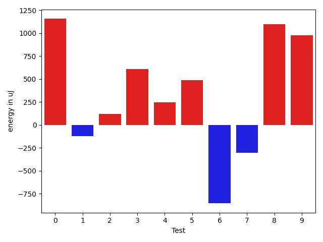

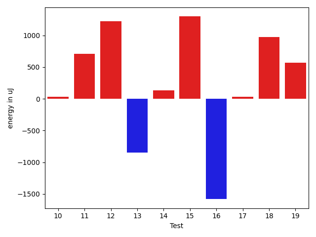

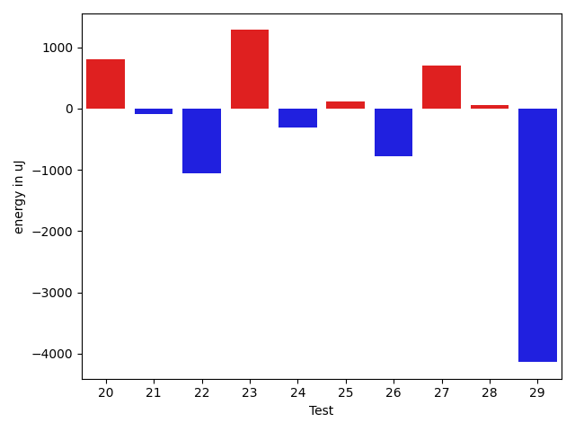

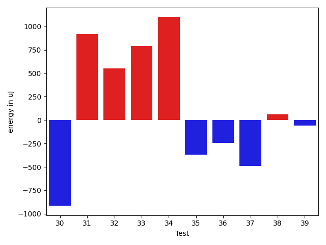

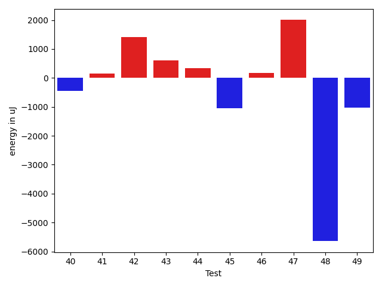

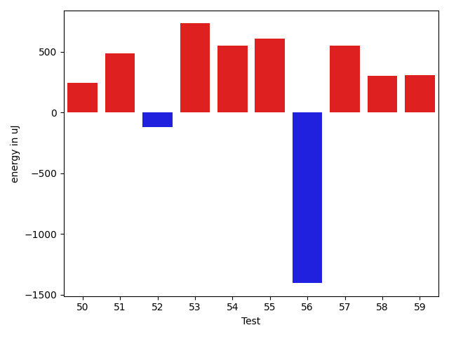

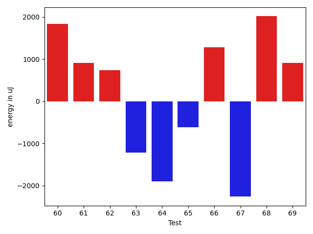

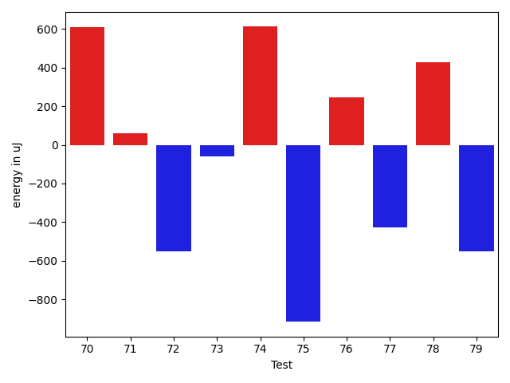

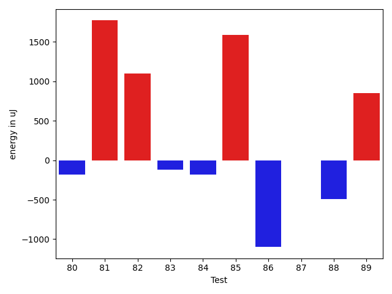

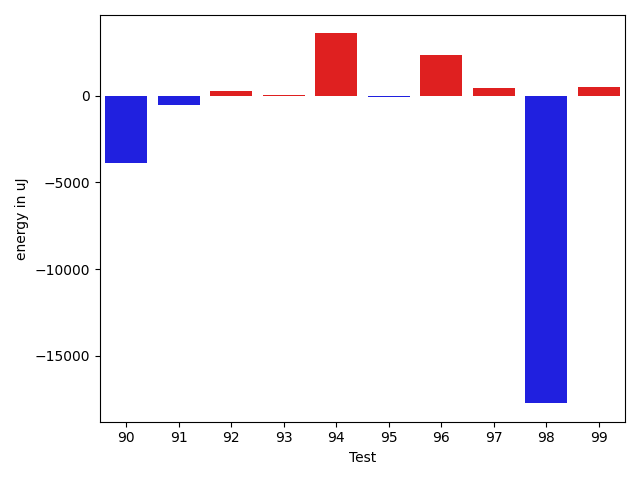

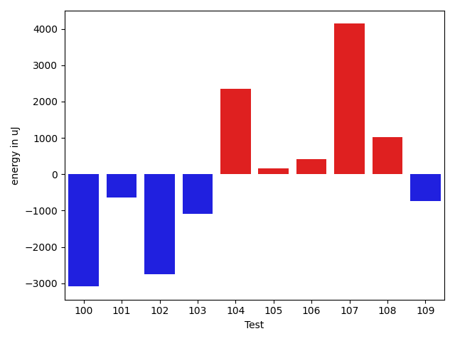

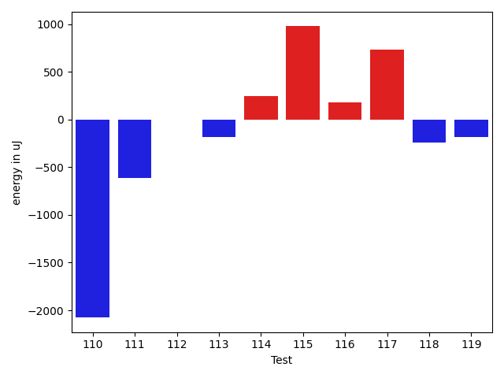

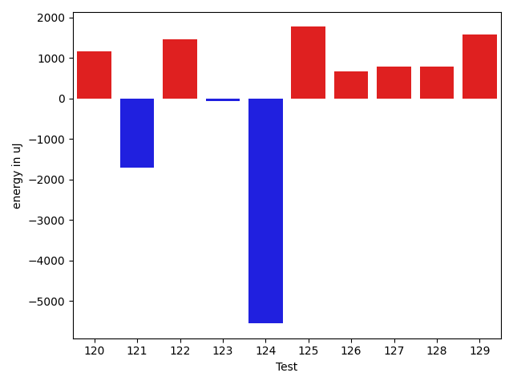

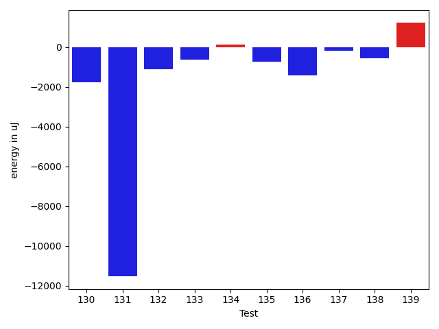

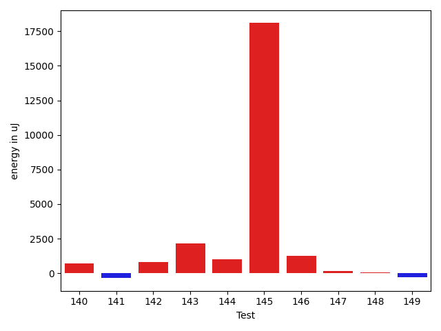

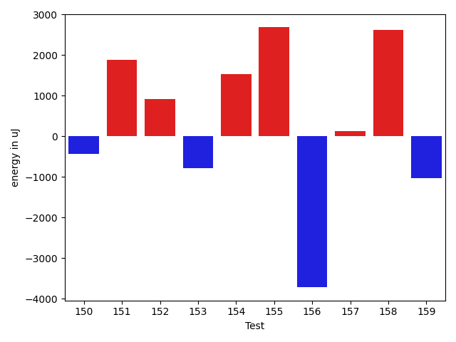

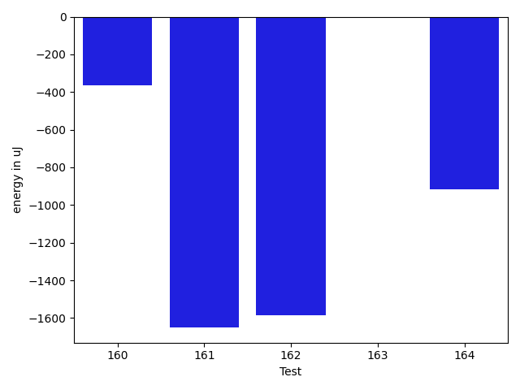

| ID | EnergyV1 | EnergyV2 | DeltaEnergy | σV1 | σV2 |
| --- | --- | --- | --- | --- | --- |
| 0 | 35523 | 36682 | 1159 | 5162.93025769269 | 22753.881196304996 |
| 1 | 36743 | 36621 | -122 | 66284.72081344321 | 57610.44079037186 |
| 2 | 35584 | 35706 | 122 | 3827.7570030908114 | 4332.366748556893 |
| 3 | 36377 | 36987 | 610 | 14972.74734709916 | 14390.739053534913 |
| 4 | 36316 | 36560 | 244 | 19694.521465458063 | 3556.859820637951 |
| 5 | 34546 | 35034 | 488 | 5283.469945180507 | 4669.439431903326 |
| 6 | 36926 | 36071 | -855 | 3314.6855060211265 | 3821.2891238555376 |
| 7 | 37841 | 37536 | -305 | 93700.8550603669 | 70520.55688843412 |
| 8 | 34118 | 35217 | 1099 | 3569.800955679361 | 4277.336047088447 |
| 9 | 34851 | 35828 | 977 | 3694.620433476345 | 3722.3825387502693 |
| 10 | 36072 | 36682 | 610 | 5562.27344163393 | 3303.2828662475217 |
| 11 | 33691 | 34363 | 672 | 2906.4117022003234 | 5006.764527991849 |
| 12 | 36499 | 38636 | 2137 | 3056.0231281847327 | 3342.6118147044313 |
| 13 | 34058 | 34179 | 121 | 3466.3023783961567 | 3634.495918807233 |
| 14 | 33935 | 35034 | 1099 | 3850.4458749531673 | 2811.9436606020395 |
| 15 | 35767 | 36011 | 244 | 3308.489195750834 | 4525.8249179017075 |
| 16 | 142273 | 147583 | 5310 | 35091.07548628576 | 26244.95058101459 |
| 17 | 35095 | 33875 | -1220 | 3679.986868015351 | 4389.494668684539 |
| 18 | 38025 | 37842 | -183 | 69452.91860137504 | 72008.33184654711 |
| 19 | 36437 | 36315 | -122 | 3937.773881430247 | 4146.236348083243 |
| 20 | 33631 | 35157 | 1526 | 3246.4965188158867 | 3368.917347632833 |
| 21 | 36682 | 37109 | 427 | 3823.936017777247 | 3548.4389762777873 |
| 22 | 36194 | 35767 | -427 | 3090.6074465853617 | 3687.3849010054896 |
| 23 | 33813 | 35278 | 1465 | 4566.59451774008 | 3876.1323478503837 |
| 24 | 36254 | 35706 | -548 | 3635.4781313956946 | 3373.996100446871 |
| 25 | 34851 | 35767 | 916 | 3924.476642927108 | 4201.16259803811 |
| 26 | 36316 | 36376 | 60 | 30041.525711419315 | 18454.284227974378 |
| 27 | 35461 | 36682 | 1221 | 3648.2199342783274 | 3904.213578326947 |
| 28 | 35278 | 34851 | -427 | 3708.6187389130855 | 3802.3525047785324 |
| 29 | 37353 | 35827 | -1526 | 54533.62388495295 | 42661.19963313532 |
| 30 | 36316 | 35401 | -915 | 3562.3029653806484 | 4021.3377505999165 |
| 31 | 34912 | 35827 | 915 | 3418.3865801615493 | 3651.275119200654 |
| 32 | 37841 | 38391 | 550 | 22992.899896329927 | 20368.63166246702 |
| 33 | 35645 | 36438 | 793 | 22479.851625529718 | 33268.34336971262 |
| 34 | 36316 | 37415 | 1099 | 3617.625056449154 | 34436.36237684854 |
| 35 | 36194 | 35827 | -367 | 4700.927611946436 | 2770.4675662259974 |
| 36 | 35034 | 34790 | -244 | 3694.068366576176 | 3592.3757503468983 |
| 37 | 34363 | 33874 | -489 | 2711.9683258875434 | 3337.6882260697216 |
| 38 | 33386 | 33447 | 61 | 3521.6032181105315 | 3846.8713734115686 |
| 39 | 35156 | 35095 | -61 | 3866.338110862222 | 3369.472277133983 |
| 40 | 35034 | 33264 | -1770 | 2453.9660466324085 | 2777.035095204956 |
| 41 | 34790 | 34546 | -244 | 3199.5088056814498 | 3880.299174999268 |
| 42 | 34729 | 34973 | 244 | 2815.292144587307 | 3845.694334568279 |
| 43 | 33387 | 35034 | 1647 | 3960.57212351953 | 3809.950539923933 |
| 44 | 34485 | 35278 | 793 | 2984.3303097887597 | 2725.534802416523 |
| 45 | 34851 | 33264 | -1587 | 3832.309519075932 | 2663.456637905476 |
| 46 | 35644 | 36132 | 488 | 4176.349356868661 | 3681.259068240105 |
| 47 | 32776 | 35339 | 2563 | 4263.0621631408 | 3849.71935249448 |
| 48 | 34485 | 33142 | -1343 | 28952.61202002718 | 2793.978007742808 |
| 49 | 35095 | 33691 | -1404 | 3589.866271534359 | 3937.555133848765 |
| 50 | 35034 | 35278 | 244 | 3792.0177992725717 | 3940.4576414897547 |
| 51 | 33752 | 34241 | 489 | 3740.3486974998586 | 4005.606753276168 |
| 52 | 33752 | 33630 | -122 | 3658.0259427537812 | 2470.548402247525 |
| 53 | 33996 | 34729 | 733 | 3058.2130636304323 | 33560.407012434116 |
| 54 | 33813 | 34363 | 550 | 55491.97639033145 | 43999.46635485733 |
| 55 | 33020 | 33631 | 611 | 4083.9280436998356 | 3225.8539573115613 |
| 56 | 37659 | 36255 | -1404 | 57488.668748477925 | 71138.08455641432 |
| 57 | 33325 | 33875 | 550 | 3283.1765844116685 | 3691.5537172713607 |
| 58 | 35340 | 35644 | 304 | 3801.185643805988 | 2445.0191655690555 |
| 59 | 34667 | 34973 | 306 | 3848.6312837820565 | 5740.130420729169 |
| 60 | 32776 | 34607 | 1831 | 2536.763845050531 | 2747.3956736334867 |
| 61 | 36011 | 36926 | 915 | 52793.926995188885 | 79759.77107794792 |
| 62 | 36133 | 36865 | 732 | 3883.0339577019754 | 4728.58929268433 |
| 63 | 36133 | 34912 | -1221 | 4426.67164614971 | 3433.868513039448 |
| 64 | 35461 | 33569 | -1892 | 3237.524478403814 | 2260.8577305979547 |
| 65 | 35645 | 35035 | -610 | 33139.62776616539 | 30178.306211416173 |
| 66 | 34057 | 35340 | 1283 | 3113.5280475519344 | 2500.7868813718746 |
| 67 | 36682 | 34424 | -2258 | 4301.195956050335 | 3234.8825246207757 |
| 68 | 36377 | 38391 | 2014 | 3724.8001818296 | 4818.2387798862765 |
| 69 | 36682 | 37597 | 915 | 11536.301910802129 | 17996.7984114526 |
| 70 | 36377 | 36987 | 610 | 3898.681817605863 | 3900.046659991823 |
| 71 | 38696 | 38757 | 61 | 59404.41360528487 | 83901.00728805712 |
| 72 | 38330 | 37781 | -549 | 18516.162702198995 | 16236.101194110857 |
| 73 | 34606 | 34545 | -61 | 10519.965860654802 | 9925.826095264007 |
| 74 | 33691 | 34302 | 611 | 3466.210760383074 | 2772.7903548944273 |
| 75 | 34851 | 33936 | -915 | 3057.7065448555254 | 5399.019636673874 |
| 76 | 34850 | 35095 | 245 | 3628.5120396495986 | 3601.1565744290706 |
| 77 | 35644 | 35218 | -426 | 10927.255345194944 | 6937.749918557817 |
| 78 | 34240 | 34668 | 428 | 2991.100047165162 | 52482.542593633116 |
| 79 | 35217 | 34668 | -549 | 6026.354046202189 | 6883.80913734213 |
| 80 | 35523 | 35339 | -184 | 25953.121377183834 | 3927.0507890024905 |
| 81 | 34179 | 35949 | 1770 | 4022.698922986904 | 3476.4826291381687 |
| 82 | 34240 | 35339 | 1099 | 3484.9070485081775 | 2780.213705814717 |
| 83 | 34790 | 34668 | -122 | 3346.01423304391 | 2670.179192183054 |
| 84 | 36805 | 36621 | -184 | 100714.72228976662 | 120548.31846674497 |
| 85 | 34057 | 35644 | 1587 | 21935.28605100426 | 3793.264085125254 |
| 86 | 35523 | 34424 | -1099 | 34358.206740953196 | 2645.197501342706 |
| 87 | 36011 | 36010 | -1 | 8553.822570429711 | 7725.617063559358 |
| 88 | 33997 | 33508 | -489 | 3429.5890252935774 | 3662.3567233920567 |
| 89 | 34424 | 35278 | 854 | 3132.239850649126 | 2452.65669184918 |
| 90 | 36743 | 35644 | -1099 | 22068.687117666796 | 14768.34089346532 |
| 91 | 35767 | 34301 | -1466 | 2801.2877684379373 | 3500.041541666103 |
| 92 | 34058 | 35034 | 976 | 3826.3901096976624 | 3217.57204683022 |
| 93 | 35217 | 35706 | 489 | 3709.3272105985175 | 3085.4026733371124 |
| 94 | 34240 | 32836 | -1404 | 3642.1410829421106 | 28047.645287984826 |
| 95 | 33447 | 34301 | 854 | 3724.3850445488542 | 3112.8838745653406 |
| 96 | 36194 | 36132 | -62 | 3686.57552688628 | 19472.0480250854 |
| 97 | 35706 | 35888 | 182 | 3602.3596138810353 | 3891.5870040674713 |
| 98 | 38940 | 36621 | -2319 | 72653.98597880157 | 49858.22791488088 |
| 99 | 35767 | 35950 | 183 | 3639.5296543091026 | 3943.1393803688084 |
| 100 | 36560 | 36988 | 428 | 29141.323982359292 | 3638.2587089980284 |
| 101 | 37109 | 36621 | -488 | 4002.295170002334 | 4172.815030173476 |
| 102 | 36133 | 36743 | 610 | 21436.713872836805 | 3880.109137719237 |
| 103 | 36316 | 34362 | -1954 | 6352.329048616957 | 7404.110437829469 |
| 104 | 35401 | 36438 | 1037 | 11465.785775621276 | 13186.947189630208 |
| 105 | 35461 | 35034 | -427 | 6930.1913884279575 | 8134.145608137036 |
| 106 | 35766 | 35828 | 62 | 3503.2346495377988 | 3453.8607704223614 |
| 107 | 35706 | 35400 | -306 | 7683.750512984524 | 28819.59638601669 |
| 108 | 36071 | 37048 | 977 | 12783.976752888491 | 12231.959635321737 |
| 109 | 36132 | 35156 | -976 | 87895.24219722576 | 80829.06155363201 |
| 110 | 66834 | 64758 | -2076 | 21897.765621118266 | 33062.19474809658 |
| 111 | 37353 | 36743 | -610 | 18032.44586589506 | 15154.68214509644 |
| 112 | 35645 | 35644 | -1 | 8889.446580571117 | 12916.190168985786 |
| 113 | 38574 | 38391 | -183 | 17931.947725363832 | 17890.832581228464 |
| 114 | 35034 | 35278 | 244 | 5610.074914373916 | 3633.2444049369788 |
| 115 | 36010 | 36988 | 978 | 4240.934476112283 | 3524.0100806392065 |
| 116 | 37353 | 37536 | 183 | 3820.8330348560003 | 3947.0654205895266 |
| 117 | 37476 | 38208 | 732 | 77073.3064182457 | 54279.75623984073 |
| 118 | 35400 | 35156 | -244 | 23950.660777972542 | 7065.699465074065 |
| 119 | 36804 | 36621 | -183 | 3734.8951324146387 | 20638.35060528329 |
| 120 | 37292 | 38452 | 1160 | 54887.46009451276 | 64590.87008355341 |
| 121 | 37964 | 36255 | -1709 | 3137.9011160600535 | 3846.886123908712 |
| 122 | 35828 | 37293 | 1465 | 9390.168520128691 | 7611.404554351321 |
| 123 | 35766 | 35706 | -60 | 3314.4873355404575 | 3753.7065519786365 |
| 124 | 41992 | 36438 | -5554 | 88562.07075647532 | 66234.5136859114 |
| 125 | 34912 | 36682 | 1770 | 4434.349409428504 | 3892.3744675397757 |
| 126 | 38024 | 38696 | 672 | 72348.30425055795 | 49044.61535399376 |
| 127 | 37353 | 38147 | 794 | 3910.278023549385 | 34156.535844188686 |
| 128 | 35828 | 36621 | 793 | 3614.3179031128275 | 4242.596360131376 |
| 129 | 36316 | 37903 | 1587 | 61520.60581938346 | 54715.32405686137 |
| 130 | 37354 | 35583 | -1771 | 6263.6677329041795 | 3901.712935720213 |
| 131 | 365050 | 353515 | -11535 | 118439.5129445869 | 100850.16276071532 |
| 132 | 65979 | 64880 | -1099 | 64616.12595439588 | 66309.21008112753 |
| 133 | 37476 | 36865 | -611 | 29205.02051416733 | 40843.965604240475 |
| 134 | 37232 | 37354 | 122 | 58485.064067193736 | 101883.48308549527 |
| 135 | 37659 | 36926 | -733 | 34588.456592200746 | 48940.46985155105 |
| 136 | 72143 | 70739 | -1404 | 24742.304946399112 | 27258.785507710574 |
| 137 | 36438 | 36255 | -183 | 3591.249615728366 | 37195.659330870476 |
| 138 | 38086 | 37536 | -550 | 33688.187642711186 | 3147.350442609426 |
| 139 | 34241 | 35461 | 1220 | 4037.8092382174773 | 29779.131136791457 |
| 140 | 35645 | 36011 | 366 | 3821.678594580766 | 3592.714440628856 |
| 141 | 35767 | 34790 | -977 | 3595.379384167931 | 3883.197568551127 |
| 142 | 35278 | 36377 | 1099 | 3849.492330400732 | 4645.474204355604 |
| 143 | 36438 | 37170 | 732 | 3476.441454360416 | 2791.502627021273 |
| 144 | 37353 | 38086 | 733 | 4325.414038466915 | 4873.848580149184 |
| 145 | 39612 | 38086 | -1526 | 48584.15706390292 | 73797.2565286091 |
| 146 | 34668 | 35949 | 1281 | 3130.2981689715543 | 3575.305760351134 |
| 147 | 35339 | 35949 | 610 | 3431.5019462045034 | 3766.484196907715 |
| 148 | 36193 | 35827 | -366 | 3863.4666104419744 | 3585.012513089496 |
| 149 | 35827 | 36621 | 794 | 4330.338804700484 | 4251.222864953095 |
| 150 | 36072 | 35644 | -428 | 3849.7262738755603 | 21920.847877535653 |
| 151 | 33386 | 35279 | 1893 | 3994.255824591922 | 3716.9814227522133 |
| 152 | 35828 | 36743 | 915 | 4871.842751572118 | 3848.387968264857 |
| 153 | 39184 | 38392 | -792 | 82563.5491684039 | 64727.71844696191 |
| 154 | 35278 | 36804 | 1526 | 3866.2259048715714 | 3113.205383523548 |
| 155 | 37414 | 40100 | 2686 | 103272.44315103916 | 102187.60499346085 |
| 156 | 39307 | 35583 | -3724 | 52538.03237879484 | 2714.8556333624815 |
| 157 | 35217 | 35339 | 122 | 3205.261120923814 | 3831.930522269421 |
| 158 | 36987 | 39612 | 2625 | 59720.92594299987 | 54551.83095019851 |
| 159 | 36804 | 35767 | -1037 | 8870.841602326356 | 3337.7868163296007 |
| 160 | 36865 | 36499 | -366 | 254373.9991845025 | 3711.363717550547 |
| 161 | 38635 | 36987 | -1648 | 60877.93927458452 | 107400.56952782487 |
| 162 | 37598 | 36011 | -1587 | 7002.1653793665855 | 3734.3933563292335 |
| 163 | 35644 | 35644 | 0 | 3632.7312558162253 | 7829.9570720523525 |
| 164 | 35705 | 34790 | -915 | 23892.346478523563 | 3870.218622018945 |

## Delta Duration per test method

| ID | DurationV1 | DurationsV2 | DeltaDuration |
| --- | --- | --- | --- |
| 0 | 969377.8245614035 | 1067634.0192307692 | 98256.19466936577 |
| 1 | 1633728.7971014492 | 1647742.6140350876 | 14013.816933638416 |
| 2 | 873614.4727272728 | 875611.6981132076 | 1997.225385934813 |
| 3 | 1276795.011627907 | 1181204.7283950618 | -95590.28323284513 |
| 4 | 970515.7636363637 | 851162.0615384616 | -119353.70209790207 |
| 5 | 972256.9855072463 | 926194.3174603175 | -46062.668046928826 |
| 6 | 792865.9107142857 | 762376.4693877551 | -30489.441326530534 |
| 7 | 1739000.776119403 | 1388016.0476190476 | -350984.7285003555 |
| 8 | 720830.0930232558 | 755222.2708333334 | 34392.177810077555 |
| 9 | 600116.96875 | 611228.8461538461 | 11111.877403846127 |
| 10 | 831194.8148148148 | 817231.1481481482 | -13963.666666666628 |
| 11 | 1143137.0789473683 | 1042209.5060240964 | -100927.57292327192 |
| 12 | 548174.7 | 489321.86363636365 | -58852.83636363631 |
| 13 | 715360.9534883721 | 682121.7435897436 | -33239.20989862853 |
| 14 | 737551.5957446808 | 748070.22 | 10518.624255319126 |
| 15 | 510909.28 | 491889.5 | -19019.780000000028 |
| 16 | 4757177.707070707 | 4610905.121212121 | -146272.58585858624 |
| 17 | 605301.8888888889 | 859361.5161290322 | 254059.62724014337 |
| 18 | 1828753.25 | 1831671.5714285714 | 2918.321428571362 |
| 19 | 595667.0 | 538211.375 | -57455.625 |
| 20 | 793519.0714285715 | 780156.6585365854 | -13362.412891986081 |
| 21 | 584292.8064516129 | 529490.5714285715 | -54802.23502304137 |
| 22 | 503557.25 | 461981.64285714284 | -41575.60714285716 |
| 23 | 671387.2558139535 | 663106.1481481482 | -8281.107665805263 |
| 24 | 793800.5434782609 | 771451.0425531915 | -22349.500925069326 |
| 25 | 791994.0731707317 | 718305.5833333334 | -73688.48983739829 |
| 26 | 933187.1228070175 | 891691.4423076923 | -41495.68049932527 |
| 27 | 896620.8548387097 | 841456.2903225806 | -55164.56451612909 |
| 28 | 767592.9444444445 | 788384.4897959183 | 20791.545351473847 |
| 29 | 1534356.1714285715 | 1426165.9076923076 | -108190.26373626385 |
| 30 | 826246.0 | 812438.94 | -13807.060000000056 |
| 31 | 944888.3285714285 | 911101.6875 | -33786.641071428545 |
| 32 | 1628835.4285714286 | 1532832.3298969073 | -96003.09867452132 |
| 33 | 1092826.4242424243 | 1241211.2413793104 | 148384.81713688606 |
| 34 | 1067867.6379310344 | 1173668.576923077 | 105800.93899204256 |
| 35 | 697193.3958333334 | 664580.0571428571 | -32613.33869047626 |
| 36 | 546224.4642857143 | 520385.63636363635 | -25838.827922077966 |
| 37 | 425843.1666666667 | 430464.1666666667 | 4621.0 |
| 38 | 544238.5161290322 | 563856.6052631579 | 19618.08913412562 |
| 39 | 771147.7446808511 | 725670.8823529412 | -45476.86232790991 |
| 40 | 492255.55555555556 | 519722.12 | 27466.564444444433 |
| 41 | 466972.03846153844 | 500364.4285714286 | 33392.39010989014 |
| 42 | 490337.1875 | 435477.125 | -54860.0625 |
| 43 | 560497.48 | 540241.7666666667 | -20255.71333333326 |
| 44 | 470455.1176470588 | 460320.04761904763 | -10135.070028011163 |
| 45 | 524795.9166666666 | 426814.037037037 | -97981.8796296296 |
| 46 | 610640.1388888889 | 590849.575 | -19790.563888888923 |
| 47 | 467699.5238095238 | 498154.38095238095 | 30454.85714285716 |
| 48 | 652899.1 | 490210.8695652174 | -162688.23043478257 |
| 49 | 479949.7 | 466296.72222222225 | -13652.977777777764 |
| 50 | 606866.65 | 610036.45 | 3169.79999999993 |
| 51 | 600767.6666666666 | 599154.5454545454 | -1613.1212121212156 |
| 52 | 448923.1379310345 | 455473.9310344828 | 6550.79310344829 |
| 53 | 580874.3225806452 | 800359.5384615385 | 219485.2158808933 |
| 54 | 1213520.043478261 | 1044282.8 | -169237.24347826093 |
| 55 | 625201.0 | 647365.2121212122 | 22164.212121212156 |
| 56 | 1303555.4 | 1586913.6333333333 | 283358.2333333334 |
| 57 | 418578.0 | 405776.1 | -12801.900000000023 |
| 58 | 569815.9565217391 | 525744.56 | -44071.39652173908 |
| 59 | 919275.7115384615 | 964810.1020408163 | 45534.39050235483 |
| 60 | 435564.72222222225 | 455641.2 | 20076.477777777764 |
| 61 | 1048494.0666666667 | 1613723.0 | 565228.9333333333 |
| 62 | 621132.3 | 607059.0666666667 | -14073.233333333395 |
| 63 | 594085.4074074074 | 545480.5 | -48604.907407407416 |
| 64 | 497003.5833333333 | 486235.04761904763 | -10768.535714285681 |
| 65 | 726130.24 | 749841.4 | 23711.160000000033 |
| 66 | 471654.7272727273 | 474442.8333333333 | 2788.10606060602 |
| 67 | 447999.25 | 431574.82352941175 | -16424.426470588252 |
| 68 | 509393.4285714286 | 512945.65 | 3552.2214285714435 |
| 69 | 923949.4883720931 | 1128669.024390244 | 204719.53601815086 |
| 70 | 722807.0208333334 | 755653.5 | 32846.47916666663 |
| 71 | 1114846.0571428572 | 2118720.814814815 | 1003874.7576719576 |
| 72 | 1530096.3837209302 | 1550259.125 | 20162.7412790698 |
| 73 | 991044.5147058824 | 1032564.4626865672 | 41519.94798068481 |
| 74 | 740646.4107142857 | 729620.085106383 | -11026.32560790272 |
| 75 | 746771.775510204 | 887360.9090909091 | 140589.13358070503 |
| 76 | 678535.4047619047 | 724431.3409090909 | 45895.93614718621 |
| 77 | 1087879.5211267606 | 1082366.0428571429 | -5513.478269617772 |
| 78 | 1013280.3859649122 | 1151363.082191781 | 138082.69622686866 |
| 79 | 988787.3384615384 | 986813.1428571428 | -1974.195604395587 |
| 80 | 803088.447368421 | 690569.7209302326 | -112518.72643818846 |
| 81 | 719687.1875 | 682024.5869565217 | -37662.60054347827 |
| 82 | 576364.3103448276 | 589091.84375 | 12727.533405172406 |
| 83 | 569764.4523809524 | 590336.5 | 20572.047619047575 |
| 84 | 1994630.1860465116 | 2255418.8076923075 | 260788.62164579588 |
| 85 | 775402.1538461539 | 694864.5714285715 | -80537.5824175824 |
| 86 | 979565.8214285715 | 827756.7857142857 | -151809.0357142858 |
| 87 | 1142114.8088235294 | 1137976.2794117648 | -4138.529411764583 |
| 88 | 539489.5806451613 | 589008.0 | 49518.41935483867 |
| 89 | 492010.4210526316 | 482818.4761904762 | -9191.94486215536 |
| 90 | 1373821.2368421052 | 1289234.9866666666 | -84586.25017543859 |
| 91 | 711885.2 | 578633.5757575758 | -133251.62424242415 |
| 92 | 678222.2903225806 | 634272.7777777778 | -43949.512544802856 |
| 93 | 733614.8301886793 | 735481.2222222222 | 1866.392033542972 |
| 94 | 621911.9268292683 | 768380.1666666666 | 146468.2398373983 |
| 95 | 479379.1153846154 | 543704.5909090909 | 64325.475524475565 |
| 96 | 821535.914893617 | 888384.0833333334 | 66848.16843971633 |
| 97 | 866047.7903225806 | 838138.6666666666 | -27909.12365591398 |
| 98 | 1944096.9696969697 | 1404128.2388059702 | -539968.7308909995 |
| 99 | 823416.3333333334 | 814435.0943396227 | -8981.238993710722 |
| 100 | 929067.9215686275 | 765331.22 | -163736.7015686275 |
| 101 | 895984.9827586206 | 819251.8125 | -76733.17025862064 |
| 102 | 927700.0172413794 | 790743.7358490566 | -136956.28139232274 |
| 103 | 1093351.1506849315 | 1091748.935897436 | -1602.2147874955554 |
| 104 | 1355500.0412371133 | 1367876.829787234 | 12376.788550120778 |
| 105 | 1129742.4594594594 | 1082417.3125 | -47325.14695945941 |
| 106 | 916006.2666666667 | 883921.8103448276 | -32084.456321839127 |
| 107 | 1311567.7127659575 | 1373982.9239130435 | 62415.211147085996 |
| 108 | 1396925.8 | 1508400.969072165 | 111475.16907216492 |
| 109 | 2025757.0786516855 | 2095412.7717391304 | 69655.69308744487 |
| 110 | 2069765.202020202 | 2104615.1818181816 | 34849.979797979584 |
| 111 | 1480834.5930232557 | 1431207.8068181819 | -49626.78620507382 |
| 112 | 1288117.5957446808 | 1354214.625 | 66097.02925531915 |
| 113 | 1641169.9494949495 | 1664666.4646464647 | 23496.515151515137 |
| 114 | 1033076.0746268657 | 995556.5 | -37519.57462686568 |
| 115 | 887281.5862068966 | 872986.3461538461 | -14295.240053050453 |
| 116 | 763663.25 | 638154.0277777778 | -125509.22222222225 |
| 117 | 2039626.5409836066 | 1421966.9636363636 | -617659.577347243 |
| 118 | 916802.9487179487 | 793918.0263157894 | -122884.92240215931 |
| 119 | 743353.431372549 | 866274.2708333334 | 122920.83946078434 |
| 120 | 884121.552631579 | 1665315.945945946 | 781194.393314367 |
| 121 | 597511.027027027 | 594257.4545454546 | -3253.572481572395 |
| 122 | 1065799.6964285714 | 971903.3 | -93896.39642857132 |
| 123 | 634781.8372093023 | 630401.8285714285 | -4380.008637873805 |
| 124 | 2456945.6486486485 | 1587184.8214285714 | -869760.8272200772 |
| 125 | 687421.1034482758 | 662682.4666666667 | -24738.63678160915 |
| 126 | 1699239.3409090908 | 1233684.3255813953 | -465555.0153276955 |
| 127 | 579389.2941176471 | 756301.6842105263 | 176912.39009287918 |
| 128 | 548677.7619047619 | 517133.625 | -31544.136904761894 |
| 129 | 1437716.4615384615 | 1416257.319148936 | -21459.142389525427 |
| 130 | 681989.972972973 | 719416.9523809524 | 37426.97940797941 |
| 131 | 10359664.757575758 | 10523618.717171717 | 163953.95959595963 |
| 132 | 2183288.121212121 | 2276490.0505050505 | 93201.92929292936 |
| 133 | 1221763.043478261 | 1319543.3559322034 | 97780.31245394237 |
| 134 | 1241293.8918918918 | 1529252.88 | 287958.98810810805 |
| 135 | 1272256.7291666667 | 1650551.1818181819 | 378294.45265151514 |
| 136 | 2181567.7474747472 | 2254377.0303030303 | 72809.28282828303 |
| 137 | 443202.25925925927 | 709097.5789473684 | 265895.31968810916 |
| 138 | 737827.7058823529 | 453530.5 | -284297.2058823529 |
| 139 | 439163.4347826087 | 788239.0666666667 | 349075.63188405795 |
| 140 | 421107.1176470588 | 396912.9411764706 | -24194.176470588194 |
| 141 | 438657.5714285714 | 408696.35294117645 | -29961.218487394974 |
| 142 | 978672.380952381 | 506658.3888888889 | -472013.99206349207 |
| 143 | 439388.7894736842 | 464183.5833333333 | 24794.7938596491 |
| 144 | 470269.5 | 474883.93333333335 | 4614.433333333349 |
| 145 | 982643.4137931034 | 1770713.5217391304 | 788070.107946027 |
| 146 | 503638.76666666666 | 453749.48 | -49889.28666666668 |
| 147 | 491918.0869565217 | 500137.5 | 8219.413043478271 |
| 148 | 433809.1875 | 520085.2272727273 | 86276.0397727273 |
| 149 | 631789.9117647059 | 651177.65 | 19387.73823529412 |
| 150 | 916397.9344262296 | 1049779.446153846 | 133381.51172761654 |
| 151 | 677441.9393939395 | 718040.4146341464 | 40598.47524020693 |
| 152 | 552167.8709677419 | 592554.8571428572 | 40386.98617511522 |
| 153 | 2040219.4047619049 | 1615310.892857143 | -424908.5119047619 |
| 154 | 485579.15 | 577791.3 | 92212.15000000002 |
| 155 | 2144073.8076923075 | 2813663.0454545454 | 669589.2377622379 |
| 156 | 1113297.3529411764 | 493273.25 | -620024.1029411764 |
| 157 | 479272.2272727273 | 524845.0 | 45572.772727272706 |
| 158 | 1462396.5192307692 | 1478141.8780487804 | 15745.358818011126 |
| 159 | 818536.0294117647 | 695709.5945945946 | -122826.43481717014 |
| 160 | 2698902.1944444445 | 724355.4666666667 | -1974546.7277777777 |
| 161 | 1018375.04 | 1956118.064516129 | 937743.0245161289 |
| 162 | 900974.85 | 855657.0714285715 | -45317.7785714285 |
| 163 | 693499.880952381 | 631719.2432432432 | -61780.63770913775 |
| 164 | 740154.1891891892 | 605712.5666666667 | -134441.62252252258 |

## Misc.

| ID | Test Class | Test Method |
| --- | --- | --- |
| 0 | com.google.gson.functional.CustomTypeAdaptersTest | testCustomAdapterInvokedForCollectionElementDeserialization |
| 1 | com.google.gson.functional.CustomTypeAdaptersTest | testCustomDeserializers |
| 2 | com.google.gson.functional.CustomTypeAdaptersTest | testCustomByteArrayDeserializerAndInstanceCreator |
| 3 | com.google.gson.functional.CustomTypeAdaptersTest | testCustomDeserializerForLong |
| 4 | com.google.gson.functional.CustomTypeAdaptersTest | testCustomAdapterInvokedForMapElementDeserialization |
| 5 | com.google.gson.functional.CustomTypeAdaptersTest | testCustomNestedDeserializers |
| 6 | com.google.gson.functional.CustomDeserializerTest | testDefaultConstructorNotCalledOnField |
| 7 | com.google.gson.functional.CustomDeserializerTest | testDefaultConstructorNotCalledOnObject |
| 8 | com.google.gson.functional.DefaultTypeAdaptersTest | testBadValueForBigDecimalDeserialization |
| 9 | com.google.gson.functional.DefaultTypeAdaptersTest | testDefaultGregorianCalendarDeserialization |
| 10 | com.google.gson.functional.DefaultTypeAdaptersTest | testUrlNullDeserialization |
| 11 | com.google.gson.functional.DefaultTypeAdaptersTest | testDefaultDateDeserializationUsingBuilder |
| 12 | com.google.gson.functional.DefaultTypeAdaptersTest | testLocaleDeserializationWithLanguage |
| 13 | com.google.gson.functional.DefaultTypeAdaptersTest | testDefaultCalendarDeserialization |
| 14 | com.google.gson.functional.DefaultTypeAdaptersTest | testDateDeserializationWithPattern |
| 15 | com.google.gson.functional.DefaultTypeAdaptersTest | testLocaleDeserializationWithLanguageCountryVariant |
| 16 | com.google.gson.functional.DefaultTypeAdaptersTest | testDefaultDateDeserialization |
| 17 | com.google.gson.functional.DefaultTypeAdaptersTest | testBigIntegerFieldDeserialization |
| 18 | com.google.gson.functional.DefaultTypeAdaptersTest | testUrlDeserialization |
| 19 | com.google.gson.functional.DefaultTypeAdaptersTest | testUuidDeserialization |
| 20 | com.google.gson.functional.DefaultTypeAdaptersTest | testPropertiesDeserialization |
| 21 | com.google.gson.functional.DefaultTypeAdaptersTest | testUriDeserialization |
| 22 | com.google.gson.functional.DefaultTypeAdaptersTest | testLocaleDeserializationWithLanguageCountry |
| 23 | com.google.gson.functional.DefaultTypeAdaptersTest | testBigDecimalFieldDeserialization |
| 24 | com.google.gson.functional.CollectionTest | testNullsInListDeserialization |
| 25 | com.google.gson.functional.CollectionTest | testRawCollectionOfBagOfPrimitivesNotAllowed |
| 26 | com.google.gson.functional.CollectionTest | testCollectionOfStringsDeserialization |
| 27 | com.google.gson.functional.CollectionTest | testWildcardPrimitiveCollectionDeserilaization |
| 28 | com.google.gson.functional.CollectionTest | testQueueDeserialization |
| 29 | com.google.gson.functional.CollectionTest | testTopLevelCollectionOfIntegersDeserialization |
| 30 | com.google.gson.functional.CollectionTest | testLinkedListDeserialization |
| 31 | com.google.gson.functional.CollectionTest | testSetDeserialization |
| 32 | com.google.gson.functional.CollectionTest | testWildcardCollectionField |
| 33 | com.google.gson.functional.CollectionTest | testTopLevelListOfIntegerCollectionsDeserialization |
| 34 | com.google.gson.functional.CollectionTest | testRawCollectionDeserializationNotAlllowed |
| 35 | com.google.gson.functional.PrimitiveTest | testPrimitiveBooleanAutoboxedDeserialization |
| 36 | com.google.gson.functional.PrimitiveTest | testDoubleNoFractAsStringRepresentationDeserialization |
| 37 | com.google.gson.functional.PrimitiveTest | testBigDecimalPreservePrecisionDeserialization |
| 38 | com.google.gson.functional.PrimitiveTest | testLongAsStringDeserialization |
| 39 | com.google.gson.functional.PrimitiveTest | testDoubleAsStringRepresentationDeserialization |
| 40 | com.google.gson.functional.PrimitiveTest | testBigIntegerDeserialization |
| 41 | com.google.gson.functional.PrimitiveTest | testNegativeInfinityFloatDeserialization |
| 42 | com.google.gson.functional.PrimitiveTest | testBigDecimalDeserialization |
| 43 | com.google.gson.functional.PrimitiveTest | testLargeDoubleDeserialization |
| 44 | com.google.gson.functional.PrimitiveTest | testSmallValueForBigDecimalDeserialization |
| 45 | com.google.gson.functional.PrimitiveTest | testBigDecimalInASingleElementArrayDeserialization |
| 46 | com.google.gson.functional.PrimitiveTest | testPrimitiveBooleanAutoboxedInASingleElementArrayDeserialization |
| 47 | com.google.gson.functional.PrimitiveTest | testFloatNaNDeserialization |
| 48 | com.google.gson.functional.PrimitiveTest | testNegativeInfinityDeserialization |
| 49 | com.google.gson.functional.PrimitiveTest | testBigDecimalAsStringRepresentationDeserialization |
| 50 | com.google.gson.functional.PrimitiveTest | testNumberDeserialization |
| 51 | com.google.gson.functional.PrimitiveTest | testBadValueForBigIntegerDeserialization |
| 52 | com.google.gson.functional.PrimitiveTest | testBigDecimalNegativeInfinityDeserializationNotSupported |
| 53 | com.google.gson.functional.PrimitiveTest | testBigDecimalNaNDeserializationNotSupported |
| 54 | com.google.gson.functional.PrimitiveTest | testDoubleNaNDeserialization |
| 55 | com.google.gson.functional.PrimitiveTest | testOverridingDefaultPrimitiveSerialization |
| 56 | com.google.gson.functional.PrimitiveTest | testPrimitiveIntegerAutoboxedDeserialization |
| 57 | com.google.gson.functional.PrimitiveTest | testSmallValueForBigIntegerDeserialization |
| 58 | com.google.gson.functional.PrimitiveTest | testPrimitiveDoubleAutoboxedInASingleElementArrayDeserialization |
| 59 | com.google.gson.functional.PrimitiveTest | testPrimitiveDoubleAutoboxedDeserialization |
| 60 | com.google.gson.functional.PrimitiveTest | testBigDecimalNoFractAsStringRepresentationDeserialization |
| 61 | com.google.gson.functional.PrimitiveTest | testPrimitiveIntegerAutoboxedInASingleElementArrayDeserialization |
| 62 | com.google.gson.functional.PrimitiveTest | testPrimitiveLongAutoboxedInASingleElementArrayDeserialization |
| 63 | com.google.gson.functional.PrimitiveTest | testPrimitiveLongAutoboxedDeserialization |
| 64 | com.google.gson.functional.PrimitiveTest | testFloatInfinityDeserialization |
| 65 | com.google.gson.functional.PrimitiveTest | testDoubleInfinityDeserialization |
| 66 | com.google.gson.functional.PrimitiveTest | testBigIntegerInASingleElementArrayDeserialization |
| 67 | com.google.gson.functional.PrimitiveTest | testBigDecimalInfinityDeserializationNotSupported |
| 68 | com.google.gson.functional.PrimitiveTest | testReallyLongValuesDeserialization |
| 69 | com.google.gson.functional.NullObjectAndFieldTest | testExplicitDeserializationOfNulls |
| 70 | com.google.gson.functional.NullObjectAndFieldTest | testNullWrappedPrimitiveMemberDeserialization |
| 71 | com.google.gson.functional.NullObjectAndFieldTest | testTopLevelNullObjectDeserialization |
| 72 | com.google.gson.functional.ObjectTest | testArrayOfArraysDeserialization |
| 73 | com.google.gson.functional.ObjectTest | testStringFieldWithNumberValueDeserialization |
| 74 | com.google.gson.functional.ObjectTest | testPrimitiveArrayInAnObjectDeserialization |
| 75 | com.google.gson.functional.ObjectTest | testNullArraysDeserialization |
| 76 | com.google.gson.functional.ObjectTest | testNullDeserialization |
| 77 | com.google.gson.functional.ObjectTest | testArrayOfObjectsDeserialization |
| 78 | com.google.gson.functional.ObjectTest | testNestedDeserialization |
| 79 | com.google.gson.functional.ObjectTest | testInheritenceDeserialization |
| 80 | com.google.gson.functional.ObjectTest | testBagOfPrimitivesDeserialization |
| 81 | com.google.gson.functional.ObjectTest | testClassWithTransientFieldsDeserialization |
| 82 | com.google.gson.functional.ObjectTest | testClassWithTransientFieldsDeserializationTransientFieldsPassedInJsonAreIgnored |
| 83 | com.google.gson.functional.ObjectTest | testObjectFieldNamesWithoutQuotesDeserialization |
| 84 | com.google.gson.functional.ObjectTest | testJsonInSingleQuotesDeserialization |
| 85 | com.google.gson.functional.ObjectTest | testBagOfPrimitiveWrappersDeserialization |
| 86 | com.google.gson.functional.ObjectTest | testInnerClassDeserialization |
| 87 | com.google.gson.functional.ObjectTest | testDirectedAcyclicGraphDeserialization |
| 88 | com.google.gson.functional.ObjectTest | testNullObjectFieldsDeserialization |
| 89 | com.google.gson.functional.ObjectTest | testClassWithNoFieldsDeserialization |
| 90 | com.google.gson.functional.ObjectTest | testSubInterfacesOfCollectionDeserialization |
| 91 | com.google.gson.functional.ObjectTest | testPrivateNoArgConstructorDeserialization |
| 92 | com.google.gson.functional.ObjectTest | testJsonInMixedQuotesDeserialization |
| 93 | com.google.gson.functional.ObjectTest | testNullFieldsDeserialization |
| 94 | com.google.gson.functional.ObjectTest | testEmptyCollectionInAnObjectDeserialization |
| 95 | com.google.gson.functional.ObjectTest | testNullPrimitiveFieldsDeserialization |
| 96 | com.google.gson.functional.MapTest | testMapDeserializationWithIntegerKeys |
| 97 | com.google.gson.functional.MapTest | testMapOfMapDeserialization |
| 98 | com.google.gson.functional.MapTest | testMapDeserialization |
| 99 | com.google.gson.functional.MapTest | testMapDeserializationWithWildcardValues |
| 100 | com.google.gson.functional.MapTest | testMapDeserializationEmpty |
| 101 | com.google.gson.functional.MapTest | testMapDeserializationWithNullValue |
| 102 | com.google.gson.functional.MapTest | testMapDeserializationWithNullKey |
| 103 | com.google.gson.functional.MapTest | testParameterizedMapSubclassDeserialization |
| 104 | com.google.gson.functional.ParameterizedTypesTest | testVariableTypeArrayDeserialization |
| 105 | com.google.gson.functional.ParameterizedTypesTest | testParameterizedTypeWithReaderDeserialization |
| 106 | com.google.gson.functional.ParameterizedTypesTest | testDeepParameterizedTypeDeserialization |
| 107 | com.google.gson.functional.ParameterizedTypesTest | testVariableTypeDeserialization |
| 108 | com.google.gson.functional.ParameterizedTypesTest | testParameterizedTypeGenericArraysDeserialization |
| 109 | com.google.gson.functional.ParameterizedTypesTest | testParameterizedTypeDeserialization |
| 110 | com.google.gson.functional.ParameterizedTypesTest | testVariableTypeFieldsAndGenericArraysDeserialization |
| 111 | com.google.gson.functional.ParameterizedTypesTest | testTypesWithMultipleParametersDeserialization |
| 112 | com.google.gson.functional.ParameterizedTypesTest | testParameterizedTypeWithVariableTypeDeserialization |
| 113 | com.google.gson.functional.ParameterizedTypesTest | testParameterizedTypesWithCustomDeserializer |
| 114 | com.google.gson.functional.VersioningTest | testVersionedGsonMixingSinceAndUntilDeserialization |
| 115 | com.google.gson.functional.VersioningTest | testVersionedClassesDeserialization |
| 116 | com.google.gson.functional.VersioningTest | testIgnoreLaterVersionClassDeserialization |
| 117 | com.google.gson.functional.VersioningTest | testVersionedUntilDeserialization |
| 118 | com.google.gson.functional.VersioningTest | testVersionedGsonWithUnversionedClassesDeserialization |
| 119 | com.google.gson.functional.ExposeFieldsTest | testNoExposedFieldDeserialization |
| 120 | com.google.gson.functional.ExposeFieldsTest | testExposeAnnotationDeserialization |
| 121 | com.google.gson.functional.ExposeFieldsTest | testExposedInterfaceFieldDeserialization |
| 122 | com.google.gson.functional.EnumTest | testCollectionOfEnumsDeserialization |
| 123 | com.google.gson.functional.EnumTest | testClassWithEnumFieldDeserialization |
| 124 | com.google.gson.functional.EnumTest | testTopLevelEnumDeserialization |
| 125 | com.google.gson.functional.EnumTest | testTopLevelEnumInASingleElementArrayDeserialization |
| 126 | com.google.gson.functional.ReadersWritersTest | testReaderForDeserialization |
| 127 | com.google.gson.functional.ReadersWritersTest | testTopLevelNullObjectDeserializationWithReader |
| 128 | com.google.gson.functional.ReadersWritersTest | testTopLevelNullObjectDeserializationWithReaderAndSerializeNulls |
| 129 | com.google.gson.functional.NamingPolicyTest | testGsonWithNonDefaultFieldNamingPolicyDeserialiation |
| 130 | com.google.gson.functional.NamingPolicyTest | testGsonWithSerializedNameFieldNamingPolicyDeserialization |
| 131 | com.google.gson.functional.ConcurrencyTest | testMultiThreadDeserialization |
| 132 | com.google.gson.functional.ConcurrencyTest | testSingleThreadDeserialization |
| 133 | com.google.gson.functional.EscapingTest | testEscapingObjectFields |
| 134 | com.google.gson.functional.EscapingTest | testEscapingQuotesInStringArray |
| 135 | com.google.gson.functional.UncategorizedTest | testInvalidJsonDeserializationFails |
| 136 | com.google.gson.functional.UncategorizedTest | testReturningDerivedClassesDuringDeserialization |
| 137 | com.google.gson.functional.StringTest | testSingleQuoteInStringDeserialization |
| 138 | com.google.gson.functional.StringTest | testEscapedBackslashInStringDeserialization |
| 139 | com.google.gson.functional.StringTest | testEscapingQuotesInStringDeserialization |
| 140 | com.google.gson.functional.StringTest | testStringWithEscapedSlashDeserialization |
| 141 | com.google.gson.functional.StringTest | testJavascriptKeywordsInStringDeserialization |
| 142 | com.google.gson.functional.StringTest | testSingleQuoteInStringSerialization |
| 143 | com.google.gson.functional.StringTest | testEscapedCtrlRInStringDeserialization |
| 144 | com.google.gson.functional.StringTest | testEscapedCtrlNInStringDeserialization |
| 145 | com.google.gson.functional.StringTest | testStringValueDeserialization |
| 146 | com.google.gson.functional.StringTest | testEscapingQuotesInStringSerialization |
| 147 | com.google.gson.functional.StringTest | testAssignmentCharDeserialization |
| 148 | com.google.gson.functional.StringTest | testStringValueAsSingleElementArrayDeserialization |
| 149 | com.google.gson.functional.ArrayTest | testNullsInArrayDeserialization |
| 150 | com.google.gson.functional.ArrayTest | testArrayOfCollectionDeserialization |
| 151 | com.google.gson.functional.ArrayTest | testArrayOfPrimitivesWithCustomTypeAdapter |
| 152 | com.google.gson.functional.ArrayTest | testEmptyArrayDeserialization |
| 153 | com.google.gson.functional.ArrayTest | testTopLevelArrayOfIntsDeserialization |
| 154 | com.google.gson.functional.ArrayTest | testArrayOfStringsDeserialization |
| 155 | com.google.gson.functional.InternationalizationTest | testStringsWithRawChineseCharactersDeserialization |
| 156 | com.google.gson.functional.InternationalizationTest | testStringsWithUnicodeChineseCharactersDeserialization |
| 157 | com.google.gson.functional.InternationalizationTest | testStringsWithUnicodeChineseCharactersEscapedDeserialization |
| 158 | com.google.gson.functional.SecurityTest | testNonExecutableJsonDeserialization |
| 159 | com.google.gson.functional.SecurityTest | testJsonWithNonExectuableTokenWithConfiguredGsonDeserialization |
| 160 | com.google.gson.functional.SecurityTest | testJsonWithNonExectuableTokenWithRegularGsonDeserialization |
| 161 | com.google.gson.GsonTypeAdapterTest | testTypeAdapterDoesNotAffectNonAdaptedTypes |
| 162 | com.google.gson.GsonTypeAdapterTest | testTypeAdapterThrowsException |
| 163 | com.google.gson.GsonTypeAdapterTest | testDefaultTypeAdapterThrowsParseException |
| 164 | com.google.gson.GsonTypeAdapterTest | testTypeAdapterProperlyConvertsTypes |

| Test | IterationV1 | IterationV2 | DeltaIteration |
| --- | --- | --- | --- |
| 0 | 57 | 52 | -5 |
| 1 | 69 | 57 | -12 |
| 2 | 55 | 53 | -2 |
| 3 | 86 | 81 | -5 |
| 4 | 55 | 65 | 10 |
| 5 | 69 | 63 | -6 |
| 6 | 56 | 49 | -7 |
| 7 | 67 | 63 | -4 |
| 8 | 43 | 48 | 5 |
| 9 | 32 | 26 | -6 |
| 10 | 54 | 54 | 0 |
| 11 | 76 | 83 | 7 |
| 12 | 20 | 22 | 2 |
| 13 | 43 | 39 | -4 |
| 14 | 47 | 50 | 3 |
| 15 | 25 | 16 | -9 |
| 16 | 99 | 99 | 0 |
| 17 | 36 | 31 | -5 |
| 18 | 36 | 35 | -1 |
| 19 | 19 | 24 | 5 |
| 20 | 28 | 41 | 13 |
| 21 | 31 | 28 | -3 |
| 22 | 24 | 14 | -10 |
| 23 | 43 | 27 | -16 |
| 24 | 46 | 47 | 1 |
| 25 | 41 | 36 | -5 |
| 26 | 57 | 52 | -5 |
| 27 | 62 | 62 | 0 |
| 28 | 54 | 49 | -5 |
| 29 | 70 | 65 | -5 |
| 30 | 52 | 50 | -2 |
| 31 | 70 | 64 | -6 |
| 32 | 98 | 97 | -1 |
| 33 | 66 | 58 | -8 |
| 34 | 58 | 52 | -6 |
| 35 | 48 | 35 | -13 |
| 36 | 28 | 33 | 5 |
| 37 | 18 | 18 | 0 |
| 38 | 31 | 38 | 7 |
| 39 | 47 | 51 | 4 |
| 40 | 18 | 25 | 7 |
| 41 | 26 | 28 | 2 |
| 42 | 16 | 24 | 8 |
| 43 | 25 | 30 | 5 |
| 44 | 17 | 21 | 4 |
| 45 | 24 | 27 | 3 |
| 46 | 36 | 40 | 4 |
| 47 | 21 | 21 | 0 |
| 48 | 30 | 23 | -7 |
| 49 | 20 | 18 | -2 |
| 50 | 40 | 40 | 0 |
| 51 | 30 | 33 | 3 |
| 52 | 29 | 29 | 0 |
| 53 | 31 | 26 | -5 |
| 54 | 23 | 30 | 7 |
| 55 | 27 | 33 | 6 |
| 56 | 30 | 30 | 0 |
| 57 | 17 | 20 | 3 |
| 58 | 23 | 25 | 2 |
| 59 | 52 | 49 | -3 |
| 60 | 18 | 20 | 2 |
| 61 | 30 | 29 | -1 |
| 62 | 30 | 30 | 0 |
| 63 | 27 | 32 | 5 |
| 64 | 24 | 21 | -3 |
| 65 | 25 | 20 | -5 |
| 66 | 22 | 24 | 2 |
| 67 | 16 | 17 | 1 |
| 68 | 21 | 20 | -1 |
| 69 | 43 | 41 | -2 |
| 70 | 48 | 42 | -6 |
| 71 | 35 | 27 | -8 |
| 72 | 86 | 88 | 2 |
| 73 | 68 | 67 | -1 |
| 74 | 56 | 47 | -9 |
| 75 | 49 | 44 | -5 |
| 76 | 42 | 44 | 2 |
| 77 | 71 | 70 | -1 |
| 78 | 57 | 73 | 16 |
| 79 | 65 | 63 | -2 |
| 80 | 38 | 43 | 5 |
| 81 | 32 | 46 | 14 |
| 82 | 29 | 32 | 3 |
| 83 | 42 | 28 | -14 |
| 84 | 43 | 52 | 9 |
| 85 | 39 | 42 | 3 |
| 86 | 56 | 56 | 0 |
| 87 | 68 | 68 | 0 |
| 88 | 31 | 40 | 9 |
| 89 | 19 | 21 | 2 |
| 90 | 76 | 75 | -1 |
| 91 | 25 | 33 | 8 |
| 92 | 31 | 36 | 5 |
| 93 | 53 | 36 | -17 |
| 94 | 41 | 36 | -5 |
| 95 | 26 | 22 | -4 |
| 96 | 47 | 48 | 1 |
| 97 | 62 | 51 | -11 |
| 98 | 66 | 67 | 1 |
| 99 | 54 | 53 | -1 |
| 100 | 51 | 50 | -1 |
| 101 | 58 | 48 | -10 |
| 102 | 58 | 53 | -5 |
| 103 | 73 | 78 | 5 |
| 104 | 97 | 94 | -3 |
| 105 | 74 | 80 | 6 |
| 106 | 60 | 58 | -2 |
| 107 | 94 | 92 | -2 |
| 108 | 95 | 97 | 2 |
| 109 | 89 | 92 | 3 |
| 110 | 99 | 99 | 0 |
| 111 | 86 | 88 | 2 |
| 112 | 94 | 88 | -6 |
| 113 | 99 | 99 | 0 |
| 114 | 67 | 64 | -3 |
| 115 | 58 | 52 | -6 |
| 116 | 36 | 36 | 0 |
| 117 | 61 | 55 | -6 |
| 118 | 39 | 38 | -1 |
| 119 | 51 | 48 | -3 |
| 120 | 38 | 37 | -1 |
| 121 | 37 | 33 | -4 |
| 122 | 56 | 60 | 4 |
| 123 | 43 | 35 | -8 |
| 124 | 37 | 28 | -9 |
| 125 | 29 | 30 | 1 |
| 126 | 44 | 43 | -1 |
| 127 | 17 | 19 | 2 |
| 128 | 21 | 32 | 11 |
| 129 | 39 | 47 | 8 |
| 130 | 37 | 42 | 5 |
| 131 | 99 | 99 | 0 |
| 132 | 99 | 99 | 0 |
| 133 | 69 | 59 | -10 |
| 134 | 37 | 50 | 13 |
| 135 | 48 | 55 | 7 |
| 136 | 99 | 99 | 0 |
| 137 | 27 | 19 | -8 |
| 138 | 17 | 16 | -1 |
| 139 | 23 | 15 | -8 |
| 140 | 17 | 17 | 0 |
| 141 | 21 | 17 | -4 |
| 142 | 21 | 18 | -3 |
| 143 | 19 | 12 | -7 |
| 144 | 24 | 15 | -9 |
| 145 | 29 | 23 | -6 |
| 146 | 30 | 25 | -5 |
| 147 | 23 | 30 | 7 |
| 148 | 16 | 22 | 6 |
| 149 | 34 | 20 | -14 |
| 150 | 61 | 65 | 4 |
| 151 | 33 | 41 | 8 |
| 152 | 31 | 35 | 4 |
| 153 | 42 | 56 | 14 |
| 154 | 20 | 20 | 0 |
| 155 | 26 | 22 | -4 |
| 156 | 17 | 20 | 3 |
| 157 | 22 | 20 | -2 |
| 158 | 52 | 41 | -11 |
| 159 | 34 | 37 | 3 |
| 160 | 36 | 45 | 9 |
| 161 | 25 | 31 | 6 |
| 162 | 40 | 42 | 2 |
| 163 | 42 | 37 | -5 |
| 164 | 37 | 30 | -7 |

| Time Label | Time (s) |
| --- | --- |
| Selection | 23.375574827194214 |
| Injection | 12.0976083278656 |
| Total | 1026.0591406822205 |

