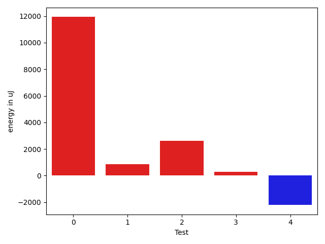
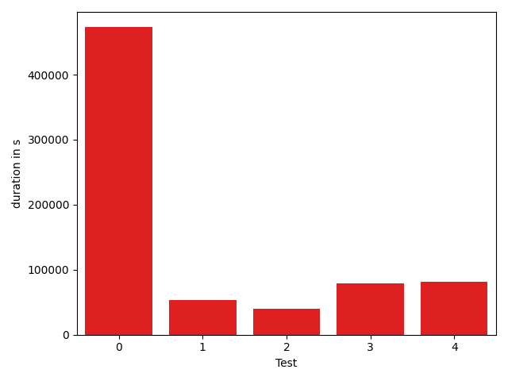

# gson ada597

https://github.com/google/gson/commit/ada597

## Delta Energy per test method

| ID | EnergyV1 | EnergyV2 | DeltaEnergy |
| --- | --- | --- | --- |
| 0 | 34898.06370805763 | 41868.050704956055 | 6969.986996898428 |
| 1 | 97407.30522815775 | 131918.1849806286 | 34510.87975247085 |
| 2 | 49260.52866858692 | 72193.20407704292 | 22932.675408455994 |
| 3 | 111442.3116219675 | 49498.22035584751 | -61944.09126611999 |
| 4 | 50433.003196432604 | 36592.04498900569 | -13840.958207426913 |

## Delta Duration per test method

| ID | DurationV1 | DurationsV2 | DeltaDuration |
| --- | --- | --- | --- |
| 0 | 644656.639016968 | 919328.8296051025 | 274672.1905881346 |
| 1 | 3302355.36109436 | 5056723.137745934 | 1754367.7766515738 |
| 2 | 1570646.3342464948 | 2453647.1361676212 | 883000.8019211264 |
| 3 | 4377862.815940568 | 1289474.9351751173 | -3088387.880765451 |
| 4 | 1959192.6991167327 | 1514911.3397915743 | -444281.3593251584 |

## Misc.

| ID | Test Class | Test Method |
| --- | --- | --- |
| 0 | com.google.gson.stream.JsonWriterTest | testPrettyPrintArray |
| 1 | com.google.gson.stream.JsonWriterTest | testTopLevelValueTypes |
| 2 | com.google.gson.stream.JsonWriterTest | testNonFiniteDoubles |
| 3 | com.google.gson.stream.JsonWriterTest | testPrettyPrintObject |
| 4 | com.google.gson.stream.JsonWriterTest | testDoubles |

| Test | IterationV1 | IterationV2 | DeltaIteration |
| --- | --- | --- | --- |
| 0 | 32 | 18 | -14 |
| 1 | 72 | 67 | -5 |
| 2 | 36 | 39 | 3 |
| 3 | 49 | 40 | -9 |
| 4 | 50 | 59 | 9 |

| Time Label | Time (s) |
| --- | --- |
| Selection | 34.77236318588257 |
| Injection | 13.421330213546753 |
| Total | 1364.168655872345 |

