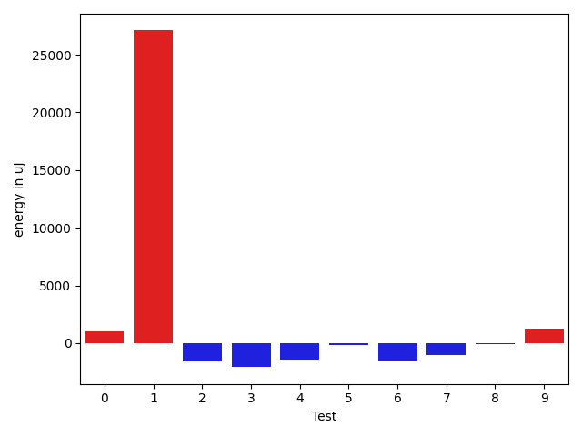
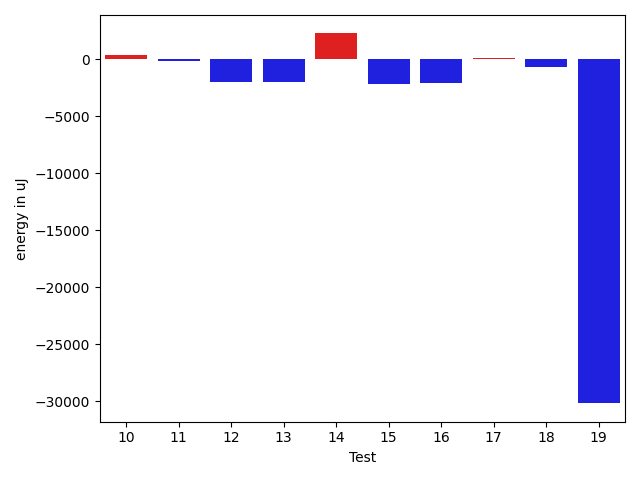
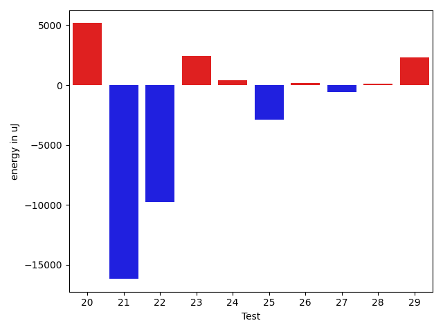
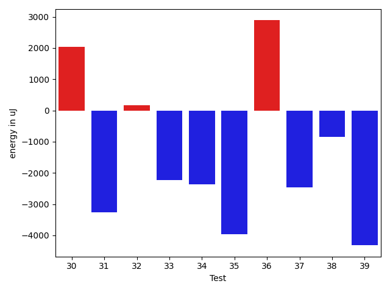
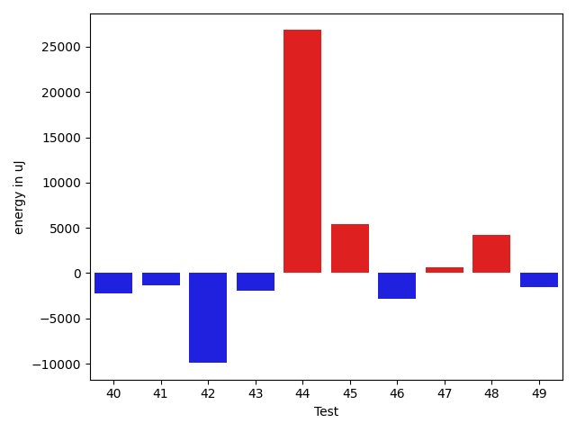
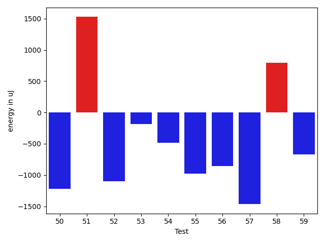
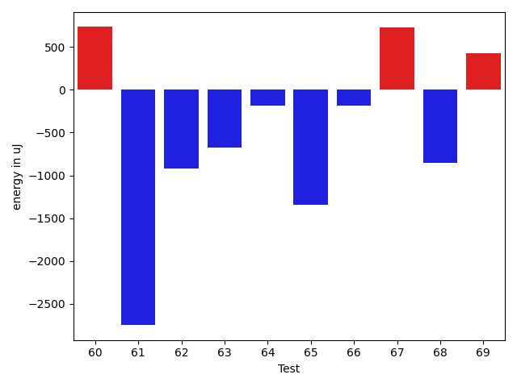

# gson 4f727d

https://github.com/google/gson/commit/4f727d

## Delta Energy per test method

| ID | EnergyV1 | EnergyV2 | DeltaEnergy | σV1 | σV2 |
| --- | --- | --- | --- | --- | --- |
| 0 | 36865 | 37902 | 1037 | 3874.579742436058 | 3886.1512174843197 |
| 1 | 41931 | 69031 | 27100 | 50477.13823808505 | 51456.58372909485 |
| 2 | 38696 | 37109 | -1587 | 7462.7797281173525 | 11038.77115297103 |
| 3 | 38208 | 36132 | -2076 | 3900.1545661678583 | 3003.6510389197074 |
| 4 | 37476 | 36011 | -1465 | 56312.34871817215 | 7316.667338098031 |
| 5 | 36316 | 36133 | -183 | 50219.0358054905 | 55660.38217013466 |
| 6 | 36926 | 35400 | -1526 | 16050.008781466615 | 8053.02532895302 |
| 7 | 38758 | 37719 | -1039 | 21042.22500340278 | 16207.842294485567 |
| 8 | 35095 | 35034 | -61 | 14948.223682415295 | 19048.08871905234 |
| 9 | 36194 | 37414 | 1220 | 17860.185319644403 | 36815.33506051441 |
| 10 | 35034 | 35583 | 549 | 2554.8664602394947 | 2748.193503744536 |
| 11 | 35889 | 35949 | 60 | 8884.218116115917 | 7691.1299432446995 |
| 12 | 35766 | 34119 | -1647 | 6373.572318348807 | 3343.2178389780324 |
| 13 | 35889 | 34973 | -916 | 8534.459838896399 | 5678.643872366594 |
| 14 | 35889 | 35828 | -61 | 5991.764451065825 | 10089.423414070667 |
| 15 | 36072 | 35828 | -244 | 10403.210034447697 | 4520.037280828899 |
| 16 | 37049 | 35278 | -1771 | 2854.526458939197 | 3598.829986128017 |
| 17 | 35645 | 36072 | 427 | 3545.1581058171337 | 2926.694377773058 |
| 18 | 35827 | 34851 | -976 | 3771.2106894381054 | 3118.2805661543985 |
| 19 | 38147 | 37109 | -1038 | 126679.59056897985 | 22527.494076889634 |
| 20 | 36560 | 36987 | 427 | 3353.402500790457 | 30566.570962542788 |
| 21 | 35462 | 34118 | -1344 | 31424.316398518313 | 3052.6581361378417 |
| 22 | 36132 | 37170 | 1038 | 62635.949758950956 | 2841.6744611027107 |
| 23 | 35339 | 35401 | 62 | 4209.177551037382 | 16828.8798784815 |
| 24 | 35217 | 35279 | 62 | 3343.6396454895826 | 3180.5906205291653 |
| 25 | 35278 | 34240 | -1038 | 18678.994625753505 | 11558.047260392621 |
| 26 | 35461 | 35461 | 0 | 4090.572219439351 | 2964.0281405741434 |
| 27 | 36438 | 36438 | 0 | 3667.327650858421 | 3649.5297507928876 |
| 28 | 35340 | 35339 | -1 | 4529.815538031737 | 2931.526211105744 |
| 29 | 38330 | 38635 | 305 | 13690.414126048501 | 17179.979219355882 |
| 30 | 36438 | 37841 | 1403 | 4435.365309544584 | 6753.751943460733 |
| 31 | 36743 | 36072 | -671 | 14739.239856706292 | 10466.352167956511 |
| 32 | 35949 | 35645 | -304 | 7571.827278281226 | 8360.570725225787 |
| 33 | 35340 | 34546 | -794 | 7503.717012575897 | 3396.4541322511072 |
| 34 | 36560 | 35766 | -794 | 12036.163479964567 | 10208.329724298683 |
| 35 | 37597 | 36926 | -671 | 19408.323561653902 | 13957.889310472447 |
| 36 | 37110 | 36438 | -672 | 99328.45712712065 | 111363.0369245857 |
| 37 | 68604 | 66406 | -2198 | 25234.872928860597 | 24166.012662900495 |
| 38 | 41199 | 39002 | -2197 | 17891.24157971518 | 17088.953516085912 |
| 39 | 36560 | 35889 | -671 | 14384.463943829252 | 10708.511242354527 |
| 40 | 37598 | 36194 | -1404 | 9208.322806758535 | 3708.794619329486 |
| 41 | 37415 | 37048 | -367 | 7352.463820611322 | 3828.4071925402427 |
| 42 | 40222 | 38940 | -1282 | 76265.1605122677 | 62936.80075760455 |
| 43 | 37170 | 36133 | -1037 | 5081.064484678195 | 4438.76355176537 |
| 44 | 367919 | 381408 | 13489 | 94041.40965784296 | 125960.85067041479 |
| 45 | 73547 | 71167 | -2380 | 58394.88670826283 | 69986.95115127589 |
| 46 | 37902 | 38269 | 367 | 64226.63096829677 | 59367.579101221934 |
| 47 | 39978 | 37598 | -2380 | 50996.54391649662 | 65098.49122720583 |
| 48 | 38574 | 38574 | 0 | 47013.05029863213 | 52782.67232012429 |
| 49 | 37598 | 36926 | -672 | 6267.859941097196 | 3966.1760556531935 |
| 50 | 43152 | 41931 | -1221 | 22015.314062977373 | 21792.38942413759 |
| 51 | 38330 | 39856 | 1526 | 123154.29034393009 | 140536.7170431123 |
| 52 | 40650 | 39550 | -1100 | 56623.55377170656 | 50018.46093640371 |
| 53 | 37110 | 36926 | -184 | 14156.205760578352 | 13588.346425323707 |
| 54 | 38024 | 37536 | -488 | 5586.389789372647 | 4135.6179607459235 |
| 55 | 39490 | 38513 | -977 | 16779.571069209218 | 13425.322911173638 |
| 56 | 39551 | 38696 | -855 | 66321.09097781416 | 79398.01199740484 |
| 57 | 37109 | 35644 | -1465 | 4219.025913501582 | 4683.325062998967 |
| 58 | 37048 | 37841 | 793 | 3940.784825202811 | 4292.692168092187 |
| 59 | 37781 | 37109 | -672 | 3484.060477110474 | 4034.5134043614607 |
| 60 | 36804 | 37537 | 733 | 3941.297346807464 | 4789.222479949013 |
| 61 | 37781 | 35034 | -2747 | 4041.2385030939326 | 4481.105169362675 |
| 62 | 36926 | 36011 | -915 | 4130.646741024334 | 3116.5687977103403 |
| 63 | 36804 | 36132 | -672 | 4176.155350688111 | 6783.175463067834 |
| 64 | 38452 | 38269 | -183 | 4338.080109482526 | 3921.476578227029 |
| 65 | 39551 | 38208 | -1343 | 86620.63529984775 | 32837.759875514785 |
| 66 | 37719 | 37537 | -182 | 39504.679844517654 | 83996.33050641709 |
| 67 | 36987 | 37719 | 732 | 8134.606409649412 | 7602.305327012588 |
| 68 | 39124 | 38269 | -855 | 80997.76745633649 | 79695.6610655602 |
| 69 | 37659 | 38086 | 427 | 19256.161847842355 | 6176.118528862746 |

## Delta Duration per test method

| ID | DurationV1 | DurationsV2 | DeltaDuration |
| --- | --- | --- | --- |
| 0 | 965970.3090909091 | 967776.3018867924 | 1805.9927958833287 |
| 1 | 1377305.6470588236 | 2353229.3086419753 | 975923.6615831517 |
| 2 | 837926.2291666666 | 872731.0454545454 | 34804.816287878784 |
| 3 | 899208.76 | 938136.7872340425 | 38928.02723404253 |
| 4 | 885615.1363636364 | 685950.5 | -199664.63636363635 |
| 5 | 1316310.2340425532 | 1343052.2564102565 | 26742.022367703263 |
| 6 | 1259562.8133333332 | 1225697.5903614457 | -33865.22297188756 |
| 7 | 1579484.945054945 | 1548231.914893617 | -31253.030161328148 |
| 8 | 1206083.546875 | 1256629.9333333333 | 50546.38645833335 |
| 9 | 1345829.505882353 | 1722706.0722891567 | 376876.5664068037 |
| 10 | 631911.5405405406 | 621766.6538461539 | -10144.886694386718 |
| 11 | 772405.1458333334 | 809917.2608695652 | 37512.115036231815 |
| 12 | 872464.0833333334 | 831536.2884615385 | -40927.794871794875 |
| 13 | 904858.2954545454 | 932435.4583333334 | 27577.16287878796 |
| 14 | 1118660.014084507 | 1163340.0144927537 | 44680.00040824665 |
| 15 | 1090878.0 | 1034923.2105263158 | -55954.789473684155 |
| 16 | 757010.4722222222 | 805519.9393939395 | 48509.4671717172 |
| 17 | 809329.2926829269 | 753126.3863636364 | -56202.906319290516 |
| 18 | 856421.8909090909 | 916695.509090909 | 60273.618181818165 |
| 19 | 1860474.8 | 1035549.2727272727 | -824925.5272727273 |
| 20 | 1033046.1692307693 | 1233998.365079365 | 200952.1958485957 |
| 21 | 1159218.7647058824 | 726293.6486486486 | -432925.11605723377 |
| 22 | 1097507.7073170731 | 732132.5757575758 | -365375.1315594973 |
| 23 | 745886.4146341464 | 862921.4545454546 | 117035.03991130821 |
| 24 | 674174.2702702703 | 690141.7837837838 | 15967.513513513491 |
| 25 | 784815.2580645161 | 678854.4857142858 | -105960.77235023037 |
| 26 | 651273.3428571429 | 739307.1621621621 | 88033.81930501922 |
| 27 | 805583.2926829269 | 787017.1320754717 | -18566.160607455182 |
| 28 | 561364.5 | 589306.48 | 27941.97999999998 |
| 29 | 1073524.3541666667 | 1289553.475 | 216029.12083333335 |
| 30 | 880188.6304347826 | 891661.8913043478 | 11473.260869565187 |
| 31 | 1427490.5714285714 | 1419271.2268041237 | -8219.344624447636 |
| 32 | 1216434.6024096385 | 1254053.4939759036 | 37618.89156626514 |
| 33 | 1029410.6060606061 | 961954.8873239437 | -67455.71873666241 |
| 34 | 1359961.0106382978 | 1335449.1684210526 | -24511.84221724514 |
| 35 | 1566748.3229166667 | 1469384.9278350514 | -97363.39508161531 |
| 36 | 2377283.139784946 | 2486605.4183673467 | 109322.27858240064 |
| 37 | 2155700.9494949495 | 2149239.97979798 | -6460.969696969725 |
| 38 | 1656128.9325842697 | 1665088.3870967743 | 8959.454512504628 |
| 39 | 1402127.8924731184 | 1348575.8602150537 | -53552.03225806472 |
| 40 | 1136584.8142857142 | 1032952.7 | -103632.11428571423 |
| 41 | 1008843.0 | 939439.9838709678 | -69403.01612903224 |
| 42 | 2002346.4266666668 | 1716875.2542372881 | -285471.1724293786 |
| 43 | 1012911.5348837209 | 821933.4285714285 | -190978.1063122924 |
| 44 | 9984302.303030303 | 10810778.484848484 | 826476.1818181816 |
| 45 | 2498372.5454545454 | 2721884.393939394 | 223511.84848484863 |
| 46 | 1349287.6666666667 | 1257209.4583333333 | -92078.20833333349 |
| 47 | 1105889.0681818181 | 1162403.9166666667 | 56514.848484848626 |
| 48 | 1005527.7954545454 | 1176115.1363636365 | 170587.34090909106 |
| 49 | 1078859.59375 | 1003723.8194444445 | -75135.7743055555 |
| 50 | 1864256.268041237 | 1793945.9175257732 | -70310.35051546386 |
| 51 | 2129732.8928571427 | 3064644.8139534886 | 934911.9210963459 |
| 52 | 1831861.3125 | 1835940.7681159421 | 4079.4556159421336 |
| 53 | 1359184.858974359 | 1251724.148148148 | -107460.71082621091 |
| 54 | 1117467.7246376812 | 1117109.0289855073 | -358.69565217383206 |
| 55 | 1140317.6226415094 | 1154766.121212121 | 14448.4985706117 |
| 56 | 1770802.2295081967 | 2099058.5263157897 | 328256.29680759297 |
| 57 | 1001919.3802816902 | 1016727.4857142858 | 14808.105432595592 |
| 58 | 796192.119047619 | 826174.1 | 29981.980952380924 |
| 59 | 580822.9642857143 | 603313.5263157894 | 22490.562030075118 |
| 60 | 643271.4705882353 | 624126.8857142857 | -19144.584873949643 |
| 61 | 733673.0 | 717360.6333333333 | -16312.366666666698 |
| 62 | 747111.2941176471 | 695992.5952380953 | -51118.69887955184 |
| 63 | 909794.8070175438 | 915588.3265306122 | 5793.519513068371 |
| 64 | 761785.8048780488 | 715375.4102564103 | -46410.39462163858 |
| 65 | 1958672.1944444445 | 1041765.3023255814 | -916906.8921188631 |
| 66 | 1204411.0196078431 | 2510779.5849056602 | 1306368.565297817 |
| 67 | 844910.1904761905 | 991272.3181818182 | 146362.1277056277 |
| 68 | 2212261.8139534886 | 2151743.75 | -60518.0639534886 |
| 69 | 893208.1891891892 | 694675.1111111111 | -198533.0780780781 |

## Misc.

| ID | Test Class | Test Method |
| --- | --- | --- |
| 0 | com.google.gson.functional.CustomDeserializerTest | testDefaultConstructorNotCalledOnField |
| 1 | com.google.gson.functional.JsonParserTest | testBadTypeForDeserializingCustomTree |
| 2 | com.google.gson.functional.JsonParserTest | testBadFieldTypeForCustomDeserializerCustomTree |
| 3 | com.google.gson.functional.JsonParserTest | testBadFieldTypeForDeserializingCustomTree |
| 4 | com.google.gson.functional.JsonParserTest | testDeserializingCustomTree |
| 5 | com.google.gson.functional.JsonParserTest | testChangingCustomTreeAndDeserializing |
| 6 | com.google.gson.functional.ObjectTest | testDirectedAcyclicGraphDeserialization |
| 7 | com.google.gson.functional.ObjectTest | testArrayOfArraysDeserialization |
| 8 | com.google.gson.functional.ObjectTest | testStringFieldWithNumberValueDeserialization |
| 9 | com.google.gson.functional.ObjectTest | testSubInterfacesOfCollectionDeserialization |
| 10 | com.google.gson.functional.ObjectTest | testPrivateNoArgConstructorDeserialization |
| 11 | com.google.gson.functional.ObjectTest | testClassWithTransientFieldsDeserializationTransientFieldsPassedInJsonAreIgnored |
| 12 | com.google.gson.functional.ObjectTest | testPrimitiveArrayInAnObjectDeserialization |
| 13 | com.google.gson.functional.ObjectTest | testNullArraysDeserialization |
| 14 | com.google.gson.functional.ObjectTest | testArrayOfObjectsDeserialization |
| 15 | com.google.gson.functional.ObjectTest | testInheritenceDeserialization |
| 16 | com.google.gson.functional.ObjectTest | testBagOfPrimitiveWrappersDeserialization |
| 17 | com.google.gson.functional.ObjectTest | testBagOfPrimitivesDeserialization |
| 18 | com.google.gson.functional.ObjectTest | testInnerClassDeserialization |
| 19 | com.google.gson.functional.ObjectTest | testJsonInSingleQuotesDeserialization |
| 20 | com.google.gson.functional.ObjectTest | testNestedDeserialization |
| 21 | com.google.gson.functional.ObjectTest | testEmptyCollectionInAnObjectDeserialization |
| 22 | com.google.gson.functional.ObjectTest | testJsonInMixedQuotesDeserialization |
| 23 | com.google.gson.functional.ObjectTest | testClassWithTransientFieldsDeserialization |
| 24 | com.google.gson.functional.ObjectTest | testClassWithEnumFieldDeserialization |
| 25 | com.google.gson.functional.ObjectTest | testNullObjectFieldsDeserialization |
| 26 | com.google.gson.functional.ObjectTest | testObjectFieldNamesWithoutQuotesDeserialization |
| 27 | com.google.gson.functional.ObjectTest | testNullFieldsDeserialization |
| 28 | com.google.gson.functional.ObjectTest | testNullPrimitiveFieldsDeserialization |
| 29 | com.google.gson.functional.NullObjectAndFieldTest | testExplicitDeserializationOfNulls |
| 30 | com.google.gson.functional.NullObjectAndFieldTest | testNullWrappedPrimitiveMemberDeserialization |
| 31 | com.google.gson.functional.ParameterizedTypesTest | testVariableTypeArrayDeserialization |
| 32 | com.google.gson.functional.ParameterizedTypesTest | testParameterizedTypeWithReaderDeserialization |
| 33 | com.google.gson.functional.ParameterizedTypesTest | testDeepParameterizedTypeDeserialization |
| 34 | com.google.gson.functional.ParameterizedTypesTest | testVariableTypeDeserialization |
| 35 | com.google.gson.functional.ParameterizedTypesTest | testParameterizedTypeGenericArraysDeserialization |
| 36 | com.google.gson.functional.ParameterizedTypesTest | testParameterizedTypeDeserialization |
| 37 | com.google.gson.functional.ParameterizedTypesTest | testVariableTypeFieldsAndGenericArraysDeserialization |
| 38 | com.google.gson.functional.ParameterizedTypesTest | testTypesWithMultipleParametersDeserialization |
| 39 | com.google.gson.functional.ParameterizedTypesTest | testParameterizedTypeWithVariableTypeDeserialization |
| 40 | com.google.gson.functional.VersioningTest | testVersionedGsonMixingSinceAndUntilDeserialization |
| 41 | com.google.gson.functional.VersioningTest | testVersionedClassesDeserialization |
| 42 | com.google.gson.functional.VersioningTest | testVersionedUntilDeserialization |
| 43 | com.google.gson.functional.VersioningTest | testVersionedGsonWithUnversionedClassesDeserialization |
| 44 | com.google.gson.functional.ConcurrencyTest | testMultiThreadDeserialization |
| 45 | com.google.gson.functional.ConcurrencyTest | testSingleThreadDeserialization |
| 46 | com.google.gson.functional.SecurityTest | testNonExecutableJsonDeserialization |
| 47 | com.google.gson.functional.SecurityTest | testJsonWithNonExectuableTokenWithConfiguredGsonDeserialization |
| 48 | com.google.gson.functional.SecurityTest | testJsonWithNonExectuableTokenWithRegularGsonDeserialization |
| 49 | com.google.gson.functional.CollectionTest | testSetDeserialization |
| 50 | com.google.gson.functional.CollectionTest | testWildcardCollectionField |
| 51 | com.google.gson.functional.EscapingTest | testEscapingQuotesInStringArray |
| 52 | com.google.gson.functional.EscapingTest | testEscapingObjectFields |
| 53 | com.google.gson.functional.CustomTypeAdaptersTest | testCustomDeserializerForLong |
| 54 | com.google.gson.functional.CustomTypeAdaptersTest | testCustomNestedDeserializers |
| 55 | com.google.gson.functional.EnumTest | testEnumFieldDeserialization |
| 56 | com.google.gson.functional.ArrayTest | testTopLevelArrayOfIntsDeserialization |
| 57 | com.google.gson.functional.ArrayTest | testArrayOfCollectionDeserialization |
| 58 | com.google.gson.functional.ArrayTest | testArrayOfPrimitivesWithCustomTypeAdapter |
| 59 | com.google.gson.functional.ArrayTest | testArrayOfStringsDeserialization |
| 60 | com.google.gson.functional.ArrayTest | testEmptyArrayDeserialization |
| 61 | com.google.gson.functional.ArrayTest | testNullsInArrayDeserialization |
| 62 | com.google.gson.functional.DefaultTypeAdaptersTest | testBigIntegerFieldDeserialization |
| 63 | com.google.gson.functional.DefaultTypeAdaptersTest | testUrlNullDeserialization |
| 64 | com.google.gson.functional.DefaultTypeAdaptersTest | testBigDecimalFieldDeserialization |
| 65 | com.google.gson.functional.ReadersWritersTest | testReaderForDeserialization |
| 66 | com.google.gson.functional.NamingPolicyTest | testGsonWithNonDefaultFieldNamingPolicyDeserialiation |
| 67 | com.google.gson.functional.NamingPolicyTest | testGsonWithSerializedNameFieldNamingPolicyDeserialization |
| 68 | com.google.gson.functional.ExposeFieldsTest | testExposeAnnotationDeserialization |
| 69 | com.google.gson.functional.ExposeFieldsTest | testExposedInterfaceFieldDeserialization |

| Test | IterationV1 | IterationV2 | DeltaIteration |
| --- | --- | --- | --- |
| 0 | 55 | 53 | -2 |
| 1 | 34 | 81 | 47 |
| 2 | 48 | 44 | -4 |
| 3 | 50 | 47 | -3 |
| 4 | 22 | 26 | 4 |
| 5 | 47 | 39 | -8 |
| 6 | 75 | 83 | 8 |
| 7 | 91 | 94 | 3 |
| 8 | 64 | 75 | 11 |
| 9 | 85 | 83 | -2 |
| 10 | 37 | 26 | -11 |
| 11 | 48 | 46 | -2 |
| 12 | 48 | 52 | 4 |
| 13 | 44 | 48 | 4 |
| 14 | 71 | 69 | -2 |
| 15 | 72 | 76 | 4 |
| 16 | 36 | 33 | -3 |
| 17 | 41 | 44 | 3 |
| 18 | 55 | 55 | 0 |
| 19 | 40 | 44 | 4 |
| 20 | 65 | 63 | -2 |
| 21 | 34 | 37 | 3 |
| 22 | 41 | 33 | -8 |
| 23 | 41 | 44 | 3 |
| 24 | 37 | 37 | 0 |
| 25 | 31 | 35 | 4 |
| 26 | 35 | 37 | 2 |
| 27 | 41 | 53 | 12 |
| 28 | 32 | 25 | -7 |
| 29 | 48 | 40 | -8 |
| 30 | 46 | 46 | 0 |
| 31 | 98 | 97 | -1 |
| 32 | 83 | 83 | 0 |
| 33 | 66 | 71 | 5 |
| 34 | 94 | 95 | 1 |
| 35 | 96 | 97 | 1 |
| 36 | 93 | 98 | 5 |
| 37 | 99 | 99 | 0 |
| 38 | 89 | 93 | 4 |
| 39 | 93 | 93 | 0 |
| 40 | 70 | 70 | 0 |
| 41 | 64 | 62 | -2 |
| 42 | 75 | 59 | -16 |
| 43 | 43 | 42 | -1 |
| 44 | 99 | 99 | 0 |
| 45 | 99 | 99 | 0 |
| 46 | 45 | 48 | 3 |
| 47 | 44 | 48 | 4 |
| 48 | 44 | 44 | 0 |
| 49 | 64 | 72 | 8 |
| 50 | 97 | 97 | 0 |
| 51 | 56 | 43 | -13 |
| 52 | 80 | 69 | -11 |
| 53 | 78 | 81 | 3 |
| 54 | 69 | 69 | 0 |
| 55 | 53 | 66 | 13 |
| 56 | 61 | 57 | -4 |
| 57 | 71 | 70 | -1 |
| 58 | 42 | 40 | -2 |
| 59 | 28 | 19 | -9 |
| 60 | 34 | 35 | 1 |
| 61 | 24 | 30 | 6 |
| 62 | 34 | 42 | 8 |
| 63 | 57 | 49 | -8 |
| 64 | 41 | 39 | -2 |
| 65 | 36 | 43 | 7 |
| 66 | 51 | 53 | 2 |
| 67 | 42 | 44 | 2 |
| 68 | 43 | 48 | 5 |
| 69 | 37 | 36 | -1 |

| Time Label | Time (s) |
| --- | --- |
| Selection | 23.72722363471985 |
| Injection | 11.486645698547363 |
| Total | 999.9394309520721 |

