# gson 68f389

https://github.com/google/gson/commit/68f389

## Delta Energy per test method

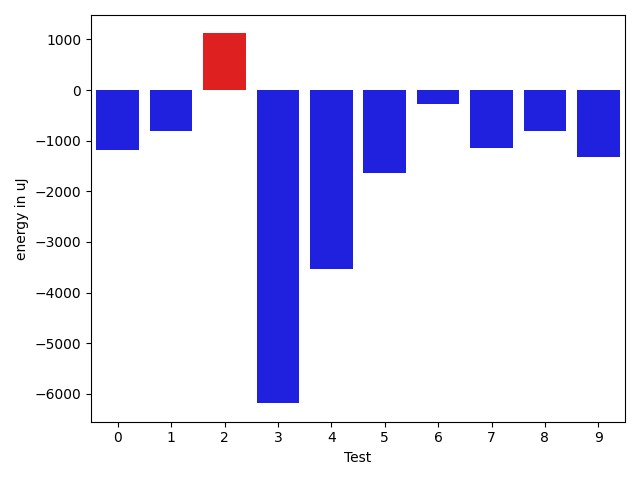

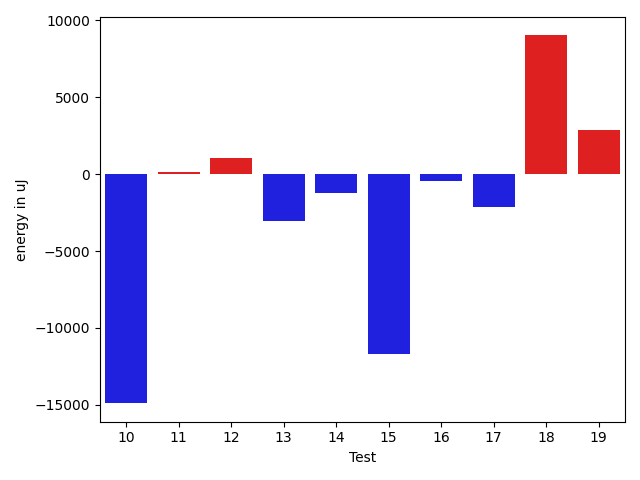

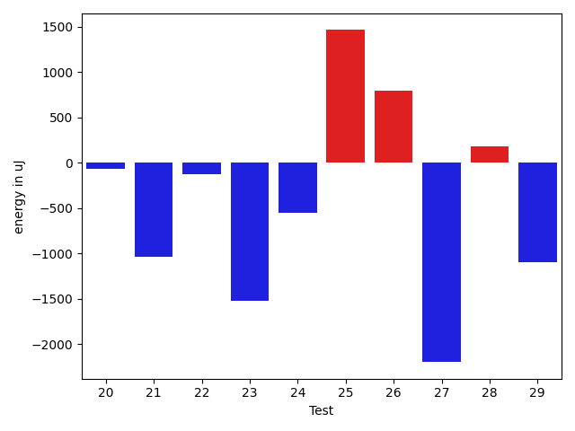

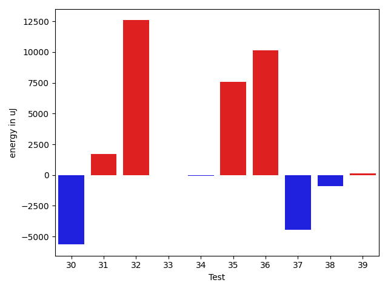

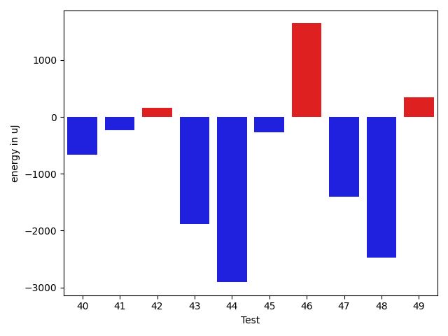

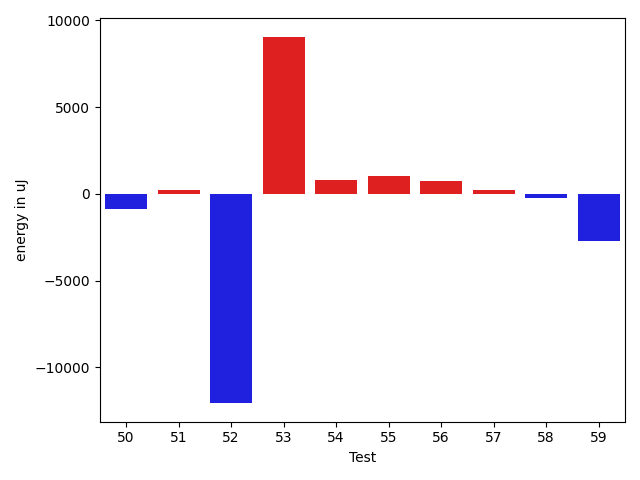

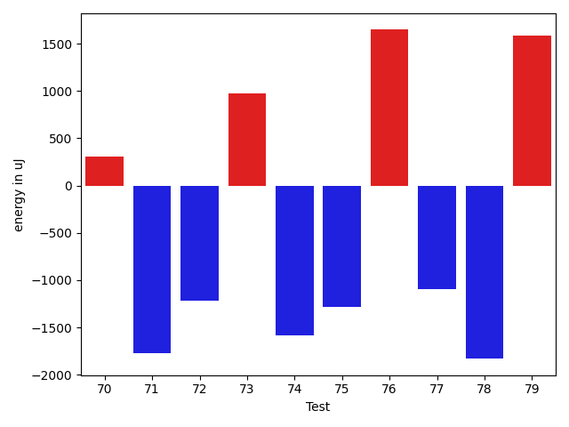

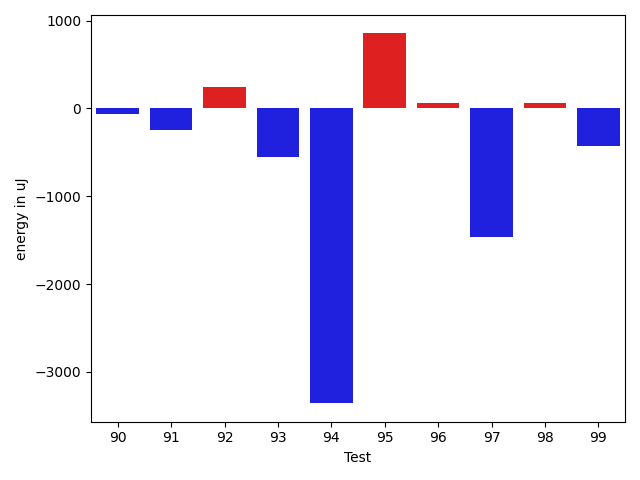

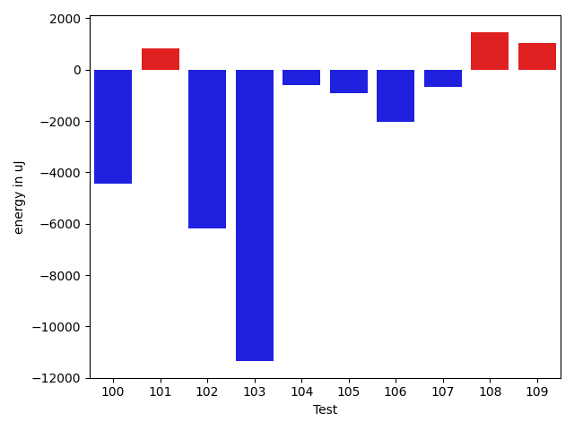

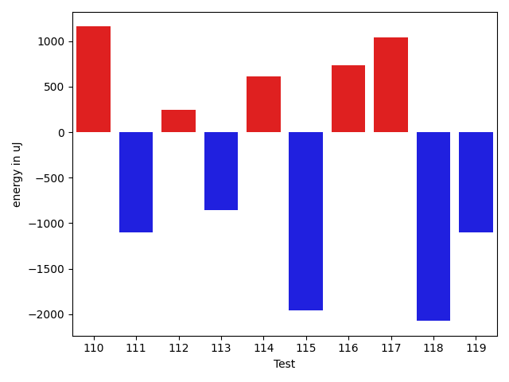

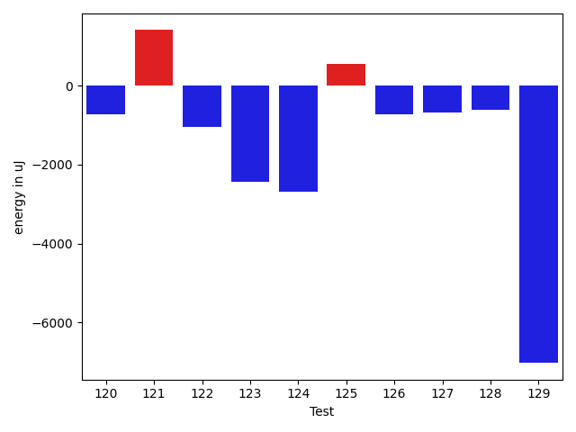

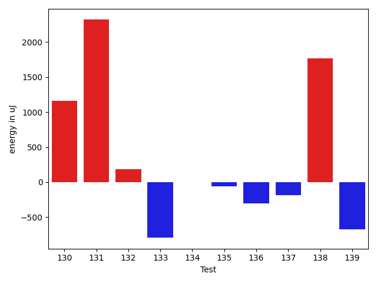

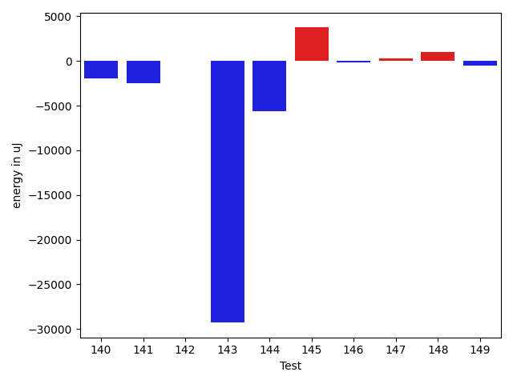

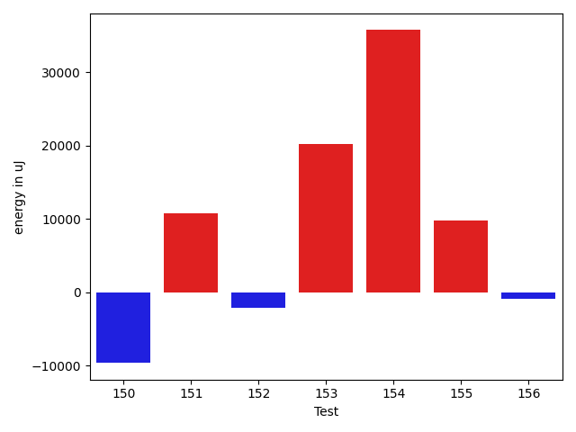

| ID | EnergyV1 | EnergyV2 | DeltaEnergy | σV1 | σV2 |
| --- | --- | --- | --- | --- | --- |
| 0 | 38574 | 38696 | 122 | 87704.19204624218 | 78718.0979521546 |
| 1 | 38025 | 37292 | -733 | 3913.7868174122996 | 4351.548524376121 |
| 2 | 36072 | 35278 | -794 | 8997.16654217419 | 26433.84556931175 |
| 3 | 36987 | 37475 | 488 | 92201.82500210324 | 59878.18476573705 |
| 4 | 35034 | 34302 | -732 | 24889.93824789244 | 14684.112946953552 |
| 5 | 36438 | 34241 | -2197 | 18112.344217958685 | 19030.54204446752 |
| 6 | 34607 | 33691 | -916 | 3176.1863702273477 | 3604.056169595585 |
| 7 | 34729 | 34241 | -488 | 4706.037482260291 | 2840.656156887357 |
| 8 | 34301 | 33325 | -976 | 3652.8136939860115 | 3218.1482036987345 |
| 9 | 36133 | 35217 | -916 | 10353.13617109079 | 10008.224189069962 |
| 10 | 37781 | 37231 | -550 | 144063.84332476874 | 118742.14101800561 |
| 11 | 34790 | 34668 | -122 | 3781.0715499629155 | 5271.696337259487 |
| 12 | 35339 | 34912 | -427 | 5732.410062761896 | 18342.738803793636 |
| 13 | 36316 | 34424 | -1892 | 4281.6659581270615 | 3423.159000230449 |
| 14 | 35828 | 34485 | -1343 | 3903.775976363191 | 3706.475524529765 |
| 15 | 34668 | 33142 | -1526 | 40421.15342829135 | 3656.9767219518853 |
| 16 | 35034 | 34363 | -671 | 3374.4211271466 | 3568.184605843362 |
| 17 | 36194 | 34424 | -1770 | 3654.804800197634 | 3153.3231715663837 |
| 18 | 36255 | 34302 | -1953 | 4261.5471005235995 | 65270.5529870429 |
| 19 | 33569 | 34485 | 916 | 3127.2341148323326 | 22647.941691083557 |
| 20 | 34119 | 34058 | -61 | 3463.8618833207192 | 2990.342258207995 |
| 21 | 34301 | 33265 | -1036 | 6689.089781281218 | 6985.295872521556 |
| 22 | 35522 | 35400 | -122 | 3430.9042290549833 | 5345.260717432454 |
| 23 | 35950 | 34424 | -1526 | 3620.1846787428562 | 3324.508322438183 |
| 24 | 35279 | 34729 | -550 | 3255.7873829959567 | 2859.2909848335507 |
| 25 | 34607 | 36072 | 1465 | 4249.54203736635 | 3235.5929128884372 |
| 26 | 36194 | 36987 | 793 | 4508.229011078134 | 3271.3727500427435 |
| 27 | 36438 | 34240 | -2198 | 3904.772635135391 | 3752.194862569653 |
| 28 | 37415 | 37597 | 182 | 13355.284576578835 | 14011.373800662335 |
| 29 | 36743 | 35645 | -1098 | 22273.14528985261 | 5996.620448604567 |
| 30 | 36255 | 34668 | -1587 | 27243.975287734025 | 3552.1507850878174 |
| 31 | 38147 | 37659 | -488 | 49835.24728488975 | 51571.72260903784 |
| 32 | 37110 | 36437 | -673 | 25169.393657506036 | 59612.42358582236 |
| 33 | 35889 | 36072 | 183 | 3444.987456696012 | 3878.696356303236 |
| 34 | 36744 | 35339 | -1405 | 3716.4880435163514 | 7300.014290133097 |
| 35 | 37780 | 37049 | -731 | 31589.489840321115 | 55502.953240227034 |
| 36 | 34241 | 34363 | 122 | 3313.36478770281 | 40925.11653633035 |
| 37 | 40039 | 38147 | -1892 | 21828.468882037327 | 19168.75439018127 |
| 38 | 36377 | 36498 | 121 | 7075.278069126545 | 4771.61008380004 |
| 39 | 37231 | 36927 | -304 | 42807.46325098149 | 44909.29949155074 |
| 40 | 36499 | 35523 | -976 | 3642.1615205944936 | 3745.623062982982 |
| 41 | 35035 | 34180 | -855 | 3867.805814882761 | 3562.5638882987278 |
| 42 | 35705 | 35584 | -121 | 3647.2148003194743 | 3532.9542624341807 |
| 43 | 36011 | 34790 | -1221 | 3382.2289291155726 | 3028.5094562935583 |
| 44 | 37964 | 34851 | -3113 | 3450.146218278292 | 3067.5377849068386 |
| 45 | 38757 | 37781 | -976 | 3978.008473246775 | 4312.41942308633 |
| 46 | 34790 | 36560 | 1770 | 2821.8983403119887 | 3787.217818015937 |
| 47 | 36926 | 34790 | -2136 | 3993.7546322004087 | 3769.8437146190904 |
| 48 | 38025 | 34546 | -3479 | 3710.045199735853 | 4223.404208823862 |
| 49 | 34485 | 36010 | 1525 | 3659.301828367503 | 3108.4797393469617 |
| 50 | 35889 | 35095 | -794 | 3599.684884324736 | 3411.296295642855 |
| 51 | 37476 | 37353 | -123 | 3983.2248089979826 | 3091.7752721265715 |
| 52 | 35462 | 36194 | 732 | 41382.76051841834 | 2734.893066678805 |
| 53 | 41199 | 41687 | 488 | 83999.19854842531 | 87598.54336689325 |
| 54 | 34790 | 35339 | 549 | 3582.661255752403 | 4565.924953234715 |
| 55 | 34240 | 35767 | 1527 | 3613.589707533834 | 3316.0173754633734 |
| 56 | 36743 | 37475 | 732 | 3809.510371626764 | 4187.718255795111 |
| 57 | 35217 | 35340 | 123 | 3417.110852058373 | 4097.424103214115 |
| 58 | 35156 | 34607 | -549 | 3963.3964222490654 | 3510.254814449548 |
| 59 | 36072 | 34058 | -2014 | 3955.901841974006 | 2949.371674893937 |
| 60 | 35034 | 34058 | -976 | 3964.9237008246155 | 2849.6773014004934 |
| 61 | 35401 | 34485 | -916 | 3964.302444959867 | 3783.9009412034343 |
| 62 | 38452 | 38513 | 61 | 80639.18056390317 | 93958.86187529743 |
| 63 | 34912 | 34851 | -61 | 3431.26791012803 | 3578.6497414972505 |
| 64 | 34424 | 34973 | 549 | 3207.475047821885 | 3229.5699376617504 |
| 65 | 34241 | 33203 | -1038 | 3344.8654423608737 | 3428.0071996801 |
| 66 | 34668 | 34851 | 183 | 70427.81749855654 | 50922.2882968771 |
| 67 | 37048 | 35949 | -1099 | 5456.094172740989 | 7795.682660013397 |
| 68 | 35889 | 37597 | 1708 | 3931.4792480749156 | 4665.996795195367 |
| 69 | 37963 | 36010 | -1953 | 4825.970524872564 | 3660.307229884243 |
| 70 | 34362 | 34667 | 305 | 2751.9406851576646 | 2791.1782346349723 |
| 71 | 37353 | 35583 | -1770 | 4257.587829759515 | 4095.3291169805743 |
| 72 | 36927 | 35706 | -1221 | 3965.4388700140344 | 3977.2886804874847 |
| 73 | 33325 | 34302 | 977 | 4349.912422842556 | 3369.764083186145 |
| 74 | 38147 | 36560 | -1587 | 4288.363536150103 | 3937.1946987243678 |
| 75 | 35461 | 34179 | -1282 | 3208.3468037046514 | 3336.5363907059655 |
| 76 | 34912 | 36560 | 1648 | 3971.842058907818 | 3668.081499047766 |
| 77 | 37292 | 36193 | -1099 | 3958.8248559389435 | 4175.459365576469 |
| 78 | 35156 | 33325 | -1831 | 3045.0329874742 | 2793.8356337794107 |
| 79 | 33509 | 35095 | 1586 | 2014.1747567222872 | 3667.2807449419824 |
| 80 | 34973 | 32776 | -2197 | 3229.3020474504738 | 4004.9501640950116 |
| 81 | 35523 | 32837 | -2686 | 3860.3220036963526 | 3087.8358744847665 |
| 82 | 38696 | 36438 | -2258 | 3837.533981455217 | 3960.6568743117673 |
| 83 | 35095 | 34729 | -366 | 3450.3557657146025 | 2772.8053103110014 |
| 84 | 34119 | 35156 | 1037 | 3943.59428817446 | 4472.686914225831 |
| 85 | 33692 | 34241 | 549 | 2697.7138002721827 | 3287.145593909031 |
| 86 | 35217 | 34912 | -305 | 3806.474554321777 | 3857.1630253551207 |
| 87 | 37598 | 36987 | -611 | 10884.507712649882 | 12571.59130013983 |
| 88 | 38025 | 38513 | 488 | 51045.695170118146 | 47492.038027411276 |
| 89 | 39001 | 38025 | -976 | 20650.621244680086 | 20315.615370388143 |
| 90 | 36438 | 36377 | -61 | 4414.766470663361 | 3587.9738676448164 |
| 91 | 36438 | 36194 | -244 | 4131.865730299465 | 3827.46619563552 |
| 92 | 35949 | 36194 | 245 | 3641.2309810683632 | 3770.151900937024 |
| 93 | 36255 | 35705 | -550 | 6477.56587172888 | 19975.634327347765 |
| 94 | 39001 | 35645 | -3356 | 62937.01644157581 | 3775.422054495265 |
| 95 | 35889 | 36743 | 854 | 24308.816094963742 | 3924.103438276381 |
| 96 | 36621 | 36682 | 61 | 3652.647073466828 | 31874.710100322096 |
| 97 | 38024 | 36560 | -1464 | 3879.6389971147937 | 3495.2843849975247 |
| 98 | 36255 | 36316 | 61 | 13711.892151709037 | 13103.893744080164 |
| 99 | 35400 | 34973 | -427 | 7861.34355882707 | 9301.235851657739 |
| 100 | 35522 | 35400 | -122 | 44955.8941627357 | 32140.647128897715 |
| 101 | 36438 | 36010 | -428 | 10172.558184487934 | 12055.504746220666 |
| 102 | 35523 | 35950 | 427 | 90076.21824553079 | 73621.96022520892 |
| 103 | 69458 | 63354 | -6104 | 70768.31774697245 | 23408.885981293857 |
| 104 | 37720 | 37964 | 244 | 15920.734704107277 | 15250.287556278181 |
| 105 | 36193 | 35339 | -854 | 11473.071725394399 | 11379.211387184947 |
| 106 | 40038 | 38635 | -1403 | 19965.69628610944 | 17539.55096695605 |
| 107 | 36682 | 35522 | -1160 | 5330.822103573517 | 5166.369283671031 |
| 108 | 34729 | 36316 | 1587 | 6731.655906685396 | 6967.012704357281 |
| 109 | 35522 | 36804 | 1282 | 3551.36486736344 | 3372.8044447050625 |
| 110 | 36255 | 37414 | 1159 | 3885.192651752354 | 26871.29266381457 |
| 111 | 39001 | 37903 | -1098 | 74730.7214748724 | 48638.55596269681 |
| 112 | 36072 | 36316 | 244 | 5086.195511323936 | 3576.1983865476363 |
| 113 | 37964 | 37109 | -855 | 3918.9304278607324 | 5722.514914610555 |
| 114 | 36865 | 37476 | 611 | 3845.15784023576 | 3337.9566196654105 |
| 115 | 39307 | 37353 | -1954 | 78693.5277618814 | 41404.980512279224 |
| 116 | 35949 | 36682 | 733 | 6758.201202771552 | 6259.838508100668 |
| 117 | 36865 | 37902 | 1037 | 47022.743424947555 | 51293.286377297874 |
| 118 | 39245 | 37171 | -2074 | 108647.48219054443 | 101993.46496156392 |
| 119 | 38452 | 37353 | -1099 | 89563.15922370189 | 6513.3510039936045 |
| 120 | 39185 | 38452 | -733 | 50740.311109888695 | 65297.03589011247 |
| 121 | 35401 | 36804 | 1403 | 4399.368551708514 | 3690.628918844184 |
| 122 | 36804 | 35767 | -1037 | 4183.313019943638 | 3658.23915153904 |
| 123 | 39673 | 37231 | -2442 | 42711.12893277369 | 3086.338097698596 |
| 124 | 39123 | 36438 | -2685 | 2727.7033118249356 | 3053.8156545748143 |
| 125 | 37292 | 37842 | 550 | 4263.7298303629095 | 3682.992475615752 |
| 126 | 36438 | 35706 | -732 | 50839.0953263239 | 53533.30098265324 |
| 127 | 37414 | 36743 | -671 | 6811.857445660471 | 13491.39967345082 |
| 128 | 35339 | 34729 | -610 | 25417.943334274198 | 3605.4202463855845 |
| 129 | 149475 | 142455 | -7020 | 30856.25678991201 | 30988.438453776424 |
| 130 | 38513 | 39673 | 1160 | 65862.3552608758 | 70174.59183843427 |
| 131 | 33386 | 35706 | 2320 | 3738.8994851880557 | 3805.82785543762 |
| 132 | 34606 | 34790 | 184 | 3558.800528267916 | 27136.44502489385 |
| 133 | 35157 | 34363 | -794 | 3391.248433205317 | 4310.196155556613 |
| 134 | 36744 | 36744 | 0 | 3655.5093330991513 | 3113.007757713876 |
| 135 | 34180 | 34118 | -62 | 3491.959542491866 | 3331.0393662639294 |
| 136 | 35217 | 34912 | -305 | 4379.581027723435 | 4188.373767962103 |
| 137 | 35278 | 35096 | -182 | 4757.442145240037 | 28227.877382887524 |
| 138 | 35705 | 37475 | 1770 | 3431.03668785134 | 3541.8655003009676 |
| 139 | 36377 | 35706 | -671 | 3357.9788789134354 | 3617.1542799645918 |
| 140 | 35095 | 33142 | -1953 | 4785.547028548459 | 3983.349523366751 |
| 141 | 36194 | 33691 | -2503 | 2757.8503172668707 | 4710.010208056879 |
| 142 | 34668 | 34729 | 61 | 3161.232557132869 | 3243.0212121415425 |
| 143 | 376158 | 346862 | -29296 | 131792.81512180017 | 124295.54340763422 |
| 144 | 67870 | 62255 | -5615 | 48042.96072577584 | 41098.26648218755 |
| 145 | 69214 | 72998 | 3784 | 24958.180186708745 | 25081.562460115383 |
| 146 | 38086 | 37964 | -122 | 58936.73458328222 | 41797.111119825146 |
| 147 | 36926 | 37232 | 306 | 37152.8550528836 | 4412.456733679413 |
| 148 | 37598 | 38574 | 976 | 96975.26773627999 | 92739.20829812165 |
| 149 | 37231 | 36682 | -549 | 3708.071965820472 | 23975.682432211117 |
| 150 | 38635 | 38391 | -244 | 70077.85804086261 | 52233.06523165494 |
| 151 | 39490 | 39490 | 0 | 83313.39762201434 | 85354.98987604411 |
| 152 | 39672 | 38147 | -1525 | 55371.82692054002 | 57361.39562829135 |
| 153 | 38086 | 38513 | 427 | 95947.84344366475 | 125302.07356046533 |
| 154 | 37780 | 38024 | 244 | 4220.095012414496 | 80206.30354816261 |
| 155 | 38086 | 37903 | -183 | 106052.12336813274 | 114945.61686214987 |
| 156 | 39307 | 37842 | -1465 | 3659.184612382928 | 3010.392754300906 |

## Delta Duration per test method

| ID | DurationV1 | DurationsV2 | DeltaDuration |
| --- | --- | --- | --- |
| 0 | 1511345.53125 | 1560492.3484848484 | 49146.81723484839 |
| 1 | 760138.4468085107 | 820495.16 | 60356.71319148934 |
| 2 | 1107380.5675675676 | 1165993.8533333333 | 58613.2857657657 |
| 3 | 1908754.3820224719 | 1737561.1590909092 | -171193.2229315627 |
| 4 | 1149838.4736842106 | 1050361.5166666666 | -99476.95701754396 |
| 5 | 1420858.21686747 | 1359793.064102564 | -61065.15276490594 |
| 6 | 780316.7894736842 | 782577.26 | 2260.470526315854 |
| 7 | 865089.9821428572 | 807165.8245614035 | -57924.15758145368 |
| 8 | 665430.1025641026 | 578819.4642857143 | -86610.6382783883 |
| 9 | 1149451.71875 | 1114054.8382352942 | -35396.88051470579 |
| 10 | 2480117.3255813955 | 2159879.6875 | -320237.63808139553 |
| 11 | 974533.8805970149 | 969242.4852941176 | -5291.395302897319 |
| 12 | 964965.2131147541 | 1061914.7971014492 | 96949.58398669516 |
| 13 | 682536.2619047619 | 628669.0789473684 | -53867.18295739347 |
| 14 | 701861.7567567568 | 634448.4102564103 | -67413.34650034655 |
| 15 | 819166.6857142857 | 511734.75 | -307431.9357142857 |
| 16 | 555742.4 | 575714.5357142857 | 19972.135714285658 |
| 17 | 768768.717948718 | 686741.3953488372 | -82027.32259988075 |
| 18 | 627258.0217391305 | 973163.35 | 345905.3282608695 |
| 19 | 826046.4339622641 | 888189.6140350878 | 62143.180072823656 |
| 20 | 554190.8064516129 | 571562.0571428571 | 17371.250691244262 |
| 21 | 664301.2857142857 | 588681.0 | -75620.28571428568 |
| 22 | 663907.3157894737 | 669745.9189189189 | 5838.603129445226 |
| 23 | 698627.8275862068 | 664631.6829268293 | -33996.14465937752 |
| 24 | 758129.8823529412 | 750084.7045454546 | -8045.177807486616 |
| 25 | 451395.5 | 433163.86363636365 | -18231.636363636353 |
| 26 | 857162.5102040817 | 876588.5833333334 | 19426.073129251716 |
| 27 | 957819.8771929825 | 917869.5555555555 | -39950.32163742697 |
| 28 | 1184916.5915492957 | 1196164.6025641025 | 11248.011014806805 |
| 29 | 1077477.6603773586 | 932058.2295081967 | -145419.43086916185 |
| 30 | 987127.1176470588 | 844809.1818181818 | -142317.93582887703 |
| 31 | 1309151.25 | 1372613.152542373 | 63461.90254237293 |
| 32 | 969031.1911764706 | 1484438.857142857 | 515407.66596638644 |
| 33 | 703198.4385964912 | 758515.7 | 55317.26140350872 |
| 34 | 938254.42 | 933871.4310344828 | -4382.988965517259 |
| 35 | 1363500.0 | 1584544.4507042253 | 221044.45070422534 |
| 36 | 972385.45 | 1241065.2063492064 | 268679.75634920644 |
| 37 | 1658669.9894736842 | 1653751.125 | -4918.864473684225 |
| 38 | 977329.8548387097 | 969114.5733333334 | -8215.281505376333 |
| 39 | 1291269.015625 | 1341607.1323529412 | 50338.116727941204 |
| 40 | 787992.431372549 | 798622.8431372549 | 10630.411764705903 |
| 41 | 1001907.6551724138 | 1065056.3606557378 | 63148.70548332401 |
| 42 | 815590.7454545455 | 768938.948275862 | -46651.79717868345 |
| 43 | 815253.387755102 | 872478.4090909091 | 57225.02133580705 |
| 44 | 483763.0 | 506853.5172413793 | 23090.517241379304 |
| 45 | 501813.9090909091 | 550360.0 | 48546.09090909088 |
| 46 | 459497.7083333333 | 478036.81481481483 | 18539.106481481518 |
| 47 | 470588.8 | 484843.9285714286 | 14255.128571428591 |
| 48 | 441830.0 | 446073.0 | 4243.0 |
| 49 | 485557.125 | 449149.8333333333 | -36407.291666666686 |
| 50 | 457772.9411764706 | 430374.0833333333 | -27398.857843137288 |
| 51 | 483701.1304347826 | 449121.05555555556 | -34580.07487922703 |
| 52 | 961706.304347826 | 451136.4761904762 | -510569.82815734984 |
| 53 | 1664928.111111111 | 2094392.423076923 | 429464.311965812 |
| 54 | 432653.85714285716 | 438955.78571428574 | 6301.92857142858 |
| 55 | 690717.3529411765 | 429729.25 | -260988.1029411765 |
| 56 | 735264.4102564103 | 655482.7567567568 | -79781.65349965345 |
| 57 | 508286.85714285716 | 534305.56 | 26018.702857142896 |
| 58 | 750125.7272727273 | 750959.5689655172 | 833.8416927899234 |
| 59 | 495828.3 | 501115.6 | 5287.299999999988 |
| 60 | 460518.4074074074 | 490580.52173913043 | 30062.114331723016 |
| 61 | 563464.9393939395 | 522032.23076923075 | -41432.7086247087 |
| 62 | 1891177.7555555555 | 1650239.0571428572 | -240938.69841269823 |
| 63 | 448470.5 | 475150.0 | 26679.5 |
| 64 | 419223.64 | 438550.3076923077 | 19326.667692307674 |
| 65 | 479899.85 | 532545.6086956522 | 52645.75869565224 |
| 66 | 1135740.8275862068 | 1191664.5454545454 | 55923.71786833857 |
| 67 | 919552.1090909091 | 946152.0243902439 | 26599.915299334796 |
| 68 | 558719.3548387097 | 489271.03125 | -69448.3235887097 |
| 69 | 611553.2 | 585976.8857142857 | -25576.314285714296 |
| 70 | 444459.94736842107 | 446202.9375 | 1742.990131578932 |
| 71 | 609405.9736842106 | 618919.5 | 9513.526315789437 |
| 72 | 514002.1818181818 | 502234.04545454547 | -11768.136363636353 |
| 73 | 491098.04 | 470282.26923076925 | -20815.77076923073 |
| 74 | 555675.4090909091 | 523451.8214285714 | -32223.58766233764 |
| 75 | 481130.1379310345 | 506118.70588235295 | 24988.56795131846 |
| 76 | 448623.2727272727 | 456182.8947368421 | 7559.622009569372 |
| 77 | 613066.2571428572 | 522580.0 | -90486.25714285718 |
| 78 | 580066.1025641026 | 603706.2972972973 | 23640.194733194658 |
| 79 | 452817.55555555556 | 518611.6666666667 | 65794.11111111112 |
| 80 | 676292.3235294118 | 654840.275862069 | -21452.04766734282 |
| 81 | 425520.0416666667 | 468061.35714285716 | 42541.31547619047 |
| 82 | 616799.5 | 641661.5757575758 | 24862.075757575803 |
| 83 | 431498.7 | 412196.4666666667 | -19302.233333333337 |
| 84 | 441760.75 | 466445.4210526316 | 24684.671052631573 |
| 85 | 454280.3548387097 | 467252.2 | 12971.845161290315 |
| 86 | 542998.275862069 | 564163.0 | 21164.724137931014 |
| 87 | 894013.4262295082 | 955311.0153846154 | 61297.589155107155 |
| 88 | 1091909.1290322582 | 971325.4324324324 | -120583.69659982575 |
| 89 | 1109913.2708333333 | 1122026.8163265307 | 12113.545493197395 |
| 90 | 785500.4468085107 | 785786.0188679246 | 285.57205941388384 |
| 91 | 830430.490909091 | 769347.3125 | -61083.178409090964 |
| 92 | 783016.2340425532 | 894748.6538461539 | 111732.41980360064 |
| 93 | 1161727.9518072288 | 1215829.5384615385 | 54101.58665430965 |
| 94 | 1472489.3103448276 | 912711.1132075472 | -559778.1971372804 |
| 95 | 915514.0943396227 | 832758.1551724138 | -82755.93916720885 |
| 96 | 837180.0545454546 | 999638.131147541 | 162458.07660208642 |
| 97 | 802243.8863636364 | 799228.0327868853 | -3015.8535767510766 |
| 98 | 1342222.3854166667 | 1354358.193877551 | 12135.808460884262 |
| 99 | 1080150.6455696202 | 1106343.3 | 26192.65443037986 |
| 100 | 1663831.3655913977 | 1438025.5555555555 | -225805.81003584224 |
| 101 | 1388278.0103092783 | 1403797.1538461538 | 15519.14353687549 |
| 102 | 2119322.4395604394 | 1961351.6923076923 | -157970.74725274718 |
| 103 | 2236394.6464646463 | 2014884.7676767677 | -221509.87878787867 |
| 104 | 1464769.2738095238 | 1462331.2471910112 | -2438.02661851258 |
| 105 | 1290875.5652173914 | 1274721.8969072164 | -16153.668310174951 |
| 106 | 1654034.7373737374 | 1676516.9795918367 | 22482.2422180993 |
| 107 | 941672.7096774194 | 973931.3235294118 | 32258.613851992413 |
| 108 | 944971.1095890411 | 1000074.6825396825 | 55103.57295064139 |
| 109 | 824892.8305084746 | 898757.5666666667 | 73864.73615819204 |
| 110 | 644058.3939393939 | 767476.3 | 123417.90606060612 |
| 111 | 2120774.5 | 1532432.75 | -588341.75 |
| 112 | 799293.2941176471 | 770878.6279069767 | -28414.666210670373 |
| 113 | 752879.9047619047 | 763561.1489361703 | 10681.244174265536 |
| 114 | 563982.8571428572 | 635673.8620689656 | 71691.0049261084 |
| 115 | 1945677.85 | 1062482.111111111 | -883195.7388888891 |
| 116 | 762768.7714285714 | 702912.125 | -59856.64642857143 |
| 117 | 1221992.2424242424 | 1195581.5405405406 | -26410.70188370184 |
| 118 | 2349262.1428571427 | 1748306.677419355 | -600955.4654377878 |
| 119 | 1071674.076923077 | 609669.5142857142 | -462004.56263736275 |
| 120 | 1420679.3404255318 | 1537159.9259259258 | 116480.585500394 |
| 121 | 683264.8918918918 | 710267.0294117647 | 27002.137519872864 |
| 122 | 930422.5862068966 | 964361.8181818182 | 33939.231974921655 |
| 123 | 1028028.2857142857 | 728246.6818181818 | -299781.6038961039 |
| 124 | 905048.8947368421 | 648862.2962962963 | -256186.59844054584 |
| 125 | 692455.7142857143 | 665496.4516129033 | -26959.262672811048 |
| 126 | 1262456.9268292682 | 1300263.1081081082 | 37806.18127883994 |
| 127 | 761639.575 | 881282.5 | 119642.92500000005 |
| 128 | 1167713.4125 | 1219133.5789473683 | 51420.16644736822 |
| 129 | 4704598.151515151 | 4693618.404040404 | -10979.74747474771 |
| 130 | 1444462.9545454546 | 1566427.3103448276 | 121964.355799373 |
| 131 | 628422.8333333334 | 619546.4411764706 | -8876.39215686277 |
| 132 | 641589.075 | 768866.358974359 | 127277.28397435904 |
| 133 | 748017.8510638297 | 734321.675 | -13696.176063829684 |
| 134 | 596044.5833333334 | 571688.4090909091 | -24356.174242424313 |
| 135 | 703096.12 | 693438.68 | -9657.439999999944 |
| 136 | 652813.6111111111 | 626671.9285714285 | -26141.682539682603 |
| 137 | 617708.6428571428 | 737817.3666666667 | 120108.72380952386 |
| 138 | 546480.6129032258 | 548996.8333333334 | 2516.2204301075544 |
| 139 | 503762.52173913043 | 461315.347826087 | -42447.17391304346 |
| 140 | 721855.2857142857 | 891104.8571428572 | 169249.57142857148 |
| 141 | 537899.3571428572 | 506840.2 | -31059.157142857148 |
| 142 | 531597.6470588235 | 466089.48 | -65508.167058823514 |
| 143 | 10720575.484848484 | 10333240.787878787 | -387334.69696969725 |
| 144 | 2152515.303030303 | 2141081.224489796 | -11434.078540507238 |
| 145 | 2112032.777777778 | 2170606.868686869 | 58574.090909090824 |
| 146 | 1573858.294117647 | 1451025.6607142857 | -122832.63340336131 |
| 147 | 685013.4090909091 | 469214.8947368421 | -215798.51435406698 |
| 148 | 1819302.0344827587 | 2294341.090909091 | 475039.0564263321 |
| 149 | 458950.25925925927 | 643849.6153846154 | 184899.3561253561 |
| 150 | 1772005.3404255318 | 1463211.0 | -308794.34042553185 |
| 151 | 1897057.0681818181 | 2349127.1142857145 | 452070.04610389634 |
| 152 | 1846147.0508474577 | 1859782.105263158 | 13635.054415700259 |
| 153 | 2022003.375 | 2405849.285714286 | 383845.9107142859 |
| 154 | 729864.5675675676 | 2055188.0 | 1325323.4324324324 |
| 155 | 1698245.5625 | 1849747.0 | 151501.4375 |
| 156 | 557169.35 | 466284.85714285716 | -90884.49285714282 |

## Misc.

| ID | Test Class | Test Method |
| --- | --- | --- |
| 0 | com.google.gson.functional.CustomDeserializerTest | testDefaultConstructorNotCalledOnObject |
| 1 | com.google.gson.functional.CustomDeserializerTest | testDefaultConstructorNotCalledOnField |
| 2 | com.google.gson.functional.ObjectTest | testDirectedAcyclicGraphDeserialization |
| 3 | com.google.gson.functional.ObjectTest | testArrayOfArraysDeserialization |
| 4 | com.google.gson.functional.ObjectTest | testStringFieldWithNumberValueDeserialization |
| 5 | com.google.gson.functional.ObjectTest | testSubInterfacesOfCollectionDeserialization |
| 6 | com.google.gson.functional.ObjectTest | testPrimitiveArrayInAnObjectDeserialization |
| 7 | com.google.gson.functional.ObjectTest | testNullArraysDeserialization |
| 8 | com.google.gson.functional.ObjectTest | testObjectFieldNamesWithoutQuotesDeserialization |
| 9 | com.google.gson.functional.ObjectTest | testArrayOfObjectsDeserialization |
| 10 | com.google.gson.functional.ObjectTest | testJsonInSingleQuotesDeserialization |
| 11 | com.google.gson.functional.ObjectTest | testNestedDeserialization |
| 12 | com.google.gson.functional.ObjectTest | testInheritenceDeserialization |
| 13 | com.google.gson.functional.ObjectTest | testBagOfPrimitiveWrappersDeserialization |
| 14 | com.google.gson.functional.ObjectTest | testJsonInMixedQuotesDeserialization |
| 15 | com.google.gson.functional.ObjectTest | testNullPrimitiveFieldsDeserialization |
| 16 | com.google.gson.functional.ObjectTest | testPrivateNoArgConstructorDeserialization |
| 17 | com.google.gson.functional.ObjectTest | testBagOfPrimitivesDeserialization |
| 18 | com.google.gson.functional.ObjectTest | testClassWithTransientFieldsDeserializationTransientFieldsPassedInJsonAreIgnored |
| 19 | com.google.gson.functional.ObjectTest | testInnerClassDeserialization |
| 20 | com.google.gson.functional.ObjectTest | testNullObjectFieldsDeserialization |
| 21 | com.google.gson.functional.ObjectTest | testEmptyCollectionInAnObjectDeserialization |
| 22 | com.google.gson.functional.ObjectTest | testClassWithTransientFieldsDeserialization |
| 23 | com.google.gson.functional.ObjectTest | testClassWithEnumFieldDeserialization |
| 24 | com.google.gson.functional.ObjectTest | testNullFieldsDeserialization |
| 25 | com.google.gson.functional.ObjectTest | testTopLevelEnumDeserialization |
| 26 | com.google.gson.functional.CustomTypeAdaptersTest | testCustomAdapterInvokedForMapElementDeserialization |
| 27 | com.google.gson.functional.CustomTypeAdaptersTest | testCustomNestedDeserializers |
| 28 | com.google.gson.functional.CustomTypeAdaptersTest | testCustomDeserializerForLong |
| 29 | com.google.gson.functional.CustomTypeAdaptersTest | testCustomAdapterInvokedForCollectionElementDeserialization |
| 30 | com.google.gson.functional.CustomTypeAdaptersTest | testCustomByteArrayDeserializerAndInstanceCreator |
| 31 | com.google.gson.functional.CustomTypeAdaptersTest | testCustomDeserializers |
| 32 | com.google.gson.functional.CollectionTest | testNullsInListDeserialization |
| 33 | com.google.gson.functional.CollectionTest | testRawCollectionOfBagOfPrimitivesNotAllowed |
| 34 | com.google.gson.functional.CollectionTest | testCollectionOfEnumsDeserialization |
| 35 | com.google.gson.functional.CollectionTest | testTopLevelCollectionOfIntegersDeserialization |
| 36 | com.google.gson.functional.CollectionTest | testSetDeserialization |
| 37 | com.google.gson.functional.CollectionTest | testWildcardCollectionField |
| 38 | com.google.gson.functional.CollectionTest | testTopLevelListOfIntegerCollectionsDeserialization |
| 39 | com.google.gson.functional.CollectionTest | testRawCollectionDeserializationNotAlllowed |
| 40 | com.google.gson.functional.CollectionTest | testCollectionOfStringsDeserialization |
| 41 | com.google.gson.functional.CollectionTest | testWildcardPrimitiveCollectionDeserilaization |
| 42 | com.google.gson.functional.CollectionTest | testQueueDeserialization |
| 43 | com.google.gson.functional.CollectionTest | testLinkedListDeserialization |
| 44 | com.google.gson.functional.StringTest | testEscapingQuotesInStringSerialization |
| 45 | com.google.gson.functional.StringTest | testSingleQuoteInStringSerialization |
| 46 | com.google.gson.functional.StringTest | testAssignmentCharDeserialization |
| 47 | com.google.gson.functional.StringTest | testSingleQuoteInStringDeserialization |
| 48 | com.google.gson.functional.StringTest | testEscapedBackslashInStringDeserialization |
| 49 | com.google.gson.functional.StringTest | testEscapedCtrlRInStringDeserialization |
| 50 | com.google.gson.functional.StringTest | testEscapingQuotesInStringDeserialization |
| 51 | com.google.gson.functional.StringTest | testEscapedCtrlNInStringDeserialization |
| 52 | com.google.gson.functional.StringTest | testStringValueAsSingleElementArrayDeserialization |
| 53 | com.google.gson.functional.StringTest | testStringValueDeserialization |
| 54 | com.google.gson.functional.StringTest | testJavascriptKeywordsInStringDeserialization |
| 55 | com.google.gson.functional.StringTest | testStringWithEscapedSlashDeserialization |
| 56 | com.google.gson.functional.PrimitiveTest | testPrimitiveBooleanAutoboxedDeserialization |
| 57 | com.google.gson.functional.PrimitiveTest | testDoubleNoFractAsStringRepresentationDeserialization |
| 58 | com.google.gson.functional.PrimitiveTest | testDoubleAsStringRepresentationDeserialization |
| 59 | com.google.gson.functional.PrimitiveTest | testPrimitiveDoubleAutoboxedInASingleElementArrayDeserialization |
| 60 | com.google.gson.functional.PrimitiveTest | testNegativeInfinityFloatDeserialization |
| 61 | com.google.gson.functional.PrimitiveTest | testLargeDoubleDeserialization |
| 62 | com.google.gson.functional.PrimitiveTest | testPrimitiveIntegerAutoboxedInASingleElementArrayDeserialization |
| 63 | com.google.gson.functional.PrimitiveTest | testBigDecimalPreservePrecisionDeserialization |
| 64 | com.google.gson.functional.PrimitiveTest | testSmallValueForBigIntegerDeserialization |
| 65 | com.google.gson.functional.PrimitiveTest | testBigIntegerDeserialization |
| 66 | com.google.gson.functional.PrimitiveTest | testBigDecimalInfinityDeserializationNotSupported |
| 67 | com.google.gson.functional.PrimitiveTest | testPrimitiveDoubleAutoboxedDeserialization |
| 68 | com.google.gson.functional.PrimitiveTest | testPrimitiveLongAutoboxedInASingleElementArrayDeserialization |
| 69 | com.google.gson.functional.PrimitiveTest | testNumberDeserialization |
| 70 | com.google.gson.functional.PrimitiveTest | testBigDecimalNegativeInfinityDeserializationNotSupported |
| 71 | com.google.gson.functional.PrimitiveTest | testPrimitiveIntegerAutoboxedDeserialization |
| 72 | com.google.gson.functional.PrimitiveTest | testDoubleInfinityDeserialization |
| 73 | com.google.gson.functional.PrimitiveTest | testNegativeInfinityDeserialization |
| 74 | com.google.gson.functional.PrimitiveTest | testReallyLongValuesDeserialization |
| 75 | com.google.gson.functional.PrimitiveTest | testFloatInfinityDeserialization |
| 76 | com.google.gson.functional.PrimitiveTest | testBigDecimalDeserialization |
| 77 | com.google.gson.functional.PrimitiveTest | testPrimitiveLongAutoboxedDeserialization |
| 78 | com.google.gson.functional.PrimitiveTest | testBadValueForBigIntegerDeserialization |
| 79 | com.google.gson.functional.PrimitiveTest | testBigDecimalInASingleElementArrayDeserialization |
| 80 | com.google.gson.functional.PrimitiveTest | testOverridingDefaultPrimitiveSerialization |
| 81 | com.google.gson.functional.PrimitiveTest | testBigDecimalNoFractAsStringRepresentationDeserialization |
| 82 | com.google.gson.functional.PrimitiveTest | testPrimitiveBooleanAutoboxedInASingleElementArrayDeserialization |
| 83 | com.google.gson.functional.PrimitiveTest | testBigDecimalAsStringRepresentationDeserialization |
| 84 | com.google.gson.functional.PrimitiveTest | testSmallValueForBigDecimalDeserialization |
| 85 | com.google.gson.functional.PrimitiveTest | testBigIntegerInASingleElementArrayDeserialization |
| 86 | com.google.gson.functional.PrimitiveTest | testLongAsStringDeserialization |
| 87 | com.google.gson.functional.EnumTest | testEnumFieldDeserialization |
| 88 | com.google.gson.functional.EnumTest | testEnumDeserialization |
| 89 | com.google.gson.functional.NullObjectAndFieldTest | testExplicitDeserializationOfNulls |
| 90 | com.google.gson.functional.NullObjectAndFieldTest | testNullWrappedPrimitiveMemberDeserialization |
| 91 | com.google.gson.functional.MapTest | testMapDeserializationWithIntegerKeys |
| 92 | com.google.gson.functional.MapTest | testMapOfMapDeserialization |
| 93 | com.google.gson.functional.MapTest | testParameterizedMapSubclassDeserialization |
| 94 | com.google.gson.functional.MapTest | testMapDeserialization |
| 95 | com.google.gson.functional.MapTest | testMapDeserializationWithWildcardValues |
| 96 | com.google.gson.functional.MapTest | testMapDeserializationWithNullKey |
| 97 | com.google.gson.functional.MapTest | testMapDeserializationWithNullValue |
| 98 | com.google.gson.functional.ParameterizedTypesTest | testVariableTypeArrayDeserialization |
| 99 | com.google.gson.functional.ParameterizedTypesTest | testParameterizedTypeWithReaderDeserialization |
| 100 | com.google.gson.functional.ParameterizedTypesTest | testVariableTypeDeserialization |
| 101 | com.google.gson.functional.ParameterizedTypesTest | testParameterizedTypeGenericArraysDeserialization |
| 102 | com.google.gson.functional.ParameterizedTypesTest | testParameterizedTypeDeserialization |
| 103 | com.google.gson.functional.ParameterizedTypesTest | testVariableTypeFieldsAndGenericArraysDeserialization |
| 104 | com.google.gson.functional.ParameterizedTypesTest | testTypesWithMultipleParametersDeserialization |
| 105 | com.google.gson.functional.ParameterizedTypesTest | testParameterizedTypeWithVariableTypeDeserialization |
| 106 | com.google.gson.functional.ParameterizedTypesTest | testParameterizedTypesWithCustomDeserializer |
| 107 | com.google.gson.functional.ParameterizedTypesTest | testDeepParameterizedTypeDeserialization |
| 108 | com.google.gson.functional.VersioningTest | testVersionedGsonMixingSinceAndUntilDeserialization |
| 109 | com.google.gson.functional.VersioningTest | testVersionedClassesDeserialization |
| 110 | com.google.gson.functional.VersioningTest | testIgnoreLaterVersionClassDeserialization |
| 111 | com.google.gson.functional.VersioningTest | testVersionedUntilDeserialization |
| 112 | com.google.gson.functional.VersioningTest | testVersionedGsonWithUnversionedClassesDeserialization |
| 113 | com.google.gson.functional.ExposeFieldsTest | testNoExposedFieldDeserialization |
| 114 | com.google.gson.functional.ExposeFieldsTest | testExposedInterfaceFieldDeserialization |
| 115 | com.google.gson.functional.ExposeFieldsTest | testExposeAnnotationDeserialization |
| 116 | com.google.gson.GsonTypeAdapterTest | testDefaultTypeAdapterThrowsParseException |
| 117 | com.google.gson.GsonTypeAdapterTest | testTypeAdapterThrowsException |
| 118 | com.google.gson.GsonTypeAdapterTest | testTypeAdapterDoesNotAffectNonAdaptedTypes |
| 119 | com.google.gson.GsonTypeAdapterTest | testTypeAdapterProperlyConvertsTypes |
| 120 | com.google.gson.functional.ArrayTest | testTopLevelArrayOfIntsDeserialization |
| 121 | com.google.gson.functional.ArrayTest | testArrayOfPrimitivesWithCustomTypeAdapter |
| 122 | com.google.gson.functional.ArrayTest | testArrayOfCollectionDeserialization |
| 123 | com.google.gson.functional.ArrayTest | testArrayOfStringsDeserialization |
| 124 | com.google.gson.functional.ArrayTest | testNullsInArrayDeserialization |
| 125 | com.google.gson.functional.ArrayTest | testTopLevelEnumInASingleElementArrayDeserialization |
| 126 | com.google.gson.functional.NamingPolicyTest | testGsonWithNonDefaultFieldNamingPolicyDeserialiation |
| 127 | com.google.gson.functional.NamingPolicyTest | testGsonWithSerializedNameFieldNamingPolicyDeserialization |
| 128 | com.google.gson.functional.DefaultTypeAdaptersTest | testDefaultDateDeserializationUsingBuilder |
| 129 | com.google.gson.functional.DefaultTypeAdaptersTest | testDefaultDateDeserialization |
| 130 | com.google.gson.functional.DefaultTypeAdaptersTest | testUrlDeserialization |
| 131 | com.google.gson.functional.DefaultTypeAdaptersTest | testBigIntegerFieldDeserialization |
| 132 | com.google.gson.functional.DefaultTypeAdaptersTest | testDefaultCalendarDeserialization |
| 133 | com.google.gson.functional.DefaultTypeAdaptersTest | testBadValueForBigDecimalDeserialization |
| 134 | com.google.gson.functional.DefaultTypeAdaptersTest | testUriDeserialization |
| 135 | com.google.gson.functional.DefaultTypeAdaptersTest | testDateDeserializationWithPattern |
| 136 | com.google.gson.functional.DefaultTypeAdaptersTest | testBigDecimalFieldDeserialization |
| 137 | com.google.gson.functional.DefaultTypeAdaptersTest | testDefaultGregorianCalendarDeserialization |
| 138 | com.google.gson.functional.DefaultTypeAdaptersTest | testUuidDeserialization |
| 139 | com.google.gson.functional.DefaultTypeAdaptersTest | testLocaleDeserializationWithLanguageCountryVariant |
| 140 | com.google.gson.functional.DefaultTypeAdaptersTest | testPropertiesDeserialization |
| 141 | com.google.gson.functional.DefaultTypeAdaptersTest | testLocaleDeserializationWithLanguage |
| 142 | com.google.gson.functional.DefaultTypeAdaptersTest | testLocaleDeserializationWithLanguageCountry |
| 143 | com.google.gson.functional.ConcurrencyTest | testMultiThreadDeserialization |
| 144 | com.google.gson.functional.ConcurrencyTest | testSingleThreadDeserialization |
| 145 | com.google.gson.functional.UncategorizedTest | testReturningDerivedClassesDuringDeserialization |
| 146 | com.google.gson.functional.UncategorizedTest | testInvalidJsonDeserializationFails |
| 147 | com.google.gson.functional.InternationalizationTest | testStringsWithUnicodeChineseCharactersDeserialization |
| 148 | com.google.gson.functional.InternationalizationTest | testStringsWithRawChineseCharactersDeserialization |
| 149 | com.google.gson.functional.InternationalizationTest | testStringsWithUnicodeChineseCharactersEscapedDeserialization |
| 150 | com.google.gson.functional.JsonParserTest | testChangingCustomTreeAndDeserializing |
| 151 | com.google.gson.functional.ReadersWritersTest | testReaderForDeserialization |
| 152 | com.google.gson.functional.EscapingTest | testEscapingObjectFields |
| 153 | com.google.gson.functional.EscapingTest | testEscapingQuotesInStringArray |
| 154 | com.google.gson.functional.SecurityTest | testNonExecutableJsonDeserialization |
| 155 | com.google.gson.JsonParserTest | testParseString |
| 156 | com.google.gson.JsonParserTest | testParseReader |

| Test | IterationV1 | IterationV2 | DeltaIteration |
| --- | --- | --- | --- |
| 0 | 64 | 66 | 2 |
| 1 | 47 | 50 | 3 |
| 2 | 74 | 75 | 1 |
| 3 | 89 | 88 | -1 |
| 4 | 76 | 60 | -16 |
| 5 | 83 | 78 | -5 |
| 6 | 57 | 50 | -7 |
| 7 | 56 | 57 | 1 |
| 8 | 39 | 28 | -11 |
| 9 | 64 | 68 | 4 |
| 10 | 43 | 48 | 5 |
| 11 | 67 | 68 | 1 |
| 12 | 61 | 69 | 8 |
| 13 | 42 | 38 | -4 |
| 14 | 37 | 39 | 2 |
| 15 | 35 | 28 | -7 |
| 16 | 30 | 28 | -2 |
| 17 | 39 | 43 | 4 |
| 18 | 46 | 40 | -6 |
| 19 | 53 | 57 | 4 |
| 20 | 31 | 35 | 4 |
| 21 | 28 | 30 | 2 |
| 22 | 38 | 37 | -1 |
| 23 | 29 | 41 | 12 |
| 24 | 51 | 44 | -7 |
| 25 | 16 | 22 | 6 |
| 26 | 49 | 60 | 11 |
| 27 | 57 | 54 | -3 |
| 28 | 71 | 78 | 7 |
| 29 | 53 | 61 | 8 |
| 30 | 51 | 55 | 4 |
| 31 | 56 | 59 | 3 |
| 32 | 68 | 42 | -26 |
| 33 | 57 | 50 | -7 |
| 34 | 50 | 58 | 8 |
| 35 | 71 | 71 | 0 |
| 36 | 60 | 63 | 3 |
| 37 | 95 | 96 | 1 |
| 38 | 62 | 75 | 13 |
| 39 | 64 | 68 | 4 |
| 40 | 51 | 51 | 0 |
| 41 | 58 | 61 | 3 |
| 42 | 55 | 58 | 3 |
| 43 | 49 | 44 | -5 |
| 44 | 20 | 29 | 9 |
| 45 | 22 | 28 | 6 |
| 46 | 24 | 27 | 3 |
| 47 | 15 | 14 | -1 |
| 48 | 17 | 18 | 1 |
| 49 | 16 | 24 | 8 |
| 50 | 17 | 12 | -5 |
| 51 | 23 | 18 | -5 |
| 52 | 23 | 21 | -2 |
| 53 | 18 | 26 | 8 |
| 54 | 28 | 14 | -14 |
| 55 | 17 | 24 | 7 |
| 56 | 39 | 37 | -2 |
| 57 | 28 | 25 | -3 |
| 58 | 44 | 58 | 14 |
| 59 | 30 | 30 | 0 |
| 60 | 27 | 23 | -4 |
| 61 | 33 | 26 | -7 |
| 62 | 45 | 35 | -10 |
| 63 | 22 | 17 | -5 |
| 64 | 25 | 26 | 1 |
| 65 | 20 | 23 | 3 |
| 66 | 29 | 33 | 4 |
| 67 | 55 | 41 | -14 |
| 68 | 31 | 32 | 1 |
| 69 | 35 | 35 | 0 |
| 70 | 19 | 16 | -3 |
| 71 | 38 | 24 | -14 |
| 72 | 22 | 22 | 0 |
| 73 | 25 | 26 | 1 |
| 74 | 22 | 28 | 6 |
| 75 | 29 | 34 | 5 |
| 76 | 22 | 19 | -3 |
| 77 | 35 | 27 | -8 |
| 78 | 39 | 37 | -2 |
| 79 | 18 | 15 | -3 |
| 80 | 34 | 29 | -5 |
| 81 | 24 | 14 | -10 |
| 82 | 34 | 33 | -1 |
| 83 | 20 | 15 | -5 |
| 84 | 24 | 19 | -5 |
| 85 | 31 | 30 | -1 |
| 86 | 29 | 24 | -5 |
| 87 | 61 | 65 | 4 |
| 88 | 31 | 37 | 6 |
| 89 | 48 | 49 | 1 |
| 90 | 47 | 53 | 6 |
| 91 | 55 | 48 | -7 |
| 92 | 47 | 52 | 5 |
| 93 | 83 | 78 | -5 |
| 94 | 58 | 53 | -5 |
| 95 | 53 | 58 | 5 |
| 96 | 55 | 61 | 6 |
| 97 | 44 | 61 | 17 |
| 98 | 96 | 98 | 2 |
| 99 | 79 | 70 | -9 |
| 100 | 93 | 90 | -3 |
| 101 | 97 | 91 | -6 |
| 102 | 91 | 91 | 0 |
| 103 | 99 | 99 | 0 |
| 104 | 84 | 89 | 5 |
| 105 | 92 | 97 | 5 |
| 106 | 99 | 98 | -1 |
| 107 | 62 | 68 | 6 |
| 108 | 73 | 63 | -10 |
| 109 | 59 | 60 | 1 |
| 110 | 33 | 40 | 7 |
| 111 | 52 | 60 | 8 |
| 112 | 34 | 43 | 9 |
| 113 | 42 | 47 | 5 |
| 114 | 28 | 29 | 1 |
| 115 | 40 | 36 | -4 |
| 116 | 35 | 40 | 5 |
| 117 | 33 | 37 | 4 |
| 118 | 21 | 31 | 10 |
| 119 | 26 | 35 | 9 |
| 120 | 47 | 54 | 7 |
| 121 | 37 | 34 | -3 |
| 122 | 58 | 66 | 8 |
| 123 | 21 | 22 | 1 |
| 124 | 19 | 27 | 8 |
| 125 | 28 | 31 | 3 |
| 126 | 41 | 37 | -4 |
| 127 | 40 | 34 | -6 |
| 128 | 80 | 76 | -4 |
| 129 | 99 | 99 | 0 |
| 130 | 44 | 29 | -15 |
| 131 | 36 | 34 | -2 |
| 132 | 40 | 39 | -1 |
| 133 | 47 | 40 | -7 |
| 134 | 24 | 22 | -2 |
| 135 | 50 | 50 | 0 |
| 136 | 36 | 28 | -8 |
| 137 | 28 | 30 | 2 |
| 138 | 31 | 24 | -7 |
| 139 | 23 | 23 | 0 |
| 140 | 35 | 35 | 0 |
| 141 | 14 | 15 | 1 |
| 142 | 17 | 25 | 8 |
| 143 | 99 | 99 | 0 |
| 144 | 99 | 98 | -1 |
| 145 | 99 | 99 | 0 |
| 146 | 51 | 56 | 5 |
| 147 | 22 | 19 | -3 |
| 148 | 29 | 22 | -7 |
| 149 | 27 | 26 | -1 |
| 150 | 47 | 45 | -2 |
| 151 | 44 | 35 | -9 |
| 152 | 59 | 57 | -2 |
| 153 | 40 | 49 | 9 |
| 154 | 37 | 40 | 3 |
| 155 | 32 | 28 | -4 |
| 156 | 20 | 21 | 1 |

| Time Label | Time (s) |
| --- | --- |
| Selection | 24.11565351486206 |
| Injection | 12.327447891235352 |
| Total | 1023.6441645622253 |

