# gson b2b2e5

https://github.com/google/gson/commit/b2b2e5

## Delta Energy per test method

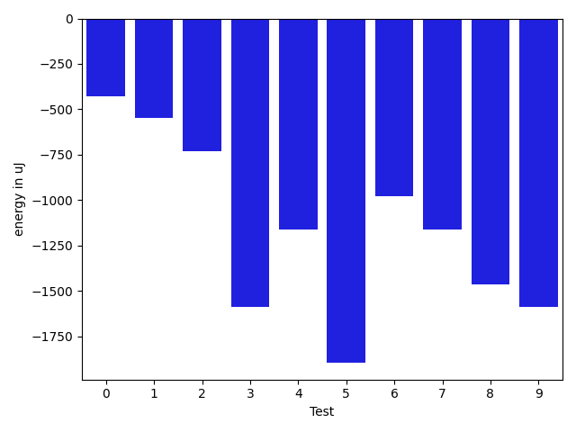

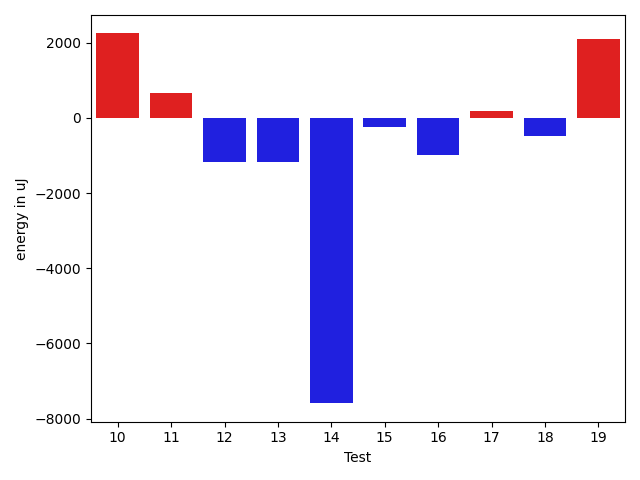

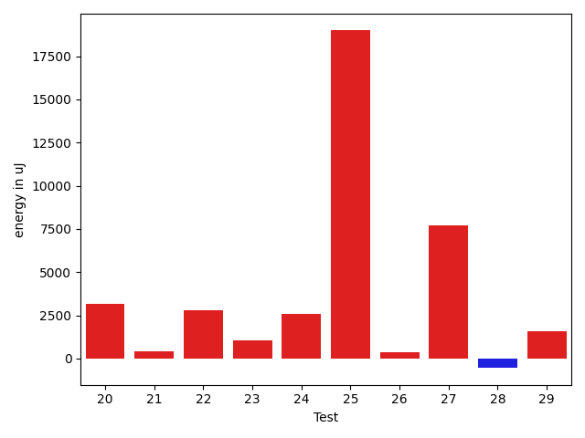

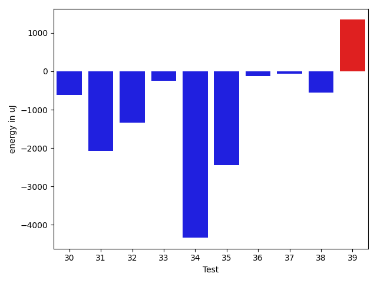

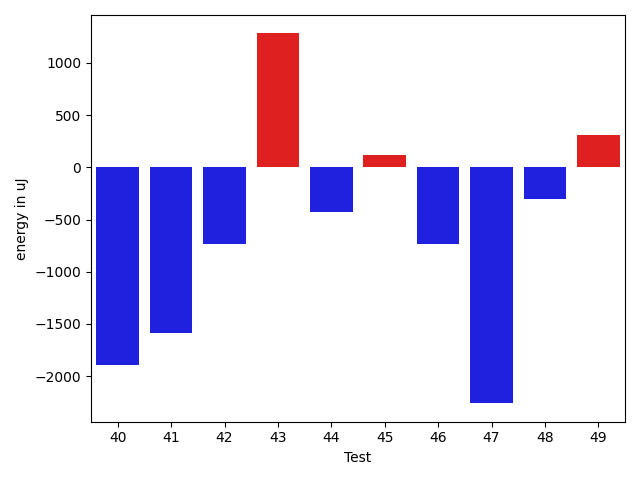

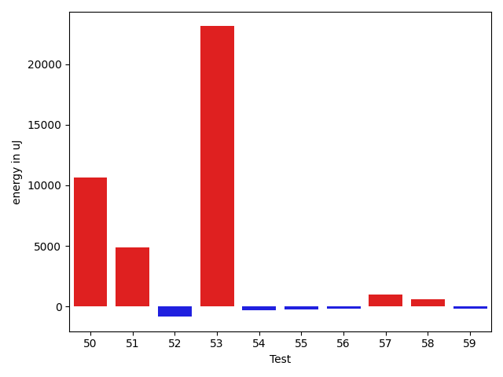

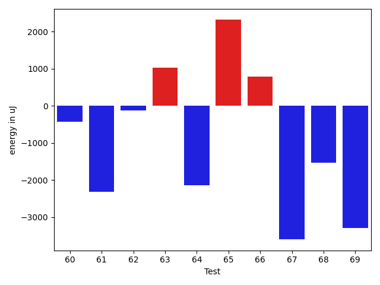

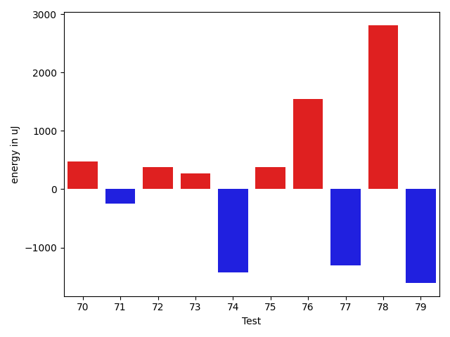

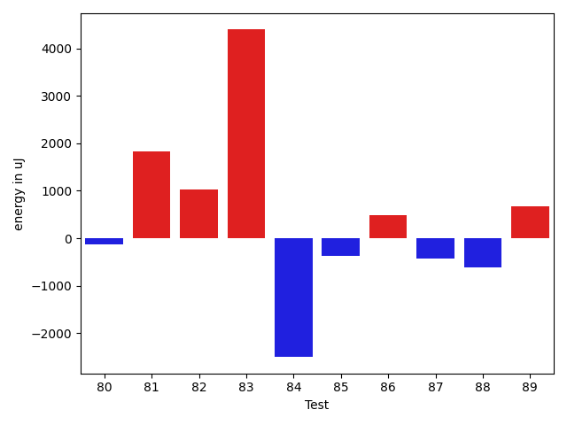

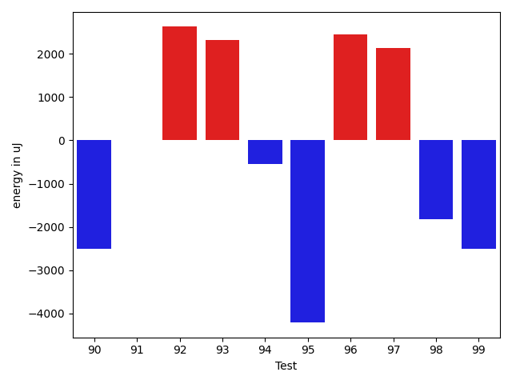

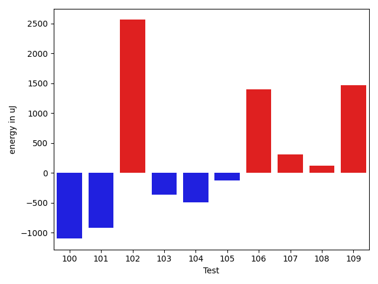

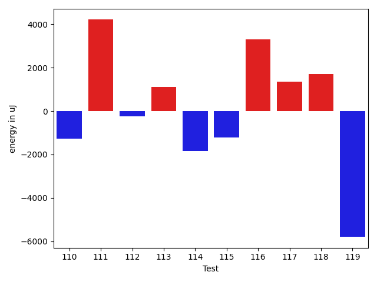

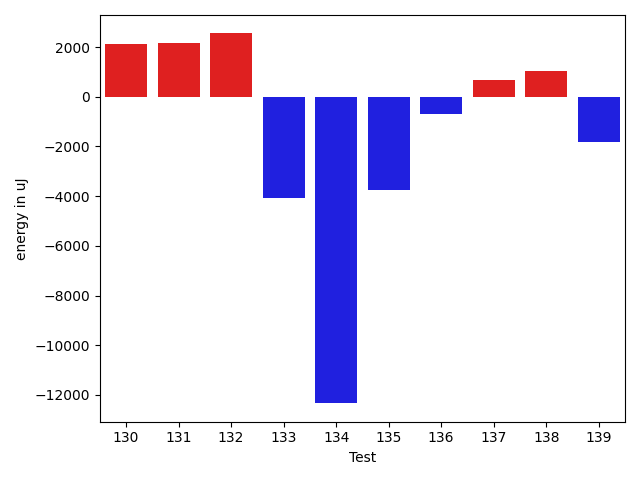

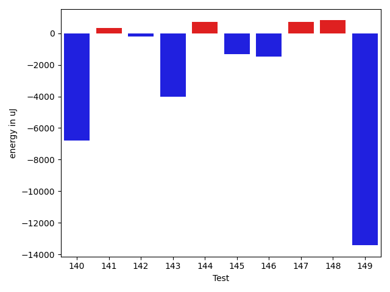

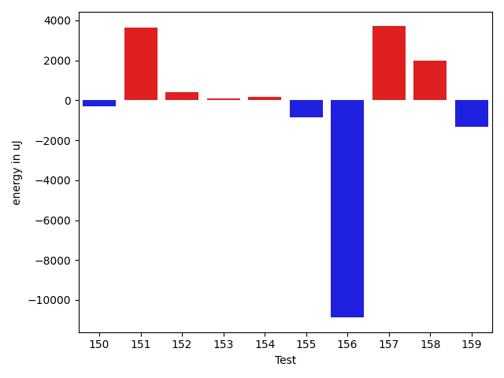

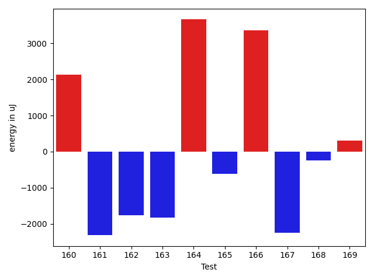

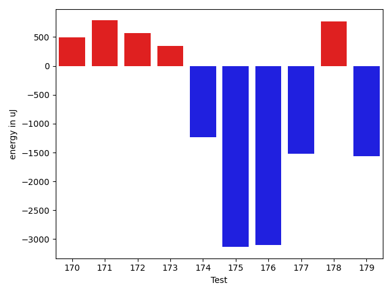

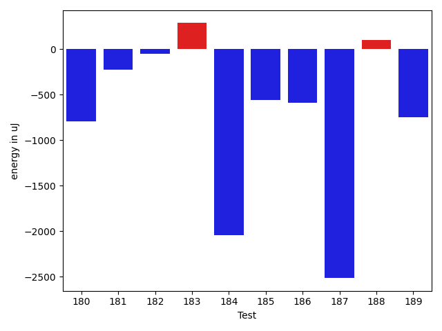

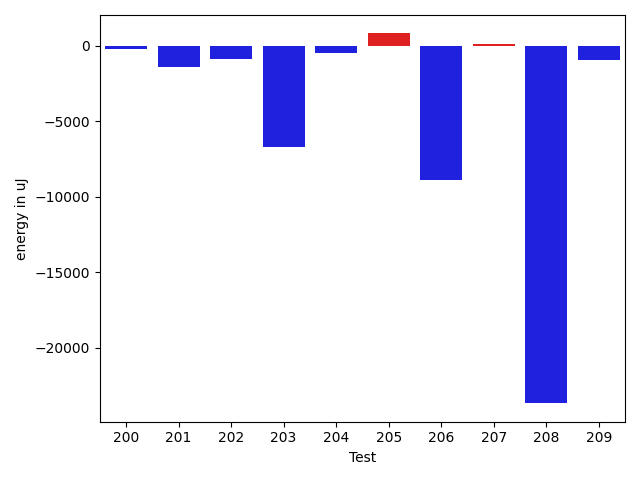

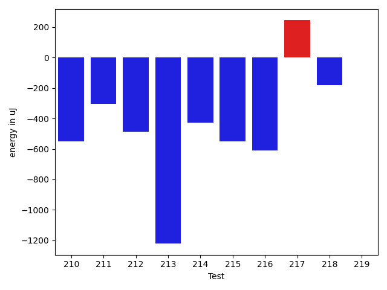

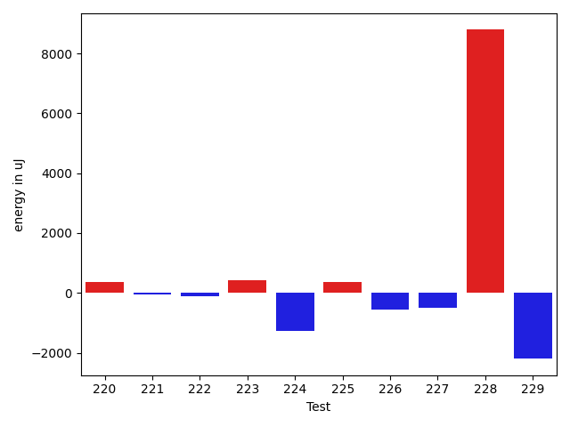

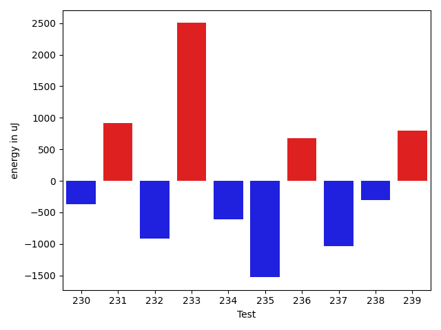

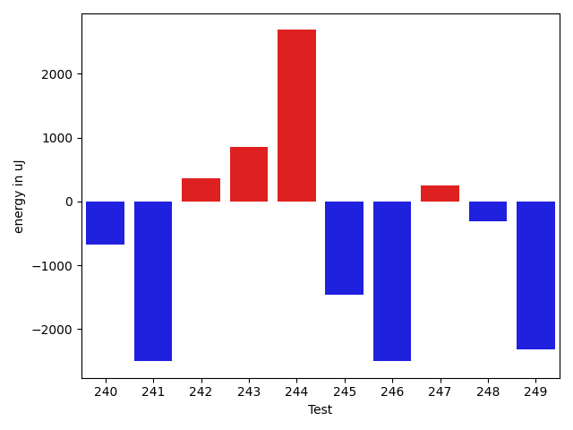

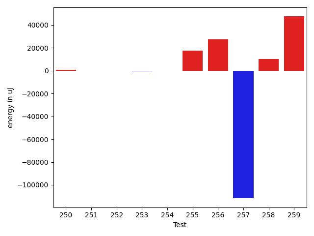

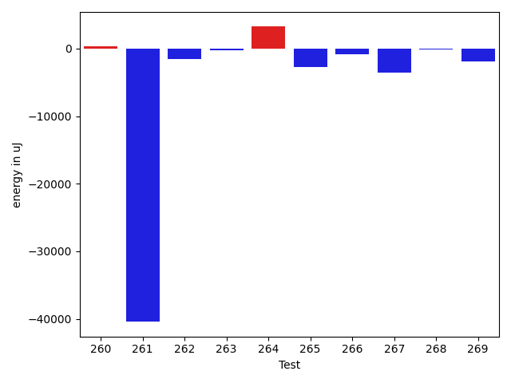

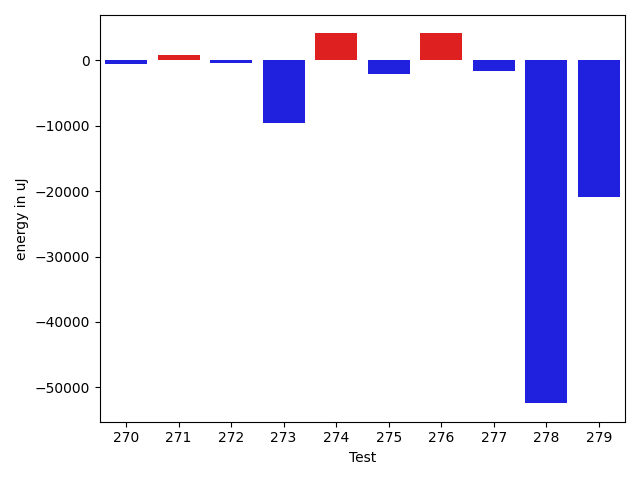

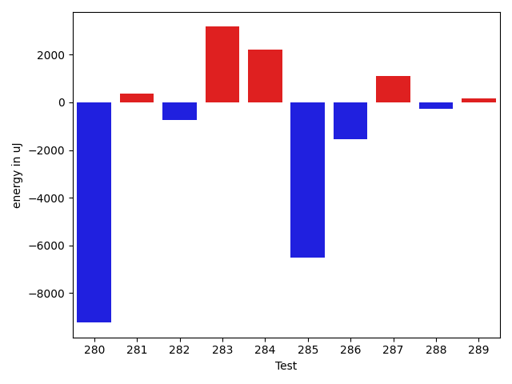

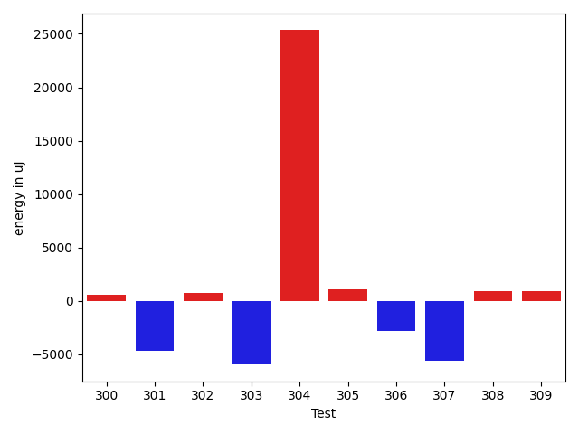

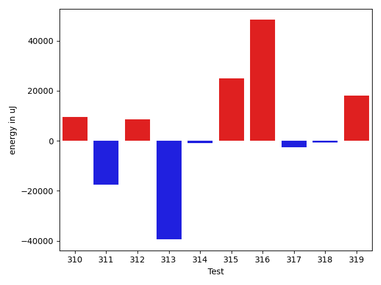

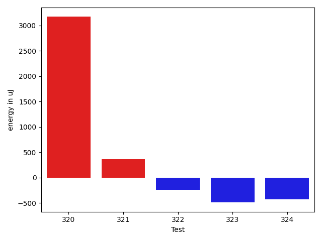

| ID | EnergyV1 | EnergyV2 | DeltaEnergy | σV1 | σV2 |
| --- | --- | --- | --- | --- | --- |
| 0 | 35217 | 34789 | -428 | 7706.731323476099 | 17917.269518967056 |
| 1 | 34973 | 34424 | -549 | 3917.0623161718463 | 7819.98129723782 |
| 2 | 34790 | 34058 | -732 | 11055.351222610409 | 5892.364913132156 |
| 3 | 37658 | 36072 | -1586 | 41035.46716030843 | 36125.04388900064 |
| 4 | 36133 | 34973 | -1160 | 4614.839796436513 | 3933.9468239736743 |
| 5 | 67505 | 65613 | -1892 | 27866.123050960912 | 21213.458704023902 |
| 6 | 37659 | 36682 | -977 | 41737.57515568837 | 29230.22066186889 |
| 7 | 37658 | 36499 | -1159 | 58556.80270119351 | 69211.83044434719 |
| 8 | 36072 | 34607 | -1465 | 4889.2676159848315 | 7362.854232556198 |
| 9 | 36072 | 34485 | -1587 | 14425.617848791611 | 10596.016348687408 |
| 10 | 34118 | 35522 | 1404 | 4908.406863738987 | 8588.302996573115 |
| 11 | 34485 | 35157 | 672 | 3949.671864438196 | 4271.348751973744 |
| 12 | 36560 | 34423 | -2137 | 5105.823769523593 | 4222.688067049262 |
| 13 | 32715 | 33813 | 1098 | 5307.753228919027 | 4900.1432993502 |
| 14 | 39002 | 36560 | -2442 | 361327.2741695305 | 359617.5969874912 |
| 15 | 34912 | 33386 | -1526 | 3914.3866630987154 | 3764.9542364944145 |
| 16 | 35827 | 35583 | -244 | 6281.901910129258 | 4196.6164771230415 |
| 17 | 35523 | 34667 | -856 | 3376.6265144589865 | 6885.967692532217 |
| 18 | 36072 | 35950 | -122 | 11201.604210571428 | 10146.2935548053 |
| 19 | 35950 | 34790 | -1160 | 5765.195640537084 | 10945.506775117921 |
| 20 | 115662 | 118835 | 3173 | 56066.790896358405 | 82516.32532111417 |
| 21 | 35766 | 36193 | 427 | 10600.834731203126 | 11731.599717761332 |
| 22 | 69336 | 72143 | 2807 | 22010.222959582614 | 26936.718133804243 |
| 23 | 34790 | 35828 | 1038 | 11226.089021858248 | 10877.137477156006 |
| 24 | 33691 | 36255 | 2564 | 42791.91528796118 | 101613.85802009556 |
| 25 | 43518 | 62500 | 18982 | 18944.60402950969 | 22048.990212235276 |
| 26 | 36682 | 37048 | 366 | 12711.386281616804 | 16027.330910993134 |
| 27 | 68237 | 75927 | 7690 | 37240.372421796084 | 46357.19777065739 |
| 28 | 36316 | 35767 | -549 | 7497.774584215535 | 27474.16123443838 |
| 29 | 37842 | 39429 | 1587 | 14859.30562387462 | 18929.063057657975 |
| 30 | 34485 | 33874 | -611 | 25900.861963972064 | 3918.6305911474415 |
| 31 | 36682 | 34607 | -2075 | 4960.1598564612095 | 3863.8524680801784 |
| 32 | 37048 | 35706 | -1342 | 4783.743266406434 | 3492.5069917232804 |
| 33 | 34119 | 33874 | -245 | 3291.3720676360686 | 3127.6179676714555 |
| 34 | 36621 | 32287 | -4334 | 23452.801687349634 | 4335.2785285376995 |
| 35 | 35828 | 33386 | -2442 | 4530.272388061739 | 3832.145415776171 |
| 36 | 35766 | 35645 | -121 | 3808.4284539096643 | 4275.892920513539 |
| 37 | 33692 | 33630 | -62 | 2988.732196636205 | 4170.589178942618 |
| 38 | 34851 | 34302 | -549 | 3970.224875556305 | 5434.3665851133455 |
| 39 | 35156 | 36499 | 1343 | 24550.402952917022 | 59724.38182707578 |
| 40 | 35645 | 33753 | -1892 | 3825.7156780627333 | 4112.6104080079795 |
| 41 | 35645 | 34058 | -1587 | 4389.750622472763 | 31396.674912546005 |
| 42 | 38208 | 37476 | -732 | 19572.829017741886 | 20093.16800933045 |
| 43 | 36743 | 38024 | 1281 | 24022.32108862235 | 61213.42584923501 |
| 44 | 35095 | 34668 | -427 | 3287.659860220754 | 4387.731050511419 |
| 45 | 36499 | 36621 | 122 | 13287.88482949149 | 10210.65678467758 |
| 46 | 33813 | 33081 | -732 | 3612.0064281922237 | 3068.8867482281607 |
| 47 | 36194 | 33935 | -2259 | 3796.8221439169706 | 3687.723701634926 |
| 48 | 33813 | 33509 | -304 | 3817.7307846210097 | 3790.9488532768623 |
| 49 | 35340 | 35645 | 305 | 3396.913068148762 | 3535.939230533814 |
| 50 | 36621 | 38025 | 1404 | 28504.52965065771 | 44282.88168840064 |
| 51 | 35034 | 34424 | -610 | 4631.931774106605 | 23238.381692028364 |
| 52 | 33691 | 33630 | -61 | 4258.104511446378 | 3755.8722340699833 |
| 53 | 34302 | 38330 | 4028 | 3968.320148974794 | 39691.64908199296 |
| 54 | 33325 | 34851 | 1526 | 3735.167864821481 | 3149.4503329946324 |
| 55 | 34485 | 34119 | -366 | 4012.674428835917 | 4491.704401264585 |
| 56 | 34729 | 33142 | -1587 | 3512.263436082841 | 3538.8345460897635 |
| 57 | 33996 | 35827 | 1831 | 4302.326645258354 | 4220.6773843503415 |
| 58 | 36072 | 34484 | -1588 | 2874.194214422926 | 5270.129536674913 |
| 59 | 32898 | 32958 | 60 | 3172.363938768691 | 3864.3473863282816 |
| 60 | 35461 | 35034 | -427 | 4487.571543719387 | 5233.331802158094 |
| 61 | 33203 | 30884 | -2319 | 3307.645011718414 | 4581.952884960735 |
| 62 | 34546 | 34424 | -122 | 3552.8487727972406 | 4791.215132798095 |
| 63 | 33508 | 34545 | 1037 | 4688.012042077822 | 2910.308577082649 |
| 64 | 35888 | 33753 | -2135 | 4631.396561038582 | 34839.35166786431 |
| 65 | 35644 | 37964 | 2320 | 2215.413042323459 | 3915.849333158772 |
| 66 | 40344 | 41137 | 793 | 46920.52182168165 | 37697.555159182295 |
| 67 | 42480 | 38879 | -3601 | 92261.84201042718 | 78754.91178587376 |
| 68 | 37354 | 35827 | -1527 | 5063.377893154815 | 3601.3622894460023 |
| 69 | 37781 | 34484 | -3297 | 11602.206245572128 | 15372.874177410864 |
| 70 | 35034 | 35705 | 671 | 3932.215022125434 | 2958.396202336665 |
| 71 | 35095 | 34180 | -915 | 4824.704872061407 | 4264.56013672727 |
| 72 | 37537 | 37414 | -123 | 4407.269679428624 | 3689.265174462253 |
| 73 | 34301 | 36804 | 2503 | 3788.196082384563 | 3646.178390337843 |
| 74 | 35034 | 33264 | -1770 | 3956.14399257661 | 3968.090245741282 |
| 75 | 34973 | 35827 | 854 | 4821.825458008616 | 4128.950410806354 |
| 76 | 34424 | 37292 | 2868 | 4230.850579961692 | 3884.85869039982 |
| 77 | 36926 | 34973 | -1953 | 4685.940461901645 | 4926.872046209666 |
| 78 | 31616 | 36377 | 4761 | 3801.71215980598 | 3738.8808075022043 |
| 79 | 37903 | 36987 | -916 | 4409.315911290045 | 4157.451943790878 |
| 80 | 33081 | 32959 | -122 | 4339.64145984435 | 4488.391769281757 |
| 81 | 32653 | 34485 | 1832 | 2646.7065684964437 | 2394.377750063678 |
| 82 | 34302 | 35339 | 1037 | 4394.667696225704 | 43637.968276959335 |
| 83 | 31738 | 36133 | 4395 | 4038.281682609187 | 3080.3106015336243 |
| 84 | 34912 | 32410 | -2502 | 3123.4507170493243 | 3389.659510924364 |
| 85 | 33447 | 33081 | -366 | 3855.8388798195424 | 35351.148565374235 |
| 86 | 32654 | 33142 | 488 | 4464.755787274372 | 3715.249083224435 |
| 87 | 33814 | 33386 | -428 | 4243.431436234025 | 25835.410713296013 |
| 88 | 34363 | 33752 | -611 | 4478.753034673826 | 4971.787488443861 |
| 89 | 33569 | 34241 | 672 | 3829.7281726035153 | 3045.46597885371 |
| 90 | 36193 | 33692 | -2501 | 3701.8411365157203 | 4112.78875163259 |
| 91 | 33325 | 33325 | 0 | 4372.5278169620615 | 3059.0457205183466 |
| 92 | 33203 | 35827 | 2624 | 4886.430584729001 | 3663.831348633385 |
| 93 | 33508 | 35828 | 2320 | 4111.0818173425705 | 4483.869525581412 |
| 94 | 34729 | 34180 | -549 | 4298.233404171381 | 3952.0447421189233 |
| 95 | 40528 | 36316 | -4212 | 108150.39195361208 | 64670.513549023475 |
| 96 | 33447 | 35889 | 2442 | 4231.170799902804 | 4228.588626322164 |
| 97 | 32043 | 34180 | 2137 | 3593.607303675807 | 4157.300160560938 |
| 98 | 36621 | 34790 | -1831 | 5360.433318406471 | 3180.166651670626 |
| 99 | 62988 | 60485 | -2503 | 21887.41319228649 | 24100.39123489812 |
| 100 | 34546 | 33448 | -1098 | 3972.688622348649 | 4189.2805095778285 |
| 101 | 34668 | 33752 | -916 | 4094.5027814551245 | 2818.0162792290607 |
| 102 | 32410 | 34973 | 2563 | 3893.686111795618 | 4589.092349805277 |
| 103 | 34851 | 34485 | -366 | 4373.810321629396 | 4290.301024617729 |
| 104 | 33203 | 32714 | -489 | 3469.131553804208 | 3332.117549088979 |
| 105 | 32593 | 32471 | -122 | 3462.941363104135 | 3823.6078157147685 |
| 106 | 33081 | 34485 | 1404 | 3806.255942434734 | 3892.686683946855 |
| 107 | 31616 | 31922 | 306 | 36665.241456850694 | 4437.708785927492 |
| 108 | 34118 | 34241 | 123 | 4015.129006644743 | 4562.716243329928 |
| 109 | 37170 | 38635 | 1465 | 16747.950617790277 | 11399.086834983213 |
| 110 | 33874 | 32592 | -1282 | 4210.677431364446 | 3434.554007377353 |
| 111 | 31738 | 35949 | 4211 | 3532.01756313959 | 3975.104288778681 |
| 112 | 34302 | 34057 | -245 | 4056.567568641927 | 4324.04225346171 |
| 113 | 34485 | 35583 | 1098 | 2784.005504592259 | 4162.719564548749 |
| 114 | 36133 | 34301 | -1832 | 5828.642885783963 | 4152.708049032086 |
| 115 | 35706 | 34485 | -1221 | 3848.9406568471272 | 4175.9535033597085 |
| 116 | 32044 | 35340 | 3296 | 4393.782424770176 | 3722.6981815432005 |
| 117 | 33081 | 34424 | 1343 | 3767.7297512427826 | 41463.993143629225 |
| 118 | 33935 | 35644 | 1709 | 3383.635767927748 | 4162.451009918591 |
| 119 | 40161 | 34362 | -5799 | 23382.822727926232 | 3972.3221805604885 |
| 120 | 34119 | 34180 | 61 | 4328.903999482397 | 2324.5578638145835 |
| 121 | 33019 | 32044 | -975 | 4278.003236843614 | 3622.460731326152 |
| 122 | 32715 | 35278 | 2563 | 3346.3355525358315 | 4847.834067653306 |
| 123 | 34363 | 34057 | -306 | 4602.866774006847 | 3916.936280092674 |
| 124 | 34729 | 32166 | -2563 | 4558.907034250509 | 5343.643659110847 |
| 125 | 34912 | 35766 | 854 | 5399.8539734196565 | 4754.400395948999 |
| 126 | 32654 | 36011 | 3357 | 3031.1595783485213 | 3935.2682217699885 |
| 127 | 34668 | 33935 | -733 | 4263.786420411896 | 2757.8755662445847 |
| 128 | 33692 | 30884 | -2808 | 3234.7856813917147 | 33137.96674485898 |
| 129 | 34424 | 34973 | 549 | 3059.238125697675 | 4171.683455652726 |
| 130 | 32043 | 35645 | 3602 | 3749.512636104891 | 4189.080501600428 |
| 131 | 33508 | 36194 | 2686 | 4656.293588490981 | 4765.3944309826275 |
| 132 | 31128 | 34668 | 3540 | 2782.356155810715 | 4007.0482293660225 |
| 133 | 36438 | 31067 | -5371 | 5604.833271382834 | 3313.4856074976014 |
| 134 | 32959 | 32776 | -183 | 46844.4710424827 | 4132.580165998279 |
| 135 | 36438 | 37842 | 1404 | 20240.94887446914 | 15978.820530078281 |
| 136 | 37353 | 36437 | -916 | 4541.705983401988 | 4599.998679287996 |
| 137 | 35095 | 35522 | 427 | 5417.7817101110795 | 8282.707782889316 |
| 138 | 33447 | 33936 | 489 | 5014.147564665185 | 7544.887646136651 |
| 139 | 35889 | 36011 | 122 | 14877.990008519 | 12078.351462786375 |
| 140 | 39612 | 37353 | -2259 | 53373.59093791995 | 49623.16249186801 |
| 141 | 36193 | 37293 | 1100 | 4358.852879668319 | 4585.688747104251 |
| 142 | 33386 | 32715 | -671 | 4120.0093487088925 | 4674.372713073349 |
| 143 | 34546 | 36377 | 1831 | 28517.492944628106 | 4486.621447414155 |
| 144 | 35339 | 36926 | 1587 | 4587.078384156957 | 3864.083849777284 |
| 145 | 36377 | 35889 | -488 | 4540.374347907428 | 4756.709769415182 |
| 146 | 33569 | 33936 | 367 | 6777.78966345445 | 4674.961308534531 |
| 147 | 34912 | 35400 | 488 | 4530.90506979415 | 4459.6235065477285 |
| 148 | 34485 | 36804 | 2319 | 4825.926513489405 | 3981.7797912631245 |
| 149 | 37842 | 35461 | -2381 | 75032.53175296304 | 45205.829828095695 |
| 150 | 35461 | 35095 | -366 | 3272.095801368495 | 4245.230042713299 |
| 151 | 35767 | 35584 | -183 | 4623.908701910106 | 28175.038887175873 |
| 152 | 35706 | 35889 | 183 | 4913.132043886177 | 4374.257673585174 |
| 153 | 32165 | 34180 | 2015 | 3329.680869725337 | 2922.7239329448507 |
| 154 | 35461 | 35950 | 489 | 5447.45325990604 | 4279.535053781335 |
| 155 | 36560 | 35156 | -1404 | 4872.924829091799 | 3277.0908621255426 |
| 156 | 87219 | 81359 | -5860 | 82280.25614389636 | 73528.70847683787 |
| 157 | 36010 | 37109 | 1099 | 3908.80386543961 | 11530.17552162786 |
| 158 | 35523 | 35767 | 244 | 4409.699606762584 | 8639.343912753675 |
| 159 | 36926 | 35888 | -1038 | 3397.1498656780723 | 3975.5738330383274 |
| 160 | 32349 | 34484 | 2135 | 3363.0360050998015 | 4132.524224128663 |
| 161 | 37597 | 35278 | -2319 | 79630.30692315502 | 98521.51236983998 |
| 162 | 35889 | 34119 | -1770 | 4613.975285555921 | 4743.980435955791 |
| 163 | 37170 | 35339 | -1831 | 2588.2489340051316 | 4537.969816385051 |
| 164 | 34912 | 38574 | 3662 | 4314.531500094317 | 5002.39893063563 |
| 165 | 37354 | 36743 | -611 | 325471.56576710596 | 461856.8593129773 |
| 166 | 34363 | 37720 | 3357 | 46288.82803068461 | 4868.146023446709 |
| 167 | 36254 | 33996 | -2258 | 4135.256449765291 | 4202.962492100066 |
| 168 | 37353 | 37109 | -244 | 28256.336538234813 | 28508.82913499492 |
| 169 | 35217 | 35522 | 305 | 5227.633241944554 | 4448.809748677818 |
| 170 | 33997 | 33570 | -427 | 3978.2839067584705 | 4122.736212565631 |
| 171 | 36743 | 36865 | 122 | 9971.007015394267 | 11339.866694681888 |
| 172 | 32044 | 33386 | 1342 | 3935.3142070441168 | 3292.148492044798 |
| 173 | 33996 | 34363 | 367 | 4335.489649534928 | 4061.8630121898395 |
| 174 | 33325 | 32837 | -488 | 4905.673246099866 | 4811.57010652448 |
| 175 | 134643 | 137328 | 2685 | 34998.589080795275 | 30159.537781635812 |
| 176 | 34790 | 35828 | 1038 | 18197.256230559757 | 16409.725025613097 |
| 177 | 37109 | 33691 | -3418 | 4487.067186581885 | 4744.199811566857 |
| 178 | 36560 | 36499 | -61 | 5182.294400059582 | 4520.429330587996 |
| 179 | 35095 | 35827 | 732 | 20648.12127145752 | 6870.126328369188 |
| 180 | 37597 | 37781 | 184 | 4478.402786931701 | 4011.5255473375905 |
| 181 | 32287 | 32593 | 306 | 4262.9663975850635 | 3398.827328635061 |
| 182 | 37171 | 34912 | -2259 | 3694.6888927000105 | 3751.965212949565 |
| 183 | 33386 | 33019 | -367 | 3616.5216190272063 | 3040.7752421961854 |
| 184 | 35522 | 35034 | -488 | 4517.63279018311 | 4571.369906756617 |
| 185 | 32898 | 33692 | 794 | 3879.016400375783 | 3304.7341899654393 |
| 186 | 33020 | 32898 | -122 | 4875.409123733934 | 3570.847746409914 |
| 187 | 33631 | 32471 | -1160 | 4528.25706256738 | 2956.018203817726 |
| 188 | 33204 | 33386 | 182 | 4405.723845504284 | 4121.711111714411 |
| 189 | 32898 | 32959 | 61 | 4141.591365554912 | 2386.3698429832707 |
| 190 | 36621 | 37537 | 916 | 68635.70336332898 | 68516.59146765455 |
| 191 | 35157 | 32898 | -2259 | 4555.449889845007 | 4119.804171834641 |
| 192 | 34485 | 33630 | -855 | 4538.162718231119 | 3284.4373043795495 |
| 193 | 36316 | 35339 | -977 | 3989.193061754547 | 4383.095556585923 |
| 194 | 34546 | 33691 | -855 | 4528.590371922223 | 3454.0760955138207 |
| 195 | 35217 | 33630 | -1587 | 4271.767748627813 | 3234.2942681863597 |
| 196 | 32593 | 36072 | 3479 | 5747.470589868721 | 3122.51471132627 |
| 197 | 31678 | 33509 | 1831 | 4353.340164241706 | 3434.627950058848 |
| 198 | 34729 | 35461 | 732 | 3904.7641614955196 | 2960.814104262542 |
| 199 | 38330 | 36744 | -1586 | 14404.439456783186 | 13446.016689437183 |
| 200 | 36499 | 36071 | -428 | 4179.874768027014 | 3223.5432554601293 |
| 201 | 36499 | 34241 | -2258 | 4716.388728305493 | 4525.1612884394 |
| 202 | 35217 | 34729 | -488 | 4517.120637087303 | 4310.739533289345 |
| 203 | 37659 | 35828 | -1831 | 34104.59169282598 | 29864.5617058574 |
| 204 | 35462 | 34790 | -672 | 3730.6262575667693 | 4314.552627883001 |
| 205 | 35888 | 35644 | -244 | 4475.989596422668 | 4092.7870141570515 |
| 206 | 41687 | 38818 | -2869 | 54047.26403001169 | 50021.13998919796 |
| 207 | 35949 | 36072 | 123 | 3926.9665337286483 | 3764.6479528207797 |
| 208 | 41992 | 36376 | -5616 | 70588.04689789908 | 50091.353243947706 |
| 209 | 36133 | 34058 | -2075 | 9792.796566346293 | 12302.317458759522 |
| 210 | 36316 | 35766 | -550 | 498883.56738486636 | 327865.9819849703 |
| 211 | 37598 | 37292 | -306 | 23806.397307275234 | 15648.165969797308 |
| 212 | 35278 | 34790 | -488 | 12753.535639517542 | 11454.923895696886 |
| 213 | 35217 | 33996 | -1221 | 3532.23444925855 | 86678.78990467559 |
| 214 | 33936 | 33508 | -428 | 3623.026829875815 | 3663.0074201399048 |
| 215 | 35339 | 34790 | -549 | 3948.977370491386 | 3325.6269792172957 |
| 216 | 33752 | 33142 | -610 | 5256.9071427417675 | 9592.445619058899 |
| 217 | 34057 | 34301 | 244 | 3545.785334671963 | 4188.100298580418 |
| 218 | 35217 | 35034 | -183 | 3705.325077479157 | 4193.636740720377 |
| 219 | 33813 | 33813 | 0 | 4797.361372535763 | 2960.2896283639957 |
| 220 | 35034 | 35400 | 366 | 10429.719128537883 | 6069.536340577575 |
| 221 | 71899 | 71838 | -61 | 37940.46986850417 | 45556.37002428545 |
| 222 | 34302 | 34179 | -123 | 29134.812056324 | 3820.5311513055003 |
| 223 | 33630 | 34057 | 427 | 4004.7928801942353 | 3526.0377545948286 |
| 224 | 34485 | 33203 | -1282 | 11686.403039651288 | 7480.94742523626 |
| 225 | 34973 | 35340 | 367 | 3624.8049422231015 | 22466.786008678722 |
| 226 | 34423 | 33874 | -549 | 3707.0839290620365 | 3443.1928850790546 |
| 227 | 35339 | 34851 | -488 | 4053.4958486792716 | 7418.163239129134 |
| 228 | 36193 | 44983 | 8790 | 32501.33831577026 | 45266.88613941741 |
| 229 | 35156 | 32959 | -2197 | 26699.028817759296 | 5979.842648981323 |
| 230 | 34180 | 33814 | -366 | 3444.269099170389 | 2768.047859546691 |
| 231 | 33509 | 34424 | 915 | 3313.7703611581164 | 3868.789701964258 |
| 232 | 35034 | 34119 | -915 | 2648.667717418687 | 3559.300797441355 |
| 233 | 35034 | 37536 | 2502 | 3477.2990083684203 | 4033.7579348530107 |
| 234 | 35096 | 34485 | -611 | 23885.173021471182 | 3063.558522235375 |
| 235 | 36011 | 34484 | -1527 | 3900.346609408628 | 6304.031029525829 |
| 236 | 34485 | 35157 | 672 | 3778.437046216626 | 3821.4525386698347 |
| 237 | 36133 | 35095 | -1038 | 2475.4123614814157 | 3760.9483944596677 |
| 238 | 35034 | 34729 | -305 | 4202.243776989344 | 3394.296708499232 |
| 239 | 34424 | 35217 | 793 | 4109.740978422146 | 4572.633336124269 |
| 240 | 34302 | 33631 | -671 | 3168.5622503550408 | 3523.935699800229 |
| 241 | 35889 | 33386 | -2503 | 4432.815104422922 | 4029.453461294061 |
| 242 | 33081 | 33447 | 366 | 3877.0488765206073 | 5606.007574245264 |
| 243 | 35828 | 36682 | 854 | 9469.642344824271 | 5698.247904852126 |
| 244 | 35217 | 37902 | 2685 | 50967.21456789568 | 119156.44858428546 |
| 245 | 34912 | 33447 | -1465 | 5493.083384663088 | 3631.075070310808 |
| 246 | 34974 | 32471 | -2503 | 4652.202858592906 | 4000.3504236781832 |
| 247 | 34362 | 34607 | 245 | 7272.243031321027 | 11444.88669166347 |
| 248 | 34485 | 34180 | -305 | 4548.9414116849375 | 7858.676452318306 |
| 249 | 35401 | 33080 | -2321 | 2991.683704171026 | 2310.0028699677537 |
| 250 | 33875 | 32898 | -977 | 3291.955114619072 | 4857.153243556477 |
| 251 | 34851 | 35095 | 244 | 3923.094417665391 | 3142.7730445773877 |
| 252 | 34607 | 35705 | 1098 | 3301.901240568702 | 3168.580392715951 |
| 253 | 33203 | 32043 | -1160 | 3175.302837427479 | 3793.6260028767642 |
| 254 | 34180 | 33508 | -672 | 3144.7057689604817 | 2766.6763353522833 |
| 255 | 71960 | 76354 | 4394 | 33031.594416385706 | 129011.28778861187 |
| 256 | 38208 | 40528 | 2320 | 41044.973403921525 | 177112.6613905945 |
| 257 | 75378 | 37414 | -37964 | 274597.8090437732 | 4295.082176436646 |
| 258 | 34607 | 36316 | 1709 | 4881.312965341879 | 40332.41694802551 |
| 259 | 33264 | 71045 | 37781 | 34163.63393614485 | 62636.35076795044 |
| 260 | 35278 | 35400 | 122 | 4660.225438001015 | 3837.2959061931033 |
| 261 | 169738 | 187377 | 17639 | 350841.01228820253 | 237260.01112061169 |
| 262 | 37048 | 33325 | -3723 | 3387.734412389627 | 4331.189580114093 |
| 263 | 36071 | 34302 | -1769 | 4114.067011907018 | 8544.122435579133 |
| 264 | 36926 | 38940 | 2014 | 32742.695328273097 | 36108.156699144856 |
| 265 | 36377 | 35034 | -1343 | 4571.669376203593 | 4276.342698678768 |
| 266 | 37231 | 35766 | -1465 | 4087.515093830267 | 3706.5614737045285 |
| 267 | 37048 | 37658 | 610 | 71604.52540537469 | 68849.49096254526 |
| 268 | 34790 | 35278 | 488 | 4077.508591661665 | 4008.5448079622147 |
| 269 | 36987 | 35461 | -1526 | 4234.87748705404 | 3737.2103240140445 |
| 270 | 36194 | 35645 | -549 | 3518.075169728871 | 5696.681672693323 |
| 271 | 34912 | 35705 | 793 | 4816.077460320404 | 3112.2058065379483 |
| 272 | 38208 | 37842 | -366 | 13477.309418119608 | 10117.045054339804 |
| 273 | 71533 | 61950 | -9583 | 116365.34377462052 | 86637.98842650355 |
| 274 | 36071 | 40161 | 4090 | 4204.355322520271 | 3643.4291501581615 |
| 275 | 36743 | 34668 | -2075 | 4668.8414933094955 | 4388.848512712492 |
| 276 | 37842 | 41931 | 4089 | 92396.03890176916 | 73537.10926858797 |
| 277 | 40344 | 38635 | -1709 | 53509.582164411215 | 47835.55209664122 |
| 278 | 291564 | 239135 | -52429 | 106468.63604058913 | 105963.14660907438 |
| 279 | 388244 | 367309 | -20935 | 115603.94226772021 | 104677.74631489128 |
| 280 | 61646 | 42968 | -18678 | 58405.37800823366 | 50027.00811651875 |
| 281 | 34241 | 35095 | 854 | 4902.497013241696 | 4738.400202525104 |
| 282 | 35400 | 35644 | 244 | 4845.550453830533 | 4376.975316170671 |
| 283 | 36621 | 37658 | 1037 | 56799.093376667384 | 57116.45934442716 |
| 284 | 33325 | 35462 | 2137 | 4148.468847745918 | 4676.764374152056 |
| 285 | 35645 | 34912 | -733 | 32552.19276639682 | 24339.150835460026 |
| 286 | 36377 | 35461 | -916 | 4476.584181685947 | 4081.6340441543753 |
| 287 | 33935 | 35217 | 1282 | 3965.389675579879 | 4461.890945079945 |
| 288 | 36621 | 36560 | -61 | 4672.491011227309 | 4356.160401087178 |
| 289 | 34241 | 33875 | -366 | 4238.967122475958 | 4184.656913271362 |
| 290 | 35034 | 36376 | 1342 | 4996.421978760776 | 2737.687478308817 |
| 291 | 35705 | 35950 | 245 | 3694.4459536337768 | 4207.758847124625 |
| 292 | 37903 | 36987 | -916 | 4858.400782150439 | 4277.524050195393 |
| 293 | 37475 | 38391 | 916 | 66888.8818854022 | 58556.57637105237 |
| 294 | 38513 | 36194 | -2319 | 25354.350201195648 | 14260.928345302113 |
| 295 | 39795 | 36010 | -3785 | 57457.75204376382 | 22225.16717581849 |
| 296 | 68603 | 65429 | -3174 | 27122.833320648104 | 19715.04248533467 |
| 297 | 41199 | 36621 | -4578 | 27008.025098441434 | 14490.0534336841 |
| 298 | 36865 | 38574 | 1709 | 81778.39542805262 | 53650.588144205234 |
| 299 | 35950 | 36744 | 794 | 3204.14259635519 | 3902.6271486814767 |
| 300 | 34424 | 36255 | 1831 | 4209.52714791979 | 3412.9683538490362 |
| 301 | 38208 | 37598 | -610 | 80570.9862693363 | 73723.9249508707 |
| 302 | 35339 | 35644 | 305 | 3689.562674476325 | 5112.142489255344 |
| 303 | 39185 | 38025 | -1160 | 51347.0223944634 | 47998.43611897973 |
| 304 | 37659 | 37659 | 0 | 81922.31683769244 | 119590.06444190702 |
| 305 | 35217 | 35523 | 306 | 12878.952022579193 | 15896.150236300866 |
| 306 | 35156 | 36255 | 1099 | 22539.820432411838 | 11380.816370879988 |
| 307 | 35706 | 38574 | 2868 | 73034.00723605865 | 53413.33755288525 |
| 308 | 35888 | 37353 | 1465 | 4994.770071012653 | 4810.619660795616 |
| 309 | 35034 | 37170 | 2136 | 6170.164537216698 | 7320.171449191307 |
| 310 | 33936 | 35827 | 1891 | 4576.282603834264 | 49148.8522138502 |
| 311 | 36377 | 39367 | 2990 | 110118.87279645819 | 79836.86695389793 |
| 312 | 35583 | 37231 | 1648 | 13572.670961899872 | 54085.609928383536 |
| 313 | 37476 | 38269 | 793 | 445669.5407260415 | 385150.4145549832 |
| 314 | 36804 | 37231 | 427 | 4810.78235448479 | 4515.316180499051 |
| 315 | 39429 | 37109 | -2320 | 3986.885700856685 | 67783.7368103073 |
| 316 | 36072 | 39917 | 3845 | 37267.485666984416 | 91656.47509285691 |
| 317 | 36560 | 33081 | -3479 | 5077.369085105876 | 3242.5203320574915 |
| 318 | 37109 | 35766 | -1343 | 4089.349981862855 | 3183.243520530664 |
| 319 | 38391 | 38513 | 122 | 85941.08067241499 | 117546.3206324416 |
| 320 | 37476 | 40649 | 3173 | 129520.90089946853 | 150209.70309201645 |
| 321 | 36926 | 37293 | 367 | 4706.930065339829 | 3696.01185666557 |
| 322 | 37048 | 36804 | -244 | 627977.4710365277 | 390799.5113371803 |
| 323 | 36255 | 35766 | -489 | 463216.02291088173 | 442238.12207931024 |
| 324 | 38147 | 37719 | -428 | 62092.4549731679 | 55871.289415625215 |

## Delta Duration per test method

| ID | DurationV1 | DurationsV2 | DeltaDuration |
| --- | --- | --- | --- |
| 0 | 898766.6935483871 | 919218.3928571428 | 20451.69930875569 |
| 1 | 811392.5490196078 | 802497.9791666666 | -8894.569852941204 |
| 2 | 991684.671875 | 890153.2258064516 | -101531.44606854836 |
| 3 | 1538845.4285714286 | 1157191.0666666667 | -381654.361904762 |
| 4 | 897502.9516129033 | 833761.775862069 | -63741.175750834285 |
| 5 | 2242440.0204081633 | 2007907.8686868686 | -234532.15172129474 |
| 6 | 1689542.9571428571 | 1312713.0793650793 | -376829.87777777785 |
| 7 | 1553821.7413793104 | 1342180.1228070175 | -211641.61857229285 |
| 8 | 939073.7205882353 | 902216.1355932204 | -36857.58499501494 |
| 9 | 1129310.65 | 1039700.0405405406 | -89610.60945945932 |
| 10 | 425643.85 | 625659.1538461539 | 200015.3038461539 |
| 11 | 777495.875 | 755654.6 | -21841.275000000023 |
| 12 | 774835.8222222222 | 693212.4390243902 | -81623.38319783204 |
| 13 | 480974.17647058825 | 423391.6666666667 | -57582.509803921566 |
| 14 | 4326384.066666666 | 3886639.86 | -439744.20666666655 |
| 15 | 693625.9756097561 | 720069.1063829787 | 26443.130773222656 |
| 16 | 979901.1014492754 | 940520.9545454546 | -39380.1469038208 |
| 17 | 758960.3260869565 | 876693.671641791 | 117733.34555483446 |
| 18 | 1210037.2471910112 | 1283281.1739130435 | 73243.92672203225 |
| 19 | 1117878.5952380951 | 1204774.4352941175 | 86895.8400560224 |
| 20 | 3775884.0707070706 | 4454830.917525773 | 678946.8468187023 |
| 21 | 1141617.551724138 | 1239458.7333333334 | 97841.18160919542 |
| 22 | 2210666.383838384 | 2444937.888888889 | 234271.50505050505 |
| 23 | 1274062.744680851 | 1309842.358695652 | 35779.6140148011 |
| 24 | 1388997.1829268292 | 2368974.8695652173 | 979977.6866383881 |
| 25 | 1765751.6666666667 | 1932326.1616161617 | 166574.49494949495 |
| 26 | 1248212.987804878 | 1412617.511627907 | 164404.5238230289 |
| 27 | 2452521.4343434344 | 2832758.505050505 | 380237.07070707064 |
| 28 | 1166954.755319149 | 1269454.108695652 | 102499.3533765031 |
| 29 | 1492998.7474747475 | 1597440.9090909092 | 104442.1616161617 |
| 30 | 1070040.2714285713 | 1041385.2777777778 | -28654.993650793564 |
| 31 | 797415.9375 | 841079.0357142857 | 43663.09821428568 |
| 32 | 462435.0 | 515377.0 | 52942.0 |
| 33 | 659156.6976744186 | 691853.8913043478 | 32697.193629929214 |
| 34 | 1002508.3684210526 | 623472.6 | -379035.7684210526 |
| 35 | 677857.8529411765 | 742002.1111111111 | 64144.25816993462 |
| 36 | 700874.4761904762 | 738149.4390243902 | 37274.962833913974 |
| 37 | 689271.8222222222 | 659850.976744186 | -29420.845478036208 |
| 38 | 872319.3731343284 | 981063.421875 | 108744.0487406716 |
| 39 | 1034981.5606060605 | 1628036.0579710144 | 593054.4973649539 |
| 40 | 649945.525 | 689479.5416666666 | 39534.016666666605 |
| 41 | 762444.0666666667 | 986529.4262295082 | 224085.3595628416 |
| 42 | 1445734.5384615385 | 1652693.3370786516 | 206958.79861711315 |
| 43 | 1026946.8679245283 | 1651207.7903225806 | 624260.9223980523 |
| 44 | 793155.4745762711 | 862717.947368421 | 69562.47279214987 |
| 45 | 875605.9019607843 | 996180.3846153846 | 120574.48265460029 |
| 46 | 644910.1276595745 | 692371.0227272727 | 47460.895067698206 |
| 47 | 784180.9642857143 | 871269.84 | 87088.87571428565 |
| 48 | 799971.6097560975 | 684124.7272727273 | -115846.88248337025 |
| 49 | 844176.5161290322 | 872641.0714285715 | 28464.555299539235 |
| 50 | 1190189.78125 | 1460791.0833333333 | 270601.30208333326 |
| 51 | 646607.1627906977 | 942538.9523809524 | 295931.7895902548 |
| 52 | 716946.56 | 740914.0652173914 | 23967.5052173913 |
| 53 | 545911.9302325582 | 1490667.0476190476 | 944755.1173864894 |
| 54 | 404203.55555555556 | 410874.1 | 6670.544444444415 |
| 55 | 680068.5652173914 | 689346.5348837209 | 9277.969666329562 |
| 56 | 338070.1111111111 | 339834.36842105264 | 1764.2573099415167 |
| 57 | 463298.0 | 387307.5238095238 | -75990.47619047621 |
| 58 | 422602.6 | 460300.0 | 37697.40000000002 |
| 59 | 434283.9 | 382721.1666666667 | -51562.73333333334 |
| 60 | 367273.0 | 366173.8461538461 | -1099.153846153873 |
| 61 | 396590.94736842107 | 422137.1 | 25546.15263157891 |
| 62 | 402921.6153846154 | 377736.2631578947 | -25185.352226720657 |
| 63 | 386481.73333333334 | 418906.0588235294 | 32424.32549019606 |
| 64 | 400087.36 | 795224.8421052631 | 395137.48210526316 |
| 65 | 381035.29411764705 | 370000.25 | -11035.044117647049 |
| 66 | 1449638.3043478262 | 1411465.4285714286 | -38172.87577639753 |
| 67 | 2585111.5 | 2070768.4347826086 | -514343.06521739135 |
| 68 | 332295.8 | 326563.1875 | -5732.612499999988 |
| 69 | 954053.3461538461 | 764877.4838709678 | -189175.86228287837 |
| 70 | 415554.67741935485 | 387743.1 | -27811.57741935487 |
| 71 | 382332.4736842105 | 383514.3076923077 | 1181.834008097183 |
| 72 | 483550.90476190473 | 458034.4 | -25516.50476190471 |
| 73 | 321558.5625 | 336633.25 | 15074.6875 |
| 74 | 431732.7 | 305870.0 | -125862.70000000001 |
| 75 | 442669.75 | 406193.4285714286 | -36476.32142857142 |
| 76 | 618971.695652174 | 574550.25 | -44421.44565217395 |
| 77 | 645176.2903225806 | 494189.0833333333 | -150987.2069892473 |
| 78 | 465201.4137931034 | 442957.375 | -22244.03879310342 |
| 79 | 483235.4166666667 | 446921.7916666667 | -36313.625 |
| 80 | 969916.25 | 806488.641025641 | -163427.608974359 |
| 81 | 406671.7083333333 | 415555.6 | 8883.891666666663 |
| 82 | 437581.93548387097 | 661511.8181818182 | 223929.88269794727 |
| 83 | 717327.2058823529 | 564319.4074074074 | -153007.79847494548 |
| 84 | 587359.34375 | 517068.56 | -70290.78375 |
| 85 | 510194.5294117647 | 663055.8648648649 | 152861.33545310015 |
| 86 | 545916.92 | 442938.72 | -102978.20000000007 |
| 87 | 707614.224489796 | 792409.7045454546 | 84795.48005565861 |
| 88 | 434548.36 | 418856.6111111111 | -15691.748888888862 |
| 89 | 493612.7272727273 | 428264.26086956525 | -65348.46640316205 |
| 90 | 381509.6 | 355897.6666666667 | -25611.93333333329 |
| 91 | 411856.7931034483 | 387079.0 | -24777.79310344829 |
| 92 | 489154.5833333333 | 438960.60869565216 | -50193.97463768115 |
| 93 | 487311.652173913 | 399645.3157894737 | -87666.33638443932 |
| 94 | 549140.3714285714 | 478015.7878787879 | -71124.5835497835 |
| 95 | 2298652.205128205 | 1259684.5813953488 | -1038967.6237328562 |
| 96 | 466263.0 | 426258.1818181818 | -40004.81818181818 |
| 97 | 465597.9655172414 | 428613.875 | -36984.09051724139 |
| 98 | 470434.93548387097 | 466078.75 | -4356.18548387097 |
| 99 | 2144535.888888889 | 1531818.0555555555 | -612717.8333333335 |
| 100 | 525103.6764705882 | 475446.5925925926 | -49657.08387799561 |
| 101 | 337831.5 | 323350.25 | -14481.25 |
| 102 | 433405.7272727273 | 422702.8181818182 | -10702.909090909117 |
| 103 | 540315.1785714285 | 508693.34375 | -31621.83482142852 |
| 104 | 610237.64 | 581152.9615384615 | -29084.67846153851 |
| 105 | 499433.5 | 459725.1666666667 | -39708.333333333314 |
| 106 | 455758.8095238095 | 458849.23529411765 | 3090.425770308124 |
| 107 | 648536.925925926 | 516626.5263157895 | -131910.39961013646 |
| 108 | 444265.1 | 414917.2962962963 | -29347.803703703685 |
| 109 | 846121.3548387097 | 731798.9090909091 | -114322.44574780064 |
| 110 | 473024.347826087 | 441717.9285714286 | -31306.419254658394 |
| 111 | 394205.64285714284 | 327307.13333333336 | -66898.50952380948 |
| 112 | 505935.6296296296 | 447511.5833333333 | -58424.04629629629 |
| 113 | 569979.76 | 525575.2307692308 | -44404.52923076926 |
| 114 | 414455.6 | 391401.1818181818 | -23054.418181818153 |
| 115 | 385752.23529411765 | 340865.6 | -44886.635294117674 |
| 116 | 377601.39130434784 | 353955.76470588235 | -23645.62659846549 |
| 117 | 549878.24 | 763783.1666666666 | 213904.92666666664 |
| 118 | 355849.0 | 328487.3157894737 | -27361.68421052629 |
| 119 | 698426.4285714285 | 432656.8333333333 | -265769.5952380952 |
| 120 | 378819.21428571426 | 324704.4666666667 | -54114.747619047586 |
| 121 | 722774.0555555555 | 380345.2916666667 | -342428.7638888888 |
| 122 | 404362.1818181818 | 381778.65 | -22583.5318181818 |
| 123 | 448731.0909090909 | 407936.2173913043 | -40794.87351778656 |
| 124 | 406652.14285714284 | 361593.44444444444 | -45058.6984126984 |
| 125 | 340065.9411764706 | 305623.0625 | -34442.8786764706 |
| 126 | 419861.3043478261 | 387271.13636363635 | -32590.167984189757 |
| 127 | 327538.5833333333 | 312388.0833333333 | -15150.5 |
| 128 | 394889.60869565216 | 662477.8947368421 | 267588.28604119 |
| 129 | 388154.9166666667 | 337339.3333333333 | -50815.58333333337 |
| 130 | 425409.5789473684 | 398059.73333333334 | -27349.84561403509 |
| 131 | 394107.4666666667 | 358473.6153846154 | -35633.8512820513 |
| 132 | 349740.22222222225 | 326295.7894736842 | -23444.432748538035 |
| 133 | 348230.5 | 357053.1875 | 8822.6875 |
| 134 | 791458.75 | 423417.92307692306 | -368040.82692307694 |
| 135 | 1372976.4736842106 | 1221541.7971014492 | -151434.67658276134 |
| 136 | 753903.6590909091 | 735992.1111111111 | -17911.547979797935 |
| 137 | 1011379.5657894737 | 1015717.3703703703 | 4337.804580896627 |
| 138 | 870250.7931034482 | 808605.2115384615 | -61645.58156498673 |
| 139 | 1309774.0 | 1300401.3020833333 | -9372.697916666744 |
| 140 | 1692894.8591549296 | 1603119.296875 | -89775.56227992964 |
| 141 | 452635.05263157893 | 430721.05263157893 | -21914.0 |
| 142 | 780305.9803921569 | 744881.612244898 | -35424.36814725888 |
| 143 | 810926.1777777778 | 686319.6363636364 | -124606.54141414142 |
| 144 | 727955.58 | 731658.1086956522 | 3702.5286956522614 |
| 145 | 671021.9444444445 | 681859.2941176471 | 10837.34967320261 |
| 146 | 772167.8627450981 | 758910.2608695652 | -13257.601875532884 |
| 147 | 536208.6896551724 | 479332.85714285716 | -56875.832512315246 |
| 148 | 696966.5 | 662518.5581395349 | -34447.9418604651 |
| 149 | 1507685.4915254237 | 1190443.9423076923 | -317241.54921773146 |
| 150 | 410815.86666666664 | 362695.73333333334 | -48120.1333333333 |
| 151 | 725573.06 | 824294.6097560975 | 98721.54975609749 |
| 152 | 710741.8363636363 | 696716.8163265307 | -14025.020037105656 |
| 153 | 422689.8181818182 | 393055.7619047619 | -29634.056277056283 |
| 154 | 746075.6730769231 | 711147.5555555555 | -34928.11752136762 |
| 155 | 671768.3409090909 | 706427.7567567568 | 34659.41584766586 |
| 156 | 3692115.616161616 | 3440636.767676768 | -251478.84848484816 |
| 157 | 906417.224489796 | 924401.1739130435 | 17983.949423247483 |
| 158 | 671153.5476190476 | 692504.0697674418 | 21350.52214839426 |
| 159 | 440860.3333333333 | 431743.15789473685 | -9117.17543859646 |
| 160 | 549272.2307692308 | 536889.8571428572 | -12382.373626373592 |
| 161 | 1693784.923076923 | 1977272.1153846155 | 283487.1923076925 |
| 162 | 655842.3939393939 | 607213.2631578947 | -48629.1307814992 |
| 163 | 459478.1538461539 | 406937.1904761905 | -52540.9633699634 |
| 164 | 571770.7428571428 | 541269.7857142857 | -30500.957142857136 |
| 165 | 3021367.703703704 | 4847902.1486486485 | 1826534.4449449447 |
| 166 | 654838.2631578947 | 457166.28 | -197671.9831578947 |
| 167 | 419751.53846153844 | 393906.6 | -25844.938461538462 |
| 168 | 1050353.9090909092 | 1194736.5689655172 | 144382.65987460804 |
| 169 | 471851.9705882353 | 506033.3823529412 | 34181.4117647059 |
| 170 | 651383.78125 | 751525.72 | 100141.93874999997 |
| 171 | 1074276.111111111 | 1126042.92 | 51766.80888888892 |
| 172 | 536322.8571428572 | 622195.6111111111 | 85872.75396825396 |
| 173 | 956123.9142857143 | 964907.0857142857 | 8783.171428571455 |
| 174 | 581446.375 | 534212.2 | -47234.17500000005 |
| 175 | 4645741.212121212 | 4514114.202020202 | -131627.0101010101 |
| 176 | 1231845.9411764706 | 1106901.5 | -124944.4411764706 |
| 177 | 447055.3703703704 | 462830.76923076925 | 15775.398860398855 |
| 178 | 562986.4 | 622299.9230769231 | 59313.5230769231 |
| 179 | 796621.7959183673 | 732347.4807692308 | -64274.315149136586 |
| 180 | 441324.7586206897 | 466561.2727272727 | 25236.514106583025 |
| 181 | 654777.4324324324 | 637627.3777777777 | -17150.054654654698 |
| 182 | 322010.4705882353 | 385130.14285714284 | 63119.67226890754 |
| 183 | 655054.0810810811 | 633194.7674418605 | -21859.31363922055 |
| 184 | 642240.8478260869 | 678491.54 | 36250.69217391312 |
| 185 | 662496.9268292683 | 834527.0476190476 | 172030.12078977923 |
| 186 | 1025085.1710526316 | 953884.1923076923 | -71200.97874493932 |
| 187 | 375960.1666666667 | 399262.5 | 23302.333333333314 |
| 188 | 761301.3725490196 | 726612.9056603773 | -34688.46688864229 |
| 189 | 411471.7931034483 | 446532.75 | 35060.95689655171 |
| 190 | 1431697.4333333333 | 1797309.322580645 | 365611.88924731174 |
| 191 | 478575.2 | 476752.85185185185 | -1822.3481481481576 |
| 192 | 442696.14285714284 | 391121.0 | -51575.14285714284 |
| 193 | 443711.3333333333 | 502026.21428571426 | 58314.88095238095 |
| 194 | 550222.4666666667 | 549435.88 | -786.5866666666698 |
| 195 | 432157.2962962963 | 456971.4090909091 | 24814.112794612825 |
| 196 | 424934.4285714286 | 427733.0 | 2798.5714285714203 |
| 197 | 585115.36 | 488090.76923076925 | -97024.59076923074 |
| 198 | 477771.347826087 | 607510.15 | 129738.80217391305 |
| 199 | 1149894.1454545455 | 1049676.8974358975 | -100217.24801864801 |
| 200 | 530796.2916666666 | 512471.1153846154 | -18325.176282051252 |
| 201 | 657577.1276595745 | 644568.358974359 | -13008.768685215502 |
| 202 | 707941.54 | 679014.5454545454 | -28926.994545454625 |
| 203 | 1652703.525 | 1372530.4210526317 | -280173.1039473682 |
| 204 | 717988.512195122 | 682626.6451612903 | -35361.86703383166 |
| 205 | 536267.8333333334 | 443988.4117647059 | -92279.42156862747 |
| 206 | 1882400.5142857144 | 1582059.1290322582 | -300341.3852534562 |
| 207 | 569640.1818181818 | 506311.4090909091 | -63328.77272727265 |
| 208 | 1976188.65 | 1041903.6785714285 | -934284.9714285714 |
| 209 | 839483.5625 | 717993.5945945946 | -121489.96790540544 |
| 210 | 10582209.235294119 | 4227673.764705882 | -6354535.470588236 |
| 211 | 1465116.2307692308 | 1453966.0975609757 | -11150.13320825505 |
| 212 | 1179545.7215189873 | 1217826.5595238095 | 38280.838004822144 |
| 213 | 509247.4864864865 | 1132264.9666666666 | 623017.48018018 |
| 214 | 627288.94 | 653492.64 | 26203.70000000007 |
| 215 | 598081.7142857143 | 687915.6571428571 | 89833.94285714277 |
| 216 | 651971.9534883721 | 789106.8571428572 | 137134.903654485 |
| 217 | 809932.5 | 810626.8035714285 | 694.3035714285215 |
| 218 | 561192.1714285715 | 681989.6136363636 | 120797.44220779219 |
| 219 | 962576.2 | 1001012.2380952381 | 38436.03809523815 |
| 220 | 988587.6086956522 | 1059992.7285714287 | 71405.11987577647 |
| 221 | 2712658.8080808083 | 2853317.5656565656 | 140658.75757575734 |
| 222 | 973311.2115384615 | 860108.6290322581 | -113202.58250620344 |
| 223 | 872628.4307692308 | 859520.725490196 | -13107.705279034795 |
| 224 | 945683.4576271187 | 965929.0895522388 | 20245.631925120135 |
| 225 | 549003.717948718 | 768392.2790697674 | 219388.56112104945 |
| 226 | 716049.1694915254 | 751581.3018867924 | 35532.13239526702 |
| 227 | 851317.9122807018 | 951868.8461538461 | 100550.93387314433 |
| 228 | 1884377.6626506024 | 2072416.3152173914 | 188038.65256678895 |
| 229 | 890666.2432432432 | 749271.2857142857 | -141394.95752895752 |
| 230 | 443436.85 | 500362.52173913043 | 56925.671739130456 |
| 231 | 770003.7674418605 | 879042.5555555555 | 109038.78811369499 |
| 232 | 586298.0 | 554648.875 | -31649.125 |
| 233 | 528580.0 | 675924.4117647059 | 147344.4117647059 |
| 234 | 793311.7692307692 | 653293.3095238095 | -140018.45970695978 |
| 235 | 594521.5555555555 | 739975.1714285715 | 145453.61587301595 |
| 236 | 541747.8666666667 | 714380.1142857143 | 172632.24761904764 |
| 237 | 560834.225 | 589921.5555555555 | 29087.330555555527 |
| 238 | 358210.35294117645 | 385267.29411764705 | 27056.941176470602 |
| 239 | 507060.4166666667 | 674780.551724138 | 167720.13505747129 |
| 240 | 482660.4583333333 | 504125.10714285716 | 21464.648809523846 |
| 241 | 596766.4285714285 | 607070.0285714286 | 10303.600000000093 |
| 242 | 464191.3333333333 | 520284.26086956525 | 56092.92753623193 |
| 243 | 882992.6428571428 | 751196.6170212766 | -131796.02583586622 |
| 244 | 973491.6818181818 | 2585889.9696969697 | 1612398.287878788 |
| 245 | 788444.5 | 859689.9583333334 | 71245.45833333337 |
| 246 | 406437.4375 | 413836.4666666667 | 7399.029166666674 |
| 247 | 884967.7916666666 | 967811.2096774194 | 82843.41801075276 |
| 248 | 361543.0909090909 | 485424.6666666667 | 123881.5757575758 |
| 249 | 434582.0 | 460215.6296296296 | 25633.629629629606 |
| 250 | 530307.1666666666 | 507668.8275862069 | -22638.33908045973 |
| 251 | 434422.54545454547 | 388729.75 | -45692.79545454547 |
| 252 | 355231.77777777775 | 383379.8695652174 | 28148.091787439655 |
| 253 | 477879.25 | 510108.9310344828 | 32229.681034482783 |
| 254 | 382323.06666666665 | 414967.4210526316 | 32644.35438596492 |
| 255 | 2543596.9696969697 | 3030211.4444444445 | 486614.4747474748 |
| 256 | 1818519.5352112676 | 2487619.861111111 | 669100.3258998434 |
| 257 | 4416174.958333333 | 603723.84375 | -3812451.114583333 |
| 258 | 646647.6153846154 | 943829.35 | 297181.7346153846 |
| 259 | 705533.7037037037 | 2621148.2688172045 | 1915614.5651135007 |
| 260 | 872575.6567164179 | 894455.1940298508 | 21879.5373134329 |
| 261 | 8172286.373737373 | 6892534.646464647 | -1279751.7272727266 |
| 262 | 508549.63333333336 | 570057.5333333333 | 61507.899999999965 |
| 263 | 861404.6923076923 | 917926.05 | 56521.35769230779 |
| 264 | 1219844.0810810812 | 1382800.1333333333 | 162956.05225225212 |
| 265 | 576773.3783783783 | 682987.2222222222 | 106213.8438438439 |
| 266 | 771374.1666666666 | 774898.3673469388 | 3524.200680272188 |
| 267 | 1689458.0612244897 | 1608815.42 | -80642.64122448978 |
| 268 | 815233.085106383 | 809708.0192307692 | -5525.065875613713 |
| 269 | 581414.0 | 556838.3076923077 | -24575.692307692254 |
| 270 | 532938.7777777778 | 567721.76 | 34782.98222222226 |
| 271 | 479721.1176470588 | 458500.07692307694 | -21221.04072398186 |
| 272 | 1144959.5636363637 | 1022509.8113207547 | -122449.75231560902 |
| 273 | 3309141.3469387754 | 2829958.888888889 | -479182.4580498864 |
| 274 | 808118.5238095238 | 446557.0 | -361561.5238095238 |
| 275 | 609277.625 | 574664.7586206896 | -34612.86637931038 |
| 276 | 1907029.8695652173 | 2907514.611111111 | 1000484.7415458937 |
| 277 | 1940725.7096774194 | 1811085.8072289156 | -129639.90244850377 |
| 278 | 8390639.414141415 | 8088604.636363637 | -302034.777777778 |
| 279 | 10836813.95959596 | 10630885.141414141 | -205928.81818181835 |
| 280 | 2254084.101010101 | 2021147.6082474226 | -232936.4927626783 |
| 281 | 618985.3125 | 587286.6153846154 | -31698.697115384624 |
| 282 | 412635.05555555556 | 458672.85714285716 | 46037.8015873016 |
| 283 | 1302374.8235294118 | 1507984.8 | 205609.97647058824 |
| 284 | 476226.347826087 | 457871.6666666667 | -18354.681159420288 |
| 285 | 1465007.7088607594 | 1262606.355263158 | -202401.3535976014 |
| 286 | 468656.30303030304 | 501302.92 | 32646.616969696945 |
| 287 | 857465.8088235294 | 845819.4736842106 | -11646.335139318835 |
| 288 | 463239.7272727273 | 511349.05 | 48109.322727272694 |
| 289 | 628945.8333333334 | 588239.9354838709 | -40705.89784946246 |
| 290 | 477947.375 | 465841.73333333334 | -12105.641666666663 |
| 291 | 401755.55555555556 | 389475.26666666666 | -12280.2888888889 |
| 292 | 438259.4 | 422501.1666666667 | -15758.233333333337 |
| 293 | 1304188.1851851852 | 1492654.2333333334 | 188466.04814814823 |
| 294 | 1171670.2903225806 | 688177.7619047619 | -483492.5284178187 |
| 295 | 1685578.5818181818 | 856048.9215686275 | -829529.6602495543 |
| 296 | 2106756.404040404 | 1884519.6363636365 | -222236.76767676766 |
| 297 | 1176909.972972973 | 658787.8857142857 | -518122.08725868736 |
| 298 | 1880262.7142857143 | 1312563.7222222222 | -567698.9920634921 |
| 299 | 439715.8888888889 | 455843.0869565217 | 16127.198067632853 |
| 300 | 474298.347826087 | 396149.875 | -78148.47282608697 |
| 301 | 2093172.5277777778 | 1613337.9696969697 | -479834.558080808 |
| 302 | 402819.06666666665 | 365263.64705882355 | -37555.4196078431 |
| 303 | 1696714.0476190476 | 1433991.7704918033 | -262722.2771272443 |
| 304 | 1745311.4772727273 | 2577878.515151515 | 832567.0378787878 |
| 305 | 961477.4318181818 | 933360.7222222222 | -28116.709595959517 |
| 306 | 948995.0192307692 | 803661.2580645161 | -145333.76116625313 |
| 307 | 1414689.1 | 1197494.423076923 | -217194.6769230771 |
| 308 | 401609.4117647059 | 398237.5833333333 | -3371.828431372589 |
| 309 | 642899.0857142857 | 681821.9666666667 | 38922.88095238095 |
| 310 | 534164.1515151515 | 853592.3 | 319428.14848484856 |
| 311 | 2150765.7419354836 | 1555861.96 | -594903.7819354837 |
| 312 | 922292.0 | 1130642.9411764706 | 208350.9411764706 |
| 313 | 4766708.666666667 | 3399993.896551724 | -1366714.770114943 |
| 314 | 408958.2 | 610961.4444444445 | 202003.24444444448 |
| 315 | 375579.1176470588 | 1488005.4090909092 | 1112426.2914438504 |
| 316 | 705301.2333333333 | 2355199.15 | 1649897.9166666665 |
| 317 | 406042.9166666667 | 438269.4117647059 | 32226.495098039217 |
| 318 | 740094.4615384615 | 770529.8723404255 | 30435.410801963997 |
| 319 | 1763745.4107142857 | 2311165.7419354836 | 547420.331221198 |
| 320 | 2157002.6071428573 | 2382277.727272727 | 225275.12012986979 |
| 321 | 495377.65 | 452685.82608695654 | -42691.82391304348 |
| 322 | 9083577.347826088 | 3621607.2333333334 | -5461970.114492754 |
| 323 | 4747503.326530612 | 4234309.934426229 | -513193.3921043826 |
| 324 | 1457556.1951219512 | 1062692.652173913 | -394863.5429480381 |

## Misc.

| ID | Test Class | Test Method |
| --- | --- | --- |
| 0 | com.google.gson.functional.CustomTypeAdaptersTest | testCustomAdapterInvokedForCollectionElementDeserialization |
| 1 | com.google.gson.functional.CustomTypeAdaptersTest | testCustomAdapterInvokedForMapElementDeserialization |
| 2 | com.google.gson.functional.CustomTypeAdaptersTest | testCustomAdapterInvokedForMapElementSerializationWithType |
| 3 | com.google.gson.functional.CustomTypeAdaptersTest | testCustomNestedSerializers |
| 4 | com.google.gson.functional.CustomTypeAdaptersTest | testCustomNestedDeserializers |
| 5 | com.google.gson.functional.CustomTypeAdaptersTest | testCustomTypeAdapterDoesNotAppliesToSubClasses |
| 6 | com.google.gson.functional.CustomTypeAdaptersTest | testCustomAdapterInvokedForCollectionElementSerializationWithType |
| 7 | com.google.gson.functional.CustomTypeAdaptersTest | testCustomDeserializers |
| 8 | com.google.gson.functional.CustomTypeAdaptersTest | testCustomSerializerForLong |
| 9 | com.google.gson.functional.CustomTypeAdaptersTest | testCustomDeserializerForLong |
| 10 | com.google.gson.functional.CustomTypeAdaptersTest | testCustomAdapterInvokedForCollectionElementSerialization |
| 11 | com.google.gson.functional.CustomTypeAdaptersTest | testCustomByteArrayDeserializerAndInstanceCreator |
| 12 | com.google.gson.functional.CustomTypeAdaptersTest | testCustomTypeAdapterAppliesToSubClassesSerializedAsBaseClass |
| 13 | com.google.gson.functional.CustomTypeAdaptersTest | testCustomAdapterInvokedForMapElementSerialization |
| 14 | com.google.gson.functional.CustomTypeAdaptersTest | testCustomSerializers |
| 15 | com.google.gson.functional.CustomTypeAdaptersTest | testCustomByteArraySerializer |
| 16 | com.google.gson.functional.ParameterizedTypesTest | testParameterizedTypeGenericArraysSerialization |
| 17 | com.google.gson.functional.ParameterizedTypesTest | testParameterizedTypesWithWriterSerialization |
| 18 | com.google.gson.functional.ParameterizedTypesTest | testVariableTypeArrayDeserialization |
| 19 | com.google.gson.functional.ParameterizedTypesTest | testParameterizedTypeWithCustomSerializer |
| 20 | com.google.gson.functional.ParameterizedTypesTest | testParameterizedTypesSerialization |
| 21 | com.google.gson.functional.ParameterizedTypesTest | testVariableTypeDeserialization |
| 22 | com.google.gson.functional.ParameterizedTypesTest | testVariableTypeFieldsAndGenericArraysSerialization |
| 23 | com.google.gson.functional.ParameterizedTypesTest | testParameterizedTypeGenericArraysDeserialization |
| 24 | com.google.gson.functional.ParameterizedTypesTest | testParameterizedTypeDeserialization |
| 25 | com.google.gson.functional.ParameterizedTypesTest | testVariableTypeFieldsAndGenericArraysDeserialization |
| 26 | com.google.gson.functional.ParameterizedTypesTest | testTypesWithMultipleParametersDeserialization |
| 27 | com.google.gson.functional.ParameterizedTypesTest | testTypesWithMultipleParametersSerialization |
| 28 | com.google.gson.functional.ParameterizedTypesTest | testParameterizedTypeWithVariableTypeDeserialization |
| 29 | com.google.gson.functional.ParameterizedTypesTest | testParameterizedTypesWithCustomDeserializer |
| 30 | com.google.gson.functional.ParameterizedTypesTest | testParameterizedTypeWithReaderDeserialization |
| 31 | com.google.gson.functional.ParameterizedTypesTest | testDeepParameterizedTypeDeserialization |
| 32 | com.google.gson.functional.ParameterizedTypesTest | testDeepParameterizedTypeSerialization |
| 33 | com.google.gson.functional.CollectionTest | testNullsInListDeserialization |
| 34 | com.google.gson.functional.CollectionTest | testRawCollectionSerialization |
| 35 | com.google.gson.functional.CollectionTest | testRawCollectionOfBagOfPrimitivesNotAllowed |
| 36 | com.google.gson.functional.CollectionTest | testCollectionOfStringsDeserialization |
| 37 | com.google.gson.functional.CollectionTest | testNullsInListSerialization |
| 38 | com.google.gson.functional.CollectionTest | testWildcardPrimitiveCollectionSerilaization |
| 39 | com.google.gson.functional.CollectionTest | testCollectionOfEnumsDeserialization |
| 40 | com.google.gson.functional.CollectionTest | testQueueDeserialization |
| 41 | com.google.gson.functional.CollectionTest | testTopLevelCollectionOfIntegersDeserialization |
| 42 | com.google.gson.functional.CollectionTest | testWildcardCollectionField |
| 43 | com.google.gson.functional.CollectionTest | testSetSerialization |
| 44 | com.google.gson.functional.CollectionTest | testTopLevelListOfIntegerCollectionsDeserialization |
| 45 | com.google.gson.functional.CollectionTest | testRawCollectionDeserializationNotAlllowed |
| 46 | com.google.gson.functional.CollectionTest | testCollectionOfObjectSerialization |
| 47 | com.google.gson.functional.CollectionTest | testWildcardPrimitiveCollectionDeserilaization |
| 48 | com.google.gson.functional.CollectionTest | testQueueSerialization |
| 49 | com.google.gson.functional.CollectionTest | testSetDeserialization |
| 50 | com.google.gson.functional.CollectionTest | testCollectionOfEnumsSerialization |
| 51 | com.google.gson.functional.CollectionTest | testTopLevelCollectionOfIntegersSerialization |
| 52 | com.google.gson.functional.CollectionTest | testLinkedListSerialization |
| 53 | com.google.gson.functional.CollectionTest | testCollectionOfBagOfPrimitivesSerialization |
| 54 | com.google.gson.functional.CollectionTest | testRawCollectionOfIntegersSerialization |
| 55 | com.google.gson.functional.CollectionTest | testLinkedListDeserialization |
| 56 | com.google.gson.functional.CollectionTest | testCollectionOfStringsSerialization |
| 57 | com.google.gson.functional.StringTest | testEscapingQuotesInStringSerialization |
| 58 | com.google.gson.functional.StringTest | testEscapedCtrlNInStringDeserialization |
| 59 | com.google.gson.functional.StringTest | testStringWithEscapedSlashDeserialization |
| 60 | com.google.gson.functional.StringTest | testEscapedCtrlRInStringSerialization |
| 61 | com.google.gson.functional.StringTest | testEscapedCtrlRInStringDeserialization |
| 62 | com.google.gson.functional.StringTest | testJavascriptKeywordsInStringDeserialization |
| 63 | com.google.gson.functional.StringTest | testEscapedBackslashInStringDeserialization |
| 64 | com.google.gson.functional.StringTest | testStringValueAsSingleElementArrayDeserialization |
| 65 | com.google.gson.functional.StringTest | testEscapedBackslashInStringSerialization |
| 66 | com.google.gson.functional.StringTest | testStringValueSerialization |
| 67 | com.google.gson.functional.StringTest | testStringValueDeserialization |
| 68 | com.google.gson.functional.StringTest | testEscapedCtrlNInStringSerialization |
| 69 | com.google.gson.functional.StringTest | testStringValueAsSingleElementArraySerialization |
| 70 | com.google.gson.functional.StringTest | testAssignmentCharDeserialization |
| 71 | com.google.gson.functional.StringTest | testSingleQuoteInStringDeserialization |
| 72 | com.google.gson.functional.StringTest | testSingleQuoteInStringSerialization |
| 73 | com.google.gson.functional.StringTest | testAssignmentCharSerialization |
| 74 | com.google.gson.functional.StringTest | testJavascriptKeywordsInStringSerialization |
| 75 | com.google.gson.functional.StringTest | testEscapingQuotesInStringDeserialization |
| 76 | com.google.gson.functional.PrimitiveTest | testPrimitiveBooleanAutoboxedDeserialization |
| 77 | com.google.gson.functional.PrimitiveTest | testPrimitiveIntegerAutoboxedDeserialization |
| 78 | com.google.gson.functional.PrimitiveTest | testDoubleNaNDeserialization |
| 79 | com.google.gson.functional.PrimitiveTest | testReallyLongValuesDeserialization |
| 80 | com.google.gson.functional.PrimitiveTest | testPrimitiveDoubleAutoboxedDeserialization |
| 81 | com.google.gson.functional.PrimitiveTest | testNegativeInfinityFloatDeserialization |
| 82 | com.google.gson.functional.PrimitiveTest | testPrimitiveLongAutoboxedInASingleElementArraySerialization |
| 83 | com.google.gson.functional.PrimitiveTest | testBigIntegerSerialization |
| 84 | com.google.gson.functional.PrimitiveTest | testBadValueForBigIntegerDeserialization |
| 85 | com.google.gson.functional.PrimitiveTest | testBigDecimalNaNDeserializationNotSupported |
| 86 | com.google.gson.functional.PrimitiveTest | testPrimitiveDoubleAutoboxedInASingleElementArraySerialization |
| 87 | com.google.gson.functional.PrimitiveTest | testDoubleAsStringRepresentationDeserialization |
| 88 | com.google.gson.functional.PrimitiveTest | testDoubleInfinityDeserialization |
| 89 | com.google.gson.functional.PrimitiveTest | testPrimitiveDoubleAutoboxedInASingleElementArrayDeserialization |
| 90 | com.google.gson.functional.PrimitiveTest | testPrimitiveBooleanAutoboxedSerialization |
| 91 | com.google.gson.functional.PrimitiveTest | testFloatInfinityDeserialization |
| 92 | com.google.gson.functional.PrimitiveTest | testBigDecimalSerialization |
| 93 | com.google.gson.functional.PrimitiveTest | testBigDecimalDeserialization |
| 94 | com.google.gson.functional.PrimitiveTest | testBigIntegerInASingleElementArraySerialization |
| 95 | com.google.gson.functional.PrimitiveTest | testPrimitiveIntegerAutoboxedInASingleElementArrayDeserialization |
| 96 | com.google.gson.functional.PrimitiveTest | testPrimitiveBooleanAutoboxedInASingleElementArraySerialization |
| 97 | com.google.gson.functional.PrimitiveTest | testBigDecimalInASingleElementArraySerialization |
| 98 | com.google.gson.functional.PrimitiveTest | testPrimitiveLongAutoboxedInASingleElementArrayDeserialization |
| 99 | com.google.gson.functional.PrimitiveTest | testPrimitiveDoubleAutoboxedSerialization |
| 100 | com.google.gson.functional.PrimitiveTest | testPrimitiveLongAutoboxedDeserialization |
| 101 | com.google.gson.functional.PrimitiveTest | testSmallValueForBigIntegerSerialization |
| 102 | com.google.gson.functional.PrimitiveTest | testBigDecimalInASingleElementArrayDeserialization |
| 103 | com.google.gson.functional.PrimitiveTest | testPrimitiveBooleanAutoboxedInASingleElementArrayDeserialization |
| 104 | com.google.gson.functional.PrimitiveTest | testOverridingDefaultPrimitiveSerialization |
| 105 | com.google.gson.functional.PrimitiveTest | testDoubleNoFractAsStringRepresentationDeserialization |
| 106 | com.google.gson.functional.PrimitiveTest | testBigIntegerDeserialization |
| 107 | com.google.gson.functional.PrimitiveTest | testHtmlCharacterSerialization |
| 108 | com.google.gson.functional.PrimitiveTest | testFloatNaNDeserialization |
| 109 | com.google.gson.functional.PrimitiveTest | testPrimitiveIntegerAutoboxedInASingleElementArraySerialization |
| 110 | com.google.gson.functional.PrimitiveTest | testNegativeInfinityDeserialization |
| 111 | com.google.gson.functional.PrimitiveTest | testNumberSerialization |
| 112 | com.google.gson.functional.PrimitiveTest | testLargeDoubleDeserialization |
| 113 | com.google.gson.functional.PrimitiveTest | testNumberDeserialization |
| 114 | com.google.gson.functional.PrimitiveTest | testSmallValueForBigDecimalDeserialization |
| 115 | com.google.gson.functional.PrimitiveTest | testPrimitiveLongAutoboxedSerialization |
| 116 | com.google.gson.functional.PrimitiveTest | testBigDecimalPreservePrecisionDeserialization |
| 117 | com.google.gson.functional.PrimitiveTest | testLongAsStringDeserialization |
| 118 | com.google.gson.functional.PrimitiveTest | testNegativeInfinitySerialization |
| 119 | com.google.gson.functional.PrimitiveTest | testPrimitiveIntegerAutoboxedSerialization |
| 120 | com.google.gson.functional.PrimitiveTest | testDoubleNaNSerialization |
| 121 | com.google.gson.functional.PrimitiveTest | testSmallValueForBigIntegerDeserialization |
| 122 | com.google.gson.functional.PrimitiveTest | testBigDecimalInfinityDeserializationNotSupported |
| 123 | com.google.gson.functional.PrimitiveTest | testLongAsStringSerialization |
| 124 | com.google.gson.functional.PrimitiveTest | testFloatNaNSerialization |
| 125 | com.google.gson.functional.PrimitiveTest | testFloatInfinitySerialization |
| 126 | com.google.gson.functional.PrimitiveTest | testBigIntegerInASingleElementArrayDeserialization |
| 127 | com.google.gson.functional.PrimitiveTest | testBigDecimalPreservePrecisionSerialization |
| 128 | com.google.gson.functional.PrimitiveTest | testBigDecimalNegativeInfinityDeserializationNotSupported |
| 129 | com.google.gson.functional.PrimitiveTest | testDoubleInfinitySerialization |
| 130 | com.google.gson.functional.PrimitiveTest | testBigDecimalAsStringRepresentationDeserialization |
| 131 | com.google.gson.functional.PrimitiveTest | testReallyLongValuesSerialization |
| 132 | com.google.gson.functional.PrimitiveTest | testSmallValueForBigDecimalSerialization |
| 133 | com.google.gson.functional.PrimitiveTest | testNegativeInfinityFloatSerialization |
| 134 | com.google.gson.functional.PrimitiveTest | testBigDecimalNoFractAsStringRepresentationDeserialization |
| 135 | com.google.gson.functional.MapTest | testMapSerializationWithNullValues |
| 136 | com.google.gson.functional.MapTest | testMapDeserializationWithNullKey |
| 137 | com.google.gson.functional.MapTest | testParameterizedMapSubclassDeserialization |
| 138 | com.google.gson.functional.MapTest | testMapSerializationWithWildcardValues |
| 139 | com.google.gson.functional.MapTest | testParameterizedMapSubclassSerialization |
| 140 | com.google.gson.functional.MapTest | testMapSerialization |
| 141 | com.google.gson.functional.MapTest | testMapSubclassSerialization |
| 142 | com.google.gson.functional.MapTest | testMapDeserializationWithWildcardValues |
| 143 | com.google.gson.functional.MapTest | testMapSerializationWithNullKey |
| 144 | com.google.gson.functional.MapTest | testMapDeserializationWithIntegerKeys |
| 145 | com.google.gson.functional.MapTest | testMapSerializationEmpty |
| 146 | com.google.gson.functional.MapTest | testMapOfMapDeserialization |
| 147 | com.google.gson.functional.MapTest | testMapSerializationWithNullValuesSerialized |
| 148 | com.google.gson.functional.MapTest | testMapSerializationWithIntegerKeys |
| 149 | com.google.gson.functional.MapTest | testMapDeserialization |
| 150 | com.google.gson.functional.MapTest | testRawMapSerialization |
| 151 | com.google.gson.functional.MapTest | testMapDeserializationEmpty |
| 152 | com.google.gson.functional.MapTest | testMapSerializationWithNullValueButSerializeNulls |
| 153 | com.google.gson.functional.MapTest | testMapOfMapSerialization |
| 154 | com.google.gson.functional.MapTest | testMapDeserializationWithNullValue |
| 155 | com.google.gson.functional.MapTest | testMapSerializationWithNullValue |
| 156 | com.google.gson.functional.ExposeFieldsTest | testNullExposeFieldSerialization |
| 157 | com.google.gson.functional.ExposeFieldsTest | testArrayWithOneNullExposeFieldObjectSerialization |
| 158 | com.google.gson.functional.ExposeFieldsTest | testNoExposedFieldDeserialization |
| 159 | com.google.gson.functional.ExposeFieldsTest | testNoExposedFieldSerialization |
| 160 | com.google.gson.functional.ExposeFieldsTest | testExposedInterfaceFieldDeserialization |
| 161 | com.google.gson.functional.ExposeFieldsTest | testExposeAnnotationDeserialization |
| 162 | com.google.gson.functional.ExposeFieldsTest | testExposedInterfaceFieldSerialization |
| 163 | com.google.gson.functional.ExposeFieldsTest | testExposeAnnotationSerialization |
| 164 | com.google.gson.functional.FieldExclusionTest | testDefaultNestedStaticClassIncluded |
| 165 | com.google.gson.functional.FieldExclusionTest | testDefaultInnerClassExclusion |
| 166 | com.google.gson.functional.FieldExclusionTest | testInnerClassExclusion |
| 167 | com.google.gson.functional.DefaultTypeAdaptersTest | testLocaleSerializationWithLanguage |
| 168 | com.google.gson.functional.DefaultTypeAdaptersTest | testUrlSerialization |
| 169 | com.google.gson.functional.DefaultTypeAdaptersTest | testUriSerialization |
| 170 | com.google.gson.functional.DefaultTypeAdaptersTest | testPropertiesDeserialization |
| 171 | com.google.gson.functional.DefaultTypeAdaptersTest | testUrlNullSerialization |
| 172 | com.google.gson.functional.DefaultTypeAdaptersTest | testDefaultCalendarDeserialization |
| 173 | com.google.gson.functional.DefaultTypeAdaptersTest | testDefaultDateSerialization |
| 174 | com.google.gson.functional.DefaultTypeAdaptersTest | testBigDecimalFieldDeserialization |
| 175 | com.google.gson.functional.DefaultTypeAdaptersTest | testDefaultDateDeserialization |
| 176 | com.google.gson.functional.DefaultTypeAdaptersTest | testBigDecimalFieldSerialization |
| 177 | com.google.gson.functional.DefaultTypeAdaptersTest | testUuidDeserialization |
| 178 | com.google.gson.functional.DefaultTypeAdaptersTest | testUuidSerialization |
| 179 | com.google.gson.functional.DefaultTypeAdaptersTest | testUrlNullDeserialization |
| 180 | com.google.gson.functional.DefaultTypeAdaptersTest | testUriDeserialization |
| 181 | com.google.gson.functional.DefaultTypeAdaptersTest | testDefaultDateSerializationUsingBuilder |
| 182 | com.google.gson.functional.DefaultTypeAdaptersTest | testLocaleSerializationWithLanguageCountry |
| 183 | com.google.gson.functional.DefaultTypeAdaptersTest | testDateDeserializationWithPattern |
| 184 | com.google.gson.functional.DefaultTypeAdaptersTest | testBadValueForBigDecimalDeserialization |
| 185 | com.google.gson.functional.DefaultTypeAdaptersTest | testDateSerializationWithPattern |
| 186 | com.google.gson.functional.DefaultTypeAdaptersTest | testDefaultDateDeserializationUsingBuilder |
| 187 | com.google.gson.functional.DefaultTypeAdaptersTest | testPropertiesSerialization |
| 188 | com.google.gson.functional.DefaultTypeAdaptersTest | testBigIntegerFieldSerialization |
| 189 | com.google.gson.functional.DefaultTypeAdaptersTest | testDefaultGregorianCalendarSerialization |
| 190 | com.google.gson.functional.DefaultTypeAdaptersTest | testUrlDeserialization |
| 191 | com.google.gson.functional.DefaultTypeAdaptersTest | testDefaultCalendarSerialization |
| 192 | com.google.gson.functional.DefaultTypeAdaptersTest | testLocaleDeserializationWithLanguageCountry |
| 193 | com.google.gson.functional.DefaultTypeAdaptersTest | testLocaleDeserializationWithLanguage |
| 194 | com.google.gson.functional.DefaultTypeAdaptersTest | testBigIntegerFieldDeserialization |
| 195 | com.google.gson.functional.DefaultTypeAdaptersTest | testLocaleSerializationWithLanguageCountryVariant |
| 196 | com.google.gson.functional.DefaultTypeAdaptersTest | testLocaleDeserializationWithLanguageCountryVariant |
| 197 | com.google.gson.functional.DefaultTypeAdaptersTest | testDefaultGregorianCalendarDeserialization |
| 198 | com.google.gson.functional.DefaultTypeAdaptersTest | testSetSerialization |
| 199 | com.google.gson.functional.NullObjectAndFieldTest | testExplicitDeserializationOfNulls |
| 200 | com.google.gson.functional.NullObjectAndFieldTest | testExplicitSerializationOfNullCollectionMembers |
| 201 | com.google.gson.functional.NullObjectAndFieldTest | testPrintPrintingObjectWithNulls |
| 202 | com.google.gson.functional.NullObjectAndFieldTest | testNullWrappedPrimitiveMemberSerialization |
| 203 | com.google.gson.functional.NullObjectAndFieldTest | testExplicitSerializationOfNullArrayMembers |
| 204 | com.google.gson.functional.NullObjectAndFieldTest | testNullWrappedPrimitiveMemberDeserialization |
| 205 | com.google.gson.functional.NullObjectAndFieldTest | testCustomSerializationOfNulls |
| 206 | com.google.gson.functional.NullObjectAndFieldTest | testExplicitSerializationOfNulls |
| 207 | com.google.gson.functional.NullObjectAndFieldTest | testExplicitSerializationOfNullStringMembers |
| 208 | com.google.gson.functional.NullObjectAndFieldTest | testTopLevelNullObjectDeserialization |
| 209 | com.google.gson.functional.NullObjectAndFieldTest | testPrintPrintingArraysWithNulls |
| 210 | com.google.gson.functional.NullObjectAndFieldTest | testTopLevelNullObjectSerialization |
| 211 | com.google.gson.functional.ObjectTest | testArrayOfArraysDeserialization |
| 212 | com.google.gson.functional.ObjectTest | testSubInterfacesOfCollectionDeserialization |
| 213 | com.google.gson.functional.ObjectTest | testClassWithTransientFieldsDeserializationTransientFieldsPassedInJsonAreIgnored |
| 214 | com.google.gson.functional.ObjectTest | testPrimitiveArrayInAnObjectDeserialization |
| 215 | com.google.gson.functional.ObjectTest | testNullDeserialization |
| 216 | com.google.gson.functional.ObjectTest | testInnerClassSerialization |
| 217 | com.google.gson.functional.ObjectTest | testClassWithObjectFieldSerialization |
| 218 | com.google.gson.functional.ObjectTest | testBagOfPrimitiveWrappersSerialization |
| 219 | com.google.gson.functional.ObjectTest | testArrayOfObjectsDeserialization |
| 220 | com.google.gson.functional.ObjectTest | testArrayOfArraysSerialization |
| 221 | com.google.gson.functional.ObjectTest | testSubInterfacesOfCollectionSerialization |
| 222 | com.google.gson.functional.ObjectTest | testNestedDeserialization |
| 223 | com.google.gson.functional.ObjectTest | testInheritenceDeserialization |
| 224 | com.google.gson.functional.ObjectTest | testInheritenceSerialization |
| 225 | com.google.gson.functional.ObjectTest | testBagOfPrimitivesDeserialization |
| 226 | com.google.gson.functional.ObjectTest | testInnerClassDeserialization |
| 227 | com.google.gson.functional.ObjectTest | testDirectedAcyclicGraphDeserialization |
| 228 | com.google.gson.functional.ObjectTest | testDirectedAcyclicGraphSerialization |
| 229 | com.google.gson.functional.ObjectTest | testNestedSerialization |
| 230 | com.google.gson.functional.ObjectTest | testNullFieldsSerialization |
| 231 | com.google.gson.functional.ObjectTest | testNullArraysDeserialization |
| 232 | com.google.gson.functional.ObjectTest | testClassWithEnumFieldDeserialization |
| 233 | com.google.gson.functional.ObjectTest | testJsonInMixedQuotesDeserialization |
| 234 | com.google.gson.functional.ObjectTest | testNullFieldsDeserialization |
| 235 | com.google.gson.functional.ObjectTest | testClassWithTransientFieldsSerialization |
| 236 | com.google.gson.functional.ObjectTest | testClassWithTransientFieldsDeserialization |
| 237 | com.google.gson.functional.ObjectTest | testClassWithEnumFieldSerialization |
| 238 | com.google.gson.functional.ObjectTest | testTopLevelEnumDeserialization |
| 239 | com.google.gson.functional.ObjectTest | testBagOfPrimitivesSerialization |
| 240 | com.google.gson.functional.ObjectTest | testPrivateNoArgConstructorDeserialization |
| 241 | com.google.gson.functional.ObjectTest | testBagOfPrimitiveWrappersDeserialization |
| 242 | com.google.gson.functional.ObjectTest | testNullObjectFieldsDeserialization |
| 243 | com.google.gson.functional.ObjectTest | testAnonymousLocalClassesSerialization |
| 244 | com.google.gson.functional.ObjectTest | testJsonInSingleQuotesDeserialization |
| 245 | com.google.gson.functional.ObjectTest | testArrayOfObjectsSerialization |
| 246 | com.google.gson.functional.ObjectTest | testClassWithNoFieldsDeserialization |
| 247 | com.google.gson.functional.ObjectTest | testStringFieldWithNumberValueDeserialization |
| 248 | com.google.gson.functional.ObjectTest | testClassWithNoFieldsSerialization |
| 249 | com.google.gson.functional.ObjectTest | testNullPrimitiveFieldsDeserialization |
| 250 | com.google.gson.functional.ObjectTest | testEmptyCollectionInAnObjectDeserialization |
| 251 | com.google.gson.functional.ObjectTest | testEmptyCollectionInAnObjectSerialization |
| 252 | com.google.gson.functional.ObjectTest | testTopLevelEnumSerialization |
| 253 | com.google.gson.functional.ObjectTest | testObjectFieldNamesWithoutQuotesDeserialization |
| 254 | com.google.gson.functional.ObjectTest | testPrimitiveArrayFieldSerialization |
| 255 | com.google.gson.functional.NamingPolicyTest | testGsonWithNonDefaultFieldNamingPolicySerialization |
| 256 | com.google.gson.functional.NamingPolicyTest | testGsonDuplicateNameUsingSerializedNameFieldNamingPolicySerialization |
| 257 | com.google.gson.functional.NamingPolicyTest | testGsonWithSerializedNameFieldNamingPolicyDeserialization |
| 258 | com.google.gson.functional.NamingPolicyTest | testGsonWithNonDefaultFieldNamingPolicyDeserialiation |
| 259 | com.google.gson.functional.NamingPolicyTest | testGsonWithSerializedNameFieldNamingPolicySerialization |
| 260 | com.google.gson.functional.VersioningTest | testVersionedGsonMixingSinceAndUntilDeserialization |
| 261 | com.google.gson.functional.VersioningTest | testVersionedUntilSerialization |
| 262 | com.google.gson.functional.VersioningTest | testIgnoreLaterVersionClassSerialization |
| 263 | com.google.gson.functional.VersioningTest | testVersionedGsonMixingSinceAndUntilSerialization |
| 264 | com.google.gson.functional.VersioningTest | testVersionedGsonWithUnversionedClassesSerialization |
| 265 | com.google.gson.functional.VersioningTest | testVersionedGsonWithUnversionedClassesDeserialization |
| 266 | com.google.gson.functional.VersioningTest | testVersionedClassesSerialization |
| 267 | com.google.gson.functional.VersioningTest | testVersionedUntilDeserialization |
| 268 | com.google.gson.functional.VersioningTest | testVersionedClassesDeserialization |
| 269 | com.google.gson.functional.VersioningTest | testIgnoreLaterVersionClassDeserialization |
| 270 | com.google.gson.functional.PrettyPrintingTest | testPrettyPrintArrayOfPrimitiveArrays |
| 271 | com.google.gson.functional.PrettyPrintingTest | testPrettyPrintArrayOfPrimitives |
| 272 | com.google.gson.functional.PrettyPrintingTest | testPrettyPrintArrayOfObjects |
| 273 | com.google.gson.functional.PrettyPrintingTest | testPrettyPrintList |
| 274 | com.google.gson.functional.PrettyPrintingTest | testMultipleArrays |
| 275 | com.google.gson.functional.PrettyPrintingTest | testPrettyPrintListOfPrimitiveArrays |
| 276 | com.google.gson.functional.PrettyPrintingTest | testMap |
| 277 | com.google.gson.functional.ConcurrencyTest | testSingleThreadSerialization |
| 278 | com.google.gson.functional.ConcurrencyTest | testMultiThreadSerialization |
| 279 | com.google.gson.functional.ConcurrencyTest | testMultiThreadDeserialization |
| 280 | com.google.gson.functional.ConcurrencyTest | testSingleThreadDeserialization |
| 281 | com.google.gson.functional.ArrayTest | testTopLevelEnumInASingleElementArrayDeserialization |
| 282 | com.google.gson.functional.ArrayTest | testArrayOfStringsSerialization |
| 283 | com.google.gson.functional.ArrayTest | testTopLevelArrayOfIntsDeserialization |
| 284 | com.google.gson.functional.ArrayTest | testNullsInArraySerialization |
| 285 | com.google.gson.functional.ArrayTest | testArrayOfCollectionSerialization |
| 286 | com.google.gson.functional.ArrayTest | testNullsInArrayDeserialization |
| 287 | com.google.gson.functional.ArrayTest | testArrayOfCollectionDeserialization |
| 288 | com.google.gson.functional.ArrayTest | testEmptyArrayDeserialization |
| 289 | com.google.gson.functional.ArrayTest | testArrayOfPrimitivesWithCustomTypeAdapter |
| 290 | com.google.gson.functional.ArrayTest | testNullsInArrayWithSerializeNullPropertySetSerialization |
| 291 | com.google.gson.functional.ArrayTest | testArrayOfStringsDeserialization |
| 292 | com.google.gson.functional.ArrayTest | testEmptyArraySerialization |
| 293 | com.google.gson.functional.ArrayTest | testTopLevelArrayOfIntsSerialization |
| 294 | com.google.gson.functional.UncategorizedTest | testStaticFieldsAreNotSerialized |
| 295 | com.google.gson.functional.UncategorizedTest | testInvalidJsonDeserializationFails |
| 296 | com.google.gson.functional.UncategorizedTest | testReturningDerivedClassesDuringDeserialization |
| 297 | com.google.gson.functional.UncategorizedTest | testObjectEqualButNotSameSerialization |
| 298 | com.google.gson.functional.ReadersWritersTest | testReaderForDeserialization |
| 299 | com.google.gson.functional.ReadersWritersTest | testTopLevelNullObjectDeserializationWithReader |
| 300 | com.google.gson.functional.ReadersWritersTest | testTopLevelNullObjectDeserializationWithReaderAndSerializeNulls |
| 301 | com.google.gson.functional.ReadersWritersTest | testWriterForSerialization |
| 302 | com.google.gson.functional.ReadersWritersTest | testTopLevelNullObjectSerializationWithWriterAndSerializeNulls |
| 303 | com.google.gson.functional.EscapingTest | testEscapingObjectFields |
| 304 | com.google.gson.functional.EscapingTest | testEscapingQuotesInStringArray |
| 305 | com.google.gson.functional.EnumTest | testEnumFieldDeserialization |
| 306 | com.google.gson.functional.EnumTest | testEnumSerialization |
| 307 | com.google.gson.functional.EnumTest | testEnumDeserialization |
| 308 | com.google.gson.functional.EnumTest | testEnumFieldSerialization |
| 309 | com.google.gson.GsonTypeAdapterTest | testDefaultTypeAdapterThrowsParseException |
| 310 | com.google.gson.GsonTypeAdapterTest | testTypeAdapterProperlyConvertsTypes |
| 311 | com.google.gson.GsonTypeAdapterTest | testTypeAdapterDoesNotAffectNonAdaptedTypes |
| 312 | com.google.gson.GsonTypeAdapterTest | testTypeAdapterThrowsException |
| 313 | com.google.gson.functional.PrintFormattingTest | testCompactFormattingLeavesNoWhiteSpace |
| 314 | com.google.gson.functional.InternationalizationTest | testStringsWithUnicodeChineseCharactersSerialization |
| 315 | com.google.gson.functional.InternationalizationTest | testStringsWithUnicodeChineseCharactersDeserialization |
| 316 | com.google.gson.functional.InternationalizationTest | testStringsWithRawChineseCharactersDeserialization |
| 317 | com.google.gson.functional.InternationalizationTest | testStringsWithUnicodeChineseCharactersEscapedDeserialization |
| 318 | com.google.gson.functional.CustomDeserializerTest | testDefaultConstructorNotCalledOnField |
| 319 | com.google.gson.functional.CustomDeserializerTest | testDefaultConstructorNotCalledOnObject |
| 320 | com.google.gson.JsonParserTest | testParseReader |
| 321 | com.google.gson.JsonParserTest | testParseString |
| 322 | com.google.gson.GsonBuilderTest | testCreatingMoreThanOnce |
| 323 | com.google.gson.FunctionWithInternalDependenciesTest | testAnonymousLocalClassesSerialization |
| 324 | com.google.gson.functional.JsonParserTest | testChangingCustomTreeAndDeserializing |

| Test | IterationV1 | IterationV2 | DeltaIteration |
| --- | --- | --- | --- |
| 0 | 62 | 56 | -6 |
| 1 | 51 | 48 | -3 |
| 2 | 64 | 62 | -2 |
| 3 | 63 | 60 | -3 |
| 4 | 62 | 58 | -4 |
| 5 | 98 | 99 | 1 |
| 6 | 70 | 63 | -7 |
| 7 | 58 | 57 | -1 |
| 8 | 68 | 59 | -9 |
| 9 | 80 | 74 | -6 |
| 10 | 20 | 26 | 6 |
| 11 | 56 | 45 | -11 |
| 12 | 45 | 41 | -4 |
| 13 | 17 | 12 | -5 |
| 14 | 60 | 50 | -10 |
| 15 | 41 | 47 | 6 |
| 16 | 69 | 66 | -3 |
| 17 | 46 | 67 | 21 |
| 18 | 89 | 92 | 3 |
| 19 | 84 | 85 | 1 |
| 20 | 99 | 97 | -2 |
| 21 | 87 | 90 | 3 |
| 22 | 99 | 99 | 0 |
| 23 | 94 | 92 | -2 |
| 24 | 82 | 92 | 10 |
| 25 | 99 | 99 | 0 |
| 26 | 82 | 86 | 4 |
| 27 | 99 | 99 | 0 |
| 28 | 94 | 92 | -2 |
| 29 | 99 | 99 | 0 |
| 30 | 70 | 72 | 2 |
| 31 | 48 | 56 | 8 |
| 32 | 24 | 33 | 9 |
| 33 | 43 | 46 | 3 |
| 34 | 38 | 25 | -13 |
| 35 | 34 | 36 | 2 |
| 36 | 42 | 41 | -1 |
| 37 | 45 | 43 | -2 |
| 38 | 67 | 64 | -3 |
| 39 | 66 | 69 | 3 |
| 40 | 40 | 48 | 8 |
| 41 | 60 | 61 | 1 |
| 42 | 91 | 89 | -2 |
| 43 | 53 | 62 | 9 |
| 44 | 59 | 57 | -2 |
| 45 | 51 | 52 | 1 |
| 46 | 47 | 44 | -3 |
| 47 | 56 | 50 | -6 |
| 48 | 41 | 44 | 3 |
| 49 | 62 | 56 | -6 |
| 50 | 64 | 60 | -4 |
| 51 | 43 | 42 | -1 |
| 52 | 50 | 46 | -4 |
| 53 | 43 | 42 | -1 |
| 54 | 18 | 10 | -8 |
| 55 | 46 | 43 | -3 |
| 56 | 18 | 19 | 1 |
| 57 | 16 | 21 | 5 |
| 58 | 15 | 9 | -6 |
| 59 | 10 | 12 | 2 |
| 60 | 10 | 13 | 3 |
| 61 | 19 | 10 | -9 |
| 62 | 13 | 19 | 6 |
| 63 | 15 | 17 | 2 |
| 64 | 25 | 19 | -6 |
| 65 | 17 | 12 | -5 |
| 66 | 23 | 21 | -2 |
| 67 | 22 | 23 | 1 |
| 68 | 15 | 16 | 1 |
| 69 | 26 | 31 | 5 |
| 70 | 31 | 10 | -21 |
| 71 | 19 | 13 | -6 |
| 72 | 21 | 20 | -1 |
| 73 | 16 | 12 | -4 |
| 74 | 10 | 11 | 1 |
| 75 | 20 | 14 | -6 |
| 76 | 46 | 40 | -6 |
| 77 | 31 | 24 | -7 |
| 78 | 29 | 24 | -5 |
| 79 | 24 | 24 | 0 |
| 80 | 52 | 39 | -13 |
| 81 | 24 | 20 | -4 |
| 82 | 31 | 22 | -9 |
| 83 | 34 | 27 | -7 |
| 84 | 32 | 25 | -7 |
| 85 | 17 | 37 | 20 |
| 86 | 25 | 25 | 0 |
| 87 | 49 | 44 | -5 |
| 88 | 25 | 18 | -7 |
| 89 | 22 | 23 | 1 |
| 90 | 10 | 15 | 5 |
| 91 | 29 | 19 | -10 |
| 92 | 24 | 23 | -1 |
| 93 | 23 | 19 | -4 |
| 94 | 35 | 33 | -2 |
| 95 | 39 | 43 | 4 |
| 96 | 19 | 22 | 3 |
| 97 | 29 | 16 | -13 |
| 98 | 31 | 28 | -3 |
| 99 | 45 | 36 | -9 |
| 100 | 34 | 27 | -7 |
| 101 | 16 | 8 | -8 |
| 102 | 11 | 11 | 0 |
| 103 | 28 | 32 | 4 |
| 104 | 25 | 26 | 1 |
| 105 | 22 | 18 | -4 |
| 106 | 21 | 17 | -4 |
| 107 | 27 | 19 | -8 |
| 108 | 20 | 27 | 7 |
| 109 | 31 | 22 | -9 |
| 110 | 23 | 14 | -9 |
| 111 | 14 | 15 | 1 |
| 112 | 27 | 24 | -3 |
| 113 | 25 | 26 | 1 |
| 114 | 10 | 22 | 12 |
| 115 | 17 | 15 | -2 |
| 116 | 23 | 17 | -6 |
| 117 | 25 | 24 | -1 |
| 118 | 10 | 19 | 9 |
| 119 | 21 | 18 | -3 |
| 120 | 14 | 15 | 1 |
| 121 | 18 | 24 | 6 |
| 122 | 22 | 20 | -2 |
| 123 | 22 | 23 | 1 |
| 124 | 7 | 9 | 2 |
| 125 | 17 | 16 | -1 |
| 126 | 23 | 22 | -1 |
| 127 | 12 | 12 | 0 |
| 128 | 23 | 19 | -4 |
| 129 | 12 | 12 | 0 |
| 130 | 19 | 15 | -4 |
| 131 | 15 | 13 | -2 |
| 132 | 9 | 19 | 10 |
| 133 | 10 | 16 | 6 |
| 134 | 12 | 13 | 1 |
| 135 | 57 | 69 | 12 |
| 136 | 44 | 54 | 10 |
| 137 | 76 | 81 | 5 |
| 138 | 58 | 52 | -6 |
| 139 | 97 | 96 | -1 |
| 140 | 71 | 64 | -7 |
| 141 | 19 | 19 | 0 |
| 142 | 51 | 49 | -2 |
| 143 | 45 | 44 | -1 |
| 144 | 50 | 46 | -4 |
| 145 | 36 | 34 | -2 |
| 146 | 51 | 46 | -5 |
| 147 | 29 | 28 | -1 |
| 148 | 50 | 43 | -7 |
| 149 | 59 | 52 | -7 |
| 150 | 15 | 15 | 0 |
| 151 | 50 | 41 | -9 |
| 152 | 55 | 49 | -6 |
| 153 | 11 | 21 | 10 |
| 154 | 52 | 45 | -7 |
| 155 | 44 | 37 | -7 |
| 156 | 99 | 99 | 0 |
| 157 | 49 | 46 | -3 |
| 158 | 42 | 43 | 1 |
| 159 | 27 | 19 | -8 |
| 160 | 26 | 28 | 2 |
| 161 | 39 | 26 | -13 |
| 162 | 33 | 38 | 5 |
| 163 | 13 | 21 | 8 |
| 164 | 35 | 28 | -7 |
| 165 | 81 | 74 | -7 |
| 166 | 19 | 25 | 6 |
| 167 | 13 | 20 | 7 |
| 168 | 55 | 58 | 3 |
| 169 | 34 | 34 | 0 |
| 170 | 32 | 25 | -7 |
| 171 | 72 | 75 | 3 |
| 172 | 28 | 36 | 8 |
| 173 | 70 | 70 | 0 |
| 174 | 40 | 30 | -10 |
| 175 | 99 | 99 | 0 |
| 176 | 51 | 48 | -3 |
| 177 | 27 | 26 | -1 |
| 178 | 30 | 26 | -4 |
| 179 | 49 | 52 | 3 |
| 180 | 29 | 22 | -7 |
| 181 | 37 | 45 | 8 |
| 182 | 17 | 14 | -3 |
| 183 | 37 | 43 | 6 |
| 184 | 46 | 50 | 4 |
| 185 | 41 | 42 | 1 |
| 186 | 76 | 78 | 2 |
| 187 | 18 | 26 | 8 |
| 188 | 51 | 53 | 2 |
| 189 | 29 | 20 | -9 |
| 190 | 30 | 31 | 1 |
| 191 | 30 | 27 | -3 |
| 192 | 14 | 25 | 11 |
| 193 | 18 | 14 | -4 |
| 194 | 30 | 25 | -5 |
| 195 | 27 | 22 | -5 |
| 196 | 21 | 14 | -7 |
| 197 | 25 | 26 | 1 |
| 198 | 23 | 20 | -3 |
| 199 | 55 | 39 | -16 |
| 200 | 24 | 26 | 2 |
| 201 | 47 | 39 | -8 |
| 202 | 50 | 44 | -6 |
| 203 | 80 | 76 | -4 |
| 204 | 41 | 31 | -10 |
| 205 | 18 | 17 | -1 |
| 206 | 35 | 31 | -4 |
| 207 | 22 | 22 | 0 |
| 208 | 20 | 28 | 8 |
| 209 | 32 | 37 | 5 |
| 210 | 17 | 17 | 0 |
| 211 | 91 | 82 | -9 |
| 212 | 79 | 84 | 5 |
| 213 | 37 | 30 | -7 |
| 214 | 50 | 50 | 0 |
| 215 | 35 | 35 | 0 |
| 216 | 43 | 49 | 6 |
| 217 | 54 | 56 | 2 |
| 218 | 35 | 44 | 9 |
| 219 | 65 | 63 | -2 |
| 220 | 69 | 70 | 1 |
| 221 | 99 | 99 | 0 |
| 222 | 52 | 62 | 10 |
| 223 | 65 | 51 | -14 |
| 224 | 59 | 67 | 8 |
| 225 | 39 | 43 | 4 |
| 226 | 59 | 53 | -6 |
| 227 | 57 | 65 | 8 |
| 228 | 83 | 92 | 9 |
| 229 | 37 | 42 | 5 |
| 230 | 20 | 23 | 3 |
| 231 | 43 | 45 | 2 |
| 232 | 28 | 24 | -4 |
| 233 | 25 | 34 | 9 |
| 234 | 39 | 42 | 3 |
| 235 | 27 | 35 | 8 |
| 236 | 30 | 35 | 5 |
| 237 | 40 | 27 | -13 |
| 238 | 17 | 17 | 0 |
| 239 | 24 | 29 | 5 |
| 240 | 24 | 28 | 4 |
| 241 | 28 | 35 | 7 |
| 242 | 21 | 23 | 2 |
| 243 | 42 | 47 | 5 |
| 244 | 44 | 33 | -11 |
| 245 | 42 | 48 | 6 |
| 246 | 16 | 30 | 14 |
| 247 | 48 | 62 | 14 |
| 248 | 11 | 15 | 4 |
| 249 | 18 | 27 | 9 |
| 250 | 30 | 29 | -1 |
| 251 | 22 | 24 | 2 |
| 252 | 9 | 23 | 14 |
| 253 | 16 | 29 | 13 |
| 254 | 15 | 19 | 4 |
| 255 | 99 | 99 | 0 |
| 256 | 71 | 72 | 1 |
| 257 | 96 | 32 | -64 |
| 258 | 39 | 40 | 1 |
| 259 | 27 | 93 | 66 |
| 260 | 67 | 67 | 0 |
| 261 | 99 | 99 | 0 |
| 262 | 30 | 30 | 0 |
| 263 | 65 | 60 | -5 |
| 264 | 37 | 30 | -7 |
| 265 | 37 | 36 | -1 |
| 266 | 42 | 49 | 7 |
| 267 | 49 | 50 | 1 |
| 268 | 47 | 52 | 5 |
| 269 | 28 | 26 | -2 |
| 270 | 27 | 25 | -2 |
| 271 | 17 | 13 | -4 |
| 272 | 55 | 53 | -2 |
| 273 | 98 | 99 | 1 |
| 274 | 21 | 12 | -9 |
| 275 | 32 | 29 | -3 |
| 276 | 23 | 18 | -5 |
| 277 | 93 | 83 | -10 |
| 278 | 99 | 99 | 0 |
| 279 | 99 | 99 | 0 |
| 280 | 99 | 97 | -2 |
| 281 | 32 | 26 | -6 |
| 282 | 18 | 14 | -4 |
| 283 | 51 | 50 | -1 |
| 284 | 23 | 21 | -2 |
| 285 | 79 | 76 | -3 |
| 286 | 33 | 25 | -8 |
| 287 | 68 | 57 | -11 |
| 288 | 22 | 20 | -2 |
| 289 | 36 | 31 | -5 |
| 290 | 16 | 15 | -1 |
| 291 | 18 | 15 | -3 |
| 292 | 15 | 12 | -3 |
| 293 | 27 | 30 | 3 |
| 294 | 31 | 21 | -10 |
| 295 | 55 | 51 | -4 |
| 296 | 99 | 99 | 0 |
| 297 | 37 | 35 | -2 |
| 298 | 35 | 36 | 1 |
| 299 | 18 | 23 | 5 |
| 300 | 23 | 16 | -7 |
| 301 | 36 | 33 | -3 |
| 302 | 15 | 17 | 2 |
| 303 | 63 | 61 | -2 |
| 304 | 44 | 33 | -11 |
| 305 | 44 | 54 | 10 |
| 306 | 52 | 62 | 10 |
| 307 | 30 | 26 | -4 |
| 308 | 17 | 12 | -5 |
| 309 | 35 | 30 | -5 |
| 310 | 33 | 30 | -3 |
| 311 | 31 | 25 | -6 |
| 312 | 40 | 34 | -6 |
| 313 | 69 | 58 | -11 |
| 314 | 15 | 18 | 3 |
| 315 | 17 | 22 | 5 |
| 316 | 30 | 20 | -10 |
| 317 | 24 | 17 | -7 |
| 318 | 39 | 47 | 8 |
| 319 | 56 | 62 | 6 |
| 320 | 28 | 22 | -6 |
| 321 | 20 | 23 | 3 |
| 322 | 23 | 30 | 7 |
| 323 | 49 | 61 | 12 |
| 324 | 41 | 46 | 5 |

| Time Label | Time (s) |
| --- | --- |
| Selection | 24.152759313583374 |
| Injection | 12.916434049606323 |
| Total | 1055.343810558319 |

