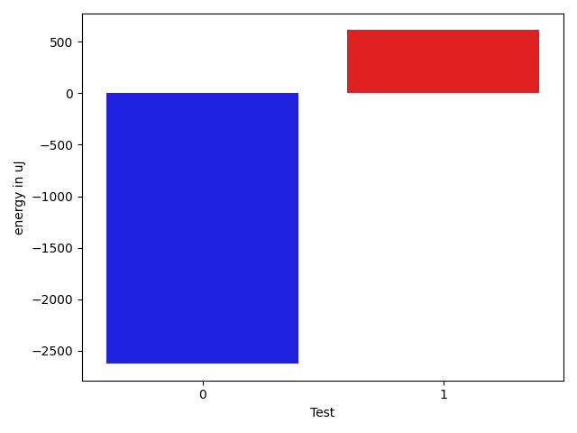

# gson 4fc640

https://github.com/google/gson/commit/4fc640

## Delta Energy per test method

| ID | EnergyV1 | EnergyV2 | DeltaEnergy | σV1 | σV2 |
| --- | --- | --- | --- | --- | --- |
| 0 | 37720 | 35095 | -2625 | 109139.87611708957 | 93905.01598269676 |
| 1 | 33203 | 33814 | 611 | 3967.5655799182928 | 6314.037487218461 |

## Delta Duration per test method

| ID | DurationV1 | DurationsV2 | DeltaDuration |
| --- | --- | --- | --- |
| 0 | 3210901.426829268 | 2588528.563218391 | -622372.8636108772 |
| 1 | 1318987.3214285714 | 1344783.85 | 25796.52857142873 |

## Misc.

| ID | Test Class | Test Method |
| --- | --- | --- |
| 0 | com.google.gson.functional.CustomTypeAdaptersTest | testCustomAdapterInvokedForCollectionElementDeserialization |
| 1 | com.google.gson.functional.CollectionTest | testSetDeserialization |

| Test | IterationV1 | IterationV2 | DeltaIteration |
| --- | --- | --- | --- |
| 0 | 82 | 87 | 5 |
| 1 | 84 | 80 | -4 |

| Time Label | Time (s) |
| --- | --- |
| Selection | 23.32769203186035 |
| Injection | 9.07464075088501 |
| Total | 942.0435545444489 |

