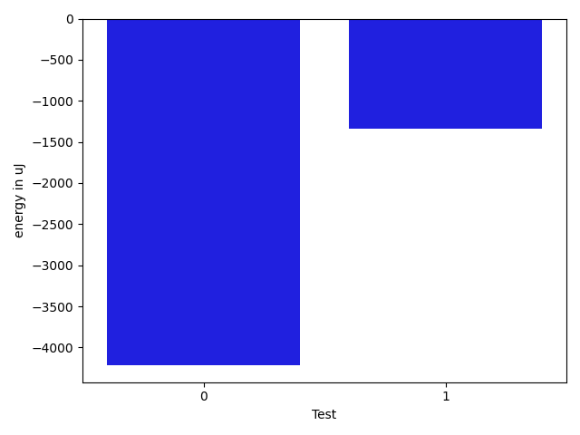

# gson 809e3b

https://github.com/google/gson/commit/809e3b

## Delta Energy per test method

| ID | EnergyV1 | EnergyV2 | DeltaEnergy | σV1 | σV2 |
| --- | --- | --- | --- | --- | --- |
| 0 | 41992 | 37780 | -4212 | 57088.60615526008 | 37784.82410659869 |
| 1 | 33447 | 32104 | -1343 | 4446.165860771233 | 3290.110266177939 |

## Delta Duration per test method

| ID | DurationV1 | DurationsV2 | DeltaDuration |
| --- | --- | --- | --- |
| 0 | 2431743.48 | 2076275.4615384615 | -355468.0184615385 |
| 1 | 959632.6 | 944862.4423076923 | -14770.157692307723 |

## Misc.

| ID | Test Class | Test Method |
| --- | --- | --- |
| 0 | com.google.gson.functional.DefaultTypeAdaptersTest | testUrlSerialization |
| 1 | com.google.gson.functional.DefaultTypeAdaptersTest | testUrlDeserialization |

| Test | IterationV1 | IterationV2 | DeltaIteration |
| --- | --- | --- | --- |
| 0 | 50 | 39 | -11 |
| 1 | 55 | 52 | -3 |

| Time Label | Time (s) |
| --- | --- |
| Selection | 23.25062084197998 |
| Injection | 8.561002731323242 |
| Total | 934.1662271022797 |

