# gson 2c7cc6

https://github.com/google/gson/commit/2c7cc6

## Delta Energy per test method

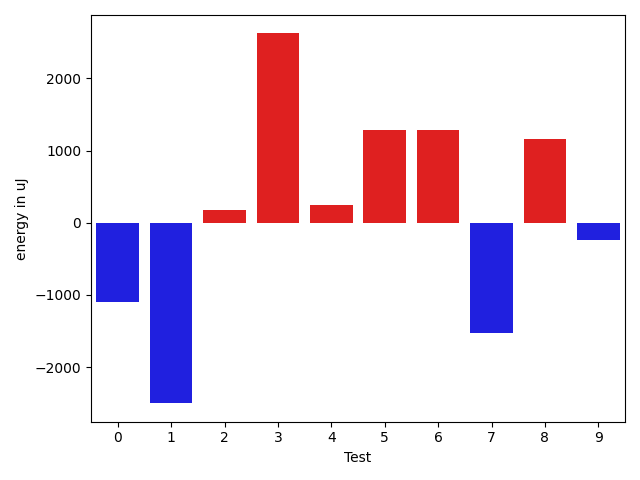

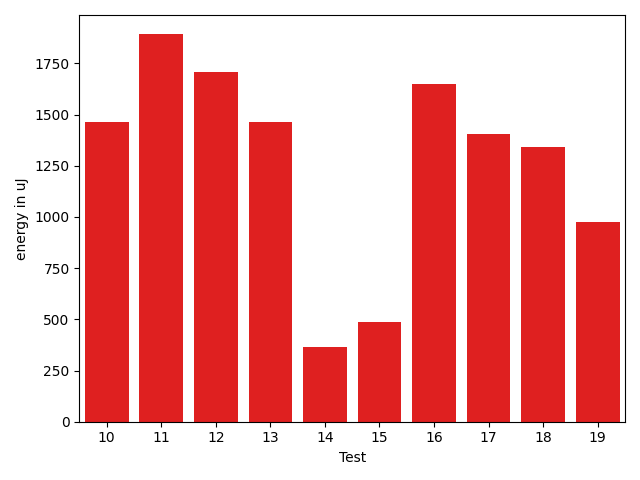

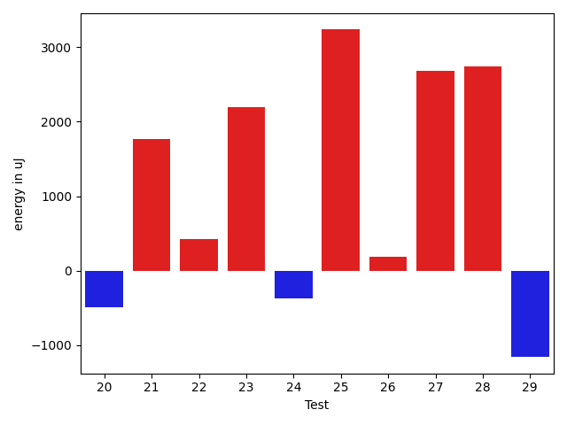

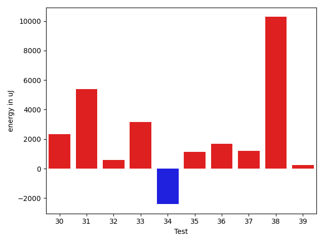

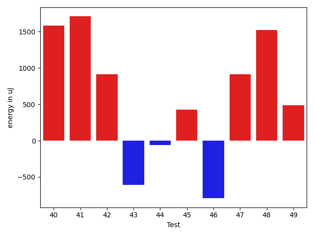

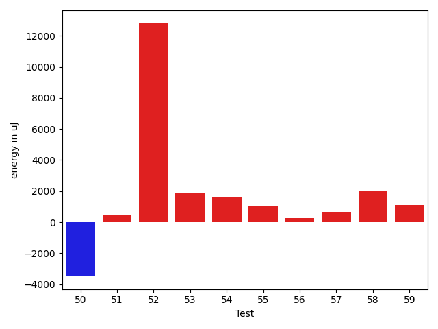

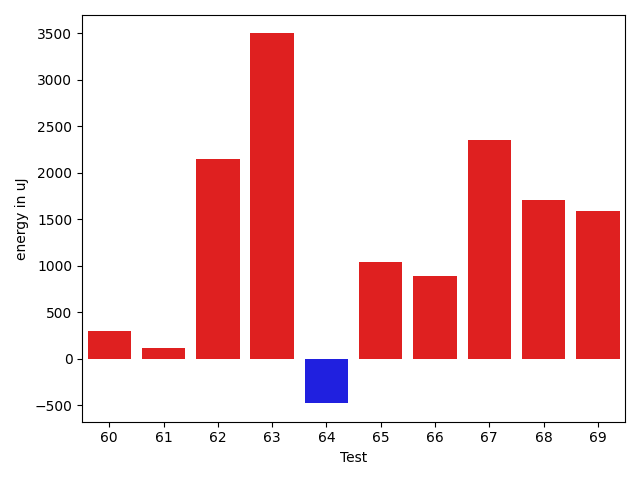

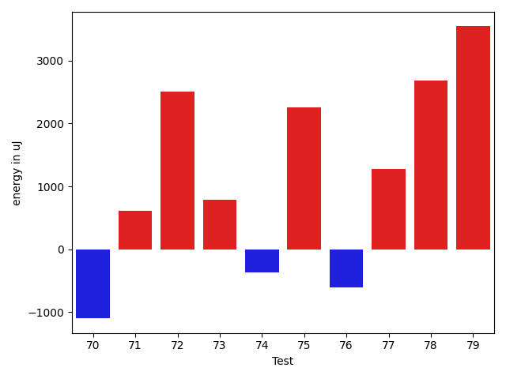

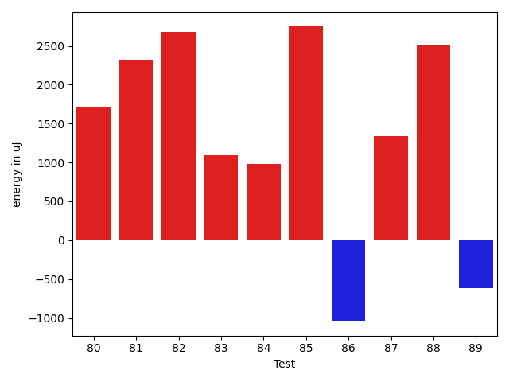

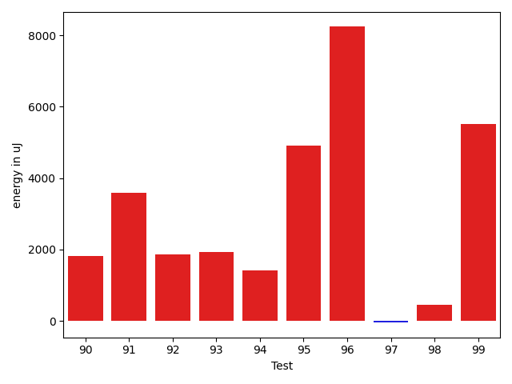

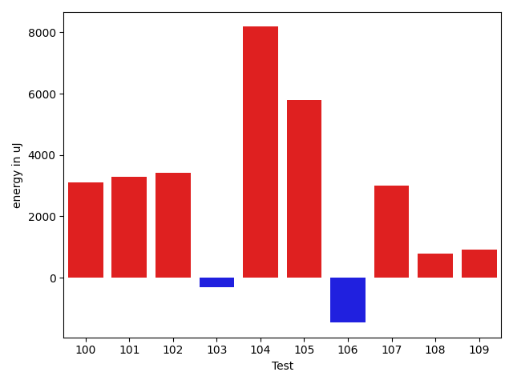

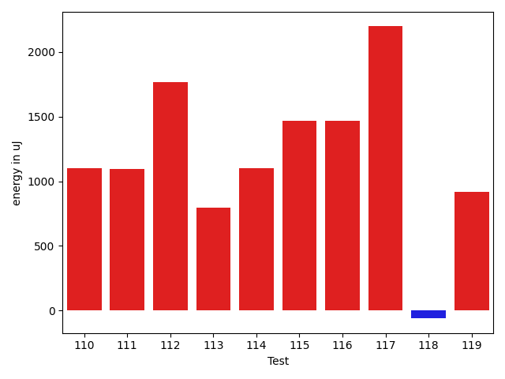

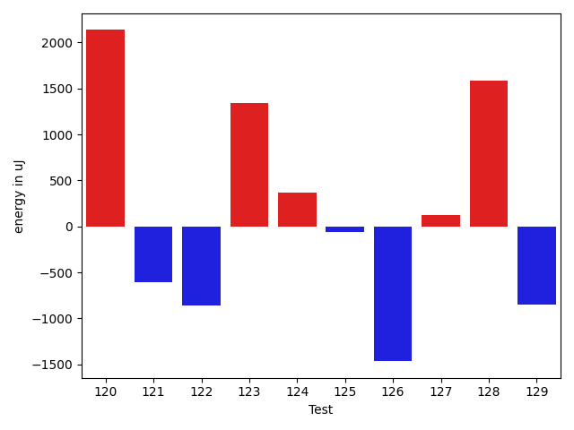

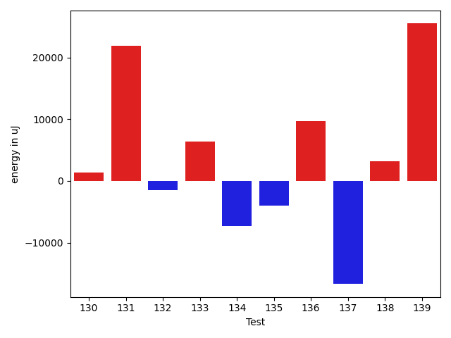

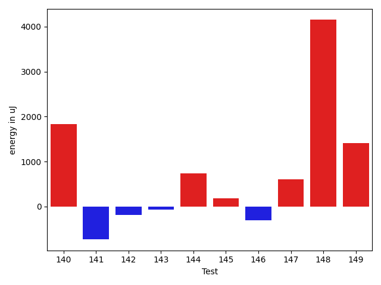

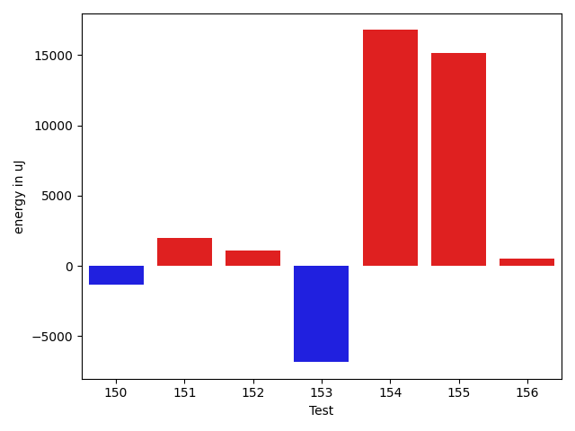

| ID | EnergyV1 | EnergyV2 | DeltaEnergy | σV1 | σV2 |
| --- | --- | --- | --- | --- | --- |
| 0 | 39490 | 38391 | -1099 | 122429.00355946293 | 79933.20775843595 |
| 1 | 38818 | 36316 | -2502 | 4326.1417695845585 | 4933.814527385755 |
| 2 | 36499 | 36682 | 183 | 9466.850976572 | 9407.979436114243 |
| 3 | 37598 | 40222 | 2624 | 20254.958146023422 | 21261.28096459459 |
| 4 | 36011 | 36254 | 243 | 6108.238664154562 | 10659.201330224692 |
| 5 | 35034 | 36316 | 1282 | 6208.126100912102 | 4709.592030120818 |
| 6 | 34546 | 35828 | 1282 | 28767.78725559562 | 3978.7843542343435 |
| 7 | 37658 | 36132 | -1526 | 4539.474600914047 | 4358.620133878453 |
| 8 | 34058 | 35217 | 1159 | 23719.606376465064 | 16209.999537652724 |
| 9 | 35950 | 35705 | -245 | 13998.548423558115 | 13761.533757306615 |
| 10 | 33142 | 34607 | 1465 | 8342.252046230182 | 35447.29682674573 |
| 11 | 33813 | 35705 | 1892 | 3345.967543637911 | 8063.312706382923 |
| 12 | 36255 | 37964 | 1709 | 3264.90766510086 | 40777.255178289604 |
| 13 | 35889 | 37353 | 1464 | 3918.156208873631 | 3240.434186271271 |
| 14 | 37598 | 37963 | 365 | 35256.722124944565 | 114330.78376717084 |
| 15 | 35461 | 35949 | 488 | 3608.0510096231783 | 4030.33842988092 |
| 16 | 34545 | 36194 | 1649 | 3546.05058088886 | 4495.184519454744 |
| 17 | 33142 | 34546 | 1404 | 73787.29022232628 | 6074.901761168473 |
| 18 | 34119 | 35462 | 1343 | 28207.170870955648 | 25264.749746525307 |
| 19 | 34790 | 35767 | 977 | 3018.7517787826005 | 4296.952949747501 |
| 20 | 36072 | 35583 | -489 | 3656.0480502252094 | 4282.592647514948 |
| 21 | 35278 | 37048 | 1770 | 3837.2618247558235 | 59798.23784203952 |
| 22 | 34363 | 34790 | 427 | 3351.6679421909835 | 3305.0382248073947 |
| 23 | 34546 | 36743 | 2197 | 3717.194431886022 | 3841.882640249867 |
| 24 | 35706 | 35339 | -367 | 3721.937277961606 | 4068.370984224249 |
| 25 | 33752 | 36987 | 3235 | 4450.618461670021 | 3133.4656226870006 |
| 26 | 35828 | 36011 | 183 | 3874.512866467493 | 3361.929705293276 |
| 27 | 33509 | 36193 | 2684 | 3433.9760986579167 | 4134.868507750747 |
| 28 | 34790 | 37536 | 2746 | 3296.258881979397 | 4127.070872907321 |
| 29 | 39307 | 38147 | -1160 | 53495.91232058057 | 56253.98421436477 |
| 30 | 37048 | 39245 | 2197 | 3824.2657570543543 | 3997.591573751944 |
| 31 | 34485 | 35950 | 1465 | 19615.137582958243 | 28698.138038676756 |
| 32 | 33874 | 34424 | 550 | 4156.769918549722 | 3804.57455074323 |
| 33 | 34241 | 37476 | 3235 | 3830.0980469939373 | 4360.627935162511 |
| 34 | 154174 | 155395 | 1221 | 52165.77823652146 | 24736.468733011327 |
| 35 | 34790 | 37232 | 2442 | 7297.813116439799 | 6958.832319980127 |
| 36 | 36438 | 37720 | 1282 | 4052.843318062148 | 3562.602489205574 |
| 37 | 37842 | 38452 | 610 | 4052.2376996420135 | 2473.873166355401 |
| 38 | 35157 | 36438 | 1281 | 3558.5386702718924 | 32485.670185653096 |
| 39 | 35584 | 35949 | 365 | 3771.2628073960827 | 3703.9726219796767 |
| 40 | 33874 | 35461 | 1587 | 3406.4606031421645 | 4729.047111476236 |
| 41 | 36621 | 38330 | 1709 | 4533.007650540819 | 4157.122141207014 |
| 42 | 37414 | 38330 | 916 | 3351.6546242117493 | 3628.0854405207747 |
| 43 | 37903 | 37293 | -610 | 32158.21137598443 | 54079.11355959652 |
| 44 | 36377 | 36316 | -61 | 9681.99158527346 | 14546.770068486427 |
| 45 | 35828 | 36254 | 426 | 3649.4400226457883 | 3967.406410309822 |
| 46 | 36376 | 35583 | -793 | 3914.837134700834 | 4583.260743488613 |
| 47 | 35889 | 36804 | 915 | 3689.052744871256 | 4273.750801840538 |
| 48 | 34973 | 36499 | 1526 | 4247.112384510994 | 3410.7320827059993 |
| 49 | 38147 | 38635 | 488 | 30374.630777224153 | 74581.59461536404 |
| 50 | 39917 | 37659 | -2258 | 27910.62337047442 | 24045.17479985308 |
| 51 | 35889 | 36682 | 793 | 6958.316426172741 | 4302.820643520904 |
| 52 | 35583 | 36926 | 1343 | 3459.7517191773586 | 41311.05075051241 |
| 53 | 36011 | 38330 | 2319 | 3265.6725789265856 | 3517.241511079856 |
| 54 | 36011 | 37109 | 1098 | 3419.8241569265388 | 6840.190090635863 |
| 55 | 36255 | 37963 | 1708 | 3537.2787754440005 | 3868.423472450825 |
| 56 | 35584 | 35766 | 182 | 3890.5053038615692 | 3700.244944594884 |
| 57 | 36560 | 36621 | 61 | 3687.623992986383 | 3564.1152793043775 |
| 58 | 34790 | 37353 | 2563 | 3491.9187272000395 | 4349.80371997907 |
| 59 | 34851 | 35645 | 794 | 2865.711990064598 | 2609.3441396871112 |
| 60 | 35461 | 35461 | 0 | 2949.270234594766 | 3674.483099070055 |
| 61 | 35706 | 36865 | 1159 | 3758.947952069993 | 3856.2534634538742 |
| 62 | 34180 | 36316 | 2136 | 3633.8272263860445 | 3498.625043824918 |
| 63 | 34790 | 37719 | 2929 | 3832.3228267284435 | 3882.08949504001 |
| 64 | 35096 | 34546 | -550 | 3726.7164313782746 | 3146.1930076201547 |
| 65 | 35217 | 34973 | -244 | 2244.8219366675276 | 3040.904350468469 |
| 66 | 34362 | 34851 | 489 | 4038.811827082422 | 3361.1559320337974 |
| 67 | 35767 | 38391 | 2624 | 3858.3916622263814 | 3175.5387615456643 |
| 68 | 35644 | 36682 | 1038 | 3573.6180707450476 | 3888.8008088542456 |
| 69 | 34363 | 35888 | 1525 | 3121.0618963013567 | 3631.0124893724337 |
| 70 | 35827 | 34729 | -1098 | 3314.6744277505554 | 4572.599327447682 |
| 71 | 39855 | 40466 | 611 | 89842.61954456072 | 73997.57533551642 |
| 72 | 35644 | 38147 | 2503 | 3683.9016131899157 | 3479.2146779190352 |
| 73 | 36865 | 37658 | 793 | 3915.701078138286 | 3887.3276246316686 |
| 74 | 36194 | 35827 | -367 | 3939.259217589627 | 3885.704060400619 |
| 75 | 34302 | 36560 | 2258 | 3134.3346139527316 | 3741.3459290670703 |
| 76 | 34912 | 34302 | -610 | 3095.1992762987006 | 3691.07880285546 |
| 77 | 35156 | 36438 | 1282 | 3964.264508944996 | 10331.75265935231 |
| 78 | 35278 | 37964 | 2686 | 3183.7859338797434 | 4200.4646537061635 |
| 79 | 33996 | 37537 | 3541 | 3120.385759055851 | 4630.8833285177625 |
| 80 | 34302 | 36011 | 1709 | 2152.6381676753726 | 4119.997641069017 |
| 81 | 36133 | 38452 | 2319 | 3246.4585477163905 | 3949.549693906444 |
| 82 | 33386 | 36071 | 2685 | 3277.4984853434444 | 4541.0809167925145 |
| 83 | 34790 | 35888 | 1098 | 3490.597710808025 | 3300.1421592816487 |
| 84 | 35461 | 36438 | 977 | 3318.378787225805 | 56337.84558505303 |
| 85 | 33813 | 36560 | 2747 | 2855.916767875775 | 3635.4892624371646 |
| 86 | 35889 | 34851 | -1038 | 4308.945780937091 | 2794.823618749018 |
| 87 | 34668 | 36010 | 1342 | 2617.974085381365 | 2757.259002351638 |
| 88 | 34119 | 36621 | 2502 | 4204.47474950105 | 2896.079870667236 |
| 89 | 35706 | 35095 | -611 | 2563.06030409918 | 4551.069258512327 |
| 90 | 35462 | 37659 | 2197 | 1970.8386818813963 | 4083.363752895588 |
| 91 | 35949 | 37048 | 1099 | 12470.00244586985 | 19423.236862726953 |
| 92 | 35095 | 36438 | 1343 | 6188.456620798113 | 7575.876142689042 |
| 93 | 34668 | 36560 | 1892 | 13286.07544911867 | 12479.29269315122 |
| 94 | 36194 | 36865 | 671 | 12879.528227965027 | 14143.49648941574 |
| 95 | 35767 | 36560 | 793 | 75447.90294736535 | 82978.13641903391 |
| 96 | 64636 | 69824 | 5188 | 19258.08378346395 | 33002.48352371049 |
| 97 | 38452 | 37781 | -671 | 17543.708453865274 | 19461.364945075973 |
| 98 | 35156 | 36621 | 1465 | 13042.567576440231 | 12241.7102605004 |
| 99 | 37781 | 40466 | 2685 | 18406.136902392795 | 19780.669989655795 |
| 100 | 36194 | 39306 | 3112 | 2667.837176780858 | 3484.3421957652326 |
| 101 | 35523 | 38819 | 3296 | 2389.4595016446715 | 5003.693276207771 |
| 102 | 35706 | 39123 | 3417 | 3055.351429868584 | 3314.432541576968 |
| 103 | 36682 | 36377 | -305 | 3456.8560084472706 | 4068.1787418993363 |
| 104 | 35278 | 43457 | 8179 | 42372.118434536475 | 68300.20044992547 |
| 105 | 33936 | 39733 | 5797 | 2260.4859911310605 | 4340.172984538091 |
| 106 | 37720 | 36254 | -1466 | 3687.6003611346573 | 3765.413157907091 |
| 107 | 35522 | 38513 | 2991 | 3952.972092686155 | 3810.166969942784 |
| 108 | 36560 | 37354 | 794 | 3752.472369403417 | 4052.452522806406 |
| 109 | 34485 | 35400 | 915 | 3199.9583675221834 | 3879.2783649350376 |
| 110 | 37597 | 38697 | 1100 | 56844.1800710558 | 91460.30129908281 |
| 111 | 36072 | 37170 | 1098 | 2613.2714703562233 | 3811.9257353709645 |
| 112 | 35828 | 37597 | 1769 | 3259.9601902381987 | 4057.0669147057456 |
| 113 | 36926 | 37719 | 793 | 66163.16331239599 | 44450.420024400286 |
| 114 | 35400 | 36499 | 1099 | 21972.049295917353 | 22721.58148901611 |
| 115 | 36377 | 37842 | 1465 | 3641.9400216240883 | 3423.4339037429368 |
| 116 | 35828 | 37293 | 1465 | 3468.711297230292 | 17192.996846771945 |
| 117 | 34302 | 36499 | 2197 | 5728.2387774512845 | 4344.050465943761 |
| 118 | 36437 | 36377 | -60 | 3350.4258580830497 | 4608.891988904124 |
| 119 | 36132 | 37048 | 916 | 7389.50217504953 | 9202.766218779003 |
| 120 | 38391 | 40527 | 2136 | 90284.84449147864 | 135379.62846617243 |
| 121 | 38147 | 37537 | -610 | 58157.39352515723 | 27771.832595165146 |
| 122 | 38697 | 37842 | -855 | 51163.16985118518 | 53235.44205945234 |
| 123 | 36377 | 37720 | 1343 | 4896.108201403312 | 3873.8522414011377 |
| 124 | 37658 | 38025 | 367 | 3793.232848957468 | 50872.120090378514 |
| 125 | 39123 | 39062 | -61 | 20664.48122154873 | 69540.45748371503 |
| 126 | 37659 | 36194 | -1465 | 3315.084986508406 | 4777.035148274761 |
| 127 | 35462 | 35583 | 121 | 4079.1546921184718 | 4021.066032333825 |
| 128 | 36621 | 38208 | 1587 | 4146.381554381245 | 3920.3790065031467 |
| 129 | 37781 | 36927 | -854 | 3805.7362750637462 | 3773.289670088953 |
| 130 | 339111 | 341918 | 2807 | 124890.0557842108 | 131503.4888037671 |
| 131 | 66162 | 70862 | 4700 | 39441.37760985392 | 78069.24962745536 |
| 132 | 41015 | 39917 | -1098 | 58328.415969481335 | 64579.46487090496 |
| 133 | 38879 | 40100 | 1221 | 143339.4038420001 | 144455.53143852658 |
| 134 | 37841 | 38696 | 855 | 50145.27850971992 | 37838.555347363756 |
| 135 | 73913 | 71777 | -2136 | 23805.83013395881 | 26608.690937350693 |
| 136 | 37110 | 39978 | 2868 | 39763.911416338306 | 44983.91170957062 |
| 137 | 40771 | 39307 | -1464 | 99293.5402464424 | 91359.69842087328 |
| 138 | 35583 | 39184 | 3601 | 3536.205361029235 | 5150.905695042802 |
| 139 | 38086 | 41321 | 3235 | 51208.84958036484 | 79275.71313752724 |
| 140 | 37292 | 39123 | 1831 | 29259.62425574029 | 16084.893175599862 |
| 141 | 36926 | 36194 | -732 | 3838.270082866101 | 4392.27073802943 |
| 142 | 36621 | 36438 | -183 | 22896.061826213932 | 3604.8909934108965 |
| 143 | 36866 | 36804 | -62 | 6444.405158368544 | 8049.390864593938 |
| 144 | 36987 | 37720 | 733 | 3598.3153517838523 | 3669.5502940656206 |
| 145 | 37476 | 37659 | 183 | 35187.95780384917 | 51546.394002154906 |
| 146 | 37720 | 37415 | -305 | 3804.398194172436 | 4043.215619205638 |
| 147 | 39001 | 39612 | 611 | 61721.11213472663 | 96738.2473114055 |
| 148 | 36682 | 40833 | 4151 | 16209.440411555926 | 24584.808509797564 |
| 149 | 37658 | 39062 | 1404 | 57955.43968215393 | 63905.75532701338 |
| 150 | 37841 | 36682 | -1159 | 3899.1667363803817 | 2634.414044420128 |
| 151 | 37232 | 40711 | 3479 | 3959.9823045756134 | 3502.971961347032 |
| 152 | 37049 | 38880 | 1831 | 62041.073516950324 | 73856.57200818353 |
| 153 | 37110 | 37720 | 610 | 32354.259658375555 | 8535.773530942697 |
| 154 | 36316 | 37414 | 1098 | 6035.587997501647 | 46537.1996294435 |
| 155 | 41015 | 41199 | 184 | 67378.80937851242 | 92123.86719687885 |
| 156 | 36438 | 37414 | 976 | 4160.15054790791 | 3590.06212735307 |

## Delta Duration per test method

| ID | DurationV1 | DurationsV2 | DeltaDuration |
| --- | --- | --- | --- |
| 0 | 2527719.647887324 | 1668976.4603174604 | -858743.1875698636 |
| 1 | 905959.7380952381 | 801663.0869565217 | -104296.65113871638 |
| 2 | 1094357.6133333333 | 1108441.1282051282 | 14083.514871794963 |
| 3 | 1543834.941860465 | 1602196.0 | 58361.0581395349 |
| 4 | 1107538.670886076 | 1128407.9166666667 | 20869.24578059069 |
| 5 | 924731.5087719298 | 909147.3538461538 | -15584.154925775947 |
| 6 | 821823.5111111111 | 659351.90625 | -162471.60486111115 |
| 7 | 674066.9375 | 661353.6388888889 | -12713.298611111124 |
| 8 | 867813.0681818182 | 798577.9655172414 | -69235.10266457684 |
| 9 | 1078392.6129032257 | 1064994.650793651 | -13397.962109574815 |
| 10 | 884010.8245614035 | 1004359.8139534884 | 120348.98939208488 |
| 11 | 818365.1702127659 | 878943.5306122449 | 60578.36039947893 |
| 12 | 684425.9736842106 | 835064.2894736842 | 150638.3157894736 |
| 13 | 636460.4242424242 | 664368.4666666667 | 27908.042424242478 |
| 14 | 1233491.9777777777 | 2156455.7441860465 | 922963.7664082688 |
| 15 | 614460.5609756098 | 646916.0 | 32455.439024390187 |
| 16 | 518231.5833333333 | 508165.0 | -10066.583333333314 |
| 17 | 1001306.7352941176 | 632543.275862069 | -368763.4594320486 |
| 18 | 1384412.44 | 1339381.7260273972 | -45030.71397260274 |
| 19 | 544457.0882352941 | 652402.4375 | 107945.3492647059 |
| 20 | 894090.6166666667 | 933319.1403508772 | 39228.52368421049 |
| 21 | 746470.5 | 1017087.2127659575 | 270616.71276595746 |
| 22 | 902343.6363636364 | 826160.1090909091 | -76183.52727272722 |
| 23 | 463824.3703703704 | 533569.9411764706 | 69745.57080610021 |
| 24 | 593510.5 | 693594.0 | 100083.5 |
| 25 | 616059.1851851852 | 583264.7931034482 | -32794.392081736936 |
| 26 | 605542.8823529412 | 604955.4333333333 | -587.449019607855 |
| 27 | 420451.92307692306 | 456473.0833333333 | 36021.16025641025 |
| 28 | 742410.6428571428 | 743832.775 | 1422.1321428571828 |
| 29 | 1368870.8823529412 | 1280250.575 | -88620.30735294125 |
| 30 | 519926.3181818182 | 508700.73076923075 | -11225.587412587425 |
| 31 | 1169401.168831169 | 1236205.8289473683 | 66804.6601161994 |
| 32 | 738093.976744186 | 736279.7692307692 | -1814.207513416768 |
| 33 | 534477.9545454546 | 478239.4210526316 | -56238.533492823015 |
| 34 | 4971908.6161616165 | 4759995.777777778 | -211912.83838383853 |
| 35 | 823411.4042553192 | 824608.78 | 1197.375744680874 |
| 36 | 504500.0 | 576816.6875 | 72316.6875 |
| 37 | 518478.76 | 515392.5263157895 | -3086.233684210514 |
| 38 | 665958.2325581395 | 1004713.9677419355 | 338755.73518379603 |
| 39 | 631835.8 | 614305.625 | -17530.175000000047 |
| 40 | 687527.3783783783 | 743987.8611111111 | 56460.48273273278 |
| 41 | 505371.82352941175 | 473985.0 | -31386.823529411748 |
| 42 | 881009.9 | 930079.619047619 | 49069.71904761903 |
| 43 | 1109695.8412698412 | 1508158.5818181818 | 398462.7405483406 |
| 44 | 1142606.5526315789 | 1219232.0506329115 | 76625.49800133263 |
| 45 | 925353.7833333333 | 906415.7205882353 | -18938.062745098025 |
| 46 | 820441.3125 | 867332.0508474576 | 46890.738347457605 |
| 47 | 780384.6363636364 | 786585.6666666666 | 6201.030303030275 |
| 48 | 851604.0333333333 | 860916.2666666667 | 9312.233333333395 |
| 49 | 1391958.2054794522 | 1778852.9868421052 | 386894.781362653 |
| 50 | 1713296.731958763 | 1668222.1030927836 | -45074.62886597938 |
| 51 | 1002870.2686567164 | 971772.4179104478 | -31097.85074626864 |
| 52 | 831192.4489795918 | 1076369.1395348837 | 245176.69055529183 |
| 53 | 858171.9795918367 | 845790.4423076923 | -12381.537284144433 |
| 54 | 874530.7301587302 | 909231.9454545454 | 34701.21529581526 |
| 55 | 784620.5818181818 | 794513.2592592592 | 9892.677441077423 |
| 56 | 742402.95 | 762140.12 | 19737.170000000042 |
| 57 | 839049.7962962963 | 808947.8928571428 | -30101.90343915345 |
| 58 | 716355.7837837838 | 646539.0833333334 | -69816.70045045041 |
| 59 | 431663.6 | 452149.1304347826 | 20485.530434782617 |
| 60 | 560777.5 | 506856.4285714286 | -53921.07142857142 |
| 61 | 466398.2631578947 | 467312.8 | 914.5368421052699 |
| 62 | 499585.8214285714 | 479383.2380952381 | -20202.583333333314 |
| 63 | 490870.0833333333 | 499277.3 | 8407.216666666674 |
| 64 | 581640.0243902439 | 582925.4594594594 | 1285.435069215484 |
| 65 | 477834.4375 | 484418.8947368421 | 6584.457236842078 |
| 66 | 654865.5116279069 | 574891.4210526316 | -79974.09057527536 |
| 67 | 711717.5945945946 | 658920.0 | -52797.59459459456 |
| 68 | 745012.4444444445 | 737472.4489795918 | -7539.995464852662 |
| 69 | 506905.6666666667 | 507197.275862069 | 291.6091954022995 |
| 70 | 481823.54545454547 | 468326.3125 | -13497.23295454547 |
| 71 | 2158919.0 | 1764132.5135135136 | -394786.4864864864 |
| 72 | 488967.8214285714 | 539655.0869565217 | 50687.26552795031 |
| 73 | 646561.2666666667 | 588870.3214285715 | -57690.94523809524 |
| 74 | 596551.5217391305 | 608692.0 | 12140.47826086951 |
| 75 | 516765.94444444444 | 514900.6153846154 | -1865.3290598290623 |
| 76 | 541559.0 | 532804.3333333334 | -8754.666666666628 |
| 77 | 1005128.3913043478 | 1078337.3404255318 | 73208.94912118407 |
| 78 | 543380.1379310344 | 545354.1282051282 | 1973.9902740938123 |
| 79 | 498549.63157894736 | 470036.125 | -28513.50657894736 |
| 80 | 533900.4074074074 | 517301.5925925926 | -16598.814814814832 |
| 81 | 573971.7142857143 | 540339.074074074 | -33632.640211640275 |
| 82 | 446348.5714285714 | 466062.5714285714 | 19714.0 |
| 83 | 509377.42307692306 | 455861.4736842105 | -53515.94939271256 |
| 84 | 499281.1785714286 | 1307270.3448275863 | 807989.1662561577 |
| 85 | 560091.2380952381 | 557263.5714285715 | -2827.666666666628 |
| 86 | 441236.4166666667 | 461916.1818181818 | 20679.765151515137 |
| 87 | 492549.94444444444 | 457794.82608695654 | -34755.118357487896 |
| 88 | 573073.4848484849 | 590374.0370370371 | 17300.552188552218 |
| 89 | 620423.3928571428 | 552122.0606060605 | -68301.33225108229 |
| 90 | 494061.4 | 461150.0 | -32911.40000000002 |
| 91 | 1369955.7448979593 | 1434423.9894736842 | 64468.24457572494 |
| 92 | 1112284.7 | 1131854.511904762 | 19569.81190476194 |
| 93 | 1306788.1630434783 | 1323473.847826087 | 16685.684782608645 |
| 94 | 1409717.2653061224 | 1407133.298969072 | -2583.9663370503113 |
| 95 | 1990910.6666666667 | 2069488.4222222222 | 78577.75555555546 |
| 96 | 2045964.0808080807 | 2115253.707070707 | 69289.62626262615 |
| 97 | 1502298.2441860465 | 1468090.4444444445 | -34207.79974160204 |
| 98 | 1323935.6344086023 | 1325837.948979592 | 1902.3145709896926 |
| 99 | 1671179.5353535353 | 1703883.9292929294 | 32704.393939394038 |
| 100 | 477698.8095238095 | 464329.86363636365 | -13368.94588744588 |
| 101 | 436606.9 | 486506.1538461539 | 49899.25384615385 |
| 102 | 449535.95 | 457816.4117647059 | 8280.461764705891 |
| 103 | 514097.9130434783 | 504817.125 | -9280.788043478271 |
| 104 | 925292.9523809524 | 2610298.5625 | 1685005.6101190476 |
| 105 | 465407.5238095238 | 512942.5714285714 | 47535.04761904763 |
| 106 | 575470.2173913043 | 512909.70967741933 | -62560.50771388499 |
| 107 | 532791.5666666667 | 546481.0454545454 | 13689.478787878761 |
| 108 | 474577.92307692306 | 457032.32 | -17545.603076923057 |
| 109 | 498507.5652173913 | 427315.14285714284 | -71192.42236024846 |
| 110 | 1384190.5925925926 | 2114247.6363636362 | 730057.0437710437 |
| 111 | 464437.22222222225 | 399246.3181818182 | -65190.90404040407 |
| 112 | 851853.1346153846 | 818886.92 | -32966.21461538458 |
| 113 | 1485076.3731343283 | 1175261.786885246 | -309814.58624908235 |
| 114 | 941145.0333333333 | 916804.0655737704 | -24340.96775956289 |
| 115 | 786175.8039215687 | 786314.0909090909 | 138.28698752226774 |
| 116 | 801610.0681818182 | 1027385.4680851063 | 225775.3999032881 |
| 117 | 1081325.488095238 | 1064495.6363636365 | -16829.851731601637 |
| 118 | 815235.8085106383 | 783440.5384615385 | -31795.27004909981 |
| 119 | 780199.3703703703 | 830981.675 | 50782.30462962971 |
| 120 | 1888715.3703703703 | 2904144.722222222 | 1015429.3518518517 |
| 121 | 1266162.8333333333 | 897329.6428571428 | -368833.1904761904 |
| 122 | 1320612.5714285714 | 1514614.7857142857 | 194002.21428571432 |
| 123 | 500207.347826087 | 517833.7619047619 | 17626.41407867492 |
| 124 | 1033498.4838709678 | 1500726.4137931035 | 467227.9299221358 |
| 125 | 1097636.245614035 | 1494218.7307692308 | 396582.4851551957 |
| 126 | 718971.46875 | 650687.9268292683 | -68283.54192073166 |
| 127 | 945625.5357142857 | 892238.85 | -53386.685714285704 |
| 128 | 583718.8888888889 | 600864.3225806452 | 17145.433691756334 |
| 129 | 581439.1481481482 | 571489.72 | -9949.428148148232 |
| 130 | 10527714.777777778 | 10283397.91919192 | -244316.85858585872 |
| 131 | 2048325.0909090908 | 2647932.4343434344 | 599607.3434343436 |
| 132 | 2055629.935483871 | 2029023.7142857143 | -26606.22119815671 |
| 133 | 2862823.14893617 | 3190163.4782608696 | 327340.3293246995 |
| 134 | 1719913.705882353 | 1365523.836734694 | -354389.86914765905 |
| 135 | 2229655.090909091 | 2150284.585858586 | -79370.50505050505 |
| 136 | 784527.28 | 1036836.9444444445 | 252309.66444444447 |
| 137 | 2953406.21875 | 2340948.4137931033 | -612457.8049568967 |
| 138 | 474841.5909090909 | 460395.5789473684 | -14446.011961722455 |
| 139 | 1034931.9032258064 | 2006425.0 | 971493.0967741936 |
| 140 | 1059234.7592592593 | 1117433.734375 | 58198.97511574067 |
| 141 | 653248.4761904762 | 647251.7105263158 | -5996.765664160368 |
| 142 | 806998.0465116279 | 753433.175 | -53564.8715116278 |
| 143 | 1008915.8923076923 | 1002538.2542372881 | -6377.63807040418 |
| 144 | 867243.2280701754 | 897696.8125 | 30453.58442982461 |
| 145 | 1228864.7586206896 | 1326224.2096774194 | 97359.45105672977 |
| 146 | 820769.0769230769 | 786015.0909090909 | -34753.98601398594 |
| 147 | 1219271.25 | 2162859.1785714286 | 943587.9285714286 |
| 148 | 1128465.4523809524 | 1279956.8292682928 | 151491.37688734033 |
| 149 | 1555039.7068965517 | 1655277.2857142857 | 100237.57881773403 |
| 150 | 574769.0952380953 | 485080.8181818182 | -89688.27705627709 |
| 151 | 568649.304347826 | 631469.3181818182 | 62820.01383399218 |
| 152 | 1684001.0943396227 | 1607611.1555555556 | -76389.93878406705 |
| 153 | 1018885.6304347826 | 761569.0714285715 | -257316.55900621112 |
| 154 | 649824.59375 | 1086733.9677419355 | 436909.3739919355 |
| 155 | 2182690.7804878047 | 2319887.4736842103 | 137196.69319640566 |
| 156 | 734817.340425532 | 784715.6578947369 | 49898.31746920489 |

## Misc.

| ID | Test Class | Test Method |
| --- | --- | --- |
| 0 | com.google.gson.functional.CustomDeserializerTest | testDefaultConstructorNotCalledOnObject |
| 1 | com.google.gson.functional.CustomDeserializerTest | testDefaultConstructorNotCalledOnField |
| 2 | com.google.gson.functional.ObjectTest | testDirectedAcyclicGraphDeserialization |
| 3 | com.google.gson.functional.ObjectTest | testArrayOfArraysDeserialization |
| 4 | com.google.gson.functional.ObjectTest | testArrayOfObjectsDeserialization |
| 5 | com.google.gson.functional.ObjectTest | testNestedDeserialization |
| 6 | com.google.gson.functional.ObjectTest | testBagOfPrimitiveWrappersDeserialization |
| 7 | com.google.gson.functional.ObjectTest | testBagOfPrimitivesDeserialization |
| 8 | com.google.gson.functional.ObjectTest | testEmptyCollectionInAnObjectDeserialization |
| 9 | com.google.gson.functional.ObjectTest | testStringFieldWithNumberValueDeserialization |
| 10 | com.google.gson.functional.ObjectTest | testPrimitiveArrayInAnObjectDeserialization |
| 11 | com.google.gson.functional.ObjectTest | testNullArraysDeserialization |
| 12 | com.google.gson.functional.ObjectTest | testNullDeserialization |
| 13 | com.google.gson.functional.ObjectTest | testClassWithEnumFieldDeserialization |
| 14 | com.google.gson.functional.ObjectTest | testJsonInSingleQuotesDeserialization |
| 15 | com.google.gson.functional.ObjectTest | testJsonInMixedQuotesDeserialization |
| 16 | com.google.gson.functional.ObjectTest | testNullPrimitiveFieldsDeserialization |
| 17 | com.google.gson.functional.ObjectTest | testNullObjectFieldsDeserialization |
| 18 | com.google.gson.functional.ObjectTest | testSubInterfacesOfCollectionDeserialization |
| 19 | com.google.gson.functional.ObjectTest | testObjectFieldNamesWithoutQuotesDeserialization |
| 20 | com.google.gson.functional.ObjectTest | testInheritenceDeserialization |
| 21 | com.google.gson.functional.ObjectTest | testNullFieldsDeserialization |
| 22 | com.google.gson.functional.ObjectTest | testInnerClassDeserialization |
| 23 | com.google.gson.functional.ObjectTest | testClassWithNoFieldsDeserialization |
| 24 | com.google.gson.functional.ObjectTest | testClassWithTransientFieldsDeserialization |
| 25 | com.google.gson.functional.ObjectTest | testPrivateNoArgConstructorDeserialization |
| 26 | com.google.gson.functional.ObjectTest | testClassWithTransientFieldsDeserializationTransientFieldsPassedInJsonAreIgnored |
| 27 | com.google.gson.functional.ObjectTest | testTopLevelEnumDeserialization |
| 28 | com.google.gson.functional.DefaultTypeAdaptersTest | testBadValueForBigDecimalDeserialization |
| 29 | com.google.gson.functional.DefaultTypeAdaptersTest | testUrlDeserialization |
| 30 | com.google.gson.functional.DefaultTypeAdaptersTest | testUuidDeserialization |
| 31 | com.google.gson.functional.DefaultTypeAdaptersTest | testDefaultDateDeserializationUsingBuilder |
| 32 | com.google.gson.functional.DefaultTypeAdaptersTest | testDateDeserializationWithPattern |
| 33 | com.google.gson.functional.DefaultTypeAdaptersTest | testLocaleDeserializationWithLanguageCountryVariant |
| 34 | com.google.gson.functional.DefaultTypeAdaptersTest | testDefaultDateDeserialization |
| 35 | com.google.gson.functional.DefaultTypeAdaptersTest | testUrlNullDeserialization |
| 36 | com.google.gson.functional.DefaultTypeAdaptersTest | testUriDeserialization |
| 37 | com.google.gson.functional.DefaultTypeAdaptersTest | testLocaleDeserializationWithLanguage |
| 38 | com.google.gson.functional.DefaultTypeAdaptersTest | testBigDecimalFieldDeserialization |
| 39 | com.google.gson.functional.DefaultTypeAdaptersTest | testBigIntegerFieldDeserialization |
| 40 | com.google.gson.functional.DefaultTypeAdaptersTest | testPropertiesDeserialization |
| 41 | com.google.gson.functional.DefaultTypeAdaptersTest | testLocaleDeserializationWithLanguageCountry |
| 42 | com.google.gson.functional.CustomTypeAdaptersTest | testCustomAdapterInvokedForMapElementDeserialization |
| 43 | com.google.gson.functional.CustomTypeAdaptersTest | testCustomDeserializers |
| 44 | com.google.gson.functional.CustomTypeAdaptersTest | testCustomDeserializerForLong |
| 45 | com.google.gson.functional.CustomTypeAdaptersTest | testCustomNestedDeserializers |
| 46 | com.google.gson.functional.CustomTypeAdaptersTest | testCustomByteArrayDeserializerAndInstanceCreator |
| 47 | com.google.gson.functional.CollectionTest | testNullsInListDeserialization |
| 48 | com.google.gson.functional.CollectionTest | testWildcardPrimitiveCollectionDeserilaization |
| 49 | com.google.gson.functional.CollectionTest | testTopLevelCollectionOfIntegersDeserialization |
| 50 | com.google.gson.functional.CollectionTest | testWildcardCollectionField |
| 51 | com.google.gson.functional.CollectionTest | testTopLevelListOfIntegerCollectionsDeserialization |
| 52 | com.google.gson.functional.CollectionTest | testRawCollectionOfBagOfPrimitivesNotAllowed |
| 53 | com.google.gson.functional.CollectionTest | testLinkedListDeserialization |
| 54 | com.google.gson.functional.CollectionTest | testRawCollectionDeserializationNotAlllowed |
| 55 | com.google.gson.functional.CollectionTest | testQueueDeserialization |
| 56 | com.google.gson.functional.CollectionTest | testCollectionOfStringsDeserialization |
| 57 | com.google.gson.functional.CollectionTest | testCollectionOfEnumsDeserialization |
| 58 | com.google.gson.functional.PrimitiveTest | testPrimitiveBooleanAutoboxedDeserialization |
| 59 | com.google.gson.functional.PrimitiveTest | testSmallValueForBigIntegerDeserialization |
| 60 | com.google.gson.functional.PrimitiveTest | testDoubleInfinityDeserialization |
| 61 | com.google.gson.functional.PrimitiveTest | testBigDecimalInfinityDeserializationNotSupported |
| 62 | com.google.gson.functional.PrimitiveTest | testNegativeInfinityDeserialization |
| 63 | com.google.gson.functional.PrimitiveTest | testBigIntegerInASingleElementArrayDeserialization |
| 64 | com.google.gson.functional.PrimitiveTest | testBadValueForBigIntegerDeserialization |
| 65 | com.google.gson.functional.PrimitiveTest | testSmallValueForBigDecimalDeserialization |
| 66 | com.google.gson.functional.PrimitiveTest | testOverridingDefaultPrimitiveSerialization |
| 67 | com.google.gson.functional.PrimitiveTest | testPrimitiveIntegerAutoboxedDeserialization |
| 68 | com.google.gson.functional.PrimitiveTest | testDoubleAsStringRepresentationDeserialization |
| 69 | com.google.gson.functional.PrimitiveTest | testBigIntegerDeserialization |
| 70 | com.google.gson.functional.PrimitiveTest | testBigDecimalNoFractAsStringRepresentationDeserialization |
| 71 | com.google.gson.functional.PrimitiveTest | testPrimitiveIntegerAutoboxedInASingleElementArrayDeserialization |
| 72 | com.google.gson.functional.PrimitiveTest | testReallyLongValuesDeserialization |
| 73 | com.google.gson.functional.PrimitiveTest | testNumberDeserialization |
| 74 | com.google.gson.functional.PrimitiveTest | testPrimitiveBooleanAutoboxedInASingleElementArrayDeserialization |
| 75 | com.google.gson.functional.PrimitiveTest | testFloatNaNDeserialization |
| 76 | com.google.gson.functional.PrimitiveTest | testPrimitiveDoubleAutoboxedInASingleElementArrayDeserialization |
| 77 | com.google.gson.functional.PrimitiveTest | testPrimitiveDoubleAutoboxedDeserialization |
| 78 | com.google.gson.functional.PrimitiveTest | testPrimitiveLongAutoboxedInASingleElementArrayDeserialization |
| 79 | com.google.gson.functional.PrimitiveTest | testBigDecimalPreservePrecisionDeserialization |
| 80 | com.google.gson.functional.PrimitiveTest | testDoubleNaNDeserialization |
| 81 | com.google.gson.functional.PrimitiveTest | testPrimitiveLongAutoboxedDeserialization |
| 82 | com.google.gson.functional.PrimitiveTest | testBigDecimalNegativeInfinityDeserializationNotSupported |
| 83 | com.google.gson.functional.PrimitiveTest | testBigDecimalInASingleElementArrayDeserialization |
| 84 | com.google.gson.functional.PrimitiveTest | testNegativeInfinityFloatDeserialization |
| 85 | com.google.gson.functional.PrimitiveTest | testDoubleNoFractAsStringRepresentationDeserialization |
| 86 | com.google.gson.functional.PrimitiveTest | testBigDecimalDeserialization |
| 87 | com.google.gson.functional.PrimitiveTest | testBigDecimalAsStringRepresentationDeserialization |
| 88 | com.google.gson.functional.PrimitiveTest | testBigDecimalNaNDeserializationNotSupported |
| 89 | com.google.gson.functional.PrimitiveTest | testLongAsStringDeserialization |
| 90 | com.google.gson.functional.PrimitiveTest | testFloatInfinityDeserialization |
| 91 | com.google.gson.functional.ParameterizedTypesTest | testVariableTypeArrayDeserialization |
| 92 | com.google.gson.functional.ParameterizedTypesTest | testParameterizedTypeWithReaderDeserialization |
| 93 | com.google.gson.functional.ParameterizedTypesTest | testVariableTypeDeserialization |
| 94 | com.google.gson.functional.ParameterizedTypesTest | testParameterizedTypeGenericArraysDeserialization |
| 95 | com.google.gson.functional.ParameterizedTypesTest | testParameterizedTypeDeserialization |
| 96 | com.google.gson.functional.ParameterizedTypesTest | testVariableTypeFieldsAndGenericArraysDeserialization |
| 97 | com.google.gson.functional.ParameterizedTypesTest | testTypesWithMultipleParametersDeserialization |
| 98 | com.google.gson.functional.ParameterizedTypesTest | testParameterizedTypeWithVariableTypeDeserialization |
| 99 | com.google.gson.functional.ParameterizedTypesTest | testParameterizedTypesWithCustomDeserializer |
| 100 | com.google.gson.functional.StringTest | testEscapedCtrlNInStringDeserialization |
| 101 | com.google.gson.functional.StringTest | testEscapedBackslashInStringDeserialization |
| 102 | com.google.gson.functional.StringTest | testEscapedCtrlRInStringDeserialization |
| 103 | com.google.gson.functional.StringTest | testEscapingQuotesInStringSerialization |
| 104 | com.google.gson.functional.StringTest | testStringWithEscapedSlashDeserialization |
| 105 | com.google.gson.functional.StringTest | testAssignmentCharDeserialization |
| 106 | com.google.gson.functional.StringTest | testStringValueAsSingleElementArrayDeserialization |
| 107 | com.google.gson.functional.StringTest | testSingleQuoteInStringSerialization |
| 108 | com.google.gson.functional.StringTest | testJavascriptKeywordsInStringDeserialization |
| 109 | com.google.gson.functional.StringTest | testEscapingQuotesInStringDeserialization |
| 110 | com.google.gson.functional.StringTest | testStringValueDeserialization |
| 111 | com.google.gson.functional.StringTest | testSingleQuoteInStringDeserialization |
| 112 | com.google.gson.functional.MapTest | testMapDeserializationWithNullKey |
| 113 | com.google.gson.functional.MapTest | testMapDeserialization |
| 114 | com.google.gson.functional.MapTest | testMapDeserializationWithWildcardValues |
| 115 | com.google.gson.functional.MapTest | testMapDeserializationEmpty |
| 116 | com.google.gson.functional.MapTest | testMapDeserializationWithIntegerKeys |
| 117 | com.google.gson.functional.MapTest | testParameterizedMapSubclassDeserialization |
| 118 | com.google.gson.functional.MapTest | testMapDeserializationWithNullValue |
| 119 | com.google.gson.GsonTypeAdapterTest | testDefaultTypeAdapterThrowsParseException |
| 120 | com.google.gson.GsonTypeAdapterTest | testTypeAdapterDoesNotAffectNonAdaptedTypes |
| 121 | com.google.gson.GsonTypeAdapterTest | testTypeAdapterProperlyConvertsTypes |
| 122 | com.google.gson.GsonTypeAdapterTest | testTypeAdapterThrowsException |
| 123 | com.google.gson.functional.ArrayTest | testArrayOfStringsDeserialization |
| 124 | com.google.gson.functional.ArrayTest | testTopLevelEnumInASingleElementArrayDeserialization |
| 125 | com.google.gson.functional.ArrayTest | testTopLevelArrayOfIntsDeserialization |
| 126 | com.google.gson.functional.ArrayTest | testArrayOfPrimitivesWithCustomTypeAdapter |
| 127 | com.google.gson.functional.ArrayTest | testArrayOfCollectionDeserialization |
| 128 | com.google.gson.functional.ArrayTest | testNullsInArrayDeserialization |
| 129 | com.google.gson.functional.ArrayTest | testEmptyArrayDeserialization |
| 130 | com.google.gson.functional.ConcurrencyTest | testMultiThreadDeserialization |
| 131 | com.google.gson.functional.ConcurrencyTest | testSingleThreadDeserialization |
| 132 | com.google.gson.functional.EscapingTest | testEscapingObjectFields |
| 133 | com.google.gson.functional.EscapingTest | testEscapingQuotesInStringArray |
| 134 | com.google.gson.functional.UncategorizedTest | testInvalidJsonDeserializationFails |
| 135 | com.google.gson.functional.UncategorizedTest | testReturningDerivedClassesDuringDeserialization |
| 136 | com.google.gson.functional.InternationalizationTest | testStringsWithUnicodeChineseCharactersEscapedDeserialization |
| 137 | com.google.gson.functional.InternationalizationTest | testStringsWithRawChineseCharactersDeserialization |
| 138 | com.google.gson.functional.InternationalizationTest | testStringsWithUnicodeChineseCharactersDeserialization |
| 139 | com.google.gson.functional.EnumTest | testEnumDeserialization |
| 140 | com.google.gson.functional.EnumTest | testEnumFieldDeserialization |
| 141 | com.google.gson.functional.VersioningTest | testIgnoreLaterVersionClassDeserialization |
| 142 | com.google.gson.functional.VersioningTest | testVersionedGsonWithUnversionedClassesDeserialization |
| 143 | com.google.gson.functional.VersioningTest | testVersionedGsonMixingSinceAndUntilDeserialization |
| 144 | com.google.gson.functional.VersioningTest | testVersionedClassesDeserialization |
| 145 | com.google.gson.functional.VersioningTest | testVersionedUntilDeserialization |
| 146 | com.google.gson.functional.NullObjectAndFieldTest | testNullWrappedPrimitiveMemberDeserialization |
| 147 | com.google.gson.functional.NullObjectAndFieldTest | testTopLevelNullObjectDeserialization |
| 148 | com.google.gson.functional.NullObjectAndFieldTest | testExplicitDeserializationOfNulls |
| 149 | com.google.gson.functional.ReadersWritersTest | testReaderForDeserialization |
| 150 | com.google.gson.functional.ReadersWritersTest | testTopLevelNullObjectDeserializationWithReaderAndSerializeNulls |
| 151 | com.google.gson.functional.ReadersWritersTest | testTopLevelNullObjectDeserializationWithReader |
| 152 | com.google.gson.functional.NamingPolicyTest | testGsonWithNonDefaultFieldNamingPolicyDeserialiation |
| 153 | com.google.gson.functional.NamingPolicyTest | testGsonWithSerializedNameFieldNamingPolicyDeserialization |
| 154 | com.google.gson.functional.ExposeFieldsTest | testExposedInterfaceFieldDeserialization |
| 155 | com.google.gson.functional.ExposeFieldsTest | testExposeAnnotationDeserialization |
| 156 | com.google.gson.functional.ExposeFieldsTest | testNoExposedFieldDeserialization |

| Test | IterationV1 | IterationV2 | DeltaIteration |
| --- | --- | --- | --- |
| 0 | 71 | 63 | -8 |
| 1 | 42 | 46 | 4 |
| 2 | 75 | 78 | 3 |
| 3 | 86 | 90 | 4 |
| 4 | 79 | 72 | -7 |
| 5 | 57 | 65 | 8 |
| 6 | 45 | 32 | -13 |
| 7 | 32 | 36 | 4 |
| 8 | 44 | 29 | -15 |
| 9 | 62 | 63 | 1 |
| 10 | 57 | 43 | -14 |
| 11 | 47 | 49 | 2 |
| 12 | 38 | 38 | 0 |
| 13 | 33 | 30 | -3 |
| 14 | 45 | 43 | -2 |
| 15 | 41 | 32 | -9 |
| 16 | 36 | 21 | -15 |
| 17 | 34 | 29 | -5 |
| 18 | 75 | 73 | -2 |
| 19 | 34 | 32 | -2 |
| 20 | 60 | 57 | -3 |
| 21 | 54 | 47 | -7 |
| 22 | 55 | 55 | 0 |
| 23 | 27 | 17 | -10 |
| 24 | 36 | 36 | 0 |
| 25 | 27 | 29 | 2 |
| 26 | 34 | 30 | -4 |
| 27 | 13 | 24 | 11 |
| 28 | 56 | 40 | -16 |
| 29 | 34 | 40 | 6 |
| 30 | 22 | 26 | 4 |
| 31 | 77 | 76 | -1 |
| 32 | 43 | 39 | -4 |
| 33 | 22 | 19 | -3 |
| 34 | 99 | 99 | 0 |
| 35 | 47 | 50 | 3 |
| 36 | 29 | 16 | -13 |
| 37 | 25 | 19 | -6 |
| 38 | 43 | 31 | -12 |
| 39 | 35 | 40 | 5 |
| 40 | 37 | 36 | -1 |
| 41 | 17 | 18 | 1 |
| 42 | 50 | 63 | 13 |
| 43 | 63 | 55 | -8 |
| 44 | 76 | 79 | 3 |
| 45 | 60 | 68 | 8 |
| 46 | 48 | 59 | 11 |
| 47 | 44 | 48 | 4 |
| 48 | 60 | 60 | 0 |
| 49 | 73 | 76 | 3 |
| 50 | 97 | 97 | 0 |
| 51 | 67 | 67 | 0 |
| 52 | 49 | 43 | -6 |
| 53 | 49 | 52 | 3 |
| 54 | 63 | 55 | -8 |
| 55 | 55 | 54 | -1 |
| 56 | 40 | 50 | 10 |
| 57 | 54 | 56 | 2 |
| 58 | 37 | 48 | 11 |
| 59 | 20 | 23 | 3 |
| 60 | 24 | 21 | -3 |
| 61 | 19 | 25 | 6 |
| 62 | 28 | 21 | -7 |
| 63 | 24 | 20 | -4 |
| 64 | 41 | 37 | -4 |
| 65 | 16 | 19 | 3 |
| 66 | 43 | 38 | -5 |
| 67 | 37 | 33 | -4 |
| 68 | 45 | 49 | 4 |
| 69 | 21 | 29 | 8 |
| 70 | 22 | 16 | -6 |
| 71 | 42 | 37 | -5 |
| 72 | 28 | 23 | -5 |
| 73 | 30 | 28 | -2 |
| 74 | 23 | 38 | 15 |
| 75 | 18 | 26 | 8 |
| 76 | 30 | 30 | 0 |
| 77 | 46 | 47 | 1 |
| 78 | 29 | 39 | 10 |
| 79 | 19 | 16 | -3 |
| 80 | 27 | 27 | 0 |
| 81 | 28 | 27 | -1 |
| 82 | 28 | 28 | 0 |
| 83 | 26 | 19 | -7 |
| 84 | 28 | 29 | 1 |
| 85 | 21 | 28 | 7 |
| 86 | 12 | 22 | 10 |
| 87 | 18 | 23 | 5 |
| 88 | 33 | 27 | -6 |
| 89 | 28 | 33 | 5 |
| 90 | 20 | 26 | 6 |
| 91 | 98 | 95 | -3 |
| 92 | 80 | 84 | 4 |
| 93 | 92 | 92 | 0 |
| 94 | 98 | 97 | -1 |
| 95 | 90 | 90 | 0 |
| 96 | 99 | 99 | 0 |
| 97 | 86 | 90 | 4 |
| 98 | 93 | 98 | 5 |
| 99 | 99 | 99 | 0 |
| 100 | 21 | 22 | 1 |
| 101 | 20 | 13 | -7 |
| 102 | 20 | 17 | -3 |
| 103 | 23 | 24 | 1 |
| 104 | 21 | 16 | -5 |
| 105 | 21 | 14 | -7 |
| 106 | 23 | 31 | 8 |
| 107 | 30 | 22 | -8 |
| 108 | 26 | 25 | -1 |
| 109 | 23 | 14 | -9 |
| 110 | 27 | 22 | -5 |
| 111 | 18 | 22 | 4 |
| 112 | 52 | 50 | -2 |
| 113 | 67 | 61 | -6 |
| 114 | 60 | 61 | 1 |
| 115 | 51 | 33 | -18 |
| 116 | 44 | 47 | 3 |
| 117 | 84 | 77 | -7 |
| 118 | 47 | 52 | 5 |
| 119 | 27 | 40 | 13 |
| 120 | 27 | 36 | 9 |
| 121 | 30 | 28 | -2 |
| 122 | 35 | 42 | 7 |
| 123 | 23 | 21 | -2 |
| 124 | 31 | 29 | -2 |
| 125 | 57 | 52 | -5 |
| 126 | 32 | 41 | 9 |
| 127 | 56 | 60 | 4 |
| 128 | 27 | 31 | 4 |
| 129 | 27 | 25 | -2 |
| 130 | 99 | 99 | 0 |
| 131 | 99 | 99 | 0 |
| 132 | 62 | 70 | 8 |
| 133 | 47 | 46 | -1 |
| 134 | 51 | 49 | -2 |
| 135 | 99 | 99 | 0 |
| 136 | 25 | 18 | -7 |
| 137 | 32 | 29 | -3 |
| 138 | 22 | 19 | -3 |
| 139 | 31 | 39 | 8 |
| 140 | 54 | 64 | 10 |
| 141 | 42 | 38 | -4 |
| 142 | 43 | 40 | -3 |
| 143 | 65 | 59 | -6 |
| 144 | 57 | 48 | -9 |
| 145 | 58 | 62 | 4 |
| 146 | 52 | 44 | -8 |
| 147 | 20 | 28 | 8 |
| 148 | 42 | 41 | -1 |
| 149 | 58 | 42 | -16 |
| 150 | 21 | 22 | 1 |
| 151 | 23 | 22 | -1 |
| 152 | 53 | 45 | -8 |
| 153 | 46 | 42 | -4 |
| 154 | 32 | 31 | -1 |
| 155 | 41 | 38 | -3 |
| 156 | 47 | 38 | -9 |

| Time Label | Time (s) |
| --- | --- |
| Selection | 20.37043070793152 |
| Injection | 11.769334554672241 |
| Total | 1020.4973411560059 |

