# gson 764e4d

https://github.com/google/gson/commit/764e4d

## Delta Energy per test method

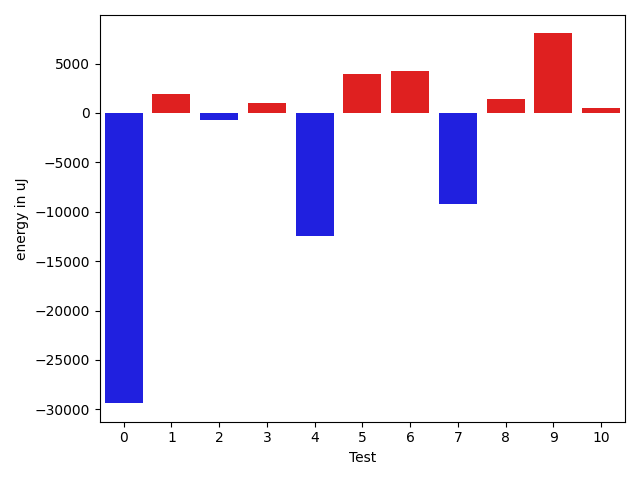

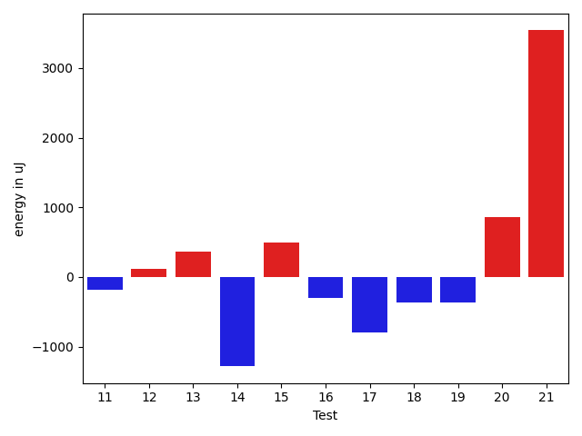

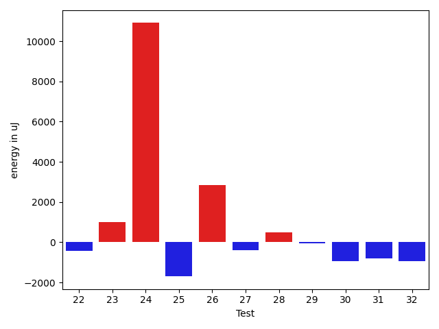

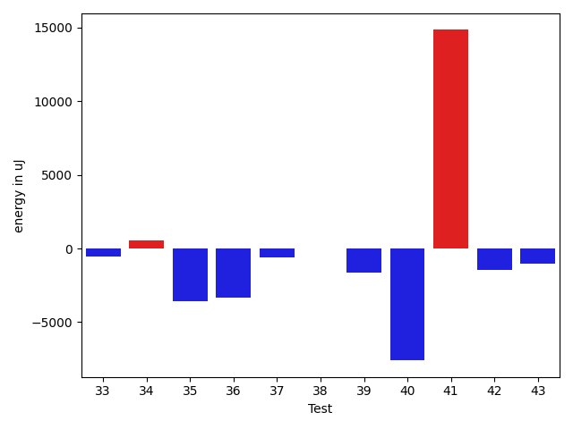

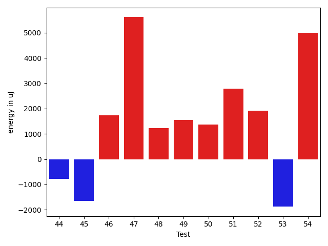

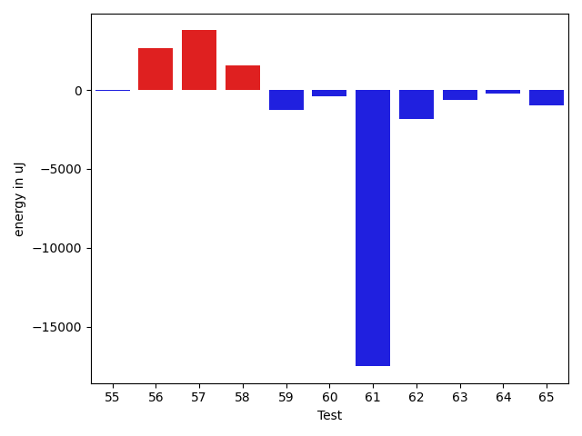

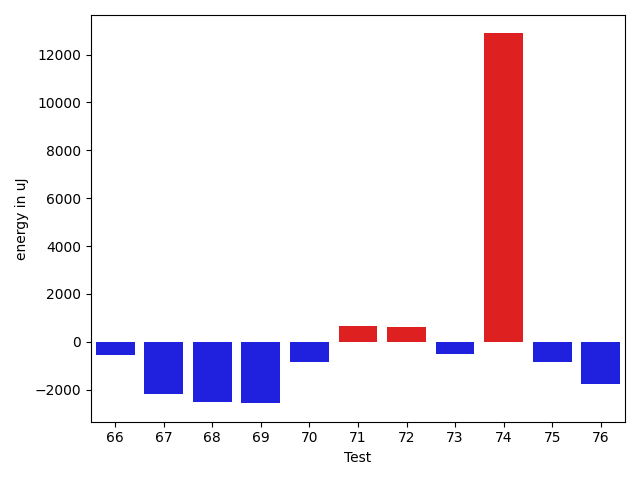

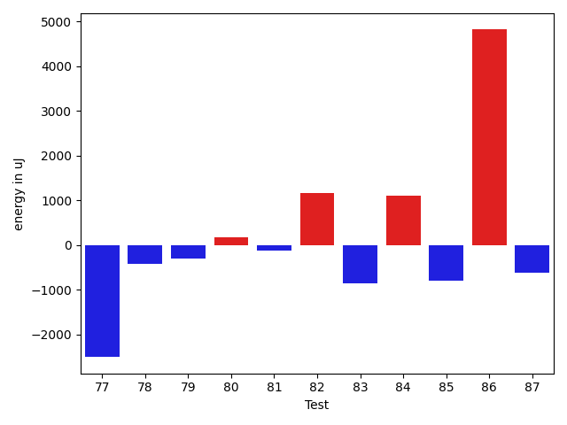

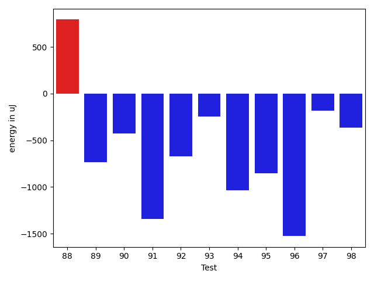

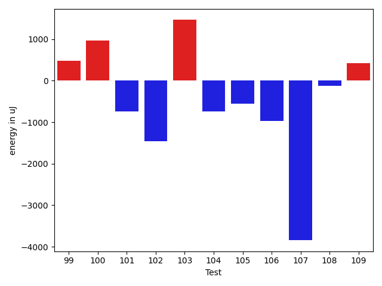

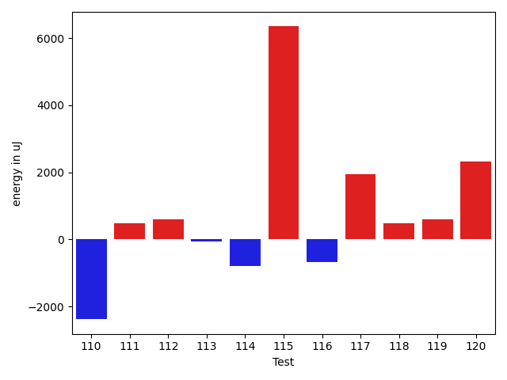

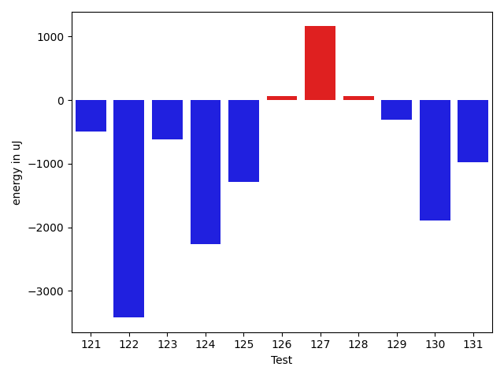

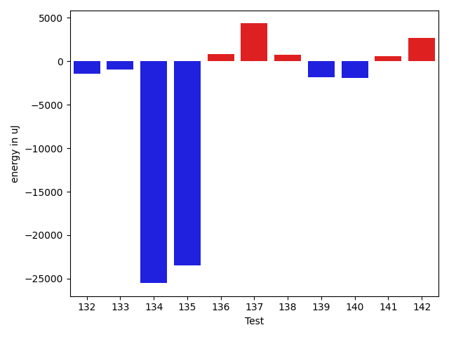

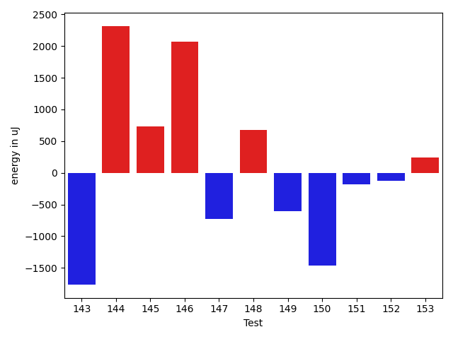

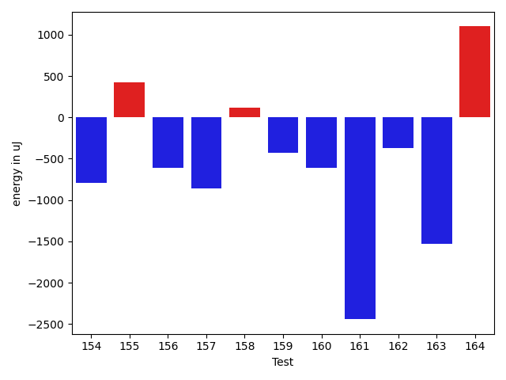

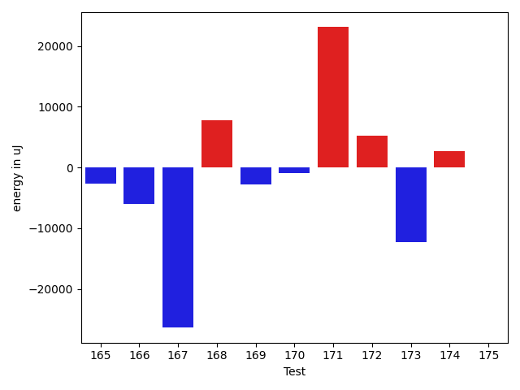

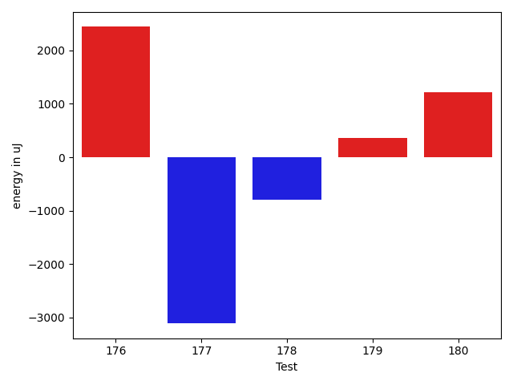

| ID | EnergyV1 | EnergyV2 | DeltaEnergy | σV1 | σV2 |
| --- | --- | --- | --- | --- | --- |
| 0 | 38452 | 37048 | -1404 | 118190.97783238786 | 71432.93981047445 |
| 1 | 36560 | 38147 | 1587 | 4274.239047501342 | 3916.0628203387528 |
| 2 | 35095 | 34058 | -1037 | 6806.463145635875 | 6191.409071079361 |
| 3 | 32776 | 33814 | 1038 | 4341.685952896668 | 5525.81075840667 |
| 4 | 35034 | 32836 | -2198 | 49139.21397141386 | 3835.539159842286 |
| 5 | 36804 | 39368 | 2564 | 30613.560858269593 | 31424.053056587232 |
| 6 | 36255 | 36193 | -62 | 15187.75966519085 | 18670.82860616475 |
| 7 | 34973 | 33875 | -1098 | 70079.3146147084 | 22137.59876566054 |
| 8 | 34302 | 33203 | -1099 | 10067.398636036769 | 19629.058506932302 |
| 9 | 34851 | 36011 | 1160 | 40680.696170596384 | 45208.516918443085 |
| 10 | 33509 | 33447 | -62 | 3621.548135883193 | 4108.354393996052 |
| 11 | 33508 | 33325 | -183 | 49211.51602090934 | 3858.856080260479 |
| 12 | 33752 | 33874 | 122 | 5653.544620295187 | 4899.296262876439 |
| 13 | 33081 | 33447 | 366 | 3844.0769581230156 | 6173.849088172878 |
| 14 | 34485 | 33203 | -1282 | 4507.412623588935 | 5175.477353951985 |
| 15 | 34973 | 35461 | 488 | 3906.097762267998 | 4108.588714379075 |
| 16 | 32897 | 32593 | -304 | 3638.3172454938594 | 14833.348052993553 |
| 17 | 35278 | 34485 | -793 | 4330.660784837959 | 3207.275407312125 |
| 18 | 34301 | 33936 | -365 | 48341.30594055476 | 9454.615527601196 |
| 19 | 35888 | 35523 | -365 | 22307.33484646966 | 12219.802462655909 |
| 20 | 34119 | 34973 | 854 | 4123.251073512855 | 4270.138174234547 |
| 21 | 64148 | 67687 | 3539 | 51618.628704364186 | 58279.77007234869 |
| 22 | 34241 | 33691 | -550 | 6269.00593353053 | 6842.731097307506 |
| 23 | 34851 | 34912 | 61 | 3824.9313844385842 | 4191.023353054105 |
| 24 | 34851 | 35523 | 672 | 3644.0007475525117 | 56093.4830071453 |
| 25 | 34607 | 34424 | -183 | 8967.79074409202 | 3484.342255560909 |
| 26 | 34851 | 35827 | 976 | 3010.5830496882572 | 20096.606925112865 |
| 27 | 35462 | 33630 | -1832 | 3047.102228577991 | 6873.010981847566 |
| 28 | 34118 | 34241 | 123 | 3251.013700777748 | 4051.7416843104365 |
| 29 | 35766 | 34973 | -793 | 3854.2144531181175 | 4480.212793640929 |
| 30 | 32837 | 32837 | 0 | 4049.402222074149 | 2941.975957781602 |
| 31 | 34362 | 33997 | -365 | 9704.808447362575 | 7196.995851196256 |
| 32 | 33996 | 31983 | -2013 | 3468.9509091025357 | 3159.504239592028 |
| 33 | 34179 | 33203 | -976 | 3280.2083383613844 | 2795.266447120377 |
| 34 | 32410 | 33813 | 1403 | 2985.3132572405752 | 2498.543908839525 |
| 35 | 35095 | 32959 | -2136 | 7479.626051815692 | 2732.685926568198 |
| 36 | 34667 | 32959 | -1708 | 12055.291682213774 | 3992.1467962528195 |
| 37 | 35523 | 34729 | -794 | 9810.957423349932 | 12595.412743379458 |
| 38 | 34240 | 34180 | -60 | 3364.1853696092035 | 3217.5405247858257 |
| 39 | 33997 | 32471 | -1526 | 3641.417902105961 | 3223.9564619534535 |
| 40 | 33874 | 32959 | -915 | 33961.99465119062 | 6866.629294607742 |
| 41 | 36682 | 38879 | 2197 | 119657.90877314712 | 150461.44145296264 |
| 42 | 33508 | 32654 | -854 | 3166.679548211123 | 3119.9568406469984 |
| 43 | 35522 | 34790 | -732 | 3636.051713388433 | 3770.765195437404 |
| 44 | 34180 | 33691 | -489 | 3333.475627629517 | 4228.973940243381 |
| 45 | 34668 | 35766 | 1098 | 18766.486351388732 | 3996.195058287014 |
| 46 | 34119 | 34363 | 244 | 5879.000339697784 | 9711.749341989067 |
| 47 | 66589 | 70374 | 3785 | 21212.03576473891 | 24057.771637786827 |
| 48 | 34058 | 36499 | 2441 | 5862.53586130387 | 5785.059414554944 |
| 49 | 34363 | 36621 | 2258 | 4376.918450466319 | 4062.6400857715485 |
| 50 | 33874 | 35095 | 1221 | 3590.38644549523 | 4209.865605364266 |
| 51 | 34302 | 36316 | 2014 | 12698.62892838893 | 14064.913072940586 |
| 52 | 34485 | 36621 | 2136 | 4202.007363527116 | 4832.586054840703 |
| 53 | 35462 | 35766 | 304 | 44815.310894491755 | 32941.6427175634 |
| 54 | 35400 | 37842 | 2442 | 30055.15724205642 | 34629.21595318344 |
| 55 | 37170 | 37110 | -60 | 160007.77769116513 | 151568.8661706391 |
| 56 | 34057 | 36743 | 2686 | 4171.283522472678 | 3465.6539967226963 |
| 57 | 34241 | 38025 | 3784 | 174510.81429137575 | 191937.41677907185 |
| 58 | 35034 | 36621 | 1587 | 64288.0930204097 | 36756.60903628371 |
| 59 | 35705 | 34424 | -1281 | 4826.698489428487 | 4261.435950401578 |
| 60 | 38147 | 37781 | -366 | 8782.289611798587 | 14377.928622520692 |
| 61 | 101746 | 84228 | -17518 | 61852.611058992654 | 62457.846787571696 |
| 62 | 37719 | 35889 | -1830 | 4119.681372891513 | 3035.0224715373133 |
| 63 | 36316 | 35706 | -610 | 3764.519792275767 | 4367.130297019069 |
| 64 | 35584 | 35340 | -244 | 4821.572704291976 | 16888.420696386846 |
| 65 | 36438 | 35461 | -977 | 4474.742656211581 | 4248.364123858604 |
| 66 | 37293 | 36743 | -550 | 3473.1093148539353 | 26514.903323014343 |
| 67 | 36743 | 34545 | -2198 | 22345.18687238037 | 3292.4429574797323 |
| 68 | 37475 | 34973 | -2502 | 47346.04288758956 | 27085.0879887193 |
| 69 | 42297 | 39734 | -2563 | 14473.34745101733 | 9216.568917856579 |
| 70 | 33935 | 33081 | -854 | 4077.5920495356113 | 3914.0793448629047 |
| 71 | 34180 | 34851 | 671 | 10041.064798608832 | 12857.546470810628 |
| 72 | 34729 | 35340 | 611 | 9311.313058243839 | 5207.799939241937 |
| 73 | 34790 | 34301 | -489 | 9684.878309718115 | 10576.718572667694 |
| 74 | 116211 | 129089 | 12878 | 73060.19996976241 | 57254.59599274828 |
| 75 | 35462 | 34607 | -855 | 7747.7365635930455 | 7012.562261908524 |
| 76 | 73242 | 71472 | -1770 | 27954.2248522964 | 24956.441829084793 |
| 77 | 37293 | 34790 | -2503 | 14804.90568894958 | 11339.882116166156 |
| 78 | 35767 | 35340 | -427 | 94867.75414712318 | 59689.64272126403 |
| 79 | 62439 | 62133 | -306 | 21662.592035204507 | 21455.12122945273 |
| 80 | 36499 | 36682 | 183 | 25105.285123445745 | 14060.630369078423 |
| 81 | 38147 | 38025 | -122 | 40117.38538712025 | 35903.918887043765 |
| 82 | 34180 | 35339 | 1159 | 7512.126416685618 | 9430.204704087164 |
| 83 | 40893 | 40038 | -855 | 36278.143380065376 | 25575.28301734716 |
| 84 | 33508 | 34607 | 1099 | 19763.917787745417 | 3734.950662185772 |
| 85 | 80627 | 79834 | -793 | 348572.4570074326 | 325510.5651665896 |
| 86 | 38758 | 43579 | 4821 | 47422.45918208729 | 36063.51268891686 |
| 87 | 36926 | 36316 | -610 | 12720.438569090298 | 7562.33881406028 |
| 88 | 76355 | 77148 | 793 | 66273.53962133161 | 60692.8815516242 |
| 89 | 37842 | 37110 | -732 | 79363.24066904862 | 66707.7365487432 |
| 90 | 36804 | 36377 | -427 | 3666.057905374048 | 3591.858247017366 |
| 91 | 35523 | 34180 | -1343 | 2846.1901693316277 | 3930.904061220575 |
| 92 | 37170 | 36498 | -672 | 16161.956305546675 | 8802.282690276785 |
| 93 | 36621 | 36377 | -244 | 3333.566503703711 | 4404.80525455763 |
| 94 | 38452 | 37414 | -1038 | 4987.755800938527 | 3950.200840261163 |
| 95 | 38696 | 37842 | -854 | 22549.42328387225 | 4087.4586000464183 |
| 96 | 37903 | 36377 | -1526 | 3133.2150692436153 | 3087.8384428767445 |
| 97 | 35644 | 35461 | -183 | 3078.8605424734646 | 2454.6585270409814 |
| 98 | 37659 | 37293 | -366 | 35077.211239874545 | 3415.411852536818 |
| 99 | 36682 | 37170 | 488 | 4713.657621154379 | 3747.071422755365 |
| 100 | 35645 | 36621 | 976 | 3294.7179411488924 | 3398.026002257508 |
| 101 | 36865 | 36132 | -733 | 2493.5503448525055 | 4158.529630934234 |
| 102 | 36926 | 35462 | -1464 | 3446.0704967369325 | 3663.2963679960644 |
| 103 | 35156 | 36621 | 1465 | 3541.4585298150814 | 2900.482583659527 |
| 104 | 36011 | 35278 | -733 | 4057.4109323617245 | 3637.2693663259665 |
| 105 | 36560 | 36011 | -549 | 4443.710185045565 | 2748.510854384 |
| 106 | 35766 | 34790 | -976 | 6803.863314845516 | 3562.36312834097 |
| 107 | 151306 | 147461 | -3845 | 75107.5207647262 | 295252.0601231571 |
| 108 | 35462 | 35339 | -123 | 20902.178018384166 | 5193.103042049271 |
| 109 | 34668 | 35095 | 427 | 3780.591697176559 | 24605.397454197082 |
| 110 | 36316 | 33936 | -2380 | 3881.0864048341277 | 4165.224174768865 |
| 111 | 34973 | 35462 | 489 | 2912.1867460226217 | 3179.1625930821147 |
| 112 | 37293 | 37903 | 610 | 30639.228600113285 | 34804.88082599027 |
| 113 | 35034 | 34973 | -61 | 4172.186901759062 | 4155.848678270949 |
| 114 | 35950 | 35156 | -794 | 20364.684628427374 | 4374.105653090698 |
| 115 | 142456 | 148803 | 6347 | 244579.8527336892 | 289902.37717126025 |
| 116 | 38269 | 37597 | -672 | 425320.02718675946 | 476770.51473279356 |
| 117 | 35644 | 37598 | 1954 | 3930.2132417610983 | 3524.352220788564 |
| 118 | 36743 | 37232 | 489 | 4128.669528599848 | 3413.2901639522725 |
| 119 | 38147 | 38757 | 610 | 55627.55124380564 | 54435.937412975494 |
| 120 | 35096 | 37415 | 2319 | 4365.2463409140955 | 3989.4592421333064 |
| 121 | 36194 | 35705 | -489 | 4118.478794184856 | 3852.3845437667433 |
| 122 | 40528 | 37110 | -3418 | 35173.575734821585 | 22411.34636428312 |
| 123 | 35340 | 34729 | -611 | 3700.3704295109665 | 3479.0490595814194 |
| 124 | 39551 | 37293 | -2258 | 19545.623934947685 | 17349.587491943134 |
| 125 | 39123 | 37841 | -1282 | 54885.16903778226 | 43867.76784634548 |
| 126 | 35340 | 35400 | 60 | 3190.773169875545 | 3818.4466133830133 |
| 127 | 34668 | 35828 | 1160 | 24676.093050650765 | 3679.4349081150435 |
| 128 | 39429 | 39490 | 61 | 508222.31802090304 | 443022.2904615459 |
| 129 | 35644 | 35339 | -305 | 3840.559018834164 | 3285.877115727205 |
| 130 | 36682 | 34790 | -1892 | 10422.667166857711 | 4194.944867999526 |
| 131 | 37964 | 36988 | -976 | 308652.93673600437 | 534028.061047938 |
| 132 | 41077 | 39672 | -1405 | 73499.81977810028 | 43415.671285112905 |
| 133 | 228881 | 227905 | -976 | 81863.03586969819 | 69581.5276018543 |
| 134 | 373168 | 347656 | -25512 | 121904.60790156675 | 118833.45524861706 |
| 135 | 67444 | 44006 | -23438 | 75839.48547050255 | 61642.667159675344 |
| 136 | 38086 | 38880 | 794 | 48092.22953191702 | 68430.700160345 |
| 137 | 34790 | 39124 | 4334 | 24156.13169600615 | 45239.540192684166 |
| 138 | 37171 | 37903 | 732 | 44984.475062974314 | 73058.62182664793 |
| 139 | 37354 | 35522 | -1832 | 4420.814286891464 | 23486.802544844653 |
| 140 | 37231 | 35339 | -1892 | 4290.728534032134 | 3871.4389667829414 |
| 141 | 34851 | 35462 | 611 | 3943.138999431106 | 3733.2562126774733 |
| 142 | 34240 | 36926 | 2686 | 4152.453534884527 | 39292.962651305614 |
| 143 | 38208 | 36438 | -1770 | 4403.859489927533 | 37961.554057268346 |
| 144 | 34485 | 36804 | 2319 | 4146.827447101345 | 4063.579878852904 |
| 145 | 35095 | 35827 | 732 | 3891.7919806197087 | 3576.194619991923 |
| 146 | 33935 | 36011 | 2076 | 3983.88048057691 | 4339.053784300853 |
| 147 | 37842 | 37109 | -733 | 3360.006547612668 | 3108.8197474640147 |
| 148 | 36194 | 36866 | 672 | 5203.520822372846 | 5176.585003209601 |
| 149 | 37719 | 37109 | -610 | 8061.71440010248 | 10436.163271385883 |
| 150 | 35950 | 34485 | -1465 | 4670.124612490953 | 3330.809280600384 |
| 151 | 34179 | 33997 | -182 | 4687.432960182888 | 3800.126917187434 |
| 152 | 37048 | 36926 | -122 | 15115.097118019215 | 15504.643890702551 |
| 153 | 33936 | 34180 | 244 | 3590.8360832094772 | 3614.2174324989237 |
| 154 | 38696 | 37903 | -793 | 19471.40558862751 | 18460.467882718705 |
| 155 | 34118 | 34546 | 428 | 4101.758262219071 | 3843.581617479992 |
| 156 | 35095 | 34485 | -610 | 4387.8707629489045 | 6645.025125179269 |
| 157 | 35339 | 34484 | -855 | 8356.754764459147 | 5706.624208359984 |
| 158 | 34058 | 34180 | 122 | 4161.635120730693 | 3734.3981532402845 |
| 159 | 35034 | 34607 | -427 | 3998.579020578866 | 3620.0490944737203 |
| 160 | 36133 | 35522 | -611 | 4014.814114927841 | 3873.699809251016 |
| 161 | 39246 | 36804 | -2442 | 66707.24361406716 | 71331.40846939376 |
| 162 | 36072 | 35705 | -367 | 4733.133394263376 | 4787.05001883182 |
| 163 | 40589 | 39063 | -1526 | 81194.87519323626 | 80916.40309597307 |
| 164 | 36377 | 37476 | 1099 | 4101.570483655981 | 3582.0320717874106 |
| 165 | 70373 | 69458 | -915 | 30436.092622183154 | 28087.410645117765 |
| 166 | 40406 | 39123 | -1283 | 24091.88126298994 | 15995.12392614087 |
| 167 | 39917 | 38086 | -1831 | 75313.04337020108 | 41645.288707889216 |
| 168 | 39429 | 41870 | 2441 | 21466.210089353463 | 37460.91454080012 |
| 169 | 39917 | 38269 | -1648 | 42974.69216540752 | 41488.160343165466 |
| 170 | 38086 | 37475 | -611 | 3772.5538078958384 | 4345.394807078495 |
| 171 | 38819 | 37109 | -1710 | 78211.46592260241 | 112027.5164023321 |
| 172 | 39367 | 39551 | 184 | 41217.14013781918 | 44672.90876718051 |
| 173 | 38269 | 38940 | 671 | 454720.919759685 | 472165.73231952504 |
| 174 | 73303 | 71289 | -2014 | 116561.6542136362 | 120692.59610371917 |
| 175 | 35217 | 36071 | 854 | 4152.5195746147065 | 3064.3955131843686 |
| 176 | 34119 | 36560 | 2441 | 31998.524718993594 | 2861.30742172458 |
| 177 | 38757 | 35645 | -3112 | 4195.207142624675 | 3387.0169684601046 |
| 178 | 38635 | 37842 | -793 | 12658.948561118845 | 11651.736393756757 |
| 179 | 35950 | 36316 | 366 | 3525.4486352803383 | 3074.4235213545066 |
| 180 | 37232 | 38452 | 1220 | 650913.8939939849 | 596615.0160890326 |

## Delta Duration per test method

| ID | DurationV1 | DurationsV2 | DeltaDuration |
| --- | --- | --- | --- |
| 0 | 2455898.4225352113 | 1394873.9384615384 | -1061024.484073673 |
| 1 | 820380.0370370371 | 788316.0222222222 | -32064.014814814902 |
| 2 | 949536.2461538462 | 972482.8615384615 | 22946.615384615376 |
| 3 | 488324.8888888889 | 604409.4074074074 | 116084.51851851854 |
| 4 | 1149834.638888889 | 614603.3571428572 | -535231.2817460318 |
| 5 | 1753000.3058823529 | 1868865.4777777777 | 115865.17189542484 |
| 6 | 1422820.5 | 1476231.5568181819 | 53411.05681818188 |
| 7 | 1007833.9166666666 | 760613.78125 | -247220.13541666663 |
| 8 | 1010443.953125 | 1170257.5857142857 | 159813.63258928573 |
| 9 | 1432821.7125 | 1778038.64 | 345216.9275 |
| 10 | 554623.1176470588 | 568434.9666666667 | 13811.849019607878 |
| 11 | 875311.0909090909 | 701950.3714285714 | -173360.71948051953 |
| 12 | 775648.2307692308 | 881749.914893617 | 106101.68412438629 |
| 13 | 735666.0 | 768630.4318181818 | 32964.431818181765 |
| 14 | 939668.6933333334 | 977714.0634920635 | 38045.37015873019 |
| 15 | 666163.7037037037 | 713251.2075471698 | 47087.50384346605 |
| 16 | 584121.5555555555 | 669568.9565217391 | 85447.40096618363 |
| 17 | 589562.4444444445 | 593505.6216216217 | 3943.17717717716 |
| 18 | 1208530.1044776118 | 1088447.8684210526 | -120082.23605655925 |
| 19 | 1012853.6326530612 | 898470.7692307692 | -114382.86342229194 |
| 20 | 608735.7941176471 | 787512.2580645161 | 178776.46394686901 |
| 21 | 2499729.6458333335 | 2695928.734042553 | 196199.08820921974 |
| 22 | 870820.0161290322 | 926583.5230769231 | 55763.506947890855 |
| 23 | 681444.0357142857 | 674454.5789473684 | -6989.456766917254 |
| 24 | 631633.6285714286 | 1070467.2702702703 | 438833.6416988417 |
| 25 | 899628.9846153846 | 948024.3880597015 | 48395.40344431694 |
| 26 | 849016.6363636364 | 818398.0714285715 | -30618.564935064875 |
| 27 | 780855.9454545454 | 855439.75 | 74583.80454545456 |
| 28 | 748562.696969697 | 713230.8387096775 | -35331.858260019566 |
| 29 | 655251.9230769231 | 700739.1666666666 | 45487.243589743506 |
| 30 | 794693.0576923077 | 796635.2807017544 | 1942.2230094466358 |
| 31 | 803035.56 | 797517.3478260869 | -5518.21217391314 |
| 32 | 452968.3846153846 | 450620.4 | -2347.984615384601 |
| 33 | 482056.3333333333 | 449595.347826087 | -32460.98550724634 |
| 34 | 473086.52173913043 | 442177.4285714286 | -30909.093167701853 |
| 35 | 547200.75 | 517254.9583333333 | -29945.791666666686 |
| 36 | 746438.7058823529 | 637740.1951219512 | -108698.51076040172 |
| 37 | 1056548.0985915493 | 1168387.4390243902 | 111839.34043284087 |
| 38 | 843745.9677419355 | 868819.7692307692 | 25073.801488833735 |
| 39 | 634697.9555555555 | 616639.6285714286 | -18058.326984126936 |
| 40 | 1137630.6538461538 | 773242.5652173914 | -364388.0886287624 |
| 41 | 2387955.529411765 | 2740062.551020408 | 352107.02160864323 |
| 42 | 543285.1304347826 | 494470.14285714284 | -48814.98757763975 |
| 43 | 562276.0 | 601370.4074074074 | 39094.407407407416 |
| 44 | 470370.4 | 439866.6842105263 | -30503.715789473732 |
| 45 | 814776.4545454546 | 821918.1964285715 | 7141.741883116891 |
| 46 | 980161.55 | 1025470.7719298246 | 45309.22192982456 |
| 47 | 2077575.696969697 | 2175077.404040404 | 97501.70707070711 |
| 48 | 1030724.8524590164 | 941979.7352941176 | -88745.11716489878 |
| 49 | 802788.2448979592 | 846307.2321428572 | 43518.98724489799 |
| 50 | 716043.9090909091 | 755783.3658536585 | 39739.45676274947 |
| 51 | 1247884.975609756 | 1286303.6375 | 38418.66189024388 |
| 52 | 839256.1346153846 | 835974.1730769231 | -3281.9615384615026 |
| 53 | 1272604.2881355933 | 1133125.1230769232 | -139479.1650586701 |
| 54 | 1353016.1265822784 | 1450652.861111111 | 97636.7345288326 |
| 55 | 1928267.6615384615 | 1849810.281690141 | -78457.3798483205 |
| 56 | 436424.07692307694 | 449261.0625 | 12836.985576923063 |
| 57 | 1667773.9743589743 | 1777989.4761904762 | 110215.50183150196 |
| 58 | 1302646.2173913044 | 1137471.1764705882 | -165175.04092071624 |
| 59 | 417285.7272727273 | 464789.3125 | 47503.585227272706 |
| 60 | 966043.724137931 | 1024502.947368421 | 58459.223230489995 |
| 61 | 3541124.131313131 | 3407214.2474226803 | -133909.88389045093 |
| 62 | 690932.875 | 640897.1219512195 | -50035.75304878049 |
| 63 | 789262.7647058824 | 414577.5882352941 | -374685.1764705883 |
| 64 | 521044.34375 | 649917.3913043478 | 128873.04755434778 |
| 65 | 629958.3695652174 | 600252.0333333333 | -29706.33623188408 |
| 66 | 906717.4761904762 | 1042868.3846153846 | 136150.9084249084 |
| 67 | 797085.96 | 488659.8888888889 | -308426.0711111111 |
| 68 | 1053046.657142857 | 826355.4333333333 | -226691.22380952374 |
| 69 | 1128352.7307692308 | 875600.52 | -252752.21076923073 |
| 70 | 841501.323943662 | 816624.8771929825 | -24876.44675067952 |
| 71 | 1273420.1578947369 | 1311223.7391304348 | 37803.58123569796 |
| 72 | 1059914.9066666667 | 1065615.98630137 | 5701.07963470323 |
| 73 | 1207804.0352941176 | 1207413.8488372094 | -390.18645690823905 |
| 74 | 4232815.414141414 | 4173198.626262626 | -59616.78787878761 |
| 75 | 1203481.042105263 | 1282285.5454545454 | 78804.50334928231 |
| 76 | 2401479.0606060605 | 2364065.474747475 | -37413.58585858578 |
| 77 | 1344894.574468085 | 1372829.907216495 | 27935.332748409826 |
| 78 | 2279871.3139534886 | 1692017.8764044943 | -587853.4375489943 |
| 79 | 1924049.2424242424 | 1921116.505050505 | -2932.7373737373855 |
| 80 | 1448084.4666666666 | 1358811.0 | -89273.46666666656 |
| 81 | 2005116.7346938776 | 1904730.2653061224 | -100386.46938775526 |
| 82 | 1252739.8279569892 | 1267868.9333333333 | 15129.105376344174 |
| 83 | 1791516.1515151516 | 1651616.01010101 | -139900.14141414152 |
| 84 | 1029369.5967741936 | 951537.25 | -77832.34677419357 |
| 85 | 4243864.757575758 | 5755729.6161616165 | 1511864.8585858587 |
| 86 | 1865302.2571428572 | 1903488.1029411764 | 38185.845798319206 |
| 87 | 756579.825 | 833787.8157894737 | 77207.99078947376 |
| 88 | 3070522.585858586 | 3262491.02020202 | 191968.4343434344 |
| 89 | 1430893.4666666666 | 1648588.9454545456 | 217695.478787879 |
| 90 | 553398.9333333333 | 567001.6 | 13602.666666666628 |
| 91 | 556274.76 | 485469.64285714284 | -70805.11714285717 |
| 92 | 973872.6 | 778184.8695652174 | -195687.73043478257 |
| 93 | 489245.8076923077 | 522324.6818181818 | 33078.874125874136 |
| 94 | 511614.0 | 544112.52 | 32498.52000000002 |
| 95 | 770943.7435897436 | 596071.0294117647 | -174872.71417797892 |
| 96 | 464357.67741935485 | 586620.5263157894 | 122262.84889643459 |
| 97 | 447786.9 | 435784.4166666667 | -12002.483333333337 |
| 98 | 693611.7058823529 | 398371.85714285716 | -295239.84873949573 |
| 99 | 686109.2432432432 | 685326.052631579 | -783.1906116642058 |
| 100 | 456733.27777777775 | 426581.28571428574 | -30151.992063492013 |
| 101 | 552849.3636363636 | 392013.3888888889 | -160835.97474747477 |
| 102 | 464653.04761904763 | 500739.5652173913 | 36086.517598343664 |
| 103 | 599490.8 | 510441.1785714286 | -89049.62142857147 |
| 104 | 469779.8823529412 | 438572.2631578947 | -31207.619195046485 |
| 105 | 462066.2272727273 | 426409.6666666667 | -35656.56060606061 |
| 106 | 940110.0 | 930180.0428571429 | -9929.957142857136 |
| 107 | 4655217.612903226 | 6026937.442857143 | 1371719.8299539164 |
| 108 | 898704.7333333333 | 824700.4920634921 | -74004.24126984121 |
| 109 | 909695.9420289855 | 1056364.981818182 | 146669.03978919645 |
| 110 | 661354.5897435897 | 770868.696969697 | 109514.10722610727 |
| 111 | 568452.9090909091 | 562086.6176470588 | -6366.291443850263 |
| 112 | 1068762.15 | 1533905.0 | 465142.8500000001 |
| 113 | 557968.1666666666 | 631316.3076923077 | 73348.14102564112 |
| 114 | 889470.9107142857 | 810139.72 | -79331.19071428571 |
| 115 | 4980382.666666667 | 5624733.623376624 | 644350.9567099568 |
| 116 | 4350100.12195122 | 3963638.073170732 | -386462.04878048785 |
| 117 | 622851.6 | 622906.8157894737 | 55.215789473732 |
| 118 | 512267.6666666667 | 506857.8 | -5409.866666666698 |
| 119 | 1582770.0666666667 | 1725046.606060606 | 142276.5393939393 |
| 120 | 604479.0769230769 | 518357.75 | -86121.32692307688 |
| 121 | 749729.7209302326 | 759538.693877551 | 9808.972947318456 |
| 122 | 1624753.6097560977 | 1368686.831460674 | -256066.7782954236 |
| 123 | 730357.6136363636 | 771947.1794871795 | 41589.56585081585 |
| 124 | 1214791.22 | 1082183.4761904762 | -132607.74380952376 |
| 125 | 2070019.2258064516 | 1292175.9523809524 | -777843.2734254992 |
| 126 | 546656.5769230769 | 538977.2272727273 | -7679.349650349584 |
| 127 | 954174.475 | 716202.3611111111 | -237972.11388888885 |
| 128 | 7609598.769230769 | 7956312.576923077 | 346713.807692308 |
| 129 | 570645.3125 | 800775.4782608695 | 230130.1657608695 |
| 130 | 1015903.53125 | 811904.6333333333 | -203998.8979166667 |
| 131 | 2775374.722222222 | 6335062.6 | 3559687.8777777776 |
| 132 | 2302666.522727273 | 1803564.9438202246 | -499101.57890704833 |
| 133 | 7162352.090909091 | 6909265.747474748 | -253086.3434343431 |
| 134 | 11079046.313131314 | 10657407.707070706 | -421638.60606060736 |
| 135 | 2624032.242424242 | 2237600.02020202 | -386432.222222222 |
| 136 | 1440206.8653846155 | 1818962.490909091 | 378755.6255244755 |
| 137 | 1277285.064102564 | 1726467.736111111 | 449182.672008547 |
| 138 | 1192299.7777777778 | 1868031.7419354839 | 675731.9641577061 |
| 139 | 525799.4285714285 | 661918.074074074 | 136118.64550264552 |
| 140 | 567402.7741935484 | 555391.5555555555 | -12011.21863799286 |
| 141 | 896061.9193548387 | 887961.6060606061 | -8100.31329423259 |
| 142 | 513746.2083333333 | 812292.5263157894 | 298546.3179824561 |
| 143 | 502302.2727272727 | 884659.0 | 382356.7272727273 |
| 144 | 435755.0909090909 | 453356.7727272727 | 17601.681818181823 |
| 145 | 595948.7391304348 | 580179.0 | -15769.739130434813 |
| 146 | 673715.0975609756 | 745031.0 | 71315.90243902442 |
| 147 | 482128.8823529412 | 427872.3888888889 | -54256.49346405233 |
| 148 | 1106735.472972973 | 1071280.7840909092 | -35454.68888206384 |
| 149 | 934694.9019607843 | 1023295.7192982456 | 88600.81733746128 |
| 150 | 619624.9117647059 | 650485.724137931 | 30860.81237322511 |
| 151 | 1021053.1756756756 | 1022719.4457831326 | 1666.2701074569486 |
| 152 | 1229224.986111111 | 1198694.0625 | -30530.923611111008 |
| 153 | 733975.027027027 | 677944.0540540541 | -56030.9729729729 |
| 154 | 1316173.4081632653 | 1198441.85 | -117731.55816326523 |
| 155 | 746789.2391304348 | 701330.3846153846 | -45458.85451505019 |
| 156 | 787973.0465116279 | 829341.0196078431 | 41367.97309621528 |
| 157 | 887066.6428571428 | 871501.8627450981 | -15564.78011204477 |
| 158 | 946333.8181818182 | 710114.9512195121 | -236218.86696230609 |
| 159 | 636227.7037037037 | 532653.2 | -103574.50370370375 |
| 160 | 676289.0 | 643723.6388888889 | -32565.361111111124 |
| 161 | 1640281.3103448276 | 1760141.675 | 119860.36465517245 |
| 162 | 542953.619047619 | 487875.39130434784 | -55078.227743271214 |
| 163 | 2048206.465116279 | 2145155.525 | 96949.05988372094 |
| 164 | 507429.89285714284 | 439412.0 | -68017.89285714284 |
| 165 | 2146662.9696969697 | 2122312.7474747472 | -24350.22222222248 |
| 166 | 1140007.3414634147 | 796052.7931034482 | -343954.5483599665 |
| 167 | 1951993.5128205128 | 1066541.8205128205 | -885451.6923076923 |
| 168 | 1592481.1770833333 | 1772346.2631578948 | 179865.08607456158 |
| 169 | 1472142.5 | 1580607.6304347827 | 108465.13043478271 |
| 170 | 619791.8 | 677333.2424242424 | 57541.442424242385 |
| 171 | 1540230.6818181819 | 2373917.425531915 | 833686.743713733 |
| 172 | 1338313.15625 | 1518697.6666666667 | 180384.51041666674 |
| 173 | 5253880.644067797 | 4440022.041666667 | -813858.6024011299 |
| 174 | 3277254.606060606 | 3385623.414141414 | 108368.80808080826 |
| 175 | 608753.2592592592 | 585673.4857142858 | -23079.77354497346 |
| 176 | 747995.4444444445 | 600981.1818181818 | -147014.26262626273 |
| 177 | 489185.5263157895 | 498290.4117647059 | 9104.885448916408 |
| 178 | 1134191.9591836734 | 1090667.7068965517 | -43524.25228712172 |
| 179 | 494992.88 | 488480.7826086957 | -6512.097391304327 |
| 180 | 9880006.523809524 | 8497920.5 | -1382086.0238095243 |

## Misc.

| ID | Test Class | Test Method |
| --- | --- | --- |
| 0 | com.google.gson.functional.CustomDeserializerTest | testDefaultConstructorNotCalledOnObject |
| 1 | com.google.gson.functional.CustomDeserializerTest | testDefaultConstructorNotCalledOnField |
| 2 | com.google.gson.functional.ObjectTest | testDirectedAcyclicGraphDeserialization |
| 3 | com.google.gson.functional.ObjectTest | testNullObjectFieldsDeserialization |
| 4 | com.google.gson.functional.ObjectTest | testEmptyCollectionInAnObjectDeserialization |
| 5 | com.google.gson.functional.ObjectTest | testDirectedAcyclicGraphSerialization |
| 6 | com.google.gson.functional.ObjectTest | testArrayOfArraysDeserialization |
| 7 | com.google.gson.functional.ObjectTest | testClassWithTransientFieldsDeserialization |
| 8 | com.google.gson.functional.ObjectTest | testStringFieldWithNumberValueDeserialization |
| 9 | com.google.gson.functional.ObjectTest | testSubInterfacesOfCollectionDeserialization |
| 10 | com.google.gson.functional.ObjectTest | testPrivateNoArgConstructorDeserialization |
| 11 | com.google.gson.functional.ObjectTest | testClassWithTransientFieldsDeserializationTransientFieldsPassedInJsonAreIgnored |
| 12 | com.google.gson.functional.ObjectTest | testNullArraysDeserialization |
| 13 | com.google.gson.functional.ObjectTest | testInnerClassSerialization |
| 14 | com.google.gson.functional.ObjectTest | testClassWithObjectFieldSerialization |
| 15 | com.google.gson.functional.ObjectTest | testBagOfPrimitiveWrappersSerialization |
| 16 | com.google.gson.functional.ObjectTest | testObjectFieldNamesWithoutQuotesDeserialization |
| 17 | com.google.gson.functional.ObjectTest | testClassWithEnumFieldSerialization |
| 18 | com.google.gson.functional.ObjectTest | testArrayOfObjectsDeserialization |
| 19 | com.google.gson.functional.ObjectTest | testAnonymousLocalClassesSerialization |
| 20 | com.google.gson.functional.ObjectTest | testBagOfPrimitivesSerialization |
| 21 | com.google.gson.functional.ObjectTest | testSubInterfacesOfCollectionSerialization |
| 22 | com.google.gson.functional.ObjectTest | testInheritenceDeserialization |
| 23 | com.google.gson.functional.ObjectTest | testBagOfPrimitiveWrappersDeserialization |
| 24 | com.google.gson.functional.ObjectTest | testJsonInMixedQuotesDeserialization |
| 25 | com.google.gson.functional.ObjectTest | testInheritenceSerialization |
| 26 | com.google.gson.functional.ObjectTest | testNullFieldsDeserialization |
| 27 | com.google.gson.functional.ObjectTest | testArrayOfObjectsSerialization |
| 28 | com.google.gson.functional.ObjectTest | testClassWithTransientFieldsSerialization |
| 29 | com.google.gson.functional.ObjectTest | testBagOfPrimitivesDeserialization |
| 30 | com.google.gson.functional.ObjectTest | testInnerClassDeserialization |
| 31 | com.google.gson.functional.ObjectTest | testNestedSerialization |
| 32 | com.google.gson.functional.ObjectTest | testClassWithNoFieldsDeserialization |
| 33 | com.google.gson.functional.ObjectTest | testPrimitiveArrayFieldSerialization |
| 34 | com.google.gson.functional.ObjectTest | testSelfReferenceSerialization |
| 35 | com.google.gson.functional.ObjectTest | testEmptyCollectionInAnObjectSerialization |
| 36 | com.google.gson.functional.ObjectTest | testClassWithEnumFieldDeserialization |
| 37 | com.google.gson.functional.ObjectTest | testArrayOfArraysSerialization |
| 38 | com.google.gson.functional.ObjectTest | testNestedDeserialization |
| 39 | com.google.gson.functional.ObjectTest | testCircularSerialization |
| 40 | com.google.gson.functional.ObjectTest | testPrimitiveArrayInAnObjectDeserialization |
| 41 | com.google.gson.functional.ObjectTest | testJsonInSingleQuotesDeserialization |
| 42 | com.google.gson.functional.ObjectTest | testNullPrimitiveFieldsDeserialization |
| 43 | com.google.gson.functional.ObjectTest | testNullFieldsSerialization |
| 44 | com.google.gson.functional.ObjectTest | testClassWithNoFieldsSerialization |
| 45 | com.google.gson.functional.CustomTypeAdaptersTest | testCustomTypeAdapterAppliesToSubClassesSerializedAsBaseClass |
| 46 | com.google.gson.functional.CustomTypeAdaptersTest | testCustomAdapterInvokedForMapElementSerializationWithType |
| 47 | com.google.gson.functional.CustomTypeAdaptersTest | testCustomTypeAdapterDoesNotAppliesToSubClasses |
| 48 | com.google.gson.functional.CustomTypeAdaptersTest | testCustomSerializerForLong |
| 49 | com.google.gson.functional.CustomTypeAdaptersTest | testCustomByteArrayDeserializerAndInstanceCreator |
| 50 | com.google.gson.functional.CustomTypeAdaptersTest | testCustomByteArraySerializer |
| 51 | com.google.gson.functional.CustomTypeAdaptersTest | testCustomDeserializerForLong |
| 52 | com.google.gson.functional.CustomTypeAdaptersTest | testCustomAdapterInvokedForMapElementDeserialization |
| 53 | com.google.gson.functional.CustomTypeAdaptersTest | testCustomNestedDeserializers |
| 54 | com.google.gson.functional.CustomTypeAdaptersTest | testCustomAdapterInvokedForCollectionElementSerializationWithType |
| 55 | com.google.gson.functional.CustomTypeAdaptersTest | testCustomNestedSerializers |
| 56 | com.google.gson.functional.CustomTypeAdaptersTest | testCustomAdapterInvokedForMapElementSerialization |
| 57 | com.google.gson.functional.CustomTypeAdaptersTest | testCustomSerializers |
| 58 | com.google.gson.functional.CustomTypeAdaptersTest | testCustomDeserializers |
| 59 | com.google.gson.functional.CustomTypeAdaptersTest | testCustomAdapterInvokedForCollectionElementSerialization |
| 60 | com.google.gson.functional.EnumTest | testEnumFieldDeserialization |
| 61 | com.google.gson.functional.ExposeFieldsTest | testNullExposeFieldSerialization |
| 62 | com.google.gson.functional.ExposeFieldsTest | testNoExposedFieldDeserialization |
| 63 | com.google.gson.functional.ExposeFieldsTest | testExposeAnnotationSerialization |
| 64 | com.google.gson.functional.ExposeFieldsTest | testExposedInterfaceFieldDeserialization |
| 65 | com.google.gson.functional.ExposeFieldsTest | testExposedInterfaceFieldSerialization |
| 66 | com.google.gson.functional.ExposeFieldsTest | testArrayWithOneNullExposeFieldObjectSerialization |
| 67 | com.google.gson.functional.ExposeFieldsTest | testNoExposedFieldSerialization |
| 68 | com.google.gson.functional.ExposeFieldsTest | testExposeAnnotationDeserialization |
| 69 | com.google.gson.functional.StringTest | testStringValueAsSingleElementArraySerialization |
| 70 | com.google.gson.functional.ParameterizedTypesTest | testParameterizedTypesWithWriterSerialization |
| 71 | com.google.gson.functional.ParameterizedTypesTest | testVariableTypeArrayDeserialization |
| 72 | com.google.gson.functional.ParameterizedTypesTest | testParameterizedTypeWithReaderDeserialization |
| 73 | com.google.gson.functional.ParameterizedTypesTest | testParameterizedTypeWithCustomSerializer |
| 74 | com.google.gson.functional.ParameterizedTypesTest | testParameterizedTypesSerialization |
| 75 | com.google.gson.functional.ParameterizedTypesTest | testVariableTypeDeserialization |
| 76 | com.google.gson.functional.ParameterizedTypesTest | testVariableTypeFieldsAndGenericArraysSerialization |
| 77 | com.google.gson.functional.ParameterizedTypesTest | testParameterizedTypeGenericArraysDeserialization |
| 78 | com.google.gson.functional.ParameterizedTypesTest | testParameterizedTypeDeserialization |
| 79 | com.google.gson.functional.ParameterizedTypesTest | testVariableTypeFieldsAndGenericArraysDeserialization |
| 80 | com.google.gson.functional.ParameterizedTypesTest | testTypesWithMultipleParametersDeserialization |
| 81 | com.google.gson.functional.ParameterizedTypesTest | testTypesWithMultipleParametersSerialization |
| 82 | com.google.gson.functional.ParameterizedTypesTest | testParameterizedTypeWithVariableTypeDeserialization |
| 83 | com.google.gson.functional.ParameterizedTypesTest | testParameterizedTypesWithCustomDeserializer |
| 84 | com.google.gson.functional.ParameterizedTypesTest | testParameterizedTypeGenericArraysSerialization |
| 85 | com.google.gson.functional.NamingPolicyTest | testGsonWithNonDefaultFieldNamingPolicySerialization |
| 86 | com.google.gson.functional.NamingPolicyTest | testGsonDuplicateNameUsingSerializedNameFieldNamingPolicySerialization |
| 87 | com.google.gson.functional.NamingPolicyTest | testGsonWithSerializedNameFieldNamingPolicyDeserialization |
| 88 | com.google.gson.functional.NamingPolicyTest | testGsonWithSerializedNameFieldNamingPolicySerialization |
| 89 | com.google.gson.functional.NamingPolicyTest | testGsonWithNonDefaultFieldNamingPolicyDeserialiation |
| 90 | com.google.gson.functional.PrimitiveTest | testPrimitiveDoubleAutoboxedInASingleElementArraySerialization |
| 91 | com.google.gson.functional.PrimitiveTest | testHtmlCharacterSerialization |
| 92 | com.google.gson.functional.PrimitiveTest | testPrimitiveIntegerAutoboxedInASingleElementArraySerialization |
| 93 | com.google.gson.functional.PrimitiveTest | testLongAsStringSerialization |
| 94 | com.google.gson.functional.PrimitiveTest | testPrimitiveLongAutoboxedInASingleElementArraySerialization |
| 95 | com.google.gson.functional.PrimitiveTest | testBigIntegerInASingleElementArraySerialization |
| 96 | com.google.gson.functional.PrimitiveTest | testBigDecimalInASingleElementArraySerialization |
| 97 | com.google.gson.functional.PrimitiveTest | testDoubleInfinitySerialization |
| 98 | com.google.gson.functional.PrimitiveTest | testFloatInfinitySerialization |
| 99 | com.google.gson.functional.PrimitiveTest | testOverridingDefaultPrimitiveSerialization |
| 100 | com.google.gson.functional.PrimitiveTest | testNegativeInfinitySerialization |
| 101 | com.google.gson.functional.PrimitiveTest | testNegativeInfinityFloatSerialization |
| 102 | com.google.gson.functional.PrimitiveTest | testPrimitiveBooleanAutoboxedInASingleElementArraySerialization |
| 103 | com.google.gson.functional.PrimitiveTest | testLongAsStringDeserialization |
| 104 | com.google.gson.functional.PrimitiveTest | testFloatNaNSerialization |
| 105 | com.google.gson.functional.PrimitiveTest | testDoubleNaNSerialization |
| 106 | com.google.gson.functional.VersioningTest | testVersionedGsonMixingSinceAndUntilDeserialization |
| 107 | com.google.gson.functional.VersioningTest | testVersionedUntilSerialization |
| 108 | com.google.gson.functional.VersioningTest | testVersionedClassesDeserialization |
| 109 | com.google.gson.functional.VersioningTest | testVersionedGsonMixingSinceAndUntilSerialization |
| 110 | com.google.gson.functional.VersioningTest | testVersionedGsonWithUnversionedClassesDeserialization |
| 111 | com.google.gson.functional.VersioningTest | testIgnoreLaterVersionClassSerialization |
| 112 | com.google.gson.functional.VersioningTest | testVersionedGsonWithUnversionedClassesSerialization |
| 113 | com.google.gson.functional.VersioningTest | testIgnoreLaterVersionClassDeserialization |
| 114 | com.google.gson.functional.VersioningTest | testVersionedClassesSerialization |
| 115 | com.google.gson.functional.VersioningTest | testVersionedUntilDeserialization |
| 116 | com.google.gson.functional.FieldExclusionTest | testDefaultInnerClassExclusion |
| 117 | com.google.gson.functional.FieldExclusionTest | testDefaultNestedStaticClassIncluded |
| 118 | com.google.gson.functional.FieldExclusionTest | testInnerClassExclusion |
| 119 | com.google.gson.functional.NullObjectAndFieldTest | testTopLevelNullObjectDeserialization |
| 120 | com.google.gson.functional.NullObjectAndFieldTest | testExplicitSerializationOfNullCollectionMembers |
| 121 | com.google.gson.functional.NullObjectAndFieldTest | testNullWrappedPrimitiveMemberSerialization |
| 122 | com.google.gson.functional.NullObjectAndFieldTest | testExplicitSerializationOfNullArrayMembers |
| 123 | com.google.gson.functional.NullObjectAndFieldTest | testNullWrappedPrimitiveMemberDeserialization |
| 124 | com.google.gson.functional.NullObjectAndFieldTest | testExplicitDeserializationOfNulls |
| 125 | com.google.gson.functional.NullObjectAndFieldTest | testExplicitSerializationOfNulls |
| 126 | com.google.gson.functional.NullObjectAndFieldTest | testCustomSerializationOfNulls |
| 127 | com.google.gson.functional.NullObjectAndFieldTest | testPrintPrintingObjectWithNulls |
| 128 | com.google.gson.functional.NullObjectAndFieldTest | testTopLevelNullObjectSerialization |
| 129 | com.google.gson.functional.NullObjectAndFieldTest | testExplicitSerializationOfNullStringMembers |
| 130 | com.google.gson.functional.NullObjectAndFieldTest | testPrintPrintingArraysWithNulls |
| 131 | com.google.gson.FunctionWithInternalDependenciesTest | testAnonymousLocalClassesSerialization |
| 132 | com.google.gson.functional.ConcurrencyTest | testSingleThreadSerialization |
| 133 | com.google.gson.functional.ConcurrencyTest | testMultiThreadSerialization |
| 134 | com.google.gson.functional.ConcurrencyTest | testMultiThreadDeserialization |
| 135 | com.google.gson.functional.ConcurrencyTest | testSingleThreadDeserialization |
| 136 | com.google.gson.functional.ArrayTest | testTopLevelArrayOfIntsDeserialization |
| 137 | com.google.gson.functional.ArrayTest | testArrayOfCollectionSerialization |
| 138 | com.google.gson.functional.ArrayTest | testTopLevelArrayOfIntsSerialization |
| 139 | com.google.gson.functional.ArrayTest | testNullsInArraySerialization |
| 140 | com.google.gson.functional.ArrayTest | testEmptyArrayDeserialization |
| 141 | com.google.gson.functional.ArrayTest | testArrayOfCollectionDeserialization |
| 142 | com.google.gson.functional.ArrayTest | testNullsInArrayWithSerializeNullPropertySetSerialization |
| 143 | com.google.gson.functional.ArrayTest | testArrayOfStringsDeserialization |
| 144 | com.google.gson.functional.ArrayTest | testArrayOfStringsSerialization |
| 145 | com.google.gson.functional.ArrayTest | testNullsInArrayDeserialization |
| 146 | com.google.gson.functional.ArrayTest | testArrayOfPrimitivesWithCustomTypeAdapter |
| 147 | com.google.gson.functional.ArrayTest | testEmptyArraySerialization |
| 148 | com.google.gson.functional.MapTest | testParameterizedMapSubclassDeserialization |
| 149 | com.google.gson.functional.MapTest | testMapSerializationWithNullValueButSerializeNulls |
| 150 | com.google.gson.functional.DefaultTypeAdaptersTest | testBigIntegerFieldDeserialization |
| 151 | com.google.gson.functional.DefaultTypeAdaptersTest | testDefaultDateDeserializationUsingBuilder |
| 152 | com.google.gson.functional.DefaultTypeAdaptersTest | testUrlNullSerialization |
| 153 | com.google.gson.functional.DefaultTypeAdaptersTest | testDateDeserializationWithPattern |
| 154 | com.google.gson.functional.DefaultTypeAdaptersTest | testBigDecimalFieldSerialization |
| 155 | com.google.gson.functional.DefaultTypeAdaptersTest | testDefaultDateSerializationUsingBuilder |
| 156 | com.google.gson.functional.DefaultTypeAdaptersTest | testUrlNullDeserialization |
| 157 | com.google.gson.functional.DefaultTypeAdaptersTest | testBigIntegerFieldSerialization |
| 158 | com.google.gson.functional.DefaultTypeAdaptersTest | testDateSerializationWithPattern |
| 159 | com.google.gson.functional.DefaultTypeAdaptersTest | testSetSerialization |
| 160 | com.google.gson.functional.DefaultTypeAdaptersTest | testBigDecimalFieldDeserialization |
| 161 | com.google.gson.functional.ReadersWritersTest | testReaderForDeserialization |
| 162 | com.google.gson.functional.ReadersWritersTest | testTopLevelNullObjectSerializationWithWriterAndSerializeNulls |
| 163 | com.google.gson.functional.ReadersWritersTest | testWriterForSerialization |
| 164 | com.google.gson.functional.ReadersWritersTest | testTopLevelNullObjectDeserializationWithReaderAndSerializeNulls |
| 165 | com.google.gson.functional.UncategorizedTest | testReturningDerivedClassesDuringDeserialization |
| 166 | com.google.gson.functional.UncategorizedTest | testStaticFieldsAreNotSerialized |
| 167 | com.google.gson.functional.UncategorizedTest | testObjectEqualButNotSameSerialization |
| 168 | com.google.gson.functional.CollectionTest | testWildcardCollectionField |
| 169 | com.google.gson.functional.CollectionTest | testCollectionOfBagOfPrimitivesSerialization |
| 170 | com.google.gson.functional.CollectionTest | testRawCollectionSerialization |
| 171 | com.google.gson.functional.EscapingTest | testEscapingQuotesInStringArray |
| 172 | com.google.gson.functional.EscapingTest | testEscapingObjectFields |
| 173 | com.google.gson.functional.PrintFormattingTest | testCompactFormattingLeavesNoWhiteSpace |
| 174 | com.google.gson.functional.PrettyPrintingTest | testPrettyPrintList |
| 175 | com.google.gson.functional.PrettyPrintingTest | testPrettyPrintArrayOfPrimitiveArrays |
| 176 | com.google.gson.functional.PrettyPrintingTest | testPrettyPrintListOfPrimitiveArrays |
| 177 | com.google.gson.functional.PrettyPrintingTest | testPrettyPrintArrayOfPrimitives |
| 178 | com.google.gson.functional.PrettyPrintingTest | testPrettyPrintArrayOfObjects |
| 179 | com.google.gson.functional.PrettyPrintingTest | testMultipleArrays |
| 180 | com.google.gson.GsonBuilderTest | testCreatingMoreThanOnce |

| Test | IterationV1 | IterationV2 | DeltaIteration |
| --- | --- | --- | --- |
| 0 | 71 | 65 | -6 |
| 1 | 54 | 45 | -9 |
| 2 | 65 | 65 | 0 |
| 3 | 27 | 27 | 0 |
| 4 | 36 | 28 | -8 |
| 5 | 85 | 90 | 5 |
| 6 | 88 | 88 | 0 |
| 7 | 36 | 32 | -4 |
| 8 | 64 | 70 | 6 |
| 9 | 80 | 75 | -5 |
| 10 | 34 | 30 | -4 |
| 11 | 33 | 35 | 2 |
| 12 | 52 | 47 | -5 |
| 13 | 38 | 44 | 6 |
| 14 | 75 | 63 | -12 |
| 15 | 27 | 53 | 26 |
| 16 | 36 | 23 | -13 |
| 17 | 36 | 37 | 1 |
| 18 | 67 | 76 | 9 |
| 19 | 49 | 52 | 3 |
| 20 | 34 | 31 | -3 |
| 21 | 96 | 94 | -2 |
| 22 | 62 | 65 | 3 |
| 23 | 28 | 38 | 10 |
| 24 | 35 | 37 | 2 |
| 25 | 65 | 67 | 2 |
| 26 | 44 | 42 | -2 |
| 27 | 55 | 48 | -7 |
| 28 | 33 | 31 | -2 |
| 29 | 39 | 42 | 3 |
| 30 | 52 | 57 | 5 |
| 31 | 50 | 46 | -4 |
| 32 | 26 | 20 | -6 |
| 33 | 24 | 23 | -1 |
| 34 | 23 | 21 | -2 |
| 35 | 16 | 24 | 8 |
| 36 | 34 | 41 | 7 |
| 37 | 71 | 82 | 11 |
| 38 | 62 | 65 | 3 |
| 39 | 45 | 35 | -10 |
| 40 | 52 | 46 | -6 |
| 41 | 34 | 49 | 15 |
| 42 | 23 | 28 | 5 |
| 43 | 31 | 27 | -4 |
| 44 | 20 | 19 | -1 |
| 45 | 55 | 56 | 1 |
| 46 | 60 | 57 | -3 |
| 47 | 99 | 99 | 0 |
| 48 | 61 | 68 | 7 |
| 49 | 49 | 56 | 7 |
| 50 | 44 | 41 | -3 |
| 51 | 82 | 80 | -2 |
| 52 | 52 | 52 | 0 |
| 53 | 59 | 65 | 6 |
| 54 | 79 | 72 | -7 |
| 55 | 65 | 71 | 6 |
| 56 | 13 | 16 | 3 |
| 57 | 39 | 42 | 3 |
| 58 | 46 | 51 | 5 |
| 59 | 22 | 16 | -6 |
| 60 | 58 | 57 | -1 |
| 61 | 99 | 97 | -2 |
| 62 | 48 | 41 | -7 |
| 63 | 17 | 17 | 0 |
| 64 | 32 | 23 | -9 |
| 65 | 46 | 30 | -16 |
| 66 | 42 | 39 | -3 |
| 67 | 25 | 27 | 2 |
| 68 | 35 | 30 | -5 |
| 69 | 26 | 25 | -1 |
| 70 | 71 | 57 | -14 |
| 71 | 95 | 92 | -3 |
| 72 | 75 | 73 | -2 |
| 73 | 85 | 86 | 1 |
| 74 | 99 | 99 | 0 |
| 75 | 95 | 88 | -7 |
| 76 | 99 | 99 | 0 |
| 77 | 94 | 97 | 3 |
| 78 | 86 | 89 | 3 |
| 79 | 99 | 99 | 0 |
| 80 | 90 | 84 | -6 |
| 81 | 98 | 98 | 0 |
| 82 | 93 | 90 | -3 |
| 83 | 99 | 99 | 0 |
| 84 | 62 | 68 | 6 |
| 85 | 99 | 99 | 0 |
| 86 | 70 | 68 | -2 |
| 87 | 40 | 38 | -2 |
| 88 | 99 | 99 | 0 |
| 89 | 45 | 55 | 10 |
| 90 | 30 | 30 | 0 |
| 91 | 25 | 28 | 3 |
| 92 | 25 | 23 | -2 |
| 93 | 26 | 22 | -4 |
| 94 | 35 | 25 | -10 |
| 95 | 39 | 34 | -5 |
| 96 | 31 | 19 | -12 |
| 97 | 20 | 24 | 4 |
| 98 | 17 | 14 | -3 |
| 99 | 37 | 38 | 1 |
| 100 | 18 | 21 | 3 |
| 101 | 11 | 18 | 7 |
| 102 | 21 | 23 | 2 |
| 103 | 25 | 28 | 3 |
| 104 | 17 | 19 | 2 |
| 105 | 22 | 12 | -10 |
| 106 | 65 | 70 | 5 |
| 107 | 62 | 70 | 8 |
| 108 | 60 | 63 | 3 |
| 109 | 69 | 55 | -14 |
| 110 | 39 | 33 | -6 |
| 111 | 33 | 34 | 1 |
| 112 | 40 | 27 | -13 |
| 113 | 36 | 26 | -10 |
| 114 | 56 | 50 | -6 |
| 115 | 75 | 77 | 2 |
| 116 | 82 | 82 | 0 |
| 117 | 35 | 38 | 3 |
| 118 | 24 | 30 | 6 |
| 119 | 30 | 33 | 3 |
| 120 | 26 | 28 | 2 |
| 121 | 43 | 49 | 6 |
| 122 | 82 | 89 | 7 |
| 123 | 44 | 39 | -5 |
| 124 | 50 | 42 | -8 |
| 125 | 31 | 42 | 11 |
| 126 | 26 | 22 | -4 |
| 127 | 40 | 36 | -4 |
| 128 | 26 | 26 | 0 |
| 129 | 32 | 23 | -9 |
| 130 | 32 | 30 | -2 |
| 131 | 54 | 45 | -9 |
| 132 | 88 | 89 | 1 |
| 133 | 99 | 99 | 0 |
| 134 | 99 | 99 | 0 |
| 135 | 99 | 99 | 0 |
| 136 | 52 | 55 | 3 |
| 137 | 78 | 72 | -6 |
| 138 | 27 | 31 | 4 |
| 139 | 28 | 27 | -1 |
| 140 | 31 | 27 | -4 |
| 141 | 62 | 66 | 4 |
| 142 | 24 | 19 | -5 |
| 143 | 22 | 17 | -5 |
| 144 | 22 | 22 | 0 |
| 145 | 23 | 26 | 3 |
| 146 | 41 | 36 | -5 |
| 147 | 17 | 18 | 1 |
| 148 | 74 | 88 | 14 |
| 149 | 51 | 57 | 6 |
| 150 | 34 | 29 | -5 |
| 151 | 74 | 83 | 9 |
| 152 | 72 | 80 | 8 |
| 153 | 37 | 37 | 0 |
| 154 | 49 | 60 | 11 |
| 155 | 46 | 39 | -7 |
| 156 | 43 | 51 | 8 |
| 157 | 42 | 51 | 9 |
| 158 | 44 | 41 | -3 |
| 159 | 27 | 25 | -2 |
| 160 | 38 | 36 | -2 |
| 161 | 58 | 40 | -18 |
| 162 | 21 | 23 | 2 |
| 163 | 43 | 40 | -3 |
| 164 | 28 | 13 | -15 |
| 165 | 99 | 99 | 0 |
| 166 | 41 | 29 | -12 |
| 167 | 39 | 39 | 0 |
| 168 | 96 | 95 | -1 |
| 169 | 52 | 46 | -6 |
| 170 | 35 | 33 | -2 |
| 171 | 44 | 47 | 3 |
| 172 | 64 | 60 | -4 |
| 173 | 59 | 72 | 13 |
| 174 | 99 | 99 | 0 |
| 175 | 27 | 35 | 8 |
| 176 | 27 | 33 | 6 |
| 177 | 19 | 17 | -2 |
| 178 | 49 | 58 | 9 |
| 179 | 25 | 23 | -2 |
| 180 | 21 | 24 | 3 |

| Time Label | Time (s) |
| --- | --- |
| Selection | 23.619107007980347 |
| Injection | 11.759604215621948 |
| Total | 1020.3951008319855 |

