# gson 6a8079

https://github.com/google/gson/commit/6a8079

## Delta Energy per test method

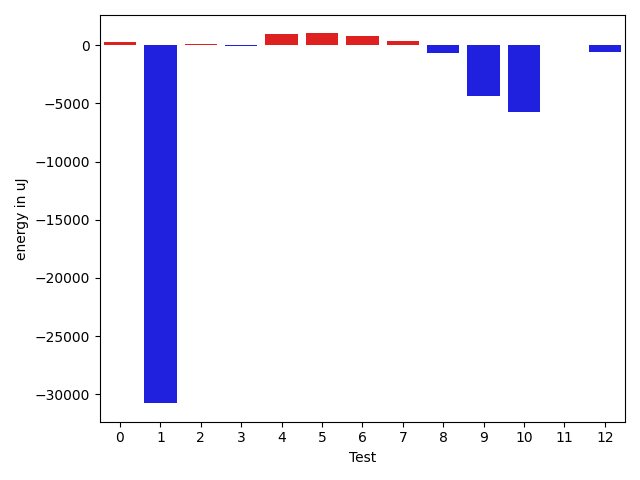

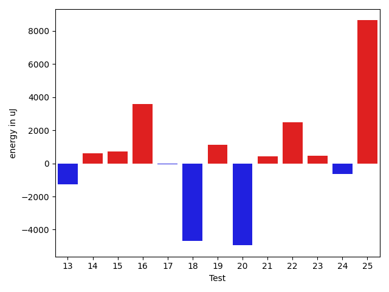

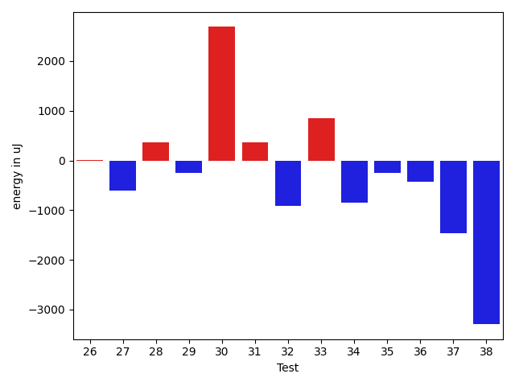

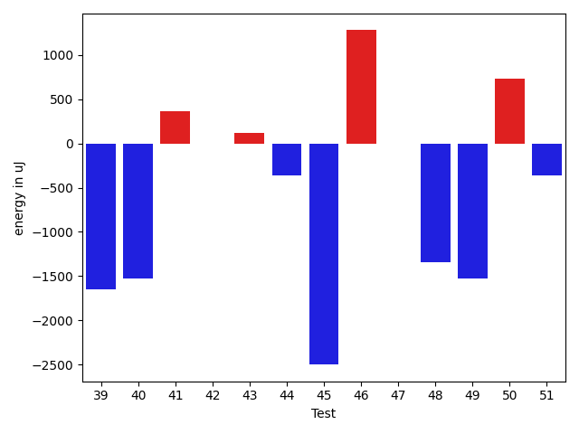

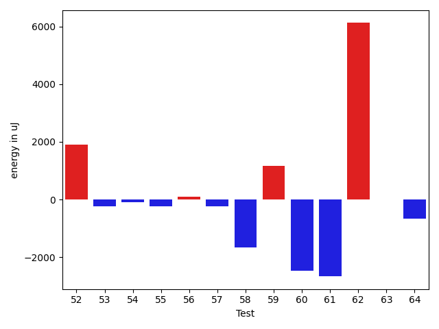

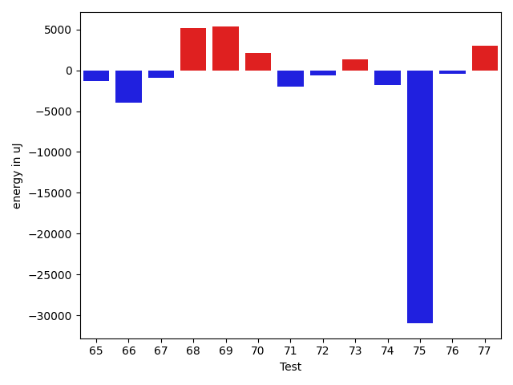

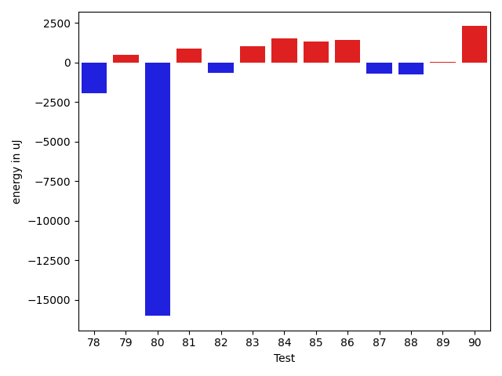

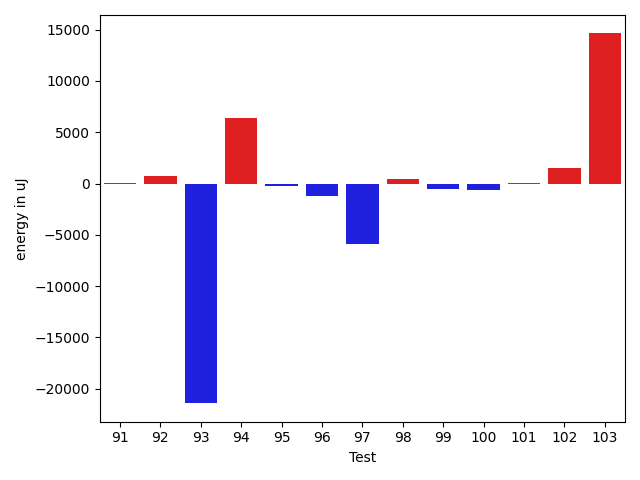

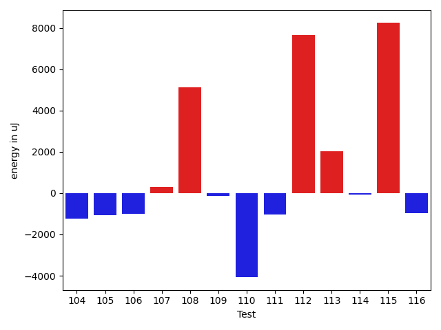

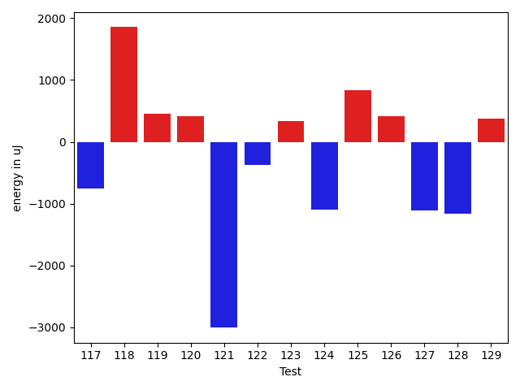

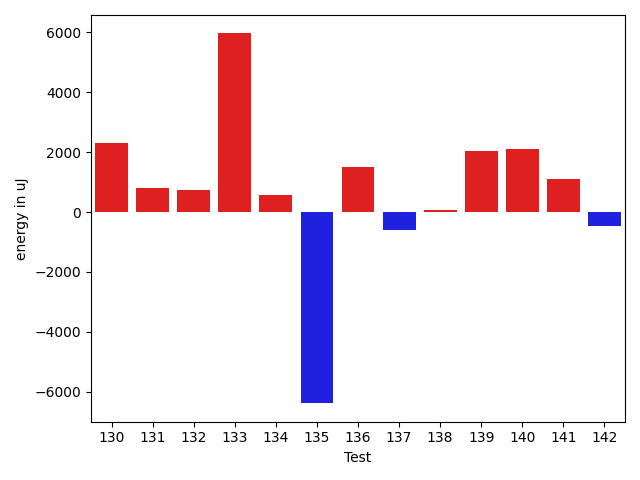

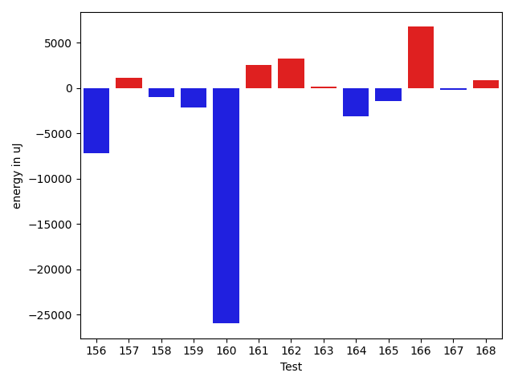

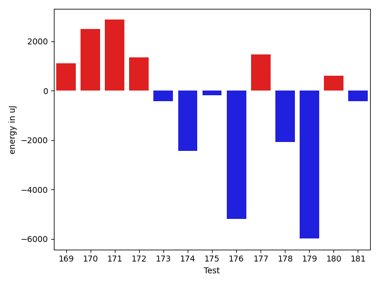

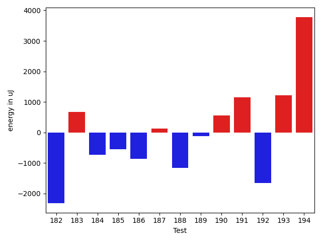

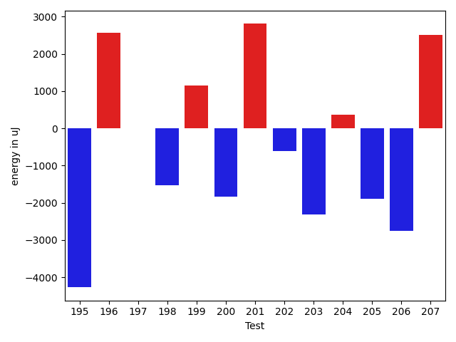

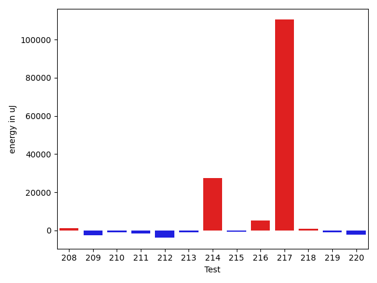

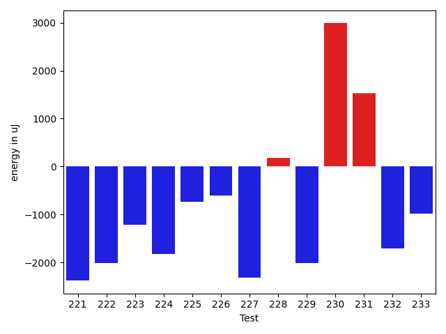

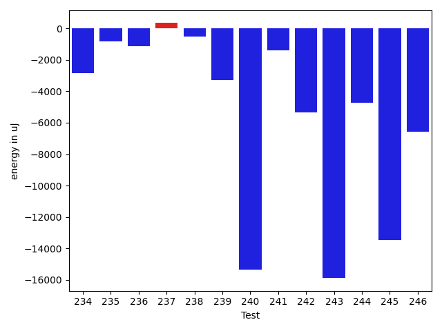

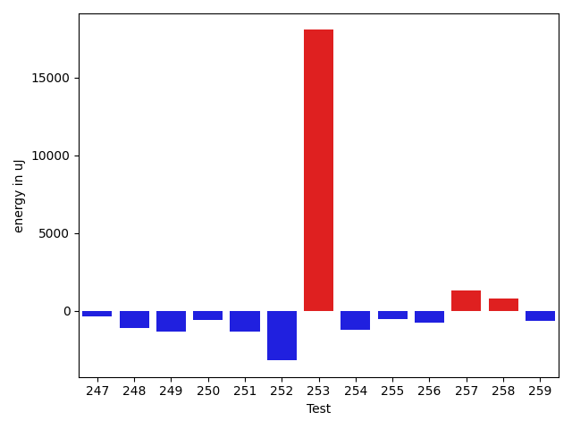

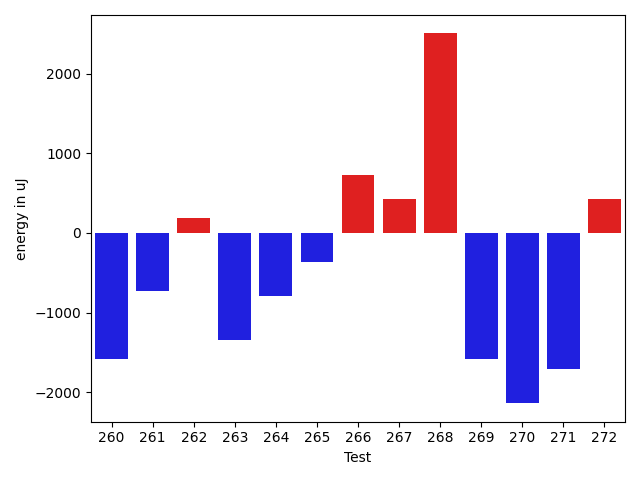

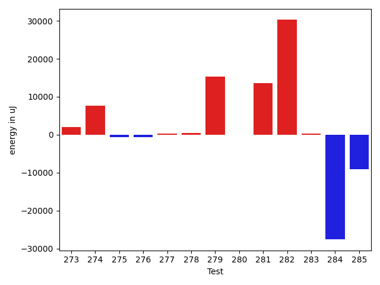

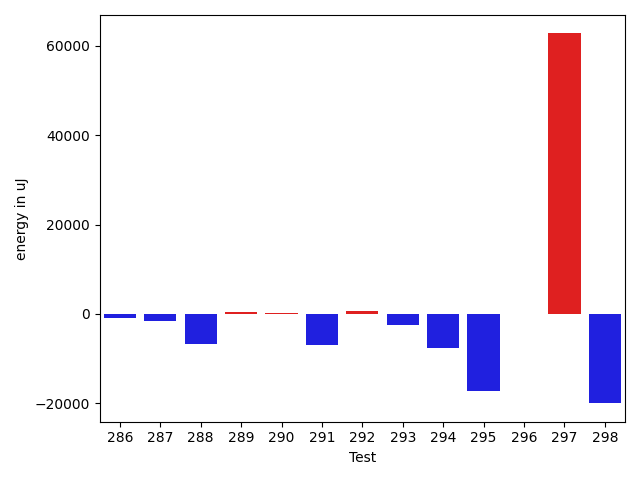

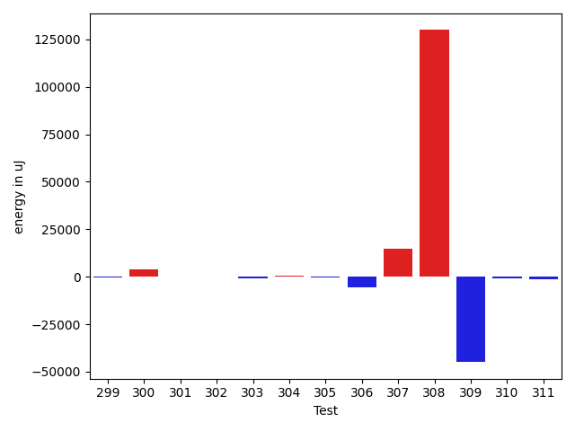

| ID | EnergyV1 | EnergyV2 | DeltaEnergy | σV1 | σV2 |
| --- | --- | --- | --- | --- | --- |
| 0 | 36865 | 36743 | -122 | 4272.231771973125 | 4421.938014904319 |
| 1 | 37415 | 37110 | -305 | 138987.59556536248 | 93756.28139496491 |
| 2 | 33203 | 33814 | 611 | 3292.599066140757 | 3960.46643294877 |
| 3 | 34118 | 34485 | 367 | 3601.375524442672 | 3904.6889308244313 |
| 4 | 33569 | 34057 | 488 | 3239.121879042726 | 3583.612790600649 |
| 5 | 33508 | 34058 | 550 | 4131.137548418185 | 4027.926024177675 |
| 6 | 33997 | 34302 | 305 | 3685.0365864818523 | 5778.015576188566 |
| 7 | 33997 | 33874 | -123 | 3562.772070685174 | 3740.221252393969 |
| 8 | 34119 | 32837 | -1282 | 3834.6114855220935 | 4769.056350842235 |
| 9 | 37232 | 35278 | -1954 | 25260.08791729369 | 15584.692274017563 |
| 10 | 38391 | 38391 | 0 | 48103.246870260264 | 54750.8025553602 |
| 11 | 34973 | 34180 | -793 | 3778.16568993598 | 3330.791358658002 |
| 12 | 34363 | 33570 | -793 | 3913.1249050354027 | 4169.90854854809 |
| 13 | 36010 | 33813 | -2197 | 3725.2031327385744 | 5382.239579851562 |
| 14 | 35218 | 34729 | -489 | 3631.9214204590903 | 7355.7906490329115 |
| 15 | 33813 | 33813 | 0 | 3557.2341439795887 | 6280.272358581209 |
| 16 | 33935 | 33386 | -549 | 3695.5114669370823 | 25686.30525270628 |
| 17 | 34424 | 34484 | 60 | 4468.445327522955 | 4310.253655236851 |
| 18 | 36010 | 36438 | 428 | 52970.46656498953 | 37959.66374973439 |
| 19 | 33997 | 36621 | 2624 | 4449.478722207244 | 6328.508407589466 |
| 20 | 36011 | 34119 | -1892 | 33723.65393201547 | 33530.314249580486 |
| 21 | 34851 | 35462 | 611 | 4321.3972323755825 | 3853.224539726908 |
| 22 | 34302 | 36193 | 1891 | 2407.720051729437 | 4619.63782130158 |
| 23 | 34729 | 34974 | 245 | 4227.413237494921 | 4464.342917324478 |
| 24 | 35889 | 33691 | -2198 | 4836.77847347584 | 5952.182014648932 |
| 25 | 41016 | 58899 | 17883 | 24396.117307287925 | 35517.657824958216 |
| 26 | 37963 | 37964 | 1 | 17658.498160705632 | 31186.612846107702 |
| 27 | 35157 | 34546 | -611 | 4306.376239518574 | 3445.318514831256 |
| 28 | 35156 | 35523 | 367 | 13054.581287775694 | 14511.152307085109 |
| 29 | 34423 | 34180 | -243 | 4395.860049552885 | 3444.2370966006392 |
| 30 | 32714 | 35400 | 2686 | 3289.373886091394 | 3847.792289092539 |
| 31 | 33997 | 34362 | 365 | 3709.4609163596806 | 3547.8124249788725 |
| 32 | 36621 | 35705 | -916 | 35913.08927744869 | 3628.388228373925 |
| 33 | 33325 | 34179 | 854 | 3249.8949627177276 | 3784.740349138894 |
| 34 | 34057 | 33203 | -854 | 4050.468339521673 | 4194.157857573504 |
| 35 | 34301 | 34057 | -244 | 7214.0503898039115 | 4458.578377456639 |
| 36 | 36987 | 36560 | -427 | 15923.240802241788 | 22365.743386032947 |
| 37 | 36804 | 35339 | -1465 | 92383.1953001022 | 90753.05265062382 |
| 38 | 62744 | 59448 | -3296 | 42760.59999944122 | 46831.8352721871 |
| 39 | 35766 | 34119 | -1647 | 4845.492303739631 | 4434.641251008692 |
| 40 | 35278 | 33752 | -1526 | 4740.266496265933 | 3143.4330256144217 |
| 41 | 33813 | 34180 | 367 | 3318.2323484085155 | 3799.0092086995987 |
| 42 | 34607 | 34607 | 0 | 3654.4562642420033 | 4500.4643439339025 |
| 43 | 34484 | 34607 | 123 | 4057.66224735133 | 3033.9839042199546 |
| 44 | 34607 | 34241 | -366 | 4074.2279567774535 | 1964.9701389738277 |
| 45 | 35461 | 32959 | -2502 | 4104.846618328144 | 2931.3216455796437 |
| 46 | 33570 | 34851 | 1281 | 3461.3375141259357 | 21432.425963350797 |
| 47 | 34363 | 34363 | 0 | 4318.006328305412 | 5651.538043576737 |
| 48 | 35096 | 33752 | -1344 | 4541.626716072049 | 3617.4829332006 |
| 49 | 35278 | 33753 | -1525 | 3442.1527390185115 | 3910.6351681106507 |
| 50 | 35706 | 36438 | 732 | 4322.321191718056 | 3362.8350163126906 |
| 51 | 33691 | 33325 | -366 | 4487.683958337235 | 3886.168233745004 |
| 52 | 33935 | 34485 | 550 | 3777.413338417732 | 8037.575355172189 |
| 53 | 34302 | 33631 | -671 | 3996.072649493179 | 3014.5905727691397 |
| 54 | 34057 | 33020 | -1037 | 3861.67726142475 | 3760.7630153081236 |
| 55 | 34485 | 34118 | -367 | 4307.791136490285 | 4501.608007473468 |
| 56 | 34179 | 34485 | 306 | 4915.117022710525 | 4377.531572122645 |
| 57 | 34668 | 34545 | -123 | 4519.893634971213 | 4093.007739035018 |
| 58 | 36438 | 34362 | -2076 | 4629.495427786387 | 3775.8301653900994 |
| 59 | 33203 | 35156 | 1953 | 3890.6687532479555 | 4558.487816326554 |
| 60 | 37292 | 34363 | -2929 | 3643.638045783044 | 3287.6783328025244 |
| 61 | 35034 | 34729 | -305 | 8199.862251518469 | 3957.640516930212 |
| 62 | 36133 | 33874 | -2259 | 3924.881915944771 | 44241.27889430957 |
| 63 | 33142 | 33569 | 427 | 2866.043354162059 | 3746.2771529266006 |
| 64 | 34606 | 33997 | -609 | 4049.4724073288467 | 3813.9995666248938 |
| 65 | 34485 | 32959 | -1526 | 4061.4799312851196 | 3525.379406882206 |
| 66 | 34729 | 35522 | 793 | 22527.755775500995 | 4146.154292506934 |
| 67 | 35766 | 34485 | -1281 | 7666.692343707001 | 5142.056415831486 |
| 68 | 35156 | 34729 | -427 | 3921.2861518525715 | 28649.201669946397 |
| 69 | 34607 | 35828 | 1221 | 4339.0174589670305 | 27133.824420319506 |
| 70 | 34851 | 34241 | -610 | 9773.017800670486 | 29486.64563347561 |
| 71 | 36377 | 37963 | 1586 | 41612.06661590879 | 30378.315328736968 |
| 72 | 34668 | 34363 | -305 | 4309.493164510292 | 4041.769806454513 |
| 73 | 67261 | 65308 | -1953 | 19573.27720678402 | 22601.21500197621 |
| 74 | 37292 | 36071 | -1221 | 32204.670292728664 | 32417.068264609534 |
| 75 | 38940 | 37414 | -1526 | 270411.76239058515 | 194171.65895164537 |
| 76 | 35339 | 34424 | -915 | 7427.329297196542 | 4352.023363215825 |
| 77 | 35217 | 35522 | 305 | 4106.293215077636 | 22961.712460137653 |
| 78 | 37231 | 36377 | -854 | 13738.887134462044 | 12519.939493845415 |
| 79 | 36071 | 35400 | -671 | 4803.149794258152 | 4236.518027763599 |
| 80 | 37903 | 35217 | -2686 | 258728.5365994847 | 235557.61129810775 |
| 81 | 35583 | 36133 | 550 | 3827.730737293602 | 3568.4642864226794 |
| 82 | 38635 | 36316 | -2319 | 4045.8239134802798 | 3724.484485326854 |
| 83 | 34058 | 36255 | 2197 | 4302.785039947964 | 3801.735110117484 |
| 84 | 33325 | 34668 | 1343 | 2975.0575776169535 | 3784.9293059727115 |
| 85 | 32349 | 34729 | 2380 | 4213.928194261132 | 4100.787232796821 |
| 86 | 32715 | 34485 | 1770 | 4097.998317276375 | 4089.5723628276 |
| 87 | 32776 | 32776 | 0 | 4117.973478664919 | 3199.041324823578 |
| 88 | 36072 | 35706 | -366 | 4761.428741921808 | 4728.239983211826 |
| 89 | 32532 | 34301 | 1769 | 8234.640355945181 | 6604.556718681 |
| 90 | 32898 | 37292 | 4394 | 4118.092276296605 | 3227.323385465888 |
| 91 | 31494 | 32166 | 672 | 4351.748728959428 | 2431.2101696251784 |
| 92 | 34180 | 34485 | 305 | 4227.814384387821 | 3702.678255390107 |
| 93 | 38329 | 37109 | -1220 | 104233.43963824879 | 76062.29040388031 |
| 94 | 59265 | 61706 | 2441 | 21108.87924371257 | 29719.839870403393 |
| 95 | 33935 | 34362 | 427 | 4680.059476576514 | 4059.9942052838915 |
| 96 | 33081 | 32959 | -122 | 4310.2358907133785 | 2920.848996332231 |
| 97 | 36988 | 34302 | -2686 | 13427.563067679981 | 7572.209310150815 |
| 98 | 34058 | 34668 | 610 | 3791.145756275894 | 3192.362086292844 |
| 99 | 33508 | 33935 | 427 | 4593.100365329109 | 2831.464584605916 |
| 100 | 33081 | 32776 | -305 | 4384.82792848807 | 3760.0669060211017 |
| 101 | 33264 | 33203 | -61 | 4186.119966428738 | 4665.724015316982 |
| 102 | 32166 | 33570 | 1404 | 4467.420861012345 | 3727.595486518234 |
| 103 | 33081 | 36865 | 3784 | 4622.451808018729 | 47038.077344022284 |
| 104 | 34973 | 32593 | -2380 | 4736.806529397076 | 4374.086642897227 |
| 105 | 32654 | 32959 | 305 | 4120.126328519911 | 2391.907440059932 |
| 106 | 31372 | 31250 | -122 | 5100.074488375855 | 3959.698799182447 |
| 107 | 35583 | 34119 | -1464 | 3123.6121718292748 | 3506.5470359822 |
| 108 | 33813 | 32532 | -1281 | 4076.153392771788 | 30408.164968950176 |
| 109 | 33386 | 34119 | 733 | 3610.355628371478 | 3451.045746300033 |
| 110 | 33874 | 30152 | -3722 | 4418.029498417693 | 2337.504007349506 |
| 111 | 34607 | 33325 | -1282 | 4561.194030319497 | 4010.676368956729 |
| 112 | 34668 | 31921 | -2747 | 4204.273820768576 | 42581.452931556916 |
| 113 | 32897 | 35706 | 2809 | 4155.374228333712 | 3216.73110153644 |
| 114 | 34058 | 33142 | -916 | 3852.226828469641 | 4330.936777147302 |
| 115 | 33692 | 35034 | 1342 | 4175.45439329612 | 33786.98895392003 |
| 116 | 33508 | 32959 | -549 | 4993.995712136676 | 3239.0464628741965 |
| 117 | 32837 | 33631 | 794 | 3728.251351888328 | 3336.677439106847 |
| 118 | 32410 | 34912 | 2502 | 4096.300459756001 | 4442.564717619001 |
| 119 | 35950 | 34973 | -977 | 4700.747508523394 | 4061.259769524175 |
| 120 | 34241 | 35706 | 1465 | 4694.346172890289 | 2451.818476151936 |
| 121 | 35278 | 31799 | -3479 | 4461.520692544191 | 3330.4137132990104 |
| 122 | 30518 | 32532 | 2014 | 4350.587335774905 | 3189.895247709245 |
| 123 | 34241 | 36682 | 2441 | 3960.259501037218 | 3633.8679451867206 |
| 124 | 34058 | 33142 | -916 | 4395.896232823369 | 3908.249770076898 |
| 125 | 32471 | 33325 | 854 | 3877.8243739241207 | 3924.2191767917348 |
| 126 | 34057 | 33508 | -549 | 2987.88829443137 | 4404.348739953417 |
| 127 | 33447 | 32531 | -916 | 4248.840358262475 | 4308.921945606968 |
| 128 | 36132 | 35706 | -426 | 4442.586615907871 | 3081.4892142887306 |
| 129 | 33936 | 34241 | 305 | 3510.4750382326747 | 3481.5699284470315 |
| 130 | 32837 | 36621 | 3784 | 3784.777670331618 | 5653.242169076275 |
| 131 | 34057 | 33630 | -427 | 2790.8611772581316 | 4600.403026575 |
| 132 | 32654 | 35401 | 2747 | 3354.1449835968115 | 3408.5502431274776 |
| 133 | 34790 | 37293 | 2503 | 5221.536884107854 | 28374.06274700247 |
| 134 | 35767 | 33997 | -1770 | 3426.105768915478 | 4452.331867443311 |
| 135 | 33020 | 33142 | 122 | 33274.69696014587 | 4233.584475650081 |
| 136 | 34302 | 36316 | 2014 | 4160.924294310913 | 4259.234483036581 |
| 137 | 36865 | 35462 | -1403 | 5088.0015641376 | 3551.5928314121834 |
| 138 | 35828 | 33447 | -2381 | 3273.8188317400145 | 3950.6289232081626 |
| 139 | 31921 | 35584 | 3663 | 3103.437421674056 | 3293.2455013212716 |
| 140 | 32043 | 35339 | 3296 | 2727.9714299180223 | 4435.920195897916 |
| 141 | 33630 | 34851 | 1221 | 3712.0036737050787 | 2887.9249295576105 |
| 142 | 36072 | 34180 | -1892 | 3988.454795073369 | 4487.690248984808 |
| 143 | 36621 | 33081 | -3540 | 5432.35169925282 | 4264.022239883631 |
| 144 | 32959 | 31921 | -1038 | 5258.7369928529415 | 2911.815104020171 |
| 145 | 35400 | 32287 | -3113 | 2501.659597106672 | 3985.2995615187224 |
| 146 | 32837 | 35888 | 3051 | 4572.459649903977 | 3133.933167856602 |
| 147 | 32898 | 34607 | 1709 | 4748.656896568717 | 3005.584683366764 |
| 148 | 37720 | 35828 | -1892 | 22934.954472388188 | 14511.663697013792 |
| 149 | 36376 | 35706 | -670 | 25732.989036758972 | 34659.91843084029 |
| 150 | 36743 | 37598 | 855 | 44515.34930852903 | 57527.11165439192 |
| 151 | 38819 | 35035 | -3784 | 4580.3061862718305 | 3147.896959130988 |
| 152 | 132080 | 132629 | 549 | 250996.27095279592 | 80384.38637209161 |
| 153 | 34789 | 34180 | -609 | 3602.527306500652 | 3334.0285676334447 |
| 154 | 79284 | 91797 | 12513 | 80673.02851761815 | 89601.79920302029 |
| 155 | 35767 | 36438 | 671 | 27177.1733814204 | 4842.550592812699 |
| 156 | 36865 | 36621 | -244 | 33734.55651351348 | 2554.32161091096 |
| 157 | 35706 | 35888 | 182 | 3691.2514065682753 | 4277.945794160258 |
| 158 | 37780 | 36743 | -1037 | 15642.333116143107 | 12552.61372554294 |
| 159 | 35522 | 35766 | 244 | 19640.21905426294 | 6707.9148668976695 |
| 160 | 42297 | 40954 | -1343 | 62252.60583615991 | 36892.592998806955 |
| 161 | 39062 | 40954 | 1892 | 92212.17280566065 | 95894.76990781532 |
| 162 | 37292 | 40405 | 3113 | 13490.674145105475 | 15264.6260589991 |
| 163 | 33936 | 34119 | 183 | 4473.804873650616 | 4849.242883503554 |
| 164 | 34485 | 33325 | -1160 | 4691.444702099466 | 3854.2732449728546 |
| 165 | 34607 | 33936 | -671 | 3934.8460465083285 | 4236.296152467712 |
| 166 | 39429 | 34545 | -4884 | 4340.220113975223 | 40078.14097407359 |
| 167 | 36926 | 35766 | -1160 | 3001.9058346323923 | 5174.569834785231 |
| 168 | 34607 | 35339 | 732 | 3875.74245146585 | 4593.525541022957 |
| 169 | 36499 | 37598 | 1099 | 3931.820011139879 | 4706.209989696611 |
| 170 | 34180 | 36682 | 2502 | 2742.583779391661 | 3554.1100094374788 |
| 171 | 36744 | 39612 | 2868 | 5221.751819313132 | 120511.90921531006 |
| 172 | 35278 | 36621 | 1343 | 5218.109127940288 | 4309.17174783551 |
| 173 | 37353 | 36926 | -427 | 4284.189864244979 | 4026.184254889608 |
| 174 | 37780 | 35339 | -2441 | 3832.0495573517837 | 3763.3004610315134 |
| 175 | 37841 | 37659 | -182 | 33784.56493675734 | 3020.345914324528 |
| 176 | 41015 | 35827 | -5188 | 4706.127143150725 | 4239.344698308263 |
| 177 | 34729 | 36194 | 1465 | 2903.651349594162 | 3402.669876825761 |
| 178 | 36621 | 34545 | -2076 | 3606.562247473064 | 3435.678705136811 |
| 179 | 42603 | 36621 | -5982 | 86661.98609328459 | 3867.2622826102706 |
| 180 | 33631 | 34241 | 610 | 3187.846797471963 | 4694.584745096087 |
| 181 | 36194 | 35767 | -427 | 56533.91481135071 | 77387.08256988741 |
| 182 | 34912 | 32593 | -2319 | 3708.969807950439 | 3698.115968842549 |
| 183 | 34729 | 35401 | 672 | 4314.822761917812 | 3934.251202651503 |
| 184 | 33387 | 32653 | -734 | 3831.5278942432633 | 3666.1583139105855 |
| 185 | 36193 | 35645 | -548 | 7781.03687710522 | 9613.482870797247 |
| 186 | 33630 | 32776 | -854 | 4098.001951687157 | 4002.889006229468 |
| 187 | 33875 | 33996 | 121 | 3063.7507553675673 | 3494.1638238971127 |
| 188 | 34973 | 33813 | -1160 | 4285.8313377293825 | 3244.846375752193 |
| 189 | 114624 | 114502 | -122 | 33021.52630683346 | 29688.949400259593 |
| 190 | 32470 | 33020 | 550 | 3913.0778651446235 | 4072.4416297334706 |
| 191 | 36865 | 38025 | 1160 | 24263.888851462158 | 19761.43383145039 |
| 192 | 36438 | 34790 | -1648 | 4714.6889356984075 | 3789.0598538854633 |
| 193 | 33203 | 34424 | 1221 | 3473.9091315578457 | 3913.244394856722 |
| 194 | 33508 | 37292 | 3784 | 41421.67425331212 | 3827.980070771297 |
| 195 | 35888 | 31616 | -4272 | 4302.238421286499 | 4085.0595202457716 |
| 196 | 31983 | 34546 | 2563 | 4275.611260907614 | 3974.1887676539404 |
| 197 | 32898 | 32898 | 0 | 3595.590911102096 | 3029.0580264333003 |
| 198 | 34851 | 33325 | -1526 | 4624.753565318973 | 4081.546334589987 |
| 199 | 36254 | 37415 | 1161 | 24710.342456058963 | 16773.47407727412 |
| 200 | 35644 | 33813 | -1831 | 4286.1215683605415 | 3910.160378744074 |
| 201 | 34240 | 37048 | 2808 | 2968.2850045964437 | 4082.4628002267773 |
| 202 | 34973 | 34362 | -611 | 3655.311813523113 | 4338.405187147349 |
| 203 | 36132 | 33814 | -2318 | 4775.81116120602 | 2718.856664574284 |
| 204 | 34058 | 34424 | 366 | 3721.2695302365114 | 3572.0602491494624 |
| 205 | 33691 | 31799 | -1892 | 4141.776797462654 | 4092.6921995185508 |
| 206 | 36010 | 33264 | -2746 | 4973.182195536375 | 4202.817027388469 |
| 207 | 34179 | 36682 | 2503 | 4073.626183845823 | 4591.097443354366 |
| 208 | 38452 | 36865 | -1587 | 16930.90133960645 | 18175.362763642435 |
| 209 | 36377 | 34302 | -2075 | 4907.92266488535 | 4110.246972958065 |
| 210 | 36011 | 34668 | -1343 | 4103.609157967695 | 4282.291777678346 |
| 211 | 36438 | 34973 | -1465 | 3893.8114369145146 | 4050.1983205065253 |
| 212 | 38757 | 36682 | -2075 | 30063.207369630367 | 26754.30406125257 |
| 213 | 36132 | 34790 | -1342 | 4462.779584437735 | 3928.258617731478 |
| 214 | 36743 | 41809 | 5066 | 56273.056957098706 | 72420.14324350457 |
| 215 | 36377 | 33630 | -2747 | 4737.181434274024 | 8100.962467471072 |
| 216 | 40772 | 39551 | -1221 | 49885.77040718492 | 60422.86285664732 |
| 217 | 39978 | 37964 | -2014 | 428558.4124197612 | 480829.8720215376 |
| 218 | 34363 | 34302 | -61 | 4693.854587548836 | 3990.1517612797265 |
| 219 | 35706 | 34973 | -733 | 4526.900516249905 | 4189.34445013477 |
| 220 | 35889 | 33874 | -2015 | 4326.676674030543 | 3530.4054092043716 |
| 221 | 35950 | 33569 | -2381 | 4166.354070211732 | 3620.3007767265462 |
| 222 | 36072 | 34057 | -2015 | 4629.872157128966 | 4497.192031641002 |
| 223 | 34912 | 33691 | -1221 | 5744.959263635619 | 5806.969645106101 |
| 224 | 35645 | 33814 | -1831 | 4634.9562492433515 | 3849.022628029141 |
| 225 | 33691 | 32959 | -732 | 4495.625630025456 | 9064.981344747062 |
| 226 | 37537 | 36926 | -611 | 67601.58067560254 | 75049.5465345438 |
| 227 | 35766 | 33447 | -2319 | 9171.949891022841 | 12272.36271242524 |
| 228 | 33387 | 33570 | 183 | 3610.437262682817 | 23482.10548238488 |
| 229 | 37537 | 35522 | -2015 | 4367.7619140127135 | 3476.647940578643 |
| 230 | 41443 | 44433 | 2990 | 71103.53182594135 | 58983.464685055216 |
| 231 | 35279 | 36805 | 1526 | 3699.452535338775 | 4289.3365300096075 |
| 232 | 36071 | 34362 | -1709 | 5001.795750864235 | 3955.708012315649 |
| 233 | 34851 | 33875 | -976 | 4485.43705076774 | 3803.397173228492 |
| 234 | 35889 | 33447 | -2442 | 4810.1906739354845 | 3703.8484615739685 |
| 235 | 36377 | 35584 | -793 | 4661.175797924918 | 4257.034670164582 |
| 236 | 35095 | 33569 | -1526 | 4805.472891847972 | 2959.666233896397 |
| 237 | 35705 | 34546 | -1159 | 9373.70970682247 | 22331.72085432775 |
| 238 | 35156 | 33447 | -1709 | 3968.639164076992 | 6500.414995920158 |
| 239 | 35400 | 34851 | -549 | 10254.515374777251 | 4989.080030171704 |
| 240 | 97168 | 80017 | -17151 | 79279.61134359289 | 79719.14805716061 |
| 241 | 36011 | 34729 | -1282 | 17969.775722858358 | 10602.047316328179 |
| 242 | 71777 | 70007 | -1770 | 30326.365442154944 | 26457.295275476394 |
| 243 | 36194 | 35645 | -549 | 88122.96587971142 | 66269.81489215342 |
| 244 | 61096 | 43334 | -17762 | 20926.802718869567 | 21618.900925623282 |
| 245 | 41809 | 35400 | -6409 | 38822.811439425896 | 36209.87896919218 |
| 246 | 42908 | 35340 | -7568 | 19063.63961491475 | 17287.05141387213 |
| 247 | 33691 | 33325 | -366 | 4897.95072099609 | 3641.3637478850446 |
| 248 | 37231 | 36132 | -1099 | 11819.347491098917 | 12351.181751190174 |
| 249 | 37598 | 36255 | -1343 | 19705.01679217933 | 16067.538789920995 |
| 250 | 35644 | 35095 | -549 | 8202.670509921081 | 9241.353525380946 |
| 251 | 35339 | 33997 | -1342 | 5274.279070592386 | 3783.4794198440086 |
| 252 | 74889 | 71716 | -3173 | 184234.83831096886 | 38426.57390407724 |
| 253 | 116515 | 134582 | 18067 | 265798.7959458689 | 312660.96005294414 |
| 254 | 36438 | 35217 | -1221 | 15629.064158059731 | 8292.554296290451 |
| 255 | 35889 | 35400 | -489 | 40962.85527971923 | 19600.81117465295 |
| 256 | 36926 | 36193 | -733 | 59061.53601461044 | 48759.30300912262 |
| 257 | 33508 | 34851 | 1343 | 5297.88934000866 | 3865.0581994900626 |
| 258 | 160156 | 160949 | 793 | 307451.342832823 | 286642.91303442616 |
| 259 | 35645 | 35035 | -610 | 4549.565495988919 | 4231.416266924204 |
| 260 | 36682 | 35095 | -1587 | 39626.58231766539 | 32997.28745887622 |
| 261 | 36316 | 35583 | -733 | 4132.132081573749 | 7740.150159324358 |
| 262 | 34240 | 34423 | 183 | 4113.401370689334 | 3604.0443965387303 |
| 263 | 39917 | 38574 | -1343 | 86349.38763712416 | 428818.1639287731 |
| 264 | 35462 | 34668 | -794 | 3924.7709729755466 | 2903.2938173384928 |
| 265 | 34546 | 34180 | -366 | 3918.332022918863 | 3169.9990981031865 |
| 266 | 34668 | 35401 | 733 | 3962.179872222329 | 7184.200161233446 |
| 267 | 34302 | 34729 | 427 | 3377.0559900599815 | 5463.030616309891 |
| 268 | 33752 | 36255 | 2503 | 5329.149187846642 | 4921.118603077511 |
| 269 | 35705 | 34118 | -1587 | 3720.9973125494193 | 2719.5520052712727 |
| 270 | 36865 | 34729 | -2136 | 4091.3244582268476 | 2462.8852984009595 |
| 271 | 37781 | 36072 | -1709 | 4918.167073725675 | 3935.7635739106863 |
| 272 | 37292 | 37720 | 428 | 4575.322478812173 | 3689.0467820292006 |
| 273 | 33264 | 38392 | 5128 | 2227.5701221036543 | 4014.269370182934 |
| 274 | 36560 | 36804 | 244 | 3040.2810850954043 | 24427.350565503413 |
| 275 | 35706 | 34546 | -1160 | 4126.658619405185 | 2902.076487189819 |
| 276 | 36316 | 36132 | -184 | 7383.040506625522 | 3850.971002020426 |
| 277 | 36926 | 36926 | 0 | 4544.072051096412 | 3752.1766087505043 |
| 278 | 36988 | 38330 | 1342 | 39463.26799722538 | 16882.282916796492 |
| 279 | 38025 | 39123 | 1098 | 71530.48867781983 | 94423.79766883748 |
| 280 | 39856 | 41565 | 1709 | 43542.72670022897 | 42921.47496212062 |
| 281 | 256164 | 297485 | 41321 | 103751.78801528744 | 106122.44735759344 |
| 282 | 360229 | 390807 | 30578 | 108409.2375717855 | 135881.52442246638 |
| 283 | 62988 | 66650 | 3662 | 59741.12096879139 | 44152.00303702438 |
| 284 | 38635 | 36804 | -1831 | 99648.60606531533 | 65743.83687589304 |
| 285 | 38818 | 34302 | -4516 | 37692.40142025325 | 28906.128105448697 |
| 286 | 33631 | 33752 | 121 | 4612.56135267356 | 3689.770903261973 |
| 287 | 35584 | 33020 | -2564 | 3387.3200945600606 | 4589.70590694913 |
| 288 | 43213 | 36804 | -6409 | 66951.70110826162 | 63873.52261295484 |
| 289 | 36865 | 37720 | 855 | 4679.712019088057 | 4039.4528309603666 |
| 290 | 34607 | 36194 | 1587 | 4233.663606669616 | 4313.2238662869795 |
| 291 | 36132 | 36194 | 62 | 27883.101535991937 | 3870.9806639360922 |
| 292 | 36255 | 36682 | 427 | 3582.9541478506253 | 4343.711517365507 |
| 293 | 37048 | 34301 | -2747 | 3752.9680408060917 | 3410.6294016959387 |
| 294 | 37903 | 36316 | -1587 | 27983.1953949097 | 4418.526446529168 |
| 295 | 38208 | 37048 | -1160 | 48685.546141642495 | 3764.6984374926387 |
| 296 | 68481 | 65308 | -3173 | 23652.555182731874 | 29617.370184857242 |
| 297 | 40222 | 43091 | 2869 | 23744.11308757511 | 116660.01181030969 |
| 298 | 41931 | 37353 | -4578 | 44601.8309395081 | 11692.252389749376 |
| 299 | 36682 | 37170 | 488 | 11546.819325118557 | 12910.903773006274 |
| 300 | 68237 | 70312 | 2075 | 84793.45491036371 | 88674.51739580078 |
| 301 | 35705 | 35156 | -549 | 4724.12267142254 | 3927.8895703335006 |
| 302 | 36744 | 35401 | -1343 | 48896.33672341445 | 49886.18374788254 |
| 303 | 35644 | 34973 | -671 | 3563.3153514834535 | 4827.330749645034 |
| 304 | 34668 | 37293 | 2625 | 3762.058931601722 | 4488.350169389144 |
| 305 | 34668 | 33630 | -1038 | 3733.483899417658 | 2382.18480808617 |
| 306 | 36927 | 36804 | -123 | 73379.69221112326 | 60076.884948679086 |
| 307 | 37842 | 37354 | -488 | 67325.59838157671 | 109266.39441594492 |
| 308 | 36621 | 38879 | 2258 | 44573.70424264478 | 507791.08381811413 |
| 309 | 38452 | 38025 | -427 | 490034.21138331655 | 391839.8698004371 |
| 310 | 36438 | 36072 | -366 | 4269.282761999152 | 3196.9034429059457 |
| 311 | 37292 | 36499 | -793 | 3764.7587640877005 | 2759.625614816368 |
| 312 | 36194 | 37415 | 1221 | 73938.6046942506 | 92574.04597916691 |
| 313 | 36377 | 33874 | -2503 | 28896.182449208252 | 3501.5430477941513 |
| 314 | 35644 | 35523 | -121 | 3934.3019440533853 | 4308.1618247918395 |
| 315 | 35645 | 36804 | 1159 | 3094.5066963698027 | 4193.051215793804 |
| 316 | 38086 | 40100 | 2014 | 708622.2840497455 | 595947.4935234983 |
| 317 | 36866 | 34607 | -2259 | 4632.223907194998 | 3527.298586510646 |
| 318 | 37415 | 39307 | 1892 | 96991.20629043003 | 67861.22440998847 |
| 319 | 37476 | 36866 | -610 | 97666.38940775764 | 79694.32329214331 |
| 320 | 37292 | 34912 | -2380 | 3156.048515991812 | 3756.532404580941 |
| 321 | 36988 | 36072 | -916 | 3933.794914265359 | 3847.4991864846443 |
| 322 | 36743 | 36560 | -183 | 491284.4786769112 | 394199.540230538 |

## Delta Duration per test method

| ID | DurationV1 | DurationsV2 | DeltaDuration |
| --- | --- | --- | --- |
| 0 | 866883.1607142857 | 805067.304347826 | -61815.85636645963 |
| 1 | 2760337.984375 | 1892882.4444444445 | -867455.5399305555 |
| 2 | 702113.243902439 | 675485.3265306122 | -26627.91737182683 |
| 3 | 695961.6585365854 | 674826.1086956522 | -21135.549840933178 |
| 4 | 646509.3414634146 | 692606.0243902439 | 46096.68292682932 |
| 5 | 694815.3555555556 | 676921.641509434 | -17893.714046121575 |
| 6 | 912871.0151515151 | 924382.8363636363 | 11511.821212121169 |
| 7 | 750475.5777777778 | 721791.1272727273 | -28684.45050505048 |
| 8 | 349434.35714285716 | 407032.0588235294 | 57597.70168067224 |
| 9 | 1518718.914893617 | 1461738.7959183673 | -56980.118975249585 |
| 10 | 1535758.621212121 | 1347294.0322580645 | -188464.5889540566 |
| 11 | 539508.5789473684 | 558082.8965517242 | 18574.317604355747 |
| 12 | 761298.3191489362 | 752298.1923076923 | -9000.126841243939 |
| 13 | 860599.5151515151 | 854278.6229508197 | -6320.892200695467 |
| 14 | 767492.8888888889 | 922471.4 | 154978.51111111115 |
| 15 | 788400.9411764706 | 821749.918367347 | 33348.97719087638 |
| 16 | 790647.7872340425 | 879575.8 | 88928.01276595751 |
| 17 | 674893.8518518518 | 707344.3125 | 32450.460648148204 |
| 18 | 1387836.5405405406 | 1223567.1846153846 | -164269.35592515604 |
| 19 | 717665.125 | 731770.5625 | 14105.4375 |
| 20 | 1251773.4545454546 | 1080581.4318181819 | -171192.0227272727 |
| 21 | 681896.8367346938 | 839595.6382978724 | 157698.80156317854 |
| 22 | 588508.8 | 418676.73333333334 | -169832.0666666667 |
| 23 | 689902.0731707317 | 678383.7346938775 | -11518.338476854144 |
| 24 | 885082.3653846154 | 936151.4428571429 | 51069.07747252751 |
| 25 | 1819626.3402061856 | 1996322.7216494845 | 176696.3814432989 |
| 26 | 1409688.3604651163 | 1584196.3647058823 | 174508.00424076593 |
| 27 | 743095.4137931034 | 525639.6538461539 | -217455.75994694955 |
| 28 | 1159484.9047619049 | 1196200.5897435897 | 36715.6849816849 |
| 29 | 486522.0 | 511593.72 | 25071.719999999972 |
| 30 | 653698.75 | 396261.6875 | -257437.0625 |
| 31 | 627638.8 | 606544.0952380953 | -21094.70476190478 |
| 32 | 682586.0 | 439503.8888888889 | -243082.11111111112 |
| 33 | 422447.2631578947 | 436582.76 | 14135.49684210529 |
| 34 | 803609.3538461538 | 818608.0576923077 | 14998.70384615392 |
| 35 | 985334.4848484849 | 1037926.5147058824 | 52592.029857397545 |
| 36 | 900227.9772727273 | 1018996.9074074074 | 118768.93013468012 |
| 37 | 1831349.0 | 2087000.847826087 | 255651.84782608692 |
| 38 | 2260900.7474747472 | 2340321.326530612 | 79420.57905586483 |
| 39 | 799222.44 | 833221.9807692308 | 33999.54076923081 |
| 40 | 855830.6346153846 | 867797.671875 | 11967.037259615376 |
| 41 | 662932.6888888889 | 672894.9487179487 | 9962.259829059825 |
| 42 | 553122.0 | 559187.3714285714 | 6065.371428571409 |
| 43 | 415934.1666666667 | 432159.85714285716 | 16225.690476190473 |
| 44 | 378261.53846153844 | 352801.4117647059 | -25460.126696832536 |
| 45 | 351180.35 | 390771.9375 | 39591.58750000002 |
| 46 | 710210.8372093023 | 838114.2553191489 | 127903.41810984653 |
| 47 | 941257.5606060605 | 1038003.2786885246 | 96745.71808246407 |
| 48 | 858547.6153846154 | 834526.3103448276 | -24021.30503978778 |
| 49 | 687776.0 | 871085.3023255814 | 183309.30232558143 |
| 50 | 567339.4375 | 679677.3928571428 | 112337.95535714284 |
| 51 | 717644.9318181818 | 769058.0425531915 | 51413.11073500977 |
| 52 | 892094.1090909091 | 916821.9655172414 | 24727.856426332262 |
| 53 | 484078.55555555556 | 488327.78571428574 | 4249.230158730177 |
| 54 | 744193.0363636364 | 725377.387755102 | -18815.648608534364 |
| 55 | 476802.3448275862 | 478650.6296296296 | 1848.284802043403 |
| 56 | 412154.04761904763 | 455258.4166666667 | 43104.36904761905 |
| 57 | 595431.5294117647 | 633674.2631578947 | 38242.73374613002 |
| 58 | 621469.3055555555 | 700550.5384615385 | 79081.232905983 |
| 59 | 348265.65 | 364195.1538461539 | 15929.50384615385 |
| 60 | 535262.2727272727 | 601878.7096774194 | 66616.43695014669 |
| 61 | 671163.1428571428 | 767775.0 | 96611.85714285716 |
| 62 | 610176.9677419355 | 838664.8928571428 | 228487.92511520733 |
| 63 | 469779.5714285714 | 468298.6206896552 | -1480.9507389162318 |
| 64 | 537369.7209302326 | 585093.3636363636 | 47723.6427061311 |
| 65 | 635327.0638297872 | 686491.4666666667 | 51164.40283687948 |
| 66 | 670282.5172413794 | 545924.9032258064 | -124357.61401557294 |
| 67 | 677547.625 | 560979.96875 | -116567.65625 |
| 68 | 511139.7727272727 | 741948.4117647059 | 230808.6390374332 |
| 69 | 742790.5853658536 | 786676.6909090909 | 43886.105543237296 |
| 70 | 1015364.5 | 1015552.9166666666 | 188.41666666662786 |
| 71 | 1314658.3181818181 | 1310797.283018868 | -3861.0351629501674 |
| 72 | 870079.046875 | 873701.4464285715 | 3622.3995535714785 |
| 73 | 2076769.1414141415 | 2086271.313131313 | 9502.171717171557 |
| 74 | 1367266.8309859154 | 1493432.552238806 | 126165.72125289054 |
| 75 | 2802291.5070422534 | 1972104.1076923078 | -830187.3993499456 |
| 76 | 919006.1846153847 | 880151.8656716418 | -38854.318943742895 |
| 77 | 758414.2931034482 | 840326.3469387755 | 81912.05383532727 |
| 78 | 1219086.3448275863 | 1218932.4705882352 | -153.87423935113475 |
| 79 | 817025.9047619047 | 808577.7708333334 | -8448.133928571362 |
| 80 | 2680888.411764706 | 2235627.2 | -445261.21176470583 |
| 81 | 682953.0 | 696297.6341463415 | 13344.634146341472 |
| 82 | 403755.77777777775 | 422453.15789473685 | 18697.380116959102 |
| 83 | 431877.95 | 422920.7 | -8957.25 |
| 84 | 635240.6428571428 | 598690.8529411765 | -36549.789915966336 |
| 85 | 480133.7916666667 | 439978.85185185185 | -40154.93981481483 |
| 86 | 652693.2 | 673510.4561403509 | 20817.256140350946 |
| 87 | 397665.22222222225 | 408010.8461538461 | 10345.623931623879 |
| 88 | 476811.09523809527 | 482512.5 | 5701.404761904734 |
| 89 | 947802.8510638297 | 879648.074074074 | -68154.77698975569 |
| 90 | 409679.3125 | 318100.625 | -91578.6875 |
| 91 | 364388.1666666667 | 374989.44444444444 | 10601.277777777752 |
| 92 | 632888.0 | 665475.8048780488 | 32587.80487804883 |
| 93 | 2232566.5172413792 | 1713123.6296296297 | -519442.8876117496 |
| 94 | 1820381.536585366 | 1863430.1794871795 | 43048.64290181361 |
| 95 | 551839.2105263158 | 552851.3142857143 | 1012.1037593984511 |
| 96 | 401154.1875 | 372785.375 | -28368.8125 |
| 97 | 858461.75 | 731376.3714285714 | -127085.37857142859 |
| 98 | 357049.17647058825 | 346920.8 | -10128.376470588264 |
| 99 | 358161.90476190473 | 398710.0 | 40548.095238095266 |
| 100 | 566641.1428571428 | 559170.7142857143 | -7470.4285714285215 |
| 101 | 399697.5333333333 | 403888.3703703704 | 4190.8370370370685 |
| 102 | 493554.3461538461 | 479206.27777777775 | -14348.068376068375 |
| 103 | 373298.6538461539 | 774759.0666666667 | 401460.4128205128 |
| 104 | 456216.3214285714 | 414030.7931034483 | -42185.52832512313 |
| 105 | 476907.5925925926 | 504426.6666666667 | 27519.074074074102 |
| 106 | 349025.0 | 340758.8888888889 | -8266.111111111124 |
| 107 | 340442.4 | 322062.6666666667 | -18379.733333333337 |
| 108 | 397553.3181818182 | 572165.3 | 174611.98181818187 |
| 109 | 367187.8461538461 | 400479.5 | 33291.65384615387 |
| 110 | 361656.0 | 355629.125 | -6026.875 |
| 111 | 575801.9 | 492220.1904761905 | -83581.70952380955 |
| 112 | 446705.5 | 658353.5454545454 | 211648.0454545454 |
| 113 | 561324.6 | 558491.5 | -2833.0999999999767 |
| 114 | 604971.8064516129 | 616344.0882352941 | 11372.281783681246 |
| 115 | 437910.95454545453 | 636152.6363636364 | 198241.68181818182 |
| 116 | 406874.72222222225 | 390938.52173913043 | -15936.200483091816 |
| 117 | 505302.0714285714 | 512685.2727272727 | 7383.201298701286 |
| 118 | 560821.4583333334 | 558045.074074074 | -2776.3842592593282 |
| 119 | 309651.8333333333 | 354640.0 | 44988.166666666686 |
| 120 | 455156.5714285714 | 443200.35 | -11956.221428571444 |
| 121 | 495620.55 | 514508.1176470588 | 18887.567647058808 |
| 122 | 463343.36842105264 | 429755.55555555556 | -33587.81286549708 |
| 123 | 403688.6666666667 | 374651.9166666667 | -29036.75 |
| 124 | 343547.8947368421 | 309514.5 | -34033.39473684208 |
| 125 | 412910.375 | 399137.0 | -13773.375 |
| 126 | 474477.0 | 659752.3333333334 | 185275.33333333337 |
| 127 | 456270.85 | 464163.5 | 7892.650000000023 |
| 128 | 392790.9375 | 343472.77777777775 | -49318.15972222225 |
| 129 | 456423.7931034483 | 454036.27777777775 | -2387.515325670538 |
| 130 | 386251.76470588235 | 378628.3333333333 | -7623.431372549036 |
| 131 | 350655.1176470588 | 368885.0 | 18229.882352941204 |
| 132 | 458223.3888888889 | 471579.26086956525 | 13355.87198067637 |
| 133 | 517165.3703703704 | 673141.5833333334 | 155976.21296296298 |
| 134 | 342381.0714285714 | 377020.45454545453 | 34639.38311688311 |
| 135 | 626654.8928571428 | 412269.6842105263 | -214385.20864661655 |
| 136 | 645568.5217391305 | 569861.3235294118 | -75707.19820971868 |
| 137 | 592535.4166666666 | 387190.70588235295 | -205344.71078431368 |
| 138 | 307588.5 | 337446.0 | 29857.5 |
| 139 | 420047.5 | 406145.09523809527 | -13902.404761904734 |
| 140 | 371689.14285714284 | 346239.0 | -25450.14285714284 |
| 141 | 447532.6 | 444877.95454545453 | -2654.645454545447 |
| 142 | 405966.125 | 386445.0416666667 | -19521.083333333314 |
| 143 | 541107.5625 | 392894.73333333334 | -148212.82916666666 |
| 144 | 375564.3 | 339626.73333333334 | -35937.56666666665 |
| 145 | 308169.9285714286 | 339339.45454545453 | 31169.52597402595 |
| 146 | 387404.1666666667 | 399755.46153846156 | 12351.294871794875 |
| 147 | 412228.36842105264 | 382572.6 | -29655.768421052664 |
| 148 | 948838.4509803922 | 951022.4761904762 | 2184.0252100840444 |
| 149 | 923355.0212765958 | 1131336.6666666667 | 207981.64539007097 |
| 150 | 987980.2592592592 | 1408523.78125 | 420543.5219907408 |
| 151 | 332553.5 | 429421.5714285714 | 96868.07142857142 |
| 152 | 5855976.808080808 | 4110584.6666666665 | -1745392.1414141417 |
| 153 | 391606.0 | 389763.28571428574 | -1842.7142857142608 |
| 154 | 3255014.406976744 | 3714631.273809524 | 459616.8668327797 |
| 155 | 794303.6744186047 | 664621.088888889 | -129682.58552971575 |
| 156 | 895573.7894736842 | 549591.6842105263 | -345982.10526315786 |
| 157 | 542556.9310344828 | 514396.40625 | -28160.524784482783 |
| 158 | 871293.1395348837 | 912984.1063829787 | 41690.966848095064 |
| 159 | 715793.4047619047 | 708270.6744186047 | -7522.730343300034 |
| 160 | 2100627.285714286 | 1615174.8636363635 | -485452.4220779224 |
| 161 | 2325350.4137931033 | 2278753.138888889 | -46597.27490421431 |
| 162 | 918399.6896551724 | 1009611.3636363636 | 91211.67398119124 |
| 163 | 471033.95 | 433176.8888888889 | -37857.061111111136 |
| 164 | 376049.0 | 423550.3333333333 | 47501.333333333314 |
| 165 | 408711.25 | 437446.2631578947 | 28735.01315789472 |
| 166 | 375926.64285714284 | 819029.5882352941 | 443102.94537815126 |
| 167 | 426106.6666666667 | 393912.6842105263 | -32193.982456140395 |
| 168 | 419197.347826087 | 401968.347826087 | -17229.0 |
| 169 | 520561.75 | 674301.7619047619 | 153740.0119047619 |
| 170 | 413075.3076923077 | 390494.85714285716 | -22580.45054945053 |
| 171 | 362478.6875 | 2534560.4444444445 | 2172081.7569444445 |
| 172 | 365481.25 | 411608.0625 | 46126.8125 |
| 173 | 486171.6153846154 | 488722.8888888889 | 2551.2735042735003 |
| 174 | 300776.3 | 323365.1 | 22588.79999999999 |
| 175 | 1077278.608695652 | 437452.38095238095 | -639826.2277432712 |
| 176 | 325820.3333333333 | 409685.2727272727 | 83864.93939393939 |
| 177 | 346862.9 | 402452.17647058825 | 55589.27647058823 |
| 178 | 368872.78571428574 | 376913.25 | 8040.464285714261 |
| 179 | 2714547.9285714286 | 423255.875 | -2291292.0535714286 |
| 180 | 339171.8823529412 | 386607.3333333333 | 47435.45098039211 |
| 181 | 1107710.7352941176 | 1506122.0 | 398411.2647058824 |
| 182 | 694350.2926829269 | 651571.1363636364 | -42779.156319290516 |
| 183 | 532012.1891891892 | 537886.1724137932 | 5873.98322460393 |
| 184 | 946084.0281690141 | 929340.3088235294 | -16743.719345484744 |
| 185 | 1034492.9873417722 | 1053839.4794520547 | 19346.492110282532 |
| 186 | 643244.5238095238 | 649539.0243902439 | 6294.500580720138 |
| 187 | 772343.5405405406 | 778659.5714285715 | 6316.030888030888 |
| 188 | 812656.1929824562 | 807637.2678571428 | -5018.925125313341 |
| 189 | 3802336.606060606 | 3844589.232323232 | 42252.626262626145 |
| 190 | 628813.5 | 633112.4827586206 | 4298.9827586206375 |
| 191 | 968664.5357142857 | 927526.9824561403 | -41137.553258145344 |
| 192 | 732957.7391304348 | 674452.9714285714 | -58504.76770186343 |
| 193 | 348659.05555555556 | 366496.5 | 17837.444444444438 |
| 194 | 716586.3 | 429322.4 | -287263.9 |
| 195 | 500696.84375 | 549245.074074074 | 48548.230324074044 |
| 196 | 675990.12 | 567685.6923076923 | -108304.42769230774 |
| 197 | 378831.375 | 383909.6 | 5078.224999999977 |
| 198 | 406988.25 | 460131.5909090909 | 53143.34090909088 |
| 199 | 1166356.8979591837 | 1080196.6724137932 | -86160.22554539051 |
| 200 | 456327.48148148146 | 456459.0714285714 | 131.58994708996033 |
| 201 | 517362.23529411765 | 436463.2631578947 | -80898.97213622293 |
| 202 | 451352.14285714284 | 479993.8947368421 | 28641.751879699237 |
| 203 | 395220.25 | 399494.375 | 4274.125 |
| 204 | 389880.1111111111 | 421814.0909090909 | 31933.97979797976 |
| 205 | 589182.225 | 583378.6 | -5803.625 |
| 206 | 445320.6 | 466505.77777777775 | 21185.177777777775 |
| 207 | 489444.9285714286 | 463620.3125 | -25824.61607142858 |
| 208 | 1183263.0454545454 | 1271485.7 | 88222.65454545454 |
| 209 | 533797.4838709678 | 554003.9375 | 20206.453629032243 |
| 210 | 801799.0 | 665813.7872340425 | -135985.21276595746 |
| 211 | 700523.1219512195 | 733926.25 | 33403.12804878049 |
| 212 | 1486588.1686746988 | 1508873.3066666666 | 22285.137991967844 |
| 213 | 766769.4390243902 | 744443.0 | -22326.439024390187 |
| 214 | 1325569.125 | 2220716.9583333335 | 895147.8333333335 |
| 215 | 788388.4848484849 | 807203.925 | 18815.440151515184 |
| 216 | 1710098.2 | 1782239.1944444445 | 72140.99444444454 |
| 217 | 4692898.125 | 9046048.333333334 | 4353150.208333334 |
| 218 | 487795.57692307694 | 483813.03225806454 | -3982.544665012392 |
| 219 | 536629.5384615385 | 494449.5625 | -42179.9759615385 |
| 220 | 715499.98 | 771828.0 | 56328.02000000002 |
| 221 | 735241.725490196 | 782425.4464285715 | 47183.72093837545 |
| 222 | 662847.9166666666 | 712348.320754717 | 49500.40408805036 |
| 223 | 1026886.0540540541 | 1079615.7976190476 | 52729.74356499349 |
| 224 | 719093.72 | 842111.1960784313 | 123017.47607843135 |
| 225 | 833657.8085106383 | 998603.2321428572 | 164945.42363221885 |
| 226 | 1603765.4545454546 | 1771661.75 | 167896.2954545454 |
| 227 | 1144434.573033708 | 1242389.125 | 97954.55196629209 |
| 228 | 776218.3272727273 | 908901.1724137932 | 132682.8451410659 |
| 229 | 732685.6 | 756922.8039215687 | 24237.203921568696 |
| 230 | 1861661.4 | 2292640.8666666667 | 430979.4666666668 |
| 231 | 439612.28571428574 | 518991.3043478261 | 79379.01863354037 |
| 232 | 653342.659574468 | 768911.5961538461 | 115568.93657937809 |
| 233 | 737019.58 | 882903.7307692308 | 145884.1507692308 |
| 234 | 712333.8703703703 | 777499.3571428572 | 65165.48677248682 |
| 235 | 726719.9047619047 | 787841.9811320754 | 61122.07637017069 |
| 236 | 434127.90476190473 | 492554.05263157893 | 58426.1478696742 |
| 237 | 1242624.111111111 | 1268115.6966292134 | 25491.585518102394 |
| 238 | 1048121.527027027 | 992217.5142857142 | -55904.012741312734 |
| 239 | 1214882.1265822784 | 1141201.988372093 | -73680.13821018534 |
| 240 | 3577809.98989899 | 3292434.4545454546 | -285375.5353535353 |
| 241 | 1231487.4772727273 | 1162973.735632184 | -68513.74164054333 |
| 242 | 2402653.3434343436 | 2255134.4545454546 | -147518.888888889 |
| 243 | 2147492.7252747254 | 1738804.0470588235 | -408688.67821590183 |
| 244 | 1919484.9393939395 | 1804234.4646464647 | -115250.47474747477 |
| 245 | 2129303.8865979384 | 1752736.1894736842 | -376567.6971242542 |
| 246 | 1596199.418367347 | 1525276.707070707 | -70922.71129663987 |
| 247 | 806246.75 | 757462.6896551724 | -48784.060344827594 |
| 248 | 1335331.5263157894 | 1263587.1666666667 | -71744.35964912269 |
| 249 | 1472023.8470588236 | 1316566.8902439023 | -155456.95681492123 |
| 250 | 1195286.0652173914 | 1193953.2441860465 | -1332.8210313448217 |
| 251 | 937307.8666666667 | 923056.8507462686 | -14251.015920398058 |
| 252 | 3012146.4444444445 | 2736049.9393939395 | -276096.50505050505 |
| 253 | 5293515.183673469 | 6173927.84375 | 880412.6600765307 |
| 254 | 783294.1764705882 | 802500.7368421053 | 19206.560371517087 |
| 255 | 1152060.2653061224 | 950793.84 | -201266.4253061224 |
| 256 | 1430657.2368421052 | 1372302.8636363635 | -58354.373205741635 |
| 257 | 916726.4310344828 | 928195.3636363636 | 11468.932601880864 |
| 258 | 6774538.870967742 | 6189481.659090909 | -585057.2118768329 |
| 259 | 820137.7115384615 | 845057.274509804 | 24919.56297134247 |
| 260 | 1476503.53125 | 1281747.2727272727 | -194756.2585227273 |
| 261 | 771245.9230769231 | 838281.3111111111 | 67035.38803418796 |
| 262 | 907732.4833333333 | 913377.5 | 5645.016666666721 |
| 263 | 2460606.685714286 | 5884553.413793104 | 3423946.728078818 |
| 264 | 590708.8823529412 | 580557.3571428572 | -10151.525210084044 |
| 265 | 637245.1935483871 | 531374.3902439025 | -105870.8033044847 |
| 266 | 719018.71875 | 678891.2666666667 | -40127.45208333328 |
| 267 | 508106.1 | 443135.7619047619 | -64970.33809523808 |
| 268 | 362018.71428571426 | 318231.0 | -43787.71428571426 |
| 269 | 383343.3333333333 | 364176.25 | -19167.083333333314 |
| 270 | 474889.1538461539 | 401607.0 | -73282.15384615387 |
| 271 | 615211.7142857143 | 748522.1666666666 | 133310.4523809523 |
| 272 | 348699.8181818182 | 386213.6 | 37513.7818181818 |
| 273 | 388093.13333333336 | 446190.0833333333 | 58096.94999999995 |
| 274 | 374927.4166666667 | 738023.5 | 363096.0833333333 |
| 275 | 347160.8888888889 | 403241.5625 | 56080.673611111124 |
| 276 | 638422.7586206896 | 632380.4545454546 | -6042.304075235035 |
| 277 | 465086.36666666664 | 529035.8846153846 | 63949.517948717985 |
| 278 | 1033274.4166666666 | 1125754.103448276 | 92479.68678160931 |
| 279 | 1394045.2608695652 | 1763900.0333333334 | 369854.77246376825 |
| 280 | 1876317.4042553192 | 1857018.9680851065 | -19298.43617021269 |
| 281 | 8455425.909090908 | 8663096.090909092 | 207670.1818181835 |
| 282 | 10846659.878787879 | 11595736.313131314 | 749076.4343434349 |
| 283 | 2307270.673469388 | 2178393.3636363638 | -128877.30983302416 |
| 284 | 2297865.64 | 1592967.4915254237 | -704898.1484745764 |
| 285 | 1588308.2025316455 | 1410923.111111111 | -177385.09142053453 |
| 286 | 890481.515625 | 847723.5357142857 | -42757.97991071432 |
| 287 | 720435.8823529412 | 610686.0294117647 | -109749.8529411765 |
| 288 | 1772372.7 | 1748279.2222222222 | -24093.477777777705 |
| 289 | 551945.6666666666 | 505132.54545454547 | -46813.12121212116 |
| 290 | 672304.1071428572 | 595000.9354838709 | -77303.17165898625 |
| 291 | 742500.5882352941 | 475406.347826087 | -267094.2404092071 |
| 292 | 427489.0 | 400251.25 | -27237.75 |
| 293 | 1029237.0869565217 | 629173.9032258064 | -400063.1837307153 |
| 294 | 670312.5789473684 | 443016.2272727273 | -227296.35167464113 |
| 295 | 1254559.0 | 606650.6470588235 | -647908.3529411765 |
| 296 | 2040091.4242424243 | 2078335.9595959596 | 38244.53535353532 |
| 297 | 1131331.6333333333 | 3089108.5416666665 | 1957776.9083333332 |
| 298 | 1546154.857142857 | 739296.6 | -806858.2571428571 |
| 299 | 1015607.4736842106 | 981383.8888888889 | -34223.58479532169 |
| 300 | 2732773.2783505153 | 2890794.8775510206 | 158021.5992005053 |
| 301 | 536923.5625 | 517802.14285714284 | -19121.41964285716 |
| 302 | 1122428.6842105263 | 1013346.85 | -109081.83421052631 |
| 303 | 542672.8529411765 | 539880.6896551724 | -2792.163286004099 |
| 304 | 453922.0588235294 | 428806.1666666667 | -25115.892156862712 |
| 305 | 420611.95238095237 | 448712.1666666667 | 28100.21428571432 |
| 306 | 1261156.2857142857 | 1204032.3636363635 | -57123.92207792215 |
| 307 | 1502409.0175438595 | 2046103.8666666667 | 543694.8491228072 |
| 308 | 1500092.5483870967 | 5442152.263888889 | 3942059.7155017923 |
| 309 | 4529772.911392405 | 3530002.2602739725 | -999770.6511184322 |
| 310 | 565289.8529411765 | 558699.0833333334 | -6590.769607843133 |
| 311 | 480074.76923076925 | 482982.1666666667 | 2907.3974358974374 |
| 312 | 1546989.107142857 | 2540517.5789473685 | 993528.4718045115 |
| 313 | 632399.3793103448 | 431407.3333333333 | -200992.0459770115 |
| 314 | 590069.9230769231 | 444088.0625 | -145981.86057692312 |
| 315 | 440132.9285714286 | 459486.5294117647 | 19353.60084033612 |
| 316 | 10572111.684210526 | 10046534.6 | -525577.0842105262 |
| 317 | 507519.7916666667 | 486497.04 | -21022.751666666707 |
| 318 | 2274973.5135135134 | 1598556.2127659575 | -676417.3007475559 |
| 319 | 2529697.057142857 | 2019356.2857142857 | -510340.7714285713 |
| 320 | 461524.76470588235 | 464618.73333333334 | 3093.9686274509877 |
| 321 | 489382.0 | 467907.35 | -21474.650000000023 |
| 322 | 5064766.155555556 | 3890473.2653061226 | -1174292.890249433 |

## Misc.

| ID | Test Class | Test Method |
| --- | --- | --- |
| 0 | com.google.gson.functional.CustomDeserializerTest | testDefaultConstructorNotCalledOnField |
| 1 | com.google.gson.functional.CustomDeserializerTest | testDefaultConstructorNotCalledOnObject |
| 2 | com.google.gson.functional.CollectionTest | testCollectionOfObjectSerialization |
| 3 | com.google.gson.functional.CollectionTest | testNullsInListDeserialization |
| 4 | com.google.gson.functional.CollectionTest | testRawCollectionOfBagOfPrimitivesNotAllowed |
| 5 | com.google.gson.functional.CollectionTest | testCollectionOfStringsDeserialization |
| 6 | com.google.gson.functional.CollectionTest | testWildcardPrimitiveCollectionSerilaization |
| 7 | com.google.gson.functional.CollectionTest | testCollectionOfEnumsDeserialization |
| 8 | com.google.gson.functional.CollectionTest | testRawCollectionOfIntegersSerialization |
| 9 | com.google.gson.functional.CollectionTest | testWildcardCollectionField |
| 10 | com.google.gson.functional.CollectionTest | testTopLevelCollectionOfIntegersSerialization |
| 11 | com.google.gson.functional.CollectionTest | testRawCollectionSerialization |
| 12 | com.google.gson.functional.CollectionTest | testCollectionOfEnumsSerialization |
| 13 | com.google.gson.functional.CollectionTest | testTopLevelListOfIntegerCollectionsDeserialization |
| 14 | com.google.gson.functional.CollectionTest | testLinkedListSerialization |
| 15 | com.google.gson.functional.CollectionTest | testRawCollectionDeserializationNotAlllowed |
| 16 | com.google.gson.functional.CollectionTest | testWildcardPrimitiveCollectionDeserilaization |
| 17 | com.google.gson.functional.CollectionTest | testQueueDeserialization |
| 18 | com.google.gson.functional.CollectionTest | testTopLevelCollectionOfIntegersDeserialization |
| 19 | com.google.gson.functional.CollectionTest | testLinkedListDeserialization |
| 20 | com.google.gson.functional.CollectionTest | testCollectionOfBagOfPrimitivesSerialization |
| 21 | com.google.gson.functional.CollectionTest | testQueueSerialization |
| 22 | com.google.gson.functional.CollectionTest | testCollectionOfStringsSerialization |
| 23 | com.google.gson.functional.CollectionTest | testNullsInListSerialization |
| 24 | com.google.gson.functional.ObjectTest | testDirectedAcyclicGraphDeserialization |
| 25 | com.google.gson.functional.ObjectTest | testDirectedAcyclicGraphSerialization |
| 26 | com.google.gson.functional.ObjectTest | testArrayOfArraysDeserialization |
| 27 | com.google.gson.functional.ObjectTest | testNullFieldsSerialization |
| 28 | com.google.gson.functional.ObjectTest | testSubInterfacesOfCollectionDeserialization |
| 29 | com.google.gson.functional.ObjectTest | testPrivateNoArgConstructorDeserialization |
| 30 | com.google.gson.functional.ObjectTest | testPrimitiveArrayFieldSerialization |
| 31 | com.google.gson.functional.ObjectTest | testPrimitiveArrayInAnObjectDeserialization |
| 32 | com.google.gson.functional.ObjectTest | testSelfReferenceSerialization |
| 33 | com.google.gson.functional.ObjectTest | testEmptyCollectionInAnObjectSerialization |
| 34 | com.google.gson.functional.ObjectTest | testClassWithObjectFieldSerialization |
| 35 | com.google.gson.functional.ObjectTest | testArrayOfArraysSerialization |
| 36 | com.google.gson.functional.ObjectTest | testAnonymousLocalClassesSerialization |
| 37 | com.google.gson.functional.ObjectTest | testJsonInSingleQuotesDeserialization |
| 38 | com.google.gson.functional.ObjectTest | testSubInterfacesOfCollectionSerialization |
| 39 | com.google.gson.functional.ObjectTest | testNestedDeserialization |
| 40 | com.google.gson.functional.ObjectTest | testInheritenceSerialization |
| 41 | com.google.gson.functional.ObjectTest | testNullFieldsDeserialization |
| 42 | com.google.gson.functional.ObjectTest | testCircularSerialization |
| 43 | com.google.gson.functional.ObjectTest | testNullPrimitiveFieldsDeserialization |
| 44 | com.google.gson.functional.ObjectTest | testTopLevelEnumSerialization |
| 45 | com.google.gson.functional.ObjectTest | testClassWithNoFieldsSerialization |
| 46 | com.google.gson.functional.ObjectTest | testNullArraysDeserialization |
| 47 | com.google.gson.functional.ObjectTest | testArrayOfObjectsDeserialization |
| 48 | com.google.gson.functional.ObjectTest | testInheritenceDeserialization |
| 49 | com.google.gson.functional.ObjectTest | testArrayOfObjectsSerialization |
| 50 | com.google.gson.functional.ObjectTest | testBagOfPrimitivesDeserialization |
| 51 | com.google.gson.functional.ObjectTest | testNestedSerialization |
| 52 | com.google.gson.functional.ObjectTest | testStringFieldWithNumberValueDeserialization |
| 53 | com.google.gson.functional.ObjectTest | testObjectFieldNamesWithoutQuotesDeserialization |
| 54 | com.google.gson.functional.ObjectTest | testInnerClassDeserialization |
| 55 | com.google.gson.functional.ObjectTest | testEmptyCollectionInAnObjectDeserialization |
| 56 | com.google.gson.functional.ObjectTest | testClassWithNoFieldsDeserialization |
| 57 | com.google.gson.functional.ObjectTest | testClassWithTransientFieldsDeserialization |
| 58 | com.google.gson.functional.ObjectTest | testBagOfPrimitiveWrappersSerialization |
| 59 | com.google.gson.functional.ObjectTest | testTopLevelEnumDeserialization |
| 60 | com.google.gson.functional.ObjectTest | testJsonInMixedQuotesDeserialization |
| 61 | com.google.gson.functional.ObjectTest | testBagOfPrimitivesSerialization |
| 62 | com.google.gson.functional.ObjectTest | testBagOfPrimitiveWrappersDeserialization |
| 63 | com.google.gson.functional.ObjectTest | testNullObjectFieldsDeserialization |
| 64 | com.google.gson.functional.ObjectTest | testClassWithTransientFieldsDeserializationTransientFieldsPassedInJsonAreIgnored |
| 65 | com.google.gson.functional.ObjectTest | testInnerClassSerialization |
| 66 | com.google.gson.functional.ObjectTest | testClassWithEnumFieldSerialization |
| 67 | com.google.gson.functional.ObjectTest | testClassWithTransientFieldsSerialization |
| 68 | com.google.gson.functional.ObjectTest | testClassWithEnumFieldDeserialization |
| 69 | com.google.gson.functional.CustomTypeAdaptersTest | testCustomTypeAdapterAppliesToSubClassesSerializedAsBaseClass |
| 70 | com.google.gson.functional.CustomTypeAdaptersTest | testCustomAdapterInvokedForMapElementSerializationWithType |
| 71 | com.google.gson.functional.CustomTypeAdaptersTest | testCustomNestedSerializers |
| 72 | com.google.gson.functional.CustomTypeAdaptersTest | testCustomNestedDeserializers |
| 73 | com.google.gson.functional.CustomTypeAdaptersTest | testCustomTypeAdapterDoesNotAppliesToSubClasses |
| 74 | com.google.gson.functional.CustomTypeAdaptersTest | testCustomAdapterInvokedForCollectionElementSerializationWithType |
| 75 | com.google.gson.functional.CustomTypeAdaptersTest | testCustomDeserializers |
| 76 | com.google.gson.functional.CustomTypeAdaptersTest | testCustomSerializerForLong |
| 77 | com.google.gson.functional.CustomTypeAdaptersTest | testCustomByteArrayDeserializerAndInstanceCreator |
| 78 | com.google.gson.functional.CustomTypeAdaptersTest | testCustomDeserializerForLong |
| 79 | com.google.gson.functional.CustomTypeAdaptersTest | testCustomAdapterInvokedForMapElementDeserialization |
| 80 | com.google.gson.functional.CustomTypeAdaptersTest | testCustomSerializers |
| 81 | com.google.gson.functional.CustomTypeAdaptersTest | testCustomByteArraySerializer |
| 82 | com.google.gson.functional.CustomTypeAdaptersTest | testCustomAdapterInvokedForMapElementSerialization |
| 83 | com.google.gson.functional.CustomTypeAdaptersTest | testCustomAdapterInvokedForCollectionElementSerialization |
| 84 | com.google.gson.functional.PrimitiveTest | testPrimitiveBooleanAutoboxedDeserialization |
| 85 | com.google.gson.functional.PrimitiveTest | testPrimitiveDoubleAutoboxedInASingleElementArraySerialization |
| 86 | com.google.gson.functional.PrimitiveTest | testDoubleAsStringRepresentationDeserialization |
| 87 | com.google.gson.functional.PrimitiveTest | testNegativeInfinityDeserialization |
| 88 | com.google.gson.functional.PrimitiveTest | testReallyLongValuesDeserialization |
| 89 | com.google.gson.functional.PrimitiveTest | testPrimitiveDoubleAutoboxedDeserialization |
| 90 | com.google.gson.functional.PrimitiveTest | testPrimitiveLongAutoboxedSerialization |
| 91 | com.google.gson.functional.PrimitiveTest | testFloatNaNSerialization |
| 92 | com.google.gson.functional.PrimitiveTest | testBigIntegerSerialization |
| 93 | com.google.gson.functional.PrimitiveTest | testPrimitiveIntegerAutoboxedInASingleElementArrayDeserialization |
| 94 | com.google.gson.functional.PrimitiveTest | testPrimitiveDoubleAutoboxedSerialization |
| 95 | com.google.gson.functional.PrimitiveTest | testNumberDeserialization |
| 96 | com.google.gson.functional.PrimitiveTest | testBigDecimalPreservePrecisionDeserialization |
| 97 | com.google.gson.functional.PrimitiveTest | testPrimitiveIntegerAutoboxedInASingleElementArraySerialization |
| 98 | com.google.gson.functional.PrimitiveTest | testNumberSerialization |
| 99 | com.google.gson.functional.PrimitiveTest | testBigDecimalAsStringRepresentationDeserialization |
| 100 | com.google.gson.functional.PrimitiveTest | testBadValueForBigIntegerDeserialization |
| 101 | com.google.gson.functional.PrimitiveTest | testBigDecimalNegativeInfinityDeserializationNotSupported |
| 102 | com.google.gson.functional.PrimitiveTest | testDoubleNoFractAsStringRepresentationDeserialization |
| 103 | com.google.gson.functional.PrimitiveTest | testSmallValueForBigIntegerDeserialization |
| 104 | com.google.gson.functional.PrimitiveTest | testFloatNaNDeserialization |
| 105 | com.google.gson.functional.PrimitiveTest | testPrimitiveDoubleAutoboxedInASingleElementArrayDeserialization |
| 106 | com.google.gson.functional.PrimitiveTest | testNegativeInfinitySerialization |
| 107 | com.google.gson.functional.PrimitiveTest | testFloatInfinitySerialization |
| 108 | com.google.gson.functional.PrimitiveTest | testNegativeInfinityFloatDeserialization |
| 109 | com.google.gson.functional.PrimitiveTest | testSmallValueForBigDecimalSerialization |
| 110 | com.google.gson.functional.PrimitiveTest | testDoubleInfinitySerializationNotSupportedByDefault |
| 111 | com.google.gson.functional.PrimitiveTest | testBigDecimalNaNDeserializationNotSupported |
| 112 | com.google.gson.functional.PrimitiveTest | testBigDecimalInASingleElementArrayDeserialization |
| 113 | com.google.gson.functional.PrimitiveTest | testPrimitiveBooleanAutoboxedInASingleElementArrayDeserialization |
| 114 | com.google.gson.functional.PrimitiveTest | testOverridingDefaultPrimitiveSerialization |
| 115 | com.google.gson.functional.PrimitiveTest | testBigIntegerDeserialization |
| 116 | com.google.gson.functional.PrimitiveTest | testBigDecimalInfinityDeserializationNotSupported |
| 117 | com.google.gson.functional.PrimitiveTest | testBigDecimalSerialization |
| 118 | com.google.gson.functional.PrimitiveTest | testBigIntegerInASingleElementArraySerialization |
| 119 | com.google.gson.functional.PrimitiveTest | testNegativeInfinitySerializationNotSupportedByDefault |
| 120 | com.google.gson.functional.PrimitiveTest | testPrimitiveLongAutoboxedInASingleElementArrayDeserialization |
| 121 | com.google.gson.functional.PrimitiveTest | testLongAsStringDeserialization |
| 122 | com.google.gson.functional.PrimitiveTest | testFloatInfinityDeserialization |
| 123 | com.google.gson.functional.PrimitiveTest | testReallyLongValuesSerialization |
| 124 | com.google.gson.functional.PrimitiveTest | testFloatInfinitySerializationNotSupportedByDefault |
| 125 | com.google.gson.functional.PrimitiveTest | testFloatNaNSerializationNotSupportedByDefault |
| 126 | com.google.gson.functional.PrimitiveTest | testHtmlCharacterSerialization |
| 127 | com.google.gson.functional.PrimitiveTest | testDoubleInfinityDeserialization |
| 128 | com.google.gson.functional.PrimitiveTest | testPrimitiveBooleanAutoboxedSerialization |
| 129 | com.google.gson.functional.PrimitiveTest | testDoubleNaNDeserialization |
| 130 | com.google.gson.functional.PrimitiveTest | testDoubleNaNSerializationNotSupportedByDefault |
| 131 | com.google.gson.functional.PrimitiveTest | testDoubleNaNSerialization |
| 132 | com.google.gson.functional.PrimitiveTest | testBigDecimalInASingleElementArraySerialization |
| 133 | com.google.gson.functional.PrimitiveTest | testPrimitiveLongAutoboxedDeserialization |
| 134 | com.google.gson.functional.PrimitiveTest | testSmallValueForBigIntegerSerialization |
| 135 | com.google.gson.functional.PrimitiveTest | testBigDecimalDeserialization |
| 136 | com.google.gson.functional.PrimitiveTest | testPrimitiveIntegerAutoboxedDeserialization |
| 137 | com.google.gson.functional.PrimitiveTest | testPrimitiveIntegerAutoboxedSerialization |
| 138 | com.google.gson.functional.PrimitiveTest | testNegativeInfinityFloatSerializationNotSupportedByDefault |
| 139 | com.google.gson.functional.PrimitiveTest | testBigIntegerInASingleElementArrayDeserialization |
| 140 | com.google.gson.functional.PrimitiveTest | testBigDecimalPreservePrecisionSerialization |
| 141 | com.google.gson.functional.PrimitiveTest | testPrimitiveBooleanAutoboxedInASingleElementArraySerialization |
| 142 | com.google.gson.functional.PrimitiveTest | testLongAsStringSerialization |
| 143 | com.google.gson.functional.PrimitiveTest | testPrimitiveLongAutoboxedInASingleElementArraySerialization |
| 144 | com.google.gson.functional.PrimitiveTest | testDoubleInfinitySerialization |
| 145 | com.google.gson.functional.PrimitiveTest | testNegativeInfinityFloatSerialization |
| 146 | com.google.gson.functional.PrimitiveTest | testSmallValueForBigDecimalDeserialization |
| 147 | com.google.gson.functional.PrimitiveTest | testBigDecimalNoFractAsStringRepresentationDeserialization |
| 148 | com.google.gson.functional.EnumTest | testEnumFieldDeserialization |
| 149 | com.google.gson.functional.EnumTest | testEnumSerialization |
| 150 | com.google.gson.functional.EnumTest | testEnumDeserialization |
| 151 | com.google.gson.functional.EnumTest | testEnumFieldSerialization |
| 152 | com.google.gson.ParameterizedTypeHandlerMapTest | testTypeOverridding |
| 153 | com.google.gson.ParameterizedTypeHandlerMapTest | testMakeUnmodifiable |
| 154 | com.google.gson.functional.ExposeFieldsTest | testNullExposeFieldSerialization |
| 155 | com.google.gson.functional.ExposeFieldsTest | testNoExposedFieldDeserialization |
| 156 | com.google.gson.functional.ExposeFieldsTest | testNoExposedFieldSerialization |
| 157 | com.google.gson.functional.ExposeFieldsTest | testExposedInterfaceFieldDeserialization |
| 158 | com.google.gson.functional.ExposeFieldsTest | testArrayWithOneNullExposeFieldObjectSerialization |
| 159 | com.google.gson.functional.ExposeFieldsTest | testExposedInterfaceFieldSerialization |
| 160 | com.google.gson.functional.ExposeFieldsTest | testExposeAnnotationSerialization |
| 161 | com.google.gson.functional.ExposeFieldsTest | testExposeAnnotationDeserialization |
| 162 | com.google.gson.functional.StringTest | testStringValueAsSingleElementArraySerialization |
| 163 | com.google.gson.functional.StringTest | testAssignmentCharDeserialization |
| 164 | com.google.gson.functional.StringTest | testEscapedBackslashInStringDeserialization |
| 165 | com.google.gson.functional.StringTest | testEscapingQuotesInStringSerialization |
| 166 | com.google.gson.functional.StringTest | testSingleQuoteInStringDeserialization |
| 167 | com.google.gson.functional.StringTest | testEscapedCtrlNInStringDeserialization |
| 168 | com.google.gson.functional.StringTest | testJavascriptKeywordsInStringDeserialization |
| 169 | com.google.gson.functional.StringTest | testStringValueAsSingleElementArrayDeserialization |
| 170 | com.google.gson.functional.StringTest | testStringWithEscapedSlashDeserialization |
| 171 | com.google.gson.functional.StringTest | testEscapingQuotesInStringDeserialization |
| 172 | com.google.gson.functional.StringTest | testEscapedCtrlRInStringDeserialization |
| 173 | com.google.gson.functional.StringTest | testSingleQuoteInStringSerialization |
| 174 | com.google.gson.functional.StringTest | testEscapedBackslashInStringSerialization |
| 175 | com.google.gson.functional.StringTest | testStringValueSerialization |
| 176 | com.google.gson.functional.StringTest | testEscapedCtrlRInStringSerialization |
| 177 | com.google.gson.functional.StringTest | testEscapedCtrlNInStringSerialization |
| 178 | com.google.gson.functional.StringTest | testAssignmentCharSerialization |
| 179 | com.google.gson.functional.StringTest | testStringValueDeserialization |
| 180 | com.google.gson.functional.StringTest | testJavascriptKeywordsInStringSerialization |
| 181 | com.google.gson.functional.DefaultTypeAdaptersTest | testUrlDeserialization |
| 182 | com.google.gson.functional.DefaultTypeAdaptersTest | testDateSerializationWithPattern |
| 183 | com.google.gson.functional.DefaultTypeAdaptersTest | testUuidSerialization |
| 184 | com.google.gson.functional.DefaultTypeAdaptersTest | testDefaultDateDeserializationUsingBuilder |
| 185 | com.google.gson.functional.DefaultTypeAdaptersTest | testUrlNullSerialization |
| 186 | com.google.gson.functional.DefaultTypeAdaptersTest | testDateDeserializationWithPattern |
| 187 | com.google.gson.functional.DefaultTypeAdaptersTest | testBigIntegerFieldSerialization |
| 188 | com.google.gson.functional.DefaultTypeAdaptersTest | testDefaultDateSerialization |
| 189 | com.google.gson.functional.DefaultTypeAdaptersTest | testDefaultDateDeserialization |
| 190 | com.google.gson.functional.DefaultTypeAdaptersTest | testDefaultDateSerializationUsingBuilder |
| 191 | com.google.gson.functional.DefaultTypeAdaptersTest | testUrlSerialization |
| 192 | com.google.gson.functional.DefaultTypeAdaptersTest | testUrlNullDeserialization |
| 193 | com.google.gson.functional.DefaultTypeAdaptersTest | testPropertiesSerialization |
| 194 | com.google.gson.functional.DefaultTypeAdaptersTest | testLocaleSerializationWithLanguage |
| 195 | com.google.gson.functional.DefaultTypeAdaptersTest | testBigIntegerFieldDeserialization |
| 196 | com.google.gson.functional.DefaultTypeAdaptersTest | testPropertiesDeserialization |
| 197 | com.google.gson.functional.DefaultTypeAdaptersTest | testLocaleSerializationWithLanguageCountry |
| 198 | com.google.gson.functional.DefaultTypeAdaptersTest | testLocaleDeserializationWithLanguage |
| 199 | com.google.gson.functional.DefaultTypeAdaptersTest | testBigDecimalFieldSerialization |
| 200 | com.google.gson.functional.DefaultTypeAdaptersTest | testLocaleSerializationWithLanguageCountryVariant |
| 201 | com.google.gson.functional.DefaultTypeAdaptersTest | testUriDeserialization |
| 202 | com.google.gson.functional.DefaultTypeAdaptersTest | testSetSerialization |
| 203 | com.google.gson.functional.DefaultTypeAdaptersTest | testLocaleDeserializationWithLanguageCountry |
| 204 | com.google.gson.functional.DefaultTypeAdaptersTest | testLocaleDeserializationWithLanguageCountryVariant |
| 205 | com.google.gson.functional.DefaultTypeAdaptersTest | testBigDecimalFieldDeserialization |
| 206 | com.google.gson.functional.DefaultTypeAdaptersTest | testUriSerialization |
| 207 | com.google.gson.functional.DefaultTypeAdaptersTest | testUuidDeserialization |
| 208 | com.google.gson.functional.NullObjectAndFieldTest | testExplicitDeserializationOfNulls |
| 209 | com.google.gson.functional.NullObjectAndFieldTest | testExplicitSerializationOfNullStringMembers |
| 210 | com.google.gson.functional.NullObjectAndFieldTest | testPrintPrintingObjectWithNulls |
| 211 | com.google.gson.functional.NullObjectAndFieldTest | testNullWrappedPrimitiveMemberSerialization |
| 212 | com.google.gson.functional.NullObjectAndFieldTest | testExplicitSerializationOfNullArrayMembers |
| 213 | com.google.gson.functional.NullObjectAndFieldTest | testNullWrappedPrimitiveMemberDeserialization |
| 214 | com.google.gson.functional.NullObjectAndFieldTest | testTopLevelNullObjectDeserialization |
| 215 | com.google.gson.functional.NullObjectAndFieldTest | testPrintPrintingArraysWithNulls |
| 216 | com.google.gson.functional.NullObjectAndFieldTest | testExplicitSerializationOfNulls |
| 217 | com.google.gson.functional.NullObjectAndFieldTest | testTopLevelNullObjectSerialization |
| 218 | com.google.gson.functional.NullObjectAndFieldTest | testCustomSerializationOfNulls |
| 219 | com.google.gson.functional.NullObjectAndFieldTest | testExplicitSerializationOfNullCollectionMembers |
| 220 | com.google.gson.functional.MapTest | testMapDeserializationWithIntegerKeys |
| 221 | com.google.gson.functional.MapTest | testMapDeserializationWithNullKey |
| 222 | com.google.gson.functional.MapTest | testMapSerializationWithIntegerKeys |
| 223 | com.google.gson.functional.MapTest | testParameterizedMapSubclassDeserialization |
| 224 | com.google.gson.functional.MapTest | testMapSerializationWithNullValueButSerializeNulls |
| 225 | com.google.gson.functional.MapTest | testMapSerializationWithWildcardValues |
| 226 | com.google.gson.functional.MapTest | testMapDeserialization |
| 227 | com.google.gson.functional.MapTest | testParameterizedMapSubclassSerialization |
| 228 | com.google.gson.functional.MapTest | testMapDeserializationWithWildcardValues |
| 229 | com.google.gson.functional.MapTest | testMapSerializationEmpty |
| 230 | com.google.gson.functional.MapTest | testMapSerialization |
| 231 | com.google.gson.functional.MapTest | testRawMapSerialization |
| 232 | com.google.gson.functional.MapTest | testMapSerializationWithNullValue |
| 233 | com.google.gson.functional.MapTest | testMapDeserializationWithNullValue |
| 234 | com.google.gson.functional.MapTest | testMapSerializationWithNullKey |
| 235 | com.google.gson.functional.MapTest | testMapDeserializationEmpty |
| 236 | com.google.gson.functional.MapTest | testMapSubclassSerialization |
| 237 | com.google.gson.functional.ParameterizedTypesTest | testVariableTypeArrayDeserialization |
| 238 | com.google.gson.functional.ParameterizedTypesTest | testParameterizedTypeWithReaderDeserialization |
| 239 | com.google.gson.functional.ParameterizedTypesTest | testParameterizedTypeWithCustomSerializer |
| 240 | com.google.gson.functional.ParameterizedTypesTest | testParameterizedTypesSerialization |
| 241 | com.google.gson.functional.ParameterizedTypesTest | testVariableTypeDeserialization |
| 242 | com.google.gson.functional.ParameterizedTypesTest | testVariableTypeFieldsAndGenericArraysSerialization |
| 243 | com.google.gson.functional.ParameterizedTypesTest | testParameterizedTypeDeserialization |
| 244 | com.google.gson.functional.ParameterizedTypesTest | testVariableTypeFieldsAndGenericArraysDeserialization |
| 245 | com.google.gson.functional.ParameterizedTypesTest | testTypesWithMultipleParametersSerialization |
| 246 | com.google.gson.functional.ParameterizedTypesTest | testParameterizedTypesWithCustomDeserializer |
| 247 | com.google.gson.functional.ParameterizedTypesTest | testParameterizedTypesWithWriterSerialization |
| 248 | com.google.gson.functional.ParameterizedTypesTest | testParameterizedTypeGenericArraysDeserialization |
| 249 | com.google.gson.functional.ParameterizedTypesTest | testTypesWithMultipleParametersDeserialization |
| 250 | com.google.gson.functional.ParameterizedTypesTest | testParameterizedTypeWithVariableTypeDeserialization |
| 251 | com.google.gson.functional.ParameterizedTypesTest | testParameterizedTypeGenericArraysSerialization |
| 252 | com.google.gson.functional.NamingPolicyTest | testGsonWithNonDefaultFieldNamingPolicySerialization |
| 253 | com.google.gson.functional.NamingPolicyTest | testGsonDuplicateNameUsingSerializedNameFieldNamingPolicySerialization |
| 254 | com.google.gson.functional.NamingPolicyTest | testGsonWithSerializedNameFieldNamingPolicyDeserialization |
| 255 | com.google.gson.functional.NamingPolicyTest | testGsonWithSerializedNameFieldNamingPolicySerialization |
| 256 | com.google.gson.functional.NamingPolicyTest | testGsonWithNonDefaultFieldNamingPolicyDeserialiation |
| 257 | com.google.gson.functional.VersioningTest | testVersionedGsonMixingSinceAndUntilDeserialization |
| 258 | com.google.gson.functional.VersioningTest | testVersionedUntilSerialization |
| 259 | com.google.gson.functional.VersioningTest | testVersionedClassesDeserialization |
| 260 | com.google.gson.functional.VersioningTest | testVersionedGsonWithUnversionedClassesSerialization |
| 261 | com.google.gson.functional.VersioningTest | testVersionedClassesSerialization |
| 262 | com.google.gson.functional.VersioningTest | testVersionedGsonMixingSinceAndUntilSerialization |
| 263 | com.google.gson.functional.VersioningTest | testVersionedUntilDeserialization |
| 264 | com.google.gson.functional.VersioningTest | testIgnoreLaterVersionClassSerialization |
| 265 | com.google.gson.functional.VersioningTest | testIgnoreLaterVersionClassDeserialization |
| 266 | com.google.gson.functional.VersioningTest | testVersionedGsonWithUnversionedClassesDeserialization |
| 267 | com.google.gson.JsonEscapingVisitorTest | testNonStringArrayVisitation |
| 268 | com.google.gson.JsonEscapingVisitorTest | testNonStringFieldVisitation |
| 269 | com.google.gson.JsonEscapingVisitorTest | testStringArrayVisitationEscapingRequired |
| 270 | com.google.gson.JsonEscapingVisitorTest | testStringPrimitiveVisitationNoEscapingRequired |
| 271 | com.google.gson.JsonEscapingVisitorTest | testNonStringPrimitiveVisitation |
| 272 | com.google.gson.JsonEscapingVisitorTest | testStringArrayVisitationNoEscaping |
| 273 | com.google.gson.JsonEscapingVisitorTest | testStringFieldVisitationEscapingRequired |
| 274 | com.google.gson.JsonEscapingVisitorTest | testStringFieldVisitationNoEscaping |
| 275 | com.google.gson.JsonEscapingVisitorTest | testStringPrimitiveVisitationEscapingRequired |
| 276 | com.google.gson.GsonTypeAdapterTest | testDefaultTypeAdapterThrowsParseException |
| 277 | com.google.gson.GsonTypeAdapterTest | testTypeAdapterProperlyConvertsTypes |
| 278 | com.google.gson.GsonTypeAdapterTest | testTypeAdapterThrowsException |
| 279 | com.google.gson.GsonTypeAdapterTest | testTypeAdapterDoesNotAffectNonAdaptedTypes |
| 280 | com.google.gson.functional.ConcurrencyTest | testSingleThreadSerialization |
| 281 | com.google.gson.functional.ConcurrencyTest | testMultiThreadSerialization |
| 282 | com.google.gson.functional.ConcurrencyTest | testMultiThreadDeserialization |
| 283 | com.google.gson.functional.ConcurrencyTest | testSingleThreadDeserialization |
| 284 | com.google.gson.functional.ArrayTest | testTopLevelArrayOfIntsDeserialization |
| 285 | com.google.gson.functional.ArrayTest | testArrayOfCollectionSerialization |
| 286 | com.google.gson.functional.ArrayTest | testArrayOfCollectionDeserialization |
| 287 | com.google.gson.functional.ArrayTest | testArrayOfPrimitivesWithCustomTypeAdapter |
| 288 | com.google.gson.functional.ArrayTest | testEmptyArraySerialization |
| 289 | com.google.gson.functional.ArrayTest | testEmptyArrayDeserialization |
| 290 | com.google.gson.functional.ArrayTest | testNullsInArrayDeserialization |
| 291 | com.google.gson.functional.ArrayTest | testArrayOfStringsDeserialization |
| 292 | com.google.gson.functional.ArrayTest | testArrayOfStringsSerialization |
| 293 | com.google.gson.functional.ArrayTest | testTopLevelEnumInASingleElementArrayDeserialization |
| 294 | com.google.gson.functional.ArrayTest | testNullsInArraySerialization |
| 295 | com.google.gson.functional.ArrayTest | testTopLevelArrayOfIntsSerialization |
| 296 | com.google.gson.functional.UncategorizedTest | testReturningDerivedClassesDuringDeserialization |
| 297 | com.google.gson.functional.UncategorizedTest | testStaticFieldsAreNotSerialized |
| 298 | com.google.gson.functional.UncategorizedTest | testObjectEqualButNotSameSerialization |
| 299 | com.google.gson.functional.PrettyPrintingTest | testPrettyPrintArrayOfObjects |
| 300 | com.google.gson.functional.PrettyPrintingTest | testPrettyPrintList |
| 301 | com.google.gson.functional.PrettyPrintingTest | testPrettyPrintListOfPrimitiveArrays |
| 302 | com.google.gson.functional.PrettyPrintingTest | testMap |
| 303 | com.google.gson.functional.PrettyPrintingTest | testPrettyPrintArrayOfPrimitiveArrays |
| 304 | com.google.gson.functional.PrettyPrintingTest | testPrettyPrintArrayOfPrimitives |
| 305 | com.google.gson.functional.PrettyPrintingTest | testMultipleArrays |
| 306 | com.google.gson.functional.EscapingTest | testEscapingQuotesInStringArray |
| 307 | com.google.gson.functional.EscapingTest | testEscapingObjectFields |
| 308 | com.google.gson.functional.PrintFormattingTest | testCompactFormattingLeavesNoWhiteSpace |
| 309 | com.google.gson.functional.FieldExclusionTest | testDefaultInnerClassExclusion |
| 310 | com.google.gson.functional.FieldExclusionTest | testDefaultNestedStaticClassIncluded |
| 311 | com.google.gson.functional.FieldExclusionTest | testInnerClassExclusion |
| 312 | com.google.gson.functional.InternationalizationTest | testStringsWithRawChineseCharactersDeserialization |
| 313 | com.google.gson.functional.InternationalizationTest | testStringsWithUnicodeChineseCharactersEscapedDeserialization |
| 314 | com.google.gson.functional.InternationalizationTest | testStringsWithUnicodeChineseCharactersSerialization |
| 315 | com.google.gson.functional.InternationalizationTest | testStringsWithUnicodeChineseCharactersDeserialization |
| 316 | com.google.gson.GsonBuilderTest | testCreatingMoreThanOnce |
| 317 | com.google.gson.JsonDeserializerExceptionWrapperTest | testWrappedExceptionPropagation |
| 318 | com.google.gson.functional.ReadersWritersTest | testReaderForDeserialization |
| 319 | com.google.gson.functional.ReadersWritersTest | testWriterForSerialization |
| 320 | com.google.gson.functional.ReadersWritersTest | testTopLevelNullObjectSerializationWithWriterAndSerializeNulls |
| 321 | com.google.gson.functional.ReadersWritersTest | testTopLevelNullObjectDeserializationWithReaderAndSerializeNulls |
| 322 | com.google.gson.FunctionWithInternalDependenciesTest | testAnonymousLocalClassesSerialization |

| Test | IterationV1 | IterationV2 | DeltaIteration |
| --- | --- | --- | --- |
| 0 | 56 | 46 | -10 |
| 1 | 64 | 63 | -1 |
| 2 | 41 | 49 | 8 |
| 3 | 41 | 46 | 5 |
| 4 | 41 | 41 | 0 |
| 5 | 45 | 53 | 8 |
| 6 | 66 | 55 | -11 |
| 7 | 45 | 55 | 10 |
| 8 | 14 | 17 | 3 |
| 9 | 94 | 98 | 4 |
| 10 | 66 | 62 | -4 |
| 11 | 38 | 29 | -9 |
| 12 | 47 | 52 | 5 |
| 13 | 66 | 61 | -5 |
| 14 | 54 | 50 | -4 |
| 15 | 51 | 49 | -2 |
| 16 | 47 | 55 | 8 |
| 17 | 54 | 48 | -6 |
| 18 | 74 | 65 | -9 |
| 19 | 40 | 48 | 8 |
| 20 | 44 | 44 | 0 |
| 21 | 49 | 47 | -2 |
| 22 | 20 | 15 | -5 |
| 23 | 41 | 49 | 8 |
| 24 | 52 | 70 | 18 |
| 25 | 97 | 97 | 0 |
| 26 | 86 | 85 | -1 |
| 27 | 29 | 26 | -3 |
| 28 | 63 | 78 | 15 |
| 29 | 28 | 25 | -3 |
| 30 | 16 | 16 | 0 |
| 31 | 40 | 42 | 2 |
| 32 | 20 | 18 | -2 |
| 33 | 19 | 25 | 6 |
| 34 | 65 | 52 | -13 |
| 35 | 66 | 68 | 2 |
| 36 | 44 | 54 | 10 |
| 37 | 37 | 46 | 9 |
| 38 | 99 | 98 | -1 |
| 39 | 50 | 52 | 2 |
| 40 | 52 | 64 | 12 |
| 41 | 45 | 39 | -6 |
| 42 | 38 | 35 | -3 |
| 43 | 18 | 21 | 3 |
| 44 | 13 | 17 | 4 |
| 45 | 20 | 16 | -4 |
| 46 | 43 | 47 | 4 |
| 47 | 66 | 61 | -5 |
| 48 | 39 | 58 | 19 |
| 49 | 48 | 43 | -5 |
| 50 | 32 | 28 | -4 |
| 51 | 44 | 47 | 3 |
| 52 | 55 | 58 | 3 |
| 53 | 27 | 28 | 1 |
| 54 | 55 | 49 | -6 |
| 55 | 29 | 27 | -2 |
| 56 | 21 | 24 | 3 |
| 57 | 34 | 38 | 4 |
| 58 | 36 | 26 | -10 |
| 59 | 20 | 13 | -7 |
| 60 | 22 | 31 | 9 |
| 61 | 28 | 23 | -5 |
| 62 | 31 | 28 | -3 |
| 63 | 21 | 29 | 8 |
| 64 | 43 | 22 | -21 |
| 65 | 47 | 45 | -2 |
| 66 | 29 | 31 | 2 |
| 67 | 24 | 32 | 8 |
| 68 | 22 | 34 | 12 |
| 69 | 41 | 55 | 14 |
| 70 | 60 | 60 | 0 |
| 71 | 66 | 53 | -13 |
| 72 | 64 | 56 | -8 |
| 73 | 99 | 99 | 0 |
| 74 | 71 | 67 | -4 |
| 75 | 71 | 65 | -6 |
| 76 | 65 | 67 | 2 |
| 77 | 58 | 49 | -9 |
| 78 | 87 | 85 | -2 |
| 79 | 63 | 48 | -15 |
| 80 | 34 | 25 | -9 |
| 81 | 48 | 41 | -7 |
| 82 | 18 | 19 | 1 |
| 83 | 20 | 20 | 0 |
| 84 | 42 | 34 | -8 |
| 85 | 24 | 27 | 3 |
| 86 | 50 | 57 | 7 |
| 87 | 18 | 26 | 8 |
| 88 | 21 | 22 | 1 |
| 89 | 47 | 54 | 7 |
| 90 | 16 | 8 | -8 |
| 91 | 12 | 9 | -3 |
| 92 | 38 | 41 | 3 |
| 93 | 29 | 27 | -2 |
| 94 | 41 | 39 | -2 |
| 95 | 38 | 35 | -3 |
| 96 | 16 | 16 | 0 |
| 97 | 32 | 35 | 3 |
| 98 | 17 | 10 | -7 |
| 99 | 21 | 14 | -7 |
| 100 | 35 | 28 | -7 |
| 101 | 15 | 27 | 12 |
| 102 | 26 | 36 | 10 |
| 103 | 26 | 15 | -11 |
| 104 | 28 | 29 | 1 |
| 105 | 27 | 21 | -6 |
| 106 | 13 | 18 | 5 |
| 107 | 10 | 15 | 5 |
| 108 | 22 | 30 | 8 |
| 109 | 13 | 12 | -1 |
| 110 | 15 | 8 | -7 |
| 111 | 30 | 42 | 12 |
| 112 | 20 | 22 | 2 |
| 113 | 40 | 28 | -12 |
| 114 | 31 | 34 | 3 |
| 115 | 22 | 22 | 0 |
| 116 | 18 | 23 | 5 |
| 117 | 28 | 22 | -6 |
| 118 | 24 | 27 | 3 |
| 119 | 6 | 15 | 9 |
| 120 | 21 | 20 | -1 |
| 121 | 20 | 17 | -3 |
| 122 | 19 | 18 | -1 |
| 123 | 15 | 12 | -3 |
| 124 | 19 | 14 | -5 |
| 125 | 16 | 20 | 4 |
| 126 | 20 | 21 | 1 |
| 127 | 20 | 24 | 4 |
| 128 | 16 | 9 | -7 |
| 129 | 29 | 36 | 7 |
| 130 | 17 | 15 | -2 |
| 131 | 17 | 17 | 0 |
| 132 | 18 | 23 | 5 |
| 133 | 27 | 24 | -3 |
| 134 | 14 | 11 | -3 |
| 135 | 28 | 19 | -9 |
| 136 | 23 | 34 | 11 |
| 137 | 12 | 17 | 5 |
| 138 | 12 | 15 | 3 |
| 139 | 18 | 21 | 3 |
| 140 | 7 | 16 | 9 |
| 141 | 25 | 22 | -3 |
| 142 | 16 | 24 | 8 |
| 143 | 16 | 15 | -1 |
| 144 | 10 | 15 | 5 |
| 145 | 14 | 11 | -3 |
| 146 | 12 | 13 | 1 |
| 147 | 19 | 15 | -4 |
| 148 | 51 | 63 | 12 |
| 149 | 47 | 57 | 10 |
| 150 | 27 | 32 | 5 |
| 151 | 10 | 14 | 4 |
| 152 | 99 | 99 | 0 |
| 153 | 13 | 14 | 1 |
| 154 | 86 | 84 | -2 |
| 155 | 43 | 45 | 2 |
| 156 | 19 | 19 | 0 |
| 157 | 29 | 32 | 3 |
| 158 | 43 | 47 | 4 |
| 159 | 42 | 43 | 1 |
| 160 | 21 | 22 | 1 |
| 161 | 29 | 36 | 7 |
| 162 | 29 | 22 | -7 |
| 163 | 20 | 27 | 7 |
| 164 | 14 | 9 | -5 |
| 165 | 24 | 19 | -5 |
| 166 | 14 | 17 | 3 |
| 167 | 15 | 19 | 4 |
| 168 | 23 | 23 | 0 |
| 169 | 20 | 21 | 1 |
| 170 | 13 | 14 | 1 |
| 171 | 16 | 18 | 2 |
| 172 | 16 | 16 | 0 |
| 173 | 13 | 9 | -4 |
| 174 | 10 | 10 | 0 |
| 175 | 23 | 21 | -2 |
| 176 | 12 | 11 | -1 |
| 177 | 10 | 17 | 7 |
| 178 | 14 | 24 | 10 |
| 179 | 14 | 16 | 2 |
| 180 | 17 | 15 | -2 |
| 181 | 34 | 28 | -6 |
| 182 | 41 | 44 | 3 |
| 183 | 37 | 29 | -8 |
| 184 | 71 | 68 | -3 |
| 185 | 79 | 73 | -6 |
| 186 | 42 | 41 | -1 |
| 187 | 37 | 42 | 5 |
| 188 | 57 | 56 | -1 |
| 189 | 99 | 99 | 0 |
| 190 | 42 | 29 | -13 |
| 191 | 56 | 57 | 1 |
| 192 | 46 | 35 | -11 |
| 193 | 18 | 14 | -4 |
| 194 | 20 | 15 | -5 |
| 195 | 32 | 27 | -5 |
| 196 | 25 | 26 | 1 |
| 197 | 16 | 20 | 4 |
| 198 | 24 | 22 | -2 |
| 199 | 49 | 58 | 9 |
| 200 | 27 | 28 | 1 |
| 201 | 17 | 19 | 2 |
| 202 | 28 | 19 | -9 |
| 203 | 20 | 16 | -4 |
| 204 | 18 | 22 | 4 |
| 205 | 40 | 40 | 0 |
| 206 | 20 | 27 | 7 |
| 207 | 14 | 16 | 2 |
| 208 | 44 | 40 | -4 |
| 209 | 31 | 32 | 1 |
| 210 | 41 | 47 | 6 |
| 211 | 41 | 44 | 3 |
| 212 | 83 | 75 | -8 |
| 213 | 41 | 51 | 10 |
| 214 | 32 | 24 | -8 |
| 215 | 33 | 40 | 7 |
| 216 | 35 | 36 | 1 |
| 217 | 16 | 24 | 8 |
| 218 | 26 | 31 | 5 |
| 219 | 26 | 32 | 6 |
| 220 | 50 | 57 | 7 |
| 221 | 51 | 56 | 5 |
| 222 | 36 | 53 | 17 |
| 223 | 74 | 84 | 10 |
| 224 | 50 | 51 | 1 |
| 225 | 47 | 56 | 9 |
| 226 | 55 | 68 | 13 |
| 227 | 89 | 88 | -1 |
| 228 | 55 | 58 | 3 |
| 229 | 40 | 51 | 11 |
| 230 | 70 | 75 | 5 |
| 231 | 14 | 23 | 9 |
| 232 | 47 | 52 | 5 |
| 233 | 50 | 52 | 2 |
| 234 | 54 | 42 | -12 |
| 235 | 42 | 53 | 11 |
| 236 | 21 | 19 | -2 |
| 237 | 90 | 89 | -1 |
| 238 | 74 | 70 | -4 |
| 239 | 79 | 86 | 7 |
| 240 | 99 | 99 | 0 |
| 241 | 88 | 87 | -1 |
| 242 | 99 | 99 | 0 |
| 243 | 91 | 85 | -6 |
| 244 | 99 | 99 | 0 |
| 245 | 97 | 95 | -2 |
| 246 | 98 | 99 | 1 |
| 247 | 56 | 58 | 2 |
| 248 | 95 | 96 | 1 |
| 249 | 85 | 82 | -3 |
| 250 | 92 | 86 | -6 |
| 251 | 75 | 67 | -8 |
| 252 | 99 | 99 | 0 |
| 253 | 98 | 96 | -2 |
| 254 | 34 | 38 | 4 |
| 255 | 49 | 50 | 1 |
| 256 | 38 | 44 | 6 |
| 257 | 58 | 66 | 8 |
| 258 | 93 | 88 | -5 |
| 259 | 52 | 51 | -1 |
| 260 | 32 | 33 | 1 |
| 261 | 52 | 45 | -7 |
| 262 | 60 | 60 | 0 |
| 263 | 70 | 58 | -12 |
| 264 | 34 | 28 | -6 |
| 265 | 31 | 41 | 10 |
| 266 | 32 | 30 | -2 |
| 267 | 20 | 21 | 1 |
| 268 | 14 | 12 | -2 |
| 269 | 12 | 8 | -4 |
| 270 | 13 | 17 | 4 |
| 271 | 21 | 12 | -9 |
| 272 | 11 | 10 | -1 |
| 273 | 15 | 12 | -3 |
| 274 | 12 | 10 | -2 |
| 275 | 18 | 16 | -2 |
| 276 | 29 | 33 | 4 |
| 277 | 30 | 26 | -4 |
| 278 | 36 | 29 | -7 |
| 279 | 23 | 30 | 7 |
| 280 | 94 | 94 | 0 |
| 281 | 99 | 99 | 0 |
| 282 | 99 | 99 | 0 |
| 283 | 98 | 99 | 1 |
| 284 | 50 | 59 | 9 |
| 285 | 79 | 72 | -7 |
| 286 | 64 | 56 | -8 |
| 287 | 34 | 34 | 0 |
| 288 | 20 | 18 | -2 |
| 289 | 24 | 22 | -2 |
| 290 | 28 | 31 | 3 |
| 291 | 17 | 23 | 6 |
| 292 | 25 | 16 | -9 |
| 293 | 23 | 31 | 8 |
| 294 | 19 | 22 | 3 |
| 295 | 20 | 17 | -3 |
| 296 | 99 | 99 | 0 |
| 297 | 30 | 24 | -6 |
| 298 | 21 | 25 | 4 |
| 299 | 57 | 63 | 6 |
| 300 | 97 | 98 | 1 |
| 301 | 32 | 35 | 3 |
| 302 | 19 | 20 | 1 |
| 303 | 34 | 29 | -5 |
| 304 | 17 | 12 | -5 |
| 305 | 21 | 18 | -3 |
| 306 | 35 | 33 | -2 |
| 307 | 57 | 60 | 3 |
| 308 | 62 | 72 | 10 |
| 309 | 79 | 73 | -6 |
| 310 | 34 | 24 | -10 |
| 311 | 26 | 18 | -8 |
| 312 | 28 | 19 | -9 |
| 313 | 29 | 15 | -14 |
| 314 | 13 | 16 | 3 |
| 315 | 14 | 17 | 3 |
| 316 | 19 | 20 | 1 |
| 317 | 24 | 25 | 1 |
| 318 | 37 | 47 | 10 |
| 319 | 35 | 35 | 0 |
| 320 | 17 | 15 | -2 |
| 321 | 20 | 20 | 0 |
| 322 | 45 | 49 | 4 |

| Time Label | Time (s) |
| --- | --- |
| Selection | 24.571659326553345 |
| Injection | 12.262850761413574 |
| Total | 1050.8379278182983 |

