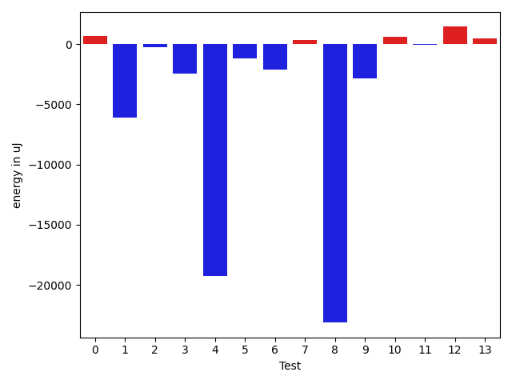
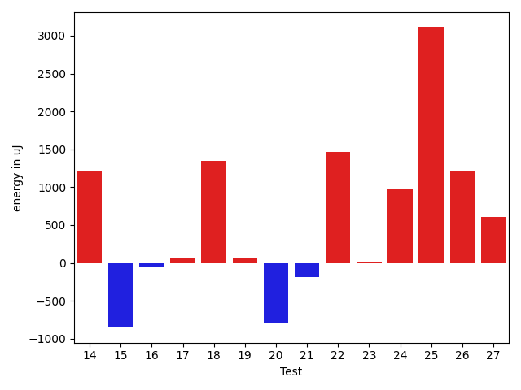
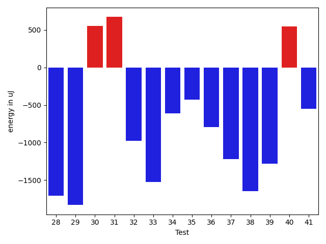
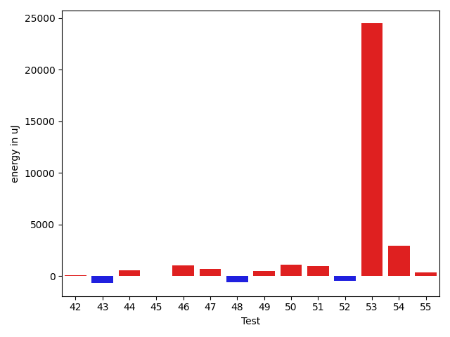
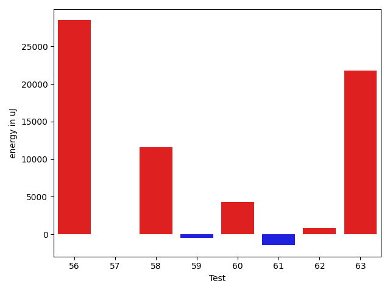

# gson 2cec66

https://github.com/google/gson/commit/2cec66

## Delta Energy per test method

| ID | EnergyV1 | EnergyV2 | DeltaEnergy | σV1 | σV2 |
| --- | --- | --- | --- | --- | --- |
| 0 | 38024 | 37903 | -121 | 4079.7769243428006 | 4378.988243727 |
| 1 | 33814 | 33142 | -672 | 18624.419223308832 | 2847.637556031145 |
| 2 | 39368 | 39002 | -366 | 17832.85870362602 | 18399.57815281129 |
| 3 | 36194 | 34790 | -1404 | 16908.211809978933 | 13534.559428226468 |
| 4 | 35949 | 36316 | 367 | 104431.32280236487 | 18394.119470780824 |
| 5 | 34851 | 34545 | -306 | 7322.877873133457 | 3235.543259958978 |
| 6 | 34790 | 33570 | -1220 | 7721.4340737855155 | 3072.4921607488745 |
| 7 | 35767 | 36316 | 549 | 2872.917026299228 | 3290.8941486319486 |
| 8 | 37293 | 36621 | -672 | 122764.54135655763 | 59596.58313341407 |
| 9 | 35766 | 35766 | 0 | 25905.933759227835 | 5576.158882684698 |
| 10 | 34607 | 36316 | 1709 | 5758.796977378753 | 3458.946221453029 |
| 11 | 36011 | 35889 | -122 | 3374.5008011593045 | 3715.474582115092 |
| 12 | 33752 | 35583 | 1831 | 3298.972819934512 | 3200.6912753341267 |
| 13 | 33447 | 34363 | 916 | 3628.6294488095195 | 3545.1241974372488 |
| 14 | 36071 | 37292 | 1221 | 2733.0663177311476 | 54726.2669065039 |
| 15 | 35950 | 35095 | -855 | 46973.43886435243 | 2916.5968436917333 |
| 16 | 36744 | 36682 | -62 | 69746.5923249675 | 3616.6563475252487 |
| 17 | 35583 | 35644 | 61 | 6342.21647155196 | 10997.407174811422 |
| 18 | 34851 | 36194 | 1343 | 7793.479185062254 | 7755.280038134675 |
| 19 | 34484 | 34545 | 61 | 6880.275743406374 | 2974.340592467514 |
| 20 | 35095 | 34302 | -793 | 30969.139157871214 | 20189.541684547934 |
| 21 | 35888 | 35706 | -182 | 3309.137989349815 | 2936.3833420532624 |
| 22 | 34180 | 35644 | 1464 | 3360.359641838247 | 2959.4634179564077 |
| 23 | 35583 | 35584 | 1 | 3113.036009666872 | 3634.743993505377 |
| 24 | 38513 | 39489 | 976 | 90597.5490755406 | 46558.28436595939 |
| 25 | 37659 | 40771 | 3112 | 41988.66595526952 | 66389.14153371175 |
| 26 | 36743 | 37964 | 1221 | 6789.8262959761605 | 7939.965665552001 |
| 27 | 35644 | 36255 | 611 | 4080.6202456367273 | 3824.4077603101096 |
| 28 | 40161 | 38452 | -1709 | 24148.62806897842 | 38721.339338275255 |
| 29 | 37048 | 35217 | -1831 | 3242.4884491059993 | 3716.7825282694407 |
| 30 | 39367 | 39917 | 550 | 15949.500615548073 | 18185.075265136456 |
| 31 | 36316 | 36987 | 671 | 3525.4533662353274 | 4081.8153953354663 |
| 32 | 36682 | 35705 | -977 | 12999.70336003786 | 12432.271557500146 |
| 33 | 36621 | 35095 | -1526 | 7366.521993433821 | 6722.236717454921 |
| 34 | 36255 | 35644 | -611 | 11669.420983659973 | 10155.116195024226 |
| 35 | 36438 | 36011 | -427 | 14528.953810049066 | 15034.621240169177 |
| 36 | 36682 | 35889 | -793 | 76369.25515245882 | 20576.341120518216 |
| 37 | 67932 | 66712 | -1220 | 20541.521325731257 | 25401.20587703565 |
| 38 | 40954 | 39307 | -1647 | 20597.868287457262 | 62691.477580702274 |
| 39 | 36438 | 35156 | -1282 | 14018.00371945953 | 12426.972801151775 |
| 40 | 36377 | 36926 | 549 | 8614.316539609996 | 6983.4284341648345 |
| 41 | 36011 | 35462 | -549 | 4867.696263831904 | 6690.9657402493185 |
| 42 | 38452 | 38574 | 122 | 68461.53864837176 | 65981.58464395856 |
| 43 | 36499 | 35827 | -672 | 3463.4342421937217 | 3987.0106150403517 |
| 44 | 35705 | 36254 | 549 | 4833.39198613148 | 4508.941977315865 |
| 45 | 37353 | 37353 | 0 | 3964.184436870642 | 3153.4880825420437 |
| 46 | 36377 | 37415 | 1038 | 4498.4949324911195 | 3760.6987838659084 |
| 47 | 35401 | 36072 | 671 | 3642.8500893100727 | 3930.3630083638323 |
| 48 | 40405 | 39795 | -610 | 72825.5862762278 | 66831.2092265557 |
| 49 | 35827 | 36316 | 489 | 3501.584319941543 | 6731.373621507329 |
| 50 | 36499 | 37597 | 1098 | 3794.117648675968 | 3892.3274039287858 |
| 51 | 36011 | 36988 | 977 | 10221.533801434967 | 7601.718925024746 |
| 52 | 36560 | 36132 | -428 | 54068.384936173876 | 51829.156767992405 |
| 53 | 364440 | 388915 | 24475 | 89710.62125621416 | 111982.4177852337 |
| 54 | 72693 | 75622 | 2929 | 45619.34860751457 | 68314.30910115961 |
| 55 | 38696 | 39063 | 367 | 46918.398259729445 | 66504.67074900525 |
| 56 | 38635 | 38635 | 0 | 133749.51476288636 | 157020.1848584391 |
| 57 | 38269 | 36071 | -2198 | 4058.1320980224386 | 7801.446112623176 |
| 58 | 39062 | 38940 | -122 | 50325.61497941965 | 72122.96257582233 |
| 59 | 37781 | 37719 | -62 | 3544.7521000506663 | 3764.1506759874615 |
| 60 | 43274 | 63049 | 19775 | 23544.981247369597 | 23133.650515013196 |
| 61 | 36133 | 36499 | 366 | 14919.31779636443 | 14347.452316670217 |
| 62 | 35034 | 36499 | 1465 | 4269.731141893926 | 6346.070997585796 |
| 63 | 38697 | 41748 | 3051 | 67671.3745153407 | 86848.34199446681 |

## Delta Duration per test method

| ID | DurationV1 | DurationsV2 | DeltaDuration |
| --- | --- | --- | --- |
| 0 | 948053.08 | 991148.5737704918 | 43095.4937704918 |
| 1 | 893620.6666666666 | 573273.9411764706 | -320346.725490196 |
| 2 | 1679883.7894736843 | 1669262.6989247312 | -10621.090548953041 |
| 3 | 1258558.0555555555 | 1151749.6231884058 | -106808.43236714974 |
| 4 | 2038816.606741573 | 1381095.9102564103 | -657720.6964851627 |
| 5 | 848200.1379310344 | 779242.5625 | -68957.57543103443 |
| 6 | 986278.625 | 853934.3829787234 | -132344.24202127662 |
| 7 | 672564.6285714286 | 703515.175 | 30950.546428571455 |
| 8 | 2187125.0545454547 | 1538233.0930232557 | -648891.961522199 |
| 9 | 1114840.3333333333 | 991546.676056338 | -123293.65727699525 |
| 10 | 1067040.5 | 1000313.7042253522 | -66726.79577464785 |
| 11 | 805968.8636363636 | 754387.4864864865 | -51581.37714987714 |
| 12 | 827288.875 | 803738.088888889 | -23550.786111111054 |
| 13 | 630146.3333333334 | 559953.0 | -70193.33333333337 |
| 14 | 773294.4901960784 | 1062948.1627906978 | 289653.67259461933 |
| 15 | 924875.0833333334 | 650974.0 | -273901.0833333334 |
| 16 | 1391464.5945945946 | 712642.8205128205 | -678821.774081774 |
| 17 | 1212127.3076923077 | 1189278.2 | -22849.107692307793 |
| 18 | 1220031.3157894737 | 1155060.3483146068 | -64970.96747486689 |
| 19 | 769826.7428571428 | 658108.45 | -111718.29285714286 |
| 20 | 1011462.2 | 799177.1481481482 | -212285.05185185175 |
| 21 | 772575.4186046511 | 711266.6764705882 | -61308.74213406292 |
| 22 | 549920.1739130435 | 545196.5 | -4723.673913043458 |
| 23 | 733198.9166666666 | 740867.8139534884 | 7668.897286821739 |
| 24 | 2117491.268656716 | 1560233.723076923 | -557257.5455797932 |
| 25 | 1092607.4444444445 | 2037901.0666666667 | 945293.6222222222 |
| 26 | 864129.8367346938 | 1024934.2272727273 | 160804.39053803345 |
| 27 | 746931.4117647059 | 779387.5476190476 | 32456.13585434167 |
| 28 | 1092962.0172413792 | 1633482.648148148 | 540520.6309067688 |
| 29 | 691147.7297297297 | 738027.5142857142 | 46879.784555984545 |
| 30 | 1127820.641509434 | 1216207.018181818 | 88386.3766723841 |
| 31 | 879793.1785714285 | 940630.4423076923 | 60837.26373626373 |
| 32 | 1417242.4081632653 | 1375320.5416666667 | -41921.86649659858 |
| 33 | 1190236.6219512196 | 1179869.8987341772 | -10366.723217042396 |
| 34 | 1342181.9462365592 | 1315352.182795699 | -26829.763440860203 |
| 35 | 1477707.4020618557 | 1459599.8315789474 | -18107.570482908282 |
| 36 | 2034498.2666666666 | 1491705.7613636365 | -542792.5053030301 |
| 37 | 2135934.8484848486 | 2165062.5454545454 | 29127.696969696786 |
| 38 | 1636674.819148936 | 1851602.3404255318 | 214927.52127659577 |
| 39 | 1401622.6842105263 | 1330007.5638297873 | -71615.12038073898 |
| 40 | 1167838.2894736843 | 1172434.6025641025 | 4596.313090418233 |
| 41 | 1024211.9230769231 | 1005781.7878787878 | -18430.13519813528 |
| 42 | 1984678.2463768115 | 1878219.4328358208 | -106458.8135409907 |
| 43 | 727278.95 | 735995.088888889 | 8716.138888888992 |
| 44 | 930878.02 | 864699.0370370371 | -66178.98296296294 |
| 45 | 608559.4347826086 | 586046.9285714285 | -22512.506211180124 |
| 46 | 720370.7741935484 | 780150.2619047619 | 59779.48771121353 |
| 47 | 1070707.0454545454 | 1074481.3076923077 | 3774.262237762334 |
| 48 | 2087457.1186440678 | 1969170.4677419355 | -118286.65090213227 |
| 49 | 851607.5531914893 | 894757.3962264151 | 43149.843034925754 |
| 50 | 640747.2894736842 | 663350.775 | 22603.485526315868 |
| 51 | 943007.6857142857 | 847667.3333333334 | -95340.35238095233 |
| 52 | 1666963.441860465 | 1510328.224489796 | -156635.21737066912 |
| 53 | 10345332.545454545 | 10925532.626262626 | 580200.0808080807 |
| 54 | 2295636.9595959596 | 2555199.8383838385 | 259562.8787878789 |
| 55 | 1590709.7837837837 | 2254199.828125 | 663490.0443412163 |
| 56 | 2561597.6585365855 | 3512669.2407407407 | 951071.5822041552 |
| 57 | 736691.90625 | 738341.3714285714 | 1649.4651785714086 |
| 58 | 1398685.9069767443 | 1805262.1714285715 | 406576.26445182716 |
| 59 | 846900.2692307692 | 898211.2448979592 | 51310.97566718992 |
| 60 | 1888253.0303030303 | 1961163.7346938776 | 72910.70439084736 |
| 61 | 1356815.2098765431 | 1326705.5 | -30109.709876543144 |
| 62 | 1174182.671641791 | 1154343.6612903227 | -19839.010351468343 |
| 63 | 1808664.9591836734 | 2456659.5531914895 | 647994.5940078162 |

## Misc.

| ID | Test Class | Test Method |
| --- | --- | --- |
| 0 | com.google.gson.functional.CustomDeserializerTest | testDefaultConstructorNotCalledOnField |
| 1 | com.google.gson.functional.ObjectTest | testNullObjectFieldsDeserialization |
| 2 | com.google.gson.functional.ObjectTest | testArrayOfArraysDeserialization |
| 3 | com.google.gson.functional.ObjectTest | testStringFieldWithNumberValueDeserialization |
| 4 | com.google.gson.functional.ObjectTest | testSubInterfacesOfCollectionDeserialization |
| 5 | com.google.gson.functional.ObjectTest | testPrimitiveArrayInAnObjectDeserialization |
| 6 | com.google.gson.functional.ObjectTest | testNullArraysDeserialization |
| 7 | com.google.gson.functional.ObjectTest | testClassWithEnumFieldDeserialization |
| 8 | com.google.gson.functional.ObjectTest | testJsonInSingleQuotesDeserialization |
| 9 | com.google.gson.functional.ObjectTest | testNestedDeserialization |
| 10 | com.google.gson.functional.ObjectTest | testInheritenceDeserialization |
| 11 | com.google.gson.functional.ObjectTest | testBagOfPrimitiveWrappersDeserialization |
| 12 | com.google.gson.functional.ObjectTest | testNullFieldsDeserialization |
| 13 | com.google.gson.functional.ObjectTest | testNullPrimitiveFieldsDeserialization |
| 14 | com.google.gson.functional.ObjectTest | testBagOfPrimitivesDeserialization |
| 15 | com.google.gson.functional.ObjectTest | testPrivateNoArgConstructorDeserialization |
| 16 | com.google.gson.functional.ObjectTest | testClassWithTransientFieldsDeserializationTransientFieldsPassedInJsonAreIgnored |
| 17 | com.google.gson.functional.ObjectTest | testArrayOfObjectsDeserialization |
| 18 | com.google.gson.functional.ObjectTest | testDirectedAcyclicGraphDeserialization |
| 19 | com.google.gson.functional.ObjectTest | testEmptyCollectionInAnObjectDeserialization |
| 20 | com.google.gson.functional.ObjectTest | testObjectFieldNamesWithoutQuotesDeserialization |
| 21 | com.google.gson.functional.ObjectTest | testJsonInMixedQuotesDeserialization |
| 22 | com.google.gson.functional.ObjectTest | testClassWithNoFieldsDeserialization |
| 23 | com.google.gson.functional.ObjectTest | testClassWithTransientFieldsDeserialization |
| 24 | com.google.gson.functional.EnumTest | testEnumFieldDeserialization |
| 25 | com.google.gson.functional.DefaultTypeAdaptersTest | testUrlDeserialization |
| 26 | com.google.gson.functional.DefaultTypeAdaptersTest | testUrlNullDeserialization |
| 27 | com.google.gson.functional.DefaultTypeAdaptersTest | testBigDecimalFieldDeserialization |
| 28 | com.google.gson.functional.DefaultTypeAdaptersTest | testUrlSerialization |
| 29 | com.google.gson.functional.DefaultTypeAdaptersTest | testBigIntegerFieldDeserialization |
| 30 | com.google.gson.functional.NullObjectAndFieldTest | testExplicitDeserializationOfNulls |
| 31 | com.google.gson.functional.NullObjectAndFieldTest | testNullWrappedPrimitiveMemberDeserialization |
| 32 | com.google.gson.functional.ParameterizedTypesTest | testVariableTypeArrayDeserialization |
| 33 | com.google.gson.functional.ParameterizedTypesTest | testParameterizedTypeWithReaderDeserialization |
| 34 | com.google.gson.functional.ParameterizedTypesTest | testVariableTypeDeserialization |
| 35 | com.google.gson.functional.ParameterizedTypesTest | testParameterizedTypeGenericArraysDeserialization |
| 36 | com.google.gson.functional.ParameterizedTypesTest | testParameterizedTypeDeserialization |
| 37 | com.google.gson.functional.ParameterizedTypesTest | testVariableTypeFieldsAndGenericArraysDeserialization |
| 38 | com.google.gson.functional.ParameterizedTypesTest | testTypesWithMultipleParametersDeserialization |
| 39 | com.google.gson.functional.ParameterizedTypesTest | testParameterizedTypeWithVariableTypeDeserialization |
| 40 | com.google.gson.functional.VersioningTest | testVersionedGsonMixingSinceAndUntilDeserialization |
| 41 | com.google.gson.functional.VersioningTest | testVersionedClassesDeserialization |
| 42 | com.google.gson.functional.VersioningTest | testVersionedUntilDeserialization |
| 43 | com.google.gson.functional.VersioningTest | testIgnoreLaterVersionClassDeserialization |
| 44 | com.google.gson.functional.VersioningTest | testVersionedGsonWithUnversionedClassesDeserialization |
| 45 | com.google.gson.functional.ArrayTest | testArrayOfStringsDeserialization |
| 46 | com.google.gson.functional.ArrayTest | testNullsInArrayDeserialization |
| 47 | com.google.gson.functional.ArrayTest | testArrayOfCollectionDeserialization |
| 48 | com.google.gson.functional.ArrayTest | testTopLevelArrayOfIntsDeserialization |
| 49 | com.google.gson.functional.ArrayTest | testArrayOfPrimitivesWithCustomTypeAdapter |
| 50 | com.google.gson.functional.ArrayTest | testEmptyArrayDeserialization |
| 51 | com.google.gson.functional.NamingPolicyTest | testGsonWithSerializedNameFieldNamingPolicyDeserialization |
| 52 | com.google.gson.functional.NamingPolicyTest | testGsonWithNonDefaultFieldNamingPolicyDeserialiation |
| 53 | com.google.gson.functional.ConcurrencyTest | testMultiThreadDeserialization |
| 54 | com.google.gson.functional.ConcurrencyTest | testSingleThreadDeserialization |
| 55 | com.google.gson.functional.EscapingTest | testEscapingObjectFields |
| 56 | com.google.gson.functional.EscapingTest | testEscapingQuotesInStringArray |
| 57 | com.google.gson.functional.ExposeFieldsTest | testExposedInterfaceFieldDeserialization |
| 58 | com.google.gson.functional.ExposeFieldsTest | testExposeAnnotationDeserialization |
| 59 | com.google.gson.functional.ExposeFieldsTest | testNoExposedFieldDeserialization |
| 60 | com.google.gson.functional.CollectionTest | testWildcardCollectionField |
| 61 | com.google.gson.functional.CustomTypeAdaptersTest | testCustomDeserializerForLong |
| 62 | com.google.gson.functional.CustomTypeAdaptersTest | testCustomNestedDeserializers |
| 63 | com.google.gson.functional.ReadersWritersTest | testReaderForDeserialization |

| Test | IterationV1 | IterationV2 | DeltaIteration |
| --- | --- | --- | --- |
| 0 | 50 | 61 | 11 |
| 1 | 30 | 34 | 4 |
| 2 | 95 | 93 | -2 |
| 3 | 72 | 69 | -3 |
| 4 | 89 | 78 | -11 |
| 5 | 58 | 48 | -10 |
| 6 | 48 | 47 | -1 |
| 7 | 35 | 40 | 5 |
| 8 | 55 | 43 | -12 |
| 9 | 72 | 71 | -1 |
| 10 | 60 | 71 | 11 |
| 11 | 44 | 37 | -7 |
| 12 | 48 | 45 | -3 |
| 13 | 33 | 28 | -5 |
| 14 | 51 | 43 | -8 |
| 15 | 36 | 29 | -7 |
| 16 | 37 | 39 | 2 |
| 17 | 78 | 80 | 2 |
| 18 | 76 | 89 | 13 |
| 19 | 35 | 40 | 5 |
| 20 | 35 | 27 | -8 |
| 21 | 43 | 34 | -9 |
| 22 | 23 | 24 | 1 |
| 23 | 48 | 43 | -5 |
| 24 | 67 | 65 | -2 |
| 25 | 45 | 45 | 0 |
| 26 | 49 | 44 | -5 |
| 27 | 34 | 42 | 8 |
| 28 | 58 | 54 | -4 |
| 29 | 37 | 35 | -2 |
| 30 | 53 | 55 | 2 |
| 31 | 56 | 52 | -4 |
| 32 | 98 | 96 | -2 |
| 33 | 82 | 79 | -3 |
| 34 | 93 | 93 | 0 |
| 35 | 97 | 95 | -2 |
| 36 | 90 | 88 | -2 |
| 37 | 99 | 99 | 0 |
| 38 | 94 | 94 | 0 |
| 39 | 95 | 94 | -1 |
| 40 | 76 | 78 | 2 |
| 41 | 65 | 66 | 1 |
| 42 | 69 | 67 | -2 |
| 43 | 40 | 45 | 5 |
| 44 | 50 | 54 | 4 |
| 45 | 23 | 28 | 5 |
| 46 | 31 | 42 | 11 |
| 47 | 66 | 65 | -1 |
| 48 | 59 | 62 | 3 |
| 49 | 47 | 53 | 6 |
| 50 | 38 | 40 | 2 |
| 51 | 35 | 42 | 7 |
| 52 | 43 | 49 | 6 |
| 53 | 99 | 99 | 0 |
| 54 | 99 | 99 | 0 |
| 55 | 74 | 64 | -10 |
| 56 | 41 | 54 | 13 |
| 57 | 32 | 35 | 3 |
| 58 | 43 | 35 | -8 |
| 59 | 52 | 49 | -3 |
| 60 | 99 | 98 | -1 |
| 61 | 81 | 78 | -3 |
| 62 | 67 | 62 | -5 |
| 63 | 49 | 47 | -2 |

| Time Label | Time (s) |
| --- | --- |
| Selection | 23.130300045013428 |
| Injection | 11.356876850128174 |
| Total | 984.8210787773132 |

