# gson b8f616

https://github.com/google/gson/commit/b8f616

## Delta Energy per test method

| ID | EnergyV1 | EnergyV2 | DeltaEnergy |
| --- | --- | --- | --- |
| 0 | 44129.80267821538 | 37918.2082022001 | -6211.594476015285 |
| 1 | 41656.81494264922 | 45295.31147829195 | 3638.4965356427347 |
| 2 | 59709.03202400287 | 46292.30359014658 | -13416.72843385629 |
| 3 | 42432.22008714301 | 40645.85402206151 | -1786.3660650815 |
| 4 | 51030.386416056936 | 73829.6719375356 | 22799.28552147867 |
| 5 | 43784.809824080556 | 42364.49447889274 | -1420.315345187817 |
| 6 | 78661.51292924603 | 40682.76305947163 | -37978.7498697744 |
| 7 | 41514.77408790068 | 39340.211914563486 | -2174.5621733371954 |
| 8 | 42966.67130363162 | 38922.71255391187 | -4043.95874971975 |
| 9 | 64038.68352549127 | 42759.06950651147 | -21279.614018979802 |
| 10 | 43968.9233554118 | 42605.220626125374 | -1363.7027292864223 |
| 11 | 40687.20975861479 | 44317.04936290636 | 3629.83960429157 |
| 12 | 42879.38319883484 | 43120.80201795227 | 241.41881911743258 |
| 13 | 41839.012776199816 | 44933.60592172951 | 3094.593145529696 |
| 14 | 44476.83022846314 | 42041.564361398436 | -2435.265867064707 |
| 15 | 44720.34791505337 | 42618.4133117497 | -2101.934603303671 |
| 16 | 42183.959099122534 | 52079.92174200638 | 9895.962642883846 |
| 17 | 41101.26313763048 | 43304.20105821017 | 2202.937920579694 |
| 18 | 78576.83556681772 | 46167.53355100055 | -32409.30201581717 |
| 19 | 72154.81622344637 | 48773.38958930888 | -23381.42663413749 |
| 20 | 47853.160068886755 | 45274.621542439985 | -2578.5385264467695 |
| 21 | 64005.1191793777 | 43284.618870932114 | -20720.50030844559 |
| 22 | 90034.23191064174 | 101727.94487112193 | 11693.712960480188 |
| 23 | 67362.80499145333 | 89457.4280448015 | 22094.623053348172 |
| 24 | 45658.97621447014 | 43306.533431497664 | -2352.4427829724737 |
| 25 | 64680.22887853995 | 65710.03067862666 | 1029.8018000867087 |
| 26 | 101583.5300393881 | 68108.12238728613 | -33475.407652101974 |
| 27 | 43969.831560955674 | 47556.82458154892 | 3586.993020593247 |
| 28 | 49352.06846863394 | 86723.92716596408 | 37371.85869733014 |
| 29 | 43115.17421165579 | 49503.3465119615 | 6388.172300305712 |
| 30 | 44697.96697295616 | 45095.56776079138 | 397.60078783522476 |
| 31 | 379225.0286418865 | 348480.7253605252 | -30744.303281361295 |
| 32 | 55598.678356258846 | 67267.22455485119 | 11668.54619859234 |
| 33 | 43247.32213121081 | 49084.63361421681 | 5837.311483006 |
| 34 | 44493.963153060984 | 46197.45900359163 | 1703.4958505306495 |
| 35 | 43462.77720814979 | 45710.59465248135 | 2247.8174443315584 |
| 36 | 45558.46950006904 | 42945.74294545874 | -2612.726554610301 |
| 37 | 44041.53774756193 | 45530.21642971039 | 1488.6786821484566 |
| 38 | 44595.87068678439 | 45469.66787513264 | 873.7971883482533 |
| 39 | 43769.587730401196 | 43909.53537609539 | 139.94764569419203 |
| 40 | 45909.50826406479 | 45879.98107624054 | -29.527187824249268 |
| 41 | 43329.094603009195 | 44826.47526114052 | 1497.3806581313256 |
| 42 | 70195.56351224228 | 57152.30607182053 | -13043.257440421752 |
| 43 | 45623.3591110268 | 46819.71955160116 | 1196.3604405743608 |
| 44 | 42208.415743818514 | 45995.11074613207 | 3786.695002313558 |
| 45 | 44890.14608482605 | 48742.0247992608 | 3851.8787144347516 |
| 46 | 89434.8686875437 | 82378.06696569955 | -7056.801721844153 |
| 47 | 43731.76018253719 | 44080.54931162055 | 348.7891290833577 |
| 48 | 48517.95988361567 | 47198.41059715104 | -1319.5492864646294 |
| 49 | 42071.186187245476 | 44290.8560524796 | 2219.669865234122 |
| 50 | 45219.47732665585 | 43802.39146402693 | -1417.0858626289191 |
| 51 | 43257.35343402946 | 41990.4286154788 | -1266.9248185506585 |
| 52 | 303167.087890625 | 99010.84280395508 | -204156.24508666992 |
| 53 | 42208.453095555305 | 53056.93250846863 | 10848.479412913322 |
| 54 | 42988.5207952261 | 40521.35900306702 | -2467.1617921590805 |
| 55 | 41807.694335279986 | 44433.787651179824 | 2626.0933158998378 |
| 56 | 46441.277186775726 | 59310.79014249867 | 12869.512955722945 |
| 57 | 43182.098146323115 | 43110.972703933716 | -71.12544238939881 |
| 58 | 42095.07586860657 | 43729.568420410156 | 1634.4925518035889 |
| 59 | 45840.31169509888 | 41725.28283691406 | -4115.028858184814 |
| 60 | 44100.181430166354 | 43958.782254944555 | -141.39917522179894 |
| 61 | 73499.45155984131 | 43615.131557833796 | -29884.320002007516 |
| 62 | 43945.87575229257 | 43870.257496571576 | -75.6182557209977 |
| 63 | 77550.78206706146 | 72556.70967977104 | -4994.07238729042 |
| 64 | 44700.270511498326 | 43185.57753489659 | -1514.6929766017347 |
| 65 | 47525.26642080024 | 52220.89028764935 | 4695.623866849113 |
| 66 | 42952.52546089981 | 43762.19751679897 | 809.6720558991656 |
| 67 | 46694.88434184646 | 42866.43441155429 | -3828.4499302921686 |
| 68 | 43757.56144494843 | 44334.88894441072 | 577.3274994622916 |
| 69 | 49891.40038001718 | 105771.78339770788 | 55880.38301769071 |
| 70 | 44965.504898975836 | 43392.76562978327 | -1572.7392691925634 |
| 71 | 45055.77796843019 | 42983.05541092623 | -2072.722557503963 |
| 72 | 43414.42319792083 | 64915.96219372749 | 21501.538995806666 |
| 73 | 63144.1611949932 | 43360.89034245396 | -19783.270852539237 |
| 74 | 39580.55503118462 | 39920.6996180778 | 340.14458689318417 |
| 75 | 41979.99994600084 | 43369.74824170719 | 1389.7482957063476 |
| 76 | 40408.69360734655 | 45983.864559885275 | 5575.170952538727 |
| 77 | 42884.73989953101 | 43566.09541031228 | 681.3555107812717 |
| 78 | 41125.50365956957 | 42806.84896654048 | 1681.3453069709067 |
| 79 | 39562.099561691284 | 38452.58476448059 | -1109.5147972106934 |
| 80 | 38790.29578828812 | 59076.06379437912 | 20285.768006091006 |
| 81 | 37782.42975639394 | 44494.38014862864 | 6711.950392234699 |
| 82 | 40938.78316107621 | 39917.46122662438 | -1021.3219344518293 |
| 83 | 64974.46214158574 | 51868.45791678312 | -13106.004224802622 |
| 84 | 40604.194446798414 | 39769.283208847046 | -834.9112379513681 |
| 85 | 39770.997926774544 | 44902.10089570121 | 5131.102968926665 |
| 86 | 44751.47155581259 | 42884.98461614572 | -1866.4869396668728 |
| 87 | 44674.9309810872 | 36786.05694556057 | -7888.874035526627 |
| 88 | 47851.450501351326 | 40191.495750600334 | -7659.954750750992 |
| 89 | 41639.77287277579 | 43551.24927902222 | 1911.4764062464237 |
| 90 | 70516.7327864124 | 170624.23765485326 | 100107.50486844087 |
| 91 | 47047.69085489073 | 38964.71434813953 | -8082.976506751198 |
| 92 | 336155.6339736983 | 46137.61912213595 | -290018.01485156233 |
| 93 | 44642.94303802241 | 46588.196472459866 | 1945.253434437458 |
| 94 | 47625.3557434082 | 42257.41335296631 | -5367.9423904418945 |
| 95 | 64119.33878659781 | 107039.08797719149 | 42919.749190593684 |
| 96 | 59242.88569355617 | 58085.11538365522 | -1157.7703099009523 |
| 97 | 43629.08439446079 | 43462.46675604625 | -166.61763841454376 |
| 98 | 44364.46610624294 | 43854.46325658513 | -510.00284965780884 |
| 99 | 42167.786592282355 | 43892.92429140526 | 1725.1376991229045 |
| 100 | 45597.870003700256 | 42909.44316864014 | -2688.4268350601196 |
| 101 | 45580.757583618164 | 43990.56915283203 | -1590.1884307861328 |
| 102 | 43701.91567373276 | 51274.4382182993 | 7572.522544566542 |
| 103 | 44401.355041503906 | 43874.47448730469 | -526.8805541992188 |
| 104 | 44888.88056945801 | 44334.326011657715 | -554.554557800293 |
| 105 | 46785.73383641243 | 44581.17280912399 | -2204.561027288437 |
| 106 | 43246.946046132594 | 43665.10931151392 | 418.16326538132853 |
| 107 | 46458.34181976318 | 43624.295150756836 | -2834.0466690063477 |
| 108 | 47341.27540850639 | 43049.325286865234 | -4291.950121641159 |
| 109 | 61943.665871873505 | 44422.233083561354 | -17521.43278831215 |
| 110 | 108447.09298535835 | 127771.11736976921 | 19324.024384410863 |
| 111 | 44769.81640625 | 41493.38134765625 | -3276.43505859375 |
| 112 | 107524.43779357415 | 125488.55995835626 | 17964.122164782108 |
| 113 | 167092.2340243723 | 152427.2928069706 | -14664.941217401705 |
| 114 | 44152.16463843209 | 44348.64398478536 | 196.47934635326965 |
| 115 | 42812.66594471107 | 51712.23755543233 | 8899.571610721257 |
| 116 | 48371.844513985976 | 41064.34000771734 | -7307.504506268633 |
| 117 | 45462.88512039661 | 43942.9993544193 | -1519.885765977313 |
| 118 | 38660.769382803875 | 42340.71096975458 | 3679.9415869507066 |
| 119 | 40045.3412866992 | 43381.366538629285 | 3336.025251930085 |
| 120 | 37365.300611406565 | 38955.07018280029 | 1589.7695713937283 |
| 121 | 42344.03093326275 | 44041.667248009355 | 1697.6363147466036 |
| 122 | 43141.230281527576 | 42281.57123694205 | -859.6590445855254 |
| 123 | 43867.97228757617 | 43787.74385245378 | -80.22843512239342 |
| 124 | 49500.281402101566 | 110714.67127786428 | 61214.38987576272 |
| 125 | 48931.378787235226 | 366304.74726544163 | 317373.3684782064 |
| 126 | 46301.36677572888 | 44494.43610447744 | -1806.9306712514372 |
| 127 | 44869.72972122744 | 42974.52950998349 | -1895.2002112439513 |
| 128 | 49042.67139440775 | 47992.52821260691 | -1050.1431818008423 |
| 129 | 63940.677868899475 | 75733.33384036993 | 11792.655971470456 |
| 130 | 43878.65249568224 | 44966.58584100893 | 1087.9333453266881 |
| 131 | 41303.26926156583 | 41248.907392501904 | -54.36186906392686 |
| 132 | 46044.24054544352 | 39582.35826352135 | -6461.882281922168 |
| 133 | 43777.33862766852 | 46000.586688817246 | 2223.2480611487263 |
| 134 | 43349.01876465106 | 38595.656487112836 | -4753.362277538225 |
| 135 | 467420.42142642254 | 150387.79610875066 | -317032.6253176719 |
| 136 | 56687.55562287785 | 106550.63725647592 | 49863.08163359807 |
| 137 | 45581.25562945627 | 41359.90284546005 | -4221.352783996219 |
| 138 | 45181.475292288276 | 44957.835611040435 | -223.6396812478415 |
| 139 | 45462.59131839959 | 43328.52808686877 | -2134.0632315308176 |
| 140 | 47445.527895675405 | 47275.627125717154 | -169.90076995825075 |
| 141 | 50221.41206552654 | 78144.30150012969 | 27922.889434603145 |
| 142 | 488890.60706246475 | 43010.05813552439 | -445880.54892694036 |
| 143 | 38860.38253546099 | 43162.01793983317 | 4301.63540437218 |
| 144 | 46088.65356940089 | 53405.18399550021 | 7316.530426099314 |
| 145 | 44406.22984313965 | 41105.783203125 | -3300.4466400146484 |
| 146 | 46530.94106915458 | 43300.7592824678 | -3230.1817866867787 |
| 147 | 89993.8718009688 | 82332.21203769222 | -7661.659763276577 |
| 148 | 42690.14464893953 | 65481.79655788963 | 22791.6519089501 |
| 149 | 79947.35136481628 | 43899.86491768405 | -36047.48644713223 |
| 150 | 43395.09782539103 | 46396.11671983373 | 3001.018894442699 |
| 151 | 36606.896716662624 | 38952.023368787486 | 2345.1266521248617 |
| 152 | 37462.28519237878 | 86389.85753812165 | 48927.57234574287 |
| 153 | 119450.36392797869 | 700193.477082555 | 580743.1131545763 |
| 154 | 37758.49585799432 | 40626.602280848965 | 2868.1064228546456 |
| 155 | 43418.32617818272 | 55659.06076494584 | 12240.734586763123 |
| 156 | 42810.53651790775 | 37678.38367283344 | -5132.152845074306 |
| 157 | 39449.35781478882 | 41444.63661146164 | 1995.278796672821 |
| 158 | 44418.23446436271 | 43850.44004598679 | -567.7944183759173 |
| 159 | 40224.82873535156 | 42336.90744018555 | 2112.0787048339844 |
| 160 | 47319.3085566598 | 74963.85560728147 | 27644.547050621666 |
| 161 | 195878.72102249696 | 122769.20926958414 | -73109.51175291282 |
| 162 | 79980.57731845567 | 63768.70227648159 | -16211.875041974083 |
| 163 | 104662.5938767496 | 87547.25731680862 | -17115.336559940974 |
| 164 | 47250.602888576104 | 40982.024953811706 | -6268.577934764398 |
| 165 | 45108.948081970215 | 41880.80204772949 | -3228.1460342407227 |
| 166 | 45351.46305561066 | 37023.06996536255 | -8328.393090248108 |
| 167 | 47472.951793670654 | 45410.814230799675 | -2062.1375628709793 |
| 168 | 45735.75183105469 | 45438.20003141969 | -297.5517996349954 |
| 169 | 49631.04106606911 | 65292.74036526941 | 15661.6992992003 |
| 170 | 43668.90051927138 | 44567.858993921654 | 898.9584746502733 |
| 171 | 70655.42479080614 | 90721.97321856022 | 20066.54842775408 |
| 172 | 288846.5957022421 | 315004.20612634503 | 26157.610424102924 |
| 173 | 59394.521459287265 | 111445.96413992376 | 52051.44268063649 |
| 174 | 83497.19082056337 | 47573.12897556036 | -35924.06184500301 |
| 175 | 39366.94235250314 | 45903.15069768205 | 6536.208345178915 |
| 176 | 50150.25074318051 | 43841.86305427551 | -6308.387688905001 |

## Delta Duration per test method

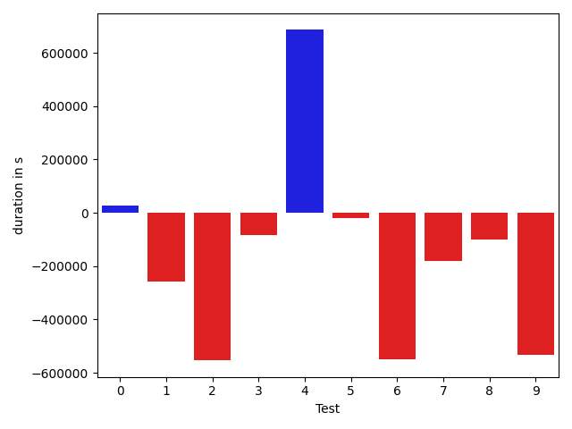

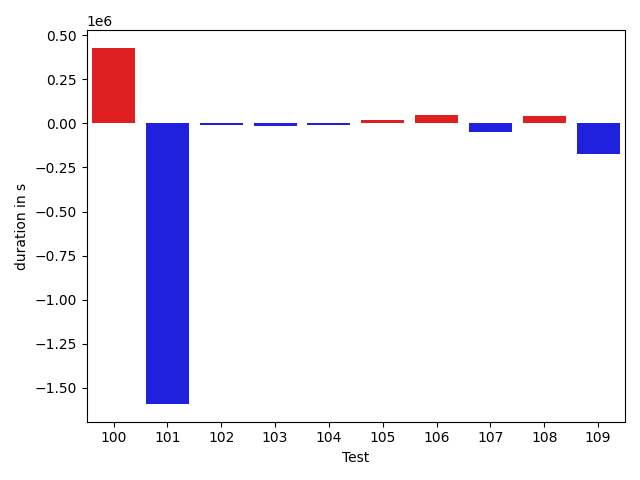

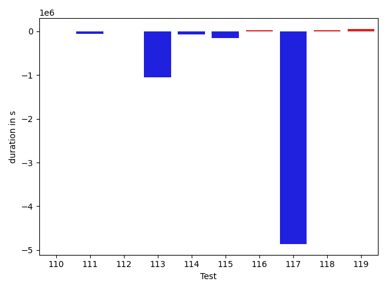

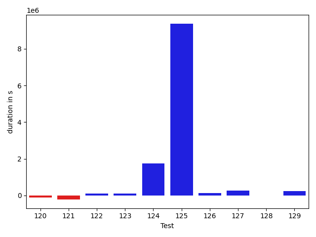

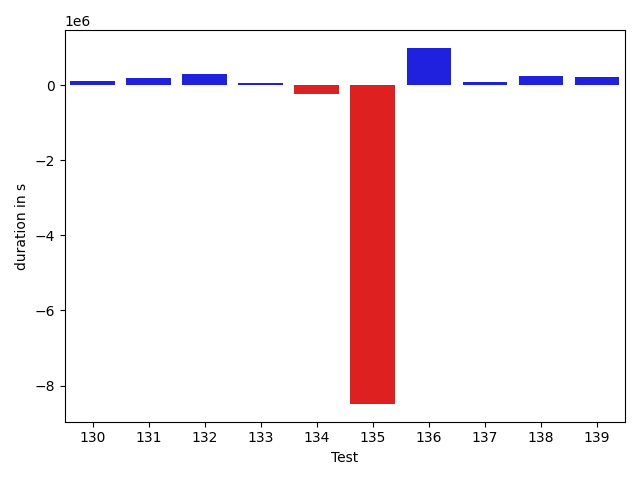

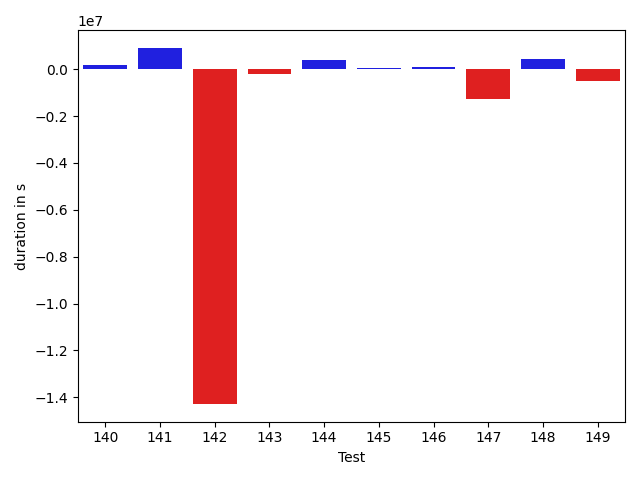

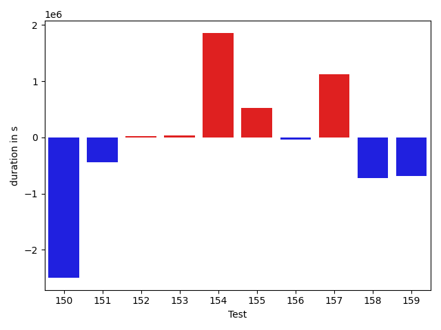

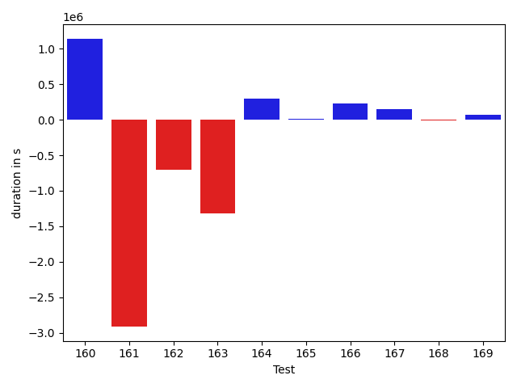

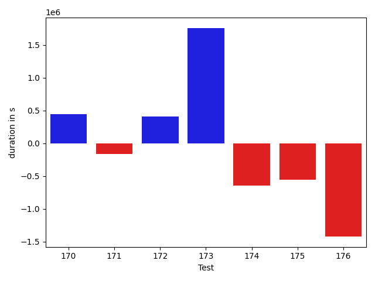

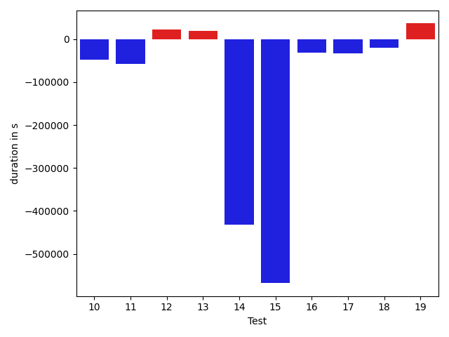

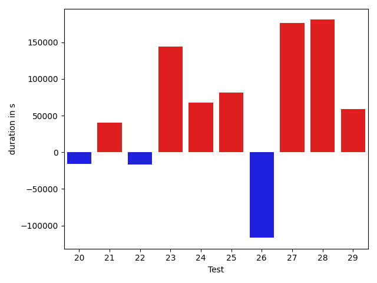

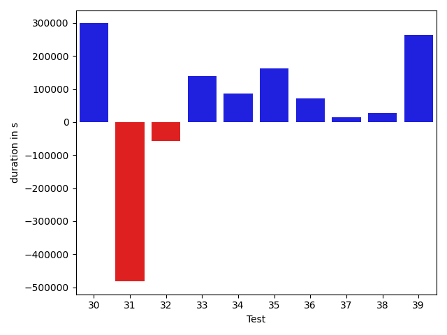

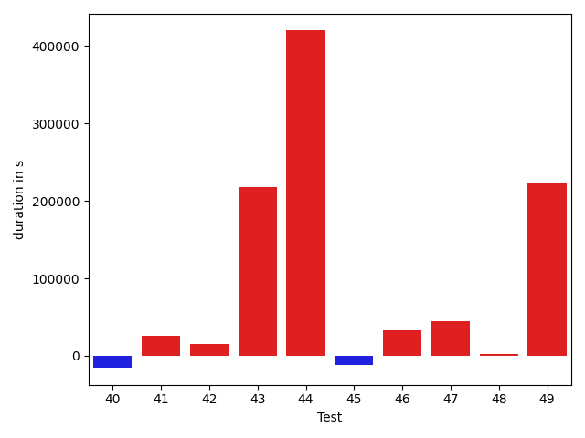

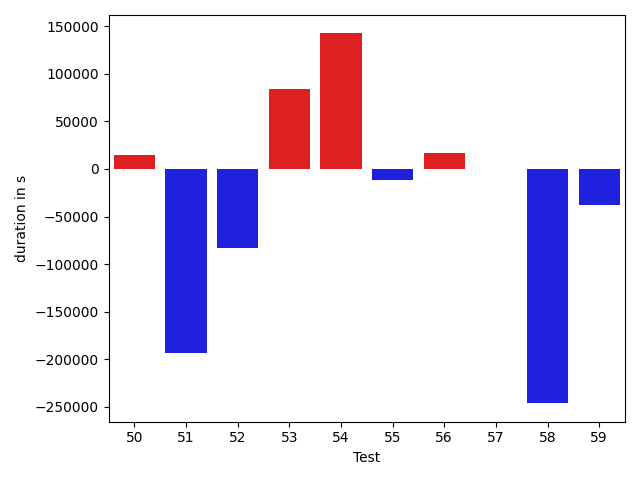

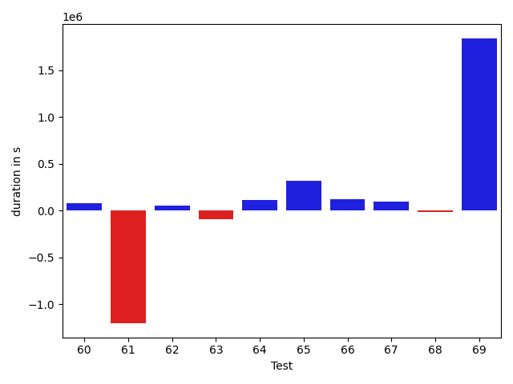

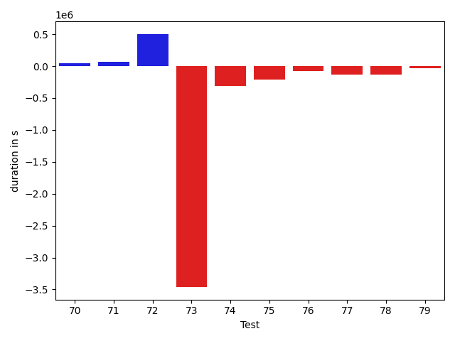

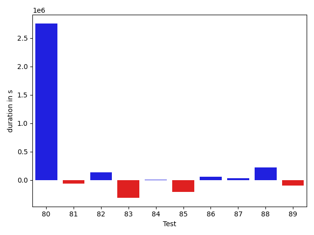

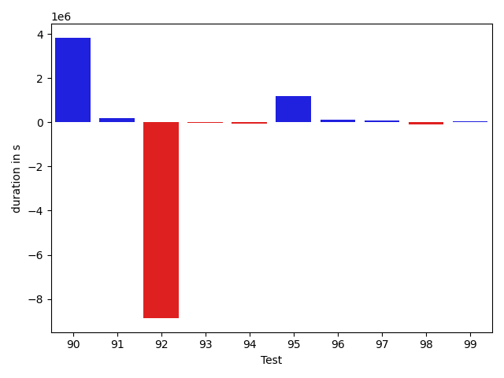

| ID | DurationV1 | DurationsV2 | DeltaDuration |
| --- | --- | --- | --- |
| 0 | 1121267.9480117157 | 1147048.7037343304 | 25780.755722614704 |
| 1 | 1135251.5161690358 | 878024.2388285515 | -257227.27734048432 |
| 2 | 1516536.499902093 | 962906.0068810203 | -553630.4930210728 |
| 3 | 902939.0774760251 | 820211.9444809321 | -82727.13299509301 |
| 4 | 1464509.1886865664 | 2150227.740430008 | 685718.5517434417 |
| 5 | 598324.6075321974 | 578439.9265956401 | -19884.68093655724 |
| 6 | 1849978.1457856093 | 1300799.7116908266 | -549178.4340947827 |
| 7 | 1193160.851659623 | 1011870.566738558 | -181290.28492106497 |
| 8 | 912334.4464117931 | 812327.5778951431 | -100006.86851665005 |
| 9 | 1647215.403749371 | 1114484.315000968 | -532731.0887484029 |
| 10 | 943272.489447226 | 694428.2418056251 | -248844.2476416009 |
| 11 | 902280.7399787819 | 625058.7001752206 | -277222.0398035613 |
| 12 | 886434.2927067687 | 692079.4046824885 | -194354.8880242802 |
| 13 | 822248.7879754202 | 781175.9738615983 | -41072.81411382195 |
| 14 | 915284.9308926576 | 1053151.7119245927 | 137866.78103193513 |
| 15 | 453393.7232655287 | 411163.919285506 | -42229.80398002267 |
| 16 | 1249331.040877054 | 1251274.1904027085 | 1943.1495256545022 |
| 17 | 1265042.7985129457 | 768653.9497864597 | -496388.848726486 |
| 18 | 1805341.5055832285 | 846049.079286307 | -959292.4262969216 |
| 19 | 1801353.4204035173 | 1330621.5033488527 | -470731.9170546646 |
| 20 | 1365269.4464442872 | 1384939.412713299 | 19669.966269011842 |
| 21 | 1316423.3842341702 | 1317079.5325578935 | 656.1483237233479 |
| 22 | 2194359.330467561 | 2352735.133978337 | 158375.80351077626 |
| 23 | 1647671.2110118975 | 2614042.531049723 | 966371.3200378253 |
| 24 | 812803.1322953752 | 960602.267909489 | 147799.13561411377 |
| 25 | 1439014.1463775954 | 1438753.3451246596 | -260.8012529357802 |
| 26 | 2462968.8444557693 | 1551729.713796773 | -911239.1306589963 |
| 27 | 872373.3726268767 | 1173050.9423702229 | 300677.5697433462 |
| 28 | 1803256.6048611968 | 1830145.9504528819 | 26889.345591685036 |
| 29 | 820981.8729705466 | 1020688.5112948206 | 199706.63832427398 |
| 30 | 851068.0696528972 | 1149780.6877081718 | 298712.6180552746 |
| 31 | 8503585.187918259 | 8021280.598701866 | -482304.5892163925 |
| 32 | 1350783.7119932924 | 1293366.5993354565 | -57417.11265783594 |
| 33 | 1200155.1665894834 | 1339837.505331786 | 139682.3387423025 |
| 34 | 968970.8205631031 | 1054385.3846496947 | 85414.56408659159 |
| 35 | 738542.4896953783 | 901159.9757083346 | 162617.48601295624 |
| 36 | 477749.84038184676 | 548438.6583417412 | 70688.81795989443 |
| 37 | 427958.8396143317 | 441815.11214745045 | 13856.272533118725 |
| 38 | 486652.02886067703 | 514499.37681090436 | 27847.347950227326 |
| 39 | 439582.5279339943 | 702832.7520246218 | 263250.2240906275 |
| 40 | 446849.40741467476 | 452658.60820007324 | 5809.200785398483 |
| 41 | 748380.3067146428 | 1033399.97860313 | 285019.6718884872 |
| 42 | 1517791.8979678985 | 1493375.7126532667 | -24416.185314631788 |
| 43 | 1478322.019108837 | 1498135.759218344 | 19813.740109506994 |
| 44 | 842937.4776720253 | 752952.353138047 | -89985.12453397829 |
| 45 | 927676.3044279143 | 1137465.0528451647 | 209788.74841725035 |
| 46 | 2813195.8579830136 | 1799064.5126881078 | -1014131.3452949058 |
| 47 | 1027990.2928550551 | 943699.6542422285 | -84290.63861282659 |
| 48 | 1522550.1220894402 | 1149419.7325692363 | -373130.3895202039 |
| 49 | 1082923.5682587083 | 1185928.4384296904 | 103004.87017098209 |
| 50 | 947584.5984229032 | 737282.541354264 | -210302.0570686392 |
| 51 | 899366.6890895667 | 620267.0367267206 | -279099.6523628461 |
| 52 | 7764979.414550781 | 2461748.6594848633 | -5303230.755065918 |
| 53 | 494466.4032229781 | 936816.8247451782 | 442350.4215222001 |
| 54 | 552011.6402237415 | 614471.0526652336 | 62459.41244149208 |
| 55 | 642593.9379336648 | 574174.1893582414 | -68419.74857542338 |
| 56 | 1195599.7893733098 | 1250701.3672516085 | 55101.5778782987 |
| 57 | 445848.7447877638 | 480541.3631324768 | 34692.618344713 |
| 58 | 514794.64849090576 | 457623.8868408203 | -57170.76165008545 |
| 59 | 364030.1859817505 | 498140.70196533203 | 134110.51598358154 |
| 60 | 553311.592085202 | 630825.4637826392 | 77513.87169743725 |
| 61 | 1925019.3751841348 | 722290.9993034031 | -1202728.3758807317 |
| 62 | 489671.5512646064 | 538406.044523804 | 48734.49325919757 |
| 63 | 1708715.8452897775 | 1614360.3884565162 | -94355.4568332613 |
| 64 | 821653.1004923689 | 932462.7936819578 | 110809.69318958884 |
| 65 | 468009.4683688404 | 785126.9013154199 | 317117.43294657953 |
| 66 | 486766.2870385209 | 610849.3335243464 | 124083.04648582544 |
| 67 | 755171.4454534865 | 849699.3734708662 | 94527.92801737972 |
| 68 | 523356.1673731394 | 503607.97393087205 | -19748.193442267366 |
| 69 | 715454.7688063195 | 2553948.725025396 | 1838493.9562190764 |
| 70 | 469710.57107545715 | 512990.226583153 | 43279.65550769586 |
| 71 | 497037.88301952113 | 565165.7291074852 | 68127.84608796402 |
| 72 | 568386.7280626815 | 1070030.3022081256 | 501643.5741454441 |
| 73 | 4079266.1411967687 | 618111.4550016136 | -3461154.686195155 |
| 74 | 1041030.5132176209 | 731957.414669686 | -309073.0985479349 |
| 75 | 896250.4245077948 | 688768.9097889361 | -207481.51471885864 |
| 76 | 973114.1373146788 | 890514.1587211973 | -82599.97859348147 |
| 77 | 613631.1567312479 | 476411.77753890614 | -137219.37919234176 |
| 78 | 678475.2411769661 | 548661.4075496616 | -129813.83362730453 |
| 79 | 674702.5110225677 | 644126.0621337891 | -30576.448888778687 |
| 80 | 493473.87380313873 | 3252085.6382303 | 2758611.7644271613 |
| 81 | 726734.1371863654 | 666311.8610258535 | -60422.27616051189 |
| 82 | 555786.2275985475 | 692191.154956715 | 136404.92735816748 |
| 83 | 1301719.3484445608 | 989892.8471511338 | -311826.50129342696 |
| 84 | 566605.664464321 | 570012.6886901855 | 3407.0242258645594 |
| 85 | 1369140.8179643438 | 1162107.2167506006 | -207033.6012137432 |
| 86 | 628957.2967240448 | 687074.666672616 | 58117.3699485712 |
| 87 | 683817.6579937736 | 719883.4208451733 | 36065.76285139972 |
| 88 | 567768.3601673156 | 793490.4475226117 | 225722.08735529613 |
| 89 | 605666.8817847185 | 507473.425283432 | -98193.45650128648 |
| 90 | 1196494.650698107 | 5025730.102120577 | 3829235.4514224706 |
| 91 | 791242.2289050481 | 979818.4976425652 | 188576.26873751706 |
| 92 | 9933605.55001976 | 1066764.7724241377 | -8866840.777595622 |
| 93 | 621639.8402407141 | 592018.2608276405 | -29621.579413073603 |
| 94 | 485588.9285888672 | 443489.4803466797 | -42099.4482421875 |
| 95 | 1269173.3176686973 | 2453164.446437365 | 1183991.1287686676 |
| 96 | 1475562.4260434213 | 1610339.623647193 | 134777.1976037717 |
| 97 | 606623.9909601626 | 695033.3776044836 | 88409.38664432103 |
| 98 | 709201.7770255416 | 599574.7796343638 | -109626.9973911778 |
| 99 | 872213.3912733932 | 919829.7810434926 | 47616.38977009943 |
| 100 | 455212.5328435898 | 452585.2787475586 | -2627.254096031189 |
| 101 | 409427.9008178711 | 383091.43130493164 | -26336.469512939453 |
| 102 | 532394.0737380981 | 717602.18553368 | 185208.11179558188 |
| 103 | 430965.78271484375 | 356132.1432209015 | -74833.63949394226 |
| 104 | 447150.2368774414 | 385154.22289276123 | -61996.013984680176 |
| 105 | 404197.3892277479 | 460677.14361834526 | 56479.75439059734 |
| 106 | 1106978.1925899545 | 504551.25508671755 | -602426.9375032369 |
| 107 | 391836.881608963 | 432576.16398620605 | 40739.28237724304 |
| 108 | 352899.06687545776 | 423910.71157836914 | 71011.64470291138 |
| 109 | 1629854.2212513415 | 831675.2750281668 | -798178.9462231747 |
| 110 | 2975531.5248983908 | 3036548.1537571577 | 61016.628858766984 |
| 111 | 2461381.1875 | 321593.4973144531 | -2139787.690185547 |
| 112 | 2536685.278374179 | 3564245.9009711533 | 1027560.6225969745 |
| 113 | 4507816.793327434 | 4031878.013537006 | -475938.779790428 |
| 114 | 866995.6760205422 | 1054031.404422084 | 187035.72840154194 |
| 115 | 1011868.5560325459 | 1320866.3673780896 | 308997.8113455437 |
| 116 | 918297.7608725148 | 1357917.2720358893 | 439619.5111633745 |
| 117 | 636414.7292780321 | 631024.2617406687 | -5390.467537363409 |
| 118 | 873808.5477651709 | 733451.6632757282 | -140356.8844894427 |
| 119 | 595518.4827002343 | 604931.4439587854 | 9412.961258551106 |
| 120 | 668736.501506418 | 547019.7388687134 | -121716.76263770461 |
| 121 | 852163.4448188709 | 637792.062389886 | -214371.38242898486 |
| 122 | 703923.1357186313 | 820871.4039572543 | 116948.26823862293 |
| 123 | 812536.5094814643 | 917027.6843894979 | 104491.17490803357 |
| 124 | 1375664.662854521 | 3113700.584293088 | 1738035.9214385669 |
| 125 | 868015.320369418 | 10240543.08731952 | 9372527.7669501 |
| 126 | 916920.2212616273 | 1041193.4930837287 | 124273.27182210144 |
| 127 | 960035.9448656598 | 1219739.5688665481 | 259703.62400088832 |
| 128 | 618358.4925064445 | 625142.4587927461 | 6783.966286301613 |
| 129 | 1637198.0300988425 | 1869343.205820833 | 232145.17572199064 |
| 130 | 518492.78802231327 | 634063.416286339 | 115570.62826402579 |
| 131 | 552769.9014723188 | 740294.1073237915 | 187524.20585147268 |
| 132 | 537810.7872041364 | 827200.4654513116 | 289389.6782471752 |
| 133 | 559471.6654875772 | 614184.8906532965 | 54713.22516571928 |
| 134 | 1463404.4276793692 | 1239192.7162876367 | -224211.71139173256 |
| 135 | 12930703.564547595 | 4440382.665237693 | -8490320.899309902 |
| 136 | 1811935.4151917067 | 2808227.240061982 | 996291.8248702753 |
| 137 | 986666.7752119225 | 1069074.2063701334 | 82407.43115821097 |
| 138 | 1278235.709813016 | 1525551.9637677148 | 247316.2539546988 |
| 139 | 1261098.8712514858 | 1489676.8555200922 | 228577.9842686064 |
| 140 | 785967.934702633 | 945659.097369197 | 159691.1626665641 |
| 141 | 1234430.932894789 | 2139627.0814532544 | 905196.1485584655 |
| 142 | 14913124.013591744 | 628101.0508775227 | -14285022.962714221 |
| 143 | 724337.0466000509 | 523908.5891434684 | -200428.45745658246 |
| 144 | 494429.7132845847 | 885605.3309161514 | 391175.6176315667 |
| 145 | 365780.99156951904 | 412484.38677978516 | 46703.39521026611 |
| 146 | 816149.0142454068 | 890832.0431692647 | 74683.02892385784 |
| 147 | 3151667.3484142963 | 1889906.678451678 | -1261760.6699626183 |
| 148 | 1167201.5962321677 | 1613277.6006041716 | 446076.00437200395 |
| 149 | 1636111.7327569241 | 1120011.2972036996 | -516100.4355532245 |
| 150 | 1484386.5368559244 | 993244.9872371294 | -491141.54961879505 |
| 151 | 931463.3401925324 | 671937.4251378633 | -259525.91505466914 |
| 152 | 1330392.6976867921 | 2409562.2343746223 | 1079169.5366878302 |
| 153 | 2755934.3887231294 | 20912340.021618985 | 18156405.632895857 |
| 154 | 752703.091914824 | 975535.4517764025 | 222832.35986157856 |
| 155 | 826228.8784621836 | 1538011.6411262006 | 711782.7626640169 |
| 156 | 582735.7730911619 | 805959.7928494215 | 223224.01975825964 |
| 157 | 442785.855386734 | 413750.9839878082 | -29034.87139892578 |
| 158 | 512229.40934029815 | 550094.7435007667 | 37865.33416046854 |
| 159 | 454049.2087402344 | 547939.2464141846 | 93890.0376739502 |
| 160 | 1055479.3781362767 | 2196740.601040386 | 1141261.2229041094 |
| 161 | 5909656.460264316 | 2995968.707973066 | -2913687.75229125 |
| 162 | 2364446.9293179302 | 1665212.1228299371 | -699234.8064879931 |
| 163 | 2986331.4401250193 | 1663794.3499053183 | -1322537.090219701 |
| 164 | 564508.4867915569 | 864334.3915299424 | 299825.90473838546 |
| 165 | 448655.3523864746 | 457344.4995994568 | 8689.147212982178 |
| 166 | 418319.5580768585 | 645437.4270515442 | 227117.86897468567 |
| 167 | 347659.913646698 | 491848.69107711315 | 144188.77743041515 |
| 168 | 381753.0087890625 | 367852.29771270294 | -13900.711076359556 |
| 169 | 1620947.3949414468 | 1693597.9968237034 | 72650.60188225657 |
| 170 | 787085.085101733 | 1228258.1042462988 | 441173.0191445658 |
| 171 | 2523356.4584197006 | 2357994.4476486742 | -165362.01077102637 |
| 172 | 6815695.345163633 | 7219167.562831819 | 403472.21766818594 |
| 173 | 1493913.4666236292 | 3250376.392460096 | 1756462.925836467 |
| 174 | 1912136.1878945632 | 1264606.6024523359 | -647529.5854422273 |
| 175 | 1062831.9563744524 | 508357.75052846037 | -554474.2058459921 |
| 176 | 1832623.3411107287 | 409431.72032546997 | -1423191.6207852587 |

## Misc.

| ID | Test Class | Test Method |
| --- | --- | --- |
| 0 | com.google.gson.functional.CustomTypeAdaptersTest | testCustomAdapterInvokedForCollectionElementDeserialization |
| 1 | com.google.gson.functional.CustomTypeAdaptersTest | testCustomNestedSerializers |
| 2 | com.google.gson.functional.CustomTypeAdaptersTest | testCustomSerializers |
| 3 | com.google.gson.functional.CustomTypeAdaptersTest | testCustomNestedDeserializers |
| 4 | com.google.gson.functional.CustomTypeAdaptersTest | testCustomTypeAdapterDoesNotAppliesToSubClasses |
| 5 | com.google.gson.functional.CustomTypeAdaptersTest | testCustomAdapterInvokedForCollectionElementSerialization |
| 6 | com.google.gson.functional.CustomTypeAdaptersTest | testCustomAdapterInvokedForCollectionElementSerializationWithType |
| 7 | com.google.gson.functional.CustomTypeAdaptersTest | testCustomByteArrayDeserializerAndInstanceCreator |
| 8 | com.google.gson.functional.CustomTypeAdaptersTest | testCustomByteArraySerializer |
| 9 | com.google.gson.functional.CustomTypeAdaptersTest | testEnsureCustomSerializerNotInvokedForNullValues |
| 10 | com.google.gson.functional.CustomTypeAdaptersTest | testCustomDeserializerInvokedForPrimitives |
| 11 | com.google.gson.functional.CustomTypeAdaptersTest | testCustomSerializerInvokedForPrimitives |
| 12 | com.google.gson.functional.CustomTypeAdaptersTest | testCustomTypeAdapterAppliesToSubClassesSerializedAsBaseClass |
| 13 | com.google.gson.functional.CustomTypeAdaptersTest | testCustomAdapterInvokedForMapElementDeserialization |
| 14 | com.google.gson.functional.CustomTypeAdaptersTest | testCustomAdapterInvokedForMapElementSerializationWithType |
| 15 | com.google.gson.functional.CustomTypeAdaptersTest | testCustomAdapterInvokedForMapElementSerialization |
| 16 | com.google.gson.functional.CustomTypeAdaptersTest | testRegisterHierarchyAdapterForDate |
| 17 | com.google.gson.functional.CustomTypeAdaptersTest | testCustomDeserializers |
| 18 | com.google.gson.functional.CustomTypeAdaptersTest | testEnsureCustomDeserializerNotInvokedForNullValues |
| 19 | com.google.gson.functional.StreamingTypeAdaptersTest | testNullSafe |
| 20 | com.google.gson.functional.StreamingTypeAdaptersTest | testSerializeWithCustomTypeAdapter |
| 21 | com.google.gson.functional.StreamingTypeAdaptersTest | testDeserializeWithCustomTypeAdapter |
| 22 | com.google.gson.functional.InstanceCreatorTest | testInstanceCreatorForParametrizedType |
| 23 | com.google.gson.functional.InstanceCreatorTest | testInstanceCreatorReturnsBaseType |
| 24 | com.google.gson.functional.InstanceCreatorTest | testInstanceCreatorReturnsSubTypeForTopLevelObject |
| 25 | com.google.gson.functional.InstanceCreatorTest | testInstanceCreatorForCollectionType |
| 26 | com.google.gson.functional.InstanceCreatorTest | testInstanceCreatorReturnsSubTypeForField |
| 27 | com.google.gson.functional.DefaultTypeAdaptersTest | testDateSerializationWithPatternNotOverridenByTypeAdapter |
| 28 | com.google.gson.functional.DefaultTypeAdaptersTest | testOverrideBigIntegerTypeAdapter |
| 29 | com.google.gson.functional.DefaultTypeAdaptersTest | testClassSerialization |
| 30 | com.google.gson.functional.DefaultTypeAdaptersTest | testTimestampSerialization |
| 31 | com.google.gson.functional.DefaultTypeAdaptersTest | testDefaultDateDeserializationUsingBuilder |
| 32 | com.google.gson.functional.DefaultTypeAdaptersTest | testOverrideBigDecimalTypeAdapter |
| 33 | com.google.gson.functional.DefaultTypeAdaptersTest | testDateSerializationInCollection |
| 34 | com.google.gson.functional.DefaultTypeAdaptersTest | testDateSerializationWithPattern |
| 35 | com.google.gson.functional.DefaultTypeAdaptersTest | testSqlDateSerialization |
| 36 | com.google.gson.functional.DefaultTypeAdaptersTest | testDefaultCalendarSerialization |
| 37 | com.google.gson.functional.DefaultTypeAdaptersTest | testDefaultGregorianCalendarDeserialization |
| 38 | com.google.gson.functional.DefaultTypeAdaptersTest | testDefaultCalendarDeserialization |
| 39 | com.google.gson.functional.DefaultTypeAdaptersTest | testClassDeserialization |
| 40 | com.google.gson.functional.DefaultTypeAdaptersTest | testDefaultGregorianCalendarSerialization |
| 41 | com.google.gson.functional.DefaultTypeAdaptersTest | testDateDeserializationWithPattern |
| 42 | com.google.gson.functional.MapTest | testInterfaceTypeMapWithSerializer |
| 43 | com.google.gson.functional.MapTest | testMapSerializationWithNullValuesSerialized |
| 44 | com.google.gson.functional.MapTest | testCustomSerializerForSpecificMapType |
| 45 | com.google.gson.functional.MapTest | testMapSerializationWithNullValueButSerializeNulls |
| 46 | com.google.gson.functional.MapTest | testInterfaceTypeMap |
| 47 | com.google.gson.functional.MapTest | testSerializeMaps |
| 48 | com.google.gson.functional.MapTest | testMapSubclassDeserialization |
| 49 | com.google.gson.functional.MapTest | testGeneralMapField |
| 50 | com.google.gson.GsonBuilderTest | testExcludeFieldsWithModifiers |
| 51 | com.google.gson.GsonBuilderTest | testTransientFieldExclusion |
| 52 | com.google.gson.GsonBuilderTest | testCreatingMoreThanOnce |
| 53 | com.google.gson.functional.TypeAdapterPrecedenceTest | testStreamingHierarchicalFollowedByNonstreaming |
| 54 | com.google.gson.functional.TypeAdapterPrecedenceTest | testSerializeNonstreamingTypeAdapterFollowedByStreamingTypeAdapter |
| 55 | com.google.gson.functional.TypeAdapterPrecedenceTest | testStreamingHierarchicalFollowedByNonstreamingHierarchical |
| 56 | com.google.gson.functional.TypeAdapterPrecedenceTest | testNonstreamingFollowedByNonstreaming |
| 57 | com.google.gson.functional.TypeAdapterPrecedenceTest | testStreamingFollowedByNonstreaming |
| 58 | com.google.gson.functional.TypeAdapterPrecedenceTest | testNonstreamingHierarchicalFollowedByNonstreaming |
| 59 | com.google.gson.functional.TypeAdapterPrecedenceTest | testStreamingFollowedByNonstreamingHierarchical |
| 60 | com.google.gson.functional.TypeAdapterPrecedenceTest | testStreamingFollowedByStreaming |
| 61 | com.google.gson.functional.NamingPolicyTest | testGsonWithNonDefaultFieldNamingPolicySerialization |
| 62 | com.google.gson.functional.NamingPolicyTest | testGsonWithLowerCaseDashPolicyDeserialiation |
| 63 | com.google.gson.functional.NamingPolicyTest | testGsonDuplicateNameUsingSerializedNameFieldNamingPolicySerialization |
| 64 | com.google.gson.functional.NamingPolicyTest | testGsonWithSerializedNameFieldNamingPolicySerialization |
| 65 | com.google.gson.functional.NamingPolicyTest | testGsonWithLowerCaseDashPolicySerialization |
| 66 | com.google.gson.functional.NamingPolicyTest | testGsonWithSerializedNameFieldNamingPolicyDeserialization |
| 67 | com.google.gson.functional.NamingPolicyTest | testDeprecatedNamingStrategy |
| 68 | com.google.gson.functional.NamingPolicyTest | testGsonWithLowerCaseUnderscorePolicyDeserialiation |
| 69 | com.google.gson.functional.NamingPolicyTest | testGsonWithNonDefaultFieldNamingPolicyDeserialiation |
| 70 | com.google.gson.functional.NamingPolicyTest | testGsonWithUpperCamelCaseSpacesPolicyDeserialiation |
| 71 | com.google.gson.functional.NamingPolicyTest | testGsonWithLowerCaseUnderscorePolicySerialization |
| 72 | com.google.gson.functional.NamingPolicyTest | testGsonWithUpperCamelCaseSpacesPolicySerialiation |
| 73 | com.google.gson.functional.NullObjectAndFieldTest | testExplicitSerializationOfNullStringMembers |
| 74 | com.google.gson.functional.NullObjectAndFieldTest | testCustomTypeAdapterPassesNullDesrialization |
| 75 | com.google.gson.functional.NullObjectAndFieldTest | testPrintPrintingObjectWithNulls |
| 76 | com.google.gson.functional.NullObjectAndFieldTest | testExplicitSerializationOfNulls |
| 77 | com.google.gson.functional.NullObjectAndFieldTest | testNullWrappedPrimitiveMemberDeserialization |
| 78 | com.google.gson.functional.NullObjectAndFieldTest | testExplicitDeserializationOfNulls |
| 79 | com.google.gson.functional.NullObjectAndFieldTest | testTopLevelNullObjectDeserialization |
| 80 | com.google.gson.functional.NullObjectAndFieldTest | testPrintPrintingArraysWithNulls |
| 81 | com.google.gson.functional.NullObjectAndFieldTest | testCustomTypeAdapterPassesNullSerialization |
| 82 | com.google.gson.functional.NullObjectAndFieldTest | testExplicitSerializationOfNullCollectionMembers |
| 83 | com.google.gson.functional.NullObjectAndFieldTest | testCustomSerializationOfNulls |
| 84 | com.google.gson.functional.NullObjectAndFieldTest | testTopLevelNullObjectSerialization |
| 85 | com.google.gson.functional.NullObjectAndFieldTest | testExplicitSerializationOfNullArrayMembers |
| 86 | com.google.gson.functional.NullObjectAndFieldTest | testNullWrappedPrimitiveMemberSerialization |
| 87 | com.google.gson.functional.CustomSerializerTest | testSerializerReturnsNull |
| 88 | com.google.gson.functional.CustomSerializerTest | testBaseClassSerializerInvokedForBaseClassFieldsHoldingSubClassInstances |
| 89 | com.google.gson.functional.CustomSerializerTest | testBaseClassSerializerInvokedForBaseClassFields |
| 90 | com.google.gson.functional.CustomSerializerTest | testSubClassSerializerInvokedForBaseClassFieldsHoldingSubClassInstances |
| 91 | com.google.gson.functional.CustomSerializerTest | testSubClassSerializerInvokedForBaseClassFieldsHoldingArrayOfSubClassInstances |
| 92 | com.google.gson.functional.FieldExclusionTest | testDefaultInnerClassExclusion |
| 93 | com.google.gson.functional.FieldExclusionTest | testDefaultNestedStaticClassIncluded |
| 94 | com.google.gson.functional.FieldExclusionTest | testInnerClassExclusion |
| 95 | com.google.gson.functional.CustomDeserializerTest | testCustomDeserializerReturnsNull |
| 96 | com.google.gson.functional.CustomDeserializerTest | testJsonTypeFieldBasedDeserialization |
| 97 | com.google.gson.functional.CustomDeserializerTest | testCustomDeserializerReturnsNullForArrayElements |
| 98 | com.google.gson.functional.CustomDeserializerTest | testCustomDeserializerReturnsNullForTopLevelObject |
| 99 | com.google.gson.functional.CustomDeserializerTest | testCustomDeserializerReturnsNullForArrayElementsForArrayField |
| 100 | com.google.gson.functional.PrimitiveTest | testHtmlCharacterSerialization |
| 101 | com.google.gson.functional.PrimitiveTest | testDoubleInfinitySerialization |
| 102 | com.google.gson.functional.PrimitiveTest | testLongAsStringDeserialization |
| 103 | com.google.gson.functional.PrimitiveTest | testNegativeInfinityFloatSerialization |
| 104 | com.google.gson.functional.PrimitiveTest | testNegativeInfinitySerialization |
| 105 | com.google.gson.functional.PrimitiveTest | testLongAsStringSerialization |
| 106 | com.google.gson.functional.PrimitiveTest | testDoubleNaNSerialization |
| 107 | com.google.gson.functional.PrimitiveTest | testFloatNaNSerialization |
| 108 | com.google.gson.functional.PrimitiveTest | testFloatInfinitySerialization |
| 109 | com.google.gson.functional.TypeHierarchyAdapterTest | testRegisterSuperTypeFirst |
| 110 | com.google.gson.functional.TypeHierarchyAdapterTest | testTypeHierarchy |
| 111 | com.google.gson.functional.TypeHierarchyAdapterTest | testRegisterSubTypeFirstAllowed |
| 112 | com.google.gson.functional.EnumTest | testEnumSubclassWithRegisteredTypeAdapter |
| 113 | com.google.gson.functional.VersioningTest | testVersionedUntilSerialization |
| 114 | com.google.gson.functional.VersioningTest | testVersionedClassesSerialization |
| 115 | com.google.gson.functional.VersioningTest | testVersionedGsonMixingSinceAndUntilSerialization |
| 116 | com.google.gson.functional.VersioningTest | testVersionedGsonWithUnversionedClassesSerialization |
| 117 | com.google.gson.functional.VersioningTest | testVersionedGsonMixingSinceAndUntilDeserialization |
| 118 | com.google.gson.functional.VersioningTest | testVersionedClassesDeserialization |
| 119 | com.google.gson.functional.VersioningTest | testVersionedGsonWithUnversionedClassesDeserialization |
| 120 | com.google.gson.functional.VersioningTest | testIgnoreLaterVersionClassDeserialization |
| 121 | com.google.gson.functional.VersioningTest | testVersionedUntilDeserialization |
| 122 | com.google.gson.functional.VersioningTest | testIgnoreLaterVersionClassSerialization |
| 123 | com.google.gson.functional.JsonAdapterAnnotationOnClassesTest | testRegisteredDeserializerOverridesJsonAdapter |
| 124 | com.google.gson.functional.JsonAdapterAnnotationOnClassesTest | testRegisteredSerializerOverridesJsonAdapter |
| 125 | com.google.gson.functional.JsonAdapterAnnotationOnClassesTest | testRegisteredAdapterOverridesJsonAdapter |
| 126 | com.google.gson.functional.ObjectTest | testAnonymousLocalClassesCustomSerialization |
| 127 | com.google.gson.functional.ObjectTest | testInnerClassDeserialization |
| 128 | com.google.gson.functional.ObjectTest | testJsonObjectSerialization |
| 129 | com.google.gson.functional.FieldNamingTest | testIdentity |
| 130 | com.google.gson.functional.FieldNamingTest | testLowerCaseWithDashes |
| 131 | com.google.gson.functional.FieldNamingTest | testLowerCaseWithUnderscores |
| 132 | com.google.gson.functional.FieldNamingTest | testUpperCamelCase |
| 133 | com.google.gson.functional.FieldNamingTest | testUpperCamelCaseWithSpaces |
| 134 | com.google.gson.functional.MapAsArrayTypeAdapterTest | testMapWithTypeVariableDeserialization |
| 135 | com.google.gson.functional.MapAsArrayTypeAdapterTest | testSerializeComplexMapWithTypeAdapter |
| 136 | com.google.gson.functional.MapAsArrayTypeAdapterTest | testTwoTypesCollapseToOneDeserialize |
| 137 | com.google.gson.functional.MapAsArrayTypeAdapterTest | testMultipleEnableComplexKeyRegistrationHasNoEffect |
| 138 | com.google.gson.functional.MapAsArrayTypeAdapterTest | testMapWithTypeVariableSerialization |
| 139 | com.google.gson.functional.JavaUtilConcurrentAtomicTest | testAtomicLongArrayWithStringSerializationPolicy |
| 140 | com.google.gson.functional.JavaUtilConcurrentAtomicTest | testAtomicLongWithStringSerializationPolicy |
| 141 | com.google.gson.functional.SecurityTest | testNonExecutableJsonSerialization |
| 142 | com.google.gson.functional.SecurityTest | testJsonWithNonExectuableTokenWithRegularGsonDeserialization |
| 143 | com.google.gson.functional.SecurityTest | testJsonWithNonExectuableTokenWithConfiguredGsonDeserialization |
| 144 | com.google.gson.functional.SecurityTest | testNonExecutableJsonDeserialization |
| 145 | com.google.gson.functional.SecurityTest | testJsonWithNonExectuableTokenSerialization |
| 146 | com.google.gson.functional.EscapingTest | testGsonAcceptsEscapedAndNonEscapedJsonDeserialization |
| 147 | com.google.gson.functional.ParameterizedTypesTest | testParameterizedTypeDeserialization |
| 148 | com.google.gson.functional.ParameterizedTypesTest | testParameterizedTypeWithReaderDeserialization |
| 149 | com.google.gson.functional.ParameterizedTypesTest | testParameterizedTypeWithCustomSerializer |
| 150 | com.google.gson.functional.ParameterizedTypesTest | testParameterizedTypesWithCustomDeserializer |
| 151 | com.google.gson.functional.ExclusionStrategyFunctionalTest | testExcludeTopLevelClassDeserializationDoesNotImpactSerialization |
| 152 | com.google.gson.functional.ExclusionStrategyFunctionalTest | testExclusionStrategyDeserialization |
| 153 | com.google.gson.functional.ExclusionStrategyFunctionalTest | testExclusionStrategySerialization |
| 154 | com.google.gson.functional.ExclusionStrategyFunctionalTest | testExclusionStrategyWithMode |
| 155 | com.google.gson.functional.ExclusionStrategyFunctionalTest | testExclusionStrategySerializationDoesNotImpactDeserialization |
| 156 | com.google.gson.functional.ExclusionStrategyFunctionalTest | testExclusionStrategySerializationDoesNotImpactSerialization |
| 157 | com.google.gson.functional.ExclusionStrategyFunctionalTest | testExcludeTopLevelClassSerialization |
| 158 | com.google.gson.functional.ExclusionStrategyFunctionalTest | testExcludeTopLevelClassSerializationDoesNotImpactDeserialization |
| 159 | com.google.gson.functional.ExclusionStrategyFunctionalTest | testExcludeTopLevelClassDeserialization |
| 160 | com.google.gson.functional.CollectionTest | testUserCollectionTypeAdapter |
| 161 | com.google.gson.functional.JsonAdapterAnnotationOnFieldsTest | testRegisteredTypeAdapterTakesPrecedenceOverClassAnnotationAdapter |
| 162 | com.google.gson.functional.JsonAdapterAnnotationOnFieldsTest | testFieldAnnotationTakesPrecedenceOverRegisteredTypeAdapter |
| 163 | com.google.gson.functional.UncategorizedTest | testReturningDerivedClassesDuringDeserialization |
| 164 | com.google.gson.OverrideCoreTypeAdaptersTest | testOverrideWrapperBooleanAdapter |
| 165 | com.google.gson.OverrideCoreTypeAdaptersTest | testOverridePrimitiveBooleanAdapter |
| 166 | com.google.gson.OverrideCoreTypeAdaptersTest | testOverrideStringAdapter |
| 167 | com.google.gson.functional.ReadersWritersTest | testTopLevelNullObjectSerializationWithWriterAndSerializeNulls |
| 168 | com.google.gson.functional.ReadersWritersTest | testTopLevelNullObjectDeserializationWithReaderAndSerializeNulls |
| 169 | com.google.gson.GsonTypeAdapterTest | testDeserializerForAbstractClass |
| 170 | com.google.gson.functional.ArrayTest | testNullsInArrayWithSerializeNullPropertySetSerialization |
| 171 | com.google.gson.functional.PrintFormattingTest | testJsonObjectWithNullValuesSerialized |
| 172 | com.google.gson.functional.CircularReferenceTest | testSelfReferenceCustomHandlerSerialization |
| 173 | com.google.gson.MixedStreamTest | testWriteHtmlSafe |
| 174 | com.google.gson.MixedStreamTest | testWriteLenient |
| 175 | com.google.gson.LongSerializationPolicyTest | testDefaultLongSerializationIntegration |
| 176 | com.google.gson.LongSerializationPolicyTest | testStringLongSerializationIntegration |

| Test | IterationV1 | IterationV2 | DeltaIteration |
| --- | --- | --- | --- |
| 0 | 76 | 76 | 0 |
| 1 | 70 | 56 | -14 |
| 2 | 71 | 60 | -11 |
| 3 | 54 | 45 | -9 |
| 4 | 84 | 87 | 3 |
| 5 | 35 | 39 | 4 |
| 6 | 97 | 95 | -2 |
| 7 | 77 | 73 | -4 |
| 8 | 45 | 48 | 3 |
| 9 | 89 | 88 | -1 |
| 10 | 44 | 49 | 5 |
| 11 | 38 | 49 | 11 |
| 12 | 35 | 42 | 7 |
| 13 | 59 | 58 | -1 |
| 14 | 70 | 50 | -20 |
| 15 | 24 | 25 | 1 |
| 16 | 75 | 64 | -11 |
| 17 | 60 | 50 | -10 |
| 18 | 68 | 60 | -8 |
| 19 | 96 | 94 | -2 |
| 20 | 90 | 91 | 1 |
| 21 | 96 | 99 | 3 |
| 22 | 99 | 99 | 0 |
| 23 | 62 | 64 | 2 |
| 24 | 57 | 45 | -12 |
| 25 | 99 | 99 | 0 |
| 26 | 68 | 68 | 0 |
| 27 | 78 | 93 | 15 |
| 28 | 99 | 99 | 0 |
| 29 | 61 | 58 | -3 |
| 30 | 79 | 95 | 16 |
| 31 | 99 | 99 | 0 |
| 32 | 99 | 99 | 0 |
| 33 | 92 | 99 | 7 |
| 34 | 74 | 86 | 12 |
| 35 | 57 | 88 | 31 |
| 36 | 33 | 30 | -3 |
| 37 | 28 | 24 | -4 |
| 38 | 30 | 39 | 9 |
| 39 | 31 | 36 | 5 |
| 40 | 23 | 22 | -1 |
| 41 | 57 | 86 | 29 |
| 42 | 99 | 99 | 0 |
| 43 | 92 | 86 | -6 |
| 44 | 62 | 69 | 7 |
| 45 | 65 | 65 | 0 |
| 46 | 99 | 99 | 0 |
| 47 | 74 | 77 | 3 |
| 48 | 79 | 91 | 12 |
| 49 | 82 | 81 | -1 |
| 50 | 58 | 57 | -1 |
| 51 | 45 | 30 | -15 |
| 52 | 12 | 16 | 4 |
| 53 | 24 | 20 | -4 |
| 54 | 23 | 22 | -1 |
| 55 | 30 | 33 | 3 |
| 56 | 90 | 83 | -7 |
| 57 | 30 | 20 | -10 |
| 58 | 20 | 15 | -5 |
| 59 | 19 | 15 | -4 |
| 60 | 34 | 31 | -3 |
| 61 | 46 | 45 | -1 |
| 62 | 27 | 35 | 8 |
| 63 | 90 | 90 | 0 |
| 64 | 70 | 68 | -2 |
| 65 | 30 | 33 | 3 |
| 66 | 32 | 23 | -9 |
| 67 | 52 | 61 | 9 |
| 68 | 31 | 31 | 0 |
| 69 | 41 | 49 | 8 |
| 70 | 34 | 27 | -7 |
| 71 | 33 | 31 | -2 |
| 72 | 37 | 25 | -12 |
| 73 | 37 | 33 | -4 |
| 74 | 52 | 55 | 3 |
| 75 | 57 | 59 | 2 |
| 76 | 57 | 46 | -11 |
| 77 | 26 | 39 | 13 |
| 78 | 41 | 35 | -6 |
| 79 | 21 | 20 | -1 |
| 80 | 22 | 32 | 10 |
| 81 | 53 | 44 | -9 |
| 82 | 49 | 35 | -14 |
| 83 | 62 | 53 | -9 |
| 84 | 29 | 20 | -9 |
| 85 | 86 | 92 | 6 |
| 86 | 42 | 45 | 3 |
| 87 | 51 | 47 | -4 |
| 88 | 44 | 41 | -3 |
| 89 | 29 | 20 | -9 |
| 90 | 68 | 69 | 1 |
| 91 | 62 | 59 | -3 |
| 92 | 85 | 76 | -9 |
| 93 | 41 | 45 | 4 |
| 94 | 18 | 18 | 0 |
| 95 | 61 | 66 | 5 |
| 96 | 99 | 99 | 0 |
| 97 | 54 | 48 | -6 |
| 98 | 43 | 46 | 3 |
| 99 | 66 | 64 | -2 |
| 100 | 20 | 18 | -2 |
| 101 | 17 | 16 | -1 |
| 102 | 22 | 29 | 7 |
| 103 | 17 | 20 | 3 |
| 104 | 17 | 17 | 0 |
| 105 | 24 | 23 | -1 |
| 106 | 31 | 44 | 13 |
| 107 | 20 | 19 | -1 |
| 108 | 23 | 16 | -7 |
| 109 | 65 | 45 | -20 |
| 110 | 99 | 99 | 0 |
| 111 | 9 | 13 | 4 |
| 112 | 99 | 99 | 0 |
| 113 | 99 | 99 | 0 |
| 114 | 72 | 75 | 3 |
| 115 | 80 | 84 | 4 |
| 116 | 48 | 47 | -1 |
| 117 | 38 | 47 | 9 |
| 118 | 39 | 35 | -4 |
| 119 | 40 | 34 | -6 |
| 120 | 27 | 18 | -9 |
| 121 | 36 | 34 | -2 |
| 122 | 48 | 54 | 6 |
| 123 | 45 | 55 | 10 |
| 124 | 89 | 84 | -5 |
| 125 | 65 | 70 | 5 |
| 126 | 77 | 81 | 4 |
| 127 | 88 | 84 | -4 |
| 128 | 25 | 24 | -1 |
| 129 | 96 | 91 | -5 |
| 130 | 32 | 34 | 2 |
| 131 | 44 | 42 | -2 |
| 132 | 35 | 40 | 5 |
| 133 | 43 | 40 | -3 |
| 134 | 59 | 75 | 16 |
| 135 | 99 | 99 | 0 |
| 136 | 72 | 75 | 3 |
| 137 | 67 | 71 | 4 |
| 138 | 85 | 87 | 2 |
| 139 | 98 | 98 | 0 |
| 140 | 63 | 63 | 0 |
| 141 | 48 | 50 | 2 |
| 142 | 37 | 28 | -9 |
| 143 | 34 | 35 | 1 |
| 144 | 35 | 27 | -8 |
| 145 | 18 | 15 | -3 |
| 146 | 69 | 76 | 7 |
| 147 | 89 | 95 | 6 |
| 148 | 76 | 68 | -8 |
| 149 | 91 | 88 | -3 |
| 150 | 82 | 83 | 1 |
| 151 | 34 | 32 | -2 |
| 152 | 48 | 55 | 7 |
| 153 | 99 | 99 | 0 |
| 154 | 46 | 50 | 4 |
| 155 | 46 | 46 | 0 |
| 156 | 35 | 24 | -11 |
| 157 | 20 | 22 | 2 |
| 158 | 38 | 34 | -4 |
| 159 | 14 | 17 | 3 |
| 160 | 76 | 81 | 5 |
| 161 | 94 | 94 | 0 |
| 162 | 99 | 98 | -1 |
| 163 | 99 | 99 | 0 |
| 164 | 34 | 38 | 4 |
| 165 | 18 | 19 | 1 |
| 166 | 22 | 21 | -1 |
| 167 | 18 | 24 | 6 |
| 168 | 14 | 35 | 21 |
| 169 | 99 | 99 | 0 |
| 170 | 30 | 38 | 8 |
| 171 | 31 | 26 | -5 |
| 172 | 99 | 99 | 0 |
| 173 | 76 | 71 | -5 |
| 174 | 82 | 76 | -6 |
| 175 | 40 | 30 | -10 |
| 176 | 28 | 20 | -8 |

| Time Label | Time (s) |
| --- | --- |
| Selection | 34.713611125946045 |
| Injection | 19.99311065673828 |
| Total | 1515.8494236469269 |

